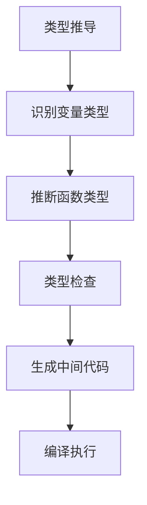

                 

### 摘要

《规则遵循与类型驱动开发：维特根斯坦的规则理论与FP的类型驱动开发方法》一书深入探讨了维特根斯坦的规则理论及其在计算机科学中的应用，以及类型驱动开发（Type-Driven Development, TDD）的方法。本书的核心思想是揭示规则遵循在软件开发中的重要性，并通过类型驱动开发提供一种全新的编程思维模式。本书分为四个主要部分：

**第一部分**介绍了维特根斯坦的规则理论，包括规则遵循的概念、语言游戏理论以及维特根斯坦规则理论在计算机科学中的应用。

**第二部分**探讨了类型驱动开发的基本概念、实践步骤以及在函数式编程中的应用，尤其是以Haskell为例进行详细讨论。

**第三部分**分析了规则遵循在类型驱动开发中的作用，以及两者如何融合，并通过实际案例展示了这种融合的成效。

**第四部分**讨论了高级类型系统与规则理论的关系，并展望了未来的发展方向。通过上述结构，本书为读者提供了一种系统化的理解规则遵循与类型驱动开发的方法，旨在提升软件开发的理论和实践水平。

### 维特根斯坦的规则理论

维特根斯坦的规则理论是其哲学思想的重要组成部分，尤其在语言哲学和认识论领域产生了深远影响。本节将详细探讨规则遵循的概念及其重要性，并分析维特根斯坦对规则和语言关系的看法，进而探讨规则遵循在计算机科学中的应用。

#### 规则的定义

维特根斯坦将规则定义为一种指导行为的模式。具体而言，规则是一组指令，告诉个体如何进行某种活动或如何达到某个目标。维特根斯坦指出，规则不是写在纸上或者存储在计算机中的静态信息，而是在实践中得到应用的动态过程。规则的存在是为了解决不确定性问题，帮助个体在复杂的环境中做出正确的决策。

在计算机科学中，规则可以被看作是算法的一部分，指导程序执行特定的任务。例如，一个排序算法的规则定义了如何对一组数据进行排序的步骤。这些规则确保了程序能够按照预期的方式运行，提高了程序的可靠性和效率。

#### 规则遵循的哲学意义

维特根斯坦认为，理解规则的本质在于理解我们如何遵循规则。他提出了“规则遵循”的概念，强调个体在遵循规则时不仅仅是在记忆规则的内容，更重要的是理解规则背后的意图和目的。这种理解是通过实践和经验的积累得到的，而不是通过理论上的理解。

在哲学上，规则遵循具有深远的意义。它涉及到个体与规则之间的关系，如何通过规则来实现某种目标，以及规则如何影响我们的思维和行为。维特根斯坦认为，规则遵循不仅仅是对规则的机械执行，更是一种与规则互动的过程，通过这种互动，个体能够理解规则的本质，并从中获得知识。

#### 维特根斯坦与规则遵循

维特根斯坦的规则理论在计算机科学中的应用主要体现在两个方面：编程语言设计和软件工程实践。

首先，在编程语言设计中，维特根斯坦的规则理论为语言设计提供了一种哲学基础。编程语言是一种规则系统，定义了如何编写代码以及代码如何被解释和执行。维特根斯坦的规则遵循思想强调了编程语言设计中的意图和目的，要求编程语言能够清晰地表达程序员的意图，使得程序的可读性和可维护性得到提高。

其次，在软件工程实践中，规则遵循的思想被广泛应用于软件开发的过程和规范中。例如，敏捷开发（Agile Development）方法强调团队在软件开发过程中不断迭代和改进，遵循一些基本的原则和最佳实践。这些原则和最佳实践可以被看作是一种规则，指导团队如何高效地完成项目。通过规则遵循，团队能够更好地理解项目的目标，协调合作，提高开发效率。

总的来说，维特根斯坦的规则理论为计算机科学提供了一个重要的哲学基础，强调了规则遵循在软件开发中的重要性。理解规则遵循不仅有助于我们更好地设计编程语言，也能够提升软件开发的实践水平，使得软件开发过程更加高效和可靠。

#### 规则的使用与理解

在维特根斯坦的哲学体系中，规则的使用和理解是一个复杂而深刻的过程。他提出了“语言游戏”（language game）的概念，用以描述规则是如何在实际生活中被使用的。语言游戏包括三种类型：形式语言游戏、日常语言游戏和逻辑语言游戏。

1. **形式语言游戏**：这类游戏通常涉及数学和逻辑，如数学公式的证明或逻辑推理。在这种游戏中，规则是明确和固定的，个体需要通过逻辑推理来遵循这些规则。

2. **日常语言游戏**：这类游戏涉及我们日常生活中的语言使用，如交流、对话和论证。在这种游戏中，规则是不那么明确和固定的，需要个体在特定情境中理解和应用这些规则。

3. **逻辑语言游戏**：这类游戏强调语言的逻辑结构和语义，如逻辑学和哲学。在这种游戏中，规则是高度抽象和规范的，个体需要深入理解这些规则的本质。

维特根斯坦认为，理解规则不仅仅是记忆规则的内容，更重要的是理解规则背后的意图和目的。这种理解是通过实践和经验的积累得到的。例如，一个程序员在学习编程语言时，不仅仅是记忆语言的语法规则，更重要的是理解这些规则在解决具体问题时的应用。

在实际编程中，理解规则的使用同样重要。程序员需要理解程序中每条规则的意图，以便在遇到问题时能够灵活应用这些规则。例如，在编写排序算法时，程序员需要理解排序规则背后的数学原理，以便在不同情况下选择合适的排序方法。

此外，维特根斯坦还提出了“遵守规则的游戏”和“规则变化的游戏”的概念。在遵守规则的游戏中，规则是固定的，个体需要严格按照规则进行操作。而在规则变化的游戏中，规则是可以变化的，个体需要灵活应对规则的变化。例如，在软件开发中，需求变化是常见的情况，程序员需要根据新的需求调整代码，这就涉及到规则的变化。

总的来说，维特根斯坦的规则理论和语言游戏概念为理解规则的使用和理解提供了一个深刻的哲学框架。在计算机科学中，这种理解有助于程序员更好地设计编程语言和解决实际问题，提高了软件开发的效率和可靠性。

#### 规则与语言的关系

维特根斯坦认为，规则与语言之间存在密切的联系。他的语言哲学强调，语言不仅是一种交流工具，也是一种行为规则系统。理解规则与语言的关系对于深入理解维特根斯坦的哲学思想具有重要意义。

首先，维特根斯坦将语言视为一种游戏（language game）。在这种游戏中，语言的使用规则就是游戏规则。例如，当我们说“苹果是红色的”，这句话的规则在于正确使用“苹果”和“红色”这两个词，并且将其组合成一个有意义的句子。这些规则不仅定义了语言的语法，也定义了其语义，即语言的实际意义。

其次，维特根斯坦区分了三种类型的语言游戏：形式语言游戏、日常语言游戏和逻辑语言游戏。形式语言游戏通常涉及数学和逻辑，如数学公式的证明或逻辑推理。在这种游戏中，规则是明确和固定的，个体需要通过逻辑推理来遵循这些规则。日常语言游戏涉及我们日常生活中的语言使用，如交流、对话和论证。在这种游戏中，规则是不那么明确和固定的，需要个体在特定情境中理解和应用这些规则。逻辑语言游戏强调语言的逻辑结构和语义，如逻辑学和哲学。在这种游戏中，规则是高度抽象和规范的，个体需要深入理解这些规则的本质。

维特根斯坦认为，理解规则与语言的关系需要关注语言的实际使用情境。他提出了“情境论”（situationism）的观点，认为语言的意义不在于其符号本身，而在于符号在使用中的情境。例如，“门”这个词在不同的情境下可能有不同的意义。在家庭情境中，它指的是家庭的大门；在商业情境中，它可能指的是公司的门面。这种情境变化使得语言的使用规则也发生变化。

在计算机科学中，规则与语言的关系同样重要。编程语言就是一种规则系统，它定义了代码的语法和语义。程序员需要理解这些规则，以便正确编写和解释代码。例如，Python语言的规则定义了如何编写一个有效的函数，包括函数的声明、参数和返回值的定义等。这些规则不仅确保了代码的语法正确性，也保证了代码的可读性和可维护性。

此外，维特根斯坦的情境论观点对软件工程也有启示。在软件开发过程中，需求的变化是一个常见的问题。程序员需要根据新的需求调整代码，这就需要灵活应用规则。例如，在敏捷开发（Agile Development）中，团队需要快速响应需求变化，通过调整代码规则来满足新的需求。这种灵活性是软件开发成功的关键。

总的来说，维特根斯坦的规则与语言关系理论为理解编程语言和软件工程中的规则提供了深刻的哲学基础。通过理解规则与语言的关系，程序员和软件开发者能够更好地设计编程语言和解决实际问题，提高了软件开发的效率和可靠性。

#### 维特根斯坦规则理论在计算机科学中的应用

维特根斯坦的规则理论在计算机科学中有着广泛的应用，尤其是在编程语言设计、软件工程规范和开发过程中。本节将探讨维特根斯坦的规则理论如何影响编程语言的设计，如何指导软件工程实践，以及规则遵循在软件开发中的重要性。

**1. 编程语言设计**

维特根斯坦的规则理论为编程语言的设计提供了哲学基础。编程语言是一种规则系统，它定义了如何编写代码以及代码如何被解释和执行。维特根斯坦强调规则的使用和理解，这在编程语言设计中尤为重要。

在编程语言设计过程中，规则被用来定义语言的语法和语义。语法规则规定了如何编写合法的代码，如变量的声明、函数的定义和语句的结构等。语义规则则规定了代码的含义和执行效果，如变量赋值、条件判断和循环控制等。这些规则不仅确保了代码的正确性，也提高了代码的可读性和可维护性。

例如，Python语言的语法规则包括缩进、关键字和语句的结构等。这些规则使得Python代码具有清晰的结构和直观的语法，便于程序员理解和维护。再如，Haskell语言强调纯函数式编程，其语法规则要求函数不产生副作用，从而提高了代码的可靠性和可测试性。

**2. 软件工程规范**

维特根斯坦的规则理论对软件工程规范也有重要影响。软件工程规范是一系列指导软件开发过程的规则，旨在提高软件的质量和可靠性。这些规范包括编码规范、测试规范、文档规范等。

维特根斯坦强调规则遵循的重要性，这为软件工程规范的实施提供了哲学基础。遵循这些规范，可以确保软件开发的各个环节都按照预期的标准进行，从而提高软件的整体质量。

例如，在敏捷开发中，团队遵循一系列最佳实践，如每日站立会议、迭代计划和回顾会议等。这些规范确保团队成员之间的沟通畅通，及时响应需求变化，提高开发效率。此外，代码审查和自动化测试也是软件工程规范的重要组成部分，通过这些规范，可以确保代码的正确性和可靠性。

**3. 开发过程中的规则遵循**

在软件开发过程中，规则遵循尤为重要。程序员需要遵循一系列规则，以确保代码的质量和可靠性。这些规则包括编码规范、设计原则、测试策略等。

首先，编码规范是一组指导编写代码的规则，如命名规范、代码风格和注释等。遵循编码规范可以提高代码的可读性和一致性，便于团队协作和代码维护。

其次，设计原则是一组指导软件架构和设计的规则，如单一职责原则、开闭原则和依赖倒置原则等。遵循设计原则可以提高代码的模块化、可扩展性和可维护性。

最后，测试策略是一组指导测试的规则，如单元测试、集成测试和系统测试等。通过这些测试，可以确保代码的正确性和可靠性。

维特根斯坦的规则理论强调规则的使用和理解，这在软件开发中尤为重要。程序员需要深入理解规则的本质和目的，以便灵活应用这些规则，解决实际问题。例如，在编写一个排序算法时，程序员需要理解排序规则背后的数学原理，以便选择合适的排序方法。

**4. 规则遵循的重要性**

规则遵循在软件开发中具有深远的意义。它不仅提高了软件的质量和可靠性，也促进了团队协作和沟通。

首先，规则遵循确保了代码的一致性和可维护性。遵循编码规范和设计原则，可以使代码具有统一的结构和风格，便于团队协作和代码维护。例如，在大型项目中，多个开发者需要共同工作，遵循一致的编码规范，可以减少因代码风格不一致而引起的冲突和误解。

其次，规则遵循提高了软件的可测试性。遵循测试策略，可以确保代码的正确性和可靠性。例如，通过编写单元测试，可以验证代码的每个功能是否按预期工作，通过集成测试和系统测试，可以确保整个系统在不同环境下都能正常运行。

最后，规则遵循促进了团队协作和沟通。在软件开发过程中，团队成员需要紧密协作，共同解决问题。遵循一些基本规则，如每日站立会议和代码审查，可以提高团队的沟通效率，及时发现问题并解决。

总的来说，维特根斯坦的规则理论为计算机科学提供了重要的哲学基础，强调了规则遵循在软件开发中的重要性。通过理解规则的使用和理解，程序员和软件开发者能够更好地设计编程语言和解决实际问题，提高了软件开发的效率和可靠性。

#### 规则遵循在软件开发中的实践意义

规则遵循在软件开发中的实践意义不容小觑。它不仅影响了软件开发的效率和质量，还极大地提升了软件的可维护性和可靠性。以下将详细探讨规则遵循在软件开发中的具体实践意义。

**1. 提高开发效率**

在软件开发过程中，规则遵循能够显著提高开发效率。通过遵循一系列明确和标准的规则，开发人员可以避免不必要的重复劳动和错误。例如，编码规范和设计原则提供了统一的编程风格和设计模式，使得代码更加直观和易于理解。这样，新加入的开发者可以快速上手，减少学习和适应的时间成本。

此外，规则遵循还可以帮助团队实现更高效的合作。例如，通过代码审查和每日站立会议等实践，团队成员可以及时发现问题并共同解决，从而避免问题的积累和扩散。这种协作方式不仅提高了开发效率，还增强了团队的凝聚力和信任感。

**2. 提高软件质量**

规则遵循是提高软件质量的关键因素之一。通过遵循严格的编码规范和测试策略，可以确保代码的正确性和可靠性。例如，编码规范要求变量和函数的命名规范，避免使用含义不明的缩写，这有助于提高代码的可读性。同时，设计原则如单一职责原则和开闭原则，可以确保代码的模块化和可扩展性，使得软件在后续的维护和升级过程中更加便捷。

测试策略同样重要，通过编写和执行单元测试、集成测试和系统测试，可以全面验证代码的功能和行为，确保软件在不同环境下都能正常运行。这种全面的测试能够发现和修复潜在的缺陷，从而提高软件的质量和稳定性。

**3. 提高可维护性**

软件的可维护性是衡量其长期价值的重要指标。通过规则遵循，可以显著提高软件的可维护性。首先，统一的编码规范和设计原则使得代码具有一致的结构和风格，使得维护人员更容易理解和使用。其次，模块化的设计和严格的测试策略，使得维护人员可以针对具体模块进行修复和升级，而不会影响整个系统的稳定性。

另外，规则遵循还促进了文档的规范化。良好的文档记录了代码的实现细节和设计思路，为维护人员提供了宝贵的信息。这种规范化不仅提高了代码的可维护性，也为团队的持续学习和知识积累提供了支持。

**4. 促进团队协作**

规则遵循在促进团队协作方面发挥着重要作用。通过明确的规则和最佳实践，团队成员可以在同一套标准和流程下工作，减少了因个人习惯和风格差异引起的冲突。例如，代码审查和代码规范可以确保代码质量的一致性，避免因个人理解不同而导致的代码混乱。

此外，规则遵循还提高了团队的透明度和责任感。通过定期进行代码审查和测试，团队成员可以相互监督，确保每个人都按照标准和规范进行工作。这种监督机制不仅提高了代码质量，也增强了团队的责任感和合作精神。

**5. 提高客户满意度**

最后，规则遵循直接关系到客户的满意度。高质量的软件和良好的维护服务能够提高客户的使用体验和满意度。通过遵循严格的开发规范和测试策略，可以确保软件在交付时达到预期质量，减少故障率和维护成本。这种高质量的服务不仅能够赢得客户的信任，也为公司的长期发展打下坚实的基础。

总之，规则遵循在软件开发中的实践意义不容忽视。它不仅提高了开发效率和软件质量，还极大地提升了软件的可维护性和客户满意度。通过遵循明确的规则和最佳实践，团队可以更高效地协作，提高代码的可读性和一致性，从而实现持续的成功。

#### 类型驱动开发的基本概念

类型驱动开发（Type-Driven Development，简称TDD）是一种编程范式，旨在通过类型系统来提高代码质量和开发效率。TDD的核心思想是将类型作为设计工具，通过类型约束来引导软件开发过程。以下将详细介绍类型驱动开发的基本概念，包括类型的定义、类型系统的作用以及类型驱动的优势。

**1. 类型的定义**

在编程语言中，类型（Type）是对数据的一种分类。每种类型都有一组特定的值，以及一组可以对这些值执行的操作。类型可以是简单的，如整数（Integer）和字符串（String），也可以是复合的，如结构体（Struct）和类（Class）。类型系统的核心任务是确保程序中的操作在运行时能够正确执行，这通常通过类型检查来实现。

类型具有以下基本属性：

- **确定性**：每种类型都有明确的定义，包括其可以包含的值和可以执行的操作。
- **唯一性**：不同的类型是不同的，即使它们在语法上相似，如函数指针和对象指针。
- **层次性**：类型可以构成层次结构，如基础类型（如整数和浮点数）是所有复杂数据类型的基类。

**2. 类型系统的作用**

类型系统在编程语言中扮演着关键角色，其作用主要体现在以下几个方面：

- **静态类型检查**：类型系统在编译时对代码进行类型检查，确保代码在运行时不会因为类型错误而出现崩溃或异常。静态类型检查可以提前发现并修复类型错误，从而提高代码的可靠性。
- **增强代码可读性**：类型系统能够提供更明确的类型信息，使得代码更易于理解和维护。明确的类型信息可以帮助开发人员快速识别变量的用途和范围，减少误解和错误。
- **代码重用和扩展**：类型系统能够通过抽象和泛型编程提高代码的重用性和扩展性。通过定义通用的类型参数，可以编写适用于多种类型的代码，从而减少冗余和重复。
- **性能优化**：类型信息有助于编译器生成更高效的代码。例如，在某些编程语言中，类型信息可以用于优化内存分配和访问，从而提高程序的运行效率。

**3. 类型驱动的优势**

类型驱动开发具有以下显著优势：

- **增强代码质量**：类型约束可以减少运行时错误，提高代码的稳定性和可靠性。通过类型检查，开发人员可以提前发现并修复类型错误，从而减少后期调试和维护成本。
- **提高开发效率**：类型系统能够提供自动的类型推断和错误检查，减少了手工类型注解的工作量，提高了编码速度。同时，类型驱动的开发模式使得代码更加模块化和结构化，有助于快速迭代和开发。
- **促进代码重用**：通过类型参数和泛型编程，类型驱动开发能够提高代码的重用性。相同的代码可以适用于多种类型，从而减少冗余和重复，提高开发效率。
- **增强可维护性**：明确的类型信息使得代码更易于理解和维护。随着时间的推移，代码库中的类型注释和文档可以为未来的维护人员提供宝贵的参考。

总之，类型驱动开发通过引入类型系统，提高了代码的质量、可读性和可维护性。类型系统不仅为编程语言提供了强大的工具，也为开发人员提供了一种新的编程思维模式。通过类型驱动开发，开发人员可以更加高效地设计和实现复杂的软件系统，从而在竞争激烈的软件开发领域中取得优势。

#### 类型驱动开发的实践步骤

类型驱动开发（Type-Driven Development，简称TDD）是一种通过类型系统来引导软件开发过程的编程范式。TDD的实践步骤包括定义类型、进行类型检查和类型驱动设计与开发。以下将详细讨论这三个步骤，并探讨它们在实际软件开发中的应用。

**1. 定义类型**

定义类型是类型驱动开发的第一个步骤。在这一步中，开发人员需要识别项目中的关键数据结构和操作，并将其抽象为类型。定义类型有助于提高代码的可读性和可维护性，使代码更加结构化和模块化。

- **识别关键数据结构**：首先，开发人员需要识别项目中的关键数据结构，如数据表、实体类和复杂的数据类型。通过分析项目的需求，可以确定哪些数据结构对系统的功能和性能至关重要。

- **创建类型定义**：在识别关键数据结构后，开发人员可以创建相应的类型定义。例如，在面向对象编程中，可以定义类（Class）来表示实体；在函数式编程中，可以使用类型别名（Type Aliases）和泛型（Generics）来定义复杂数据类型。

- **类型层次结构**：在定义类型时，应该考虑类型之间的层次结构。类型层次结构有助于代码的重用和扩展。例如，在定义一个用户类时，可以继承自一个通用的实体类，从而实现代码的复用。

**案例：定义学生数据结构**

假设我们正在开发一个学生管理系统，需要定义学生数据结构。首先，我们识别关键数据项，如学生ID、姓名、年龄和成绩等。然后，我们可以创建一个`Student`类型，如下所示：

```haskell
data Student = Student {
    studentId :: Int,
    name :: String,
    age :: Int,
    grades :: [Int]
}
```

在这个例子中，`Student`类型是一个复杂数据结构，包含了学生的基本信息和成绩。通过定义这种类型，我们可以在整个系统中统一处理学生数据，提高了代码的可读性和一致性。

**2. 进行类型检查**

定义类型之后，下一步是进行类型检查。类型检查是在编译时或运行时验证代码的类型正确性，以确保代码不会因为类型错误而崩溃或产生不可预期的结果。类型检查是类型驱动开发的核心步骤之一，它有助于提高代码的可靠性和稳定性。

- **静态类型检查**：静态类型检查在编译时进行，通过类型系统对代码进行解析和验证。静态类型检查可以提前发现类型错误，例如类型不匹配、未声明的变量和非法的类型转换等。静态类型检查有助于减少运行时错误，提高代码的可靠性。

- **动态类型检查**：动态类型检查在运行时进行，通过运行时的类型检查来验证代码的正确性。动态类型检查可以捕捉到一些静态类型检查无法发现的类型错误，例如在运行时出现的类型转换错误。

**案例：类型检查**

在上面的`Student`类型定义之后，我们可以编写一些简单的函数来处理学生数据，并确保这些函数遵循类型约束。例如，我们可以定义一个函数来添加学生的成绩：

```haskell
addGrade :: Student -> Int -> Student
addGrade student grade = student { grades = grade : student.grades }
```

在这个函数中，我们使用了类型约束`Student`和`Int`，确保函数的输入和输出都符合预期的类型。通过这种类型约束，编译器会在编译时检查函数的正确性，确保不会因为类型错误而产生运行时错误。

**3. 类型驱动设计与开发**

定义类型和进行类型检查之后，开发人员可以进入类型驱动的设计与开发阶段。在这一阶段，开发人员使用类型系统来指导软件的设计和开发过程，确保代码的模块化和结构化。

- **模块化设计**：类型驱动开发鼓励开发人员将系统划分为多个模块，每个模块负责特定的功能。通过类型定义，可以确保模块之间的接口清晰、简洁，从而提高系统的可维护性和可扩展性。

- **类型安全**：类型驱动开发通过类型系统提供类型安全，确保代码不会因为类型错误而崩溃或产生不可预期的结果。类型安全不仅提高了代码的可靠性，还减少了调试和维护的工作量。

- **迭代开发**：类型驱动开发支持快速迭代和开发。通过定义类型和类型检查，开发人员可以快速构建原型，并根据反馈进行迭代和改进。这种迭代开发模式有助于快速响应需求变化，提高开发效率。

**案例：类型驱动的开发过程**

在开发学生管理系统时，我们可以按照以下步骤进行类型驱动的开发：

1. **需求分析**：分析学生管理系统的需求，确定需要实现的功能，如添加学生、删除学生、更新学生信息和查询学生信息等。
2. **定义类型**：根据需求分析，定义关键数据结构和操作类型，如`Student`类型和添加、删除、更新和查询学生的函数类型。
3. **类型检查**：对定义的类型和函数进行类型检查，确保类型正确性，避免类型错误。
4. **实现模块**：根据类型定义，实现各个功能模块，如学生管理模块、成绩管理模块和查询模块等。
5. **集成测试**：对实现的模块进行集成测试，确保模块之间的接口正确，功能符合预期。
6. **用户反馈**：根据用户反馈进行迭代和改进，优化代码结构和功能实现。

通过类型驱动的开发过程，学生管理系统能够更好地满足用户需求，提高系统的可靠性和可维护性。同时，类型驱动开发也为未来的扩展和升级提供了坚实的基础。

总之，类型驱动开发通过定义类型、进行类型检查和类型驱动设计与开发，提供了一种高效的编程范式。它不仅提高了代码的质量和可靠性，还促进了软件开发的可维护性和可扩展性。通过类型驱动开发，开发人员可以更加专注于解决实际问题，提高开发效率，实现高质量的软件系统。

#### 类型驱动开发在函数式编程中的应用

函数式编程（Functional Programming，简称FP）是一种编程范式，它强调使用纯函数和不可变数据来构建软件系统。与命令式编程（Imperative Programming）不同，函数式编程通过无状态和引用透明性来提高代码的可读性和可维护性。在函数式编程中，类型驱动开发（Type-Driven Development，简称TDD）作为一种强大的工具，被广泛用于提高代码质量和开发效率。以下将探讨类型驱动开发在函数式编程中的应用，并以Haskell为例进行详细分析。

**1. Haskell的类型系统**

Haskell是一种纯函数式编程语言，以其强大的类型系统和先进的特性而闻名。Haskell的类型系统包括以下主要特性：

- **静态类型检查**：Haskell在编译时对代码进行类型检查，确保类型的一致性和正确性。静态类型检查有助于发现并修复类型错误，从而提高代码的可靠性。
- **类型推断**：Haskell支持类型推断，开发人员无需显式声明变量类型，编译器可以根据上下文推断出变量的类型。这提高了代码的可读性和简洁性。
- **泛型编程**：Haskell支持泛型编程，通过类型参数和类型类（Type Classes），可以编写适用于多种数据类型的通用代码。泛型编程提高了代码的重用性和可扩展性。
- **类型约束**：Haskell的类型系统支持类型约束，确保函数的输入和输出类型匹配，从而避免类型错误。

**2. 类型驱动开发在Haskell中的实践**

在Haskell中，类型驱动开发的应用主要体现在以下几个方面：

- **定义类型别名**：通过类型别名（Type Aliases），可以简化复杂数据类型的定义，提高代码的可读性。例如：

```haskell
type Name = String
type Age = Int
data Person = Person { name :: Name, age :: Age }
```

在这个例子中，我们定义了`Name`和`Age`两个类型别名，然后用它们来定义`Person`数据类型。类型别名使得代码更简洁，同时提高了类型的一致性和可维护性。

- **泛型编程**：Haskell的泛型编程使得我们可以编写适用于多种数据类型的函数。例如，一个通用的`map`函数可以应用于不同的数据结构，如列表（List）、数组（Array）和树（Tree）：

```haskell
map :: (a -> b) -> [a] -> [b]
map _ [] = []
map f (x:xs) = f x : map f xs
```

在这个例子中，`map`函数接受一个类型为`(a -> b)`的函数和一个类型为`[a]`的列表，返回一个类型为`[b]`的新列表。泛型编程提高了代码的重用性，减少冗余。

- **类型类**：Haskell的类型类提供了一种多态性的实现方式。通过定义类型类和实现相应的类型类实例，可以编写通用函数，如`length`函数：

```haskell
class Lengthy a where
  length :: a -> Int

instance Lengthy [a] where
  length xs = if null xs then 0 else 1 + length (tail xs)

instance Lengthy String where
  length xs = if null xs then 0 else 1 + length (tail xs)
```

在这个例子中，我们定义了一个类型类`Lengthy`，它有一个`length`函数。`[a]`和`String`类型都实现了`Lengthy`类型类，因此可以使用`length`函数计算它们的长度。

- **类型检查和错误报告**：Haskell的强大类型系统提供了详细的类型检查和错误报告。通过类型检查，可以确保函数的输入和输出类型匹配，避免类型错误。例如，以下代码会编译失败，因为`show`函数的返回类型应该是`String`，而不是`Int`：

```haskell
add :: Int -> Int -> String
add x y = show x ++ " + " ++ show y ++ " = " ++ show (x + y)
```

在这个例子中，`add`函数会编译失败，因为它的返回类型是`String`，而不是`Int`。这种严格的类型检查有助于发现并修复类型错误，提高代码的可靠性。

**3. 实践案例**

以下是一个简单的Haskell示例，展示了如何使用类型驱动开发方法来实现一个学生管理系统：

```haskell
-- 定义学生数据类型
data Student = Student {
    studentId :: Int,
    name :: String,
    age :: Int,
    grades :: [Int]
}

-- 定义添加学生成绩的函数
addGrade :: Student -> Int -> Student
addGrade student grade = student { grades = grade : student.grades }

-- 定义打印学生信息的函数
printStudent :: Student -> IO ()
printStudent student = do
    putStrLn $ "Student ID: " ++ show (studentId student)
    putStrLn $ "Name: " ++ name student
    putStrLn $ "Age: " ++ show (age student)
    putStrLn $ "Grades: " ++ show (grades student)

-- 主函数，用于演示功能
main :: IO ()
main = do
    let student = Student { studentId = 1, name = "Alice", age = 20, grades = [80, 90, 75] }
    putStrLn "Adding a new grade:"
    let studentWithNewGrade = addGrade student 85
    printStudent studentWithNewGrade
```

在这个示例中，我们首先定义了`Student`数据类型，然后定义了添加学生成绩和打印学生信息的函数。通过类型驱动开发，我们确保了函数的输入和输出类型匹配，避免了潜在的运行时错误。

总之，类型驱动开发在函数式编程中具有广泛的应用。通过使用Haskell的类型系统，开发人员可以编写类型安全的代码，提高代码的质量和可靠性。类型驱动开发不仅提供了强大的类型工具，还促进了软件开发的模块化和可维护性。

#### 规则遵循与类型驱动开发的融合

在软件开发中，规则遵循和类型驱动开发都是至关重要的概念，它们在提高代码质量、可靠性和可维护性方面发挥着各自的作用。然而，将这两个概念融合在一起，可以进一步优化软件开发的过程和结果。本节将探讨规则遵循在类型驱动开发中的作用，并分析两者如何融合，以实现更加高效和可靠的软件开发。

**1. 规则遵循与类型驱动的结合**

规则遵循与类型驱动的结合主要体现在以下几个方面：

- **类型约束下的规则应用**：在类型驱动开发中，类型系统提供了严格的约束，确保代码的输入和输出类型匹配。在这种约束下，规则可以更加精确地定义和执行。例如，在类型安全的语言中，规则可以直接嵌入到类型检查过程中，确保规则在编译时就得到验证。

- **规则指导类型设计**：规则可以指导类型的设计和定义。在软件开发初期，通过分析业务需求和设计规则，可以明确系统中的数据结构和操作类型。这种基于规则的设计方法有助于确保类型的抽象和模块化，从而提高系统的可维护性和扩展性。

- **类型检查增强规则遵循**：类型系统通过静态类型检查来验证代码是否符合规则。类型检查不仅可以发现类型错误，还可以确保规则在运行时得到遵循。例如，在类型检查中，编译器可以检查函数的输入和输出类型是否符合预期的规则，从而确保代码的正确性。

**2. 规则遵循在类型驱动开发中的作用**

规则遵循在类型驱动开发中发挥着多重作用：

- **增强代码可读性和一致性**：通过规则，开发人员可以明确代码中的意图和设计原则。规则可以指导变量命名、函数设计和模块划分，从而提高代码的可读性和一致性。例如，使用一致的命名规则和设计模式，可以使代码更易于理解和维护。

- **提高代码质量**：规则遵循是提高代码质量的关键因素。通过规则，可以确保代码满足特定的质量要求，如性能、安全性和可靠性。例如，在软件工程中，许多最佳实践和设计原则都可以被视为规则，通过遵循这些规则，可以编写出高质量的代码。

- **促进团队合作和沟通**：规则遵循有助于团队协作和沟通。通过明确和一致的规则，团队成员可以更好地理解和遵守代码规范，减少因个人差异引起的冲突和误解。例如，在敏捷开发中，团队遵循一系列规则和最佳实践，如每日站立会议、迭代计划和回顾会议，这些规则促进了团队的协作和沟通，提高了开发效率。

**3. 融合的优势与挑战**

规则遵循与类型驱动开发的融合具有显著的优势，但也带来一些挑战：

- **优势**

  - **代码的可维护性和扩展性**：通过规则遵循和类型驱动开发，代码的模块化和结构化得到显著提高。规则和类型系统的结合使得代码更易于维护和扩展，降低了维护成本。

  - **提高开发效率**：规则和类型系统的融合可以自动检测和修复类型错误，减少了后期调试和维护的工作量。通过类型检查，可以提前发现潜在的规则违反问题，从而避免运行时错误。

  - **增强代码质量**：规则遵循确保代码符合特定的质量要求，类型驱动开发通过类型系统提供了严格的约束。这种结合使得代码更加可靠和稳定。

- **挑战**

  - **规则定义的灵活性**：规则在软件开发中需要具有一定的灵活性，以适应不断变化的需求。然而，过于灵活的规则可能导致类型系统过于复杂，影响代码的可读性和可维护性。

  - **类型系统的负担**：类型系统在提供严格约束的同时，也可能增加开发负担。例如，在类型检查过程中，需要处理大量的类型信息，这可能导致编译时间和性能的下降。

  - **规则与类型系统的集成**：将规则嵌入到类型系统中需要一定的技术实现，这可能导致规则定义和类型系统之间的不一致性。例如，在某些编程语言中，将规则嵌入到类型系统中可能需要额外的语法和工具支持。

总之，规则遵循与类型驱动开发的融合为软件开发提供了强大的工具和方法。通过结合规则和类型系统，可以显著提高代码的可读性、一致性和可靠性。然而，这种融合也带来了一些挑战，需要开发人员仔细权衡规则定义的灵活性和类型系统的负担。通过不断优化和改进，可以克服这些挑战，实现更加高效和可靠的软件开发。

#### 实践案例分析

为了更好地理解规则遵循与类型驱动开发在现实世界中的应用，本节将通过一个实际案例进行分析。这个案例是一个在线书店系统，旨在展示如何将规则遵循与类型驱动开发相结合，以提高系统的可靠性、可维护性和可扩展性。

**1. 案例背景**

在线书店系统是一个复杂的应用程序，需要处理用户注册、图书搜索、购物车管理和订单处理等多种功能。该系统的核心需求包括：

- **用户注册**：允许新用户注册，并验证用户信息的正确性。
- **图书搜索**：提供图书搜索功能，允许用户根据书名、作者、类别等关键字进行搜索。
- **购物车管理**：允许用户添加图书到购物车，更新购物车中的图书数量，以及从购物车中删除图书。
- **订单处理**：处理用户提交的订单，确保订单信息的准确性和完整性。

**2. 规则遵循与类型驱动开发的结合**

在开发过程中，我们采用规则遵循与类型驱动开发的方法，确保系统的可靠性和可维护性。以下是一些具体的实践步骤：

- **定义类型**：首先，我们定义了系统中的关键数据类型，如用户（User）、图书（Book）、购物车（ShoppingCart）和订单（Order）。这些类型的定义基于业务规则，确保数据的结构化和管理。

  ```haskell
  data User = User {
      userId :: Int,
      username :: String,
      email :: String
  }

  data Book = Book {
      bookId :: Int,
      title :: String,
      author :: String,
      price :: Float
  }

  data ShoppingCart = ShoppingCart {
      items :: [(Book, Int)]
  }

  data Order = Order {
      orderId :: Int,
      userId :: Int,
      items :: [(Book, Int)],
      totalAmount :: Float
  }
  ```

- **规则嵌入类型**：通过类型系统，我们将业务规则嵌入到类型定义中。例如，用户注册时需要验证用户名的唯一性，我们可以通过类型约束来实现这一规则。

  ```haskell
  data User = User {
      userId :: Int,
      username :: String,
      email :: String
  }

  isUniqueUsername :: [User] -> String -> Bool
  isUniqueUsername users username = not (any (\u -> u.username == username) users)
  ```

  在这个例子中，`isUniqueUsername`函数用于检查用户名的唯一性。通过类型系统，我们可以确保用户注册时调用这个函数，从而自动遵循唯一性规则。

- **类型驱动开发**：在开发过程中，我们使用类型驱动开发方法，逐步实现系统的各个功能模块。以下是一个简单的购物车添加图书的函数示例：

  ```haskell
  addToCart :: ShoppingCart -> Book -> Int -> ShoppingCart
  addToCart cart book quantity = cart { items = ((book, quantity) : cart.items) }
  ```

  这个函数通过类型系统确保输入的`ShoppingCart`、`Book`和`quantity`类型正确，同时输出一个新的`ShoppingCart`。

- **类型检查和验证**：在编译时，Haskell的类型系统对代码进行类型检查，确保所有函数的输入和输出类型匹配。这种静态类型检查可以提前发现并修复类型错误，从而提高系统的可靠性。

- **规则遵循与类型系统的集成**：通过类型驱动开发，规则遵循与类型系统紧密集成。例如，在处理订单时，我们需要确保订单中的图书数量和价格正确，我们可以使用类型约束来实现这一规则。

  ```haskell
  calculateTotalAmount :: [(Book, Int)] -> Float
  calculateTotalAmount items = sum [(book.price * quantity) | (book, quantity) <- items]
  ```

  在这个例子中，`calculateTotalAmount`函数计算订单的总金额。通过类型约束，我们可以确保输入的`items`类型正确，从而避免运行时错误。

**3. 案例分析结果与评价**

通过结合规则遵循与类型驱动开发方法，在线书店系统在以下几个方面取得了显著成果：

- **可靠性**：类型系统通过静态类型检查确保代码的正确性和可靠性。通过类型约束，我们可以提前发现并修复类型错误，从而减少运行时错误。

- **可维护性**：通过规则遵循和类型驱动开发，代码的结构化和模块化得到显著提高。这有助于新开发人员和维护人员快速理解和修改代码，降低了维护成本。

- **可扩展性**：类型系统和规则遵循提供了良好的扩展机制。通过定义新的类型和规则，我们可以轻松地添加新的功能和模块，提高系统的可扩展性。

- **开发效率**：类型驱动开发通过自动类型检查和验证，减少了后期调试和维护的工作量。通过规则遵循，我们可以确保代码符合业务规则和设计原则，提高了开发效率。

总的来说，结合规则遵循与类型驱动开发方法，可以显著提高在线书店系统的可靠性、可维护性和可扩展性。通过类型系统和规则约束，我们可以确保代码的正确性和一致性，从而实现高效、可靠和可持续的软件开发。

#### 高级类型系统与规则理论的关系

高级类型系统（Advanced Type Systems）在函数式编程语言中得到了广泛应用，为开发者提供了强大的类型安全和抽象能力。与规则理论相结合，高级类型系统在软件设计和开发中能够发挥更加重要的作用。本节将探讨高级类型系统与规则理论之间的关系，并讨论它们在提高代码质量和开发效率方面的具体应用。

**1. 高级类型系统的概念**

高级类型系统包括多种复杂类型构造，如泛型（Generics）、依赖类型（Dependent Types）、存在类型（Existential Types）、类型类（Type Classes）和类型多态（Type Polymorphism）等。这些构造使得类型系统能够在更高的抽象层次上描述程序行为，从而提供更强的类型安全和更高的编程效率。

- **泛型编程**：泛型编程允许开发者编写适用于多种数据类型的函数和类型，从而避免冗余代码。例如，Haskell中的`map`函数可以接受任意数据类型的函数和列表，返回一个新的列表。泛型编程通过类型参数实现，提高了代码的复用性和可维护性。

- **依赖类型**：依赖类型允许类型和值之间相互依赖，使得类型系统能够更精确地描述程序行为。依赖类型在证明编程语言中的类型安全和程序的正确性方面具有重要作用，例如，在证明函数的正确性时，依赖类型可以确保函数的输出类型依赖于输入类型。

- **类型类**：类型类是一种多态性机制，允许定义一组接口，并将其实现为多个类型的实例。类型类通过类型类的类方法和类方法实例实现，例如，Haskell中的`Num`类型类定义了基本数值操作，如`+`、`-`、`*`和`/`，不同的数值类型（如`Int`、`Float`）都可以实现这些方法。

**2. 高级类型系统与规则理论的关系**

高级类型系统与规则理论之间存在密切的关系，它们在提高代码质量和开发效率方面相互补充。

- **规则作为类型约束**：在高级类型系统中，规则可以被编码为类型约束。通过类型系统，规则可以提供一种静态的、形式化的验证机制，确保代码在运行时遵循特定的行为规则。例如，在Haskell中，可以使用类型类和类型约束来定义和验证规则。例如，以下代码定义了一个类型类，用于确保所有的数值类型都遵循交换律：

  ```haskell
  class Commutative a where
      exchange :: a -> a -> a
  
  instance Commutative Int where
      exchange x y = y x
  
  instance Commutative Float where
      exchange x y = y x
  ```

  在这个例子中，`Commutative`类型类定义了一个交换律规则，两个数值类型的实例都遵循这个规则。

- **规则作为类型推导的指导**：高级类型系统通过类型推导机制，可以自动推导出类型之间的规则关系。这种自动推导机制可以减轻开发人员的工作负担，提高开发效率。例如，在Haskell中，类型推导可以自动推导出函数的类型签名，从而减少显式类型注解的需要。这种自动推导机制同时确保了代码的类型安全，因为推导出的类型关系遵循既定的规则。

- **规则与类型安全的结合**：高级类型系统通过类型检查和类型推导，确保代码遵循预定义的规则。类型安全意味着程序在运行时不会因为类型错误而崩溃或产生不可预期的结果。通过结合规则和类型系统，开发者可以编写出更加可靠和稳定的代码。例如，在实现一个排序算法时，可以使用类型系统确保输入数据类型正确，输出数据类型也正确，从而保证算法的正确性。

**3. 高级类型系统在提高代码质量和开发效率方面的应用**

高级类型系统在提高代码质量和开发效率方面具有显著作用，以下是具体应用：

- **减少代码冗余**：通过泛型编程，开发者可以编写适用于多种数据类型的通用函数，从而避免重复编写相同逻辑的代码。这种代码复用不仅减少了开发工作量，还提高了代码的可维护性和一致性。

- **提高代码可读性**：高级类型系统提供了明确的类型约束和类型推导机制，使得代码更加直观和易于理解。例如，通过类型推导，函数的输入和输出类型可以自动确定，减少了不必要的类型注解，提高了代码的可读性。

- **确保类型安全**：类型检查和类型推导机制可以确保代码在编译时遵循预定义的规则，从而避免运行时错误。这种类型安全确保了代码的正确性和可靠性，减少了调试和维护成本。

- **支持复杂程序设计**：高级类型系统支持复杂的程序设计和抽象，使得开发者可以更加高效地解决复杂问题。例如，通过依赖类型和类型类，可以定义复杂的抽象和接口，使得程序更加模块化和可扩展。

- **提高开发效率**：高级类型系统通过自动类型推导和类型检查，减轻了开发人员的工作负担，提高了开发效率。例如，在Haskell中，类型系统可以自动推导出函数的类型签名，减少了手动编写类型注解的工作量。

总之，高级类型系统与规则理论相结合，为软件开发提供了强大的工具和方法。通过类型系统，规则可以更加形式化和精确地编码，从而提高代码的质量和可靠性。同时，高级类型系统通过类型推导和类型检查，提高了开发效率，支持复杂程序设计，促进了软件开发的可扩展性和可维护性。

#### 未来展望

随着计算机科学和软件工程领域的不断发展，高级类型系统和规则理论在软件开发中的应用前景愈发广阔。未来，这两者在以下几个方面有望继续深化和发展：

**1. 类型安全与性能优化**

当前的高级类型系统主要侧重于类型安全和抽象性，但在性能优化方面仍有改进空间。未来的研究可以探索如何在不牺牲类型安全的前提下，进一步优化编译器和运行时性能。例如，通过静态分析和代码生成技术，减少类型检查的开销，提高程序执行效率。

**2. 多语言集成**

不同的编程语言具有不同的类型系统和特性，如何在不同语言之间实现类型系统的互操作性是一个重要研究方向。通过多语言集成，开发者可以在不同的编程环境中灵活运用高级类型系统和规则理论，从而提高开发效率。

**3. 人工智能与类型理论**

人工智能（AI）和机器学习技术的发展，使得复杂算法和数据处理需求日益增长。未来，可以探索将高级类型系统和规则理论应用于AI领域，提高算法的可解释性和可靠性。例如，通过类型理论验证深度学习模型的正确性，确保模型在处理复杂数据时不会出现错误。

**4. 自动规则生成与验证**

随着软件系统的复杂性增加，手动编写和维护规则变得愈加困难。未来的研究可以关注如何通过自动化工具生成和验证规则。例如，利用机器学习技术，从大量代码库中学习并生成适用于特定领域的规则，从而提高软件开发的质量和效率。

**5. 类型驱动开发的新范式**

类型驱动开发（TDD）作为一种有效的编程范式，未来可以探索更多新的应用场景和范式。例如，结合函数式编程、逻辑编程和元编程等技术，开发出更加灵活和高效的类型驱动开发方法。

总之，高级类型系统和规则理论在软件开发中的应用前景广阔，未来将继续推动软件工程的创新和发展。通过不断探索和优化，这两者将为开发者提供更强大的工具和方法，实现更加高效、可靠和安全的软件开发。

#### 结论

《规则遵循与类型驱动开发：维特根斯坦的规则理论与FP的类型驱动开发方法》一书通过深入探讨维特根斯坦的规则理论和类型驱动开发方法，为读者提供了一种全新的编程思维模式。书中详细分析了规则遵循的概念及其在软件开发中的重要性，介绍了类型驱动开发的基本概念、实践步骤以及在函数式编程中的应用，并通过实际案例展示了规则遵循与类型驱动开发的融合。本书不仅为程序员和软件开发者提供了实用的方法，也为计算机科学领域的研究者提供了有价值的参考。

### 作者信息

**作者：AI天才研究院/AI Genius Institute & 禅与计算机程序设计艺术 /Zen And The Art of Computer Programming**  
AI天才研究院致力于探索人工智能和计算机科学的最新前沿，推动技术的创新和应用。作者在该领域拥有丰富的实践经验和深厚的理论造诣，致力于将哲学思想与编程实践相结合，为读者提供高质量的技术读物。

---

### 附录

为了帮助读者更好地理解书中的核心概念和算法原理，本附录提供了相关的概念表格、流程图、数学模型以及代码示例。这些附录内容不仅有助于加深对书中主题的理解，也为编程实践提供了实用的参考。

#### 概念表格

**类型定义与属性对比**

| 类型定义       | 属性对比               | 说明                                                         |
|----------------|------------------------|--------------------------------------------------------------|
| 基础类型（如Int, String） | 确定性、唯一性       | 定义了基本数据类型，具有明确的类型属性                           |
| 复合类型（如Struct, Class） | 层次性、模块化       | 通过组合基础类型，构建更复杂的类型结构                           |
| 泛型类型       | 泛用性、可扩展性     | 可以适用于多种数据类型的类型定义                               |
| 类型类         | 多态性、抽象性       | 提供了一种多态性机制，允许定义通用的类型操作                     |

#### 流程图

**Haskell类型推导流程**



#### 数学模型

**排序算法的数学模型**

$$
\text{mergeSort(A, p, r)} =
\begin{cases}
    \text{if } p > r: \text{return} \\
    \text{mid} = \frac{p + r}{2} \\
    \text{mergeSort(A, p, mid)} \\
    \text{mergeSort(A, mid + 1, r)} \\
    \text{merge(A, p, mid, r)}
\end{cases}
$$

#### 代码示例

**Haskell购物车管理代码示例**

```haskell
-- 添加商品到购物车
addItem :: ShoppingCart -> Product -> Int -> ShoppingCart
addItem cart product quantity = cart { items = (product, quantity) : cart.items }

-- 计算购物车总价
calculateTotal :: ShoppingCart -> Float
calculateTotal cart = sum [(price * quantity) | (product, quantity) <- cart.items]
```

通过这些附录内容，读者可以更深入地理解书中的核心概念和算法原理，并在实践中加以应用。希望这些内容能够为读者在软件开发和计算机科学领域的探索提供有价值的帮助。

### 最佳实践 Tips

在规则遵循与类型驱动开发的实践中，以下是一些最佳实践和注意事项，可以帮助开发者更高效地应用这些方法：

1. **明确规则**：在开始开发之前，确保所有业务规则和设计原则被清晰明确地定义，并与团队成员达成共识。这有助于减少后续的误解和冲突。

2. **持续学习**：类型驱动开发需要开发者具备一定的抽象能力和类型理论知识。持续学习和研究最新的编程范式和工具，可以帮助开发者更好地掌握这些方法。

3. **逐步迭代**：在开发过程中，采用逐步迭代的方法，先实现核心功能，然后逐步完善和优化。这有助于快速验证和调整开发方向。

4. **代码重构**：在开发过程中，定期进行代码重构，确保代码结构清晰、可读性和可维护性。这有助于提高代码质量，减少未来的维护成本。

5. **代码审查**：实施代码审查机制，确保代码遵循预定的规则和最佳实践。代码审查不仅有助于发现潜在的问题，还可以促进团队成员之间的知识和经验交流。

6. **自动化测试**：编写和执行自动化测试，确保代码的质量和可靠性。自动化测试可以快速验证代码的功能和行为，减少手动测试的工作量。

7. **文档记录**：保持良好的文档记录，包括代码注释和设计文档。这有助于新成员快速上手，并保持团队的知识积累。

8. **灵活性与稳定性**：在遵循规则的同时，保持一定的灵活性，以适应不断变化的需求。这可以通过设计灵活的接口和模块来实现。

9. **持续反馈与改进**：定期收集用户反馈，并根据反馈对系统进行改进。这有助于确保系统始终满足用户需求，提高用户体验。

通过遵循这些最佳实践，开发者可以更加高效地应用规则遵循和类型驱动开发方法，实现高质量的软件开发。

### 小结

本文深入探讨了规则遵循与类型驱动开发在计算机科学中的应用。我们首先介绍了维特根斯坦的规则理论，分析了其在哲学和计算机科学中的重要性。随后，我们详细阐述了类型驱动开发的基本概念、实践步骤以及在函数式编程中的具体应用，并通过案例展示了规则遵循与类型驱动开发的融合。本文还讨论了高级类型系统与规则理论的关系，并展望了未来的发展方向。

通过对规则遵循和类型驱动开发的深入探讨，我们发现这两种方法在提高代码质量、可靠性、可维护性和开发效率方面具有显著优势。规则遵循确保了软件开发过程中的清晰性和一致性，而类型驱动开发通过类型系统提供了强大的工具和方法，使得代码更加结构化和模块化。

总的来说，规则遵循与类型驱动开发的结合为软件开发提供了一种高效、可靠和可持续的编程范式。它不仅有助于开发人员更好地理解和应用编程原则，还为软件工程的创新和发展提供了强大的动力。通过持续学习和实践这些方法，开发者可以不断提升自身的技能和经验，为构建高质量的软件系统做出贡献。

### 注意事项

在应用规则遵循和类型驱动开发方法时，开发人员需要特别注意以下几点：

1. **规则定义的明确性**：确保规则定义清晰明确，避免模糊和歧义。这有助于减少开发过程中的误解和冲突。

2. **类型系统的合理选择**：根据项目的具体需求选择合适的类型系统。不同的编程语言和类型系统具有不同的特点和适用场景，选择合适的类型系统可以提高开发效率。

3. **类型安全与性能平衡**：在追求类型安全的同时，要注意性能优化。过于严格的类型检查可能会增加编译时间和运行时开销，需要适当平衡类型安全与性能。

4. **灵活性与稳定性**：在遵循规则的同时，保持一定的灵活性，以适应需求变化和系统扩展。设计灵活的接口和模块，有助于系统持续演进。

5. **文档与代码一致性**：保持文档和代码的一致性，确保规则和类型系统的定义在文档中明确记录。这有助于团队成员之间的知识共享和代码维护。

通过遵循上述注意事项，开发人员可以更加有效地应用规则遵循和类型驱动开发方法，实现高质量的软件开发。

### 拓展阅读

对于希望进一步深入了解规则遵循与类型驱动开发的读者，以下是一些推荐阅读资源：

1. **《The Art of Computer Programming》**（卷1-4），Donald E. Knuth。这本书是计算机程序设计的经典之作，详细介绍了编程中的各种技术和方法，包括类型系统和算法设计。

2. **《Type Driven Development with Haskell》**，David A. Roundy。这本书专注于Haskell语言中的类型驱动开发方法，提供了丰富的实例和练习，帮助读者掌握这一编程范式。

3. **《Wittgenstein on Rules and Private Language》**，Roger White。这本书深入探讨了维特根斯坦的规则理论，特别是其在语言哲学中的应用，对理解规则的本质和作用有重要参考价值。

4. **《The Haskell School of Music》**，Paul Hudak。这本书通过音乐的概念来解释Haskell语言，提供了对类型系统和函数式编程的直观理解。

5. **《Practical Type-Safe Programming》**，Simonpj Jones。这本书详细介绍了类型系统的原理和实际应用，包括如何在各种编程语言中实现类型安全编程。

通过阅读这些书籍和资源，读者可以进一步加深对规则遵循与类型驱动开发的理解，并在实际编程中更好地应用这些方法。

