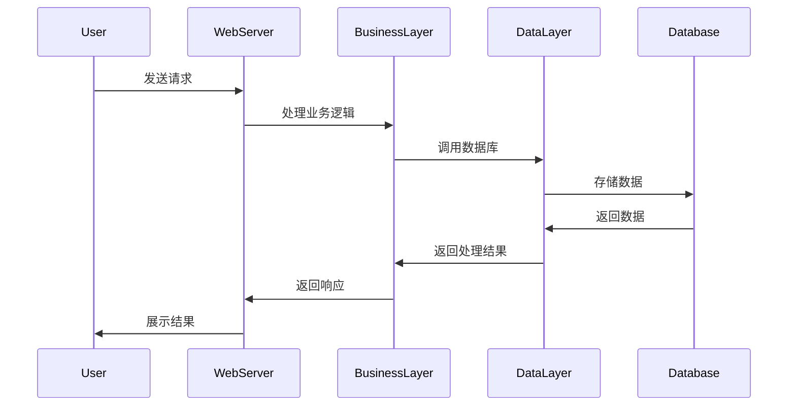

                 

### 前言

《警惕坏的编码习惯》这本书的诞生，源于我们对软件工程领域的深刻洞察和多年实践经验的总结。在软件开发过程中，编码习惯的作用不容小觑。它不仅影响代码质量，还直接关系到项目的开发效率和团队协作。然而，现实情况是，许多开发者在编码过程中养成了不良习惯，这不仅降低了代码的可维护性，还可能导致项目的失败。

本书的目的在于揭示这些坏编码习惯的危害，并提供系统化的解决方案。通过深入分析编码习惯的核心概念和属性特征，我们希望能帮助读者认识到这些问题的严重性，并采取有效措施进行纠正。此外，书中还提供了最佳实践和实际案例，以帮助读者更好地理解和应用这些原则。

编写这本书的意义不仅在于提升个体开发者的编码水平，还在于推动整个软件开发行业向更加高效、规范的方向发展。让我们一步一步思考，深入探讨这些坏编码习惯的根源，并提出切实可行的解决方案。通过这样的探索，我们希望能为读者带来实际的收获，助力他们在编码的道路上走得更远。

### 编码习惯概述

#### 1.1 编码习惯的概念

编码习惯是指在软件开发过程中，开发者遵循的一系列常规做法和技巧。这些习惯可能包括代码书写格式、命名规则、注释习惯、测试方法等。编码习惯的形成往往源于个人的编程经验、团队规范以及文化背景。良好的编码习惯可以提高代码的可读性、可维护性和可扩展性，从而提高开发效率。

#### 1.2 编码习惯的重要性

编码习惯对软件开发的影响是深远且广泛的。良好的编码习惯可以带来以下几个方面的好处：

1. **提升代码质量**：一致的代码风格和规范能够减少代码中的错误，提高代码的整体质量。
2. **提高开发效率**：开发者可以快速理解和修改他人的代码，减少沟通成本和时间。
3. **增强团队合作**：一致的编码习惯有助于团队成员之间的协作，提高团队整体的生产力。
4. **降低维护成本**：良好的编码习惯使得代码易于理解和修改，从而降低了未来的维护成本。
5. **促进职业发展**：养成良好的编码习惯是成为一名优秀开发者的重要步骤，有助于提升个人在职场中的竞争力。

然而，现实中许多开发者却未能重视编码习惯的培养，这导致了诸多问题。接下来，我们将进一步探讨编码习惯的现状和常见问题。

#### 1.3 编码习惯的现状

当前软件开发行业中，编码习惯的现状并不乐观。以下是一些常见的问题：

1. **代码风格不一致**：不同开发者遵循的编码规范不同，导致代码风格杂乱无章，难以阅读。
2. **缺乏注释**：代码缺乏必要的注释，使得代码的可读性大大降低。
3. **代码冗余和复杂**：许多开发者为了追求效率，编写大量冗余和复杂的代码，导致代码难以维护。
4. **忽视单元测试**：单元测试的缺失使得代码的可靠性和稳定性得不到保障。
5. **缺乏代码重构**：长时间未进行代码重构，使得代码结构混乱，难以适应新的需求。

这些问题的存在不仅影响了项目的开发进度和质量，还增加了团队的沟通成本和维护难度。因此，识别和纠正这些坏编码习惯显得尤为重要。

#### 1.4 编码习惯问题的来源

编码习惯问题的产生有多个方面的原因：

1. **个人习惯**：开发者个人的编程习惯和风格不同，缺乏统一的标准。
2. **团队文化**：团队缺乏明确的编码规范和指导，团队成员之间的沟通不畅。
3. **技术发展**：新技术的不断涌现，使得开发者在学习新技能的同时，往往忽略了编码习惯的培养。
4. **时间压力**：开发项目的时间紧迫，使得开发者往往只关注短期内的工作效率，忽视了编码习惯的重要性。

了解编码习惯问题的来源，有助于我们更有针对性地采取改进措施。接下来，我们将深入探讨编码习惯的核心概念、属性特征及其相互关系。

### 第2章：核心概念与联系

在深入探讨编码习惯之前，我们首先需要了解一些核心概念及其相互关系。编码习惯不仅仅是一种个人行为，它涉及到多个层面的要素，包括代码质量、代码可读性、代码维护性等。

#### 2.1 编码习惯的核心概念

编码习惯的核心概念包括以下几个方面：

1. **代码质量**：代码质量是编码习惯的重要评价指标。高质量的代码应该具有简洁、清晰、易于理解和修改的特点。常见的衡量标准包括代码的复杂性、冗余度、可读性和可维护性。

2. **代码可读性**：代码的可读性直接影响开发者的工作效率。高可读性的代码通常具有良好的命名习惯、规范的代码结构和详细的注释。

3. **代码维护性**：代码的维护性关系到项目的长期稳定性。良好的编码习惯有助于减少代码的故障率和维护成本。

4. **代码风格**：代码风格是编码习惯的外在表现。一致的代码风格可以提高代码的可读性和可维护性。

5. **单元测试**：单元测试是编码习惯的重要组成部分。通过单元测试，可以确保代码的正确性和可靠性。

6. **代码重构**：代码重构是编码习惯的一种体现。定期进行代码重构，可以保持代码的整洁和高效。

#### 2.2 编码习惯的属性特征对比表格

为了更直观地理解编码习惯的属性特征，我们可以通过以下表格进行对比：

| 属性特征 | 说明 |
| :--- | :--- |
| 代码质量 | 高质量的代码应该是简洁、清晰、易于理解和修改的 |
| 代码可读性 | 代码应该具有良好的命名习惯、规范的代码结构和详细的注释 |
| 代码维护性 | 代码的维护性关系到项目的长期稳定性，应易于管理和修改 |
| 代码风格 | 代码风格应该一致，有助于提高代码的可读性和可维护性 |
| 单元测试 | 单元测试是确保代码正确性和可靠性的关键手段 |
| 代码重构 | 定期进行代码重构，保持代码的整洁和高效 |

#### 2.3 编码习惯之间的联系

编码习惯之间的联系主要体现在以下几个方面：

1. **相互促进**：良好的编码习惯可以相互促进，例如，良好的代码质量可以提高代码的可读性和可维护性。

2. **相互制约**：某些编码习惯之间可能存在制约关系，例如，代码复杂度过高可能会降低代码的可读性。

3. **整体性**：编码习惯是一个整体，每个方面都需要得到重视。单一方面的改善往往无法解决根本问题。

4. **动态调整**：随着项目需求和技术的不断变化，编码习惯也需要进行相应的调整。

通过理解编码习惯的核心概念和属性特征，以及它们之间的相互关系，我们可以更好地识别和培养良好的编码习惯，提高开发效率和质量。接下来，我们将详细探讨常见的坏编码习惯类型，以帮助读者深入了解这些问题。

### 坏编码习惯的类型

在软件开发过程中，坏编码习惯是导致项目失败和团队效率低下的常见原因。下面，我们将详细分类并描述几种常见的坏编码习惯，帮助读者识别并纠正这些不良习惯。

#### 3.1 代码结构不良

代码结构不良是坏编码习惯中最常见的一种，它通常表现为代码冗余和代码复杂度过高。

1. **代码冗余**：代码冗余指的是在代码中存在大量重复的代码段。这不仅增加了代码的体积，还使得代码难以维护。例如，以下代码中就存在冗余：

   ```python
   def calculate_a():
       a = 10
       b = 20
       result = a + b
       return result

   def calculate_b():
       a = 10
       b = 20
       result = a + b
       return result
   ```

   解决方案：通过提取公共代码段，减少冗余。例如：

   ```python
   def calculate_a():
       a = 10
       b = 20
       result = a + b
       return result
   
   def calculate_b():
       result = common_function(a, b)
       return result
   
   def common_function(a, b):
       result = a + b
       return result
   ```

2. **代码复杂度**：代码复杂度过高指的是代码的结构和逻辑过于复杂，难以理解和维护。例如，以下代码中就存在复杂的条件判断和嵌套循环：

   ```python
   for i in range(10):
       if i % 2 == 0:
           for j in range(10):
               if j % 2 == 0:
                   print(i * j)
   ```

   解决方案：通过简化代码结构和优化算法，降低代码复杂度。例如：

   ```python
   for i in range(0, 10, 2):
       for j in range(0, 10, 2):
           print(i * j)
   ```

#### 3.2 代码可读性差

代码可读性差是另一种常见的坏编码习惯，它通常表现为缺乏注释、代码风格不一致和变量命名不规范。

1. **缺乏注释**：代码缺乏必要的注释，使得其他开发者难以理解代码的功能和逻辑。例如，以下代码中就没有任何注释：

   ```python
   def add(a, b):
       return a + b
   ```

   解决方案：添加必要的注释，提高代码的可读性。例如：

   ```python
   def add(a, b):
       # 将两个数相加并返回结果
       return a + b
   ```

2. **代码风格不一致**：不同开发者遵循的代码风格不一致，导致代码难以阅读。例如，以下代码的缩进和空格使用就不一致：

   ```python
   def calculate(a, b):
       a = 10
       b = 20
       result = a + b
       return result
   ```

   解决方案：遵循统一的代码风格规范，例如PEP 8规范。例如：

   ```python
   def calculate(a: int, b: int) -> int:
       a = 10
       b = 20
       result = a + b
       return result
   ```

3. **变量命名不规范**：变量命名不规范，使得代码难以理解和维护。例如，以下代码中的变量名就不规范：

   ```python
   def calculate_sum():
       x = 10
       y = 20
       sum = x + y
       return sum
   ```

   解决方案：遵循一致的变量命名规范，使用有意义的变量名。例如：

   ```python
   def calculate_sum():
       num1 = 10
       num2 = 20
       result = num1 + num2
       return result
   ```

#### 3.3 代码质量不高

代码质量不高是坏编码习惯的另一种表现形式，它通常表现为缺乏单元测试和代码重构。

1. **缺乏单元测试**：缺乏单元测试，使得代码的可靠性和稳定性得不到保障。例如，以下代码中没有进行单元测试：

   ```python
   def add(a, b):
       return a + b
   ```

   解决方案：编写单元测试，确保代码的正确性和可靠性。例如：

   ```python
   def test_add():
       assert add(1, 2) == 3
       assert add(0, 0) == 0
   ```

2. **代码重构**：长时间未进行代码重构，使得代码结构混乱，难以适应新的需求。例如，以下代码中的函数功能过于复杂，需要进行重构：

   ```python
   def calculate(a, b):
       if a < 0 or b < 0:
           return 0
       result = a + b
       if result > 100:
           result = result * 2
       return result
   ```

   解决方案：通过重构代码，简化函数功能和逻辑。例如：

   ```python
   def calculate(a, b):
       if a < 0 or b < 0:
           return 0
       result = a + b
       if result > 100:
           result *= 2
       return result
   
   def calculate_with_limit(a, b, limit=100):
       if a < 0 or b < 0:
           return 0
       result = a + b
       if result > limit:
           result *= 2
       return result
   ```

通过以上对常见坏编码习惯的分类和描述，我们可以更好地识别和纠正这些问题。接下来，我们将深入探讨这些坏编码习惯对项目、团队和个人造成的危害。

### 坏编码习惯的危害

#### 4.1 对项目的危害

坏编码习惯对项目的危害是显而易见的。首先，代码质量低下直接导致项目的延期。在项目开发过程中，如果代码结构混乱、冗余度高、缺乏注释，开发人员需要花费更多的时间去理解和修复现有的代码，这无疑会延长项目的开发周期。此外，代码质量差还可能导致项目质量下降。一个缺乏单元测试、重构和维护的代码库，其可靠性和稳定性无法得到保障，容易在上线后出现各种意外故障，影响用户体验。这些问题的累积可能导致客户流失，对公司的声誉造成负面影响。

#### 4.2 对团队的影响

坏编码习惯对团队的影响同样深远。首先，它会导致团队效率的降低。代码可读性差和风格不一致使得团队成员之间难以快速理解和协作，增加了沟通成本和时间。此外，缺乏注释和文档，使得新加入的团队成员需要额外的时间来熟悉代码，这不仅影响了团队的整体进度，还可能导致团队成员的士气下降。长期下去，团队内部可能出现协作不畅、沟通受阻的情况，影响团队的凝聚力和工作效率。

#### 4.3 对个人的影响

坏编码习惯对个人的影响也不可忽视。首先，它会增加个人的工作压力。由于代码质量差，个人需要花费更多的时间和精力去修复现有代码中的问题，这不仅增加了工作量，还可能导致工作压力过大，影响个人健康。其次，坏编码习惯会影响个人的职业发展。一个在项目中不断暴露出问题的开发者，很难获得上级和同事的信任和认可，从而影响晋升机会。此外，不良的编码习惯还可能使得开发者在面对新技术和新挑战时显得力不从心，进一步阻碍职业发展。

### 总结

综上所述，坏编码习惯对项目、团队和个人都有着深远的影响。它不仅降低了项目的质量和效率，还影响了团队的协作和个人职业发展。因此，识别和纠正坏编码习惯至关重要。接下来，我们将探讨如何识别和纠正这些不良习惯。

### 识别和纠正坏编码习惯

要识别和纠正坏编码习惯，我们需要采取一系列系统化的方法和工具。以下是一些有效的策略：

#### 5.1 使用静态代码分析工具

静态代码分析工具（SAST）是识别代码中潜在问题的有效工具。这些工具可以在不运行代码的情况下，分析代码的语法、结构、语义和潜在缺陷。常见的SAST工具有SonarQube、FindBugs、PMD等。它们可以帮助我们识别代码中的冗余、复杂度、语法错误、潜在的安全漏洞等。

例如，使用SonarQube，我们可以设置代码质量的规则，如最大循环深度、方法长度、类复杂性等。SonarQube会自动分析代码库，并在报告中列出不符合规范的问题。开发者可以根据这些报告，有针对性地进行代码优化和重构。

#### 5.2 定期代码审查

代码审查（Code Review）是一种通过团队协作来提高代码质量的方法。在代码审查过程中，一位开发者（审查者）会仔细检查另一位开发者（提交者）提交的代码，并提供反馈和改进建议。代码审查不仅可以帮助发现代码中的问题，还可以促进团队成员之间的知识共享和技能提升。

为了确保代码审查的有效性，我们可以遵循以下步骤：

1. **制定代码审查标准**：明确代码审查的规则和标准，如代码风格、命名规范、注释要求等。
2. **分配审查任务**：确保每个开发者都有机会参与代码审查，这样可以提高审查的覆盖面。
3. **提供详细的反馈**：审查者应提供具体的反馈和建议，指出问题的具体原因和改进方案。
4. **跟踪问题修复**：审查者应跟踪问题的修复情况，确保所有问题都得到妥善解决。

通过定期进行代码审查，我们可以及时发现和纠正坏编码习惯，提高代码的整体质量。

#### 5.3 实施代码规范

实施代码规范是防止坏编码习惯的一种有效手段。代码规范是一套明确的编码标准和指南，用于指导开发者在编写代码时的行为。常见的代码规范有PEP 8（Python）、Google Java Style Guide等。通过实施代码规范，我们可以确保代码风格的一致性、可读性和可维护性。

为了实施代码规范，我们可以采取以下措施：

1. **制定代码规范文档**：明确规范的具体内容和要求，如代码格式、命名规则、注释要求等。
2. **培训开发者**：确保所有开发者都了解并熟悉代码规范，可以通过内部培训、教程和示例代码进行培训。
3. **自动化工具**：使用自动化工具（如Pylint、Checkstyle）来自动检查代码是否符合规范，及时提醒开发者进行修改。
4. **代码规范审查**：定期对代码库进行规范审查，确保所有代码都符合规范。

通过实施代码规范，我们可以从源头上防止坏编码习惯的产生，提高代码的整体质量。

#### 5.4 提高编程技能

提高编程技能是纠正坏编码习惯的关键。一个优秀的开发者不仅需要掌握编程语言的基本语法和特性，还需要了解设计模式、算法和数据结构等高级概念。以下是一些提高编程技能的方法：

1. **学习先进技术**：了解和掌握最新的编程语言、框架和技术，保持技术的更新和先进性。
2. **阅读经典书籍**：阅读经典的技术书籍，如《代码大全》、《设计模式》等，从中学到优秀的编程实践和技巧。
3. **参与开源项目**：参与开源项目，与其他开发者合作，可以提高代码质量和协作能力。
4. **编写和优化代码**：通过编写和优化自己的代码，不断积累经验和技巧。
5. **持续学习和实践**：编程技能的提升需要持续的学习和实践，不断挑战自己，勇于尝试新的技术和方法。

通过提高编程技能，我们可以更好地识别和纠正坏编码习惯，提高代码的整体质量。

### 结论

识别和纠正坏编码习惯是一项长期而系统的工作。通过使用静态代码分析工具、定期代码审查、实施代码规范和提高编程技能，我们可以有效地识别和纠正这些不良习惯。这不仅有助于提高代码的质量和项目的成功，还能提升团队和个人的工作效率和职业发展。让我们共同努力，养成良好的编码习惯，为软件开发行业的发展贡献自己的力量。

### 最佳实践

在编码过程中，遵循最佳实践是避免坏编码习惯的关键。以下是一些关键的编码规范、代码质量保障方法和最佳实践：

#### 6.1 编码规范

编码规范是确保代码一致性和可维护性的基础。以下是一些常见的编码规范：

1. **代码风格**：遵循PEP 8（Python）、Google Java Style Guide等官方编码风格指南。统一代码缩进、空格、注释等格式，以提高代码的可读性。
2. **命名规范**：使用有意义的变量和函数名，避免使用缩写和单字符命名。例如，使用`get_user_count`而不是`guc`。
3. **注释**：为关键代码段和复杂逻辑添加注释，说明代码的功能和目的，便于他人理解和维护。

#### 6.2 代码质量保障

代码质量是软件项目的生命线。以下是一些保障代码质量的方法：

1. **单元测试**：编写单元测试，确保每个函数和模块的正确性。使用测试框架（如JUnit、PyTest）自动化执行测试，确保代码变更时不会引入新的bug。
2. **代码审查**：定期进行代码审查，通过团队协作发现和修复潜在问题。明确审查标准，确保代码的一致性和高质量。
3. **代码重构**：定期对代码进行重构，简化复杂逻辑，优化代码结构，提高代码的可维护性和可扩展性。

#### 6.3 最佳实践

以下是一些具体的最佳实践，以帮助开发者养成良好的编码习惯：

1. **持续集成/持续部署（CI/CD）**：实施CI/CD流程，自动化构建、测试和部署，确保代码质量。使用工具（如Jenkins、GitLab CI）简化流程。
2. **版本控制**：使用版本控制系统（如Git），记录代码变更历史，方便代码回溯和协作开发。
3. **代码文档**：为代码编写详细的文档，包括设计理念、接口定义和功能描述，便于其他开发者理解和集成。
4. **技术债务管理**：定期评估和偿还技术债务，确保项目持续健康发展。

通过遵循上述最佳实践，开发者可以显著提高代码质量，减少坏编码习惯的产生，从而提升项目的成功率和团队的工作效率。

### 项目实战

在本章中，我们将通过一个实际的项目来展示如何避免坏编码习惯。这个项目是一个简单的在线书店系统，用于管理书籍信息、用户注册和订单处理。

#### 7.1 项目背景

在线书店系统是一个典型的后端项目，涉及用户管理、书籍管理、订单管理等功能。该项目旨在帮助书店提高线上销售额，同时简化订单处理流程。

#### 7.2 系统功能设计

在线书店系统的主要功能包括：

1. **用户注册和登录**：用户可以通过注册和登录功能访问系统的其他部分。
2. **书籍浏览和搜索**：用户可以浏览书籍列表、搜索特定书籍。
3. **购物车管理**：用户可以将书籍添加到购物车，并在购物车中进行管理。
4. **订单提交和支付**：用户可以提交订单并选择支付方式。
5. **订单状态跟踪**：用户可以查看订单状态和物流信息。

#### 7.2.1 领域模型设计

为了更好地管理书籍信息和用户数据，我们设计了一个简单的领域模型。以下是主要的实体和关系：

1. **用户（User）**：包含用户名、密码、邮箱、地址等信息。
2. **书籍（Book）**：包含书籍ID、名称、作者、价格等信息。
3. **订单（Order）**：包含订单ID、用户ID、订单详情、订单状态等信息。
4. **订单项（OrderItem）**：包含订单项ID、订单ID、书籍ID、数量等信息。

以下是一个使用Mermaid绘制的领域模型ER图：

```mermaid
erDiagram
    User ||--|{ Order : "用户下单" }
    Book ||--|{ OrderItem : "书籍订购" }
    Order ||--|{ OrderItem : "订单详情" }
    User ||--|{ Address : "用户地址" }
```

#### 7.2.2 系统架构设计

在线书店系统的架构设计采用分层架构，主要包括以下几层：

1. **表示层**：负责处理用户的输入和展示输出，使用HTML、CSS和JavaScript实现。
2. **业务逻辑层**：处理业务逻辑，包括用户管理、书籍管理和订单管理等功能，使用Java或Python编写。
3. **数据访问层**：负责与数据库交互，使用Hibernate或SQL实现。
4. **数据库**：存储用户、书籍和订单数据，使用MySQL或PostgreSQL。

以下是一个使用Mermaid绘制的系统架构图：



#### 7.3 系统实现与代码解读

在本节中，我们将展示系统核心实现的部分代码，并对其进行解读。

##### 7.3.1 环境安装

首先，我们需要安装Java环境和MySQL数据库。以下是基本的安装步骤：

1. **安装Java**：从[Oracle官网](https://www.oracle.com/java/technologies/javase-jdk15-downloads.html)下载Java SDK，并按照指示安装。
2. **安装MySQL**：从[MySQL官网](https://www.mysql.com/downloads/mysql/)下载MySQL服务器，并按照指示安装。

##### 7.3.2 核心代码实现

以下是一个简单的用户注册功能的核心实现：

```java
// User.java
public class User {
    private int id;
    private String username;
    private String password;
    private String email;
    private Address address;

    // 省略构造函数和getter/setter方法
}

// UserService.java
public class UserService {
    private UserDao userDao;

    public UserService() {
        this.userDao = new UserDao();
    }

    public boolean register(User user) {
        if (userDao.findUserByUsername(user.getUsername()) != null) {
            return false; // 用户已存在
        }
        userDao.saveUser(user);
        return true; // 注册成功
    }
}

// UserDao.java
public class UserDao {
    public User findUserByUsername(String username) {
        // 通过username查询用户
        // 返回User对象
    }

    public void saveUser(User user) {
        // 保存用户数据到数据库
    }
}
```

##### 7.3.3 代码应用解读

在这个实现中，`User`类代表用户实体，包含用户的基本信息。`UserService`类负责处理用户注册的业务逻辑，通过调用`UserDao`类与数据库进行交互。以下是对关键代码的解读：

1. **User类**：定义了用户的属性，包括ID、用户名、密码、邮箱和地址。每个属性都有相应的getter和setter方法。
2. **UserService类**：提供`register`方法，用于处理用户注册逻辑。首先，通过`UserDao`检查用户名是否已存在，如果不存在，则保存用户信息到数据库。
3. **UserDao类**：提供`findUserByUsername`和`saveUser`方法，分别用于查询用户和保存用户信息。这两个方法通常与数据库操作相关，如使用JDBC或Hibernate进行数据库交互。

通过这样的实现，我们可以确保用户注册功能不会因重复用户名而失败，同时也保证了代码的清晰和可维护性。

##### 7.4 实际案例分析

假设我们遇到了以下问题：在用户注册功能中，有时会收到“用户已存在”的错误信息，但数据库中并没有对应的用户记录。通过分析，我们发现问题出在`UserDao`类的`findUserByUsername`方法上。以下是可能的原因及解决方案：

1. **问题原因**：方法未正确处理SQL查询，导致查询结果不正确。
2. **解决方案**：检查SQL语句，确保查询条件正确。例如，检查字符串比较是否正确使用了单引号，避免SQL注入风险。以下是修正后的代码：

```java
public User findUserByUsername(String username) {
    String sql = "SELECT * FROM users WHERE username = ?";
    try (Connection conn = DriverManager.getConnection(DB_URL, DB_USER, DB_PASSWORD);
         PreparedStatement pstmt = conn.prepareStatement(sql)) {
        pstmt.setString(1, username);
        try (ResultSet rs = pstmt.executeQuery()) {
            if (rs.next()) {
                return new User(rs.getInt("id"), rs.getString("username"), rs.getString("password"), rs.getString("email"), new Address(rs.getString("address")));
            }
        }
    } catch (SQLException e) {
        e.printStackTrace();
    }
    return null; // 用户不存在
}
```

通过这个案例，我们可以看到，识别和解决坏编码习惯问题需要深入分析代码，找出根本原因，并采取相应的改进措施。良好的编码习惯和持续的技术审查有助于避免这类问题。

### 项目小结

通过本项目的实战，我们展示了如何识别和避免坏编码习惯。从用户注册功能的设计与实现，到实际案例的分析与解决，我们强调了良好的编码规范、代码质量保障和持续的技术审查的重要性。这些实践不仅提高了项目的可靠性，还促进了团队协作和开发者个人技能的提升。未来，我们应继续坚持这些最佳实践，为软件开发的持续改进贡献力量。

### 小结与拓展

通过本文的探讨，我们深入分析了编码习惯的重要性及其对软件开发的影响。从识别常见的坏编码习惯到提出有效的解决方案，再到分享实际项目中的实践经验，我们希望读者能够认识到编码习惯的巨大作用，并努力养成良好的编码习惯。

在未来的学习和工作中，以下是一些拓展阅读的建议：

1. **深入阅读编程经典书籍**：如《代码大全》、《设计模式：可复用面向对象软件的基础》等，这些经典书籍为编码实践提供了宝贵的经验和指导。
2. **学习最新技术**：关注新兴技术和编程语言的发展，如Go、Kotlin等，以提升编程技能和适应行业变化。
3. **参与开源项目**：参与开源项目，与其他开发者协作，不仅可以提升编程技能，还能积累宝贵的项目经验。
4. **持续技术分享**：通过技术博客、演讲和讨论，与同行交流心得，共同提升编码水平。

通过不断学习和实践，我们可以成为更加优秀的开发者，为软件行业的繁荣发展贡献自己的力量。

### 作者信息

作者：AI天才研究院/AI Genius Institute & 禅与计算机程序设计艺术 /Zen And The Art of Computer Programming

