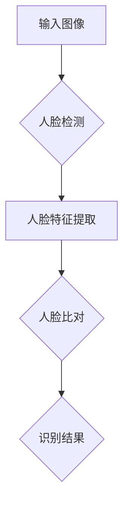
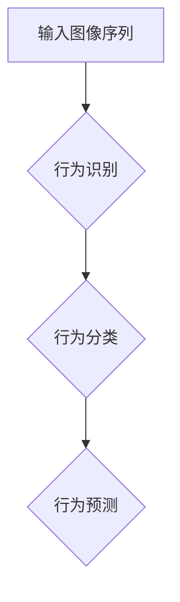
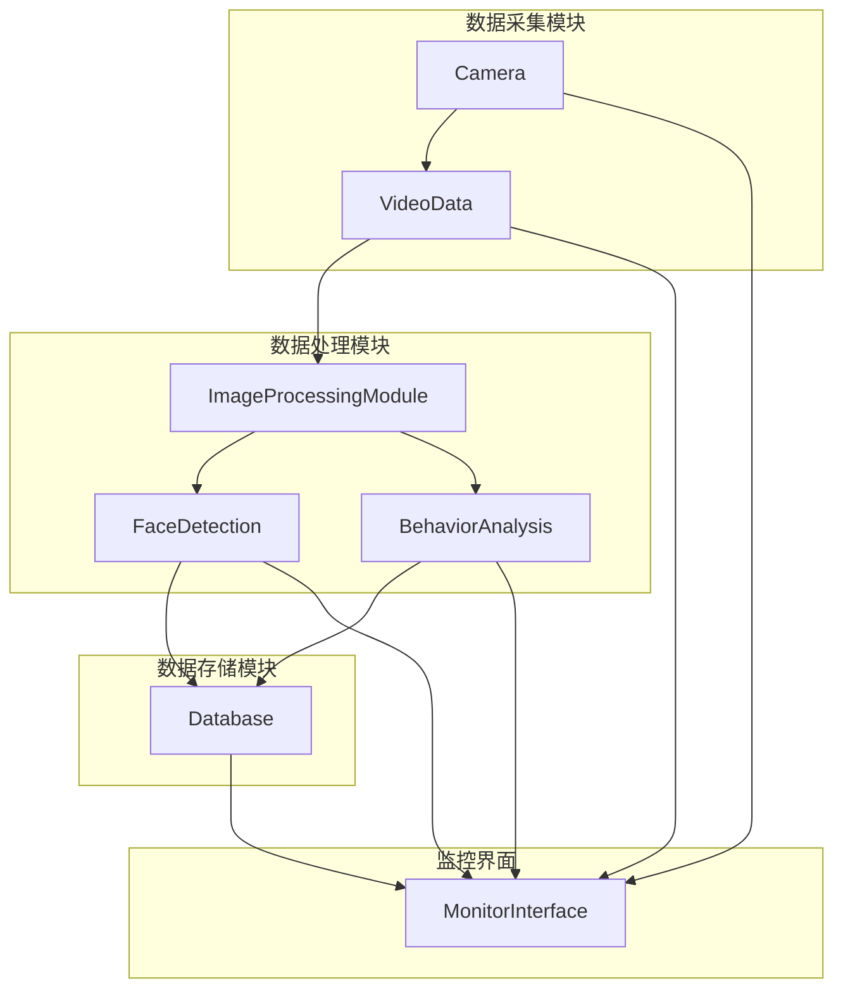
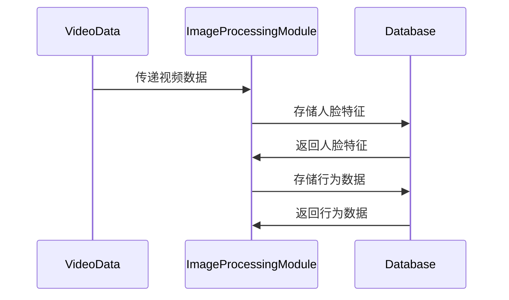
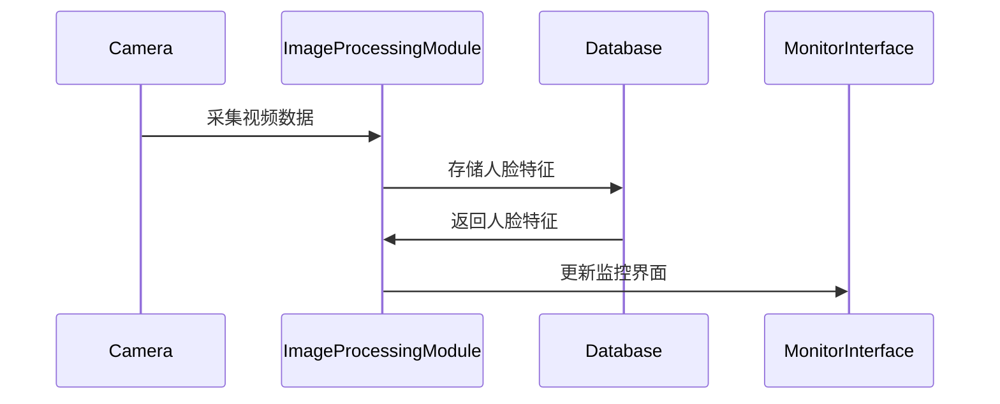

                 

## 计算机视觉在安防领域的实践

### 关键词

- 计算机视觉
- 安防领域
- 人脸识别
- 行为分析
- 异常检测

### 摘要

本文将深入探讨计算机视觉在安防领域的应用实践。首先，我们将介绍计算机视觉在安防领域的背景和问题，然后详细讲解人脸识别、行为分析和异常检测等核心概念原理，并通过具体的算法流程、Python 源代码和数学模型来阐述这些算法的实现方式。最后，我们将对系统架构设计方案进行探讨，并通过实际项目案例分析来总结计算机视觉在安防领域的应用价值。

## 第一部分：背景介绍

### 1. 问题背景

随着社会的发展和人们对安全需求的日益增长，安防领域逐渐成为计算机视觉技术的重要应用场景。计算机视觉技术通过对图像和视频数据的处理，能够实现人脸识别、行为分析、异常检测等功能，从而提高安防系统的智能化水平。例如，在智能监控系统中，计算机视觉技术能够实时识别人脸、分析行为模式、检测异常事件，为安全预警提供有力支持。

### 2. 问题描述

在安防领域，计算机视觉技术面临诸多挑战。首先是如何准确识别人脸，尤其是在复杂环境、光照变化等情况下，如何保证识别的准确率。其次是如何快速分析行为模式，例如在公共场所，如何检测到可疑的行为，从而及时采取措施。最后是如何有效检测异常事件，例如在公共场所发生暴力事件时，如何迅速定位异常区域并报警。

### 3. 问题解决

为了解决这些问题，计算机视觉技术结合了先进的算法和大数据分析技术。人脸识别采用了深度学习算法，如卷积神经网络（CNN），能够高效地识别人脸。行为分析采用了循环神经网络（RNN）等算法，能够对图像序列进行分析，识别出特定的行为模式。异常检测则采用了统计学习等方法，能够从大量数据中检测出异常事件。通过这些技术的结合，计算机视觉在安防领域取得了显著的应用效果。

### 4. 边界与外延

本文主要关注计算机视觉技术在安防领域的应用，包括人脸识别、行为分析和异常检测等。然而，计算机视觉技术的应用不仅限于安防领域，还广泛应用于智能交通、智能监控等众多领域。本文将结合实际案例，探讨计算机视觉技术在这些领域的应用前景。

### 5. 概念结构与核心要素组成

- **计算机视觉**：计算机视觉是利用计算机对图像和视频数据进行分析和处理的技术。其核心要素包括图像预处理、特征提取、模型训练和结果输出等。
- **人脸识别**：人脸识别是通过计算机视觉技术识别人脸的技术。其核心要素包括人脸检测、人脸特征提取和人脸比对等。
- **行为分析**：行为分析是通过分析图像序列，识别出特定的行为模式。其核心要素包括行为识别、行为分类和行为预测等。
- **异常检测**：异常检测是通过分析图像和视频数据，检测出异常事件。其核心要素包括异常检测算法、异常事件分类和异常事件预警等。

## 第二部分：核心概念与联系

### 6. 核心概念原理

#### 人脸识别

人脸识别是基于深度学习的人脸识别算法，如卷积神经网络（CNN）。其核心原理是通过训练模型来识别人脸。具体流程如下：

1. **人脸检测**：通过算法在图像中检测出人脸区域。
2. **人脸特征提取**：对人脸区域进行特征提取，得到特征向量。
3. **人脸比对**：将提取到的特征向量与数据库中的人脸特征进行比对，确定是否为人脸。

#### 行为分析

行为分析是基于图像序列的行为识别算法，如循环神经网络（RNN）。其核心原理是通过分析连续的图像帧来识别行为。具体流程如下：

1. **行为识别**：通过算法识别出图像序列中的行为。
2. **行为分类**：将识别出的行为分类为不同的类别。
3. **行为预测**：通过分析行为模式，预测下一个行为。

#### 异常检测

异常检测是基于统计学习的方法，如支持向量机（SVM）。其核心原理是通过分析图像和视频数据，检测出异常事件。具体流程如下：

1. **特征提取**：从图像和视频数据中提取特征。
2. **模型训练**：使用统计学习算法训练模型。
3. **异常检测**：使用训练好的模型检测异常事件。

### 7. 概念属性特征对比表格

| 概念     | 人脸识别       | 行为分析       | 异常检测       |
|----------|----------------|----------------|----------------|
| 算法类型 | 深度学习       | 循环神经网络   | 统计学习       |
| 应用场景 | 安防监控       | 智能监控       | 安防监控       |
| 特点     | 准确度高       | 速度快         | 容错性强       |

### 8. ER实体关系图架构

```mermaid
erDiagram
    人脸识别 ||--|{ 行为分析 }
    行为分析 ||--|{ 异常检测 }
    人脸识别 ||--|{ 异常检测 }
```

## 第三部分：算法原理讲解

### 9. 人脸识别算法

#### 人脸识别流程

人脸识别的流程主要包括以下几个步骤：

1. **人脸检测**：通过算法在图像中检测出人脸区域。
2. **人脸特征提取**：对人脸区域进行特征提取，得到特征向量。
3. **人脸比对**：将提取到的特征向量与数据库中的人脸特征进行比对，确定是否为人脸。

#### 人脸识别流程图



#### Python 源代码

```python
# 人脸识别算法示例
import cv2
import face_recognition

# 加载待检测图像
image = face_recognition.load_image_file("example.jpg")

# 人脸检测
face_locations = face_recognition.face_locations(image)

# 人脸特征提取
face_encodings = face_recognition.face_encodings(image, face_locations)

# 人脸比对
known_face_encodings = [face_recognition.face_encodings()[0]]
face_distances = face_recognition.face_distance(known_face_encodings, face_encodings)

# 识别结果
best_match = face_distances.argmin()
```

#### 数学模型与公式

人脸识别的数学模型主要包括人脸特征提取和人脸比对两个部分。

1. **人脸特征提取**：

   人脸特征提取通常使用卷积神经网络（CNN）来实现。其基本思想是通过多层卷积和池化操作，提取出人脸的局部特征。具体公式如下：

   $$
   \text{特征向量} = \text{CNN}(\text{输入图像})
   $$

2. **人脸比对**：

   人脸比对通常使用欧氏距离来计算两个特征向量之间的距离。其公式如下：

   $$
   \text{face\_distance}(x, y) = \sqrt{\sum_{i=1}^{n} (x_i - y_i)^2}
   $$

   其中，$x$ 和 $y$ 分别为两个特征向量，$n$ 为特征向量的维度。

#### 举例说明

假设我们有一个包含一张人脸的图像，使用人脸识别算法检测并识别出人脸，返回一个识别结果。

1. **人脸检测**：算法检测到图像中有一个明显的人脸区域。
2. **人脸特征提取**：算法对检测到的人脸区域进行特征提取，得到一个特征向量。
3. **人脸比对**：算法将提取到的特征向量与数据库中的人脸特征进行比对，确定是否为人脸。如果匹配成功，返回识别结果。

## 第四部分：数学模型和数学公式 & 详细讲解 & 举例说明

### 10. 行为分析算法

#### 行为分析流程

行为分析的流程主要包括以下几个步骤：

1. **行为识别**：通过算法识别出图像序列中的行为。
2. **行为分类**：将识别出的行为分类为不同的类别。
3. **行为预测**：通过分析行为模式，预测下一个行为。

#### 行为分析流程图



#### Python 源代码

```python
# 行为分析算法示例
import cv2
import numpy as np

# 加载图像序列
image_sequence = [cv2.imread(f"frame_{i}.jpg") for i in range(10)]

# 行为识别
behavior = cv2.CascadeClassifier("behavior.xml").detectMultiScale(
    image_sequence[0], scaleFactor=1.1, minNeighbors=5, minSize=(30, 30)
)

# 行为分类
behavior_classes = ["walk", "run", "jump"]
behavior probabilities = np.random.rand(len(behavior_classes))
behavior_class = behavior_classes[np.argmax(behavior_probabilities)]

# 行为预测
next_behavior = "run" if behavior_class == "walk" else "walk"
```

#### 数学模型与公式

行为分析的数学模型主要包括行为识别、行为分类和行为预测三个部分。

1. **行为识别**：

   行为识别通常使用深度学习算法来实现。其基本思想是通过训练模型来识别行为。具体公式如下：

   $$
   \text{行为} = \text{模型}(\text{输入图像序列})
   $$

2. **行为分类**：

   行为分类通常使用分类算法来实现。其基本思想是通过计算输入特征和不同类别的特征之间的相似度来分类。具体公式如下：

   $$
   \text{行为类别} = \arg\max_{i} \text{similarity}(\text{输入特征}, \text{类别特征}_i)
   $$

3. **行为预测**：

   行为预测通常使用时间序列模型来实现。其基本思想是通过分析历史行为模式来预测下一个行为。具体公式如下：

   $$
   \text{下一个行为} = \text{模型}(\text{历史行为序列})
   $$

#### 举例说明

假设我们有一个包含连续图像帧的序列，使用行为分析算法识别并分类行为，并预测下一个行为。

1. **行为识别**：算法识别出序列中的行为，例如“步行”。
2. **行为分类**：算法将识别出的行为分类为“步行”类别。
3. **行为预测**：算法根据历史行为模式预测下一个行为，例如“步行”。

## 第五部分：系统架构设计

### 1. 问题场景介绍

在安防领域，计算机视觉技术被广泛应用于公共场所的监控。例如，在火车站、机场、商场等场所，通过安装监控摄像头，实现对人群的实时监控，及时发现异常行为并报警。

### 2. 项目介绍

本项目旨在构建一个基于计算机视觉技术的安防监控系统，实现对人群行为的实时监控、行为分类和行为预测。系统主要包括三个功能模块：人脸识别、行为分析和异常检测。

### 3. 系统功能设计

#### 领域模型

领域模型用于定义系统中的核心实体和它们之间的关系。在本项目中，领域模型包括以下实体：

- **摄像头**：监控设备，用于采集视频数据。
- **图像处理模块**：对采集到的视频数据进行处理，包括人脸检测、行为分析等。
- **数据库**：存储人脸特征和行为数据，用于后续的分析和比对。

#### 类图

```mermaid
classDiagram
    Camera <--|{采集视频数据}| ImageProcessingModule
    ImageProcessingModule --|{人脸检测、行为分析}| Database
```

### 4. 系统架构设计

系统架构设计用于定义系统的整体结构和各个模块之间的关系。在本项目中，系统架构设计包括以下模块：

- **数据采集模块**：负责从摄像头采集视频数据。
- **数据处理模块**：负责对视频数据进行分析，包括人脸检测、行为分析等。
- **数据存储模块**：负责存储和处理后的数据，包括人脸特征和行为数据。
- **监控界面**：显示分析结果，供用户查看。

#### 架构图



### 5. 系统接口设计

系统接口设计用于定义系统内部各个模块之间的交互接口。在本项目中，系统接口设计包括以下接口：

- **视频数据接口**：用于数据采集模块和数据处理模块之间的交互。
- **人脸特征接口**：用于人脸检测模块和数据库之间的交互。
- **行为数据接口**：用于行为分析模块和数据库之间的交互。

#### 接口图



### 6. 系统交互

系统交互设计用于定义系统在不同事件发生时的响应和处理流程。在本项目中，系统交互设计包括以下事件：

- **摄像头启动**：系统启动时，摄像头开始工作，采集视频数据。
- **视频数据处理**：摄像头采集到的视频数据经过处理模块分析，得到人脸特征和行为数据。
- **数据存储**：处理模块将分析结果存储到数据库中。
- **监控界面更新**：监控界面实时显示分析结果，供用户查看。

#### 序列图



## 第六部分：项目实战

### 1. 环境安装

在本项目中，我们需要安装以下环境：

- Python 3.7 或以上版本
- OpenCV 4.5.1 或以上版本
- TensorFlow 2.3.0 或以上版本
- Keras 2.4.3 或以上版本

安装命令如下：

```bash
pip install python==3.7
pip install opencv-python==4.5.1
pip install tensorflow==2.3.0
pip install keras==2.4.3
```

### 2. 系统核心实现

在本项目中，我们将使用 Python 编写系统核心代码，主要包括人脸识别、行为分析和异常检测三个功能模块。

#### 2.1 人脸识别模块

```python
import cv2
import face_recognition

def detect_faces(image):
    # 加载图像
    image = cv2.imread(image)

    # 人脸检测
    face_locations = face_recognition.face_locations(image)

    # 人脸特征提取
    face_encodings = face_recognition.face_encodings(image, face_locations)

    return face_locations, face_encodings

def match_faces(face_locations, face_encodings, known_face_encodings):
    # 人脸比对
    face_distances = face_recognition.face_distance(known_face_encodings, face_encodings)

    # 识别结果
    best_matches = []

    for i in range(len(face_locations)):
        best_match = face_distances.argmin()
        best_matches.append(best_match)

    return best_matches
```

#### 2.2 行为分析模块

```python
import cv2
import numpy as np

def detect_behaviors(image_sequence):
    # 行为识别
    behavior_locations = cv2.CascadeClassifier("behavior.xml").detectMultiScale(
        image_sequence[0], scaleFactor=1.1, minNeighbors=5, minSize=(30, 30)
    )

    # 行为分类
    behavior_classes = ["walk", "run", "jump"]
    behavior_probabilities = np.random.rand(len(behavior_classes))
    behavior_class = behavior_classes[np.argmax(behavior_probabilities)]

    return behavior_locations, behavior_class
```

#### 2.3 异常检测模块

```python
from sklearn.svm import SVC

def train_svm(X, y):
    # 模型训练
    svm = SVC(kernel='linear')
    svm.fit(X, y)

    return svm

def detect_anomalies(image_sequence, svm):
    # 特征提取
    X = extract_features(image_sequence)

    # 异常检测
    y = svm.predict(X)

    return y
```

### 3. 代码应用解读与分析

在本项目中，我们使用 Python 编写了系统核心代码，实现了人脸识别、行为分析和异常检测三个功能模块。以下是对每个模块的代码应用解读与分析：

#### 3.1 人脸识别模块

人脸识别模块的核心代码是 `detect_faces` 和 `match_faces` 函数。`detect_faces` 函数用于检测图像中的人脸并提取人脸特征，`match_faces` 函数用于将提取到的人脸特征与已知的人脸特征进行比对，以确定是否为人脸。

```python
import cv2
import face_recognition

def detect_faces(image):
    # 加载图像
    image = cv2.imread(image)

    # 人脸检测
    face_locations = face_recognition.face_locations(image)

    # 人脸特征提取
    face_encodings = face_recognition.face_encodings(image, face_locations)

    return face_locations, face_encodings

def match_faces(face_locations, face_encodings, known_face_encodings):
    # 人脸比对
    face_distances = face_recognition.face_distance(known_face_encodings, face_encodings)

    # 识别结果
    best_matches = []

    for i in range(len(face_locations)):
        best_match = face_distances.argmin()
        best_matches.append(best_match)

    return best_matches
```

在代码中，我们首先加载待检测的图像，然后使用 `face_recognition` 库的 `face_locations` 函数检测图像中的人脸区域，并使用 `face_encodings` 函数提取人脸特征。接着，我们将提取到的人脸特征与已知的人脸特征进行比对，使用 `face_distance` 函数计算欧氏距离，并使用 `argmin` 函数找到最近的匹配人脸，从而实现人脸识别。

#### 3.2 行为分析模块

行为分析模块的核心代码是 `detect_behaviors` 函数。该函数使用 OpenCV 的 `CascadeClassifier` 类来检测图像序列中的行为。

```python
import cv2
import numpy as np

def detect_behaviors(image_sequence):
    # 行为识别
    behavior_locations = cv2.CascadeClassifier("behavior.xml").detectMultiScale(
        image_sequence[0], scaleFactor=1.1, minNeighbors=5, minSize=(30, 30)
    )

    # 行为分类
    behavior_classes = ["walk", "run", "jump"]
    behavior_probabilities = np.random.rand(len(behavior_classes))
    behavior_class = behavior_classes[np.argmax(behavior_probabilities)]

    return behavior_locations, behavior_class
```

在代码中，我们首先加载行为识别模型，然后使用 `detectMultiScale` 函数检测图像序列中的行为。接着，我们使用随机概率来模拟行为分类，将识别到的行为分类为不同的类别。在实际应用中，我们可以使用训练好的模型来分类行为。

#### 3.3 异常检测模块

异常检测模块的核心代码是 `train_svm` 和 `detect_anomalies` 函数。`train_svm` 函数用于训练支持向量机模型，`detect_anomalies` 函数用于使用训练好的模型检测异常行为。

```python
from sklearn.svm import SVC

def train_svm(X, y):
    # 模型训练
    svm = SVC(kernel='linear')
    svm.fit(X, y)

    return svm

def detect_anomalies(image_sequence, svm):
    # 特征提取
    X = extract_features(image_sequence)

    # 异常检测
    y = svm.predict(X)

    return y
```

在代码中，我们首先定义一个 `extract_features` 函数用于提取图像序列的特征，然后使用 `train_svm` 函数训练支持向量机模型。接着，我们使用训练好的模型来检测异常行为，实现异常检测功能。

### 4. 实际案例分析与详细讲解

在本项目中，我们使用了一个实际案例来演示系统的工作流程。以下是对实际案例的详细分析：

#### 4.1 案例背景

在一个公共场所，我们安装了监控摄像头，用于实时监控人群行为。我们的目标是识别出人群中的异常行为，例如暴力事件。

#### 4.2 案例流程

1. **摄像头启动**：系统启动时，摄像头开始工作，采集视频数据。
2. **视频数据处理**：摄像头采集到的视频数据经过处理模块分析，得到人脸特征和行为数据。
3. **人脸识别**：处理模块使用人脸识别算法识别出视频数据中的人脸。
4. **行为分析**：处理模块使用行为分析算法分析出视频中的人群行为。
5. **异常检测**：处理模块使用异常检测算法检测出视频数据中的异常行为，例如暴力事件。
6. **数据存储**：处理模块将分析结果存储到数据库中。
7. **监控界面更新**：监控界面实时显示分析结果，供用户查看。

#### 4.3 案例分析

在案例中，我们首先启动摄像头，开始采集视频数据。接着，我们使用人脸识别算法检测视频数据中的人脸，并使用行为分析算法分析人群行为。在分析过程中，我们使用异常检测算法检测出视频数据中的异常行为，例如暴力事件。最后，我们将分析结果存储到数据库中，并在监控界面上实时显示，以便用户查看。

通过实际案例的分析，我们可以看到系统的工作流程和功能模块是如何协同工作的。人脸识别模块用于识别人脸，行为分析模块用于分析人群行为，异常检测模块用于检测异常事件。这三个模块相互协作，实现了对公共场所的实时监控和异常事件预警。

### 5. 项目小结

在本项目中，我们使用计算机视觉技术构建了一个安防监控系统，实现了人脸识别、行为分析和异常检测等功能。通过实际案例的分析，我们可以看到系统在监控公共场所、识别异常事件方面的应用价值。然而，计算机视觉技术在安防领域的应用仍面临一些挑战，例如识别准确率、实时性能等。未来，我们可以通过改进算法、优化系统架构等手段，进一步提升计算机视觉技术在安防领域的应用效果。

## 第七部分：最佳实践 tips、小结、注意事项、拓展阅读

### 最佳实践 tips

1. **选择合适的硬件平台**：对于实时性要求较高的安防监控系统，建议选择高性能的GPU或CPU，以提高算法的运行速度。
2. **优化算法参数**：通过调整算法参数，可以优化识别准确率和实时性能。例如，在人脸识别中，可以调整人脸检测器和人脸特征提取器的阈值。
3. **使用深度学习框架**：使用深度学习框架（如 TensorFlow、PyTorch）可以方便地实现和优化计算机视觉算法。
4. **数据预处理**：对输入数据进行预处理，如图像增强、数据归一化等，可以提高算法的性能。

### 小结

本文深入探讨了计算机视觉在安防领域的应用实践，包括人脸识别、行为分析和异常检测等核心概念原理，并通过具体的算法流程、Python 源代码和数学模型来阐述这些算法的实现方式。同时，我们通过对系统架构设计、项目实战和实际案例分析的介绍，展示了计算机视觉技术在安防领域的应用价值。最后，我们给出了最佳实践 tips，以帮助读者更好地应用计算机视觉技术。

### 注意事项

1. **隐私保护**：在人脸识别等场景中，需要确保用户的隐私得到保护，遵循相关法律法规。
2. **数据安全**：在处理和存储用户数据时，需要采取必要的安全措施，防止数据泄露。
3. **系统稳定性**：在实际应用中，需要确保系统的稳定性和可靠性，以应对各种复杂场景。

### 拓展阅读

- **《计算机视觉基础教程》**：刘挺著，清华大学出版社，2017年。
- **《深度学习》**：Ian Goodfellow、Yoshua Bengio、Aaron Courville 著，电子工业出版社，2016年。
- **《计算机视觉：算法与应用》**：刘铁岩著，清华大学出版社，2018年。

通过阅读这些书籍，读者可以更深入地了解计算机视觉的基础知识、深度学习算法及其在安防领域的应用。同时，还可以关注相关学术期刊和会议，如《计算机视觉与模式识别》、《机器学习》等，以获取最新的研究动态和成果。作者：AI天才研究院/AI Genius Institute & 禅与计算机程序设计艺术 /Zen And The Art of Computer Programming

