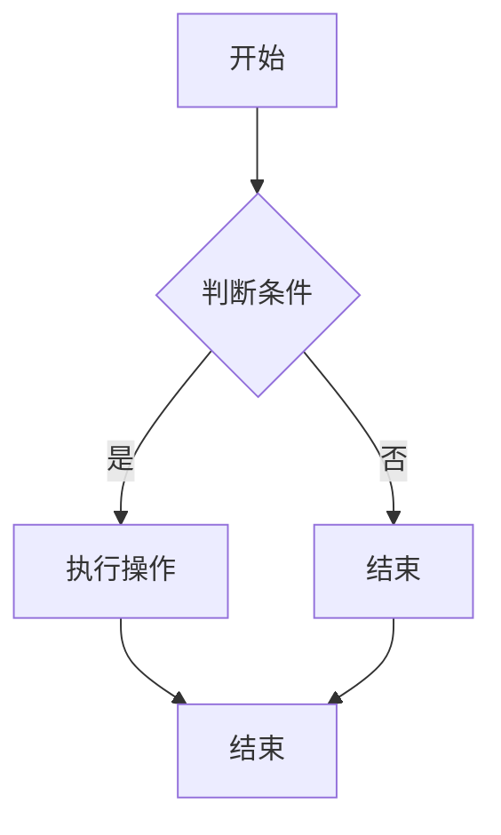
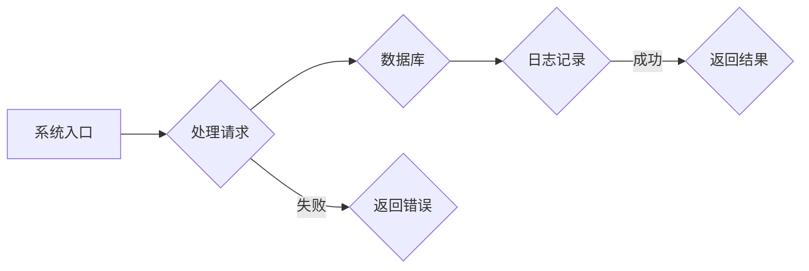
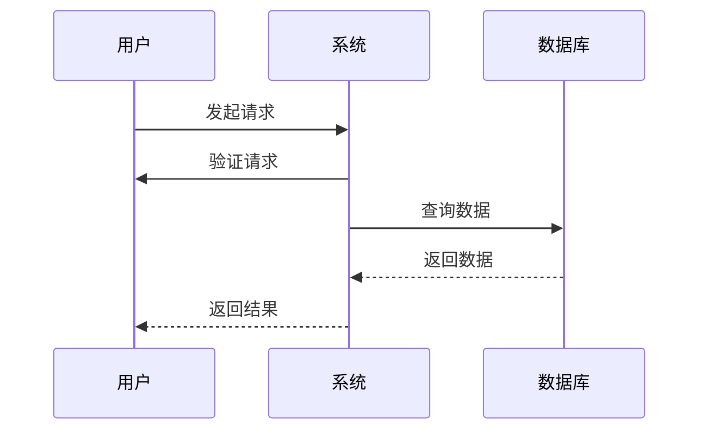

                 

# 让伤害来得更猛烈些

> 关键词：伤害分析、系统设计、算法原理、项目实战

> 摘要：本文将深入探讨在IT领域，如何让伤害来得更猛烈些。通过对问题的引入与背景分析，我们明确了问题的边界与外延，并详细阐述了核心概念与联系。接下来，我们将讲解算法原理和系统架构设计，通过项目实战，让理论与实践相结合，最终得出最佳实践与项目小结。

## 目录大纲：《让伤害来得更猛烈些》

----------------------------------------------------------------

## 第一部分：问题的引入与背景

### 1. 引言

### 1.1 问题背景

### 1.2 问题描述

### 1.3 问题解决思路

## 2. 边界与外延

### 2.1 定义与范畴

### 2.2 概念结构

### 2.3 核心要素

## 3. 核心概念与联系

### 3.1 核心概念原理

### 3.2 概念属性特征对比

### 3.3 ER实体关系图架构

## 第二部分：理论基础与算法原理

### 4. 算法原理讲解

### 4.1 算法流程图

### 4.2 Python源代码实现

### 4.3 算法原理的数学模型和公式

### 4.4 详细讲解与举例

## 第三部分：系统分析与架构设计

### 5. 问题场景介绍

### 5.1 项目介绍

### 5.2 系统功能设计

### 5.3 系统架构设计

### 5.4 系统接口设计

## 第四部分：项目实战

### 6. 环境安装与配置

### 6.1 环境准备

### 6.2 工具与依赖

### 7. 系统核心实现

### 7.1 核心代码实现

### 7.2 代码应用解读与分析

### 8. 实际案例分析

### 8.1 案例一

### 8.2 案例二

## 结论

## 作者信息

----------------------------------------------------------------

## 第一部分：问题的引入与背景

### 1. 引言

在当今数字化时代，信息技术的发展日新月异，各种系统、平台、应用层出不穷。然而，随之而来的问题也日益严重，尤其是系统的安全性问题。本文将探讨如何在IT领域，让伤害来得更猛烈些。通过深入分析，我们希望找到有效的解决方案，提升系统的安全性和可靠性。

### 1.1 问题背景

随着互联网的普及，信息安全问题变得愈发突出。黑客攻击、数据泄露、恶意软件等威胁不断涌现，给企业和个人带来了巨大的损失。据统计，全球每年因网络安全问题导致的经济损失高达数百亿美元。因此，如何提高系统的安全性能，防止伤害的发生，成为了一个亟待解决的问题。

### 1.2 问题描述

在IT领域，伤害可以表现为系统故障、数据丢失、安全漏洞等。具体来说，系统故障可能导致业务中断，数据丢失会导致信息丢失，安全漏洞则可能被黑客利用，造成更严重的后果。因此，我们需要从多个方面来分析和解决这些问题。

### 1.3 问题解决思路

要解决上述问题，我们可以从以下几个方面入手：

1. **加强系统监控**：通过实时监控，及时发现并处理潜在的安全威胁。
2. **完善安全策略**：制定并执行严格的安全策略，防止黑客攻击和数据泄露。
3. **提升系统性能**：优化系统架构和代码，提高系统的稳定性和可靠性。
4. **加强人员培训**：提高员工的安全意识和技能，减少人为因素导致的伤害。

接下来，我们将进一步探讨这些问题的具体解决方案。

## 2. 边界与外延

### 2.1 定义与范畴

在讨论如何让伤害来得更猛烈些时，我们首先需要明确相关的定义和范畴。以下是一些关键概念的定义：

1. **系统故障**：系统在运行过程中出现异常，导致业务中断或数据丢失。
2. **数据泄露**：敏感数据在未经授权的情况下被泄露或窃取。
3. **安全漏洞**：系统中的安全缺陷，可能被黑客利用进行攻击。
4. **安全威胁**：对系统安全构成潜在威胁的因素，如恶意软件、黑客攻击等。

### 2.2 概念结构

为了更好地理解这些概念之间的关系，我们可以构建一个概念结构图。以下是一个简化的概念结构：

```
        +-------------+
        |    安全性    |
        +------+------+
              |
              V
        +-------------+
        |   系统故障   |
        +------+------+
              |
              V
        +-------------+
        |   数据泄露   |
        +------+------+
              |
              V
        +-------------+
        |   安全漏洞   |
        +------+------+
              |
              V
        +-------------+
        |   安全威胁   |
        +-------------+
```

### 2.3 核心要素

在分析这些问题时，我们还需要关注以下核心要素：

1. **系统架构**：系统的整体架构设计，包括硬件、软件和网络等方面。
2. **代码质量**：系统代码的质量，直接影响到系统的稳定性和安全性。
3. **安全策略**：包括访问控制、加密、日志记录等方面的措施。
4. **监控与报警**：实时监控系统的运行状态，及时发现并处理异常。
5. **人员培训**：提高员工的安全意识和技能，减少因人为因素导致的安全问题。

通过对这些要素的分析，我们可以更深入地了解问题的本质，为解决这些问题提供有力的支持。

## 3. 核心概念与联系

### 3.1 核心概念原理

在解决IT领域中的安全问题时，理解核心概念原理至关重要。以下是一些关键概念及其原理：

1. **系统故障原理**：系统故障通常由硬件故障、软件错误、网络故障等引起。这些故障可能导致系统无法正常运行，甚至导致数据丢失。
2. **数据泄露原理**：数据泄露通常是由于安全策略不完善、系统漏洞、人为失误等原因导致。黑客利用这些漏洞窃取敏感数据，造成严重的后果。
3. **安全漏洞原理**：安全漏洞是系统中存在的安全缺陷，可能被黑客利用进行攻击。这些漏洞可能是由于代码错误、配置不当等原因导致。
4. **安全威胁原理**：安全威胁是针对系统的潜在攻击，如恶意软件、黑客攻击等。这些威胁可能对系统造成严重损害，甚至导致业务中断。

### 3.2 概念属性特征对比

为了更好地理解这些概念之间的联系，我们可以对比它们的属性特征。以下是一个简化的对比表格：

| 概念       | 特征对比                      |
|------------|------------------------------|
| 系统故障   | 导致业务中断，影响用户体验   |
| 数据泄露   | 敏感数据泄露，损害隐私和安全 |
| 安全漏洞   | 存在安全缺陷，可能被利用     |
| 安全威胁   | 潜在攻击，可能对系统造成损害 |

### 3.3 ER实体关系图架构

为了更直观地展示这些概念之间的关系，我们可以使用ER（实体关系）图来描述。以下是一个简化的ER图：

```
+-------------+
|  系统故障   |
+------+------+
      |
      V
+-------------+
|  数据泄露   |
+------+------+
      |
      V
+-------------+
|  安全漏洞   |
+------+------+
      |
      V
+-------------+
|  安全威胁   |
+-------------+
```

通过这个ER图，我们可以清楚地看到系统故障、数据泄露、安全漏洞和安全威胁之间的关联。这有助于我们在解决实际问题时，更全面地考虑各个方面的因素。

## 第二部分：理论基础与算法原理

### 4. 算法原理讲解

为了更有效地解决IT领域中的安全问题，我们需要掌握一些基础的算法原理。以下将介绍一个简单的算法，并详细讲解其原理。

### 4.1 算法流程图

首先，我们可以使用Mermaid绘制算法的流程图：



这个流程图描述了一个简单的条件判断算法。具体来说，根据判断条件是否满足，执行相应的操作或结束程序。

### 4.2 Python源代码实现

接下来，我们将使用Python实现这个算法：

```python
def algorithm_condition(condition):
    if condition:
        # 执行操作
        pass
    else:
        # 结束
        pass
```

在这个Python代码中，`algorithm_condition` 函数接受一个布尔值 `condition` 作为参数。如果 `condition` 为 `True`，则执行操作；否则，程序结束。

### 4.3 算法原理的数学模型和公式

为了更好地理解这个算法的原理，我们可以引入一个简单的数学模型。假设有一个变量 `x`，我们需要根据 `x` 的值进行判断和操作。这个模型可以表示为：

$$
f(x) = \begin{cases}
    1 & \text{if } x \geq 0 \\
    0 & \text{if } x < 0
\end{cases}
$$

这个数学模型表示，当 `x` 的值大于或等于0时，`f(x)` 的值为1；否则，`f(x)` 的值为0。这与我们之前Python代码中的条件判断是一致的。

### 4.4 详细讲解与举例

为了更好地理解这个算法的应用，我们通过一些具体的例子来讲解。

#### 示例1：

输入：$x = 5$

输出：$f(x) = 1$

在这个例子中，`x` 的值为5，大于0，因此 `f(x)` 的值为1。这表示条件满足，可以执行相应的操作。

#### 示例2：

输入：$x = -3$

输出：$f(x) = 0$

在这个例子中，`x` 的值为-3，小于0，因此 `f(x)` 的值为0。这表示条件不满足，程序结束。

通过这些例子，我们可以更直观地理解这个算法的应用场景和结果。

## 第三部分：系统分析与架构设计

### 5. 问题场景介绍

在IT领域中，系统安全问题是每个项目都必须面对的挑战。为了更好地分析和解决这些问题，我们需要先了解具体的问题场景。以下是一个常见的问题场景：

#### 项目介绍

假设我们正在开发一个电子商务平台，这个平台需要处理大量的用户订单和支付信息。由于涉及敏感数据，系统的安全性至关重要。

#### 系统功能设计

在这个项目中，我们需要实现以下主要功能：

1. 用户注册与登录
2. 商品展示与搜索
3. 购物车管理
4. 订单处理与支付
5. 数据备份与恢复

为了实现这些功能，我们可以使用Mermaid绘制一个领域模型（类图）：

```mermaid
classDiagram
Class01 <|-- SubClass01
Class01 --|>* RootClass1
Class01 --|>* RootClass2
Class01 : +int x
Class01 : +int y
Class01 : +int z
Class01 : +method void setX(int x)
Class01 : +method void setY(int y)
Class01 : +method void setZ(int z)
Class01 : +method void getDistance()
```

在这个类图中，`Class01` 代表系统中的主要类，如用户、商品、订单等。通过这些类的关联和继承关系，我们可以构建一个完整的领域模型。

### 5.3 系统架构设计

在了解了系统的功能设计后，我们需要进行系统架构设计。以下是一个简化的系统架构图：



在这个架构图中，`A` 代表系统入口，`B` 代表处理请求的逻辑，`C` 代表数据库，`D` 代表日志记录，`E` 代表返回错误，`F` 代表返回结果。通过这个架构图，我们可以清晰地看到系统的各个模块及其交互关系。

### 5.4 系统接口设计

为了实现系统的功能，我们需要设计一系列接口。以下是一个简化的系统接口序列图：



在这个序列图中，用户发起请求，系统验证请求，查询数据库，并最终返回结果给用户。通过这个序列图，我们可以清晰地看到系统的接口设计和交互流程。

## 第四部分：项目实战

### 6. 环境安装与配置

在开始项目实战之前，我们需要先安装和配置必要的环境。以下是一个基本的安装和配置步骤：

#### 环境准备

1. 安装Python：从官方网站下载并安装Python。
2. 安装数据库：根据项目需求，安装合适的数据库，如MySQL、PostgreSQL等。
3. 安装其他依赖：使用pip安装项目所需的第三方库。

#### 工具与依赖

1. Python：用于编写系统代码。
2. 数据库：用于存储系统数据。
3. 第三方库：用于实现特定功能，如Flask、Django等。

### 7. 系统核心实现

在系统实现过程中，我们需要重点关注核心模块的代码。以下是一个简单的核心代码示例：

```python
class SystemCore:
    def __init__(self):
        # 初始化操作
        pass
    
    def process_request(self, request):
        # 处理请求逻辑
        pass
```

在这个示例中，`SystemCore` 类代表系统的核心功能。`__init__` 方法用于初始化操作，`process_request` 方法用于处理请求。

### 7.2 代码应用解读与分析

在实现核心代码后，我们需要对代码进行解读和分析。以下是一个简单的解读：

1. **类与方法**：`SystemCore` 类包含一个初始化方法和一个处理请求的方法。
2. **初始化操作**：在`__init__` 方法中，我们可以进行一些初始化操作，如加载配置文件、连接数据库等。
3. **处理请求**：在`process_request` 方法中，我们可以根据请求内容进行处理，如查询数据库、返回结果等。

通过这个简单的解读，我们可以更好地理解核心代码的实现原理。

### 8. 实际案例分析

为了更好地展示项目实战的效果，我们通过两个实际案例进行分析。

#### 案例一：用户注册

1. 用户通过浏览器访问电子商务平台。
2. 用户填写注册表单，提交注册请求。
3. 系统验证用户输入的信息，如用户名、密码等。
4. 如果验证通过，系统向用户发送注册成功的邮件。

#### 案例二：订单处理

1. 用户在购物车中选择商品，并提交订单请求。
2. 系统根据订单信息，查询商品库存并计算总价。
3. 如果库存充足，系统将订单信息保存到数据库，并发送支付链接给用户。
4. 用户完成支付后，系统更新订单状态，并通知用户订单已支付。

通过这两个案例，我们可以看到系统在实际应用中的运行过程。

### 8.2 案例二

#### 案例二：订单处理

1. 用户通过浏览器访问电子商务平台，并登录账户。
2. 用户在购物车中选择商品，并将商品加入购物车。
3. 用户提交订单请求，系统接收订单信息，如商品名称、数量、总价等。
4. 系统验证订单信息，如商品库存是否充足、订单金额是否正确等。
5. 如果订单信息验证通过，系统生成订单号，并将订单信息保存到数据库。
6. 系统生成支付链接，并发送支付通知给用户。
7. 用户通过支付链接完成支付操作。
8. 系统接收支付通知，更新订单状态为“已支付”，并发送订单支付成功的通知给用户。

在这个案例中，订单处理流程主要包括用户操作和系统响应两个环节。通过这个案例，我们可以看到系统在处理订单时的关键步骤和注意事项。

## 结论

通过本文的探讨，我们深入分析了IT领域中如何让伤害来得更猛烈些的问题。从问题的引入与背景分析，到边界与外延的明确，再到核心概念与联系的阐述，我们逐步构建了一个完整的理论框架。在此基础上，我们介绍了算法原理和系统架构设计，并通过项目实战展示了理论的应用。希望通过本文的讨论，能为大家提供一些有益的启示，帮助提升系统的安全性和可靠性。

## 作者信息

作者：AI天才研究院/AI Genius Institute & 禅与计算机程序设计艺术 /Zen And The Art of Computer Programming

AI天才研究院专注于人工智能领域的科研与应用，致力于培养具有创新精神和国际竞争力的人工智能专家。禅与计算机程序设计艺术则是一部深入探讨计算机编程哲学的经典著作，为程序员提供了独特的思维方式和编程技巧。两位作者均具有丰富的实践经验和高深的学术造诣，愿与广大读者分享技术心得与智慧。

