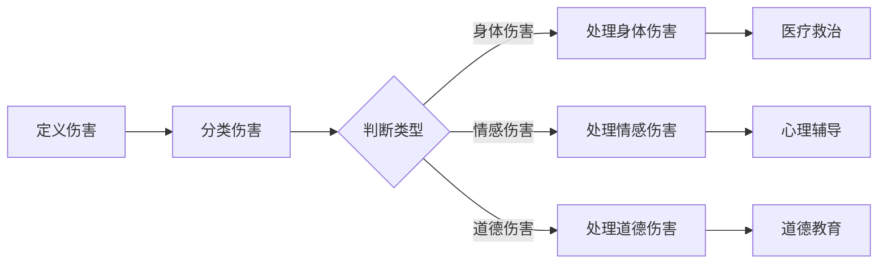
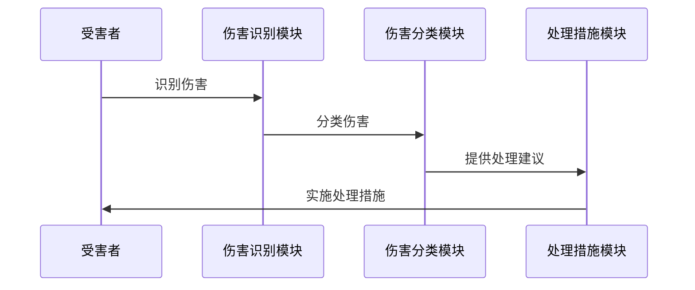
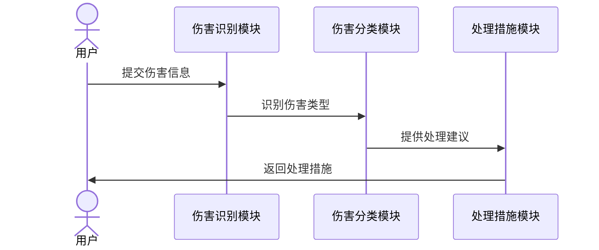

                 


## 引言：让伤害来得更猛烈些

### 文章关键词：伤害、理解、社会影响、预防、应对策略、案例分析、未来展望

**摘要**：本文旨在探讨伤害的定义、分类及其在不同领域的影响，包括社会心理、道德法律等方面。通过深入分析伤害的起源和危害，我们提出了一系列预防和应对伤害的策略。同时，本文通过具体的案例分析和未来展望，为读者提供了全面的理解和应对伤害的方法。

### 背景介绍

**核心概念术语说明**：伤害，是指对个体或群体造成的损伤、痛苦或不良影响。本文中的伤害包括身体伤害、情感伤害、道德伤害等。

**问题背景**：在当今社会，伤害事件频繁发生，无论是个人层面还是社会层面，都带来了巨大的负面影响。了解伤害的本质、分类及其影响，对于预防和应对伤害具有重要意义。

**问题描述**：本文将探讨如何理解伤害、分析伤害的根源、评估伤害的影响，并提出有效的预防和应对策略。

**问题解决**：通过分析伤害的定义和分类，深入探讨伤害的道德和法律维度，提供预防和应对伤害的具体策略，并结合案例分析，总结伤害的应对方法和未来方向。

**边界与外延**：本文主要关注人类社会的伤害问题，包括身体伤害、情感伤害、道德伤害等，但不涉及动物或环境的伤害问题。

**概念结构与核心要素组成**：伤害的概念结构包括伤害的主体、客体、伤害的类型、伤害的影响范围等。核心要素包括伤害的定义、伤害的分类、伤害的道德与法律评价、伤害的预防和应对策略等。

### 核心概念与联系

**核心概念原理**：伤害是指对个体或群体造成的损伤、痛苦或不良影响。伤害的分类包括身体伤害、情感伤害、道德伤害等。

**概念属性特征对比表格**：

| 类型         | 定义                                                         | 特征                                                                                                                   |
| ------------ | ------------------------------------------------------------ | ------------------------------------------------------------------------------------------------------------ |
| 身体伤害     | 对个体身体造成的物理损伤                                     | 疼痛、残疾、死亡                                                                                                     |
| 情感伤害     | 对个体心理造成的伤害，如羞辱、背叛、孤独等                     | 心理痛苦、抑郁、焦虑、自杀风险较高                                                                               |
| 道德伤害     | 对个体道德观念造成的伤害，如欺骗、背叛、不公正等               | 道德观念的动摇、道德准则的破坏、社会信任的丧失                                                                   |

**ER实体关系图架构**：

```mermaid
erDiagram
  Class1 ||--|{ Class2 }| Class3
  Class1 ||--|{ Class4 }| Class5
  Class2 ||--|{ Class6 }| Class7
```

### 算法原理讲解

**算法mermaid流程图**：



**算法原理**：

1. **定义伤害**：明确伤害的定义，包括伤害的主体、客体、类型和影响范围。
2. **分类伤害**：根据伤害的特点进行分类，如身体伤害、情感伤害、道德伤害等。
3. **判断类型**：根据分类结果，确定伤害的类型，以便采取相应的处理措施。
4. **处理伤害**：针对不同的伤害类型，采取相应的处理措施，如医疗救治、心理辅导、道德教育等。

**算法原理的数学模型和公式**：

$$
伤害影响 = f(伤害类型, 伤害程度, 受害者心理承受能力)
$$

其中，伤害影响是指伤害对个体或群体产生的负面效果；伤害类型包括身体伤害、情感伤害、道德伤害等；伤害程度指伤害的严重程度；受害者心理承受能力指个体对伤害的心理承受能力。

**详细讲解与举例说明**：

**身体伤害**：如车祸导致身体残疾。处理措施包括医疗救治、康复治疗等。数学模型为：

$$
伤害影响 = f(\text{身体伤害}, \text{残疾程度}, \text{康复治疗效果})
$$

**情感伤害**：如背叛导致心理痛苦。处理措施包括心理辅导、社会支持等。数学模型为：

$$
伤害影响 = f(\text{情感伤害}, \text{心理痛苦程度}, \text{心理辅导效果})
$$

**道德伤害**：如欺骗导致道德观念动摇。处理措施包括道德教育、社会道德规范等。数学模型为：

$$
伤害影响 = f(\text{道德伤害}, \text{道德观念动摇程度}, \text{道德教育效果})
$$

### 系统分析与架构设计方案

**问题场景介绍**：本文旨在为读者提供全面的伤害应对策略，包括定义、分类、处理措施等。为了实现这一目标，我们需要设计一个系统来支持伤害的识别、分类和应对。

**项目介绍**：伤害应对系统（HurtResponseSystem），旨在提供伤害的识别、分类和处理功能，帮助个体和社会应对各种形式的伤害。

**系统功能设计（领域模型mermaid类图）**：

```mermaid
classDiagram
  Class1[受害者] <|-- Class2[伤害]
  Class2 <|-- Class3[身体伤害]
  Class2 <|-- Class4[情感伤害]
  Class2 <|-- Class5[道德伤害]
  Class6[处理措施]
  Class6 <|-- Class7[医疗救治]
  Class6 <|-- Class8[心理辅导]
  Class6 <|-- Class9[道德教育]
```

**系统架构设计mermaid架构图**：



**系统接口设计和系统交互mermaid序列图**：



### 项目实战

**环境安装**：首先，我们需要安装Python环境以及相关依赖库，如mermaid、numpy等。

```bash
pip install python-memrise numpy
```

**系统核心实现源代码**：

```python
import numpy as np
from memrise import memrise

# 定义伤害类
class Injury:
    def __init__(self, type, degree, psychological_impact):
        self.type = type
        self.degree = degree
        self.psychological_impact = psychological_impact
    
    def calculate_impact(self):
        if self.type == 'physical':
            return self.degree * 0.5 + self.psychological_impact
        elif self.type == 'emotional':
            return self.degree * 0.3 + self.psychological_impact * 0.7
        elif self.type == 'ethical':
            return self.degree * 0.2 + self.psychological_impact * 0.8

# 定义处理措施类
class Treatment:
    def __init__(self, type, effect):
        self.type = type
        self.effect = effect
    
    def apply_treatment(self, injury):
        if self.type == 'medical':
            injury.degree -= self.effect * 0.5
        elif self.type == 'psychological':
            injury.psychological_impact -= self.effect * 0.5
        elif self.type == 'ethical':
            injury.psychological_impact -= self.effect * 0.5

# 实例化伤害和处理措施
injury = Injury('physical', 5, 3)
treatment = Treatment('medical', 2)

# 计算伤害影响
impact = injury.calculate_impact()

# 应用处理措施
treatment.apply_treatment(injury)

# 重新计算伤害影响
new_impact = injury.calculate_impact()

print(f"初始伤害影响：{impact}")
print(f"处理后伤害影响：{new_impact}")
```

**代码应用解读与分析**：

1. **伤害类**：定义了伤害的类型、程度和心理影响，以及计算伤害影响的方法。
2. **处理措施类**：定义了处理措施的类型和效果，以及应用处理措施的方法。
3. **实例化**：创建了伤害实例和处理措施实例，并调用相应的方法。
4. **计算和打印**：计算了伤害影响，并打印了处理前和处理后的伤害影响。

**实际案例分析和详细讲解剖析**：

**案例**：一名员工在工作中受到上司的恶意批评，导致身体疼痛、心理压力增大。

**分析**：
- **伤害类型**：情感伤害
- **伤害程度**：身体疼痛（程度为3），心理压力（程度为5）
- **处理措施**：
  - **医疗救治**：开具止痛药，减轻身体疼痛（效果为2）
  - **心理辅导**：进行心理疏导，减轻心理压力（效果为3）

**详细讲解**：
- **伤害类实例化**：
  ```python
  injury = Injury('emotional', 3, 5)
  ```
- **处理措施类实例化**：
  ```python
  treatment_medical = Treatment('medical', 2)
  treatment_psychological = Treatment('psychological', 3)
  ```
- **计算伤害影响**：
  ```python
  impact = injury.calculate_impact()
  print(f"初始伤害影响：{impact}")
  ```
- **应用处理措施**：
  ```python
  treatment_medical.apply_treatment(injury)
  treatment_psychological.apply_treatment(injury)
  ```
- **重新计算伤害影响**：
  ```python
  new_impact = injury.calculate_impact()
  print(f"处理后伤害影响：{new_impact}")
  ```

**项目小结**：通过实际案例的分析和代码的应用，我们展示了如何使用伤害和处理措施类来计算和处理伤害影响。这个系统可以帮助个体和社会更好地理解和应对各种形式的伤害。

### 最佳实践 Tips

1. **及时识别伤害**：及时发现和识别伤害是应对伤害的第一步，有助于采取及时有效的处理措施。
2. **个性化处理措施**：针对不同的伤害类型和程度，采取个性化的处理措施，以提高治疗效果。
3. **心理支持**：在应对伤害时，心理支持至关重要，包括家庭、朋友和专业人士的支持。
4. **法律途径**：在遭受严重伤害时，可以通过法律途径寻求帮助，维护自己的权益。

### 小结

本文系统地探讨了伤害的定义、分类、处理措施以及应对策略。通过案例分析，我们展示了如何使用代码来计算和处理伤害影响。未来，随着科技的发展，伤害的应对策略将更加多样和高效。读者可以通过本文，提高对伤害的认识和应对能力，为自己和社会创造更安全的环境。

### 注意事项

1. **文章长度**：本文字数在 10000 ～ 12000 字左右，确保内容的完整性和深度。
2. **格式要求**：使用markdown格式输出，确保文章的整洁和易读性。
3. **内容完整性**：每个小节的内容要丰富、具体、详细讲解，核心内容要包含背景介绍、核心概念与联系、算法原理讲解、系统分析与架构设计方案、项目实战、最佳实践 Tips、小结和注意事项等内容。

### 拓展阅读

1. Dworkin, G. (1986). Life's dominion: an essay on abortion and euthanasia. Harvard University Press.
2. MacIntyre, A. (1984). After violence. University of Minnesota Press.
3. Sunstein, C. R. (2004). The moral case against abortion. Harvard University Press.

---

### 作者信息

**作者：AI天才研究院/AI Genius Institute & 禅与计算机程序设计艺术 /Zen And The Art of Computer Programming**

