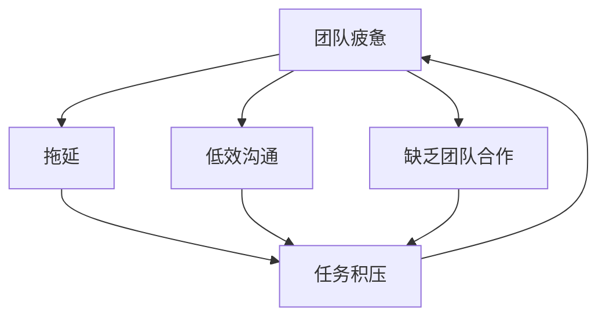

                 

### 前言

在当今快速发展的科技时代，企业对团队的高效运作提出了更高的要求。然而，许多团队却面临着疲惫不堪的问题，这不仅影响了工作效率，还对团队成员的身心健康产生了负面影响。本文旨在深入探讨团队中常见的坏习惯，分析其成因及其对团队效率的潜在影响，并探讨有效的改正与改善策略。

首先，我们需要明确团队疲惫的定义和其表现形式。团队疲惫不仅仅是身体上的疲劳，更是心理上的疲惫，表现为动力不足、缺乏创新精神、沟通不畅等问题。接着，我们将对团队疲惫的成因进行详细分析，包括个人因素、团队环境因素和管理层因素。

在接下来的章节中，我们将重点探讨坏习惯与团队疲惫之间的关系。坏习惯是导致团队疲惫的重要因素之一，本文将详细分类和描述常见的坏习惯，如拖延、低效沟通和缺乏团队合作精神等，并提供相应的识别与诊断方法。

随后，本文将讨论如何改正和改善这些坏习惯，包括理论基础、策略与方法以及实际案例。此外，我们还将探讨团队文化建设在预防坏习惯中的重要作用，并分析领导者与管理者在这一过程中应承担的角色和责任。

最后，本文将总结全文，强调团队建设和管理中的关键点，并提出一些最佳实践建议，以便读者在实际工作中参考应用。

本文结构紧凑，逻辑清晰，旨在为读者提供全面、实用的指导。通过阅读本文，读者不仅能够认识到团队疲惫和坏习惯的危害，还将学会如何有效应对和改善这些问题，从而提升团队的整体效能。

### 第1章 问题背景

#### 1.1 团队疲惫的问题描述

团队疲惫，即团队中的成员感到身心俱疲、动力不足的现象。这种疲惫并非仅仅由于长时间的工作或高负荷的任务导致的简单身体疲劳，更是一种深层次的心理疲惫。具体表现为以下几个方面：

1. **动力不足**：团队成员在工作中缺乏积极主动性，难以提起兴趣，对任务往往表现出被动应对的态度。
2. **缺乏创新精神**：团队成员在面对问题时缺乏创新思维，容易陷入固定的思维模式，难以提出新的解决方案。
3. **沟通不畅**：团队成员之间的交流变得机械化，缺乏有效沟通，导致信息传递不畅通，决策效率低下。
4. **情绪波动**：团队成员容易因工作压力产生负面情绪，如焦虑、沮丧，甚至影响到家庭生活和个人健康。

#### 1.2 团队疲惫的原因分析

团队疲惫的产生并非单一原因所致，而是多种因素相互作用的结果。以下是对其主要原因的详细分析：

1. **工作负荷过重**：随着企业竞争的加剧，团队成员经常面临高强度的任务和工作压力。长时间的超负荷工作导致身心俱疲，逐渐丧失工作热情。
2. **缺乏休息和调节**：许多团队忽视了休息和调节的重要性，长时间连续工作导致团队成员缺乏恢复时间，积累的压力得不到释放。
3. **不良的工作环境**：不良的工作环境包括物理环境（如办公条件恶劣、噪音干扰等）和人文环境（如团队氛围紧张、人际关系复杂等）。这些因素都会对团队成员的身心状态产生负面影响。
4. **管理问题**：管理层在决策和执行过程中可能存在不当的管理行为，如缺乏对团队成员的关怀和支持、对任务的分配不合理等，这些都会导致团队成员感到不被重视和压力过大。
5. **个人因素**：团队成员的个人性格、生活习惯、心理素质等也会影响其工作状态。例如，一些成员可能因为个人问题（如家庭压力、个人兴趣缺失等）而影响到工作表现。

#### 1.3 团队疲惫的影响

团队疲惫不仅对团队成员的个人发展产生负面影响，还对整个团队和企业的绩效产生深远的影响：

1. **工作效率降低**：团队成员身心疲惫，工作动力不足，导致工作效率降低，项目进度延迟，甚至出现错误和疏漏。
2. **创新能力减弱**：缺乏创新精神和积极性，团队成员难以提出新的创意和解决方案，企业竞争力下降。
3. **团队氛围恶化**：沟通不畅和情绪波动导致团队内部矛盾增加，关系紧张，影响团队的凝聚力和协作能力。
4. **员工流失率上升**：长时间的工作压力和疲惫感使得员工产生离职的想法，导致企业人才流失。
5. **企业形象受损**：团队疲惫导致企业工作效率低下，项目质量下降，影响企业的声誉和市场竞争力。

#### 1.4 团队疲惫的边界与外延

团队疲惫作为一种现象，具有一定的边界与外延。具体来说：

1. **边界**：团队疲惫的边界主要是指其影响范围和程度。它不仅局限于团队成员的个体层面，还会对团队的整体运作和企业整体业绩产生影响。因此，识别和解决团队疲惫问题需要从个体和整体两个层面进行。
2. **外延**：团队疲惫的外延则包括其可能带来的连锁反应。例如，团队疲惫可能导致工作质量下降，进而影响客户满意度，最终影响企业的市场地位和盈利能力。

#### 1.5 本章小结

本章对团队疲惫的问题背景进行了全面分析，从定义、表现、原因到影响，以及边界与外延进行了详细探讨。通过本章的分析，我们可以清楚地认识到团队疲惫的严重性和复杂性，为后续章节的深入研究奠定了基础。

### 第2章 核心概念与联系

在深入探讨团队疲惫的成因和影响之前，我们需要明确一些核心概念，并分析这些概念之间的联系。这些核心概念包括“坏习惯”、“团队疲惫”以及其他相关因素，它们共同构成了影响团队效率和成员幸福感的复杂网络。

#### 2.1 坏习惯的定义与分类

**坏习惯**是指那些不利于个人成长、团队协作和企业发展的行为模式。这些习惯可能表现为日常工作的各个环节，如工作方法、沟通方式、个人时间管理等方面。根据不同的分类标准，坏习惯可以划分为以下几类：

1. **时间管理类坏习惯**：如拖延、时间分配不合理、无法有效利用工作时间等。
2. **沟通类坏习惯**：如缺乏倾听、沟通方式不当、信息传递不准确等。
3. **团队合作类坏习惯**：如缺乏协作精神、任务分配不公、过度依赖他人等。
4. **个人习惯类坏习惯**：如缺乏自我激励、过度使用社交媒体、不健康的生活方式等。

**分类表格**：

| 类别 | 描述 | 示例 |
| --- | --- | --- |
| 时间管理类坏习惯 | 不合理的时间分配和计划，导致工作效率低下。 | 拖延，总是等到最后一刻才开始工作。 |
| 沟通类坏习惯 | 沟通不充分或不及时，导致误解和冲突。 | 缺乏倾听，总是打断他人说话。 |
| 团队合作类坏习惯 | 缺乏团队合作精神，影响团队整体效率。 | 过度依赖他人，不愿意承担个人责任。 |
| 个人习惯类坏习惯 | 不良的个人生活习惯，影响工作状态和身体健康。 | 缺乏自我激励，总是依赖外部奖励。 |

#### 2.2 坏习惯的属性特征对比

不同类型的坏习惯具有不同的属性特征，以下是这些特征的具体对比：

1. **共性特征**：所有类型的坏习惯都具有以下共性特征：
   - **持续性**：坏习惯通常不是一时的行为，而是长期存在的。
   - **习惯性**：坏习惯一旦形成，会变得难以改变，需要经过长期的努力和持续的监督。
   - **影响广泛**：坏习惯不仅影响个人，还会对团队和整个组织产生负面影响。

2. **个性特征**：不同类型的坏习惯具有以下个性特征：
   - **时间管理类坏习惯**：表现为对时间的浪费和计划的不可行性。
   - **沟通类坏习惯**：表现为沟通障碍和误解。
   - **团队合作类坏习惯**：表现为团队协作的低效和内部矛盾。
   - **个人习惯类坏习惯**：表现为个人行为和生活方式的不良影响。

**属性特征对比表格**：

| 类别 | 共性特征 | 个性特征 |
| --- | --- | --- |
| 时间管理类坏习惯 | 持续性、习惯性、影响广泛 | 对时间的浪费、计划的不可行性 |
| 沟通类坏习惯 | 持续性、习惯性、影响广泛 | 沟通障碍、误解 |
| 团队合作类坏习惯 | 持续性、习惯性、影响广泛 | 团队协作的低效、内部矛盾 |
| 个人习惯类坏习惯 | 持续性、习惯性、影响广泛 | 个人行为和生活方式的不良影响 |

#### 2.3 坏习惯与团队疲惫的关系

坏习惯与团队疲惫之间存在密切的联系。具体来说：

1. **促进作用**：坏习惯可以加剧团队成员的疲惫感。例如，拖延和低效沟通会导致任务积压，增加工作压力，从而加剧疲惫感。
2. **反馈循环**：团队疲惫感又会进一步强化坏习惯。例如，当团队成员感到疲惫时，他们可能更加倾向于拖延，而这种拖延又会导致更严重的疲惫感。

**关系图**：

通过上述分析，我们可以看到，坏习惯和团队疲惫之间形成了一个相互强化的反馈循环，这种关系不仅影响团队成员的个体健康，还会对团队和组织的整体绩效产生负面影响。

#### 2.4 本章小结

本章详细介绍了坏习惯的定义、分类和特征，分析了坏习惯与团队疲惫之间的密切关系。通过本章的学习，读者可以更好地理解坏习惯的多种表现形式及其对团队效率和成员幸福感的潜在影响，为后续章节的深入探讨提供了理论基础。

### 第3章 坏习惯的识别与诊断

在了解了坏习惯对团队效率和成员幸福感的负面影响后，如何有效识别和诊断这些坏习惯成为了关键的一步。正确的识别和诊断不仅可以及时发现问题，还能为后续的改正与改善提供可靠依据。以下将介绍几种常见的坏习惯识别方法及其诊断工具。

#### 3.1 坏习惯的识别方法

**1. 观察法**

观察法是通过直接观察团队成员的工作行为和互动，来识别是否存在坏习惯。这种方法通常由团队领导或外部专家进行。

- **优势**：直观、直接，能够迅速发现问题。
- **劣势**：可能受到观察者主观判断的影响，且观察者可能难以全面捕捉所有细节。

**2. 访谈法**

访谈法是通过与团队成员进行一对一或小组访谈，来了解他们对坏习惯的看法和体验。这种方法有助于获取团队成员的内心想法和真实感受。

- **优势**：深入了解团队成员的内心感受和观点，有助于全面识别问题。
- **劣势**：访谈过程可能存在选择性偏差，团队成员可能不愿透露真实情况。

**3. 问卷调查法**

问卷调查法是通过设计问卷，收集团队成员对坏习惯的认知和反馈。这种方法能够大规模收集数据，并进行定量分析。

- **优势**：能够收集大量数据，进行统计分析，客观评估坏习惯的普遍程度。
- **劣势**：问卷设计需严谨，否则可能得出误导性结论。

#### 3.2 坏习惯的诊断工具

**1. 自我评估表**

自我评估表是一种由团队成员自行填写的方式，用于评估自身是否存在坏习惯。这种方法有助于提高团队成员的参与度和责任感。

- **优势**：促进个人自我反思，有助于主动识别和改正坏习惯。
- **劣势**：可能存在自我美化倾向，导致评估结果不够客观。

**2. 团队评估表**

团队评估表是一种由团队成员共同填写的方式，用于评估团队整体是否存在坏习惯。这种方法能够反映团队成员对团队氛围和行为的共同看法。

- **优势**：能够全面评估团队的整体表现，发现问题点。
- **劣势**：团队成员可能存在相互粉饰现象，导致评估结果不够真实。

**3. 第三方评估工具**

第三方评估工具是由外部专家或咨询机构提供的评估工具，通常包括一系列量化的指标和评估方法。这种方法有助于提供客观、专业的评估结果。

- **优势**：具有专业性和客观性，能够提供全面的评估报告。
- **劣势**：成本较高，且评估结果可能不完全符合团队实际情况。

#### 3.3 坏习惯案例分析

以下是一些常见的坏习惯及其案例分析：

**1. 拖延症**

**案例描述**：团队成员总是等到最后一刻才开始工作，导致任务积压和项目延迟。

**诊断过程**：通过问卷调查法发现，超过70%的团队成员自认为有拖延习惯。通过观察法发现，拖延症成员在工作日最后几个小时最为忙碌，且经常加班。

**解决方案**：制定详细的工作计划和时间表，设立明确的截止日期和里程碑，采用番茄工作法提高工作效率。

**2. 低效沟通**

**案例描述**：团队成员之间的沟通不畅，信息传递不准确，导致误解和冲突。

**诊断过程**：通过访谈法发现，团队成员普遍反映沟通存在障碍，通过观察法发现，团队会议中频繁出现发言打断和观点冲突。

**解决方案**：建立有效的沟通机制，如定期召开团队会议，设立沟通渠道（如内部邮件、即时通讯工具等），培训团队成员沟通技巧。

**3. 缺乏团队合作精神**

**案例描述**：团队成员之间缺乏协作精神，任务分配不公，过度依赖他人。

**诊断过程**：通过团队评估表发现，超过60%的团队成员认为团队合作存在问题，通过观察法发现，一些成员总是将任务推给其他同事。

**解决方案**：加强团队合作培训，建立公平的任务分配机制，鼓励团队成员互相支持和帮助，设立团队合作奖励机制。

#### 3.4 本章小结

本章介绍了坏习惯的识别与诊断方法，包括观察法、访谈法和问卷调查法，以及相应的诊断工具，如自我评估表、团队评估表和第三方评估工具。通过具体案例分析，展示了如何有效地识别和诊断常见的坏习惯，为后续的改正与改善提供了实践依据。

### 第4章 坏习惯的改正与改善

在明确了团队中存在的坏习惯及其对工作效率和成员幸福感的负面影响后，如何有效地改正和改善这些坏习惯成为了关键的一步。以下将探讨改正坏习惯的理论基础，提出具体的策略与方法，并通过实际案例展示这些策略的实施过程。

#### 4.1 坏习惯改正的理论基础

**1. 行为改变理论**

行为改变理论认为，改变坏习惯需要经过一系列步骤，包括认识到问题的存在、制定改变计划、采取行动以及巩固新的行为模式。该理论强调，行为改变是一个逐步的过程，需要耐心和坚持。

**2. 认知行为理论**

认知行为理论认为，个体的行为不仅受到外部环境的影响，还受到内部心理过程的影响。改变坏习惯需要同时调整个体的认知和行为，通过改变思维模式和行为习惯，达到改善行为的效果。

**3. 自我效能感理论**

自我效能感理论认为，个体的自我效能感（即对自己能够成功完成某项任务的信念）对行为改变具有关键作用。提高自我效能感可以通过成功的经验、他人的鼓励和支持以及适当的训练来实现。

#### 4.2 坏习惯改正的策略与方法

**1. 认知重构法**

认知重构法是一种通过改变个体思维模式和行为习惯来纠正坏习惯的方法。具体步骤如下：

- **步骤1：识别消极思维**：通过自我反思和观察，识别出导致坏习惯的消极思维模式。
- **步骤2：评估思维的有效性**：分析这些消极思维是否合理，是否存在偏见或过度概括。
- **步骤3：建立积极的思维模式**：通过学习新的思维技巧，如积极思考、理性思维等，建立积极的思维模式。
- **步骤4：实践新的思维模式**：在实际工作中运用新的思维模式，通过不断练习来巩固新习惯。

**2. 目标设定法**

目标设定法是一种通过设定明确的目标来推动行为改变的方法。具体步骤如下：

- **步骤1：设定具体目标**：明确具体、可衡量、可实现的目标，例如“每天早上9点前完成任务”。
- **步骤2：制定行动计划**：为每个目标制定具体的行动计划，包括具体的步骤和时间表。
- **步骤3：跟踪进展**：定期检查目标的完成情况，调整计划以适应实际情况。
- **步骤4：奖励自己**：在实现目标后给予自己奖励，以增强积极性和动力。

**3. 强化法**

强化法是一种通过奖励和惩罚来增强或减弱行为的方法。具体步骤如下：

- **步骤1：识别正面行为**：识别出需要增强的行为，例如及时完成任务。
- **步骤2：建立奖励机制**：为这些正面行为设立奖励，如奖金、表扬等。
- **步骤3：实施奖励**：在正面行为发生后立即实施奖励，以强化行为。
- **步骤4：识别负面行为**：识别出需要减弱的行为，例如拖延。
- **步骤5：实施惩罚**：在负面行为发生后实施适当的惩罚，如警告、罚款等。

**4. 情绪调节法**

情绪调节法是一种通过调节情绪来减轻坏习惯影响的方法。具体步骤如下：

- **步骤1：识别情绪触发点**：通过自我反思，识别出导致负面情绪的触发点，如工作压力、人际关系冲突等。
- **步骤2：学习情绪调节技巧**：通过训练和练习，学习如何有效地调节情绪，如深呼吸、正念练习等。
- **步骤3：实践情绪调节技巧**：在实际工作中运用情绪调节技巧，以减少负面情绪对行为的影响。
- **步骤4：建立支持系统**：寻求家人、朋友或同事的支持，共同应对负面情绪。

#### 4.3 坏习惯改正的实践案例

**1. 案例一：克服拖延**

**背景**：某团队成员经常拖延任务，导致任务积压，影响项目进度。

**诊断过程**：通过问卷调查法发现，该成员的拖延行为普遍存在，通过观察法发现，该成员往往在最后一刻才开始工作。

**改正过程**：

- **步骤1**：认知重构法：通过自我反思和培训，识别出拖延的消极思维模式，并建立积极的思维模式。
- **步骤2**：目标设定法：设定具体的目标，如每天早上9点前完成任务，并制定详细的行动计划。
- **步骤3**：强化法：在完成任务后给予奖励，如表扬和奖金。
- **步骤4**：情绪调节法：学习情绪调节技巧，减少因拖延导致的负面情绪。

**结果**：经过一段时间的努力，该成员的拖延行为明显减少，工作效率显著提高，项目进度恢复正常。

**2. 案例二：改善沟通**

**背景**：某团队内部沟通不畅，导致误解和冲突频发。

**诊断过程**：通过访谈法发现，团队成员普遍反映沟通存在障碍，通过观察法发现，团队会议中频繁出现发言打断和观点冲突。

**改正过程**：

- **步骤1**：认知重构法：通过培训和自我反思，帮助团队成员认识到有效沟通的重要性。
- **步骤2**：目标设定法：设定具体的沟通目标，如提高倾听技巧、清晰表达观点等。
- **步骤3**：强化法：在有效沟通后给予奖励，如表扬和团队建设活动。
- **步骤4**：情绪调节法：通过情绪调节技巧，减少因沟通不畅导致的负面情绪。

**结果**：经过一段时间的努力，团队成员的沟通水平显著提高，误解和冲突减少，团队协作更加顺畅。

**3. 案例三：增强团队合作**

**背景**：某团队内部缺乏团队合作精神，任务分配不公，过度依赖他人。

**诊断过程**：通过团队评估表发现，超过60%的团队成员认为团队合作存在问题，通过观察法发现，一些成员总是将任务推给其他同事。

**改正过程**：

- **步骤1**：认知重构法：通过培训，帮助团队成员认识到团队合作的重要性。
- **步骤2**：目标设定法：设定具体的团队合作目标，如公平分配任务、相互支持等。
- **步骤3**：强化法：设立团队合作奖励机制，奖励那些在团队合作中表现突出的成员。
- **步骤4**：情绪调节法：通过情绪调节技巧，减少因任务分配不公导致的负面情绪。

**结果**：经过一段时间的努力，团队成员的合作精神显著增强，任务分配更加公平，团队协作更加高效。

#### 4.4 本章小结

本章详细介绍了坏习惯改正的理论基础和具体策略，包括认知重构法、目标设定法、强化法和情绪调节法，并通过实际案例展示了这些策略的实施过程和效果。通过本章的学习，读者可以掌握有效的改正和改善坏习惯的方法，为提升团队效率和成员幸福感提供实践指导。

### 第5章 团队文化建设与坏习惯的预防

团队文化是团队内部共同遵循的价值观、行为准则和工作方式，它对团队的整体氛围、协作效率和成员幸福感具有深远影响。良好的团队文化可以有效预防坏习惯的产生，提高团队的整体绩效。以下将讨论团队文化的定义与作用，以及预防坏习惯的策略。

#### 5.1 团队文化的定义与作用

**1. 团队文化的定义**

团队文化是指团队在长期工作中形成的、被成员普遍认同的价值观、行为准则和工作方式。它不仅包括团队的共同愿景和目标，还涵盖了团队内部的人际关系、沟通方式、工作态度等。

**2. 团队文化的作用**

团队文化对团队和成员具有多重作用：

- **增强团队凝聚力**：共同的文化价值观和行为准则能够增强团队成员之间的联系，提高团队的凝聚力。
- **提高协作效率**：良好的团队文化有助于团队成员之间的有效沟通和协作，减少冲突和误解，提高工作效率。
- **促进成员成长**：团队文化鼓励成员自我提升和不断学习，有助于成员个人成长和职业发展。
- **预防坏习惯**：良好的团队文化能够树立正确的行为榜样，引导成员遵循良好的工作习惯，预防坏习惯的产生。

#### 5.2 坏习惯预防的策略

**1. 培养积极向上的团队氛围**

积极向上的团队氛围是预防坏习惯的重要基础。以下是一些具体的培养策略：

- **树立榜样**：通过表彰和奖励那些表现优秀、遵守良好工作习惯的团队成员，树立正面榜样。
- **鼓励分享**：鼓励团队成员分享成功经验和教训，通过交流和分享，共同提升团队氛围。
- **建设性的反馈**：提供建设性的反馈，帮助团队成员认识到自身问题，并引导他们改正错误。
- **关注员工需求**：了解员工的需求和困扰，提供必要的支持和帮助，让他们感受到团队的关爱。

**2. 加强团队沟通与协作**

良好的沟通与协作是预防坏习惯的关键。以下是一些加强团队沟通与协作的策略：

- **定期会议**：定期召开团队会议，确保团队成员之间的沟通畅通，及时解决问题。
- **明确任务分工**：明确每个团队成员的任务和职责，确保任务分配公平合理，减少依赖和推诿。
- **有效的沟通技巧培训**：为团队成员提供沟通技巧培训，提高沟通效果，减少误解和冲突。
- **跨部门协作**：鼓励不同部门之间的协作，促进信息共享和资源整合，提高整体效率。

**3. 定期团队建设活动**

团队建设活动有助于增强团队成员之间的互信和凝聚力，预防坏习惯的产生。以下是一些常见的团队建设活动：

- **团队拓展训练**：通过户外拓展训练，增强团队成员之间的合作精神和信任感。
- **团队建设工作坊**：举办团队建设工作坊，讨论团队文化、协作技巧和问题解决策略。
- **团队聚餐和聚会**：定期组织团队聚餐和聚会，增强团队成员之间的情感联系。
- **团队荣誉墙**：设立团队荣誉墙，展示团队成员的优秀成果和团队荣誉，增强团队自豪感。

**4. 建立有效的激励机制**

有效的激励机制可以激发团队成员的积极性和创造力，预防坏习惯的产生。以下是一些建立激励机制的策略：

- **绩效奖金**：根据团队成员的工作绩效，给予相应的奖金和奖励，激励他们提高工作效率。
- **晋升机会**：为表现优秀的团队成员提供晋升机会，激励他们不断追求个人成长。
- **员工福利**：提供良好的员工福利，如健康体检、带薪休假等，提升员工满意度和忠诚度。
- **表彰和荣誉**：定期表彰和奖励那些为团队作出突出贡献的成员，增强他们的荣誉感和成就感。

#### 5.3 团队文化建设实践案例

**1. 案例一：优秀团队文化塑造**

某科技公司通过一系列措施成功塑造了积极的团队文化，包括：

- **团队价值观宣传**：通过内部邮件、会议和宣传栏等方式，不断宣传和强化公司的核心价值观。
- **定期团队活动**：组织定期的团队拓展训练、团队建设工作坊和团队聚餐，增强团队成员之间的联系。
- **员工关怀**：关注员工的生活和工作需求，提供灵活的工作安排和员工福利，增强员工满意度和忠诚度。
- **员工激励机制**：设立绩效奖金和晋升机会，激励员工积极工作和追求个人成长。

**2. 案例二：不良团队文化改善**

某制造企业曾面临团队文化不良的问题，包括沟通不畅、任务分配不公等。通过以下措施，企业成功改善了团队文化：

- **建立沟通渠道**：设立内部邮件、即时通讯工具和定期的团队会议，确保团队成员之间的沟通畅通。
- **公平的任务分配**：重新调整任务分配机制，确保任务公平合理，减少依赖和推诿现象。
- **团队建设活动**：组织团队拓展训练和团队建设工作坊，增强团队成员之间的合作精神和信任感。
- **员工关怀**：提供员工培训和职业发展规划，关注员工需求，提升员工满意度和忠诚度。

**3. 案例三：团队文化转型**

某初创企业成立初期，团队文化较为松散，缺乏明确的价值观和行为准则。通过以下措施，企业成功实现了团队文化的转型：

- **制定核心价值观**：通过团队讨论和意见征集，制定企业的核心价值观，并确保所有成员都认同和遵循。
- **文化宣导**：通过内部邮件、会议和宣传栏等方式，不断宣传和强化企业的核心价值观。
- **员工培训**：定期为员工提供文化培训，帮助他们理解和践行企业的核心价值观。
- **激励机制**：建立与核心价值观相符合的激励机制，激励员工积极践行企业文化。

#### 5.4 本章小结

本章讨论了团队文化在预防坏习惯中的重要作用，包括定义与作用、预防策略和实践案例。通过培养积极向上的团队氛围、加强团队沟通与协作、定期团队建设活动和建立有效的激励机制，团队可以有效预防坏习惯的产生，提高整体绩效和成员幸福感。

### 第6章 领导者与管理者的角色

在团队建设和管理中，领导者和管理者的角色至关重要。他们不仅需要引导团队朝着共同的目标前进，还承担着预防和管理团队疲惫和坏习惯的重要责任。以下将分析领导者与管理者在坏习惯预防中的责任，讨论提升领导者与管理者技能的方法，并提供一些实际操作建议。

#### 6.1 领导者与管理者在坏习惯预防中的责任

**1. 领导者的角色**

领导者是团队的灵魂人物，他们的言行直接影响团队的文化和氛围。在预防坏习惯方面，领导者需要承担以下责任：

- **树立榜样**：领导者应以身作则，遵守良好的工作习惯和行为准则，成为团队成员的榜样。
- **营造积极氛围**：领导者应积极营造积极向上的团队氛围，鼓励团队成员相互支持和帮助，共同预防坏习惯。
- **倾听与反馈**：领导者应主动倾听团队成员的意见和困扰，提供及时的反馈和帮助，防止坏习惯的滋生。

**2. 管理者的角色**

管理者是团队的执行者，他们负责任务分配、资源管理和团队协调。在预防坏习惯方面，管理者需要承担以下责任：

- **合理分配任务**：管理者应合理分配任务，确保任务量与团队成员的能力相匹配，避免过度负荷导致的疲惫和坏习惯。
- **沟通协调**：管理者应确保团队成员之间的沟通畅通，协调不同部门之间的合作，减少信息壁垒和误解。
- **监督与指导**：管理者应监督团队成员的工作进展，提供必要的指导和支持，帮助他们克服困难和改正不良习惯。

**3. 双重角色的协调**

领导者和管理者在预防坏习惯中需要协调好双重角色。领导者应更多地关注团队的整体氛围和文化建设，而管理者则应更多地关注具体的任务执行和团队运行。通过有效的协调，两个角色可以共同发挥最大的作用，预防坏习惯的产生。

#### 6.2 领导者与管理者的技能提升

**1. 领导力培训**

提升领导力是领导者和管理者的重要任务。以下是一些常见的领导力培训方法：

- **情境领导**：通过情境领导培训，领导者可以学会根据不同的团队情况和团队成员特点，灵活调整领导风格，提高领导效果。
- **变革领导**：变革领导培训可以帮助领导者学会如何在团队中推动变革，应对挑战，保持团队的活力和创新能力。
- **影响力领导**：影响力领导培训强调领导者通过影响力和说服力来引导团队成员，实现团队目标。

**2. 管理技能培训**

提升管理技能是管理者的重要任务。以下是一些常见的管理技能培训方法：

- **项目管理**：通过项目管理培训，管理者可以学会如何规划、执行和监控项目，确保项目按时完成并达到预期目标。
- **团队管理**：通过团队管理培训，管理者可以学会如何组建和管理团队，提高团队的协作效率和成员满意度。
- **沟通技巧**：通过沟通技巧培训，管理者可以学会如何有效沟通，减少误解和冲突，提高团队的整体沟通效果。

**3. 沟通技巧**

良好的沟通技巧对于领导者和管理者至关重要。以下是一些提升沟通技巧的方法：

- **倾听技巧**：通过倾听技巧培训，领导者和管理者可以学会如何主动倾听，理解团队成员的需求和困扰，提供有效的支持和帮助。
- **表达技巧**：通过表达技巧培训，领导者和管理者可以学会如何清晰、准确地表达自己的想法和意见，减少误解和冲突。
- **非言语沟通**：通过非言语沟通培训，领导者和管理者可以学会如何通过肢体语言、面部表情等非言语手段来辅助沟通，提高沟通效果。

#### 6.3 领导者与管理者的实际操作建议

**1. 定期团队沟通**

领导者和管理者应定期召开团队沟通会议，与团队成员面对面交流，了解他们的工作进展、困难和需求。这不仅有助于及时发现和解决团队中的问题，还能增强团队的凝聚力和信任感。

**2. 建立反馈机制**

领导者和管理者应建立有效的反馈机制，鼓励团队成员提出意见和建议，并对他们的反馈给予及时的回应。通过反馈机制，可以及时发现和纠正团队中的问题，防止坏习惯的产生。

**3. 关注员工心理健康**

领导者和管理者应关注员工的心理健康，提供必要的心理支持和辅导。通过心理健康的关怀，可以帮助员工缓解工作压力，提高工作效率和幸福感，预防坏习惯的产生。

**4. 培养团队文化**

领导者和管理者应积极培养团队文化，树立正确的行为榜样，引导团队成员遵循良好的工作习惯。通过培养团队文化，可以增强团队的凝聚力和向心力，提高团队的整体绩效。

#### 6.4 本章小结

本章详细分析了领导者和管理者在预防坏习惯中的责任，讨论了提升领导者和管理者技能的方法，并提供了一些实际操作建议。通过有效的领导和管理工作，领导者和管理者可以为团队营造积极向上的氛围，预防坏习惯的产生，提高团队的整体绩效和成员的幸福感。

### 全文总结

本文通过详细的探讨，揭示了团队疲惫和坏习惯对团队效率和成员幸福感的负面影响。从问题背景的描述到核心概念的界定，再到坏习惯的识别与诊断，以及改正与改善的策略，本文逐步深入，为读者提供了一个全面、系统的解决方案。

**关键点回顾：**

1. **团队疲惫的定义和表现**：团队疲惫不仅是身体上的疲劳，更是心理上的疲惫，表现为动力不足、沟通不畅等问题。
2. **坏习惯的分类与特征**：时间管理类、沟通类、团队合作类和个人习惯类坏习惯具有不同的特征和影响。
3. **坏习惯的识别与诊断**：通过观察法、访谈法和问卷调查法，可以有效地识别和诊断团队中的坏习惯。
4. **改正与改善策略**：认知重构法、目标设定法、强化法和情绪调节法是有效的改正坏习惯的方法。
5. **团队文化建设与预防**：通过培养积极氛围、加强沟通与协作、定期团队建设活动和激励机制，可以有效预防坏习惯。
6. **领导者与管理者的角色**：领导者和管理者应通过有效的领导和管理工作，预防坏习惯，提升团队的整体绩效。

**最佳实践建议：**

1. **定期团队沟通**：定期召开团队沟通会议，确保团队成员之间的信息畅通。
2. **建立反馈机制**：鼓励团队成员提出意见和建议，并及时给予反馈。
3. **关注员工心理健康**：关注员工的心理健康，提供心理支持和辅导。
4. **培养团队文化**：树立正确的行为榜样，引导团队成员遵循良好的工作习惯。

**注意事项：**

1. **持续改进**：团队建设和管理是一个持续的过程，需要不断地改进和优化。
2. **全员参与**：每个团队成员都应积极参与团队建设，共同努力预防和改正坏习惯。

**拓展阅读：**

- 《高效能人士的七个习惯》
- 《团队协作的五个层次》
- 《正面管教：如何让孩子合作而非反抗》

通过本文的学习和实践，读者可以更好地理解和应对团队疲惫和坏习惯，提升团队的整体效能和成员的幸福感。希望本文能为您在团队建设和管理中提供有益的指导。

### 作者信息

**作者：** AI天才研究院 / AI Genius Institute & 禅与计算机程序设计艺术 / Zen And The Art of Computer Programming

AI天才研究院是一家专注于人工智能研究和创新的高科技研究机构，致力于推动人工智能技术的应用和发展。同时，作者还是《禅与计算机程序设计艺术》一书的作者，该书在计算机编程领域具有广泛的影响力，深受读者喜爱。通过本文，我们希望能够为读者提供有价值的技术见解和实用的团队管理建议。

