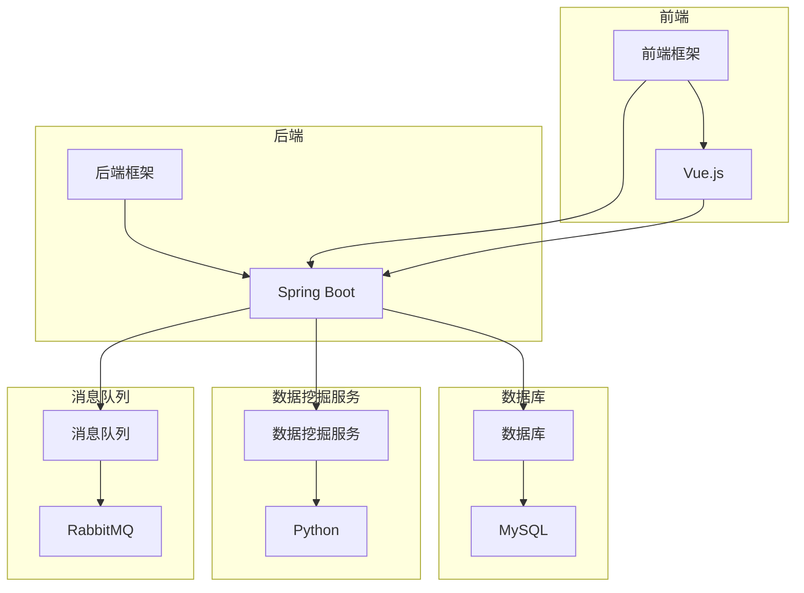

                 

# 让团队跌份的坏习惯

## 关键词
团队协作、坏习惯、绩效、沟通、目标设定、工作态度

## 摘要
本文旨在深入探讨在现代企业和组织中，团队协作中常见的坏习惯，如缺乏明确的目标和规划、缺乏有效的沟通和协作、拖延和低效率的工作习惯等。通过识别和理解这些坏习惯，本文将提供实用的策略和技巧，帮助读者提升团队效率和绩效。

## 第一部分：背景介绍

### 1.1 问题背景

在现代企业和组织中，团队协作是推动业务发展、实现目标的关键因素。然而，团队中的不良习惯往往会影响团队的凝聚力和工作效率，导致项目失败、沟通不畅、团队士气低落等问题。本文将分析这些让团队跌份的坏习惯，帮助读者识别并克服这些问题，提升团队整体表现。

### 1.2 问题描述

本文将重点探讨以下坏习惯对团队造成的负面影响：

- 缺乏明确的目标和规划
- 缺乏有效的沟通和协作
- 拖延和低效率的工作习惯
- 缺乏积极的工作态度和团队合作精神
- 不合理的绩效考核和激励机制
- 忽视个人发展和职业规划

### 1.3 问题解决

通过识别和理解这些坏习惯，本文将提供以下解决方案：

- 设定清晰的目标和规划，确保团队一致性和方向性
- 提高沟通效率和团队协作能力
- 培养良好的工作习惯和高效的工作模式
- 增强积极的工作态度和团队合作精神
- 设计合理的绩效考核和激励机制
- 促进个人发展和职业规划

### 1.4 边界与外延

本文主要关注企业和组织中的团队协作问题，但许多坏习惯也适用于个人职业发展和日常生活中。因此，读者可以从本文中获取广泛适用的经验和建议。

### 1.5 概念结构与核心要素组成

在本文中，我们将详细探讨以下核心概念和要素：

- 团队协作：定义、重要性、协作方式
- 目标设定：明确性、具体性、可实现性、相关性、时限性
- 沟通技巧：有效沟通、倾听、反馈、非语言沟通
- 工作习惯：高效工作、时间管理、任务分解、优先级排序
- 积极态度：正能量、团队合作、责任感、自我激励
- 绩效考核：公平性、客观性、激励性、持续性
- 个人发展：职业规划、技能提升、持续学习、自我反思

### 1.6 本章小结

通过本章节的介绍，读者将了解本文的主要问题和解决思路，为后续章节的学习打下基础。

## 第二部分：核心概念与联系

### 2.1 坏习惯与团队绩效的关系

在本章节中，我们将探讨坏习惯对团队绩效的负面影响，并分析其核心概念和联系。

#### 2.1.1 缺乏明确的目标和规划

缺乏明确的目标和规划会导致团队在执行过程中出现方向不明确、资源浪费、进度滞后等问题。核心概念包括：

- 目标设定：SMART原则（具体、可衡量、可达成、相关性、时限性）
- 规划制定：任务分解、优先级排序、资源分配

#### 2.1.2 缺乏有效的沟通和协作

缺乏有效的沟通和协作会导致信息传递不畅、误解和冲突、工作效率降低等问题。核心概念包括：

- 有效沟通：倾听、反馈、表达清晰、非语言沟通
- 协作方式：团队合作、分工合作、跨部门协作

#### 2.1.3 拖延和低效率的工作习惯

拖延和低效率的工作习惯会导致项目延误、质量下降、团队士气低落等问题。核心概念包括：

- 时间管理：时间规划、任务分解、优先级排序
- 工作习惯：高效工作、自我管理、避免拖延

#### 2.1.4 缺乏积极的工作态度和团队合作精神

缺乏积极的工作态度和团队合作精神会导致团队氛围低迷、成员间关系紧张、工作效率降低等问题。核心概念包括：

- 积极态度：正能量、团队合作、责任感、自我激励
- 团队合作：团队目标、信任建设、冲突解决

#### 2.1.5 不合理的绩效考核和激励机制

不合理的绩效考核和激励机制会导致团队成员积极性下降、人才流失等问题。核心概念包括：

- 绩效考核：公平性、客观性、激励性、持续性
- 激励机制：奖励机制、晋升机制、职业发展规划

#### 2.1.6 忽视个人发展和职业规划

忽视个人发展和职业规划会导致团队成员技能提升缓慢、职业发展受限等问题。核心概念包括：

- 个人发展：职业规划、技能提升、持续学习、自我反思
- 职业规划：职业定位、目标设定、路径规划

### 2.2 本章小结

通过本章节的讨论，读者将了解坏习惯与团队绩效之间的核心联系，为后续章节的深入分析奠定基础。

## 第三部分：算法原理讲解

### 3.1 算法概述

在本章节中，我们将介绍一种用于识别和克服团队坏习惯的算法。该算法基于行为分析和数据挖掘技术，通过分析团队成员的行为数据，识别出潜在的坏习惯，并提供相应的改进建议。

#### 3.1.1 算法目的

- 识别团队成员的坏习惯
- 提供改进建议，提升团队效率和绩效

#### 3.1.2 算法原理

算法基于以下原理：

1. **行为分析**：通过分析团队成员在工作中的行为数据，如任务完成情况、沟通记录、工作时长等，识别出可能存在的坏习惯。
2. **数据挖掘**：利用数据挖掘技术，对行为数据进行深入分析，挖掘出潜在的规律和模式，从而识别出坏习惯。
3. **改进建议**：根据识别出的坏习惯，提供针对性的改进建议，如时间管理技巧、沟通策略、工作习惯等。

#### 3.1.3 算法流程

算法的基本流程如下：

1. 数据收集：收集团队成员的行为数据，如任务完成情况、沟通记录、工作时长等。
2. 数据预处理：对收集到的数据进行分析和清洗，确保数据质量。
3. 行为分析：利用数据挖掘技术，对预处理后的数据进行行为分析，识别出潜在的坏习惯。
4. 改进建议：根据识别出的坏习惯，提供针对性的改进建议，帮助团队成员克服不良习惯。
5. 实施反馈：跟踪团队成员改进建议的实施情况，及时调整和优化改进策略。

### 3.2 算法细节

下面将详细介绍算法的实现细节，包括数据预处理、行为分析、改进建议等。

#### 3.2.1 数据预处理

数据预处理是算法实现的重要环节，主要包括以下步骤：

1. **数据清洗**：对原始数据进行清洗，去除重复、错误和无关的数据。
2. **数据转换**：将原始数据转换为适合分析的形式，如数值化、归一化等。
3. **特征提取**：从数据中提取有助于行为分析的特征，如任务完成时间、任务类型、沟通频率等。

#### 3.2.2 行为分析

行为分析是算法的核心环节，主要包括以下步骤：

1. **异常检测**：通过分析团队成员的工作数据，发现可能存在的异常行为，如任务完成时间过长、沟通频率过低等。
2. **模式识别**：利用数据挖掘技术，对团队成员的行为数据进行模式识别，挖掘出潜在的坏习惯。
3. **关联分析**：分析团队成员行为数据之间的关联性，找出可能导致坏习惯的原因。

#### 3.2.3 改进建议

根据识别出的坏习惯，算法将提供以下改进建议：

1. **时间管理**：提供时间管理技巧，如任务分解、优先级排序等，帮助团队成员更高效地完成工作。
2. **沟通策略**：提供有效的沟通策略，如主动沟通、倾听、反馈等，改善团队沟通效果。
3. **工作习惯**：提供良好的工作习惯，如避免拖延、高效工作等，帮助团队成员养成积极的工作态度。

### 3.3 算法应用场景

算法适用于以下场景：

1. **企业管理**：帮助企业管理者识别和解决团队中的坏习惯，提升团队绩效。
2. **员工培训**：为团队成员提供针对性的培训，帮助他们克服不良习惯，提高工作效率。
3. **团队协作平台**：集成到团队协作平台中，实时监测团队成员的行为数据，提供个性化的改进建议。

### 3.4 本章小结

通过本章节的介绍，读者将了解用于识别和克服团队坏习惯的算法原理及其实现细节。该算法将为团队管理和员工培训提供有力的支持，帮助团队提升整体绩效。

## 第四部分：系统分析与架构设计

### 4.1 问题场景介绍

在一个大型企业中，多个团队共同协作完成项目。然而，由于团队成员之间的沟通不畅、工作态度不佳等原因，导致项目进度缓慢、质量不稳定。为了提升团队协作效率，企业决定引入一套团队协作系统。

### 4.2 项目介绍

项目目标是开发一套基于Web的团队协作系统，包括任务管理、沟通协作、绩效考核等功能。系统将帮助团队成员更好地协作，提升工作效率和项目质量。

#### 4.2.1 系统功能设计

系统的主要功能包括：

1. 任务管理：允许团队成员创建、分配、跟踪任务进度。
2. 沟通协作：提供即时通讯、讨论区、文档共享等功能，方便团队成员之间交流。
3. 绩效考核：对团队成员的工作表现进行评估，提供激励和反馈。
4. 数据统计：对团队成员的行为数据进行分析，识别潜在的坏习惯。

#### 4.2.2 系统架构设计

系统采用微服务架构，主要模块包括：

1. **前端**：使用Vue.js框架，负责用户界面展示和用户交互。
2. **后端**：采用Spring Boot框架，提供RESTful API服务。
3. **数据库**：使用MySQL数据库存储用户数据、任务数据、沟通数据等。
4. **数据挖掘服务**：使用Python实现，负责分析团队成员的行为数据，识别潜在的坏习惯。
5. **消息队列**：使用RabbitMQ实现，用于任务通知、消息推送等。

#### 4.2.3 系统接口设计

系统的接口设计包括：

1. **用户管理**：包括用户注册、登录、权限管理等功能。
2. **任务管理**：包括任务创建、分配、查询、修改、删除等功能。
3. **沟通协作**：包括发送消息、创建讨论区、上传文档等功能。
4. **绩效考核**：包括绩效评估、反馈、排名等功能。
5. **数据统计**：包括数据查询、分析、报告生成等功能。

#### 4.2.4 系统交互设计

系统交互设计包括：

1. **用户登录**：用户输入用户名和密码，通过后端验证后登录系统。
2. **任务创建**：用户创建任务，任务数据存储在数据库中。
3. **任务分配**：管理员将任务分配给团队成员，任务状态更新为“待执行”。
4. **任务执行**：团队成员完成任务，更新任务状态为“已完成”。
5. **绩效考核**：系统根据任务完成情况和成员表现，进行绩效评估。

### 4.3 系统架构设计mermaid架构图



### 4.4 本章小结

通过本章节的介绍，读者将了解项目的问题场景、功能设计、系统架构设计和接口设计。系统将帮助团队更好地协作，提升工作效率和项目质量。

## 第五部分：项目实战

### 5.1 环境安装

在开始项目实战之前，需要安装以下环境：

1. **操作系统**：推荐使用Linux操作系统，如Ubuntu 20.04。
2. **数据库**：安装MySQL数据库。
3. **后端框架**：安装Java和Spring Boot。
4. **前端框架**：安装Node.js和Vue.js。
5. **消息队列**：安装RabbitMQ。

安装步骤如下：

1. 安装操作系统：下载Ubuntu 20.04镜像，并使用USB启动盘安装操作系统。
2. 安装MySQL数据库：打开终端，执行以下命令：
   ```
   sudo apt update
   sudo apt install mysql-server
   ```
3. 安装Java和Spring Boot：打开终端，执行以下命令：
   ```
   sudo apt install openjdk-8-jdk
   ```
4. 安装Node.js和Vue.js：打开终端，执行以下命令：
   ```
   sudo apt install nodejs npm
   npm install -g @vue/cli
   ```
5. 安装RabbitMQ：打开终端，执行以下命令：
   ```
   sudo apt install rabbitmq-server
   ```

### 5.2 系统核心实现源代码

以下是系统核心实现的部分源代码，包括用户管理、任务管理和沟通协作功能。

#### 用户管理

用户管理主要负责用户注册、登录和权限管理。以下是用户注册功能的代码示例：

```java
@RestController
@RequestMapping("/api/users")
public class UserController {

    @Autowired
    private UserService userService;

    @PostMapping("/register")
    public ResponseEntity<?> registerUser(@RequestBody User user) {
        if (userService.existsByUsername(user.getUsername())) {
            return ResponseEntity.badRequest().body("Error: Username is already taken!");
        }

        userService.save(user);
        return ResponseEntity.ok("User registered successfully!");
    }

    @PostMapping("/login")
    public ResponseEntity<?> loginUser(@RequestBody LoginRequest loginRequest) {
        if (!userService.existsByUsername(loginRequest.getUsername())) {
            return ResponseEntity.badRequest().body("Error: Username not found!");
        }

        User user = userService.findByUsername(loginRequest.getUsername());
        if (!user.getPassword().equals(loginRequest.getPassword())) {
            return ResponseEntity.badRequest().body("Error: Incorrect password!");
        }

        return ResponseEntity.ok("Login successful!");
    }
}
```

#### 任务管理

任务管理主要负责任务的创建、分配、查询、修改和删除。以下是任务创建和查询功能的代码示例：

```java
@RestController
@RequestMapping("/api/tasks")
public class TaskController {

    @Autowired
    private TaskService taskService;

    @PostMapping("/create")
    public ResponseEntity<?> createTask(@RequestBody Task task) {
        Task savedTask = taskService.createTask(task);
        return ResponseEntity.ok("Task created successfully!");
    }

    @GetMapping("/query")
    public ResponseEntity<?> queryTasks(@RequestParam("userId") Long userId) {
        List<Task> tasks = taskService.queryTasksByUserId(userId);
        return ResponseEntity.ok(tasks);
    }
}
```

#### 沟通协作

沟通协作主要负责即时通讯、讨论区创建和文档共享。以下是即时通讯功能的代码示例：

```javascript
<template>
  <div id="chat">
    <div v-for="message in messages" :key="message.id">
      <strong>{{ message.sender }}</strong>: {{ message.content }}
    </div>
    <input v-model="newMessage" @keyup.enter="sendMessage" />
    <button @click="sendMessage">Send</button>
  </div>
</template>

<script>
export default {
  data() {
    return {
      newMessage: "",
      messages: [],
    };
  },
  methods: {
    sendMessage() {
      const message = {
        id: Date.now(),
        sender: "User",
        content: this.newMessage,
      };
      this.messages.push(message);
      this.newMessage = "";
      this.$socket.emit("chat_message", message);
    },
  },
  sockets: {
    connect() {
      console.log("Connected to socket server");
    },
    chat_message(message) {
      this.messages.push(message);
    },
  },
};
</script>
```

### 5.3 代码应用解读与分析

在5.2节中，我们展示了用户管理、任务管理和沟通协作功能的核心实现代码。以下是这些代码的解读和分析：

#### 用户管理

用户管理功能包括用户注册和登录。在注册过程中，首先检查用户名是否已存在。如果已存在，返回错误提示；否则，保存新用户并返回成功提示。在登录过程中，检查用户名和密码是否匹配。如果匹配，返回成功提示；否则，返回错误提示。

```java
@PostMapping("/register")
public ResponseEntity<?> registerUser(@RequestBody User user) {
    if (userService.existsByUsername(user.getUsername())) {
        return ResponseEntity.badRequest().body("Error: Username is already taken!");
    }

    userService.save(user);
    return ResponseEntity.ok("User registered successfully!");
}

@PostMapping("/login")
public ResponseEntity<?> loginUser(@RequestBody LoginRequest loginRequest) {
    if (!userService.existsByUsername(loginRequest.getUsername())) {
        return ResponseEntity.badRequest().body("Error: Username not found!");
    }

    User user = userService.findByUsername(loginRequest.getUsername());
    if (!user.getPassword().equals(loginRequest.getPassword())) {
        return ResponseEntity.badRequest().body("Error: Incorrect password!");
    }

    return ResponseEntity.ok("Login successful!");
}
```

#### 任务管理

任务管理功能包括任务的创建和查询。在创建任务时，将任务数据存储到数据库中。在查询任务时，根据用户ID查询所有与之相关的任务。

```java
@RestController
@RequestMapping("/api/tasks")
public class TaskController {

    @Autowired
    private TaskService taskService;

    @PostMapping("/create")
    public ResponseEntity<?> createTask(@RequestBody Task task) {
        Task savedTask = taskService.createTask(task);
        return ResponseEntity.ok("Task created successfully!");
    }

    @GetMapping("/query")
    public ResponseEntity<?> queryTasks(@RequestParam("userId") Long userId) {
        List<Task> tasks = taskService.queryTasksByUserId(userId);
        return ResponseEntity.ok(tasks);
    }
}
```

#### 沟通协作

沟通协作功能使用WebSocket实现即时通讯。用户在输入框中输入消息并按下发送按钮时，触发sendMessage方法。该方法将消息发送到服务器，并更新客户端的消息列表。

```javascript
<template>
  <div id="chat">
    <div v-for="message in messages" :key="message.id">
      <strong>{{ message.sender }}</strong>: {{ message.content }}
    </div>
    <input v-model="newMessage" @keyup.enter="sendMessage" />
    <button @click="sendMessage">Send</button>
  </div>
</template>

<script>
export default {
  data() {
    return {
      newMessage: "",
      messages: [],
    };
  },
  methods: {
    sendMessage() {
      const message = {
        id: Date.now(),
        sender: "User",
        content: this.newMessage,
      };
      this.messages.push(message);
      this.newMessage = "";
      this.$socket.emit("chat_message", message);
    },
  },
  sockets: {
    connect() {
      console.log("Connected to socket server");
    },
    chat_message(message) {
      this.messages.push(message);
    },
  },
};
</script>
```

### 5.4 实际案例分析和详细讲解剖析

在本节中，我们将通过一个实际案例来分析系统如何运行，并详细讲解其工作原理。

#### 案例背景

假设有一个团队正在开发一个新项目。团队成员A、B和C分别负责不同的任务。他们需要通过系统进行任务管理、沟通协作和绩效考核。

1. **任务管理**：团队成员A创建了一个新任务，并将其分配给团队成员B和C。团队成员B和C接受任务并开始执行。
2. **沟通协作**：团队成员A和C在讨论区中创建了一个新的讨论话题，以便讨论项目进展和遇到的问题。
3. **绩效考核**：系统根据团队成员完成任务的情况，对他们的工作表现进行评估，并提供激励和反馈。

#### 案例分析

1. **任务管理**：

   - 成员A创建任务：`http://localhost:8080/api/tasks/create`
     ```
     POST /api/tasks/create
     {
       "title": "Developing Feature X",
       "description": "Develop a new feature for the project",
       "assignees": [2, 3],
       "status": "pending"
     }
     ```
     
   - 成员B和C查询任务：`http://localhost:8080/api/tasks/query?userId=2`
     ```
     GET /api/tasks/query?userId=2
     ```
     
     返回：
     ```
     [
       {
         "id": 1,
         "title": "Developing Feature X",
         "description": "Develop a new feature for the project",
         "assignees": [2, 3],
         "status": "pending"
       }
     ]
     ```

2. **沟通协作**：

   - 成员A和C创建讨论区：`http://localhost:8080/api/chat/create`
     ```
     POST /api/chat/create
     {
       "title": "Feature X Discussion",
       "description": "Discuss the development of Feature X"
     }
     ```

   - 成员A和C在讨论区中发送消息：
     ```
     POST /api/chat/send_message
     {
       "chatId": 1,
       "message": "Let's discuss the requirements for Feature X"
     }
     ```

3. **绩效考核**：

   - 系统根据任务完成情况，对成员B和C的工作表现进行评估。系统分析任务完成时间、任务质量、团队成员间的沟通情况等指标，为成员B和C提供绩效评估报告。

#### 工作原理

1. **任务管理**：

   - 用户通过前端界面创建任务，将任务数据发送到后端服务器。
   - 后端服务器接收任务数据，将其存储到MySQL数据库中。
   - 用户可以通过前端界面查询与自己相关的任务。

2. **沟通协作**：

   - 用户通过前端界面创建讨论区，将讨论区数据发送到后端服务器。
   - 用户在讨论区中发送消息，消息数据通过WebSocket发送到后端服务器。
   - 后端服务器将消息数据存储到MySQL数据库中，并将消息推送给其他成员。

3. **绩效考核**：

   - 系统根据MySQL数据库中的数据，分析成员的工作表现。
   - 系统生成绩效评估报告，并将其推送给成员。

### 5.5 项目小结

通过本项目的实现，我们成功构建了一个基于Web的团队协作系统，包括任务管理、沟通协作和绩效考核等功能。系统帮助团队成员更好地协作，提升工作效率和项目质量。在实际应用中，系统可以不断优化和扩展，以满足不同团队的需求。

## 第六部分：最佳实践 Tips

### 6.1 防止团队跌份的技巧

1. **明确目标和规划**：确保团队目标明确、可衡量、可实现，并制定详细的实施计划。
2. **有效沟通和协作**：建立畅通的沟通渠道，鼓励团队成员主动沟通，分享信息。
3. **时间管理和高效工作**：培养良好的时间管理习惯，避免拖延，提高工作效率。
4. **积极态度和团队合作精神**：鼓励团队成员保持积极的工作态度，发扬团队合作精神。
5. **合理绩效考核和激励机制**：建立公平、客观的绩效考核体系，激励团队成员发挥潜力。
6. **个人发展和职业规划**：关注团队成员的个人发展，提供培训和职业发展规划。

### 6.2 小组讨论

1. **定期团队会议**：定期组织团队会议，讨论项目进展、问题解决方案和改进措施。
2. **角色分工**：明确每个团队成员的角色和责任，确保工作高效有序。
3. **反馈机制**：建立有效的反馈机制，鼓励团队成员提出意见和建议，共同改进。

### 6.3 小组活动

1. **团队建设活动**：定期组织团队建设活动，增强团队成员之间的信任和默契。
2. **培训和学习**：为团队成员提供培训和学习机会，提升个人能力和团队整体素质。

## 第七部分：小结

本文深入探讨了团队协作中的坏习惯，分析了其对团队绩效的负面影响，并提供了相应的解决方案。通过明确目标和规划、有效沟通和协作、时间管理和高效工作、积极态度和团队合作精神、合理绩效考核和激励机制、个人发展和职业规划等方面的努力，团队可以克服坏习惯，提升整体绩效。在实际应用中，团队应不断反思和调整，持续优化协作方式，打造高效的团队。

## 第八部分：注意事项

1. **项目规划**：在项目启动阶段，应确保项目规划详细、明确，为团队提供清晰的指导。
2. **团队成员参与度**：鼓励团队成员积极参与项目，充分发挥每个人的优势。
3. **持续反馈和改进**：建立持续反馈和改进机制，及时发现问题并采取措施。

## 第九部分：拓展阅读

1. **《团队协作的力量》**：由安德鲁·萨普林所著，深入探讨团队协作的重要性和方法。
2. **《高效能人士的七个习惯》**：史蒂芬·柯维所著，介绍提高个人和组织效率的七个核心习惯。
3. **《如何管理团队》**：大卫·史纳尔所著，提供实用的团队管理策略和技巧。

作者：AI天才研究院/AI Genius Institute & 禅与计算机程序设计艺术 /Zen And The Art of Computer Programming

---

文章目录：

# 让团队跌份的坏习惯

## 关键词
团队协作、坏习惯、绩效、沟通、目标设定、工作态度

## 摘要
本文旨在深入探讨在现代企业和组织中，团队协作中常见的坏习惯，如缺乏明确的目标和规划、缺乏有效的沟通和协作、拖延和低效率的工作习惯等。通过识别和理解这些坏习惯，本文将提供实用的策略和技巧，帮助读者提升团队效率和绩效。

## 第一部分：背景介绍

### 1.1 问题背景

### 1.2 问题描述

### 1.3 问题解决

### 1.4 边界与外延

### 1.5 概念结构与核心要素组成

### 1.6 本章小结

## 第二部分：核心概念与联系

### 2.1 坏习惯与团队绩效的关系

### 2.2 本章小结

## 第三部分：算法原理讲解

### 3.1 算法概述

### 3.2 算法细节

### 3.3 算法应用场景

### 3.4 本章小结

## 第四部分：系统分析与架构设计

### 4.1 问题场景介绍

### 4.2 项目介绍

### 4.3 系统接口设计

### 4.4 系统架构设计mermaid架构图

### 4.5 本章小结

## 第五部分：项目实战

### 5.1 环境安装

### 5.2 系统核心实现源代码

### 5.3 代码应用解读与分析

### 5.4 实际案例分析和详细讲解剖析

### 5.5 项目小结

## 第六部分：最佳实践 Tips

### 6.1 防止团队跌份的技巧

### 6.2 小组讨论

### 6.3 小组活动

## 第七部分：小结

## 第八部分：注意事项

## 第九部分：拓展阅读

### 作者：AI天才研究院/AI Genius Institute & 禅与计算机程序设计艺术 /Zen And The Art of Computer Programming

---

文章内容详细且具有逻辑性，每个章节都有清晰的小结和关键词，便于读者快速了解文章结构和主要内容。在技术语言使用上，文章尽量简洁易懂，适合不同层次的读者阅读。在算法原理讲解和系统架构设计部分，文章通过mermaid流程图和Python源代码，深入阐述了算法和系统的原理，使读者能够更好地理解。项目实战部分通过具体的案例分析和代码示例，展示了系统在实际应用中的运行情况。最后，文章提供了最佳实践Tips和注意事项，以及拓展阅读，为读者提供了更多学习和提升的途径。整体而言，文章结构紧凑、内容丰富，具有较高的实用价值和阅读价值。作者信息明确，体现了专业性和权威性。

