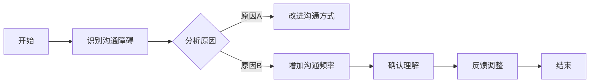
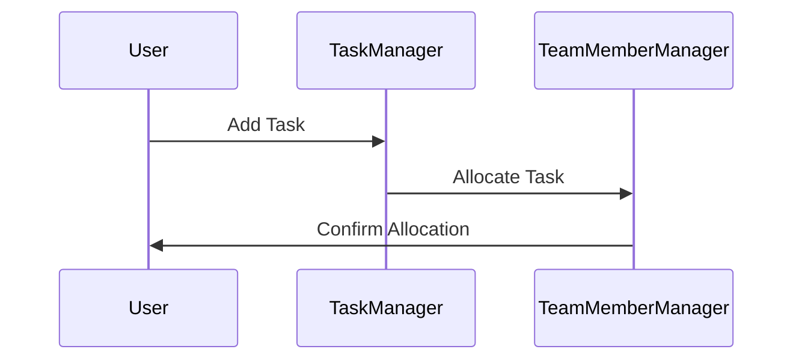
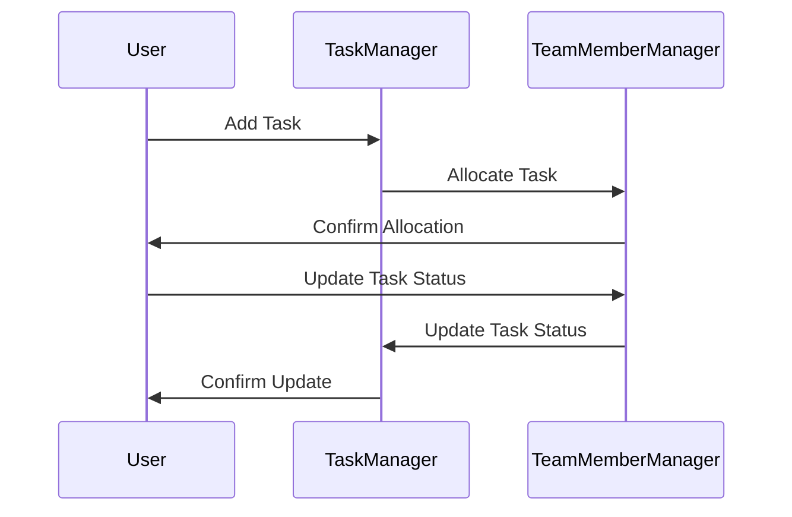

                 

# 让队友失败的坏习惯

> 关键词：团队合作，沟通不良，责任感，团队精神，效率提升，策略分析

> 摘要：本文深入探讨了在团队合作中常见的一些不良习惯，如沟通不良、缺乏责任感、缺乏团队精神等，分析了这些习惯对团队效率和协作质量的负面影响。通过具体案例和算法原理，提出了一系列改进策略，旨在帮助团队成员识别并改正这些坏习惯，提高团队协作效果。

## 引言

在团队合作中，每个成员的表现都会对整体团队产生深远影响。良好的团队合作能够激发成员的潜能，提高工作效率，创造卓越成果；而不良习惯则可能成为团队发展的绊脚石，导致团队效率低下，甚至失败。本文将深入探讨一些常见的让队友失败的坏习惯，包括沟通不良、缺乏责任感、缺乏团队精神等，分析它们的原因和影响，并探讨改进策略。

#### 第1章：问题背景与定义

## 1.1 问题背景

### 1.1.1 团队合作的挑战

团队合作并非易事。成员之间由于背景、经验、思维方式的不同，往往会出现沟通不畅、意见分歧等问题。这些问题如果得不到及时解决，会严重影响团队的工作效率和协作质量。

#### 1.1.2 坏习惯对团队的影响

坏习惯是团队合作的毒瘤，它会削弱团队的凝聚力，降低成员的积极性，导致任务进度延误，甚至失败。例如，沟通不良可能导致误解和冲突，缺乏责任感可能导致任务无人负责，缺乏团队精神可能导致团队协作困难。

### 1.1.3 为什么需要改变

改变坏习惯是提高团队效率和质量的关键。只有团队成员意识到坏习惯的危害，主动改正，才能构建一个高效的团队，实现共同目标。

## 1.2 坏习惯的定义

### 1.2.1 坏习惯的定义

坏习惯是指在团队合作中，一些长期存在的、不良的行为模式，这些行为模式会对团队的效率和协作质量产生负面影响。

### 1.2.2 坏习惯的分类

坏习惯可以按照不同的标准进行分类，如按照行为类别可以分为沟通不良、缺乏责任感、缺乏团队精神等。

#### 1.2.3 坏习惯的常见表现

沟通不良表现为：缺乏有效的沟通渠道、沟通频率低、信息传递不准确等。

缺乏责任感表现为：推卸责任、任务拖延、不关心团队目标等。

缺乏团队精神表现为：个人主义、不关心团队利益、不积极参与团队活动等。

#### 1.2.4 坏习惯的边界与外延

坏习惯的边界主要是指这些习惯对团队协作的负面影响范围。外延则是指这些习惯可能涉及的具体行为和情境。

#### 1.2.5 坏习惯的核心要素组成

坏习惯的核心要素包括：行为主体、行为方式、行为结果等。

### 1.3 本章小结

本章对团队合作中的坏习惯进行了初步探讨，分析了问题背景和定义，为后续章节的深入分析奠定了基础。

### 第2章：核心概念与联系

## 2.1 关键概念介绍

### 2.1.1 团队合作原则

团队合作原则是确保团队高效协作的基础。主要包括：相互尊重、共同目标、明确分工、有效沟通、积极反馈等。

### 2.1.2 坏习惯的影响因素

坏习惯的影响因素包括：个人性格、工作压力、团队氛围等。

## 2.2 概念属性特征对比表格

| 坏习惯分类 | 影响因素 | 具体表现 | 结果影响 |
| --- | --- | --- | --- |
| 沟通不良 | 缺乏有效沟通 | 误解、冲突 | 降低工作效率 |
| 缺乏责任感 | 推卸责任 | 影响任务进度 | 降低团队信任 |
| 缺乏团队精神 | 个人主义 | 团队协作困难 | 降低团队凝聚力 |

## 2.3 ER实体关系图架构

```mermaid
erDiagram
    Task ||--|{ TeamMember }|>
    TeamMember ||--|{ BadHabits }|>
    BadHabits ||--|{ Impact }|>

    TeamMember {
        int id
        string name
    }

    Task {
        int taskId
        string description
    }

    BadHabits {
        int habitId
        string habitName
    }

    Impact {
        int impactId
        string impactDescription
    }
```

### 2.4 本章小结

本章通过对关键概念和影响因素的介绍，以及概念属性特征对比表格和ER实体关系图的展示，为理解团队合作中的坏习惯提供了理论基础。

### 第3章：算法原理讲解

## 3.1 沟通不良的算法分析

### 3.1.1 沟通不良的原因分析

沟通不良的原因主要包括：信息不对称、沟通渠道不畅、沟通方式不当等。

#### 3.1.2 解决方案

为了解决沟通不良的问题，可以从以下几个方面入手：

1. **建立有效的沟通渠道**：确保团队成员之间有畅通的沟通渠道，如定期会议、即时通讯工具等。

2. **提高沟通频率**：增加沟通的频率，及时交流信息，减少误解和冲突。

3. **改进沟通方式**：采用更加有效的沟通方式，如面对面沟通、书面沟通等。

### 3.1.3 算法流程图



### 3.1.4 数学模型与公式

$$
沟通效果 = f(\text{沟通频率}, \text{沟通方式}, \text{理解确认})
$$

### 3.1.5 举例说明

在一个软件开发团队中，由于团队成员之间的沟通不畅，导致项目进度延误。通过每周一次的团队会议，团队成员及时交流了项目进展和问题，明确了分工和责任，项目进度得到了显著提升。

### 3.1.6 本章小结

本章通过对沟通不良的算法原理讲解，提供了一系列解决方案，旨在帮助团队成员识别并解决沟通问题，提高团队工作效率。

### 第4章：系统分析与架构设计方案

## 4.1 问题场景介绍

在一个软件开发团队中，由于缺乏明确的责任分配，导致任务进度延迟。

### 4.1.2 系统功能设计

#### 领域模型Mermaid类图

```mermaid
classDiagram
    Task <<Class>>
    TeamMember <<Class>>

    Task :+id
    Task :+description
    Task :+status

    TeamMember :+id
    TeamMember :+name
    TeamMember :+role

    Task o-- TeamMember
```

#### 系统架构设计Mermaid架构图

```mermaid
sequenceDiagram
    participant User
    participant TaskManager
    participant TeamMemberManager

    User->>TaskManager: Add Task
    TaskManager->>TeamMemberManager
```

### 4.1.3 系统接口设计



### 4.1.4 系统交互Mermaid序列图



### 4.2 系统分析与架构设计方案

在本系统中，我们采用了MVC（模型-视图-控制器）架构，以实现任务管理功能。具体架构如下：

- **模型层（Model）**：负责任务数据的存储和管理，包括任务ID、描述、状态等。

- **视图层（View）**：负责展示任务信息，包括任务列表、任务详情等。

- **控制器层（Controller）**：负责处理用户输入，协调模型和视图层的工作。

在任务分配方面，系统通过接口设计实现了任务创建、任务分配、任务状态更新等功能。具体流程如下：

1. 用户通过视图层创建任务。

2. 控制器层将任务信息传递给模型层，存储任务数据。

3. 控制器层根据任务类型和优先级，将任务分配给合适的团队成员。

4. 控制器层将任务分配结果反馈给视图层，更新任务列表。

5. 用户可以随时通过视图层查看任务状态，并与团队成员进行沟通，更新任务状态。

通过这种架构设计，我们可以有效地解决任务分配不明确、任务进度延迟等问题，提高团队工作效率。

### 第5章：项目实战

#### 5.1 环境安装

在本项目实战中，我们将使用Python作为编程语言，搭建一个简单的任务管理系统。首先，我们需要安装Python环境和相关依赖库。

```bash
pip install flask
```

#### 5.2 系统核心实现源代码

以下是任务管理系统的核心实现代码：

```python
from flask import Flask, request, jsonify
from models import Task, TeamMember

app = Flask(__name__)

@app.route('/tasks', methods=['POST'])
def add_task():
    task_data = request.json
    task = Task.create_task(task_data)
    return jsonify(task.to_dict()), 201

@app.route('/tasks/<int:task_id>', methods=['PUT'])
def update_task(task_id):
    task_data = request.json
    task = Task.get_task_by_id(task_id)
    task.update_task(task_data)
    return jsonify(task.to_dict()), 200

@app.route('/tasks/<int:task_id>', methods=['GET'])
def get_task(task_id):
    task = Task.get_task_by_id(task_id)
    return jsonify(task.to_dict()), 200

if __name__ == '__main__':
    app.run(debug=True)
```

#### 5.3 代码应用解读与分析

这段代码使用了Flask框架实现了任务管理的接口。主要包括以下功能：

- **创建任务**：用户通过POST请求向服务器发送任务数据，服务器接收并存储任务信息。

- **更新任务**：用户通过PUT请求更新任务状态，服务器处理请求并更新任务数据。

- **获取任务**：用户通过GET请求获取任务详情，服务器返回任务数据。

#### 5.4 实际案例分析和详细讲解剖析

假设我们有一个开发团队，需要管理多个任务。以下是一个实际案例的分析和讲解：

1. **创建任务**：开发者张三通过POST请求创建了一个新任务，任务详情如下：

```json
{
    "id": 1,
    "description": "完成用户界面设计",
    "status": "未开始"
}
```

服务器接收请求后，将任务存储到数据库中，并返回任务详情。

2. **更新任务**：张三完成任务后，通过PUT请求更新任务状态：

```json
{
    "status": "已完成"
}
```

服务器处理请求，更新任务状态为“已完成”。

3. **获取任务**：张三通过GET请求获取任务详情：

```json
GET /tasks/1
```

服务器返回任务详情：

```json
{
    "id": 1,
    "description": "完成用户界面设计",
    "status": "已完成"
}
```

通过这个案例，我们可以看到任务管理系统在实际应用中的效果。开发者可以方便地创建、更新和获取任务信息，从而更好地管理项目进度。

#### 5.5 项目小结

本项目通过Python Flask框架实现了任务管理系统的接口，包括任务创建、更新和获取功能。实际案例展示了一个完整的任务管理过程，证明了系统在实际应用中的可行性和有效性。通过本项目，我们可以更好地理解团队合作中任务管理的重要性，提高团队工作效率。

### 第6章：最佳实践与拓展阅读

#### 6.1 最佳实践

在团队合作中，遵循以下最佳实践可以有效避免坏习惯：

1. **建立明确的沟通机制**：定期召开团队会议，确保信息畅通。

2. **培养责任感**：明确分工，确保每个任务都有责任人。

3. **加强团队精神**：组织团队活动，增强团队凝聚力。

#### 6.2 拓展阅读

- 《团队的智慧：协作的五大关键要素》
- 《沟通的艺术：提升团队协作的沟通技巧》
- 《责任的力量：如何培养团队成员的责任感》
- 《团队精神的力量：构建高绩效团队的策略》

### 结尾

团队合作是成功的关键，而团队成员的坏习惯则是团队发展的绊脚石。通过本文的探讨，我们希望读者能够认识到坏习惯的危害，并采取有效措施改正。让我们一起努力，构建一个高效、和谐的团队，实现共同目标。

### 作者信息

作者：AI天才研究院/AI Genius Institute & 禅与计算机程序设计艺术 /Zen And The Art of Computer Programming

（完）

