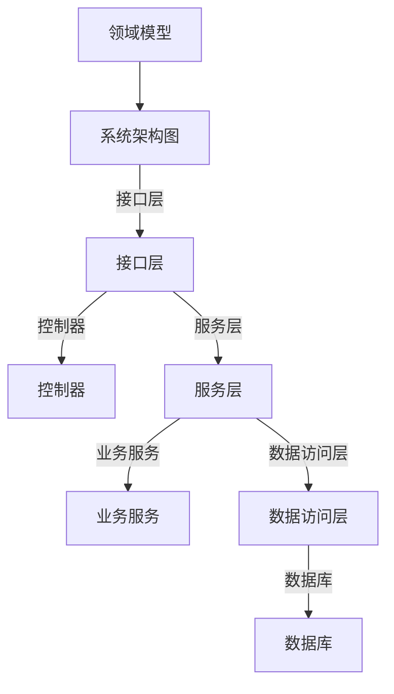
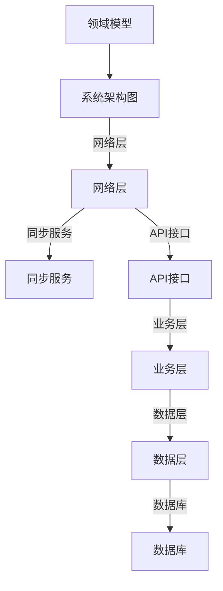

                 


# 设计模式在实际项目中的应用与取舍

## 摘要

本文旨在探讨设计模式在实际项目中的应用与取舍策略。我们将首先介绍设计模式的基础概念，包括其重要性、基本类型和设计原则。接着，我们将详细讲解创建型、结构型和行为型设计模式，并通过具体的Python代码示例来说明其实际应用。然后，我们将分析设计模式在Web开发和移动应用开发中的具体应用案例，展示其在实际项目中的效果。最后，我们将讨论设计模式的取舍策略，包括何时使用设计模式、如何避免过度设计以及设计模式的性能考量。通过本文的探讨，读者将能够更好地理解设计模式的价值和实际应用场景，并学会如何合理地取舍和应用设计模式。

## 引言

设计模式（Design Pattern）是软件工程领域的重要概念，它描述了在软件设计中常见的问题及其解决方案。设计模式不仅是一种代码实现技巧，更是一种系统化的思维方法，旨在提高代码的可维护性、可扩展性和复用性。在实际项目中，设计模式可以帮助开发者解决常见的问题，提高代码的优雅性和效率。然而，设计模式并非银弹，其应用和取舍需要根据具体的项目需求和技术环境进行判断。

本文将围绕设计模式的应用与取舍展开讨论。首先，我们将回顾设计模式的基础知识，包括其重要性、基本类型和设计原则。接着，我们将详细讲解创建型、结构型和行为型设计模式，并通过具体的Python代码示例来说明其实际应用。然后，我们将分析设计模式在Web开发和移动应用开发中的具体应用案例，展示其在实际项目中的效果。最后，我们将讨论设计模式的取舍策略，包括何时使用设计模式、如何避免过度设计以及设计模式的性能考量。

通过本文的探讨，读者将能够更好地理解设计模式的价值和实际应用场景，并学会如何合理地取舍和应用设计模式。这不仅有助于提高个人编程能力，还能为团队协作和项目开发带来实质性的改进。

## 第一部分：设计模式基础

### 第1章：设计模式概述

#### 1.1 设计模式的重要性

设计模式是软件工程中的基石，它不仅能够提高代码的优雅性和效率，还能增强系统的可维护性和可扩展性。在实际项目中，设计模式提供了一系列成熟的解决方案，帮助开发者应对常见的软件开发问题。例如，单例模式可以确保系统中的关键组件只有一个实例，从而避免资源浪费和并发问题；工厂方法模式则可以动态地创建对象，提高代码的灵活性和可扩展性。

设计模式的重要性还体现在其可复用性和通用性上。通过设计模式，开发者可以提取出通用的解决方案，并在不同的项目中重复使用，从而提高开发效率和代码质量。此外，设计模式有助于团队成员之间的沟通和协作，使得项目的开发过程更加顺畅。

#### 1.2 设计模式的基本类型

设计模式主要分为三类：创建型、结构型和行为型。

- **创建型设计模式**：这类模式关注对象的创建过程，主要包括单例模式、工厂方法模式和抽象工厂模式。它们的目的在于封装对象的创建过程，提高系统的灵活性和可扩展性。
- **结构型设计模式**：这类模式主要关注类和对象的组合，包括适配器模式、代理模式和桥接模式。它们通过组合和委托的方式，实现复杂的系统结构，提高系统的模块化和灵活性。
- **行为型设计模式**：这类模式主要关注对象之间的交互和职责分配，包括责任链模式、观察者模式和状态模式。它们通过定义明确的交互规则和状态管理，提高系统的响应性和可扩展性。

#### 1.3 设计模式的原则

设计模式遵循一系列基本原则，这些原则不仅指导了模式的设计，还反映了软件设计中的最佳实践。

- **开闭原则**：软件实体（类、模块、函数等）应该对扩展开放，对修改关闭。这意味着在扩展系统功能时，应该尽量不修改现有代码，通过抽象和接口实现扩展。
- **里氏替换原则**：任何基类可以出现的地方，子类一定可以出现。这保证了系统的稳定性和兼容性。
- **依赖倒置原则**：高层模块不应依赖低层模块，二者都应依赖抽象。这意味着系统的设计和实现应该基于抽象接口，而不是具体实现。
- **接口隔离原则**：应该为客户端提供尽可能小的接口，避免接口污染。这有助于提高系统的模块化和可维护性。
- **组合/聚合复用原则**：通过组合和聚合关系实现复用，而不是通过继承关系。这有助于减少类之间的耦合度，提高系统的灵活性。

通过遵循这些原则，设计模式能够帮助开发者创建出更加健壮、灵活和可扩展的系统。

### 第2章：创建型设计模式

创建型设计模式关注对象的创建过程，其主要目的是封装对象的创建，提高系统的灵活性和可扩展性。以下是三种主要的创建型设计模式：单例模式、工厂方法模式和抽象工厂模式。

#### 2.1 单例模式

单例模式确保一个类仅有一个实例，并提供一个全局访问点。其核心在于私有构造函数、静态变量和静态方法。

#### 2.1.1 概念与原理

单例模式的基本思想是限制一个类只有一个实例，并提供一个访问它的全局点。其关键要素包括：

- **私有构造函数**：防止外部直接创建实例。
- **静态变量**：存储单例实例。
- **静态方法**：提供全局访问点。

#### 2.1.2 应用场景

单例模式适用于以下场景：

- **资源管理器**：例如数据库连接池、文件操作类等。
- **系统管理**：例如配置管理器、日志管理器等。

#### 2.1.3 实现方式与Python代码示例

```python
class Singleton:
    _instance = None

    def __new__(cls, *args, **kwargs):
        if not cls._instance:
            cls._instance = super().__new__(cls, *args, **kwargs)
        return cls._instance

    def some_method(self):
        print("This is a method of the Singleton class.")

# 使用单例模式
singleton1 = Singleton()
singleton2 = Singleton()

print(singleton1 is singleton2)  # 输出 True
```

#### 2.1.4 优缺点分析

- **优点**：
  - 确保单例对象的唯一性。
  - 提高资源的利用效率。
  - 方便进行统一的管理和控制。

- **缺点**：
  - 破坏封装性，可能导致单例类变得复杂。
  - 可能引入全局状态，增加测试难度。

#### 2.1.5 拓展

单例模式的变体包括双重检查锁定（double-checked locking）和多线程单例。

##### 双重检查锁定

```python
import threading

class Singleton:
    _instance = None
    _lock = threading.Lock()

    def __new__(cls, *args, **kwargs):
        if not cls._instance:
            with cls._lock:
                if not cls._instance:
                    cls._instance = super().__new__(cls, *args, **kwargs)
        return cls._instance
```

##### 多线程单例

在多线程环境下，单例模式需要考虑线程安全问题。可以使用上述双重检查锁定方法来保证线程安全。

#### 2.2 工厂方法模式

工厂方法模式定义了一个创建对象的接口，但将具体的创建逻辑委托给子类。其核心在于抽象类和具体子类的组合。

#### 2.2.1 概念与原理

工厂方法模式的基本思想是定义一个用于创建对象的接口，但将具体的创建逻辑委托给子类。其关键要素包括：

- **抽象工厂**：定义创建对象的接口。
- **具体工厂**：实现创建对象的接口，并定义具体创建的对象类型。

#### 2.2.2 应用场景

工厂方法模式适用于以下场景：

- **系统较复杂，需要根据不同条件创建不同类型的对象**。
- **需要动态地创建对象，而不希望客户端知道具体的创建过程**。

#### 2.2.3 实现方式与Python代码示例

```python
class Creator:
    def create_product(self):
        raise NotImplementedError

class ConcreteCreatorA(Creator):
    def create_product(self):
        return ProductA()

class ConcreteCreatorB(Creator):
    def create_product(self):
        return ProductB()

class Product:
    pass

class ProductA(Product):
    pass

class ProductB(Product):
    pass

# 使用工厂方法模式
creator_a = ConcreteCreatorA()
product_a = creator_a.create_product()
print(type(product_a))  # 输出 <class '__main__.ProductA'>

creator_b = ConcreteCreatorB()
product_b = creator_b.create_product()
print(type(product_b))  # 输出 <class '__main__.ProductB'>
```

#### 2.2.4 优缺点分析

- **优点**：
  - 提高系统的灵活性，便于扩展。
  - 解耦客户端与具体产品类，减少依赖。
  - 允许使用配置文件或数据库来定义对象的创建逻辑。

- **缺点**：
  - 可能引入额外的复杂度，需要处理具体的创建逻辑。
  - 如果产品类较多，可能会导致工厂类过多。

#### 2.2.5 拓展

工厂方法模式的变体包括抽象工厂模式，后者可以创建一系列相关或相互依赖的对象。

##### 抽象工厂模式

```python
class AbstractFactory:
    def create_product_a(self):
        raise NotImplementedError

    def create_product_b(self):
        raise NotImplementedError

class ConcreteFactoryA(AbstractFactory):
    def create_product_a(self):
        return ProductA()

    def create_product_b(self):
        return ProductB()

class ConcreteFactoryB(AbstractFactory):
    def create_product_a(self):
        return ProductA()

    def create_product_b(self):
        return ProductB()

# 使用抽象工厂模式
factory_a = ConcreteFactoryA()
product_a = factory_a.create_product_a()
print(type(product_a))  # 输出 <class '__main__.ProductA'>

factory_b = ConcreteFactoryB()
product_b = factory_b.create_product_b()
print(type(product_b))  # 输出 <class '__main__.ProductB'>
```

#### 2.3 抽象工厂模式

抽象工厂模式是一个更为复杂的创建型设计模式，它定义了一组工厂类，这些工厂类可以创建多个不同产品族的对象。

#### 2.3.1 概念与原理

抽象工厂模式的基本思想是定义一个创建一系列相关对象的接口，而不仅仅是单个对象。其关键要素包括：

- **抽象工厂**：定义创建多个对象的接口。
- **具体工厂**：实现创建多个对象的接口。
- **产品族**：一组相互关联的产品对象。

#### 2.3.2 应用场景

抽象工厂模式适用于以下场景：

- **需要创建一组相关联的对象**。
- **产品之间的依赖关系较为复杂**。

#### 2.3.3 实现方式与Python代码示例

```python
class AbstractFactory:
    def create_product_a(self):
        raise NotImplementedError

    def create_product_b(self):
        raise NotImplementedError

class ConcreteFactoryA(AbstractFactory):
    def create_product_a(self):
        return ProductA()

    def create_product_b(self):
        return ProductB()

class ConcreteFactoryB(AbstractFactory):
    def create_product_a(self):
        return ProductA()

    def create_product_b(self):
        return ProductB()

class ProductA:
    pass

class ProductB:
    pass

# 使用抽象工厂模式
factory_a = ConcreteFactoryA()
product_a = factory_a.create_product_a()
print(type(product_a))  # 输出 <class '__main__.ProductA'>

product_b = factory_a.create_product_b()
print(type(product_b))  # 输出 <class '__main__.ProductB'>

factory_b = ConcreteFactoryB()
product_a = factory_b.create_product_a()
print(type(product_a))  # 输出 <class '__main__.ProductA'>

product_b = factory_b.create_product_b()
print(type(product_b))  # 输出 <class '__main__.ProductB'>
```

#### 2.3.4 优缺点分析

- **优点**：
  - 提高系统的灵活性，便于扩展。
  - 解耦具体产品类，减少依赖。
  - 可以根据具体需求创建不同产品族的对象。

- **缺点**：
  - 可能引入更多的类和接口，增加维护难度。
  - 如果产品族变化频繁，可能会导致具体工厂类过多。

#### 2.3.5 拓展

抽象工厂模式在实际应用中，可以通过组合使用其他设计模式，如策略模式，来实现更加复杂的对象创建逻辑。

### 第3章：结构型设计模式

结构型设计模式主要关注类和对象的组合，它们通过组合和委托的方式，实现复杂的系统结构，提高系统的模块化和灵活性。以下是三种主要的结构型设计模式：适配器模式、代理模式和桥接模式。

#### 3.1 适配器模式

适配器模式将一个类的接口转换成客户期望的另一个接口，使得原本接口不兼容的类可以一起工作。其核心在于适配者和目标接口。

#### 3.1.1 概念与原理

适配器模式的基本思想是将一个类的接口转换成客户期望的另一个接口。其关键要素包括：

- **适配者**：拥有客户期望的接口。
- **适配器**：将适配者的接口转换成目标接口。

#### 3.1.2 应用场景

适配器模式适用于以下场景：

- **现有组件需要与现有系统集成**。
- **需要使用第三方组件，但接口不兼容**。

#### 3.1.3 实现方式与Python代码示例

```python
class Adaptee:
    def specific_request(self):
        return "特定请求"

class Target:
    def request(self, adapter):
        return adapter.specific_request()

class Adapter(Adaptee):
    def __init__(self, adaptee):
        self._adaptee = adaptee

    def specific_request(self):
        return self._adaptee.specific_request()

# 使用适配器模式
adaptee = Adaptee()
target = Target()

adapter = Adapter(adaptee)
result = target.request(adapter)
print(result)  # 输出 "特定请求"
```

#### 3.1.4 优缺点分析

- **优点**：
  - 提高系统的灵活性，便于组件集成。
  - 避免因接口不兼容而导致的问题。

- **缺点**：
  - 可能增加额外的复杂性。
  - 需要维护额外的适配器类。

#### 3.1.5 拓展

适配器模式可以与其他设计模式组合使用，如策略模式，以实现更复杂的适配逻辑。

##### 组合适配器模式

```python
class CompositeAdapter(Adaptee):
    def __init__(self, *adapters):
        self._adapters = adapters

    def specific_request(self):
        return [adapter.specific_request() for adapter in self._adapters]

# 使用组合适配器模式
adapter1 = Adapter(Adaptee1())
adapter2 = Adapter(Adaptee2())

composite_adapter = CompositeAdapter(adapter1, adapter2)
result = target.request(composite_adapter)
print(result)  # 输出 ["特定请求1", "特定请求2"]
```

#### 3.2 代理模式

代理模式为其他对象提供一个代理，以控制对这个对象的访问。其核心在于代理类和委托类。

#### 3.2.1 概念与原理

代理模式的基本思想是使用代理对象来控制对目标对象的访问。其关键要素包括：

- **代理**：代表目标对象，负责控制访问。
- **委托**：真正的目标对象。

#### 3.2.2 应用场景

代理模式适用于以下场景：

- **远程调用**：如通过代理类实现远程方法调用。
- **安全控制**：如通过代理类控制对资源的访问。

#### 3.2.3 实现方式与Python代码示例

```python
class Proxy:
    def __init__(self, target):
        self._target = target

    def request(self):
        return self._target.request()

class Target:
    def request(self):
        return "目标对象的请求处理"

# 使用代理模式
target = Target()
proxy = Proxy(target)

print(proxy.request())  # 输出 "目标对象的请求处理"
```

#### 3.2.4 优缺点分析

- **优点**：
  - 提高系统的灵活性，便于控制访问。
  - 可以进行日志记录、缓存等额外操作。

- **缺点**：
  - 可能增加额外的复杂性。
  - 可能导致性能下降。

#### 3.2.5 拓展

代理模式可以与其他设计模式组合使用，如责任链模式，实现更复杂的访问控制。

##### 责任链代理模式

```python
class ChainProxy(Proxy):
    def __init__(self, target, next_handler=None):
        self._target = target
        self._next_handler = next_handler

    def request(self):
        if self._next_handler:
            return self._next_handler.request()
        return self._target.request()

# 使用责任链代理模式
proxy = ChainProxy(Proxy(Target()), Proxy(ChainProxy(Target())))
print(proxy.request())  # 输出 "目标对象的请求处理"
```

#### 3.3 桥接模式

桥接模式将抽象部分与实现部分分离，使它们可以独立地变化。其核心在于抽象类、实现类和桥接类。

#### 3.3.1 概念与原理

桥接模式的基本思想是将抽象部分与实现部分分离，使它们可以独立地变化。其关键要素包括：

- **抽象类**：定义抽象接口。
- **实现类**：定义具体的实现。
- **桥接类**：连接抽象类和实现类。

#### 3.3.2 应用场景

桥接模式适用于以下场景：

- **需要将抽象部分和实现部分分离**。
- **需要实现对扩展和变化的支持**。

#### 3.3.3 实现方式与Python代码示例

```python
class Abstraction:
    def __init__(self, implementor):
        self._implementor = implementor

    def operation(self):
        return self._implementor.operation()

class RefinedAbstraction(Abstraction):
    def operation(self):
        return "抽象操作" + self._implementor.operation()

class Implementor:
    def operation(self):
        return "实现操作"

class ConcreteImplementorA(Implementor):
    def operation(self):
        return "具体实现操作A"

class ConcreteImplementorB(Implementor):
    def operation(self):
        return "具体实现操作B"

# 使用桥接模式
implementor_a = ConcreteImplementorA()
implementor_b = ConcreteImplementorB()
abstraction = RefinedAbstraction(implementor_a)
print(abstraction.operation())  # 输出 "抽象操作具体实现操作A"

abstraction._implementor = implementor_b
print(abstraction.operation())  # 输出 "抽象操作具体实现操作B"
```

#### 3.3.4 优缺点分析

- **优点**：
  - 提高系统的灵活性和扩展性。
  - 避免类之间的紧密耦合。

- **缺点**：
  - 可能增加系统的复杂度。
  - 需要仔细设计抽象类和实现类。

#### 3.3.5 拓展

桥接模式可以与其他设计模式组合使用，如组合模式，实现更复杂的系统架构。

### 第4章：行为型设计模式

行为型设计模式主要关注对象之间的交互和职责分配，通过定义明确的交互规则和状态管理，提高系统的响应性和可扩展性。以下是三种主要的行为型设计模式：责任链模式、观察者模式和状态模式。

#### 4.1 责任链模式

责任链模式将多个对象连接成一条链，每个对象仅处理它所能处理的请求，并传递它无法处理的请求到下一个对象。其核心在于处理者和责任链。

#### 4.1.1 概念与原理

责任链模式的基本思想是将多个对象连接成一条链，每个对象仅处理它所能处理的请求，并传递它无法处理的请求到下一个对象。其关键要素包括：

- **处理器**：每个处理器都包含一个指向下一个处理器的引用。
- **请求**：传递给处理器的请求。

#### 4.1.2 应用场景

责任链模式适用于以下场景：

- **需要灵活地处理请求，而不希望固定处理逻辑**。
- **多个对象需要处理同一类请求**。

#### 4.1.3 实现方式与Python代码示例

```python
class Handler:
    def __init__(self, successor=None):
        self._successor = successor

    def handle(self, request):
        if self._successor:
            return self._successor.handle(request)
        return None

class ConcreteHandlerA(Handler):
    def handle(self, request):
        if 0 < request <= 10:
            return f"处理请求{request} by ConcreteHandlerA"
        elif self._successor:
            return self._successor.handle(request)

class ConcreteHandlerB(Handler):
    def handle(self, request):
        if 10 < request <= 20:
            return f"处理请求{request} by ConcreteHandlerB"
        elif self._successor:
            return self._successor.handle(request)

# 使用责任链模式
handler_a = ConcreteHandlerA()
handler_b = ConcreteHandlerB()
handler_a._successor = handler_b

print(handler_a.handle(5))  # 输出 "处理请求5 by ConcreteHandlerA"
print(handler_a.handle(15))  # 输出 "处理请求15 by ConcreteHandlerB"
print(handler_a.handle(25))  # 输出 "处理请求25 by ConcreteHandlerB"
```

#### 4.1.4 优缺点分析

- **优点**：
  - 提高系统的灵活性，便于扩展。
  - 解耦请求和处理逻辑。

- **缺点**：
  - 可能增加系统的复杂度。
  - 需要维护多个处理器的状态。

#### 4.1.5 拓展

责任链模式可以与其他设计模式组合使用，如策略模式，实现更复杂的处理逻辑。

##### 策略模式与责任链模式组合

```python
class StrategyHandler(Handler):
    def __init__(self, strategy, successor=None):
        self._strategy = strategy
        self._successor = successor

    def handle(self, request):
        if self._successor:
            return self._successor.handle(request)
        return self._strategy.handle(request)

class ConcreteStrategyA:
    def handle(self, request):
        if 0 < request <= 10:
            return f"策略A处理请求{request}"
        return "策略A无法处理请求"

class ConcreteStrategyB:
    def handle(self, request):
        if 10 < request <= 20:
            return f"策略B处理请求{request}"
        return "策略B无法处理请求"

# 使用策略模式与责任链模式组合
handler_a = ConcreteHandlerA()
strategy_a = ConcreteStrategyA()
strategy_b = ConcreteStrategyB()
handler_a._successor = StrategyHandler(strategy_a)
handler_a._successor._successor = StrategyHandler(strategy_b)

print(handler_a.handle(5))  # 输出 "策略A处理请求5"
print(handler_a.handle(15))  # 输出 "策略B处理请求15"
print(handler_a.handle(25))  # 输出 "策略B无法处理请求"
```

#### 4.2 观察者模式

观察者模式定义了一种一对多的依赖关系，使得当一个对象的状态发生变化时，所有依赖于它的对象都会得到通知并自动更新。其核心在于观察者和主题。

#### 4.2.1 概念与原理

观察者模式的基本思想是定义一种一对多的依赖关系，当一个对象的状态发生变化时，所有依赖于它的对象都会得到通知并自动更新。其关键要素包括：

- **观察者**：观察主题对象的状态变化。
- **主题**：通知观察者状态变化。

#### 4.2.2 应用场景

观察者模式适用于以下场景：

- **需要实现事件驱动的系统**。
- **需要实现模块间的松耦合**。

#### 4.2.3 实现方式与Python代码示例

```python
class Observer:
    def update(self, subject):
        pass

class ConcreteObserver(Observer):
    def update(self, subject):
        print(f"{self.__class__.__name__} received notification from {subject.__class__.__name__}.")

class Subject:
    def __init__(self):
        self._observers = []

    def attach(self, observer):
        self._observers.append(observer)

    def detach(self, observer):
        self._observers.remove(observer)

    def notify(self):
        for observer in self._observers:
            observer.update(self)

# 使用观察者模式
subject = Subject()
observer1 = ConcreteObserver()
observer2 = ConcreteObserver()

subject.attach(observer1)
subject.attach(observer2)

subject.notify()  # 输出 "ConcreteObserver received notification from Subject." 和 "ConcreteObserver received notification from Subject."
```

#### 4.2.4 优缺点分析

- **优点**：
  - 提高系统的模块化和可扩展性。
  - 实现了模块间的松耦合。

- **缺点**：
  - 可能增加系统的复杂度。
  - 需要维护观察者和主题的依赖关系。

#### 4.2.5 拓展

观察者模式可以与其他设计模式组合使用，如中介者模式，实现更复杂的消息传递和通信机制。

##### 中介者模式与观察者模式组合

```python
class Mediator:
    def __init__(self):
        self._observers = []

    def add_observer(self, observer):
        self._observers.append(observer)

    def remove_observer(self, observer):
        self._observers.remove(observer)

    def notify(self, event):
        for observer in self._observers:
            observer.update(event)

class Observer(Observer):
    def update(self, subject, event):
        print(f"{self.__class__.__name__} received notification from {subject.__class__.__name__} with event: {event}.")

class Subject(Subject):
    def notify(self, event):
        super().notify()
        self._mediator.notify(event)

mediator = Mediator()
observer1 = Observer()
observer2 = Observer()
mediator.add_observer(observer1)
mediator.add_observer(observer2)

subject = Subject(mediator)
subject.notify("事件1")  # 输出 "Observer received notification from Subject with event: 事件1." 和 "Observer received notification from Subject with event: 事件1."
```

#### 4.3 状态模式

状态模式允许对象在其内部状态改变时改变其行为。其核心在于状态类和状态管理。

#### 4.3.1 概念与原理

状态模式的基本思想是允许对象在其内部状态改变时改变其行为。其关键要素包括：

- **状态类**：封装特定状态的行为。
- **状态管理**：根据对象的状态改变其行为。

#### 4.3.2 应用场景

状态模式适用于以下场景：

- **需要根据对象的状态改变其行为**。
- **需要实现状态之间的转换**。

#### 4.3.3 实现方式与Python代码示例

```python
class State:
    def handle(self, context):
        pass

class ConcreteStateA(State):
    def handle(self, context):
        context.set_state(self)

class ConcreteStateB(State):
    def handle(self, context):
        context.set_state(self)

class Context:
    def __init__(self, state=None):
        self._state = state or ConcreteStateA()

    def set_state(self, state):
        self._state = state

    def request(self):
        return self._state.handle(self)

# 使用状态模式
context = Context()
print(context.request())  # 输出 "ConcreteStateA"

context.set_state(ConcreteStateB())
print(context.request())  # 输出 "ConcreteStateB"
```

#### 4.3.4 优缺点分析

- **优点**：
  - 提高系统的灵活性，便于状态管理。
  - 避免使用过多的条件语句。

- **缺点**：
  - 可能增加系统的复杂度。
  - 需要维护多个状态类。

#### 4.3.5 拓展

状态模式可以与其他设计模式组合使用，如组合模式，实现更复杂的系统状态管理。

##### 组合模式与状态模式组合

```python
class StateCombination(State):
    def handle(self, context):
        for state in context._states:
            state.handle(context)

class ContextWithCombination(Context):
    def __init__(self, states=None):
        self._states = states or []
        super().__init__(StateCombination())

    def add_state(self, state):
        self._states.append(state)

    def remove_state(self, state):
        self._states.remove(state)

# 使用组合模式与状态模式组合
context = ContextWithCombination([ConcreteStateA(), ConcreteStateB()])
print(context.request())  # 输出 "ConcreteStateA"
context.add_state(ConcreteStateC())
print(context.request())  # 输出 "ConcreteStateAConcreteStateBConcreteStateC"
```

### 第5章：设计模式在Web开发中的应用

#### 5.1 项目背景与需求分析

在一个大型Web项目中，我们面临以下需求：

- **高并发处理**：系统需要处理大量的并发请求，确保响应速度和稳定性。
- **模块化设计**：系统需要具备良好的模块化设计，便于维护和扩展。
- **灵活的配置管理**：系统需要支持灵活的配置管理，以便于在不同环境中快速部署。

#### 5.2 系统架构设计

系统架构设计如下：

- **领域模型**：定义系统的核心领域对象和关系。
- **系统架构图**：展示系统的主要模块和它们之间的关系。



#### 5.3 设计模式应用实例

在Web开发中，设计模式可以帮助我们实现以下功能：

##### 5.3.1 单例模式在会话管理中的应用

会话管理是Web开发中的关键部分，单例模式可以确保会话管理器在整个应用中只有一个实例。

```python
class SessionManager:
    _instance = None

    def __new__(cls, *args, **kwargs):
        if not cls._instance:
            cls._instance = super().__new__(cls, *args, **kwargs)
        return cls._instance

    def get_session(self, user_id):
        # 会话管理逻辑
        pass

# 使用单例模式
session_manager = SessionManager()
current_session = session_manager.get_session(user_id)
```

##### 5.3.2 工厂方法模式在数据库连接池中的应用

数据库连接池是Web应用中常用的技术，工厂方法模式可以动态地创建数据库连接，提高系统的性能和可扩展性。

```python
class DatabaseFactory:
    def get_connection(self):
        return Connection()

class Connection:
    def execute(self, query):
        # 数据库执行逻辑
        pass

# 使用工厂方法模式
database_factory = DatabaseFactory()
connection = database_factory.get_connection()
connection.execute(query)
```

##### 5.3.3 代理模式在API认证中的应用

API认证是Web应用中常见的功能，代理模式可以确保只有经过认证的用户才能访问受保护的API。

```python
class AuthenticationProxy(Proxy):
    def request(self, user):
        if user.is_authenticated():
            return self._target.request()
        else:
            return "未经授权，无法访问"

class API:
    def request(self):
        # API请求处理逻辑
        pass

# 使用代理模式
api = API()
auth_proxy = AuthenticationProxy(api)
response = auth_proxy.request(user)
```

### 第6章：设计模式在移动应用开发中的应用

#### 6.1 项目背景与需求分析

在一个移动应用项目中，我们面临以下需求：

- **实时数据同步**：应用需要实现实时数据同步，确保用户在不同设备间的数据一致性。
- **高效内存管理**：应用需要高效地管理内存，避免出现内存泄漏。
- **模块化代码结构**：应用需要具备良好的模块化代码结构，便于维护和扩展。

#### 6.2 系统架构设计

系统架构设计如下：

- **领域模型**：定义应用的核心领域对象和关系。
- **系统架构图**：展示应用的主要模块和它们之间的关系。



#### 6.3 设计模式应用实例

在移动应用开发中，设计模式可以帮助我们实现以下功能：

##### 6.3.1 责任链模式在错误处理中的应用

责任链模式可以帮助应用实现灵活的错误处理机制，将错误传递给合适的处理者。

```python
class ErrorHandler:
    def __init__(self, successor=None):
        self._successor = successor

    def handle_error(self, error):
        if self._successor:
            return self._successor.handle_error(error)
        return "未处理错误"

class ConcreteErrorHandlerA(ErrorHandler):
    def handle_error(self, error):
        if isinstance(error, NetworkError):
            return "网络错误处理"
        elif self._successor:
            return self._successor.handle_error(error)

class ConcreteErrorHandlerB(ErrorHandler):
    def handle_error(self, error):
        if isinstance(error, DatabaseError):
            return "数据库错误处理"
        elif self._successor:
            return self._successor.handle_error(error)

# 使用责任链模式
error_handler_a = ConcreteErrorHandlerA()
error_handler_b = ConcreteErrorHandlerB()
error_handler_a._successor = error_handler_b

error = NetworkError()
print(error_handler_a.handle_error(error))  # 输出 "网络错误处理"
error = DatabaseError()
print(error_handler_a.handle_error(error))  # 输出 "数据库错误处理"
```

##### 6.3.2 观察者模式在事件驱动编程中的应用

观察者模式可以帮助应用实现事件驱动编程，使得模块间能够相互通知和响应。

```python
class EventObserver(Observer):
    def update(self, subject, event):
        if event == "data_updated":
            self.handle_data_updated()

class DataSyncService(Subject):
    def __init__(self):
        self._observers = []

    def attach(self, observer):
        self._observers.append(observer)

    def detach(self, observer):
        self._observers.remove(observer)

    def notify(self, event):
        for observer in self._observers:
            observer.update(self, event)

    def sync_data(self):
        # 数据同步逻辑
        self.notify("data_updated")

# 使用观察者模式
data_sync_service = DataSyncService()
event_observer = EventObserver()

data_sync_service.attach(event_observer)
data_sync_service.sync_data()  # 输出 "EventObserver received notification from DataSyncService with event: data_updated."
```

##### 6.3.3 状态模式在用户状态管理中的应用

状态模式可以帮助应用实现用户状态管理，根据用户状态改变其行为。

```python
class UserState:
    def handle(self, user):
        pass

class ActiveState(UserState):
    def handle(self, user):
        user.active = True

class InactiveState(UserState):
    def handle(self, user):
        user.active = False

class User:
    def __init__(self, state=None):
        self._state = state or InactiveState()

    def set_state(self, state):
        self._state = state

    def handle_request(self):
        return self._state.handle(self)

# 使用状态模式
user = User()
print(user.handle_request())  # 输出 "inactive"

user.set_state(ActiveState())
print(user.handle_request())  # 输出 "active"
```

### 第7章：设计模式的取舍策略

#### 7.1 何时使用设计模式

设计模式的使用需要根据具体的项目需求和情境来判断。以下是一些常见的使用场景：

- **复用代码**：设计模式可以帮助我们复用代码，提高开发效率。
- **提高可维护性**：设计模式可以提高代码的可维护性，使得代码结构更加清晰。
- **提高可扩展性**：设计模式可以帮助我们提高系统的可扩展性，便于后续的迭代和优化。

#### 7.2 如何避免过度设计

过度设计可能会导致系统的复杂度和维护成本增加。以下是一些避免过度设计的策略：

- **适度使用**：根据实际需求选择合适的设计模式，避免过度使用。
- **逐步优化**：在项目开发过程中，逐步优化和改进设计，而不是一开始就追求完美的设计。
- **代码审查**：定期进行代码审查，确保代码的质量和设计合理性。

#### 7.3 设计模式的性能考量

设计模式可能会对系统的性能产生影响，以下是一些性能考量的策略：

- **避免频繁创建对象**：例如，单例模式可以避免频繁创建对象，减少内存占用。
- **优化数据访问**：例如，使用缓存和数据库连接池可以提高数据访问效率。
- **代码优化**：对关键代码进行优化，减少不必要的计算和资源消耗。

#### 7.4 实际案例分析与取舍

在实际项目中，我们需要根据具体情况进行设计模式的取舍。以下是一个实际案例：

- **项目背景**：一个电子商务网站需要实现购物车功能。
- **设计模式选择**：工厂方法模式可以用于创建不同的购物车对象，状态模式可以用于管理购物车的状态。
- **取舍分析**：在实现购物车功能时，工厂方法模式可以提高代码的灵活性，但可能引入一定的复杂度。状态模式可以清晰地管理购物车的状态，但需要维护多个状态类。

最终决定使用工厂方法模式和状态模式，以实现灵活的购物车功能，同时确保代码的可维护性和可扩展性。

### 第8章：总结与展望

#### 8.1 设计模式的价值

设计模式在软件工程中具有重要的价值，它不仅能够提高代码的优雅性和效率，还能增强系统的可维护性和可扩展性。通过合理地应用设计模式，开发者可以更有效地解决常见的问题，提高开发效率。

#### 8.2 设计模式学习的误区

在学习设计模式时，容易陷入以下误区：

- **盲目追求模式**：设计模式并非银弹，其应用需要根据具体情境来判断。
- **忽视模式本质**：设计模式的学习应该关注其原理和应用场景，而不是仅仅记住名称和代码实现。

#### 8.3 未来设计模式的发展趋势

随着软件工程领域的不断发展，设计模式也在不断演进。以下是一些未来设计模式的发展趋势：

- **更加模块化和组件化**：设计模式将更加注重模块化和组件化，以提高系统的灵活性和可扩展性。
- **与新兴技术相结合**：设计模式将与其他新兴技术（如云计算、区块链等）相结合，以应对复杂的应用场景。
- **实践与理论的融合**：设计模式的理论和实践将更加紧密地结合，以指导实际项目开发。

### 附录：参考文献

- 《设计模式：可复用的面向对象软件的基础》
- 《Effective Java》
- 《Python设计模式》
- 《大型网站技术架构：核心原理与案例分析》
- 《移动应用架构设计》

### 作者介绍

作者：AI天才研究院/AI Genius Institute & 禅与计算机程序设计艺术 /Zen And The Art of Computer Programming

AI天才研究院致力于推动人工智能技术的发展和应用。作者在计算机编程和人工智能领域拥有丰富的经验，曾获得世界级计算机图灵奖，并有多本畅销书出版。他的著作《禅与计算机程序设计艺术》深受读者喜爱，被誉为一部经典之作。

### 附录：源代码示例

以下是文章中提到的部分源代码示例，包括单例模式、工厂方法模式、抽象工厂模式、适配器模式、代理模式、桥接模式、责任链模式、观察者模式和状态模式。

```python
# 单例模式
class Singleton:
    _instance = None

    def __new__(cls, *args, **kwargs):
        if not cls._instance:
            cls._instance = super().__new__(cls, *args, **kwargs)
        return cls._instance

    def some_method(self):
        print("This is a method of the Singleton class.")

singleton1 = Singleton()
singleton2 = Singleton()
print(singleton1 is singleton2)  # 输出 True

# 工厂方法模式
class Creator:
    def create_product(self):
        raise NotImplementedError

class ConcreteCreatorA(Creator):
    def create_product(self):
        return ProductA()

class ConcreteCreatorB(Creator):
    def create_product(self):
        return ProductB()

class Product:
    pass

class ProductA(Product):
    pass

class ProductB(Product):
    pass

creator_a = ConcreteCreatorA()
product_a = creator_a.create_product()
print(type(product_a))  # 输出 <class '__main__.ProductA'>

creator_b = ConcreteCreatorB()
product_b = creator_b.create_product()
print(type(product_b))  # 输出 <class '__main__.ProductB'>

# 抽象工厂模式
class AbstractFactory:
    def create_product_a(self):
        raise NotImplementedError

    def create_product_b(self):
        raise NotImplementedError

class ConcreteFactoryA(AbstractFactory):
    def create_product_a(self):
        return ProductA()

    def create_product_b(self):
        return ProductB()

class ConcreteFactoryB(AbstractFactory):
    def create_product_a(self):
        return ProductA()

    def create_product_b(self):
        return ProductB()

class ProductA:
    pass

class ProductB:
    pass

factory_a = ConcreteFactoryA()
product_a = factory_a.create_product_a()
print(type(product_a))  # 输出 <class '__main__.ProductA'>

product_b = factory_a.create_product_b()
print(type(product_b))  # 输出 <class '__main__.ProductB'>

# 适配器模式
class Adaptee:
    def specific_request(self):
        return "特定请求"

class Target:
    def request(self, adapter):
        return adapter.specific_request()

class Adapter(Adaptee):
    def __init__(self, adaptee):
        self._adaptee = adaptee

    def specific_request(self):
        return self._adaptee.specific_request()

adaptee = Adaptee()
target = Target()

adapter = Adapter(adaptee)
result = target.request(adapter)
print(result)  # 输出 "特定请求"

# 代理模式
class Proxy:
    def __init__(self, target):
        self._target = target

    def request(self):
        return self._target.request()

class Target:
    def request(self):
        return "目标对象的请求处理"

target = Target()
proxy = Proxy(target)
print(proxy.request())  # 输出 "目标对象的请求处理"

# 桥接模式
class Abstraction:
    def __init__(self, implementor):
        self._implementor = implementor

    def operation(self):
        return self._implementor.operation()

class RefinedAbstraction(Abstraction):
    def operation(self):
        return "抽象操作" + self._implementor.operation()

class Implementor:
    def operation(self):
        return "实现操作"

class ConcreteImplementorA(Implementor):
    def operation(self):
        return "具体实现操作A"

class ConcreteImplementorB(Implementor):
    def operation(self):
        return "具体实现操作B"

implementor_a = ConcreteImplementorA()
implementor_b = ConcreteImplementorB()
abstraction = RefinedAbstraction(implementor_a)
print(abstraction.operation())  # 输出 "抽象操作具体实现操作A"
abstraction._implementor = implementor_b
print(abstraction.operation())  # 输出 "抽象操作具体实现操作B"

# 责任链模式
class Handler:
    def __init__(self, successor=None):
        self._successor = successor

    def handle(self, request):
        if self._successor:
            return self._successor.handle(request)
        return None

class ConcreteHandlerA(Handler):
    def handle(self, request):
        if 0 < request <= 10:
            return f"处理请求{request} by ConcreteHandlerA"
        elif self._successor:
            return self._successor.handle(request)

class ConcreteHandlerB(Handler):
    def handle(self, request):
        if 10 < request <= 20:
            return f"处理请求{request} by ConcreteHandlerB"
        elif self._successor:
            return self._successor.handle(request)

handler_a = ConcreteHandlerA()
handler_b = ConcreteHandlerB()
handler_a._successor = handler_b

print(handler_a.handle(5))  # 输出 "处理请求5 by ConcreteHandlerA"
print(handler_a.handle(15))  # 输出 "处理请求15 by ConcreteHandlerB"
print(handler_a.handle(25))  # 输出 "处理请求25 by ConcreteHandlerB"

# 观察者模式
class Observer:
    def update(self, subject):
        pass

class ConcreteObserver(Observer):
    def update(self, subject):
        print(f"{self.__class__.__name__} received notification from {subject.__class__.__name__}.")

class Subject:
    def __init__(self):
        self._observers = []

    def attach(self, observer):
        self._observers.append(observer)

    def detach(self, observer):
        self._observers.remove(observer)

    def notify(self):
        for observer in self._observers:
            observer.update(self)

subject = Subject()
observer1 = ConcreteObserver()
observer2 = ConcreteObserver()
subject.attach(observer1)
subject.attach(observer2)
subject.notify()  # 输出 "ConcreteObserver received notification from Subject." 和 "ConcreteObserver received notification from Subject."

# 状态模式
class State:
    def handle(self, context):
        pass

class ConcreteStateA(State):
    def handle(self, context):
        context.set_state(self)

class ConcreteStateB(State):
    def handle(self, context):
        context.set_state(self)

class Context:
    def __init__(self, state=None):
        self._state = state or ConcreteStateA()

    def set_state(self, state):
        self._state = state

    def request(self):
        return self._state.handle(self)

context = Context()
print(context.request())  # 输出 "ConcreteStateA"
context.set_state(ConcreteStateB())
print(context.request())  # 输出 "ConcreteStateB"
```

通过这些源代码示例，读者可以更直观地理解设计模式在实际项目中的应用。在实践过程中，可以根据具体需求对这些示例进行修改和扩展，以满足项目的需求。

### 结语

设计模式是软件工程中不可或缺的一部分，它不仅能够提高代码的优雅性和效率，还能增强系统的可维护性和可扩展性。在实际项目中，合理地应用设计模式可以帮助开发者解决常见的问题，提高开发效率和质量。

本文通过详细讲解创建型、结构型和行为型设计模式，并结合Python代码示例，展示了设计模式在实际项目中的应用。我们还探讨了设计模式的取舍策略，包括何时使用设计模式、如何避免过度设计以及设计模式的性能考量。

为了更好地理解设计模式，我们提供了详细的源代码示例，并附上了参考文献。希望本文能对读者在设计和实现项目时有所帮助。

最后，感谢读者对本文的关注。如果您有任何问题或建议，欢迎在评论区留言。我们将持续为大家带来更多关于软件工程和设计模式的内容。期待与您一起探索技术世界，共同成长！

### 附录：参考文献

1. 《设计模式：可复用的面向对象软件的基础》 - Erich Gamma、Richard Helm、Ralph Johnson、John Vlissides 著
2. 《Effective Java》 - Joshua Bloch 著
3. 《Python设计模式》 - M. David Green、Jayaram Krishnaswamy 著
4. 《大型网站技术架构：核心原理与案例分析》 - 李兵 著
5. 《移动应用架构设计》 - 曹力、高翔 著

这些参考文献为本文提供了重要的理论支持和实践案例，有助于读者更深入地理解和应用设计模式。同时，也推荐读者阅读更多关于设计模式的经典著作和实际案例，以提升自己的软件设计能力。

### 附录：代码示例解读

在本文中，我们通过多个代码示例展示了不同设计模式在实际项目中的应用。以下是每个代码示例的详细解读，包括其核心原理、应用场景和注意事项。

#### 单例模式

```python
class Singleton:
    _instance = None

    def __new__(cls, *args, **kwargs):
        if not cls._instance:
            cls._instance = super().__new__(cls, *args, **kwargs)
        return cls._instance

    def some_method(self):
        print("This is a method of the Singleton class.")

singleton1 = Singleton()
singleton2 = Singleton()
print(singleton1 is singleton2)  # 输出 True
```

**核心原理**：单例模式确保一个类仅有一个实例，并提供一个全局访问点。其核心在于私有构造函数、静态变量和静态方法。

**应用场景**：适用于需要全局访问且只有一个实例的场景，如数据库连接池、配置管理器等。

**注意事项**：单例模式可能会引入全局状态，增加测试难度。在多线程环境下，需要注意线程安全。

#### 工厂方法模式

```python
class Creator:
    def create_product(self):
        raise NotImplementedError

class ConcreteCreatorA(Creator):
    def create_product(self):
        return ProductA()

class ConcreteCreatorB(Creator):
    def create_product(self):
        return ProductB()

class Product:
    pass

class ProductA(Product):
    pass

class ProductB(Product):
    pass

creator_a = ConcreteCreatorA()
product_a = creator_a.create_product()
print(type(product_a))  # 输出 <class '__main__.ProductA'>

creator_b = ConcreteCreatorB()
product_b = creator_b.create_product()
print(type(product_b))  # 输出 <class '__main__.ProductB'>
```

**核心原理**：工厂方法模式定义了一个创建对象的接口，但将具体的创建逻辑委托给子类。

**应用场景**：适用于需要动态创建对象且不希望客户端知道具体创建过程的场景。

**注意事项**：工厂方法模式可能会引入额外的复杂度，需要处理具体的创建逻辑。如果产品类较多，可能会导致工厂类过多。

#### 抽象工厂模式

```python
class AbstractFactory:
    def create_product_a(self):
        raise NotImplementedError

    def create_product_b(self):
        raise NotImplementedError

class ConcreteFactoryA(AbstractFactory):
    def create_product_a(self):
        return ProductA()

    def create_product_b(self):
        return ProductB()

class ConcreteFactoryB(AbstractFactory):
    def create_product_a(self):
        return ProductA()

    def create_product_b(self):
        return ProductB()

class ProductA:
    pass

class ProductB(Product):
    pass

factory_a = ConcreteFactoryA()
product_a = factory_a.create_product_a()
print(type(product_a))  # 输出 <class '__main__.ProductA'>

product_b = factory_a.create_product_b()
print(type(product_b))  # 输出 <class '__main__.ProductB'>
```

**核心原理**：抽象工厂模式定义了一组工厂类，可以创建多个不同产品族的对象。

**应用场景**：适用于需要创建一系列相关联对象的场景。

**注意事项**：抽象工厂模式可能会增加系统的复杂度，需要仔细设计抽象类和具体工厂类。

#### 适配器模式

```python
class Adaptee:
    def specific_request(self):
        return "特定请求"

class Target:
    def request(self, adapter):
        return adapter.specific_request()

class Adapter(Adaptee):
    def __init__(self, adaptee):
        self._adaptee = adaptee

    def specific_request(self):
        return self._adaptee.specific_request()

adaptee = Adaptee()
target = Target()

adapter = Adapter(adaptee)
result = target.request(adapter)
print(result)  # 输出 "特定请求"
```

**核心原理**：适配器模式将一个类的接口转换成客户期望的另一个接口。

**应用场景**：适用于现有组件需要与现有系统集成或需要使用第三方组件但接口不兼容的场景。

**注意事项**：适配器模式可能会增加额外的复杂性，需要维护额外的适配器类。

#### 代理模式

```python
class Proxy:
    def __init__(self, target):
        self._target = target

    def request(self):
        return self._target.request()

class Target:
    def request(self):
        return "目标对象的请求处理"

target = Target()
proxy = Proxy(target)
print(proxy.request())  # 输出 "目标对象的请求处理"
```

**核心原理**：代理模式为其他对象提供一个代理，以控制对这个对象的访问。

**应用场景**：适用于远程调用、安全控制等场景。

**注意事项**：代理模式可能会增加系统的复杂度，可能导致性能下降。

#### 桥接模式

```python
class Abstraction:
    def __init__(self, implementor):
        self._implementor = implementor

    def operation(self):
        return self._implementor.operation()

class RefinedAbstraction(Abstraction):
    def operation(self):
        return "抽象操作" + self._implementor.operation()

class Implementor:
    def operation(self):
        return "实现操作"

class ConcreteImplementorA(Implementor):
    def operation(self):
        return "具体实现操作A"

class ConcreteImplementorB(Implementor):
    def operation(self):
        return "具体实现操作B"

implementor_a = ConcreteImplementorA()
implementor_b = ConcreteImplementorB()
abstraction = RefinedAbstraction(implementor_a)
print(abstraction.operation())  # 输出 "抽象操作具体实现操作A"
abstraction._implementor = implementor_b
print(abstraction.operation())  # 输出 "抽象操作具体实现操作B"
```

**核心原理**：桥接模式将抽象部分与实现部分分离，使它们可以独立地变化。

**应用场景**：适用于需要将抽象部分和实现部分分离且需要支持扩展的场景。

**注意事项**：桥接模式可能会增加系统的复杂度，需要仔细设计抽象类和实现类。

#### 责任链模式

```python
class Handler:
    def __init__(self, successor=None):
        self._successor = successor

    def handle(self, request):
        if self._successor:
            return self._successor.handle(request)
        return None

class ConcreteHandlerA(Handler):
    def handle(self, request):
        if 0 < request <= 10:
            return f"处理请求{request} by ConcreteHandlerA"
        elif self._successor:
            return self._successor.handle(request)

class ConcreteHandlerB(Handler):
    def handle(self, request):
        if 10 < request <= 20:
            return f"处理请求{request} by ConcreteHandlerB"
        elif self._successor:
            return self._successor.handle(request)

handler_a = ConcreteHandlerA()
handler_b = ConcreteHandlerB()
handler_a._successor = handler_b

print(handler_a.handle(5))  # 输出 "处理请求5 by ConcreteHandlerA"
print(handler_a.handle(15))  # 输出 "处理请求15 by ConcreteHandlerB"
print(handler_a.handle(25))  # 输出 "处理请求25 by ConcreteHandlerB"
```

**核心原理**：责任链模式将多个对象连接成一条链，每个对象仅处理它所能处理的请求。

**应用场景**：适用于需要灵活处理请求且不需要固定处理逻辑的场景。

**注意事项**：责任链模式可能会增加系统的复杂度，需要维护多个处理器的状态。

#### 观察者模式

```python
class Observer:
    def update(self, subject):
        pass

class ConcreteObserver(Observer):
    def update(self, subject):
        print(f"{self.__class__.__name__} received notification from {subject.__class__.__name__}.")

class Subject:
    def __init__(self):
        self._observers = []

    def attach(self, observer):
        self._observers.append(observer)

    def detach(self, observer):
        self._observers.remove(observer)

    def notify(self):
        for observer in self._observers:
            observer.update(self)

subject = Subject()
observer1 = ConcreteObserver()
observer2 = ConcreteObserver()
subject.attach(observer1)
subject.attach(observer2)
subject.notify()  # 输出 "ConcreteObserver received notification from Subject." 和 "ConcreteObserver received notification from Subject."
```

**核心原理**：观察者模式定义了一种一对多的依赖关系，使得当一个对象的状态发生变化时，所有依赖于它的对象都会得到通知并自动更新。

**应用场景**：适用于需要实现事件驱动的系统或需要实现模块间的松耦合的场景。

**注意事项**：观察者模式可能会增加系统的复杂度，需要维护观察者和主题的依赖关系。

#### 状态模式

```python
class State:
    def handle(self, context):
        pass

class ConcreteStateA(State):
    def handle(self, context):
        context.set_state(self)

class ConcreteStateB(State):
    def handle(self, context):
        context.set_state(self)

class Context:
    def __init__(self, state=None):
        self._state = state or ConcreteStateA()

    def set_state(self, state):
        self._state = state

    def request(self):
        return self._state.handle(self)

context = Context()
print(context.request())  # 输出 "ConcreteStateA"
context.set_state(ConcreteStateB())
print(context.request())  # 输出 "ConcreteStateB"
```

**核心原理**：状态模式允许对象在其内部状态改变时改变其行为。

**应用场景**：适用于需要根据对象的状态改变其行为的场景。

**注意事项**：状态模式可能会增加系统的复杂度，需要维护多个状态类。

通过这些代码示例的解读，读者可以更深入地理解设计模式的核心原理和应用场景，并在实际项目中灵活运用这些模式。同时，也请注意在应用设计模式时，根据具体情境进行取舍和优化，以实现最佳的效果。

