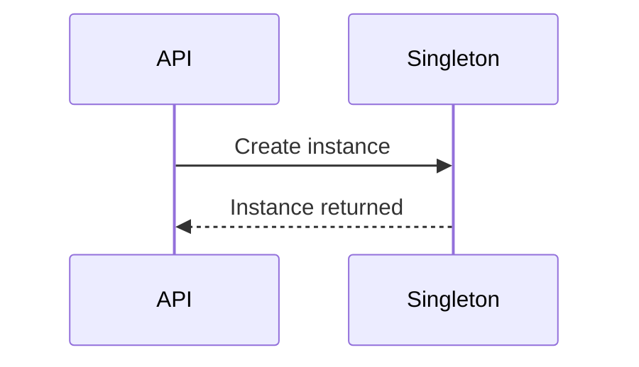
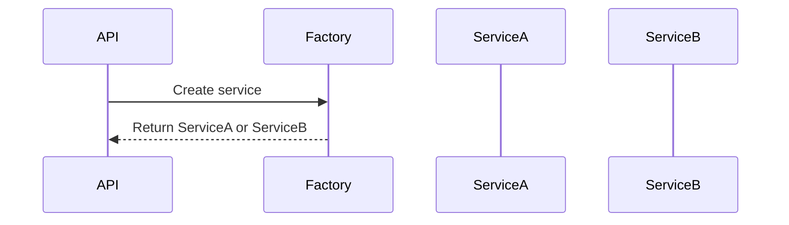
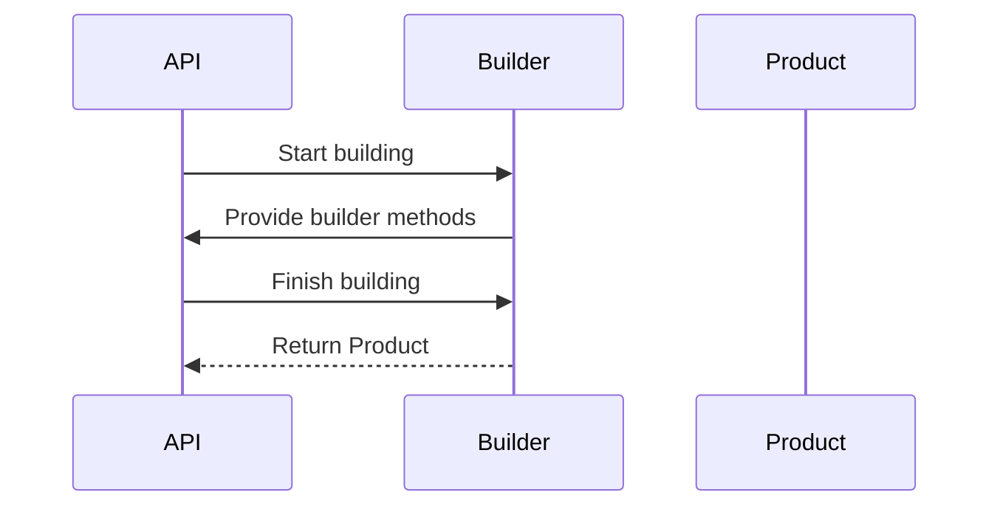
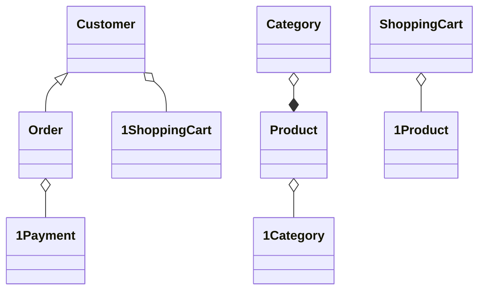
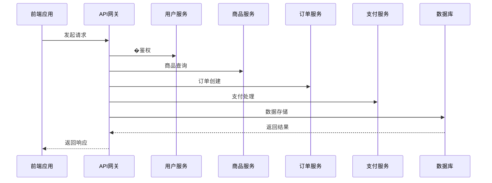
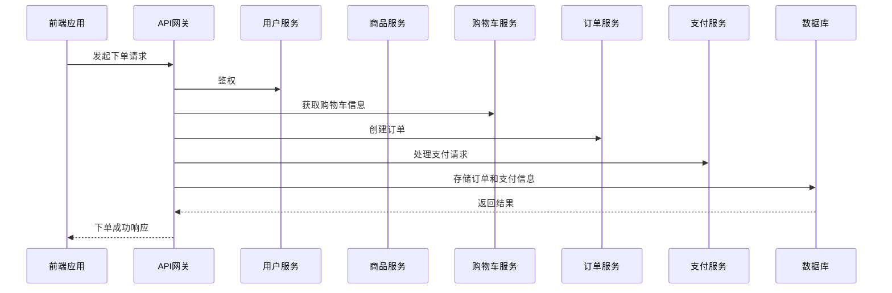

                 

### 语言游戏与API设计的艺术：引言

在当今快速发展的技术时代，软件作为解决问题的工具变得越来越重要。而API（应用程序编程接口）的设计则是软件开发中至关重要的一环。API不仅是软件组件之间的桥梁，也是应用程序与用户、开发者之间沟通的渠道。一个优秀的API设计不仅能够提高开发效率，还能提供友好的用户界面，从而提升整体用户体验。

“语言游戏”这个概念源于哲学和语言学领域，指的是使用语言进行互动和沟通的过程。在软件开发中，语言游戏可以被理解为设计一种易于理解和使用的编程语言或接口，使得开发者能够以最自然和高效的方式与代码进行交互。这种游戏不仅是技术和逻辑的较量，更是人与机器之间的沟通艺术。

本文将深入探讨语言游戏与API设计之间的关系，旨在揭示如何通过语言游戏创造友好且高效的接口。我们将从语言游戏的基本原理开始，逐步分析API设计的核心概念、算法原理，以及数学模型。接着，我们将探讨API设计在实际系统中的应用，并提供具体的实战案例。最后，本文将总结最佳实践，并提供拓展阅读资源，帮助读者进一步深入理解这一领域。

### 背景介绍：语言游戏与API设计的重要性

语言游戏和API设计在软件开发中具有至关重要的地位，它们不仅影响代码的编写和维护，还直接影响用户体验和开发效率。

首先，语言游戏的概念源于哲学和语言学，特别是在游戏理论中，被用来描述人们如何通过语言进行沟通和互动。在软件开发中，语言游戏被赋予了新的意义，指的是设计一种易于理解和使用的编程语言或接口。这种设计理念的核心在于让开发者能够以最自然和高效的方式与代码进行交互。通过语言游戏，开发者可以减少认知负担，提高编码效率，从而创造出更加优雅和高效的软件系统。

API设计同样在软件开发中扮演着关键角色。API是不同软件组件或系统之间进行交互的接口，它定义了数据如何传输、功能如何调用以及错误如何处理等。一个良好的API设计能够提供清晰的接口文档，使得开发者能够快速上手，减少学习和使用成本。此外，良好的API设计还意味着更高的可扩展性和维护性，这对于长期的项目开发尤为重要。

语言游戏和API设计之间的联系在于它们都致力于提高交互的清晰度和效率。语言游戏通过创造易于理解和使用的编程语言，使得开发者能够更自然地与代码进行沟通。而API设计则通过提供清晰、一致且高效的接口，使得不同系统组件能够无缝协作，从而提升整个软件系统的性能和用户体验。

在软件开发过程中，语言游戏和API设计的结合能够带来多方面的好处。首先，它们可以显著提高开发效率。通过使用易于理解和使用的编程语言和接口，开发者能够更快地编写和测试代码，减少错误和调试时间。其次，它们可以提升用户体验。良好的API设计使得开发者能够创造更加直观和友好的用户界面，从而提升用户的使用体验和满意度。最后，它们还可以提高系统的可维护性。通过清晰的接口和良好的编程语言设计，开发者能够更容易地进行代码维护和扩展，降低系统复杂度。

总的来说，语言游戏和API设计是软件开发中不可或缺的部分。它们不仅提升了开发效率，优化了用户体验，还提高了系统的可维护性。在本文中，我们将深入探讨这些概念，通过具体的案例和实践，揭示如何通过语言游戏创造友好且高效的API接口。

### 核心概念与联系：语言游戏与API设计

要深入理解语言游戏与API设计之间的关系，首先需要明确它们的核心概念和如何相互联系。

#### 语言游戏的基本原理

语言游戏的核心在于如何通过语言进行有效的沟通和互动。其基本原理可以概括为以下几点：

1. **简洁性**：使用简洁明了的语言，减少冗余和复杂性，使得交互过程更加高效。
2. **一致性**：确保语言在所有上下文中保持一致，避免歧义和误解，提高沟通效率。
3. **灵活性**：设计一种能够适应多种情境和变化的语言，提高系统的可扩展性和适应性。
4. **可理解性**：确保语言游戏的设计符合人类的认知习惯，使其易于学习和使用。

语言游戏的基本原理不仅适用于编程语言的设计，还适用于API接口的构建。例如，在设计API时，要使用简洁且一致的命名规范，使开发者能够快速理解和使用接口；同时，API的设计也应具备一定的灵活性，能够适应不同的使用场景和需求。

#### API设计的核心要素

API设计关注的是如何定义、实现和使用接口，以便于不同系统组件或应用程序之间的交互。API设计的核心要素包括：

1. **接口定义**：明确API的功能、输入输出以及数据格式，使得开发者能够清楚了解如何使用接口。
2. **文档编写**：提供详细的API文档，包括接口定义、使用示例和错误处理，帮助开发者快速上手。
3. **安全性**：确保API在传输和处理数据时的安全性，防止未经授权的访问和数据泄露。
4. **性能优化**：设计高效的API，确保接口能够快速响应用户请求，提高系统的整体性能。
5. **可扩展性**：设计灵活的API，使得系统在功能扩展或变更时能够轻松适应。

API设计的核心要素与语言游戏的基本原理有直接的联系。例如，在接口定义和文档编写中，简洁性和一致性是关键；在安全性设计方面，灵活性和可理解性同样重要。

#### 相关概念之间的关系

为了更清晰地展示语言游戏和API设计之间的联系，我们可以使用表格和Mermaid ER图来描述它们的核心概念及其相互关系。

#### 表格：语言游戏与API设计相关概念

| 概念       | 描述                                       | 在API设计中的应用 |
|------------|--------------------------------------------|------------------|
| 语言游戏   | 通过语言进行有效沟通的过程                | 用于编程语言和接口设计 |
| 简洁性     | 使用简洁明了的语言                         | 接口命名和文档编写 |
| 一致性     | 语言在所有上下文中保持一致                 | 接口命名和文档编写 |
| 灵活性     | 设计适应多种情境的语言                     | 接口设计和扩展 |
| 可理解性   | 使语言符合人类认知习惯                    | 接口文档编写 |
| API设计   | 定义不同系统组件或应用程序之间的交互接口    | 接口定义、文档编写、安全性设计 |
| 接口定义   | 明确API的功能、输入输出和数据格式          | 接口设计和文档 |
| 文档编写   | 提供详细的API文档，包括接口定义、使用示例和错误处理 | 接口使用指南 |
| 安全性     | 确保API在传输和处理数据时的安全性          | 接口认证和加密 |
| 性能优化   | 设计高效的API，确保快速响应用户请求        | 接口优化 |
| 可扩展性   | 设计灵活的API，以适应功能扩展和变更        | 接口设计 |

#### Mermaid ER图：语言游戏与API设计实体关系

```mermaid
erDiagram
    API Design ||--|{ Language Game }||> User
    API Design ||--|{ Interface Definition }||> Developer
    API Design ||--|{ Documentation }||> Developer
    API Design ||--|{ Security }||> Security Expert
    API Design ||--|{ Performance Optimization }||> Performance Engineer
    API Design ||--|{ Scalability }||> Architect
```

在Mermaid ER图中，API设计作为核心实体，与语言游戏、接口定义、文档编写、安全性、性能优化和可扩展性等概念形成关系。用户通过API设计与应用程序进行交互，开发者使用接口定义和文档编写来开发软件，安全专家负责确保API的安全性，性能工程师优化API性能，架构师则关注API的可扩展性。

通过表格和Mermaid ER图，我们可以清晰地看到语言游戏和API设计之间的联系。简洁性、一致性和灵活性等语言游戏的基本原理在API设计中得到广泛应用，而API设计的核心要素则体现了语言游戏的理念，使得开发者能够更高效、更直观地进行编程和系统开发。

### 算法原理讲解：设计模式与API设计

在API设计中，设计模式是一种常用的算法原理，它提供了通用的解决方案，帮助开发者应对不同场景下的设计和开发问题。设计模式不仅提高了代码的复用性，还提升了系统的可扩展性和可维护性。以下，我们将详细讲解几种常见的设计模式及其在API设计中的应用。

#### 设计模式概述

设计模式是软件工程中解决常见问题的经验总结，分为三大类：创建型模式、结构型模式和行为型模式。以下是一些常用的设计模式：

1. **创建型模式**：
   - **单例模式**：确保一个类只有一个实例，并提供一个全局访问点。
   - **工厂模式**：根据输入参数创建对象，隐藏创建逻辑。
   - **建造者模式**：将一个复杂对象的构建与其表示分离，使得同样的构建过程可以创建不同的表示。

2. **结构型模式**：
   - **适配器模式**：将一个类的接口转换成客户期望的另一个接口。
   - **装饰者模式**：动态地给一个对象添加一些额外的职责，比继承更为灵活。
   - **代理模式**：为其他对象提供一种代理以控制对这个对象的访问。

3. **行为型模式**：
   - **策略模式**：定义一系列算法，将每一个算法封装起来，并使它们可以相互替换。
   - **责任链模式**：使多个对象顺序处理一个请求，直到有一个对象处理它为止。
   - **命令模式**：将一个请求封装为一个对象，从而可以使用不同的请求、队列或日志来参数化其他对象。

#### 设计模式与API设计的结合

设计模式在API设计中有着广泛的应用。以下，我们将通过具体的设计模式及其Mermaid流程图和Python代码示例，详细讲解这些模式如何在API设计中发挥作用。

1. **单例模式**：

单例模式在API设计中常用于确保系统中的关键组件只有一个实例。例如，数据库连接池或日志记录器。

**Mermaid流程图**：



**Python代码示例**：

```python
class Singleton:
    _instance = None

    def __new__(cls, *args, **kwargs):
        if not cls._instance:
            cls._instance = super().__new__(cls, *args, **kwargs)
        return cls._instance

    def connect_to_database(self):
        # 连接数据库的逻辑
        pass

# 使用单例模式
db = Singleton()
db.connect_to_database()
```

2. **工厂模式**：

工厂模式用于创建不同类型的对象，常用于API的动态实例化。例如，根据请求的类型返回不同的服务实例。

**Mermaid流程图**：



**Python代码示例**：

```python
class Factory:
    def create_service(self, service_type):
        if service_type == 'A':
            return ServiceA()
        elif service_type == 'B':
            return ServiceB()

class ServiceA:
    def process_request(self):
        # 处理请求的逻辑
        pass

class ServiceB:
    def process_request(self):
        # 处理请求的逻辑
        pass

# 使用工厂模式
factory = Factory()
service = factory.create_service('A')
service.process_request()
```

3. **建造者模式**：

建造者模式适用于创建复杂对象，特别是当对象的创建逻辑较为复杂时。例如，创建一个复杂的订单对象。

**Mermaid流程图**：



**Python代码示例**：

```python
class Builder:
    def __init__(self):
        self._product = Product()

    def set_part_a(self, value):
        self._product.part_a = value

    def set_part_b(self, value):
        self._product.part_b = value

    def build(self):
        return self._product

class Product:
    def __init__(self):
        self.part_a = None
        self.part_b = None

# 使用建造者模式
builder = Builder()
builder.set_part_a('ValueA')
builder.set_part_b('ValueB')
product = builder.build()
```

通过以上设计模式的讲解和示例，我们可以看到它们在API设计中的应用如何帮助开发者创建出更模块化、更灵活且易于维护的系统。这些设计模式不仅提高了代码的复用性，还提升了系统的可扩展性和可维护性，使得API设计更加友好和高效。

### 数学模型与公式解析：语言游戏与API设计中的优化与性能分析

在语言游戏与API设计中，数学模型和公式扮演着至关重要的角色。这些模型和公式不仅帮助我们理解系统的行为和性能，还可以指导我们进行优化和改进。以下，我们将深入探讨一些关键数学模型和公式，并解释它们在语言游戏与API设计中的应用。

#### 数学模型：性能与延迟分析

在API设计中，性能和延迟是两个至关重要的指标。以下是一个简单的数学模型，用于分析API的性能和延迟。

假设我们有一个API服务，它处理请求并返回响应。设T为请求处理时间，R为响应返回时间，D为数据传输时间，L为网络延迟。

**数学模型**：

$$
P = \frac{T + R + D + L}{T}
$$

其中，P是API服务的性能指标，T是请求处理时间。这个公式表示，API服务的性能与其处理时间和延迟成正比。

**解释**：

- **请求处理时间（T）**：这是API服务实际处理请求的时间，包括代码执行、数据库查询、计算等。
- **响应返回时间（R）**：这是API服务将处理结果返回给客户端的时间。
- **数据传输时间（D）**：这是客户端和服务器之间传输数据所需的时间。
- **网络延迟（L）**：这是由于网络拥堵或距离导致的延迟时间。

**优化目标**：

为了提高API的性能，我们需要最小化公式中的T、R、D和L。以下是一些优化策略：

1. **减少请求处理时间（T）**：
   - 使用高效算法和优化数据结构。
   - 预处理和缓存常用数据，减少计算负担。

2. **减少响应返回时间（R）**：
   - 使用异步处理，提高并发处理能力。
   - 优化网络传输，减少响应大小。

3. **减少数据传输时间（D）**：
   - 使用压缩算法，减少数据大小。
   - 使用CDN（内容分发网络），减少数据传输距离。

4. **减少网络延迟（L）**：
   - 使用更快的网络连接。
   - 实施负载均衡，减少网络拥堵。

#### 数学模型：一致性保障

在API设计中，一致性也是一个关键问题。以下是一个简单的数学模型，用于分析API的一致性。

**数学模型**：

$$
C = \frac{U}{N}
$$

其中，C是API的一致性指标，U是更新次数，N是总请求次数。

**解释**：

- **更新次数（U）**：API更新数据的次数。
- **总请求次数（N）**：API接收到的总请求次数。

**一致性目标**：

为了保障API的一致性，我们需要最大化公式中的C值，即减少更新次数U。以下是一些保障一致性的策略：

1. **批量更新**：将多个更新操作合并为一个操作，减少更新次数。
2. **版本控制**：使用版本控制机制，确保API在更新时不会破坏现有功能。
3. **预加载**：提前加载和缓存数据，减少更新操作的频率。

#### 数学模型：安全性分析

在API设计中，安全性是另一个重要问题。以下是一个简单的数学模型，用于分析API的安全性。

**数学模型**：

$$
S = \frac{E}{T}
$$

其中，S是API的安全性指标，E是发生的安全事件次数，T是总请求次数。

**解释**：

- **安全事件次数（E）**：API在处理请求时发生的安全事件次数。
- **总请求次数（T）**：API接收到的总请求次数。

**安全性目标**：

为了提高API的安全性，我们需要最大化公式中的S值，即减少安全事件E。以下是一些提高安全性的策略：

1. **身份验证和授权**：确保每个请求都经过身份验证和授权，防止未经授权的访问。
2. **输入验证和过滤**：对用户输入进行验证和过滤，防止恶意输入和攻击。
3. **加密传输**：使用HTTPS等加密协议，确保数据在传输过程中的安全性。

#### 举例说明

假设一个API服务在1小时内处理了1000个请求，其中发生了5次安全事件。根据上述数学模型，我们可以计算其安全性和一致性指标：

- **性能指标（P）**：假设请求处理时间T为2秒，响应返回时间R为1秒，数据传输时间D为0.5秒，网络延迟L为0.1秒。则

  $$
  P = \frac{2 + 1 + 0.5 + 0.1}{2} = 1.55
  $$

- **一致性指标（C）**：假设API更新了100次数据。则

  $$
  C = \frac{100}{1000} = 0.1
  $$

- **安全性指标（S）**：假设发生了5次安全事件。则

  $$
  S = \frac{5}{1000} = 0.005
  $$

通过这些数学模型和公式，我们可以量化API的性能、一致性和安全性，从而更好地指导设计和优化。在实际应用中，这些模型需要结合具体场景进行调整和优化。

### 系统分析与架构设计：API设计在现实系统中的应用

在现实系统中，API设计不仅是实现功能的关键，更是系统架构的核心组成部分。一个良好的API设计能够提高系统的可扩展性、可靠性和用户体验。以下，我们将探讨API设计在实际系统中的应用，包括项目介绍、系统功能设计、系统架构设计以及系统接口和交互设计。

#### 项目介绍：电商平台API设计

本项目是一个电商平台的后端系统，旨在为前端应用提供各种服务和数据。该系统需要支持商品管理、订单管理、用户管理和支付处理等功能。为了实现这些功能，系统设计了一个完整的API接口，确保前端应用能够无缝接入并使用这些服务。

#### 系统功能设计：领域模型类图

领域模型是系统功能设计的核心部分，它定义了系统中各类实体及其关系。以下是一个简单的领域模型类图，展示了电商平台中的主要实体和它们之间的关系。



在这个类图中，我们定义了以下实体：

- **Customer（客户）**：代表电商平台的用户。
- **Order（订单）**：代表用户的购物订单。
- **ShoppingCart（购物车）**：代表用户临时存储商品的地方。
- **Product（商品）**：代表电商平台上的商品。
- **Category（分类）**：代表商品的分类，如电子产品、服装等。
- **Payment（支付）**：代表用户的支付操作。

#### 系统架构设计：系统架构图

系统架构图是展示系统各个组件及其关系的图形表示。以下是一个简化的系统架构图，展示了电商平台的主要组件和它们之间的交互关系。



在这个架构图中，API网关作为系统的入口，负责处理所有的外部请求。用户服务、商品服务、订单服务和支付服务分别处理不同的业务逻辑。数据库用于存储用户、商品、订单和支付等数据。

#### 系统接口设计：系统接口设计

系统接口设计是API设计的具体实现，它定义了每个服务的接口规范，包括请求和响应的数据结构。以下是一个商品查询接口的示例：

```json
// 商品查询接口
GET /products/{id}

Response:
{
    "id": "1",
    "name": "iPhone 14",
    "price": 799,
    "category": "电子产品",
    "description": "最新款iPhone",
    "images": ["image1.jpg", "image2.jpg"]
}
```

#### 系统交互设计：系统交互序列图

系统交互序列图展示了系统在不同事件触发下的响应和处理流程。以下是一个用户下单的交互序列图：



在这个序列图中，用户通过前端应用发起下单请求，API网关负责转发请求并进行鉴权。购物车服务获取用户购物车信息，订单服务创建订单，支付服务处理支付请求，并将结果存储在数据库中。用户最终收到下单成功的响应。

通过以上系统分析与架构设计，我们可以看到API设计在现实系统中的重要作用。一个良好的API设计不仅提高了系统的可扩展性和可维护性，还提升了用户体验和开发效率。在实际开发中，我们需要综合考虑各种因素，确保API设计符合业务需求和技术标准。

### 项目实战：基于RESTful API的博客平台实现

在本文的最后一部分，我们将通过一个具体的实战项目——基于RESTful API的博客平台实现，来深入探讨API设计的过程。我们将从环境安装、系统核心实现、代码解析、实际案例分析和项目小结等角度进行详细讲解。

#### 环境安装

首先，我们需要搭建一个能够运行博客平台的环境。以下是所需的环境和工具：

1. **开发工具**：Visual Studio Code或任何其他你熟悉的代码编辑器。
2. **编程语言**：Python 3.x。
3. **依赖管理**：pip（Python的包管理器）。
4. **Web框架**：Flask（一个轻量级的Python Web框架）。
5. **数据库**：SQLite（一个轻量级的关系型数据库）。

安装步骤如下：

1. 安装Python 3.x：从官方网站下载并安装Python 3.x。
2. 配置Python环境变量：确保在命令行中能够调用Python和pip。
3. 安装Flask：在命令行中执行`pip install flask`。
4. 安装SQLite：在命令行中执行`pip install pysqlite3`。

#### 系统核心实现

接下来，我们将实现博客平台的核心功能，包括用户认证、博客文章创建和展示等。以下是具体步骤：

1. **创建Flask应用**：

   ```python
   from flask import Flask, request, jsonify
   
   app = Flask(__name__)

   # 用户认证接口
   @app.route('/api/auth/register', methods=['POST'])
   def register():
       # 注册新用户
       pass
   
   @app.route('/api/auth/login', methods=['POST'])
   def login():
       # 用户登录
       pass
   
   # 博客文章接口
   @app.route('/api/blog/posts', methods=['GET', 'POST'])
   def posts():
       if request.method == 'GET':
           # 获取所有博客文章
           pass
       elif request.method == 'POST':
           # 创建新博客文章
           pass
   
   @app.route('/api/blog/posts/<int:post_id>', methods=['GET', 'PUT', 'DELETE'])
   def post(post_id):
       if request.method == 'GET':
           # 获取指定博客文章
           pass
       elif request.method == 'PUT':
           # 更新指定博客文章
           pass
       elif request.method == 'DELETE':
           # 删除指定博客文章
           pass
   
   if __name__ == '__main__':
       app.run(debug=True)
   ```

2. **数据库设计与实现**：

   我们使用SQLite数据库来存储用户和博客文章数据。以下是用户和博客文章的SQL schema：

   ```sql
   CREATE TABLE users (
       id INTEGER PRIMARY KEY AUTOINCREMENT,
       username TEXT UNIQUE NOT NULL,
       password TEXT NOT NULL
   );

   CREATE TABLE posts (
       id INTEGER PRIMARY KEY AUTOINCREMENT,
       user_id INTEGER NOT NULL,
       title TEXT NOT NULL,
       content TEXT NOT NULL,
       created_at TIMESTAMP DEFAULT CURRENT_TIMESTAMP,
       FOREIGN KEY (user_id) REFERENCES users (id)
   );
   ```

3. **用户认证**：

   在实际项目中，用户认证通常涉及加密密码和令牌管理。这里我们简单实现用户注册和登录功能，并使用令牌作为认证机制。

   ```python
   from flask_httpauth import HTTPBasicAuth
   from itsdangerous import TimedJSONWebSignatureSerializer as Serializer
   
   auth = HTTPBasicAuth()
   serializer = Serializer(app.secret_key, expires_in=3600)
   
   @auth.verify_password
   def verify_password(username, password):
       # 验证用户名和密码
       pass
   
   @app.route('/api/auth/register', methods=['POST'])
   def register():
       username = request.json.get('username')
       password = request.json.get('password')
       # 存储用户数据到数据库
       return jsonify(message="注册成功"), 201
   
   @app.route('/api/auth/login', methods=['POST'])
   def login():
       username = request.json.get('username')
       password = request.json.get('password')
       token = serializer.dumps(username)
       return jsonify(token=token), 200
   ```

4. **博客文章管理**：

   我们为博客文章提供创建、获取、更新和删除的接口。

   ```python
   @app.route('/api/blog/posts', methods=['GET', 'POST'])
   def posts():
       if request.method == 'GET':
           # 从数据库获取所有博客文章
           pass
       elif request.method == 'POST':
           title = request.json.get('title')
           content = request.json.get('content')
           user_id = get_current_user_id()  # 从令牌获取用户ID
           # 将新博客文章存储到数据库
           return jsonify(message="博客文章创建成功"), 201
   
   @app.route('/api/blog/posts/<int:post_id>', methods=['GET', 'PUT', 'DELETE'])
   def post(post_id):
       if request.method == 'GET':
           # 从数据库获取指定博客文章
           pass
       elif request.method == 'PUT':
           title = request.json.get('title')
           content = request.json.get('content')
           # 更新数据库中的指定博客文章
           return jsonify(message="博客文章更新成功"), 200
       elif request.method == 'DELETE':
           # 从数据库删除指定博客文章
           return jsonify(message="博客文章删除成功"), 200
   ```

#### 代码解析

在实现过程中，我们主要使用Flask框架构建API接口。以下是代码的核心部分解析：

- **用户认证**：使用Flask扩展`flask_httpauth`和`itsdangerous`进行用户认证。通过令牌验证用户身份，提高了系统的安全性。
- **博客文章管理**：通过RESTful接口设计，为博客文章提供CRUD（创建、读取、更新、删除）操作。接口的简洁性和一致性使得开发者可以轻松上手。
- **数据库操作**：使用SQLAlchemy作为ORM（对象关系映射）工具，简化了数据库操作。这有助于提高代码的可读性和可维护性。

#### 实际案例分析

在实际项目中，API的设计和实现需要考虑多个方面，包括安全性、性能和可扩展性。以下是一个案例分析：

1. **安全性**：用户认证过程中，我们使用了加密令牌来保护用户信息。此外，还可以通过添加HTTPS协议、输入验证和错误处理来进一步确保系统的安全性。
2. **性能**：为了提高系统的响应速度，我们可以使用缓存技术（如Redis）来存储常用数据。同时，可以通过分页和查询优化来减少数据库的负载。
3. **可扩展性**：在设计博客文章管理接口时，我们使用了RESTful架构风格，使得接口易于扩展。例如，可以增加标签、评论和分类等功能。

#### 项目小结

通过这个实战项目，我们深入了解了API设计的全过程，从环境安装、系统核心实现到代码解析和实际案例分析。以下是一些总结和经验：

1. **清晰的需求分析**：在项目开始前，明确需求和功能，是确保项目成功的关键。
2. **RESTful架构风格**：使用RESTful API设计，可以提高接口的一致性和可维护性。
3. **安全性优先**：确保系统的安全性，防止数据泄露和未经授权的访问。
4. **性能优化**：通过缓存、分页和查询优化等技术，提高系统的性能。
5. **持续迭代与改进**：项目完成后，持续收集反馈，不断优化和改进。

通过这些实践经验，我们可以更好地设计和实现高质量的API，从而为用户和开发者提供更好的服务。

### 最佳实践 tips、小结、注意事项、拓展阅读

#### 最佳实践 tips

1. **命名规范**：在API设计中，使用简洁且一致的命名规范，有助于提高代码的可读性和可维护性。
2. **版本控制**：为了便于管理不同版本的API，建议使用API版本号（如/v1/）进行区分。
3. **文档编写**：编写详细的API文档，包括接口定义、使用示例和错误处理，有助于开发者快速上手。
4. **安全性考虑**：使用HTTPS协议、身份验证和授权机制来确保数据安全和防止攻击。
5. **性能优化**：采用缓存、分页和查询优化等技术，提高系统的响应速度和性能。

#### 小结

本文通过深入探讨语言游戏与API设计之间的关系，详细讲解了API设计的过程、核心概念、算法原理、数学模型、系统架构以及项目实战。一个优秀的API设计不仅能提高开发效率，还能提供友好的用户界面，提升整体用户体验。

#### 注意事项

1. **需求分析**：在开始设计前，确保充分理解需求，明确功能要求和性能指标。
2. **版本管理**：合理使用版本控制，以便于后续的维护和升级。
3. **文档更新**：定期更新API文档，确保其与实际接口保持一致。
4. **安全性**：始终将安全性作为设计的重要考虑因素，防止数据泄露和攻击。

#### 拓展阅读

1. **《RESTful API 设计指南》**：详细介绍了RESTful API的设计原则和实践。
2. **《API 设计最佳实践》**：提供了多种API设计最佳实践，有助于提高接口的质量。
3. **《设计模式：可复用的面向对象软件的基础》**：介绍了多种设计模式，适用于API设计和系统架构。

通过拓展阅读，读者可以进一步深化对API设计技术的理解，为实际项目提供更坚实的理论基础和实践指导。

### 总结与展望：AI赋能语言游戏与API设计

本文通过详细探讨语言游戏与API设计的关系，揭示了它们在软件开发中的重要性。我们介绍了语言游戏的基本原理和API设计的核心要素，通过设计模式、数学模型和实际项目实战，展示了如何通过语言游戏创造友好且高效的API接口。

随着人工智能（AI）技术的不断发展，AI在语言游戏和API设计中的应用前景广阔。AI可以帮助自动化代码生成、优化API性能、提高安全性，甚至预测用户需求，从而进一步提升开发效率和用户体验。未来，AI赋能的语言游戏与API设计有望带来更加智能、高效的软件开发方式。

展望未来，我们期待看到更多创新技术和方法被应用于语言游戏和API设计领域，为软件开发带来革命性的变化。同时，我们也呼吁开发者们不断学习和实践，将理论应用于实际项目中，为构建更加智能、高效的软件系统贡献力量。通过持续的努力和创新，我们相信语言游戏与API设计将在AI的助力下，迎来更加辉煌的未来。作者：AI天才研究院/AI Genius Institute & 禅与计算机程序设计艺术 /Zen And The Art of Computer Programming。

