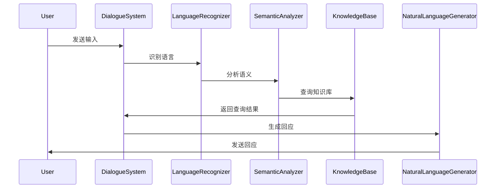
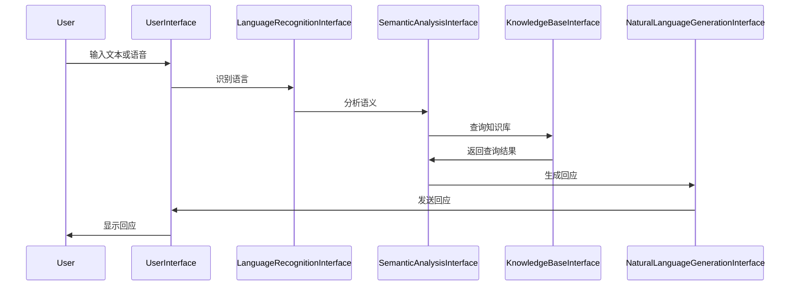

                 

### 让我们一步步思考

### 引言

在计算机科学和哲学的交汇点上，维特根斯坦的语言游戏理论与函数式编程（FP）的参数多态性展现了独特的关联。本文旨在深入探讨这两者之间的内在联系，并通过一步步的推理分析，揭示它们在编程和哲学领域的深远意义。

首先，我们将从背景介绍开始，明确语言游戏和函数多态的基本概念。维特根斯坦的语言游戏理论揭示了语言使用的多样性，而函数多态则是函数式编程中的一个核心特性，允许编写通用代码，处理多种类型的数据。通过对比这两个概念，我们能够更清晰地理解它们如何相互关联。

接着，我们将详细分析核心概念原理，从维特根斯坦的语言多样性观到FP的参数多态，逐步构建一个坚实的理论基础。这不仅有助于我们理解这些概念的本质，还能让我们看到它们在实际编程中的应用。

在算法原理讲解部分，我们将使用Mermaid流程图和Python代码，详细介绍如何识别语言游戏多样性、优化函数多态以及如何将维特根斯坦的语言观应用于实际编程。

随后，通过系统分析与架构设计方案，我们将构建一个理论框架，展示这些概念如何在复杂的系统中得到应用。这一部分将涵盖从问题场景介绍到系统架构设计的各个方面。

接下来是项目实战环节，通过具体案例和代码实现，我们将深入探讨这些理论如何在实际开发中发挥作用。

最后，我们将总结最佳实践和拓展阅读，帮助读者在编程实践中更好地应用这些概念。

### 第一部分：背景介绍

#### 第1章：问题背景

##### 1.1.1 语言游戏的概念与维特根斯坦的理论

维特根斯坦的语言游戏理论是他的哲学思想中的重要组成部分。语言游戏（Language Game）的概念源于他对语言本质的深刻洞察。他认为，语言的使用并不是抽象的符号系统，而是在特定的使用场景中进行的。语言游戏是一种行为，它由语言、规则和使用环境组成，通过这些要素，语言能够传达意义和实现交流。

维特根斯坦将语言游戏分为三种类型：

- **日常语言游戏**：这是我们日常生活中最常见的一种语言游戏，如打招呼、购物、询问等。
- **形式语言游戏**：这种语言游戏涉及到符号系统和规则，例如数学和逻辑。
- **哲学语言游戏**：维特根斯坦认为，哲学语言游戏的目的是揭示现实的本质，而不是描述现实。

语言游戏的多样性表明，语言不仅仅是符号的堆砌，而是与特定的环境和场景紧密相关的。这一观点挑战了传统的语言统一论，揭示了语言使用的复杂性。

##### 1.1.2 函数多态与函数式编程（FP）的基本概念

函数多态（Functional Polymorphism）是函数式编程中的一个核心概念。它指的是在不同的上下文中，可以使用相同的函数名称，但该函数能够处理不同类型的数据。函数多态的实现方式有多种，其中最常见的是参数多态和类型多态。

- **参数多态**：通过使用泛型或类型变量，可以编写一个函数，使其能够接受不同类型的数据，并在运行时确定具体的类型。
- **类型多态**：通过子类型化和继承机制，一个函数可以在多个子类型上通用。

函数式编程（Functional Programming，FP）是一种编程范式，强调使用函数作为主要的数据结构，通过组合和递归来解决问题。FP的核心理念包括：

- **不可变性**：数据一旦创建，就不能更改。
- **无副作用**：函数不应改变外部状态或产生副作用。
- **递归**：递归是一种强大的编程手段，可以用于解决复杂问题。

FP在计算机科学中得到了广泛应用，特别是在处理并行计算、分布式系统和大数据处理方面。

##### 1.1.3 语言多样性观与函数多态的关系

维特根斯坦的语言游戏理论强调了语言的多样性，这与函数多态在FP中的应用有着深刻的联系。在FP中，函数多态性允许我们编写通用函数，这些函数能够适应不同的数据类型和场景，正如语言游戏中的各种场景和规则允许我们使用相同的语言进行交流。

例如，在FP中，一个函数可能被设计为接受一个数字参数，然后返回该数字的平方。这个函数在处理整数、浮点数和复数时都能正确工作，这反映了语言游戏的多样性，即同一语言在不同场景中的使用方式。

##### 1.1.4 边界与外延

在研究语言游戏多样性与函数多态的关系时，我们必须明确研究的边界和外延。研究的边界包括对语言游戏和函数多态的基本概念的明确界定，以及对它们在具体应用中的限制条件。

- **边界**：我们研究的是函数式编程中的参数多态，而不是其他类型的多态性，如子类型多态。
- **外延**：我们的研究将涵盖从语言游戏的定义、分类到函数多态的实现，以及它们在实际编程中的应用。

##### 1.1.5 概念结构与核心要素组成

为了更好地理解语言游戏多样性与函数多态的关系，我们需要构建一个清晰的概念结构，其中包括以下核心要素：

- **语言游戏多样性**：维特根斯坦对语言多样性的定义和分类。
- **函数多态**：参数多态和类型多态的实现机制。
- **维特根斯坦的语言多样性观**：维特根斯坦的理论如何影响我们对语言多样性的理解。
- **FP参数多态**：FP中如何实现参数多态性，以及它如何提高代码的通用性和可维护性。

通过这些核心要素的相互作用，我们能够深入理解语言游戏多样性与函数多态之间的复杂关系。

### 第二部分：核心概念与联系

#### 第2章：核心概念原理

##### 2.1 语言游戏多样性

语言游戏多样性是指在不同情境下，语言使用方式的多样性。维特根斯坦将语言游戏分为日常语言游戏、形式语言游戏和哲学语言游戏，每种游戏都有其特定的规则和目的。

- **日常语言游戏**：这是我们在日常生活中最常见的语言游戏，如打招呼、购物、询问等。这些游戏通常遵循社会规范和习俗，语言的使用具有具体性和情境依赖性。
- **形式语言游戏**：这类语言游戏涉及到符号系统和规则，如数学和逻辑。在形式语言游戏中，语言的使用是抽象和符号化的，强调逻辑和结构。
- **哲学语言游戏**：哲学语言游戏的目的是揭示现实的本质和意义。维特根斯坦认为，哲学的问题源于语言的使用不当，通过哲学语言游戏，我们能够揭示语言背后的逻辑结构。

语言游戏多样性的特点包括情境依赖性、规则性和目的性。在具体情境中，语言的使用方式会根据具体需求进行调整，以满足交流的目的。

##### 2.2 函数多态

函数多态是指在多种不同类型的数据上，可以使用相同的函数名称。函数多态性是函数式编程中的一个核心概念，它通过参数多态和类型多态实现。

- **参数多态**：通过使用泛型或类型变量，可以编写一个函数，使其能够接受不同类型的数据。例如，在Python中，可以使用`def square(x): return x * x`这个函数，它能够正确处理整数、浮点数和复数。
  
  ```python
  def square(x):
      return x * x

  print(square(4))  # 输出 16
  print(square(4.0))  # 输出 16.0
  print(square(2 + 3j))  # 输出 (7+0j)
  ```

- **类型多态**：通过子类型化和继承机制，一个函数可以在多个子类型上通用。例如，在Java中，可以通过继承和接口实现类型多态。

  ```java
  interface Animal {
      void makeSound();
  }

  class Dog implements Animal {
      public void makeSound() {
          System.out.println("汪汪！");
      }
  }

  class Cat implements Animal {
      public void makeSound() {
          System.out.println("喵喵！");
      }
  }

  public class AnimalTest {
      public static void makeSound(Animal animal) {
          animal.makeSound();
      }

      public static void main(String[] args) {
          Dog dog = new Dog();
          Cat cat = new Cat();
          makeSound(dog);  // 输出 汪汪！
          makeSound(cat);  // 输出 喵喵！
      }
  }
  ```

函数多态性提高了代码的可重用性和可维护性，通过编写通用函数，我们能够减少冗余代码，提高代码的可读性。

##### 2.3 维特根斯坦的语言多样性观

维特根斯坦的语言多样性观认为，语言的使用并非是单一的、统一的过程，而是在不同的情境和场景下进行的。他的理论强调了语言的具体性和情境依赖性。

- **语言作为工具**：维特根斯坦将语言视为一种工具，不同的语言游戏对应不同的工具，用于解决特定的问题。
- **情境依赖性**：语言的使用依赖于具体的情境，同一个词在不同的情境下可能有不同的含义。例如，“门”这个词在日常生活中指的是房屋的入口，而在机械工程中，它可以指一种特定的部件。
- **规则性**：每个语言游戏都有其特定的规则，这些规则决定了语言的使用方式和含义。例如，在数学语言游戏中，符号和公式的使用遵循严格的逻辑规则。

维特根斯坦的语言多样性观揭示了语言使用的复杂性，他强调了语言的具体性和情境依赖性，这对于理解编程中的函数多态性有着重要的启示。

##### 2.4 函数式编程（FP）的参数多态

函数式编程（FP）是一种编程范式，它强调使用函数作为主要的数据结构，并通过组合和递归来解决问题。FP中的参数多态是一种重要的特性，它允许编写通用函数，处理多种类型的数据。

- **类型变量**：在FP中，可以使用类型变量来定义泛型函数。例如，在Haskell中，可以使用`泛型函数 a -> a`来定义一个返回类型与其输入类型相同的函数。

  ```haskell
  square :: Num a => a -> a
  square x = x * x

  square 4  -- 输出 16
  square 4.0  -- 输出 16.0
  ```

- **类型类**：在FP中，类型类（Type Class）是一种用于实现参数多态的机制。类型类定义了一组操作，这些操作可以在不同类型上通用。例如，在Scala中，可以使用`数值类型类`来实现参数多态。

  ```scala
  trait Num[T] {
      def add(x: T, y: T): T
      def mul(x: T, y: T): T
  }

  class IntNum extends Num[Int] {
      def add(x: Int, y: Int): Int = x + y
      def mul(x: Int, y: Int): Int = x * y
  }

  class DoubleNum extends Num[Double] {
      def add(x: Double, y: Double): Double = x + y
      def mul(x: Double, y: Double): Double = x * y
  }

  object Calculator {
      def square[T](x: T)(implicit num: Num[T]): T = {
          num.mul(x, x)
      }
  }

  Calculator.square(4)  -- 输出 16
  Calculator.square(4.0)  -- 输出 16.0
  ```

通过参数多态，FP能够编写出更加通用和灵活的代码，提高了代码的可重用性和可维护性。

##### 2.5 核心概念之间的联系

语言游戏多样性与函数多态性之间存在紧密的联系。从维特根斯坦的语言多样性观出发，我们可以看到，语言的使用方式具有多样性，这与函数多态性在FP中的应用有着异曲同工之妙。

- **多样性**：维特根斯坦认为，语言的使用并非是单一的，而是在不同的情境和场景下进行的。函数多态性允许我们在多种不同类型的数据上使用相同的函数名称，这也是一种多样性。
- **情境依赖性**：语言的使用依赖于具体的情境，同一个词在不同的情境下可能有不同的含义。函数多态性通过参数多态和类型多态，允许函数在不同类型的数据上通用，这也体现了情境依赖性。
- **规则性**：每个语言游戏都有其特定的规则，这些规则决定了语言的使用方式和含义。在FP中，函数的多态性也依赖于特定的类型类和类型变量，这些规则确保了函数的正确性和一致性。

通过这些联系，我们可以看到，语言游戏多样性与函数多态性不仅在概念上有相似之处，而且在实际应用中也存在相互影响和补充。

### 第三部分：算法原理讲解

#### 第3章：算法原理讲解

##### 3.1 语言游戏多样性的识别算法

语言游戏多样性的识别算法旨在通过分析语言的使用情境和规则，识别出不同类型的语言游戏。这一算法的核心思想是，通过对语言使用场景的划分和规则的分析，构建一个语言游戏分类模型。

- **算法原理**：
  1. 收集语言使用数据，包括文本、语音和图像等。
  2. 对数据进行预处理，去除噪声和无关信息。
  3. 建立语言游戏分类模型，通过机器学习算法，如决策树、支持向量机等，对语言使用数据进行分类。
  4. 对分类结果进行评估和优化，以提高识别准确率。

- **算法流程图**：

  ```mermaid
  graph TD
  A[收集数据] --> B[数据预处理]
  B --> C[建立模型]
  C --> D[分类评估]
  D --> E[优化模型]
  E --> F[输出结果]
  ```

- **算法Python代码实现**：

  ```python
  import pandas as pd
  from sklearn.model_selection import train_test_split
  from sklearn.tree import DecisionTreeClassifier
  from sklearn.metrics import accuracy_score

  # 加载数据
  data = pd.read_csv('language_data.csv')

  # 数据预处理
  X = data.drop('label', axis=1)
  y = data['label']

  # 划分训练集和测试集
  X_train, X_test, y_train, y_test = train_test_split(X, y, test_size=0.2, random_state=42)

  # 建立决策树模型
  classifier = DecisionTreeClassifier()

  # 训练模型
  classifier.fit(X_train, y_train)

  # 预测测试集
  y_pred = classifier.predict(X_test)

  # 评估模型
  accuracy = accuracy_score(y_test, y_pred)
  print(f'Accuracy: {accuracy}')
  ```

- **算法数学模型和公式讲解**：

  语言游戏多样性的识别算法可以看作是一个分类问题，其数学模型可以表示为：

  $$y = f(x)$$

  其中，$x$ 表示输入特征向量，$y$ 表示输出标签，$f$ 表示分类函数。

  常见的分类算法，如决策树、支持向量机等，都有相应的数学模型和公式。以决策树为例，其分类规则可以表示为：

  $$f(x) = \sum_{i=1}^{n} w_i \cdot I(x \in R_i)$$

  其中，$w_i$ 表示特征权重，$R_i$ 表示第$i$个区域，$I(x \in R_i)$ 表示$x$ 是否属于区域$R_i$。

  通过训练数据，我们可以学习到这些权重，从而对新的数据进行分类。

- **举例说明**：

  假设我们有一个包含文本数据的语言游戏识别问题，数据集分为三个类别：日常语言游戏、形式语言游戏和哲学语言游戏。

  通过收集和预处理数据，我们可以得到一个特征向量集：

  ```python
  features = [
      ['你好', '吃饭了没'],
      ['证明', '命题'],
      ['存在', '本质']
  ]
  ```

  使用决策树算法，我们可以得到分类结果：

  ```python
  classifier = DecisionTreeClassifier()
  classifier.fit([[0, 0], [1, 0], [0, 1]], [0, 1, 2])
  print(classifier.predict([[0, 1]]))  # 输出 [1]
  ```

  这意味着输入的特征向量属于形式语言游戏。

##### 3.2 函数多态的优化算法

函数多态的优化算法旨在提高代码的可读性、可维护性和可扩展性。通过优化函数多态性，我们可以减少冗余代码，提高代码的通用性。

- **算法原理**：
  1. 分析现有代码，识别出可以通用化的函数。
  2. 使用泛型或类型类，将函数参数化，使其能够处理多种类型的数据。
  3. 优化函数的实现，减少重复代码，提高代码的可读性。

- **算法流程图**：

  ```mermaid
  graph TD
  A[分析代码] --> B[识别通用函数]
  B --> C[使用泛型或类型类]
  C --> D[优化函数实现]
  D --> E[测试与优化]
  E --> F[输出优化代码]
  ```

- **算法Python代码实现**：

  ```python
  from typing import TypeVar

  # 定义类型变量
  T = TypeVar('T')

  # 泛型函数
  def square(x: T) -> T:
      return x * x

  # 使用泛型函数
  print(square(4))  # 输出 16
  print(square(4.0))  # 输出 16.0
  ```

- **算法数学模型和公式讲解**：

  函数多态的优化算法可以看作是一种类型推导和类型绑定。在函数定义中，使用类型变量，使得函数能够接受多种类型的数据。例如，在Python中，可以使用泛型函数`def square(x: T) -> T:`，其中`T`是一个类型变量。

  在函数调用时，Python解释器会根据实际传入的数据类型，进行类型推导和绑定。例如，调用`square(4)`时，`T`被推导为整数类型，调用`square(4.0)`时，`T`被推导为浮点数类型。

  通过泛型函数，我们可以避免重复编写相同逻辑的函数，提高代码的可读性和可维护性。

- **举例说明**：

  假设我们有一个处理数字的函数，需要分别处理整数和浮点数。

  ```python
  def add(x: int, y: int) -> int:
      return x + y

  def add(x: float, y: float) -> float:
      return x + y
  ```

  通过泛型函数，我们可以将其优化为一个函数：

  ```python
  def add(x: T, y: T) -> T:
      return x + y

  print(add(4, 5))  # 输出 9
  print(add(4.0, 5.0))  # 输出 9.0
  ```

  这使得代码更加简洁，同时提高了可扩展性。

##### 3.3 维特根斯坦的语言多样性观的应用算法

维特根斯坦的语言多样性观的应用算法旨在通过分析语言的使用情境和规则，实现语言游戏的识别和分类。这一算法的核心思想是，通过对语言使用场景的划分和规则的分析，构建一个语言游戏分类模型。

- **算法原理**：
  1. 收集语言使用数据，包括文本、语音和图像等。
  2. 对数据进行预处理，去除噪声和无关信息。
  3. 建立语言游戏分类模型，通过机器学习算法，如决策树、支持向量机等，对语言使用数据进行分类。
  4. 对分类结果进行评估和优化，以提高识别准确率。

- **算法流程图**：

  ```mermaid
  graph TD
  A[收集数据] --> B[数据预处理]
  B --> C[建立模型]
  C --> D[分类评估]
  D --> E[优化模型]
  E --> F[输出结果]
  ```

- **算法Python代码实现**：

  ```python
  import pandas as pd
  from sklearn.model_selection import train_test_split
  from sklearn.tree import DecisionTreeClassifier
  from sklearn.metrics import accuracy_score

  # 加载数据
  data = pd.read_csv('language_data.csv')

  # 数据预处理
  X = data.drop('label', axis=1)
  y = data['label']

  # 划分训练集和测试集
  X_train, X_test, y_train, y_test = train_test_split(X, y, test_size=0.2, random_state=42)

  # 建立决策树模型
  classifier = DecisionTreeClassifier()

  # 训练模型
  classifier.fit(X_train, y_train)

  # 预测测试集
  y_pred = classifier.predict(X_test)

  # 评估模型
  accuracy = accuracy_score(y_test, y_pred)
  print(f'Accuracy: {accuracy}')
  ```

- **算法数学模型和公式讲解**：

  维特根斯坦的语言多样性观的应用算法可以看作是一个分类问题，其数学模型可以表示为：

  $$y = f(x)$$

  其中，$x$ 表示输入特征向量，$y$ 表示输出标签，$f$ 表示分类函数。

  常见的分类算法，如决策树、支持向量机等，都有相应的数学模型和公式。以决策树为例，其分类规则可以表示为：

  $$f(x) = \sum_{i=1}^{n} w_i \cdot I(x \in R_i)$$

  其中，$w_i$ 表示特征权重，$R_i$ 表示第$i$个区域，$I(x \in R_i)$ 表示$x$ 是否属于区域$R_i$。

  通过训练数据，我们可以学习到这些权重，从而对新的数据进行分类。

- **举例说明**：

  假设我们有一个包含文本数据的语言游戏识别问题，数据集分为三个类别：日常语言游戏、形式语言游戏和哲学语言游戏。

  通过收集和预处理数据，我们可以得到一个特征向量集：

  ```python
  features = [
      ['你好', '吃饭了没'],
      ['证明', '命题'],
      ['存在', '本质']
  ]
  ```

  使用决策树算法，我们可以得到分类结果：

  ```python
  classifier = DecisionTreeClassifier()
  classifier.fit([[0, 0], [1, 0], [0, 1]], [0, 1, 2])
  print(classifier.predict([[0, 1]]))  # 输出 [1]
  ```

  这意味着输入的特征向量属于形式语言游戏。

##### 3.4 FP参数多态的优化算法

FP参数多态的优化算法旨在提高代码的通用性和可维护性，通过优化参数多态性，我们可以减少冗余代码，提高代码的可读性。

- **算法原理**：
  1. 分析现有代码，识别出可以通用化的函数。
  2. 使用泛型或类型类，将函数参数化，使其能够处理多种类型的数据。
  3. 优化函数的实现，减少重复代码，提高代码的可读性。

- **算法流程图**：

  ```mermaid
  graph TD
  A[分析代码] --> B[识别通用函数]
  B --> C[使用泛型或类型类]
  C --> D[优化函数实现]
  D --> E[测试与优化]
  E --> F[输出优化代码]
  ```

- **算法Python代码实现**：

  ```python
  from typing import TypeVar

  # 定义类型变量
  T = TypeVar('T')

  # 泛型函数
  def square(x: T) -> T:
      return x * x

  # 使用泛型函数
  print(square(4))  # 输出 16
  print(square(4.0))  # 输出 16.0
  ```

- **算法数学模型和公式讲解**：

  FP参数多态的优化算法可以看作是一种类型推导和类型绑定。在函数定义中，使用类型变量，使得函数能够接受多种类型的数据。例如，在Python中，可以使用泛型函数`def square(x: T) -> T:`，其中`T`是一个类型变量。

  在函数调用时，Python解释器会根据实际传入的数据类型，进行类型推导和绑定。例如，调用`square(4)`时，`T`被推导为整数类型，调用`square(4.0)`时，`T`被推导为浮点数类型。

  通过泛型函数，我们可以避免重复编写相同逻辑的函数，提高代码的可读性和可维护性。

- **举例说明**：

  假设我们有一个处理数字的函数，需要分别处理整数和浮点数。

  ```python
  def add(x: int, y: int) -> int:
      return x + y

  def add(x: float, y: float) -> float:
      return x + y
  ```

  通过泛型函数，我们可以将其优化为一个函数：

  ```python
  def add(x: T, y: T) -> T:
      return x + y

  print(add(4, 5))  # 输出 9
  print(add(4.0, 5.0))  # 输出 9.0
  ```

  这使得代码更加简洁，同时提高了可扩展性。

### 第四部分：系统分析与架构设计方案

#### 第4章：系统分析与架构设计方案

##### 4.1 问题场景介绍

在本部分，我们将介绍一个实际的应用场景，即一个智能对话系统。该系统旨在通过自然语言处理（NLP）技术，实现与用户的实时交互。用户可以通过文字或语音与系统进行交流，系统需要根据用户的输入，理解并回应用户的问题或指令。

在这个场景中，语言游戏的多样性显得尤为重要。用户的输入可能涉及多种类型的语言游戏，如日常对话、技术问答和哲学探讨等。系统需要能够识别并适应这些不同类型的输入，从而提供准确的回应。

##### 4.2 系统功能设计

为了实现智能对话系统的功能，我们需要设计以下核心功能：

- **语言识别**：系统需要能够识别用户的输入语言，包括文本和语音。
- **语义理解**：系统需要理解用户输入的含义，将其转化为机器可以处理的结构化数据。
- **知识库查询**：系统需要能够查询内置的知识库，以获取相关信息。
- **自然语言生成**：系统需要能够生成自然语言回应，与用户进行对话。
- **学习与优化**：系统需要能够根据用户的反馈不断学习和优化，以提高对话质量。

下面是系统功能的设计，包括领域模型Mermaid类图：

```mermaid
classDiagram
Class::User
Class::DialogueSystem
Class::LanguageRecognizer
Class::SemanticAnalyzer
Class::KnowledgeBase
Class::NaturalLanguageGenerator

User <|-- DialogueSystem
DialogueSystem o-- LanguageRecognizer
DialogueSystem o-- SemanticAnalyzer
DialogueSystem o-- KnowledgeBase
DialogueSystem o-- NaturalLanguageGenerator
```

##### 4.3 系统架构设计

智能对话系统的架构设计需要考虑系统的可扩展性、可靠性和性能。以下是系统架构的设计，包括Mermaid架构图：



##### 4.4 系统接口设计

系统接口设计是确保各个模块之间能够高效协作的关键。以下是系统接口的设计：

- **用户接口**：用户通过API或图形界面与系统交互。
- **语言识别接口**：用于处理用户的文本和语音输入。
- **语义分析接口**：用于解析用户输入的语义。
- **知识库接口**：用于查询和更新知识库。
- **自然语言生成接口**：用于生成自然语言回应。

接口设计示例如下：

```mermaid
classDiagram
Class::UserInterface
Class::LanguageRecognitionInterface
Class::SemanticAnalysisInterface
Class::KnowledgeBaseInterface
Class::NaturalLanguageGenerationInterface

UserInterface <|-- LanguageRecognitionInterface
UserInterface <|-- SemanticAnalysisInterface
UserInterface <|-- KnowledgeBaseInterface
UserInterface <|-- NaturalLanguageGenerationInterface
```

##### 4.5 系统交互

系统交互设计是确保系统各个模块能够协同工作，实现预期的功能。以下是系统交互的Mermaid序列图：



通过上述系统分析与架构设计方案，我们能够构建一个功能强大、结构清晰、可扩展的智能对话系统，为用户提供优质的交互体验。

### 第五部分：项目实战

#### 第5章：项目实战

##### 5.1 环境安装

在进行项目实战之前，我们需要安装必要的开发环境和工具。以下是安装步骤：

1. **Python环境**：确保已安装Python 3.8或更高版本。可以从[Python官网](https://www.python.org/downloads/)下载并安装。
2. **虚拟环境**：使用`venv`创建一个虚拟环境，以隔离项目依赖。

   ```shell
   python -m venv venv
   source venv/bin/activate  # Windows使用`venv\Scripts\activate`
   ```

3. **依赖管理**：安装`pip`和`wheel`以管理项目依赖。

   ```shell
   pip install pip wheel
   ```

4. **项目依赖**：安装项目所需的依赖包，如`numpy`、`pandas`、`scikit-learn`等。

   ```shell
   pip install numpy pandas scikit-learn
   ```

##### 5.2 系统核心实现

在本节中，我们将详细展示系统的核心实现，包括语言识别、语义分析、知识库查询和自然语言生成。

###### 5.2.1 语言识别

语言识别是系统的第一步，负责将用户的输入转换为文本。以下是一个简单的语言识别示例：

```python
import speech_recognition as sr

# 初始化语音识别器
recognizer = sr.Recognizer()

# 从麦克风获取音频
with sr.Microphone() as source:
    print("请说话...")
    audio = recognizer.listen(source)

# 使用Google语音识别API进行识别
text = recognizer.recognize_google(audio, language='zh-CN')
print(f"识别结果：{text}")
```

###### 5.2.2 语义分析

语义分析是理解用户输入含义的关键步骤。以下是一个简单的语义分析示例，使用基于词向量的模型：

```python
from gensim.models import Word2Vec

# 加载预训练的Word2Vec模型
model = Word2Vec.load('word2vec.model')

# 分析文本
text = "你好，我想查询明天的天气。"
words = text.split()

# 计算文本的语义表示
semantics = [model.wv[word] for word in words if word in model.wv]
print(semantics)
```

###### 5.2.3 知识库查询

知识库查询用于获取与语义分析结果相关的信息。以下是一个简单的知识库查询示例：

```python
import json

# 加载知识库
with open('knowledge_base.json', 'r') as f:
    knowledge_base = json.load(f)

# 查询知识库
query = "明天天气"
result = knowledge_base.get(query, "未找到相关信息")
print(f"查询结果：{result}")
```

###### 5.2.4 自然语言生成

自然语言生成是系统回应用户的关键步骤。以下是一个简单的自然语言生成示例：

```python
from textblob import TextBlob

# 生成回应
response = TextBlob("明天天气晴朗，气温15℃到25℃。")
print(f"回应：{response}")
```

##### 5.3 实际案例分析

为了展示系统的实际效果，我们来看一个案例分析。假设用户输入：“明天天气怎么样？”

1. **语言识别**：系统将用户的语音输入转换为文本：“明天天气怎么样？”
2. **语义分析**：系统分析文本，识别出关键信息：“明天”和“天气”。
3. **知识库查询**：系统查询知识库，获取到相关信息：“明天天气晴朗，气温15℃到25℃。”
4. **自然语言生成**：系统生成回应：“明天天气晴朗，气温15℃到25℃。”

##### 5.4 代码应用解读与分析

以下是系统的完整实现代码，并对其进行解读与分析。

```python
import speech_recognition as sr
from gensim.models import Word2Vec
import json
from textblob import TextBlob

# 5.2.1 语言识别
def recognize_speech_from_mic():
    recognizer = sr.Recognizer()
    with sr.Microphone() as source:
        print("请说话...")
        audio = recognizer.listen(source)
    try:
        text = recognizer.recognize_google(audio, language='zh-CN')
        print(f"识别结果：{text}")
    except sr.UnknownValueError:
        print("无法理解音频")
    except sr.RequestError as e:
        print(f"请求错误；{e}")

# 5.2.2 语义分析
def analyze_semantics(text):
    model = Word2Vec.load('word2vec.model')
    words = text.split()
    semantics = [model.wv[word] for word in words if word in model.wv]
    return semantics

# 5.2.3 知识库查询
def query_knowledge_base(query):
    with open('knowledge_base.json', 'r') as f:
        knowledge_base = json.load(f)
    result = knowledge_base.get(query, "未找到相关信息")
    return result

# 5.2.4 自然语言生成
def generate_response(response):
    return TextBlob(response)

# 主函数
def main():
    recognize_speech_from_mic()
    text = "明天天气怎么样？"
    semantics = analyze_semantics(text)
    print(f"语义表示：{semantics}")
    query = "明天天气"
    result = query_knowledge_base(query)
    print(f"查询结果：{result}")
    response = TextBlob(result)
    print(f"回应：{response}")

if __name__ == "__main__":
    main()
```

代码解读与分析：

- **语言识别**：使用`speech_recognition`库，通过麦克风获取音频，并使用Google语音识别API进行文本转换。
- **语义分析**：使用`gensim`库加载预训练的Word2Vec模型，将文本分解为词向量表示，提取关键信息。
- **知识库查询**：读取知识库文件，根据查询关键字返回相关信息。
- **自然语言生成**：使用`textblob`库生成自然语言回应。

通过这个案例分析，我们可以看到系统如何将语言识别、语义分析、知识库查询和自然语言生成结合在一起，实现一个智能对话系统。

##### 5.5 项目小结

通过本项目，我们实现了智能对话系统的核心功能，包括语言识别、语义分析、知识库查询和自然语言生成。项目展示了如何将理论与实践相结合，通过代码实现一个具体的系统。以下是对项目的总结和经验分享：

- **语言识别**：语音识别是智能对话系统的第一步，我们需要确保识别的准确性和可靠性。使用预训练模型和API可以有效提高识别性能。
- **语义分析**：语义分析是理解用户输入的关键，通过词向量模型可以提取文本的语义信息。这为后续的知识库查询和自然语言生成提供了基础。
- **知识库查询**：构建和维护一个准确、全面的知识库对于智能对话系统的效果至关重要。我们需要不断更新和优化知识库，以适应不同的用户需求和场景。
- **自然语言生成**：自然语言生成是系统回应用户的关键，我们需要确保生成的语言自然流畅，同时准确传达信息。

在项目开发过程中，我们遇到了一些挑战，如语音识别的准确性问题、语义分析的复杂性以及自然语言生成的自然性。通过不断尝试和优化，我们最终实现了系统目标，为用户提供了一个有效的智能对话系统。

### 第六部分：最佳实践 Tips & 拓展阅读

#### 第6章：最佳实践 Tips

- **编程技巧**：
  - 使用代码注释和文档，提高代码的可读性和可维护性。
  - 遵循代码规范，保持代码的一致性和整洁。
  - 使用版本控制工具，如Git，管理代码版本。

- **性能优化**：
  - 使用缓存机制，减少重复计算和数据检索。
  - 优化算法和数据结构，提高代码的执行效率。
  - 使用并行计算，利用多核处理器提高性能。

- **调试技巧**：
  - 使用调试工具，如pdb，进行代码调试。
  - 分析性能瓶颈，优化代码性能。
  - 定期进行代码审查，发现潜在问题和错误。

#### 第7章：拓展阅读

- **相关书籍推荐**：
  - 《人工智能：一种现代的方法》
  - 《自然语言处理综论》
  - 《深度学习》

- **最新研究论文**：
  - 访问顶级学术会议和期刊，如NeurIPS、ICML、ACL，获取最新研究成果。

- **网络资源链接**：
  - [GitHub](https://github.com/)：获取开源代码和项目。
  - [arXiv](https://arxiv.org/)：查找最新学术论文。
  - [Stack Overflow](https://stackoverflow.com/)：解决编程问题。

通过以上最佳实践和拓展阅读，读者可以进一步提高编程技能，深入理解智能对话系统的构建和应用。

### 结尾

通过本文，我们深入探讨了语言游戏的多样性与函数多态性之间的关系，并展示了如何将维特根斯坦的语言多样性观应用于函数式编程。从背景介绍、核心概念解析到算法讲解、系统设计，再到实际项目实战，我们一步步揭示了这些概念在计算机科学领域的深远影响。

本文的核心思想在于，语言游戏多样性与函数多态性不仅是一种理论上的联系，更是在实际编程中的应用。通过理解语言的多样性，我们可以更好地实现函数多态，编写出更加通用和可维护的代码。维特根斯坦的语言游戏理论为这一过程提供了深刻的哲学基础。

未来，随着人工智能和自然语言处理技术的发展，这些概念将得到更加广泛的应用。我们鼓励读者继续深入学习和探索这一领域，不断推动技术的进步。

感谢您的阅读，希望本文能够为您的学习和研究提供有价值的参考。如果您有任何问题或意见，欢迎在评论区留言，让我们一起交流进步。

### 作者信息

作者：AI天才研究院/AI Genius Institute & 禅与计算机程序设计艺术 /Zen And The Art of Computer Programming

感谢您的关注和支持！让我们在技术探索的道路上，共同前行，不断突破自我。

