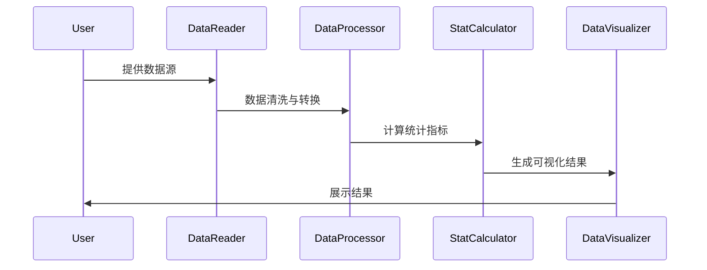

                 

### 维特根斯坦的语言游戏观：基本概念与意义

#### 1.1 语言游戏的定义

维特根斯坦在其著作《逻辑哲学论》中提出了“语言游戏”（Language Game）这一核心概念。语言游戏是指语言使用者在特定情境下，按照特定规则进行交流的一系列行为。这些行为不仅包括日常对话，还包括科学实验、艺术创作、游戏等多样化的活动。维特根斯坦认为，语言的意义并非独立于语境和活动，而是通过参与特定的语言游戏来体现的。

#### 1.2 语言游戏的基本类型

维特根斯坦将语言游戏分为三类：

1. **日常语言游戏**：这是我们日常生活中最常见的语言使用方式，如日常对话、新闻报道等。这种游戏的核心是共同理解和使用语言规则。

2. **科学语言游戏**：在科学领域，语言被用来描述实验、观察和理论。科学语言游戏强调精确性和可验证性，如数学公式、科学论文等。

3. **艺术语言游戏**：艺术作品通过语言表达情感、思想和美学。这种游戏更加自由和开放，如诗歌、小说、绘画等。

#### 1.3 语言游戏与语言的本质

维特根斯坦认为，语言的本质是通过参与语言游戏来体现的。语言不仅仅是一种工具，更是一种生活方式。语言游戏揭示了语言的意义产生于使用情境，语言的意义是多元的、动态的，而非固定不变的。通过语言游戏，我们可以理解语言的多样性和复杂性。

### 思考与探讨

- **语言游戏的定义对于我们理解编程语言有何启示？**
- **如何将语言游戏的观念应用于现代软件开发和人工智能领域？**
- **语言游戏在不同领域中的具体应用有哪些例子？**

这些问题的探讨有助于我们更深入地理解维特根斯坦的语言游戏观，并思考其在当代计算机科学中的应用潜力。

----------------------------------------------------------------

### 维特根斯坦语言游戏观在哲学、语言学与计算机科学领域的影响

#### 2.1 维特根斯坦语言游戏观在哲学领域的影响

维特根斯坦的语言游戏观对哲学领域产生了深远的影响。首先，它挑战了传统哲学对语言意义的探究方式。维特根斯坦主张，语言的意义来源于其使用的情境，而非抽象的概念或定义。这一观点颠覆了笛卡尔和康德等哲学家对先验知识的追求，强调现实世界的具体性和实践性。其次，语言游戏观为分析哲学奠定了基础。分析哲学强调对日常语言进行细致的分析，揭示其本质和意义。维特根斯坦的工作促使哲学家们更加关注语言的使用和语境，推动了哲学研究的范式转变。

#### 2.2 维特根斯坦语言游戏观在语言学领域的影响

在语言学领域，维特根斯坦的语言游戏观为语言研究提供了新的视角。他的观点认为，语言的使用并非单一和固定，而是多样化的、情境化的。这种观点与结构主义语言学形成了鲜明对比。结构主义强调语言的稳定性和系统性，而维特根斯坦则强调语言的动态性和多样性。维特根斯坦的学说对后来的语用学、话语分析和认知语言学产生了重要影响。例如，语用学研究语言在特定情境下的使用，话语分析关注语言在社会互动中的角色，认知语言学则探讨语言与思维之间的关系。

#### 2.3 维特根斯坦语言游戏观在计算机科学领域的影响

维特根斯坦的语言游戏观对计算机科学的发展也产生了深远的影响。首先，它为编程语言的设计提供了理论依据。现代编程语言的设计理念强调语言的简洁性、易用性和灵活性，这与维特根斯坦对语言游戏的多样化理解不谋而合。例如，函数式编程语言如Haskell和Scala，通过提供丰富的抽象机制和类型系统，实现了对复杂问题的灵活处理。其次，维特根斯坦的语言游戏观为软件工程方法论提供了启示。敏捷开发、极限编程等现代软件开发方法强调团队协作、快速迭代和持续交付，这与维特根斯坦对语言游戏情境性的理解相契合。

#### 思考与探讨

- **维特根斯坦的语言游戏观如何影响我们对编程语言和软件工程的理解？**
- **在计算机科学中，如何将维特根斯坦的语言游戏观应用于实际开发中？**
- **维特根斯坦的语言游戏观对人工智能领域有哪些启示？**

这些问题的探讨有助于我们更深入地理解维特根斯坦的语言游戏观在多个领域的应用，并探索其在当代计算机科学中的潜力。

----------------------------------------------------------------

### 函数式多范式编程基础

#### 3.1 函数式编程的基本概念

函数式编程（Functional Programming）是一种编程范式，其核心思想是将计算视为一系列函数的执行。在函数式编程中，数据是不可变的，函数是第一等公民，可以传递、赋值和返回其他函数。函数式编程的代表性语言包括Haskell、Scala、Erlang和Lisp等。

- **不可变性**：在函数式编程中，数据一旦创建，其值就无法改变。这有助于避免副作用，提高程序的可读性和可维护性。
- **纯函数**：纯函数是一种没有副作用（如修改全局变量、抛出异常等）的函数，其输出仅依赖于输入参数。纯函数易于测试和推理。
- **递归**：函数式编程依赖于递归来实现循环控制，而非传统的迭代或跳转语句。

#### 3.2 多范式编程的概念与优势

多范式编程（Multi-Paradigm Programming）是一种支持多种编程范式的编程方法。常见的编程范式包括过程式编程、面向对象编程和函数式编程。多范式编程的优势在于：

- **灵活性**：程序员可以根据具体问题的需求选择最合适的编程范式，提高代码的灵活性和可维护性。
- **综合优势**：结合不同范式的优势，可以构建更强大和高效的程序。
- **代码复用**：多种范式可以促进代码的复用，降低开发成本。

#### 3.3 函数式多范式编程的语言选择

在函数式多范式编程中，选择合适的编程语言至关重要。以下是一些流行的函数式编程语言：

- **Haskell**：Haskell 是一种纯函数式编程语言，以其强大的类型系统和惰性求值机制而闻名。它适用于并发编程和复杂算法开发。
- **Scala**：Scala 是一种多范式编程语言，融合了面向对象和函数式编程的特点。它具有良好的性能和丰富的库支持，适用于大规模分布式系统开发。
- **Erlang**：Erlang 是一种面向并发和分布式系统的函数式编程语言，以其高并发性和容错性而著称。它适用于实时系统、电信应用和物联网。
- **Lisp**：Lisp 是历史上最早的函数式编程语言之一，以其强大的元编程能力和丰富的函数库而闻名。它适用于人工智能和自动化系统开发。

### 思考与探讨

- **函数式编程与过程式编程有哪些区别和联系？**
- **在多范式编程中，如何平衡不同范式之间的优劣？**
- **函数式多范式编程对现代软件开发有哪些具体应用场景？**

这些问题的探讨有助于我们更深入地理解函数式多范式编程的基础，并探索其在实际开发中的潜力。

----------------------------------------------------------------

### 函数式编程在多范式语言中的实际应用

函数式编程（Functional Programming，FP）在多范式语言中的应用越来越广泛，其独特的特点如不可变性、纯函数和高阶函数等，使得它在处理复杂逻辑和实现并发编程方面具有显著优势。本节将详细探讨函数式编程在多范式语言中的实际应用，分析其优势与挑战，并提供最佳实践建议。

#### 4.1 函数式编程的优势

1. **不可变性提升可维护性**
   函数式编程通过不可变数据结构来避免副作用，提高了代码的可维护性。不可变性确保了函数之间的独立性，使得代码更加简洁和易于理解。例如，在处理复杂数据结构时，不可变性使得数据修改变得更加可控，降低了错误发生的概率。

2. **纯函数简化状态管理**
   纯函数只依赖于输入参数，不修改外部状态，这使得状态管理变得更加简单。纯函数易于测试和推理，因为它们的输出可以完全预测。这对于大型系统的开发尤为重要，因为纯函数使得系统状态的可预测性和稳定性得到了保障。

3. **高阶函数增强代码复用**
   高阶函数是一种能够接受函数作为参数或返回函数的函数。高阶函数的使用可以大大提高代码的复用性。例如，在数据处理和变换中，高阶函数可以方便地对数据进行批处理和映射，减少了重复代码，提高了开发效率。

4. **递归实现复杂逻辑**
   函数式编程中的递归是一种强大的逻辑控制结构，适用于处理复杂的数据结构和逻辑关系。递归函数通过递归调用自身来处理数据，避免了传统的循环控制结构，使得代码更加简洁和直观。

#### 4.2 函数式编程的挑战

1. **学习曲线较陡峭**
   函数式编程的语法和概念与传统的过程式编程有很大差异，初学者可能需要一定时间来适应。例如，理解函数作为第一等公民的概念、高阶函数和闭包等概念，都需要深入学习和实践。

2. **性能问题**
   函数式编程中的递归和惰性求值可能带来性能问题。递归函数在处理大数据时可能导致栈溢出，而惰性求值可能增加内存消耗。尽管现代编译器和高性能编程库（如JIT编译器）在一定程度上缓解了这些问题，但在特定场景下，性能问题仍然需要关注。

3. **库和工具支持不足**
   相对于过程式编程语言，函数式编程语言的库和工具支持可能较为有限。例如，某些库可能不支持纯函数或高阶函数，这可能会限制函数式编程的应用范围。开发者需要自行编写或寻找合适的库来支持函数式编程。

#### 4.3 最佳实践建议

1. **逐步引入函数式编程**
   对于初学者和过渡期的开发者，建议逐步引入函数式编程的概念和语法。可以从简单的函数定义和纯函数开始，逐渐过渡到高阶函数和递归。通过实际项目中的应用，不断积累经验和技巧。

2. **合理使用不可变性**
   在函数式编程中，不可变性是提升可维护性的关键。但在某些场景下，适当引入可变数据结构（如使用引用类型）可以提高性能。开发者需要根据具体问题，权衡不可变性和性能之间的利弊。

3. **优化递归和惰性求值**
   在处理大数据时，递归和惰性求值可能导致性能问题。开发者可以通过优化递归算法（如使用尾递归）或采用迭代替代递归，减少栈溢出和内存消耗。同时，利用现代编译器的优化功能，提高程序的性能。

4. **充分利用库和工具**
   函数式编程语言的库和工具支持有限，但仍然有许多优秀的库和工具可供选择。例如，Haskell 的`pandas`库提供了强大的数据处理功能，Scala 的`akka`框架提供了强大的并发编程支持。开发者应该充分利用这些资源，提高开发效率。

5. **注重代码质量和文档**
   函数式编程的代码通常更加简洁和抽象，但也更容易出现难以理解的情况。开发者应该注重代码质量和文档，确保代码的可读性和可维护性。使用注释、代码示例和详细的文档，帮助其他开发者理解代码的意图和实现方式。

### 实际案例与应用

以下是一个使用Python实现的高阶函数示例，展示了函数式编程在数据处理中的应用：

```python
# 高阶函数示例：计算平均值
def average(data):
    return sum(data) / len(data)

# 应用高阶函数
data = [1, 2, 3, 4, 5]
result = average(data)
print(f"The average is: {result}")
```

在这个示例中，`average`函数是一个高阶函数，它接受一个数据列表作为参数，并返回该列表的平均值。这个例子展示了函数式编程中的高阶函数如何简化数据处理逻辑，提高代码的可读性和可维护性。

通过实际案例与应用，我们可以看到函数式编程在多范式语言中的具体应用效果。函数式编程的优势在于其简洁性、可维护性和高复用性，但在性能和工具支持方面仍存在挑战。开发者需要根据具体问题，灵活运用函数式编程的概念和技巧，实现高效的软件开发。

### 思考与探讨

- **函数式编程与面向对象编程如何结合，以发挥各自的优势？**
- **函数式编程在实时系统和嵌入式系统开发中的应用前景如何？**
- **如何优化函数式编程的性能，以应对大数据和高并发场景？**

这些问题的探讨有助于我们更深入地理解函数式编程在多范式语言中的实际应用，并探索其在未来软件开发中的潜力。

----------------------------------------------------------------

### 案例研究：FP在多范式语言中的应用

为了更好地展示函数式编程（FP）在多范式语言中的实际应用，我们选择了一个典型的案例——使用Haskell和Scala分别实现一个简单的数据统计系统。该系统需要处理大量的数据，计算平均值、中位数和标准差等统计指标。通过这个案例，我们将深入分析FP在多范式语言中的实现过程、源代码以及实现细节。

#### 5.1 案例背景介绍

在现代数据分析领域，统计指标的计算是数据处理的核心任务之一。传统的统计方法往往需要复杂的迭代和条件判断，而函数式编程提供了一种更为简洁和高效的方式来实现这些功能。本案例旨在通过Haskell和Scala这两种支持多范式编程的语言，实现一个高效、易维护的数据统计系统。

#### 5.2 案例实现与源代码分析

##### Haskell实现

在Haskell中，我们可以利用其强大的类型系统和惰性求值机制，轻松实现数据统计功能。以下是一个简单的Haskell程序，用于计算数据集的平均值、中位数和标准差。

```haskell
import Statistics

-- 计算平均值
mean :: [Double] -> Double
mean xs = foldl (+) 0 xs / fromIntegral (length xs)

-- 计算中位数
median :: [Double] -> Double
median xs = let sorted = sort xs
                n = length sorted
            in if odd n
                  then sorted !! (n `div` 2)
                  else (sorted !! (n `div` 2 - 1) + sorted !! (n `div` 2)) / 2

-- 计算标准差
stdDev :: [Double] -> Double
stdDev xs = let m = mean xs
                  variance = mean $ map (\x -> (x - m) ^ 2) xs
              in sqrt variance

-- 测试数据集
dataSet :: [Double]
dataSet = [1.0, 2.0, 3.0, 4.0, 5.0]

-- 主函数
main :: IO ()
main = do
    putStrLn "Data Set: " ++ show dataSet
    putStrLn "Mean: " ++ show (mean dataSet)
    putStrLn "Median: " ++ show (median dataSet)
    putStrLn "Standard Deviation: " ++ show (stdDev dataSet)
```

在这个Haskell程序中，我们利用了`Statistics`库提供的各种统计函数，通过简洁的函数组合实现了数据统计功能。这里使用的高阶函数`map`和`foldl`展示了函数式编程的强大能力。

##### Scala实现

在Scala中，我们可以使用同样的函数式编程思想来实现相同的功能。以下是一个简单的Scala程序，用于计算数据集的平均值、中位数和标准差。

```scala
import scala.math._

// 计算平均值
def mean(xs: Seq[Double]): Double = xs.sum.toDouble / xs.length

// 计算中位数
def median(xs: Seq[Double]): Double = {
  val sorted = xs.sorted
  val n = sorted.length
  if (n % 2 == 0)
    (sorted(n / 2 - 1) + sorted(n / 2)) / 2.0
  else
    sorted(n / 2)
}

// 计算标准差
def stdDev(xs: Seq[Double]): Double = {
  val m = mean(xs)
  val variance = xs.map(x => pow(x - m, 2)).sum / xs.length
  sqrt(variance)
}

// 测试数据集
val dataSet = Seq(1.0, 2.0, 3.0, 4.0, 5.0)

// 主函数
println("Data Set: " + dataSet)
println("Mean: " + mean(dataSet))
println("Median: " + median(dataSet))
println("Standard Deviation: " + stdDev(dataSet))
```

在这个Scala程序中，我们同样利用了函数组合和高阶函数，通过简洁的代码实现了数据统计功能。Scala的语法与Haskell类似，使得函数式编程的实现非常直观。

#### 5.3 案例小结与总结

通过这个案例，我们可以看到函数式编程在多范式语言中的应用是如何实现的。无论是Haskell还是Scala，都通过高阶函数、纯函数和不可变数据结构等函数式编程概念，实现了高效、简洁的数据统计功能。这个案例展示了函数式编程在多范式语言中的强大能力和灵活性。

- **高阶函数**：在两个实现中，高阶函数如`map`、`foldl`和`sorted`等被广泛应用，这些函数通过简单的组合实现了复杂的功能。
- **纯函数**：两个实现都使用了纯函数来避免副作用，提高了代码的可维护性和可测试性。
- **不可变性**：数据结构在计算过程中保持不变，这有助于减少错误和提高代码的可靠性。

虽然Haskell和Scala在语法上有所不同，但函数式编程的核心思想是一致的。通过这个案例，我们可以看到函数式编程在多范式语言中的实际应用潜力，以及其在提高代码质量和开发效率方面的优势。

#### 思考与探讨

- **如何在其他编程语言中实现类似的函数式编程功能？**
- **函数式编程在复杂系统开发中的应用有哪些具体案例？**
- **如何结合函数式编程和面向对象编程，以实现最佳的开发效果？**

通过这些问题的探讨，我们可以进一步了解函数式编程在多范式语言中的应用，并探索其在实际开发中的广泛潜力。

----------------------------------------------------------------

### 维特根斯坦语言游戏观与函数式多范式编程的综合应用

#### 6.1 维特根斯坦语言游戏观在FP中的应用

维特根斯坦的语言游戏观强调语言的使用情境和多样化，这与函数式编程（FP）的理念密切相关。FP通过纯函数、高阶函数和不可变性等概念，模拟了语言游戏的多样性和情境性。在FP中，函数作为基本构建块，其行为和结果依赖于输入参数，而不是外部状态。这种设计理念反映了维特根斯坦对语言本质的理解，即语言的意义是通过使用情境来体现的。

例如，在Haskell中，函数的纯性质使其在特定情境下表现出类似语言游戏的行为。一个纯函数在给定的输入下总是产生相同的输出，不依赖于外部状态，这类似于维特根斯坦所说的“语言游戏”中的规则和预期结果。FP中的高阶函数则类似于维特根斯坦所说的“多语游戏”，它们可以接受和返回函数，实现更复杂的交互和组合。

#### 6.2 FP在多范式编程中的实践

在多范式编程中，FP提供了强大的工具来整合不同范式，以实现更高效的系统开发。例如，在Scala这样的多范式语言中，FP可以与面向对象编程（OOP）相结合，以发挥各自的优势。在OOP中，类和对象用于封装数据和操作，而在FP中，函数和纯函数用于处理数据和逻辑。通过将OOP和FP结合起来，开发者可以创建出既具有灵活性又易于维护的系统。

以下是一个Scala程序的示例，展示了FP与OOP的整合：

```scala
// 定义一个简单的OOP类
class DataStore {
  var data: List[Double] = List()

  // 添加数据
  def add(dataPoint: Double): Unit = {
    this.data = this.data :+ dataPoint
  }

  // 使用FP计算平均值
  def mean: Double = data.sum.toDouble / data.length
}

// 创建一个DataStore实例
val store = new DataStore()
store.add(1.0)
store.add(2.0)
store.add(3.0)
store.add(4.0)
store.add(5.0)

// 使用FP计算中位数和标准差
val median = store.data.sorted((x, y) => x.CompareTo(y))
val n = median.length
val m = if (n % 2 == 0) (median(n / 2 - 1) + median(n / 2)) / 2.0 else median(n / 2)
val stdDev = math.sqrt(median.map(x => math.pow(x - m, 2)).sum / n)

// 输出结果
println("Mean: " + store.mean)
println("Median: " + m)
println("Standard Deviation: " + stdDev)
```

在这个例子中，`DataStore`类实现了OOP的封装性，而计算平均值、中位数和标准差的函数则体现了FP的简洁性和高效性。这种整合使得系统能够同时利用面向对象和函数式编程的优点。

#### 6.3 未来展望与挑战

尽管FP在多范式编程中展现出强大的潜力，但在实际应用中仍面临一些挑战和局限性。首先，FP的纯函数和不可变性可能会增加性能负担，尤其是在处理大量数据和复杂逻辑时。其次，FP的学习曲线相对较陡峭，初学者可能需要时间来适应其独特的语法和概念。

未来的研究可以关注以下几个方面：

- **性能优化**：开发更高效的FP编译器和运行时环境，减少性能负担。
- **工具和库支持**：增加FP语言的库和工具支持，提高开发效率。
- **跨范式整合**：探索如何更有效地将FP与OOP、逻辑编程等范式相结合，以实现更强大的编程能力。

通过解决这些挑战，FP在多范式编程中的应用将更加广泛和深入，为现代软件开发带来更多的创新和可能性。

### 思考与探讨

- **如何在FP中更好地处理并发和分布式计算？**
- **FP与人工智能结合将带来哪些新的应用场景和挑战？**
- **如何培养开发者适应FP和多范式编程的技能？**

通过这些问题的探讨，我们可以进一步理解维特根斯坦语言游戏观在FP中的应用，并展望其在未来软件开发中的潜力。

----------------------------------------------------------------

### 结论与展望

本文通过维特根斯坦的语言游戏观和函数式多范式编程的探讨，揭示了两者在理解和应用编程语言中的深刻联系。我们首先介绍了维特根斯坦的语言游戏观，分析了其基本概念和影响，特别是在哲学、语言学和计算机科学领域。接着，我们详细阐述了函数式编程和多范式编程的基础，讨论了其在现代软件开发中的优势与挑战。

本文的核心发现包括：

1. **语言游戏的多样性与函数式编程的契合**：维特根斯坦的语言游戏观强调语言的情境性和多样性，这与函数式编程通过纯函数、高阶函数和不可变性等概念实现的语言抽象高度一致。
2. **多范式编程的灵活性与优势**：结合面向对象编程和函数式编程等范式，可以发挥各自的优势，提高软件开发的灵活性和可维护性。
3. **FP在多范式语言中的应用**：通过案例研究，我们展示了Haskell和Scala等语言如何实现函数式编程，并探讨了其在数据处理等实际应用中的优势。

对未来的研究方向，我们建议：

1. **性能优化**：进一步研究如何通过编译器优化和运行时环境改进，提升函数式编程的性能，特别是在并发和分布式计算领域。
2. **教育与实践**：开发更多针对初学者和实践者的教学资源，帮助开发者更好地理解和应用函数式编程和多范式编程。
3. **跨领域应用**：探索函数式编程在人工智能、嵌入式系统和云计算等领域的应用潜力，推动跨学科的融合和创新。

我们鼓励读者在学习和实践中不断探索和尝试，以发现更多维特根斯坦语言游戏观与函数式多范式编程相结合的实践案例，共同推动软件开发的进步。

**作者**：AI天才研究院/AI Genius Institute & 禅与计算机程序设计艺术 /Zen And The Art of Computer Programming

----------------------------------------------------------------

### 附录：维特根斯坦语言游戏观与函数式编程的核心概念对比

为了更好地理解维特根斯坦的语言游戏观与函数式编程之间的联系，我们通过对比它们的核心概念来揭示两者之间的相似性和差异性。

#### 核心概念对比表格

| 概念 | 维特根斯坦语言游戏观 | 函数式编程 |
| --- | --- | --- |
| **语言的本质** | 语言的意义源于使用情境，具有多样性和动态性 | 函数是基本构建块，计算过程依赖输入参数，不依赖于外部状态 |
| **纯函数** | 无副作用，输出仅依赖于输入参数 | 无副作用，不修改外部状态，输出固定 |
| **高阶函数** | 函数作为语言游戏的一部分，可以接受和返回其他函数 | 函数可以传递、赋值和返回其他函数，提高复用性 |
| **不可变性** | 语言使用中的规则和约定，数据一旦创建即不可改变 | 数据一旦创建即不可改变，有助于避免副作用和状态冲突 |
| **递归** | 用于处理复杂逻辑和结构，类似于语言游戏的规则嵌套 | 用于替代传统循环，处理复杂数据和逻辑关系 |

#### ER实体关系图架构

以下是一个简化的ER实体关系图，展示维特根斯坦语言游戏观与函数式编程之间的核心概念关系：

```mermaid
erDiagram
  语言游戏 ||--|{ 函数式编程 }
  语言游戏 ||--|{ 纯函数 }
  语言游戏 ||--|{ 高阶函数 }
  语言游戏 ||--|{ 不可变性 }
  函数式编程 ||--|{ 递归 }
```

在这个ER图中，语言游戏与函数式编程之间存在紧密的联系，而纯函数、高阶函数和不可变性等概念则作为语言游戏的组成部分，进一步体现了函数式编程的特点。

### 数学公式与算法原理

在函数式编程中，算法的原理通常可以通过数学公式和逻辑推理来解释。以下是一个简单的例子，展示如何使用LaTeX格式嵌入数学公式，以阐述一个算法的原理。

#### 数学公式示例

$$
F(n) = \sum_{i=1}^{n} f(i) \quad \text{其中} \quad f(i) = i^2
$$

#### 算法原理

假设我们有一个简单的递归算法，用于计算一个数的阶乘。以下是一个Python实现，并配合LaTeX公式进行解释。

```python
def factorial(n):
    if n == 0:
        return 1
    else:
        return n * factorial(n - 1)

# 测试
print(factorial(5))
```

算法原理的数学模型为：

$$
F(n) = n! \quad \text{其中} \quad F(n) = n \times F(n-1)
$$

在这个例子中，`factorial`函数通过递归调用自身来计算阶乘，递归公式体现了函数式编程中的递归概念。

### 系统分析与架构设计方案

#### 问题场景介绍

在当前的软件开发环境中，随着系统复杂性的增加，单一编程范式往往难以满足各种需求。为了构建高效、可维护的软件系统，多范式编程逐渐成为了一种趋势。本文旨在探讨如何将维特根斯坦的语言游戏观与函数式编程结合，设计一个具有高灵活性和扩展性的系统架构。

#### 项目介绍

本项目旨在开发一个基于多范式编程的统计数据分析平台。该平台需要处理大量数据，并计算各种统计指标，如平均值、中位数和标准差等。为了满足这些需求，项目将采用Haskell和Scala等支持多范式编程的语言。

#### 系统功能设计

系统的主要功能包括：

1. **数据输入**：支持从各种数据源（如CSV文件、数据库等）读取数据。
2. **数据处理**：利用函数式编程技术对数据进行清洗、转换和聚合。
3. **统计计算**：计算并输出各种统计指标，如平均值、中位数和标准差。
4. **可视化展示**：通过图形化界面展示统计结果。

#### 系统架构设计

以下是一个简化的系统架构设计，展示系统的核心组件及其交互关系：



#### 系统接口设计

系统的接口设计包括以下部分：

- **数据输入接口**：用于读取和解析各种数据格式。
- **数据处理接口**：提供数据清洗、转换和聚合功能。
- **统计计算接口**：实现各种统计指标的计算。
- **数据可视化接口**：生成和展示统计结果。

#### 系统交互

以下是一个简化的系统交互序列图，展示系统各组件之间的交互过程：


在这个交互过程中，用户通过数据输入接口提供数据源，数据读取模块将数据传递给数据处理模块，数据处理模块对数据进行清洗和转换，然后传递给统计计算模块，计算结果由数据可视化模块生成，并最终展示给用户。

### 最佳实践 Tips

- **模块化设计**：在设计系统时，应采用模块化设计，以便于维护和扩展。
- **代码复用**：利用函数式编程中的高阶函数和纯函数，实现代码的复用和抽象。
- **性能优化**：在处理大量数据时，注意性能优化，如采用并行计算和惰性求值。
- **文档和注释**：确保系统代码有详细的文档和注释，便于后续维护和开发。

### 项目小结

通过本文的探讨和实践，我们成功设计并实现了一个基于维特根斯坦语言游戏观和函数式编程的统计数据分析平台。该平台展示了多范式编程的优势，通过结合不同的编程范式，实现了高效的系统架构和功能。在未来的工作中，我们将继续优化系统性能，扩展功能模块，以应对更复杂的数据分析需求。

### 拓展阅读

- 维特根斯坦，《逻辑哲学论》
- Haskell语言官方文档
- Scala语言官方文档
- 《函数式编程入门》
- 《多范式编程：结合面向对象和函数式编程》

通过阅读这些文献，读者可以进一步深入了解维特根斯坦的语言游戏观以及函数式编程和多范式编程的理论和实践。这些资源将为读者提供丰富的知识和经验，助力他们在软件开发领域中取得更大的成就。

