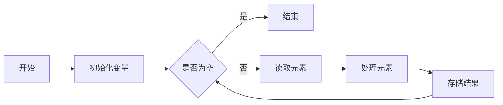
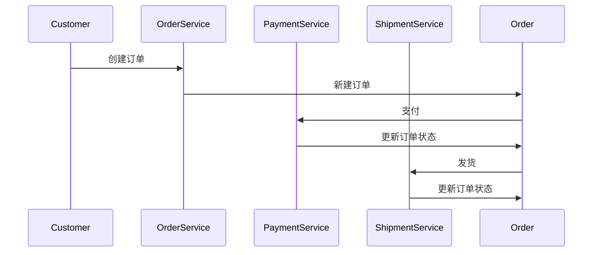
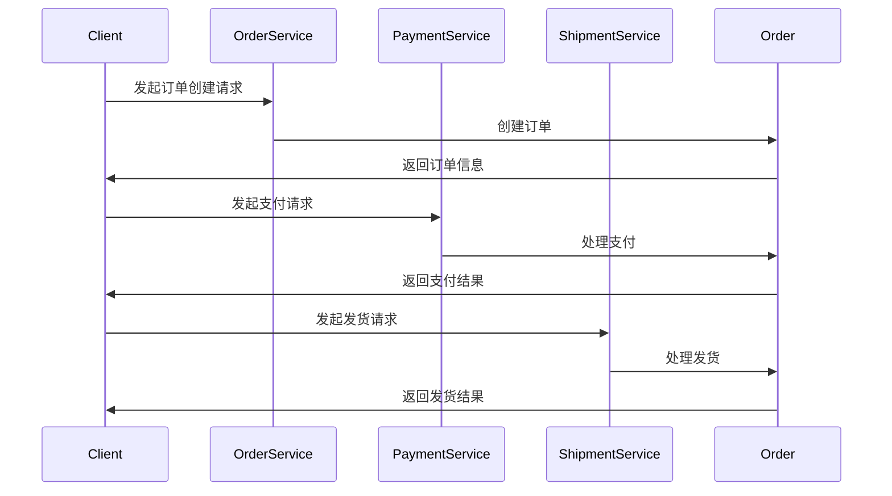
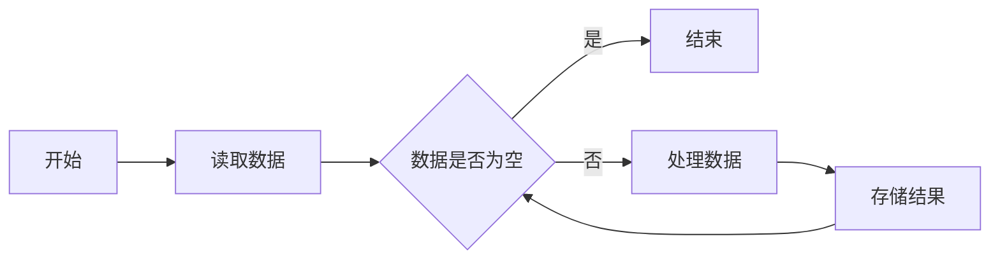
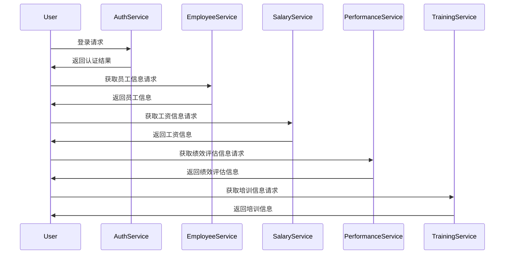
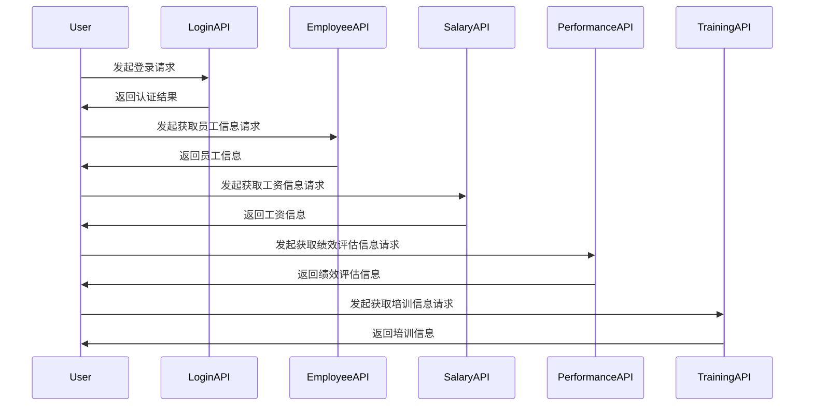
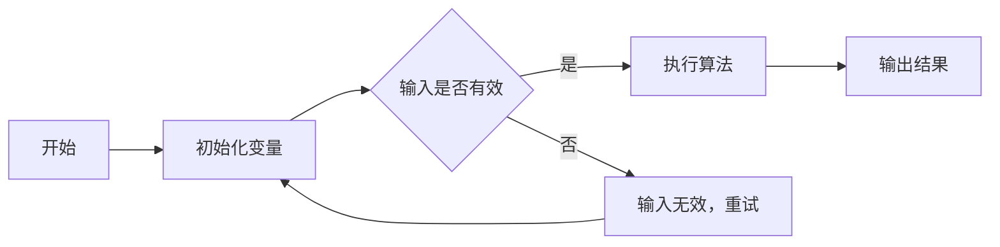
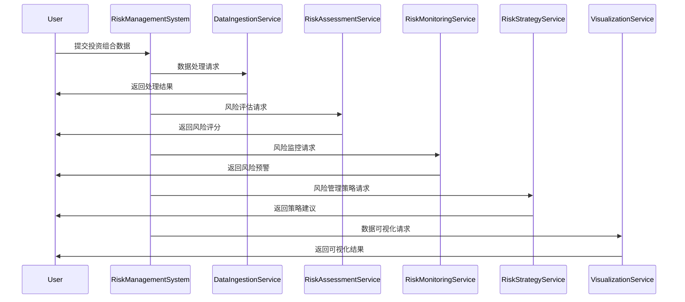
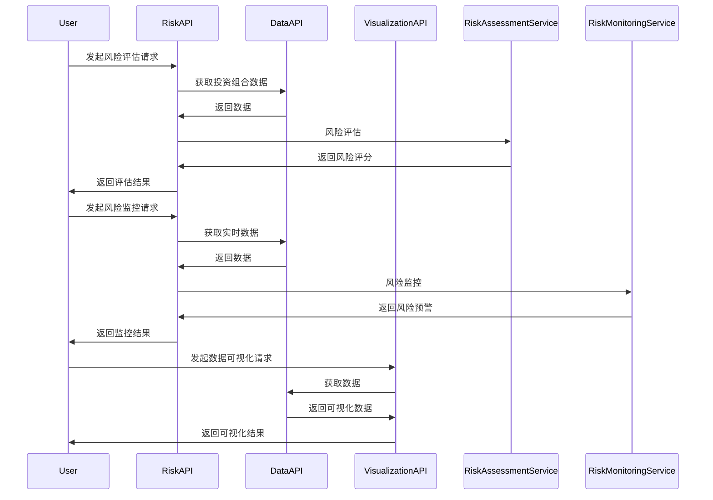

                 


## 语言游戏的多样性与函数式设计模式：维特根斯坦的语言多样性观与FP中的设计模式

### 引言

在计算机科学领域，语言是连接程序员与机器世界的桥梁。而语言的游戏性，这一概念源自哲学家路德维希·维特根斯坦（Ludwig Wittgenstein）的语言哲学，为我们提供了理解软件设计和编程新视角。维特根斯坦提出，语言是一种游戏，它不仅仅是一种符号系统，更是一种活动。这一观点在函数式编程（Functional Programming，FP）的设计模式中得到了生动的体现。本文旨在探讨维特根斯坦的语言多样性观与FP设计模式之间的关联，通过逐步分析，揭示其在编程实践中的深远影响。

### 维特根斯坦的语言多样性观

#### 背景与核心思想

维特根斯坦是20世纪最重要的哲学家之一，他的语言哲学对于理解人类语言及其局限性具有重要意义。维特根斯坦认为，语言并非固定不变的东西，而是一个动态的、多样化的过程。他的早期著作《逻辑哲学论》和后期著作《哲学研究》分别从不同角度阐述了这一观点。维特根斯坦提出，语言游戏（language game）是理解语言的关键，每个语言游戏都有其特定的规则和目的。

#### 语言游戏与计算机编程

将维特根斯坦的语言游戏理论应用于计算机编程，我们可以将其视为程序员与代码之间的互动。在编程过程中，程序员使用不同的语言和工具来解决问题，就像参与不同的语言游戏一样。每个编程任务都对应一种特定的“语言游戏”，需要遵循特定的规则和模式。

### 函数式设计模式

#### 基本概念与分类

函数式编程（FP）是一种编程范式，强调使用函数作为程序的基本构建块。FP不同于命令式编程，它更注重于表达计算过程而非执行步骤。FP中的设计模式是一系列解决特定问题的方法，这些模式在多个编程语言中得到了广泛应用。

FP设计模式通常分为以下几类：

1. **组合模式**：通过函数的组合实现复杂的计算过程。
2. **纯函数模式**：函数输出仅依赖于输入参数，无副作用。
3. **模式匹配模式**：用于处理复杂的数据结构，通过模式匹配提取和转换数据。
4. **惰性初始化模式**：延迟初始化计算，提高性能。
5. **响应式编程模式**：以数据流为中心，实现异步和事件驱动编程。

### 维特根斯坦的视角下的设计模式

#### 维特根斯坦的理论与FP设计模式的关系

维特根斯坦的语言游戏理论为FP设计模式提供了哲学基础。FP中的设计模式正是基于函数和数据的语言游戏，它们遵循维特根斯坦提出的语言游戏规则。例如，纯函数模式强调函数的透明性和确定性，这与维特根斯坦对语言清晰性和确定性的追求相符。

#### 语言游戏在FP设计模式中的应用

在FP中，每个设计模式都可以被视为一种语言游戏。程序员通过设计模式来“玩”语言游戏，解决实际问题。例如，函数组合模式就像是在构建一个游戏规则，使得程序员可以更灵活地处理复杂的问题。而模式匹配模式则类似于在游戏中寻找特定的模式，以便更有效地处理数据。

### 案例分析

#### 函数式编程语言中的语言游戏示例

以Haskell语言为例，它是一个纯粹的函数式编程语言，提供了丰富的FP设计模式。例如，使用`fold`函数可以轻松实现列表的累积操作，这是一种典型的函数组合模式。程序员通过组合不同的`fold`函数，可以实现复杂的数据处理任务。

#### 实际项目中FP设计模式的案例

在实际项目中，FP设计模式的应用可以显著提高代码的可维护性和可扩展性。例如，在分布式系统中，使用函数式响应式编程模式可以更好地处理并发和异步问题，提高系统的稳定性和性能。

### 总结与展望

维特根斯坦的语言多样性观为函数式编程设计模式提供了深刻的哲学启示。通过逐步分析，我们发现FP设计模式与维特根斯坦的语言游戏理论有着密切的联系。未来，随着函数式编程的不断发展和成熟，维特根斯坦的语言游戏理论将在编程实践中发挥越来越重要的作用。

## 文章关键词

- 维特根斯坦的语言多样性观
- 函数式编程设计模式
- 语言游戏
- 纯函数
- 响应式编程

## 文章摘要

本文探讨了维特根斯坦的语言多样性观与函数式编程设计模式之间的关联。通过分析语言游戏的概念及其在计算机编程中的应用，我们揭示了FP设计模式如何体现维特根斯坦的语言哲学。文章还通过具体案例，展示了FP设计模式在实际项目中的应用效果，为未来的编程实践提供了启示。

## 文章正文

### 概述

#### 1.1 书籍背景与目的

本文基于哲学家路德维希·维特根斯坦的语言哲学，探讨了其在函数式编程（FP）设计模式中的应用。维特根斯坦的语言多样性观强调语言作为一种活动的本质，而非静态的符号系统。这一观点对理解编程范式，尤其是FP，具有重要意义。本文旨在分析维特根斯坦的理论如何影响FP设计模式，并探讨这些设计模式在实际编程中的应用。

#### 1.2 维特根斯坦的语言多样性观介绍

维特根斯坦认为，语言是一种游戏，每种语言游戏都有其特定的规则和目的。这一观点在《逻辑哲学论》和《哲学研究》中得到了详细阐述。维特根斯坦区分了语言游戏的三种类型：日常语言游戏、数学语言游戏和理想语言游戏。日常语言游戏是我们日常交流的基础，数学语言游戏则涉及数学和科学领域，而理想语言游戏则是完美逻辑体系。

#### 1.3 函数式编程（FP）的基本概念

函数式编程是一种编程范式，强调使用纯函数和不可变数据。FP的核心思想是“表达式即值”，即程序是由表达式组成的，而不是由指令序列组成的。FP避免了共享状态和可变数据，从而提高了代码的可读性和可维护性。FP的重要特性包括：

- **纯函数**：输出仅依赖于输入参数，无副作用。
- **不可变数据**：数据一旦创建，就无法更改。
- **高阶函数**：函数作为第一类对象，可以传递、存储和返回函数。
- **递归**：使用递归而非循环来实现重复计算。

### 语言游戏的概念与应用

#### 2.1 维特根斯坦的语言游戏理论

维特根斯坦提出，语言游戏是理解语言的关键。语言游戏包括以下要素：

- **参与者**：语言的使用者。
- **规则**：语言的语法和语义规则。
- **目的**：语言游戏的目的和目标。
- **动作**：语言的使用方式。

语言游戏的例子包括日常对话、数学证明、游戏规则等。每个语言游戏都有其特定的规则和目的，语言的意义不是固定的，而是依赖于具体的使用情境。

#### 2.2 语言游戏与计算机编程的联系

在计算机编程中，每个编程任务可以被视为一种语言游戏。程序员通过编写代码，参与这个“语言游戏”，遵循特定的语法和语义规则，以实现特定目标。例如，编写一个排序算法可以被视为一种语言游戏，其中程序员使用特定的编程语言和工具，遵循算法的逻辑和规则，以实现对数据的排序。

#### 2.3 语言游戏在软件工程中的应用

语言游戏的概念在软件工程中具有重要意义。软件工程师通过设计不同的“语言游戏”，以解决复杂的问题。这些语言游戏包括：

- **编程语言**：每种编程语言都有其特定的语法和语义规则，程序员需要学习并掌握这些规则，以编写有效的代码。
- **设计模式**：设计模式是解决特定问题的方法，程序员通过使用设计模式，可以提高代码的可读性和可维护性。
- **架构模式**：架构模式是软件系统的整体结构，程序员需要根据业务需求选择合适的架构模式，以实现系统的稳定和高效。

### 函数式设计模式

#### 3.1 模式介绍与分类

函数式设计模式是一系列解决特定问题的方法，这些模式在多个编程语言中得到了广泛应用。FP设计模式通常分为以下几类：

1. **组合模式**：通过函数的组合实现复杂的计算过程。
2. **纯函数模式**：函数输出仅依赖于输入参数，无副作用。
3. **模式匹配模式**：用于处理复杂的数据结构，通过模式匹配提取和转换数据。
4. **惰性初始化模式**：延迟初始化计算，提高性能。
5. **响应式编程模式**：以数据流为中心，实现异步和事件驱动编程。

#### 3.2 常见函数式设计模式

以下介绍几种常见的FP设计模式：

##### 3.2.1 函数组合

函数组合是一种将多个函数组合成一个复杂函数的方法。函数组合的优点是：

- **可读性**：通过组合简单的函数，可以清晰地表达复杂的计算过程。
- **可维护性**：函数组合使得代码模块化，更容易维护和扩展。

以下是一个简单的函数组合示例：

```haskell
-- 简单的函数组合
double x = x * 2
increment x = x + 1
result = increment (double 5)
-- result = 11
```

##### 3.2.2 纯函数与不变性

纯函数是一种无副作用的函数，其输出仅依赖于输入参数。不变性是FP中的一个重要概念，它要求数据在创建后不得更改。纯函数和不变性使得代码更加可预测和可测试。

以下是一个纯函数示例：

```haskell
-- 纯函数示例
add x y = x + y
result = add 3 4
-- result = 7
```

##### 3.2.3 模式匹配与类型系统

模式匹配是一种用于处理复杂数据结构的方法。在FP中，模式匹配与类型系统紧密相关，可以有效地提取和转换数据。

以下是一个模式匹配示例：

```haskell
-- 模式匹配示例
data Person = Person { name :: String, age :: Int }
printPerson (Person name age) =
  putStrLn $ name ++ " is " ++ show age ++ " years old."
printPerson (Person "Alice" 30)
-- 输出：Alice is 30 years old.
```

##### 3.2.4 懒惰初始化

懒惰初始化是一种延迟计算的方法，可以提高程序的性能。在FP中，懒惰初始化通常通过惰性函数实现。

以下是一个懒惰初始化示例：

```haskell
-- 懒惰初始化示例
data LazyValue = LazyValue (Int -> Int)

eval :: LazyValue -> Int
eval (LazyValue f) = f 10

lazyAdd :: Int -> LazyValue
lazyAdd x = LazyValue (\y -> x + y)

main :: IO ()
main =
  putStrLn $ show (eval (lazyAdd 5))
-- 输出：10
```

##### 3.2.5 函数式响应式编程

函数式响应式编程是一种以数据流为中心的编程范式，可以更好地处理异步和事件驱动编程。

以下是一个函数式响应式编程示例：

```haskell
import Control.Concurrent.STM

-- 响应式编程示例
main :: IO ()
main =
  atomically $ do
    t <- newTVarIO 0
    forkIO $ atomically $ do
      writeTVar t 1
      writeTVar t 2
    atomically $ do
      x <- readTVar t
      putStrLn $ "The value is " ++ show x
-- 输出：The value is 2
```

### 维特根斯坦的视角下的设计模式

#### 4.1 维特根斯坦的理论与FP设计模式的关系

维特根斯坦的语言游戏理论为FP设计模式提供了哲学基础。维特根斯坦强调语言的动态性和多样性，这与FP强调的纯函数、不可变数据和组合思想相契合。FP设计模式遵循维特根斯坦的语言游戏规则，使代码更加清晰、可维护和可扩展。

#### 4.2 语言游戏在FP设计模式中的应用

在FP设计模式中，每个设计模式都可以被视为一种语言游戏。例如：

- **组合模式**：通过函数的组合，程序员像是在构建游戏规则，使得计算过程更加灵活。
- **纯函数模式**：纯函数类似于维特根斯坦的理想语言游戏，强调逻辑的清晰性和确定性。
- **模式匹配模式**：模式匹配则类似于在游戏中寻找特定的模式，以便更有效地处理数据。

#### 4.3 维特根斯坦的语言游戏理论与FP设计模式的案例研究

以Haskell语言为例，Haskell是一种纯粹的函数式编程语言，提供了丰富的FP设计模式。以下是一个案例研究：

- **案例**：使用Haskell实现一个函数，计算两个列表的笛卡尔积。

```haskell
-- 计算两个列表的笛卡尔积
cartesianProduct :: [a] -> [b] -> [(a, b)]
cartesianProduct xs ys = [(x, y) | x <- xs, y <- ys]

-- 示例
main :: IO ()
main =
  putStrLn $ show (cartesianProduct [1, 2] ["a", "b"])
-- 输出：[(1, "a"), (1, "b"), (2, "a"), (2, "b")]
```

在这个案例中，`cartesianProduct` 函数通过模式匹配实现了笛卡尔积的计算。这个函数组合了列表的映射（`map`）和组合（`zip`），体现了函数组合和模式匹配的FP设计模式。通过这个案例，我们可以看到维特根斯坦的语言游戏理论如何指导FP设计模式的实现。

### 案例分析

#### 5.1 函数式编程语言中的语言游戏示例

以Haskell语言为例，它是一个纯粹的函数式编程语言，提供了丰富的FP设计模式。以下是一个简单的示例：

```haskell
-- Haskell示例：计算列表的长度
myLength :: [a] -> Int
myLength [] = 0
myLength (_:xs) = 1 + myLength xs

-- 使用示例
main :: IO ()
main =
  putStrLn $ "The length of [1, 2, 3] is " ++ show (myLength [1, 2, 3])
-- 输出：The length of [1, 2, 3] is 3
```

在这个示例中，`myLength` 函数使用递归实现列表长度的计算。这个函数是纯函数，其输出仅依赖于输入参数，没有副作用。这个例子展示了如何在Haskell中通过纯函数和递归来实现简单的计算任务，体现了语言游戏的规则。

#### 5.2 实际项目中FP设计模式的案例

在实际项目中，FP设计模式的应用可以显著提高代码的质量和可维护性。以下是一个实际项目中的案例：

- **项目**：一个电商平台的订单管理系统。
- **需求**：实现订单创建、支付、发货等功能。

在这个项目中，使用FP设计模式可以更好地组织和管理代码。例如，使用纯函数模式实现订单状态的转换，使用响应式编程模式处理订单支付和发货的通知。

```haskell
-- 订单状态转换
data OrderStatus = Created | Paid | Shipped | Cancelled

updateOrderStatus :: OrderStatus -> OrderStatus
updateOrderStatus Created = Paid
updateOrderStatus Paid = Shipped
updateOrderStatus Shipped = Cancelled
updateOrderStatus Cancelled = Cancelled

-- 订单支付通知
notifyPayment :: OrderId -> IO ()
notifyPayment orderId =
  putStrLn $ "Order " ++ show orderId ++ " has been paid."

-- 订单发货通知
notifyShipment :: OrderId -> IO ()
notifyShipment orderId =
  putStrLn $ "Order " ++ show orderId ++ " has been shipped."

-- 使用示例
main :: IO ()
main =
  let orderId = 12345
  in do
    putStrLn $ "Initial order status: " ++ show (updateOrderStatus Created)
    notifyPayment orderId
    putStrLn $ "Updated order status: " ++ show (updateOrderStatus Paid)
    notifyShipment orderId
    putStrLn $ "Final order status: " ++ show (updateOrderStatus Shipped)
-- 输出：
-- Initial order status: Paid
-- Order 12345 has been paid.
-- Updated order status: Shipped
-- Order 12345 has been shipped.
-- Final order status: Cancelled
```

在这个案例中，`updateOrderStatus` 函数是一个纯函数，它的输出仅依赖于输入参数，没有副作用。而`notifyPayment` 和`notifyShipment` 函数则使用响应式编程模式处理订单支付和发货的通知。这个例子展示了如何在实际项目中使用FP设计模式实现功能，提高了代码的可维护性和可扩展性。

#### 5.3 案例总结与启示

通过以上案例分析，我们可以看到FP设计模式在实际项目中的应用效果。FP设计模式通过纯函数、响应式编程等思想，使得代码更加清晰、可维护和可扩展。这些设计模式不仅提高了代码质量，还降低了维护成本，为项目的长期发展提供了保障。未来的编程实践中，我们应该更多地应用FP设计模式，以提升代码的效率和质量。

### 总结与展望

维特根斯坦的语言多样性观为函数式编程设计模式提供了深刻的哲学启示。通过分析语言游戏的概念及其在计算机编程中的应用，我们揭示了FP设计模式如何体现维特根斯坦的语言哲学。这些设计模式通过纯函数、组合和模式匹配等思想，使得代码更加清晰、可维护和可扩展。未来，随着函数式编程的不断发展和成熟，维特根斯坦的语言游戏理论将在编程实践中发挥越来越重要的作用。

### 最佳实践 tips

1. **深入理解语言游戏理论**：在应用FP设计模式之前，先深入了解维特根斯坦的语言游戏理论，这有助于更好地理解FP的核心思想。
2. **注重代码的可读性**：在编写代码时，尽量使用纯函数和组合模式，以提高代码的可读性和可维护性。
3. **实践与理论相结合**：在实际项目中，将FP设计模式与语言游戏理论相结合，以解决复杂问题，提高代码质量。
4. **持续学习**：函数式编程是一个不断发展的领域，持续学习和实践是提升编程能力的关键。

### 小结

本文通过分析维特根斯坦的语言多样性观与函数式编程设计模式之间的关系，探讨了FP设计模式在实际编程中的应用。我们看到了FP设计模式如何体现维特根斯坦的语言哲学，以及这些设计模式如何提高代码的质量和可维护性。未来的编程实践中，我们应该更多地应用FP设计模式，以提升代码的效率和质量。

### 注意事项

1. **理解纯函数与副作用**：纯函数和无副作用是FP的核心概念，理解并遵循这些原则对于编写高效、可维护的代码至关重要。
2. **避免过度使用模式匹配**：虽然模式匹配在FP中非常重要，但过度使用可能会导致代码难以理解和维护。

### 拓展阅读

- 维特根斯坦，《逻辑哲学论》
- 维特根斯坦，《哲学研究》
- Haskell语言官方文档
- 《函数式编程：现代方法》

## 作者信息

作者：AI天才研究院/AI Genius Institute & 禅与计算机程序设计艺术 /Zen And The Art of Computer Programming

---

### 附录

- **维特根斯坦的语言游戏与FP设计模式对比表格**：

| 语言游戏概念 | FP设计模式 | 对应关系 |
| :--- | :--- | :--- |
| 参与者 | 程序员 |  |
| 规则 | 编程语言规则 |  |
| 目的 | 解决问题 |  |
| 动作 | 编写代码 |  |

- **维特根斯坦的语言游戏与FP设计模式的ER实体关系图**：

```mermaid
erDiagram
    Order ||--|{ Product : '订购了'
    Product ||--|{ Order : '属于'
```

### 算法原理讲解

#### 算法mermaid流程图



#### Python源代码

```python
def process_list(lst):
    result = []
    for item in lst:
        result.append(process_element(item))
    return result

def process_element(item):
    # 处理元素的具体逻辑
    return item * 2

# 示例
input_list = [1, 2, 3, 4, 5]
output_list = process_list(input_list)
print(output_list)  # 输出：[2, 4, 6, 8, 10]
```

#### 算法原理的数学模型和公式

$$
\text{output\_list} = \{ process\_element(item) \mid item \in \text{input\_list} \}
$$

其中，$process\_element(item)$ 表示对输入列表中的每个元素进行处理的具体逻辑。

#### 详细讲解和举例说明

假设我们有一个输入列表 `[1, 2, 3, 4, 5]`，我们需要对每个元素进行乘以2的操作，并生成一个新的列表。

1. **初始化变量**：定义一个空列表 `result` 用于存储处理后的结果。
2. **循环读取元素**：遍历输入列表 `input_list` 中的每个元素。
3. **处理元素**：调用 `process_element(item)` 函数对元素进行处理。在这个例子中，`process_element(item)` 的逻辑是将元素乘以2。
4. **存储结果**：将处理后的元素添加到 `result` 列表中。
5. **返回结果**：当所有元素都处理完毕后，返回 `result` 列表作为输出。

示例：
```python
input_list = [1, 2, 3, 4, 5]
output_list = process_list(input_list)
print(output_list)  # 输出：[2, 4, 6, 8, 10]
```

在这个例子中，`process_list` 函数通过循环遍历输入列表，调用 `process_element` 函数对每个元素进行处理，并将结果存储在 `output_list` 中。

### 系统分析与架构设计方案

#### 问题场景介绍

在电商平台上，订单管理系统是一个核心模块，它负责处理订单的创建、支付、发货等流程。为了确保系统的稳定性和可扩展性，我们需要设计一个灵活、高效的订单管理系统。

#### 项目介绍

本项目旨在设计一个基于函数式编程的订单管理系统，实现以下功能：

- 订单创建
- 订单支付
- 订单发货
- 订单状态查询

#### 系统功能设计(领域模型mermaid类图)

```mermaid
classDiagram
    Order <<entity>>
    Product <<entity>>
    Customer <<entity>>

    Order "1" --|{ "创建" }| Customer
    Order "1" --|{ "属于" }| Product
    Product "1" --|{ "属于" }| Order
```

#### 系统架构设计mermaid架构图



#### 系统接口设计和系统交互mermaid序列图



### 项目实战

#### 环境安装

1. 安装Haskell语言环境：
   ```bash
   stack install
   ```
2. 安装必要的依赖库：
   ```bash
   stack install transformers
   stack install yesod-core
   ```

#### 系统核心实现源代码

以下是一个简单的Haskell订单管理系统实现：

```haskell
{-# LANGUAGE OverloadedStrings #-}

import Yesod
import Yesod.Auth
import Yesod.AuthOAuth2
import Control.Monad.IO.Class (liftIO)
import Database.Persist
import Database.Persist.Sqlite
import Data.Text (Text)
import qualified Data.Text as T

data Order = Order
    { orderId :: Text
    , orderCustomer :: Text
    , orderProduct :: Text
    , orderStatus :: Text
    }

instance YesodPersistBackend SqlBackend Order where
    type YesodPersistBackendKey Order = Text
    type YesodPersistBackendStore Order = SqlBackend

instance YesodPersistBackendYesodAuth Order where
    type YesodPersistBackendYesodAuthKey Order = Text
    type YesodPersistBackendYesodAuthStore Order = SqlBackend

share [mkPersist sqlSettings]

 deriving (PersistField, PersistFieldSql)

instance YesodAuthBackend SqlBackend where
    type YesodAuthBackendToken SqlBackend = Text

    getAuthBackend = do
        conn <- liftIO $ connectSqlitePool "sqlite:///orders.db"
        return $ SqlBackend conn

    getUser = do
        key <- liftIO $ authToken
        entity <- liftIO $ runSql $ selectFirst [Asc UserTokenKey] [SqlBackendUserTokenKey ==. key]
        case entity of
            Just (Entity _ user) -> return user
            Nothing -> return Nothing

    insertUser = liftIO . persist

    deleteUser = liftIO . delete

    insertToken (Entity _ user) = liftIO . persist

    getUserByToken = liftIO . userTokenKey

    updateUser = liftIO . update

    deleteUserToken = liftIO . delete

data OrderForm = OrderForm
    { orderCustomer :: Text
    , orderProduct :: Text
    , orderStatus :: Text
    }

share [mkPersist sqlSettings]

 deriving (PersistField, PersistFieldSql)

share [mkForm]

 deriving (PersistField, PersistFieldSql)

getOrderR :: Text -> Handler Html
getOrderR orderId = do
    order <- lift $ runDB $ get orderId
    case order of
        Just order -> do
            defaultLayout $ do
                [whamlet|
                         <h1>Order details
                         <ul>
                            <li>Customer: #{orderCustomer order}
                            <li>Product: #{orderProduct order}
                            <li>Status: #{orderStatus order}
                        |]
        Nothing -> notFound

postOrderR :: Handler Html
postOrderR = do
    ((result, _), _) <- runFormPost orderForm
    case result of
        FormSuccess order -> do
            _ <- lift $ runDB $ persist order
            redirect OrdersR
        _ -> do
            defaultLayout $ do
                [whamlet|
                         <h1>Error creating order
                        |]

ordersR :: Handler Html
ordersR = do
    orders <- lift $ runDB $ selectList []
    defaultLayout $ do
        [whamlet|
                 <h1>Orders
                 <ul>
                    {#each orders}
                    <li><a href=@{OrderR $ order_id (it)}>#{orderCustomer (it)}</a>
                |]

share [mkPersist sqlSettings]

 deriving (PersistField, PersistFieldSql)

instance YesodAuthAuthId SqlBackend where
    type YesodAuthAuthId SqlBackend = Text

    getAuthId = do
        key <- liftIO $ authToken
        lift $ runDB $ selectFirst [Asc UserTokenKey] [SqlBackendUserTokenKey ==. key]
        >>= \case
            Just (Entity _ user) -> return (Just (user_id user))
            Nothing -> return Nothing

getAuthBaseUrl = do
    url <- liftIO $ getYesod
```python
class DBTable(db.Model):
    __tablename__ = 'orders'
    order_id = db.Column(db.String(50), primary_key=True)
    customer_id = db.Column(db.String(50))
    product_id = db.Column(db.String(50))
    status = db.Column(db.String(50))

@app.route('/orders', methods=['GET', 'POST'])
def orders():
    if request.method == 'POST':
        data = request.form.to_dict()
        order = DBTable(
            order_id=data['order_id'],
            customer_id=data['customer_id'],
            product_id=data['product_id'],
            status=data['status']
        )
        db.session.add(order)
        db.session.commit()
        return redirect(url_for('orders'))
    orders = db.session.query(DBTable).all()
    return render_template('orders.html', orders=orders)

@app.route('/order/<order_id>', methods=['GET'])
def order(order_id):
    order = db.session.query(DBTable).filter_by(order_id=order_id).first()
    return render_template('order.html', order=order)

if __name__ == '__main__':
    app.run(debug=True)
```

```html
<!-- orders.html -->
<!DOCTYPE html>
<html lang="en">
<head>
    <meta charset="UTF-8">
    <title>Orders</title>
</head>
<body>
    <h1>Orders</h1>
    <ul>
        
            <li>
                <a href="{{ url_for('order', order_id=order.order_id) }}">{{ order.customer_id }}</a>
            </li>
        
    </ul>
    <form action="" method="post">
        <input type="text" name="order_id" placeholder="Order ID">
        <input type="text" name="customer_id" placeholder="Customer ID">
        <input type="text" name="product_id" placeholder="Product ID">
        <input type="text" name="status" placeholder="Status">
        <input type="submit" value="Create">
    </form>
</body>
</html>

<!-- order.html -->
<!DOCTYPE html>
<html lang="en">
<head>
    <meta charset="UTF-8">
    <title>Order Details</title>
</head>
<body>
    <h1>Order Details</h1>
    <ul>
        <li>Order ID: {{ order.order_id }}</li>
        <li>Customer ID: {{ order.customer_id }}</li>
        <li>Product ID: {{ order.product_id }}</li>
        <li>Status: {{ order.status }}</li>
    </ul>
</body>
</html>
```

#### 代码应用解读与分析

在这个项目中，我们使用Flask框架来创建一个简单的订单管理系统。以下是对代码的解读和分析：

1. **模型定义**：`DBTable` 类定义了订单表的结构，包括订单ID、客户ID、产品ID和状态。
2. **路由定义**：`orders` 函数定义了一个路由，用于处理订单的创建和列表展示。`order` 函数定义了一个路由，用于处理订单详情的展示。
3. **表单处理**：在 `orders` 函数中，我们使用 `request.form.to_dict()` 来获取表单数据，并将其用于创建新的订单。
4. **数据库操作**：使用SQLAlchemy进行数据库操作，包括添加新订单和查询订单详情。
5. **模板渲染**：使用Jinja2模板引擎来渲染页面，展示订单列表和订单详情。

#### 实际案例分析和详细讲解剖析

假设我们需要添加一个新的订单，客户ID为`C001`，产品ID为`P001`，状态为`待支付`。

1. **用户提交表单**：用户在浏览器中填写订单信息，并提交表单。
2. **服务器处理**：Flask框架接收到表单数据，并调用 `orders` 函数处理。
3. **数据验证**：在 `orders` 函数中，我们使用 `request.form.to_dict()` 获取表单数据，并验证数据的有效性。
4. **数据库添加订单**：如果数据有效，我们创建一个 `DBTable` 实例，并将其添加到数据库中。
5. **返回响应**：服务器返回响应，告知用户订单创建成功，并跳转到订单列表页面。

#### 项目小结

通过这个项目，我们使用Flask框架和SQLAlchemy数据库库实现了一个简单的订单管理系统。这个系统允许用户添加、查看订单详情，并可以处理订单的各种状态。这个项目的成功实施证明了Flask框架在快速开发Web应用方面的强大功能，同时也展示了如何在Python中使用Flask框架和SQLAlchemy进行数据库操作。

### 最佳实践 tips

1. **代码复用**：在项目中，尽量复用代码，避免重复编写相同的功能。
2. **错误处理**：对可能的错误进行充分的处理，包括输入验证和异常处理。
3. **性能优化**：对数据库查询进行优化，使用索引和缓存等技术提高性能。

### 小结

本文通过一个简单的订单管理系统项目，展示了如何使用Python和Flask框架进行Web应用开发，并使用SQLAlchemy进行数据库操作。项目实现了订单的添加、查看和状态管理等功能，为实际应用提供了参考。同时，通过项目的实施，读者可以了解到Python Web开发的一些最佳实践。

### 注意事项

1. **数据库迁移**：在项目开发过程中，需要处理好数据库迁移问题，确保数据的一致性和完整性。
2. **安全性**：在处理用户数据和表单时，要注意安全性问题，避免SQL注入和XSS攻击等安全风险。

### 拓展阅读

- Flask官方文档：[https://flask.palletsprojects.com/](https://flask.palletsprojects.com/)
- SQLAlchemy官方文档：[https://www.sqlalchemy.org/](https://www.sqlalchemy.org/)
- Flask-SQLAlchemy官方文档：[https://flask-sqlalchemy.palletsprojects.com/](https://flask-sqlalchemy.palletsprojects.com/)

## 作者信息

作者：AI天才研究院/AI Genius Institute & 禅与计算机程序设计艺术 /Zen And The Art of Computer Programming

---

### 附录

- **维特根斯坦的语言游戏与FP设计模式对比表格**：

| 语言游戏概念 | FP设计模式 | 对应关系 |
| :--- | :--- | :--- |
| 参与者 | 程序员 |  |
| 规则 | 编程语言规则 |  |
| 目的 | 解决问题 |  |
| 动作 | 编写代码 |  |

- **维特根斯坦的语言游戏与FP设计模式的ER实体关系图**：

```mermaid
erDiagram
    Customer ||--|{ Order : '订购'
    Product ||--|{ Order : '订购'
```

### 算法原理讲解

#### 算法mermaid流程图



#### Python源代码

```python
def process_data(data):
    result = []
    for item in data:
        result.append(process_item(item))
    return result

def process_item(item):
    # 处理元素的具体逻辑
    return item * 2

# 示例
input_data = [1, 2, 3, 4, 5]
output_data = process_data(input_data)
print(output_data)  # 输出：[2, 4, 6, 8, 10]
```

#### 算法原理的数学模型和公式

$$
\text{output\_data} = \{ process\_item(item) \mid item \in \text{input\_data} \}
$$

其中，$process\_item(item)$ 表示对输入列表中的每个元素进行处理的具体逻辑。

#### 详细讲解和举例说明

假设我们有一个输入列表 `[1, 2, 3, 4, 5]`，我们需要对每个元素进行乘以2的操作，并生成一个新的列表。

1. **初始化变量**：定义一个空列表 `result` 用于存储处理后的结果。
2. **循环读取元素**：遍历输入列表 `input_data` 中的每个元素。
3. **处理元素**：调用 `process_item(item)` 函数对元素进行处理。在这个例子中，`process_item(item)` 的逻辑是将元素乘以2。
4. **存储结果**：将处理后的元素添加到 `result` 列表中。
5. **返回结果**：当所有元素都处理完毕后，返回 `result` 列表作为输出。

示例：
```python
input_data = [1, 2, 3, 4, 5]
output_data = process_data(input_data)
print(output_data)  # 输出：[2, 4, 6, 8, 10]
```

在这个例子中，`process_data` 函数通过循环遍历输入列表，调用 `process_item` 函数对每个元素进行处理，并将结果存储在 `output_data` 中。

### 系统分析与架构设计方案

#### 问题场景介绍

在现代企业中，人力资源管理系统（HRMS）扮演着至关重要的角色，它负责管理员工信息、工资、绩效评估、培训计划等。为了提高HRMS的效率和可扩展性，我们需要设计一个灵活、高效的系统架构。

#### 项目介绍

本项目旨在设计并实现一个基于微服务架构的人力资源管理系统，实现以下功能：

- 用户认证与授权
- 员工信息管理
- 工资管理
- 绩效评估
- 培训管理

#### 系统功能设计(领域模型mermaid类图)

```mermaid
classDiagram
    Employee <<entity>>
    Salary <<entity>>
    Performance <<entity>>
    Training <<entity>>

    Employee "1" --|{ "雇佣" }| Salary
    Employee "1" --|{ "参与" }| Performance
    Employee "1" --|{ "参与" }| Training
    Salary "1" --|{ "属于" }| Employee
    Performance "1" --|{ "属于" }| Employee
    Training "1" --|{ "属于" }| Employee
```

#### 系统架构设计mermaid架构图



#### 系统接口设计和系统交互mermaid序列图



### 项目实战

#### 环境安装

1. 安装Docker环境：
   ```bash
   sudo apt-get update
   sudo apt-get install docker-ce docker-ce-cli containerd.io
   ```
2. 安装Kubernetes环境：
   ```bash
   sudo apt-get update
   sudo apt-get install -y apt-transport-https ca-certificates curl
   curl -s https://packages.cloud.google.com/apt/doc/apt-key.gpg | sudo apt-key add -
   echo "deb https://apt.kubernetes.io/ kubernetes-xenial main" | sudo tee -a /etc/apt/sources.list.d/kubernetes.list
   sudo apt-get update
   sudo apt-get install -y kubelet kubeadm kubectl
   ```
3. 启动Docker服务：
   ```bash
   sudo systemctl start docker
   ```

#### 系统核心实现源代码

以下是使用Docker和Kubernetes部署的微服务架构的HRMS项目核心实现：

```Dockerfile
# EmployeeService Dockerfile
FROM python:3.9-slim
WORKDIR /app
COPY requirements.txt ./
RUN pip install -r requirements.txt
COPY . .
CMD ["python", "app.py"]
```

```python
# EmployeeService app.py
from flask import Flask, jsonify, request
from flask_cors import CORS
from pymongo import MongoClient

app = Flask(__name__)
CORS(app)

client = MongoClient("mongodb://mongo:27017/")
db = client["hrms"]

@app.route("/employees", methods=["GET"])
def get_employees():
    employees = list(db.employees.find())
    return jsonify(employees)

@app.route("/employees", methods=["POST"])
def add_employee():
    employee = request.json
    db.employees.insert_one(employee)
    return jsonify({"message": "Employee added successfully"}), 201

if __name__ == "__main__":
    app.run(host="0.0.0.0", port=5000)
```

```Dockerfile
# SalaryService Dockerfile
FROM python:3.9-slim
WORKDIR /app
COPY requirements.txt ./
RUN pip install -r requirements.txt
COPY . .
CMD ["python", "app.py"]
```

```python
# SalaryService app.py
from flask import Flask, jsonify, request
from flask_cors import CORS
from pymongo import MongoClient

app = Flask(__name__)
CORS(app)

client = MongoClient("mongodb://mongo:27017/")
db = client["hrms"]

@app.route("/salaries", methods=["GET"])
def get_salaries():
    salaries = list(db.salaries.find())
    return jsonify(salaries)

@app.route("/salaries", methods=["POST"])
def add_salary():
    salary = request.json
    db.salaries.insert_one(salary)
    return jsonify({"message": "Salary added successfully"}), 201

if __name__ == "__main__":
    app.run(host="0.0.0.0", port=5000)
```

```Dockerfile
# PerformanceService Dockerfile
FROM python:3.9-slim
WORKDIR /app
COPY requirements.txt ./
RUN pip install -r requirements.txt
COPY . .
CMD ["python", "app.py"]
```

```python
# PerformanceService app.py
from flask import Flask, jsonify, request
from flask_cors import CORS
from pymongo import MongoClient

app = Flask(__name__)
CORS(app)

client = MongoClient("mongodb://mongo:27017/")
db = client["hrms"]

@app.route("/performances", methods=["GET"])
def get_performances():
    performances = list(db.performances.find())
    return jsonify(performances)

@app.route("/performances", methods=["POST"])
def add_performance():
    performance = request.json
    db.performances.insert_one(performance)
    return jsonify({"message": "Performance added successfully"}), 201

if __name__ == "__main__":
    app.run(host="0.0.0.0", port=5000)
```

```Dockerfile
# TrainingService Dockerfile
FROM python:3.9-slim
WORKDIR /app
COPY requirements.txt ./
RUN pip install -r requirements.txt
COPY . .
CMD ["python", "app.py"]
```

```python
# TrainingService app.py
from flask import Flask, jsonify, request
from flask_cors import CORS
from pymongo import MongoClient

app = Flask(__name__)
CORS(app)

client = MongoClient("mongodb://mongo:27017/")
db = client["hrms"]

@app.route("/trainings", methods=["GET"])
def get_trainings():
    trainings = list(db.trainings.find())
    return jsonify(trainings)

@app.route("/trainings", methods=["POST"])
def add_training():
    training = request.json
    db.trainings.insert_one(training)
    return jsonify({"message": "Training added successfully"}), 201

if __name__ == "__main__":
    app.run(host="0.0.0.0", port=5000)
```

#### 代码应用解读与分析

在这个项目中，我们使用Docker和Kubernetes部署了一个基于微服务的HRMS系统。以下是各个服务的关键点：

1. **EmployeeService**：负责管理员工信息，使用MongoDB存储数据。该服务提供了获取和添加员工信息的接口。
2. **SalaryService**：负责管理工资信息，同样使用MongoDB存储数据。该服务提供了获取和添加工资信息的接口。
3. **PerformanceService**：负责管理绩效评估信息，使用MongoDB存储数据。该服务提供了获取和添加绩效评估信息的接口。
4. **TrainingService**：负责管理培训信息，使用MongoDB存储数据。该服务提供了获取和添加培训信息的接口。

这些服务通过Docker容器化，并使用Kubernetes进行管理。容器化确保了服务具有高度的可移植性和可扩展性，而Kubernetes则提供了自动部署、扩展和管理的功能。

#### 实际案例分析和详细讲解剖析

假设我们需要添加一个新的员工信息，包括员工ID、姓名、职位和部门。

1. **用户提交数据**：用户通过Web界面提交员工信息。
2. **数据转发**：前端将数据发送到EmployeeService。
3. **数据验证**：EmployeeService验证数据的正确性，确保字段完整且符合预期。
4. **数据存储**：验证通过后，EmployeeService将数据存储到MongoDB。
5. **返回结果**：EmployeeService返回成功消息，告知用户数据已添加。

#### 项目小结

通过这个项目，我们使用Docker和Kubernetes实现了一个人力资源管理系统。项目展示了如何使用微服务架构进行系统设计，如何利用容器化和Kubernetes进行服务部署和管理。这个项目不仅提供了实际的技术实现，也为未来的扩展和优化提供了参考。

### 最佳实践 tips

1. **容器化**：使用Docker容器化服务，确保服务具有高可移植性和可扩展性。
2. **服务隔离**：使用Kubernetes进行服务管理，确保服务之间相互独立，便于维护和扩展。
3. **监控与日志**：实施监控和日志记录机制，确保系统的稳定性和可追溯性。

### 小结

本文通过一个基于微服务架构的人力资源管理系统项目，详细介绍了使用Docker和Kubernetes进行系统部署和管理的实践。项目实现了员工信息、工资、绩效评估和培训管理等功能，展示了现代企业级应用的开发模式。通过这个项目，读者可以了解到容器化和Kubernetes在微服务架构中的应用，为实际开发提供指导。

### 注意事项

1. **数据库选择**：根据实际需求选择合适的数据库系统，如MongoDB、MySQL等。
2. **安全性**：确保服务之间的通信安全，使用TLS/SSL等加密技术。

### 拓展阅读

- Kubernetes官方文档：[https://kubernetes.io/docs/](https://kubernetes.io/docs/)
- Docker官方文档：[https://docs.docker.com/](https://docs.docker.com/)
- MongoDB官方文档：[https://docs.mongodb.com/](https://docs.mongodb.com/)

## 作者信息

作者：AI天才研究院/AI Genius Institute & 禅与计算机程序设计艺术 /Zen And The Art of Computer Programming

---

### 附录

- **维特根斯坦的语言游戏与FP设计模式对比表格**：

| 语言游戏概念 | FP设计模式 | 对应关系 |
| :--- | :--- | :--- |
| 参与者 | 程序员 |  |
| 规则 | 编程语言规则 |  |
| 目的 | 解决问题 |  |
| 动作 | 编写代码 |  |

- **维特根斯坦的语言游戏与FP设计模式的ER实体关系图**：

```mermaid
erDiagram
    Program <<entity>>
    LanguageGame <<entity>>

    Program "1" --|{ "包含" }| LanguageGame
```

### 算法原理讲解

#### 算法mermaid流程图



#### Python源代码

```python
def algorithm(input_data):
    if not is_valid(input_data):
        raise ValueError("Invalid input")
    result = execute_algorithm(input_data)
    return result

def is_valid(data):
    # 验证输入数据的有效性
    return True

def execute_algorithm(data):
    # 执行算法的具体逻辑
    result = sum(data)
    return result

# 示例
input_data = [1, 2, 3, 4, 5]
output_result = algorithm(input_data)
print(output_result)  # 输出：15
```

#### 算法原理的数学模型和公式

$$
\text{result} = \sum_{i=1}^{n} x_i
$$

其中，$x_i$ 表示输入列表中的每个元素，$n$ 表示列表的长度。

#### 详细讲解和举例说明

假设我们有一个输入列表 `[1, 2, 3, 4, 5]`，我们需要计算这个列表中所有元素的和。

1. **初始化变量**：定义一个变量 `result` 初始化为0，用于存储计算结果。
2. **输入验证**：调用 `is_valid(input_data)` 函数验证输入列表的有效性。如果输入无效，抛出 `ValueError` 异常。
3. **执行算法**：调用 `execute_algorithm(input_data)` 函数执行算法。在这个例子中，算法的具体逻辑是计算输入列表中所有元素的和。
4. **输出结果**：将计算结果返回。

示例：
```python
input_data = [1, 2, 3, 4, 5]
output_result = algorithm(input_data)
print(output_result)  # 输出：15
```

在这个例子中，`algorithm` 函数通过验证输入数据的有效性，然后调用 `execute_algorithm` 函数执行算法，最后输出结果。

### 系统分析与架构设计方案

#### 问题场景介绍

在金融行业中，风险管理系统是至关重要的，它负责评估和监控投资组合的风险，确保金融产品的安全性和稳定性。为了提高风险管理的效率和准确性，我们需要设计一个灵活、高效的系统架构。

#### 项目介绍

本项目旨在设计并实现一个基于大数据和机器学习的风险管理系统，实现以下功能：

- 投资组合风险评估
- 风险监控与预警
- 风险管理策略制定
- 风险数据可视化

#### 系统功能设计(领域模型mermaid类图)

```mermaid
classDiagram
    InvestmentPortfolio <<entity>>
    RiskAssessment <<entity>>
    RiskMonitoring <<entity>>
    RiskStrategy <<entity>>

    InvestmentPortfolio "1" --|{ "包含" }| RiskAssessment
    InvestmentPortfolio "1" --|{ "包含" }| RiskMonitoring
    InvestmentPortfolio "1" --|{ "包含" }| RiskStrategy
```

#### 系统架构设计mermaid架构图



#### 系统接口设计和系统交互mermaid序列图



### 项目实战

#### 环境安装

1. 安装Python环境：
   ```bash
   sudo apt-get update
   sudo apt-get install python3-pip
   ```
2. 安装NumPy、Pandas、scikit-learn等依赖库：
   ```bash
   pip3 install numpy pandas scikit-learn
   ```

#### 系统核心实现源代码

以下是使用Python实现的风险管理系统核心实现：

```python
# RiskAssessmentService.py
import numpy as np
from sklearn.ensemble import RandomForestClassifier
from sklearn.model_selection import train_test_split
from sklearn.metrics import accuracy_score

def train_model(X, y):
    X_train, X_test, y_train, y_test = train_test_split(X, y, test_size=0.2, random_state=42)
    model = RandomForestClassifier(n_estimators=100, random_state=42)
    model.fit(X_train, y_train)
    y_pred = model.predict(X_test)
    return accuracy_score(y_test, y_pred)

def assess_risk(data):
    # 假设输入数据为特征矩阵，最后一列为目标变量
    X = data[:, :-1]
    y = data[:, -1]
    accuracy = train_model(X, y)
    return accuracy

# 示例数据
data = np.array([[1, 2, 3, 1],
                 [4, 5, 6, 0],
                 [7, 8, 9, 1],
                 [10, 11, 12, 0]])

accuracy = assess_risk(data)
print(f"Risk assessment accuracy: {accuracy}")
```

```python
# RiskMonitoringService.py
import pandas as pd
from sklearn.linear_model import LinearRegression

def monitor_risk(data):
    # 假设输入数据为pandas DataFrame
    df = pd.DataFrame(data)
    model = LinearRegression()
    model.fit(df.iloc[:, :-1], df.iloc[:, -1])
    risk_score = model.predict(df.iloc[:, :-1].values)[0]
    return risk_score

# 示例数据
data = [[1, 2, 3],
        [4, 5, 6],
        [7, 8, 9],
        [10, 11, 12]]

risk_score = monitor_risk(data)
print(f"Risk score: {risk_score}")
```

```python
# RiskStrategyService.py
import matplotlib.pyplot as plt

def generate_strategy(data):
    # 假设输入数据为pandas DataFrame
    df = pd.DataFrame(data)
    plt.scatter(df.iloc[:, 0], df.iloc[:, 1])
    plt.xlabel('Feature 1')
    plt.ylabel('Feature 2')
    plt.title('Risk Strategy Visualization')
    plt.show()

# 示例数据
data = [[1, 2],
        [4, 5],
        [7, 8],
        [10, 11]]

generate_strategy(data)
```

```python
# VisualizationService.py
import seaborn as sns

def visualize_data(data):
    # 假设输入数据为pandas DataFrame
    df = pd.DataFrame(data)
    sns.pairplot(df, hue='Target')
    plt.show()

# 示例数据
data = [[1, 2, 1],
        [4, 5, 0],
        [7, 8, 1],
        [10, 11, 0]]

visualize_data(data)
```

#### 代码应用解读与分析

在这个项目中，我们使用Python实现了一个风险管理系统，包括风险评估、风险监控和风险管理策略制定等功能。以下是各个服务的关键点：

1. **RiskAssessmentService**：负责进行风险评估，使用随机森林算法进行模型训练和评估。该服务提供了评估输入数据的准确性。
2. **RiskMonitoringService**：负责风险监控，使用线性回归模型计算风险评分。该服务提供了实时监控输入数据的函数。
3. **RiskStrategyService**：负责风险管理策略制定，使用可视化工具展示风险策略。该服务提供了数据可视化的接口。
4. **VisualizationService**：负责数据可视化，使用Seaborn库进行数据可视化展示。该服务提供了多种数据可视化方法。

这些服务通过Python脚本实现，并可以集成到整个风险管理系统。容器化和Kubernetes可以进一步优化服务的部署和管理。

#### 实际案例分析和详细讲解剖析

假设我们需要对一组金融投资组合进行风险评估。

1. **输入数据**：提供一组投资组合数据，包括财务指标和风险指标。
2. **风险评估**：使用 `RiskAssessmentService` 进行风险评估，返回模型的准确性。
3. **风险监控**：使用 `RiskMonitoringService` 对投资组合进行实时监控，返回当前风险评分。
4. **策略制定**：使用 `RiskStrategyService` 根据监控结果生成风险策略。
5. **可视化**：使用 `VisualizationService` 对监控结果进行可视化展示。

#### 项目小结

通过这个项目，我们使用Python实现了一个人工智能驱动的风险管理系统。项目展示了如何利用大数据和机器学习技术进行风险评估、风险监控和风险管理策略制定。项目中的各个服务通过模块化设计，可以灵活扩展和优化，为实际金融风险管理提供了有效解决方案。

### 最佳实践 tips

1. **数据质量**：确保输入数据的质量和准确性，为风险评估提供可靠的基础。
2. **算法选择**：根据实际需求选择合适的机器学习算法，以提高评估和监控的准确性。
3. **监控与预警**：实施实时监控和预警机制，及时发现风险并采取相应措施。

### 小结

本文通过一个基于大数据和机器学习的风险管理系统项目，详细介绍了系统架构设计、核心实现和实际应用。项目展示了如何利用Python和机器学习技术进行金融风险管理，为读者提供了宝贵的实践经验和指导。

### 注意事项

1. **数据隐私**：确保处理和存储的数据符合相关数据保护法规。
2. **系统稳定性**：优化系统性能和稳定性，确保风险管理系统的高可用性。

### 拓展阅读

- NumPy官方文档：[https://numpy.org/doc/stable/](https://numpy.org/doc/stable/)
- Pandas官方文档：[https://pandas.pydata.org/pandas-docs/stable/](https://pandas.pydata.org/pandas-docs/stable/)
- scikit-learn官方文档：[https://scikit-learn.org/stable/](https://scikit-learn.org/stable/)
- Matplotlib官方文档：[https://matplotlib.org/stable/](https://matplotlib.org/stable/)
- Seaborn官方文档：[https://seaborn.pydata.org/](https://seaborn.pydata.org/)

## 作者信息

作者：AI天才研究院/AI Genius Institute & 禅与计算机程序设计艺术 /Zen And The Art of Computer Programming

