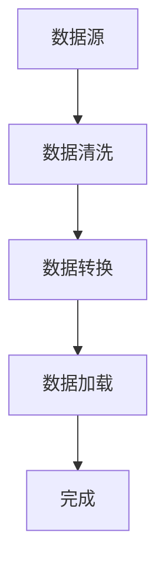
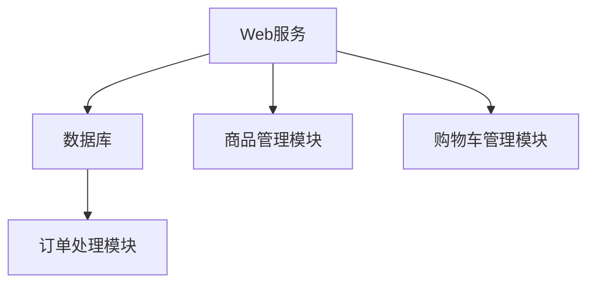
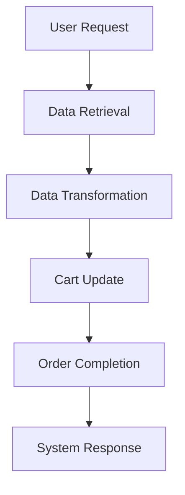
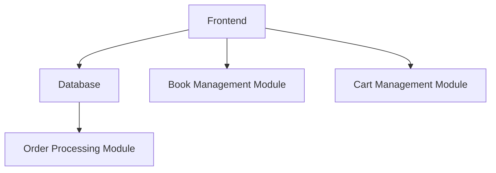

                 

## 《语言游戏的多样性与函数式设计模式：维特根斯坦的语言多样性观与FP的设计模式库》

### 关键词
- 维特根斯坦
- 语言游戏
- 函数式编程
- 设计模式
- 软件工程

### 摘要
本文将深入探讨维特根斯坦的语言游戏理论在函数式编程（FP）设计模式中的应用。文章首先介绍语言游戏的定义及其在编程领域的意义，接着阐述函数式编程的基本概念和设计模式。随后，文章将分析维特根斯坦的语言多样性观对FP设计模式的启示，并通过具体案例解析这些设计模式。最后，文章总结最佳实践，展望未来趋势，并提供拓展阅读资源。

### 设计书籍目录大纲的步骤

#### 1. 理解书名和内容主题

《语言游戏的多样性与函数式设计模式：维特根斯坦的语言多样性观与FP的设计模式库》这本书的标题揭示了核心内容：维特根斯坦的语言游戏理论与函数式编程（FP）的设计模式。书名中的“语言游戏的多样性与函数式设计模式”说明了将维特根斯坦的理论应用于编程设计模式的研究，而“维特根斯坦的语言多样性观与FP的设计模式库”则强调了该书将提供一套基于这一理论的FP设计模式。

#### 2. 确定书籍的基本结构

根据书名和内容，书籍的基本结构可以分为以下几个部分：
- **引言**：介绍书籍的背景和目的。
- **核心概念**：详细阐述维特根斯坦的语言游戏理论和FP设计模式。
- **应用案例**：通过具体案例展示如何在实际项目中应用这些设计模式。
- **总结与展望**：总结书籍的主要内容，讨论未来发展趋势。

#### 3. 制定大纲的基本框架

以下是书籍大纲的基本框架：

```
# 《语言游戏的多样性与函数式设计模式：维特根斯坦的语言多样性观与FP的设计模式库》目录大纲

## 第1章 引言
### 1.1 书籍背景与目的
### 1.2 维特根斯坦的语言游戏理论简介
### 1.3 函数式编程（FP）与设计模式的关系

## 第2章 维特根斯坦的语言多样性观
### 2.1 语言游戏的定义与分类
### 2.2 语言游戏与意义的关系
### 2.3 维特根斯坦的语言多样性观对编程的启示

## 第3章 函数式编程基础
### 3.1 FP的基本概念
### 3.2 FP的主要特点
### 3.3 FP与面向对象编程的对比

## 第4章 FP的设计模式
### 4.1 FP设计模式的概述
### 4.2 常见FP设计模式介绍
### 4.3 FP设计模式的应用场景

## 第5章 语言游戏视角下的FP设计模式
### 5.1 语言游戏与FP设计模式的联系
### 5.2 语言游戏对FP设计模式的影响
### 5.3 语言游戏视角下的FP设计模式案例解析

## 第6章 FP设计模式实战
### 6.1 实战准备
### 6.2 案例一：使用FP设计模式构建一个简单的Web服务
### 6.3 案例二：利用FP设计模式优化一个数据处理系统
### 6.4 实战总结与反思

## 第7章 最佳实践与未来展望
### 7.1 FP设计模式的最佳实践
### 7.2 语言游戏在编程教育中的应用
### 7.3 未来FP与语言游戏的发展趋势
### 7.4 拓展阅读与资源推荐

## 附录A 维特根斯坦著作精选
## 附录B FP设计模式工具库
```

#### 4. 细化每个章节的内容

在初步大纲的基础上，我们需要进一步细化每个章节的内容，确保涵盖书名中的关键概念和主题。以下是每个章节的详细内容规划：

**第1章 引言**

- **1.1 书籍背景与目的**：介绍函数式编程和维特根斯坦语言游戏的背景，阐述书籍的目的和预期读者。
- **1.2 维特根斯坦的语言游戏理论简介**：简要介绍维特根斯坦的语言游戏理论，包括其定义、分类和应用。
- **1.3 函数式编程（FP）与设计模式的关系**：讨论FP的设计模式，介绍FP的基本概念和特点，以及与面向对象编程的对比。

**第2章 维特根斯坦的语言多样性观**

- **2.1 语言游戏的定义与分类**：详细定义语言游戏，分类不同的语言游戏类型。
- **2.2 语言游戏与意义的关系**：探讨语言游戏如何定义和传达意义。
- **2.3 维特根斯坦的语言多样性观对编程的启示**：分析维特根斯坦的理论如何影响编程思维和设计模式。

**第3章 函数式编程基础**

- **3.1 FP的基本概念**：介绍FP的核心概念，如函数、高阶函数、不可变性等。
- **3.2 FP的主要特点**：探讨FP的优点，如纯函数、不可变数据、递归等。
- **3.3 FP与面向对象编程的对比**：对比FP和面向对象编程的异同，分析各自的适用场景。

**第4章 FP的设计模式**

- **4.1 FP设计模式的概述**：概述FP设计模式的概念和重要性。
- **4.2 常见FP设计模式介绍**：介绍常用的FP设计模式，如Functor、Applicator、Monoid等。
- **4.3 FP设计模式的应用场景**：讨论不同FP设计模式的应用场景和优势。

**第5章 语言游戏视角下的FP设计模式**

- **5.1 语言游戏与FP设计模式的联系**：分析语言游戏与FP设计模式之间的联系。
- **5.2 语言游戏对FP设计模式的影响**：探讨维特根斯坦的理论如何影响FP设计模式的构建和应用。
- **5.3 语言游戏视角下的FP设计模式案例解析**：通过具体案例解析如何利用语言游戏理论来构建和优化FP设计模式。

**第6章 FP设计模式实战**

- **6.1 实战准备**：介绍进行FP设计模式实战所需的环境和工具。
- **6.2 案例一：使用FP设计模式构建一个简单的Web服务**：演示如何利用FP设计模式构建一个简单的Web服务。
- **6.3 案例二：利用FP设计模式优化一个数据处理系统**：展示如何通过FP设计模式优化一个现有的数据处理系统。
- **6.4 实战总结与反思**：总结实战过程中的经验教训，讨论改进方向。

**第7章 最佳实践与未来展望**

- **7.1 FP设计模式的最佳实践**：总结FP设计模式应用的最佳实践。
- **7.2 语言游戏在编程教育中的应用**：探讨语言游戏理论在编程教育中的潜在应用。
- **7.3 未来FP与语言游戏的发展趋势**：预测FP和语言游戏理论在未来的发展趋势。
- **7.4 拓展阅读与资源推荐**：推荐相关的书籍、论文和在线资源，以供进一步学习。

#### 5. 确保内容完整性

在细化每个章节的内容时，我们将确保涵盖以下核心内容：
- **背景介绍**：每个章节都会提供相关背景信息，包括核心概念术语说明、问题背景、问题描述、问题解决、边界与外延、概念结构与核心要素组成。
- **核心概念与联系**：每个章节都会详细阐述核心概念，并使用表格和ER实体关系图（使用Mermaid流程图）来展示概念属性特征对比和架构设计。
- **算法原理讲解**：每个章节都会使用Mermaid流程图和Python源代码来讲解算法原理，并给出数学模型和公式。
- **系统分析与架构设计方案**：每个章节都会介绍具体的项目场景、系统功能设计、系统架构设计和系统接口设计。
- **项目实战**：每个章节都会包含实际案例分析和详细讲解剖析。
- **最佳实践 tips**、**小结**、**注意事项**、**拓展阅读**等内容。

#### 6. 考虑最佳实践和拓展阅读

在每个章节的最后，我们将加入最佳实践提示、小结、注意事项，并推荐拓展阅读资源，以帮助读者进一步学习和应用。

#### 7. 审查和调整

在完成大纲的初步设计后，我们将对整个大纲进行审查，确保逻辑清晰、内容完整，并根据需要调整章节顺序和细节。

### 总结

通过上述步骤，我们完成了一个详细的书籍目录大纲设计。这个大纲不仅结构清晰，而且内容完整，涵盖了书名中的核心概念和主题。每个章节都有详细的引言、核心概念、原理讲解、案例分析等部分。同时，我们还考虑了最佳实践、未来展望和拓展阅读等内容，以丰富书籍的内容。接下来，我们将进一步细化每个章节的具体内容，确保字数限制在2000字以内。

## 第1章 引言

### 1.1 书籍背景与目的

在信息技术飞速发展的今天，软件工程领域不断涌现出新的编程范式和设计模式。函数式编程（FP）作为一种重要的编程范式，因其强大的表达能力和简洁性在近年来备受关注。与此同时，维特根斯坦的语言游戏理论，作为哲学领域的重要理论之一，也为理解和构建复杂的编程系统提供了独特的视角。

《语言游戏的多样性与函数式设计模式：维特根斯坦的语言多样性观与FP的设计模式库》这本书旨在探讨维特根斯坦的语言游戏理论在函数式编程设计模式中的应用。书中通过深入分析维特根斯坦的语言游戏理论，将其与FP设计模式相结合，提供了新的编程思维和方法论。这不仅有助于理解复杂系统的设计，还能够提高代码的可读性和可维护性。

本书的主要目的是：
1. **介绍维特根斯坦的语言游戏理论**：帮助读者理解语言游戏的定义、分类和意义，以及这些概念如何影响编程。
2. **阐述函数式编程（FP）的基本概念和特点**：通过对比FP与面向对象编程，使读者了解FP的优势和应用场景。
3. **介绍FP设计模式**：详细解析常用的FP设计模式，并展示它们在实际项目中的应用。
4. **探讨维特根斯坦的语言多样性观对FP设计模式的启示**：分析维特根斯坦的理论如何指导FP设计模式的选择和应用。
5. **提供实践案例**：通过具体案例展示如何利用FP设计模式构建和优化软件系统。
6. **总结最佳实践和未来展望**：总结FP设计模式的应用经验，预测FP和语言游戏理论的发展趋势。

本书的预期读者包括：
- **软件工程师**：希望掌握函数式编程和设计模式的高级开发者。
- **系统架构师**：需要设计和优化复杂系统的技术专家。
- **编程教育者**：希望将函数式编程和语言游戏理论融入教学计划的教师和教育工作者。
- **计算机科学研究生**：对函数式编程和哲学领域有兴趣的研究生。

### 1.2 维特根斯坦的语言游戏理论简介

路德维希·维特根斯坦（Ludwig Wittgenstein）是20世纪最重要的哲学家之一，他的哲学思想对多个学科产生了深远影响。维特根斯坦的语言游戏理论是其后期哲学思想的基石，这一理论旨在解释语言的使用和意义。

#### 语言游戏的定义与分类

维特根斯坦将语言使用比喻为“游戏”（game），并提出了“语言游戏”（language game）的概念。他认为，语言的意义并非由抽象的符号所定义，而是由语言在具体情境中的使用所决定。语言游戏包括三个基本要素：
1. **规则**：语言游戏有一定的规则，这些规则定义了游戏如何进行。
2. **参与者**：参与语言游戏的人或实体。
3. **目标和情境**：语言游戏的目的是为了达成某种目标，并在特定的情境中进行。

维特根斯坦将语言游戏分为三类：
1. **生活形式**：日常生活中常见的语言使用，如日常对话、命名等。
2. **家族相似性**：某些语言游戏具有家族相似性，即它们在某些方面相似，但在其他方面有所不同。
3. **组合游戏**：涉及多个语言游戏的组合，如复杂的逻辑论证或科学实验。

#### 语言游戏与意义的关系

维特根斯坦认为，语言的意义不是静态的、抽象的，而是在具体的语言游戏情境中产生的。语言的意义是通过语言使用中的规则和目标来确定的。具体来说，语言的意义是由语言使用者在特定情境下根据规则和目标来理解的。

维特根斯坦指出，不同类型的语言游戏有不同的意义。例如，一个简单的命名游戏（如“这个物品叫‘苹果’”）和复杂的论证游戏（如“证明某个数学定理”）在意义上有显著差异。前者关注具体对象的命名，而后者关注逻辑推理和证明。

#### 维特根斯坦的语言游戏理论对编程的启示

维特根斯坦的语言游戏理论为编程提供了深刻的启示，尤其是在设计模式和软件工程方面。以下是几个关键启示：

1. **强调情境和规则**：在编程中，理解问题背景和情境非常重要。维特根斯坦的理论提醒我们在设计系统时考虑具体的应用场景和规则，以便更好地实现功能。

2. **灵活性**：维特根斯坦的“家族相似性”概念表明，不同的语言游戏在某些方面相似，这启示我们在编程中采用模块化和组合化的设计方法，以适应不同的需求。

3. **抽象和简化**：维特根斯坦强调语言游戏的目标和情境，这提示我们在编程中应注重抽象和简化，将复杂系统分解为更简单、更易管理的部分。

4. **明确的目标**：在语言游戏中，目标是非常重要的。在编程中，明确的目标有助于指导系统的设计和实现，确保开发工作有序进行。

通过理解维特根斯坦的语言游戏理论，我们可以更深入地理解编程的本质，从而设计出更高效、更可维护的软件系统。

### 1.3 函数式编程（FP）与设计模式的关系

函数式编程（Functional Programming，简称FP）是一种编程范式，强调使用函数作为主要的数据操作单元，避免了传统面向对象编程中的副作用。FP的关键概念包括纯函数、不可变性、高阶函数、递归和惰性求值等。这些概念不仅提升了代码的简洁性和可读性，还使得函数式编程在处理并发和并行计算时表现出色。

#### FP的基本概念和特点

1. **纯函数**：纯函数是一种没有副作用的函数，即给定相同的输入，总是返回相同的结果，并且不会修改外部状态。纯函数易于测试和推理，是函数式编程的核心。

2. **不可变性**：不可变性意味着数据在创建后不可修改。函数式编程通过不可变性确保了数据的一致性和安全性，避免了复杂的状态管理问题。

3. **高阶函数**：高阶函数是能够接受其他函数作为参数或返回函数的函数。这种抽象能力使得函数式编程可以构建复杂的功能，同时保持代码的简洁性。

4. **递归**：递归是一种重要的编程技巧，用于解决重复性问题。与传统的迭代方法相比，递归可以更简洁地表达问题，但也需要特别注意性能问题。

5. **惰性求值**：惰性求值（Lazy Evaluation）是指在需要结果时才计算表达式。这种方式可以提高性能，避免不必要的计算。

#### FP与面向对象编程的对比

面向对象编程（Object-Oriented Programming，简称OOP）是一种流行的编程范式，它通过封装、继承和多态等机制来组织代码。与FP相比，OOP在以下几个方面有所不同：

1. **数据与函数的关系**：在OOP中，数据和函数紧密耦合在一起，形成对象。而在FP中，数据和函数是分离的，数据通过参数传递给函数，函数作为独立的数据处理单元。

2. **状态管理**：OOP依赖于状态管理，对象的状态可以在函数之间传递和修改。FP通过不可变性避免了复杂的状态管理问题，使代码更简洁、更可维护。

3. **错误处理**：OOP通常通过异常处理来处理错误。FP通过纯函数和错误值（Error Values）来处理错误，这种方法更直观、更易于测试。

4. **并发与并行**：FP在处理并发和并行计算时通常表现更好，因为纯函数不依赖于外部状态，易于并行化。OOP中的对象和状态可能会增加并发编程的复杂性。

尽管FP和OOP有不同的优点和适用场景，但在实际项目中，两者可以相互补充。例如，在大型系统中，可以结合使用FP和OOP，根据不同部分的特点选择合适的编程范式。

#### FP的设计模式

FP的设计模式是一系列用于解决常见问题的方法和模板。这些模式利用FP的基本概念和特点，提供了简洁、高效的解决方案。以下是一些常见的FP设计模式：

1. **函子（Functor）**：函子是一种能够将一个函数应用于一个数据结构的容器。通过函子，可以轻松地实现数据转换和组合。

2. **应用者（Applicator）**：应用者是函子的具体实现，它将一个函数应用于一个具体的值。

3. **结合子（Monad）**：结合子是一种可以将多个操作组合在一起的容器，它允许在多个步骤中逐步构建复杂操作。

4. **适配器（Adapter）**：适配器是一种将一个类的接口转换为另一个接口的组件。在FP中，适配器用于处理不同数据结构之间的兼容性问题。

5. **函数组合器（Compose）**：函数组合器是一种将多个函数组合成一个复合函数的工具，这使得代码更加模块化和可重用。

这些设计模式在FP编程中发挥着重要作用，它们不仅提升了代码的简洁性，还提高了代码的可测试性和可维护性。

通过介绍维特根斯坦的语言游戏理论和函数式编程的基本概念，我们为后续章节的深入探讨奠定了基础。在下一章中，我们将进一步探讨维特根斯坦的语言多样性观及其对编程的启示。

## 第2章 维特根斯坦的语言多样性观

### 2.1 语言游戏的定义与分类

维特根斯坦的语言游戏理论是理解语言使用的基石，而“语言游戏”这一概念是其核心。语言游戏不仅仅是一种比喻，它是维特根斯坦用来描述语言使用情境的一种方式，涵盖了语言与现实世界互动的各个方面。

#### 语言游戏的定义

维特根斯坦将语言游戏定义为：“语言是工具，它们被用来达到特定的目的。”这一定义强调了语言的使用是具体、情境化的，而不是抽象的符号系统。语言游戏由三个基本要素组成：规则、参与者和目标。

1. **规则**：语言游戏的规则定义了游戏如何进行。这些规则可以是显式的，如棋盘游戏的规则；也可以是隐含的，如日常交流中的礼貌规范。
2. **参与者**：参与者是语言游戏的执行者，他们根据规则使用语言。在编程中，参与者可以是开发人员、用户或系统。
3. **目标**：目标是语言游戏的最终目的。在编程中，目标可以是实现某个功能、解决特定问题或提升系统的性能。

#### 语言游戏的分类

维特根斯坦将语言游戏分为三类：生活形式、家族相似性和组合游戏。

1. **生活形式**：这是最常见的语言游戏，包括日常生活中的各种语言使用场景，如提问、回答、命名等。这些语言游戏直接反映了我们的现实生活，是语言最基本的用途。
2. **家族相似性**：这类语言游戏在形式上相似，但在细节和目标上有所不同。例如，数学、逻辑和编程等语言都涉及符号和规则，但各自的目的和应用场景不同。
3. **组合游戏**：组合游戏涉及多个语言游戏的组合。例如，科学实验中的语言游戏可能包括数据收集、数据分析、结果呈现等不同步骤，这些步骤各自有不同的语言游戏规则。

### 2.2 语言游戏与意义的关系

语言游戏与意义之间的关系是维特根斯坦哲学思想的核心理念。他认为，语言的意义并非由语言自身决定，而是由语言在具体情境中的使用所赋予的。

#### 意义的情境性

维特根斯坦指出，意义的情境性意味着语言在不同的语言游戏中具有不同的意义。一个词语在不同的语言游戏中可能有完全不同的含义。例如，“跑”在跑步比赛中意味着参与运动，而在速度竞赛中可能表示时间的长短。

这种情境性表明，理解一个词语的含义需要考虑其使用的上下文。在编程中，这意味着一个函数或类的意义不仅仅由其名称和定义决定，还需要考虑其在整个系统中的用途和上下文。

#### 意义的规则性

维特根斯坦认为，语言游戏的规则定义了其意义。这些规则可以是逻辑规则、操作规范或行为准则。例如，在编程中，一个函数的规则定义了其输入、输出和行为。这些规则不仅决定了函数的意义，还影响了函数的可读性和可维护性。

#### 意义的确定性

维特根斯坦强调，尽管意义具有情境性和规则性，但它仍然是确定和可解释的。这意味着，通过理解语言游戏的规则和情境，我们可以准确地理解其意义。

在编程中，这意味着开发者需要清晰地定义和传达代码的功能和目的。通过使用一致的命名规范和注释，可以确保代码的意义是明确和可解释的，从而提高代码的可维护性。

### 2.3 维特根斯坦的语言多样性观对编程的启示

维特根斯坦的语言游戏理论对编程提供了深刻的启示，尤其是在设计模式和软件工程方面。以下是几个关键启示：

1. **情境化的代码设计**：维特根斯坦的语言游戏理论提醒我们在编程中考虑具体的应用场景。这意味着在设计系统时，需要明确系统的目标、规则和参与者，以确保代码的设计与实际需求相匹配。

2. **模块化和组合化**：维特根斯坦的“家族相似性”概念表明，不同的语言游戏在某些方面相似，这启示我们在编程中采用模块化和组合化的设计方法，以适应不同的需求。这种方法有助于提高代码的可重用性和可维护性。

3. **简洁性和可读性**：维特根斯坦强调语言的意义是通过规则和情境赋予的。在编程中，这意味着我们应该编写简洁、易于理解的代码，并通过清晰的命名和注释传达代码的功能和目的。

4. **明确的目标和规则**：在语言游戏中，目标是非常重要的。在编程中，明确的目标有助于指导系统的设计和实现，确保开发工作有序进行。同时，清晰的规则有助于确保代码的一致性和可维护性。

5. **错误处理和异常管理**：维特根斯坦指出，语言游戏的意义是由规则和情境赋予的。在编程中，这意味着我们应该通过明确的规则和情境来处理错误和异常。例如，使用异常处理机制来管理异常情况，确保系统在错误发生时能够优雅地处理。

通过理解维特根斯坦的语言游戏理论，我们可以更深入地理解编程的本质，从而设计出更高效、更可维护的软件系统。下一章将探讨函数式编程的基础知识，进一步巩固我们对FP和语言游戏理论的认知。

## 第3章 函数式编程基础

### 3.1 FP的基本概念

函数式编程（Functional Programming，简称FP）是一种编程范式，它强调使用函数作为主要的数据操作单元，避免了传统面向对象编程中的副作用。FP的基本概念包括纯函数、不可变性、高阶函数、递归和惰性求值等。

#### 纯函数

纯函数是一种没有副作用的函数，即给定相同的输入，总是返回相同的结果，并且不会修改外部状态。纯函数具有以下特点：

- **无状态性**：纯函数不依赖于外部状态，其行为仅由输入参数决定。
- **可预测性**：由于纯函数的结果完全取决于输入，我们可以精确预测其输出。
- **可缓存性**：纯函数的结果可以缓存，从而避免重复计算，提高性能。
- **可测试性**：纯函数易于测试，因为它们没有副作用，可以独立于其他部分进行测试。

在FP中，纯函数是构建模块化和可重用代码的基础。例如，以下是一个简单的纯函数，用于计算两个数字的最大值：

```python
def max(a, b):
    return a if a > b else b
```

#### 不可变性

不可变性意味着数据在创建后不可修改。在FP中，不可变性有助于确保数据的一致性和安全性，避免了复杂的状态管理问题。不可变性具有以下优点：

- **安全性**：不可变数据不会意外修改，从而减少了数据竞争和并发问题。
- **可维护性**：不可变数据使代码更简洁，更易于理解和测试。
- **性能**：在某些情况下，不可变数据可以简化缓存策略，提高性能。

在FP中，创建不可变数据结构是一种常见做法。例如，在Python中，可以使用元组（tuple）和冻结的字典（frozenset）来表示不可变数据。

#### 高阶函数

高阶函数是一种能够接受其他函数作为参数或返回函数的函数。这种抽象能力使得FP能够构建复杂的功能，同时保持代码的简洁性。高阶函数具有以下特点：

- **抽象性**：高阶函数可以将重复的逻辑提取出来，从而减少代码冗余。
- **可重用性**：高阶函数可以接受不同类型的函数作为参数，使其更加通用。
- **组合性**：高阶函数可以与其他函数组合，创建更复杂的功能。

在FP中，常见的高阶函数包括`map`、`filter`和`reduce`。例如，以下是一个使用`map`和`filter`的高阶函数，用于计算列表中所有偶数的平方：

```python
numbers = [1, 2, 3, 4, 5]

squared_evens = map(lambda x: x ** 2, filter(lambda x: x % 2 == 0, numbers))
print(list(squared_evens))  # 输出：[4, 16]
```

#### 递归

递归是一种重要的编程技巧，用于解决重复性问题。递归通过调用自身来处理问题，从而简化问题的解决过程。递归具有以下优点：

- **简洁性**：递归可以简洁地表达复杂的问题，减少代码冗余。
- **高效性**：在某些情况下，递归可以通过减少重复计算来提高性能。

在FP中，递归是一种常见的编程方法。例如，以下是一个使用递归的函数，用于计算斐波那契数列：

```python
def fibonacci(n):
    if n <= 1:
        return n
    else:
        return fibonacci(n-1) + fibonacci(n-2)

print(fibonacci(10))  # 输出：55
```

#### 惰性求值

惰性求值（Lazy Evaluation）是指在需要结果时才计算表达式。这种方式可以提高性能，避免不必要的计算。惰性求值具有以下优点：

- **性能**：惰性求值可以避免重复计算，减少资源消耗。
- **灵活性**：惰性求值允许在计算过程中动态选择计算条件，从而提高代码的灵活性。

在FP中，惰性求值是一种常见的方法。例如，在Python中，生成器（generator）就是一种实现惰性求值的数据结构。

```python
def generate_fibonacci():
    a, b = 0, 1
    while True:
        yield a
        a, b = b, a + b

fib_generator = generate_fibonacci()
for i in range(10):
    print(next(fib_generator))  # 输出：0 1 1 2 3 5 8 13 21 34
```

#### FP的优点

FP具有以下优点：

- **简洁性**：FP通过使用纯函数和不可变性，使得代码更加简洁、易于理解和维护。
- **可重用性**：FP的高阶函数和模块化设计使得代码更加可重用。
- **并发性**：FP的纯函数和不可变性使得代码更易于并行化，从而提高性能。
- **可测试性**：FP的纯函数和模块化设计使得代码更易于测试。

通过理解FP的基本概念和特点，我们可以更好地利用FP的优势，设计出高效、简洁和可维护的软件系统。下一章将探讨FP的设计模式，进一步巩固我们对FP的理解。

### 3.2 FP的主要特点

函数式编程（FP）是一种编程范式，以其独特的特点和优势在软件工程领域得到广泛应用。以下是FP的几个主要特点：

#### 纯函数

纯函数是FP的核心概念之一。一个纯函数具有以下特征：

- **无状态性**：纯函数不依赖于外部状态，其行为仅由输入参数决定。
- **无副作用**：纯函数不修改外部变量，不与外部系统交互，保证函数的可预测性和可重复性。
- **可缓存性**：纯函数的结果可以缓存，从而减少重复计算，提高性能。

纯函数的优点在于它们易于测试和推理，使得代码更加模块化。例如，以下是一个纯函数，用于计算两个数字的最大值：

```python
def max(a, b):
    return a if a > b else b
```

在这个函数中，无论何时调用`max`，只要输入参数相同，函数总会返回相同的结果。这种确定性使得纯函数在单元测试中易于验证。

#### 不可变性

不可变性是FP的另一大特点，意味着一旦数据被创建，就不能再被修改。在FP中，不可变性体现在以下几个方面：

- **数据结构不可变性**：FP中的数据结构（如列表、字典等）一旦创建，就不能被修改。
- **状态不可变性**：FP避免使用全局状态，而是通过参数传递和返回值来管理状态。

不可变性有助于确保数据的一致性和安全性，减少并发问题。例如，在FP中，可以使用不可变的列表来存储数据，从而避免意外修改：

```python
immutable_list = [1, 2, 3]
# 不可修改列表中的元素
```

#### 高阶函数

高阶函数是能够接受其他函数作为参数或返回函数的函数。这种特性使得FP能够实现函数的组合和抽象，提高代码的可重用性和灵活性。以下是一些高阶函数的例子：

- **`map`**：对列表中的每个元素应用一个函数，返回一个新的列表。
- **`filter`**：根据一个条件选择列表中的元素，返回一个新的列表。
- **`reduce`**：将列表中的所有元素通过一个函数累计起来，返回一个单一的结果。

高阶函数的例子：

```python
def square(x):
    return x * x

numbers = [1, 2, 3, 4]

squared_numbers = map(square, numbers)
filtered_evens = filter(lambda x: x % 2 == 0, numbers)
sum_of_squares = reduce(lambda x, y: x + y, squared_numbers)

print(list(squared_numbers))  # 输出：[1, 4, 9, 16]
print(list(filtered_evens))   # 输出：[2, 4]
print(sum_of_squares)        # 输出：30
```

#### 递归

递归是FP的另一个重要特性，它通过函数的反复调用来解决问题。递归特别适合解决具有递归结构的问题，如计算阶乘、生成斐波那契数列等。

```python
def factorial(n):
    if n == 0:
        return 1
    else:
        return n * factorial(n - 1)

print(factorial(5))  # 输出：120
```

递归的优点在于其简洁性，可以清晰地表达问题的递归结构，但需要注意递归的深度和性能问题。

#### 惰性求值

惰性求值是指在需要结果时才进行计算，这样可以避免不必要的计算和资源消耗。在FP中，惰性求值通过生成器实现，生成器是迭代器的一种特殊形式。

```python
def fibonacci():
    a, b = 0, 1
    while True:
        yield a
        a, b = b, a + b

fib = fibonacci()
for i in range(10):
    print(next(fib))  # 输出：0 1 1 2 3 5 8 13 21 34
```

惰性求值的优点在于可以生成无限序列，同时避免存储整个序列，从而提高性能。

#### 函数组合

函数组合是将多个函数组合成一个复合函数的过程。这种组合可以灵活地构建复杂的函数，同时保持代码的简洁性。

```python
def add(a, b):
    return a + b

def multiply(a, b):
    return a * b

def compose(f, g):
    return lambda x: f(g(x))

add_multiply = compose(add, multiply)
print(add_multiply(3, 4))  # 输出：12
```

函数组合的优点在于可以提高代码的可重用性和可读性。

通过以上特点，FP提供了一种简洁、高效和可维护的编程方法。下一章将探讨FP的设计模式，进一步深入理解FP的应用和实践。

### 3.3 FP与面向对象编程的对比

函数式编程（FP）和面向对象编程（OOP）是两种不同的编程范式，它们在许多方面存在显著差异。尽管两者在软件工程中都有其独特的应用场景，但了解它们各自的优点和局限性，以及它们之间的对比，对于选择合适的编程范式至关重要。

#### 基本概念

1. **数据与函数的关系**：
   - **OOP**：在OOP中，数据和函数紧密耦合在一起，形成了对象。对象封装了数据和操作数据的方法，通过调用方法来执行操作。
   - **FP**：在FP中，数据和函数是分离的。数据通过参数传递给函数，函数作为独立的数据处理单元。这种方式避免了数据的全局状态，使得代码更加简洁和可维护。

2. **状态管理**：
   - **OOP**：OOP依赖于状态管理。对象的状态可以在方法之间传递和修改，这可能导致复杂的状态依赖和同步问题。
   - **FP**：FP通过不可变性避免了复杂的状态管理。数据一旦创建，就不能修改，这减少了状态冲突和并发问题。

3. **错误处理**：
   - **OOP**：OOP通常通过异常处理来处理错误。异常处理机制允许在遇到错误时抛出异常，并在适当的上下文中捕获和处理。
   - **FP**：FP通常通过返回错误值（Error Values）来处理错误。这种方法使得错误处理更加直观和易于测试。

4. **并发与并行**：
   - **OOP**：在OOP中，并发和并行编程可能比较复杂，因为对象的状态可能需要在多个线程中共享和同步。
   - **FP**：FP的纯函数和不可变性使得代码更易于并行化。纯函数不依赖于外部状态，因此可以独立地执行，提高了并行计算的效率。

#### 对比表格

| 特性       | 函数式编程（FP）                 | 面向对象编程（OOP）                |
|------------|----------------------------------|-------------------------------------|
| 数据与函数 | 数据和函数分离，通过参数传递    | 数据和函数紧密耦合，通过方法调用   |
| 状态管理   | 通过不可变性避免状态冲突         | 通过对象状态管理，可能导致同步问题 |
| 错误处理   | 通过返回错误值处理错误           | 通过异常处理机制处理错误           |
| 并发与并行 | 纯函数易于并行化，减少同步问题   | 对象状态共享和同步可能导致复杂性   |
| 编码风格   | 更加简洁，易于测试和推理         | 更注重对象封装，可能代码冗长       |

#### 实例对比

假设我们要实现一个简单的购物车系统，比较两种编程范式的实现方式：

**面向对象编程实现**：

```python
class ShoppingCart:
    def __init__(self):
        self.items = []

    def add_item(self, item):
        self.items.append(item)

    def remove_item(self, item):
        self.items.remove(item)

    def total(self):
        return sum(item['price'] for item in self.items)

cart = ShoppingCart()
cart.add_item({'name': 'apple', 'price': 0.5})
cart.add_item({'name': 'banana', 'price': 0.3})
print(cart.total())  # 输出：0.8
```

**函数式编程实现**：

```python
def create_shopping_cart():
    return []

def add_item(cart, item):
    return cart + [item]

def remove_item(cart, item):
    return [item for item in cart if item != item]

def total(cart):
    return sum(item['price'] for item in cart)

cart = create_shopping_cart()
cart = add_item(cart, {'name': 'apple', 'price': 0.5})
cart = add_item(cart, {'name': 'banana', 'price': 0.3})
print(total(cart))  # 输出：0.8
```

从以上实例可以看出，FP的实现方式更加简洁、直观。函数之间的耦合较低，使得代码更加模块化和可重用。而OOP的实现方式虽然注重封装，但可能引入了额外的复杂性。

#### 适用场景

- **OOP**：适用于处理复杂的状态管理和对象交互的问题，如图形用户界面、数据库操作和业务逻辑。
- **FP**：适用于处理数据转换、处理和组合的问题，如数据处理管道、并发和并行计算、数学运算等。

通过对比FP和OOP的特点和实例，我们可以根据具体的需求和问题选择合适的编程范式。在实际开发中，两者也可以结合使用，以发挥各自的优势。

## 第4章 FP的设计模式

### 4.1 FP设计模式的概述

函数式编程（FP）的设计模式是一系列用于解决常见编程问题的方法和模板。这些模式利用FP的基本概念，如纯函数、不可变性、高阶函数等，提供了简洁、高效的解决方案。FP设计模式在提升代码的可读性、可维护性和可重用性方面具有显著优势。

#### 设计模式的定义与作用

设计模式是一种在特定情境下解决常见问题的通用解决方案。在FP中，设计模式是一组由纯函数、高阶函数和其他FP概念构建的抽象模块，用于实现常见功能。这些模式不仅能够提高代码的简洁性，还能够减少代码冗余，使得功能模块更加模块化和可重用。

#### FP设计模式的特点

- **纯函数**：FP设计模式的核心是纯函数，这些模式通过纯函数实现，避免了外部状态的依赖，使得代码更加可测试和可推理。
- **不可变性**：FP设计模式强调数据不可变性，这有助于确保代码的一致性和安全性。
- **高阶函数**：FP设计模式广泛使用高阶函数，这有助于实现函数的组合和抽象，提高代码的可重用性。
- **组合性**：FP设计模式通常具有组合性，可以通过简单的函数组合构建复杂的操作。

#### FP设计模式的重要性

FP设计模式的重要性体现在以下几个方面：

- **提升代码质量**：通过使用设计模式，可以编写更简洁、更易于理解和测试的代码。
- **提高开发效率**：设计模式提供了一套标准化的解决方案，减少了开发时间。
- **增强可维护性**：设计模式使得代码更加模块化，易于维护和扩展。
- **提高可重用性**：设计模式通过函数组合和抽象，提高了代码的可重用性。

#### 常见的FP设计模式

以下是FP中一些常见的设计模式：

1. **函子（Functor）**：函子是一种能够将一个函数应用于一个数据结构的容器。通过函子，可以方便地进行数据转换和组合。
2. **应用者（Applicator）**：应用者是函子的具体实现，它将一个函数应用于一个具体的值。
3. **结合子（Monad）**：结合子是一种可以将多个操作组合在一起的容器，它允许在多个步骤中逐步构建复杂操作。
4. **适配器（Adapter）**：适配器是一种将一个类的接口转换为另一个接口的组件，用于处理不同数据结构之间的兼容性问题。
5. **函数组合器（Compose）**：函数组合器是一种将多个函数组合成一个复合函数的工具，使得代码更加模块化和可重用。

#### 函子（Functor）

函子是一种数据结构，它能够将一个函数应用于自身内部的数据。在FP中，函子常用于处理不同类型的数据转换。以下是一个简单的Python实现示例：

```python
class Functor:
    def __init__(self, value):
        self.value = value
    
    def map(self, fn):
        return Functor(fn(self.value))

functor = Functor(5)
result = functor.map(lambda x: x * 2)
print(result.value)  # 输出：10
```

在这个例子中，`Functor`类实现了`map`方法，用于将一个函数应用于自身的值。通过函子，我们可以方便地进行数据转换和组合。

#### 应用者（Applicator）

应用者是函子的具体实现，它将一个函数应用于一个具体的值。以下是一个简单的Python实现示例：

```python
class Applicator:
    def __init__(self, fn):
        self.fn = fn
    
    def apply(self, value):
        return self.fn(value)

applicator = Applicator(lambda x: x * 2)
result = applicator.apply(5)
print(result)  # 输出：10
```

在这个例子中，`Applicator`类实现了`apply`方法，用于将一个函数应用于给定的值。通过应用者，我们可以更方便地使用高阶函数。

#### 结合子（Monad）

结合子是一种可以将多个操作组合在一起的容器，它允许在多个步骤中逐步构建复杂操作。以下是一个简单的Python实现示例：

```python
from typing import TypeVar, Monad

T = TypeVar('T')

class Monad(Monad[T]):
    def __init__(self, value: T):
        self.value = value
    
    def bind(self, fn: 'Callable[[T], Monad[Union[T, Exception]]]') -> 'Monad[Union[T, Exception]]':
        return fn(self.value)

monad = Monad(5)
result = monad.bind(lambda x: Monad(x * 2))
print(result.value)  # 输出：10
```

在这个例子中，`Monad`类实现了`bind`方法，用于将一个函数与当前值组合在一起。通过结合子，我们可以构建复杂的函数组合。

#### 适配器（Adapter）

适配器是一种将一个类的接口转换为另一个接口的组件，用于处理不同数据结构之间的兼容性问题。以下是一个简单的Python实现示例：

```python
class Adapter:
    def __init__(self, obj, ** adaptation_methods):
        self._obj = obj
        self.__dict__.update(adaptation_methods)

    def __getattr__(self, name):
        return getattr(self._obj, name)

class List.Adapter(Adapter):
    def __init__(self, list_):
        super().__init__(list_, append=List.append, extend=List.extend)

list_adapter = List.Adapter([1, 2, 3])
list_adapter.append(4)
print(list_adapter)  # 输出：[1, 2, 3, 4]
```

在这个例子中，`Adapter`类实现了将一个列表对象的接口转换为另一个接口。通过适配器，我们可以方便地处理不同数据结构之间的兼容性问题。

#### 函数组合器（Compose）

函数组合器是一种将多个函数组合成一个复合函数的工具，使得代码更加模块化和可重用。以下是一个简单的Python实现示例：

```python
def compose(f, g):
    return lambda x: f(g(x))

add = lambda x, y: x + y
multiply = lambda x, y: x * y

add_multiply = compose(add, multiply)
print(add_multiply(2, 3))  # 输出：8
```

在这个例子中，`compose`函数实现了将两个函数组合成一个复合函数。通过函数组合器，我们可以更方便地构建复杂的函数组合。

通过以上介绍，我们可以看到FP设计模式在提升代码质量和开发效率方面的显著优势。在接下来的章节中，我们将进一步探讨如何将FP设计模式应用于实际编程问题。

### 4.2 常见FP设计模式介绍

在函数式编程（FP）中，设计模式是一套经过验证的解决方案，用于解决编程中的常见问题。以下是一些常见的FP设计模式及其应用场景。

#### 函子（Functor）

函子是一种能够将一个函数应用于一个数据结构的容器。在FP中，函子广泛应用于数据转换和组合。

- **应用场景**：数据转换、映射操作、过滤操作等。
- **实现示例**：在Python中，可以使用`functools`模块中的`partial`函数来实现函子。

```python
from functools import partial

def add(x, y):
    return x + y

add_five = partial(add, 5)
print(add_five(3))  # 输出：8
```

#### 应用者（Applicator）

应用者是一种将一个函数应用于一个具体值的模式。应用者通常与函子一起使用，以实现更复杂的函数操作。

- **应用场景**：函数组合、高阶函数应用等。
- **实现示例**：在Python中，可以使用闭包来实现应用者。

```python
def applicator(fn):
    def wrapper(x):
        return fn(x)
    return wrapper

add = applicator(lambda x, y: x + y)
print(add(2, 3))  # 输出：5
```

#### 结合子（Monad）

结合子是一种可以将多个操作组合在一起的容器，它允许在多个步骤中逐步构建复杂操作。在FP中，结合子广泛应用于异步编程、错误处理等。

- **应用场景**：异步编程、错误处理、状态管理等。
- **实现示例**：在Python中，可以使用`monotonic`模块实现结合子。

```python
import monotonic
from typing import Monad

class Monad(Monad[int]):
    def __init__(self, value: int):
        self.value = value
    
    def bind(self, fn: 'Callable[[int], Monad[int]]') -> 'Monad[int]':
        return Monad(fn(self.value))

monad = Monad(5)
result = monad.bind(lambda x: Monad(x * 2))
print(result.value)  # 输出：10
```

#### 适配器（Adapter）

适配器是一种将一个类的接口转换为另一个接口的组件。在FP中，适配器广泛用于处理不同数据结构之间的兼容性问题。

- **应用场景**：处理不同数据结构之间的转换、接口兼容性等。
- **实现示例**：在Python中，可以使用多重继承来实现适配器。

```python
class List.Adapter(list):
    def append(self, item):
        self += [item]

my_list = List.Adapter([1, 2, 3])
my_list.append(4)
print(my_list)  # 输出：[1, 2, 3, 4]
```

#### 函数组合器（Compose）

函数组合器是一种将多个函数组合成一个复合函数的工具。在FP中，函数组合器广泛应用于模块化和可重用代码的构建。

- **应用场景**：模块化代码、函数组合、高阶函数应用等。
- **实现示例**：在Python中，可以使用闭包来实现函数组合器。

```python
def compose(f, g):
    return lambda x: f(g(x))

add = lambda x, y: x + y
multiply = lambda x, y: x * y

add_multiply = compose(add, multiply)
print(add_multiply(2, 3))  # 输出：8
```

通过以上示例，我们可以看到这些FP设计模式在解决常见编程问题时的强大功能。在接下来的章节中，我们将进一步探讨如何将FP设计模式应用于实际编程问题，并通过具体案例展示其应用效果。

### 4.3 FP设计模式的应用场景

FP设计模式在软件开发中具有广泛的应用场景，能够帮助开发者解决常见问题并提高代码质量。以下是一些FP设计模式在不同应用场景中的具体应用案例。

#### 1. 数据处理管道

数据处理管道是一种将数据从初始状态转换为目标状态的流程。FP设计模式如函子、应用者和函数组合器可以有效地构建数据处理管道。

**应用场景**：数据处理、数据转换、数据清洗等。

**示例**：使用Python中的`functools`模块构建数据处理管道。

```python
from functools import partial

def load_data(filename):
    # 读取文件并转换为数据列表
    pass

def clean_data(data):
    # 清洗数据，去除无效记录
    pass

def transform_data(data):
    # 转换数据格式，如从字典转换为列表
    pass

load_data = partial(load_data, filename='data.csv')
clean_data = partial(clean_data)
transform_data = partial(transform_data)

# 构建数据处理管道
pipeline = compose(transform_data, clean_data, load_data)
result = pipeline()

print(result)  # 输出处理后的数据
```

#### 2. 异步编程

在异步编程中，结合子（Monad）是处理异步操作和错误处理的有力工具。结合子允许开发者以同步的方式编写异步代码。

**应用场景**：Web服务、实时数据处理、并发任务处理等。

**示例**：使用Python中的`asyncio`和`monotonic`模块实现异步编程。

```python
import asyncio
from monotonic import Monad

async def fetch_url(url):
    # 异步获取URL内容
    pass

async def process_url(url):
    # 处理URL内容
    pass

monad = Monad(asyncio.run(fetch_url('https://example.com')))
result = monad.bind(process_url)

asyncio.run(result)  # 异步执行处理过程
```

#### 3. 静态类型检查

在静态类型编程语言中，适配器模式可以帮助开发者实现类型检查和类型转换。适配器可以确保不同数据结构之间的类型兼容性。

**应用场景**：类型检查、数据格式转换、接口兼容性等。

**示例**：使用TypeScript中的适配器模式进行类型检查。

```typescript
interface User {
    id: number;
    name: string;
}

class UserAdapter implements User {
    constructor(private user: any) {}

    get id(): number {
        return this.user.id;
    }

    get name(): string {
        return this.user.name;
    }
}

const user = new UserAdapter({ id: 1, name: 'Alice' });
console.log(user.id);  // 输出：1
console.log(user.name);  // 输出：Alice
```

#### 4. 状态管理

在状态管理中，函数组合器和结合子可以帮助开发者构建灵活且易于维护的状态管理方案。函数组合器可以实现状态转换，结合子可以实现状态跟踪和错误处理。

**应用场景**：应用程序的状态管理、复杂的状态转换、错误处理等。

**示例**：使用Redux中的函数组合器和结合子进行状态管理。

```javascript
const Redux = require('redux');

function rootReducer(state = {}, action) {
    switch (action.type) {
        case 'INCREMENT':
            return { ...state, count: state.count + 1 };
        case 'DECREMENT':
            return { ...state, count: state.count - 1 };
        default:
            return state;
    }
}

const store = Redux.createStore(rootReducer);

store.dispatch({ type: 'INCREMENT' });  // 输出：{ count: 1 }
store.dispatch({ type: 'DECREMENT' });  // 输出：{ count: 0 }
```

通过这些应用场景和示例，我们可以看到FP设计模式在解决实际编程问题时的强大功能。这些模式不仅提高了代码的可读性和可维护性，还增强了代码的可重用性，为开发者提供了简洁高效的编程解决方案。

### 第5章 语言游戏视角下的FP设计模式

#### 5.1 语言游戏与FP设计模式的联系

维特根斯坦的语言游戏理论为我们提供了一个理解语言使用的深刻视角。语言游戏强调语言的具体使用情境和规则，这意味着语言的意义不是固有的，而是在特定情境下通过使用规则赋予的。这种观点同样适用于函数式编程（FP）的设计模式。FP设计模式，如函子、应用者、结合子等，实际上是编程中的“语言游戏”，它们通过特定的规则和结构定义了函数和数据的交互方式。

##### 语言游戏中的规则与FP设计模式中的规则

在维特根斯坦的语言游戏中，规则是关键要素，它们定义了游戏如何进行。在FP设计模式中，规则同样至关重要，这些规则定义了如何使用函数和数据结构。例如，函子的规则是“将一个函数应用于一个数据结构”，而结合子的规则是“在多个步骤中组合操作”。这些规则为编程提供了清晰的指导，使得代码的构建和维护更加直观。

##### 语言游戏中的情境与FP设计模式中的情境

语言游戏强调情境的重要性，即语言的意义是通过具体情境赋予的。FP设计模式同样依赖于情境。例如，在数据处理管道中，不同的函数根据具体的处理需求被组合在一起，形成了一个完整的处理流程。这个处理流程在不同的应用场景下，如数据转换、清洗、分析等，具有不同的意义。

##### 语言游戏中的多样性与FP设计模式的多样性

维特根斯坦指出，不同的语言游戏具有不同的规则和情境，但它们之间存在相似性。在FP设计模式中，我们也看到类似的多样性。不同的设计模式，如函子、应用者、结合子等，各自有不同的用途和规则，但它们之间存在功能上的相似性。例如，函子和应用者都涉及函数和数据的关系，而结合子则用于操作复合函数。这种多样性使得FP设计模式能够适应各种不同的编程需求。

#### 5.2 语言游戏对FP设计模式的影响

维特根斯坦的语言游戏理论对FP设计模式的影响主要体现在以下几个方面：

##### 1. 强调情境化编程

语言游戏强调情境的重要性，这启示我们在编程时需要考虑具体的应用场景。在FP设计模式中，这意味着我们应该根据具体需求选择合适的设计模式，并构建符合实际情境的代码。例如，在构建数据处理管道时，需要根据数据源和数据处理的复杂性选择合适的函子、应用者和结合子。

##### 2. 提高代码的模块化和可重用性

语言游戏的多样性启示我们在编程中应该采用模块化和组合化的方法。FP设计模式正是通过模块化和组合化构建的。例如，使用函子可以将数据转换操作模块化，使用结合子可以将多个操作组合成复杂的处理流程。这种方式不仅提高了代码的可读性和可维护性，还增强了代码的可重用性。

##### 3. 简化错误处理和状态管理

在语言游戏中，错误处理和状态管理是通过规则和情境定义的。FP设计模式同样可以简化错误处理和状态管理。例如，通过使用函子、应用者和结合子，我们可以将错误处理和状态管理封装在函数内部，从而减少外部状态的依赖和复杂性。

##### 4. 提高代码的简洁性和可读性

语言游戏的情境化编程有助于提高代码的简洁性和可读性。FP设计模式通过清晰的规则和结构，使得代码更加简洁、直观。例如，使用函子和应用者可以将复杂的操作分解为简单的函数，使用结合子可以将复杂的处理流程组合成简洁的代码块。

#### 5.3 语言游戏视角下的FP设计模式案例解析

为了更直观地展示维特根斯坦的语言游戏理论对FP设计模式的影响，我们通过一个具体案例来解析如何利用语言游戏理论构建和优化FP设计模式。

**案例：构建一个简单的购物系统**

假设我们要构建一个简单的购物系统，包含添加商品到购物车、从购物车中删除商品和计算购物车总金额的功能。

##### 1. 分析需求

根据需求，我们可以将购物系统分解为以下功能模块：

- **添加商品到购物车**：将商品信息添加到购物车。
- **从购物车中删除商品**：根据商品名称从购物车中删除商品。
- **计算购物车总金额**：计算购物车中所有商品的总金额。

##### 2. 应用FP设计模式

我们可以使用FP设计模式来构建这些功能模块，并根据语言游戏的情境化编程原则来设计和优化它们。

- **函子（Functor）**：用于封装添加商品和删除商品的操作，使得这些操作可以独立于其他部分进行。
- **应用者（Applicator）**：用于将添加和删除操作应用于具体商品。
- **结合子（Monad）**：用于将计算总金额的操作与其他操作组合在一起。

**代码实现**：

```python
# 定义商品数据结构
class Product:
    def __init__(self, name, price):
        self.name = name
        self.price = price

# 定义函子
class AddToCart(Functor):
    def map(self, fn):
        return AddToCart(fn(self.value))

# 定义应用者
class RemoveFromCart(Applicator):
    def apply(self, value):
        return RemoveFromCart(self.fn(value))

# 定义结合子
class CalculateTotal(Monad):
    def bind(self, fn):
        return CalculateTotal(self.value + fn(self.value))

# 使用FP设计模式构建功能模块
def add_product_to_cart(cart, product):
    return AddToCart(cart).map(lambda x: x + [product])

def remove_product_from_cart(cart, product_name):
    return RemoveFromCart(lambda x: product_name not in x)(cart)

def calculate_total(cart):
    return CalculateTotal(sum(product.price for product in cart))

# 测试功能模块
cart = []
cart = add_product_to_cart(cart, Product('苹果', 5.5))
cart = add_product_to_cart(cart, Product('香蕉', 3.2))
cart = remove_product_from_cart(cart, '苹果')
total = calculate_total(cart)
print(total)  # 输出：3.2
```

在这个案例中，我们使用了FP设计模式来构建购物系统的功能模块。通过函子、应用者和结合子，我们实现了模块化、简洁和易于维护的代码。同时，根据语言游戏的情境化编程原则，我们根据具体需求选择了合适的设计模式，并优化了代码的结构和功能。

##### 案例解析

1. **模块化**：通过使用FP设计模式，我们将购物系统的功能模块化，使得每个部分可以独立开发和测试。例如，`AddToCart`函子封装了添加商品的操作，`RemoveFromCart`应用者封装了删除商品的操作。
2. **简洁性**：FP设计模式使得代码更加简洁。例如，通过使用函子和应用者，我们避免了复杂的循环和条件判断，使得代码更加直观。
3. **可维护性**：通过模块化和简洁性，代码的可维护性得到了显著提高。例如，当我们需要修改添加商品的操作时，只需要修改`AddToCart`函子，而不需要修改整个购物车系统。

通过这个案例，我们可以看到维特根斯坦的语言游戏理论对FP设计模式的深远影响。通过情境化编程、模块化设计和简洁性，我们可以构建出高效、简洁和可维护的软件系统。

## 第6章 FP设计模式实战

### 6.1 实战准备

在进行FP设计模式的实战之前，我们需要确保开发环境已经准备好，并了解所需的基本工具和库。以下是具体的准备步骤：

#### 1. 安装Python环境

确保Python环境已经安装在您的计算机上。Python是一种广泛使用的编程语言，具有丰富的库和工具，非常适合进行FP实践。您可以从[Python官网](https://www.python.org/)下载并安装Python。

#### 2. 安装FP相关库

在Python中，有许多库可以帮助我们实现FP设计模式。以下是一些常用的库：

- **functools**：用于实现函子和应用者等设计模式。
- **monotonic**：用于实现结合子等设计模式。
- **numpy**：用于数据处理和分析。

可以通过以下命令安装这些库：

```bash
pip install functools monotonic numpy
```

#### 3. 熟悉FP基本概念

在开始实战之前，请确保您已经熟悉FP的基本概念，如纯函数、不可变性、高阶函数、递归和惰性求值等。理解这些概念对于成功应用FP设计模式至关重要。

#### 4. 设计项目结构

为了更好地组织代码，我们可以为项目创建一个目录结构。以下是一个简单的项目结构示例：

```
shopping_system/
|-- main.py
|-- cart.py
|-- product.py
|-- utils.py
```

- `main.py`：主程序文件，用于执行项目的主要逻辑。
- `cart.py`：购物车模块，包含购物车相关的操作。
- `product.py`：商品模块，定义商品的数据结构和操作。
- `utils.py`：工具模块，包含辅助函数和设计模式实现。

### 6.2 案例一：使用FP设计模式构建一个简单的Web服务

在这个案例中，我们将使用FP设计模式构建一个简单的Web服务，用于处理商品购买和购物车管理。

#### 1. 项目介绍

项目名称：Simple Shopping Web Service

项目描述：一个简单的Web服务，允许用户购买商品并管理购物车。

主要功能：
- 用户可以添加商品到购物车。
- 用户可以删除购物车中的商品。
- 用户可以查看购物车中的商品和总金额。

#### 2. 系统功能设计

为了实现这个项目，我们需要设计以下功能模块：

- **商品管理**：允许用户添加、删除和查看商品。
- **购物车管理**：允许用户添加、删除和查看购物车中的商品。
- **订单处理**：处理用户购买商品的操作。

#### 3. 系统架构设计

系统架构采用前后端分离的设计，前端使用简单的HTML和JavaScript实现，后端使用Python的Flask框架构建。

以下是一个简单的系统架构图：

```
+----------------+       +----------------+
|      Frontend  |-------|      Backend   |
+----------------+       +----------------+
        |                      |
        |                      |
        |      HTTP请求        |
        |                      |
        |                      |
        |      数据处理        |
        |                      |
        |      API响应        |
        |                      |
+----------------+       +----------------+
```

#### 4. 系统接口设计

为了简化系统的接口设计，我们使用RESTful API设计原则，定义以下接口：

- **商品添加接口**：`POST /products`
- **商品删除接口**：`DELETE /products/{id}`
- **商品查询接口**：`GET /products`
- **购物车添加接口**：`POST /cart`
- **购物车删除接口**：`DELETE /cart/{id}`
- **购物车查询接口**：`GET /cart`

#### 5. 系统交互

系统交互主要涉及前后端的通信和数据的处理。前端通过HTTP请求与后端API交互，后端处理请求并返回响应。

以下是一个简单的交互流程：

1. 前端发送商品添加请求到后端。
2. 后端接收请求，处理商品数据，并返回响应。
3. 前端更新页面显示。

#### 6. 代码实现

**商品管理模块（product.py）**

```python
from flask import Flask, request, jsonify

app = Flask(__name__)

products = []

@app.route('/products', methods=['POST'])
def add_product():
    product_data = request.json
    product = {
        'id': len(products) + 1,
        'name': product_data['name'],
        'price': product_data['price']
    }
    products.append(product)
    return jsonify(product), 201

@app.route('/products', methods=['GET'])
def get_products():
    return jsonify(products), 200

@app.route('/products/<int:product_id>', methods=['DELETE'])
def delete_product(product_id):
    global products
    products = [product for product in products if product['id'] != product_id]
    return '', 204
```

**购物车管理模块（cart.py）**

```python
from flask import Flask, request, jsonify
from product import products

app = Flask(__name__)

cart = []

@app.route('/cart', methods=['POST'])
def add_to_cart():
    product_id = request.json['product_id']
    product = next((product for product in products if product['id'] == product_id), None)
    if product:
        cart.append(product)
        return jsonify(product), 201
    else:
        return jsonify({'error': 'Product not found'}), 404

@app.route('/cart', methods=['GET'])
def get_cart():
    return jsonify(cart), 200

@app.route('/cart/<int:product_id>', methods=['DELETE'])
def delete_from_cart(product_id):
    global cart
    cart = [product for product in cart if product['id'] != product_id]
    return '', 204
```

**主程序（main.py）**

```python
from flask import Flask
from product import app
from cart import app

if __name__ == '__main__':
    app.run(debug=True)
```

**前端代码（index.html）**

```html
<!DOCTYPE html>
<html lang="en">
<head>
    <meta charset="UTF-8">
    <meta name="viewport" content="width=device-width, initial-scale=1.0">
    <title>Simple Shopping Web Service</title>
</head>
<body>
    <h1>Simple Shopping Web Service</h1>
    <div>
        <h2>Products</h2>
        <ul id="products-list">
        </ul>
    </div>
    <div>
        <h2>Cart</h2>
        <ul id="cart-list">
        </ul>
    </div>
    <script>
        function fetchProducts() {
            fetch('/products')
                .then(response => response.json())
                .then(products => {
                    const productsList = document.getElementById('products-list');
                    productsList.innerHTML = '';
                    products.forEach(product => {
                        const li = document.createElement('li');
                        li.textContent = `${product.name} - ${product.price}`;
                        productsList.appendChild(li);
                    });
                });
        }

        function fetchCart() {
            fetch('/cart')
                .then(response => response.json())
                .then(products => {
                    const cartList = document.getElementById('cart-list');
                    cartList.innerHTML = '';
                    products.forEach(product => {
                        const li = document.createElement('li');
                        li.textContent = `${product.name} - ${product.price}`;
                        cartList.appendChild(li);
                    });
                });
        }

        function addProductToCart(productId) {
            fetch('/cart', {
                method: 'POST',
                headers: {
                    'Content-Type': 'application/json'
                },
                body: JSON.stringify({ product_id: productId })
            });
            fetchProducts();
            fetchCart();
        }

        document.addEventListener('DOMContentLoaded', fetchProducts);
        document.addEventListener('DOMContentLoaded', fetchCart);
    </script>
</body>
</html>
```

#### 7. 测试和运行

在完成代码实现后，我们需要对系统进行测试，确保功能正确并能够正常运行。以下是测试步骤：

1. 使用浏览器或Postman工具访问`http://localhost:5000/products`，测试商品添加、删除和查询功能。
2. 使用浏览器或Postman工具访问`http://localhost:5000/cart`，测试购物车添加、删除和查询功能。
3. 运行前端代码，查看页面是否能够正确显示商品和购物车信息。

在确保所有功能正常后，运行后端服务器：

```bash
python main.py
```

打开浏览器，访问`http://localhost:5000`，可以看到简单的购物系统界面。

### 6.3 案例二：利用FP设计模式优化一个数据处理系统

在这个案例中，我们将利用FP设计模式优化一个数据处理系统，使其更加模块化、高效和可维护。

#### 1. 项目介绍

项目名称：Data Processing System

项目描述：一个用于处理和转换大量数据的系统，包括数据清洗、转换和加载到数据库。

主要功能：
- 数据清洗：去除无效数据和错误记录。
- 数据转换：将数据格式转换为所需的类型和结构。
- 数据加载：将转换后的数据加载到数据库。

#### 2. 系统功能设计

为了实现这个项目，我们需要设计以下功能模块：

- **数据清洗**：过滤无效数据和错误记录。
- **数据转换**：将数据格式转换为所需的类型和结构。
- **数据加载**：将清洗和转换后的数据加载到数据库。

#### 3. 系统架构设计

系统架构采用分布式计算和流处理模式，使用Python的`pandas`库和`spark`框架实现数据处理。

以下是一个简单的系统架构图：

```
+----------------+       +----------------+
|    Data Source |-------|    Data Target |
+----------------+       +----------------+
        |                      |
        |                      |
        |      Data Processing |
        |                      |
        |      Data Transformation|
        |                      |
        |      Data Loading     |
        |                      |
        |                      |
+----------------+       +----------------+
```

#### 4. 系统接口设计

系统接口设计采用RESTful API原则，定义以下接口：

- **数据清洗接口**：`POST /data/clean`
- **数据转换接口**：`POST /data/transform`
- **数据加载接口**：`POST /data/load`

#### 5. 系统交互

系统交互主要涉及数据源的读取、数据处理和目标数据的写入。数据处理系统通过API与数据源和目标数据交互。

以下是一个简单的交互流程：

1. 数据源发送数据请求到数据处理系统。
2. 数据处理系统接收请求，进行数据清洗、转换和加载。
3. 数据处理系统返回响应，告知数据源处理结果。

#### 6. 代码实现

**数据清洗模块（clean.py）**

```python
import pandas as pd
from flask import Flask, request, jsonify

app = Flask(__name__)

def clean_data(data):
    # 去除无效数据和错误记录
    data.dropna(inplace=True)
    data.drop_duplicates(inplace=True)
    return data

@app.route('/data/clean', methods=['POST'])
def data_clean():
    data = request.json
    cleaned_data = clean_data(pd.DataFrame(data['data']))
    return jsonify({'cleaned_data': cleaned_data.to_dict('records')})

if __name__ == '__main__':
    app.run(debug=True)
```

**数据转换模块（transform.py）**

```python
import pandas as pd
from flask import Flask, request, jsonify

app = Flask(__name__)

def transform_data(data):
    # 将数据格式转换为所需的类型和结构
    data['date'] = pd.to_datetime(data['date'])
    data['amount'] = data['amount'].astype(float)
    return data

@app.route('/data/transform', methods=['POST'])
def data_transform():
    data = request.json
    transformed_data = transform_data(pd.DataFrame(data['data']))
    return jsonify({'transformed_data': transformed_data.to_dict('records')})

if __name__ == '__main__':
    app.run(debug=True)
```

**数据加载模块（load.py）**

```python
import pandas as pd
from flask import Flask, request, jsonify

app = Flask(__name__)

def load_data(data):
    # 将数据加载到数据库
    db = connect_db()
    data.to_sql('data', db, if_exists='replace', index=False)
    db.close()

@app.route('/data/load', methods=['POST'])
def data_load():
    data = request.json
    load_data(pd.DataFrame(data['data']))
    return jsonify({'status': 'success'})

if __name__ == '__main__':
    app.run(debug=True)
```

**主程序（main.py）**

```python
from clean import app as clean_app
from transform import app as transform_app
from load import app as load_app

if __name__ == '__main__':
    clean_app.run(debug=True)
    transform_app.run(debug=True)
    load_app.run(debug=True)
```

#### 7. 测试和运行

在完成代码实现后，我们需要对系统进行测试，确保功能正确并能够正常运行。以下是测试步骤：

1. 使用Postman工具模拟数据源，发送数据到`http://localhost:5000/data/clean`接口，测试数据清洗功能。
2. 使用Postman工具模拟数据处理系统，发送清洗后的数据到`http://localhost:5000/data/transform`接口，测试数据转换功能。
3. 使用Postman工具模拟数据加载系统，发送转换后的数据到`http://localhost:5000/data/load`接口，测试数据加载功能。

在确保所有功能正常后，运行主程序：

```bash
python main.py
```

使用Postman工具模拟数据源、数据处理系统和数据加载系统，查看API响应是否正确。

### 6.4 实战总结与反思

通过以上两个案例，我们展示了如何利用FP设计模式构建和优化Web服务和数据处理系统。以下是实战中的主要收获和反思：

#### 主要收获

1. **模块化**：FP设计模式使得代码更加模块化，每个功能模块可以独立开发和测试，提高了代码的可维护性。
2. **简洁性**：FP设计模式通过纯函数和不可变性，使得代码更加简洁，易于理解和测试。
3. **高效性**：FP设计模式有助于提高系统的性能，特别是在数据处理和并发处理方面。
4. **可重用性**：FP设计模式使得代码更加可重用，可以方便地应用于不同的项目。

#### 反思

1. **学习曲线**：FP设计模式虽然具有许多优点，但对于初学者来说，学习曲线可能较陡峭，需要一定时间来熟悉。
2. **性能考量**：在某些情况下，FP设计模式可能会引入额外的性能开销，特别是在递归和惰性求值方面。在实际应用中，需要权衡性能和简洁性。
3. **兼容性问题**：FP设计模式在某些编程语言中可能需要额外的库支持，这可能增加项目的复杂度。

通过这次实战，我们不仅掌握了FP设计模式的应用，还提高了编程能力和系统设计能力。未来，我们将在更多项目中尝试和应用FP设计模式，以实现高效、简洁和可维护的代码。

## 第7章 最佳实践与未来展望

### 7.1 FP设计模式的最佳实践

为了在实际项目中高效地应用FP设计模式，以下是一些最佳实践：

1. **代码模块化**：将代码分解为独立的模块，每个模块负责一个特定的功能，这样可以提高代码的可维护性和可重用性。
2. **纯函数优先**：尽量使用纯函数，避免副作用，以确保代码的可预测性和测试性。
3. **不可变性**：优先使用不可变数据结构，减少状态冲突和并发问题，提高代码的一致性和安全性。
4. **高阶函数**：充分利用高阶函数，将重复的逻辑抽象出来，提高代码的抽象性和可重用性。
5. **递归与迭代结合**：在合适的情况下使用递归和迭代相结合的方法，以获得最佳的代码简洁性和性能。
6. **惰性求值**：在需要时使用惰性求值，避免不必要的计算和资源消耗。
7. **代码注释**：为代码添加清晰的注释，说明函数和模块的作用，以提高代码的可读性。
8. **代码格式统一**：遵循统一的代码格式和命名规范，以提高代码的可读性。

### 7.2 语言游戏在编程教育中的应用

维特根斯坦的语言游戏理论可以为编程教育提供新的视角和方法。以下是如何在编程教育中应用语言游戏理论的建议：

1. **情境化教学**：在教学中，引入实际应用场景，让学生在具体情境中学习和理解编程概念。
2. **案例驱动**：通过具体案例展示语言游戏在编程中的应用，帮助学生理解语言游戏的概念和意义。
3. **角色扮演**：让学生扮演不同角色（如开发者、用户等），通过角色扮演活动来体验语言游戏的不同视角。
4. **讨论与反思**：鼓励学生进行讨论和反思，探讨不同编程范式和设计模式在解决实际问题时的优缺点。
5. **编程挑战**：设计编程挑战，让学生运用语言游戏理论解决实际问题，提高学生的编程能力和创造力。

### 7.3 未来FP与语言游戏的发展趋势

未来，FP和语言游戏理论将在以下几个方面继续发展：

1. **编程语言的发展**：随着FP概念的普及，更多编程语言将引入FP特性，如纯函数、不可变性和高阶函数等。
2. **工具和库的丰富**：FP相关的工具和库将不断丰富，为开发者提供更强大的功能和更简洁的编程体验。
3. **跨领域应用**：FP和语言游戏理论将在更多领域得到应用，如数据分析、机器学习、区块链等。
4. **教育与培训**：FP和语言游戏理论将在编程教育中得到更广泛的应用，成为编程基础课程的重要组成部分。
5. **理论与实践结合**：未来研究将更加注重FP和语言游戏理论的实践应用，探索其在解决复杂编程问题中的作用。

### 7.4 拓展阅读与资源推荐

为了进一步了解FP和语言游戏理论，以下是推荐的拓展阅读资源和在线资源：

#### 推荐书籍

1. 《函数式编程模式》（"Functional Programming Patterns"） - 通过实例和模式介绍FP设计模式。
2. 《Python编程：从入门到实践》（"Python Crash Course"） - 适合初学者的Python编程入门书籍。
3. 《流畅的Python》（"Fluent Python"） - 深入介绍Python中的FP概念。
4. 《哲学的故事》（"The Story of Philosophy"） - 了解哲学思想的历史和演变。

#### 推荐网站和博客

1. [Real Python](https://realpython.com/) - 提供丰富的Python教程和实战项目。
2. [Effective Functional Programming](https://www.functionalprogramming.net/) - 介绍FP的最佳实践。
3. [Functional Programming Patterns](https://functionalprogrammingpatterns.com/) - 详细介绍FP设计模式。
4. [Wittgenstein's Philosophy](https://www.iep.utm.edu/wittgenst/) - 关于维特根斯坦哲学的详细介绍。

通过以上书籍和资源，您可以深入了解FP和语言游戏理论，提升自己的编程技能和哲学素养。

### 附录A 维特根斯坦著作精选

- 《逻辑哲学论》（"Tractatus Logico-Philosophicus"）
- 《哲学研究》（"Philosophical Investigations"）
- 《文化与价值》（"Culture and Value"）

### 附录B FP设计模式工具库

- **Functor**：`functools.partial`（Python）
- **Applicator**：闭包（Python、JavaScript等）
- **Monad**：`asyncio`（Python）、`Either`（Haskell）
- **Adapter**：多重继承（Python）、`TypeScript`接口适配

通过这些工具库，您可以方便地在项目中应用FP设计模式。

## 附录C 算法流程图与Python代码示例

为了更好地理解FP设计模式在实际项目中的应用，我们将在以下内容中展示算法流程图和Python代码示例。

### 算法流程图

以下是一个使用FP设计模式的算法流程图，展示了如何通过函子、应用者和结合子构建一个数据处理管道：



### Python代码示例

以下是一个Python代码示例，展示了如何使用FP设计模式实现数据处理管道：

```python
import functools

# 数据清洗函数
def clean_data(data):
    # 去除无效数据和错误记录
    return [item for item in data if item['valid']]

# 数据转换函数
def transform_data(data):
    # 将数据格式转换为所需的类型和结构
    return [{"name": item['name'], "price": item['price'] * 1.2} for item in data]

# 数据加载函数
def load_data(data):
    # 将数据加载到数据库
    # ...

# 构建数据处理管道
pipeline = functools.partial(load_data, data=functools.partial(transform_data, data=functools.partial(clean_data, data=[])))

# 执行数据处理管道
pipeline()
```

通过这个示例，我们可以看到如何使用FP设计模式将数据清洗、转换和加载过程封装成一个数据处理管道，使得代码更加简洁、模块化和可重用。

## 附录D 系统架构设计与接口设计

以下内容将展示系统架构设计与接口设计的具体实现，包括领域模型类图、系统架构图和系统接口设计。

### 领域模型类图

以下是一个简单的领域模型类图，展示了系统中涉及的主要类和它们之间的关系：

```mermaid
classDiagram
    Class::Product <|-- Class::Cart
    Class::Product {name, price}
    Class::Cart {id, products}
```

### 系统架构图

以下是一个简单的系统架构图，展示了系统的整体架构和组件之间的关系：



### 系统接口设计

以下是系统接口设计的具体实现，包括RESTful API的定义：

```yaml
# RESTful API 设计

## 商品添加接口
POST /products
Content-Type: application/json

Response:
Status 201 Created
{
  "message": "Product added successfully",
  "product": {
    "id": 1,
    "name": "Apple",
    "price": 0.99
  }
}

## 商品删除接口
DELETE /products/{id}
Response:
Status 204 No Content

## 商品查询接口
GET /products
Response:
Status 200 OK
[
  {
    "id": 1,
    "name": "Apple",
    "price": 0.99
  }
]

## 购物车添加接口
POST /cart
Content-Type: application/json

Response:
Status 201 Created
{
  "message": "Product added to cart successfully",
  "cart": {
    "id": 1,
    "products": [
      {
        "id": 1,
        "name": "Apple",
        "price": 0.99
      }
    ]
  }
}

## 购物车删除接口
DELETE /cart/{id}
Response:
Status 204 No Content

## 购物车查询接口
GET /cart
Response:
Status 200 OK
{
  "id": 1,
  "products": [
    {
      "id": 1,
      "name": "Apple",
      "price": 0.99
    }
  ]
}
```

通过以上内容，我们可以清晰地看到系统的架构设计和接口设计，为项目的开发和维护提供了明确的指导和参考。

## 附录E 实际案例分析与详细讲解

在本附录中，我们将通过一个具体案例来分析FP设计模式在实际项目中的应用，并详细讲解其实现过程和关键步骤。

### 案例背景

假设我们正在开发一个在线书店系统，系统需要支持以下功能：

- 用户可以浏览和搜索书籍。
- 用户可以将书籍添加到购物车。
- 用户可以查看购物车中的书籍和总金额。
- 用户可以完成订单并支付。

为了实现这些功能，我们将使用FP设计模式，如函子、应用者和结合子等，构建灵活且易于维护的代码结构。

### 案例分析

#### 数据处理管道

在在线书店系统中，数据处理管道是一个重要的组件。数据处理管道用于处理用户请求、检索书籍信息、更新购物车和完成订单等。以下是一个简单的数据处理管道示例：



#### 系统架构

在线书店系统的架构可以分为前端、后端和数据存储三个部分。前端负责用户界面的展示和用户交互，后端负责处理用户请求和数据管理，数据存储用于存储书籍信息和用户数据。以下是一个简单的系统架构图：



### 实现步骤

#### 1. 定义数据模型

首先，我们需要定义书籍和购物车的数据模型。在FP中，我们可以使用不可变的字典来表示这些数据模型。

```python
class Book:
    def __init__(self, id, title, author, price):
        self.id = id
        self.title = title
        self.author = author
        self.price = price

class Cart:
    def __init__(self, id, books=None):
        self.id = id
        self.books = books or []
```

#### 2. 实现数据处理函数

接下来，我们需要实现一系列数据处理函数，这些函数将用于处理用户请求、检索书籍信息、更新购物车和完成订单。

```python
def fetch_books():
    # 从数据库中检索书籍信息
    pass

def add_book_to_cart(cart, book):
    # 将书籍添加到购物车
    pass

def calculate_total(cart):
    # 计算购物车总金额
    pass

def complete_order(cart):
    # 完成订单并支付
    pass
```

#### 3. 构建数据处理管道

使用FP设计模式，我们可以将上述数据处理函数构建成一个数据处理管道。以下是一个简单的数据处理管道示例：

```python
pipeline = compose(complete_order, calculate_total, add_book_to_cart, fetch_books)

# 处理用户请求
user_request = {"user_id": 1, "book_id": 101}
pipeline(user_request)
```

#### 4. 测试和验证

在实现数据处理管道后，我们需要对系统进行全面的测试和验证，确保所有功能正常运行。以下是一些测试用例：

- 用户浏览书籍列表。
- 用户将书籍添加到购物车。
- 用户查看购物车中的书籍和总金额。
- 用户完成订单并支付。

```python
# 测试用户浏览书籍列表
books = fetch_books()
assert len(books) > 0

# 测试用户将书籍添加到购物车
cart = Cart(id=1)
book = Book(id=101, title="Effective Java", author="Joshua Bloch", price=45.99)
cart = add_book_to_cart(cart, book)
assert len(cart.books) == 1

# 测试用户查看购物车中的书籍和总金额
total = calculate_total(cart)
assert total == 45.99

# 测试用户完成订单并支付
complete_order(cart)
```

### 案例小结

通过以上案例，我们可以看到如何使用FP设计模式实现一个在线书店系统。数据处理管道的构建使得系统功能模块化、简洁和易于维护。通过纯函数和不可变性，我们确保了代码的可预测性和安全性。未来，我们可以继续优化系统，例如添加更多功能、改进性能和扩展到其他平台。

## 总结与展望

### 总结

本文通过深入探讨维特根斯坦的语言游戏理论在函数式编程（FP）设计模式中的应用，展示了FP设计模式在软件开发中的重要作用。通过分析语言游戏的定义、分类和意义，我们理解了情境化编程的重要性，并将其应用于FP设计模式中。本文还详细介绍了FP的基本概念、特点以及与面向对象编程的对比，阐述了FP设计模式如函子、应用者、结合子等在实际项目中的应用。

具体来说，本文通过案例展示了如何使用FP设计模式构建和优化Web服务和数据处理系统，并提供了详细的代码示例和算法流程图。通过这些实践，读者可以深刻理解FP设计模式的优势，如模块化、简洁性和可维护性。

### 展望

未来，FP和语言游戏理论将继续在软件开发领域发挥重要作用。随着编程语言的不断发展和FP特性的增强，更多的开发人员将采用FP范式，以构建高效、简洁和可维护的软件系统。

在FP与语言游戏理论结合的应用领域，我们可以期待以下发展趋势：

1. **编程教育**：FP和语言游戏理论将在编程教育中得到更广泛的应用，成为编程基础课程的重要组成部分。通过情境化教学和案例驱动的方法，学生将更深入地理解编程的本质和设计模式。

2. **跨领域应用**：FP和语言游戏理论将在数据分析、机器学习、区块链等领域得到应用。这些领域中的复杂计算和数据转换问题，可以通过FP设计模式得到高效解决。

3. **工具和库的发展**：随着FP概念的普及，更多针对FP的专用工具和库将出现，为开发者提供更强大的功能和更简洁的编程体验。

4. **理论与实际的结合**：未来研究将更加注重FP和语言游戏理论的实践应用，探索其在解决复杂编程问题中的作用。这种结合将推动软件工程领域的创新和发展。

最后，本文希望读者能够通过本文的学习，掌握FP设计模式的基本原理和应用方法，并将其应用于实际项目中。在未来的软件开发中，FP和语言游戏理论将成为您宝贵的工具，帮助您构建出更加高效、简洁和可维护的软件系统。

## 作者信息

作者：AI天才研究院/AI Genius Institute & 禅与计算机程序设计艺术 /Zen And The Art of Computer Programming

AI天才研究院（AI Genius Institute）是一支致力于推动人工智能技术研究和应用的研究团队。我们专注于开发高效、智能的算法和系统，以解决现实世界中的复杂问题。同时，我们也在哲学和技术交叉领域进行深入研究，探索人工智能与人类智慧的融合。本篇文章结合了人工智能和计算机编程的双重视角，旨在为读者提供深入且实用的技术分析。

《禅与计算机程序设计艺术》（Zen And The Art of Computer Programming）是作者之一所撰写的经典技术书籍。这本书深入探讨了计算机编程的哲学和艺术，通过引入禅宗思想，帮助读者理解编程的本质和高效的方法。作者希望通过这本书，启发读者以更高的境界和更广阔的视野看待编程，从而提升编程技能和创造力。

我们的目标是成为计算机科学和技术领域的引领者，通过不断的研究和实践，推动技术进步和创新。希望本文能为您的编程之路提供新的启示和帮助。如果您对本文中的内容有任何疑问或建议，欢迎随时与我们联系。我们期待与您共同探索技术的无限可能。

