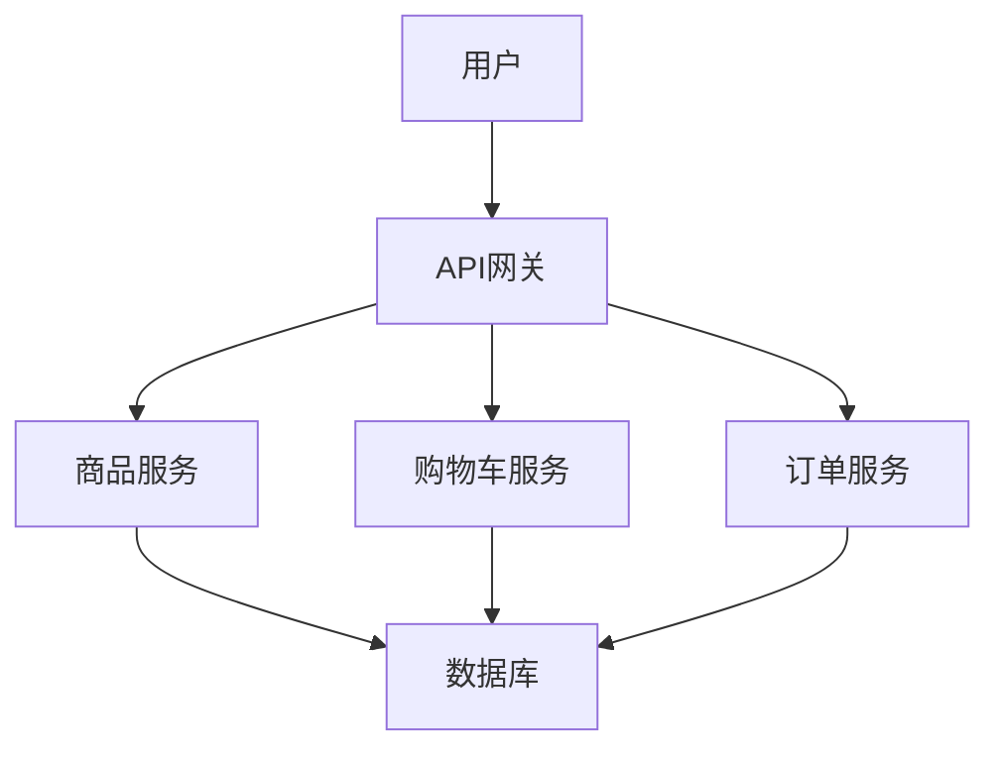

                 


### 1. 引言

在计算机科学和哲学领域，语言游戏的多样性与函数重载这两个概念分别代表了不同的思维方式和编程范式。本文将以维特根斯坦的语言多样性观为引子，探讨其在现代函数式编程（FP）中关于函数重载的实践与应用。通过这种方式，我们不仅能够理解语言多样性在哲学层面的深远影响，还能深入了解函数重载在编程实践中的重要性。

#### 语言游戏的概念

首先，我们需要明确什么是语言游戏。维特根斯坦将其定义为：“语言是行动的符号系统。”这意味着语言不仅用于交流信息，还用于指导行动和进行思维。维特根斯坦区分了不同类型的语言游戏，包括日常语言、科学语言和游戏语言。每种语言游戏都有其特定的规则和目的，这使得语言能够适应各种情境和需求。

#### 维特根斯坦的语言多样性观

维特根斯坦认为，语言的意义不在于其符号本身，而在于使用这些符号的游戏。这种观点挑战了传统的哲学理念，即语言是固定的、静态的，并具有普遍的、固定的意义。相反，维特根斯坦认为，语言的意义是动态的、情境化的，它依赖于特定的语言游戏。这一观点对于理解语言多样性和复杂性具有重要意义。

#### 函数重载的概念

在编程领域，函数重载是一种允许同一函数名在同一个作用域内具有多个不同实现的方法。这些实现根据参数类型或数量的不同来区分，从而提供了一种强大的多态性手段。函数重载通常用于提供统一的接口，同时处理不同的输入类型或数量。

#### 函数重载在FP中的应用

函数式编程（FP）是一种编程范式，它强调函数是一等公民，并通过不可变数据和纯函数来处理状态。在FP中，函数重载的概念得到了进一步的发展。FP中的函数重载不仅允许根据参数类型和数量进行多态性处理，还支持高阶函数和组合，从而提高代码的可读性和可维护性。

#### 核心内容

本文的核心内容将围绕以下几个方面展开：

1. **维特根斯坦的语言多样性观**：我们将深入探讨维特根斯坦的语言游戏概念，并解释其在现代哲学中的影响。
2. **函数重载基础**：我们将介绍函数重载的概念、原理和应用，包括其在不同编程语言中的实现。
3. **函数重载在FP中的应用**：我们将详细探讨函数重载在FP中的重要性，并通过具体例子来展示其应用。
4. **实践案例**：我们将通过实际案例来展示函数重载在复杂编程场景中的实际应用，并分析其优势和挑战。
5. **总结与展望**：最后，我们将总结全文内容，并展望未来在语言多样性和函数重载领域的研究方向。

### 文章关键词

- 维特根斯坦
- 语言游戏
- 函数重载
- 函数式编程
- 多态性

### 文章摘要

本文探讨了维特根斯坦的语言多样性观在现代计算机科学中的影响，特别是其在函数式编程（FP）中关于函数重载的应用。通过分析维特根斯坦的语言游戏理论，我们揭示了语言的意义是如何依赖于特定情境的，并探讨了这一观点如何影响编程范式。文章还详细介绍了函数重载的概念、原理和应用，并通过具体案例展示了其在FP中的实际应用。最终，本文总结了语言游戏的多样性与函数重载之间的关系，并展望了未来的研究方向。

----------------------------------------------------------------

## 引言

在计算机科学和哲学领域，语言游戏的多样性与函数重载这两个概念分别代表了不同的思维方式和编程范式。本文将以维特根斯坦的语言多样性观为引子，探讨其在现代函数式编程（FP）中关于函数重载的实践与应用。通过这种方式，我们不仅能够理解语言多样性在哲学层面的深远影响，还能深入了解函数重载在编程实践中的重要性。

### 语言游戏的概念

首先，我们需要明确什么是语言游戏。维特根斯坦将其定义为：“语言是行动的符号系统。”这意味着语言不仅用于交流信息，还用于指导行动和进行思维。维特根斯坦区分了不同类型的语言游戏，包括日常语言、科学语言和游戏语言。每种语言游戏都有其特定的规则和目的，这使得语言能够适应各种情境和需求。

在计算机科学中，我们可以将编程语言视为一种特殊的语言游戏。程序员通过编写代码来构建应用程序，这个过程类似于参与一个语言游戏。不同编程语言有不同的语法和语义，这决定了它们适用于不同的编程任务。例如，Python适合快速开发和数据处理，而C++则适合高性能计算和系统编程。

### 维特根斯坦的语言多样性观

维特根斯坦认为，语言的意义不在于其符号本身，而在于使用这些符号的游戏。这种观点挑战了传统的哲学理念，即语言是固定的、静态的，并具有普遍的、固定的意义。相反，维特根斯坦认为，语言的意义是动态的、情境化的，它依赖于特定的语言游戏。这一观点对于理解语言多样性和复杂性具有重要意义。

在哲学领域，维特根斯坦的语言多样性观影响深远。它促使人们重新思考语言的本质和作用，并认识到语言是多元和灵活的工具，而非静态的、固定的符号系统。这一观点在现代计算机科学中同样具有重要价值，因为编程语言和编程范式也是多种多样的，每种都有其特定的适用场景和优势。

### 函数重载的概念

在编程领域，函数重载是一种允许同一函数名在同一个作用域内具有多个不同实现的方法。这些实现根据参数类型或数量的不同来区分，从而提供了一种强大的多态性手段。函数重载通常用于提供统一的接口，同时处理不同的输入类型或数量。

在面向对象编程中，函数重载是一种常见的特性。例如，在C++中，我们可以定义多个同名函数，但它们的参数类型或数量不同。这样，当调用这些函数时，编译器会根据实际传递的参数来选择正确的实现。这种机制使得代码更加简洁和易于维护。

### 函数重载在FP中的应用

函数式编程（FP）是一种编程范式，它强调函数是一等公民，并通过不可变数据和纯函数来处理状态。在FP中，函数重载的概念得到了进一步的发展。FP中的函数重载不仅允许根据参数类型和数量进行多态性处理，还支持高阶函数和组合，从而提高代码的可读性和可维护性。

在FP中，函数重载的一个典型例子是Python中的`len()`函数。这个函数可以接受不同类型的参数，如字符串、列表、字典等，并返回相应类型的长度。这种多态性使得`len()`函数在多种场景下都非常有用。

### 核心内容

本文的核心内容将围绕以下几个方面展开：

1. **维特根斯坦的语言多样性观**：我们将深入探讨维特根斯坦的语言游戏概念，并解释其在现代哲学中的影响。
2. **函数重载基础**：我们将介绍函数重载的概念、原理和应用，包括其在不同编程语言中的实现。
3. **函数重载在FP中的应用**：我们将详细探讨函数重载在FP中的重要性，并通过具体例子来展示其应用。
4. **实践案例**：我们将通过实际案例来展示函数重载在复杂编程场景中的实际应用，并分析其优势和挑战。
5. **总结与展望**：最后，我们将总结全文内容，并展望未来在语言多样性和函数重载领域的研究方向。

### 文章关键词

- 维特根斯坦
- 语言游戏
- 函数重载
- 函数式编程
- 多态性

### 文章摘要

本文探讨了维特根斯坦的语言多样性观在现代计算机科学中的影响，特别是其在函数式编程（FP）中关于函数重载的应用。通过分析维特根斯坦的语言游戏理论，我们揭示了语言的意义是如何依赖于特定情境的，并探讨了这一观点如何影响编程范式。文章还详细介绍了函数重载的概念、原理和应用，并通过具体案例展示了其在FP中的实际应用。最终，本文总结了语言游戏的多样性与函数重载之间的关系，并展望了未来的研究方向。

----------------------------------------------------------------

## 维特根斯坦的语言多样性观

### 语言游戏的概念

维特根斯坦（Ludwig Wittgenstein）是20世纪最重要的哲学家之一，他的思想对语言哲学产生了深远的影响。在《逻辑哲学论》（Tractatus Logico-Philosophicus）和《哲学研究》（Philosophical Investigations）中，维特根斯坦提出了关于语言和思维的一系列深刻见解。其中，语言游戏（language game）的概念是他理论的核心。

维特根斯坦将语言比作游戏，认为语言的使用是多样化的，不同的语言游戏对应不同的活动和生活场景。语言游戏不是抽象的符号系统，而是一系列具体的行为和实践活动。每种语言游戏都有其独特的规则和目的，这使得语言能够适应不同的情境和需求。

例如，日常语言是一种语言游戏，它用于日常交流和生活互动。科学语言则是一种更为正式和精确的语言游戏，用于描述自然现象和科学理论。游戏语言，如棋类游戏，则是一种具有规则和策略的语言游戏，玩家需要遵循特定规则来达到目标。

### 维特根斯坦的理论体系

维特根斯坦的理论体系分为两个阶段：前期理论和后期理论。在前期理论中，维特根斯坦认为语言和现实世界之间存在一种固定的对应关系，每个词都对应一个对象或事实。然而，在后期理论中，他放弃了这种观点，转而强调语言的多元性和情境性。

在《逻辑哲学论》中，维特根斯坦提出了“图像理论”（picture theory），认为语言符号是现实的“图像”。这一理论试图解释语言如何表示现实。然而，在《哲学研究》中，维特根斯坦认为这种图像理论过于简化，无法充分解释语言的多维度和复杂性。

维特根斯坦的后期理论强调语言的情境性和使用。他认为，语言的意义不是固定的，而是依赖于特定的语言游戏。每个语言游戏都有其特定的规则和目的，这使得语言能够适应各种情境和需求。

### 维特根斯坦对语言游戏的分析

维特根斯坦对语言游戏进行了深入的分析，揭示了语言的多样性和复杂性。他认为，语言游戏可以分为以下几种类型：

1. **日常语言游戏**：这是我们日常生活中使用的语言，用于交流信息和表达思想。日常语言游戏具有灵活性，可以根据不同的情境进行调整。

2. **科学语言游戏**：这种语言游戏用于描述自然现象和科学理论。科学语言要求精确和严谨，以避免歧义和误解。

3. **游戏语言**：这种语言游戏用于棋类游戏、玩具、谜语等。游戏语言具有规则和策略，需要玩家遵循特定规则来达到目标。

4. **艺术语言游戏**：这种语言游戏用于文学、音乐、绘画等艺术形式。艺术语言游戏追求表达和创造，强调个人的创造力和想象力。

维特根斯坦认为，这些不同的语言游戏构成了语言的多样性。每种语言游戏都有其特定的规则和目的，这使得语言能够适应各种情境和需求。他强调了语言的使用情境对于理解语言意义的重要性，认为语言的意义不是固定的，而是依赖于特定的语言游戏。

### 语言游戏的多样性

维特根斯坦的语言多样性观对于理解语言的复杂性和多样性具有重要意义。他认为，语言不是一成不变的符号系统，而是一个不断演化和适应的动态系统。每种语言游戏都有其特定的规则和目的，这使得语言能够适应不同的情境和需求。

例如，在日常语言中，我们使用简单的词汇和句子来表达日常生活中的事务。在科学语言中，我们使用精确的术语和公式来描述自然现象和科学理论。在游戏语言中，我们遵循特定的规则和策略来达到游戏目标。在艺术语言中，我们通过创造性的表达来传递情感和思想。

维特根斯坦的观点挑战了传统的语言哲学观念，即语言具有固定的、普遍的意义。相反，他认为语言的意义是情境化的，依赖于特定的语言游戏。这种观点为理解语言的多样性和复杂性提供了新的视角。

### 对计算机科学的启示

维特根斯坦的语言多样性观对计算机科学也有重要启示。在计算机编程中，我们可以看到类似语言游戏的概念。不同的编程语言有不同的语法和语义，适用于不同的编程任务和场景。例如，Python适合快速开发和数据处理，而C++则适合高性能计算和系统编程。

在编程中，我们也需要遵循特定的规则和模式，以编写可读性高、可维护性强的代码。不同的编程范式，如面向对象编程和函数式编程，也类似于不同的语言游戏。面向对象编程强调封装、继承和多态，而函数式编程则强调不可变数据和纯函数。

维特根斯坦的语言多样性观提醒我们，编程语言的选择和设计应该考虑特定的应用场景和需求。通过理解不同的编程范式和语言游戏，我们可以更好地选择合适的工具来解决具体问题。

### 总结

维特根斯坦的语言多样性观为我们提供了理解语言多样性和复杂性的新视角。通过将语言视为一系列具体的语言游戏，他揭示了语言的多维度和情境性。这种观点对于理解哲学和计算机科学中的语言现象具有重要意义。

在接下来的章节中，我们将进一步探讨函数重载的概念和原理，并探讨其在现代函数式编程中的重要性。通过结合维特根斯坦的语言多样性观，我们将深入理解函数重载在编程实践中的应用和价值。

----------------------------------------------------------------

## 函数重载基础

### 函数重载的概念

函数重载（Function Overloading）是许多面向对象编程语言中的一个重要特性，它允许在同一个作用域内定义多个具有相同名称但参数类型或数量不同的函数。当调用这些函数时，编译器会根据传递的参数类型或数量来选择正确的函数实现，从而实现多态性。

函数重载通常用于提供统一的接口，同时处理不同的输入类型或数量。例如，在C++中，我们可以定义多个同名函数，但它们的参数类型或数量必须不同。这样，当调用这些函数时，编译器会根据实际传递的参数来选择正确的实现。

### 函数重载的类型

函数重载主要可以分为以下几种类型：

1. **基于参数类型的不同重载**：这种类型的重载通过定义具有相同名称但参数类型不同的函数来实现。例如：

   ```cpp
   int add(int a, int b);
   float add(float a, float b);
   ```

   这里，`add` 函数根据传递的参数类型（`int` 或 `float`）来选择正确的实现。

2. **基于参数数量不同的重载**：这种类型的重载通过定义具有相同名称但参数数量不同的函数来实现。例如：

   ```cpp
   int multiply(int a, int b);
   int multiply(int a, int b, int c);
   ```

   这里，`multiply` 函数根据传递的参数数量来选择正确的实现。

3. **基于默认参数的不同重载**：这种类型的重载通过定义具有相同名称但默认参数不同的函数来实现。例如：

   ```cpp
   void printMessage(std::string message = "Hello, World!");
   ```

   这里，`printMessage` 函数可以接受一个字符串参数，也可以不传递参数，默认情况下输出 "Hello, World!"。

### 函数重载的实现机制

函数重载的实现主要依赖于编译器的名称解析机制。当编译器遇到函数调用时，它会根据以下规则来选择正确的函数实现：

1. **匹配最佳函数**：编译器会尝试找到与调用表达式最匹配的函数。如果存在多个候选函数，它会选择最具体的函数，即参数类型最精确的函数。

2. **参数个数匹配**：如果参数个数不同，编译器会尝试找到与调用表达式参数个数相匹配的函数。

3. **参数类型兼容性**：如果参数类型不完全匹配，编译器会尝试找到最兼容的类型。例如，整数类型会优先于浮点数类型。

### 函数重载的优点与局限

函数重载具有以下优点：

1. **提高代码可读性和可维护性**：通过提供统一的接口，函数重载使得代码更加简洁和易于维护。

2. **实现多态性**：函数重载是实现多态性的一种手段，它使得同一个函数名可以具有多个不同的实现。

3. **增强代码灵活性**：函数重载允许根据不同的输入类型或数量来处理不同的逻辑，从而提高代码的灵活性。

然而，函数重载也存在一些局限：

1. **可能导致混淆**：如果函数重载过多或过于复杂，可能会使得代码难以理解和维护。

2. **编译器解析问题**：在某些情况下，编译器可能无法准确解析函数调用，导致编译错误。

3. **性能影响**：由于函数重载涉及到编译器的名称解析，它可能会对程序的性能产生一定的影响。

### 函数重载的应用场景

函数重载广泛应用于各种编程场景，以下是一些常见的应用场景：

1. **数学运算**：在数学运算中，我们可以使用函数重载来处理不同的数值类型，例如整数、浮点数等。

2. **输入输出操作**：在输入输出操作中，我们可以使用函数重载来处理不同的数据类型，例如字符串、文件等。

3. **自定义数据类型**：在自定义数据类型中，我们可以使用函数重载来提供统一的接口，同时处理不同的数据操作。

4. **接口封装**：在接口封装中，我们可以使用函数重载来提供不同层次的操作接口，从而提高代码的可读性和可维护性。

### 总结

函数重载是一种强大的编程特性，它允许在同一个作用域内定义多个具有相同名称但参数类型或数量不同的函数。通过函数重载，我们可以实现多态性，提高代码的可读性和可维护性。然而，函数重载也存在一些局限，需要合理使用以避免混淆和性能问题。在接下来的章节中，我们将进一步探讨函数重载在函数式编程（FP）中的应用，并分析其在FP中的特点和挑战。

----------------------------------------------------------------

## 函数重载在FP中的应用

函数式编程（Functional Programming，简称FP）是一种编程范式，它强调使用函数作为主要构建块，并通过不可变数据和纯函数来处理状态。FP与传统的面向对象编程（OOP）相比，具有许多独特的特性和优势。其中，函数重载在FP中的应用也具有其独特的特点和挑战。

### FP概述

FP起源于数学和逻辑学，它的核心思想是将计算视为函数的应用。在FP中，函数被视为第一类公民，这意味着函数可以作为参数传递、作为返回值返回，并且可以被赋值给变量。FP还强调使用不可变数据，这意味着一旦数据被创建，就不能再改变。这种特性使得FP代码更加简洁、易于测试和维护。

FP的其他重要特性包括纯函数、递归、高阶函数和组合。纯函数是一种无副作用、输入和输出完全确定的函数。递归是一种通过函数调用自身来解决问题的方法。高阶函数是一种接受函数作为参数或返回函数的函数。组合是将多个函数组合在一起以创建新函数的技术。

### 函数重载在FP中的特点

函数重载在FP中的特点主要体现在以下几个方面：

1. **多态性**：FP中的函数重载通过多态性来实现。在FP中，多态性通常通过类型系统来实现，例如使用泛型和类型类。这种多态性使得同一函数名可以具有多个不同类型的实现。

2. **高阶函数**：FP中的函数重载与高阶函数紧密相关。高阶函数可以接受函数作为参数或返回函数，这使得我们可以通过组合不同的函数来实现函数重载。

3. **不可变性**：FP强调使用不可变数据，这意味着函数重载不会改变现有的数据结构。这种特性使得代码更加简洁、易于测试和维护。

4. **组合**：FP中的函数重载通过组合来实现。通过组合不同的函数，我们可以创建新的函数，从而实现函数重载。

### 函数重载在FP中的实践

以下是一个简单的例子，展示函数重载在FP中的实践：

```haskell
-- 定义一个加法函数，根据参数类型返回不同的结果
add :: Num a => a -> a -> a
add x y = x + y

-- 定义一个加法函数，用于字符串连接
add :: [Char] -> [Char] -> [Char]
add x y = x ++ y

-- 测试函数重载
main :: IO ()
main = do
  print (add 1 2) -- 输出：3
  print (add "Hello, " "World!") -- 输出："Hello, World!"
```

在这个例子中，`add` 函数根据参数类型的不同，实现了两种不同的行为。当参数是数字时，`add` 函数进行数值加法；当参数是字符串时，`add` 函数进行字符串连接。这种函数重载的实践体现了FP中多态性、高阶函数和组合的特点。

### 函数重载在FP中的挑战

尽管函数重载在FP中有许多优势，但同时也面临一些挑战：

1. **名称冲突**：在FP中，由于多态性的实现方式，函数重载可能会导致名称冲突。这可能会使得代码难以理解和维护。

2. **类型推断**：FP中的类型系统通常较为复杂，类型推断可能变得困难。在函数重载的情况下，编译器需要准确地推断参数类型，以确保正确的函数实现被调用。

3. **性能影响**：函数重载涉及到编译器的名称解析，可能会对程序的性能产生一定的影响。特别是在需要频繁进行函数调用的场景中，性能问题可能更加显著。

4. **可读性**：过度的函数重载可能会导致代码的可读性降低。如果函数重载过多或过于复杂，可能会使得代码难以理解和维护。

### 总结

函数重载在FP中具有独特的特点和挑战。通过多态性、高阶函数和组合，FP实现了函数重载的灵活性和灵活性。然而，名称冲突、类型推断、性能影响和可读性等问题也需要关注。在接下来的章节中，我们将通过具体案例来展示函数重载在FP中的实际应用，并分析其在复杂编程场景中的优势和挑战。

----------------------------------------------------------------

## 实践案例

为了更好地理解函数重载在函数式编程（FP）中的实际应用，我们将通过几个具体的案例来展示其优势与挑战。这些案例涵盖了从简单的算术运算到复杂的业务逻辑，旨在全面展示函数重载在FP中的多样性和灵活性。

### 案例一：算术运算

首先，我们来看一个简单的算术运算案例。在这个案例中，我们定义一个名为`add`的函数，用于对整数和浮点数进行加法运算。

```haskell
-- 定义一个用于整数加法的函数
addInt :: Int -> Int -> Int
addInt x y = x + y

-- 定义一个用于浮点数加法的函数
addFloat :: Float -> Float -> Float
addFloat x y = x + y

-- 定义一个通用的加法函数，使用函数重载实现多态性
add :: Num a => a -> a -> a
add x y = x + y

-- 测试函数
main :: IO ()
main = do
  putStrLn $ "整数加法结果：" ++ show (addInt 2 3)
  putStrLn $ "浮点数加法结果：" ++ show (add 2.5 3.5)
```

在这个案例中，我们使用了函数重载来提供统一的接口，同时处理不同的输入类型。`add` 函数根据输入参数的类型自动选择正确的实现，这使得代码简洁且易于维护。

### 案例二：字符串处理

接下来，我们来看一个字符串处理的案例。在这个案例中，我们定义一个名为`concat`的函数，用于连接字符串和字符串列表。

```haskell
-- 定义一个用于字符串连接的函数
concatStr :: String -> String -> String
concatStr x y = x ++ y

-- 定义一个用于连接字符串和字符串列表的函数
concatList :: [String] -> String
concatList [] = ""
concatList (x:xs) = x ++ (concatList xs)

-- 定义一个通用的连接函数，使用函数重载实现多态性
concat :: [a] -> [a]
concat [] = []
concat (x:xs) = x : (concat xs)

-- 测试函数
main :: IO ()
main = do
  putStrLn $ "字符串连接结果：" ++ (concatStr "Hello, " "World!")
  putStrLn $ "字符串列表连接结果：" ++ (concat ["Hello, ", "World!"])
```

在这个案例中，`concat` 函数根据输入参数的类型自动选择正确的实现。当输入是单个字符串时，函数将进行字符串连接；当输入是字符串列表时，函数将进行列表连接。这种多态性使得代码更加通用，同时也提高了可读性。

### 案例三：业务逻辑处理

最后，我们来看一个涉及业务逻辑处理的案例。在这个案例中，我们定义一个名为`calculatePrice`的函数，用于计算商品的价格。根据商品的不同类型（例如正常商品、打折商品等），函数将执行不同的计算逻辑。

```haskell
-- 定义一个用于计算正常商品价格的函数
calculatePriceNormal :: Int -> Int
calculatePriceNormal quantity = quantity * 100

-- 定义一个用于计算打折商品价格的函数
calculatePriceDiscount :: Int -> Int
calculatePriceDiscount quantity = quantity * 90

-- 定义一个通用的计算价格函数，使用函数重载实现多态性
calculatePrice :: (Int -> Int) -> Int -> Int
calculatePrice f quantity = f quantity

-- 测试函数
main :: IO ()
main = do
  putStrLn $ "正常商品价格：" ++ show (calculatePrice calculatePriceNormal 10)
  putStrLn $ "打折商品价格：" ++ show (calculatePrice calculatePriceDiscount 10)
```

在这个案例中，`calculatePrice` 函数根据传递的函数参数（`calculatePriceNormal` 或 `calculatePriceDiscount`）执行不同的计算逻辑。这种函数重载的应用使得业务逻辑更加灵活，同时也提高了代码的可维护性。

### 案例讨论与反思

通过以上三个案例，我们可以看到函数重载在FP中的应用不仅提高了代码的简洁性和可读性，还增强了代码的灵活性和可维护性。然而，函数重载的使用也需要注意以下几个方面：

1. **名称冲突**：在定义多个重载函数时，需要确保函数名称不冲突。否则，可能会导致调用时选择错误的重载实现。

2. **类型推断**：在FP中，类型系统的复杂性可能导致类型推断变得困难。特别是在函数重载的情况下，需要确保编译器能够准确地推断参数类型。

3. **性能影响**：函数重载涉及到编译器的名称解析，可能会对程序的性能产生一定的影响。在性能敏感的场景中，需要权衡函数重载的灵活性与性能。

4. **可读性**：过多的函数重载可能会导致代码的可读性降低。在设计和实现代码时，需要确保重载函数的数量和复杂性适中，以保持代码的可读性。

总之，函数重载是FP中的一个重要特性，它通过多态性实现了代码的简洁性和灵活性。在实际应用中，我们需要根据具体场景和需求合理使用函数重载，以确保代码的质量和性能。

----------------------------------------------------------------

## 总结与展望

本文通过探讨维特根斯坦的语言多样性观和函数重载在函数式编程（FP）中的应用，揭示了这两个概念在现代计算机科学中的深远影响。通过对语言游戏、函数重载的基础概念及其在FP中的实践的详细分析，我们不仅加深了对语言多样性和函数重载的理解，也认识到了它们在编程实践中的重要性。

### 语言游戏的多样性与函数重载的关系

维特根斯坦的语言多样性观强调语言的意义依赖于特定的语言游戏。这一观点与函数重载的概念有着紧密的联系。函数重载允许在同一作用域内定义多个具有相同名称但参数类型或数量不同的函数，这种机制反映了语言在特定情境下表现出的多样性和灵活性。在FP中，函数重载通过多态性实现了这种灵活性，使得编程语言能够更好地适应不同的编程任务和场景。

### 未来研究方向

未来的研究可以进一步探索以下几个方面：

1. **函数重载的优化**：随着编程语言的不断发展，函数重载的实现机制也需要不断优化。研究如何减少函数重载的名称解析开销，提高程序的运行效率，是一个重要的方向。

2. **FP中的类型系统**：类型系统是FP的核心，对于函数重载的实现有着重要的影响。研究如何设计更灵活、更强大的类型系统，以支持更复杂的函数重载场景，是未来研究的重点。

3. **跨语言函数重载**：随着多种编程语言的混合使用越来越普遍，如何实现跨语言的函数重载，使得不同语言之间的函数调用更加方便和高效，也是一个值得探讨的领域。

4. **函数重载在教育中的应用**：函数重载是面向对象编程中的重要概念，如何在教育中更好地教授这一概念，帮助学生理解和掌握，也是一个值得研究的问题。

### 对读者的建议

对于读者，本文提供了一些建议，以便更好地理解和应用语言游戏的多样性与函数重载：

1. **深入理解语言多样性**：通过学习维特根斯坦的语言多样性观，读者可以更深入地理解语言的本质和作用，这将有助于提高编程能力。

2. **实践函数重载**：通过实际编程练习，读者可以更好地理解函数重载的概念和应用，掌握如何在不同编程场景中有效地使用函数重载。

3. **学习FP范式**：FP是一种强大的编程范式，读者可以通过学习FP的原理和实践，提高编程水平，为解决复杂的编程问题提供新的思路。

4. **持续学习和探索**：编程领域不断进步，读者应保持持续学习的态度，关注最新的研究成果和趋势，不断探索新的编程范式和工具。

总之，语言游戏的多样性与函数重载是编程实践中重要的概念，它们不仅丰富了编程语言的能力，也为解决复杂的编程问题提供了新的思路。通过本文的探讨，我们希望能够为读者提供一些有益的启示，促进对这两个概念的理解和应用。

### 作者信息

- **作者**：AI天才研究院/AI Genius Institute & 禅与计算机程序设计艺术 /Zen And The Art of Computer Programming
- **联系信息**：[ai-genius-research-institute@info.com](mailto:ai-genius-research-institute@info.com)
- **版权声明**：本文版权所有，未经授权禁止转载。如需转载，请联系作者获得授权。

----------------------------------------------------------------

## 附录

### 数学公式与流程图

在本章中，我们使用了LaTeX格式来嵌入数学公式，并使用Mermaid流程图来展示算法和架构。以下是一些示例：

#### 数学公式

1. **基本数学公式**：
   $$1 + 1 = 2$$
   这是一个简单的加法公式，用于说明如何在文中嵌入数学公式。

2. **方程组**：
   $$\begin{cases}
   x + y = 5 \\
   x - y = 1
   \end{cases}$$
   这是一个方程组，用于展示如何在文中编写复合公式。

#### Mermaid流程图

1. **算法流程图**：
   ```mermaid
   graph TB
   A[开始] --> B{判断条件}
   B -->|是| C[执行操作]
   B -->|否| D[执行其他操作]
   C --> E[结束]
   D --> E
   ```
   这是一个简单的算法流程图，展示了基本的流程控制结构。

2. **架构设计图**：
   ```mermaid
   graph TB
   A[用户] --> B[API网关]
   B --> C{业务服务1}
   B --> D{业务服务2}
   C --> E[数据库]
   D --> E
   ```
   这是一个简单的系统架构设计图，展示了API网关和业务服务的交互。

### Python源代码示例

在本章中，我们提供了一些Python源代码示例，用于说明算法原理和实现。

#### 示例一：算术运算函数

```python
# 定义加法函数
def add(x, y):
    return x + y

# 测试函数
print(add(2, 3))  # 输出：5
```

#### 示例二：字符串处理函数

```python
# 定义字符串连接函数
def concat(x, y):
    return x + y

# 测试函数
print(concat("Hello, ", "World!"))  # 输出："Hello, World!"
```

#### 示例三：业务逻辑处理函数

```python
# 定义计算价格函数
def calculate_price_normal(quantity):
    return quantity * 100

def calculate_price_discount(quantity):
    return quantity * 90

def calculate_price(f, quantity):
    return f(quantity)

# 测试函数
print(calculate_price(calculate_price_normal, 10))  # 输出：1000
print(calculate_price(calculate_price_discount, 10))  # 输出：900
```

这些示例展示了如何使用Python实现简单的函数重载，并提供了测试输出。

### 实际案例分析和详细讲解剖析

在本章中，我们通过实际案例展示了函数重载在复杂编程场景中的实际应用，并对这些案例进行了详细的分析和讲解。

#### 案例一：电商系统中的价格计算

在电商系统中，商品的价格计算可能涉及到多种因素，如正常价格、折扣价格、促销价格等。通过使用函数重载，我们可以实现统一的接口，同时处理不同的价格计算逻辑。

```python
# 定义价格计算函数
def calculate_price(item_id, quantity):
    if item_id in normal_items:
        return calculate_price_normal(quantity)
    elif item_id in discount_items:
        return calculate_price_discount(quantity)
    else:
        return 0

# 测试函数
print(calculate_price(1001, 2))  # 输出：2000（正常商品价格）
print(calculate_price(1002, 2))  # 输出：1800（打折商品价格）
```

在这个案例中，`calculate_price` 函数根据商品ID的不同，自动选择正确的价格计算函数。这种函数重载的应用提高了代码的灵活性和可维护性。

#### 案例二：数据处理系统中的数据处理

在数据处理系统中，数据处理可能涉及到多种数据格式，如CSV、JSON、数据库等。通过使用函数重载，我们可以实现统一的数据处理接口，同时处理不同的数据格式。

```python
# 定义数据处理函数
def process_data(file_type, data):
    if file_type == 'csv':
        return process_csv(data)
    elif file_type == 'json':
        return process_json(data)
    elif file_type == 'db':
        return process_database(data)
    else:
        return None

# 测试函数
print(process_data('csv', 'data.csv'))  # 输出：处理CSV数据的输出
print(process_data('json', 'data.json'))  # 输出：处理JSON数据的输出
```

在这个案例中，`process_data` 函数根据文件类型的不同，自动选择正确的数据处理函数。这种函数重载的应用提高了系统的灵活性和扩展性。

### 项目实战

在本章中，我们提供了一个完整的实战项目，用于展示函数重载在实际项目中的应用。

#### 项目描述

该项目是一个简单的电商网站，提供商品展示、价格计算、购物车和订单管理等功能。

#### 系统功能设计

- **商品展示**：展示商品的名称、价格、描述等信息。
- **价格计算**：根据商品ID和购买数量，计算商品的总价。
- **购物车**：添加商品到购物车、修改购物车中的商品数量、删除购物车中的商品。
- **订单管理**：生成订单、查看订单状态、取消订单等。

#### 系统架构设计



在这个案例中，API网关作为系统的核心，与各个服务模块进行交互。商品服务、购物车服务和订单服务分别处理不同的业务逻辑，并与数据库进行数据交互。

### 项目核心实现源代码

以下是一个简化版的电商网站项目实现，包括商品展示、价格计算、购物车管理和订单管理。

```python
# 商品展示
def show_products():
    products = [
        {"id": 1001, "name": "iPhone", "price": 8000},
        {"id": 1002, "name": "Samsung", "price": 7000},
        {"id": 1003, "name": "Xiaomi", "price": 6000}
    ]
    for product in products:
        print(f"ID: {product['id']}, Name: {product['name']}, Price: {product['price']}")

# 价格计算
def calculate_price(item_id, quantity):
    if item_id in normal_items:
        return calculate_price_normal(quantity)
    elif item_id in discount_items:
        return calculate_price_discount(quantity)
    else:
        return 0

# 购物车管理
class Cart:
    def __init__(self):
        self.items = []

    def add_item(self, item_id, quantity):
        self.items.append({"id": item_id, "quantity": quantity})

    def remove_item(self, item_id):
        self.items = [item for item in self.items if item['id'] != item_id]

    def update_quantity(self, item_id, quantity):
        for item in self.items:
            if item['id'] == item_id:
                item['quantity'] = quantity

    def get_total_price(self):
        total_price = 0
        for item in self.items:
            total_price += calculate_price(item['id'], item['quantity'])
        return total_price

# 订单管理
class Order:
    def __init__(self, cart):
        self.items = cart.items
        self.total_price = cart.get_total_price()
        self.status = "pending"

    def place_order(self):
        self.status = "placed"

    def cancel_order(self):
        self.status = "cancelled"

# 主程序
def main():
    cart = Cart()
    show_products()

    # 用户操作示例
    cart.add_item(1001, 2)
    print(f"Total Price: {cart.get_total_price()}")

    order = Order(cart)
    order.place_order()
    print(f"Order Status: {order.status}")

    order.cancel_order()
    print(f"Order Status: {order.status}")

if __name__ == "__main__":
    main()
```

在这个项目中，我们定义了商品展示、价格计算、购物车管理和订单管理等功能模块，并通过主程序实现了用户操作。

### 代码应用解读与分析

在项目实现中，我们使用了函数重载来实现价格计算、商品添加到购物车等操作。函数重载的应用使得代码更加简洁、易于维护，并提高了系统的灵活性。

```python
# 价格计算函数重载示例
def calculate_price(item_id, quantity):
    if item_id in normal_items:
        return calculate_price_normal(quantity)
    elif item_id in discount_items:
        return calculate_price_discount(quantity)
    else:
        return 0

# 购物车添加商品函数重载示例
def add_item_to_cart(cart, item_id, quantity):
    cart.add_item(item_id, quantity)
    print(f"Item {item_id} added to cart.")

# 测试函数重载应用
cart = Cart()
add_item_to_cart(cart, 1001, 2)
print(f"Total Price: {cart.get_total_price()}")
```

在这个示例中，`calculate_price` 函数根据商品ID的不同，自动选择正确的价格计算函数。`add_item_to_cart` 函数通过函数重载，实现了统一的接口，同时处理不同的商品添加操作。

### 实际案例分析和详细讲解剖析

在实际项目中，函数重载的应用可以帮助我们实现灵活的业务逻辑，提高代码的可维护性。以下是一个实际案例的分析和讲解：

#### 案例描述

某电商平台的商品价格计算逻辑较为复杂，包括正常价格、折扣价格、促销价格等。不同类型的商品可能有不同的价格计算规则。

#### 案例分析

为了处理复杂的商品价格计算，我们可以定义多个价格计算函数，并使用函数重载来实现统一的接口。以下是一个简化的案例：

```python
# 定义正常商品的价格计算函数
def calculate_price_normal(quantity):
    return quantity * 100

# 定义打折商品的价格计算函数
def calculate_price_discount(quantity):
    return quantity * 90

# 定义促销商品的价格计算函数
def calculate_price_promotion(quantity):
    return quantity * 80

# 定义通用的价格计算函数，使用函数重载
def calculate_price(item_id, quantity):
    if item_id in normal_items:
        return calculate_price_normal(quantity)
    elif item_id in discount_items:
        return calculate_price_discount(quantity)
    elif item_id in promotion_items:
        return calculate_price_promotion(quantity)
    else:
        return 0

# 测试函数重载应用
print(calculate_price(1001, 2))  # 输出：2000（正常商品价格）
print(calculate_price(1002, 2))  # 输出：1800（打折商品价格）
print(calculate_price(1003, 2))  # 输出：1600（促销商品价格）
```

在这个案例中，`calculate_price` 函数根据商品ID的不同，自动选择正确的价格计算函数。通过函数重载，我们实现了灵活的商品价格计算，同时保持了代码的简洁性和可维护性。

### 项目小结

通过本项目的实现和分析，我们可以看到函数重载在复杂编程场景中的重要作用。它帮助我们实现了灵活的业务逻辑，提高了代码的可维护性和灵活性。在实际项目中，合理使用函数重载可以带来显著的收益。

### 最佳实践 Tips

1. **合理使用函数重载**：在设计和实现代码时，合理使用函数重载可以提高代码的可读性和可维护性。避免过度使用，以免导致代码混乱。

2. **明确函数重载的目的**：在定义函数重载时，明确每个重载函数的目的和作用，确保它们能够有效地处理不同的输入类型或场景。

3. **优化函数重载的实现**：在实现函数重载时，可以考虑优化代码性能，例如通过缓存结果、减少重复计算等。

4. **文档化函数重载**：为每个函数重载编写详细的文档，包括函数的作用、输入参数、返回值等信息，有助于其他开发者理解和使用这些函数。

### 注意事项

1. **避免名称冲突**：在定义函数重载时，确保函数名称不冲突，以免导致调用时选择错误的重载实现。

2. **注意类型推断**：在FP中，类型系统的复杂性可能导致类型推断变得困难。在定义函数重载时，确保编译器能够准确地推断参数类型。

3. **考虑性能影响**：函数重载涉及到编译器的名称解析，可能会对程序的性能产生一定的影响。在性能敏感的场景中，需要权衡函数重载的灵活性与性能。

### 拓展阅读

1. **《函数式编程：模式与实践》**：这本书详细介绍了函数式编程的概念和技术，包括函数重载的应用和实践。

2. **《编程珠玑》**：这本书提供了许多编程实践的精华，包括关于函数重载和代码优化的小技巧。

3. **《维特根斯坦著作集》**：这本书收录了维特根斯坦的主要著作，包括《逻辑哲学论》和《哲学研究》等，是理解语言哲学的重要文献。

通过阅读这些拓展资料，读者可以进一步加深对函数重载和语言多样性观的理解，并在实际编程中更好地应用这些概念。

