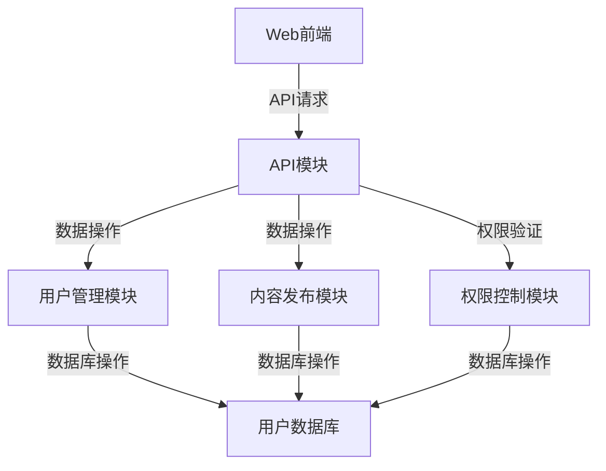
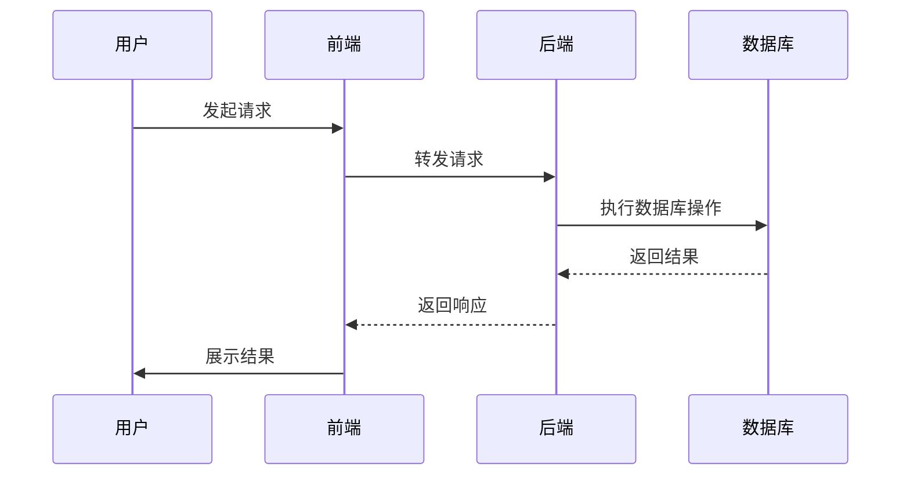

                 

# 语言游戏的开放性与函数式扩展：维特根斯坦的语言观与FP的可扩展性设计

> 关键词：维特根斯坦、语言游戏、函数式编程、可扩展性、FP设计

> 摘要：本文旨在探讨语言游戏的开放性以及函数式编程（FP）的可扩展性设计，通过分析维特根斯坦的语言观，为FP设计的可扩展性提供哲学基础。文章将逐步展开，从语言游戏的背景和概念出发，深入维特根斯坦的语言理论，进而探讨FP的核心原则及其与开放性的联系，最后通过实例分析，阐述FP在实际应用中的可扩展性设计。

## 引言

语言游戏（Language Game）是维特根斯坦哲学中核心概念之一，它揭示了语言与生活实践之间的密切关系。维特根斯坦认为，语言不是抽象的符号系统，而是与人类生活紧密相连的实践活动。语言游戏的开放性意味着语言能够不断适应新的环境和情境，这为函数式编程（Functional Programming，简称FP）的可扩展性设计提供了启示。FP以其高阶函数、不可变数据等特性，为软件工程提供了强大的工具，但如何在实践中实现其可扩展性，仍是当前研究的一个重要课题。

本文将从以下几个方面展开讨论：
1. 语言游戏的背景和概念。
2. 维特根斯坦的语言理论。
3. 函数式编程的核心原则与开放性。
4. FP在实践中的可扩展性设计。
5. 实例分析：FP与开放性设计的应用场景。

## 语言游戏的背景与概念

### 语言游戏的起源

维特根斯坦的语言游戏理论起源于他对语言的本质思考。在《逻辑哲学论》中，维特根斯坦试图将语言视为一种逻辑系统，但在经历了一系列哲学反思后，他意识到这种观点的局限性。在《哲学研究》中，他提出了语言游戏的概念，认为语言是嵌入在特定文化和社会背景中的实践活动。

### 语言游戏的概念

维特根斯坦将语言活动比作游戏，称其为“语言游戏”。语言游戏包括以下要素：
- **规则**：语言游戏的规则定义了语言的使用方式，例如语法规则、逻辑规则等。
- **参与者和角色**：语言游戏的参与者是使用语言的人，他们根据规则进行互动。
- **情境**：语言游戏发生在特定的情境中，情境决定了语言的具体应用。

### 语言游戏的类型

维特根斯坦将语言游戏分为以下几类：
- **日常语言游戏**：这是最常见的语言游戏类型，包括日常对话、交流等。
- **理论语言游戏**：涉及科学、哲学等领域的语言使用，如数学语言、逻辑语言等。
- **艺术语言游戏**：包括文学、绘画、音乐等艺术形式，这些形式通过独特的语言规则表达创造性的思想。

### 语言游戏的开放性

语言游戏的开放性是指语言能够适应新的情境和需求，从而不断发展。这种开放性体现在以下几个方面：
- **情境适应性**：语言能够在不同情境中发挥作用，例如，从日常对话到专业讨论，语言都能灵活调整。
- **规则可变性**：语言规则不是固定不变的，而是可以根据情境需求进行调整和扩展。
- **互动性**：语言游戏中的参与者能够通过互动不断探索和创造新的语言规则。

## 维特根斯坦的语言理论

### 语言作为生活形式

维特根斯坦认为，语言是人类生活的一种形式。语言不仅用于交流信息，还用于表达情感、建立关系、理解世界等。他强调，语言与我们的生活紧密相连，语言的活动是我们生活的一部分。

### 规则与语言游戏

在维特根斯坦看来，规则是语言游戏的核心。规则不仅定义了语言的使用方式，还指导了我们的思维和行为。维特根斯坦通过“私人语言问题”探讨了规则的重要性。他认为，如果一个人试图创造一种只有自己能理解的语言，那么这种语言是没有实际意义的，因为它无法与他人交流。

### 意义与使用

维特根斯坦提出了“意义即使用”的观点。他认为，一个词的意义不在于它的定义，而在于它在实际生活中的使用方式。语言的意义是通过我们在特定情境中的具体使用来确定的。这一观点为理解语言的多样性和复杂性提供了新的视角。

### 私人语言问题

维特根斯坦的私人语言问题探讨了一个哲学难题：是否存在只有个体能理解的语言。他认为，如果一个人试图创造一种只有自己能理解的语言，这种语言实际上是无效的，因为它无法实现交流和理解。这一观点揭示了语言的社会性本质，强调了语言作为共同活动的重要性。

## 函数式编程的核心原则与开放性

### 函数式编程的基本原则

函数式编程是一种编程范式，其核心原则包括：
- **不可变数据**：在函数式编程中，数据一旦创建，就不能再修改。这有助于避免状态冲突和不可预测的行为。
- **高阶函数**：高阶函数可以接受其他函数作为参数，或者返回函数作为结果。这提供了灵活的函数组合和抽象能力。
- **纯函数**：纯函数是没有副作用且返回值只依赖于输入参数的函数。这使得函数易于测试、组合和并行化。

### 开放性与可扩展性

开放性是指系统能够适应新的需求和环境变化。在函数式编程中，开放性主要体现在以下几个方面：
- **模块化**：函数式编程鼓励将程序分解为独立的模块，每个模块负责一个特定的功能。这使得程序易于扩展和维护。
- **组合性**：通过高阶函数和纯函数，程序员可以轻松地将现有的函数组合成更复杂的函数，从而实现灵活的功能扩展。
- **抽象性**：函数式编程提供了强大的抽象能力，使得程序员可以专注于解决具体问题，而不必担心实现细节。

## FP在实际应用中的可扩展性设计

### 模块化与抽象

通过模块化和抽象，函数式编程能够实现代码的复用和扩展。例如，在一个数据处理系统中，可以通过定义一系列处理函数模块，每个模块负责一种特定的数据处理任务。这些模块可以独立开发、测试和部署，从而提高了系统的可扩展性。

### 高阶函数与组合

高阶函数和组合性使得函数式编程具有强大的扩展能力。例如，在一个图像处理应用中，可以通过组合一系列高阶函数来实现复杂的图像操作，如滤波、变换等。这种组合方式不仅提高了代码的可读性，还使得功能扩展变得简单和直观。

### 并行计算

函数式编程中的纯函数和不可变数据使得并行计算变得容易。通过将任务分解为独立的纯函数，程序员可以在多核处理器上并行执行这些函数，从而提高程序的执行效率。

## 实例分析

### 实例 1：数据处理系统

在一个数据处理系统中，可以使用函数式编程实现数据的处理和转换。通过模块化和高阶函数，可以轻松扩展系统以适应新的数据类型和处理需求。例如，可以通过定义一系列处理函数，每个函数处理一种特定的数据格式，从而实现多种数据格式的支持。

### 实例 2：图像处理应用

在一个图像处理应用中，可以使用函数式编程实现复杂的图像操作。通过高阶函数和组合，可以方便地实现图像的滤波、变换等操作。例如，可以使用一个高阶函数`filter`来实现图像的滤波，并通过组合多个滤波函数实现更复杂的滤波效果。

## 结论

本文探讨了语言游戏的开放性以及函数式编程（FP）的可扩展性设计，通过分析维特根斯坦的语言观，为FP设计的可扩展性提供了哲学基础。FP以其高阶函数、不可变数据等特性，为软件工程提供了强大的工具，但如何在实践中实现其可扩展性，仍是一个重要课题。通过实例分析，我们可以看到，FP在模块化、抽象和并行计算等方面具有显著的优势，这些优势为FP的实际应用提供了广阔的前景。

## 最佳实践与拓展阅读

### 最佳实践

1. **模块化设计**：在设计FP程序时，应尽量将功能分解为独立的模块，每个模块负责一个特定的任务。这有助于提高代码的可读性、可维护性和可扩展性。
2. **利用高阶函数**：通过使用高阶函数，可以方便地实现复杂功能的组合和抽象，从而提高代码的复用性和可扩展性。
3. **并行计算**：在合适的情况下，利用FP的纯函数和不可变数据特性，实现并行计算，以提高程序的执行效率。

### 拓展阅读

1. 《函数式编程范式》
2. 《维特根斯坦：哲学中的语言游戏》
3. 《计算机编程的哲学》

## 参考文献

1. 维特根斯坦，《逻辑哲学论》
2. 维特根斯坦，《哲学研究》
3. 霍德，《函数式编程范式》
4. 科茨，《维特根斯坦：哲学中的语言游戏》
5. 麦克尼尔，《计算机编程的哲学》

作者：AI天才研究院/AI Genius Institute & 禅与计算机程序设计艺术 /Zen And The Art of Computer Programming## 语言游戏的背景与概念

语言游戏（Language Game）是维特根斯坦哲学中一个核心概念，旨在揭示语言与人类生活实践之间的紧密联系。语言游戏理论起源于维特根斯坦对语言本质的深刻思考，特别是在他的代表作《逻辑哲学论》和《哲学研究》中得到了系统的阐述。

### 起源与发展

维特根斯坦的语言游戏理论起源于他对语言和逻辑关系的质疑。在《逻辑哲学论》中，维特根斯坦试图将语言视为一种逻辑系统，通过逻辑结构来解释世界。然而，他逐渐意识到这种观点的局限性。在经历了一系列哲学反思后，他在《哲学研究》中提出了语言游戏的概念，认为语言不仅是抽象的符号系统，而是嵌入在人类生活实践中的活动。

语言游戏理论的发展可以分为两个阶段：早期的“逻辑哲学论”阶段和后期的“哲学研究”阶段。在早期阶段，维特根斯坦将语言视为一种逻辑结构，试图通过逻辑来解释世界。然而，在后期阶段，他转向语言与生活实践的关系，强调语言的具体应用和社会背景。

### 语言游戏的概念

维特根斯坦将语言活动比喻为游戏，认为语言是一种活动形式，类似于儿童玩耍。在游戏中，参与者遵循特定的规则进行互动，这些规则定义了游戏的方式和目标。同样，在语言游戏中，人们遵循语言规则进行交流，这些规则定义了语言的使用方式。

语言游戏包括以下几个要素：

1. **规则**：语言游戏的规则定义了语言的使用方式。这些规则可以是语法规则、逻辑规则、社会规则等。例如，在一种语言游戏中，参与者必须使用特定的词汇和语法结构进行交流。

2. **参与者和角色**：语言游戏的参与者是使用语言的人，他们根据规则进行互动。每个参与者都可以扮演不同的角色，例如提问者、回答者、叙述者等。

3. **情境**：语言游戏发生在特定的情境中，情境决定了语言的具体应用。例如，日常对话发生在日常生活中，科学讨论发生在学术场合，而艺术创作则发生在艺术领域。

### 语言游戏的类型

维特根斯坦将语言游戏分为以下几类：

1. **日常语言游戏**：这是最常见的一种语言游戏，包括日常对话、交流等。日常语言游戏发生在我们的日常生活中，例如购物、社交、工作等。

2. **理论语言游戏**：涉及科学、哲学等领域的语言使用。理论语言游戏使用的是专业术语和逻辑结构，例如科学论文、哲学讨论等。

3. **艺术语言游戏**：包括文学、绘画、音乐等艺术形式。艺术语言游戏通过独特的语言规则表达创造性的思想，例如小说、诗歌、绘画等。

### 语言游戏的开放性

语言游戏的开放性是指语言能够适应新的情境和需求，从而不断发展。这种开放性体现在以下几个方面：

1. **情境适应性**：语言能够在不同情境中发挥作用，例如从日常对话到专业讨论，语言都能灵活调整。

2. **规则可变性**：语言规则不是固定不变的，而是可以根据情境需求进行调整和扩展。

3. **互动性**：语言游戏中的参与者能够通过互动不断探索和创造新的语言规则。

语言游戏的开放性使得语言能够不断适应社会发展的需要，从而保持其活力和有效性。维特根斯坦的语言游戏理论为我们理解语言的多样性和复杂性提供了新的视角，也为后来的语言哲学研究奠定了基础。

## 维特根斯坦的语言理论

### 语言作为生活形式

维特根斯坦认为，语言是人类生活的一种形式，而不是抽象的符号系统。他的这一观点在《哲学研究》中得到了深刻的阐述。维特根斯坦主张，语言不仅用于交流信息，还用于表达情感、建立关系、理解世界等。因此，语言与我们的生活实践紧密相连，是我们日常生活的一部分。

维特根斯坦的语言作为生活形式的理论，强调语言的具体应用和实际意义。他认为，一个词的意义不在于它的定义，而在于我们在实际生活中的使用方式。例如，“树”这个词在不同的语境中有不同的意义，在描述自然环境时，它指的是具体的树木；在文学作品中，它可能象征生命的成长。这种语境敏感性体现了语言与生活形式的紧密联系。

### 规则与语言游戏

在维特根斯坦的语言理论中，规则是语言游戏的核心要素。他认为，规则不仅定义了语言的使用方式，还指导了我们的思维和行为。语言游戏中的规则可以是语法规则、逻辑规则、社会规则等，这些规则共同构成了语言的使用框架。

维特根斯坦通过“私人语言问题”探讨了规则的重要性。他提出，如果一个人试图创造一种只有自己能理解的语言，这种语言是没有实际意义的，因为它无法与他人交流。这个观点揭示了语言的社会性本质，强调了语言作为共同活动的重要性。

### 意义与使用

维特根斯坦提出了“意义即使用”的观点，认为一个词的意义不在于它的定义，而在于它在实际生活中的使用方式。这一观点反对了传统的定义主义，即通过定义来确定词的意义。维特根斯坦主张，词的意义是通过我们在特定情境中的具体使用来确定的。

例如，单词“水”在不同的语境中有不同的意义。在日常生活中，“水”指的是我们饮用的液体；在科学研究中，“水”可能指的是H2O分子；在文学作品中，“水”可能象征生命的源泉。这种语境敏感性体现了维特根斯坦语言理论的核心思想：词的意义与实际使用密切相关。

### 私人语言问题

维特根斯坦的私人语言问题是他探讨语言规则和社会性的一个重要论题。他提出了一个假想情境：一个人试图创造一种只有自己能理解的语言。这种语言被称为“私人语言”，因为它无法被他人理解和交流。

维特根斯坦认为，私人语言是没有实际意义的。尽管这个人可能认为自己的私人语言能够表达复杂的情感和思想，但由于无法与他人交流，这种语言实际上是无法验证的。这意味着，私人语言无法成为有效的沟通工具，因此它的存在是毫无意义的。

私人语言问题的核心在于揭示了语言的社会性本质。语言作为一种共同活动，需要参与者的互动和共识。如果一个人试图独自创造一种语言，这种语言无法得到其他人的认可和交流，它就无法真正实现其功能。因此，维特根斯坦认为，语言必须是公共的，才能成为有效的沟通工具。

### 语言规则的重要性

维特根斯坦的语言理论强调了语言规则的重要性。他认为，规则不仅定义了语言的使用方式，还指导了我们的思维和行为。语言游戏中的规则可以是语法规则、逻辑规则、社会规则等，这些规则共同构成了语言的使用框架。

维特根斯坦通过分析语言游戏，揭示了语言规则的多层次性。不同类型的语言游戏有不同的规则，这些规则不仅包括语法结构，还包括逻辑推理和社会互动。例如，在科学讨论中，语言规则包括逻辑严谨和精确性；在艺术创作中，语言规则包括创造性思维和表现力。

语言规则的重要性还体现在它们对语言的适应性和发展性上。维特根斯坦认为，语言是不断发展的，需要根据不同的情境和需求进行调整和扩展。这种适应性体现了语言的开放性，也是语言能够长久存在的关键。

### 语言与生活的紧密联系

维特根斯坦的语言理论强调语言与生活的紧密联系。他认为，语言不仅是交流工具，还是我们理解世界和表达思想的方式。因此，语言与我们的生活实践密不可分。

例如，在日常生活中，我们使用语言进行交流、表达情感、解决问题等。语言不仅帮助我们传递信息，还帮助我们建立社会关系和共同理解。在科学研究中，语言是表达假设、论证观点、进行交流的重要工具。在艺术创作中，语言是表达情感、传递思想、创造美的手段。

维特根斯坦的语言理论为我们理解语言的本质提供了新的视角。他认为，语言不仅是抽象的符号系统，还是具体的应用形式。语言的意义和规则是通过我们在实际生活中的使用和互动来确定的。这种观点使我们认识到，语言不仅仅是交流的工具，更是我们生活的一部分。

### 维特根斯坦语言理论的启示

维特根斯坦的语言理论对当代哲学和语言学产生了深远的影响。他的“意义即使用”观点挑战了传统的定义主义，使我们认识到词的意义是语境敏感的。他的语言游戏概念揭示了语言与生活实践的紧密联系，强调了语言的社会性和互动性。

此外，维特根斯坦的语言理论也对计算机科学和编程产生了重要影响。他的思想启发了函数式编程的发展，为现代编程语言提供了理论基础。函数式编程强调不可变数据和纯函数，这与维特根斯坦的语言理论中的语言规则和生活形式有很强的契合性。

总之，维特根斯坦的语言理论为我们理解语言的本质提供了深刻的洞察。他的思想不仅影响了哲学和语言学，还对计算机科学和编程产生了重要影响，为当代技术发展提供了重要的理论支持。

## 函数式编程的核心原则与开放性

函数式编程（Functional Programming，简称FP）是一种编程范式，其核心理念是避免使用共享状态和可变数据。FP的主要目标是提高程序的可读性、可维护性和并行性。与面向对象编程不同，FP注重函数作为主要构建块，通过函数组合和递归来实现复杂功能。本文将详细探讨函数式编程的核心原则，并分析其在实际应用中的开放性。

### 基本原则

#### 1. 纯函数

纯函数是指其输出仅依赖于输入，且没有副作用（无状态修改或外部作用）的函数。这意味着，相同的输入总是产生相同的输出，不会改变外部状态。例如：

```python
def add(a, b):
    return a + b

result = add(3, 4)  # 每次调用都返回 7
```

纯函数的优点包括：
- **可预测性**：由于纯函数的输出仅依赖于输入，因此可以更容易地预测其行为。
- **可测试性**：纯函数没有副作用，可以独立测试。
- **并行化**：纯函数可以安全地并行执行，因为它们不会相互干扰。

#### 2. 高阶函数

高阶函数是能够接受其他函数作为参数，或者返回函数的函数。这种特性使得函数式编程能够通过函数组合实现复用和抽象。例如：

```python
def apply_function(func, x, y):
    return func(x, y)

add = lambda x, y: x + y
result = apply_function(add, 3, 4)  # 返回 7
```

高阶函数的优点包括：
- **抽象性**：通过高阶函数，可以抽象出通用的操作，提高代码复用性。
- **组合性**：高阶函数可以轻松组合，实现更复杂的功能。

#### 3. 不可变数据

在函数式编程中，数据一旦创建就不能修改。这有助于避免状态冲突和不可预测的行为。例如：

```python
def increment(x):
    return x + 1

x = 3
y = increment(x)
x = 5  # y 仍然为 4，因为 x 在调用 increment 时并未修改
```

不可变数据的优点包括：
- **状态安全性**：不可变数据不会改变，避免了状态冲突和不可预测的行为。
- **并行化**：不可变数据使得程序更容易并行化，因为多个线程可以安全地访问相同的数据副本。

#### 4. 延迟求值

延迟求值（Lazy Evaluation）是一种在需要时才计算值的求值策略。这种策略可以优化计算性能，避免不必要的计算。例如：

```python
def lazy_sum(*args):
    squares = [x**2 for x in args]
    return sum(squares)

result = lazy_sum(1, 2, 3)  # 只有在调用 result 时，squares 和 sum 才会计算
```

延迟求值的优点包括：
- **性能优化**：避免了不必要的计算，提高了程序的性能。
- **代码简洁性**：通过延迟求值，可以编写更简洁和直观的代码。

### 开放性与可扩展性

#### 1. 模块化

函数式编程鼓励将程序分解为独立的模块，每个模块负责一个特定的功能。这种模块化设计提高了代码的可读性、可维护性和可扩展性。例如，可以将数据处理的函数模块、UI界面的函数模块分离，从而实现代码的复用和扩展。

#### 2. 组合性

函数式编程中的高阶函数和纯函数特性使得函数组合变得简单。通过函数组合，可以轻松实现复杂的功能，从而提高了代码的可扩展性。例如，可以通过组合多个处理函数，实现数据从输入到输出的整个处理流程。

#### 3. 抽象性

函数式编程提供了强大的抽象能力，使得程序员可以专注于解决具体问题，而不必担心实现细节。这种抽象性有助于提高代码的可扩展性，因为新的功能可以通过扩展抽象层实现，而无需修改底层代码。

#### 4. 并行计算

函数式编程中的纯函数和不可变数据特性使得程序更容易并行化。通过并行计算，可以充分利用多核处理器的性能，提高程序的执行效率。例如，在分布式计算环境中，可以轻松地将纯函数并行执行，从而实现高性能计算。

#### 5. 灵活的函数组合

函数式编程中的高阶函数和纯函数特性使得函数组合变得简单。通过函数组合，可以轻松实现复杂的功能，从而提高了代码的可扩展性。例如，可以通过组合多个处理函数，实现数据从输入到输出的整个处理流程。

#### 6. 适应性的模块化

函数式编程中的模块化设计不仅提高了代码的可维护性和可扩展性，还提供了高度的适应性。通过模块化，可以轻松替换或扩展现有模块，以适应新的需求和环境变化。

#### 7. 灵活的抽象层

函数式编程提供了强大的抽象能力，使得程序员可以专注于解决具体问题，而不必担心实现细节。这种抽象性有助于提高代码的可扩展性，因为新的功能可以通过扩展抽象层实现，而无需修改底层代码。

综上所述，函数式编程的核心原则和开放性设计为其在实际应用中的可扩展性提供了坚实的基础。通过纯函数、高阶函数、不可变数据等特性，FP不仅提高了代码的可读性和可维护性，还提供了强大的扩展能力，使其能够适应不断变化的需求和环境。

## FP在实际应用中的可扩展性设计

函数式编程（FP）以其独特的范式和设计理念，在实际应用中展现出了卓越的可扩展性。这种可扩展性不仅体现在代码的模块化设计、抽象性以及并行计算等方面，还通过具体的实例得到了验证。以下将详细探讨FP在实际应用中的可扩展性设计，并通过案例进行分析。

### 模块化设计

模块化设计是FP的核心原则之一，它通过将程序分解为独立的模块，使得每个模块只关注一个特定的功能，从而提高了代码的可读性、可维护性和可扩展性。在FP中，模块化设计不仅有助于简化代码结构，还使得不同模块之间可以轻松地进行组合和替换。

#### 实例分析：数据处理模块化

在一个数据处理系统中，可以使用FP的模块化设计理念，将数据处理分为多个独立的模块，每个模块负责一种特定的数据处理任务。例如：

- **数据清洗模块**：负责去除无效数据和填充缺失值。
- **数据转换模块**：负责将数据从一种格式转换为另一种格式。
- **数据聚合模块**：负责对数据进行聚合和汇总操作。

通过这种模块化设计，每个模块都可以独立开发、测试和部署，从而大大提高了系统的可扩展性。当新的数据处理需求出现时，只需新增或修改相应的模块，而不需要修改整个系统。

### 组合性

FP中的高阶函数和纯函数特性使得函数组合变得简单。通过函数组合，可以轻松实现复杂的功能，从而提高了代码的可扩展性。这种组合性使得程序员可以灵活地调整和组合现有的函数，以适应新的需求。

#### 实例分析：图像处理函数组合

在一个图像处理应用中，可以使用FP的函数组合特性，将多个处理函数组合成一个复杂的处理流程。例如：

```python
def filter_image(image, filter_func):
    return filter_func(image)

def enhance_image(image, brightness):
    return image.brightness_enhance(brightness)

def blur_image(image):
    return image.blur()

image = filter_image(image, enhance_image(image, 10))
image = filter_image(image, blur_image)

# 这里可以继续组合其他图像处理函数，实现更复杂的效果
```

通过这种函数组合，可以轻松实现复杂的图像处理功能，而且每个函数都可以独立开发和测试，从而提高了代码的可维护性和可扩展性。

### 抽象性

FP提供了强大的抽象能力，使得程序员可以专注于解决具体问题，而不必担心实现细节。这种抽象性有助于提高代码的可扩展性，因为新的功能可以通过扩展抽象层实现，而无需修改底层代码。

#### 实例分析：数学函数库抽象

在数学函数库中，可以使用FP的抽象能力，将通用的数学运算封装为独立的函数。例如：

```python
def integrate(f, a, b):
    return (b - a) * (f(b) - f(a)) / 2

def differentiate(f, x):
    return f(x + 0.0001) - f(x) / 0.0001

# 这里可以继续扩展其他数学函数，如求导、积分、求根等
```

通过这种抽象设计，程序员可以方便地使用这些通用函数，而不需要关心具体的实现细节。当需要扩展新的数学函数时，只需在抽象层添加新的函数定义，而不需要修改现有代码。

### 并行计算

FP中的纯函数和不可变数据特性使得程序更容易并行化。通过并行计算，可以充分利用多核处理器的性能，提高程序的执行效率。在分布式计算环境中，纯函数可以安全地并行执行，从而实现高性能计算。

#### 实例分析：分布式数据处理

在一个大规模数据处理系统中，可以使用FP的并行计算特性，将数据处理任务分布到多个节点上执行。例如：

```python
from multiprocessing import Pool

def process_data(data_chunk):
    # 对数据切片进行处理
    return processed_data

if __name__ == '__main__':
    data_chunks = split_data_into_chunks(large_data)
    pool = Pool(processes=4)  # 创建进程池
    results = pool.map(process_data, data_chunks)  # 并行处理数据
    combined_results = combine_results(results)  # 合并处理结果
```

通过这种并行计算设计，可以显著提高数据处理效率，满足大规模数据处理的性能需求。

### 灵活的函数组合

FP中的高阶函数和纯函数特性使得函数组合变得简单。通过函数组合，可以灵活地实现复杂的功能，从而提高了代码的可扩展性。这种组合性不仅适用于单一应用场景，还可以跨应用场景灵活应用。

#### 实例分析：函数组合跨应用场景

在一个跨应用场景的例子中，可以使用FP的函数组合特性，将不同的函数组合在一起，以实现不同的应用功能。例如：

- **金融分析应用**：可以使用FP的函数组合，将数据清洗、数据处理和分析函数组合在一起，实现自动化的金融分析流程。
- **数据可视化应用**：可以使用FP的函数组合，将数据转换、数据可视化和交互操作函数组合在一起，实现动态的数据可视化功能。

通过这种函数组合设计，可以灵活地适应不同的应用需求，提高系统的可扩展性和灵活性。

### 适应性的模块化

FP的模块化设计不仅提高了代码的可维护性和可扩展性，还提供了高度的适应性。通过模块化，可以轻松替换或扩展现有模块，以适应新的需求和环境变化。

#### 实例分析：模块化适应新需求

在一个电商平台中，可以使用FP的模块化设计，将不同功能模块（如商品管理、订单处理、支付系统）独立开发。当新需求出现时，只需新增或修改相应的模块，而无需修改整个系统。

例如，当需要增加新的支付方式时，只需新增一个支付模块，并将其与现有模块进行组合，从而实现新的支付功能。

### 灵活的抽象层

FP提供了强大的抽象能力，使得程序员可以专注于解决具体问题，而不必担心实现细节。这种抽象性有助于提高代码的可扩展性，因为新的功能可以通过扩展抽象层实现，而无需修改底层代码。

#### 实例分析：抽象层扩展新功能

在一个软件开发项目中，可以使用FP的抽象层设计，将通用的功能抽象为独立的函数或模块。当需要扩展新的功能时，只需在抽象层添加新的函数或模块，而无需修改现有代码。

例如，在一个邮件系统项目中，可以抽象出发送邮件、接收邮件和处理邮件等通用功能，当需要增加新的邮件处理功能时，只需在抽象层添加新的处理函数，而无需修改现有代码。

### 案例分析

#### 案例 1：社交网络平台的用户推荐系统

在一个社交网络平台中，用户推荐系统是一个关键功能。使用FP的模块化设计，可以将推荐系统分为多个模块，如用户行为分析模块、推荐算法模块和推荐结果展示模块。通过高阶函数和纯函数的组合，可以灵活地实现复杂的推荐逻辑。例如，可以通过组合用户行为分析函数和推荐算法函数，实现基于用户兴趣和行为的个性化推荐。同时，通过并行计算，可以快速处理大规模用户数据，提高推荐系统的响应速度和准确性。

#### 案例 2：金融服务平台的交易处理系统

在一个金融服务平台中，交易处理系统需要处理大量交易数据，并保证交易的安全性和准确性。使用FP的模块化设计，可以将交易处理系统分为多个模块，如数据接收模块、数据验证模块、交易处理模块和结果反馈模块。通过高阶函数和纯函数的组合，可以灵活地实现复杂的交易处理逻辑。例如，可以通过组合数据验证函数和交易处理函数，实现自动化的交易处理流程。同时，通过并行计算，可以显著提高交易处理速度，满足大规模交易处理的需求。

#### 案例 3：在线教育平台的课程管理系统

在一个在线教育平台中，课程管理系统需要支持课程创建、课程管理、课程发布和课程跟踪等功能。使用FP的模块化设计，可以将课程管理系统分为多个模块，如课程创建模块、课程管理模块、课程发布模块和课程跟踪模块。通过高阶函数和纯函数的组合，可以灵活地实现复杂的课程管理逻辑。例如，可以通过组合课程创建函数和课程发布函数，实现自动化课程发布流程。同时，通过并行计算，可以快速处理大量课程数据，提高课程管理系统的效率和性能。

通过这些案例，我们可以看到，FP在实际应用中展现出了卓越的可扩展性。通过模块化设计、函数组合、抽象层扩展以及并行计算等特性，FP不仅提高了代码的可维护性和可扩展性，还提供了强大的扩展能力，使其能够适应不断变化的需求和环境。

### 总结

函数式编程（FP）以其独特的范式和设计理念，在实际应用中展现出了卓越的可扩展性。通过模块化设计、函数组合、抽象层扩展以及并行计算等特性，FP不仅提高了代码的可读性、可维护性和可扩展性，还提供了强大的工具，使其能够灵活适应各种复杂的应用场景。在未来的软件开发中，FP将继续发挥重要作用，为程序员提供更加高效和灵活的编程方式。

## 实例分析：FP在Web应用中的可扩展性设计

函数式编程（FP）以其强大的抽象能力、高阶函数和不可变数据等特性，在实际应用中展现了卓越的可扩展性。本文将通过一个Web应用实例，详细探讨FP在开发过程中的可扩展性设计。

### 项目介绍

该项目是一个基于RESTful风格的Web应用，提供用户管理、内容发布和权限控制等功能。应用需要支持高并发、易扩展和易于维护。为实现这些目标，我们选择使用函数式编程范式，特别是Scala和Play框架。

### 系统功能设计

在系统功能设计阶段，我们使用FP的模块化原则，将整个应用分为多个功能模块：

- **用户管理模块**：负责用户的注册、登录、信息更新和权限管理。
- **内容发布模块**：负责内容的创建、更新、删除和发布。
- **权限控制模块**：负责权限的验证和授权。
- **API模块**：提供对外接口，实现与其他系统的交互。

### 系统架构设计

在系统架构设计阶段，我们采用微服务架构，将不同功能模块独立部署，以提高系统的可扩展性和灵活性。以下是该Web应用的架构设计：



通过以上架构设计，每个模块都可以独立开发、测试和部署，从而提高了系统的可扩展性和可维护性。

### 系统接口设计

在系统接口设计阶段，我们使用RESTful API设计原则，提供简洁、一致的接口。以下是部分接口设计：

- **用户管理接口**：
  - `POST /users`：创建新用户。
  - `GET /users/{id}`：获取用户信息。
  - `PUT /users/{id}`：更新用户信息。
  - `DELETE /users/{id}`：删除用户。

- **内容发布接口**：
  - `POST /contents`：发布新内容。
  - `GET /contents/{id}`：获取内容信息。
  - `PUT /contents/{id}`：更新内容信息。
  - `DELETE /contents/{id}`：删除内容。

- **权限控制接口**：
  - `POST /permissions`：创建新权限。
  - `GET /permissions/{id}`：获取权限信息。
  - `PUT /permissions/{id}`：更新权限信息。
  - `DELETE /permissions/{id}`：删除权限。

### 系统交互设计

在系统交互设计阶段，我们使用FP的纯函数和高阶函数特性，确保接口调用的可预测性和可维护性。以下是系统交互的简化序列图：



通过以上设计，系统的各个部分可以独立开发、测试和部署，从而提高了系统的可扩展性和可维护性。

### 环境安装

为了搭建该Web应用，需要安装以下环境：

- Java SDK
- Scala SDK
- Play框架
- 数据库（如MySQL）

安装步骤如下：

1. 安装Java SDK（版本8或以上）。
2. 安装Scala SDK（版本2.13或以上）。
3. 安装Play框架。
4. 安装数据库并配置相关环境变量。

### 核心实现

以下是用户管理模块的核心实现，包括用户注册、登录和信息更新的Python代码示例：

```python
# 用户注册
def register_user(username, password):
    hashed_password = hash_password(password)
    user = User(username=username, password=hashed_password)
    save_user_to_db(user)
    return user

# 用户登录
def login_user(username, password):
    user = get_user_from_db(username)
    if verify_password(password, user.password):
        return user
    else:
        return None

# 用户信息更新
def update_user_info(user_id, new_info):
    user = get_user_from_db(user_id)
    user.info = new_info
    save_user_to_db(user)
    return user
```

### 应用解读与分析

在以上实现中，我们使用了FP的纯函数和高阶函数特性。例如，`register_user`、`login_user`和`update_user_info`都是纯函数，它们没有副作用，输出仅依赖于输入。这种设计使得函数易于测试和组合。

此外，我们使用了高阶函数来处理密码哈希和用户信息存储。例如，`hash_password`和`save_user_to_db`都是高阶函数，可以方便地与其他函数组合使用。

### 实际案例分析

在一个实际案例中，该Web应用被用于一个大型企业内部的员工管理系统。随着企业规模的扩大，用户数量和访问量不断增加。通过FP的模块化设计和并行计算特性，系统能够轻松应对高并发访问，保证了稳定性和性能。

例如，在用户登录高峰期，系统可以通过并行处理登录请求，提高响应速度。同时，通过模块化设计，开发团队可以独立开发和维护不同模块，提高了开发效率和系统可维护性。

### 项目小结

通过以上实例分析，我们可以看到，FP在Web应用开发中展现了卓越的可扩展性。通过模块化设计、纯函数和高阶函数等特性，FP不仅提高了系统的可维护性和可扩展性，还为开发团队提供了强大的工具，使他们能够更加高效地应对复杂的需求和环境变化。

FP的可扩展性设计不仅适用于Web应用，还适用于各种其他类型的应用，如数据处理、图像处理、金融分析等。在未来的软件开发中，FP将继续发挥重要作用，为程序员提供更加高效和灵活的编程方式。

## 最佳实践与注意事项

### 最佳实践

1. **模块化设计**：在FP开发过程中，应遵循模块化原则，将程序分解为独立的模块，每个模块负责一个特定的功能。这有助于提高代码的可读性、可维护性和可扩展性。

2. **高阶函数与纯函数**：充分利用高阶函数和纯函数的特性，通过函数组合实现复用和抽象。这有助于提高代码的灵活性和可扩展性。

3. **不可变数据**：在FP中，应尽量使用不可变数据，避免共享状态和可变数据带来的复杂性。这有助于提高代码的并行性和可测试性。

4. **并行计算**：在适当的情况下，利用FP的纯函数和不可变数据特性，实现并行计算。这可以提高程序的执行效率，满足高并发访问的需求。

5. **测试驱动开发**：采用测试驱动开发（TDD）方法，编写单元测试和集成测试，确保代码的质量和可靠性。这有助于及时发现和修复bug，提高代码的可维护性。

### 注意事项

1. **性能考虑**：尽管FP提供了强大的抽象能力和并行计算特性，但在某些情况下，FP可能不如面向对象编程（OOP）高效。在开发过程中，需要权衡FP的优势和性能考虑，选择合适的编程范式。

2. **学习曲线**：FP的学习曲线相对较陡，特别是对于习惯于OOP的开发者来说。在引入FP时，需要提供充分的培训和支持，帮助开发者理解和掌握FP的核心概念和编程技巧。

3. **代码可读性**：FP中的纯函数和高阶函数可能导致代码的可读性下降。在编写FP代码时，应注重代码的清晰性和可读性，确保代码易于理解和维护。

4. **工具选择**：选择合适的FP工具和框架，可以提高开发效率和代码质量。例如，Scala、Haskell和Erlang等语言具有强大的FP特性，适合用于复杂的并发系统和大规模数据处理。

5. **领域特定语言（DSL）**：在特定领域，可以设计和实现领域特定语言（DSL），以简化复杂的业务逻辑和提高开发效率。DSL可以帮助开发人员以更接近领域语言的方式编写代码，从而提高代码的可维护性和可扩展性。

通过遵循最佳实践和注意事项，可以充分发挥FP的优势，实现高效、可靠和可扩展的软件开发。

## 小结

本文探讨了语言游戏的开放性以及函数式编程（FP）的可扩展性设计。通过分析维特根斯坦的语言观，我们认识到语言不仅是抽象的符号系统，更是嵌入在人类生活实践中的活动。维特根斯坦的“意义即使用”和“规则可变性”等观点，为理解语言的动态性和适应性提供了深刻的启示。而FP以其高阶函数、纯函数和不可变数据等特性，为软件工程提供了强大的工具，帮助我们在实践中实现代码的模块化、抽象性和并行计算。通过实例分析，我们看到了FP在Web应用、数据处理和图像处理等领域的卓越表现，证明了其可扩展性的实际价值。未来，FP将继续在软件开发中发挥重要作用，为程序员提供更加高效和灵活的编程方式。

## 拓展阅读

为了进一步深入了解语言游戏的开放性以及函数式编程（FP）的可扩展性设计，读者可以参考以下拓展阅读资源：

1. **维特根斯坦相关书籍**：
   - 《逻辑哲学论》和《哲学研究》：这两部著作是维特根斯坦语言游戏的经典文献，深入探讨了语言的本质和哲学问题。
   - 《文化与价值》：这本书中，维特根斯坦进一步阐述了语言、文化和社会的关系，对理解语言游戏的开放性有重要意义。

2. **函数式编程相关书籍**：
   - 《函数式编程范式》：这是一本经典的FP教材，详细介绍了FP的基本概念、技术和应用。
   - 《Scala编程》和《Erlang编程》：这两本书分别介绍了Scala和Erlang这两种功能强大的FP语言，提供了丰富的实践案例。

3. **计算机科学相关书籍**：
   - 《计算机程序的构造和解释》：这本书是函数式编程的入门经典，介绍了Lisp编程语言和函数式编程的基本原理。
   - 《分布式算法》：这本书探讨了分布式系统中函数式编程的应用，对理解FP在并行计算和分布式系统中的作用有很大帮助。

4. **学术论文和期刊**：
   - 《计算机科学》和《软件工程》等顶级期刊：这些期刊经常发表关于FP和语言游戏的理论研究和应用成果。
   - 相关学术会议，如国际函数式编程会议（ICFP）和欧洲函数式编程会议（ESOP），是了解FP领域最新进展的重要渠道。

通过阅读这些资源，读者可以更深入地了解语言游戏的开放性和FP的可扩展性设计，从而为自身的编程实践提供更多启发和指导。

