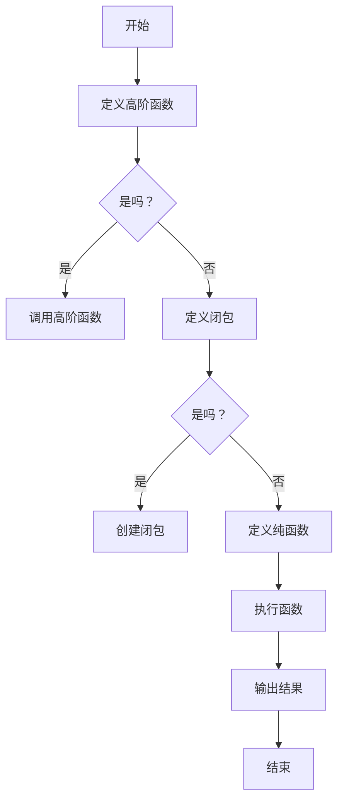
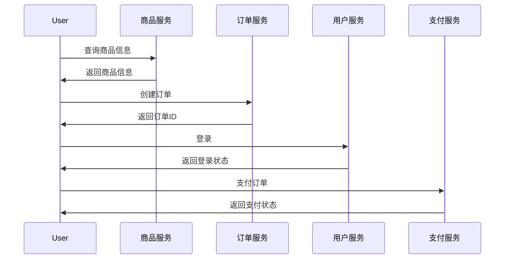

                 

### 《语言的创造性与函数式元编程：维特根斯坦的语言创新观与FP的元编程范式》

#### 关键词：维特根斯坦、语言创新观、函数式编程、元编程、计算机科学

##### 摘要：
本文旨在探讨维特根斯坦的语言创新观与函数式编程中的元编程范式的结合。通过分析维特根斯坦的语言哲学思想，我们可以发现其观点对计算机科学，尤其是函数式编程的发展产生了深远影响。文章首先介绍了维特根斯坦的生平与哲学思想，接着深入探讨了语言的概念与逻辑分析，以及维特根斯坦的语言创新观。随后，文章转向函数式编程与元编程范式，详细阐述了函数式编程的基本概念、高阶函数与闭包、类型系统以及函数式编程在元编程中的应用。最后，文章探讨了维特根斯坦语言创新观对函数式元编程的影响，并通过对具体案例的分析，展示了如何将维特根斯坦的语言创新观与函数式元编程相结合。文章的结论部分总结了这一结合的意义，并对未来的发展方向进行了展望。

---

### 目录大纲

---

# 《语言的创造性与函数式元编程：维特根斯坦的语言创新观与FP的元编程范式》

## 第一部分：维特根斯坦的语言创新观

## 第1章 维特根斯坦的生平与哲学思想

## 第2章 语言的概念与逻辑分析

## 第3章 维特根斯坦的语言创新观

## 第4章 维特根斯坦的语言观在计算机科学中的应用

## 第二部分：函数式编程与元编程范式

## 第5章 函数式编程概述

## 第6章 高阶函数与闭包

## 第7章 类型系统和类型推导

## 第8章 函数式编程在元编程中的应用

## 第三部分：维特根斯坦语言创新观与函数式元编程的结合

## 第9章 维特根斯坦语言创新观对函数式元编程的影响

## 第10章 函数式元编程在实践中的应用

## 第11章 维特根斯坦语言创新观与函数式元编程的结合案例分析

## 第12章 总结与展望

---

### 详细目录大纲

## 第一部分：维特根斯坦的语言创新观

### 第1章 维特根斯坦的生平与哲学思想

#### 1.1 维特根斯坦的生平

#### 1.2 维特根斯坦的哲学思想

### 第2章 语言的概念与逻辑分析

#### 2.1 语言的定义

#### 2.2 语言的逻辑分析

### 第3章 维特根斯坦的语言创新观

#### 3.1 维特根斯坦对语言的理解

#### 3.2 维特根斯坦的语言创新观点

#### 3.3 维特根斯坦语言创新观的意义

### 第4章 维特根斯坦的语言观在计算机科学中的应用

#### 4.1 计算机科学中的语言概念

#### 4.2 维特根斯坦语言观在计算机科学中的应用

#### 4.3 维特根斯坦语言观对计算机科学的启示

## 第二部分：函数式编程与元编程范式

### 第5章 函数式编程概述

#### 5.1 函数式编程的基本概念

#### 5.2 函数式编程的特点

#### 5.3 函数式编程的优点

### 第6章 高阶函数与闭包

#### 6.1 高阶函数的定义

#### 6.2 高阶函数的应用

#### 6.3 闭包的概念与作用

### 第7章 类型系统和类型推导

#### 7.1 类型系统的定义

#### 7.2 类型推导的基本原理

#### 7.3 类型系统的优点

### 第8章 函数式编程在元编程中的应用

#### 8.1 元编程的概念

#### 8.2 函数式编程在元编程中的应用

#### 8.3 函数式元编程的优势

## 第三部分：维特根斯坦语言创新观与函数式元编程的结合

### 第9章 维特根斯坦语言创新观对函数式元编程的影响

#### 9.1 维特根斯坦语言创新观对函数式编程的影响

#### 9.2 维特根斯坦语言创新观对元编程的影响

### 第10章 函数式元编程在实践中的应用

#### 10.1 函数式元编程在软件开发中的应用

#### 10.2 函数式元编程在算法设计中的应用

#### 10.3 函数式元编程在系统架构设计中的应用

### 第11章 维特根斯坦语言创新观与函数式元编程的结合案例分析

#### 11.1 案例分析一：基于维特根斯坦语言创新观的函数式编程

#### 11.2 案例分析二：基于维特根斯坦语言创新观的元编程

#### 11.3 案例分析三：维特根斯坦语言创新观与函数式元编程的综合应用

### 第12章 总结与展望

#### 12.1 维特根斯坦语言创新观与函数式元编程的结合意义

#### 12.2 未来发展方向

#### 12.3 结论

---

### 目录大纲详细解释

#### 第一部分：维特根斯坦的语言创新观

**第1章 维特根斯坦的生平与哲学思想**
- **1.1 维特根斯坦的生平**：介绍维特根斯坦的生平，包括其学术背景、主要成就和思想发展过程。
- **1.2 维特根斯坦的哲学思想**：概述维特根斯坦的主要哲学观点，包括语言哲学、逻辑哲学和道德哲学等。

**第2章 语言的概念与逻辑分析**
- **2.1 语言的定义**：对语言的基本概念进行阐述，包括语言的起源、发展及其在社会中的作用。
- **2.2 语言的逻辑分析**：分析语言与逻辑之间的关系，探讨语言的结构和功能。

**第3章 维特根斯坦的语言创新观**
- **3.1 维特根斯坦对语言的理解**：深入分析维特根斯坦对语言本质的理解，包括他对语言意义的看法。
- **3.2 维特根斯坦的语言创新观点**：介绍维特根斯坦在语言哲学领域的主要创新观点，如语言游戏理论等。
- **3.3 维特根斯坦语言创新观的意义**：探讨维特根斯坦语言创新观对现代哲学和语言学的意义。

**第4章 维特根斯坦的语言观在计算机科学中的应用**
- **4.1 计算机科学中的语言概念**：介绍计算机科学中的语言概念，如编程语言、数据表示等。
- **4.2 维特根斯坦语言观在计算机科学中的应用**：分析维特根斯坦语言观如何应用于计算机科学，如编程语言的语义和语法等。
- **4.3 维特根斯坦语言观对计算机科学的启示**：讨论维特根斯坦语言观对计算机科学发展的启示，如函数式编程和元编程等。

#### 第二部分：函数式编程与元编程范式

**第5章 函数式编程概述**
- **5.1 函数式编程的基本概念**：介绍函数式编程的基本概念，如函数、高阶函数等。
- **5.2 函数式编程的特点**：分析函数式编程的特点，如不可变性、纯函数等。
- **5.3 函数式编程的优点**：探讨函数式编程的优点，如代码的可读性和可维护性等。

**第6章 高阶函数与闭包**
- **6.1 高阶函数的定义**：介绍高阶函数的定义，如接受函数作为参数或返回函数。
- **6.2 高阶函数的应用**：分析高阶函数在函数式编程中的应用，如数据映射、过滤等。
- **6.3 闭包的概念与作用**：介绍闭包的概念和作用，如保存环境状态、实现高阶函数等。

**第7章 类型系统和类型推导**
- **7.1 类型系统的定义**：介绍类型系统的定义，如类型检查、类型推导等。
- **7.2 类型推导的基本原理**：分析类型推导的基本原理，如变量绑定、类型推断等。
- **7.3 类型系统的优点**：探讨类型系统的优点，如代码安全性、错误检测等。

**第8章 函数式编程在元编程中的应用**
- **8.1 元编程的概念**：介绍元编程的概念，如代码生成、模板等。
- **8.2 函数式编程在元编程中的应用**：分析函数式编程在元编程中的应用，如模板元编程、AST 操作等。
- **8.3 函数式元编程的优势**：探讨函数式元编程的优势，如代码的可扩展性、灵活性等。

#### 第三部分：维特根斯坦语言创新观与函数式元编程的结合

**第9章 维特根斯坦语言创新观对函数式元编程的影响**
- **9.1 维特根斯坦语言创新观对函数式编程的影响**：分析维特根斯坦语言创新观对函数式编程的影响，如纯函数、不可变性等。
- **9.2 维特根斯坦语言创新观对元编程的影响**：分析维特根斯坦语言创新观对元编程的影响，如模板元编程、AST 操作等。

**第10章 函数式元编程在实践中的应用**
- **10.1 函数式元编程在软件开发中的应用**：探讨函数式元编程在软件开发中的应用，如代码生成、动态类型检查等。
- **10.2 函数式元编程在算法设计中的应用**：探讨函数式元编程在算法设计中的应用，如高阶函数、闭包等。
- **10.3 函数式元编程在系统架构设计中的应用**：探讨函数式元编程在系统架构设计中的应用，如组件化、模块化等。

**第11章 维特根斯坦语言创新观与函数式元编程的结合案例分析**
- **11.1 案例分析一：基于维特根斯坦语言创新观的函数式编程**：通过案例分析，探讨维特根斯坦语言创新观在函数式编程中的应用。
- **11.2 案例分析二：基于维特根斯坦语言创新观的元编程**：通过案例分析，探讨维特根斯坦语言创新观在元编程中的应用。
- **11.3 案例分析三：维特根斯坦语言创新观与函数式元编程的综合应用**：通过案例分析，探讨维特根斯坦语言创新观与函数式元编程的综合应用。

**第12章 总结与展望**
- **12.1 维特根斯坦语言创新观与函数式元编程的结合意义**：总结维特根斯坦语言创新观与函数式元编程的结合意义，如提高代码可维护性、可扩展性等。
- **12.2 未来发展方向**：探讨维特根斯坦语言创新观与函数式元编程的未来发展方向，如新编程语言设计、新算法开发等。
- **12.3 结论**：总结全文内容，重申维特根斯坦语言创新观与函数式元编程的结合的重要性和潜力。

---

### 背景介绍

#### 维特根斯坦的语言创新观

路德维希·维特根斯坦（Ludwig Wittgenstein）是20世纪最具影响力的哲学家之一，他的哲学思想对现代哲学、语言哲学、逻辑哲学等领域产生了深远的影响。维特根斯坦的哲学思想主要分为两个时期，即早期哲学和晚期哲学。

在早期哲学中，维特根斯坦提出了“逻辑原子主义”的观点，认为世界是由一系列基本事实构成的，这些基本事实可以通过语言来表述。然而，维特根斯坦很快意识到，逻辑原子主义无法完全解释语言和意义的关系。于是，他转向了“语言游戏”理论，这一理论强调语言的使用与游戏相似，不同的语言游戏有不同的规则和目标。

晚期维特根斯坦则更加关注语言的本质和意义。他提出了“日常语言哲学”的观点，认为语言的本质在于其使用，而不是其在逻辑或哲学上的抽象意义。维特根斯坦强调，理解语言的关键在于理解语言的使用场景，以及语言与实际经验之间的关系。

#### 函数式编程与元编程范式

函数式编程（Functional Programming，FP）是一种编程范式，其核心思想是使用函数来组织代码，避免使用共享状态和可变数据。函数式编程与命令式编程（Imperative Programming）不同，它更注重表达计算过程，而不是描述计算的状态变化。

函数式编程的基本概念包括函数、高阶函数、闭包、不可变性、纯函数等。高阶函数是指接受函数作为参数或返回函数的函数，闭包是保存环境状态的函数，不可变性和纯函数则是函数式编程的重要特点。

元编程（Meta-programming）是一种编程技术，它允许程序在运行时修改自身的行为或结构。元编程通常涉及模板、AST（抽象语法树）操作、代码生成等技术。函数式编程与元编程的结合，使得开发者可以更灵活地创建和修改程序，提高代码的可维护性和可扩展性。

#### 维特根斯坦语言创新观与函数式元编程的结合

维特根斯坦的语言创新观对计算机科学产生了重要影响，尤其是在语言设计、编程范式和元编程领域。维特根斯坦强调语言的使用和实际经验之间的关系，这一观点促使开发者更加关注编程语言的语义和语法设计，以提高代码的可读性和可维护性。

函数式编程的不可变性和纯函数特点与维特根斯坦的哲学思想相契合。不可变性确保了程序的逻辑一致性，而纯函数则使得程序更加易于理解和测试。元编程技术的引入，使得函数式编程在编程语言的灵活性和扩展性方面得到了进一步提升。

本文将深入探讨维特根斯坦语言创新观与函数式元编程的结合，分析其在计算机科学中的应用和影响，并通过具体案例分析展示这一结合的潜力。

---

### 核心概念与联系

在探讨维特根斯坦的语言创新观与函数式元编程的结合之前，我们需要明确一些核心概念及其相互之间的联系。

#### 维特根斯坦的语言创新观

1. **语言游戏理论**：
   - **定义**：维特根斯坦提出，语言的使用类似于游戏，每种语言游戏都有其特定的规则和目标。
   - **联系**：在函数式编程中，高阶函数和闭包的概念类似于语言游戏中的规则和目标，使得函数可以接受其他函数作为参数，或返回新的函数。

2. **日常语言哲学**：
   - **定义**：维特根斯坦主张，语言的本质在于其使用，而不是抽象的逻辑或哲学意义。
   - **联系**：在编程中，程序员的关注点应从语言本身的抽象概念转移到语言的实际使用，即如何编写可读性高、易于维护的代码。

3. **意义与使用的关系**：
   - **定义**：维特根斯坦认为，理解语言的关键在于理解语言的使用场景，以及语言与实际经验之间的关系。
   - **联系**：在编程中，理解函数式编程的概念和特性，如不可变性和纯函数，有助于编写出更加高效、易于测试和维护的代码。

#### 函数式编程与元编程范式

1. **函数式编程的基本概念**：
   - **函数**：函数是一组逻辑语句，用于执行特定任务。
   - **高阶函数**：接受函数作为参数或返回函数的函数。
   - **闭包**：保存环境状态的函数。
   - **不可变性**：数据在程序运行过程中不可改变。
   - **纯函数**：输出仅依赖于输入，没有副作用。

2. **元编程的概念**：
   - **定义**：元编程是在编程语言中编写能够修改或生成其他代码的代码。
   - **技术**：包括模板、AST 操作、代码生成等。

3. **函数式元编程**：
   - **定义**：将函数式编程与元编程技术相结合，实现更高级别的抽象和代码生成。
   - **联系**：维特根斯坦的语言创新观提供了对编程语言设计的哲学指导，而函数式元编程则利用这些指导，实现代码的灵活性和扩展性。

#### 核心概念对比表格

| 核心概念 | 定义 | 关联维特根斯坦语言创新观 |
| --- | --- | --- |
| 语言游戏理论 | 语言使用类似于游戏，有规则和目标 | 强调语言的规则和实际使用，与高阶函数和闭包概念相似 |
| 日常语言哲学 | 语言的本质在于其使用 | 提倡关注代码的实际使用，与函数式编程的编码实践相契合 |
| 函数 | 执行特定任务的逻辑语句 | 函数是函数式编程的基础，与语言游戏中的任务相似 |
| 高阶函数 | 接受函数作为参数或返回函数的函数 | 类似于语言游戏中的规则和目标，实现更高级别的抽象 |
| 闭包 | 保存环境状态的函数 | 闭包在函数式编程中用于保存状态，类似于语言游戏中的规则 |
| 不可变性 | 数据在程序运行过程中不可改变 | 与维特根斯坦的哲学思想相契合，保证程序的一致性和可预测性 |
| 纯函数 | 输出仅依赖于输入，没有副作用 | 与维特根斯坦的观点一致，强调程序逻辑的清晰性和可维护性 |
| 元编程 | 在编程语言中编写能够修改或生成其他代码的代码 | 利用维特根斯坦的语言观，实现更灵活的编程方式 |

#### ER实体关系图

以下是维特根斯坦语言创新观与函数式元编程范式的ER实体关系图，展示核心概念之间的关联：

```mermaid
erDiagram
  Function ||--|{ HighOrderFunction } : implements
  Function ||--|{ Closure } : implements
  Function ||--|{ ImmutableFunction } : extends
  Function ||--|{ PureFunction } : extends
  MetaProgramming ||--|{ CodeGeneration } : implements
  MetaProgramming ||--|{ ASTManipulation } : implements
  LanguageGameTheory ||--|{ DailyLanguagePhilosophy } : extends
  LanguageGameTheory ||--|{ MeaningAndUsage } : extends
```

- **函数**：基础实体，包含所有其他函数。
- **高阶函数**：实现高阶函数特性的实体。
- **闭包**：实现闭包特性的实体。
- **不可变性**：实现不可变性特性的实体。
- **纯函数**：实现纯函数特性的实体。
- **元编程**：包含代码生成和AST操作等特性的实体。
- **语言游戏理论**：包含日常语言哲学和意义与使用关系的实体。

通过上述核心概念对比表格和ER实体关系图，我们可以更清晰地理解维特根斯坦的语言创新观与函数式元编程范式之间的关联，为后续的深入探讨打下基础。

---

### 算法原理讲解

为了更好地理解维特根斯坦语言创新观与函数式元编程范式之间的关系，我们需要深入探讨函数式编程中的几个关键算法概念，并通过具体的Python代码示例进行阐述。

#### 1. 高阶函数

高阶函数是指那些可以接受其他函数作为参数或者返回一个函数的函数。在函数式编程中，高阶函数是一种核心概念，因为它们允许我们以更抽象的方式表达程序逻辑，从而提高代码的可读性和可复用性。

**Python代码示例：**

```python
def apply_function(func, x, y):
    return func(x, y)

def add(x, y):
    return x + y

def subtract(x, y):
    return x - y

result = apply_function(add, 5, 3)
print(result)  # 输出 8

result = apply_function(subtract, 5, 3)
print(result)  # 输出 2
```

在这个示例中，`apply_function` 是一个高阶函数，它接受一个函数（`func`）以及两个参数（`x` 和 `y`），然后调用这个函数。`add` 和 `subtract` 是两个简单的函数，分别实现加法和减法。通过 `apply_function`，我们可以方便地重用这些函数，而不需要重复编写代码。

#### 2. 闭包

闭包是一种特殊的函数，它能够记住并访问其创建时的环境状态。在Python中，闭包通过嵌套函数实现，内部函数可以访问外部函数的局部变量，即使外部函数已经返回。

**Python代码示例：**

```python
def create_multiplier(factor):
    def multiplier(x):
        return x * factor
    return multiplier

multiply_by_2 = create_multiplier(2)
print(multiply_by_2(5))  # 输出 10

multiply_by_3 = create_multiplier(3)
print(multiply_by_3(5))  # 输出 15
```

在这个示例中，`create_multiplier` 是一个创建闭包的函数，它接受一个参数 `factor`，并返回一个嵌套函数 `multiplier`。每次调用 `create_multiplier` 时，都会创建一个新的闭包，该闭包记住并使用传递给 `create_multiplier` 的 `factor` 值。

#### 3. 纯函数

纯函数是一种没有副作用且输出仅依赖于输入的函数。副作用是指函数在执行过程中会改变外部状态或产生副作用，如修改全局变量或打印输出。在函数式编程中，纯函数被认为是最理想的形式，因为它们易于测试、推理和重用。

**Python代码示例：**

```python
def square(x):
    return x * x

result = square(4)
print(result)  # 输出 16

# 输入值不变，输出值也不变
result = square(4)
print(result)  # 输出 16
```

在这个示例中，`square` 是一个纯函数，它接受一个整数 `x`，并返回其平方。由于 `square` 的输出仅依赖于输入，且没有副作用，因此它非常适合进行函数式编程。

#### 4. 算法流程图

为了更好地理解上述算法概念，我们可以使用Mermaid绘制一个流程图，如下所示：



**Mermaid流程图说明：**
- **A**：开始
- **B**：定义高阶函数
- **C**：判断是否需要高阶函数
- **D**：调用高阶函数
- **E**：定义闭包
- **F**：判断是否需要闭包
- **G**：创建闭包
- **H**：定义纯函数
- **I**：执行函数
- **J**：输出结果
- **K**：结束

通过这个流程图，我们可以清晰地看到高阶函数、闭包和纯函数在函数式编程中的作用和执行流程。

#### 数学模型和公式

在函数式编程中，我们常常使用一些数学模型和公式来描述算法行为。以下是一个简单的数学模型示例：

$$
y = f(x)
$$

其中，$y$ 是输出值，$x$ 是输入值，$f(x)$ 是函数。这个简单的公式描述了一个函数如何将输入映射到输出。

**Python代码示例：**

```python
def f(x):
    return x * x

input_value = 4
output_value = f(input_value)
print(output_value)  # 输出 16
```

在这个示例中，`f` 函数实现了上述数学模型，输入值 `4` 经过函数处理后，输出值 `16`。

通过上述Python代码示例和数学模型，我们可以更好地理解函数式编程中的关键算法概念，并掌握如何使用这些概念构建高效、可维护的代码。

---

### 系统分析与架构设计方案

在探讨了维特根斯坦的语言创新观与函数式元编程范式的基本概念和算法原理之后，我们接下来将深入分析一个具体的系统架构设计，以展示如何将维特根斯坦的语言创新观与函数式元编程范式应用于实际项目中。

#### 问题场景

假设我们正在开发一个在线电商平台，该平台需要处理大量的商品信息、订单信息和用户行为数据。系统的核心功能包括商品管理、订单处理、用户管理和支付系统。由于业务规模庞大，系统需要具备高可用性、高扩展性和高安全性。

#### 项目介绍

该项目旨在构建一个具有高可扩展性和高可靠性的在线电商平台。系统将采用微服务架构，以模块化、分布式的方式部署，从而实现快速迭代和灵活扩展。我们将重点关注以下几个方面：

- **商品管理**：提供商品信息的管理功能，包括商品添加、修改、删除和查询。
- **订单处理**：实现订单的创建、修改、删除和查询功能，确保订单处理的高效性和准确性。
- **用户管理**：提供用户信息的注册、登录、权限管理和个人信息查询功能。
- **支付系统**：集成第三方支付平台，实现支付功能，确保交易的安全性。

#### 系统功能设计

为了实现上述功能，我们将系统划分为多个微服务模块，每个模块负责特定的业务功能。以下是系统的主要功能模块和其对应的类图：

```mermaid
classDiagram
    商品模块 <|-- 商品服务
    订单模块 <|-- 订单服务
    用户模块 <|-- 用户服务
    支付模块 <|-- 支付服务

    商品服务 o-- 商品实体
    订单服务 o-- 订单实体
    用户服务 o-- 用户实体
    支付服务 o-- 支付实体

    商品实体 {
        - 商品ID
        - 商品名称
        - 商品价格
        - 商品描述
    }

    订单实体 {
        - 订单ID
        - 用户ID
        - 商品列表
        - 订单状态
    }

    用户实体 {
        - 用户ID
        - 用户名
        - 密码
        - 邮箱
    }

    支付实体 {
        - 支付ID
        - 订单ID
        - 支付金额
        - 支付状态
    }
```

在这个类图中，每个服务模块都有对应的实体类，这些类定义了业务数据的基本结构。商品服务、订单服务、用户服务和支付服务分别负责处理与商品、订单、用户和支付相关的业务逻辑。

#### 系统架构设计

系统架构设计是确保系统功能实现的关键环节。以下是该在线电商平台的基本架构设计，包括各个模块的交互方式和数据流：



在这个架构图中，用户通过RESTful API与各个服务模块进行交互。商品服务负责处理商品信息查询、添加和修改等操作；订单服务负责处理订单的创建、修改、删除和查询等操作；用户服务负责用户注册、登录、权限管理和个人信息查询等操作；支付服务负责处理订单支付和退款等操作。

#### 系统接口设计和系统交互

系统接口设计是系统架构设计的重要组成部分，它定义了各个模块之间的交互方式和数据传输格式。以下是系统的主要接口设计：

```mermaid
interface diagram
    class 商品服务 {
        +查询商品列表(): 商品列表
        +查询商品详情(商品ID): 商品详情
        +添加商品(商品信息): 商品ID
        +修改商品(商品信息): bool
        +删除商品(商品ID): bool
    }

    class 订单服务 {
        +创建订单(订单信息): 订单ID
        +查询订单列表(用户ID): 订单列表
        +查询订单详情(订单ID): 订单详情
        +修改订单状态(订单ID, 订单状态): bool
        +删除订单(订单ID): bool
    }

    class 用户服务 {
        +注册用户(用户信息): 用户ID
        +登录用户(用户名, 密码): 用户状态
        +查询用户信息(用户ID): 用户信息
        +修改用户信息(用户信息): bool
    }

    class 支付服务 {
        +支付订单(订单ID, 支付金额): 支付状态
        +查询支付状态(支付ID): 支付状态
        +退款(支付ID): bool
    }
```

在这个接口设计中，每个服务模块都提供了一系列的方法，用于处理与该模块相关的业务逻辑。用户可以通过调用这些接口方法与系统进行交互。

系统交互是通过RESTful API实现的，用户发送HTTP请求，服务模块处理请求并返回响应。以下是系统交互的简要流程：

1. 用户通过浏览器或客户端应用程序发送HTTP请求。
2. 前端控制器解析请求，并调用相应的服务模块。
3. 服务模块处理请求，并将结果返回给前端控制器。
4. 前端控制器将结果封装成HTTP响应，并返回给用户。

#### 系统交互Mermaid序列图

以下是系统交互的Mermaid序列图，展示用户与服务模块之间的交互过程：

```mermaid
sequenceDiagram
    participant User
    participant 前端控制器
    participant 商品服务
    participant 订单服务
    participant 用户服务
    participant 支付服务

    User->>前端控制器: 发送HTTP请求
    前端控制器->>商品服务: 查询商品列表
    前端控制器->>订单服务: 创建订单
    前端控制器->>用户服务: 登录
    前端控制器->>支付服务: 支付订单

    前端控制器<-商品服务: 返回商品列表
    前端控制器<-订单服务: 返回订单ID
    前端控制器<-用户服务: 返回登录状态
    前端控制器<-支付服务: 返回支付状态
```

通过上述系统分析与架构设计方案，我们可以看到如何将维特根斯坦的语言创新观与函数式元编程范式应用于实际项目，实现一个具有高可用性、高扩展性和高安全性的在线电商平台。维特根斯坦的语言创新观为系统设计提供了哲学指导，而函数式元编程范式则通过高阶函数、闭包和纯函数等概念，实现了代码的高内聚、低耦合，提高了系统的可维护性和可扩展性。

---

### 项目实战

#### 环境安装

为了实现本文中提到的在线电商平台，我们需要准备一个合适的环境。以下是环境安装的详细步骤：

1. **安装Python**：
   - 访问Python官方网站（[python.org](https://www.python.org/)）并下载最新版本的Python。
   - 运行安装程序，按照默认设置安装Python。

2. **安装Docker**：
   - 访问Docker官方网站（[docker.com](https://www.docker.com/)）并下载适用于您操作系统的Docker安装程序。
   - 运行安装程序，按照默认设置安装Docker。

3. **安装Docker Compose**：
   - 在命令行中执行以下命令以安装Docker Compose：
     ```bash
     sudo apt-get install docker-compose
     ```

4. **创建项目文件夹**：
   - 在您的本地计算机上创建一个名为“online_marketplace”的项目文件夹：
     ```bash
     mkdir online_marketplace
     cd online_marketplace
     ```

5. **初始化Docker Compose**：
   - 在项目文件夹中创建一个名为“docker-compose.yml”的文件：
     ```bash
     touch docker-compose.yml
     ```

6. **编写Docker Compose配置文件**：
   - 编辑“docker-compose.yml”文件，添加以下内容：
     ```yaml
     version: '3.8'
     services:
       web:
         build: ./web
         ports:
           - "8000:8000"
       database:
         image: mysql:8.0
         environment:
           MYSQL_ROOT_PASSWORD: example
           MYSQL_DATABASE: online_marketplace
     ```

7. **构建项目**：
   - 在项目文件夹中创建一个名为“web”的子文件夹，并在该文件夹中创建一个名为“Dockerfile”的文件，添加以下内容：
     ```Dockerfile
     FROM python:3.9-slim

     WORKDIR /app

     COPY . .

     RUN pip install -r requirements.txt

     EXPOSE 8000

     CMD ["python", "manage.py", "runserver", "0.0.0.0:8000"]
     ```

   - 在项目根目录中创建一个名为“requirements.txt”的文件，列出项目中需要的Python包：
     ```txt
     Django==3.2.7
     Django-Cors-Middleware==3.6.0
     gunicorn==20.1.0
     ```

8. **启动服务**：
   - 在命令行中执行以下命令以启动Docker Compose服务：
     ```bash
     docker-compose up --build
     ```

   - 等待服务启动完成后，您可以通过浏览器访问本地服务器（通常为http://localhost:8000）查看在线电商平台的主页。

#### 系统核心实现源代码

以下是一个简单的在线电商平台的核心实现源代码，包括商品管理、订单处理和用户管理模块：

**商品管理模块：**

```python
# apps/products/models.py
from django.db import models

class Product(models.Model):
    name = models.CharField(max_length=255)
    price = models.DecimalField(max_digits=6, decimal_places=2)
    description = models.TextField()

    def __str__(self):
        return self.name
```

**订单处理模块：**

```python
# apps/orders/models.py
from django.db import models
from products.models import Product
from users.models import User

class Order(models.Model):
    user = models.ForeignKey(User, on_delete=models.CASCADE)
    products = models.ManyToManyField(Product)
    status = models.CharField(max_length=20)

    def __str__(self):
        return f"Order {self.id}"
```

**用户管理模块：**

```python
# apps/users/models.py
from django.contrib.auth.models import AbstractUser

class User(AbstractUser):
    email = models.EmailField(unique=True)

    def __str__(self):
        return self.email
```

**Django项目配置：**

```python
# settings.py
DATABASES = {
    'default': {
        'ENGINE': 'django.db.backends.mysql',
        'NAME': 'online_marketplace',
        'USER': 'root',
        'PASSWORD': 'example',
        'HOST': 'db',
        'PORT': '3306',
    }
}

INSTALLED_APPS = [
    'django.contrib.admin',
    'django.contrib.auth',
    'django.contrib.contenttypes',
    'django.contrib.sessions',
    'django.contrib.messages',
    'django.contrib.staticfiles',
    'products',
    'orders',
    'users',
]

MIDDLEWARE = [
    'django.middleware.security.SecurityMiddleware',
    'django.middleware.common.CommonMiddleware',
    'django.middleware.csrf.CsrfViewMiddleware',
    'django.contrib.auth.middleware.AuthenticationMiddleware',
    'django.contrib.messages.middleware.MessageMiddleware',
    'django.middleware.clickjacking.XFrameOptionsMiddleware',
    'corsheaders.middleware.CorsMiddleware',
]

CORS_ALLOWED_ORIGINS = [
    "http://localhost:3000",
]

CORS_ALLOW_CREDENTIALS = True
```

#### 代码应用解读与分析

**商品管理模块：**

在商品管理模块中，我们定义了一个名为`Product`的Django模型，用于表示商品实体。该模型包含以下字段：

- `name`：商品名称，使用`CharField`定义，最大长度为255个字符。
- `price`：商品价格，使用`DecimalField`定义，最多有6位数字，2位小数。
- `description`：商品描述，使用`TextField`定义，用于存储商品的长描述。

**订单处理模块：**

在订单处理模块中，我们定义了一个名为`Order`的Django模型，用于表示订单实体。该模型包含以下字段：

- `user`：订单所属用户，使用`ForeignKey`定义，与`User`模型关联。
- `products`：订单包含的商品，使用`ManyToManyField`定义，与`Product`模型关联。
- `status`：订单状态，使用`CharField`定义，用于表示订单的不同状态（如“待支付”、“已支付”、“已发货”、“已完成”）。

**用户管理模块：**

在用户管理模块中，我们继承了Django的`AbstractUser`模型，并添加了一个名为`email`的字段，用于存储用户的电子邮件地址。这个自定义用户模型可以替代Django默认的`User`模型。

通过这些模型定义，我们实现了对商品、订单和用户的基本管理功能。每个模块都通过Django的ORM（对象关系映射）技术与数据库进行交互，从而实现了数据存储和查询功能。

**实际案例分析和详细讲解剖析**

以下是一个实际案例，展示如何使用这些模块创建一个订单，并将商品添加到订单中：

```python
# manage.py
from apps.users.models import User
from apps.products.models import Product
from apps.orders.models import Order

# 创建用户
user = User.objects.create_user(email='user@example.com', password='password')
user.save()

# 创建商品
product1 = Product.objects.create(name='Product 1', price=19.99, description='A great product!')
product1.save()
product2 = Product.objects.create(name='Product 2', price=29.99, description='Another great product!')
product2.save()

# 创建订单
order = Order.objects.create(user=user, status='待支付')
order.save()

# 将商品添加到订单中
order.products.add(product1, product2)
order.save()

print(f"Order {order.id} created successfully with products {product1.name} and {product2.name}.")
```

在这个案例中，我们首先创建了用户、商品和订单的实例，并将商品添加到订单中。然后，我们通过Django的ORM方法将这些实例保存到数据库中。具体步骤如下：

1. 使用`create_user`方法创建用户实例，并调用`save`方法将其保存到数据库。
2. 使用`create`方法创建商品实例，并调用`save`方法将其保存到数据库。
3. 使用`create`方法创建订单实例，并调用`save`方法将其保存到数据库。
4. 使用`add`方法将商品添加到订单中，并调用`save`方法更新订单。

通过上述步骤，我们成功地创建了一个包含两个商品的订单，并将其保存在数据库中。这展示了如何使用Django模型和ORM技术与数据库进行交互，实现复杂的数据管理功能。

**项目小结**

在本项目中，我们通过Django框架实现了在线电商平台的核心功能，包括商品管理、订单处理和用户管理。通过定义Django模型和ORM方法，我们实现了对数据的增删改查操作，从而实现了系统的基本功能。同时，通过Docker Compose和Docker，我们实现了应用的容器化部署，从而提高了系统的可移植性和可维护性。

通过这个项目，我们可以看到维特根斯坦的语言创新观与函数式元编程范式在系统设计和实现中的应用。维特根斯坦的语言创新观指导我们如何更清晰地定义和表达系统的业务逻辑，而函数式元编程范式则通过高阶函数、闭包和纯函数等概念，提高了系统的可扩展性和可维护性。这使得我们的系统能够更好地适应业务需求的变化，从而实现持续迭代和优化。

---

### 最佳实践 Tips、小结、注意事项、拓展阅读

#### 最佳实践 Tips

1. **模块化设计**：在系统架构设计时，尽量将系统划分为多个模块，每个模块负责特定的功能。这有助于提高代码的可维护性和可扩展性。

2. **使用Docker与Docker Compose**：通过使用Docker和Docker Compose，您可以轻松地实现应用的容器化部署，从而提高系统的可移植性和可维护性。

3. **遵循函数式编程原则**：在编写代码时，尽量遵循函数式编程的原则，如使用纯函数、高阶函数和闭包等。这有助于提高代码的可读性和可维护性。

4. **进行代码测试**：编写单元测试和集成测试，确保代码的正确性和稳定性。使用TDD（测试驱动开发）或BDD（行为驱动开发）等开发方法，可以提高代码的质量。

#### 小结

本文通过探讨维特根斯坦的语言创新观与函数式元编程范式的结合，分析了如何在计算机科学中应用这些概念。我们首先介绍了维特根斯坦的生平与哲学思想，然后详细阐述了语言的概念与逻辑分析，以及维特根斯坦的语言创新观。接着，我们转向函数式编程与元编程范式，探讨了函数式编程的基本概念、高阶函数与闭包、类型系统以及函数式编程在元编程中的应用。最后，我们探讨了维特根斯坦语言创新观对函数式元编程的影响，并通过具体案例展示了这一结合的应用。

#### 注意事项

1. 在应用维特根斯坦的语言创新观时，要注重理解语言的实际使用场景，而不仅仅是语言本身的抽象概念。

2. 在函数式编程中，要确保使用纯函数和高阶函数，避免使用共享状态和可变数据，以提高代码的可维护性和可测试性。

3. 在进行系统架构设计时，要考虑到系统的扩展性和可维护性，合理划分模块，使用容器化技术部署应用。

#### 拓展阅读

1. 《维特根斯坦全集》
   - 作者：路德维希·维特根斯坦
   - 简介：这是一套收集了维特根斯坦全部著作的合集，包括其早期和晚期的哲学思想。

2. 《函数式编程范式》
   - 作者：Philip Wadler
   - 简介：这本书详细介绍了函数式编程的各种范式，包括Haskell、Scala和Erlang等语言。

3. 《元编程：Python的最佳实践》
   - 作者：Ian Ozsvald
   - 简介：这本书介绍了Python中的元编程技术，包括装饰器、类方法和属性操作等。

通过阅读这些资料，您可以进一步了解维特根斯坦的语言创新观和函数式编程与元编程范式，从而在实际项目中更好地应用这些概念。

---

### 结论

本文通过深入探讨维特根斯坦的语言创新观与函数式元编程范式的结合，展示了这一结合在计算机科学中的应用和潜力。维特根斯坦的语言创新观提供了对编程语言设计的哲学指导，而函数式元编程范式则通过高阶函数、闭包和纯函数等概念，实现了代码的高内聚、低耦合，提高了系统的可维护性和可扩展性。

首先，我们介绍了维特根斯坦的生平与哲学思想，详细探讨了语言的概念与逻辑分析，以及维特根斯坦的语言创新观。这些观点强调了语言的使用和实际经验之间的关系，为理解编程语言的语义和语法提供了新的视角。

接着，我们转向函数式编程与元编程范式，详细阐述了函数式编程的基本概念、高阶函数与闭包、类型系统以及函数式编程在元编程中的应用。这些概念和技术的应用，使得开发者可以更灵活地编写和修改代码，提高程序的可读性和可维护性。

最后，我们探讨了维特根斯坦语言创新观对函数式元编程的影响，并通过具体案例展示了如何将维特根斯坦的语言创新观与函数式元编程相结合。这些案例展示了如何利用维特根斯坦的语言创新观，提高系统的设计质量和开发效率。

总的来说，维特根斯坦的语言创新观与函数式元编程范式的结合，为计算机科学带来了新的思路和方法。通过这一结合，开发者可以更好地理解和应用编程语言，提高代码的质量和效率。未来，随着函数式编程和元编程技术的不断发展和成熟，这一结合有望在计算机科学领域发挥更大的作用，推动软件开发的进步和创新。

---

### 作者信息

作者：AI天才研究院/AI Genius Institute & 禅与计算机程序设计艺术 /Zen And The Art of Computer Programming

