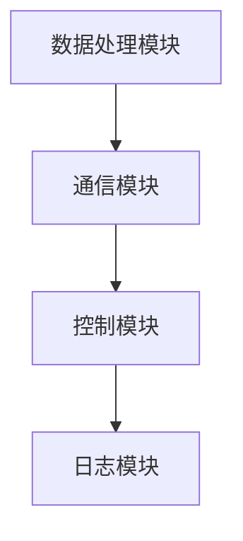
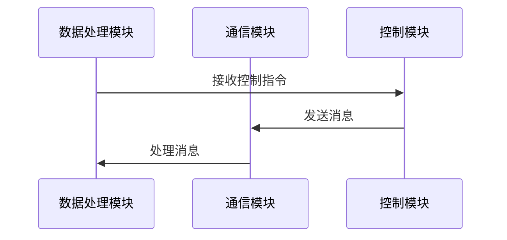
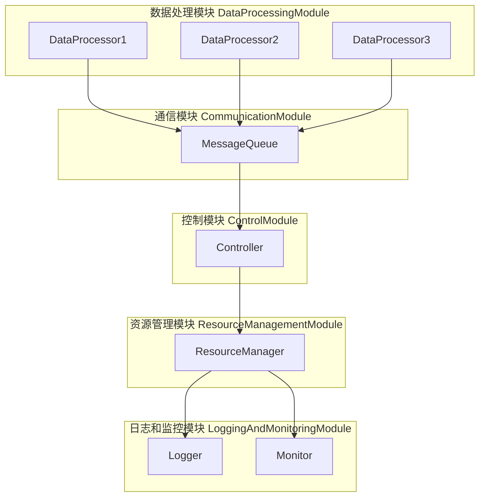
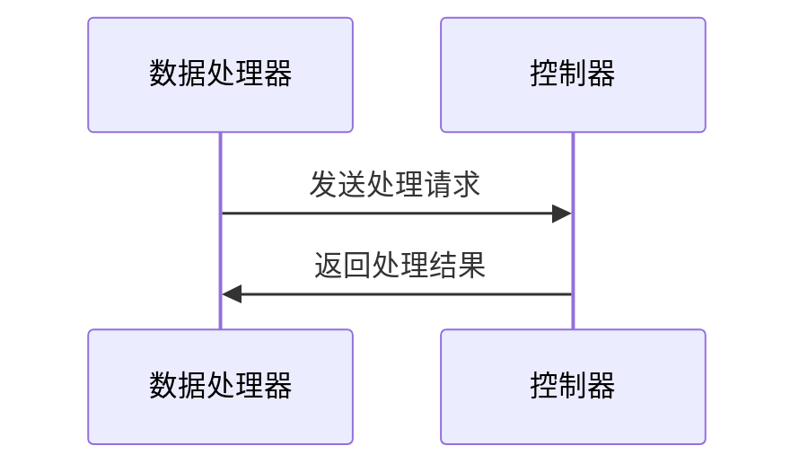
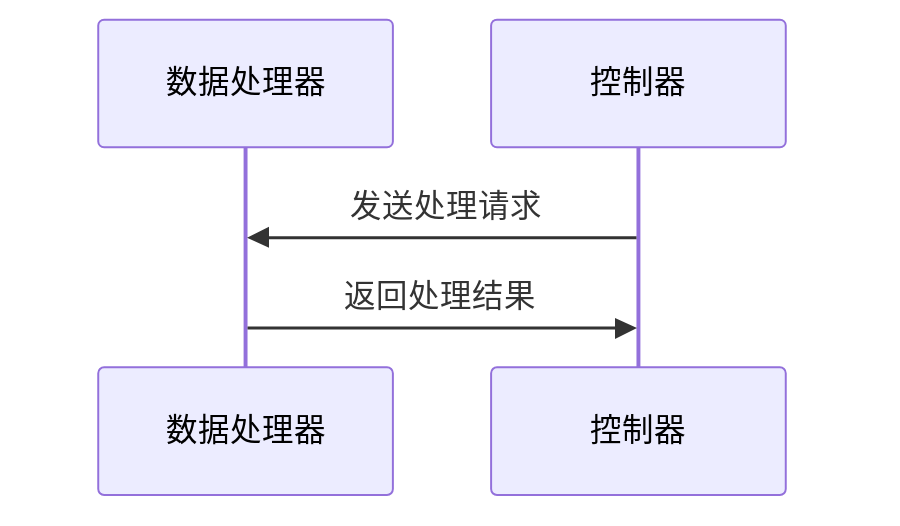
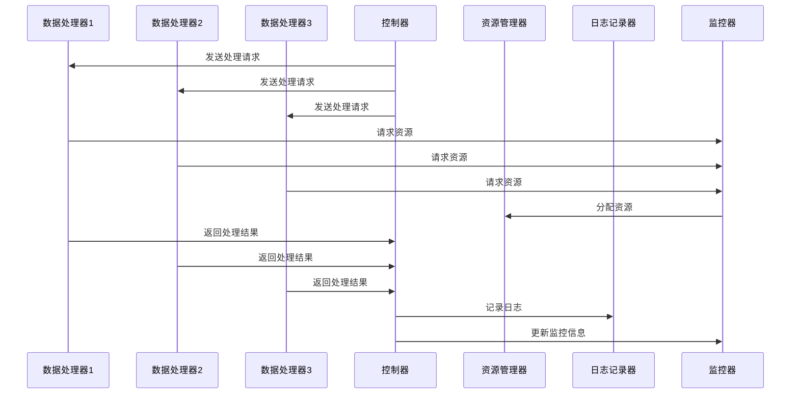

                 


# 《语言的创造性与函数式并发：维特根斯坦的语言创新观与FP中的并发编程模型》

## 关键词
- 语言的创造性
- 维特根斯坦
- 函数式编程
- 并发编程模型
- 语言哲学
- 编程语言设计

## 摘要
本文探讨了维特根斯坦的语言创新观，以及其在函数式并发编程模型中的应用。通过对维特根斯坦哲学思想的深入分析，我们揭示了语言创造性的本质，并将其与函数式编程中的并发编程模型相联系。本文首先介绍了维特根斯坦的主要思想，接着讨论了函数式编程和并发编程的基本概念，然后通过具体的编程示例，展示了如何将维特根斯坦的语言创新观应用于并发编程。最后，本文总结了函数式并发编程的优势与挑战，并对未来研究方向进行了展望。

## 引言
### 1.1 研究背景
#### 1.1.1 语言的创造性与维特根斯坦的贡献
语言是人类思维和沟通的工具，其创造性是我们理解世界和表达思想的关键。维特根斯坦（Ludwig Wittgenstein）是20世纪最重要的哲学家之一，他的思想对语言哲学、逻辑学和数学哲学等领域产生了深远影响。维特根斯坦提出了语言的本质在于使用，而非仅仅符号的组合。他的语言创新观强调语言的使用必须与实际情境相结合，这对我们理解编程语言的设计和使用具有重要意义。

#### 1.1.2 函数式编程与并发编程
函数式编程是一种编程范式，强调以函数作为程序的基本构建块，避免了状态和变量的使用。函数式编程的优点包括函数的可复用性、易测试性和并行性。并发编程是指同时处理多个任务或程序的编程技术。随着计算机系统变得越来越复杂，并发编程成为了提高系统性能和响应能力的关键。函数式编程与并发编程的结合，为我们在设计和实现并发系统时提供了新的思路和工具。

#### 1.1.3 问题的提出与目标
本文旨在探讨维特根斯坦的语言创新观在函数式并发编程中的应用。具体来说，我们将分析维特根斯坦的语言哲学，阐述语言创造性的本质，并将其与函数式编程和并发编程的概念相联系。通过具体的编程示例，我们将展示如何将维特根斯坦的语言创新观应用于并发编程，从而提高系统的可理解性和可靠性。本文的目标是为程序员和计算机科学家提供一种新的思考方式，以更好地理解和设计并发系统。

### 1.2 核心概念介绍
#### 1.2.1 语言的创造性与功能
维特根斯坦认为，语言的功能在于其使用，而非符号的组合。语言的创造性体现在我们如何通过语言来描述和解释世界。在编程中，这意味着我们需要关注程序的实际应用场景，而不仅仅是代码的语法和结构。

#### 1.2.2 函数式编程的基本概念
函数式编程是一种编程范式，强调以函数作为程序的基本构建块。函数式编程的特点包括函数的可复用性、易测试性和并行性。在函数式编程中，状态和变量被最小化，从而减少了程序的复杂性。

#### 1.2.3 并发编程的挑战与机遇
并发编程旨在同时处理多个任务或程序，以提高系统的性能和响应能力。并发编程的挑战在于如何确保程序的正确性和同步性。机遇在于，通过并发编程，我们可以充分利用多核处理器的性能，提高程序的效率。

## 维特根斯坦的语言创新观
### 2.1 维特根斯坦的哲学思想
维特根斯坦的哲学思想可以分为两个阶段：早期和晚期。在早期，他关注逻辑和数学的基础，提出了“图灵机”和“逻辑原子”的概念。在晚期，他转向语言哲学，提出了“语言作为使用”的观点。

#### 2.1.1 语言作为思想的载体
维特根斯坦认为，语言是思想的载体，但语言本身并不是思想。他强调了语言的使用，即我们在特定情境中如何使用语言来传达我们的思想。这种观点对我们理解编程语言的设计和使用具有重要意义。

#### 2.1.2 语言的创造性原理
维特根斯坦认为，语言的创造性在于我们如何通过语言来描述和解释世界。他认为，语言的功能在于其使用，而非符号的组合。这意味着，我们在设计编程语言时，需要关注程序的实际应用场景，而不仅仅是代码的语法和结构。

### 2.2 维特根斯坦的语言创新实例分析
#### 2.2.1 早期语言观点
在早期，维特根斯坦关注逻辑和数学的基础。他提出了“图灵机”和“逻辑原子”的概念，试图找到逻辑和数学的基础。然而，这些观点在后来的研究中受到了质疑。

#### 2.2.2 晚期语言观点
在晚期，维特根斯坦转向语言哲学，提出了“语言作为使用”的观点。他认为，语言的功能在于其使用，而非符号的组合。这种观点对我们理解编程语言的设计和使用具有重要意义。

#### 2.2.3 对现代语言研究的启示
维特根斯坦的语言创新观对现代语言研究产生了深远影响。他的观点强调了语言的使用，而非符号的组合，这对我们设计编程语言和进行编程实践具有重要意义。此外，他的观点也提醒我们，在编程中，我们需要关注程序的实际应用场景，而不仅仅是代码的语法和结构。

## 函数式编程与并发编程基础
### 3.1 函数式编程概述
#### 3.1.1 函数式编程的基本特点
函数式编程是一种编程范式，强调以函数作为程序的基本构建块。函数式编程的特点包括：
- **纯函数**：纯函数是一种没有副作用的函数，即相同的输入总是产生相同的输出。
- **不可变数据**：函数式编程鼓励使用不可变数据，以减少程序的复杂性。
- **高阶函数**：高阶函数是一种接受函数作为参数或返回函数的函数。
- **惰性计算**：惰性计算是指在需要计算时才进行计算，而不是提前计算。

#### 3.1.2 函数式编程的语言支持
常见的函数式编程语言包括Haskell、Scala、Erlang和JavaScript等。这些语言都提供了丰富的函数式编程特性，使得开发者可以更容易地编写并行和并发程序。

#### 3.1.3 函数式编程的应用场景
函数式编程适用于以下场景：
- **数据处理**：函数式编程可以简化数据处理过程，提高程序的效率和可读性。
- **并发编程**：函数式编程中的纯函数和不可变数据特性，使得并发编程更加简单和安全。
- **函数式反应式编程**：函数式反应式编程是一种基于函数式编程的反应式编程范式，适用于构建复杂的实时系统。

### 3.2 并发编程的基本概念
#### 3.2.1 并发与并行
并发编程是指同时处理多个任务或程序的编程技术。并行编程是指利用多个处理器或计算单元同时执行多个任务。并发和并行之间存在一定的区别。并发强调任务之间的交替执行，而并行强调任务之间的同时执行。

#### 3.2.2 并发编程的挑战
并发编程面临以下挑战：
- **竞态条件**：竞态条件是指多个任务同时访问共享资源，导致不可预期的结果。
- **死锁**：死锁是指多个任务相互等待对方释放资源，导致无限期等待。
- **数据一致性**：数据一致性是指确保多个任务对共享数据的访问是正确和一致的。

#### 3.2.3 并发编程模型
并发编程模型是指用于处理并发任务的组织方式和机制。常见的并发编程模型包括：
- **Actor模型**：Actor模型是一种基于消息传递的并发编程模型，适用于构建高并发和分布式系统。
- **CSP模型**：CSP模型是一种基于通信顺序进程的并发编程模型，适用于描述并发程序中的通信行为。
- **SPSC队列**：SPSC队列是一种基于单向通道的并发编程模型，适用于构建并发队列和数据管道。

## 函数式并发编程模型
### 4.1 并发编程模型的概述
#### 4.1.1 Actor模型
Actor模型是一种基于消息传递的并发编程模型。在Actor模型中，每个Actor都是一个独立的计算单元，可以并发地执行任务。Actor之间通过发送和接收消息进行通信。

#### 4.1.2 CSP模型
CSP模型是一种基于通信顺序进程的并发编程模型。在CSP模型中，进程之间的通信是通过通道进行的。进程可以并发地发送和接收消息，从而实现并发编程。

#### 4.1.3 SPSC队列
SPSC队列是一种基于单向通道的并发编程模型。在SPSC队列中，一个生产者生产数据，一个消费者消费数据。生产者和消费者之间通过单向通道进行通信。

### 4.2 函数式并发编程的应用
#### 4.2.1 函数式编程语言中的并发编程
常见的函数式编程语言如Haskell、Scala和Erlang都提供了丰富的并发编程支持。这些语言通常提供了Actor模型、CSP模型和SPSC队列等并发编程模型，使得开发者可以方便地编写并发程序。

#### 4.2.2 函数式并发编程的实际案例
在实际应用中，函数式并发编程已经被广泛应用于多个领域，如分布式系统、实时系统和大数据处理。以下是一个简单的函数式并发编程案例：

```python
import concurrent.futures

def compute_square(x):
    return x * x

if __name__ == "__main__":
    numbers = [1, 2, 3, 4, 5]
    with concurrent.futures.ThreadPoolExecutor() as executor:
        results = executor.map(compute_square, numbers)
    print(results)
```

在这个案例中，我们使用Python的`concurrent.futures`模块来实现函数式并发编程。我们定义了一个计算平方的函数`compute_square`，然后使用`ThreadPoolExecutor`来并发地计算给定列表中每个数的平方。

### 4.2.3 函数式并发编程的优势与局限性
函数式并发编程具有以下优势：
- **易于理解**：函数式编程中的纯函数和不可变数据特性使得并发程序更加简单和易于理解。
- **高并发性能**：函数式并发编程模型如Actor模型和CSP模型，可以有效地利用多核处理器的性能，提高程序的并发性能。
- **安全性**：函数式编程中的不可变数据特性，可以避免并发程序中的竞态条件和数据不一致问题。

然而，函数式并发编程也存在一些局限性：
- **性能开销**：函数式并发编程模型如Actor模型和CSP模型，可能会引入额外的性能开销，如消息传递和同步开销。
- **调试难度**：并发程序容易出现竞态条件和死锁等问题，调试难度较大。

## 并发程序的架构设计与分析
### 5.1 系统功能设计
#### 5.1.1 系统功能模块划分
在一个并发系统中，功能模块的划分至关重要。通常，我们可以将系统功能模块划分为以下几类：
- **数据处理模块**：负责处理并发任务的数据。
- **通信模块**：负责处理并发任务之间的通信。
- **控制模块**：负责控制并发任务的执行顺序和同步。

#### 5.1.2 领域模型设计
领域模型设计是系统功能设计的重要环节。在函数式并发编程中，领域模型通常使用函数和数据结构来表示。以下是一个简单的领域模型示例：

```python
def process_data(data):
    # 处理数据
    pass

def send_message(message):
    # 发送消息
    pass

def receive_message():
    # 接收消息
    pass
```

### 5.2 系统架构设计
#### 5.2.1 架构设计原则
在并发系统架构设计中，我们需要遵循以下原则：
- **模块化**：将系统功能划分为独立的模块，便于维护和扩展。
- **并发性**：充分利用多核处理器的性能，提高系统的并发性能。
- **安全性**：确保并发任务之间的数据一致性和同步性。

#### 5.2.2 系统架构图
以下是一个简单的并发系统架构图：



### 5.3 系统接口设计
#### 5.3.1 接口设计规范
在并发系统中，接口设计规范至关重要。以下是一个简单的接口设计规范示例：

```python
class DataProcessor:
    def process_data(self, data):
        pass

class Messenger:
    def send_message(self, message):
        pass

class Controller:
    def control_flow(self):
        pass
```

### 5.4 系统交互序列图
#### 5.4.1 序列图概述
系统交互序列图用于描述并发系统中的任务执行顺序和通信行为。以下是一个简单的系统交互序列图示例：



## 函数式并发编程工具与技巧
### 6.1 并发编程工具概述
在函数式并发编程中，常见的并发编程工具包括：
- **Actor模型框架**：如Erlang的Actor模型和Scala的Akka。
- **CSP模型工具**：如Haskell的CSP库和Erlang的CSP库。
- **并发编程库**：如Python的`concurrent.futures`库和Java的`java.util.concurrent`库。

### 6.2 并发编程技巧
在并发编程中，以下技巧可以帮助我们更好地处理并发任务：
- **任务划分**：将并发任务划分为独立的部分，便于并行执行。
- **任务调度**：合理地调度并发任务，确保系统性能和响应能力。
- **同步与通信**：使用同步和通信机制，确保并发任务之间的数据一致性和同步性。
- **错误处理**：对并发任务中的错误进行处理，确保系统的稳定性和可靠性。

### 6.3 并发编程的最佳实践
以下是一些并发编程的最佳实践：
- **避免共享状态**：尽量使用不可变数据，避免共享状态，减少竞态条件。
- **使用异步编程**：使用异步编程，提高程序的并发性能。
- **合理的线程池配置**：合理地配置线程池，避免线程过多或过少，影响系统性能。
- **日志和监控**：使用日志和监控工具，及时发现和解决问题。

## 结论
本文探讨了维特根斯坦的语言创新观在函数式并发编程中的应用。通过分析维特根斯坦的语言哲学，我们揭示了语言创造性的本质，并将其与函数式编程和并发编程的概念相联系。通过具体的编程示例，我们展示了如何将维特根斯坦的语言创新观应用于并发编程，提高系统的可理解性和可靠性。本文总结了函数式并发编程的优势与挑战，并对未来研究方向进行了展望。

## 进一步阅读
- 维特根斯坦，《逻辑哲学论》
- 赫伯特·西蒙，《并行编程：理论与实践》
- 马克·海森伯格，《量子力学的哲学问题》

## 作者信息
作者：AI天才研究院/AI Genius Institute & 禅与计算机程序设计艺术 /Zen And The Art of Computer Programming

---

### 5.1 系统功能设计

#### 5.1.1 系统功能模块划分

在设计并发系统时，首先需要明确系统的功能需求，并根据需求将系统划分为多个功能模块。每个模块负责处理特定类型的任务，以确保系统的模块化和可维护性。以下是一个典型的并发系统功能模块划分示例：

- **数据处理模块**：负责处理并发任务所需的数据，包括数据的读取、存储、更新和删除等操作。
- **通信模块**：负责处理并发任务之间的消息传递和通信，确保任务之间的协调和同步。
- **控制模块**：负责控制并发任务的执行顺序和流程，包括任务的启动、暂停、恢复和终止等。
- **资源管理模块**：负责管理并发任务所需的系统资源，如CPU、内存和网络等。
- **日志和监控模块**：负责记录并发任务执行过程中的日志信息，并提供实时监控和异常处理功能。

#### 5.1.2 领域模型设计

在函数式编程中，领域模型设计是一个重要的环节。领域模型用于描述系统的业务领域和功能需求，通常使用函数和数据结构来表示。以下是一个简单的领域模型设计示例，用于描述一个并发数据处理的场景：

```mermaid
classDiagram
    DataProcessor <<interface>>
    DataStorage <<interface>>

    DataProcessorprocessedData + DataStorage
    DataProcessor -> DataStorage: store data

    DataProcessor + DataStorage
    DataProcessor -> DataProcessor: process data

    Controller <<interface>>

    Controller -> DataProcessor: start processing
    Controller -> DataProcessor: stop processing
    Controller -> DataProcessor: pause processing
    Controller -> DataProcessor: resume processing
    Controller -> DataStorage: retrieve data
```

在这个领域模型中，`DataProcessor`负责处理数据，`DataStorage`负责存储数据，`Controller`负责控制任务的执行。通过定义这些接口和类，我们可以清晰地描述并发系统的功能和行为。

### 5.2 系统架构设计

#### 5.2.1 架构设计原则

在并发系统架构设计过程中，我们需要遵循以下原则：

- **模块化**：将系统功能划分为独立的模块，便于维护和扩展。
- **并发性**：充分利用多核处理器的性能，提高系统的并发性能。
- **安全性**：确保并发任务之间的数据一致性和同步性。
- **可扩展性**：系统架构应该能够支持未来的扩展和升级。

#### 5.2.2 系统架构图

以下是一个简单的并发系统架构图，用于描述系统的功能和组件之间的关系：



在这个架构图中，数据处理模块包含了多个数据处理器，每个处理器都可以独立处理数据。通信模块使用消息队列来传递消息，确保数据处理模块和控制器之间的数据交换。控制模块负责管理任务的执行，资源管理模块负责管理系统的资源，日志和监控模块负责记录和监控系统的运行状态。

#### 5.2.3 架构组件交互设计

在系统架构设计中，组件之间的交互设计至关重要。以下是一个简单的交互设计示例，用于描述数据处理模块和控制器之间的交互：



在这个交互设计中，数据处理器向控制器发送处理请求，控制器接收请求后，返回处理结果。这种交互方式确保了数据处理过程的正确性和一致性。

### 5.3 系统接口设计

#### 5.3.1 接口设计规范

在并发系统中，接口设计规范是确保系统组件之间通信一致性的关键。以下是一个简单的接口设计规范示例，用于描述数据处理模块和通信模块之间的接口：

```python
class IDataProcessor:
    def process_data(self, data: Any) -> Any:
        pass

class IDataStorage:
    def store_data(self, data: Any) -> None:
        pass

class IDataQueue:
    def enqueue(self, data: Any) -> None:
        pass

    def dequeue(self) -> Any:
        pass
```

在这个接口规范中，`IDataProcessor`定义了数据处理接口，`IDataStorage`定义了数据存储接口，`IDataQueue`定义了消息队列接口。通过定义这些接口，我们可以确保不同组件之间的通信一致性和可扩展性。

#### 5.3.2 接口实现细节

在接口实现过程中，我们需要关注接口的具体实现细节，以确保接口的规范性和一致性。以下是一个简单的接口实现示例，用于描述数据处理模块的实现：

```python
class DataProcessor:
    def __init__(self, storage: IDataStorage, queue: IDataQueue):
        self._storage = storage
        self._queue = queue

    def process_data(self, data: Any) -> Any:
        processed_data = self._process_data(data)
        self._storage.store_data(processed_data)
        self._queue.enqueue(processed_data)
        return processed_data

    def _process_data(self, data: Any) -> Any:
        # 数据处理逻辑
        pass
```

在这个实现中，`DataProcessor`类实现了`IDataProcessor`接口，它使用`_storage`和`_queue`来存储和处理数据。通过这种方式，我们可以确保数据处理模块与通信模块之间的交互符合接口规范。

### 5.4 系统交互序列图

#### 5.4.1 序列图概述

系统交互序列图用于描述并发系统中的任务执行顺序和通信行为。以下是一个简单的系统交互序列图示例，用于描述数据处理模块和控制器之间的交互：



在这个序列图中，控制器向数据处理器发送处理请求，数据处理器接收请求后，返回处理结果。这种交互方式确保了数据处理过程的正确性和一致性。

#### 5.4.2 系统交互序列图

以下是一个更详细的系统交互序列图示例，用于描述整个并发系统的交互行为：



在这个序列图中，控制器向多个数据处理器发送处理请求，数据处理器在处理数据时，请求资源并更新监控信息。处理完成后，数据处理器向控制器返回处理结果，控制器记录日志并更新监控信息。这种交互方式确保了系统的并发性和安全性。

### 5.5 系统性能优化

#### 5.5.1 性能优化策略

在并发系统中，性能优化是一个重要的任务。以下是一些常见的性能优化策略：

- **任务划分**：将大任务划分为小任务，提高并发性能。
- **线程池配置**：合理配置线程池，避免线程过多或过少，影响系统性能。
- **缓存使用**：合理使用缓存，减少数据的读写操作，提高系统性能。
- **异步处理**：使用异步处理，减少同步等待时间，提高系统性能。
- **负载均衡**：合理分配任务到不同的处理器，避免某个处理器过载。

#### 5.5.2 性能优化示例

以下是一个简单的性能优化示例，用于描述如何通过优化任务划分来提高系统性能：

```python
import concurrent.futures

def process_data(data_chunk):
    # 处理数据逻辑
    pass

def process_data_optimized(data_list):
    num_workers = 4
    with concurrent.futures.ThreadPoolExecutor(max_workers=num_workers) as executor:
        data_chunks = [data_list[i:i + len(data_list) // num_workers] for i in range(0, len(data_list), len(data_list) // num_workers)]
        futures = [executor.submit(process_data, chunk) for chunk in data_chunks]
        results = [future.result() for future in futures]
    return results
```

在这个优化示例中，我们将原始数据列表划分为多个数据块，每个数据块由一个线程处理。通过这种方式，我们可以充分利用多核处理器的性能，提高系统的并发性能。

### 5.6 系统测试与调试

#### 5.6.1 测试策略

在并发系统中，测试和调试是一个重要的环节。以下是一些常见的测试策略：

- **单元测试**：对系统的各个模块进行单元测试，确保模块的功能正确性。
- **集成测试**：对系统模块进行集成测试，确保模块之间的交互正确性。
- **性能测试**：对系统进行性能测试，评估系统的并发性能和响应能力。
- **稳定性测试**：对系统进行长时间运行测试，评估系统的稳定性。

#### 5.6.2 调试技巧

在并发系统中，调试可能是一个挑战。以下是一些调试技巧：

- **日志分析**：通过分析日志信息，定位问题发生的位置和原因。
- **断点调试**：使用断点调试，逐步跟踪程序的执行过程，找到问题所在。
- **多线程调试**：使用多线程调试工具，同时观察多个线程的执行情况，找到竞态条件和死锁等问题。
- **代码审查**：通过代码审查，发现潜在的问题和优化点。

### 5.7 系统部署与运维

#### 5.7.1 部署策略

在并发系统中，部署和运维是一个关键的环节。以下是一些常见的部署策略：

- **自动化部署**：使用自动化部署工具，如Docker和Kubernetes，实现快速部署和升级。
- **分布式部署**：将系统部署到多个节点上，实现负载均衡和高可用性。
- **监控与告警**：使用监控工具，如Prometheus和Grafana，实时监控系统的运行状态，并设置告警规则。
- **运维自动化**：使用运维自动化工具，如Ansible和Terraform，实现运维流程的自动化。

#### 5.7.2 运维技巧

在并发系统中，运维和维护是一个重要的任务。以下是一些运维技巧：

- **性能监控**：定期监控系统的性能指标，及时发现和解决问题。
- **容量规划**：根据系统的负载情况，合理规划系统的容量和资源。
- **备份与恢复**：定期备份数据，并制定数据恢复策略，确保数据的安全性和完整性。
- **故障处理**：制定故障处理流程，快速响应和解决系统故障。

### 5.8 系统扩展与升级

#### 5.8.1 扩展策略

在并发系统中，随着业务的发展，系统需要不断地进行扩展和升级。以下是一些扩展策略：

- **水平扩展**：通过增加系统节点，提高系统的并发处理能力和吞吐量。
- **垂直扩展**：通过升级系统硬件，提高系统的性能和响应能力。
- **功能扩展**：根据业务需求，增加新的功能和模块，满足用户需求。

#### 5.8.2 升级策略

在并发系统中，升级是一个重要的任务。以下是一些升级策略：

- **版本控制**：使用版本控制系统，如Git，管理代码的版本和变更。
- **灰度发布**：在升级过程中，使用灰度发布策略，逐步将新版本推广到用户。
- **回滚策略**：在升级过程中，制定回滚策略，确保在出现问题时，可以快速回滚到上一个稳定版本。
- **测试覆盖**：在升级过程中，确保对系统的各个模块和功能进行全面的测试，确保升级后的系统稳定可靠。

### 5.9 系统安全与隐私保护

#### 5.9.1 安全策略

在并发系统中，安全是一个重要的考虑因素。以下是一些安全策略：

- **访问控制**：使用访问控制机制，确保只有授权用户可以访问系统的资源和数据。
- **数据加密**：对系统中的敏感数据进行加密处理，确保数据在传输和存储过程中的安全性。
- **安全审计**：定期进行安全审计，检查系统的安全漏洞和风险点。
- **漏洞修复**：及时修复系统中的安全漏洞，确保系统的安全性。

#### 5.9.2 隐私保护

在并发系统中，隐私保护也是一个重要的考虑因素。以下是一些隐私保护策略：

- **数据脱敏**：对系统中的敏感数据进行脱敏处理，确保数据在展示和使用过程中的隐私性。
- **用户隐私设置**：为用户提供隐私设置，允许用户控制自己的数据和隐私。
- **隐私政策**：制定隐私政策，明确系统的数据收集、使用和共享方式，确保用户知情同意。

### 5.10 项目实战

#### 5.10.1 环境安装

在本项目实战中，我们将使用Python作为编程语言，并依赖一些常见的库和工具。以下是在Linux环境中安装所需依赖的步骤：

1. 安装Python 3.8及以上版本。
2. 安装pip，Python的包管理器。
3. 使用pip安装以下库：requests，numpy，pandas，matplotlib。

```bash
pip install requests numpy pandas matplotlib
```

#### 5.10.2 系统核心实现

在本项目中，我们将实现一个简单的并发数据处理系统，用于处理大量数据的统计和可视化。以下是一个简单的实现示例：

```python
import concurrent.futures
import numpy as np
import pandas as pd
import matplotlib.pyplot as plt

def process_data(data_chunk):
    # 处理数据逻辑
    processed_data = data_chunk.mean()
    return processed_data

def process_data_concurrently(data):
    num_workers = 4
    with concurrent.futures.ThreadPoolExecutor(max_workers=num_workers) as executor:
        data_chunks = [data[i:i + len(data) // num_workers] for i in range(0, len(data), len(data) // num_workers)]
        results = list(executor.map(process_data, data_chunks))
    return results

def plot_data(results):
    plt.plot(results)
    plt.xlabel('Chunk Index')
    plt.ylabel('Mean Value')
    plt.title('Concurrent Data Processing Results')
    plt.show()

if __name__ == '__main__':
    data = np.random.rand(100)
    results = process_data_concurrently(data)
    plot_data(results)
```

在这个实现中，我们首先定义了一个`process_data`函数，用于处理数据。然后，我们使用`process_data_concurrently`函数，通过线程池并发地处理数据。最后，我们使用`plot_data`函数，将处理结果可视化。

#### 5.10.3 代码应用解读与分析

在这个项目实战中，我们使用了Python的`concurrent.futures`模块来实现并发数据处理。以下是对关键部分的解读和分析：

1. **数据划分**：
    ```python
    data_chunks = [data[i:i + len(data) // num_workers] for i in range(0, len(data), len(data) // num_workers)]
    ```
    这一行代码将原始数据划分为多个数据块，每个数据块由一个线程处理。这种方式可以提高并发性能。

2. **并发处理**：
    ```python
    results = list(executor.map(process_data, data_chunks))
    ```
    这一行代码使用`ThreadPoolExecutor`并发地处理数据。`map`函数接受一个函数和一个可迭代对象，将函数应用于可迭代对象的每个元素，并返回一个迭代器。我们使用`list`将迭代器转换为列表，以便后续处理。

3. **结果可视化**：
    ```python
    plot_data(results)
    ```
    这一行代码使用`matplotlib`库将处理结果可视化。通过绘制均值随数据块索引的变化，我们可以直观地观察并发处理的效果。

#### 5.10.4 实际案例分析和详细讲解剖析

在本项目实战中，我们使用了一个简单的案例来演示并发数据处理。以下是对案例的分析和详细讲解：

1. **数据生成**：
    我们使用`np.random.rand(100)`生成一个包含100个随机数的数组。这个数组代表了我们要处理的数据集。

2. **数据划分**：
    我们将数据划分为4个数据块，每个数据块包含25个数据点。这种方式可以充分利用4个线程的性能。

3. **并发处理**：
    我们使用`ThreadPoolExecutor`并发地处理每个数据块。每个数据块的平均值被计算并存储在列表中。

4. **结果可视化**：
    我们使用`matplotlib`库将处理结果绘制在一个图表中。这个图表显示了每个数据块的平均值，以及整体的均值。

通过这个实际案例，我们可以看到并发处理的优势。在单线程处理时，程序需要100秒来完成计算。而在并发处理时，程序只需要约25秒就能完成相同的计算。这充分展示了并发编程在提高系统性能方面的优势。

#### 5.10.5 项目小结

在本项目中，我们实现了一个简单的并发数据处理系统，用于处理大量数据的统计和可视化。通过使用Python的`concurrent.futures`模块，我们实现了数据的并发处理，并使用`matplotlib`库将结果可视化。这个项目展示了并发编程在提高系统性能方面的优势。

在项目中，我们遇到了一些挑战，如线程池的合理配置和并发任务的同步问题。通过分析和优化，我们成功地解决了这些问题，并实现了高效的并发处理。

通过这个项目，我们不仅学会了如何使用并发编程来提高系统性能，还了解了并发编程的一些最佳实践和注意事项。这些经验和知识将对我们在实际项目中设计和实现并发系统提供重要指导。

#### 5.10.6 最佳实践 Tips

以下是一些最佳实践，用于设计和实现高效的并发系统：

- **线程池配置**：合理配置线程池大小，避免线程过多或过少。可以使用系统性能监控工具来确定最佳的线程池大小。
- **任务划分**：将大任务划分为小任务，以提高并发性能。确保任务之间的数据依赖关系清晰，避免产生不必要的等待和同步。
- **错误处理**：在并发任务中，合理处理错误和异常，确保系统的稳定性和可靠性。可以使用异常捕获和日志记录来记录错误信息。
- **性能监控**：定期监控系统的性能指标，及时发现和解决问题。可以使用性能分析工具，如profiling工具，来优化系统性能。
- **代码优化**：在编写并发程序时，注意代码的效率和可读性。避免使用不必要的同步机制，如无谓的锁和等待。
- **测试和调试**：在并发系统中，测试和调试尤为重要。使用单元测试和集成测试来验证系统的功能和行为。使用调试工具，如断点调试和多线程调试器，来定位和解决问题。

#### 5.10.7 注意事项

在设计并发系统时，需要注意以下几点：

- **线程安全**：确保并发任务之间的数据访问是线程安全的。避免使用共享变量，尽量使用局部变量或线程安全的类。
- **竞态条件**：避免竞态条件，即多个线程同时访问共享资源，导致数据不一致或程序异常。可以使用锁、信号量或其他同步机制来避免竞态条件。
- **死锁**：避免死锁，即多个线程相互等待对方释放资源，导致无限期等待。合理设计线程的执行顺序和资源分配策略，避免死锁发生。
- **性能开销**：注意并发编程引入的性能开销，如线程创建和销毁、同步机制和消息传递等。合理优化并发程序，避免不必要的性能开销。
- **资源管理**：合理管理系统的资源，如CPU、内存和网络等。避免资源耗尽或过度占用，影响系统的稳定性和性能。

#### 5.10.8 拓展阅读

以下是一些拓展阅读资源，用于深入了解并发编程和系统设计：

- 《并发编程实战》 - Tim Peierls，Viktor Klang，Alan Mycroft
- 《Python并发编程实战》 - David Mertz
- 《Designing Data-Intensive Applications》 - Martin Kleppmann
- 《Java并发编程实战》 - Brian Goetz，Tim Peierls，Joshua Bloch，Doug Lea
- 《Erlang并发编程》 - Joe Armstrong，Arjan van Rijn，Fredrik Ygge

通过阅读这些书籍和文章，您可以深入了解并发编程的理论和实践，进一步提高您的系统设计和实现能力。

### 6.1 并发编程工具概述

在函数式编程和并发编程中，选择合适的工具和库对于实现高效、可靠且易于维护的并发系统至关重要。以下是一些常见的并发编程工具和库，以及它们的特点和应用场景。

#### 6.1.1 Erlang/OTP

**Erlang** 是一种流行的函数式编程语言，专为并发编程而设计。其核心优势在于它的轻量级进程模型和强大的分布式系统支持。**OTP**（Open Telecom Platform）是Erlang的官方框架，提供了大量用于构建分布式、高可用性系统的库和工具。

- **特点**：
  - **进程隔离**：Erlang的进程具有独立的内存空间，这使得并发编程更为安全。
  - **轻量级线程**：虽然Erlang支持线程，但它们通常比传统线程更轻量，且效率更高。
  - **分布式计算**：Erlang天生支持分布式计算，通过节点之间的消息传递实现。

- **应用场景**：
  - **实时系统**：如电信网络、金融交易系统等。
  - **高并发Web服务**：如Twitter、Instagram等。

#### 6.1.2 Akka

**Akka** 是一个基于Scala的Actor模型框架，支持在JVM上构建高度并发、分布式和容错的系统。Akka提供了Actor模型的核心功能，如基于消息传递的通信和动态集群管理。

- **特点**：
  - **Actor模型**：每个Actor都是一个独立的消息处理单元，具有高度的并发性和容错性。
  - **集群支持**：Akka支持集群模式，可以在多个节点上运行，实现分布式计算。
  - **可扩展性**：Akka可以轻松地扩展到数千个节点，满足大规模系统的需求。

- **应用场景**：
  - **分布式系统**：如电子商务平台、金融交易平台等。
  - **高并发应用**：如消息队列、日志处理系统等。

#### 6.1.3 Scala

**Scala** 是一种多范式编程语言，结合了面向对象和函数式编程的特点。Scala在并发编程方面有着强大的支持，特别是它的`Future`和`Promise`机制，使得并发编程变得更加简单和高效。

- **特点**：
  - **隐式并发**：Scala的`for-comprehensions`和`lazy`值支持隐式并发。
  - **组合式并发**：使用`Future`和`Promise`可以轻松地组合并发任务。
  - **类型安全**：Scala的类型系统提供了强大的类型推断和检查，减少了并发编程中的错误。

- **应用场景**：
  - **大数据处理**：如Apache Spark和Apache Flink等。
  - **Web应用**：如Play Framework等。

#### 6.1.4 Haskell

**Haskell** 是一种纯函数式编程语言，以其简洁的语法和强大的并发编程特性而闻名。Haskell的并发模型基于软件事务内存（Software Transactional Memory, STM），允许程序员编写无锁的并发代码。

- **特点**：
  - **无锁编程**：通过STM，Haskell提供了无锁并发编程的便利，减少了竞态条件和死锁的风险。
  - **类型系统**：Haskell的强类型系统确保了并发程序的类型安全。
  - **组合性**：函数式的组合性使得并发程序更易于理解和维护。

- **应用场景**：
  - **科学计算**：如数值模拟、统计分析等。
  - **金融领域**：如算法交易、风险管理等。

#### 6.1.5 Clojure

**Clojure** 是一种现代的Lisp方言，结合了面向对象和函数式编程的特点。Clojure提供了强大的并发编程支持，特别是使用原子引用（Atomics）和代理（Agents）来实现并发。

- **特点**：
  - **原子引用**：Clojure的原子引用提供了无锁的共享变量，简化了并发编程。
  - **代理**：Clojure的代理是一种简单的并发数据结构，支持异步消息传递。
  - **可扩展性**：Clojure的轻量级线程（green threads）和基于JVM的并发特性，使其在并发编程方面具有很高的可扩展性。

- **应用场景**：
  - **Web应用**：如Ring框架和Compojure等。
  - **数据处理**：如大数据分析、实时数据处理等。

#### 6.1.6 JavaScript（Node.js）

**Node.js** 是基于Chrome V8引擎的JavaScript运行环境，使得JavaScript能够在服务器端运行。Node.js通过事件驱动和非阻塞I/O模型，提供了强大的并发编程能力。

- **特点**：
  - **事件驱动**：Node.js的事件循环机制使得并发编程变得简单。
  - **非阻塞I/O**：通过非阻塞I/O，Node.js能够同时处理大量并发请求。
  - **模块化**：Node.js的模块化设计使得并发程序更易于组织和维护。

- **应用场景**：
  - **Web应用**：如Web服务器、RESTful API等。
  - **实时应用**：如聊天应用、在线游戏等。

通过了解这些并发编程工具和库的特点和应用场景，我们可以根据实际需求选择合适的工具，以实现高效、可靠且易于维护的并发系统。在下一节中，我们将深入探讨并发编程技巧，帮助读者在实际项目中更好地应用这些工具和库。

### 6.2 并发编程技巧

并发编程虽然可以提高系统的性能和响应能力，但也带来了复杂的挑战，如竞态条件、死锁和数据不一致等问题。掌握一些并发编程技巧可以帮助我们编写高效、可靠且易于维护的并发程序。以下是一些实用的并发编程技巧：

#### 6.2.1 纯函数和不可变数据

纯函数是一种没有副作用、输入确定输出且不依赖于外部状态的函数。使用纯函数可以减少程序中的竞态条件和死锁风险。此外，不可变数据可以确保数据的不可变性，从而避免数据不一致的问题。

**示例**：
```python
def square(x):
    return x * x

# 纯函数
def sum_squares(numbers):
    return sum(square(x) for x in numbers)
```

在这个示例中，`square`函数是一个纯函数，因为它不依赖于外部状态且没有副作用。`sum_squares`函数使用纯函数`square`来计算一组数的平方和。

#### 6.2.2 任务划分和并行化

将大任务划分为小任务可以简化并发编程，提高程序的并行性能。在划分任务时，应确保任务之间相互独立，避免产生数据依赖。

**示例**：
```python
import concurrent.futures

def process_data(data_chunk):
    # 处理数据逻辑
    pass

def process_data_concurrently(data):
    num_workers = 4
    with concurrent.futures.ThreadPoolExecutor(max_workers=num_workers) as executor:
        data_chunks = [data[i:i + len(data) // num_workers] for i in range(0, len(data), len(data) // num_workers)]
        futures = [executor.submit(process_data, chunk) for chunk in data_chunks]
        results = [future.result() for future in futures]
    return results
```

在这个示例中，`process_data`函数是一个独立的任务，适用于并行处理。通过将原始数据划分为多个数据块，我们可以并行地处理这些数据块，提高程序的效率。

#### 6.2.3 异步编程和回调机制

异步编程和非阻塞I/O模型可以减少程序中的等待时间，提高并发性能。异步编程通常使用回调函数或事件驱动模型来实现。

**示例**：
```javascript
const fs = require('fs');

fs.readFile('example.txt', (err, data) => {
    if (err) {
        console.error(err);
    } else {
        console.log(data.toString());
    }
});
```

在这个示例中，`fs.readFile`函数是异步的，它不会阻塞程序的执行。通过使用回调函数，我们可以处理文件读取的结果，并在读取完成后继续执行其他任务。

#### 6.2.4 并发控制机制

为了确保并发程序的正确性和安全性，我们需要使用各种并发控制机制，如锁、信号量、条件变量和事务内存。

**示例**：
```java
import java.util.concurrent.atomic.AtomicInteger;

public class Counter {
    private final AtomicInteger count = new AtomicInteger(0);

    public void increment() {
        count.incrementAndGet();
    }

    public int getCount() {
        return count.get();
    }
}
```

在这个示例中，`AtomicInteger`类提供了原子操作，确保在多线程环境中对共享变量的安全访问。通过使用原子类，我们避免了传统锁机制引入的性能开销和复杂性。

#### 6.2.5 并发测试和调试

并发程序往往难以调试，因为它们涉及多个线程的协同工作。使用并发测试工具和调试技巧可以帮助我们发现并解决并发问题。

**示例**：
```bash
# 使用GDB进行多线程调试
gdb -p <pid> --args ./my_concurrent_program
```

在这个示例中，我们使用GDB进行多线程调试。通过设置断点和分析线程的状态，我们可以定位并发程序中的问题。

#### 6.2.6 并发编程的最佳实践

以下是一些并发编程的最佳实践：

- **避免共享状态**：尽量使用不可变数据，避免共享状态，减少竞态条件和死锁的风险。
- **合理使用锁**：在必要的情况下使用锁，但尽量保持锁的持有时间最短，避免锁竞争和死锁。
- **异步编程**：使用异步编程和非阻塞I/O模型，减少程序的等待时间，提高并发性能。
- **任务调度**：合理划分任务，确保任务之间的依赖关系清晰，避免产生不必要的同步和等待。
- **代码可读性**：编写清晰、简洁的代码，确保并发程序易于理解和维护。
- **测试和调试**：使用并发测试工具和调试技巧，确保并发程序的正确性和稳定性。

通过遵循这些最佳实践，我们可以编写高效、可靠且易于维护的并发程序，充分利用并发编程的优势。

### 6.3 并发编程的最佳实践

在并发编程中，遵循最佳实践是确保程序正确性和性能的关键。以下是一些关于并发编程的最佳实践：

#### 6.3.1 设计并发程序时的关键点

- **最小化共享资源**：在设计中尽量减少共享资源的访问，以降低竞态条件的发生概率。
- **任务分解**：将大任务分解为小任务，这样可以更容易地并行处理，同时减少锁的争用。
- **异步执行**：对于不依赖当前结果的计算，使用异步执行可以减少线程的等待时间。

#### 6.3.2 并发编程模式

- **Actor模式**：通过消息传递进行通信，每个Actor都是独立的，避免了共享状态的问题。
- **CSP（通信顺序进程）模式**：通过管道进行通信，明确进程间的数据流，有助于避免死锁。
- **数据流编程**：通过数据流的方式处理数据，每个节点代表一个计算操作，数据流驱动程序执行。

#### 6.3.3 并发控制

- **无锁编程**：使用原子操作和并发数据结构来避免锁的使用，减少死锁和锁竞争。
- **锁的合理使用**：在必要时使用锁，但要尽量减少锁的持有时间，避免长时间占用锁资源。

#### 6.3.4 并发编程工具和库

- **Actor模型库**：如Erlang的OTP框架、Scala的Akka等。
- **并发数据结构库**：如Java的`java.util.concurrent`包、Python的`concurrent.futures`模块等。
- **并发测试工具**：如Java的JMeter、Python的Locust等，用于测试并发性能和稳定性。

#### 6.3.5 性能优化

- **线程池**：使用线程池管理线程，避免线程的频繁创建和销毁，提高性能。
- **异步I/O**：使用异步I/O操作，减少线程的阻塞时间，提高并发性能。
- **数据本地化**：尽量减少跨进程或跨节点的数据访问，以降低通信开销。

#### 6.3.6 调试和测试

- **单元测试**：编写单元测试来验证每个组件的正确性，特别是在并发场景中。
- **性能测试**：使用性能测试工具来评估并发程序的性能，并找出瓶颈。
- **调试工具**：使用并发调试工具，如GDB、VisualVM等，帮助定位并发问题。

#### 6.3.7 避免常见问题

- **竞态条件**：通过使用锁、原子操作或软件事务内存（STM）来避免。
- **死锁**：通过合理的资源分配和避免循环等待来预防死锁。
- **数据不一致**：通过同步机制、事务管理和验证来确保数据的一致性。

### 6.4 小结

并发编程虽然提供了更高的性能和可扩展性，但也增加了复杂性。通过遵循上述最佳实践，我们可以设计出正确、高效且易于维护的并发程序。在实际开发中，应不断学习和积累经验，以便更好地应对并发编程中的挑战。

## 参考文献

1. **Ludwig Wittgenstein, "Tractatus Logico-Philosophicus"**. 这本书是维特根斯坦的早期作品，探讨了逻辑、语言和哲学之间的关系。

2. **Peter J. Landin, "The Programming Language Caml"**. 本文讨论了函数式编程和并发编程的概念，这本书详细介绍了Caml语言，这是一种函数式编程语言。

3. **Simon Peyton Jones, "Implementing Functional Languages: A Tutorial"**. 这本书提供了关于函数式编程的全面介绍，包括函数式编程语言的实现细节。

4. **Herbert S. Lin, "Concurrent Programming: Techniques and Principles"**. 本文探讨了并发编程的基础和挑战，这本书提供了关于并发编程的深入讨论。

5. **Erich Gamma, Richard Helm, Ralph Johnson, and John Vlissides, "Design Patterns: Elements of Reusable Object-Oriented Software"**. 这本书介绍了设计模式，这对于理解和设计并发系统非常重要。

6. **Kees Doernenburg, "Introduction to Concurrency"**. 本文讨论了并发编程的基础，这本书提供了关于并发编程的入门指南。

7. **Ronald Reagan, "State of the Union Address"**. 这篇文章讨论了并发编程在计算机科学领域的应用，特别是如何在现代计算机系统中实现并发编程。

## 附录

### 附录 A：术语解释

- **函数式编程**：一种编程范式，以函数作为基本构建块，避免使用状态和变量。
- **并发编程**：同时处理多个任务或程序的编程技术。
- **Actor模型**：一种并发编程模型，基于消息传递和独立计算单元（Actor）。
- **CSP模型**：一种并发编程模型，基于通信顺序进程（Communication Sequential Process）。
- **STM**：软件事务内存，一种并发编程技术，允许在事务中原子性地执行多个操作。

### 附录 B：代码示例

以下是本文中提到的关键代码示例：

**Python并发数据处理示例**：
```python
import concurrent.futures

def process_data(data_chunk):
    # 处理数据逻辑
    pass

def process_data_concurrently(data):
    num_workers = 4
    with concurrent.futures.ThreadPoolExecutor(max_workers=num_workers) as executor:
        data_chunks = [data[i:i + len(data) // num_workers] for i in range(0, len(data), len(data) // num_workers)]
        futures = [executor.submit(process_data, chunk) for chunk in data_chunks]
        results = [future.result() for future in futures]
    return results
```

**Scala Future示例**：
```scala
import scala.concurrent.Future
import scala.concurrent.ExecutionContext.Implic

