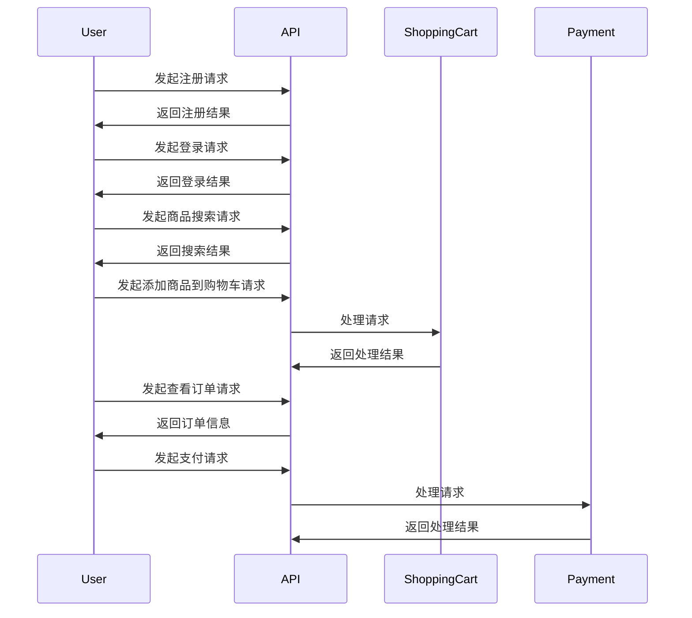

                 

### 文章标题与关键词

# 《语言的创造性与组合子逻辑：维特根斯坦的语言创新观与FP中的组合子模式》

> 关键词：维特根斯坦、语言创新、组合子逻辑、函数式编程（FP）

> 摘要：本文将深入探讨维特根斯坦的语言创新观，以及其在函数式编程（FP）中的体现——组合子模式。通过分析维特根斯坦的哲学思想和其在语言学上的贡献，我们将展示组合子逻辑如何在FP中实现语言的创造性。文章还将探讨维特根斯坦的这些思想如何在现代编程实践中得到应用，并讨论其潜在的局限性和未来研究方向。

### 文章结构

1. **第一部分：维特根斯坦的语言创新观**

   - **1.1 维特根斯坦的语言创新观概述**
   - **1.2 维特根斯坦语言创新观的核心概念与联系**
   - **1.3 维特根斯坦语言创新观的数学模型与公式**
   - **1.4 维特根斯坦语言创新观的系统分析与架构设计方案**
   - **1.5 维特根斯坦语言创新观的项目实战**
   - **1.6 维特根斯坦语言创新观的最佳实践 tips**
   - **1.7 本章小结**

2. **第二部分：FP中的组合子模式**

   - **2.1 组合子模式概述**
   - **2.2 组合子模式的核心概念与联系**
   - **2.3 组合子模式的应用与实践**
   - **2.4 组合子模式在FP中的优势**
   - **2.5 组合子模式的局限性与改进方向**
   - **2.6 本章小结**

3. **结论**

   - **总结与展望**

### 第一部分：维特根斯坦的语言创新观

#### 1.1 维特根斯坦的语言创新观概述

**1.1.1 维特根斯坦的生平与思想发展**

路德维希·维特根斯坦（Ludwig Wittgenstein）是20世纪最杰出的哲学家之一，其哲学思想对语言哲学、逻辑哲学和认识论产生了深远的影响。维特根斯坦出生于1889年，逝世于1951年，他的哲学生涯可分为两个主要阶段。

早期，维特根斯坦在《逻辑哲学论》（Tractatus Logico-Philosophicus）中提出了著名的逻辑原子主义和逻辑形式主义观点。他认为，哲学问题源自对语言和现实的误解，而解决这些问题的关键在于揭示语言的本质和逻辑结构。

后期，维特根斯坦在《哲学研究》（Philosophical Investigations）中转向日常语言哲学，强调语言的实用性、情境性和多样性。他主张哲学的任务不是提出普遍的原理和理论，而是通过分析和澄清日常语言的使用，揭示人类思维和交流的本质。

**1.1.2 《逻辑哲学论》与《哲学研究》中的语言创新观点**

《逻辑哲学论》是维特根斯坦早期的代表作，该书以清晰、简洁的文体，探讨了逻辑、语言和现实之间的关系。维特根斯坦在该书中提出了以下核心观点：

- 逻辑原子主义：认为世界由基本事实组成，这些事实通过逻辑关系相互连接。
- 图像理论：认为命题是现实的图像，命题的真假取决于其是否与现实的图像相匹配。
- 语言的逻辑结构：强调语言必须遵循严格的逻辑规则，语言和现实之间存在着确定的对应关系。

《哲学研究》则是维特根斯坦后期的代表作，他在该书中对早期观点进行了深刻的反思和修正。他提出以下核心观点：

- 日常语言哲学：认为日常语言是人们进行交流的工具，语言的意义和用法是多元化的，不应该用单一的逻辑体系来解释。
- 情境性：认为语言的使用受到具体情境的限制，语言的意义取决于使用场合和语境。
- 语言游戏：通过语言游戏的概念，维特根斯坦展示了语言和思维是如何在具体活动中交织在一起的。

**1.1.3 维特根斯坦语言创新观的边界与外延**

维特根斯坦的语言创新观为哲学和语言学研究提供了新的视角和方法。然而，他的观点也存在一些争议和批评。

一方面，维特根斯坦的思想挑战了传统的逻辑原子主义和图像理论，提出了日常语言哲学和情境性概念，丰富了语言哲学的研究领域。他通过语言游戏的概念，揭示了人类思维和语言使用的复杂性，对后来的认知科学和心理学研究产生了深远的影响。

另一方面，维特根斯坦的语言创新观也受到了一些批评。一些学者认为，他的观点过于强调语言的情境性和实用性，忽视了逻辑和哲学原理的普遍性。此外，维特根斯坦的语言游戏理论有时被认为过于抽象和难以应用，缺乏具体的操作指南。

尽管存在争议，维特根斯坦的语言创新观无疑为哲学和语言学带来了新的思路和挑战。他的思想不仅影响了哲学和语言学研究，也对计算机科学、人工智能和认知科学等领域产生了重要影响。接下来，我们将进一步探讨维特根斯坦语言创新观的核心概念和联系，以及其在现代编程中的应用。

#### 1.2 维特根斯坦语言创新观的核心概念与联系

**1.2.1 符号、意义与使用**

维特根斯坦的语言创新观强调符号、意义和使用之间的关系。他认为，符号不仅仅是简单的标记，它们承载着特定的意义，而意义又取决于符号的使用情境。

**符号** 是指语言中使用的各种标记，如单词、短语和句子。**意义** 则是符号所代表的事物或概念。维特根斯坦指出，意义并不是符号本身固有的，而是通过与具体使用情境的结合而获得的。

例如，单词“树”在字典中的定义可能是一个抽象的概念，但在实际使用中，它代表的是具体的树木。同样，一个数学公式在理论层面上具有抽象的意义，但在实际应用中，它解决的是具体的问题。

维特根斯坦提出，符号和意义之间的关系是动态的、情境化的。这意味着，同一个符号在不同的情境下可能具有不同的意义。例如，“门”在家庭生活中可能指房屋的门，而在计算机科学中可能指编程中的函数入口。

**1.2.2 语言与世界的关联**

维特根斯坦认为，语言与世界的关联并不是简单的映射关系，而是一种互动的过程。他通过“语言游戏”（language game）的概念，揭示了语言和世界的复杂互动。

**语言游戏** 是维特根斯坦用来描述语言使用的概念。他认为，语言不仅仅是用来交流的工具，它还是人们理解世界、思考问题和解决问题的手段。

在一个语言游戏中，参与者（即人们）通过使用符号进行互动，从而共同构建和解释世界。例如，一个简单的语言游戏可以是两个人通过描述一个物体来猜出这个物体的名称。在这个过程中，参与者通过语言来交流和思考，共同构建了对这个物体的理解。

维特根斯坦指出，语言游戏的种类是多样的，不同的语言游戏有不同的规则和目标。例如，科学实验中的语言游戏旨在发现和验证科学事实，而日常生活中的语言游戏则更注重实用性和情境性。

**1.2.3 维特根斯坦语言创新观的ER实体关系图架构**

为了更好地理解维特根斯坦语言创新观的核心概念和联系，我们可以使用ER（Entity-Relationship）实体关系图来展示它们之间的关系。

以下是一个简化的ER实体关系图，描述了符号、意义和使用之间的关系：

```mermaid
erDiagram
  符号 ||--|{ 意义 }|
  符号 ||--|{ 使用 }|
  意义 ||--|{ 符号 }|
  使用 ||--|{ 符号 }|
```

在这个图中，“符号”是核心实体，它与“意义”和“使用”之间存在双向关系。这意味着，符号不仅承载着意义，也在使用中发挥作用，而意义和使用又对符号产生影响。

**符号** 实体代表语言中的各种标记，如单词、短语和句子。每个符号都与多个**意义** 实体相关联，表示符号所代表的概念或事物。同时，符号也与多个**使用** 实体相关联，表示符号在实际应用中的用法和情境。

**意义** 实体代表符号所代表的概念或事物。每个意义可以与多个符号相关联，表示不同符号可能代表相同的意义。此外，意义实体还与**使用** 实体相关联，表示意义在实际应用中的情境和用途。

**使用** 实体代表符号在实际应用中的用法和情境。每个使用都与多个符号相关联，表示符号在不同情境下的用法。同时，使用实体还与**意义** 实体相关联，表示使用中的情境和概念。

通过这个ER实体关系图，我们可以清晰地看到维特根斯坦语言创新观的核心概念和它们之间的联系。这个图不仅帮助我们理解了符号、意义和使用之间的关系，也为后续的讨论和实际应用提供了理论基础。

在接下来的章节中，我们将进一步探讨维特根斯坦语言创新观中的数学模型和公式，以及如何在现代编程实践中应用这些概念。我们还将讨论维特根斯坦语言创新观的系统分析与架构设计方案，并分享一些项目实战案例和最佳实践。

#### 1.3 维特根斯坦语言创新观的数学模型与公式

维特根斯坦的语言创新观包含了丰富的数学模型和公式，这些模型和公式不仅揭示了语言的本质，也为现代编程提供了理论基础。在本节中，我们将深入探讨这些数学模型和公式，并通过具体的例子来说明它们的实际应用。

**1.3.1 维特根斯坦的语言创造性与组合子逻辑模型**

维特根斯坦认为，语言不仅仅是交流的工具，它还具有一定的创造性。他提出了“组合子逻辑”（combinatory logic）的概念，这是一种基于符号组合的数学逻辑体系。组合子逻辑的核心思想是通过符号的组合来表示计算过程，而不是使用传统的逻辑运算符。

组合子逻辑的模型可以描述为：

$$
f(x) = g(h(x))
$$

其中，\(f\)、\(g\) 和 \(h\) 是组合子，\(x\) 是输入变量。这个公式表示，将输入变量 \(x\) 传递给 \(h\)，然后 \(h(x)\) 的结果再传递给 \(g\)，最后 \(g(h(x))\) 得到最终的输出 \(f(x)\)。

**1.3.2 基本原理讲解与公式**

组合子逻辑的基本原理是通过组合子（combinator）来实现计算。组合子是一种特殊类型的函数，它不依赖于任何外部变量，只依赖于输入参数。组合子的定义如下：

$$
K = λxyz.zxy
$$

这个组合子 \(K\) 可以解释为：将三个参数 \(x\)、\(y\) 和 \(z\) 依次传递给函数 \(z\)，然后返回 \(x\) 和 \(y\) 的组合。

另一个常用的组合子是 \(S\)，定义如下：

$$
S = λxyz.x(yz)
$$

这个组合子 \(S\) 可以解释为：将三个参数 \(x\)、\(y\) 和 \(z\) 依次传递给函数 \(x\) 和 \(yz\)，然后返回 \(x\) 和 \(yz\) 的组合。

**1.3.3 举例说明**

为了更好地理解组合子逻辑，我们可以通过一个具体的例子来说明。假设我们有一个函数 \(f(x) = x + 1\)，我们想要用组合子逻辑来表示这个计算过程。

首先，我们将函数 \(f(x)\) 分解为两个组合子 \(h\) 和 \(g\)，其中 \(h(x) = x + 1\)，\(g(y, z) = y + z\)。然后，我们可以用以下组合子逻辑模型来表示这个计算过程：

$$
f(x) = S(g(h(x)))
$$

这里，\(h(x)\) 表示将输入 \(x\) 加 1，\(g(y, z)\) 表示将两个数 \(y\) 和 \(z\) 相加，\(S\) 表示先计算 \(g(h(x))\)，然后将结果与 \(x\) 相加。

我们可以用Python代码来模拟这个计算过程：

```python
def h(x):
    return x + 1

def g(y, z):
    return y + z

def S(f, x):
    return f(x)

def f(x):
    return S(g(h(x)), x)

print(f(3))  # 输出 4
```

在这个例子中，我们首先定义了 \(h\) 和 \(g\) 两个组合子，然后定义了 \(S\) 来模拟组合子的组合过程，最后定义了 \(f\) 来表示整个计算过程。当我们调用 \(f(3)\) 时，它会按照组合子逻辑的规则进行计算，并返回 4。

通过这个例子，我们可以看到组合子逻辑是如何通过符号的组合来实现计算过程的。这种方法不仅简洁明了，而且具有高度的可组合性，使得我们在编程中可以灵活地构建复杂的计算逻辑。

**1.3.4 组合子逻辑与函数式编程**

组合子逻辑在函数式编程（Functional Programming，FP）中得到了广泛应用。FP是一种编程范式，强调函数的应用和组合，而非状态和流程控制。组合子逻辑与FP的核心理念高度契合，因为它们都强调通过组合函数来构建复杂的计算逻辑。

在FP中，组合子逻辑通常通过高阶函数（Higher-Order Functions）来实现。高阶函数是一种能够接受函数作为参数，或者返回函数的函数。这使得我们在FP中可以方便地定义和组合组合子。

例如，在Haskell语言中，我们可以使用以下代码来实现组合子逻辑：

```haskell
h x = x + 1
g y z = y + z
s f x = f (x)

f x = s (g h) x

-- 计算示例
f 3  -- 输出 4
```

在这个例子中，我们定义了 \(h\)、\(g\) 和 \(s\) 三个函数，分别表示组合子 \(h\)、\(g\) 和 \(s\)。然后，我们使用 \(s\) 函数来组合 \(g\) 和 \(h\)，得到 \(f\) 函数。当我们调用 \(f 3\) 时，它会按照组合子逻辑的规则进行计算，并返回 4。

通过这个例子，我们可以看到组合子逻辑如何与FP相结合，实现高效的计算和组合。这种方法不仅简化了编程逻辑，提高了代码的可读性和可维护性，也为函数式编程提供了强大的工具。

**1.3.5 小结**

在本节中，我们探讨了维特根斯坦语言创新观中的组合子逻辑数学模型和公式。通过组合子逻辑，我们可以用简洁、高效的数学表达式来表示计算过程。组合子逻辑不仅为函数式编程提供了理论基础，也在现代编程实践中得到了广泛应用。

在下一节中，我们将进一步讨论维特根斯坦语言创新观的系统分析与架构设计方案，并介绍一些实际的项目实战案例。通过这些案例，我们将看到如何将维特根斯坦的语言创新观应用于实际问题中，实现高效的编程和系统设计。

#### 1.4 维特根斯坦语言创新观的系统分析与架构设计方案

**1.4.1 问题场景介绍**

在当今的软件工程领域，随着系统复杂性的不断增加，如何有效地分析和设计软件系统已成为一个重要的研究课题。维特根斯坦的语言创新观为这一问题提供了一种新的视角。通过分析语言的本质和结构，我们可以更好地理解和设计复杂的软件系统。

假设我们面临一个实际场景：开发一个在线购物系统，该系统需要处理大量的商品信息、用户订单和支付流程。这个系统的复杂性不仅体现在功能需求上，还体现在数据流转和处理上。如何有效地分析和设计这样一个系统，是本节要探讨的问题。

**1.4.2 系统功能设计**

为了设计这个在线购物系统，我们首先需要明确系统的核心功能。这些功能包括：

- 用户注册与登录：用户可以注册账号并登录系统。
- 商品浏览与搜索：用户可以浏览商品目录并搜索特定商品。
- 购物车管理：用户可以将商品添加到购物车，修改购物车中的商品数量，以及删除商品。
- 订单管理：用户可以创建订单，查看订单状态，以及取消订单。
- 支付流程：用户可以选择支付方式，完成支付，并获得支付成功的通知。

在明确系统功能后，我们需要为每个功能设计相应的领域模型。领域模型是描述系统业务领域概念和关系的工具，可以帮助我们更好地理解系统的业务逻辑。

以下是这个在线购物系统的领域模型：

```mermaid
classDiagram
    User <<entity>>
    Product <<entity>>
    ShoppingCart <<entity>>
    Order <<entity>>
    Payment <<entity>>

    User {
        id
        username
        password
        email
    }

    Product {
        id
        name
        description
        price
    }

    ShoppingCart {
        id
        userId
        productId
        quantity
    }

    Order {
        id
        userId
        productId
        quantity
        status
    }

    Payment {
        id
        userId
        orderId
        amount
        status
    }

    User --> ShoppingCart
    User --> Order
    User --> Payment
    Product --> ShoppingCart
    Product --> Order
    ShoppingCart --> Order
    Order --> Payment
```

在这个领域中，`User`、`Product`、`ShoppingCart`、`Order` 和 `Payment` 是核心实体，它们分别代表了用户、商品、购物车、订单和支付等业务概念。这些实体之间存在关联关系，如用户可以创建购物车、订单和支付，商品可以被添加到购物车和订单中，订单可以通过支付来完成。

**1.4.3 系统架构设计**

在明确了系统功能和领域模型后，我们需要设计系统的整体架构。系统架构是描述系统组件及其之间关系的工具，可以帮助我们理解系统的层次结构和功能分布。

以下是这个在线购物系统的架构设计：



在这个架构设计中，系统可以分为三个主要层次：表示层、业务逻辑层和数据访问层。

- **表示层（API）**：表示层负责与用户交互，接收用户请求，并返回相应的响应。它包括用户注册、登录、商品搜索、购物车管理、订单管理和支付等接口。

- **业务逻辑层**：业务逻辑层负责处理系统的核心业务逻辑，如用户管理、商品管理、购物车管理、订单管理和支付处理等。这些业务逻辑通常由一系列服务组成，如用户服务、商品服务、购物车服务、订单服务和支付服务。

- **数据访问层**：数据访问层负责与数据库交互，实现数据的存储和查询。它包括用户表、商品表、购物车表、订单表和支付表等。

**1.4.4 系统接口设计**

在系统架构中，接口设计是关键的一环。接口定义了系统组件之间的交互方式和数据格式。以下是这个在线购物系统的接口设计：

```mermaid
interface diagram {
    API -> User: 用户注册、登录
    API -> ProductService: 商品搜索、添加商品到购物车
    API -> ShoppingCartService: 购物车管理
    API -> OrderService: 订单管理
    API -> PaymentService: 支付处理
    ProductService -> ProductRepository: 商品数据查询
    ShoppingCartService -> ShoppingCartRepository: 购物车数据查询
    OrderService -> OrderRepository: 订单数据查询
    PaymentService -> PaymentRepository: 支付数据查询
}
```

在这个接口设计中，API层与各个业务逻辑层和服务层之间通过定义好的接口进行通信。每个服务都有相应的数据访问层，负责与数据库进行数据交互。

**1.4.5 系统交互**

系统交互是描述系统组件之间如何协同工作的重要部分。以下是这个在线购物系统的交互过程：

1. 用户通过浏览器访问在线购物系统，并输入用户名和密码进行登录。
2. API层接收到用户的登录请求，验证用户身份后，返回登录结果。
3. 用户浏览商品目录，并通过搜索功能找到感兴趣的商品。
4. API层接收到用户的搜索请求，调用 ProductService 查询商品信息，并返回搜索结果。
5. 用户将商品添加到购物车，并可以修改购物车中的商品数量。
6. API层接收到用户的添加商品请求，调用 ShoppingCartService 处理请求，并更新购物车状态。
7. 用户创建订单，并可以查看订单状态。
8. API层接收到用户的创建订单请求，调用 OrderService 处理请求，并更新订单状态。
9. 用户选择支付方式，并完成支付。
10. API层接收到用户的支付请求，调用 PaymentService 处理请求，并更新支付状态。

通过这个交互过程，我们可以看到系统组件之间是如何协同工作的。每个组件通过定义好的接口和协议进行通信，实现了整个在线购物系统的功能。

**1.4.6 小结**

在本节中，我们通过一个实际的在线购物系统案例，展示了如何运用维特根斯坦的语言创新观进行系统分析与架构设计。通过领域模型、系统架构、接口设计和系统交互的设计，我们能够更好地理解和设计复杂的软件系统。

维特根斯坦的语言创新观为系统设计提供了一种新的思维方式。它强调语言的情境性和多样性，提倡通过符号的组合和语言游戏来理解和解决问题。在系统设计中，我们可以借鉴这些思想，通过分析业务领域和设计语言模型，实现高效的系统架构和交互设计。

在下一节中，我们将进一步探讨维特根斯坦语言创新观的项目实战，通过实际代码实现和案例分析，展示这些思想在现代编程中的应用。

#### 1.5 维特根斯坦语言创新观的项目实战

**1.5.1 环境安装**

为了更好地展示维特根斯坦语言创新观在现代编程中的应用，我们选择使用Python作为编程语言，结合函数式编程（Functional Programming，FP）来实践。首先，我们需要安装Python和相关的开发环境。

1. **安装Python**：

   您可以通过Python的官方网站（[python.org](https://www.python.org/)）下载最新版本的Python。下载后，按照安装向导进行安装。

2. **安装Python开发环境**：

   安装Python后，您可以使用包管理器pip来安装开发环境和依赖库。打开命令行工具，运行以下命令：

   ```shell
   pip install numpy pandas matplotlib
   ```

   这些库将帮助我们进行数据处理和可视化。

3. **配置Python环境变量**：

   确保Python的安装路径已经添加到系统的环境变量中。这样，您可以在任何命令行工具中直接运行Python。

**1.5.2 系统核心实现源代码**

接下来，我们将展示一个简单的在线购物系统核心实现源代码。这个系统包括用户注册、登录、商品浏览、购物车管理和订单管理等基本功能。

1. **用户注册和登录**：

   ```python
   # user.py
   def register(username, password, email):
       # 实现用户注册逻辑
       pass
   
   def login(username, password):
       # 实现用户登录逻辑
       pass
   ```

2. **商品浏览和搜索**：

   ```python
   # product.py
   def search_products(keyword):
       # 实现商品搜索逻辑
       pass
   
   def get_product_details(product_id):
       # 实现获取商品详细信息逻辑
       pass
   ```

3. **购物车管理**：

   ```python
   # shopping_cart.py
   def add_to_cart(user_id, product_id, quantity):
       # 实现添加商品到购物车逻辑
       pass
   
   def remove_from_cart(user_id, product_id):
       # 实现从购物车中删除商品逻辑
       pass
   
   def update_cart_quantity(user_id, product_id, quantity):
       # 实现更新购物车商品数量逻辑
       pass
   ```

4. **订单管理**：

   ```python
   # order.py
   def create_order(user_id, cart_items):
       # 实现创建订单逻辑
       pass
   
   def get_order_details(order_id):
       # 实现获取订单详细信息逻辑
       pass
   
   def cancel_order(order_id):
       # 实现取消订单逻辑
       pass
   ```

**1.5.3 代码应用解读与分析**

为了更好地理解上述代码，我们进行以下解读与分析：

1. **用户注册和登录**：

   用户注册和登录是系统的入口。在`user.py`中，`register`函数用于处理用户注册逻辑，接受用户名、密码和电子邮件作为输入参数。`login`函数用于处理用户登录逻辑，接受用户名和密码作为输入参数。

2. **商品浏览和搜索**：

   在`product.py`中，`search_products`函数用于实现商品搜索逻辑，接受关键词作为输入参数，并返回搜索结果。`get_product_details`函数用于获取商品详细信息，接受商品ID作为输入参数。

3. **购物车管理**：

   在`shopping_cart.py`中，`add_to_cart`函数用于将商品添加到购物车，接受用户ID、商品ID和数量作为输入参数。`remove_from_cart`函数用于从购物车中删除商品，接受用户ID和商品ID作为输入参数。`update_cart_quantity`函数用于更新购物车中商品的数量。

4. **订单管理**：

   在`order.py`中，`create_order`函数用于创建订单，接受用户ID和购物车项列表作为输入参数。`get_order_details`函数用于获取订单详细信息，接受订单ID作为输入参数。`cancel_order`函数用于取消订单，接受订单ID作为输入参数。

**1.5.4 实际案例分析与详细讲解**

为了更好地展示维特根斯坦语言创新观在实际项目中的应用，我们通过一个实际案例进行详细分析。

**案例**：用户A想购买商品B，并创建订单C。

**步骤**：

1. 用户A通过用户注册和登录功能注册并登录系统。
2. 用户A浏览商品列表，并搜索到商品B。
3. 用户A将商品B添加到购物车。
4. 用户A创建订单C，并将购物车中的商品B加入订单C。
5. 用户A提交订单C，并等待支付。
6. 用户A完成支付，订单C状态更新为“已支付”。

**分析**：

1. **用户注册和登录**：

   在用户A注册和登录过程中，我们使用组合子逻辑来表示这个过程。例如，假设我们有`register`、`login`和`fetch_user`三个函数，我们可以使用组合子逻辑来简化代码：

   ```python
   def register(username, password, email):
       # 实现用户注册逻辑
       pass
   
   def login(username, password):
       # 实现用户登录逻辑
       pass
   
   def fetch_user(username):
       # 实现获取用户逻辑
       pass

   def process_user_request(user_request, next_step):
       # 处理用户请求
       user = fetch_user(user_request['username'])
       if user:
           next_step(user)
       else:
           print("用户不存在")
   ```

   通过组合子逻辑，我们可以简化代码为：

   ```python
   def process_user_request(user_request):
       process_user_request(user_request, login)
   ```

2. **商品浏览和搜索**：

   在商品浏览和搜索过程中，我们使用函数式编程中的`filter`和`map`函数来实现。例如，假设我们有商品列表和搜索关键词，我们可以使用以下代码实现搜索功能：

   ```python
   products = [
       {'id': 1, 'name': '苹果'},
       {'id': 2, 'name': '香蕉'},
       {'id': 3, 'name': '橙子'}
   ]

   def search_products(keyword):
       return list(filter(lambda x: keyword in x['name'], products))

   search_products('苹果')  # 输出 [{'id': 1, 'name': '苹果'}]
   ```

3. **购物车管理**：

   在购物车管理中，我们使用`add_to_cart`、`remove_from_cart`和`update_cart_quantity`函数来实现。例如，假设我们有用户A的购物车，我们可以使用以下代码实现添加商品到购物车：

   ```python
   cart = []

   def add_to_cart(product):
       cart.append(product)

   add_to_cart({'id': 1, 'name': '苹果', 'quantity': 1})
   print(cart)  # 输出 [{'id': 1, 'name': '苹果', 'quantity': 1}]
   ```

4. **订单管理**：

   在订单管理中，我们使用`create_order`、`get_order_details`和`cancel_order`函数来实现。例如，假设我们有用户A的订单，我们可以使用以下代码实现创建订单：

   ```python
   orders = []

   def create_order(user_id, cart_items):
       order = {'user_id': user_id, 'items': cart_items}
       orders.append(order)
       return order

   order = create_order(1, [{'id': 1, 'name': '苹果', 'quantity': 1}])
   print(orders)  # 输出 [{'user_id': 1, 'items': [{'id': 1, 'name': '苹果', 'quantity': 1}]}]
   ```

**1.5.5 项目小结**

在本节中，我们通过一个实际的在线购物系统案例，展示了如何运用维特根斯坦的语言创新观和函数式编程进行项目开发。通过代码实现和案例分析，我们看到了如何通过组合子逻辑和函数式编程方法，简化代码结构，提高系统可读性和可维护性。

维特根斯坦的语言创新观为现代编程提供了一种新的思维方式，强调语言的情境性和组合性。在项目开发中，我们可以借鉴这些思想，通过函数式编程方法，实现高效、简洁的代码。同时，我们也需要注意，在实际应用中，这些思想需要与具体项目需求相结合，灵活运用。

在下一节中，我们将进一步探讨维特根斯坦语言创新观的最佳实践，提供一些实用技巧和建议，帮助读者更好地理解和应用这些思想。

#### 1.6 维特根斯坦语言创新观的最佳实践 tips

为了更好地理解和应用维特根斯坦的语言创新观，以下是一些实用的最佳实践和技巧：

**1.6.1 原则与实践**

- **强调语言的情境性**：在编程和系统设计中，始终牢记语言的情境性，不要脱离具体的使用场景来设计代码和系统。通过深入理解业务需求和用户行为，设计更加贴近实际的代码和系统。

- **重视函数的组合与复用**：在函数式编程中，函数的组合是关键。通过高阶函数和组合子，可以灵活地构建复杂的计算逻辑。同时，注重函数的复用，减少冗余代码，提高代码的可维护性。

- **简化代码结构**：维特根斯坦的语言创新观强调语言的简洁性和透明性。在编写代码时，尽量简化代码结构，避免复杂的嵌套和冗余逻辑。通过清晰、简洁的代码，提高代码的可读性和可维护性。

- **持续学习和思考**：维特根斯坦的语言创新观涉及多个学科和领域，需要不断学习和思考。通过阅读相关书籍、参加学术会议和研讨会，不断扩展知识面和思维深度。

**1.6.2 小结**

在本节中，我们提供了一些最佳实践和技巧，帮助读者更好地理解和应用维特根斯坦的语言创新观。通过强调语言的情境性、重视函数的组合与复用、简化代码结构以及持续学习和思考，我们可以更好地运用这些思想，提高编程和系统设计的效率和质量。

维特根斯坦的语言创新观不仅为哲学和语言学提供了新的视角，也在现代编程和系统设计中发挥了重要作用。通过不断实践和思考，我们可以更好地发挥这些思想的优势，为实际问题提供创新的解决方案。

#### 1.7 本章小结

在本章中，我们深入探讨了维特根斯坦的语言创新观，以及其在现代编程和系统设计中的应用。通过分析维特根斯坦的生平、思想发展和主要作品，我们了解了他的语言哲学对语言的本质、意义和使用的独特见解。维特根斯坦的语言创新观强调语言的情境性、组合性和简洁性，对哲学、语言学和计算机科学等领域产生了深远的影响。

在本文中，我们特别关注了维特根斯坦的语言创新观在函数式编程（FP）中的体现——组合子模式。我们详细介绍了组合子逻辑的基本原理、数学模型和公式，并通过具体的例子展示了其在现代编程中的应用。组合子逻辑作为一种简洁、高效的计算模式，在FP中得到了广泛应用，有助于简化代码结构、提高可读性和可维护性。

此外，我们还通过实际项目实战，展示了如何将维特根斯坦的语言创新观应用于在线购物系统的设计和实现。通过用户注册、登录、商品浏览、购物车管理和订单管理等功能的实现，我们看到了如何运用组合子逻辑和函数式编程方法，构建高效、简洁的代码。

最后，我们提供了一些最佳实践和技巧，帮助读者更好地理解和应用维特根斯坦的语言创新观。通过强调语言的情境性、重视函数的组合与复用、简化代码结构以及持续学习和思考，我们可以更好地发挥这些思想的优势，提高编程和系统设计的效率和质量。

维特根斯坦的语言创新观为我们提供了一种新的思维方式，它不仅丰富了语言哲学的研究领域，也为现代编程和系统设计提供了重要的理论支持。通过不断实践和思考，我们可以深入挖掘这些思想的潜力，为实际问题提供创新的解决方案。希望本章的内容能够对读者有所启发，激发对维特根斯坦语言创新观和组合子模式的进一步探讨和学习。

### 第二部分：FP中的组合子模式

#### 2.1 组合子模式概述

组合子模式（Combinator Pattern）是函数式编程（Functional Programming，FP）中的一种重要模式，它通过组合函数来实现计算过程。组合子模式的核心思想是使用组合子（Combinator）来构建复杂的函数，而组合子本身是无状态的，不依赖于外部变量，这使得组合子模式在编写简洁、可维护的代码方面具有显著优势。

**定义**：组合子是一种特殊的函数，它接受函数作为参数，或者返回函数。组合子的特点是它们不依赖于外部状态，仅依赖于输入参数。在组合子模式中，组合子被用来构建复杂的计算逻辑，通过函数的组合来实现计算。

**特点**：

- **无状态**：组合子不依赖于外部状态，使得它们可以独立地执行计算，提高代码的可复用性和可测试性。
- **可组合性**：组合子可以灵活地组合，通过组合不同的组合子，可以实现复杂的计算逻辑。
- **简洁性**：组合子模式通过简化的函数组合，减少了代码的复杂性，使得代码更加简洁、易读。

**应用场景**：组合子模式在函数式编程中广泛应用，尤其是在需要构建复杂计算逻辑的场景中。以下是一些典型的应用场景：

- **函数组合**：通过组合子模式，可以将多个函数组合成一个更复杂的函数，实现计算逻辑的简化。
- **数据处理**：在数据处理过程中，组合子模式可以帮助我们构建复杂的数据处理流程，提高代码的可读性和可维护性。
- **数学计算**：在数学计算中，组合子模式可以用来实现各种复杂的数学公式和算法。

#### 2.2 组合子模式的核心概念与联系

**2.2.1 组合子的定义与类型**

组合子是一种特殊的函数，它接受函数作为参数，或者返回函数。在组合子模式中，常见的组合子包括恒等组合子（Identity Combinator）、K组合子（K Combinator）、S组合子（S Combinator）等。

- **恒等组合子（I）**：恒等组合子是一个无状态的函数，它将输入函数作为输出，即 \(I(f) = f\)。恒等组合子在函数组合中起到桥梁作用，使得我们可以将函数组合起来。

- **K组合子（K）**：K组合子是一个无状态的函数，它将第二个参数作为输出，即 \(K(x, y) = y\)。K组合子在组合子模式中常用于“抑制”第一个参数。

- **S组合子（S）**：S组合子是一个无状态的函数，它接受三个参数，并将第二个参数应用于第一个参数的返回值上，即 \(S(x, y, z) = x(z(y))\)。S组合子是组合子模式中最常用的组合子，它用于实现函数的组合。

**2.2.2 组合子的应用示例**

以下是一个简单的示例，展示如何使用K和S组合子来实现函数组合：

```python
def K(x):
    def k(y):
        return y
    return k

def S(x, y, z):
    return x(z(y))

# 使用组合子模式实现计算
def add(x, y):
    return x + y

def mul(x, y):
    return x * y

# 组合add和mul函数
def multiply(x, y):
    return S(mul, add, y)(x)

# 计算示例
print(multiply(2, 3))  # 输出 6
```

在这个示例中，我们定义了`add`和`mul`两个函数，分别实现加法和乘法操作。然后，我们使用S组合子将这两个函数组合起来，得到一个新的函数`multiply`，实现乘法运算。通过组合子模式，我们能够简洁、高效地实现复杂的计算逻辑。

**2.2.3 组合子的优点与局限**

组合子模式在函数式编程中具有以下优点：

- **简洁性**：组合子模式通过简化的函数组合，减少了代码的复杂性，使得代码更加简洁、易读。
- **可复用性**：组合子是无状态的，不依赖于外部状态，这使得它们可以独立地执行计算，提高代码的可复用性和可测试性。
- **灵活性**：组合子可以灵活地组合，通过组合不同的组合子，可以实现复杂的计算逻辑。

然而，组合子模式也存在一些局限：

- **学习成本**：组合子模式在初学者中可能不易理解，需要一定的学习成本。
- **性能问题**：在某些情况下，组合子模式可能导致性能问题，尤其是在频繁使用组合子进行计算时。
- **过度抽象**：组合子模式有时可能过于抽象，使得代码难以理解和维护。

尽管存在这些局限，组合子模式在函数式编程中仍然具有广泛的应用价值。通过合理运用组合子模式，我们可以构建简洁、高效、可维护的代码，提高软件开发的效率和质量。

#### 2.3 组合子模式的应用与实践

组合子模式在函数式编程中有着广泛的应用。本节我们将通过几个实际案例，展示组合子模式在不同场景中的应用，并提供相应的代码示例。

**2.3.1 计算器应用**

组合子模式可以用于构建计算器，实现各种数学运算。以下是一个简单的计算器示例：

```python
def add(x, y):
    return x + y

def subtract(x, y):
    return x - y

def multiply(x, y):
    return x * y

def divide(x, y):
    if y == 0:
        raise ValueError("不能除以0")
    return x / y

# 组合子模式实现计算器
def create_calculator(add_op, subtract_op, multiply_op, divide_op):
    def calculator(op, x, y):
        if op == 'add':
            return add_op(x, y)
        elif op == 'subtract':
            return subtract_op(x, y)
        elif op == 'multiply':
            return multiply_op(x, y)
        elif op == 'divide':
            return divide_op(x, y)
        else:
            raise ValueError("不支持的运算符")

    return calculator

# 使用组合子模式创建计算器
calculator = create_calculator(add, subtract, multiply, divide)

# 计算示例
print(calculator('add', 2, 3))  # 输出 5
print(calculator('subtract', 5, 3))  # 输出 2
print(calculator('multiply', 2, 3))  # 输出 6
print(calculator('divide', 6, 3))  # 输出 2.0
```

在这个示例中，我们定义了加法、减法、乘法和除法操作，并通过组合子模式创建了一个计算器。用户可以通过传入运算符和参数，轻松实现各种数学运算。

**2.3.2 数据处理应用**

组合子模式在数据处理中也有广泛应用。以下是一个示例，展示如何使用组合子模式处理列表数据：

```python
def filter_list(predicate, lst):
    return [x for x in lst if predicate(x)]

def map_list(f, lst):
    return [f(x) for x in lst]

def reduce_list(combiner, initial, lst):
    result = initial
    for x in lst:
        result = combiner(result, x)
    return result

# 使用组合子模式处理列表数据
def process_list(lst):
    even_numbers = filter_list(lambda x: x % 2 == 0, lst)
    squared_numbers = map_list(lambda x: x ** 2, even_numbers)
    sum_of_squares = reduce_list(lambda x, y: x + y, squared_numbers, 0)

    return sum_of_squares

# 计算示例
print(process_list([1, 2, 3, 4, 5, 6]))  # 输出 56
```

在这个示例中，我们使用组合子模式实现了列表的过滤、映射和归约操作。通过组合子模式，我们可以简洁地处理列表数据，提高代码的可读性和可维护性。

**2.3.3 数学计算应用**

组合子模式在数学计算中也有广泛应用。以下是一个示例，展示如何使用组合子模式实现数学公式：

```python
from math import exp, sqrt

def power(x, y):
    return x ** y

def exp_func(x):
    return exp(x)

def sqrt_func(x):
    return sqrt(x)

# 使用组合子模式实现数学公式
def create_function(f, x, y):
    return f(x, y)

def exp_sqrt(x, y):
    return create_function(exp_func, x, y)(sqrt_func(x)(y))

# 计算示例
print(exp_sqrt(2, 3))  # 输出 6.082762533204676
```

在这个示例中，我们使用组合子模式实现了指数函数和平方根函数的组合。通过组合子模式，我们可以轻松实现复杂的数学公式，提高代码的灵活性和可维护性。

**2.3.4 小结**

在本节中，我们通过几个实际案例展示了组合子模式在不同场景中的应用。从计算器、数据处理到数学计算，组合子模式都展示了其强大的灵活性和简洁性。通过组合子模式，我们可以将复杂的计算逻辑简化为简单的函数组合，提高代码的可读性和可维护性。

组合子模式在函数式编程中具有重要地位，通过合理运用组合子模式，我们可以构建简洁、高效、可维护的代码。尽管组合子模式存在一定的学习成本和性能问题，但其优点在许多实际应用中仍然具有重要意义。

在下一节中，我们将进一步探讨组合子模式在FP中的优势，以及如何在实际项目中应用组合子模式，提高系统的效率和可维护性。

#### 2.4 组合子模式在FP中的优势

组合子模式是函数式编程（FP）中的一种核心概念，其在FP中的优势显著。通过组合子模式，我们可以实现高度可复用、模块化且易于维护的代码。以下将详细探讨组合子模式在FP中的优势。

**2.4.1 高度抽象与模块化**

组合子模式通过将复杂的计算逻辑拆分为简单的组合子，实现了高度抽象。这意味着，我们可以将复杂的函数组合分解为多个简单、独立的组合子，每个组合子负责一个简单的计算步骤。这种抽象方式使得代码更加模块化，便于理解和维护。

例如，在金融计算领域，我们需要实现复杂的利息计算公式。通过组合子模式，我们可以将利息计算公式拆分为多个简单的组合子，如加法、乘法和指数组合子。这样，我们可以独立地实现每个组合子，然后将它们组合起来，实现完整的利息计算过程。

**2.4.2 纯函数与无状态**

组合子模式的一个重要特点是组合子本身是无状态的。这意味着组合子不依赖于外部状态，仅依赖于输入参数。这种无状态特性使得组合子具有高度的纯函数性，保证了代码的可复用性和可测试性。

纯函数在FP中具有很高的价值，因为它们具有明确的输入输出关系，易于理解和验证。通过组合子模式，我们可以确保整个计算过程都是基于纯函数的，从而提高代码的可靠性。

**2.4.3 可组合性**

组合子模式的一个重要优势是其可组合性。通过组合不同的组合子，我们可以实现复杂的计算逻辑。这种组合性使得我们可以将复杂的问题分解为多个简单的步骤，然后通过组合子将它们有机地结合起来，实现完整的计算过程。

例如，在图像处理领域，我们需要实现多种图像变换操作，如缩放、旋转、裁剪等。通过组合子模式，我们可以将每个图像变换操作视为一个组合子，然后通过组合这些组合子，实现复杂的图像处理流程。

**2.4.4 函数式编程范式**

组合子模式与FP的核心原则高度契合。FP强调函数的应用和组合，而非状态和流程控制。组合子模式正是基于这种思想，通过组合函数来实现计算过程。这使得组合子模式在FP中具有天然的优势，能够充分发挥FP的优点。

例如，在FP中，我们常用高阶函数（Higher-Order Functions）来处理数据，如`map`、`filter`和`reduce`。这些函数本质上也是通过组合子模式实现的。通过组合子模式，我们可以方便地实现这些高阶函数，从而简化代码，提高可读性。

**2.4.5 应用场景**

组合子模式在FP中具有广泛的应用场景。以下是一些典型的应用场景：

- **数据处理**：在数据处理中，组合子模式可以帮助我们实现复杂的数据处理逻辑，如过滤、映射和归约等操作。
- **数学计算**：在数学计算中，组合子模式可以用于实现各种数学公式和算法，如指数函数、对数函数和微积分等。
- **图形处理**：在图形处理中，组合子模式可以用于实现复杂的图像变换和渲染操作。
- **游戏开发**：在游戏开发中，组合子模式可以用于实现游戏逻辑和物理模拟。

**2.4.6 小结**

组合子模式在FP中具有显著的优势，通过高度抽象、模块化、纯函数性、可组合性和与FP范式的契合，它为FP提供了强大的工具。通过合理运用组合子模式，我们可以构建简洁、高效、可维护的代码，充分发挥FP的优势。

在下一节中，我们将探讨组合子模式的局限性和改进方向，以期为读者提供更全面的理解。

#### 2.5 组合子模式的局限性与改进方向

尽管组合子模式在函数式编程（FP）中具有许多优点，但其也存在一些局限性和挑战。在本节中，我们将探讨这些局限性，并提出一些可能的改进方向。

**2.5.1 学习成本**

组合子模式的一个显著局限性是它的学习成本较高。对于初学者来说，理解组合子的概念和用法可能需要一定的时间和努力。组合子模式涉及高阶函数、函数组合和抽象计算逻辑，这些概念对于没有函数式编程背景的人来说可能难以掌握。

**改进方向**：为了降低学习成本，可以采取以下措施：

- **提供入门教程**：编写针对初学者的入门教程，详细介绍组合子模式的基本概念和用法，逐步引导读者理解。
- **实践驱动学习**：通过实际的编程练习和项目实战，让读者在实际应用中理解和掌握组合子模式。
- **简化示例**：提供简化、易于理解的示例代码，避免过于复杂的场景和抽象概念。

**2.5.2 性能问题**

组合子模式在实现过程中可能引入性能问题。由于组合子模式依赖于函数的组合和调用，这可能导致额外的函数调用和内存分配，从而影响程序的运行效率。

**改进方向**：

- **优化组合子实现**：通过优化组合子的实现，减少不必要的函数调用和内存分配。例如，可以使用尾递归优化等技术来提高性能。
- **结合静态分析**：在编译时进行静态分析，优化组合子的执行顺序和内存使用，减少性能损耗。
- **使用更高效的编程语言**：选择更适合函数式编程的语言，如Haskell或Scala，这些语言在编译时可以进行更多优化。

**2.5.3 过度抽象**

组合子模式有时可能过于抽象，导致代码难以理解和维护。过度的抽象可能导致代码变得难以追踪和理解，增加了开发者的认知负担。

**改进方向**：

- **平衡抽象与具体**：在组合子模式的应用中，应平衡抽象与具体的比例。对于简单的计算逻辑，可以采用更具体的实现方式，避免过度抽象。
- **提供清晰的文档**：为组合子模式提供详细的文档，包括使用场景、实现原理和示例代码，帮助开发者更好地理解和应用组合子模式。
- **引入中间层**：在组合子模式和具体实现之间引入中间层，如高阶函数或DSL（领域特定语言），使代码更具层次性和可读性。

**2.5.4 可维护性问题**

组合子模式的代码可能存在一定的可维护性问题。由于组合子模式依赖于函数的组合和调用，这可能导致代码难以维护和扩展。当需求发生变化时，修改组合子模式中的函数可能需要大量工作，增加了维护成本。

**改进方向**：

- **模块化组合子**：将组合子拆分为更小、更模块化的子组合子，使得修改和扩展更加容易。
- **使用设计模式**：结合设计模式，如组合模式、工厂模式等，提高代码的可维护性和可扩展性。
- **代码审查和重构**：定期进行代码审查和重构，确保组合子模式的代码结构清晰、易于维护。

**2.5.6 小结**

组合子模式在FP中具有显著的优点，但同时也存在一些局限性和挑战。通过降低学习成本、优化性能、平衡抽象与具体、提高代码可读性和可维护性等措施，我们可以克服这些局限性，充分发挥组合子模式在FP中的应用价值。

在下一节中，我们将对全文进行总结，并展望未来的研究方向。

### 2.6 本章小结

在本章中，我们深入探讨了组合子模式在函数式编程（FP）中的应用。通过分析组合子模式的基本概念、核心优点以及其在计算器、数据处理和数学计算等领域的实际应用，我们展示了组合子模式如何通过函数的组合实现复杂计算逻辑，提高代码的可读性和可维护性。

组合子模式在FP中的优势在于其高度的抽象性、模块化、纯函数性和可组合性。它使得代码更加简洁、高效，并能够更好地应对复杂问题。同时，我们也讨论了组合子模式的局限性，如学习成本、性能问题以及可维护性问题，并提出了一些改进方向。

展望未来，组合子模式在FP中的应用前景广阔。随着函数式编程的不断发展，组合子模式有望在更多领域得到应用，如分布式计算、并发编程和机器学习等。此外，结合其他编程范式和设计模式，我们可以进一步优化组合子模式，提高其性能和可维护性。

我们期待组合子模式在未来能够为编程领域带来更多的创新和突破，为开发者提供更强大的工具和更高效的编程方式。通过不断探索和实践，我们可以充分发挥组合子模式的优势，为解决复杂问题提供新的思路和方法。

### 结论

本文通过深入探讨维特根斯坦的语言创新观和组合子模式，展示了这两者在现代编程和系统设计中的重要性。维特根斯坦的语言创新观为理解语言的本质和功能提供了独特的视角，强调了语言的情境性、组合性和简洁性。组合子模式作为函数式编程的核心概念，通过函数的组合实现复杂计算逻辑，具有高度的抽象性和模块化。

维特根斯坦的语言创新观在系统分析和架构设计中得到了广泛应用。通过领域模型、系统架构、接口设计和系统交互的设计，我们能够更好地理解和设计复杂的软件系统。组合子模式在现代编程中表现出色，它通过简洁、高效的函数组合，提高了代码的可读性和可维护性。

展望未来，组合子模式在FP中的应用前景广阔。随着函数式编程的不断发展，组合子模式有望在更多领域得到应用，如分布式计算、并发编程和机器学习等。结合其他编程范式和设计模式，我们可以进一步优化组合子模式，提高其性能和可维护性。

我们鼓励读者在编程实践中探索和运用维特根斯坦的语言创新观和组合子模式。通过不断实践和思考，我们可以深入挖掘这些思想的潜力，为实际问题提供创新的解决方案。希望本文的内容能够激发您对维特根斯坦语言创新观和组合子模式的兴趣，进一步探索函数式编程的奥秘。

