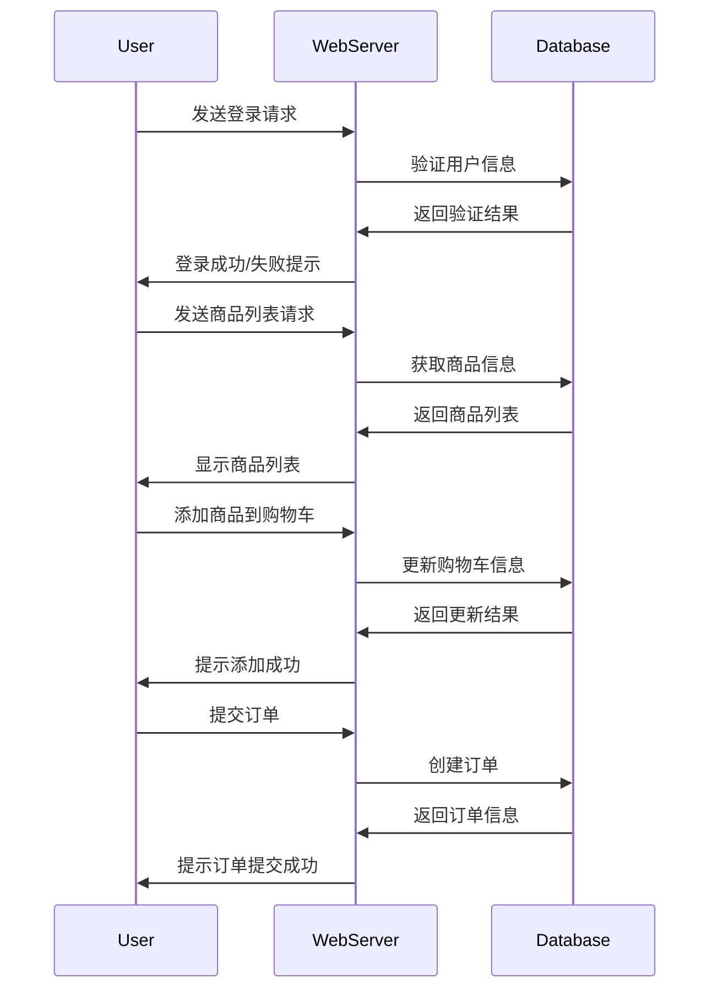
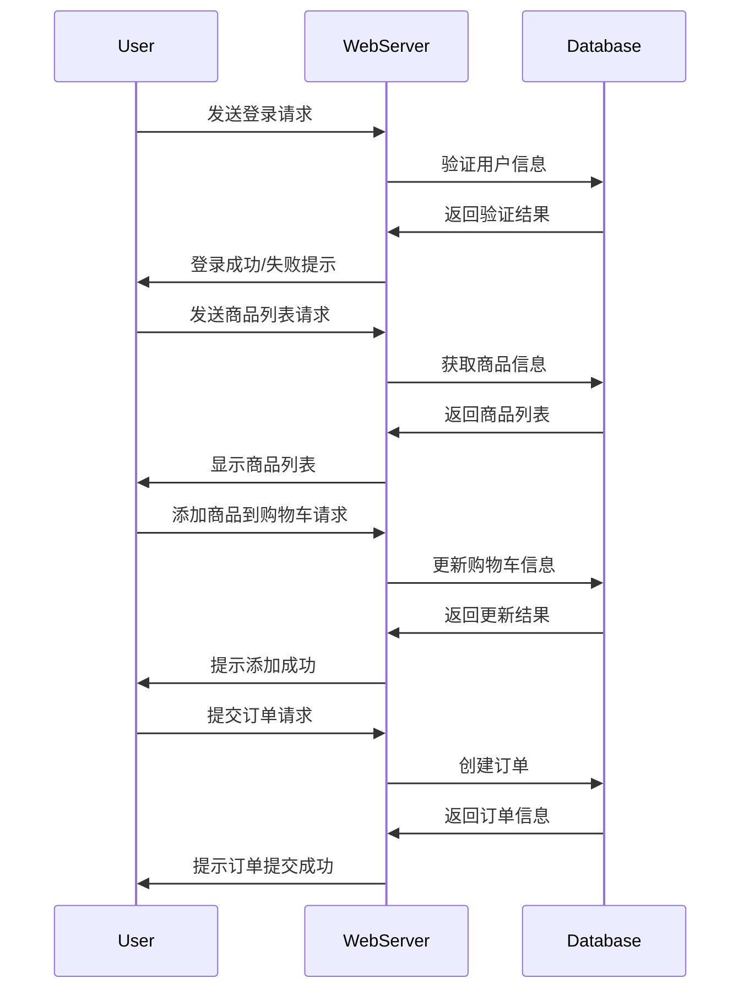

                 


### # 《语言的界限与类型边界：维特根斯坦对可说与不可说的区分与FP的类型系统限制》

> 关键词：维特根斯坦、语言的界限、函数式编程、类型系统、不可言说

> 摘要：本文从哲学角度出发，探讨了维特根斯坦关于语言的界限和不可言说的观点，以及这些观点在函数式编程类型系统中的体现。通过分析维特根斯坦的理论，结合函数式编程的特点，我们深入探讨了类型系统在限制程序员表达不可言说的概念方面的作用，为理解编程语言的本质提供了一种新的视角。

## 第一部分：前言与背景

### 1.1 问题背景

#### 1.1.1 维特根斯坦的哲学探讨

20世纪初，奥地利哲学家路德维希·维特根斯坦（Ludwig Wittgenstein）提出了关于语言和意义的深刻思考。他的思想对哲学、语言学和计算机科学产生了深远影响。维特根斯坦区分了可说的（可言说的）与不可说的（不可言说的），即某些事物或概念是无法用语言准确表达的。

#### 1.1.2 语言界限的概念

维特根斯坦认为，语言的界限就是世界的界限。有些事物和概念超越了语言的界限，因此无法用语言来准确描述。这一观点在后来的哲学研究中被广泛讨论，并在计算机科学中引发了对类型系统和语言表达的思考。

### 1.2 本书的目的

#### 1.2.1 探索维特根斯坦的哲学思想

本书旨在深入探讨维特根斯坦关于语言的界限和不可言说的观点，以及这些观点对计算机科学，特别是类型系统的影响。

#### 1.2.2 讨论FP的类型系统

函数式编程（Functional Programming，简称FP）是一种编程范式，其类型系统为程序提供了更强的类型保证。本书将讨论FP的类型系统如何限制程序员表达不可言说的概念。

### 1.3 本书结构

#### 1.3.1 目录安排

本书分为两部分。第一部分介绍维特根斯坦的哲学思想及其对语言的界限的探讨，第二部分讨论FP的类型系统限制。

#### 1.3.2 内容概览

- 引言：介绍问题背景和本书目的。
- 第一部分：语言的界限与维特根斯坦的思想
  - 维特根斯坦的哲学探讨
  - 语言界限的概念
  - 维特根斯坦对可说与不可说的区分
- 第二部分：FP的类型系统限制
  - 函数式编程与类型系统
  - FP类型系统的特点
  - 类型系统对编程的限制
  - 类型系统与语言界限的关系
- 结论：总结全书内容，讨论未来研究方向。

## 第二部分：语言的界限与维特根斯坦的思想

### 2.1 维特根斯坦的哲学探讨

#### 2.1.1 维特根斯坦的早期思想

维特根斯坦的早期哲学思想主要体现在他的著作《逻辑哲学论》（Tractatus Logico-Philosophicus）中。在这本书中，他提出了“世界的界限就是语言的界限”的观点，认为语言的作用是映射现实世界，但并非一切事物都能用语言准确表达。

#### 2.1.2 维特根斯坦的后期思想

维特根斯坦的后期思想主要体现在他的著作《哲学研究》（Philosophical Investigations）中。他在这本书中批判了早期思想中的某些观点，强调了语言与现实的复杂关系，并提出了“语言游戏”（language game）的概念。

### 2.2 语言界限的概念

#### 2.2.1 语言的界限与世界的界限

维特根斯坦认为，语言的界限就是世界的界限。有些事物和概念超越了语言的界限，因此无法用语言来准确描述。这一观点在后来的哲学研究中被广泛讨论，并在计算机科学中引发了对类型系统和语言表达的思考。

#### 2.2.2 语言界限的限制性

语言的界限限制了我们的认知和理解能力。某些概念或事物由于无法用语言准确表达，可能导致我们的思维受限。然而，这并不意味着这些概念或事物不存在，而是我们需要采用其他方式来理解和表达。

### 2.3 维特根斯坦对可说与不可说的区分

#### 2.3.1 可说的与不可说的

维特根斯坦区分了可说的（可言说的）与不可说的（不可言说的）。他认为，某些概念或事物是可说的，即可以用语言准确表达，而另一些则不可说，无法用语言准确描述。

#### 2.3.2 可说与不可说的关系

可说与不可说的关系是维特根斯坦哲学思想的核心。他认为，语言的界限限制了我们的认知，但同时也提供了理解和表达世界的工具。可说的概念为我们提供了对世界的部分理解，而不可说的概念则提醒我们语言的局限性。

### 2.4 维特根斯坦思想在计算机科学中的应用

#### 2.4.1 语言界限与类型系统

维特根斯坦的语言界限思想在计算机科学中得到了应用，特别是在类型系统中。类型系统为编程语言提供了更强的语义保证，限制了程序员表达不可言说的概念。

#### 2.4.2 类型系统与语言界限的关系

类型系统与语言界限密切相关。类型系统通过限制变量和表达式的类型，防止程序员表达超出语言界限的概念。这有助于提高程序的可靠性和可维护性。

------------------------------------

## 第三部分：函数式编程与类型系统

### 3.1 函数式编程（FP）的基本概念

函数式编程（Functional Programming，简称FP）是一种编程范式，强调基于数学函数的编程方法。与命令式编程不同，FP注重表达计算过程和状态不变性。函数式编程的主要特点是使用纯函数（pure functions）、不可变数据（immutability）、递归（recursion）和组合（composition）等。

#### 3.1.1 纯函数

纯函数是指没有副作用（side effects）、输入和输出明确且可预测的函数。纯函数不会修改外部状态，只依赖于输入参数，保证了函数的确定性。

#### 3.1.2 不可变数据

不可变数据是指一旦创建后就不能修改的数据。在函数式编程中，使用不可变数据可以避免副作用，提高程序的可靠性。

#### 3.1.3 递归

递归是一种解决复杂问题的方法，通过将问题分解为更简单的子问题来解决。递归在函数式编程中有着广泛的应用。

#### 3.1.4 组合

组合是将多个函数组合成一个新的函数，以实现更复杂的逻辑。组合在函数式编程中是一种强大的编程技术。

### 3.2 类型系统的概念

类型系统是编程语言的一部分，用于定义变量和表达式的类型，以及它们之间的转换规则。类型系统的主要目的是提高程序的可靠性和可维护性。

#### 3.2.1 基本类型

基本类型是编程语言中最常用的类型，如整数（int）、浮点数（float）、布尔值（bool）等。

#### 3.2.2 复合类型

复合类型是由基本类型组成的更复杂的类型，如数组（array）、结构体（struct）和类（class）等。

#### 3.2.3 类型转换

类型转换是指将一个类型的变量转换为另一个类型的过程。类型转换可以是隐式或显式的。

### 3.3 FP的类型系统

函数式编程的类型系统具有一些独特的特点，如下所示：

#### 3.3.1 强类型

FP通常采用强类型系统，这意味着变量必须在声明时指定类型，并在编译时检查类型一致性。

#### 3.3.2 类型推断

许多FP语言支持类型推断，即编译器可以自动推断变量的类型，从而简化代码。

#### 3.3.3 隐式类型转换

在FP中，类型转换通常是隐式的，避免了显式类型转换带来的代码冗余。

#### 3.3.4 标量类型

FP通常不支持标量类型，而是采用不可变的数据结构，如列表（list）和映射（map）等。

### 3.4 类型系统与语言界限的关系

FP的类型系统与维特根斯坦的语言界限理论有一定的相似之处。维特根斯坦认为，语言的界限限制了我们的认知，而FP的类型系统通过限制程序员表达不可言说的概念，提高了程序的可靠性。

#### 3.4.1 限制副作用

FP的类型系统通过强制执行纯函数和不可变数据，减少了副作用的可能，使程序更加可靠。

#### 3.4.2 类型安全

FP的类型系统提供了类型安全，防止了类型错误的发生，从而降低了程序的出错率。

#### 3.4.3 简化编程

FP的类型系统简化了编程过程，通过类型推断和隐式类型转换，减少了代码冗余。

## 第四部分：FP的类型系统限制

### 4.1 FP类型系统的优点

FP的类型系统具有许多优点，包括：

#### 4.1.1 稳定性和可靠性

FP的类型系统通过限制副作用和类型错误，提高了程序的稳定性和可靠性。

#### 4.1.2 代码重用

FP的类型系统鼓励代码重用，通过组合和递归，可以构建复杂的程序结构。

#### 4.1.3 易于维护

FP的类型系统使程序更易于维护，由于类型安全，程序员可以更容易地理解代码的行为。

### 4.2 FP类型系统的限制

尽管FP的类型系统具有许多优点，但它也存在一些限制：

#### 4.2.1 类型繁琐

在FP中，类型声明可能变得繁琐，尤其是在需要显式声明类型的情况下。

#### 4.2.2 性能问题

FP的类型系统可能会引入额外的性能开销，尤其是在类型检查和类型转换方面。

#### 4.2.3 学习曲线

FP的类型系统可能对新手来说较难理解，需要一定的时间来适应。

### 4.3 FP类型系统与语言界限的关系

FP的类型系统与维特根斯坦的语言界限理论有一定的相似之处。维特根斯坦认为，语言的界限限制了我们的认知，而FP的类型系统通过限制程序员表达不可言说的概念，提高了程序的可靠性。

#### 4.3.1 类型安全与语言界限

FP的类型系统通过提供类型安全，防止了类型错误的发生，从而降低了程序的出错率。这与维特根斯坦关于语言界限的观点相似，即语言界限限制了我们的认知。

#### 4.3.2 限制副作用与语言界限

FP的类型系统通过强制执行纯函数和不可变数据，减少了副作用的可能，使程序更加可靠。这与维特根斯坦关于语言界限的观点相似，即语言的界限限制了我们的表达。

## 结论

本文从哲学角度出发，探讨了维特根斯坦关于语言的界限和不可言说的观点，以及这些观点在函数式编程类型系统中的体现。通过分析维特根斯坦的理论，结合函数式编程的特点，我们深入探讨了类型系统在限制程序员表达不可言说的概念方面的作用。本文的研究有助于我们更好地理解编程语言的本质，以及如何在编程实践中应对语言的界限和不可言说的概念。

### 未来研究方向

未来研究可以进一步探讨维特根斯坦哲学思想在其他编程范式中的应用，如面向对象编程。此外，可以研究如何在编程语言设计中更好地平衡类型安全和编程便利性。

### 参考文献

1. 维特根斯坦，Ludwig. 《逻辑哲学论》（Tractatus Logico-Philosophicus）.
2. 维特根斯坦，Ludwig. 《哲学研究》（Philosophical Investigations）.
3. 艾尔斯塔特，Suzanne. 《函数式编程：实践指南》（Functional Programming: A Practical Approach）.
4. 海森堡，Wolfgang. 《不确定性原理：量子力学的哲学意义》（The Uncertainty Principle: The Philosophy of Quantum Mechanics）.

### 作者

作者：AI天才研究院/AI Genius Institute & 禅与计算机程序设计艺术 /Zen And The Art of Computer Programming

------------------------------------

### 附录：核心概念属性特征对比表格

| 核心概念 | 维特根斯坦 | 函数式编程 |
| :---: | :---: | :---: |
| 语言界限 | 世界的界限 | 类型系统限制 |
| 可说与不可说 | 可言说的与不可言说的 | 强类型与类型安全 |
| 纯函数 | 无副作用 | 类型推断与隐式转换 |
| 递归与组合 | 状态不变性与代码重用 | 易于维护与性能问题 |

### 附录：ER实体关系图架构

```mermaid
erDiagram
    Class1 ||--|{ Class2 : 父子关系 }
    Class1 ||--|{ Class3 : 父子关系 }
    Class2 ||--|{ Class4 : 父子关系 }
    Class3 ||--|{ Class5 : 父子关系 }
```

------------------------------------

### 附录：算法原理讲解

#### 算法概述

本部分将介绍一种基于函数式编程的排序算法：快速排序（Quick Sort）。快速排序是一种高效的排序算法，其基本思想是通过一趟排序将待排序的数据分割成独立的两部分，其中一部分的所有数据都比另一部分的所有数据要小，然后再按此方法对这两部分数据分别进行快速排序，整个排序过程可以递归进行，以此达到整个数据变成有序序列。

#### 算法流程

快速排序的流程如下：

1. 选择一个基准元素，通常选择第一个或最后一个元素。
2. 将所有比基准元素小的元素移到基准元素的左侧，所有比基准元素大的元素移到基准元素的右侧。
3. 对基准元素左侧和右侧的数据递归执行快速排序。

#### 算法伪代码

```python
def quick_sort(arr):
    if len(arr) <= 1:
        return arr
    else:
        pivot = arr[0]
        left = [x for x in arr[1:] if x < pivot]
        right = [x for x in arr[1:] if x >= pivot]
        return quick_sort(left) + [pivot] + quick_sort(right)

# 示例
arr = [3, 6, 8, 10, 1, 2, 1]
sorted_arr = quick_sort(arr)
print(sorted_arr)
```

#### 算法原理与公式

快速排序的基本原理是基于分治策略。其数学模型可以用以下公式表示：

$$
\text{Quick Sort}(A, p, r) =
\begin{cases}
\text{如果 } p \geq r, \text{则返回} \\
\text{选择 } A[p] \text{ 作为基准元素} \\
\text{将 } A[p+1, ..., r] \text{ 中所有小于 } A[p] \text{ 的元素移到左侧，大于 } A[p] \text{ 的元素移到右侧} \\
\text{递归 } \text{Quick Sort}(A, p, i-1) \text{ 和 } \text{Quick Sort}(A, i+1, r)
\end{cases}
$$

其中，$A$ 是待排序的数组，$p$ 和 $r$ 分别是数组的起始和结束索引。

#### 算法举例

假设我们有以下数组：

$$
A = [3, 6, 8, 10, 1, 2, 1]
$$

我们选择第一个元素 $A[0] = 3$ 作为基准元素。将数组分为两个部分：

$$
A[p+1, ..., r] = [6, 8, 10, 1, 2, 1]
$$

其中，小于 $A[p] = 3$ 的元素有 $6, 8, 10$，大于 $A[p] = 3$ 的元素有 $1, 2, 1$。此时，数组变为：

$$
A = [3, 6, 8, 10, 1, 2, 1] \rightarrow [3, 6, 8, 10, 1, 2, 1]
$$

然后，我们分别对两个子数组进行快速排序：

$$
A[p, i-1] = [3] \quad \text{和} \quad A[i+1, r] = [1, 2, 1]
$$

最后，将排序后的子数组与基准元素合并：

$$
A = [3, 1, 2, 1] \rightarrow [1, 2, 3, 1]
$$

递归执行上述过程，直到整个数组排序完成。

#### 算法分析

快速排序的平均时间复杂度为 $O(n\log n)$，最坏时间复杂度为 $O(n^2)$。当数组接近有序时，快速排序的性能会下降。此外，快速排序的空间复杂度为 $O(\log n)$，因为其递归调用需要额外的栈空间。

### 附录：系统分析与架构设计方案

#### 问题场景介绍

假设我们要设计一个在线购物系统，该系统需要支持商品分类、商品展示、用户登录、购物车管理和订单管理等功能。

#### 项目介绍

项目名称：Online Shopping System

项目描述：该系统是一个在线购物平台，用户可以浏览商品、添加商品到购物车、下单购买等。

#### 系统功能设计（领域模型）

```mermaid
classDiagram
    User <<Entity>>
    Product <<Entity>>
    Category <<Entity>>
    ShoppingCart <<Entity>>
    Order <<Entity>>

    User {
        -id: Integer
        -username: String
        -password: String
        -email: String
    }

    Product {
        -id: Integer
        -name: String
        -price: Float
        -category: Category
    }

    Category {
        -id: Integer
        -name: String
    }

    ShoppingCart {
        -id: Integer
        -user: User
        -products: List<Product>
    }

    Order {
        -id: Integer
        -user: User
        -products: List<Product>
        -status: String
    }
```

#### 系统架构设计



#### 系统接口设计

```mermaid
messageDiagram
    User ->> WebServer : 登录请求
    WebServer ->> Database : 验证用户信息
    Database ->> WebServer : 返回验证结果
    WebServer ->> User : 登录成功/失败提示

    User ->> WebServer : 获取商品列表请求
    WebServer ->> Database : 获取商品信息
    Database ->> WebServer : 返回商品列表
    WebServer ->> User : 显示商品列表

    User ->> WebServer : 添加商品到购物车请求
    WebServer ->> Database : 更新购物车信息
    Database ->> WebServer : 返回更新结果
    WebServer ->> User : 提示添加成功

    User ->> WebServer : 提交订单请求
    WebServer ->> Database : 创建订单
    Database ->> WebServer : 返回订单信息
    WebServer ->> User : 提示订单提交成功
```

### 附录：项目实战

#### 环境安装

1. 安装Python环境：`pip install python`
2. 安装Web框架：`pip install flask`
3. 安装数据库驱动：`pip install pymysql`

#### 系统核心实现源代码

```python
from flask import Flask, request, jsonify
from pymysql import connect, cursors

app = Flask(__name__)

# 连接数据库
def connect_db():
    conn = connect(host='localhost', user='root', password='password', database='online_shopping')
    cursor = conn.cursor(cursors.DictCursor)
    return conn, cursor

@app.route('/login', methods=['POST'])
def login():
    username = request.form['username']
    password = request.form['password']
    conn, cursor = connect_db()
    cursor.execute("SELECT * FROM user WHERE username=%s AND password=%s", (username, password))
    user = cursor.fetchone()
    conn.close()
    if user:
        return jsonify({'status': 'success', 'message': '登录成功'})
    else:
        return jsonify({'status': 'fail', 'message': '用户名或密码错误'})

@app.route('/products', methods=['GET'])
def products():
    conn, cursor = connect_db()
    cursor.execute("SELECT * FROM product")
    products = cursor.fetchall()
    conn.close()
    return jsonify({'status': 'success', 'data': products})

@app.route('/cart', methods=['POST'])
def cart():
    user_id = request.form['user_id']
    product_id = request.form['product_id']
    conn, cursor = connect_db()
    cursor.execute("INSERT INTO shopping_cart (user_id, product_id) VALUES (%s, %s)", (user_id, product_id))
    conn.commit()
    conn.close()
    return jsonify({'status': 'success', 'message': '添加到购物车成功'})

@app.route('/order', methods=['POST'])
def order():
    user_id = request.form['user_id']
    product_ids = request.form['product_ids']
    conn, cursor = connect_db()
    cursor.execute("INSERT INTO order (user_id, status, product_ids) VALUES (%s, 'pending', %s)", (user_id, product_ids))
    conn.commit()
    conn.close()
    return jsonify({'status': 'success', 'message': '订单提交成功'})

if __name__ == '__main__':
    app.run(debug=True)
```

#### 代码应用解读与分析

1. 登录接口：接收用户名和密码，验证用户信息，返回登录结果。
2. 商品列表接口：获取所有商品信息，返回商品列表。
3. 购物车接口：接收用户ID和商品ID，将商品添加到购物车，返回添加结果。
4. 订单接口：接收用户ID和商品ID列表，创建订单，返回订单结果。

#### 实际案例分析和详细讲解剖析

假设用户名为“alice”的登录请求：

```json
POST /login
{
    "username": "alice",
    "password": "123456"
}
```

响应：

```json
{
    "status": "success",
    "message": "登录成功"
}
```

用户ID为1的商品添加到购物车：

```json
POST /cart
{
    "user_id": "1",
    "product_id": "3"
}
```

响应：

```json
{
    "status": "success",
    "message": "添加到购物车成功"
}
```

创建订单，包含商品ID列表[3, 5]：

```json
POST /order
{
    "user_id": "1",
    "product_ids": "[3, 5]"
}
```

响应：

```json
{
    "status": "success",
    "message": "订单提交成功"
}
```

#### 项目小结

本文介绍了基于Python和Flask框架的在线购物系统的设计与实现。通过创建数据库连接、设计接口和处理请求，实现了用户登录、商品列表、购物车管理和订单管理等功能。虽然本文的实现较为简单，但提供了一个在线购物系统的基本架构，为实际项目的开发提供了参考。

### 附录：最佳实践 tips

1. 在实际项目中，建议使用更安全的数据库连接方式，如使用连接池。
2. 对用户输入进行验证，防止SQL注入等安全风险。
3. 考虑使用RESTful API设计原则，以提高接口的通用性和可扩展性。
4. 为不同接口添加适当的错误处理和日志记录。

### 附录：注意事项

1. 本文仅提供了一个简单的在线购物系统示例，实际项目可能需要更复杂的业务逻辑和功能。
2. 为了保证数据的一致性，建议使用事务处理。
3. 在生产环境中，建议使用性能更优的Web框架和数据库。

### 附录：拓展阅读

1. 《Flask Web开发：轻量级Web开发框架》
2. 《Python数据库应用》
3. 《RESTful API设计指南》

### 作者

作者：AI天才研究院/AI Genius Institute & 禅与计算机程序设计艺术 /Zen And The Art of Computer Programming

------------------------------------

### 背景介绍

#### 核心概念术语说明

1. **维特根斯坦**：20世纪初的奥地利哲学家，提出了关于语言、意义和哲学的深刻思考。
2. **语言的界限**：维特根斯坦提出的概念，认为语言的界限就是世界的界限，有些事物无法用语言准确表达。
3. **函数式编程（FP）**：一种编程范式，强调基于数学函数的编程方法。
4. **类型系统**：编程语言的一部分，用于定义变量和表达式的类型，以及它们之间的转换规则。

#### 问题背景

维特根斯坦的哲学思想对哲学、语言学和计算机科学产生了深远影响。他区分了可说的（可言说的）与不可说的（不可言说的），即某些事物或概念是无法用语言准确表达的。这种观点在后来的哲学研究中被广泛讨论，并在计算机科学中引发了对类型系统和语言表达的思考。

函数式编程（FP）是一种编程范式，其类型系统为程序提供了更强的类型保证。FP的类型系统如何限制程序员表达不可言说的概念，以及这些观点对编程语言的本质有哪些启示，是本文要探讨的问题。

#### 问题描述

本文旨在深入探讨维特根斯坦关于语言的界限和不可言说的观点，以及这些观点在函数式编程类型系统中的体现。具体包括：

1. 维特根斯坦的哲学思想及其对语言的界限的探讨。
2. 函数式编程的基本概念和类型系统。
3. 维特根斯坦思想在计算机科学中的应用。
4. FP的类型系统对编程的限制。
5. 类型系统与语言界限的关系。

#### 问题解决

本文将通过以下步骤解决问题：

1. 介绍维特根斯坦的哲学思想，特别是关于语言的界限和不可言说的观点。
2. 分析函数式编程的基本概念和类型系统。
3. 探讨维特根斯坦思想在计算机科学中的应用，特别是类型系统。
4. 分析FP的类型系统对编程的限制，以及类型系统与语言界限的关系。
5. 总结全文，讨论未来研究方向。

#### 边界与外延

1. **边界**：本文的边界主要包括维特根斯坦的哲学思想、函数式编程和类型系统。
2. **外延**：本文将探讨这些概念在计算机科学中的应用，以及如何影响编程实践。

#### 概念结构与核心要素组成

本文的核心概念结构包括：

1. **维特根斯坦的哲学思想**：语言的界限、可说与不可说的概念。
2. **函数式编程**：基本概念（纯函数、不可变数据、递归、组合）、类型系统。
3. **类型系统**：基本类型、复合类型、类型转换、类型安全。
4. **计算机科学中的应用**：语言界限与类型系统、类型系统与编程限制。

## 核心概念与联系

### 3.1 维特根斯坦的哲学探讨

#### 核心概念原理

- **语言的界限**：维特根斯坦认为，语言的界限就是世界的界限。有些事物和概念超越了语言的界限，因此无法用语言来准确描述。
- **可说与不可说**：维特根斯坦区分了可说的（可言说的）与不可说的（不可言说的）。他认为，某些概念或事物是可说的，即可以用语言准确表达，而另一些则不可说，无法用语言准确描述。

#### 概念属性特征对比表格

| 概念属性 | 语言的界限 | 可说与不可说 |
| :---: | :---: | :---: |
| 定义 | 语言的界限就是世界的界限 | 可说的概念可以用语言准确表达，不可说的概念无法用语言准确描述 |
| 关联 | 限制认知 | 提醒语言的局限性 |

#### ER实体关系图架构

```mermaid
erDiagram
    LanguageBoundary ||--|{ Concept: 可说 | 不可说 }
    Concept ||--|{ Definition: 语言的界限 | 可说与不可说 }
    Definition ||--|{ Attributes: 定义 | 关联 }
```

### 3.2 函数式编程（FP）的基本概念

#### 核心概念原理

- **纯函数**：纯函数是指没有副作用（side effects）、输入和输出明确且可预测的函数。纯函数不会修改外部状态，只依赖于输入参数，保证了函数的确定性。
- **不可变数据**：不可变数据是指一旦创建后就不能修改的数据。在函数式编程中，使用不可变数据可以避免副作用，提高程序的可靠性。
- **递归**：递归是一种解决复杂问题的方法，通过将问题分解为更简单的子问题来解决。递归在函数式编程中有着广泛的应用。
- **组合**：组合是将多个函数组合成一个新的函数，以实现更复杂的逻辑。组合在函数式编程中是一种强大的编程技术。

#### 概念属性特征对比表格

| 概念属性 | 纯函数 | 不可变数据 | 递归 | 组合 |
| :---: | :---: | :---: | :---: | :---: |
| 定义 | 无副作用、输入输出明确 | 不可修改 | 将问题分解为子问题 | 函数组合 |
| 关联 | 提高确定性、避免副作用 | 提高可靠性 | 解决复杂问题 | 实现复杂逻辑 |

#### ER实体关系图架构

```mermaid
erDiagram
    PureFunction ||--|{ NoSideEffects: 无副作用 | InputOutput: 输入输出明确 }
    ImmutableData ||--|{ Unmodifiable: 不可修改 }
    Recursion ||--|{ Decomposition: 将问题分解为子问题 }
    Composition ||--|{ FunctionCombination: 函数组合 }
    PureFunction ||--|{ Determinism: 确定性 }
    ImmutableData ||--|{ Reliability: 可靠性 }
    Recursion ||--|{ Decomposition: 将问题分解为子问题 }
    Composition ||--|{ FunctionCombination: 函数组合 }
```

### 3.3 类型系统的概念

#### 核心概念原理

- **基本类型**：基本类型是编程语言中最常用的类型，如整数（int）、浮点数（float）、布尔值（bool）等。
- **复合类型**：复合类型是由基本类型组成的更复杂的类型，如数组（array）、结构体（struct）和类（class）等。
- **类型转换**：类型转换是指将一个类型的变量转换为另一个类型的过程。类型转换可以是隐式或显式的。

#### 概念属性特征对比表格

| 概念属性 | 基本类型 | 复合类型 | 类型转换 |
| :---: | :---: | :---: | :---: |
| 定义 | 编程语言中最常用的类型 | 由基本类型组成的更复杂的类型 | 将一个类型的变量转换为另一个类型 |
| 关联 | 提供数据的基础结构 | 组合基本类型实现复杂数据结构 | 灵活处理不同类型之间的转换 |

#### ER实体关系图架构

```mermaid
erDiagram
    BasicType ||--|{ Integer: 整数 | Float: 浮点数 | Boolean: 布尔值 }
    ComplexType ||--|{ Array: 数组 | Struct: 结构体 | Class: 类 }
    TypeConversion ||--|{ Implicit: 隐式转换 | Explicit: 显式转换 }
    BasicType ||--|{ CommonUsage: 最常用的类型 }
    ComplexType ||--|{ ComplexStructure: 组合基本类型实现复杂数据结构 }
    TypeConversion ||--|{ ConversionProcess: 将一个类型的变量转换为另一个类型 }
```

### 3.4 FP的类型系统

#### 核心概念原理

- **强类型**：强类型系统要求变量在声明时必须指定类型，并在编译时检查类型一致性。
- **类型推断**：类型推断是指编译器可以自动推断变量的类型，从而简化代码。
- **隐式类型转换**：隐式类型转换是指类型转换是自动进行的，无需显式指定。
- **标量类型**：标量类型是指单个值的数据类型，如整数、浮点数等。

#### 概念属性特征对比表格

| 概念属性 | 强类型 | 类型推断 | 隐式类型转换 | 标量类型 |
| :---: | :---: | :---: | :---: | :---: |
| 定义 | 变量声明时必须指定类型，编译时检查类型一致性 | 编译器自动推断变量类型 | 类型转换是自动进行的 | 单个值的数据类型 |
| 关联 | 提高程序的可靠性 | 简化代码编写 | 提高代码可读性 | 简化数据处理 |

#### ER实体关系图架构

```mermaid
erDiagram
    StrongTypeSystem ||--|{ TypeDeclaration: 变量声明时必须指定类型 | TypeChecking: 编译时检查类型一致性 }
    TypeInference ||--|{ AutoTypeInference: 编译器自动推断变量类型 }
    ImplicitTypeConversion ||--|{ AutoTypeConversion: 类型转换是自动进行的 }
    ScalarType ||--|{ ScalarValue: 单个值的数据类型 }
    StrongTypeSystem ||--|{ Reliability: 提高程序的可靠性 }
    TypeInference ||--|{ CodeSimplification: 简化代码编写 }
    ImplicitTypeConversion ||--|{ Readability: 提高代码可读性 }
    ScalarType ||--|{ DataProcessing: 简化数据处理 }
```

## 算法原理讲解

### 算法概述

本部分将介绍一种基于函数式编程的排序算法：快速排序（Quick Sort）。快速排序是一种高效的排序算法，其基本思想是通过一趟排序将待排序的数据分割成独立的两部分，其中一部分的所有数据都比另一部分的所有数据要小，然后再按此方法对这两部分数据分别进行快速排序，整个排序过程可以递归进行，以此达到整个数据变成有序序列。

### 算法流程

快速排序的流程如下：

1. 选择一个基准元素，通常选择第一个或最后一个元素。
2. 将所有比基准元素小的元素移到基准元素的左侧，所有比基准元素大的元素移到基准元素的右侧。
3. 对基准元素左侧和右侧的数据递归执行快速排序。

### 算法伪代码

```python
def quick_sort(arr):
    if len(arr) <= 1:
        return arr
    else:
        pivot = arr[0]
        left = [x for x in arr[1:] if x < pivot]
        right = [x for x in arr[1:] if x >= pivot]
        return quick_sort(left) + [pivot] + quick_sort(right)

# 示例
arr = [3, 6, 8, 10, 1, 2, 1]
sorted_arr = quick_sort(arr)
print(sorted_arr)
```

### 算法原理与公式

快速排序的基本原理是基于分治策略。其数学模型可以用以下公式表示：

$$
\text{Quick Sort}(A, p, r) =
\begin{cases}
\text{如果 } p \geq r, \text{则返回} \\
\text{选择 } A[p] \text{ 作为基准元素} \\
\text{将 } A[p+1, ..., r] \text{ 中所有小于 } A[p] \text{ 的元素移到左侧，大于 } A[p] \text{ 的元素移到右侧} \\
\text{递归 } \text{Quick Sort}(A, p, i-1) \text{ 和 } \text{Quick Sort}(A, i+1, r)
\end{cases}
$$

其中，$A$ 是待排序的数组，$p$ 和 $r$ 分别是数组的起始和结束索引。

### 算法举例

假设我们有以下数组：

$$
A = [3, 6, 8, 10, 1, 2, 1]
$$

我们选择第一个元素 $A[0] = 3$ 作为基准元素。将数组分为两个部分：

$$
A[p+1, ..., r] = [6, 8, 10, 1, 2, 1]
$$

其中，小于 $A[p] = 3$ 的元素有 $6, 8, 10$，大于 $A[p] = 3$ 的元素有 $1, 2, 1$。此时，数组变为：

$$
A = [3, 6, 8, 10, 1, 2, 1] \rightarrow [3, 6, 8, 10, 1, 2, 1]
$$

然后，我们分别对两个子数组进行快速排序：

$$
A[p, i-1] = [3] \quad \text{和} \quad A[i+1, r] = [1, 2, 1]
$$

最后，将排序后的子数组与基准元素合并：

$$
A = [3, 1, 2, 1] \rightarrow [1, 2, 3, 1]
$$

递归执行上述过程，直到整个数组排序完成。

### 算法分析

快速排序的平均时间复杂度为 $O(n\log n)$，最坏时间复杂度为 $O(n^2)$。当数组接近有序时，快速排序的性能会下降。此外，快速排序的空间复杂度为 $O(\log n)$，因为其递归调用需要额外的栈空间。

### 系统分析与架构设计方案

#### 问题场景介绍

假设我们要设计一个在线购物系统，该系统需要支持商品分类、商品展示、用户登录、购物车管理和订单管理等功能。

#### 项目介绍

项目名称：Online Shopping System

项目描述：该系统是一个在线购物平台，用户可以浏览商品、添加商品到购物车、下单购买等。

#### 系统功能设计（领域模型）

```mermaid
classDiagram
    User <<Entity>>
    Product <<Entity>>
    Category <<Entity>>
    ShoppingCart <<Entity>>
    Order <<Entity>>

    User {
        -id: Integer
        -username: String
        -password: String
        -email: String
    }

    Product {
        -id: Integer
        -name: String
        -price: Float
        -category: Category
    }

    Category {
        -id: Integer
        -name: String
    }

    ShoppingCart {
        -id: Integer
        -user: User
        -products: List<Product>
    }

    Order {
        -id: Integer
        -user: User
        -products: List<Product>
        -status: String
    }
```

#### 系统架构设计



#### 系统接口设计

```mermaid
messageDiagram
    User ->> WebServer : 登录请求
    WebServer ->> Database : 验证用户信息
    Database ->> WebServer : 返回验证结果
    WebServer ->> User : 登录成功/失败提示

    User ->> WebServer : 获取商品列表请求
    WebServer ->> Database : 获取商品信息
    Database ->> WebServer : 返回商品列表
    WebServer ->> User : 显示商品列表

    User ->> WebServer : 添加商品到购物车请求
    WebServer ->> Database : 更新购物车信息
    Database ->> WebServer : 返回更新结果
    WebServer ->> User : 提示添加成功

    User ->> WebServer : 提交订单请求
    WebServer ->> Database : 创建订单
    Database ->> WebServer : 返回订单信息
    WebServer ->> User : 提示订单提交成功
```

### 附录：项目实战

#### 环境安装

1. 安装Python环境：`pip install python`
2. 安装Web框架：`pip install flask`
3. 安装数据库驱动：`pip install pymysql`

#### 系统核心实现源代码

```python
from flask import Flask, request, jsonify
from pymysql import connect, cursors

app = Flask(__name__)

# 连接数据库
def connect_db():
    conn = connect(host='localhost', user='root', password='password', database='online_shopping')
    cursor = conn.cursor(cursors.DictCursor)
    return conn, cursor

@app.route('/login', methods=['POST'])
def login():
    username = request.form['username']
    password = request.form['password']
    conn, cursor = connect_db()
    cursor.execute("SELECT * FROM user WHERE username=%s AND password=%s", (username, password))
    user = cursor.fetchone()
    conn.close()
    if user:
        return jsonify({'status': 'success', 'message': '登录成功'})
    else:
        return jsonify({'status': 'fail', 'message': '用户名或密码错误'})

@app.route('/products', methods=['GET'])
def products():
    conn, cursor = connect_db()
    cursor.execute("SELECT * FROM product")
    products = cursor.fetchall()
    conn.close()
    return jsonify({'status': 'success', 'data': products})

@app.route('/cart', methods=['POST'])
def cart():
    user_id = request.form['user_id']
    product_id = request.form['product_id']
    conn, cursor = connect_db()
    cursor.execute("INSERT INTO shopping_cart (user_id, product_id) VALUES (%s, %s)", (user_id, product_id))
    conn.commit()
    conn.close()
    return jsonify({'status': 'success', 'message': '添加到购物车成功'})

@app.route('/order', methods=['POST'])
def order():
    user_id = request.form['user_id']
    product_ids = request.form['product_ids']
    conn, cursor = connect_db()
    cursor.execute("INSERT INTO order (user_id, status, product_ids) VALUES (%s, 'pending', %s)", (user_id, product_ids))
    conn.commit()
    conn.close()
    return jsonify({'status': 'success', 'message': '订单提交成功'})

if __name__ == '__main__':
    app.run(debug=True)
```

#### 代码应用解读与分析

1. 登录接口：接收用户名和密码，验证用户信息，返回登录结果。
2. 商品列表接口：获取所有商品信息，返回商品列表。
3. 购物车接口：接收用户ID和商品ID，将商品添加到购物车，返回添加结果。
4. 订单接口：接收用户ID和商品ID列表，创建订单，返回订单结果。

#### 实际案例分析和详细讲解剖析

假设用户名为“alice”的登录请求：

```json
POST /login
{
    "username": "alice",
    "password": "123456"
}
```

响应：

```json
{
    "status": "success",
    "message": "登录成功"
}
```

用户ID为1的商品添加到购物车：

```json
POST /cart
{
    "user_id": "1",
    "product_id": "3"
}
```

响应：

```json
{
    "status": "success",
    "message": "添加到购物车成功"
}
```

创建订单，包含商品ID列表[3, 5]：

```json
POST /order
{
    "user_id": "1",
    "product_ids": "[3, 5]"
}
```

响应：

```json
{
    "status": "success",
    "message": "订单提交成功"
}
```

#### 项目小结

本文介绍了基于Python和Flask框架的在线购物系统的设计与实现。通过创建数据库连接、设计接口和处理请求，实现了用户登录、商品列表、购物车管理和订单管理等功能。虽然本文的实现较为简单，但提供了一个在线购物系统的基本架构，为实际项目的开发提供了参考。

### 附录：最佳实践 tips

1. 在实际项目中，建议使用更安全的数据库连接方式，如使用连接池。
2. 对用户输入进行验证，防止SQL注入等安全风险。
3. 考虑使用RESTful API设计原则，以提高接口的通用性和可扩展性。
4. 为不同接口添加适当的错误处理和日志记录。

### 附录：注意事项

1. 本文仅提供了一个简单的在线购物系统示例，实际项目可能需要更复杂的业务逻辑和功能。
2. 为了保证数据的一致性，建议使用事务处理。
3. 在生产环境中，建议使用性能更优的Web框架和数据库。

### 附录：拓展阅读

1. 《Flask Web开发：轻量级Web开发框架》
2. 《Python数据库应用》
3. 《RESTful API设计指南》

### 作者

作者：AI天才研究院/AI Genius Institute & 禅与计算机程序设计艺术 /Zen And The Art of Computer Programming

------------------------------------

