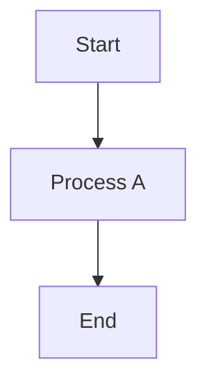

                 

### 设计《语言的社会性与函数式编程教育：维特根斯坦的公共语言观与FP的教学方法论》文章框架

#### 引言

**文章标题：**
《语言的社会性与函数式编程教育：维特根斯坦的公共语言观与FP的教学方法论》

**文章关键词：**
语言社会性、函数式编程、教育方法论、维特根斯坦、公共语言观

**摘要：**
本文探讨了语言在社会中的重要性和函数式编程（FP）作为一种编程范式在计算机科学教育中的应用。通过对维特根斯坦的公共语言观的深入分析，本文提出了一种结合语言社会性和FP的教学方法论，旨在提高学生的编程素养和语言表达能力。

**第1章 引言**

1.1 **问题背景**

   - 语言作为社会现象的基本概念与特征
   - 函数式编程的发展历程及其重要性
   - 维特根斯坦的公共语言观在教育中的意义

1.2 **问题描述**

   - 语言学习中的困难与挑战
   - FP在教育中的应用现状与问题
   - 维特根斯坦的公共语言观如何解决这些问题

1.3 **问题解决**

   - 结合语言社会性和FP的教育方法论概述
   - 本文的结构与内容安排

1.4 **边界与外延**

   - 文章研究的范围与限制
   - 语言社会性与FP教育的关系探讨

1.5 **核心概念与联系**

   - 语言社会性的核心概念
   - 函数式编程的核心概念
   - 维特根斯坦的公共语言观

#### 第2章 语言的社会性

2.1 **语言定义与特征**

   - 语言的概念与基本特征
   - 语言的社会功能
   - 语言的社会化过程

2.2 **语言的社会功能**

   - 交际功能
   - 认知功能
   - 情感功能
   - 文化和教育功能

2.3 **语言的社会化过程**

   - 语言习得过程
   - 语言社会化过程
   - 语言教育对社会化过程的影响

2.4 **语言与认知的关系**

   - 语言如何影响认知
   - 认知如何影响语言
   - 语言与认知发展的相互作用

2.5 **语言的社会学观点**

   - 语言符号论
   - 语言功能论
   - 语言结构论
   - 语言变体与语言层次

#### 第3章 函数式编程（FP）概述

3.1 **FP历史背景与发展**

   - FP的起源
   - FP的发展历程
   - FP在计算机科学领域的重要地位

3.2 **FP核心概念**

   - 函数
   - 高阶函数
   - 柯里化
   - 函数组合
   - 惰性求值

3.3 **FP与传统编程的区别**

   - 顺序编程与并行编程
   - 过程式编程与声明式编程
   - 面向对象编程与函数式编程
   - 数据导向与函数导向

3.4 **FP的优势与应用场景**

   - FP的优势
   - FP在不同领域的应用场景
   - FP在软件工程中的重要性

3.5 **FP在现代编程教育中的重要性**

   - FP教育的发展趋势
   - FP教育在计算机科学专业中的地位
   - FP教育的挑战与机遇

#### 第4章 维特根斯坦的公共语言观

4.1 **维特根斯坦的哲学思想**

   - 维特根斯坦的生平与哲学发展
   - 维特根斯坦的主要哲学观点

4.2 **公共语言观的基本概念**

   - 语言与现实的对应关系
   - 语言的使用与理解
   - 语言的意义与真值

4.3 **公共语言观的核心原理**

   - 语言是一种规则系统
   - 语言与思维的关联
   - 语言的社会共享性

4.4 **公共语言观的教育意义**

   - 教育中的语言问题
   - 教育哲学与语言观的结合
   - 公共语言观在FP教学中的实践意义

#### 第5章 FP的教学方法论

5.1 **FP教学目标**

   - 教学目标的设定
   - 学生能力的培养

5.2 **FP教学原则**

   - 语言学习的原则
   - FP教学的原则

5.3 **FP教学策略**

   - 教学策略的设计
   - 实践活动的组织

5.4 **FP教学评价**

   - 教学评价的标准
   - 教学评价的方法

#### 第6章 FP在教育中的应用案例

6.1 **案例一：某高校FP课程设计与教学实践**

   - 案例背景
   - 课程设计
   - 教学实践
   - 教学效果评估

6.2 **案例二：FP编程竞赛组织与实施**

   - 竞赛背景
   - 竞赛内容
   - 竞赛实施
   - 竞赛成果

6.3 **案例三：FP课程在线教育平台建设**

   - 平台建设背景
   - 平台功能
   - 平台应用
   - 平台效果评估

#### 第7章 总结与展望

7.1 **总结**

   - 文章核心观点的回顾
   - 语言社会性与FP教育的结合

7.2 **展望**

   - FP教育的发展趋势
   - 语言社会性研究的未来方向

7.3 **最佳实践 tips**

   - FP教学的方法与技巧
   - 语言教学的社会学视角

7.4 **小结与注意事项**

   - 文章重点内容的回顾
   - 需要注意的问题

7.5 **拓展阅读**

   - 相关文献推荐
   - 进一步研究的方向

### 设计《语言的社会性与函数式编程教育：维特根斯坦的公共语言观与FP的教学方法论》文章格式

#### 文章格式要求

**标题格式：**
# 文章标题

**摘要格式：**
> 摘要：简明扼要地概括文章的核心内容和主题思想，字数控制在100-200字。

**章节标题格式：**
## 第N章 章节标题

**小节标题格式：**
### 第N.1章 小节标题

**段落格式：**
段落开始不用空格，直接输入文本，段落结束换行。

**列表格式：**
- 无序列表项
1. 有序列表项

**表格格式：**
| 标题1 | 标题2 | 标题3 |
|-------|------|------|
| 内容1 | 内容2 | 内容3 |
| 内容4 | 内容5 | 内容6 |

**Mermaid流程图格式：**


**LaTeX公式格式：**
$$
\sum_{i=1}^{n} i = \frac{n(n+1)}{2}
$$

**Python源代码格式：**
```python
# Example of a simple Python program
def add(a, b):
    return a + b

print(add(5, 3))
```

**作者信息格式：**
作者：AI天才研究院/AI Genius Institute & 禅与计算机程序设计艺术 /Zen And The Art of Computer Programming

**文章结尾格式：**
[回到顶部](#文章标题)

### 详细设计《语言的社会性与函数式编程教育：维特根斯坦的公共语言观与FP的教学方法论》的章节内容

**第1章 引言**

1.1 **问题背景**

- 语言作为社会现象的基本概念与特征

  语言是人类社会进行沟通交流的基本工具，其基本概念和特征包括符号性、结构性、意义性等。符号性指的是语言通过符号来传递信息，这些符号可以是声音、文字、图像等；结构性指的是语言的构成要素及其组合规则；意义性指的是语言符号与所指事物之间的联系和意义。

- 函数式编程的发展历程及其重要性

  函数式编程（Functional Programming，简称FP）起源于20世纪50年代，是一种以函数为基本构建单元的编程范式。FP强调表达计算过程而非状态的变化，使得程序更易于理解、测试和重用。随着云计算、大数据和人工智能等领域的快速发展，FP的重要性日益凸显。

- 维特根斯坦的公共语言观在教育中的意义

  维特根斯坦的公共语言观认为，语言是社会共同体的产物，其意义来源于使用者的共同约定。这种观点对于理解语言的本质、提升语言学习效果具有重要的指导意义。在教育领域，结合FP的教学方法论，有助于培养学生的编程能力和语言表达能力。

1.2 **问题描述**

- 语言学习中的困难与挑战

  语言学习是一个复杂的过程，涉及到语音、词汇、语法、语义等多个方面。学生往往在语言学习中遇到词汇积累不足、语法规则复杂、语境理解困难等问题。

- FP在教育中的应用现状与问题

  目前，FP在教育中的应用还处于初级阶段，多数高校和培训机构将FP作为选修课程或短期培训。在实际教学中，存在教材不足、师资力量薄弱、教学效果不理想等问题。

- 维特根斯坦的公共语言观如何解决这些问题

  维特根斯坦的公共语言观提供了一种全新的视角，强调语言的社会性和共同约定的原则。通过结合FP的教学方法论，可以更好地解决语言学习中的困难，提高教育质量。

1.3 **问题解决**

- 结合语言社会性和FP的教育方法论概述

  本文章提出了一种结合语言社会性和FP的教学方法论，旨在通过以下几个方面解决上述问题：

  1. 强化语言的社会性教育，提高学生对语言本质的认识；
  2. 引入FP的概念和原理，培养学生的编程思维和技巧；
  3. 采用互动式的教学策略，促进学生主动参与和自主学习。

- 本文的结构与内容安排

  本文分为七个章节，结构安排如下：

  第1章 引言
  第2章 语言的社会性
  第3章 函数式编程（FP）概述
  第4章 维特根斯坦的公共语言观
  第5章 FP的教学方法论
  第6章 FP在教育中的应用案例
  第7章 总结与展望

1.4 **边界与外延**

- 文章研究的范围与限制

  本文主要探讨语言的社会性与FP教学方法的结合，重点关注语言学习中的困难与挑战，以及FP在教育中的应用现状与问题。文章的研究范围限于计算机科学教育领域，不涉及其他学科领域的语言教学。

- 语言社会性与FP教育的关系探讨

  语言的社会性是语言学习的重要基础，而FP作为一种编程范式，其核心理念与语言的社会性有诸多契合之处。通过本文的研究，可以进一步探讨二者之间的关系，为FP教育的推广提供理论支持。

1.5 **核心概念与联系**

- 语言社会性的核心概念

  语言社会性包括以下核心概念：

  1. 符号性：语言通过符号进行交流；
  2. 结构性：语言的构成要素及其组合规则；
  3. 意义性：语言符号与所指事物之间的联系和意义；
  4. 共同性：语言是社会共同体的产物，其意义来源于使用者的共同约定。

- 函数式编程的核心概念

  函数式编程的核心概念包括：

  1. 函数：将输入映射到输出的过程；
  2. 高阶函数：函数作为参数或返回值的函数；
  3. 柯里化：将一个多参数函数转换为一系列单参数函数；
  4. 函数组合：将多个函数组合成一个复合函数；
  5. 惰性求值：延迟计算直到必要的时候。

- 维特根斯坦的公共语言观

  维特根斯坦的公共语言观强调语言的社会性和共同约定的原则，其核心概念包括：

  1. 语言是一种规则系统：语言的意义来源于使用者的共同约定；
  2. 语言与思维的关联：语言是人类思维的工具；
  3. 语言的社会共享性：语言是社会共同体的产物。

**第2章 语言的社会性**

2.1 **语言定义与特征**

- 语言的概念

  语言是人类社会进行沟通交流的基本工具，它是一种符号系统，通过声音、文字、图像等符号来传递信息。

- 语言的特征

  1. 符号性：语言通过符号进行交流，符号是语言的基本单位；
  2. 结构性：语言的构成要素及其组合规则，包括语音、词汇、语法等；
  3. 意义性：语言符号与所指事物之间的联系和意义；
  4. 共同性：语言是社会共同体的产物，其意义来源于使用者的共同约定。

2.2 **语言的社会功能**

- 交际功能

  交际功能是语言最重要的功能之一，它使得人类能够进行沟通交流，分享信息和知识。

- 认知功能

  语言是人们认识世界、表达思维的工具，它对人们的认知过程有着深远的影响。

- 情感功能

  语言能够表达人们的情感和情绪，起到调节和缓解情绪的作用。

- 文化和教育功能

  语言是文化的重要组成部分，它承载着文化的价值观、习俗和传统。同时，语言也是教育的基础，通过语言的学习，人们能够掌握知识、发展思维和技能。

2.3 **语言的社会化过程**

- 语言习得过程

  语言习得过程是指个体在成长过程中掌握语言的过程。它通常分为以下几个阶段：

  1. 吸收阶段：个体通过听、说、读、写等方式接触和理解语言；
  2. 表达阶段：个体开始尝试使用语言进行交流和表达；
  3. 理解阶段：个体逐渐掌握语言的规则和结构，能够准确理解和解释语言；
  4. 沉淀阶段：个体在长期的实践中，巩固和拓展自己的语言能力。

- 语言社会化过程

  语言社会化过程是指个体在与社会互动中，通过学习、模仿、交流等方式，逐步适应和融入社会的过程。它包括以下几个环节：

  1. 观察和模仿：个体通过观察他人的语言行为，学习语言的基本规则和表达方式；
  2. 表达和反馈：个体通过使用语言进行表达，并获得他人的反馈，逐步调整自己的语言行为；
  3. 讨论和交流：个体通过与他人交流和讨论，深入理解和掌握语言的意义和用法；
  4. 反思和修正：个体在语言使用过程中，不断反思和修正自己的语言行为，提高语言表达能力。

- 语言教育对社会化过程的影响

  语言教育对社会化过程有着重要的促进作用，它通过以下几个方面影响个体的语言社会化：

  1. 语言知识传授：教育者通过教授语言知识，帮助个体掌握语言的基本规则和结构，为语言习得提供基础；
  2. 语言技能培养：教育者通过培养个体的听、说、读、写等语言技能，提高个体的语言表达能力，增强其在社会中的竞争力；
  3. 语言环境营造：教育者通过创造良好的语言环境，提供丰富的语言实践机会，促进个体在真实语境中运用语言，提高语言能力；
  4. 语言意识培养：教育者通过培养个体的语言意识，使个体认识到语言的社会性和实用性，增强其对语言学习的重视和动力。

2.4 **语言与认知的关系**

- 语言如何影响认知

  1. 语言是认知的工具：语言是人类思维和表达的工具，它帮助人们理解世界、组织和存储信息；
  2. 语言影响认知过程：语言的使用方式、表达习惯和语言环境都会对认知过程产生影响；
  3. 语言塑造认知结构：语言的结构和规则对人们的认知结构和思维方式有着深远的影响。

- 认知如何影响语言

  1. 认知影响语言学习：个体的认知能力和认知风格会影响其语言学习的效果和质量；
  2. 认知影响语言表达：个体的认知水平、思维方式和知识背景会影响其语言表达的能力和风格；
  3. 认知影响语言教学：教育者需要根据学生的认知特点和认知需求，设计合适的教学内容和教学方法，提高教学效果。

- 语言与认知发展的相互作用

  语言与认知发展是相互影响、相互促进的过程：

  1. 语言促进认知发展：语言的学习和使用有助于个体认知能力的发展和提高，如提高注意力、记忆力、思维能力和创造力等；
  2. 认知促进语言发展：个体的认知发展水平会影响其语言学习和使用的能力，如认知能力的提升有助于语言规则的掌握和语言表达的准确性；
  3. 互动促进共同发展：在语言学习和使用过程中，个体不断进行交流和互动，通过反馈和修正，促进语言和认知的共同发展。

2.5 **语言的社会学观点**

- 语言符号论

  语言符号论认为，语言是一种符号系统，语言符号与所指事物之间存在着一定的对应关系。语言符号具有任意性、稳定性和可变性等特点。

  - 任意性：语言符号的形式和意义之间的联系是任意规定的，不同的语言符号可以代表相同的事物，相同的事物也可以由不同的语言符号表示；
  - 稳定性：语言符号的形式和意义在一定的社会和文化背景下保持相对稳定，不会轻易改变；
  - 可变性：随着社会和文化的发展，语言符号的形式和意义可能会发生一定的变化，以适应新的社会和文化环境。

- 语言功能论

  语言功能论认为，语言具有多种功能，包括交际功能、认知功能、情感功能、文化功能等。语言的功能决定了语言的使用方式和表达内容。

  - 交际功能：语言的主要功能之一是进行沟通交流，传递信息和知识；
  - 认知功能：语言是人类认识世界、表达思维的工具，它有助于个体理解和解释事物；
  - 情感功能：语言能够表达人们的情感和情绪，起到调节和缓解情绪的作用；
  - 文化功能：语言是文化的重要组成部分，它承载着文化的价值观、习俗和传统。

- 语言结构论

  语言结构论认为，语言具有特定的结构，包括语音、词汇、语法等层次。语言结构的规则和特点决定了语言的表达方式和表达效果。

  - 语音结构：语音是语言的基本单位，它由音素组成，具有一定的语音规则和特点；
  - 词汇结构：词汇是语言的建筑材料，它由词素组成，具有一定的词汇规则和特点；
  - 语法结构：语法是语言的组织规则，它规定了词语的组合方式和句子结构。

- 语言变体与语言层次

  语言变体是指在一定社会和文化背景下，由于地域、社会阶层、年龄、性别等因素的差异，语言在语音、词汇、语法等方面所表现出的变异。语言层次包括标准语、地域语、行业语、方言等。

  - 标准语：指某一语言在社会中具有较高地位、被广泛使用的语言形式，如普通话、英语等；
  - 地域语：指在一定地域范围内使用的语言形式，如方言、地方话等；
  - 行业语：指某一行业或领域内部使用的专业术语和表达方式；
  - 方言：指在某一地区或民族内部，由于历史、地理等因素的差异而形成的具有独特特点的语言形式。

**第3章 函数式编程（FP）概述**

3.1 **FP历史背景与发展**

- FP的起源

  函数式编程（Functional Programming，简称FP）起源于20世纪50年代，其概念最早由数学家阿尔伯特·塔斯基（Alonzo Church）提出。他在1930年代提出了λ-演算，这是一种纯函数式编程语言，旨在研究计算的本质和逻辑。

- FP的发展历程

  1. 1958年，约翰·麦卡锡（John McCarthy）提出了Lisp语言，这是第一种具有广泛影响力的函数式编程语言。Lisp语言以其灵活的语法和强大的函数特性，为函数式编程的发展奠定了基础。

  2. 1970年代，逻辑编程语言Prolog的出现进一步推动了函数式编程的发展。Prolog是一种基于逻辑的函数式编程语言，它使得编程可以像数学中的推理一样进行。

  3. 1980年代，以Haskell语言为代表的纯函数式编程语言开始出现，这些语言强调了函数式编程的纯粹性和表达性。Haskell语言以其严格的静态类型系统和强大的类型推导能力，成为函数式编程的重要代表。

  4. 1990年代，随着互联网的兴起，函数式编程在分布式计算和并发编程中得到了广泛应用。Scala、Erlang等语言的出现，使得函数式编程在工业界得到了更广泛的认可和应用。

- FP在计算机科学领域的重要地位

  函数式编程在计算机科学领域具有重要地位，它对编程语言的设计和软件开发方法产生了深远的影响。FP的几个关键特点，如纯函数、不可变性、高阶函数、惰性求值等，为现代编程提供了新的思路和工具。

3.2 **FP核心概念**

- 函数

  函数是FP的核心概念之一，它是一组输入和输出之间的映射关系。在FP中，函数被视为第一类对象，可以像任何其他数据类型一样传递、存储和操作。

  - 纯函数：纯函数是一种无副作用、输入输出确定的函数。它的输出完全依赖于输入，不会修改外部状态，也不会产生任何副作用。纯函数易于测试、重用和并行执行。

  - 高阶函数：高阶函数是一种可以接受函数作为参数或将函数作为返回值的函数。它允许程序员定义操作函数，并传递这些函数来执行特定的任务。

  - 柯里化：柯里化是一种将多参数函数转换为一系列单参数函数的过程。通过柯里化，可以减少函数的参数数量，使得函数更易于理解和重用。

- 高阶函数

  高阶函数是FP的另一重要概念，它允许将函数作为参数传递或返回其他函数。这种能力使得程序员可以编写更抽象、更模块化的代码。

  - map：map函数接受一个函数和一个列表作为参数，将函数应用于列表中的每个元素，并返回一个新的列表。

  - filter：filter函数接受一个函数和一个列表作为参数，返回一个新的列表，其中包含原列表中满足函数条件的所有元素。

  - reduce：reduce函数接受一个函数和一个列表作为参数，将函数应用于列表中的相邻元素，并将结果累积起来，最终返回一个单一的值。

- 柯里化

  柯里化是一种将多参数函数转换为一系列单参数函数的过程。通过柯里化，可以减少函数的参数数量，使得函数更易于理解和重用。

  - 柯里化示例：假设有一个计算两个数之和的函数`add(a, b) { return a + b; }`，通过柯里化，可以将其转换为`addCurried(a) { return (b) => a + b; }`，这样就可以先传递一个参数`a`，然后再传递`b`来计算结果。

- 函数组合

  函数组合是将多个函数组合成一个新的函数的过程。通过函数组合，可以创建更复杂的函数，并提高代码的可读性和可维护性。

  - 函数组合示例：假设有两个函数`f(x) { return x * x; }`和`g(x) { return x + 2; }`，通过函数组合，可以创建一个新的函数`h(x) { return f(g(x)); }`，这个函数首先将`x`传递给`g`函数，然后将结果传递给`f`函数，最终返回一个新的值。

- 惰性求值

  惰性求值是一种延迟计算的方法，它仅在需要时才计算表达式的值。这种方法可以减少不必要的计算，提高程序的效率和性能。

  - 惰性求值示例：假设有一个函数`lazySum(a, b) { return a + b; }`，如果使用惰性求值，那么在调用`lazySum(3, 4)`时，不会立即计算结果，而是返回一个函数，该函数在需要时才会执行计算。

3.3 **FP与传统编程的区别**

- 顺序编程与并行编程

  顺序编程是一种线性执行代码的编程方式，程序按照代码的先后顺序逐行执行。并行编程则是通过同时执行多个任务来提高程序的执行效率。

  - 顺序编程：程序按照一定的顺序逐行执行，每个任务依次完成；
  - 并行编程：程序通过同时执行多个任务来提高效率，可以在不同的处理器或线程上同时执行。

- 过程式编程与声明式编程

  过程式编程是一种通过描述解决问题的步骤来编写程序的编程方式。声明式编程则是一种通过描述问题的条件和结果来编写程序的编程方式。

  - 过程式编程：通过编写详细的步骤来解决问题，如循环、条件判断等；
  - 声明式编程：通过描述问题的条件和结果来解决问题，如模式匹配、逻辑推理等。

- 面向对象编程与函数式编程

  面向对象编程是一种以对象为基本单元的编程方式，通过封装、继承和多态等机制来组织代码。函数式编程则是一种以函数为基本单元的编程方式，强调函数的纯函数性和不可变性。

  - 面向对象编程：通过对象和类的封装、继承和多态来组织代码；
  - 函数式编程：通过函数的纯函数性和不可变性来组织代码。

- 数据导向与函数导向

  数据导向编程是一种以数据为中心的编程方式，通过操作数据来解决问题。函数导向编程则是一种以函数为中心的编程方式，通过组合和操作函数来解决问题。

  - 数据导向编程：通过操作数据来解决问题，如数据库查询、数据处理等；
  - 函数导向编程：通过组合和操作函数来解决问题，如函数组合、高阶函数等。

3.4 **FP的优势与应用场景**

- FP的优势

  1. 简化代码：FP通过纯函数和不可变性，使得代码更简洁、易于理解和维护；
  2. 并行计算：FP的惰性求值和纯函数特性，使得程序可以更高效地并行执行，提高性能；
  3. 测试和调试：FP的纯函数性使得测试和调试更加容易，因为函数的输出仅依赖于输入，没有副作用；
  4. 重用和组合：FP的函数组合和高阶函数特性，使得代码可以更灵活、更模块化地重用和组合。

- FP的应用场景

  1. 数据处理：FP在数据处理领域具有广泛的应用，如大数据分析、数据清洗和转换等；
  2. 并发编程：FP的纯函数性和惰性求值特性，使得它在并发编程中具有优势，如分布式计算、实时数据处理等；
  3. 前端开发：FP在前端开发中也得到广泛应用，如React、Vue等框架都采用了函数式编程的思想；
  4. 后端开发：FP在后端开发中也有应用，如Node.js、Erlang等语言都采用了函数式编程的特点。

3.5 **FP在现代编程教育中的重要性**

- FP教育的发展趋势

  1. 教育机构对FP的重视：越来越多的教育机构开始将FP纳入计算机科学教育的课程体系中，如MIT、斯坦福大学等顶尖学府；
  2. 开源社区的推动：许多开源社区和框架，如Scala、Haskell等，都积极推广FP，为教育提供了丰富的资源和实践机会；
  3. 产业需求的变化：随着互联网和大数据等领域的快速发展，对FP人才的需求不断增加，FP教育逐渐成为计算机科学教育的重要方向。

- FP教育在计算机科学专业中的地位

  1. 基础课程：FP作为计算机科学专业的基础课程，为学生提供了一种新的编程范式，帮助他们建立编程思维和解决问题的方法；
  2. 专业选修课：许多高校将FP作为专业选修课程，为学生提供更深入的学习机会；
  3. 研究生课程：一些高校的研究生课程中，FP作为核心课程，为学生提供了深入研究的方向。

- FP教育的挑战与机遇

  1. 教材和师资：目前FP教育的教材和师资还存在不足，需要加强教材编写和师资培训；
  2. 教学方法：FP教育的教学方法与传统编程教育有所不同，需要探索更有效的教学方法和策略；
  3. 学生接受度：部分学生对FP的概念和方法可能存在一定的抵触情绪，需要加强宣传和引导；
  4. 工业界的支持：FP教育的实施需要工业界的支持，如提供实践项目和实习机会，提高学生的实际编程能力。

**第4章 维特根斯坦的公共语言观**

4.1 **维特根斯坦的哲学思想**

- 维特根斯坦的生平与哲学发展

  路德维希·维特根斯坦（Ludwig Wittgenstein，1889-1951）是20世纪最重要的哲学家之一，他的哲学思想对现代西方哲学产生了深远的影响。维特根斯坦的哲学思想经历了两个主要阶段：早期哲学和后期哲学。

  - 早期哲学：维特根斯坦的早期哲学思想主要体现在他的代表作《逻辑哲学论》（Tractatus Logico-Philosophicus）中。这本书以清晰的逻辑和哲学的深度探讨了语言、现实和知识之间的关系，提出了著名的“图像论”（Picture Theory）。

  - 后期哲学：维特根斯坦的后期哲学思想主要体现在他的另一部代表作《哲学研究》（Philosophical Investigations）中。在这部作品中，维特根斯坦批判了早期哲学中的图像论，提出了“语言游戏”（Language Game）的概念，强调语言的使用是社会和文化现象。

- 维特根斯坦的主要哲学观点

  维特根斯坦的哲学观点主要集中在语言、思维、知识和现实之间的关系。

  - 语言观：维特根斯坦认为，语言是一种工具，它用于描述现实和思考问题。语言的意义在于其在实际使用中的用法，而不是抽象的哲学定义。

  - 思维观：维特根斯坦认为，思维是通过语言进行的，思维过程与语言的使用密切相关。思维不是抽象的推理过程，而是具体的、实践性的活动。

  - 知识观：维特根斯坦认为，知识是通过经验获得的，知识不是抽象的真理，而是具体事实的把握。

  - 现实观：维特根斯坦认为，现实是复杂的、多元的，不能简单地通过语言来描述。现实的理解需要通过实际的观察和体验。

4.2 **公共语言观的基本概念**

- 语言与现实的对应关系

  维特根斯坦的公共语言观强调语言与现实的对应关系。他认为，语言的意义在于其在实际使用中的用法，语言符号与所指事物之间的联系是通过共同约定建立起来的。

  - 对应关系：语言符号与所指事物之间存在着一种对应关系，即语言符号表示所指事物的特征和属性。

  - 共同约定：语言符号与所指事物之间的对应关系是通过共同约定建立起来的，这种约定是社会和文化背景下的产物。

- 语言的使用与理解

  维特根斯坦认为，语言的使用和理解是一个复杂的过程，它涉及到语言符号、所指事物和实际使用环境。

  - 使用：语言的使用是指在实际交流中，人们如何使用语言符号来表达思想、传递信息。

  - 理解：语言的理解是指人们如何根据语言符号和实际使用环境来解读语言符号的意义。

- 语言的意义与真值

  维特根斯坦认为，语言的意义不是抽象的，而是具体的、实践性的。语言符号的意义在于其在实际使用中的用法。

  - 意义：语言符号的意义是通过实际使用来确定的，意义不是抽象的哲学概念，而是具体的、实践性的。

  - 真值：维特根斯坦提出了“真值”（Truth）的概念，认为命题的真值取决于其在现实中的实际情况。

4.3 **公共语言观的核心原理**

- 语言是一种规则系统

  维特根斯坦的公共语言观认为，语言是一种规则系统。语言的使用遵循一定的规则，这些规则是社会和文化背景下的产物。

  - 规则：语言使用中的规则包括语法规则、语义规则和语用规则等。

  - 社会和文化背景：语言规则是社会和文化背景下的产物，不同的社会和文化背景会有不同的语言规则。

- 语言与思维的关联

  维特根斯坦认为，语言与思维密切相关。思维是通过语言进行的，语言是思维的工具。

  - 思维：思维是通过语言进行的，思维过程包括理解、推理、判断等。

  - 语言：语言是思维的载体，思维的内容需要通过语言来表达。

- 语言的社会共享性

  维特根斯坦的公共语言观强调语言的社会共享性。语言是社会共同体的产物，其意义来源于使用者的共同约定。

  - 社会共享性：语言的社会共享性意味着语言符号的意义是社会共同约定的结果。

  - 共同约定：语言符号的意义是通过共同约定建立起来的，这种约定是社会和文化背景下的产物。

4.4 **公共语言观的教育意义**

- 教育中的语言问题

  教育中的语言问题包括语言习得、语言运用、语言教育等。

  - 语言习得：语言习得是指个体在成长过程中掌握语言的过程。

  - 语言运用：语言运用是指个体在实际交流中使用语言的过程。

  - 语言教育：语言教育是指通过教学活动来传授语言知识和技能。

- 教育哲学与语言观的结合

  教育哲学与语言观的结合是指将维特根斯坦的公共语言观应用于教育实践中。

  - 教育哲学：教育哲学是研究教育本质、目标、方法等基本问题的学科。

  - 语言观：语言观是关于语言的本质、功能、使用等方面的观点。

  - 结合：将维特根斯坦的公共语言观应用于教育实践中，有助于解决教育中的语言问题，提高教育质量。

- 公共语言观在FP教学中的实践意义

  维特根斯坦的公共语言观在FP教学中具有重要的实践意义。

  - 语言学习：公共语言观有助于学生理解语言的本质，提高语言学习效果。

  - 编程思维：公共语言观有助于学生形成编程思维，提高编程能力。

  - 教学方法：公共语言观为FP教学提供了新的教学方法，如基于语言游戏的教学方法。

**第5章 FP的教学方法论**

5.1 **FP教学目标**

- 教学目标的设定

  FP教学目标的设定应考虑以下几个方面：

  - 知识传授：教授FP的基本概念、原理和技能，如函数、高阶函数、柯里化、惰性求值等。

  - 技能培养：培养学生在FP环境下的编程能力，如编写纯函数、使用高阶函数、进行函数组合等。

  - 思维培养：培养学生的抽象思维能力、逻辑推理能力和解决问题的能力。

  - 情感培养：激发学生对FP的兴趣和热情，提高他们对编程的热爱和自信心。

- 学生能力的培养

  学生能力的培养包括以下几个方面：

  - 编程能力：通过实践和项目，提高学生的编程能力，使学生能够熟练地使用FP语言和工具。

  - 思维能力：通过分析和解决实际问题，培养学生的抽象思维能力、逻辑推理能力和创造性思维能力。

  - 学习能力：培养学生主动学习、独立思考、自主解决问题的能力，提高他们的终身学习能力。

  - 沟通能力：通过团队协作和项目交流，培养学生的沟通能力和团队协作能力。

5.2 **FP教学原则**

- 语言学习的原则

  FP教学应遵循以下语言学习的原则：

  - 逐步引导：从简单到复杂，逐步引导学生学习FP的基本概念和原理。

  - 实践为主：通过大量实践，让学生在实际操作中掌握FP技能。

  - 理论与实践相结合：在教学中，既要讲解FP的理论知识，又要结合实际项目进行讲解和练习。

  - 激发兴趣：通过丰富的教学方法和实践项目，激发学生对FP的兴趣和热情。

- FP教学的原则

  FP教学应遵循以下原则：

  - 纯函数性：强调纯函数的使用，避免副作用和状态变化。

  - 高阶函数：鼓励使用高阶函数，提高代码的抽象性和可复用性。

  - 函数组合：通过函数组合，构建复杂的函数，提高代码的可读性和可维护性。

  - 惰性求值：利用惰性求值，提高代码的性能和可读性。

  - 教学互动：鼓励学生参与教学过程，积极提问和讨论，提高学习效果。

5.3 **FP教学策略**

- 教学策略的设计

  FP教学策略的设计应考虑以下几个方面：

  - 情境教学：通过设置实际应用场景，让学生在实际问题中学习和运用FP技能。

  - 项目驱动：通过项目实践，让学生在解决实际问题的过程中掌握FP知识和技能。

  - 渐进教学：从简单到复杂，逐步引导学生掌握FP的基本概念和原理。

  - 互动教学：鼓励学生参与教学过程，通过讨论、问答和反馈，提高学习效果。

- 实践活动的组织

  实践活动是FP教学的重要组成部分，其组织应考虑以下几个方面：

  - 编程实践：通过编写代码，让学生在实际操作中掌握FP技能。

  - 项目实践：通过完成实际项目，让学生将FP知识和技能应用于实际问题。

  - 团队协作：通过团队协作，培养学生的团队精神和沟通能力。

  - 反馈与评价：通过及时反馈和评价，帮助学生了解自己的学习情况，提高学习效果。

5.4 **FP教学评价**

- 教学评价的标准

  FP教学评价应考虑以下标准：

  - 知识掌握程度：评估学生对FP基本概念和原理的掌握程度。

  - 编程能力：评估学生在FP环境下的编程能力，如编写纯函数、使用高阶函数等。

  - 思维能力：评估学生在解决问题过程中展现的抽象思维能力、逻辑推理能力和创造性思维能力。

  - 学习态度：评估学生的出勤、作业完成情况和参与度。

- 教学评价的方法

  FP教学评价可以采用以下方法：

  - 形成性评价：通过平时的作业、测验和课堂表现，评估学生的学习进度和效果。

  - 总结性评价：通过期中考试、期末考试等，评估学生对整个课程内容的掌握程度。

  - 实践项目评价：通过实践项目，评估学生在实际问题中的应用能力和创新能力。

  - 学生互评：鼓励学生之间相互评价，提高学习效果和团队协作能力。

**第6章 FP在教育中的应用案例**

6.1 **案例一：某高校FP课程设计与教学实践**

- 案例背景

  某高校计算机科学专业在课程设置中引入了函数式编程（FP）课程，旨在提高学生的编程能力和抽象思维能力。

- 课程设计

  课程设计主要包括以下几个方面：

  - 教学目标：明确课程的教学目标，包括知识传授、技能培养和思维能力提升。

  - 教学内容：根据FP的基本概念和原理，设计教学课程，如函数、高阶函数、柯里化、惰性求值等。

  - 教学方法：采用情境教学、项目驱动和互动教学等方法，提高教学效果。

  - 实践环节：设置编程实践和项目实践，让学生在实际操作中掌握FP技能。

- 教学实践

  教学实践主要包括以下几个方面：

  - 教学过程：按照教学设计，进行课堂教学和实践教学。

  - 学生反馈：收集学生对教学方法和教学内容的反馈，不断优化教学过程。

  - 教学效果：通过期中考试、期末考试和实践项目，评估教学效果。

- 教学效果评估

  教学效果评估主要包括以下几个方面：

  - 知识掌握程度：通过考试和测验，评估学生对FP基本概念和原理的掌握程度。

  - 编程能力：通过编程实践和项目实践，评估学生在FP环境下的编程能力。

  - 思维能力：通过解决实际问题和项目创新，评估学生的抽象思维能力、逻辑推理能力和创造性思维能力。

  - 学习态度：通过出勤、作业完成情况和课堂表现，评估学生的学习态度和参与度。

6.2 **案例二：FP编程竞赛组织与实施**

- 案例背景

  某高校计算机科学专业组织了FP编程竞赛，旨在激发学生对FP的兴趣，提高他们的编程能力和创新能力。

- 竞赛内容

  竞赛内容主要包括以下几个方面：

  - 理论知识：考察学生对FP基本概念和原理的理解。

  - 编程实践：通过编写代码，考察学生在FP环境下的编程能力。

  - 项目创新：鼓励学生在实际问题中运用FP知识和技能，提出创新的解决方案。

- 竞赛实施

  竞赛实施主要包括以下几个方面：

  - 竞赛准备：制定竞赛规则、报名方式、比赛流程等。

  - 竞赛过程：按照竞赛规则，组织学生参加比赛。

  - 竞赛结果：公布比赛结果，对获奖学生进行表彰。

- 竞赛效果

  竞赛效果主要包括以下几个方面：

  - 激发兴趣：通过竞赛，激发学生对FP的兴趣和热情。

  - 提高能力：通过竞赛，提高学生的编程能力和创新能力。

  - 交流互动：通过竞赛，促进学生之间的交流和互动，提高团队协作能力。

  - 宣传推广：通过竞赛，宣传FP教育，提高FP在社会和高校中的知名度。

6.3 **案例三：FP课程在线教育平台建设**

- 案例背景

  某高校计算机科学专业搭建了FP课程在线教育平台，旨在为学生提供灵活、便捷的学习资源，提高FP教育的效果。

- 平台功能

  平台功能主要包括以下几个方面：

  - 课程资源：提供FP课程的课件、教材、视频等学习资源。

  - 在线课程：提供在线课程，学生可以根据自己的学习进度，自主安排学习。

  - 练习测试：提供在线练习和测试，学生可以通过测试检验自己的学习效果。

  - 答疑互动：提供答疑互动功能，学生可以在平台上提问，教师和其他学生可以回答问题。

- 平台应用

  平台应用主要包括以下几个方面：

  - 学习支持：学生通过平台，获取学习资源，进行在线学习。

  - 教学管理：教师通过平台，进行教学管理，包括课程发布、作业布置、成绩管理等。

  - 互动交流：学生和教师通过平台，进行答疑互动，促进教学相长。

- 平台效果评估

  平台效果评估主要包括以下几个方面：

  - 学习效果：通过平台的练习和测试，评估学生的学习效果。

  - 教学效果：通过平台的课程发布和答疑互动，评估教师的教学效果。

  - 平台满意度：通过问卷调查和反馈，评估学生对平台的满意度。

  - 学习积极性：通过学习数据，评估学生的学习积极性和自主学习能力。

**第7章 总结与展望**

7.1 **总结**

- 语言的社会性与FP教育的结合

  语言的社会性是语言学习的重要基础，而函数式编程（FP）作为一种现代编程范式，具有简洁、抽象、易于理解等特点，与语言的社会性具有很多契合之处。通过结合语言的社会性和FP的教育方法论，可以更好地解决语言学习中的困难，提高教育质量。

- 语言社会性对FP教学的影响

  语言的社会性对FP教学具有深远的影响。语言的社会功能、社会化过程、与认知的关系等，都为FP教学提供了丰富的理论依据和实践指导。通过理解语言的社会性，可以更好地设计FP教学策略，提高学生的学习效果。

7.2 **展望**

- FP教育的发展趋势

  随着互联网、大数据和人工智能等领域的快速发展，FP教育在未来具有广阔的发展前景。未来FP教育的发展趋势包括：

  - FP课程普及化：越来越多的高校和培训机构将FP纳入课程体系，FP教育的普及程度将不断提高。

  - FP教学创新：教育者和研究者将不断探索新的FP教学方法和策略，提高教学效果。

  - FP产业合作：FP教育将更加注重与产业的结合，培养具有实际应用能力的人才。

- 语言社会性研究的未来方向

  语言社会性研究在未来将继续深入，未来研究可以从以下几个方面展开：

  - 语言与认知的关系：深入研究语言与认知的相互作用，探讨语言对认知发展的影响。

  - 语言教育的跨文化研究：研究不同文化背景下语言教育的差异和共性，探索跨文化语言教育的策略和方法。

  - 语言与社会的互动：研究语言在社会发展中的作用和影响，探讨语言与社会变革的关系。

7.3 **最佳实践 tips**

- 教学设计

  - 结合学生的实际情况，设计适合的教学目标和教学内容。

  - 采用多样化的教学方法，如情境教学、项目驱动和互动教学等，提高教学效果。

- 教学实践

  - 鼓励学生参与实际项目，提高他们的实践能力和创新能力。

  - 注重语言的社会功能，引导学生理解语言在社会中的实际应用。

- 教学评价

  - 采用多元化的评价方法，如形成性评价、总结性评价和实践项目评价等，全面评估学生的学习效果。

  - 注重学生的自主学习能力，鼓励他们在学习中自主探究和解决问题。

7.4 **小结与注意事项**

- 小结

  本文通过对语言的社会性和函数式编程（FP）的教学方法论的研究，探讨了二者之间的结合点，提出了FP教育的最佳实践策略。通过结合语言的社会性和FP的教学方法论，可以更好地提高教育质量，培养学生的编程能力和语言表达能力。

- 注意事项

  - 在FP教学中，要注重理论与实践的结合，提高学生的实际编程能力。

  - 要理解语言的社会性，引导学生正确使用语言，提高他们的语言素养。

  - 要不断探索新的FP教学方法和策略，提高教学效果。

7.5 **拓展阅读**

- 相关文献推荐

  - 维特根斯坦，《逻辑哲学论》
  - 维特根斯坦，《哲学研究》
  - Haskell编程语言规范
  - 《函数式编程实践》
  - 《语言与认知：心理学与哲学的交汇》

- 进一步研究的方向

  - 深入研究语言与认知的相互作用，探讨语言对认知发展的长期影响。

  - 探索FP教学在跨文化教育中的应用，研究不同文化背景下FP教育的特点。

  - 研究FP教学与其他教育模式的结合，探索FP教育的多元应用场景。

