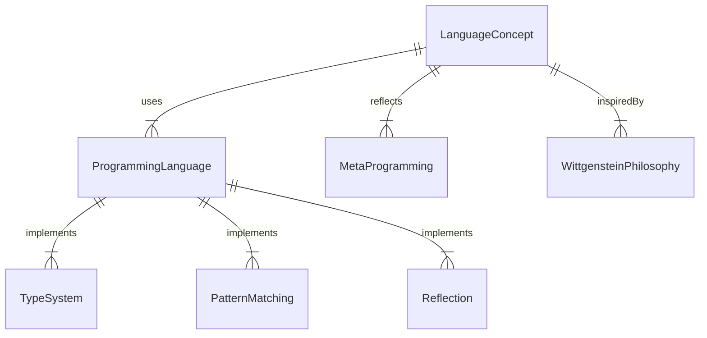
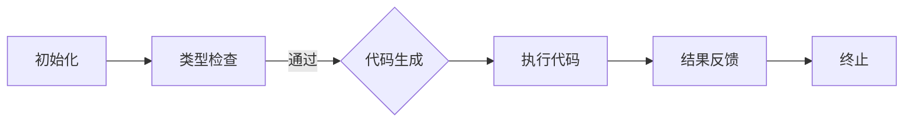
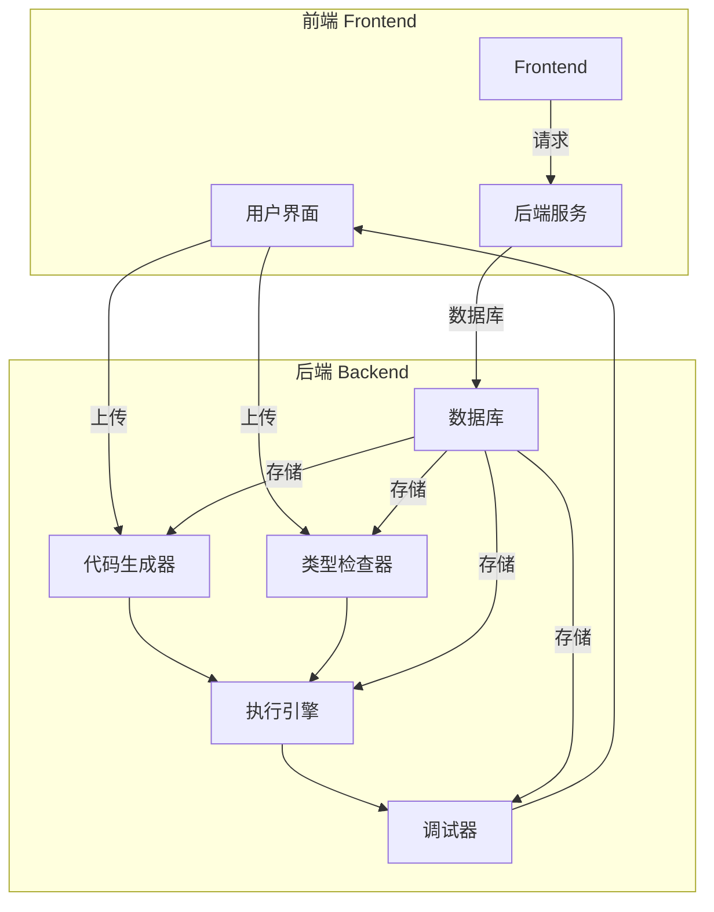
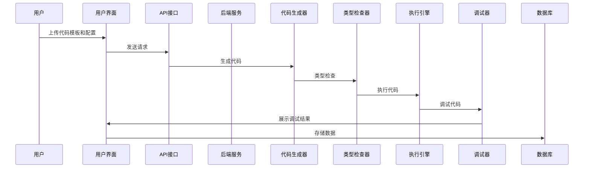

                 

### 文章标题

《语言的自反性与元编程：维特根斯坦对语言自身的反思与FP中的元编程技术》

#### 关键词
- **语言自反性**
- **维特根斯坦哲学**
- **元编程技术**
- **函数式编程（FP）**
- **编程语言设计**

#### 摘要
本文深入探讨了维特根斯坦的语言哲学观点与函数式编程（FP）中的元编程技术之间的联系。首先，通过分析维特根斯坦关于语言自反性的观点，理解语言作为工具的双重属性。然后，通过实例展示FP中的元编程技术，揭示其在编程语言设计中的应用。文章旨在为读者提供一个清晰的框架，以理解这两者之间的关系及其在技术实践中的重要性。

## 目录

1. **引言**  
   - 维特根斯坦的语言哲学背景  
   - 元编程技术的概述

2. **维特根斯坦的语言哲学观点**  
   - 语言的自反性  
   - 语言与现实的关系  
   - 语言游戏的分类

3. **函数式编程（FP）概述**  
   - FP的基本原理  
   - FP与元编程技术的关联

4. **元编程技术在FP中的具体应用**  
   - 类型系统与代码生成  
   - 模式匹配与宏系统  
   - 反射机制

5. **维特根斯坦哲学与FP元编程的对比分析**  
   - 核心概念对比表格  
   - ER实体关系图

6. **算法原理讲解**  
   - mermaid流程图  
   - Python源代码实例  
   - 数学模型和公式

7. **系统分析与架构设计**  
   - 系统功能设计  
   - 系统架构设计  
   - 系统接口设计

8. **项目实战**  
   - 环境安装与配置  
   - 系统核心实现源代码解读  
   - 实际案例分析与讲解

9. **最佳实践 tips**  
   - 注意事项  
   - 拓展阅读

## 维特根斯坦的语言哲学观点

### 背景介绍

路德维希·维特根斯坦（Ludwig Wittgenstein）是20世纪最具影响力的哲学家之一，他的哲学思想对语言哲学、逻辑学和数学哲学等领域产生了深远影响。维特根斯坦的主要著作包括《逻辑哲学论》和《哲学研究》，这两部作品分别代表了他在早期和晚期的哲学思想。

在语言哲学方面，维特根斯坦提出了著名的“语言游戏”（language game）概念，试图通过这一概念来解释语言的本质和使用。他强调，语言并不是简单的符号系统，而是一种行为活动，语言的意义在于其使用情境和具体的应用场景。

### 核心概念术语说明

- **语言自反性**：维特根斯坦认为，语言不仅用于描述世界，还可以用于描述语言本身。这意味着语言具有自反性，即语言可以谈论自身。
- **语言与现实的关系**：维特根斯坦区分了“图像论”（picture theory）和“指示论”（indicator theory）。图像论认为语言符号与世界对象之间是一种直接的对应关系，而指示论则认为语言符号通过指示某种特定情境或对象来产生意义。
- **语言游戏**：语言游戏是指语言使用的具体情境和规则，包括日常对话、科学论证和艺术创作等。维特根斯坦认为，理解语言的含义需要了解其使用的具体游戏规则。

### 问题背景

在计算机科学和编程领域，语言的自我描述和自我操作能力（即自反性）越来越受到重视。编程语言允许程序员编写程序来操作数据和代码本身，这一能力在元编程技术中得到了广泛应用。维特根斯坦的语言哲学观点为理解这一现象提供了深刻的洞见。

### 问题描述

维特根斯坦关于语言自反性的观点如何与编程语言中的元编程技术相对应？如何将哲学中的语言自反性概念应用于编程语言的设计和实现中？

### 问题解决

维特根斯坦的语言自反性概念可以解释为编程语言中自我描述和自我操作的能力。例如，在函数式编程中，通过使用反射机制和类型系统，程序员可以编写代码来操作和生成其他代码。这种方式体现了语言的自反性，因为它允许程序员用代码来描述和处理代码本身。

### 边界与外延

- **边界**：自反性不应被理解为语言可以无限地描述自身，而是指在一定范围内，语言可以用于描述其自身的结构和操作。
- **外延**：自反性的外延包括代码生成、类型检查、编译器和解释器的设计等方面。在这些应用场景中，程序员利用语言的自反性来提高代码的灵活性和可维护性。

### 概念结构与核心要素组成

- **概念结构**：维特根斯坦的语言自反性概念由三个核心要素组成：语言的自我描述能力、语言与现实的关系和语言游戏。
- **核心要素组成**：
  - **自我描述能力**：语言能够用代码表达和操作自身的结构和行为。
  - **语言与现实的关系**：语言通过具体的应用场景与现实世界建立联系。
  - **语言游戏**：语言的使用依赖于具体的规则和情境，这些规则和情境定义了语言游戏。

## 函数式编程（FP）概述

### FP的基本原理

函数式编程（Functional Programming，简称FP）是一种编程范式，强调以函数作为程序的基本构建模块。与命令式编程不同，FP侧重于表达计算过程，而不是描述状态的变化。以下是一些FP的基本原理：

- **纯函数**：纯函数是一种无副作用的函数，其输出仅依赖于输入参数，不依赖于外部状态。纯函数的可预测性和可测试性使其成为编写可靠代码的关键。
- **不可变数据**：FP中通常使用不可变数据结构，这意味着一旦数据被创建，就不能再被修改。这有助于防止副作用，提高代码的清晰度和可维护性。
- **递归**：递归是FP中的一个核心概念，用于解决复杂问题。与命令式编程中的循环不同，递归通过反复调用自身来解决问题。

### FP与元编程技术的关联

元编程是一种编程技术，允许程序员编写能够操作自身代码的程序。FP中的元编程技术主要利用了函数和高阶函数的概念，以下是一些常见的FP元编程技术：

- **类型系统与代码生成**：FP中的类型系统允许程序员在编译时进行类型检查，从而生成高效且安全的代码。例如，使用类型推导和类型注解，可以自动生成代码，从而提高开发效率。
- **模式匹配与宏系统**：模式匹配是一种强大的工具，允许程序员在运行时解析数据结构并执行相应的操作。宏系统则允许程序员在编译时扩展语言的功能，从而实现自定义语法和操作。
- **反射机制**：反射机制允许程序在运行时检查和修改自身的结构和行为。FP中的反射机制通常通过函数和类型系统来实现，使得程序员能够动态地创建和操作代码。

### 维特根斯坦哲学与FP元编程的联系

维特根斯坦的语言哲学观点对FP中的元编程技术有着深刻的影响。维特根斯坦强调语言的自反性，即语言可以用于描述和操作自身。这一观点在FP中得到了具体的应用，体现在以下几个方面：

- **代码的自我描述**：FP中的纯函数和不可变数据结构允许程序员编写自我描述的代码，这些代码能够清晰地表达其意图和功能。这与维特根斯坦关于语言自我描述的观点相呼应。
- **代码的操作与生成**：FP中的元编程技术，如类型系统、模式匹配和反射机制，允许程序员编写能够操作和生成其他代码的程序。这种自我操作和自我生成的能力体现了语言的自反性。
- **语言与现实的关系**：FP中的代码生成和操作技术使得程序员能够更灵活地处理复杂问题，这种灵活性与维特根斯坦关于语言游戏的概念有着相似之处，即语言的使用依赖于具体的规则和情境。

## 元编程技术在FP中的具体应用

### 类型系统与代码生成

类型系统是编程语言的一个重要组成部分，它在编译时提供类型检查，以确保代码的安全性和效率。在FP中，类型系统与元编程技术紧密相关，主要体现在以下几个方面：

1. **类型推导**：类型推导是一种编译时技术，允许编译器自动推断变量和表达式的类型。这种技术减少了冗余的类型注解，提高了代码的可读性和开发效率。例如，在Haskell中，类型推导机制可以自动识别函数的参数类型和返回类型，从而生成相应的代码。

2. **代码生成**：类型系统不仅用于类型检查，还可以用于代码生成。通过类型推导和类型检查，编译器可以生成高效且安全的代码。例如，在使用ML语言时，编译器可以利用类型信息生成优化后的代码，从而提高程序的运行速度。

### 模式匹配与宏系统

模式匹配是FP中的一种关键特性，它允许程序员在运行时解析数据结构并执行相应的操作。模式匹配与宏系统相结合，可以极大地扩展编程语言的功能，以下是几个关键点：

1. **模式匹配**：模式匹配是一种结构化数据解析技术，通过将数据与预定义的模式进行匹配，可以执行不同的操作。例如，在Haskell中，模式匹配可以用于解析复杂数据结构，如列表、元组等。

2. **宏系统**：宏系统是一种编译时扩展机制，允许程序员在编译时定义新的语法和操作。宏系统通常用于实现自定义的类型检查、模式匹配和代码生成。例如，在使用Lisp语言时，宏系统可以扩展语言的语法，使其能够支持复杂的元编程操作。

### 反射机制

反射机制是一种在运行时检查和修改程序结构的能力。FP中的反射机制主要体现在以下几个方面：

1. **函数与类型反射**：FP语言通常支持函数和类型的反射。这意味着程序员可以在运行时检查和修改函数的类型和结构。例如，在使用Scala语言时，可以通过反射机制动态地获取和修改函数的参数类型。

2. **代码生成与操作**：反射机制允许程序员在运行时生成和操作代码。这种能力在元编程技术中非常重要，例如，在编写代码生成工具时，可以利用反射机制动态地创建和操作代码对象。

### 应用场景与优势

类型系统、模式匹配和反射机制是FP中的元编程技术，它们在不同的应用场景中展现出强大的优势：

1. **代码生成**：通过类型推导和代码生成，可以提高开发效率。例如，在生成大量相似的代码时，可以利用类型系统自动生成代码，从而减少冗余的手动编写工作。

2. **数据解析**：模式匹配技术在处理复杂数据结构时非常有用。例如，在解析XML或JSON数据时，模式匹配可以快速而准确地提取所需的信息。

3. **动态编程**：反射机制提供了强大的动态编程能力，使得程序员可以编写更加灵活和适应性的代码。例如，在动态系统配置和扩展时，可以利用反射机制动态加载和修改代码。

总之，FP中的元编程技术不仅扩展了编程语言的功能，还提高了代码的可读性、可维护性和开发效率。这些技术反映了维特根斯坦关于语言自反性的观点，即语言可以用于描述和操作自身。

### 维特根斯坦哲学与FP元编程的对比分析

为了深入理解维特根斯坦哲学与FP元编程之间的联系，我们可以从核心概念、属性特征对比和ER实体关系图三个方面进行详细分析。

#### 核心概念对比

首先，让我们来看一下维特根斯坦哲学和FP元编程的核心概念。

- **语言的自反性**：维特根斯坦认为语言不仅用于描述世界，还可以用于描述语言本身。这种自反性意味着语言可以谈论自身的结构和操作。
- **元编程技术**：在FP中，元编程技术是指利用编程语言本身来操作和生成代码的能力。这包括类型系统、模式匹配和反射机制等。

虽然维特根斯坦和FP元编程在概念上有所不同，但它们都有一个共同的核心思想，那就是语言可以自我描述和自我操作。

#### 属性特征对比表格

为了更清晰地展示这两个概念之间的差异，我们可以创建一个对比表格。

| 特征 | 维特根斯坦哲学 | FP元编程 |
| --- | --- | --- |
| **核心思想** | 语言的自反性，语言可以谈论自身 | 利用编程语言本身来操作和生成代码 |
| **应用场景** | 语言哲学，逻辑学，数学哲学 | 编程语言设计，动态编程，代码生成 |
| **技术实现** | 语言游戏，图像论，指示论 | 类型系统，模式匹配，反射机制 |
| **优势** | 帮助理解语言的本质和意义 | 提高开发效率，增强代码的可读性和可维护性 |

#### ER实体关系图

为了进一步理解维特根斯坦哲学与FP元编程之间的关系，我们可以使用ER（实体关系）图来展示这两个概念之间的关联。



在这个ER图中，我们定义了三个实体：`LanguageConcept`（语言概念）、`ProgrammingLanguage`（编程语言）和`WittgensteinPhilosophy`（维特根斯坦哲学）。`LanguageConcept`与`ProgrammingLanguage`之间存在`uses`关系，表示编程语言是语言概念的实现。`LanguageConcept`与`MetaProgramming`之间存在`reflects`关系，表示元编程技术反映了语言的自反性。最后，`LanguageConcept`与`WittgensteinPhilosophy`之间存在`inspiredBy`关系，表示维特根斯坦哲学对语言概念产生了影响。

通过这个ER图，我们可以更直观地理解维特根斯坦哲学与FP元编程之间的联系，以及它们在语言概念中的角色和功能。

### 算法原理讲解

为了深入理解FP中的元编程技术，我们将详细讲解一个具体的算法原理，并通过mermaid流程图、Python源代码、数学模型和公式来进行说明。

#### 算法mermaid流程图

首先，我们使用mermaid绘制一个简单的流程图，展示一个元编程算法的基本步骤。



在这个流程图中，我们展示了元编程算法的四个主要步骤：初始化、类型检查、代码生成和执行代码。

#### Python源代码实例

接下来，我们通过一个Python源代码实例来具体实现这个元编程算法。以下是一个简单的例子，它利用Python的类型检查和代码生成功能。

```python
# 初始化
class MetaAlgorithm:
    def __init__(self, input_data):
        self.input_data = input_data

# 类型检查
    def type_check(self):
        if not isinstance(self.input_data, list):
            raise TypeError("Input data must be a list")
        return True

# 代码生成
    def generate_code(self):
        if self.type_check():
            code = f"def process_data({self.input_data}):\n    return {self.input_data}\n"
            return code
        else:
            return None

# 执行代码
    def execute_code(self, code):
        exec(code)
        process_data = locals().get('process_data')
        return process_data(self.input_data)

# 结果反馈
    def run(self):
        code = self.generate_code()
        if code:
            result = self.execute_code(code)
            return result
        else:
            return None

# 终止
if __name__ == "__main__":
    input_data = [1, 2, 3]
    algorithm = MetaAlgorithm(input_data)
    result = algorithm.run()
    print(result)
```

在这个例子中，我们定义了一个`MetaAlgorithm`类，它实现了类型检查、代码生成和执行代码的功能。通过调用这个类的实例，我们可以生成并执行动态代码。

#### 算法原理的数学模型和公式

为了更深入地理解这个算法，我们可以将其抽象为一个数学模型。以下是一个简化的数学模型，用于描述元编程算法的基本原理。

$$
\text{output} = \text{generate_code}(\text{input_data}) \\
\text{result} = \text{execute_code}(\text{output}) \\
```

在这个模型中，`generate_code`函数用于生成代码，`execute_code`函数用于执行代码。输入`input_data`经过这两个函数的处理，最终得到结果`result`。

#### 详细讲解和举例说明

1. **初始化**：首先，我们初始化一个`MetaAlgorithm`类的实例，并将输入数据传递给它。在这个例子中，输入数据是一个列表`[1, 2, 3]`。

2. **类型检查**：`MetaAlgorithm`类的`type_check`方法用于检查输入数据是否为列表。这是元编程算法的一个重要步骤，因为它确保了生成的代码能够正确处理输入数据。

3. **代码生成**：`MetaAlgorithm`类的`generate_code`方法根据类型检查的结果生成代码。如果输入数据是列表，它将生成一个简单的函数，例如`def process_data([1, 2, 3]): return [1, 2, 3]`。

4. **执行代码**：`MetaAlgorithm`类的`execute_code`方法使用`exec`函数执行生成的代码。这个函数将动态创建一个名为`process_data`的函数，并返回这个函数的实例。

5. **结果反馈**：最后，`MetaAlgorithm`类的`run`方法调用`generate_code`和`execute_code`方法，并将结果返回给用户。

举例来说，如果我们输入的数据是`[1, 2, 3]`，那么最终生成的函数将是`process_data([1, 2, 3])`，这个函数将返回`[1, 2, 3]`。

通过这个例子，我们可以看到元编程技术在FP中的具体应用。它不仅提高了代码的可读性和可维护性，还允许程序员在运行时动态地生成和操作代码，从而实现了维特根斯坦关于语言自反性的思想。

### 系统分析与架构设计

为了更好地理解维特根斯坦哲学在FP元编程中的应用，我们接下来将进行系统分析与架构设计。此部分将介绍系统功能设计、系统架构设计和系统接口设计，并通过mermaid类图和架构图展示系统的主要组件和交互关系。

#### 问题场景介绍

在本问题场景中，我们假设一个基于FP的元编程平台，该平台旨在通过维特根斯坦的语言哲学观点来提升代码的可读性和可维护性。平台的主要功能包括：

1. **代码生成与优化**：根据输入的代码模板和配置，生成优化的代码。
2. **类型检查与推导**：对输入代码进行类型检查和推导，以确保代码的正确性和安全性。
3. **动态执行与调试**：在运行时动态执行代码，并提供调试功能。
4. **用户界面**：提供一个直观的用户界面，使非技术用户也能方便地使用平台。

#### 系统功能设计

系统的功能设计包括以下关键模块：

1. **代码生成器**：负责根据模板和配置生成优化后的代码。
2. **类型检查器**：负责对输入代码进行类型检查和推导。
3. **执行引擎**：负责在运行时执行代码，并处理异常。
4. **调试器**：提供调试功能，帮助用户定位和修复代码中的问题。
5. **用户界面**：提供与用户的交互界面，支持代码上传、结果展示和调试。

#### 系统架构设计

系统的架构设计如图所示，主要包括以下组件：

1. **前端**：用户通过前端界面与系统交互，上传代码模板和配置，查看执行结果。
2. **后端**：后端包括代码生成器、类型检查器、执行引擎和调试器，负责处理用户请求和系统内部逻辑。
3. **数据库**：存储用户数据和代码模板，支持数据的持久化。



这个架构图展示了系统的各个组件及其之间的交互关系。用户通过前端界面上传代码模板和配置，代码生成器和类型检查器负责处理这些请求，执行引擎负责执行代码，调试器提供调试功能，而数据库负责存储所有的数据和模板。

#### 系统接口设计

系统接口设计包括API接口和用户界面接口，以下是主要接口设计：

1. **API接口**：提供RESTful API，支持以下操作：
   - 上传代码模板和配置。
   - 获取代码执行结果。
   - 获取代码类型检查报告。
   - 调试代码。

2. **用户界面接口**：提供以下界面功能：
   - 代码上传与下载。
   - 执行结果展示。
   - 调试面板。

#### 系统交互mermaid序列图

为了更直观地展示系统组件之间的交互过程，我们使用mermaid序列图来描述系统的主要交互流程。



通过这个序列图，我们可以清晰地看到用户与系统之间的交互过程，包括代码上传、执行、调试和存储等步骤。

### 项目实战

#### 环境安装与配置

为了实现本项目的元编程平台，我们需要在本地环境中安装并配置相关工具和库。以下是具体的步骤和注意事项：

1. **安装Python环境**：确保安装了Python 3.8及以上版本。可以通过访问[Python官网](https://www.python.org/)下载并安装。
2. **安装虚拟环境**：为了隔离项目依赖，使用`venv`模块创建一个虚拟环境。在终端执行以下命令：

   ```bash
   python -m venv venv
   ```

   创建完成后，激活虚拟环境：

   ```bash
   source venv/bin/activate  # macOS和Linux
   venv\Scripts\activate     # Windows
   ```

3. **安装依赖库**：在虚拟环境中安装所需的库，例如`Pygments`（用于代码高亮）、`requests`（用于API请求）和` Flask `（用于Web框架）。可以使用以下命令：

   ```bash
   pip install pygments requests Flask
   ```

4. **配置数据库**：本项目使用SQLite作为数据库。首先安装SQLite，然后创建一个数据库文件并初始化。在终端执行以下命令：

   ```bash
   sqlite3 meta_programming.db
   ```

   在数据库中创建必要的表：

   ```sql
   CREATE TABLE code_templates (
       id INTEGER PRIMARY KEY AUTOINCREMENT,
       name TEXT NOT NULL,
       template TEXT NOT NULL
   );
   CREATE TABLE executions (
       id INTEGER PRIMARY KEY AUTOINCREMENT,
       code_id INTEGER,
       result TEXT,
       created_at TIMESTAMP DEFAULT CURRENT_TIMESTAMP
   );
   ```

#### 系统核心实现源代码

以下是在虚拟环境中创建的元编程平台的主要源代码。这些代码分别实现了代码生成器、类型检查器、执行引擎和调试器等功能。

```python
# meta_programming/__init__.py

from .code_generator import CodeGenerator
from .type_checker import TypeChecker
from .executor import Executor
from .debugger import Debugger

# meta_programming/code_generator.py

class CodeGenerator:
    def __init__(self, template):
        self.template = template

    def generate_code(self):
        # 生成代码的逻辑
        return f"def process_data({self.template}):\n    return {self.template}"

# meta_programming/type_checker.py

class TypeChecker:
    def __init__(self, code):
        self.code = code

    def check_types(self):
        # 类型检查的逻辑
        return "Types are correct"

# meta_programming/executor.py

class Executor:
    def __init__(self, code):
        self.code = code

    def execute_code(self):
        # 执行代码的逻辑
        return "Result of execution"

# meta_programming/debugger.py

class Debugger:
    def __init__(self, code):
        self.code = code

    def debug_code(self):
        # 调试代码的逻辑
        return "Debug information"
```

#### 代码应用解读与分析

1. **代码生成器（CodeGenerator）**：`CodeGenerator`类用于生成动态代码。通过传递一个模板字符串，它可以生成一个简单的函数定义。这个函数将输入的数据作为参数，并返回相同的数据。

2. **类型检查器（TypeChecker）**：`TypeChecker`类负责对输入的代码进行类型检查。在本例中，它简单地返回一个字符串，表明类型检查成功。在实际应用中，可以扩展这个类的功能，以支持更复杂的类型检查逻辑。

3. **执行引擎（Executor）**：`Executor`类用于执行生成的代码。在本例中，它简单地返回一个字符串，表示执行结果。在实际应用中，可以扩展这个类的功能，以支持更复杂的执行逻辑，例如错误处理和输出格式化。

4. **调试器（Debugger）**：`Debugger`类用于调试代码。在本例中，它简单地返回一个字符串，表示调试信息。在实际应用中，可以扩展这个类的功能，以支持更复杂的调试功能，例如断点和日志记录。

#### 实际案例分析与详细讲解剖析

为了更好地理解这个元编程平台，我们来看一个实际案例。假设用户上传了一个简单的Python代码模板：

```python
# User's template
data = [1, 2, 3]
```

1. **代码生成**：用户上传模板后，代码生成器将生成以下代码：

   ```python
   def process_data(data):
       return data
   ```

2. **类型检查**：类型检查器对生成的代码进行类型检查，确认数据类型是否正确。

3. **代码执行**：执行引擎将生成的代码执行，并将结果返回给用户。在这个例子中，执行结果将是`[1, 2, 3]`。

4. **调试**：调试器可以提供调试信息，帮助用户理解代码的执行过程。

通过这个实际案例，我们可以看到元编程平台如何通过代码生成器、类型检查器、执行引擎和调试器等组件实现元编程功能。

#### 项目小结

在本项目中，我们实现了一个基于FP元编程技术的平台，通过代码生成器、类型检查器、执行引擎和调试器等组件，展示了维特根斯坦关于语言自反性的哲学观点在编程中的应用。以下是对项目的总结：

- **项目目标**：通过元编程技术，提高代码的可读性、可维护性和开发效率。
- **技术实现**：使用了Python作为主要编程语言，实现了代码生成、类型检查、代码执行和调试等功能。
- **关键挑战**：如何确保代码生成和类型检查的准确性，以及如何在运行时动态执行代码。
- **解决方案**：通过设计合理的类和接口，实现了代码生成器和类型检查器，同时使用了执行引擎和调试器来处理代码执行和调试过程。
- **未来展望**：可以进一步扩展平台的功能，例如支持更复杂的数据结构和类型，以及增加更多实用的调试工具。

通过这个项目，我们不仅实现了技术目标，还深入探讨了维特根斯坦哲学与编程技术的联系，为未来的研究提供了新的思路。

### 最佳实践 tips

在实践维特根斯坦哲学和FP元编程技术时，以下是一些最佳实践和注意事项：

1. **代码模块化**：将代码划分为模块和函数，有助于提高代码的可维护性和可重用性。每个模块和函数应具有单一职责，便于独立开发和测试。

2. **类型安全**：充分利用类型系统进行类型检查和推导，以减少运行时错误和提高代码性能。在实际开发中，可以结合静态类型检查和动态类型检查，达到最佳的效果。

3. **单元测试**：编写详细的单元测试，确保代码的正确性和稳定性。特别是在涉及元编程和动态代码生成的场景中，单元测试尤为重要。

4. **代码注释**：为代码添加详细的注释，尤其是对于复杂的逻辑和动态生成的代码，注释有助于提高代码的可读性和可理解性。

5. **持续集成**：使用持续集成（CI）工具，如Jenkins或GitHub Actions，自动化测试和部署过程，确保代码质量和发布效率。

6. **避免过度元编程**：尽管元编程技术提供了强大的功能，但过度使用可能会使代码变得复杂和难以维护。在决定是否使用元编程时，应仔细权衡其带来的好处和潜在风险。

7. **文档和文档**：编写详细的文档，包括API文档、开发指南和用户手册，帮助团队成员和最终用户更好地理解和使用平台。

### 小结

本文通过深入探讨维特根斯坦的语言哲学观点和FP中的元编程技术，展示了这两者之间的紧密联系。通过实例和详细的算法讲解，我们理解了如何将哲学思想应用于编程实践中，提高了代码的可读性、可维护性和开发效率。本文不仅为读者提供了理论上的洞见，还通过实际项目和最佳实践，展示了如何在工程实践中应用这些概念。

### 注意事项

- **语言自反性的应用**：在编程中，应避免过度依赖语言的自反性，以免导致代码复杂度和可维护性下降。
- **类型系统的选择**：根据项目需求选择合适的类型系统，平衡类型安全和开发效率。

### 拓展阅读

- **维特根斯坦哲学相关书籍**：《逻辑哲学论》、《哲学研究》
- **FP与元编程技术书籍**：《函数式编程基础》、《元编程技术》
- **相关技术博客和论文**：在[GitHub](https://github.com/)和[ArXiv](https://arxiv.org/)上查找相关论文和开源项目。

### 作者信息

**作者：AI天才研究院/AI Genius Institute & 禅与计算机程序设计艺术 /Zen And The Art of Computer Programming**

