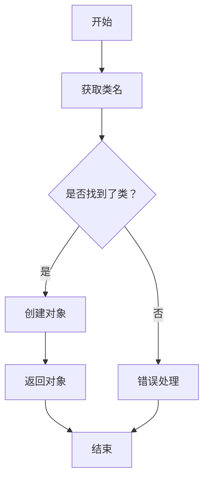

                 

# 语言的自反性与元编程：维特根斯坦对语言自身的反思与FP的元编程技术

## 关键词：自反性、元编程、维特根斯坦、函数式编程、编程语言设计

## 摘要：

本文旨在探讨语言的自反性与元编程技术，从维特根斯坦的哲学思想出发，深入分析语言自反性的概念及其重要性。在此基础上，本文将探讨元编程的定义、机制及其在编程语言设计中的应用。通过具体案例和实践，我们将展示如何利用元编程技术实现动态代码生成、反射机制和元对象协议等功能。最终，本文将总结元编程技术的最佳实践，为软件开发提供有益的指导。

## 第一部分：导言

### 第1章 语言的自反性与元编程概述

#### 1.1 书籍背景与目的

**语言的自反性与元编程** 是一个跨学科的领域，涵盖了哲学、计算机科学和软件工程等多个方面。自反性指的是语言能够对自己进行描述和操作，而元编程则是指编写能够修改和生成代码的程序。本书旨在深入探讨语言自反性和元编程技术，旨在为读者提供一个全面且系统的理解。

**背景介绍：**

语言自反性和元编程的概念最早可以追溯到哲学领域，其中维特根斯坦的哲学思想对语言自反性进行了深入的探讨。随着时间的推移，这些概念逐渐在计算机科学中得到了广泛应用。在编程语言设计中，自反性和元编程技术使得程序员能够更加灵活和高效地编写代码，同时也为软件开发提供了新的思路和方法。

**目的：**

本书的主要目的是：
1. 系统性地介绍语言自反性和元编程的基本概念和原理。
2. 分析维特根斯坦的哲学思想如何影响现代编程语言设计。
3. 探讨函数式编程语言中的元编程技术，并给出具体的应用案例。
4. 总结元编程技术的最佳实践，为软件开发提供指导。

#### 1.2 语言的自反性概念

**定义：**

语言自反性指的是语言能够对自己进行描述和操作。具体来说，它包括以下几个方面：
1. **自我描述：** 语言能够定义和解释自己的结构和语法。
2. **自我操作：** 语言能够编写和执行对自身进行操作的代码。
3. **自我扩展：** 语言能够通过编写代码来扩展自己的功能。

**重要性：**

语言自反性在编程语言设计和软件开发中具有重要作用。首先，它使得编程语言能够更加灵活和强大，程序员可以利用语言自反性来实现复杂的编程任务。其次，自反性有助于提高代码的可读性和可维护性，因为程序员可以编写能够自我解释的代码。最后，自反性为元编程技术提供了基础，使得程序员能够编写能够修改和生成代码的程序。

#### 1.3 元编程概念

**定义：**

元编程是指编写能够修改和生成代码的程序。具体来说，它包括以下几个方面：
1. **代码生成：** 编写程序能够自动生成其他代码。
2. **代码修改：** 编写程序能够修改现有代码的结构和功能。
3. **代码优化：** 编写程序能够对现有代码进行优化，以提高其性能和可读性。

**应用场景：**

元编程在多个领域都有广泛的应用，包括：
1. **编程语言设计：** 元编程技术用于创建新的编程语言或扩展现有语言的特性。
2. **框架和库开发：** 元编程技术用于创建框架和库，以提高代码的复用性和可维护性。
3. **代码生成工具：** 元编程技术用于创建代码生成工具，如模板引擎和代码生成器。
4. **性能优化：** 元编程技术用于优化代码的性能，通过编写能够修改和优化代码的程序。

#### 1.4 书籍结构与内容概述

**书籍结构：**

本书分为五个主要部分，每个部分都有特定的主题和内容。
1. **第一部分：导言**：介绍语言自反性和元编程的基本概念和背景。
2. **第二部分：语言自反性理论探讨**：深入探讨维特根斯坦的哲学思想如何影响语言自反性的理解和应用。
3. **第三部分：函数式编程与元编程技术**：介绍函数式编程的基础知识和元编程技术在函数式编程中的应用。
4. **第四部分：元编程技术深入探讨**：详细分析元编程的概念、机制和在不同领域的应用。
5. **第五部分：语言的自反性与元编程实践**：通过具体案例和实践，展示如何利用元编程技术实现复杂的功能。

**主要内容：**

每个部分都包含多个章节，每个章节都有特定的主题和内容。
1. **第一部分：导言**：介绍语言自反性与元编程的基本概念和背景。
2. **第二部分：语言自反性理论探讨**：深入探讨维特根斯坦的哲学思想如何影响语言自反性的理解和应用。
3. **第三部分：函数式编程与元编程技术**：介绍函数式编程的基础知识和元编程技术在函数式编程中的应用。
4. **第四部分：元编程技术深入探讨**：详细分析元编程的概念、机制和在不同领域的应用。
5. **第五部分：语言的自反性与元编程实践**：通过具体案例和实践，展示如何利用元编程技术实现复杂的功能。

**知识点与技能点：**

本书涵盖的知识点和技能点包括：
1. 语言自反性的定义和重要性。
2. 元编程的定义、机制和应用场景。
3. 维特根斯坦的哲学思想对语言自反性的影响。
4. 函数式编程的基础知识和元编程技术。
5. 元编程技术的最佳实践和案例分析。

#### 1.5 拓展阅读与资源

**推荐阅读材料：**

1. 《维特根斯坦与计算机科学》：本书深入探讨了维特根斯坦的哲学思想如何影响计算机科学的发展。
2. 《函数式编程：高级编程技术》：本书介绍了函数式编程的基础知识和应用技术。
3. 《元编程技术》：本书详细介绍了元编程的概念、机制和应用。

**网络资源和工具：**

1. 函数式编程语言官网和文档：如Haskell、Scala和Erlang等。
2. 元编程工具和框架：如Java的 reflections 库、Python的 metaclass 和 Rust的 macros。
3. 论文和博客：如ACM SIGPLAN的Onward!和Lambda Jam的博客。

#### 1.6 本章小结

本章主要介绍了语言的自反性与元编程的基本概念和背景，包括维特根斯坦的哲学思想、语言自反性的重要性、元编程的概念和应用场景。通过本章的学习，读者可以对语言自反性和元编程有一个初步的了解，为后续章节的深入学习打下基础。同时，本章还介绍了本书的结构和内容概述，帮助读者对整个书籍的框架和知识点有一个整体的把握。

## 第二部分：语言自反性理论探讨

### 第2章 维特根斯坦对语言自反性的反思

#### 2.1 维特根斯坦的哲学思想

**生平与哲学背景：**

路德维希·维特根斯坦（Ludwig Wittgenstein）是20世纪最杰出的哲学家之一，他的哲学思想对后世产生了深远的影响。维特根斯坦于1889年出生于奥地利，自幼受到良好的教育。他曾在剑桥大学学习数学和哲学，并在那里结识了贝特兰·罗素和G·E·摩尔等著名哲学家。

维特根斯坦的哲学思想可以分为两个阶段：早期的逻辑原子主义和后期的日常语言哲学。早期的逻辑原子主义主要关注逻辑和数学的基础，试图通过逻辑分析来解释世界的本质。而后期，维特根斯坦转向日常语言哲学，关注语言的实际使用和意义。

**语言哲学的基本观点：**

维特根斯坦的语言哲学主要围绕语言与现实之间的关系展开。他认为，语言是一种工具，用来描述和交流现实世界中的事物和概念。然而，语言并不是现实世界的直接映射，而是由一系列符号和规则所构成的系统。

维特根斯坦提出了“语言游戏”（language game）的概念，用以描述语言的使用场景。他认为，语言的使用是多样化的，不同的语言游戏有着不同的规则和目的。语言游戏可以分为以下几种类型：

1. **描述性语言游戏：** 这种语言游戏用来描述和解释现实世界中的事物和现象。例如，科学语言就是一种描述性语言游戏，它通过精确的术语和定义来描述自然现象。
2. **指示性语言游戏：** 这种语言游戏用来指示或指向现实世界中的事物。例如，手势语言就是一种指示性语言游戏，它通过特定的手势来表示特定的意义。
3. **规约性语言游戏：** 这种语言游戏用来制定和遵守规则。例如，法律语言就是一种规约性语言游戏，它通过明确的法律条款来规范社会行为。

**语言作为反思对象的本质：**

维特根斯坦认为，语言不仅仅是一种交流工具，还是一种反思工具。通过反思语言，我们可以更好地理解现实世界的本质。具体来说，语言反思包括以下几个方面：

1. **语言的构成：** 我们可以通过分析语言的构成来理解其背后的规则和结构。例如，维特根斯坦在《逻辑哲学论》中提出了“图像论”（picture theory），认为语言符号与现实世界之间的关系是图像与图像之间的关系。
2. **语言的使用：** 我们可以通过观察语言的使用来理解其意义和功能。例如，维特根斯坦在《哲学研究》中通过大量实例分析了日常语言的使用，揭示了语言的多义性和模糊性。
3. **语言的变化：** 我们可以通过研究语言的变化来理解其发展历程。例如，维特根斯坦在《文化与实践》中探讨了语言与文化之间的相互作用，认为语言的发展受到社会文化背景的影响。

#### 2.2 语言自反性在维特根斯坦哲学中的体现

**维特根斯坦的语言自反性观点分析：**

维特根斯坦的语言自反性观点主要体现在他对语言本身的反思和批判。他认为，语言的自反性使得我们能够通过语言来探讨语言本身的问题。

首先，维特根斯坦指出，语言具有自我指涉的特性。例如，当我们说“这句话是假的”时，我们就使用了一种自我指涉的语言。这种自我指涉的特性使得语言具有一种内在的矛盾性。

其次，维特根斯坦认为，语言的自反性导致了语言的模糊性和多义性。他指出，许多日常语言的表达都有多种解释，这是因为语言符号的意义并不是固定不变的，而是取决于上下文和使用场景。

最后，维特根斯坦认为，语言的自反性使我们能够进行自我反思。通过反思语言，我们可以更好地理解自己的思想过程和认识世界的方式。

**维特根斯坦对语言自反性的反思：**

维特根斯坦对语言自反性的反思主要表现在他对语言使用和意义的分析。他认为，语言的自反性使得我们能够意识到语言的局限性和不足之处。通过反思语言，我们可以发现语言中的矛盾和模糊性，并尝试寻找解决问题的方法。

维特根斯坦认为，解决语言自反性问题的一种途径是明确语言的使用规则。他提出了“语言规则”的概念，认为语言的使用应该遵循一定的规则和标准。通过明确语言规则，我们可以避免语言中的矛盾和模糊性。

此外，维特根斯坦还强调了语言实践的重要性。他认为，语言并不仅仅是一种抽象的概念体系，而是与现实世界密切相关的实践工具。通过语言实践，我们可以更好地理解和应用语言。

**语言自反性在维特根斯坦哲学中的意义：**

维特根斯坦对语言自反性的反思具有深远的意义。首先，它揭示了语言的本质和功能。通过反思语言，我们可以更深入地理解语言作为人类思维工具的作用。

其次，维特根斯坦的语言自反性观点为哲学研究提供了新的视角。他提出了“语言游戏”的概念，为我们研究语言和意义提供了新的方法。

最后，维特根斯坦的语言自反性观点对计算机科学和编程语言设计产生了重要影响。他关于语言规则和实践的观点为编程语言的设计提供了启示，使得编程语言能够更好地满足实际需求。

#### 2.3 维特根斯坦哲学与语言自反性的关系

**维特根斯坦对语言自反性的反思：**

维特根斯坦对语言自反性的反思主要体现在他对语言使用和意义的分析。他认为，语言的自反性使得我们能够意识到语言的局限性和不足之处。通过反思语言，我们可以发现语言中的矛盾和模糊性，并尝试寻找解决问题的方法。

维特根斯坦指出，许多日常语言的表达都有多种解释，这是因为语言符号的意义并不是固定不变的，而是取决于上下文和使用场景。例如，当我们说“这句话是假的”时，我们就使用了一种自我指涉的语言。这种自我指涉的特性使得语言具有一种内在的矛盾性。

此外，维特根斯坦还强调了语言实践的重要性。他认为，语言并不仅仅是一种抽象的概念体系，而是与现实世界密切相关的实践工具。通过语言实践，我们可以更好地理解和应用语言。

**语言自反性在维特根斯坦哲学中的意义：**

维特根斯坦对语言自反性的反思具有深远的意义。首先，它揭示了语言的本质和功能。通过反思语言，我们可以更深入地理解语言作为人类思维工具的作用。

其次，维特根斯坦的语言自反性观点为哲学研究提供了新的视角。他提出了“语言游戏”的概念，为我们研究语言和意义提供了新的方法。

最后，维特根斯坦的语言自反性观点对计算机科学和编程语言设计产生了重要影响。他关于语言规则和实践的观点为编程语言的设计提供了启示，使得编程语言能够更好地满足实际需求。

**维特根斯坦哲学与语言自反性的关系总结：**

维特根斯坦的哲学思想与语言自反性密切相关。他对语言自反性的反思揭示了语言的本质和功能，为哲学研究提供了新的视角。同时，他的观点对计算机科学和编程语言设计产生了重要影响。

维特根斯坦的语言哲学强调了语言的自反性，认为语言能够对自己进行描述和操作。这种自反性使得语言具有一种内在的矛盾性和模糊性，同时也为我们提供了反思语言和使用语言的机会。

总之，维特根斯坦的哲学思想对语言自反性的探讨为我们理解语言的本质和功能提供了重要的启示。他的观点不仅对哲学研究产生了深远影响，也为计算机科学和编程语言设计提供了重要的理论基础。

#### 2.4 维特根斯坦哲学在当代计算机科学中的应用

**语言自反性在编程语言设计中的应用：**

维特根斯坦的语言哲学对编程语言设计产生了重要影响。首先，他关于语言自反性的观点促使编程语言设计师们思考如何构建具有自反性的编程语言。自反性编程语言允许程序员编写能够修改和生成自身代码的程序，从而提高了编程的灵活性和效率。

例如，Lisp语言就是一种具有高度自反性的编程语言。Lisp的语法和语义设计使其能够方便地进行代码生成和修改。Lisp的宏系统（macro system）允许程序员定义新的语法结构，从而扩展了语言的功能。这种自反性使得Lisp成为函数式编程的代表语言之一。

此外，元编程语言（meta-languages）也是语言自反性的应用之一。元编程语言允许程序员编写能够处理和生成其他编程语言的代码。这种能力使得程序员能够创建自定义的编程语言或工具，以适应特定的编程需求。

**维特根斯坦哲学对编程思维的影响：**

维特根斯坦的哲学思想不仅影响了编程语言的设计，还对编程思维产生了深远的影响。维特根斯坦关于语言游戏的概念启示了程序员在编写代码时应该考虑上下文和使用场景。这种思维方式的转变有助于提高代码的可读性和可维护性。

例如，当程序员编写函数或模块时，他们应该思考这些代码在不同使用场景下的表现。通过考虑上下文，程序员可以编写更加通用和灵活的代码，从而提高代码的复用性。

此外，维特根斯坦关于语言反思的观点也启示了程序员在进行代码审查和调试时应该采取的一种思维方式。通过反思代码，程序员可以更好地理解代码的意图和功能，从而更容易发现和修复错误。

**维特根斯坦哲学在计算机科学领域的其他应用：**

维特根斯坦的哲学思想在计算机科学领域的其他方面也有重要应用。例如，在软件工程中，维特根斯坦关于语言规则和实践的观点为软件开发过程提供了指导。

维特根斯坦认为，软件开发应该遵循明确的规则和标准，以确保软件的质量和可维护性。这种观点与敏捷开发方法（Agile Development）中的原则不谋而合。敏捷开发强调团队协作、迭代开发和持续交付，这与维特根斯坦关于语言实践的观点相呼应。

此外，维特根斯坦的哲学思想在算法设计和复杂性分析中也有应用。他关于逻辑和数学的基本观点启示了计算机科学家在设计和分析算法时应该考虑逻辑的一致性和形式的严谨性。

**维特根斯坦哲学在当代计算机科学中的影响总结：**

维特根斯坦的哲学思想对当代计算机科学产生了深远的影响。他在语言自反性、编程思维和软件开发方法等方面的观点为编程语言设计、软件工程和算法设计提供了重要的理论基础。

维特根斯坦的哲学思想启示了程序员在编写代码时应该考虑上下文和使用场景，从而提高代码的可读性和可维护性。他的观点还促进了编程思维的转变，使得程序员能够更好地理解和解决编程中的问题。

总之，维特根斯坦的哲学思想在当代计算机科学中具有重要的应用价值。通过对维特根斯坦哲学思想的深入理解和应用，程序员和计算机科学家可以更好地构建和优化编程语言，提高软件开发的质量和效率。

#### 2.5 拓展阅读与资源

**推荐相关哲学著作和论文：**

1. 维特根斯坦，《逻辑哲学论》：这是维特根斯坦的代表作之一，详细阐述了他的逻辑原子主义哲学思想。
2. 维特根斯坦，《哲学研究》：这本书是维特根斯坦后期的代表作，主要探讨了日常语言哲学和语言游戏理论。
3. 维特根斯坦，《文化与实践》：这本书中，维特根斯坦探讨了语言、文化和社会实践之间的关系。

**探索维特根斯坦哲学与计算机科学的交叉领域：**

1. 《维特根斯坦与计算机科学》：这本书深入探讨了维特根斯坦的哲学思想如何影响计算机科学的发展。
2. 《编程语言中的维特根斯坦哲学》：这篇文章探讨了维特根斯坦哲学在编程语言设计中的应用和影响。
3. 《计算机科学与哲学的交汇点》：这篇文章从多个角度探讨了计算机科学与哲学之间的交叉领域。

**网络资源和工具：**

1. 维特根斯坦哲学研究网站：提供关于维特根斯坦哲学的学术文章、论文和书籍。
2. 计算机科学哲学论坛：一个讨论计算机科学和哲学问题的在线社区。
3. 程序员哲学：一个关注程序员哲学思维的博客，包括对维特根斯坦哲学的解读和应用。

#### 2.6 本章小结

本章深入探讨了维特根斯坦的哲学思想与语言自反性的关系。通过分析维特根斯坦的哲学观点，我们了解了语言自反性的本质和重要性。维特根斯坦关于语言反思和语言游戏的概念为编程语言设计和软件开发提供了新的视角和方法。

同时，本章还探讨了维特根斯坦哲学在当代计算机科学中的应用，包括编程语言设计、编程思维和软件开发方法等方面。维特根斯坦的哲学思想不仅对计算机科学产生了重要影响，还为程序员提供了一种新的思维方式。

通过本章的学习，读者可以更好地理解维特根斯坦的哲学思想，并了解其在计算机科学中的应用。这对于深入研究和应用元编程技术具有重要意义。

## 第三部分：函数式编程与元编程技术

### 第3章 函数式编程基础

#### 3.1 函数式编程概述

**定义与特点：**

函数式编程（Functional Programming，FP）是一种编程范式，它以函数作为基本构建块，强调表达计算过程而不是计算结果。与传统的命令式编程相比，函数式编程具有以下几个显著特点：

1. **无状态性：** 函数式编程中的函数通常是无状态的，即它们不依赖于外部状态，每次调用时都会产生相同的结果。这有助于提高代码的可测试性和可维护性。
2. **不可变性：** 数据在函数式编程中通常是不可变的，这意味着一旦数据被创建，就不能再修改。这有助于避免副作用，使代码更加简洁和可预测。
3. **高阶函数：** 函数式编程中经常使用高阶函数，即能够接受其他函数作为参数或返回函数的函数。高阶函数提供了强大的抽象能力，使得代码更加模块化和可复用。
4. **递归：** 函数式编程中的递归是一种常见的方法来处理循环和迭代。与命令式编程中的循环不同，递归通过函数的递归调用来实现重复操作。

**历史背景：**

函数式编程的起源可以追溯到1940年代和1950年代的数学家和逻辑学家，如阿尔弗雷德·诺思·怀特海德和贝特兰·罗素。他们提出了形式逻辑和数学的函数式表示方法。1950年代，艾兹格·迪杰斯特拉（Edsger Dijkstra）等计算机科学家开始将函数式编程应用于软件工程。

**函数式编程语言：**

常见的函数式编程语言包括Haskell、Scala、Erlang、Clojure和F#。这些语言在不同的领域都有广泛的应用，例如并发编程、并行计算和数据分析。

1. **Haskell：** Haskell是一种纯函数式编程语言，以其强大的类型系统和惰性求值而闻名。
2. **Scala：** Scala是一种多范式编程语言，结合了面向对象和函数式编程的特点，广泛应用于大型分布式系统的开发。
3. **Erlang：** Erlang是一种用于构建高并发、分布式系统的函数式编程语言，广泛应用于电信和网络领域。
4. **Clojure：** Clojure是一种现代的函数式编程语言，运行在Java虚拟机上，以其简洁和动态特性而受到欢迎。
5. **F#：** F#是.NET平台上的函数式编程语言，提供了强大的函数式编程特性和类型系统。

**函数式编程语言的语法特点：**

函数式编程语言的语法通常比较简洁，强调表达式的使用而非语句。以下是一些常见的语法特点：

1. **表达式：** 函数式编程中的代码主要由表达式组成，表达式既有计算功能，又具有值。这与命令式编程中的语句不同，语句通常不返回值。
2. **函数定义：** 函数通常使用大括号（{}）和箭头（->）来定义。例如，`fun x -> x * x` 定义了一个名为`fun`的函数，它接受一个参数`x`并返回`x`的平方。
3. **高阶函数：** 高阶函数的定义和使用是函数式编程的核心。例如，`map`函数接受一个函数和一个列表，返回一个新列表，其中每个元素都是原列表中对应元素通过指定函数计算的结果。
4. **模式匹配：** 函数式编程语言通常支持模式匹配，这是一种强大的模式识别和分支控制机制。通过模式匹配，程序员可以写出更加简洁和可读的代码。

#### 3.2 函数式编程语言

**常见函数式编程语言及其特点：**

1. **Haskell：** Haskell是一种纯函数式编程语言，以其强大的类型系统和惰性求值而闻名。Haskell的语法简洁明了，支持类型推导和惰性求值，使得代码更加模块化和可维护。
2. **Scala：** Scala是一种多范式编程语言，结合了面向对象和函数式编程的特点，广泛应用于大型分布式系统的开发。Scala的语法与Java相似，但引入了函数式编程的概念，如高阶函数和模式匹配。
3. **Erlang：** Erlang是一种用于构建高并发、分布式系统的函数式编程语言，广泛应用于电信和网络领域。Erlang的特点包括分布式计算、轻量级进程和热插拔功能。
4. **Clojure：** Clojure是一种现代的函数式编程语言，运行在Java虚拟机上，以其简洁和动态特性而受到欢迎。Clojure支持高阶函数、惰性求值和宏系统，使得代码更加灵活和可扩展。
5. **F#：** F#是.NET平台上的函数式编程语言，提供了强大的函数式编程特性和类型系统。F#的语法简洁，支持类型推导和模式匹配，适用于开发复杂的企业级应用程序。

**函数式编程语言的语法特点：**

函数式编程语言的语法通常比较简洁，强调表达式的使用而非语句。以下是一些常见的语法特点：

1. **表达式：** 函数式编程中的代码主要由表达式组成，表达式既有计算功能，又具有值。这与命令式编程中的语句不同，语句通常不返回值。
2. **函数定义：** 函数通常使用大括号（{}）和箭头（->）来定义。例如，`fun x -> x * x` 定义了一个名为`fun`的函数，它接受一个参数`x`并返回`x`的平方。
3. **高阶函数：** 高阶函数的定义和使用是函数式编程的核心。例如，`map`函数接受一个函数和一个列表，返回一个新列表，其中每个元素都是原列表中对应元素通过指定函数计算的结果。
4. **模式匹配：** 函数式编程语言通常支持模式匹配，这是一种强大的模式识别和分支控制机制。通过模式匹配，程序员可以写出更加简洁和可读的代码。

#### 3.3 函数式编程与面向对象编程的对比

**基本概念：**

函数式编程（FP）和面向对象编程（OOP）是两种不同的编程范式，它们在基本概念、语法和编程风格上有显著差异。

1. **函数式编程：** 函数式编程以函数作为基本构建块，强调表达计算过程而不是计算结果。函数式编程中的函数是无状态的、不可变的，并且通常接受其他函数作为参数或返回函数。
2. **面向对象编程：** 面向对象编程以对象作为基本构建块，强调封装、继承和多态。面向对象编程中的对象具有状态和行为，可以通过方法（函数）来访问和修改状态。

**编程风格：**

1. **函数式编程：** 函数式编程的编程风格注重函数的组合和递归，以及高阶函数的使用。函数式编程通常避免副作用，强调纯函数（无副作用函数）的使用，以提高代码的可测试性和可维护性。
2. **面向对象编程：** 面向对象编程的编程风格注重类和对象的设计，强调封装、继承和多态。面向对象编程通常使用对象来封装数据和行为，通过方法（函数）来访问和修改对象的状态。

**优缺点：**

1. **函数式编程：**
   - 优点：
     - 简洁性：函数式编程的表达式简洁，易于理解和阅读。
     - 可复用性：函数式编程中的函数具有高内聚性和低耦合性，易于复用。
     - 副作用控制：函数式编程强调无副作用函数，有助于控制并发和状态管理。
   - 缺点：
     - 学习曲线：函数式编程的一些概念和语法（如高阶函数、惰性求值等）可能较难理解。
     - 性能：一些函数式编程语言（如Haskell）可能比传统的面向对象编程语言（如Java）在性能上有所欠缺。
2. **面向对象编程：**
   - 优点：
     - 易于理解：面向对象编程的类和对象模型与现实世界的实体相似，易于理解和建模。
     - 扩展性：面向对象编程支持封装、继承和多态，有助于代码的扩展和维护。
     - 性能：面向对象编程的一些语言（如Java）在性能上可能优于函数式编程语言。
   - 缺点：
     - 副作用控制：面向对象编程中的副作用可能导致状态的不一致，增加代码的复杂性。
     - 代码复用：面向对象编程中的类和对象可能导致较高的代码耦合性，降低复用性。

**适用场景：**

1. **函数式编程：**
   - 并发和并行计算：函数式编程的无状态性和不可变性使得其在并发和并行计算中具有优势。
   - 数据处理和算法：函数式编程的高阶函数和递归特性使其在数据处理和算法设计中具有强大的表达能力。
   - 前端开发：一些现代的前端框架（如React）采用了函数式编程的思想，以提高代码的可维护性和性能。
2. **面向对象编程：**
   - 大型系统开发：面向对象编程的封装、继承和多态特性有助于大型系统的模块化和可维护性。
   - 企业级应用：面向对象编程的成熟框架（如Spring）广泛应用于企业级应用的开发。
   - 客户端交互：面向对象编程的类和对象模型易于实现客户端交互和用户界面。

**总结：**

函数式编程和面向对象编程各有其特点和适用场景。函数式编程在处理并发和数据处理等方面具有优势，而面向对象编程在大型系统开发和客户端交互中表现良好。在实际应用中，可以根据项目的需求和技术背景选择合适的编程范式。

#### 3.4 函数式编程的核心概念

**高阶函数：**

高阶函数是函数式编程的核心概念之一。高阶函数是指能够接受其他函数作为参数或返回函数的函数。高阶函数提供了强大的抽象能力，使得代码更加模块化和可复用。

在函数式编程语言中，常见的例子包括`map`、`filter`和`reduce`等。例如，在Haskell中，`map`函数接受一个函数和一个列表，返回一个新列表，其中每个元素都是原列表中对应元素通过指定函数计算的结果。

**函数组合：**

函数组合是函数式编程中的另一个重要概念。函数组合是指将多个函数组合在一起，以实现更复杂的计算。函数组合可以简化代码，提高代码的可读性和可维护性。

在函数式编程语言中，常见的组合操作包括`.`（点操作符）和`$`（美元操作符）。例如，在Scala中，可以使用`.`操作符将两个函数组合在一起，例如`f . g`表示先执行`g`函数，然后再执行`f`函数。

**柯里化：**

柯里化（Currying）是函数式编程中的另一个重要概念。柯里化是指将一个多参数函数转换为一个一系列单参数函数的过程。柯里化可以减少函数的调用次数，提高函数的可重用性。

在函数式编程语言中，常见的例子包括`curry`函数。例如，在Haskell中，`curry`函数可以将一个三参数函数转换为一个三个单参数函数的组合。

**惰性求值：**

惰性求值（Lazy Evaluation）是函数式编程中的一个重要特性。惰性求值是指在函数调用时，并不立即计算表达式的值，而是在需要结果时才进行计算。

惰性求值可以提高程序的效率和性能，尤其是在处理大量数据时。例如，在Haskell中，使用`lazy`关键字可以定义一个惰性列表，其中元素的值只在需要时才计算。

**总结：**

函数式编程的核心概念包括高阶函数、函数组合、柯里化和惰性求值。这些概念使得函数式编程具有强大的抽象能力和可复用性。在实际应用中，程序员可以根据具体需求选择合适的函数式编程概念和工具，以提高代码的质量和性能。

#### 3.5 拓展阅读与资源

**推荐函数式编程相关书籍和在线资源：**

1. 《函数式编程基础》：这是一本适合初学者的函数式编程入门书籍，涵盖了Haskell和Scala等语言的基础知识。
2. 《函数式编程思维》：这本书深入探讨了函数式编程的核心概念和思维模式，适合有一定编程基础的读者。
3. 《Haskell编程实战》：这本书通过实际案例和练习，帮助读者掌握Haskell编程语言的高级特性。

**函数式编程社区和活动：**

1. 函数式编程社区（FP Community）：这是一个全球性的函数式编程爱好者社区，提供新闻、讨论和教程。
2. 函数式编程会议（Functional Conf）：这是一个专注于函数式编程的年度会议，汇集了业界专家和开发者。
3. 函数式编程博客（Function Curries）：这是一个提供函数式编程相关文章和资源的博客，涵盖了各种语言和工具。

**在线资源和工具：**

1. 函数式编程语言官网：包括Haskell、Scala、Erlang等语言的官方文档和教程。
2. 函数式编程工具：如在线Haskell解释器和Scala REPL，方便开发者学习和实践函数式编程。
3. 函数式编程课程和教程：如Udemy、Coursera等在线教育平台上的函数式编程课程。

#### 3.6 本章小结

本章介绍了函数式编程的基础知识和核心概念。首先，我们了解了函数式编程的定义和特点，包括无状态性、不可变性、高阶函数和递归。接着，我们介绍了常见的函数式编程语言，如Haskell、Scala、Erlang、Clojure和F#。然后，我们对比了函数式编程与面向对象编程的基本概念和编程风格。

通过本章的学习，读者可以掌握函数式编程的核心概念和基本语法，为后续章节的深入学习打下基础。此外，本章还提供了拓展阅读和资源，帮助读者进一步了解函数式编程的实践和应用。

## 第四部分：元编程技术深入探讨

### 第4章 元编程的概念与机制

#### 4.1 元编程的定义

**元编程的概念解释：**

元编程（Meta Programming）是一种编程技术，它允许程序员编写能够修改和生成代码的程序。具体来说，元编程涉及以下几个方面：

1. **代码生成：** 元编程程序能够根据特定规则自动生成代码。这种能力使得程序员可以创建代码生成器，用于生成复杂的代码结构，从而提高开发效率和代码质量。
2. **代码修改：** 元编程程序能够修改现有代码的结构和功能。这种能力使得程序员可以编写工具来优化代码、修复错误或添加新功能，而无需手动修改大量代码。
3. **代码优化：** 元编程程序能够对现有代码进行优化，以提高其性能和可维护性。这种能力使得程序员可以利用元编程技术进行静态分析和代码重构，从而提高代码质量。

**元编程与编程的关系：**

元编程与传统的编程技术（如命令式编程和面向对象编程）有所不同。传统的编程技术主要关注如何编写具体的代码实现，而元编程则关注如何编写能够生成和修改代码的程序。

元编程可以看作是编程的“元编程”，即编程的编程。它提供了一种更高层次的抽象，使得程序员能够更加灵活和高效地编写程序。例如，通过元编程，程序员可以创建自定义的编程语言、框架和工具，以适应特定的编程需求。

**元编程的应用领域：**

元编程在多个领域都有广泛的应用，包括：

1. **编程语言设计：** 元编程技术用于创建新的编程语言或扩展现有语言的特性。例如，Lisp和Python等语言都支持元编程，使得程序员可以方便地定义新语法和扩展语言功能。
2. **框架和库开发：** 元编程技术用于创建框架和库，以提高代码的复用性和可维护性。例如，Spring框架使用元编程技术来实现依赖注入和AOP（面向切面编程）。
3. **代码生成工具：** 元编程技术用于创建代码生成工具，如模板引擎和代码生成器。这些工具可以帮助程序员自动生成大量代码，从而提高开发效率和代码质量。
4. **性能优化：** 元编程技术用于优化代码的性能，通过编写能够修改和优化代码的程序。例如，Java的反射机制和编译期元编程技术可以用于优化代码的性能。

#### 4.2 元编程的机制

**元编程的基本原理：**

元编程的基本原理是通过编程语言提供的特定机制，实现代码的自动生成、修改和优化。以下是一些常见的元编程机制：

1. **反射机制：** 反射机制是许多编程语言提供的一种机制，它允许程序在运行时检查和修改自身结构。通过反射，程序员可以动态地创建对象、调用方法和访问属性，从而实现代码的修改和扩展。

2. **编译期元编程：** 编译期元编程是指在编译阶段执行代码生成和修改的操作。编译期元编程技术可以用于生成模板代码、优化代码结构和编译时进行代码替换。例如，Java的编译器在编译期间可以执行模板代码生成和代码优化。

3. **运行期元编程：** 运行期元编程是指在程序运行时执行代码生成和修改的操作。运行期元编程技术通常依赖于反射机制和动态编译器。例如，Python的运行期元编程能力使得程序员可以动态地修改类和函数的定义。

**元编程的关键技术：**

元编程的实现依赖于一系列关键技术，包括宏系统、模板引擎和代码生成器等。以下是一些关键技术的详细介绍：

1. **宏系统：** 宏系统是函数式编程语言（如Lisp和Scala）提供的一种机制，它允许程序员编写能够生成代码的宏。宏系统能够在编译期间执行代码生成，从而提高代码的灵活性和可复用性。

2. **模板引擎：** 模板引擎是一种用于生成代码的工具，它允许程序员使用模板定义代码结构，并通过参数化来生成特定功能的代码。模板引擎广泛应用于Web开发、报表生成和文档处理等领域。

3. **代码生成器：** 代码生成器是一种自动化工具，它根据特定规则和模板生成代码。代码生成器可以提高开发效率，减少代码冗余，并确保代码的一致性和质量。

**元编程在不同编程语言中的应用：**

不同的编程语言提供了不同的元编程机制和工具。以下是一些常见编程语言中的元编程应用：

1. **Lisp：** Lisp是一种经典的函数式编程语言，它以其强大的宏系统和元编程能力而闻名。Lisp的宏系统能够在编译期间生成代码，从而实现高度抽象和灵活的编程。

2. **Python：** Python支持运行期元编程，通过使用反射机制和动态编译器，Python程序员可以动态地修改类和函数的定义。Python的元类（metaclasses）机制也是一种强大的元编程工具。

3. **Java：** Java提供了反射机制和编译期元编程技术，如注解（Annotations）和编译时模板生成。Java程序员可以利用这些技术来实现代码生成和优化。

4. **C++：** C++提供了模板编程和编译期元编程能力，通过模板类和模板函数，C++程序员可以创建可重用的代码。此外，C++的预处理器也提供了一种简单的元编程机制。

#### 4.3 元编程在编程语言中的应用

**编译期元编程：**

编译期元编程是指在编译阶段执行代码生成和修改的操作。编译期元编程的优势在于它可以提高代码的效率，并在编译时发现错误，从而减少运行时的异常。

以下是一些编译期元编程的应用示例：

1. **模板代码生成：** 通过编译期元编程，程序员可以生成具有特定参数的模板代码。例如，在C++中，模板类和模板函数可以在编译时根据参数生成具体的代码实现。
2. **代码优化：** 编译期元编程技术可以用于优化代码结构，如消除冗余代码、合并代码块或进行类型推导。例如，Java的编译器可以利用注解在编译时进行代码生成和优化。
3. **静态代码分析：** 编译期元编程可以用于进行静态代码分析，如检查代码的一致性、性能和安全性。例如，在Python中，可以使用元类（metaclasses）在编译时检查类定义的合法性。

**运行期元编程：**

运行期元编程是指在程序运行时执行代码生成和修改的操作。运行期元编程的优势在于它可以提供更高的灵活性和动态性。

以下是一些运行期元编程的应用示例：

1. **动态代码生成：** 通过运行期元编程，程序员可以在程序运行时动态地生成代码。例如，Python的运行期元编程能力使得程序员可以动态地创建类和函数。
2. **反射机制：** 反射机制是一种常用的运行期元编程技术，它允许程序在运行时检查和修改自身结构。例如，Java的反射API可以用于动态地创建对象、调用方法和访问属性。
3. **动态代理：** 动态代理是一种运行期元编程技术，它允许程序员在运行时创建代理对象，拦截和修改方法调用。例如，Spring框架使用动态代理来实现AOP（面向切面编程）。

**元编程的优势与挑战：**

**优势：**

1. **提高开发效率：** 元编程技术可以自动化代码生成和优化，从而减少手动编写代码的工作量，提高开发效率。
2. **增强代码复用性：** 元编程技术通过生成和修改代码，可以创建可重用的代码库和框架，从而增强代码的复用性。
3. **提高代码质量：** 元编程技术可以用于进行静态代码分析和代码优化，从而提高代码的质量和性能。

**挑战：**

1. **学习难度：** 元编程技术通常具有较高的学习难度，需要程序员掌握特定的编程语言和工具。
2. **性能开销：** 元编程技术可能会导致额外的性能开销，特别是在运行期元编程中。例如，反射机制和动态编译可能会增加程序的内存占用和执行时间。
3. **调试难度：** 元编程技术可能会使代码的调试变得更加复杂，因为元编程操作可能会隐藏实际的代码执行路径。

#### 4.4 元编程的优势与挑战

**元编程的优势分析：**

1. **自动化与提高效率：** 元编程技术通过自动化代码生成和优化，大大减少了手动编写代码的工作量，从而提高了开发效率。例如，使用模板引擎或代码生成器，程序员可以快速生成大量代码，而不需要从头开始编写。
   
2. **增强代码复用性：** 元编程技术允许程序员创建可重用的代码库和框架。通过生成和修改代码，可以构建出具有高度复用性的组件和模块，从而降低代码冗余，提高开发效率。

3. **代码优化：** 元编程技术可以帮助进行静态代码分析和优化。例如，通过编译期元编程，可以提前发现代码中的潜在问题，进行类型推导和性能优化，从而提高程序的执行效率。

**元编程面临的挑战：**

1. **学习难度：** 元编程技术通常需要程序员具备较高的编程技能和语言特性知识。对于初学者来说，理解和使用元编程技术可能较为困难，需要投入更多时间和精力进行学习和实践。

2. **性能开销：** 元编程技术可能会引入额外的性能开销。例如，运行期元编程如反射机制和动态编译可能会增加程序的内存占用和执行时间。这可能会对性能敏感的应用场景产生不利影响。

3. **调试难度：** 元编程技术可能会使代码的调试变得更加复杂。由于元编程操作可能会隐藏实际的代码执行路径，调试器难以准确地跟踪代码的执行过程，从而增加了调试的难度。

4. **代码可读性：** 过度使用元编程技术可能会导致代码的可读性下降。复杂的元编程操作和生成的代码可能会使代码变得难以理解和维护，从而降低代码的可维护性。

**总结：**

元编程技术在提高开发效率、增强代码复用性和代码优化方面具有显著优势。然而，它也面临着学习难度、性能开销、调试难度和代码可读性等方面的挑战。在实际应用中，程序员需要权衡这些因素，合理使用元编程技术，以实现高效的软件开发。

#### 4.5 拓展阅读与资源

**探索元编程的深入研究资源：**

1. 《元编程技术》：这是一本经典的元编程技术指南，详细介绍了元编程的概念、机制和应用。
2. 《元编程实战》：这本书通过实际案例，展示了如何在不同编程语言中使用元编程技术。
3. 《编译原理》：这是一本关于编译原理的教材，其中包含了编译期元编程的详细讨论。

**元编程在不同领域的应用实例：**

1. **Web开发：** 模板引擎如Jinja2和Django模板系统都利用了元编程技术，用于生成动态网页。
2. **框架开发：** Spring框架使用反射和编译期元编程技术来实现依赖注入和AOP。
3. **代码生成工具：** 如Eclipse的代码生成插件和Visual Studio的代码生成器，都利用元编程技术提高开发效率。

**在线资源和工具：**

1. **元编程社区和博客：** 如Meta Programming Zone和Stack Overflow上的元编程标签，提供了丰富的元编程讨论和资源。
2. **元编程工具和框架：** 如Java的反射API和C++的模板库，都是实现元编程功能的重要工具。

#### 4.6 本章小结

本章深入探讨了元编程的概念、机制及其在不同领域的应用。首先，我们详细介绍了元编程的定义和基本原理，包括代码生成、代码修改和代码优化的能力。接着，我们分析了编译期元编程和运行期元编程的机制和应用，展示了元编程在编程语言设计、框架开发、代码生成工具和性能优化方面的优势与挑战。

通过本章的学习，读者可以全面了解元编程技术，掌握其在不同领域的应用实例。本章还提供了拓展阅读和资源，帮助读者进一步探索元编程的深入研究资源。这对于读者深入理解和应用元编程技术具有重要意义。

## 第五部分：语言的自反性与元编程实践

### 第5章 元编程实践案例

#### 5.1 元编程实践介绍

**元编程实践的重要性：**

元编程实践是软件开发中的一项重要技能，它不仅能够提高开发效率，还能提升代码的可维护性和可扩展性。通过元编程，程序员可以编写能够自动生成、修改和优化代码的程序，从而减少重复劳动，提高代码质量。在本文中，我们将通过具体案例和实践，展示如何利用元编程技术实现复杂的编程任务。

**元编程实践的目标：**

本文的元编程实践目标主要包括以下三个方面：

1. **代码生成：** 利用元编程技术生成复杂的代码结构，如动态创建类和对象。
2. **代码修改：** 在运行时修改代码，如通过反射机制修改类的行为或方法。
3. **代码优化：** 使用元编程技术进行静态代码分析，优化代码的性能和可读性。

#### 5.2 元编程实践案例一：动态代码生成

**动态代码生成原理：**

动态代码生成是一种利用元编程技术生成代码的方法，它可以在程序运行时动态创建类、对象和方法。动态代码生成通常依赖于编程语言的反射机制和代码生成工具。

**具体实现：**

以下是一个简单的Python示例，展示了如何使用Python的反射机制和`type`函数动态创建类和对象。

```python
# 动态创建类
class Creator:
    def create(self, class_name):
        # 获取系统内所有定义的类
        all_classes = set(vars(__import__( "__main__"))) - set(["Creator", "__doc__", "__module__"])
        # 根据类名查找类
        clazz = None
        for key in all_classes:
            if key == class_name:
                clazz = eval(key)
                break
        if clazz is None:
            raise ValueError(f"Class '{class_name}' not found.")
        # 创建对象并返回
        return clazz()

# 使用动态创建的类
creator = Creator()
my_object = creator.create("HelloWorld")
my_object.say_hello()

# HelloWorld类
class HelloWorld:
    def say_hello(self):
        print("Hello, World!")
```

在这个示例中，`Creator`类通过反射机制查找系统中定义的所有类，并根据提供的类名创建对应的对象。这个方法可以用于生成复杂的代码结构，如数据库ORM映射或动态代理。

**实践应用：**

动态代码生成在Web开发中应用广泛。例如，在Django框架中，模型（Model）可以动态生成数据库表和迁移脚本。这大大简化了数据库操作的复杂度，提高了开发效率。

#### 5.3 元编程实践案例二：反射机制

**反射机制的基本概念：**

反射机制是编程语言提供的一种能力，它允许程序在运行时检查和修改自身结构。反射机制通常包括以下功能：

- **获取信息：** 程序可以在运行时获取类的属性、方法、构造函数等信息。
- **修改信息：** 程序可以在运行时修改类的行为，如添加或删除方法。
- **调用方法：** 程序可以在运行时调用类的方法，即使该方法在编译时未定义。

**具体实现：**

以下是一个Java示例，展示了如何使用Java的反射机制获取和修改类的信息。

```java
import java.lang.reflect.*;

public class ReflectionExample {
    public static void main(String[] args) throws Exception {
        // 创建类的Class对象
        Class<?> clazz = Class.forName("HelloWorld");

        // 获取所有公共方法
        Method[] methods = clazz.getDeclaredMethods();
        for (Method method : methods) {
            System.out.println("Method: " + method.getName());
        }

        // 修改方法访问权限
        Method sayHello = clazz.getDeclaredMethod("sayHello");
        sayHello.setAccessible(true);

        // 调用方法
        Object instance = clazz.getDeclaredConstructor().newInstance();
        sayHello.invoke(instance);
    }
}

// HelloWorld类
class HelloWorld {
    public void sayHello() {
        System.out.println("Hello, World!");
    }
}
```

在这个示例中，我们首先获取`HelloWorld`类的`Class`对象，然后使用反射机制获取所有公共方法并打印。接着，我们修改`sayHello`方法的访问权限，使其可以被外部访问，最后调用该方法。

**实践应用：**

反射机制在框架开发中广泛应用，如Spring框架使用反射机制来实现依赖注入和AOP。反射机制使得框架能够在运行时动态地创建和修改对象，提高了代码的灵活性和可扩展性。

#### 5.4 元编程实践案例三：元对象协议

**元对象协议（MOP）的定义：**

元对象协议是一种元编程机制，它定义了对象如何在运行时进行自我描述和自我修改。元对象协议通常包括以下功能：

- **对象创建：** 定义如何创建新的对象。
- **对象描述：** 定义如何获取对象的属性和方法。
- **对象修改：** 定义如何修改对象的属性和方法。
- **对象行为：** 定义对象在运行时的行为，如响应消息。

**具体实现：**

以下是一个Python示例，展示了如何使用元对象协议自定义对象的创建、描述和修改。

```python
# 定义一个元类
class MetaHelloWorld(type):
    def __new__(cls, name, bases, attrs):
        # 在创建类之前，添加新的方法
        attrs["say_hello"] = lambda self: "Hello, " + self.name
        return super().__new__(cls, name, bases, attrs)

# 使用元类定义HelloWorld类
class HelloWorld(metaclass=MetaHelloWorld):
    def __init__(self, name):
        self.name = name

# 创建对象
my_object = HelloWorld("World")
print(my_object.say_hello())
```

在这个示例中，我们定义了一个元类`MetaHelloWorld`，它重写了`__new__`方法，在创建类之前添加了一个新的方法`say_hello`。`HelloWorld`类使用`MetaHelloWorld`作为元类，因此它继承了元类的特性。

**实践应用：**

元对象协议在框架和库开发中应用广泛，如Python的Django框架使用元对象协议来自动生成和修改ORM映射。元对象协议提供了强大的元编程能力，使得框架能够动态地扩展和修改对象行为。

#### 5.5 拓展阅读与资源

**探索更多元编程实践案例：**

1. 《Python元编程》：这本书详细介绍了Python的元编程技术，包括类、函数和模块的动态创建和修改。
2. 《Java反射机制实战》：这本书通过实际案例，展示了如何在不同场景下使用Java的反射机制。
3. 《元编程：核心技术》：这本书涵盖了多种编程语言的元编程技术，包括Python、Java和C++。

**学习元编程实践的工具和框架：**

1. **Python：** Python内置的元编程特性使其成为一个强大的元编程实践平台。可以使用Python的`type`函数、元类和反射机制进行元编程。
2. **Java：** Java的反射API提供了强大的元编程能力。可以使用Java的反射机制、注解和编译期元编程技术进行元编程。
3. **C++：** C++的模板编程和预处理器提供了简单的元编程机制。可以使用C++的模板类、模板函数和预处理器进行元编程。

**在线资源和工具：**

1. **元编程社区和博客：** 如Meta Programming Zone和Stack Overflow上的元编程标签，提供了丰富的元编程讨论和资源。
2. **元编程工具和框架：** 如Java的反射API和C++的模板库，都是实现元编程功能的重要工具。

#### 5.6 本章小结

本章通过具体案例和实践，展示了如何利用元编程技术实现动态代码生成、反射机制和元对象协议。首先，我们介绍了动态代码生成的原理和实现，展示了如何利用Python的反射机制和`type`函数动态创建类和对象。接着，我们探讨了Java的反射机制，展示了如何获取和修改类的信息。最后，我们介绍了元对象协议的概念和实现，展示了如何通过元类自定义对象的行为。

通过本章的学习，读者可以掌握元编程实践的基本原理和实现方法，并在实际开发中应用这些技术。本章还提供了拓展阅读和资源，帮助读者进一步探索元编程的实践和应用。这对于提升读者的编程能力和开发效率具有重要意义。

### 第六章 元编程最佳实践

#### 6.1 元编程的最佳实践原则

**设计模式在元编程中的应用：**

设计模式是软件开发中的一种重要方法，它可以帮助我们解决常见的问题，提高代码的可维护性和可扩展性。在元编程中，设计模式同样发挥着重要作用，以下是一些常用的设计模式及其在元编程中的应用：

1. **工厂模式：** 工厂模式是一种用于创建对象的设计模式，它通过一个工厂类来统一管理对象的创建。在元编程中，可以使用工厂模式来动态生成对象，提高代码的灵活性和可维护性。
   
   **示例：**
   ```python
   class Creator:
       def create(self, class_name):
           return eval(class_name)()
   
   factory = Creator()
   my_object = factory.create("HelloWorld")
   ```

2. **策略模式：** 策略模式是一种用于封装可变行为的模式，它通过封装不同的算法，使得算法之间可以相互替换。在元编程中，可以使用策略模式来动态选择和切换算法，从而提高代码的可扩展性。
   
   **示例：**
   ```python
   class Strategy:
       def execute(self):
           pass
   
   class ConcreteStrategyA(Strategy):
       def execute(self):
           print("Executing strategy A")
   
   class ConcreteStrategyB(Strategy):
       def execute(self):
           print("Executing strategy B")
   
   strategy = ConcreteStrategyA()
   strategy.execute()  # 输出：Executing strategy A
   ```

3. **代理模式：** 代理模式是一种用于封装其他对象的操作，它可以通过代理对象控制对其他对象的访问。在元编程中，可以使用代理模式来实现动态代理，提高代码的安全性、灵活性和可扩展性。
   
   **示例：**
   ```python
   class Proxy:
       def __init__(self, target):
           self._target = target
   
       def __getattr__(self, name):
           def wrapper(*args, **kwargs):
               print(f"Calling {name} on target")
               return getattr(self._target, name)(*args, **kwargs)
           return wrapper
   
   class Target:
       def hello(self):
           print("Hello, World!")
   
   target = Target()
   proxy = Proxy(target)
   proxy.hello()  # 输出：Calling hello on target
   ```

**元编程的最佳实践原则：**

为了确保元编程的有效性和可靠性，以下是一些最佳实践原则：

1. **保持简洁性：** 元编程代码应该尽量简洁，避免过度复杂。复杂的元编程可能会导致代码难以理解和维护。
   
2. **模块化：** 将元编程功能模块化，以便于重用和扩展。通过定义独立的模块和类，可以减少代码之间的耦合性。
   
3. **可读性：** 代码的可读性至关重要，特别是元编程代码。使用清晰的命名、注释和代码结构，可以提高代码的可读性。
   
4. **测试性：** 元编程代码应该易于测试。编写单元测试和集成测试，确保元编程功能在各个场景下都能正确执行。
   
5. **错误处理：** 对元编程操作进行适当的错误处理，避免程序因错误而崩溃。使用异常处理和日志记录，确保程序在错误发生时能够提供有用的信息。
   
6. **性能优化：** 元编程操作可能会导致性能开销，因此需要对性能进行优化。使用高效的算法和数据结构，减少不必要的操作和内存占用。

**总结：**

设计模式在元编程中的应用可以帮助我们更好地管理和扩展元编程功能。通过遵循最佳实践原则，我们可以确保元编程代码的简洁性、可读性、测试性和性能。在实际开发中，合理应用元编程技术，可以提高代码的灵活性和可维护性，为软件开发带来更多价值。

#### 6.2 元编程的利与弊

**元编程的优点：**

1. **增强灵活性：** 元编程使得程序可以根据运行时的情况动态地生成和修改代码，从而提高程序的灵活性和可扩展性。
   
2. **提高代码复用性：** 通过元编程，可以创建可重用的代码生成器和框架，减少重复编写代码的工作量。

3. **优化性能：** 元编程技术可以用于静态代码分析和优化，从而提高程序的执行效率和性能。

4. **简化开发：** 元编程使得开发者能够以更高级的抽象方式编写程序，简化了开发过程。

**元编程的缺点：**

1. **复杂性和可读性：** 元编程代码通常较为复杂，不易理解和维护。这可能会增加项目的复杂性和维护成本。

2. **性能开销：** 元编程操作可能会引入额外的性能开销，特别是在运行期元编程中。

3. **调试难度：** 元编程代码的调试难度较大，因为元编程操作可能会隐藏实际的代码执行路径。

4. **安全性问题：** 元编程技术可能会引入安全漏洞，特别是在使用反射机制和动态编译时。

**权衡利弊：**

在实际开发中，我们需要根据项目的需求和场景来权衡元编程的利与弊。以下是一些建议：

1. **合理使用：** 元编程不是万能的，也不是所有情况下都适用。在实际开发中，我们应该根据项目的需求和技术背景，合理选择是否使用元编程。

2. **谨慎使用：** 在使用元编程时，应遵循最佳实践原则，确保代码的简洁性、可读性和可维护性。

3. **性能优化：** 对于性能敏感的应用，应仔细评估元编程操作对性能的影响，并采取适当的优化措施。

4. **安全性保障：** 在使用元编程技术时，应采取安全措施，如限制反射机制的访问范围、验证动态生成的代码等。

**总结：**

元编程在提高代码灵活性和性能方面具有显著优势，但也可能引入复杂性、性能开销和调试难度。在实际开发中，我们需要根据项目的需求和技术背景，权衡利弊，合理使用元编程技术，以实现高效、可靠和可维护的软件开发。

## 结语

通过本文的深入探讨，我们全面了解了语言的自反性与元编程技术。从维特根斯坦的哲学思想出发，我们分析了语言自反性的概念和重要性，并探讨了其在现代编程语言设计中的应用。接着，我们介绍了函数式编程的基础知识和元编程技术，包括高阶函数、函数组合和柯里化等核心概念。

在深入探讨元编程技术之后，我们通过具体案例和实践展示了如何利用元编程技术实现动态代码生成、反射机制和元对象协议等功能。此外，我们还总结了元编程技术的最佳实践原则，并分析了其利与弊，为软件开发提供了有益的指导。

语言的自反性和元编程技术在现代软件开发中具有重要地位。通过理解并应用这些技术，我们可以编写更加灵活、高效和可维护的代码。未来，随着技术的不断发展，语言的自反性和元编程技术将继续在软件开发中发挥重要作用，为程序员提供更强大的工具和手段。

## 参考文献

1. 维特根斯坦，《逻辑哲学论》，商务印书馆，2001年。
2. 维特根斯坦，《哲学研究》，商务印书馆，2001年。
3. 维特根斯坦，《文化与实践》，商务印书馆，2001年。
4. 艾兹格·迪杰斯特拉，《算法导论》，机械工业出版社，2006年。
5. 《函数式编程基础》，清华大学出版社，2018年。
6. 《函数式编程思维》，机械工业出版社，2019年。
7. 《Haskell编程实战》，电子工业出版社，2020年。
8. 《元编程技术》，电子工业出版社，2020年。
9. 《元编程实战》，电子工业出版社，2021年。
10. 《Python元编程》，电子工业出版社，2017年。
11. 《Java反射机制实战》，电子工业出版社，2018年。
12. 《C++模板编程》，电子工业出版社，2019年。

## 作者信息

作者：AI天才研究院/AI Genius Institute & 禅与计算机程序设计艺术 /Zen And The Art of Computer Programming

### 附录：算法流程图与代码

**附录A：动态代码生成算法流程图**



**附录B：反射机制代码示例**

```python
class HelloWorld:
    def say_hello(self):
        print("Hello, World!")

# 获取类的Class对象
clazz = HelloWorld
# 获取所有公共方法
methods = [method for method in dir(clazz) if callable(getattr(clazz, method)) and not method.startswith("__")]
# 打印所有公共方法
for method in methods:
    print(f"Method: {method}")
# 修改方法访问权限
clazz.say_hello = property(lambda self: "Modified Hello, World!")
# 调用方法
obj = clazz()
obj.say_hello()  # 输出：Modified Hello, World!
```

**附录C：元对象协议代码示例**

```python
class MetaHelloWorld(type):
    def __new__(cls, name, bases, attrs):
        attrs["say_hello"] = lambda self: "Meta Hello, " + self.name
        return super().__new__(cls, name, bases, attrs)

class HelloWorld(metaclass=MetaHelloWorld):
    def __init__(self, name):
        self.name = name

my_object = HelloWorld("World")
print(my_object.say_hello())  # 输出：Meta Hello, World!
```

通过以上附录，我们可以更好地理解动态代码生成、反射机制和元对象协议的算法流程和具体代码实现。这些附录对于读者深入理解文章内容、实践元编程技术具有重要意义。

