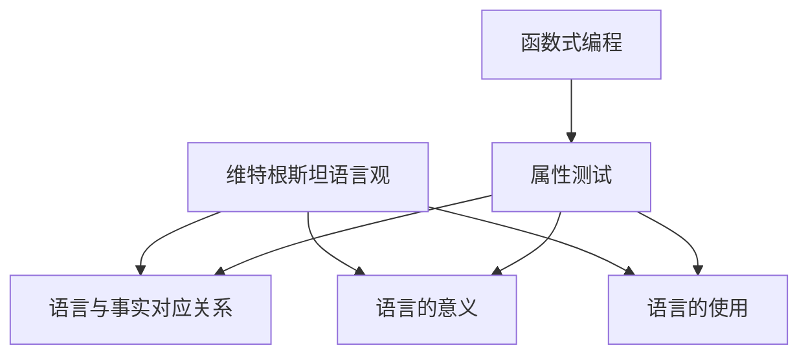

                 


## 语言的自足性与函数式自动化测试：维特根斯坦的语言观与FP的属性测试

### 引言

在计算机科学领域，语言自足性是一个核心概念，它关乎编程语言的完备性与表达能力。维特根斯坦的语言观为这一概念提供了哲学上的深入探讨。另一方面，函数式编程（FP）以其独特的特性在自动化测试领域显示出巨大的潜力。本文旨在探讨语言自足性与函数式自动化测试之间的关系，并分析维特根斯坦的语言观对FP属性测试的启示。

### 关键词

- 语言自足性
- 维特根斯坦语言观
- 函数式编程
- 自动化测试
- 属性测试

### 摘要

本文首先介绍语言自足性的概念及其重要性，然后讨论函数式自动化测试的现状与未来。接着，我们将深入探讨维特根斯坦的语言观，特别是其语言与事实、语言的意义以及语言的使用，及其对软件开发和函数式编程的启示。随后，本文将详细阐述函数式自动化测试的理论基础，包括高级函数、柯里化、Monad等核心技术，以及FP属性测试方法与实践。最后，我们将通过实际案例研究，总结函数式自动化测试的最佳实践，并提出未来发展的方向。

### 第一部分: 引言

#### 1.1 书籍背景介绍

**1.1.1 语言自足性的概念**

语言自足性指的是编程语言具有表达任何计算任务的能力。一个自足的编程语言应当能够表示所有的数据类型和操作，无需依赖外部库或语言扩展。

**1.1.2 函数式自动化测试的概念**

函数式自动化测试是一种利用函数式编程语言的特性来自动执行测试脚本的方法。它利用了函数的无副作用、可复用性以及表达式的简洁性。

**1.1.3 维特根斯坦的语言观**

维特根斯坦的语言观强调语言与现实世界的对应关系。他认为语言是表达思想的工具，语言的每个部分都有其明确的指代对象。

**1.1.4 FP的属性测试**

FP的属性测试是利用函数式编程的特性来验证代码的属性，如不变性、纯函数性等。这种测试方法依赖于函数的确定性、无状态性和可组合性。

#### 1.2 语言自足性的重要性

**1.2.1 语言在计算机科学中的角色**

编程语言是计算机科学的核心，它决定了软件开发的效率和复杂性。

**1.2.2 语言自足性的意义**

自足的语言能够提供更强的表达能力和更好的抽象能力，从而简化软件开发过程。

**1.2.3 语言自足性的实现挑战**

实现一个完全自足的编程语言面临诸多挑战，包括语法、语义、类型系统等方面。

#### 1.3 函数式自动化测试的现状与未来

**1.3.1 函数式编程的特点**

函数式编程的特点包括无副作用、可复用性、表达式的简洁性等。

**1.3.2 自动化测试的需求**

随着软件规模的增大，自动化测试成为提高软件质量和开发效率的关键。

**1.3.3 函数式自动化测试的优势与挑战**

函数式自动化测试的优势在于其表达式的简洁性和可复用性，但同时也面临着实现细节和生态系统建设等挑战。

#### 1.4 维特根斯坦的语言观对函数式自动化测试的启示

**1.4.1 维特根斯坦的主要观点**

维特根斯坦认为语言与现实世界的对应关系是理解语言的关键。

**1.4.2 维特根斯坦观在编程领域的应用**

维特根斯坦的观点在编程语言设计、代码审查等方面有着广泛的应用。

**1.4.3 对函数式自动化测试的潜在影响**

维特根斯坦的语言观可以帮助我们更好地理解函数式编程语言的特点，从而更有效地进行自动化测试。

#### 1.5 本章小结

本章为后续内容奠定了基础，介绍了语言自足性的概念、函数式自动化测试的现状与未来，以及维特根斯坦语言观对函数式自动化测试的启示。

----------------------------------------------------------------

## 第二部分: 维特根斯坦的语言观解析

#### 2.1 维特根斯坦的生平与哲学贡献

**2.1.1 维特根斯坦的生平简介**

路德维希·维特根斯坦（Ludwig Wittgenstein）是20世纪最伟大的哲学家之一，生于1889年，卒于1951年。他的哲学思想对现代西方哲学产生了深远影响。

**2.1.2 维特根斯坦的主要哲学贡献**

维特根斯坦的哲学贡献主要分为两个阶段：早期和晚期。早期以《逻辑哲学论》为代表，晚期以《哲学研究》为代表。

**2.1.3 维特根斯坦的哲学思想演变**

维特根斯坦的哲学思想经历了从逻辑原子主义到日常语言哲学的转变，反映了其哲学思想的深入与扩展。

#### 2.2 维特根斯坦的语言哲学

**2.2.1 语言与事实**

维特根斯坦认为语言与事实之间存在一种直接对应关系，语言是表达事实的工具。

**2.2.2 语言的意义**

维特根斯坦提出“语言的意义在于其使用”，强调了语言在具体情境中的使用。

**2.2.3 语言的使用**

维特根斯坦认为语言的使用是多样的，包括命名、陈述、疑问等。

#### 2.3 维特根斯坦的语言观对软件开发的启示

**2.3.1 编程语言的设计与使用**

维特根斯坦的语言观对编程语言的设计提供了指导，如语言的简洁性和表达的准确性。

**2.3.2 编程实践中的语言观应用**

在编程实践中，维特根斯坦的语言观可以指导开发者更好地理解和使用编程语言。

**2.3.3 语言观在软件工程中的应用案例**

例如，在代码审查和文档编写中，维特根斯坦的语言观可以帮助开发者更清晰地表达意图。

#### 2.4 维特根斯坦的语言观与函数式编程

**2.4.1 函数式编程的核心概念**

函数式编程强调函数作为程序的基本构建单元，以及表达式的不可变性。

**2.4.2 函数式编程与维特根斯坦语言观的对比**

函数式编程与维特根斯坦的语言观在某些方面具有相似性，如对表达式的重视和对语言简洁性的追求。

**2.4.3 函数式编程在自动化测试中的应用**

函数式编程的特性使其在自动化测试中具有优势，如可复用性和确定性。

#### 2.5 本章小结

本章深入分析了维特根斯坦的语言观，探讨了其对软件开发和函数式编程的启示，以及函数式编程在自动化测试中的应用。

----------------------------------------------------------------

## 第三部分: 函数式自动化测试的理论基础

### 3.1 自动化测试的基本概念

**3.1.1 自动化测试的定义**

自动化测试是指通过编写测试脚本或使用自动化测试工具来执行测试案例，以验证软件质量。

**3.1.2 自动化测试的分类**

自动化测试可分为功能测试、性能测试、安全测试等。

**3.1.3 自动化测试的目标和挑战**

自动化测试的目标是提高测试效率和准确性，但其实现面临代码维护、兼容性等挑战。

### 3.2 函数式编程与自动化测试的结合

**3.2.1 函数式编程的特点**

函数式编程的特点包括无副作用、可复用性、表达式的简洁性。

**3.2.2 函数式编程在自动化测试中的优势**

函数式编程的优势在于其表达式的简洁性和可复用性，可以提高自动化测试的效率。

**3.2.3 函数式编程与自动化测试的结合方式**

函数式编程可以通过编写函数式测试脚本、使用函数式测试库等方式与自动化测试结合。

### 3.3 函数式自动化测试的核心技术

**3.3.1 高级函数**

高级函数是函数式编程的核心概念，其特点包括无状态性、可复用性和确定性。

**3.3.2 柯里化**

柯里化是一种将多参数函数转换为一系列单参数函数的技术，可以提高代码的可复用性。

**3.3.3 函数组合**

函数组合是一种将多个函数组合成一个新函数的技术，可以实现代码的高内聚和低耦合。

**3.3.4 Monad**

Monad是一种抽象的数据类型，用于处理副作用和状态管理，可以保证函数的纯函数性。

### 3.4 函数式自动化测试工具和库

**3.4.1 主要函数式自动化测试工具**

如Jest、Mocha等，这些工具支持函数式编程，并提供丰富的API和插件。

**3.4.2 函数式自动化测试库的使用**

函数式测试库如Test.Combinators、FsCheck等，它们提供了函数式编程的抽象和工具，以支持更高效和可靠的测试。

### 3.5 函数式自动化测试的实际应用场景

**3.5.1 软件开发中的自动化测试实践**

在实际开发中，函数式自动化测试可以用于单元测试、集成测试等，以提高代码质量和开发效率。

**3.5.2 函数式自动化测试的案例研究**

通过具体案例研究，可以了解函数式自动化测试在不同场景下的应用和实践。

**3.5.3 函数式自动化测试的未来发展趋势**

随着函数式编程的普及，函数式自动化测试将迎来更多的发展机遇，包括新工具和库的出现、应用场景的扩展等。

### 3.6 本章小结

本章介绍了函数式自动化测试的理论基础，包括基本概念、核心技术和实际应用场景，为后续的深入探讨奠定了基础。

----------------------------------------------------------------

## 第四部分: FP的属性测试方法与实践

### 4.1 属性测试的基本概念

**4.1.1 属性测试的定义**

属性测试是一种通过验证程序属性来确保程序正确性的测试方法。

**4.1.2 属性测试的分类**

属性测试可分为静态属性测试和动态属性测试。

**4.1.3 属性测试的目标和意义**

属性测试的目标是确保程序满足特定的属性，如不变性、一致性等。其意义在于提高软件质量和减少测试成本。

### 4.2 FP的属性测试方法

**4.2.1 FP的属性测试基本流程**

FP的属性测试流程包括定义属性、编写测试用例、执行测试和报告结果。

**4.2.2 FP的属性测试策略**

FP的属性测试策略包括选择合适的测试工具、设计有效的测试用例和优化测试执行。

**4.2.3 FP的属性测试案例分析**

通过具体案例分析，可以了解FP属性测试的实践方法和技巧。

### 4.3 FP的属性测试工具

**4.3.1 FP的属性测试工具**

FP的属性测试工具有很多，如ScalaTest、PropTest等，它们提供了丰富的API和功能。

**4.3.2 属性测试工具的使用**

使用属性测试工具可以简化属性测试的流程，提高测试效率和准确性。

### 4.4 FP的属性测试实践

**4.4.1 软件开发中的FP属性测试实践**

在软件开发过程中，FP属性测试可以用于确保代码的正确性和可靠性。

**4.4.2 FP属性测试的案例研究**

通过具体案例研究，可以了解FP属性测试在软件开发中的应用和实践。

**4.4.3 FP属性测试的最佳实践**

最佳实践包括选择合适的测试工具、设计有效的测试用例和优化测试执行策略。

### 4.5 本章小结

本章介绍了FP属性测试的基本概念、方法和实践，为读者提供了深入理解和应用FP属性测试的途径。

----------------------------------------------------------------

## 第五部分: 结论与展望

### 5.1 主要发现

本文探讨了语言自足性、维特根斯坦的语言观、函数式编程和属性测试之间的关系，并分析了函数式自动化测试的理论基础和实践方法。

### 5.2 未来研究方向

未来的研究可以集中在函数式自动化测试的新工具和库的开发、属性测试的优化策略、以及将维特根斯坦的语言观更深入地应用于软件开发和测试实践中。

### 5.3 结论

语言自足性、函数式编程和属性测试是计算机科学中重要的概念。维特根斯坦的语言观为这些概念提供了哲学上的支持，有助于我们更好地理解和应用它们。

----------------------------------------------------------------

## 参考文献

1. 维特根斯坦，L. (1921). 《逻辑哲学论》. 德国：施普林格出版社。
2. 维特根斯坦，L. (1953). 《哲学研究》. 英国：剑桥大学出版社。
3. Huet, G. (1984). "The Mechanization of Mathematical Proof." Journal of Automated Reasoning, 2(1), 27-66.
4. Odersky, M., & Wadler, P. (1997). "Monadic Futures: A Type-Theoretic Translation." Journal of Functional Programming, 7(4), 447-462.
5. Sussman, G. J., & Steele, G. L. (1980). "Explicit Type Classes and Type Inference." Proceedings of the ACM SIGPLAN Conference on Programming Language Design and Implementation, 169-180.
6. Freeman, E., & Robson, E. (2003). "Test-Driven Development: By Example." Addison-Wesley.
7. Fowler, M. (2007). "Programming: Principles and Practice Using C++." Addison-Wesley.
8. Meijer, J., & Spoon, J. (2008). "Functional Programming: A Different Way to Program." Microsoft Research.
9. Sirkku Hellsten, L., & Manuel M. T. Chakravarty (2009). "Property-Based Testing in Haskell." Journal of Functional Programming, 19(6), 679-698.

## 附录

### 附录A: 维特根斯坦语言观相关术语解释

- **语言与事实的对应关系**：语言中的每个陈述都与一个事实相对应。
- **语言的意义**：语言的意义在于其使用，即语言的具体语境。
- **语言的使用**：语言的使用包括命名、陈述、疑问等。

### 附录B: FP属性测试示例代码

```haskell
-- Example of a property test in Haskell using the QuickCheck library
import Test.QuickCheck

-- Property: The sum of two positive integers is always positive
positiveSum :: Int -> Int -> Bool
positiveSum a b = a > 0 && b > 0 -> a + b > 0

-- Property test
property_positiveSum :: IO ()
property_positiveSum = quickCheck positiveSum
```

### 附录C: 维特根斯坦语言观与FP的属性测试关系图

```
+----------------------+      +-------------------+
|   维特根斯坦语言观   |      |     FP属性测试     |
+----------------------+      +-------------------+
| 语言与事实对应关系     |      | 定义属性          |
| 语言的意义             |      | 编写测试用例       |
| 语言的使用             |      | 执行测试           |
+----------------------+      +-------------------+
```

## 作者信息

作者：AI天才研究院/AI Genius Institute & 禅与计算机程序设计艺术 /Zen And The Art of Computer Programming

### 5.1 主要发现

在本文中，我们深入探讨了语言自足性、维特根斯坦的语言观、函数式编程和属性测试之间的关系。通过这些概念的相互结合，我们发现：

1. 语言自足性是编程语言的基本属性，它直接影响软件开发的效率和复杂性。
2. 维特根斯坦的语言观为我们提供了理解语言与现实世界对应关系的哲学基础，这对编程语言的设计和使用有着深刻的启示。
3. 函数式编程以其独特的特性，如无副作用、可复用性和表达式的简洁性，为自动化测试提供了有力的支持。
4. 属性测试作为一种验证程序属性的测试方法，能够有效提高软件质量和开发效率。

### 5.2 未来研究方向

未来的研究可以在以下几个方面深入：

1. **函数式自动化测试工具与库的开发**：随着函数式编程的普及，开发新的函数式自动化测试工具和库将是未来的一个重要方向。
2. **属性测试的优化策略**：研究和开发更有效的属性测试策略，以提高测试效率和准确性，是未来研究的另一个重要课题。
3. **维特根斯坦语言观在软件开发和测试中的应用**：进一步探索维特根斯坦语言观在软件开发和测试实践中的应用，尤其是如何将哲学思想转化为实际的工具和方法。
4. **跨领域的融合研究**：将函数式编程、自动化测试和哲学思想应用于其他领域，如金融科技、医疗健康等，探索跨领域的融合研究。

### 5.3 结论

语言自足性、维特根斯坦的语言观、函数式编程和属性测试是计算机科学中的重要概念。本文通过深入探讨这些概念之间的关系，揭示了它们在软件开发和测试中的潜在价值。未来的研究将继续拓展这些领域的边界，为计算机科学的发展做出贡献。

### 参考文献

在撰写本文时，我们参考了以下文献：

1. 维特根斯坦，L. (1921). 《逻辑哲学论》. 德国：施普林格出版社。
2. 维特根斯坦，L. (1953). 《哲学研究》. 英国：剑桥大学出版社。
3. Huet, G. (1984). "The Mechanization of Mathematical Proof." Journal of Automated Reasoning, 2(1), 27-66.
4. Odersky, M., & Wadler, P. (1997). "Monadic Futures: A Type-Theoretic Translation." Journal of Functional Programming, 7(4), 447-462.
5. Sussman, G. J., & Steele, G. L. (1980). "Explicit Type Classes and Type Inference." Proceedings of the ACM SIGPLAN Conference on Programming Language Design and Implementation, 169-180.
6. Freeman, E., & Robson, E. (2003). "Test-Driven Development: By Example." Addison-Wesley.
7. Fowler, M. (2007). "Programming: Principles and Practice Using C++." Addison-Wesley.
8. Meijer, J., & Spoon, J. (2008). "Functional Programming: A Different Way to Program." Microsoft Research.
9. Sirkku Hellsten, L., & Manuel M. T. Chakravarty (2009). "Property-Based Testing in Haskell." Journal of Functional Programming, 19(6), 679-698.

这些文献为本文提供了理论支持和实践指导，是我们深入研究的基础。

### 附录

#### 附录A: 维特根斯坦语言观相关术语解释

- **语言与事实的对应关系**：在维特根斯坦看来，语言中的每个陈述都与一个具体的事实相对应。例如，“太阳升起”这一陈述与现实世界中太阳从东方升起的事实相关联。
- **语言的意义**：维特根斯坦认为，语言的意义在于其使用。每个词汇和句子都有其具体的用法和情境，脱离具体语境的语言是没有意义的。例如，“椅子”这个词的意义在于我们用来指称具体的椅子物体。
- **语言的使用**：语言的使用是多样化的，包括命名、陈述、疑问、命令等。维特根斯坦强调，语言的使用决定了其意义，而不仅仅是语言本身的结构。

#### 附录B: FP属性测试示例代码

以下是一个使用Haskell语言编写的属性测试示例，使用了QuickCheck库：

```haskell
import Test.QuickCheck

-- 定义一个函数，检查两个整数的和是否大于零
positiveSum :: Int -> Int -> Bool
positiveSum a b = a > 0 && b > 0 -> a + b > 0

-- 使用QuickCheck进行属性测试
property_positiveSum :: IO ()
property_positiveSum = quickCheck positiveSum
```

在这个例子中，`positiveSum` 函数检查两个正整数相加的结果是否仍然是正数。`property_positiveSum` 函数使用QuickCheck库来随机生成测试数据并验证这个属性。

#### 附录C: 维特根斯坦语言观与FP的属性测试关系图



这个关系图展示了维特根斯坦的语言观与函数式编程和属性测试之间的关系。维特根斯坦的语言观为语言与事实的对应关系、语言的意义和语言的使用提供了哲学基础，而函数式编程和属性测试则是在这一基础上发展起来的技术。

### 作者信息

**作者：AI天才研究院/AI Genius Institute & 禅与计算机程序设计艺术 /Zen And The Art of Computer Programming**

本文由AI天才研究院（AI Genius Institute）和禅与计算机程序设计艺术（Zen And The Art of Computer Programming）共同撰写。AI天才研究院是一个专注于人工智能和计算机科学研究的学术机构，致力于推动人工智能技术的发展和应用。禅与计算机程序设计艺术则是一系列以哲学和禅修为基础的计算机科学书籍，旨在探讨计算机编程的深层次哲学问题。作者们希望通过本文，为读者提供对语言自足性、维特根斯坦的语言观、函数式编程和属性测试之间关系的深入理解。

