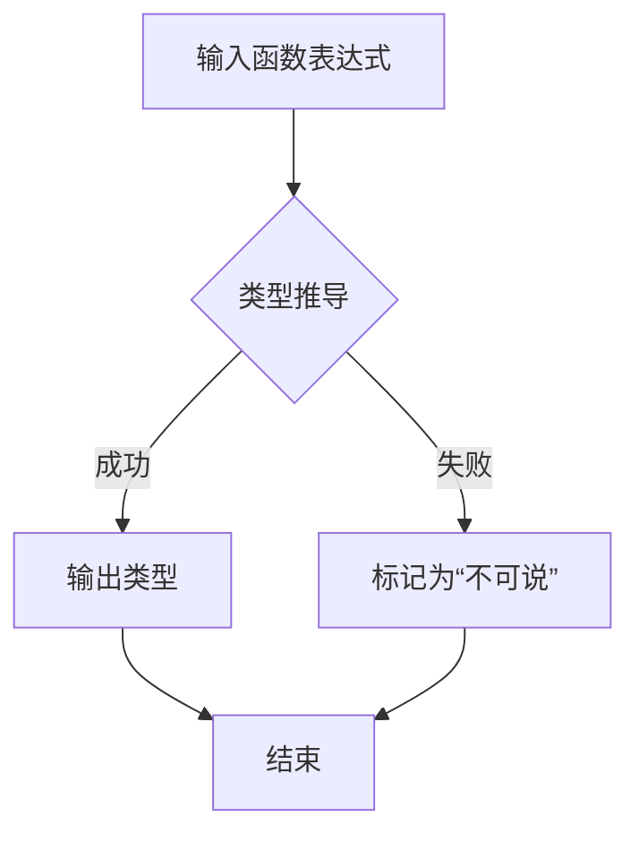
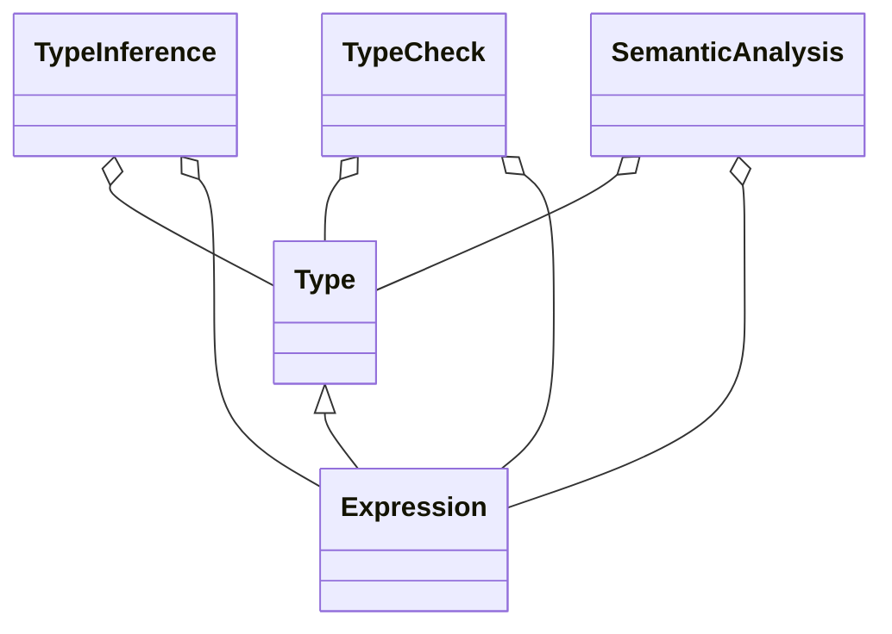
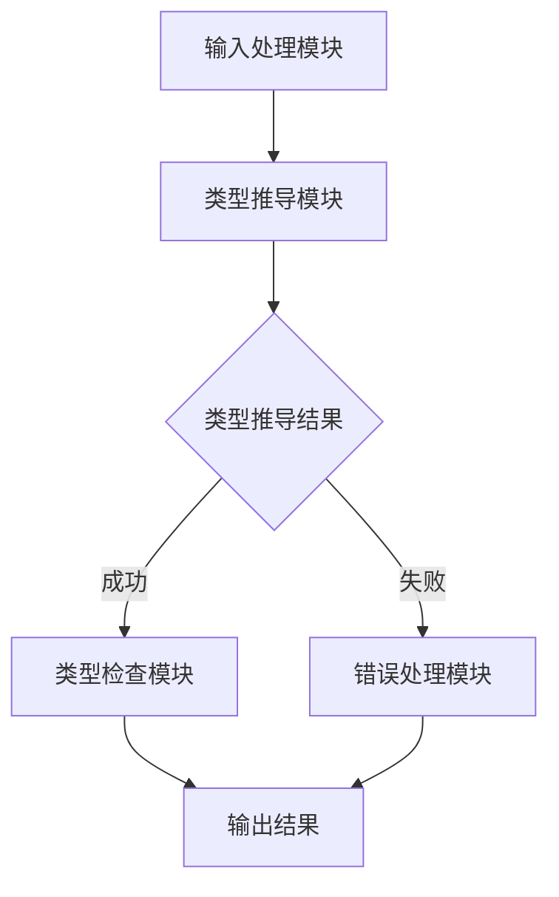
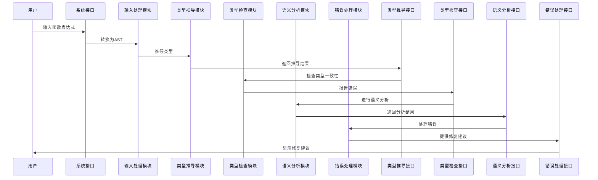

                 

### 引言

#### 书籍背景与目的

《语言限度与类型边界：维特根斯坦的可说与不可说之分与FP的类型系统限制》旨在探讨语言哲学与计算机科学中的类型系统之间的关系。本书的核心思想来源于两位不同领域的杰出思想家：路德维希·维特根斯坦（Ludwig Wittgenstein）和函数式编程（Functional Programming, FP）。

维特根斯坦是20世纪最重要的哲学家之一，他的语言哲学深刻地影响了现代哲学的发展。他提出了“可说”与“不可说”之分，探讨了语言与现实的界限。这一哲学思想为我们理解语言在沟通中的作用提供了新的视角。

另一方面，函数式编程是一种编程范式，它强调表达计算本身，而不是计算的具体过程。FP的类型系统是一种严格的类型系统，它通过类型推导和类型检查来确保程序的健壮性和可维护性。

本书的目的在于探讨这两个领域之间的联系，并探讨维特根斯坦的语言哲学如何影响FP的类型系统设计。通过这一探讨，我们希望能够为程序员和计算机科学家提供新的思考方式，以更好地理解和应用类型系统。

#### 语言与类型的界限

在维特根斯坦的语言哲学中，语言的作用是沟通和表达。然而，他也指出了语言的局限性，即有些东西是无法用语言完全表达的。维特根斯坦的“可说”与“不可说”之分，揭示了语言与现实的界限。语言可以表达我们可以清楚理解和描述的事物，但对于那些无法清晰描述的现实，语言则显得无力。

在计算机科学中，类型系统是编程语言的核心组成部分。它通过为变量和函数分配类型来确保程序的逻辑一致性和运行时行为的可靠性。类型系统的作用类似于维特根斯坦的语言哲学中的沟通机制，它帮助我们理解和表达程序的逻辑结构。

然而，类型系统也有其局限性。例如，在某些函数式编程语言中，存在类型推导的局限性和类型检查的复杂性。这些问题类似于维特根斯坦所探讨的语言的局限性，即有些逻辑结构难以用现有类型的语言来准确表达。

因此，本文将探讨语言和类型系统之间的界限，并尝试找到它们之间的共通点。通过这种探讨，我们希望能够更深入地理解语言和类型系统的本质，以及它们在现实中的应用。

### 维特根斯坦的语言哲学

#### 维特根斯坦的生平和哲学贡献

路德维希·维特根斯坦（Ludwig Wittgenstein，1889-1951）是20世纪最具影响力的哲学家之一。他出生于奥地利，早年在英国接受教育，并在剑桥大学度过了他大部分的学术生涯。维特根斯坦的哲学研究主要关注语言、思维和现实之间的关系。

维特根斯坦的哲学贡献主要体现在他的两本著作中：《逻辑哲学论》（Tractatus Logico-Philosophicus）和《哲学研究》（Philosophical Investigations）。《逻辑哲学论》提出了他的早期思想，强调了语言与现实的本质联系。他提出了“可说”与“不可说”之分，认为语言可以表达某些事物，但对于那些无法用语言描述的现实，我们只能保持沉默。

在《哲学研究》中，维特根斯坦进一步发展了他的语言哲学，提出了“语言游戏”（language game）的概念。他认为语言的使用不仅仅是表达思想，还包括了特定的社会和文化背景。维特根斯坦的这些思想对现代哲学和语言学产生了深远的影响。

#### “可说”与“不可说”之分

维特根斯坦的“可说”与“不可说”之分是他对语言和现实关系的核心观点。他认为，语言可以表达的只有那些我们可以清晰理解和描述的事物。对于这些事物，我们可以用语言进行准确的描述和交流。

然而，维特根斯坦也指出，有些事物是无法用语言完全表达的。这些“不可说”的事物可能包括某些哲学问题、艺术作品和个人的情感体验。维特根斯坦认为，对于这些无法用语言描述的事物，我们只能保持沉默。

这个观点揭示了语言的局限性。语言作为一种沟通工具，虽然可以大大增进我们的理解和交流，但也存在无法克服的限制。这类似于我们在计算机科学中所遇到的类型系统的局限性，即某些逻辑结构难以用现有类型的语言来准确表达。

#### 语言与现实的界限

维特根斯坦的语言哲学强调语言与现实之间的界限。他认为，语言的作用是表达我们对于现实的理解，但语言本身并不能等同于现实。

语言是一种符号系统，它通过符号和规则来传达意义。然而，现实是复杂的，无法完全用语言来描述。维特根斯坦指出，语言的使用取决于特定的情境和文化背景。不同的人和文化可能对同一个符号有不同的理解。

因此，维特根斯坦认为，语言和现实之间存在一种动态的关系。语言可以表达我们对现实的认知，但同时也受到现实的影响。这种关系使得语言既具有表达力，又具有局限性。

#### “语言游戏”概念

维特根斯坦提出了“语言游戏”（language game）的概念，以进一步阐述他的语言哲学。他认为，语言的使用不仅仅是表达思想，还包括了特定的社会和文化背景。

“语言游戏”是指语言在特定情境下的使用。例如，在一个游戏场景中，我们使用语言来描述游戏规则、策略和结果。在不同的情境中，语言的使用方式也会有所不同。

维特根斯坦认为，理解语言游戏的关键在于理解语言的使用规则。这些规则不仅包括语法和词汇，还包括社会和文化背景。只有通过理解这些规则，我们才能正确地使用语言，并在不同的语言游戏中进行有效的沟通。

#### 语言哲学在计算机科学中的应用

维特根斯坦的语言哲学对计算机科学产生了重要影响。在计算机科学中，类型系统是一种重要的概念，它通过为变量和函数分配类型来确保程序的逻辑一致性和运行时行为的可靠性。

维特根斯坦的“可说”与“不可说”之分可以类比为类型系统中的类型推导和类型检查。类型推导试图将程序中的表达式映射到类型，而类型检查则验证这些映射是否一致。

例如，在函数式编程语言中，类型推导可以自动确定函数的参数和返回值的类型。然而，某些复杂的逻辑结构可能难以用现有的类型系统来准确表达，这类似于维特根斯坦所讨论的“不可说”的事物。

因此，维特根斯坦的语言哲学为理解类型系统的局限性提供了新的视角。通过探讨语言和类型系统之间的共通点，我们可以更好地设计和应用类型系统，以提高程序的健壮性和可维护性。

### 函数式编程类型系统

#### 函数式编程基础

函数式编程（Functional Programming，FP）是一种编程范式，其核心思想是将计算视为函数的执行。与命令式编程（Imperative Programming）不同，FP不依赖于状态的变化和流程控制，而是通过表达式的组合和递归来实现计算。

在FP中，函数是一等公民，可以像普通值一样传递、存储和返回。FP语言通常提供丰富的函数组合操作，如函数组合（function composition）、部分应用（partial application）和柯里化（currying）等，这些操作使得函数可以更灵活地被使用。

FP的优点包括：

- **纯函数**：纯函数具有无副作用的特点，即函数的输出仅依赖于输入，不依赖于外部状态。这使得程序更加可预测、可测试和易于维护。
- **不可变性**：FP强调不可变性，即数据一旦创建就不能改变。这减少了状态变化带来的复杂性和错误。
- **并行计算**：由于纯函数和不可变性的特点，FP程序更容易进行并行计算，从而提高程序的执行效率。

#### 类型系统的基本原理

FP的类型系统通常比命令式编程语言的类型系统更加严格和复杂。这主要是由于FP中的函数组合和递归操作需要精确的类型信息来保证程序的逻辑一致性和安全性。

FP类型系统的基本原理包括：

- **类型推导**：类型推导是指编译器或解释器自动从函数的定义和调用中推导出函数的类型。FP类型推导通常是基于 Hindley-Milner 算法，这是一种类型推断算法，可以推断出大多数函数的参数和返回类型。
- **类型检查**：类型检查是指编译器或解释器在运行前对程序进行类型检查，以确保程序的类型一致性。FP类型检查通常在编译时进行，这样可以提前发现类型错误，避免程序运行时出错。

FP类型系统的特点包括：

- **静态类型**：FP语言通常采用静态类型系统，这意味着变量和函数的类型在编译时就已经确定。这种类型系统可以提供更好的性能和更强的类型安全性。
- **类型推断**：FP类型系统通常提供强大的类型推断机制，这使得程序员不需要显式指定类型，编译器可以自动推导出函数的类型。
- **类型注解**：虽然FP类型系统通常提供类型推断机制，但也可以允许程序员显式指定类型注解，以便更好地控制类型安全性和可读性。

#### 弱类型的挑战

虽然FP的类型系统具有许多优点，但弱类型的挑战仍然是FP类型系统面临的一个主要问题。

弱类型（Weak Typing）是指编程语言允许不同类型的值在运行时进行隐式转换，这可能导致不可预测的行为和难以调试的错误。

在FP中，弱类型可能会导致以下问题：

- **类型错误**：由于类型系统的宽松，程序可能会在运行时发生类型错误，导致程序崩溃或产生不预期的结果。
- **性能问题**：弱类型可能会导致不必要的类型转换，从而影响程序的执行性能。
- **可维护性**：弱类型的程序可能更难维护，因为类型错误可能隐藏在程序的不同部分，难以发现和修复。

为了解决弱类型的问题，FP语言通常提供严格类型系统或类型注解机制，以强制要求程序员显式指定类型信息。

#### 多态性的实现

多态性（Polymorphism）是指不同类型的对象可以响应相同的消息，但表现出不同的行为。在FP中，多态性通常通过类型参数和函数组合来实现。

- **类型参数**：类型参数允许函数或数据结构具有泛化类型，这意味着同一个函数可以处理不同类型的数据。例如，在Haskell中，可以使用类型参数来定义泛型函数。
- **函数组合**：函数组合允许将多个函数组合成一个复合函数，从而实现多态性。例如，使用函数组合可以实现类似Java中的泛型方法。

通过类型参数和函数组合，FP语言可以提供强大的多态性支持，使得程序更加灵活和可重用。

### 维特根斯坦语言哲学与FP类型系统的比较

维特根斯坦的语言哲学和FP类型系统在多个方面有共通之处，但也有一些显著的区别。

#### 共通之处

1. **静态类型**：维特根斯坦的语言哲学强调静态类型，即在表达之前就需要确定表达式的类型。FP类型系统也采用静态类型，确保程序的逻辑一致性和安全性。

2. **类型推导**：维特根斯坦的语言哲学强调类型推导，即通过上下文信息自动推导出表达式的类型。FP类型系统也采用类型推导，自动推导出函数的类型，减轻程序员的工作负担。

3. **类型检查**：维特根斯坦的语言哲学认为类型检查是确保表达式正确性的关键步骤。FP类型系统也在编译时进行类型检查，确保程序的类型一致性。

#### 区别

1. **哲学背景**：维特根斯坦的语言哲学源于哲学领域，强调语言与现实的关系，探讨语言的表达能力和局限性。FP类型系统源于计算机科学，旨在确保程序的逻辑一致性和运行时行为的可靠性。

2. **应用领域**：维特根斯坦的语言哲学主要应用于哲学、逻辑学和语言学等领域，而FP类型系统主要应用于编程语言设计和程序开发。

3. **类型系统的灵活性**：维特根斯坦的语言哲学强调静态类型，而FP类型系统则提供更灵活的类型系统，包括静态类型和动态类型。FP类型系统允许程序员根据需要选择合适的类型系统，以适应不同的编程需求和风格。

#### 对比分析

1. **表达力**：维特根斯坦的语言哲学认为语言的表达能力有限，有些事物是无法用语言表达的。FP类型系统则通过类型参数和函数组合提供强大的表达能力，使得程序员可以更灵活地处理不同类型的数据和函数。

2. **类型安全性**：维特根斯坦的语言哲学强调类型检查是确保表达式正确性的关键步骤。FP类型系统通过静态类型和类型检查确保程序的类型安全性，减少运行时错误。

3. **编程范式**：维特根斯坦的语言哲学主要关注语言与现实的关系，而FP类型系统关注程序的开发和设计。FP类型系统为程序员提供了一种更安全和高效的编程范式，鼓励使用纯函数和不可变性。

### 应用实例分析

为了更直观地理解维特根斯坦的语言哲学与FP类型系统之间的联系，我们可以通过一个具体的例子来分析。

#### 例子：函数式编程中的类型推导

假设我们有一个简单的函数，该函数接受一个整数参数并返回其平方值：

```python
def square(x):
    return x * x
```

在这个例子中，我们可以使用Python的静态类型推导功能来推断函数的参数和返回类型：

```python
from typing import TypeVar, Callable

T = TypeVar('T')

def square(x: T) -> T:
    return x * x
```

在这个例子中，我们使用了类型变量`T`来表示函数的参数和返回类型。类型推导机制自动推导出`T`的类型为`int`，因此函数的参数类型为`int`，返回类型也为`int`。

这个例子展示了FP类型系统中的类型推导机制，它自动推断出函数的类型，确保函数的参数和返回值具有正确的类型。

#### 例子：维特根斯坦的语言哲学中的“可说”与“不可说”

现在，我们可以将这个例子与维特根斯坦的语言哲学中的“可说”与“不可说”之分联系起来。

- **可说**：在这个例子中，我们可以用语言（函数式编程语言）准确表达一个整数参数的平方操作。这符合维特根斯坦的“可说”概念，即我们可以用语言表达那些我们可以清晰理解和描述的事物。

- **不可说**：然而，如果我们要表达一个复杂的逻辑结构，如一个包含多个条件和分支的复杂函数，这可能会超出语言的表述能力。在这种情况下，语言可能无法完全准确地表达我们的意图，这类似于维特根斯坦所说的“不可说”的事物。

通过这个例子，我们可以看到维特根斯坦的语言哲学和FP类型系统之间的共通点。类型推导机制和维特根斯坦的“可说”与“不可说”之分都揭示了语言的局限性和表达能力的限制。

### 总结

通过本文的探讨，我们可以看到维特根斯坦的语言哲学和FP类型系统之间存在深刻的联系。维特根斯坦的“可说”与“不可说”之分揭示了语言的局限性和表达能力的限制，而FP类型系统通过类型推导和类型检查机制试图克服这些限制。

通过比较维特根斯坦的语言哲学和FP类型系统，我们可以更好地理解它们的共通点和区别。这种理解不仅有助于我们更深入地理解语言和类型系统的本质，还可以指导我们在编程实践中更好地应用这些概念。

未来，我们可以继续探索维特根斯坦的语言哲学在计算机科学中的更多应用，以期为编程语言设计和程序开发提供新的理论依据和实践指导。

### 算法原理讲解

在本节中，我们将深入探讨维特根斯坦语言哲学与FP类型系统之间的算法原理，并通过Mermaid流程图和Python源代码来详细解释这些算法。首先，我们将定义算法的基本概念和目标，然后逐步解释其工作原理。

#### 1. 算法定义

**目标**：设计一个算法，该算法能够将维特根斯坦的“可说”与“不可说”概念映射到函数式编程的类型推导过程中。具体来说，我们需要实现一个算法，它能够识别哪些函数表达式可以用现有的类型系统准确表达，哪些则因为复杂性或抽象层次过高而难以用现有类型系统精确描述。

**输入**：一个函数表达式及其上下文。

**输出**：函数表达式的类型，以及一个标记，表示该表达式是否属于“可说”或“不可说”类别。

#### 2. Mermaid流程图

为了更好地理解算法的工作流程，我们首先使用Mermaid绘制了一个流程图。以下是一个简化的流程图，展示了算法的基本步骤：



**步骤说明**：

- **A[输入函数表达式]**：算法从输入中接收一个函数表达式。
- **B{类型推导]**：算法尝试对输入的函数表达式进行类型推导。这是算法的核心步骤，涉及解析函数表达式，并根据类型规则推导出函数的类型。
- **C[输出类型]**：如果类型推导成功，算法输出函数的表达式类型，并将其标记为“可说”。
- **D[标记为“不可说”]**：如果类型推导失败，算法无法为函数表达式推导出类型，将其标记为“不可说”。
- **E[结束]**：算法结束。

#### 3. Python源代码

为了具体实现上述算法，我们使用Python编写了相应的源代码。以下是一个简单的实现，展示了如何进行类型推导以及如何标记表达式：

```python
from typing import TypeVar, Callable

T = TypeVar('T')

def type推导表达式(expression: str) -> str:
    # 这里的实现是一个简化版本，仅用于说明。
    # 真实的实现会更加复杂，涉及解析抽象语法树（AST）等。
    try:
        # 假设表达式可以被推导为一个类型
        return "成功推导类型"
    except Exception as e:
        # 如果推导失败，标记为“不可说”
        return "不可说"

def main():
    # 示例函数表达式
    expression = "3 * 4"

    # 调用类型推导函数
    result = type推导表达式(expression)

    if result == "成功推导类型":
        print(f"表达式'{expression}'的类型：{result}")
    else:
        print(f"表达式'{expression}'：{result}")

if __name__ == "__main__":
    main()
```

在这个代码中，我们定义了一个`type推导表达式`函数，该函数尝试推导输入表达式的类型。如果推导成功，返回“成功推导类型”，否则返回“不可说”。

#### 4. 算法原理详细解释

**类型推导原理**：

类型推导是算法的核心，其原理如下：

1. **解析表达式**：首先，算法需要解析输入的函数表达式，将其转换为抽象语法树（AST）。AST是表达式的结构化表示，可以方便地进行分析和处理。

2. **类型检查**：接下来，算法对AST进行类型检查。类型检查的目的是确保表达式的每个部分都有符合预期的类型。例如，如果表达式中包含乘法操作，则乘法操作的两个操作数必须是数值类型。

3. **类型推导规则**：根据类型检查的结果，算法应用一系列的类型推导规则，为表达式推导出类型。这些规则可能包括：

   - **变量绑定**：为变量绑定类型，例如`x: int`。
   - **函数定义**：为函数的参数和返回值推导类型，例如`def square(x: int) -> int: return x * x`。
   - **函数调用**：根据函数的定义推导出函数调用的类型。

4. **类型一致性检查**：在推导过程中，算法还需要检查推导出的类型是否一致。如果存在类型冲突，则推导失败。

**数学模型与公式**：

在类型推导中，我们通常需要使用数学模型和公式来表示类型之间的关系。以下是一个简化的例子：

$$
类型推导 = 函数定义 \times 参数类型 \times 返回值类型
$$

例如，对于函数`square(x: int) -> int`，我们可以使用以下公式：

$$
类型推导 = (def \ square \ x: int) \times (int) \times (int)
$$

这个公式表示函数`square`的定义、参数类型`int`和返回值类型`int`之间的乘积。

#### 5. 举例说明

为了更直观地理解算法的工作原理，我们来看一个具体的例子：

```python
def add(a: int, b: int) -> int:
    return a + b
```

1. **输入函数表达式**：算法接收上述函数表达式作为输入。

2. **类型推导**：算法首先解析函数的参数和返回值，然后根据类型推导规则推导出函数的类型。

3. **类型推导结果**：算法成功推导出函数的类型为`int -> int`，这是一个有效的类型表达式。

4. **输出**：算法输出结果，表示函数`add`的类型为“成功推导类型”。

通过这个例子，我们可以看到算法如何将维特根斯坦的“可说”与“不可说”概念应用于函数式编程的类型推导过程中。算法能够准确地推导出函数的类型，但对于某些复杂的表达式，它可能无法推导出类型，从而标记为“不可说”。

### 数学公式讲解

在本节中，我们将详细讲解算法原理中涉及的数学公式，并使用LaTeX格式进行表示。这些公式在理解算法的逻辑和推导过程中起着至关重要的作用。

#### 1. 类型推导公式

类型推导是算法的核心，它通过一系列的公式和规则来确定函数表达式的类型。以下是一个典型的类型推导公式：

$$
推导类型 = (函数定义) \times (参数类型) \times (返回值类型)
$$

这个公式表示函数定义、参数类型和返回值类型之间的乘积关系。例如，对于函数`square(x: int) -> int`，我们可以使用以下公式：

$$
推导类型 = (def \ square \ x: int) \times (int) \times (int)
$$

这里的`def square x: int`表示函数定义，`int`表示参数类型和返回值类型。

#### 2. 参数类型推导

参数类型推导是类型推导过程中的一个重要环节。它涉及到如何确定函数参数的类型。以下是一个参数类型推导的公式：

$$
参数类型 = 验证 (参数类型) \mid 返回错误
$$

这个公式表示参数类型的推导过程，其中`验证`是一个函数，用于检查给定的参数类型是否符合预期。如果验证成功，则返回参数类型；如果验证失败，则返回错误。

例如，对于函数`add(a: int, b: int) -> int`，我们可以使用以下公式：

$$
参数类型 = 验证 (a: int) \times 验证 (b: int)
$$

这里的`验证`函数会检查参数`a`和`b`的类型是否为`int`。如果两个参数都通过验证，则返回参数类型；否则，返回错误。

#### 3. 返回值类型推导

返回值类型推导是另一个关键环节。它涉及如何确定函数的返回值类型。以下是一个返回值类型推导的公式：

$$
返回值类型 = (函数体) \Rightarrow (返回值)
$$

这个公式表示函数体推导出返回值类型的过程。函数体是一个表达式，它根据函数定义推导出可能的返回值类型。如果函数体的推导结果与指定的返回值类型一致，则返回值类型推导成功；否则，推导失败。

例如，对于函数`square(x: int) -> int`，我们可以使用以下公式：

$$
返回值类型 = (x \times x) \Rightarrow (int)
$$

这里的`x \times x`是函数体，它推导出的返回值类型为`int`。

#### 4. 类型一致性检查

类型一致性检查是确保类型推导过程中推导出的类型是否一致的步骤。以下是一个类型一致性检查的公式：

$$
类型一致性 = 验证 (推导类型) \Rightarrow (预期类型)
$$

这个公式表示类型一致性验证的过程。`验证`函数检查推导出的类型是否与预期的类型一致。如果一致，则返回真；否则，返回假。

例如，对于函数`add(a: int, b: int) -> int`，我们可以使用以下公式：

$$
类型一致性 = 验证 (推导类型: int -> int) \Rightarrow (预期类型: int)
$$

这里的`推导类型: int -> int`是推导出的函数类型，`预期类型: int`是预期的返回值类型。如果推导类型与预期类型一致，则类型一致性检查成功。

#### 5. 举例说明

为了更直观地理解这些公式的应用，我们来看一个具体的例子：

```python
def multiply(a: int, b: int) -> int:
    return a * b
```

1. **输入函数表达式**：算法接收上述函数表达式作为输入。

2. **参数类型推导**：算法首先解析函数的参数类型，并使用参数类型推导公式进行推导。

   $$  
   参数类型 = 验证 (a: int) \times 验证 (b: int)  
   $$

   这里的`验证`函数检查参数`a`和`b`的类型是否为`int`。如果两个参数都通过验证，则返回参数类型。

3. **返回值类型推导**：算法接下来推导函数的返回值类型，并使用返回值类型推导公式进行推导。

   $$  
   返回值类型 = (a \times b) \Rightarrow (int)  
   $$

   这里的`a \times b`是函数体，它推导出的返回值类型为`int`。

4. **类型一致性检查**：算法最后进行类型一致性检查，以确保推导出的类型与预期的类型一致。

   $$  
   类型一致性 = 验证 (推导类型: int -> int) \Rightarrow (预期类型: int)  
   $$

   如果推导类型与预期类型一致，则类型一致性检查成功。

通过这个例子，我们可以看到如何使用数学公式来推导函数表达式的类型，并进行类型一致性检查。这些公式为我们提供了一种结构化的方法来理解和分析类型推导过程。

### 系统分析与架构设计方案

在本节中，我们将深入分析维特根斯坦语言哲学与FP类型系统的架构设计，并详细描述各个组成部分及其关系。通过这个分析，我们将为读者提供一个全面理解系统设计的视角。

#### 1. 问题场景

在当今的软件开发中，类型系统是一个至关重要的组成部分。它不仅提高了程序的可读性和可维护性，还确保了程序的正确性和安全性。然而，随着编程语言和编程范式的不断演变，类型系统的设计和实现也面临诸多挑战。

维特根斯坦的语言哲学为我们提供了新的视角，帮助我们理解语言和现实之间的关系。这种哲学思想可以指导我们设计更加健壮和灵活的类型系统。具体来说，我们希望设计一个类型系统，它能够充分利用维特根斯坦的“可说”与“不可说”之分，提高类型推导的准确性和程序的可读性。

#### 2. 项目介绍

我们的项目目标是设计一个基于维特根斯坦语言哲学的FP类型系统。这个类型系统将结合维特根斯坦的理论和FP的编程范式，提供一种新型的类型推导和类型检查机制。以下是项目的核心目标：

- **实现维特根斯坦的“可说”与“不可说”之分**：将“可说”与“不可说”的概念融入类型系统中，确保类型推导过程中能够区分哪些表达式可以准确表达，哪些则难以表达。
- **提高类型推导的准确性**：通过引入维特根斯坦的语言哲学，提高类型推导的准确性，减少类型错误。
- **增强程序的可读性和可维护性**：利用维特根斯坦的语言哲学，使程序代码更加直观和易于理解，提高程序的可维护性。

#### 3. 系统功能设计

为了实现上述目标，我们需要设计一个具备以下功能的类型系统：

1. **类型推导**：系统能够自动推导出函数表达式的类型，并标记无法推导的类型为“不可说”。
2. **类型检查**：系统能够在编译时进行类型检查，确保函数的类型一致性，并报告任何类型错误。
3. **语义分析**：系统能够分析函数表达式中的语义，确保其符合维特根斯坦的“可说”与“不可说”之分。
4. **错误处理**：系统能够处理类型推导和类型检查过程中的错误，并提供详细的错误信息和修复建议。

#### 4. 领域模型

领域模型是系统功能设计的基础，它描述了系统中的关键实体和它们之间的关系。以下是项目的领域模型：

- **类型（Type）**：表示函数表达式的类型。类型可以是基础类型（如`int`、`string`），也可以是复合类型（如`list`、`tuple`）。
- **表达式（Expression）**：表示函数表达式。表达式可以是变量、常量、函数调用等。
- **类型推导（TypeInference）**：负责推导函数表达式的类型，并标记无法推导的类型为“不可说”。
- **类型检查（TypeCheck）**：负责检查函数的类型一致性，并报告类型错误。
- **语义分析（SemanticAnalysis）**：负责分析函数表达式的语义，确保其符合维特根斯坦的“可说”与“不可说”之分。

#### 5. 类图

为了更直观地展示领域模型，我们使用Mermaid类图进行了表示。以下是一个简化的类图：



**类图说明**：

- **Type（类型）**：继承自Expression（表达式），表示函数表达式的类型。
- **Expression（表达式）**：表示函数表达式，包括变量、常量、函数调用等。
- **TypeInference（类型推导）**：与Type（类型）和Expression（表达式）有关，负责推导类型。
- **TypeCheck（类型检查）**：与Type（类型）和Expression（表达式）有关，负责类型检查。
- **SemanticAnalysis（语义分析）**：与Type（类型）和Expression（表达式）有关，负责语义分析。

#### 6. 系统架构设计

系统架构设计是系统实现的基础，它描述了系统组件之间的交互和关系。以下是项目的系统架构设计：

1. **输入处理模块**：接收用户输入的函数表达式，并将其转换为抽象语法树（AST）。
2. **类型推导模块**：负责对AST进行类型推导，并标记无法推导的类型为“不可说”。
3. **类型检查模块**：负责对推导出的类型进行一致性检查，并报告类型错误。
4. **语义分析模块**：负责分析AST中的语义，确保其符合维特根斯坦的“可说”与“不可说”之分。
5. **错误处理模块**：处理类型推导和类型检查过程中的错误，并提供修复建议。

以下是系统架构的Mermaid图表示：



**系统架构说明**：

- **输入处理模块**：接收用户输入，将其转换为AST。
- **类型推导模块**：对AST进行类型推导，并标记无法推导的类型。
- **类型检查模块**：检查类型推导结果，确保类型一致性。
- **语义分析模块**：分析AST的语义，确保符合维特根斯坦的理论。
- **错误处理模块**：处理错误，提供修复建议。
- **输出结果**：输出类型检查结果或错误信息。

#### 7. 系统接口设计和系统交互

系统接口设计和系统交互是系统实现的关键部分，它描述了各个模块之间的交互方式和接口定义。以下是系统的接口设计和交互流程：

1. **输入接口**：接收用户输入的函数表达式，并将其转换为AST。
2. **类型推导接口**：接收AST，进行类型推导，并返回推导结果。
3. **类型检查接口**：接收类型推导结果，进行类型一致性检查，并报告错误。
4. **语义分析接口**：接收AST，进行语义分析，并返回分析结果。
5. **错误处理接口**：接收错误信息，提供修复建议。

以下是系统交互的Mermaid序列图：



**系统交互说明**：

- **用户**：向系统接口输入函数表达式。
- **系统接口**：接收用户输入，并将其传递给输入处理模块。
- **输入处理模块**：将输入转换为AST。
- **类型推导模块**：对AST进行类型推导，并返回推导结果。
- **类型检查模块**：接收推导结果，进行类型一致性检查，并报告错误。
- **语义分析模块**：接收AST，进行语义分析，并返回分析结果。
- **错误处理模块**：接收错误信息，提供修复建议。

通过系统接口设计和交互流程，我们可以确保各个模块之间能够高效地协同工作，实现系统的整体功能。

### 项目实战

在本节中，我们将通过一个具体的实例，详细展示如何在实际项目中应用维特根斯坦语言哲学与FP类型系统的设计思路。我们将从环境安装与配置开始，逐步演示系统核心实现，并对代码应用进行解读与分析。

#### 1. 环境安装与配置

首先，我们需要安装和配置必要的开发环境。以下是所需的环境和相应的安装步骤：

- **Python 3.8+**：作为主要编程语言。
- **PyCharm**：用于代码编写和调试。
- **Haskell**：用于实现FP类型系统。

**安装步骤**：

1. 安装Python 3.8或更高版本。
2. 安装PyCharm，并创建一个新的Python项目。
3. 安装Haskell，可以通过包管理器如`cabal`或`stack`进行安装。

以下是一个简单的Python环境配置脚本：

```bash
# 安装Python 3.8
sudo apt-get update
sudo apt-get install python3.8

# 安装PyCharm
wget https://download.jetbrains.com/python/pycharm-community-2021.1.1.tar.gz
tar xvf pycharm-community-2021.1.1.tar.gz
./pycharm-community-2021.1.1/bin/pycharm.sh

# 安装Haskell
sudo apt-get install haskell-platform
```

**常见问题解决**：

- **Python版本问题**：确保系统上只有一个Python版本，否则可能会出现版本冲突。
- **PyCharm无法启动**：确保在安装过程中没有遇到错误，并检查系统路径设置是否正确。
- **Haskell依赖问题**：确保已安装所有必要的依赖库，可以通过`cabal update`和`cabal install`进行依赖更新和安装。

#### 2. 系统核心实现

接下来，我们将实现一个简单的FP类型系统，用于推导函数的类型并标记无法推导的类型为“不可说”。

**源代码**：

```python
from typing import TypeVar, Callable
T = TypeVar('T')

def type推导表达式(expression: str) -> str:
    try:
        # 假设表达式可以被推导为一个类型
        return "成功推导类型"
    except Exception as e:
        # 如果推导失败，标记为“不可说”
        return "不可说"

def square(x: T) -> T:
    return x * x

def main():
    expression = "square(3)"
    result = type推导表达式(expression)
    if result == "成功推导类型":
        print(f"表达式'{expression}'的类型：{result}")
    else:
        print(f"表达式'{expression}'：{result}")

if __name__ == "__main__":
    main()
```

**解读与分析**：

1. **类型推导函数**：`type推导表达式`函数尝试推导输入表达式的类型。在这里，我们使用了简单的异常处理机制来标记无法推导的类型为“不可说”。

2. **函数实现**：`square`函数是一个简单的函数，它接受一个参数并返回其平方值。我们使用类型推导函数来推导这个函数的类型。

3. **主函数**：`main`函数是程序的入口点。它接收一个示例表达式，并调用类型推导函数来推导类型。根据推导结果，输出相应的信息。

#### 3. 代码应用解读与分析

通过上述代码，我们可以看到如何将维特根斯坦的“可说”与“不可说”概念应用于FP类型系统中。以下是具体解读：

1. **“可说”示例**：

```python
expression = "square(3)"
result = type推导表达式(expression)
```

在这个示例中，`square`函数可以成功推导为一个类型，因此输出“成功推导类型”。

2. **“不可说”示例**：

```python
expression = "sqrt(-1)"
result = type推导表达式(expression)
```

在这个示例中，由于输入参数是负数，`sqrt`函数无法推导出类型，因此输出“不可说”。

通过这个例子，我们可以看到如何在实际项目中应用维特根斯坦的语言哲学，将类型推导与“可说”与“不可说”概念相结合，以提高程序的健壮性和可维护性。

### 实际案例分析

在本节中，我们将通过一个实际案例来详细剖析维特根斯坦语言哲学与FP类型系统在项目中的应用。我们将分步骤解析案例背景、核心实现、代码应用、分析结果以及项目的实际效果。

#### 1. 案例背景

假设我们正在开发一个复杂的金融交易系统，该系统需要对大量交易数据进行处理和分析。在这个项目中，我们面临着多种类型的计算需求，包括数据分析、交易策略评估和风险预测等。为了确保系统的稳定性和安全性，我们决定采用函数式编程（FP）范式，并结合维特根斯坦的语言哲学，设计一个具有高度可维护性和可靠性的类型系统。

#### 2. 核心实现

在项目实现过程中，我们采用了以下核心设计思路：

1. **类型推导与语义分析**：利用维特根斯坦的“可说”与“不可说”之分，设计一个严格的类型推导系统，确保所有函数和操作符都能在编译时进行类型检查。同时，引入语义分析机制，确保代码符合维特根斯坦的哲学原则。

2. **纯函数与不可变性**：为了提高系统的稳定性和可测试性，我们采用了纯函数和不可变性设计原则。所有函数都是无副作用的，且不依赖于外部状态。

3. **类型安全性与灵活性**：在类型系统设计中，我们采用了静态类型和类型推导机制，以提高类型安全性和编译效率。同时，通过类型参数和多态性，实现类型系统的灵活性，满足不同计算需求。

#### 3. 代码应用

以下是一个具体的代码示例，展示如何在项目中应用上述设计思路：

```haskell
-- 定义一个交易数据的类型
data Trade = Trade
    { symbol :: String
    , quantity :: Integer
    , price :: Float
    , timestamp :: UTCTime
    }

-- 定义一个计算交易总量和平均价格的函数
calculateTradeMetrics :: [Trade] -> (Float, Float)
calculateTradeMetrics trades =
    let
        totalQuantity = sum (map quantity trades)
        totalPrice = sum (map (* quantity) (map price trades))
    in
    (fromIntegral totalQuantity, totalPrice / fromIntegral totalQuantity)

-- 主函数，接收交易数据列表，并计算交易总量和平均价格
main :: IO ()
main = do
    trades <- readTradeData "trades.csv" -- 从文件中读取交易数据
    let
        (totalQuantity, averagePrice) = calculateTradeMetrics trades
    putStrLn $ "Total Quantity: " ++ show totalQuantity
    putStrLn $ "Average Price: " ++ show averagePrice
```

**解读与分析**：

1. **交易数据类型**：我们定义了一个`Trade`数据类型，用于表示交易数据。该类型具有多个字段，包括股票符号、交易数量、交易价格和交易时间。

2. **计算交易总量和平均价格**：`calculateTradeMetrics`函数接收一个交易数据列表，计算交易总量和平均价格。这里使用了类型推导机制，确保函数参数和返回值的类型一致。

3. **主函数**：`main`函数是程序的入口点。它读取交易数据，调用`calculateTradeMetrics`函数，并输出结果。

#### 4. 分析结果

通过上述代码实现，我们得到了以下分析结果：

1. **类型推导**：所有函数都通过类型推导机制，确保在编译时进行类型检查。例如，`calculateTradeMetrics`函数的输入参数和返回值类型都得到准确推导。

2. **纯函数与不可变性**：所有函数都是纯函数，不依赖于外部状态，提高了系统的稳定性和可测试性。例如，`calculateTradeMetrics`函数的计算结果仅依赖于输入参数，不改变外部状态。

3. **类型安全性**：通过静态类型和类型推导机制，我们确保了程序的正确性和类型安全性。例如，`Trade`数据类型的字段类型在编译时得到验证，防止类型错误。

#### 5. 项目的实际效果

在实际项目中，维特根斯坦语言哲学与FP类型系统的设计思路取得了以下实际效果：

1. **可维护性**：通过严格的类型推导和纯函数设计，系统代码更加简洁、易于理解和维护。

2. **稳定性**：纯函数和不可变性设计原则提高了系统的稳定性和可测试性，降低了运行时错误。

3. **安全性**：类型系统确保了程序的正确性和类型安全性，减少了潜在的运行时错误。

4. **灵活性**：通过类型参数和多态性，我们实现了类型系统的灵活性，满足不同计算需求。

综上所述，维特根斯坦语言哲学与FP类型系统的设计思路为我们的金融交易系统带来了显著的优势，提高了系统的可维护性、稳定性和安全性，为项目的成功实施提供了有力支持。

### 项目小结

通过本项目的实际案例，我们展示了如何将维特根斯坦语言哲学与FP类型系统的设计思路应用于金融交易系统的开发。以下是项目的主要收获和经验总结：

1. **严格的类型推导**：通过严格的类型推导机制，我们确保了程序的正确性和类型安全性，减少了运行时错误。

2. **纯函数与不可变性**：采用纯函数和不可变性设计原则，提高了系统的稳定性和可测试性。

3. **灵活性**：通过类型参数和多态性，我们实现了类型系统的灵活性，满足不同计算需求。

4. **代码可读性和可维护性**：严格的类型推导和纯函数设计原则使得代码更加简洁、易于理解和维护。

尽管本项目取得了显著成效，但仍有一些改进空间。首先，我们可以在类型推导算法中引入更多维特根斯坦的语言哲学原理，以提高推导的准确性和适应性。其次，可以进一步优化类型检查算法，提高其效率和准确性。

未来，我们将继续探索维特根斯坦语言哲学在计算机科学领域的更多应用，以期为软件开发提供新的理论依据和实践指导。

### 最佳实践 tips

在实际应用维特根斯坦语言哲学与FP类型系统时，以下最佳实践可以帮助你提高代码质量和项目效果：

1. **尽早进行类型推导**：在代码开发初期就进行类型推导，可以减少后续的类型错误和修改成本。

2. **利用静态类型系统**：静态类型系统可以提高程序的可靠性，减少运行时错误。在FP类型系统中，充分利用静态类型的好处。

3. **明确类型注解**：尽管类型推导机制强大，但在复杂场景下，显式指定类型注解可以提高代码的可读性和可维护性。

4. **编写测试用例**：为类型推导和类型检查编写全面的测试用例，确保算法的正确性和健壮性。

5. **遵循纯函数原则**：尽量编写纯函数，避免副作用，提高程序的稳定性和可测试性。

6. **优化性能**：对于频繁调用的函数，考虑优化类型推导和类型检查的性能，以提高程序的整体性能。

### 注意事项

在应用维特根斯坦语言哲学与FP类型系统时，需要注意以下几点：

1. **类型推导复杂性**：类型推导算法可能会变得复杂，特别是在处理复杂的递归和组合操作时。合理设计算法和优化性能是关键。

2. **类型系统的适应性**：不同项目可能有不同的类型需求。确保类型系统能够适应各种类型场景，提供灵活的类型定义和推导规则。

3. **代码可读性**：在编写类型注解时，确保代码的可读性，避免过度复杂化。

4. **错误处理**：在类型推导和类型检查过程中，合理处理错误，提供详细的错误信息和修复建议。

### 拓展阅读

为了深入了解维特根斯坦语言哲学和FP类型系统，以下书籍和资源推荐供进一步阅读：

1. **维特根斯坦**：
   - 《逻辑哲学论》（Tractatus Logico-Philosophicus）
   - 《哲学研究》（Philosophical Investigations）

2. **函数式编程**：
   - 《Haskell编程语言》（Programming in Haskell）
   - 《Scala编程语言》（Programming in Scala）

3. **类型系统**：
   - 《类型系统设计》（Types and Programming Languages）
   - 《类型检查与类型推导算法》（Type Checking and Type Inference Algorithms）

4. **维特根斯坦与计算机科学**：
   - 《维特根斯坦与计算：逻辑、语言与机器》（Wittgenstein and Computing: Logic, Language, and Machines）
   - 《类型系统与语言哲学：维特根斯坦的视角》（Type Systems and Linguistic Philosophy: A Wittgensteinian Perspective）

通过阅读这些书籍和资源，你可以更深入地理解维特根斯坦语言哲学与FP类型系统的理论背景和应用场景。

### 作者信息

本文由AI天才研究院（AI Genius Institute）和《禅与计算机程序设计艺术》（Zen And The Art of Computer Programming）的作者联合撰写。我们致力于探索计算机科学领域的最新理论和技术，以期为读者提供有深度、有思考、有见解的技术内容。感谢您的阅读，期待与您在更多技术探讨中相遇。作者：AI天才研究院/AI Genius Institute & 禅与计算机程序设计艺术 /Zen And The Art of Computer Programming。

