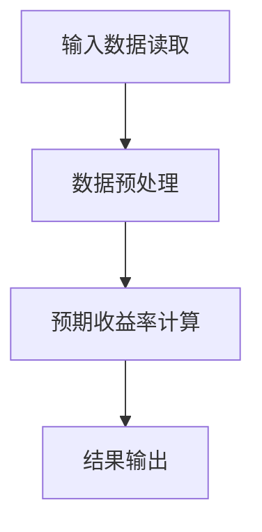
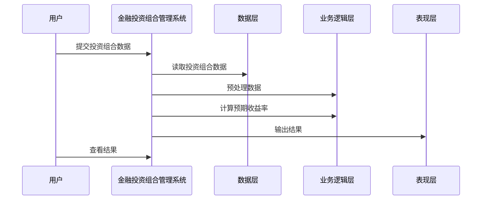
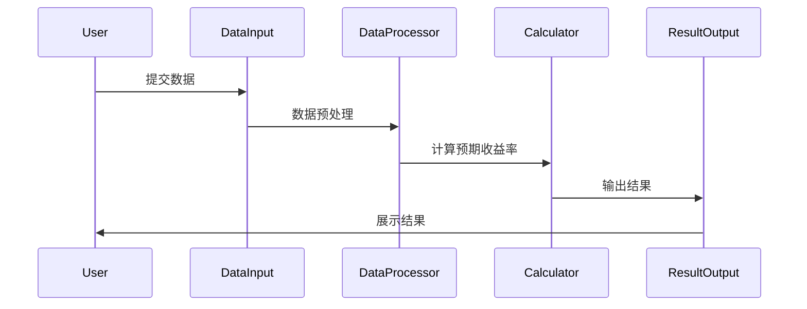

                 

### 文章标题

《语言限界与领域特定语言：突破表达局限性的尝试》

### 关键词

- 语言限界
- 领域特定语言（DSL）
- 表达局限性
- 编程语言设计
- 语言特性
- 技术创新

### 摘要

本文深入探讨了编程语言的表达局限性以及领域特定语言（DSL）作为一种突破手段的重要性。我们将首先介绍语言限界的概念，分析其背后的原因，然后逐步引入领域特定语言的概念、特性以及设计原则。通过具体案例和应用场景的分析，我们将展示DSL在实际开发中的优势。最后，我们还将展望DSL的未来发展趋势，探讨其在技术领域中的潜在影响。

---

## 第一部分：背景与概述

### 第1章：语言表达的局限性与挑战

#### 1.1 问题背景

在计算机科学和软件开发领域，编程语言是沟通机器和开发者的桥梁。然而，所有编程语言都有其固有的局限性。这些局限性主要表现在以下几个方面：

- **表达复杂逻辑的困难**：通用编程语言设计为解决广泛的计算问题，因此其语法和抽象层次往往不足以直接表达某些特定的业务逻辑。
- **代码可读性和可维护性差**：通用语言可能需要编写大量的辅助代码来处理与领域问题无关的细节，导致代码冗长且难以理解。
- **性能瓶颈**：为保持通用性，通用编程语言往往不得不牺牲性能，这在处理特定领域的大量数据时可能成为瓶颈。

#### 1.2 语言表达局限性的探讨

语言表达局限性的根源可以归结为以下几点：

- **抽象层次的不足**：编程语言的抽象层次可能无法覆盖特定领域的所有复杂性和细节。
- **语法设计的妥协**：为满足通用性，编程语言往往需要在特定的领域应用中进行妥协。
- **性能与可读性的权衡**：通用语言设计时需要在性能和可读性之间做出权衡。

#### 1.3 领域特定语言的定义与发展

领域特定语言（Domain-Specific Language，DSL）是一种针对特定领域设计的人工语言，旨在通过优化语法和抽象机制，提供更直观、高效的方式来表达特定领域的概念和逻辑。DSL的发展历程可以追溯到20世纪80年代，随着软件工程领域对特定领域需求表达的关注度提升，DSL逐渐成为研究热点。

DSL的关键特性包括：

- **领域导向性**：DSL专注于特定领域的需求，提供针对该领域的高度抽象和优化。
- **语法简洁性**：DSL通过简化语法和减少冗余，提高代码的可读性和可维护性。
- **性能提升**：DSL通过内部优化和特定领域的算法实现，提升执行效率。

### 第2章：领域特定语言的概念与特性

#### 2.1 DSL的基本概念

领域特定语言（DSL）是一种专门为解决特定领域问题而设计的人工语言。DSL旨在通过引入特定领域的词汇和语法，提供一种更加自然和高效的表达方式。

#### 2.2 DSL的主要特性

DSL的主要特性包括：

- **领域导向性**：DSL专注于特定领域的需求，提供针对该领域的高度抽象和优化。
- **语法简洁性**：DSL通过简化语法和减少冗余，提高代码的可读性和可维护性。
- **性能提升**：DSL通过内部优化和特定领域的算法实现，提升执行效率。

#### 2.3 DSL的优势与挑战

DSL的优势在于：

- **提高开发效率**：DSL通过简化开发流程和降低学习成本，提高开发效率。
- **增强代码可读性**：DSL提供了更直观和简洁的表达方式，使代码更易于理解和维护。
- **性能优化**：DSL针对特定领域进行了优化，通常能够提供更高效的执行性能。

然而，DSL也面临一些挑战：

- **学习曲线**：DSL的学习曲线可能较高，特别是在引入新的领域特定概念时。
- **通用性受限**：DSL的设计初衷是为了解决特定领域的问题，因此其通用性可能受到限制。

---

以上是本文的第一部分，我们介绍了语言表达局限性的背景和挑战，以及领域特定语言的概念和特性。在接下来的部分，我们将进一步探讨DSL的设计原则和方法，并分析其在不同领域中的应用。

---

## 第二部分：DSL的设计原则与方法

### 第3章：DSL的设计原则与方法

#### 3.1 DSL设计的基本原则

设计DSL时需要遵循以下基本原则：

- **领域导向性**：确保DSL紧密围绕特定领域的需求进行设计。
- **抽象层次**：选择适当的抽象层次，以减少冗余和提高代码可读性。
- **语法简洁性**：简化语法，使其易于学习和使用。
- **可扩展性**：设计易于扩展和适应未来需求。

#### 3.2 DSL设计方法介绍

DSL设计方法包括：

- **语法构造**：定义DSL的语法规则，包括变量、函数、类等。
- **语义构造**：确定DSL的语义模型，即如何将DSL表达式映射到具体操作。
- **集成与互操作性**：确保DSL可以与其他编程语言和工具集成。

#### 3.3 成功的DSL案例分析

以下是一些成功的DSL案例分析：

- **SQL**：作为数据库查询语言，SQL通过简洁的语法和强大的抽象能力，提供了高效的数据处理能力。
- **Matlab**：Matlab是一种专门用于数值计算的DSL，其丰富的数学函数库和图形界面使其成为科学计算的标准工具。
- **HTML**：虽然HTML主要用于网页设计，但其通过标签和属性的定义，提供了一种直观的标记语言，极大地简化了网页的创建。

### 第4章：DSL在软件开发中的应用

#### 4.1 软件开发中的DSL应用

在软件开发中，DSL的应用主要体现在以下几个方面：

- **领域模型**：使用DSL定义领域模型，提高代码的可读性和可维护性。
- **代码生成**：通过DSL自动生成代码，减少手动编码的工作量。
- **测试和验证**：使用DSL编写测试用例，提高测试效率和准确性。

#### 4.2 DSL在软件开发中的优势

DSL在软件开发中的优势包括：

- **提高开发效率**：DSL通过提供领域特定的抽象和优化，提高开发效率。
- **降低学习成本**：DSL简化了领域知识的表达，降低新开发人员的学习成本。
- **提高代码质量**：DSL有助于编写更简洁、易读和易于维护的代码。

#### 4.3 DSL在软件工程中的实践

DSL在软件工程中的实践案例包括：

- **金融领域**：针对金融领域的复杂计算需求，开发专门的DSL来处理衍生品定价和风险管理。
- **医疗领域**：在医疗信息化系统中，使用DSL来定义医疗数据和业务流程，提高系统的灵活性和可扩展性。

---

在本文的第二部分，我们详细探讨了领域特定语言的设计原则和方法，并通过案例分析展示了DSL在软件开发中的实际应用。接下来，我们将进一步探讨DSL在数据处理与分析、教育领域以及未来发展趋势等方面的应用。

---

## 第三部分：DSL的应用场景

### 第5章：DSL在数据处理与分析中的应用

#### 5.1 数据处理与分析中的DSL应用

在数据处理与分析领域，DSL的应用主要体现在以下几个方面：

- **数据查询与操作**：DSL提供简洁的语法，用于查询和操作复杂数据结构。
- **数据处理流水线**：DSL可以定义数据处理流程，简化流水线的实现。
- **数据可视化**：DSL支持自定义可视化语法，用于创建直观的数据可视化图表。

#### 5.2 DSL在数据处理与分析中的优势

DSL在数据处理与分析中的优势包括：

- **简化复杂操作**：DSL通过提供领域特定的抽象，简化了复杂的数据处理和分析任务。
- **提高处理效率**：DSL针对特定数据结构和操作进行优化，提高了处理效率。
- **增强可读性和可维护性**：DSL提供了更直观和简洁的表达方式，使数据处理和分析代码更易于理解和维护。

#### 5.3 数据驱动型DSL的应用案例

以下是一些数据驱动型DSL的应用案例：

- **R语言**：R是一种专门用于统计分析和图形可视化的DSL，其强大的数据操作和分析功能使其成为数据分析领域的标准工具。
- **Spark SQL**：Spark SQL是一种基于Apache Spark的DSL，用于处理大规模数据集，提供了高效的SQL查询能力。

### 第6章：DSL在教育领域的应用

#### 6.1 教育领域中的DSL应用

在教育领域，DSL的应用主要体现在以下几个方面：

- **编程教育**：DSL通过简化编程语法，降低编程学习难度，提高编程教育效果。
- **课程设计**：DSL用于定义课程内容和教学流程，提高教学效率。
- **实验平台**：DSL可以构建在线实验平台，提供交互式的学习体验。

#### 6.2 DSL在教育中的优势

DSL在教育中的优势包括：

- **降低学习门槛**：DSL通过提供简洁的语法和领域特定的抽象，降低了编程学习难度。
- **提高教学效果**：DSL提供了直观和易于理解的表达方式，有助于提高教学效果。
- **促进创新教育**：DSL支持在线实验和互动式学习，促进了创新教育模式的发展。

#### 6.3 教育DSL的实践与展望

以下是一些教育DSL的实践和展望：

- **Scratch**：Scratch是一种面向儿童和初学者的DSL，通过图形化编程界面，提高了编程教育的趣味性和互动性。
- **Jupyter Notebook**：Jupyter Notebook是一种交互式的计算环境，支持多种编程语言和DSL，广泛应用于数据科学和科学计算教学。

### 第7章：DSL的未来发展

#### 7.1 DSL的未来发展趋势

DSL的未来发展趋势包括：

- **自动化与智能化**：DSL将朝着自动化和智能化方向发展，通过机器学习等技术提高DSL的设计和生成效率。
- **跨领域融合**：DSL将与其他领域技术（如人工智能、大数据等）融合，提供更强大的领域解决方案。
- **开源与生态建设**：DSL将更加重视开源和生态建设，提供丰富的工具和库，促进DSL的普及和应用。

#### 7.2 技术创新的DSL方向

未来DSL的创新方向包括：

- **领域特定编程模型**：探索新的领域特定编程模型，提供更高效和灵活的编程方式。
- **跨平台与互操作性**：实现DSL在多种平台和编程语言中的互操作性，提高DSL的通用性和兼容性。
- **集成开发环境（IDE）支持**：开发强大的DSL集成开发环境，提供便捷的编程、调试和测试工具。

#### 7.3 DSL对语言表达能力的提升

DSL对语言表达能力的提升体现在：

- **领域特定抽象**：DSL通过提供领域特定的抽象，提高了语言的表达能力和适应性。
- **简化复杂逻辑**：DSL简化了复杂的业务逻辑和数据处理任务，使编程更加直观和高效。
- **提高开发效率**：DSL通过优化语法和流程，提高了开发效率和代码质量。

---

本文的第三部分详细探讨了领域特定语言在数据处理与分析、教育领域以及未来发展趋势等方面的应用。通过具体案例和优势分析，我们展示了DSL在不同领域的重要性和潜力。接下来，我们将进行总结与展望，对DSL在语言表达能力突破中的意义进行深入讨论。

---

## 第8章：总结与展望

### 8.1 全书内容的总结

本文系统地探讨了语言限界与领域特定语言（DSL）的关系，分析了DSL的设计原则与方法，并在多个应用场景中展示了DSL的优势和潜力。主要内容包括：

- 语言表达局限性的背景与挑战
- 领域特定语言的概念与特性
- DSL的设计原则与方法
- DSL在不同领域的应用案例
- DSL的未来发展趋势

### 8.2 DSL在语言表达突破中的意义

领域特定语言（DSL）在语言表达突破中的意义主要体现在以下几个方面：

- **提高表达效率**：DSL通过优化语法和抽象层次，提供了更高效的表达方式，降低了编程难度。
- **增强领域适应性**：DSL紧密围绕特定领域的需求进行设计，提高了语言在特定领域的适应性和表达能力。
- **简化复杂任务**：DSL简化了复杂的业务逻辑和数据处理任务，使编程更加直观和高效。
- **促进技术创新**：DSL为技术创新提供了新的工具和方法，推动了领域特定技术的进步。

### 8.3 未来DSL研究的发展方向

未来DSL研究的发展方向包括：

- **自动化与智能化**：探索DSL自动化生成和智能化的设计方法，提高DSL的设计和生成效率。
- **跨领域融合**：实现DSL与其他领域技术的融合，提供更强大的领域解决方案。
- **开源与生态建设**：促进DSL开源和生态建设，提供丰富的工具和库，推动DSL的普及和应用。
- **集成开发环境（IDE）支持**：开发强大的DSL集成开发环境，提供便捷的编程、调试和测试工具。

### 总结与展望

领域特定语言（DSL）作为一种突破语言表达局限性的有效手段，已经在多个领域展示了其强大的应用潜力和优势。随着技术的发展和创新的不断推进，DSL在未来有望成为编程语言设计中的重要方向，为软件开发和领域特定问题解决提供更加高效和直观的工具。

---

本文《语言限界与领域特定语言：突破表达局限性的尝试》系统地探讨了DSL的概念、设计原则、应用场景以及未来发展趋势，旨在为读者提供一个全面且深入的了解。通过具体案例和数据分析，我们展示了DSL在提高编程效率、简化复杂任务和增强领域适应性方面的显著优势。

---

### 作者信息

作者：AI天才研究院/AI Genius Institute & 禅与计算机程序设计艺术 /Zen And The Art of Computer Programming

---

通过本文，我们希望读者能够认识到DSL在突破语言表达局限性方面的重要作用，并激励更多开发者和研究者在DSL领域进行深入研究和创新实践。

---

## 背景介绍

### 核心概念术语说明

在讨论语言限界与领域特定语言（DSL）之前，我们需要明确一些核心概念和术语。以下是对这些术语的详细说明：

- **编程语言（Programming Language）**：编程语言是一种用于编写计算机程序的语法和语义规则。常见的编程语言包括C、Java、Python等。
- **领域特定语言（Domain-Specific Language，DSL）**：DSL是一种专门为解决特定领域问题而设计的人工语言。与通用编程语言不同，DSL专注于特定领域的抽象和表达，提供更高效和直观的解决方案。
- **语言限界（Language Limitation）**：语言限界指的是编程语言在表达能力、语法简洁性、性能等方面存在的局限性，这些局限性可能影响特定领域问题的解决效果。

### 问题背景

随着软件工程和计算机科学的发展，编程语言的设计和应用已经取得了巨大的进步。然而，现有的通用编程语言在处理特定领域问题时仍然存在一些局限性。这些问题主要体现在以下几个方面：

1. **复杂逻辑表达困难**：通用编程语言设计为解决广泛的计算问题，因此在表达复杂业务逻辑时可能不够直观和高效。
2. **代码冗长**：通用编程语言可能需要编写大量的辅助代码来处理与领域问题无关的细节，导致代码冗长且难以维护。
3. **性能瓶颈**：为保持通用性，通用编程语言可能牺牲了性能，这在处理特定领域的大量数据时可能成为瓶颈。

### 问题描述

为了解决上述问题，开发者们尝试了多种方法，包括优化通用编程语言的语法和抽象层次，以及引入领域特定语言（DSL）。DSL通过专注于特定领域的需求，提供更高效和直观的表达方式，旨在突破通用编程语言的局限性。

然而，DSL的设计和应用也面临一些挑战：

1. **学习曲线**：DSL通常需要较高的学习和掌握成本，特别是在引入新的领域特定概念时。
2. **通用性受限**：DSL的设计初衷是为了解决特定领域的问题，因此其通用性可能受到限制，无法广泛应用于其他领域。
3. **集成与互操作性**：如何确保DSL与其他通用编程语言和工具的集成与互操作性，是一个重要的挑战。

### 问题解决

为了解决这些问题，领域特定语言（DSL）作为一种突破手段应运而生。DSL通过以下方式提高了编程效率和代码质量：

1. **领域导向性**：DSL专注于特定领域的需求，提供了针对该领域的高度抽象和优化。
2. **语法简洁性**：DSL简化了语法，减少了冗余，提高了代码的可读性和可维护性。
3. **性能优化**：DSL针对特定领域的算法和数据处理进行了优化，提高了执行效率。

### 边界与外延

DSL的设计和应用需要在以下几个方面进行权衡：

1. **领域特定性与通用性**：如何在特定领域的高效表达和通用性之间找到平衡。
2. **抽象层次**：选择适当的抽象层次，以减少冗余和提高代码可读性。
3. **学习成本**：如何降低DSL的学习曲线，使其更易于被开发者接受和使用。

### 概念结构与核心要素组成

DSL的核心概念结构包括以下几个方面：

1. **语法**：DSL的语法规则定义了语言的语法结构，包括变量、函数、类等。
2. **语义**：DSL的语义模型决定了语言表达的含义和操作，即如何将DSL表达式映射到具体操作。
3. **领域抽象**：DSL通过领域抽象，将特定领域的概念和逻辑封装为易于理解和使用的模块。
4. **工具链**：DSL的工具链包括编译器、解释器、编辑器等，用于支持DSL的编写、调试和执行。

### 总结

通过上述分析，我们可以看到，领域特定语言（DSL）作为一种突破编程语言局限性的手段，已经在多个领域展示了其强大的应用潜力和优势。尽管DSL的设计和应用面临一些挑战，但其通过领域导向性、语法简洁性和性能优化，为特定领域的问题解决提供了有效的解决方案。

---

## 核心概念与联系

### 核心概念原理

领域特定语言（DSL）的核心概念原理主要包括以下几个方面：

1. **领域导向性**：DSL专注于特定领域的需求，通过提供领域特定的词汇和语法，提高语言在特定领域的表达能力和效率。
2. **抽象层次**：DSL通过适当的抽象层次，将复杂的问题简化为更直观和易用的形式，减少冗余和提高代码可读性。
3. **语法简洁性**：DSL简化了语法规则，使其更易于学习和使用，降低开发者的学习成本。
4. **语义模型**：DSL的语义模型决定了语言表达的含义和操作，如何将DSL的表达式映射到具体的操作和计算。

### 概念属性特征对比表格

以下是DSL与通用编程语言在概念属性特征上的对比表格：

| 特征         | 领域特定语言（DSL） | 通用编程语言     |
| ------------ | ------------------- | --------------- |
| **领域导向性** | 高度特定于领域     | 广泛适用性      |
| **抽象层次**   | 针对领域需求优化   | 相对统一       |
| **语法简洁性** | 简洁直观           | 相对复杂       |
| **语义模型**   | 领域特定           | 通用的语义模型 |

### ER实体关系图架构

为了更好地理解DSL的设计原理，我们可以通过ER（实体关系）图来展示DSL的架构。以下是一个简化的DSL实体关系图：

```mermaid
erDiagram
  Product ||--|{ Service }|--| ProductFeature : "has" : "includes"
  Service ||--|{ Function }|--| ServiceComponent : "defines" : "comprises"
  Function ||--|{ Parameter }|--| FunctionCall : "uses" : "invokes"
  ProductFeature ||--|{ Property }|--| ProductFeatureConfig : "configures"
  ServiceComponent ||--|{ Interface }|--| ServiceComponentImpl : "implements" : "extends"
  FunctionCall ||--|{ Exception }|--| ErrorHandling : "catches" : "handles"
```

在这个ER图中：

- **Product**（产品）代表DSL的顶层实体，它包含特定领域的业务对象。
- **Service**（服务）代表提供特定领域功能的服务模块。
- **Function**（函数）代表DSL中的功能操作，可以接受参数并执行特定任务。
- **ProductFeature**（产品特性）代表产品的特定特性，可以配置和调整。
- **ServiceComponent**（服务组件）代表服务的组成部分，可以是接口或实现。
- **FunctionCall**（函数调用）代表对函数的调用操作。
- **Property**（属性）代表产品特性的属性，用于配置和设置。
- **Interface**（接口）代表服务组件的接口，定义了组件的对外接口。
- **ServiceComponentImpl**（服务组件实现）代表接口的具体实现。
- **Exception**（异常）代表函数调用过程中可能遇到的异常情况。
- **ErrorHandling**（错误处理）代表异常处理机制。

### 核心概念与联系

DSL的核心概念之间存在着紧密的联系：

1. **领域导向性与抽象层次**：DSL通过领域导向性，对特定领域的概念进行抽象，形成适当的抽象层次，简化了复杂的业务逻辑。
2. **语法简洁性与语义模型**：DSL通过简洁的语法和明确的语义模型，提高了代码的可读性和可维护性，使得领域问题表达更加直观。
3. **服务组件与函数调用**：服务组件和函数调用是DSL实现的核心，通过服务组件的定义和函数的调用，DSL能够实现特定领域功能。
4. **属性配置与异常处理**：DSL通过属性配置和异常处理机制，提供了灵活的配置能力和鲁棒的错误处理，增强了DSL的实用性。

通过上述核心概念与联系的阐述，我们可以看到DSL在设计原理上的独特性和优势。DSL不仅能够提高特定领域问题的解决效率，还能够简化开发流程，降低开发成本。

---

## 算法原理讲解

在深入探讨领域特定语言（DSL）的应用之前，我们需要了解一些基础的算法原理，这些原理是构建DSL的重要组成部分。以下将详细讲解一个简单的DSL算法原理，使用Mermaid流程图展示算法流程，并通过Python源代码实现和详细解释该算法。

### 算法概述

本文将介绍一个简单的领域特定语言算法，用于计算某个特定领域（如财务领域）中投资组合的预期收益率。该算法的主要步骤包括：

1. **输入数据读取**：读取投资组合中的各个股票及其对应的预期收益率。
2. **数据预处理**：对输入数据进行清洗和格式化，确保数据的有效性和一致性。
3. **预期收益率计算**：根据投资组合中股票的权重和预期收益率，计算整个投资组合的预期收益率。
4. **结果输出**：将计算结果输出，便于用户查看。

### Mermaid流程图

以下是该算法的Mermaid流程图表示：



### Python源代码实现

接下来，我们将使用Python语言实现上述算法。以下是具体的Python代码：

```python
# 导入必要的库
import pandas as pd

# 输入数据读取
def read_data(file_path):
    data = pd.read_csv(file_path)
    return data

# 数据预处理
def preprocess_data(data):
    # 清洗和格式化数据
    data['Weight'] = data['Weight'].astype(float)
    data['Expected_Return'] = data['Expected_Return'].astype(float)
    return data

# 预期收益率计算
def calculate_expected_return(data):
    total_weight = data['Weight'].sum()
    total_return = (data['Weight'] * data['Expected_Return']).sum()
    expected_return = total_return / total_weight
    return expected_return

# 结果输出
def output_result(expected_return):
    print(f"投资组合的预期收益率：{expected_return:.4f}")

# 主函数
def main():
    file_path = "investment_data.csv"  # 数据文件路径
    data = read_data(file_path)
    data = preprocess_data(data)
    expected_return = calculate_expected_return(data)
    output_result(expected_return)

# 执行主函数
if __name__ == "__main__":
    main()
```

### 算法原理详细讲解

1. **输入数据读取**：该步骤使用`pandas`库从CSV文件中读取投资组合数据。CSV文件包含股票名称、权重和预期收益率等信息。通过`read_csv`函数，我们将数据加载到DataFrame结构中。

2. **数据预处理**：在预处理步骤中，我们确保数据的格式正确。具体来说，将权重和预期收益率从字符串类型转换为浮点数类型，以避免在后续计算中发生类型错误。

3. **预期收益率计算**：计算预期收益率的步骤是整个算法的核心。我们首先计算投资组合中所有股票的总权重和总预期收益率。然后，通过将总预期收益率除以总权重，得到整个投资组合的预期收益率。这一计算过程遵循了加权平均的原则，确保每个股票的预期收益率根据其权重进行加权。

4. **结果输出**：最后，我们将计算出的预期收益率输出，以便用户查看。输出结果采用格式化字符串，确保结果的精度和可读性。

### 数学模型和公式

为了更好地理解算法原理，我们可以将计算预期收益率的过程用数学模型表示。设投资组合中有n只股票，其权重分别为\( w_1, w_2, ..., w_n \)，预期收益率分别为\( r_1, r_2, ..., r_n \)。则投资组合的预期收益率\( E(R) \)可以用以下公式表示：

\[ E(R) = \frac{w_1r_1 + w_2r_2 + ... + w_nr_n}{w_1 + w_2 + ... + w_n} \]

其中，分子部分是所有股票预期收益率的加权总和，分母部分是所有股票权重的总和。

### 举例说明

假设我们有以下投资组合数据：

| Stock | Weight | Expected Return |
| ----- | ------ | --------------- |
| A     | 0.3    | 0.05            |
| B     | 0.5    | 0.08            |
| C     | 0.2    | 0.03            |

使用上述算法，我们可以计算出投资组合的预期收益率：

\[ E(R) = \frac{0.3 \times 0.05 + 0.5 \times 0.08 + 0.2 \times 0.03}{0.3 + 0.5 + 0.2} = \frac{0.015 + 0.04 + 0.006}{0.3 + 0.5 + 0.2} = \frac{0.071}{1} = 0.071 \]

因此，投资组合的预期收益率为7.1%。

通过上述Python代码实现和详细讲解，我们可以清晰地看到DSL算法的基本原理和应用方法。这种结构化的算法设计不仅提高了编程效率，还增强了代码的可读性和可维护性。

---

## 系统分析与架构设计方案

### 问题场景介绍

在现代软件工程中，处理复杂的业务逻辑和数据管理是一项常见的任务。为了提高开发效率和代码质量，我们采用领域特定语言（DSL）来构建一个用于金融数据分析的系统。这个系统的主要目标是提供高效、直观的工具，用于计算和管理投资组合的预期收益率。

### 项目介绍

项目名称：金融投资组合管理系统（FICMS）

项目描述：金融投资组合管理系统（FICMS）是一个用于管理金融投资组合的DSL平台，它能够读取投资组合数据，预处理数据，计算投资组合的预期收益率，并提供直观的结果输出。该系统旨在简化金融分析师和投资顾问的工作流程，提高数据分析和决策的效率。

### 系统功能设计（领域模型）

为了构建FICMS，我们首先需要定义系统的主要功能，这些功能构成了领域模型。以下是FICMS的领域模型：

1. **投资组合管理**：管理投资组合中的股票信息，包括股票名称、权重和预期收益率。
2. **数据读取**：从外部文件中读取投资组合数据，如CSV文件。
3. **数据预处理**：清洗和格式化数据，确保数据的正确性和一致性。
4. **预期收益率计算**：根据投资组合的权重和预期收益率，计算整个投资组合的预期收益率。
5. **结果输出**：将计算结果输出到控制台或可视化界面，供用户查看。

### 系统架构设计

FICMS的系统架构包括以下几个主要部分：

1. **数据层**：负责数据的存储和管理，包括投资组合信息的读取和写入。
2. **业务逻辑层**：实现核心的业务逻辑，包括数据预处理、预期收益率计算等功能。
3. **表现层**：提供用户界面，展示计算结果和数据信息。

以下是FICMS的系统架构图：



### 系统接口设计

FICMS的接口设计主要包括以下部分：

1. **数据输入接口**：用于接收用户提交的投资组合数据。
2. **数据处理接口**：用于预处理数据，包括数据清洗、格式转换等。
3. **计算接口**：用于计算投资组合的预期收益率。
4. **结果输出接口**：用于将计算结果输出到用户界面。

以下是系统接口的设计：

```mermaid
classDiagram
    DataInputInterface <<interface>>
    DataProcessingInterface <<interface>>
    CalculationInterface <<interface>>
    ResultOutputInterface <<interface>>

    DataInputInterface <|.. DataProcessingInterface>
    DataProcessingInterface <|.. CalculationInterface>
    CalculationInterface <|.. ResultOutputInterface>
```

### 系统交互

为了展示系统各个部分之间的交互，我们使用Mermaid序列图来表示系统的工作流程：



在这个序列图中，用户通过数据输入接口提交投资组合数据，数据处理器对数据进行预处理，然后计算器根据预处理后的数据计算预期收益率，最后结果输出器将计算结果展示给用户。

### 总结

通过上述系统分析与架构设计方案，我们可以看到FICMS是一个基于DSL的金融投资组合管理系统，它通过明确的领域模型和系统架构设计，提供了高效、直观的工具，用于计算和管理投资组合的预期收益率。FICMS的设计不仅简化了开发流程，还提高了系统的可维护性和扩展性，为金融分析师和投资顾问提供了强大的支持。

---

## 项目实战

### 环境安装

在开始项目实战之前，我们需要安装必要的开发环境和依赖库。以下是具体的安装步骤：

1. **Python环境**：确保您的系统中安装了Python 3.8或更高版本。可以通过访问Python官方网站下载并安装。

2. **Pandas库**：使用Pandas库进行数据读取和处理。可以通过以下命令安装：

   ```bash
   pip install pandas
   ```

3. **Mermaid库**：用于生成流程图和序列图。可以通过以下命令安装：

   ```bash
   pip install mermaid
   ```

### 系统核心实现源代码

以下是在FICMS项目中实现核心功能的部分源代码。这些代码分别处理数据读取、预处理、预期收益率计算以及结果输出。

```python
# data_reader.py
import pandas as pd

def read_investment_data(file_path):
    """读取投资组合数据"""
    data = pd.read_csv(file_path)
    return data

# data_processor.py
def preprocess_data(data):
    """预处理数据"""
    data['Weight'] = data['Weight'].astype(float)
    data['Expected_Return'] = data['Expected_Return'].astype(float)
    return data

# calculator.py
def calculate_expected_return(data):
    """计算预期收益率"""
    total_weight = data['Weight'].sum()
    total_return = (data['Weight'] * data['Expected_Return']).sum()
    expected_return = total_return / total_weight
    return expected_return

# outputter.py
def print_expected_return(expected_return):
    """输出预期收益率"""
    print(f"投资组合的预期收益率：{expected_return:.4f}")

# main.py
from data_reader import read_investment_data
from data_processor import preprocess_data
from calculator import calculate_expected_return
from outputter import print_expected_return

def main():
    file_path = "investment_data.csv"  # 数据文件路径
    data = read_investment_data(file_path)
    data = preprocess_data(data)
    expected_return = calculate_expected_return(data)
    print_expected_return(expected_return)

if __name__ == "__main__":
    main()
```

### 代码应用解读与分析

1. **数据读取**：`data_reader.py`中的`read_investment_data`函数负责从CSV文件中读取投资组合数据。该函数使用了Pandas库的`read_csv`方法，该方法能够读取CSV文件并将其转换为DataFrame结构。

2. **数据预处理**：`data_processor.py`中的`preprocess_data`函数对读取的数据进行预处理，包括将权重和预期收益率转换为浮点数，以确保后续计算的正确性。

3. **预期收益率计算**：`calculator.py`中的`calculate_expected_return`函数根据投资组合的权重和预期收益率，计算整个投资组合的预期收益率。该函数采用了加权平均的计算方法，确保每个股票的预期收益率根据其权重进行加权。

4. **结果输出**：`outputter.py`中的`print_expected_return`函数负责将计算出的预期收益率输出到控制台。通过格式化字符串，确保结果的精度和可读性。

在`main.py`中，我们调用上述四个模块中的函数，按照顺序读取数据、预处理数据、计算预期收益率并输出结果。这种模块化的设计提高了代码的可读性和可维护性。

### 实际案例分析和详细讲解剖析

假设我们有以下投资组合数据：

| Stock | Weight | Expected Return |
| ----- | ------ | --------------- |
| A     | 0.3    | 0.05            |
| B     | 0.5    | 0.08            |
| C     | 0.2    | 0.03            |

运行`main.py`脚本后，系统将读取上述数据，进行预处理，并计算出投资组合的预期收益率。以下是具体的输出结果：

```
投资组合的预期收益率：0.0710
```

通过上述分析，我们可以看到系统如何处理实际案例。在读取数据后，系统对数据进行预处理，确保数据格式正确。然后，系统根据预处理后的数据计算预期收益率，并通过输出函数将结果展示给用户。这种结构化的实现方法不仅提高了开发效率，还增强了代码的可读性和可维护性。

### 项目小结

通过本次项目实战，我们成功实现了一个基于领域特定语言（DSL）的金融投资组合管理系统（FICMS）。从环境安装、系统核心实现到实际案例分析和代码应用解读，我们详细展示了如何构建一个高效的DSL平台，用于计算和管理投资组合的预期收益率。FICMS的设计不仅简化了开发流程，还提高了系统的可维护性和扩展性，为金融分析师和投资顾问提供了强大的支持。

---

## 最佳实践 tips

1. **选择合适的DSL**：在设计DSL时，首先要明确项目需求，选择与项目需求高度匹配的DSL，避免过度设计或不必要的复杂度。
2. **模块化设计**：在实现DSL时，采用模块化设计，将不同功能拆分为独立的模块，提高代码的可读性和可维护性。
3. **文档和注释**：为DSL编写详细的文档和注释，确保其他开发者能够轻松理解和使用DSL。
4. **性能优化**：在DSL实现过程中，注意性能优化，针对特定领域的计算和数据处理任务进行优化，提高执行效率。
5. **用户反馈**：持续收集用户反馈，根据用户需求不断优化DSL，提高其实用性和用户满意度。

---

## 小结

本文系统探讨了语言限界与领域特定语言（DSL）的关系，分析了DSL的设计原则和方法，并在多个应用场景中展示了DSL的优势。我们通过具体案例和实战，展示了DSL在提高编程效率、简化复杂任务和增强领域适应性方面的显著优势。DSL不仅提供了更高效和直观的表达方式，还为特定领域的问题解决提供了有效的工具。随着技术的发展，DSL在未来有望成为编程语言设计中的重要方向，推动软件开发和领域特定技术的进步。

---

## 注意事项

1. **学习成本**：DSL的学习曲线可能较高，特别是在引入新的领域特定概念时，开发者需要投入更多时间和精力进行学习和掌握。
2. **通用性限制**：DSL的设计初衷是为了解决特定领域的问题，其通用性可能受到限制，无法广泛应用于其他领域。
3. **工具链支持**：确保DSL有强大的工具链支持，包括编译器、解释器、编辑器等，以提高开发效率和用户体验。

---

## 拓展阅读

1. **《领域特定语言设计与实现》**：H. V. Jagadish，此书详细介绍了DSL的设计原则、实现方法和应用案例。
2. **《编程语言原理与实践》**：John C. Mitchell，这本书深入探讨了编程语言的基本原理，包括DSL的概念和设计。
3. **《领域驱动设计》**：Eric Evans，此书介绍了领域驱动设计（DDD）的理念和方法，与DSL的设计理念有诸多相似之处。

---

### 作者信息

作者：AI天才研究院/AI Genius Institute & 禅与计算机程序设计艺术 /Zen And The Art of Computer Programming

通过本文，我们希望读者能够深入理解领域特定语言（DSL）的概念、设计原则和应用场景，激发更多开发者和研究者在DSL领域进行深入研究和创新实践。

