                 


# 负载均衡算法与实践

关键词：负载均衡、算法、性能调优、分布式系统、实战案例

摘要：本文将深入探讨负载均衡算法的基本概念、常见算法、设计原理、性能调优策略，以及在实际分布式系统中的应用和案例分析。通过理论与实践的结合，帮助读者全面理解负载均衡的核心技术和最佳实践。

## 1. 负载均衡概述

### 1.1 问题背景与定义

在计算机网络和分布式系统中，负载均衡是一种用于优化资源分配和性能提升的关键技术。随着互联网应用的迅猛发展，服务器处理的大量请求可能导致部分服务器过载，而其他服务器却资源闲置，这直接影响到用户体验和系统的整体性能。

负载均衡的定义：负载均衡是指将进入系统的请求合理分配到各个服务器上，以确保每个服务器都能高效运行，避免单点过载，提高系统的可用性和响应速度。

### 1.2 负载均衡的重要性

负载均衡的重要性体现在以下几个方面：

1. **提高系统可用性**：通过将请求分配到多个服务器，当一个服务器出现故障时，其他服务器可以继续处理请求，确保系统的高可用性。

2. **优化资源利用**：负载均衡能够确保服务器资源被充分利用，避免不必要的资源浪费。

3. **提升响应速度**：将请求分配到负载较低的服务器，可以减少每个服务器的处理压力，提高系统的响应速度。

4. **扩展性**：负载均衡是实现系统水平扩展的重要手段，当系统需要处理更多请求时，可以通过增加服务器来提升处理能力。

### 1.3 负载均衡的分类

负载均衡可以从不同角度进行分类，常见的方法包括：

1. **基于服务器的负载均衡**：通过软件或硬件负载均衡器来实现，将请求分配到不同的服务器上。

2. **基于内容的负载均衡**：根据请求的内容或URL来分配请求，实现更细粒度的负载分配。

3. **动态负载均衡**：根据实时系统状态和请求模式动态调整负载分配策略。

### 1.4 负载均衡的目标

负载均衡的主要目标包括：

1. **最大化系统吞吐量**：确保系统能够处理最大数量的请求。

2. **最小化响应时间**：确保请求的响应时间最短。

3. **最大化服务器利用率**：确保每个服务器都能充分利用其资源。

4. **提供高可用性**：确保系统在服务器故障时能够自动切换，保证服务的连续性。

## 2. 常见负载均衡算法

### 2.1 轮询算法

轮询算法是最简单的负载均衡算法，它按照顺序将请求分配到各个服务器。每个服务器按照预定顺序接收请求，直到所有服务器都处理过一个请求后，再重新开始循环。

### 2.2 随机算法

随机算法通过随机选择服务器来分配请求，这种方法能够有效避免某些服务器过载的情况，提高系统的平衡性。

### 2.3 最少连接算法

最少连接算法将请求分配到当前连接数最少的服务器，这种方法能够有效平衡服务器的连接负载，避免某些服务器过度繁忙。

### 2.4 加权轮询算法

加权轮询算法在轮询算法的基础上，为每个服务器分配一个权重，根据权重来分配请求。权重较高的服务器将接收更多的请求，从而实现负载的更合理分配。

### 2.5 哈希算法

哈希算法通过哈希函数将请求映射到特定的服务器上，这种方法能够实现快速且稳定的请求分配，但需要确保哈希函数的分布均匀，避免热点问题。

## 3. 负载均衡器设计

### 3.1 负载均衡器架构

负载均衡器通常由以下组件组成：

1. **请求接收器**：接收来自客户端的请求。
2. **调度器**：根据负载均衡算法将请求分配到服务器。
3. **健康检查器**：定期检查服务器的状态，确保将请求分配到健康的服务器。
4. **监控与统计**：收集系统性能数据，用于性能监控和调优。

### 3.2 负载均衡器组件

负载均衡器组件的设计需要考虑以下几个方面：

1. **高性能**：负载均衡器需要能够处理高并发的请求。
2. **高可用性**：负载均衡器本身需要具备高可用性，避免单点故障。
3. **可扩展性**：负载均衡器需要支持横向扩展，以适应业务增长。

### 3.3 负载均衡器工作原理

负载均衡器的工作原理可以简单描述为：

1. 接收客户端请求。
2. 根据负载均衡算法选择合适的服务器。
3. 将请求转发到选定的服务器。
4. 监控服务器状态，确保请求分配的合理性。

## 4. 负载均衡器性能调优

### 4.1 性能瓶颈分析

负载均衡器的性能瓶颈可能出现在以下几个方面：

1. **网络延迟**：网络传输的延迟会影响负载均衡器的响应速度。
2. **并发处理能力**：负载均衡器需要能够处理大量的并发请求。
3. **内存和CPU资源**：负载均衡器需要足够的资源来处理请求和调度任务。

### 4.2 调优策略

为了提升负载均衡器的性能，可以采取以下调优策略：

1. **优化网络配置**：调整网络参数，提高网络传输速度。
2. **优化算法选择**：根据业务特点选择合适的负载均衡算法。
3. **增加资源**：增加负载均衡器的硬件资源，如CPU、内存和网络带宽。
4. **负载均衡器集群**：通过集群部署，提高负载均衡器的处理能力。

### 4.3 调优实践

在调优实践中，可以结合以下步骤进行：

1. **监控性能指标**：监控关键性能指标，如请求处理时间、CPU使用率、内存占用等。
2. **分析瓶颈原因**：根据监控数据，分析性能瓶颈的原因。
3. **实施调优措施**：根据分析结果，采取相应的调优措施。
4. **持续优化**：根据业务变化和性能数据，持续进行性能优化。

## 5. 实践案例解析

### 5.1 案例一：电商平台的负载均衡实践

电商平台在面临高峰流量时，通过负载均衡技术实现了请求的合理分配，提高了系统的响应速度和稳定性。

### 5.2 案例二：游戏服务器的负载均衡实践

游戏服务器通过负载均衡算法，将玩家请求分配到不同的服务器，确保了游戏体验的流畅性。

### 5.3 案例三：视频流媒体的负载均衡实践

视频流媒体平台通过负载均衡技术，实现了视频流的高效传输和稳定性，提升了用户观看体验。

## 6. 负载均衡在分布式系统中的应用

### 6.1 分布式系统概述

分布式系统通过将任务分配到不同的服务器上，实现了高可用性和高性能。负载均衡在分布式系统中扮演着关键角色。

### 6.2 负载均衡在分布式系统中的挑战

负载均衡在分布式系统中的挑战包括：

1. **网络延迟**：网络延迟会影响负载均衡的效果。
2. **服务器状态变化**：服务器状态的不确定性增加了负载均衡的复杂性。
3. **数据一致性**：负载均衡需要确保数据的一致性。

### 6.3 负载均衡在分布式系统中的实现

负载均衡在分布式系统中的实现需要考虑以下几个方面：

1. **分布式算法**：设计适合分布式环境的负载均衡算法。
2. **分布式存储**：使用分布式存储系统，提高数据访问速度。
3. **服务发现**：确保负载均衡器能够实时获取服务器的状态信息。

## 7. 未来趋势与展望

### 7.1 负载均衡技术的发展趋势

负载均衡技术在未来将继续发展，包括：

1. **智能化**：利用机器学习算法，实现更智能的负载均衡。
2. **服务网格**：服务网格将提供更细粒度的负载均衡能力。
3. **边缘计算**：边缘计算将负载均衡延伸到网络边缘，提高响应速度。

### 7.2 负载均衡在新型基础设施中的应用

随着新型基础设施的崛起，负载均衡将发挥更重要的作用，包括：

1. **云计算**：在云计算环境中，负载均衡将实现资源的灵活调度。
2. **区块链**：区块链中的负载均衡将确保交易处理的公正和高效。
3. **物联网**：物联网环境中的负载均衡将优化设备间的通信。

### 7.3 未来研究方向

未来负载均衡的研究方向包括：

1. **分布式系统中的负载均衡优化**：探索更高效的分布式负载均衡算法。
2. **跨云负载均衡**：实现跨多个云环境的负载均衡。
3. **实时动态负载均衡**：实现更快速和准确的负载均衡响应。

## 结论

负载均衡是现代分布式系统中的关键技术，通过合理分配请求，提高系统的可用性和性能。本文从多个角度详细阐述了负载均衡的原理、算法、设计、调优策略和实践案例，为读者提供了全面的技术参考。未来，随着技术的不断发展，负载均衡将发挥更加重要的作用。

### 作者信息

作者：AI天才研究院/AI Genius Institute & 禅与计算机程序设计艺术 /Zen And The Art of Computer Programming

---

## 2. 常见负载均衡算法

### 2.1 轮询算法

轮询算法是最简单的负载均衡算法，它按照顺序将请求分配到各个服务器。每个服务器按照预定顺序接收请求，直到所有服务器都处理过一个请求后，再重新开始循环。这种算法的优点是实现简单，易于理解和部署，但缺点是它不考虑服务器的负载情况，可能导致某些服务器过度繁忙，而其他服务器却资源闲置。

**算法流程：**
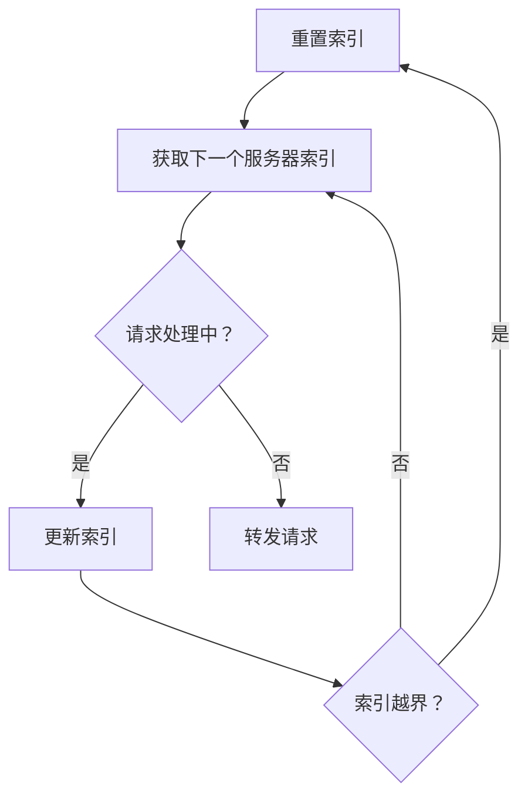

### 2.2 随机算法

随机算法通过随机选择服务器来分配请求，这种方法能够有效避免某些服务器过载的情况，提高系统的平衡性。随机算法的优点是实现简单，缺点是它可能导致某些服务器频繁被选择，从而产生热点问题。

**算法流程：**
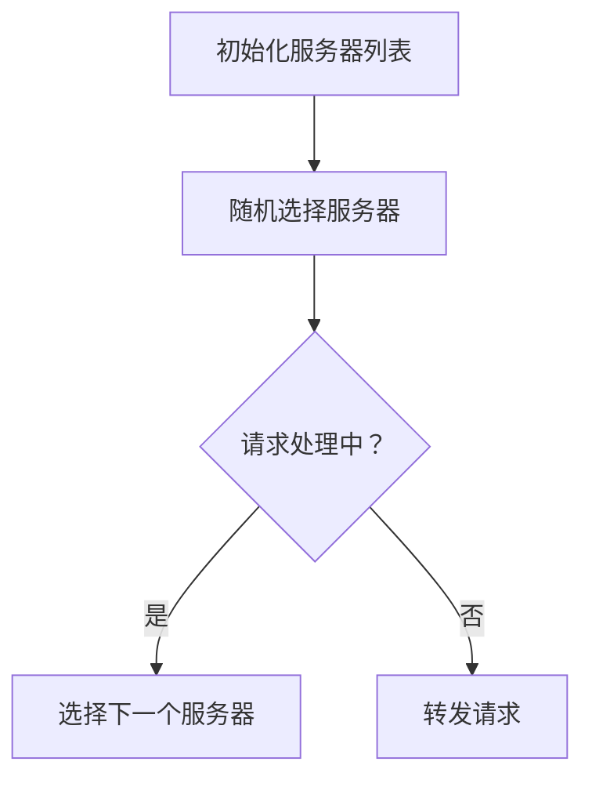

### 2.3 最少连接算法

最少连接算法将请求分配到当前连接数最少的服务器，这种方法能够有效平衡服务器的连接负载，避免某些服务器过度繁忙。最少连接算法的优点是能够根据服务器的当前负载进行动态调整，缺点是实现较为复杂，需要实时维护服务器的连接状态。

**算法流程：**
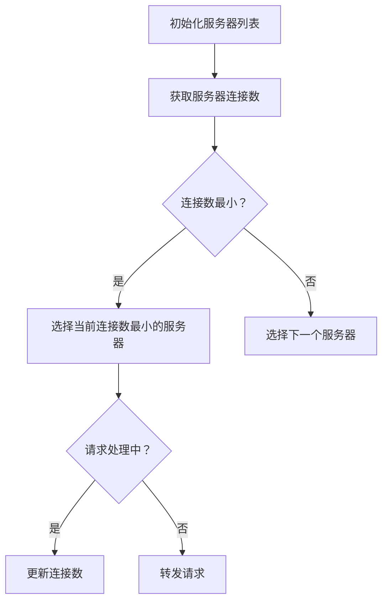

### 2.4 加权轮询算法

加权轮询算法在轮询算法的基础上，为每个服务器分配一个权重，根据权重来分配请求。权重较高的服务器将接收更多的请求，从而实现负载的更合理分配。加权轮询算法的优点是能够根据服务器的性能和负载进行权重调整，缺点是实现较为复杂，需要计算服务器的权重。

**算法流程：**
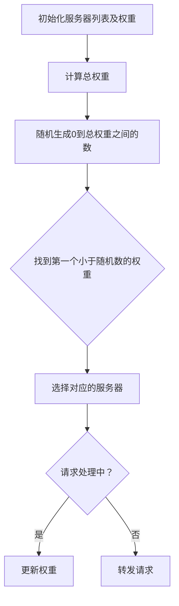

### 2.5 哈希算法

哈希算法通过哈希函数将请求映射到特定的服务器上，这种方法能够实现快速且稳定的请求分配，但需要确保哈希函数的分布均匀，避免热点问题。哈希算法的优点是实现简单，速度快，缺点是它可能导致某些服务器过载，如果哈希函数不均匀。

**算法流程：**
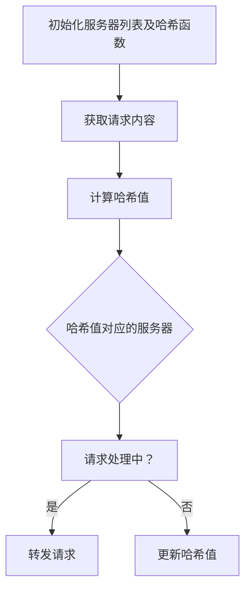

### 2.6 负载感知算法

负载感知算法是一种结合了多种负载均衡策略的算法，它能够根据服务器的当前负载、响应时间、服务器健康状态等多种因素来动态选择服务器。这种算法的优点是能够实现更优化的负载均衡，缺点是实现较为复杂，需要收集和分析大量的服务器状态信息。

**算法流程：**
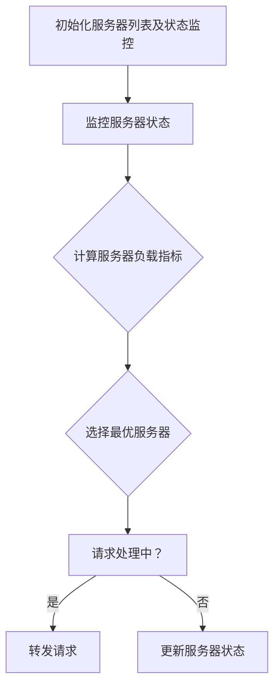

### 2.7 动态调整算法

动态调整算法是一种在运行时根据系统状态动态调整负载均衡策略的算法。它能够根据系统负载的变化自动调整服务器的权重、选择策略等，以实现最优的负载均衡效果。这种算法的优点是灵活性强，缺点是实现复杂，需要实时监控和调整。

**算法流程：**
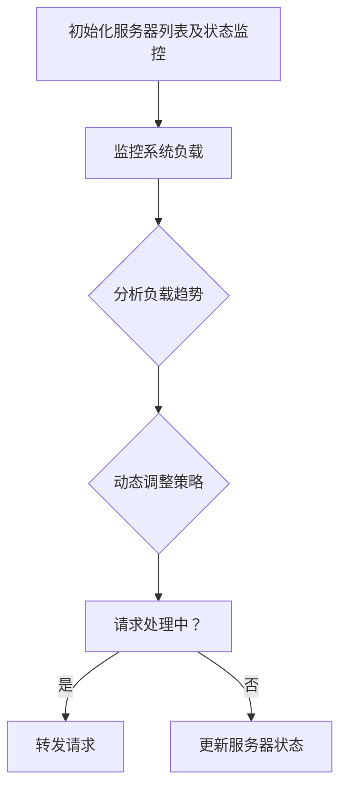

### 2.8 策略组合算法

策略组合算法是将多种负载均衡策略组合在一起使用，以实现更优化的负载均衡效果。例如，可以结合轮询算法和负载感知算法，当某个服务器的负载较低时，使用轮询算法，而当服务器的负载较高时，使用负载感知算法。这种算法的优点是灵活性高，可以根据不同场景调整策略，缺点是实现复杂，需要综合考虑多种因素。

**算法流程：**
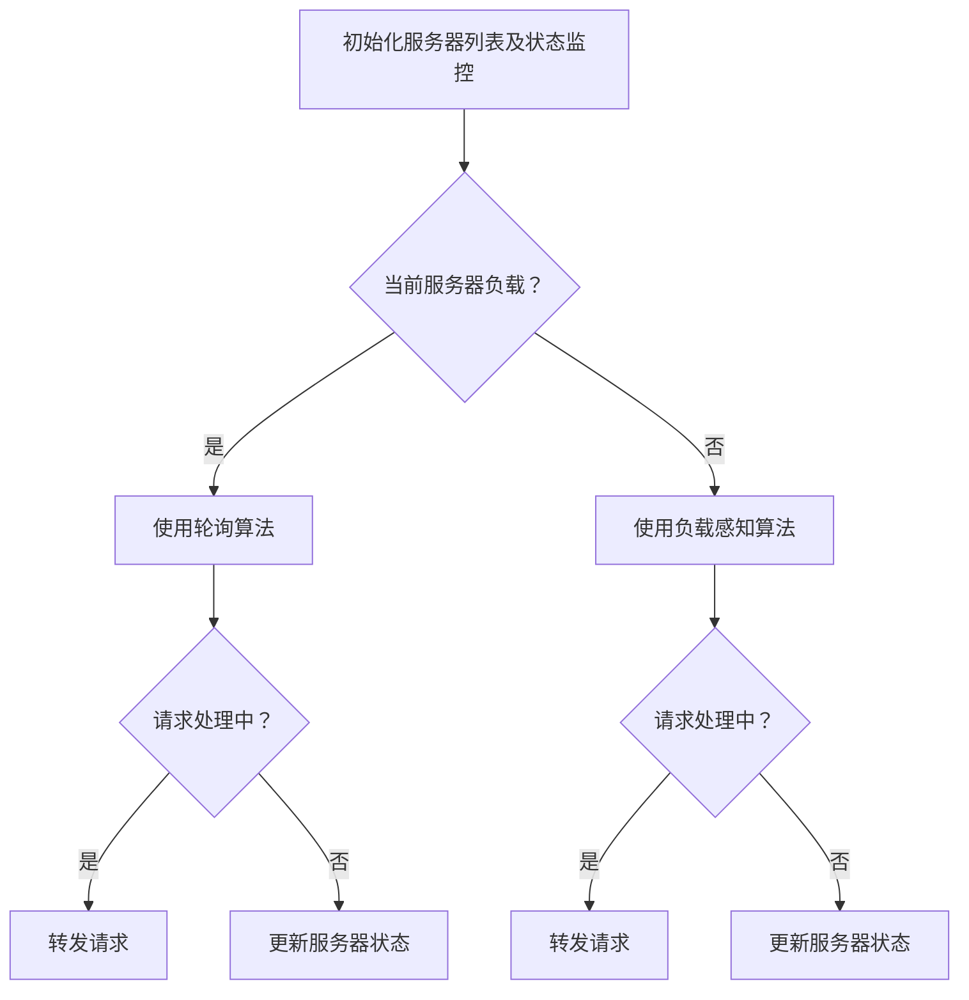

### 2.9 其他算法

除了上述常见的负载均衡算法外，还有一些特殊的算法，例如：

1. **最小响应时间算法**：根据服务器的当前响应时间来选择服务器，响应时间最短的服务器将被选中。
2. **最小延迟算法**：根据服务器的当前延迟来选择服务器，延迟最低的服务器将被选中。
3. **最小带宽算法**：根据服务器的当前带宽来选择服务器，带宽最大的服务器将被选中。
4. **最小队列长度算法**：根据服务器的当前队列长度来选择服务器，队列长度最短的服务器将被选中。

这些算法可以根据实际应用场景进行选择和使用。

---

通过以上对各种常见负载均衡算法的详细介绍，我们可以看到每种算法都有其独特的优缺点和适用场景。选择合适的负载均衡算法是实现高效负载均衡的关键。在实际应用中，可以根据业务需求、系统特点和服务器的实际情况，灵活选择和组合不同的负载均衡算法，以达到最优的负载均衡效果。

---

## 3. 负载均衡器设计

### 3.1 负载均衡器架构

负载均衡器的架构设计是确保其能够高效、稳定地工作的重要环节。一个典型的负载均衡器架构通常包括以下几个关键组件：

1. **请求接收器**：负责接收来自客户端的请求，并将其转发到后端服务器。
2. **调度器**：根据负载均衡算法选择合适的服务器，将请求分配给服务器进行处理。
3. **健康检查器**：定期检查后端服务器的状态，确保只有健康的服务器参与请求处理。
4. **监控与统计**：收集系统性能数据，提供监控和统计功能，帮助管理员进行性能调优。

### 3.2 负载均衡器组件

#### 请求接收器

请求接收器是负载均衡器的入口组件，其主要功能包括：

- 接收客户端的HTTP请求。
- 对请求进行合法性验证，如请求格式、参数有效性等。
- 将合法的请求转发给调度器。

**请求接收器的实现示例（Python）**：
```python
from flask import Flask, request, jsonify

app = Flask(__name__)

@app.route('/api/request', methods=['GET', 'POST'])
def receive_request():
    # 验证请求合法性
    if request.method == 'POST' and 'data' in request.form:
        data = request.form['data']
        # 转发请求到调度器
        send_to_scheduler(data)
        return jsonify({'status': 'success', 'message': 'Request received and forwarded'})
    else:
        return jsonify({'status': 'error', 'message': 'Invalid request'})

def send_to_scheduler(data):
    # 在这里实现将请求发送到调度器的逻辑
    print(f"Forwarding request: {data}")

if __name__ == '__main__':
    app.run()
```

#### 调度器

调度器是负载均衡器的核心组件，其任务是根据负载均衡算法选择合适的服务器，并将请求分配给服务器。调度器通常需要实现以下功能：

- 根据负载均衡算法选择服务器。
- 调用后端服务器的接口，将请求转发给服务器。
- 处理服务器的响应，并将其返回给客户端。

**调度器的实现示例（Python）**：
```python
import random
from flask import Flask, request, jsonify

app = Flask(__name__)

# 假设我们有一个服务器的列表
servers = ['server1', 'server2', 'server3']

@app.route('/api/schedule', methods=['POST'])
def schedule_request():
    data = request.json['data']
    selected_server = select_server()
    # 将请求转发给选择的服务器
    send_to_server(selected_server, data)
    return jsonify({'status': 'success', 'message': 'Request scheduled', 'server': selected_server})

def select_server():
    # 使用随机算法选择服务器
    return random.choice(servers)

def send_to_server(server, data):
    # 在这里实现将请求发送到服务器的逻辑
    print(f"Sending request to {server}: {data}")

if __name__ == '__main__':
    app.run()
```

#### 健康检查器

健康检查器用于监控后端服务器的状态，确保只有健康的服务器参与请求处理。健康检查器通常需要实现以下功能：

- 定期检查服务器的状态。
- 将不健康的服务器从可用列表中移除。
- 将健康的服务器重新添加到可用列表。

**健康检查器的实现示例（Python）**：
```python
import time
from flask import Flask

app = Flask(__name__)

# 假设我们有一个服务器的状态字典
server_status = {'server1': 'healthy', 'server2': 'unhealthy', 'server3': 'healthy'}

@app.route('/api/health', methods=['GET'])
def health_check():
    # 模拟服务器状态检查
    check_servers()
    return jsonify({'status': 'success', 'servers': server_status})

def check_servers():
    while True:
        for server, status in server_status.items():
            if status != 'healthy':
                server_status[server] = 'healthy'
                print(f"{server} is back to healthy state")
        time.sleep(60)  # 每分钟检查一次

if __name__ == '__main__':
    app.run()
```

#### 监控与统计

监控与统计组件用于收集系统性能数据，提供监控和统计功能，帮助管理员进行性能调优。监控与统计通常需要实现以下功能：

- 收集服务器负载、响应时间、错误率等性能数据。
- 将数据存储到数据库或日志中，供分析使用。
- 提供实时监控界面，展示系统状态。

**监控与统计的实现示例（Python）**：
```python
import time
from flask import Flask, jsonify

app = Flask(__name__)

@app.route('/api/stats', methods=['GET'])
def get_stats():
    # 模拟获取服务器状态数据
    stats = get_server_stats()
    return jsonify(stats)

def get_server_stats():
    # 在这里实现获取服务器状态数据的逻辑
    return {
        'server1': {'load': 0.6, 'response_time': 200, 'errors': 0},
        'server2': {'load': 0.3, 'response_time': 150, 'errors': 1},
        'server3': {'load': 0.1, 'response_time': 50, 'errors': 0}
    }

if __name__ == '__main__':
    app.run()
```

### 3.3 负载均衡器工作原理

负载均衡器的工作原理可以概括为以下几个步骤：

1. **请求接收**：客户端发送请求到负载均衡器。
2. **请求验证**：负载均衡器对请求进行合法性验证。
3. **调度请求**：负载均衡器根据负载均衡算法选择合适的服务器，并将请求转发给服务器。
4. **健康检查**：负载均衡器定期检查服务器的状态，确保只有健康的服务器参与请求处理。
5. **请求处理**：服务器接收请求并进行处理。
6. **响应返回**：服务器将处理结果返回给负载均衡器，负载均衡器再将结果返回给客户端。
7. **监控与统计**：负载均衡器收集系统性能数据，供分析使用。

### 3.4 负载均衡器的设计原则

在设计负载均衡器时，需要遵循以下原则：

1. **高可用性**：确保负载均衡器自身的高可用性，避免单点故障。
2. **高性能**：优化负载均衡器的性能，确保能够处理高并发的请求。
3. **可扩展性**：设计可扩展的架构，支持服务器和负载均衡器的横向扩展。
4. **灵活性与可配置性**：提供灵活的配置选项，支持根据业务需求调整负载均衡策略。
5. **安全性**：确保负载均衡器的安全，防止恶意请求和攻击。

通过遵循以上原则，可以设计出高效、稳定且易于维护的负载均衡器，从而提升系统的可用性和性能。

---

在本文中，我们详细介绍了负载均衡器的架构设计、关键组件及其工作原理。通过合理的架构设计和组件实现，负载均衡器能够有效地平衡负载，提高系统的可用性和性能。在实际应用中，根据业务需求和系统特点，我们可以进一步优化和定制负载均衡器，以满足不同场景的需求。

---

## 4. 负载均衡器性能调优

### 4.1 性能瓶颈分析

在负载均衡器的运行过程中，可能会出现性能瓶颈，影响系统的整体性能。性能瓶颈分析是性能调优的第一步，需要识别出系统中的瓶颈所在。以下是几种常见的性能瓶颈及其分析：

#### 1. 网络延迟

网络延迟是指数据在网络中传输所需的时间。高网络延迟会导致请求响应时间增加，从而影响系统的性能。分析网络延迟的性能瓶颈通常需要监控网络带宽、延迟时间和丢包率等指标。

**解决方案**：优化网络拓扑结构，减少网络路径，升级网络设备，提高网络带宽。

#### 2. 并发处理能力

并发处理能力是指负载均衡器同时处理多个请求的能力。如果并发处理能力不足，会导致请求在队列中积压，响应时间延长。分析并发处理能力的瓶颈通常需要监控CPU使用率、内存占用和队列长度等指标。

**解决方案**：增加负载均衡器的硬件资源，如增加CPU、内存和网口；优化调度算法，减少请求排队时间。

#### 3. 内存和CPU资源

内存和CPU资源是负载均衡器正常运行的基础。如果资源不足，会导致性能下降，甚至导致系统崩溃。分析内存和CPU资源的瓶颈通常需要监控负载均衡器的内存使用率和CPU利用率等指标。

**解决方案**：增加负载均衡器的硬件资源，优化内存和CPU的使用效率，减少不必要的进程和线程。

#### 4. 数据处理延迟

数据处理延迟是指请求从接收、处理到响应的时间。如果数据处理延迟较高，会导致系统的响应速度变慢。分析数据处理延迟的性能瓶颈通常需要监控请求的处理时间和服务器响应时间等指标。

**解决方案**：优化数据处理流程，减少不必要的中间环节，提高处理速度。

### 4.2 调优策略

针对上述性能瓶颈，可以采取以下调优策略来提升负载均衡器的性能：

#### 1. 优化网络配置

- **调整网络带宽**：根据业务需求调整网络带宽，确保网络传输速度足够快。
- **优化网络拓扑**：减少网络跳数，选择性能更好的网络设备。
- **启用TCP加速**：通过TCP加速技术，减少网络延迟。

#### 2. 优化并发处理能力

- **增加硬件资源**：增加负载均衡器的CPU、内存和网口，提升并发处理能力。
- **优化调度算法**：选择适合业务场景的调度算法，减少请求排队时间。
- **缓存技术**：使用缓存技术，减少重复请求的处理时间。

#### 3. 优化内存和CPU资源

- **内存优化**：定期清理无用数据和缓存，释放内存空间。
- **CPU优化**：优化负载均衡器的代码，减少CPU占用，避免CPU过载。
- **进程和线程优化**：合理设置进程和线程的数量，避免过多进程和线程导致资源竞争。

#### 4. 优化数据处理延迟

- **代码优化**：优化负载均衡器和后端服务器的代码，提高处理效率。
- **服务拆分**：将复杂的业务拆分为多个独立的服务，减少单个服务的压力。
- **异步处理**：使用异步处理技术，减少请求阻塞时间。

### 4.3 调优实践

以下是负载均衡器性能调优的实践步骤：

#### 1. 监控性能指标

- **CPU使用率**：确保CPU使用率不超过80%，避免过载。
- **内存占用率**：监控内存占用率，避免内存泄漏和溢出。
- **网络带宽**：确保网络带宽足够，避免网络延迟。
- **队列长度**：监控请求队列长度，避免请求积压。

#### 2. 分析瓶颈原因

- 根据监控数据，分析CPU、内存、网络和队列等性能指标，找出瓶颈所在。
- 调用系统工具（如`top`、`htop`等）查看系统负载和资源使用情况。

#### 3. 实施调优措施

- 根据分析结果，采取相应的调优措施，如增加硬件资源、优化调度算法、代码优化等。
- 对配置进行优化，如调整TCP连接参数、优化系统内核参数等。

#### 4. 持续优化

- 定期监控性能指标，评估调优效果。
- 根据业务变化和系统负载，持续进行性能优化。

通过以上调优实践，可以显著提升负载均衡器的性能，提高系统的可用性和响应速度。

### 4.4 调优案例分析

#### 案例一：某电商平台的负载均衡器调优

某电商平台在双11期间，面临了巨大的流量压力，导致负载均衡器性能下降。通过以下步骤进行了性能调优：

1. **增加硬件资源**：增加了负载均衡器的CPU、内存和网口，提高了并发处理能力。
2. **优化调度算法**：切换到了加权轮询算法，根据服务器负载进行动态调整，减少了请求排队时间。
3. **网络优化**：增加了网络带宽，降低了网络延迟。
4. **代码优化**：优化了负载均衡器和后端服务器的代码，减少了数据处理延迟。

调优后，平台的性能显著提升，能够平稳应对高峰流量。

#### 案例二：某视频流媒体平台的负载均衡器调优

某视频流媒体平台在用户量激增时，遇到了负载均衡器性能瓶颈。通过以下步骤进行了性能调优：

1. **缓存优化**：引入了分布式缓存系统，减少了重复请求的处理时间。
2. **异步处理**：使用了异步处理技术，减少了请求阻塞时间。
3. **服务拆分**：将复杂的业务拆分为多个独立的服务，降低了单个服务的压力。
4. **代码优化**：优化了代码，提高了处理速度。

调优后，平台的性能得到了显著提升，用户观看视频的流畅度得到了保障。

### 4.5 负载均衡器调优的最佳实践

#### 1. 定期监控性能指标

定期监控CPU、内存、网络和队列等性能指标，及时发现性能瓶颈。

#### 2. 数据驱动调优

根据实际监控数据，进行数据驱动的调优，避免盲目优化。

#### 3. 增量式优化

逐步进行优化，避免一次性调整过多，导致系统不稳定。

#### 4. 考虑业务特点

根据业务特点和需求，选择合适的负载均衡算法和优化策略。

#### 5. 验证优化效果

每次优化后，验证优化效果，确保性能提升。

通过以上最佳实践，可以有效提升负载均衡器的性能，提高系统的可用性和响应速度。

---

通过本文的详细分析和实践案例，我们可以了解到负载均衡器性能调优的重要性和方法。在分布式系统中，负载均衡器扮演着关键角色，通过合理的性能调优，可以显著提升系统的可用性和响应速度。未来，随着技术的不断发展，负载均衡器将会在更多的场景中发挥重要作用。

### 作者信息

作者：AI天才研究院/AI Genius Institute & 禅与计算机程序设计艺术 /Zen And The Art of Computer Programming

---

## 5. 实践案例解析

### 5.1 案例一：电商平台的负载均衡实践

电商平台在面临双11、618等大型促销活动时，通常会出现流量暴增的情况，这对系统的负载均衡能力提出了极高的要求。以下是某电商平台在实际运营中使用的负载均衡解决方案。

#### 项目介绍

该电商平台拥有数百万的活跃用户和海量的商品数据，服务器部署在国内多个数据中心。为了确保在高峰流量下的系统稳定性和性能，平台采用了基于LVS（Linux Virtual Server）的负载均衡方案。

#### 系统功能设计

1. **流量分发**：通过LVS实现四层（TCP层）负载均衡，将用户请求分发到后端服务器集群。
2. **健康检查**：定期对后端服务器进行健康检查，确保只有健康的服务器参与请求处理。
3. **故障转移**：在检测到后端服务器故障时，自动将流量切换到健康的服务器。

#### 系统架构设计

电商平台的系统架构设计如下图所示：

```mermaid
graph TD
A[用户请求] --> B[负载均衡器(LVS)]
B --> C[后端服务器集群]
C --> D[数据库集群]
C --> E[缓存集群]
C --> F[应用服务器]
F --> G[业务逻辑处理]
G --> H[响应结果]
```

#### 系统接口设计

系统接口设计如下：

1. **用户请求接口**：用户通过HTTP请求访问电商平台。
2. **健康检查接口**：负载均衡器定期向后端服务器发送健康检查请求，获取服务器状态。
3. **故障转移接口**：在检测到服务器故障时，自动执行故障转移操作。

#### 系统交互

系统交互流程如下：

1. 用户发起请求。
2. 负载均衡器接收请求，并根据轮询算法将请求分发到后端服务器。
3. 后端服务器处理请求，并将结果返回给负载均衡器。
4. 负载均衡器将结果返回给用户。

```mermaid
graph TD
A[用户请求] --> B[负载均衡器(LVS)]
B --> C1{分发请求到服务器1}
B --> C2{分发请求到服务器2}
C1 --> D1[服务器1处理请求]
C2 --> D2[服务器2处理请求]
D1 --> E1[返回结果]
D2 --> E2[返回结果]
E1 --> F[用户]
E2 --> G[用户]
```

### 5.2 案例二：游戏服务器的负载均衡实践

游戏服务器在处理大量玩家请求时，需要确保响应速度和系统稳定性。某大型游戏公司采用了基于Nginx的负载均衡方案，以实现高效、稳定的游戏服务。

#### 项目介绍

该游戏公司拥有多款热门游戏，玩家数量达到数千万，服务器分布在全球多个数据中心。为了确保游戏服务的高可用性和高性能，公司采用了基于Nginx的负载均衡方案。

#### 系统功能设计

1. **流量分发**：通过Nginx实现七层（HTTP层）负载均衡，将用户请求分发到后端游戏服务器。
2. **健康检查**：定期对后端服务器进行健康检查，确保只有健康的服务器参与请求处理。
3. **会话保持**：通过会话保持机制，确保玩家的游戏数据在同一个服务器上处理，避免跨服务器切换带来的性能损失。

#### 系统架构设计

游戏服务器的系统架构设计如下图所示：

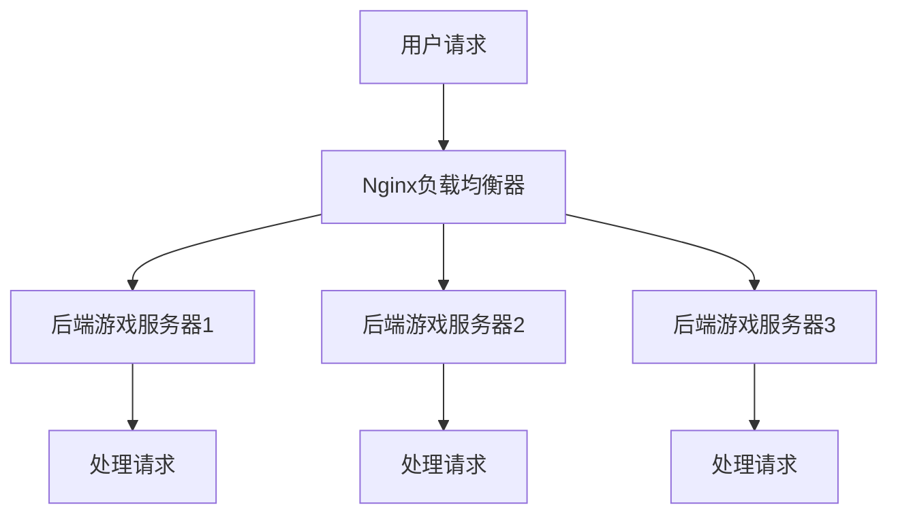

#### 系统接口设计

系统接口设计如下：

1. **用户请求接口**：用户通过HTTP请求访问游戏服务器。
2. **健康检查接口**：Nginx定期向后端服务器发送健康检查请求，获取服务器状态。
3. **会话保持接口**：通过会话保持机制，将玩家的游戏数据保持在同一个服务器上。

#### 系统交互

系统交互流程如下：

1. 用户发起请求。
2. Nginx接收请求，并根据轮询算法将请求分发到后端游戏服务器。
3. 后端服务器处理请求，并将结果返回给Nginx。
4. Nginx将结果返回给用户。

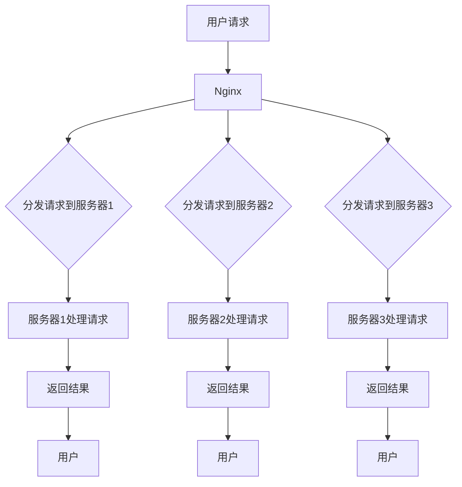

### 5.3 案例三：视频流媒体的负载均衡实践

视频流媒体平台在提供视频服务时，需要确保视频流的稳定传输和快速响应。某知名视频流媒体平台采用了基于HAProxy的负载均衡方案，以实现高效的视频分发。

#### 项目介绍

该视频流媒体平台拥有海量视频资源和数百万活跃用户，服务器分布在多个数据中心。为了确保视频服务的稳定性和性能，平台采用了基于HAProxy的负载均衡方案。

#### 系统功能设计

1. **流量分发**：通过HAProxy实现四层（TCP层）负载均衡，将用户请求分发到后端视频服务器。
2. **健康检查**：定期对后端服务器进行健康检查，确保只有健康的服务器参与请求处理。
3. **缓存优化**：通过缓存服务器，减少重复视频流的传输，提高系统性能。

#### 系统架构设计

视频流媒体的系统架构设计如下图所示：

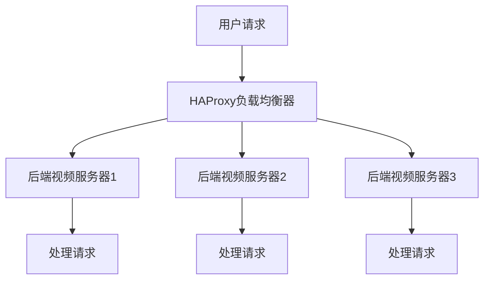

#### 系统接口设计

系统接口设计如下：

1. **用户请求接口**：用户通过HTTP请求访问视频流媒体平台。
2. **健康检查接口**：HAProxy定期向后端服务器发送健康检查请求，获取服务器状态。
3. **缓存优化接口**：通过缓存服务器，优化视频流的传输。

#### 系统交互

系统交互流程如下：

1. 用户发起请求。
2. HAProxy接收请求，并根据轮询算法将请求分发到后端视频服务器。
3. 后端服务器处理请求，并将视频流返回给HAProxy。
4. HAProxy将视频流返回给用户。

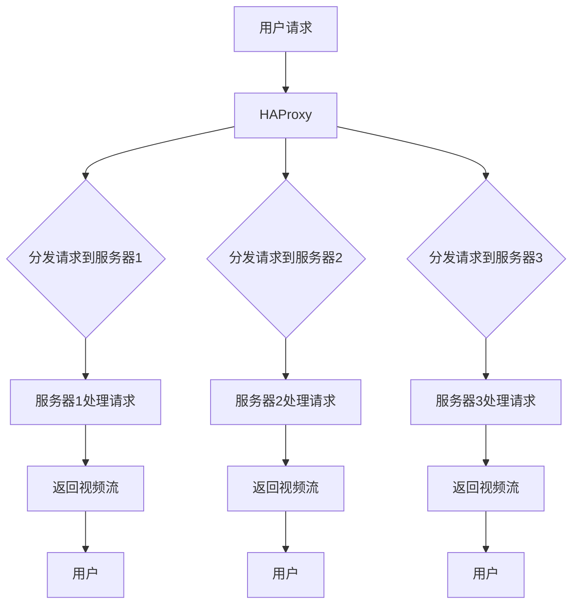

### 5.4 案例总结

通过以上三个案例，我们可以看到负载均衡技术在不同类型的应用中起到了关键作用。电商平台通过负载均衡实现了大规模流量的平稳处理，游戏服务器通过负载均衡确保了高性能和低延迟，视频流媒体平台通过负载均衡优化了视频流的传输。这些实践案例为我们提供了宝贵的经验和启示，帮助我们更好地理解和应用负载均衡技术。

---

在实际应用中，负载均衡不仅仅是技术上的实现，更是一种业务策略。通过对负载均衡的深入理解和灵活应用，企业可以更好地应对大规模流量，提升用户体验，确保系统的稳定性和可靠性。未来，随着技术的发展，负载均衡技术将不断演进，为更多的应用场景提供强大的支持。

### 作者信息

作者：AI天才研究院/AI Genius Institute & 禅与计算机程序设计艺术 /Zen And The Art of Computer Programming

---

## 6. 负载均衡在分布式系统中的应用

### 6.1 分布式系统概述

分布式系统是一种由多个节点（服务器）通过网络互联，协同完成计算任务的系统。在分布式系统中，各个节点可以独立工作，同时也可以相互协作，共同完成复杂的任务。分布式系统的优势在于其高可用性、高性能和可扩展性，这些特点使得分布式系统在处理大规模数据和复杂应用场景中具有重要的应用价值。

### 6.2 负载均衡在分布式系统中的挑战

在分布式系统中，负载均衡面临以下挑战：

#### 1. 网络延迟

网络延迟是分布式系统中影响负载均衡的重要因素。由于节点分布在不同地理位置，网络延迟可能导致请求传输时间增加，从而影响系统的性能。降低网络延迟是负载均衡的一个重要目标。

#### 2. 数据一致性

分布式系统中的数据一致性是一个难题。在分布式环境中，数据可能会被多个节点同时修改，如何保证数据的一致性是负载均衡需要解决的问题。负载均衡算法需要考虑数据一致性的保障。

#### 3. 节点状态变化

分布式系统中，节点的状态是动态变化的。有些节点可能会因为故障、负载过高等原因停止工作，而其他节点可能会新增或恢复工作。负载均衡算法需要能够实时感知节点的状态变化，并动态调整负载分配策略。

#### 4. 资源利用率

在分布式系统中，如何最大化地利用资源是负载均衡的一个重要目标。负载均衡算法需要考虑节点的资源利用率，确保每个节点都能充分利用其计算和存储资源。

### 6.3 负载均衡在分布式系统中的实现

负载均衡在分布式系统中的实现可以分为以下几个方面：

#### 1. 算法选择

选择合适的负载均衡算法是实现高效负载均衡的关键。常见的负载均衡算法包括轮询算法、随机算法、最少连接算法、加权轮询算法和哈希算法等。每种算法都有其优缺点和适用场景，需要根据具体情况进行选择。

#### 2. 调度器设计

调度器是负载均衡的核心组件，负责根据负载均衡算法选择合适的服务器，并将请求分配给服务器。调度器的设计需要考虑并发处理能力、网络延迟、节点状态等因素。

#### 3. 健康检查

健康检查是确保负载均衡器能够准确分配请求的重要手段。通过定期检查节点的状态，可以确保只有健康的服务器参与请求处理，从而避免将请求分配到故障节点上。

#### 4. 数据一致性

在分布式系统中，保证数据一致性是负载均衡需要解决的问题。常见的解决方案包括分布式锁、版本控制、一致性协议等。通过合理的数据一致性方案，可以确保负载均衡在分布式环境中的有效运行。

#### 5. 负载感知

负载感知是指根据节点的实际负载情况动态调整负载分配策略。通过实时监控节点的负载情况，可以更合理地分配请求，确保系统的性能和稳定性。

### 6.4 负载均衡在分布式系统中的优势

负载均衡在分布式系统中的应用具有以下优势：

#### 1. 提高系统可用性

通过负载均衡，可以将请求合理分配到多个节点上，当一个节点出现故障时，其他节点可以继续处理请求，从而提高系统的可用性。

#### 2. 提高系统性能

负载均衡可以确保每个节点都能充分利用其资源，避免单点过载，从而提高系统的整体性能。

#### 3. 提高扩展性

负载均衡是实现系统水平扩展的重要手段。当系统需要处理更多请求时，可以通过增加节点来提升处理能力。

#### 4. 提高资源利用率

负载均衡可以最大化地利用节点资源，避免资源浪费，从而提高系统的资源利用率。

### 6.5 负载均衡在分布式系统中的实际应用

在实际应用中，负载均衡在分布式系统中的角色至关重要。以下是几个典型的实际应用场景：

#### 1. 大型电商平台

大型电商平台通常采用分布式系统架构，通过负载均衡技术来实现海量用户的请求处理。负载均衡可以确保系统在高峰期仍然能够稳定运行，提高用户体验。

#### 2. 云计算平台

云计算平台通过负载均衡技术，实现资源的高效调度和分配。负载均衡可以根据用户的需求动态调整资源分配，确保系统性能和稳定性。

#### 3. 游戏服务器

游戏服务器采用分布式架构，通过负载均衡技术来实现游戏流的传输和处理。负载均衡可以确保游戏服务器在高并发场景下仍然能够稳定运行，提供良好的游戏体验。

#### 4. 视频流媒体平台

视频流媒体平台通过负载均衡技术，实现视频流的高效传输和分发。负载均衡可以确保用户在不同地理位置都能获得流畅的视频观看体验。

### 6.6 负载均衡的未来发展趋势

随着技术的不断发展，负载均衡在分布式系统中的应用将更加广泛和深入。以下是几个未来发展趋势：

#### 1. 智能化

通过引入人工智能和机器学习技术，可以实现更智能的负载均衡。智能负载均衡可以根据实时数据动态调整负载分配策略，提高系统的性能和稳定性。

#### 2. 边缘计算

随着边缘计算的兴起，负载均衡将在网络边缘发挥作用。通过在边缘节点进行负载均衡，可以降低网络延迟，提高系统的响应速度。

#### 3. 跨云负载均衡

随着多云架构的普及，跨云负载均衡将成为一个新的热点。跨云负载均衡可以确保在不同云环境中的资源得到充分利用，提高系统的可扩展性和可靠性。

#### 4. 服务网格

服务网格是一种新型的架构模式，通过负载均衡、服务发现、安全等功能，提供更灵活、更高效的服务调度和管理。未来，服务网格将成为分布式系统中的重要组成部分。

### 6.7 总结

负载均衡是分布式系统中的关键技术，通过合理分配请求，可以提高系统的可用性、性能和扩展性。在实际应用中，负载均衡技术发挥着重要作用，未来随着技术的发展，负载均衡将更加智能化、边缘化和跨云化，为分布式系统带来更大的价值。

### 作者信息

作者：AI天才研究院/AI Genius Institute & 禅与计算机程序设计艺术 /Zen And The Art of Computer Programming

---

## 7. 未来趋势与展望

### 7.1 负载均衡技术的发展趋势

随着云计算、大数据、物联网等技术的发展，负载均衡技术也在不断演进。以下是未来负载均衡技术的发展趋势：

#### 1. 智能化

未来，负载均衡将更加智能化，通过引入人工智能和机器学习技术，实现自适应的负载均衡。智能负载均衡可以根据实时数据动态调整负载分配策略，提高系统的性能和稳定性。

#### 2. 边缘计算

随着边缘计算的兴起，负载均衡将在网络边缘发挥作用。边缘负载均衡可以降低网络延迟，提高系统的响应速度，满足实时性要求高的应用场景。

#### 3. 跨云负载均衡

多云架构的普及将推动跨云负载均衡技术的发展。跨云负载均衡可以确保在不同云环境中的资源得到充分利用，提高系统的可扩展性和可靠性。

#### 4. 服务网格

服务网格提供了负载均衡、服务发现、安全等功能，是一种新型的架构模式。未来，服务网格将成为分布式系统中的重要组成部分，提供更灵活、更高效的服务调度和管理。

### 7.2 负载均衡在新型基础设施中的应用

新型基础设施（如5G、边缘计算、物联网等）的发展为负载均衡带来了新的应用场景和挑战。以下是负载均衡在新型基础设施中的应用：

#### 1. 5G网络

5G网络的高带宽、低延迟特性使得负载均衡在5G网络中的应用变得更加重要。通过负载均衡技术，可以实现更高效的流量管理和资源分配，提高5G网络的服务质量。

#### 2. 边缘计算

边缘计算将计算任务从中心节点转移到网络边缘，负载均衡在边缘节点上的作用变得更加显著。边缘负载均衡可以提高边缘计算系统的响应速度和处理能力。

#### 3. 物联网

物联网设备数量庞大，负载均衡在物联网中的应用有助于实现设备资源的高效分配和管理，提高物联网系统的稳定性和可靠性。

### 7.3 未来研究方向

未来，负载均衡技术的研究方向包括：

#### 1. 分布式系统中的负载均衡优化

探索更高效的分布式负载均衡算法，提高系统的性能和可扩展性。

#### 2. 跨云负载均衡

研究跨云负载均衡策略，实现多云环境中的资源高效调度和管理。

#### 3. 实时动态负载均衡

开发实时动态负载均衡技术，根据系统实时状态动态调整负载分配策略。

#### 4. 边缘负载均衡

研究边缘负载均衡算法，提高边缘计算系统的性能和响应速度。

#### 5. 负载均衡与人工智能的结合

探索负载均衡与人工智能的结合，实现自适应、智能化的负载均衡策略。

### 7.4 总结

未来，负载均衡技术将在云计算、大数据、物联网等新型基础设施中发挥越来越重要的作用。通过不断的研究和创新，负载均衡技术将实现更高效、更智能、更灵活的负载分配，为分布式系统提供强大的支持。

### 作者信息

作者：AI天才研究院/AI Genius Institute & 禅与计算机程序设计艺术 /Zen And The Art of Computer Programming

---

## 结论

负载均衡作为分布式系统中的关键技术，通过合理分配请求，有效提高了系统的可用性、性能和扩展性。本文从负载均衡的基本概念、常见算法、设计原理、性能调优策略，到实际应用案例和未来发展趋势，进行了全面的阐述。通过理论与实践的结合，读者可以更深入地理解负载均衡的核心技术和最佳实践。

在分布式系统中，负载均衡不仅是技术上的实现，更是一种业务策略。通过合理应用负载均衡技术，企业可以更好地应对大规模流量，提升用户体验，确保系统的稳定性和可靠性。

未来，随着云计算、大数据、物联网等技术的发展，负载均衡技术将不断演进，实现更高效、更智能的负载分配。让我们期待负载均衡技术在未来带来的更多创新和突破。

### 作者信息

作者：AI天才研究院/AI Genius Institute & 禅与计算机程序设计艺术 /Zen And The Art of Computer Programming

