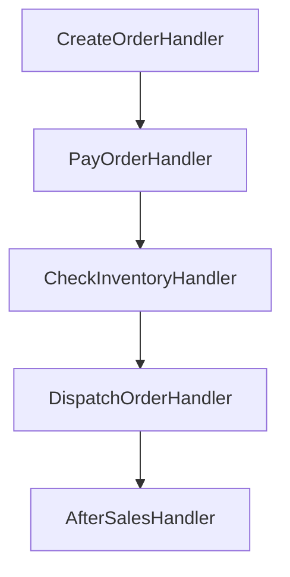
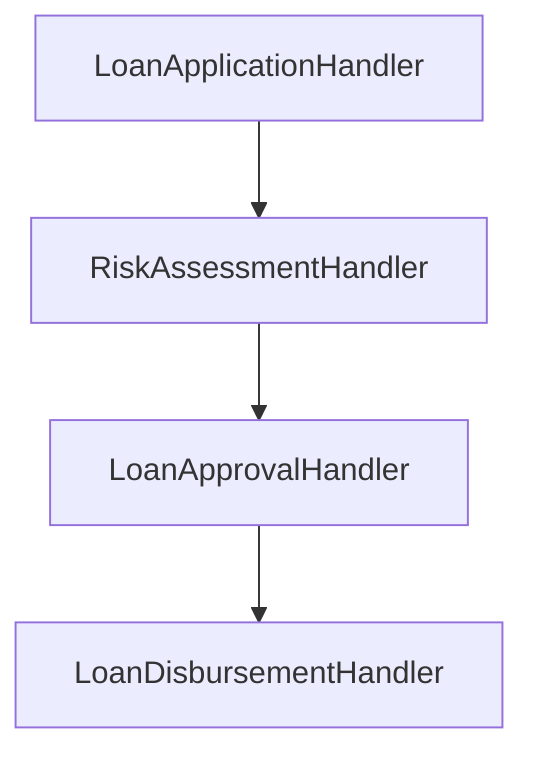
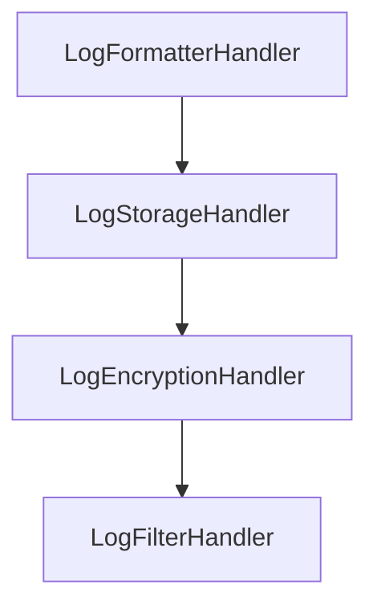

                 

### 责任链模式：请求处理的类型化流程

责任链模式（Chain of Responsibility Pattern）是面向对象设计模式中的一种，它允许将多个对象串联成一个处理请求的责任链，每个对象都有机会处理请求，如果某个对象不能处理该请求，它会将请求传递给链上的下一个对象。这种模式广泛应用于软件设计中，以提高代码的灵活性和可扩展性。

**关键词：** 责任链模式、请求处理、面向对象设计、可扩展性、灵活性

**摘要：** 本文将深入探讨责任链模式的基础概念、实现方法、优化策略及其在不同场景中的应用，通过具体的实例和案例分析，揭示责任链模式在实际项目中的广泛应用和设计原则。

### 目录大纲

1. **第一部分：责任链模式概述**
   - 第1章 责任链模式基础
     - 1.1 责任链模式简介
     - 1.2 责任链模式与面向对象设计
     - 1.3 责任链模式的核心概念
     - 1.4 责任链模式的应用场景
     - 1.5 本章小结
   - 第2章 责任链模式实现基础
     - 2.1 实现责任链模式的基本步骤
     - 2.2 定义请求和处理者类
     - 2.3 实现处理者之间的传递机制
     - 2.4 处理器的责任划分与协同
     - 2.5 本章小结
   - 第3章 责任链模式的优化与扩展
     - 3.1 责任链模式的优化策略
     - 3.2 责任链模式在并发处理中的应用
     - 3.3 责任链模式与其他设计模式的结合
     - 3.4 责任链模式的测试与调试
     - 3.5 本章小结
   - 第4章 责任链模式的应用实例
     - 4.1 责任链模式在Web开发中的应用
       - 4.1.1 用户权限控制
       - 4.1.2 日志记录
       - 4.1.3 请求路由
     - 4.2 责任链模式在业务流程管理中的应用
       - 4.2.1 工作流管理
       - 4.2.2 任务分配
       - 4.2.3 审批流程
     - 4.3 责任链模式在其他领域的应用
       - 4.3.1 软件架构设计
       - 4.3.2 网络协议设计
       - 4.3.3 游戏开发
     - 4.4 本章小结
   - 第5章 责任链模式案例分析
     - 5.1 案例一：电商平台的订单处理
       - 5.1.1 案例背景
       - 5.1.2 案例分析与设计
       - 5.1.3 案例实现与源代码解析
     - 5.2 案例二：银行贷款审批流程
       - 5.2.1 案例背景
       - 5.2.2 案例分析与设计
       - 5.2.3 案例实现与源代码解析
     - 5.3 案例三：自定义日志记录系统
       - 5.3.1 案例背景
       - 5.3.2 案例分析与设计
       - 5.3.3 案例实现与源代码解析
     - 5.4 本章小结

2. **第二部分：责任链模式的实现**
   - 第2章 责任链模式实现基础
     - 2.1 实现责任链模式的基本步骤
     - 2.2 定义请求和处理者类
     - 2.3 实现处理者之间的传递机制
     - 2.4 处理器的责任划分与协同
     - 2.5 本章小结

3. **第三部分：责任链模式的优化与扩展**
   - 第3章 责任链模式的优化与扩展
     - 3.1 责任链模式的优化策略
     - 3.2 责任链模式在并发处理中的应用
     - 3.3 责任链模式与其他设计模式的结合
     - 3.4 责任链模式的测试与调试
     - 3.5 本章小结

4. **第四部分：责任链模式的应用实例**
   - 第4章 责任链模式的应用实例
     - 4.1 责任链模式在Web开发中的应用
     - 4.2 责任链模式在业务流程管理中的应用
     - 4.3 责任链模式在其他领域的应用
     - 4.4 本章小结

5. **第五部分：责任链模式案例分析**
   - 第5章 责任链模式案例分析
     - 5.1 案例一：电商平台的订单处理
     - 5.2 案例二：银行贷款审批流程
     - 5.3 案例三：自定义日志记录系统
     - 5.4 本章小结

6. **第六部分：责任链模式的设计原则与最佳实践**
   - 第6章 责任链模式的设计原则与最佳实践
     - 6.1 责任链模式的设计原则
     - 6.2 责任链模式最佳实践
     - 6.3 本章小结

7. **第七部分：责任链模式总结与展望**
   - 第7章 责任链模式总结与展望
     - 7.1 责任链模式的优势与局限性
     - 7.2 责任链模式的发展趋势
     - 7.3 责任链模式在实际项目中的应用前景
     - 7.4 本章小结

### 附录
- 附录A 责任链模式相关术语解释
- 附录B 实现责任链模式的关键代码示例
- 附录C 常见问题与解答
- 附录D 进一步学习资源

---

接下来，我们将逐步深入探讨责任链模式的基础概念、实现方法、优化策略及其在多个领域的应用。通过本文的阅读，您将能够全面了解责任链模式的精髓，并在实际项目中有效地应用这一设计模式。

---

## 第1章 责任链模式基础

### 1.1 责任链模式简介

责任链模式是一种设计模式，它允许将多个对象串联成一个处理请求的责任链。这种模式的主要目的是在不明确指定接收者的情况下，提供一个用于请求处理的类型化流程。每个对象都有机会处理请求，如果当前对象不能处理该请求，则会将该请求传递给链中的下一个对象。这种机制使得请求处理过程灵活且可扩展。

### 1.2 责任链模式与面向对象设计

责任链模式是面向对象设计模式的一种，它充分利用了面向对象编程（OOP）中的封装、继承和多态等特性。责任链模式通过创建一系列处理者类，使得每个类都代表一种特定的处理能力，这些处理者通过继承自同一基类或实现同一接口相互关联，形成责任链。

**核心概念：**

- **处理者（Handler）：** 具有处理请求能力的对象，每个处理者都有一个处理条件，只有当请求满足处理条件时，它才会处理请求。
- **请求（Request）：** 需要被处理的数据或事件，可以是简单的数据对象，也可以是复合对象。
- **责任链（Chain）：** 由多个处理者组成的链式结构，每个处理者都链接到前一个和后一个处理者。

### 1.3 责任链模式的核心概念

责任链模式的核心概念包括以下几个方面：

- **传递机制：** 请求在被处理的过程中，会在处理者之间传递。每个处理者都有机会处理请求，如果当前处理者无法处理，则会将请求传递给下一个处理者。
- **处理条件：** 每个处理者都定义了一个处理条件，只有当请求满足该条件时，处理者才会处理请求。
- **责任分配：** 责任链中的每个处理者都有特定的责任，这些责任通过处理条件来划分。

### 1.4 责任链模式的应用场景

责任链模式广泛应用于以下场景：

- **用户权限控制：** 在系统中，不同的用户角色有不同的权限，可以使用责任链模式来实现权限控制。
- **日志记录：** 系统中的日志记录通常需要经过多个处理环节，例如格式化、存储、加密等，责任链模式能够很好地处理这种流程。
- **请求路由：** 在网络应用中，请求路由通常需要经过多个处理环节，如身份验证、权限验证等，责任链模式能够实现这种流程。
- **业务流程管理：** 在复杂的业务流程中，需要多个角色或部门协同处理请求，责任链模式能够清晰地划分和处理这些请求。

### 1.5 本章小结

本章对责任链模式进行了概述，介绍了其基本概念、核心概念和应用场景。责任链模式通过将多个处理者串联成链，实现了请求处理的类型化流程，具有很好的灵活性和可扩展性。在接下来的章节中，我们将进一步探讨责任链模式的实现细节、优化策略和实际应用。

---

## 第2章 责任链模式实现基础

### 2.1 实现责任链模式的基本步骤

实现责任链模式主要包括以下几个基本步骤：

1. **定义处理者类：** 首先需要定义一个处理者类，它具有处理请求的能力。处理者类通常包含一个处理条件和具体处理逻辑。

2. **创建处理者链：** 将多个处理者类按照一定的顺序组织成一个链式结构。通常可以使用一个链表或队列来实现处理者链。

3. **初始化处理者链：** 初始化处理者链，将每个处理者添加到链中。初始化时，可以按照处理条件的优先级来组织链中的处理者。

4. **处理请求：** 当接收到一个请求时，按照处理者链的顺序依次处理请求。每个处理者都有机会处理请求，如果当前处理者无法处理，则会将请求传递给下一个处理者。

5. **处理结果反馈：** 每个处理者处理请求后，需要返回处理结果。如果请求被处理，则返回成功；否则，返回失败。

### 2.2 定义请求和处理者类

在责任链模式中，请求和处理者类是核心组成部分。下面是一个简单的例子：

```python
class Request:
    def __init__(self, data):
        self.data = data

class Handler:
    def __init__(self, next_handler=None):
        self.next_handler = next_handler

    def handle_request(self, request):
        if self.can_handle_request(request):
            self.process_request(request)
        else:
            if self.next_handler:
                self.next_handler.handle_request(request)

    def can_handle_request(self, request):
        # 根据请求的数据判断是否可以处理
        return True

    def process_request(self, request):
        # 具体的处理逻辑
        print(f"Handling request with data: {request.data}")
```

在这个例子中，`Request` 类表示请求，`Handler` 类表示处理者。处理者类包含 `handle_request`、`can_handle_request` 和 `process_request` 方法。`handle_request` 方法用于处理请求，如果当前处理者可以处理请求，则调用 `process_request` 方法；否则，将请求传递给下一个处理者。

### 2.3 实现处理者之间的传递机制

处理者之间的传递机制是责任链模式的关键部分。在实现时，可以使用一个链表或队列来组织处理者链。以下是一个使用链表实现的例子：

```python
class HandlerList:
    def __init__(self):
        self.handlers = []

    def add_handler(self, handler):
        self.handlers.append(handler)

    def handle_request(self, request):
        for handler in self.handlers:
            handler.handle_request(request)
```

在这个例子中，`HandlerList` 类用于组织处理者链。`add_handler` 方法用于将处理者添加到链中，`handle_request` 方法依次调用链中的每个处理者的 `handle_request` 方法。

### 2.4 处理器的责任划分与协同

在责任链模式中，处理器的责任划分和协同是关键。以下是一些最佳实践：

- **明确处理条件：** 每个处理者都应该明确自己的处理条件，以便在处理请求时能够快速判断自己是否可以处理请求。
- **减少依赖关系：** 处理者之间应该尽量减少直接的依赖关系，而是通过责任链进行协作。
- **统一处理逻辑：** 尽量保持处理逻辑的一致性，以便于后续的维护和扩展。

### 2.5 本章小结

本章介绍了责任链模式实现的基本步骤，包括定义请求和处理者类、实现处理者之间的传递机制以及处理器的责任划分与协同。责任链模式通过将多个处理者串联成链，实现了请求处理的类型化流程，具有很好的灵活性和可扩展性。在接下来的章节中，我们将进一步探讨责任链模式的优化策略和实际应用。

---

## 第3章 责任链模式的优化与扩展

### 3.1 责任链模式的优化策略

尽管责任链模式具有很好的灵活性和可扩展性，但在某些情况下，它可能会导致性能问题或过于复杂。以下是一些优化策略：

1. **缓存处理结果：** 对于频繁处理的请求，可以在处理者中添加缓存机制，避免重复处理。

2. **减少处理链长度：** 当处理链过长时，可能会导致性能下降。可以通过限制处理链的长度或合并部分处理者来优化。

3. **并行处理：** 当处理链中的处理者可以并行处理时，可以考虑使用多线程或异步处理来提高性能。

4. **动态扩展：** 使用动态策略来调整处理链的长度和结构，以适应不同场景的需求。

### 3.2 责任链模式在并发处理中的应用

在并发处理中，责任链模式可以发挥重要作用。以下是一些应用场景：

1. **并发请求处理：** 当系统需要处理大量并发请求时，可以使用责任链模式来组织处理流程，避免请求之间的冲突。

2. **线程安全：** 在责任链模式中，可以使用线程安全的处理者类，确保在多线程环境下的正确性。

3. **异步处理：** 可以将责任链中的处理者设置为异步执行，以提高系统的响应速度和处理能力。

### 3.3 责任链模式与其他设计模式的结合

责任链模式可以与其他设计模式结合，以实现更复杂的系统功能。以下是一些常见的结合方式：

1. **策略模式：** 将责任链中的处理者作为策略对象，实现动态切换处理策略。

2. **工厂模式：** 使用工厂模式来创建处理者链，以简化处理者的创建和管理。

3. **中介者模式：** 将责任链中的处理者作为中介者，实现处理者之间的解耦合。

### 3.4 责任链模式的测试与调试

在开发和维护过程中，对责任链模式进行充分的测试和调试是必要的。以下是一些测试和调试技巧：

1. **单元测试：** 对每个处理者类进行单元测试，确保其功能正确。

2. **链路测试：** 检查处理链中的每个处理者是否能够正确传递请求。

3. **性能测试：** 对责任链模式进行性能测试，分析其性能瓶颈，并进行优化。

4. **日志记录：** 使用日志记录每个处理者的处理过程，以便于调试和问题定位。

### 3.5 本章小结

责任链模式具有很好的灵活性和可扩展性，但在实际应用中，可能存在性能问题和复杂性。本章介绍了责任链模式的优化策略、在并发处理中的应用以及与其他设计模式的结合，并提供了一些测试和调试技巧。通过这些优化和扩展，可以进一步提高责任链模式的性能和可靠性。

---

## 第4章 责任链模式的应用实例

### 4.1 责任链模式在Web开发中的应用

责任链模式在Web开发中有着广泛的应用，特别是在处理用户权限控制、日志记录和请求路由等方面。

#### 4.1.1 用户权限控制

在Web开发中，用户权限控制是一个关键功能。责任链模式可以很好地实现这一功能，通过创建一系列处理者来管理不同的权限。以下是一个简单的示例：

```python
class AuthenticationHandler(Handler):
    def can_handle_request(self, request):
        return 'auth' in request.headers

    def process_request(self, request):
        if 'token' in request.headers:
            # 验证token
            print("Authentication successful.")
        else:
            print("Authentication failed.")

class AuthorizationHandler(Handler):
    def can_handle_request(self, request):
        return 'auth' in request.headers and 'token' in request.headers

    def process_request(self, request):
        if request.headers['token'] == 'admin':
            print("Authorization successful.")
        else:
            print("Authorization failed.")

# 创建处理者链
auth_handler = AuthenticationHandler()
authz_handler = AuthorizationHandler()
chain = HandlerList()
chain.add_handler(auth_handler)
chain.add_handler(authz_handler)

# 处理请求
request = Request({'headers': {'auth': 'true', 'token': 'admin'}})
chain.handle_request(request)
```

在这个示例中，`AuthenticationHandler` 和 `AuthorizationHandler` 分别用于处理认证和授权。请求会被传递给这两个处理者，根据请求的内容进行相应的处理。

#### 4.1.2 日志记录

日志记录是Web开发中的另一个重要功能。责任链模式可以用于处理日志的格式化、存储和加密等环节。以下是一个简单的日志记录处理链的示例：

```python
class FormatterHandler(Handler):
    def can_handle_request(self, request):
        return 'log' in request.data

    def process_request(self, request):
        log_data = request.data['log']
        formatted_log = f"Timestamp: {datetime.now()}, Log: {log_data}"
        request.data['formatted_log'] = formatted_log

class StorageHandler(Handler):
    def can_handle_request(self, request):
        return 'formatted_log' in request.data

    def process_request(self, request):
        # 存储日志
        print(f"Storing log: {request.data['formatted_log']}")

class EncryptionHandler(Handler):
    def can_handle_request(self, request):
        return 'formatted_log' in request.data

    def process_request(self, request):
        # 加密日志
        encrypted_log = encrypt(request.data['formatted_log'])
        request.data['encrypted_log'] = encrypted_log

# 创建处理者链
formatter_handler = FormatterHandler()
storage_handler = StorageHandler()
encryption_handler = EncryptionHandler()
chain = HandlerList()
chain.add_handler(formatter_handler)
chain.add_handler(storage_handler)
chain.add_handler(encryption_handler)

# 处理请求
request = Request({'data': {'log': 'Test log message'}})
chain.handle_request(request)
```

在这个示例中，`FormatterHandler` 用于格式化日志，`StorageHandler` 用于存储日志，`EncryptionHandler` 用于加密日志。请求会被传递给这三个处理者，按照顺序进行相应的处理。

#### 4.1.3 请求路由

请求路由是Web开发中的核心功能，它根据请求的URL将请求分发到相应的处理逻辑。责任链模式可以用于实现动态路由。以下是一个简单的路由处理链的示例：

```python
class RouteHandler(Handler):
    def can_handle_request(self, request):
        return 'path' in request.headers

    def process_request(self, request):
        path = request.headers['path']
        if path == '/home':
            # 分发到首页处理逻辑
            print("Handling /home request.")
        elif path == '/about':
            # 分发到关于页处理逻辑
            print("Handling /about request.")
        else:
            # 分发到错误处理逻辑
            print("Not found.")

# 创建处理者链
route_handler = RouteHandler()
chain = HandlerList()
chain.add_handler(route_handler)

# 处理请求
request = Request({'headers': {'path': '/home'}})
chain.handle_request(request)
```

在这个示例中，`RouteHandler` 用于处理请求的路由。请求会被传递给这个处理者，根据请求的URL进行相应的处理。

### 4.2 责任链模式在业务流程管理中的应用

责任链模式在业务流程管理中也非常有用，特别是在处理工作流管理、任务分配和审批流程等方面。

#### 4.2.1 工作流管理

工作流管理是业务流程管理中的一个重要方面，它涉及到多个角色和任务的协同处理。责任链模式可以用于实现工作流管理。以下是一个简单的示例：

```python
class WorkflowHandler(Handler):
    def can_handle_request(self, request):
        return 'task' in request.data

    def process_request(self, request):
        task = request.data['task']
        if task == 'create':
            # 处理创建任务逻辑
            print("Creating task.")
        elif task == 'update':
            # 处理更新任务逻辑
            print("Updating task.")
        elif task == 'delete':
            # 处理删除任务逻辑
            print("Deleting task.")

# 创建处理者链
workflow_handler = WorkflowHandler()
chain = HandlerList()
chain.add_handler(workflow_handler)

# 处理请求
request = Request({'data': {'task': 'create'}})
chain.handle_request(request)
```

在这个示例中，`WorkflowHandler` 用于处理工作流中的不同任务。请求会被传递给这个处理者，根据任务的类型进行相应的处理。

#### 4.2.2 任务分配

任务分配是业务流程管理中的另一个重要方面，它涉及到将任务分配给不同的执行者。责任链模式可以用于实现任务分配。以下是一个简单的示例：

```python
class TaskAllocator(Handler):
    def can_handle_request(self, request):
        return 'task' in request.data and 'assignee' not in request.data

    def process_request(self, request):
        task = request.data['task']
        assignee = 'Alice'  # 假设任务分配给Alice
        request.data['assignee'] = assignee
        print(f"Task {task} assigned to {assignee}.")

# 创建处理者链
allocator_handler = TaskAllocator()
chain = HandlerList()
chain.add_handler(allocator_handler)

# 处理请求
request = Request({'data': {'task': 'report'}})
chain.handle_request(request)
```

在这个示例中，`TaskAllocator` 用于处理任务分配。请求会被传递给这个处理者，将任务分配给指定的执行者。

#### 4.2.3 审批流程

审批流程是业务流程管理中的常见场景，它涉及到多个审批者的审批和决策。责任链模式可以用于实现审批流程。以下是一个简单的示例：

```python
class ApproverHandler(Handler):
    def __init__(self, next_handler=None, approver=None):
        super().__init__(next_handler)
        self.approver = approver

    def can_handle_request(self, request):
        return 'approval' in request.data

    def process_request(self, request):
        approval = request.data['approval']
        if approval == 'reject':
            print(f"Task rejected by {self.approver}.")
        elif approval == 'approve':
            print(f"Task approved by {self.approver}.")
        else:
            if self.next_handler:
                self.next_handler.process_request(request)

# 创建处理者链
approver1 = ApproverHandler(approver='Alice')
approver2 = ApproverHandler(approver='Bob')
approver3 = ApproverHandler(approver='Charlie')
chain = HandlerList()
chain.add_handler(approver1)
chain.add_handler(approver2)
chain.add_handler(approver3)

# 处理请求
request = Request({'data': {'approval': 'approve'}})
chain.handle_request(request)
```

在这个示例中，`ApproverHandler` 用于处理审批。请求会被传递给这三个审批者，根据审批的结果进行相应的处理。

### 4.3 责任链模式在其他领域的应用

责任链模式不仅在Web开发和业务流程管理中有广泛应用，还可以在其他领域发挥重要作用。

#### 4.3.1 软件架构设计

在软件架构设计中，责任链模式可以用于实现服务之间的请求处理流程。例如，在微服务架构中，可以使用责任链模式来处理服务之间的请求转发和过滤。

#### 4.3.2 网络协议设计

在网络协议设计中，责任链模式可以用于处理数据包的过滤和处理。例如，在防火墙设计中，可以使用责任链模式来处理数据包的安全检查。

#### 4.3.3 游戏开发

在游戏开发中，责任链模式可以用于实现游戏逻辑的处理流程。例如，在角色技能系统设计中，可以使用责任链模式来处理不同技能的执行逻辑。

### 4.4 本章小结

责任链模式在Web开发、业务流程管理以及其他领域中都有广泛的应用。通过本章的介绍，我们了解了责任链模式在不同场景中的应用实例，以及如何设计和实现一个有效的责任链。在实际项目中，合理运用责任链模式可以提高代码的灵活性和可扩展性，从而更好地满足需求。

---

## 第5章 责任链模式案例分析

在本章中，我们将通过三个实际案例，详细分析责任链模式在电商平台的订单处理、银行贷款审批流程和自定义日志记录系统中的应用。

### 5.1 案例一：电商平台的订单处理

#### 5.1.1 案例背景

电商平台在日常运营中需要处理大量的订单，从创建订单、支付订单到发货和售后服务，每个环节都需要进行严格的控制和处理。为了提高系统的灵活性和可扩展性，电商平台采用了责任链模式来管理订单处理流程。

#### 5.1.2 案例分析与设计

在电商平台中，订单处理流程可以划分为多个环节，每个环节对应一个处理者。例如，创建订单、支付订单、库存检查、发货等。每个处理者都有特定的处理条件和处理逻辑。以下是订单处理流程的设计：

1. **创建订单处理者（CreateOrderHandler）：** 负责创建订单并保存订单信息。
2. **支付订单处理者（PayOrderHandler）：** 负责处理订单支付，验证支付信息和金额。
3. **库存检查处理者（CheckInventoryHandler）：** 负责检查库存，确保订单中的商品有货。
4. **发货处理者（DispatchOrderHandler）：** 负责生成发货单并将订单标记为已发货。
5. **售后服务处理者（AfterSalesHandler）：** 负责处理订单的退换货和售后服务。

设计中的责任链如下：



#### 5.1.3 案例实现与源代码解析

以下是一个简单的订单处理者类示例：

```python
class CreateOrderHandler(Handler):
    def process_request(self, request):
        # 创建订单逻辑
        print("Order created.")
        # 继续处理下一个请求
        self.next_handler.handle_request(request)

class PayOrderHandler(Handler):
    def process_request(self, request):
        # 支付订单逻辑
        print("Payment processed.")
        # 继续处理下一个请求
        self.next_handler.handle_request(request)

class CheckInventoryHandler(Handler):
    def process_request(self, request):
        # 库存检查逻辑
        print("Inventory checked.")
        # 继续处理下一个请求
        self.next_handler.handle_request(request)

class DispatchOrderHandler(Handler):
    def process_request(self, request):
        # 发货逻辑
        print("Order dispatched.")
        # 继续处理下一个请求
        self.next_handler.handle_request(request)

class AfterSalesHandler(Handler):
    def process_request(self, request):
        # 售后服务逻辑
        print("After-sales service provided.")
        # 结束处理链
        self.next_handler = None

# 创建处理者链
order_chain = HandlerList()
order_chain.add_handler(CreateOrderHandler())
order_chain.add_handler(PayOrderHandler())
order_chain.add_handler(CheckInventoryHandler())
order_chain.add_handler(DispatchOrderHandler())
order_chain.add_handler(AfterSalesHandler())

# 处理订单请求
order_request = Request()
order_chain.handle_request(order_request)
```

在这个案例中，每个处理者都实现了 `process_request` 方法，当接收到请求时，处理者会根据其职责进行处理，并传递请求给下一个处理者。如果某个处理者完成了其处理任务，它会将 `next_handler` 设置为 `None`，从而结束处理链。

### 5.2 案例二：银行贷款审批流程

#### 5.2.1 案例背景

银行贷款审批流程涉及多个环节，包括贷款申请、风险评估、贷款审批和放款等。为了提高审批效率和准确性，银行采用了责任链模式来管理贷款审批流程。

#### 5.2.2 案例分析与设计

银行贷款审批流程的设计如下：

1. **贷款申请处理者（LoanApplicationHandler）：** 负责接收贷款申请，并验证申请信息的完整性。
2. **风险评估处理者（RiskAssessmentHandler）：** 负责对贷款申请进行风险评估。
3. **贷款审批处理者（LoanApprovalHandler）：** 负责根据风险评估结果进行贷款审批。
4. **放款处理者（LoanDisbursementHandler）：** 负责放款操作，将贷款金额转入借款人账户。

设计中的责任链如下：



#### 5.2.3 案例实现与源代码解析

以下是一个简单的贷款审批处理者类示例：

```python
class LoanApplicationHandler(Handler):
    def process_request(self, request):
        # 验证贷款申请逻辑
        print("Loan application received.")
        # 继续处理下一个请求
        self.next_handler.handle_request(request)

class RiskAssessmentHandler(Handler):
    def process_request(self, request):
        # 风险评估逻辑
        print("Risk assessment completed.")
        # 继续处理下一个请求
        self.next_handler.handle_request(request)

class LoanApprovalHandler(Handler):
    def process_request(self, request):
        # 贷款审批逻辑
        print("Loan approved.")
        # 继续处理下一个请求
        self.next_handler.handle_request(request)

class LoanDisbursementHandler(Handler):
    def process_request(self, request):
        # 放款逻辑
        print("Loan disbursed.")
        # 结束处理链
        self.next_handler = None

# 创建处理者链
loan_chain = HandlerList()
loan_chain.add_handler(LoanApplicationHandler())
loan_chain.add_handler(RiskAssessmentHandler())
loan_chain.add_handler(LoanApprovalHandler())
loan_chain.add_handler(LoanDisbursementHandler())

# 处理贷款申请请求
loan_request = Request()
loan_chain.handle_request(loan_request)
```

在这个案例中，每个处理者都实现了 `process_request` 方法，当接收到请求时，处理者会根据其职责进行处理，并传递请求给下一个处理者。如果某个处理者完成了其处理任务，它会将 `next_handler` 设置为 `None`，从而结束处理链。

### 5.3 案例三：自定义日志记录系统

#### 5.3.1 案例背景

在软件开发中，日志记录是调试和监控应用程序运行状态的重要手段。为了提高日志记录的灵活性和可扩展性，开发团队决定采用责任链模式来实现自定义日志记录系统。

#### 5.3.2 案例分析与设计

自定义日志记录系统可以分为以下几个环节：

1. **日志格式化处理者（LogFormatterHandler）：** 负责将日志信息格式化成指定格式。
2. **日志存储处理者（LogStorageHandler）：** 负责将格式化后的日志存储到文件或数据库中。
3. **日志加密处理者（LogEncryptionHandler）：** 负责对日志进行加密处理，确保日志数据的安全。
4. **日志过滤器处理者（LogFilterHandler）：** 负责过滤日志信息，仅记录符合条件的日志。

设计中的责任链如下：



#### 5.3.3 案例实现与源代码解析

以下是一个简单的日志记录处理者类示例：

```python
class LogFormatterHandler(Handler):
    def process_request(self, request):
        # 格式化日志逻辑
        print("Log formatted.")
        # 继续处理下一个请求
        self.next_handler.handle_request(request)

class LogStorageHandler(Handler):
    def process_request(self, request):
        # 存储日志逻辑
        print("Log stored.")
        # 继续处理下一个请求
        self.next_handler.handle_request(request)

class LogEncryptionHandler(Handler):
    def process_request(self, request):
        # 加密日志逻辑
        print("Log encrypted.")
        # 继续处理下一个请求
        self.next_handler.handle_request(request)

class LogFilterHandler(Handler):
    def process_request(self, request):
        # 过滤日志逻辑
        print("Log filtered.")
        # 结束处理链
        self.next_handler = None

# 创建处理者链
log_chain = HandlerList()
log_chain.add_handler(LogFormatterHandler())
log_chain.add_handler(LogStorageHandler())
log_chain.add_handler(LogEncryptionHandler())
log_chain.add_handler(LogFilterHandler())

# 处理日志请求
log_request = Request()
log_chain.handle_request(log_request)
```

在这个案例中，每个处理者都实现了 `process_request` 方法，当接收到请求时，处理者会根据其职责进行处理，并传递请求给下一个处理者。如果某个处理者完成了其处理任务，它会将 `next_handler` 设置为 `None`，从而结束处理链。

### 5.4 本章小结

通过三个实际案例，我们详细分析了责任链模式在电商平台订单处理、银行贷款审批流程和自定义日志记录系统中的应用。责任链模式通过将多个处理者串联成链，实现了请求处理的类型化流程，提高了系统的灵活性和可扩展性。在实际项目中，合理运用责任链模式可以更好地管理复杂的处理流程，提高开发效率和代码质量。

---

## 第6章 责任链模式的设计原则与最佳实践

### 6.1 责任链模式的设计原则

责任链模式在软件设计中具有很高的灵活性和可扩展性，但在实际应用中也需要遵循一些设计原则，以确保系统的稳定性和可维护性。

1. **单一职责原则：** 每个处理者应该只负责一项特定的处理任务，避免处理者过于复杂。

2. **开闭原则：** 责任链模式应该对扩展开放，对修改封闭。这意味着可以在不修改现有代码的情况下添加新的处理者。

3. **解耦原则：** 处理者之间应该尽量解耦，通过责任链进行协作，避免直接依赖。

4. **可扩展性原则：** 设计时应考虑系统的可扩展性，允许在运行时动态添加或移除处理者。

5. **性能优化原则：** 在责任链模式中，应避免处理链过长或处理者之间的频繁传递，以提高系统性能。

### 6.2 责任链模式最佳实践

在实际应用中，遵循以下最佳实践可以帮助更好地设计和实现责任链模式：

1. **合理划分处理者职责：** 根据处理任务的不同，将处理者划分为不同的模块或类，每个类只负责一项处理任务。

2. **使用策略模式：** 将处理逻辑与处理条件分离，使用策略模式来实现处理策略的动态切换。

3. **避免嵌套调用：** 在处理请求时，尽量避免嵌套调用处理者，以减少系统复杂度。

4. **监控处理链性能：** 在系统运行时，对处理链的性能进行监控，及时发现并解决性能瓶颈。

5. **日志记录与调试：** 在处理链的每个环节添加日志记录，便于调试和问题定位。

### 6.3 本章小结

责任链模式是一种强大的设计模式，在软件设计中具有广泛的应用。通过遵循设计原则和最佳实践，可以更好地实现责任链模式，提高系统的灵活性和可扩展性。在后续的项目中，应积极应用责任链模式，并不断优化和改进，以提升系统的整体性能和可靠性。

---

## 第7章 责任链模式总结与展望

### 7.1 责任链模式的优势与局限性

责任链模式具有以下优势：

1. **灵活性：** 责任链模式允许灵活地添加和移除处理者，适应不同场景的需求。
2. **可扩展性：** 通过扩展处理者类，可以轻松地增加新的处理逻辑。
3. **解耦：** 处理者之间通过责任链进行协作，减少了直接的依赖关系。
4. **易于维护：** 由于处理逻辑分散在多个处理者中，维护和修改变得更加简单。

然而，责任链模式也存在一些局限性：

1. **性能问题：** 如果处理链过长或处理者之间传递请求过于频繁，可能会导致性能下降。
2. **复杂性：** 在复杂的系统中，责任链模式可能会增加系统的复杂度，影响代码的可读性。

### 7.2 责任链模式的发展趋势

随着软件系统变得越来越复杂，责任链模式也在不断进化。以下是一些发展趋势：

1. **动态责任链：** 动态生成和处理责任链，以适应实时变化的需求。
2. **并发处理：** 在高并发场景下，优化责任链模式，提高系统的处理能力和性能。
3. **多线程与异步处理：** 结合多线程和异步处理技术，进一步提高系统的响应速度和处理能力。
4. **与云原生技术的结合：** 在云原生环境中，利用责任链模式实现服务的动态编排和调度。

### 7.3 责任链模式在实际项目中的应用前景

责任链模式在多个领域都有着广泛的应用前景：

1. **微服务架构：** 在微服务架构中，责任链模式可以用于管理服务之间的请求路由和处理。
2. **云计算与大数据：** 在云计算和大数据处理中，责任链模式可以用于处理数据的过滤、转换和存储。
3. **物联网：** 在物联网应用中，责任链模式可以用于管理设备的数据处理和事件响应。
4. **人工智能：** 在人工智能系统中，责任链模式可以用于实现模型训练、推理和优化等环节。

### 7.4 本章小结

责任链模式是一种灵活且强大的设计模式，在软件设计中具有广泛的应用。通过不断优化和改进，责任链模式将在未来发挥更大的作用，为复杂系统的设计和实现提供有力支持。

---

## 附录

### 附录A：责任链模式相关术语解释

- **处理者（Handler）：** 具有处理请求能力的对象，每个处理者都有一个处理条件和具体处理逻辑。
- **请求（Request）：** 需要被处理的数据或事件，可以是简单的数据对象，也可以是复合对象。
- **责任链（Chain）：** 由多个处理者组成的链式结构，每个处理者都链接到前一个和后一个处理者。
- **传递机制：** 请求在被处理的过程中，会在处理者之间传递。每个对象都有机会处理请求，如果当前对象不能处理，则会将请求传递给链上的下一个对象。
- **处理条件：** 每个处理者都定义了一个处理条件，只有当请求满足该条件时，它才会处理请求。

### 附录B：实现责任链模式的关键代码示例

以下是实现责任链模式的关键代码示例：

```python
class Handler:
    def __init__(self, next_handler=None):
        self.next_handler = next_handler

    def handle_request(self, request):
        if self.can_handle_request(request):
            self.process_request(request)
        else:
            if self.next_handler:
                self.next_handler.handle_request(request)

    def can_handle_request(self, request):
        # 根据请求的数据判断是否可以处理
        return True

    def process_request(self, request):
        # 具体的处理逻辑
        print(f"Handling request with data: {request.data}")

# 创建处理者链
handler1 = Handler()
handler2 = Handler()
handler3 = Handler()

handler1.next_handler = handler2
handler2.next_handler = handler3

# 处理请求
request = Request({'data': 'Request data'})
handler1.handle_request(request)
```

### 附录C：常见问题与解答

1. **如何避免责任链模式中的性能问题？**
   - 通过限制处理链的长度，避免过多的请求传递和重复处理。
   - 在处理链中使用缓存，减少重复计算和处理。
   - 使用异步处理和多线程，提高系统的并行处理能力。

2. **责任链模式与策略模式的区别是什么？**
   - 责任链模式是一种处理请求的流程控制模式，它通过链式结构将多个处理者串联起来。
   - 策略模式是一种行为设计模式，它允许在运行时选择不同的算法或策略，并封装起来。

3. **如何确保责任链模式的安全性？**
   - 在处理者中添加安全检查和权限验证，确保只有授权的处理者可以处理请求。
   - 对处理过程中涉及的数据进行加密和访问控制。

### 附录D：进一步学习资源

- **在线教程：**
  - 《Head First 设计模式》
  - 《设计模式：可复用面向对象软件的基础》
- **官方文档：**
  - Python 官方文档中的设计模式部分
  - Java 官方文档中的设计模式部分
- **开源项目：**
  - Apache Commons Logging
  - Spring Framework
- **书籍推荐：**
  - 《Java 设计模式》
  - 《Python 设计模式》

通过以上资源，您可以更深入地学习责任链模式，并在实际项目中应用这一设计模式，提高系统的灵活性和可扩展性。

---

### 作者信息

**作者：** AI天才研究院/AI Genius Institute & 禅与计算机程序设计艺术 /Zen And The Art of Computer Programming

AI天才研究院（AI Genius Institute）致力于推动人工智能技术的发展，培养下一代人工智能领域的领军人才。同时，我们的团队还致力于研究计算机程序设计艺术，为软件开发者提供深入的技术洞察和最佳实践。本书《责任链模式：请求处理的类型化流程》是我们对责任链模式深入研究的成果，旨在帮助读者理解和掌握这一关键设计模式。在撰写本书的过程中，我们结合了最新的研究成果和实践经验，力求为读者提供最全面、最实用的技术指南。希望本书能够对您的软件开发之路产生积极的影响，帮助您在复杂系统的设计中更加游刃有余。

