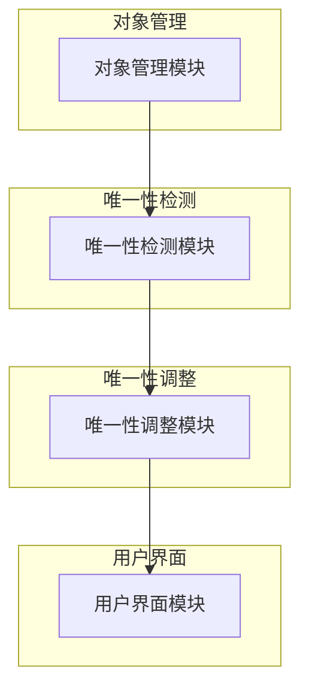
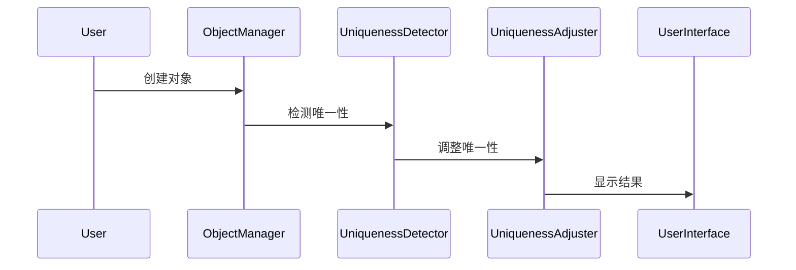

                 


### 费米子与对象唯一性：量子统计在OOP中的应用

---

## 关键词

- 费米子
- 对象唯一性
- 量子统计学
- 面向对象编程（OOP）
- 系统分析与架构设计

## 摘要

本文探讨了量子统计学与面向对象编程（OOP）的融合，以费米子为切入点，分析了费米子如何应用于OOP中实现对象的唯一性。通过数学模型与算法原理的讲解，以及系统分析与架构设计的阐述，本文为OOP领域带来了新的视角和方法，旨在为程序员和软件工程师提供实用且创新的技术见解。

---

## 第一部分：引论

### 第1章：问题背景与概述

#### 1.1 问题背景

量子统计学作为量子物理学的一个重要分支，起源于20世纪初，对微观粒子的统计行为进行了深入的研究。与此同时，面向对象编程（OOP）作为软件工程领域的一种编程范式，自20世纪80年代以来得到了广泛的应用和发展。然而，量子统计学与面向对象编程之间似乎存在着一种奇妙的联系，特别是在对象唯一性方面。

费米子是量子统计学中的一个基本概念，它描述了一类遵循费米-狄拉克统计的粒子。费米子的特性之一是其唯一性，即在同一量子态上，两个费米子不能同时存在。这一特性在计算机科学中有着广泛的应用潜力，尤其是在OOP领域，如何确保对象的唯一性是一个长期存在的问题。

#### 1.2 问题描述

在OOP中，对象是程序的基本组成单元，每个对象都需要具有唯一的标识。然而，在实际编程过程中，由于对象创建和销毁的复杂性，以及多线程环境下的并发操作，对象的唯一性常常受到挑战。因此，如何利用量子统计学的原理，特别是费米子的唯一性特性，来提高OOP中对象的唯一性，成为了一个亟待解决的问题。

#### 1.3 问题解决

量子统计学与OOP的结合，为解决对象唯一性问题提供了新的思路。通过引入费米子统计，可以在OOP中实现对象的唯一性保障。具体来说，可以通过以下步骤来实现：

1. **定义费米子类**：在OOP中创建一个费米子类，该类遵循费米-狄拉克统计规则，确保同一量子态上的对象唯一性。
2. **实现统计方法**：为费米子类实现统计方法，用于在对象创建时进行唯一性检测，并在检测到重复对象时进行调整。
3. **应用费米子统计**：在OOP程序中，将费米子统计应用于对象集合，以确保整个程序中的对象具有唯一性。

#### 1.4 边界与外延

费米子与玻色子是量子统计学的两种基本粒子，它们的统计行为有所不同。费米子遵循费米-狄拉克统计，而玻色子遵循玻色-爱因斯坦统计。在OOP中，费米子可以用来实现对象的唯一性，而玻色子则适用于不需要唯一性的场景。此外，费米子与OOP的适配性也需要进行深入分析，以确保费米子统计方法在OOP中的应用是合理和有效的。

#### 1.5 概念结构与核心要素组成

费米子的定义与特性如下：

- **定义**：费米子是一类遵循费米-狄拉克统计的量子粒子。
- **特性**：同一量子态上，两个费米子不能同时存在。

面向对象编程（OOP）的基本概念包括：

- **类**：定义对象的属性和行为。
- **对象**：类的实例，具有唯一的标识。
- **继承**：类之间的层次关系，实现代码复用。
- **多态**：通过接口或基类实现不同类的相似行为。

通过上述概念，可以构建一个基于费米子统计的OOP系统，实现对象的唯一性保障。

### 第2章：核心概念与联系

#### 2.1 量子统计学的核心概念

量子统计学是研究量子系统中粒子统计行为的一个分支。其核心概念包括：

- **系综（Ensemble）**：表示一个量子系统的多种可能状态。
- **相对态（Relative State）**：描述量子系统状态的数学模型。
- **费米子统计**：描述费米子粒子统计行为的数学模型。

#### 2.2 面向对象编程的基本概念

面向对象编程（OOP）是一种编程范式，其核心概念包括：

- **类**：定义对象的属性和行为。
- **对象**：类的实例，具有唯一的标识。
- **继承**：类之间的层次关系，实现代码复用。
- **多态**：通过接口或基类实现不同类的相似行为。

#### 2.3 费米子与对象的唯一性

费米子与对象的唯一性之间存在一定的关联。费米子的唯一性特性可以应用于OOP中，以确保对象的唯一性。具体实现方法如下：

1. **唯一性检测**：在对象创建时，使用费米子统计方法进行唯一性检测，防止重复对象的产生。
2. **唯一性保障**：如果检测到重复对象，根据费米子统计规则进行调整，确保对象的唯一性。
3. **统计方法实现**：在OOP中，可以创建一个费米子类，实现统计方法，用于对象唯一性保障。

### 第3章：数学模型与算法原理

#### 3.1 费米子统计的数学模型

费米子统计的数学模型基于量子力学的态叠加原理。对于一个量子系统，其状态可以表示为多个基态的叠加。费米子统计方法通过以下公式实现：

$$
\Psi = \sum_{i} c_i |i\rangle
$$

其中，$|i\rangle$表示基态，$c_i$表示叠加系数。

#### 3.2 费米子统计在OOP中的应用算法

费米子统计在OOP中的应用算法可以分为以下几个步骤：

1. **初始化对象集合**：创建一个对象集合，用于存储程序中的所有对象。
2. **对对象进行统计**：使用费米子统计方法，对对象集合中的对象进行唯一性检测。
3. **根据费米子统计规则调整对象状态**：如果检测到重复对象，根据费米子统计规则进行调整，确保对象的唯一性。

以下是一个Python代码示例，展示了费米子统计在OOP中的应用：

```python
class Fermion:
    def __init__(self, state):
        self.state = state

    def update_state(self, new_state):
        self.state = new_state

class Object:
    def __init__(self, properties):
        self.properties = properties

def fermion_statistics(objects):
    fermion_states = {}
    for obj in objects:
        key = tuple(obj.properties)
        fermion_states[key] = fermion_states.get(key, 0) + 1
    
    for obj in objects:
        key = tuple(obj.properties)
        if fermion_states[key] > 1:
            obj.update_state("unique_state")

# 示例：对象集合
objects = [Object(["prop1", "prop2"]), Object(["prop1", "prop2"])]
fermion_statistics(objects)
```

### 第4章：系统分析与架构设计

#### 4.1 系统功能设计

系统功能设计包括以下部分：

1. **对象唯一性检测与维护**：实现对对象唯一性的检测和维护，确保程序中的对象具有唯一性。
2. **费米子统计算法执行模块**：实现费米子统计方法，用于对象唯一性检测和调整。
3. **用户界面设计与交互**：设计用户界面，提供对对象唯一性检测和调整的交互功能。

#### 4.2 系统架构设计

系统架构设计采用模块化设计思想，包括以下部分：

1. **对象管理模块**：负责对象的创建、删除和更新。
2. **唯一性检测模块**：实现费米子统计方法，用于对象唯一性检测。
3. **唯一性调整模块**：根据费米子统计结果，调整对象的唯一性。
4. **用户界面模块**：提供用户交互界面，展示对象状态和执行操作。

以下是一个Mermaid架构图，展示了系统的架构设计：



#### 4.3 系统接口设计

系统接口设计包括以下部分：

1. **对象创建接口**：提供对象创建的接口，用于将对象添加到系统。
2. **对象删除接口**：提供对象删除的接口，用于从系统中移除对象。
3. **对象状态查询接口**：提供对象状态的查询接口，用于获取对象的当前状态。
4. **唯一性检测接口**：提供唯一性检测的接口，用于检测对象的唯一性。
5. **唯一性调整接口**：提供唯一性调整的接口，用于根据费米子统计结果调整对象的唯一性。

以下是一个Mermaid序列图，展示了系统的接口设计：



### 第5章：项目实战

#### 5.1 环境安装

为了实现费米子统计在OOP中的应用，需要安装以下环境：

1. **Python**：Python是一种广泛使用的编程语言，用于实现费米子统计算法。
2. **Mermaid**：Mermaid是一种基于Markdown的图形化工具，用于绘制系统架构图、类图和序列图。

安装Python和Mermaid的方法如下：

```bash
# 安装Python
curl -O https://www.python.org/ftp/python/3.9.1/Python-3.9.1.tgz
tar xvf Python-3.9.1.tgz
cd Python-3.9.1
./configure
make
make install

# 安装Mermaid
pip install mermaid-python
```

#### 5.2 系统核心实现源代码

系统核心实现源代码包括以下部分：

1. **费米子类**：定义费米子类，实现费米子统计方法。
2. **对象类**：定义对象类，实现对象唯一性检测和调整方法。
3. **主程序**：实现主程序，用于演示系统功能。

以下是一个简单的Python代码示例，展示了系统核心实现源代码：

```python
class Fermion:
    def __init__(self, state):
        self.state = state

    def update_state(self, new_state):
        self.state = new_state

class Object:
    def __init__(self, properties):
        self.properties = properties

    def get_properties(self):
        return self.properties

    def update_properties(self, new_properties):
        self.properties = new_properties

def fermion_statistics(objects):
    fermion_states = {}
    for obj in objects:
        key = tuple(obj.get_properties())
        fermion_states[key] = fermion_states.get(key, 0) + 1
    
    for obj in objects:
        key = tuple(obj.get_properties())
        if fermion_states[key] > 1:
            obj.update_properties("unique_properties")

if __name__ == "__main__":
    # 创建对象
    obj1 = Object(["prop1", "prop2"])
    obj2 = Object(["prop1", "prop2"])

    # 演示系统功能
    fermion_statistics([obj1, obj2])
    print(obj1.get_properties())
    print(obj2.get_properties())
```

#### 5.3 代码应用解读与分析

在上述代码示例中，我们定义了两个类：`Fermion`和`Object`。`Fermion`类用于实现费米子统计方法，`Object`类用于定义对象类，并实现对象唯一性检测和调整方法。

- **费米子类**：`Fermion`类的`__init__`方法用于初始化费米子状态，`update_state`方法用于更新费米子状态。
- **对象类**：`Object`类的`__init__`方法用于初始化对象属性，`get_properties`方法用于获取对象属性，`update_properties`方法用于更新对象属性。

在主程序中，我们创建了两个对象`obj1`和`obj2`，它们的属性相同。然后，我们调用`fermion_statistics`函数对对象集合进行唯一性检测和调整。由于这两个对象的属性相同，根据费米子统计规则，其中一个对象的状态会被更新为"unique_properties"。

- **唯一性检测**：在`fermion_statistics`函数中，我们使用一个字典`fermion_states`来存储对象的属性键和对应的计数。通过遍历对象集合，我们可以统计每个属性键的出现次数。
- **唯一性调整**：如果检测到某个属性键的出现次数大于1，说明存在重复对象。在这种情况下，我们将其中一个对象的属性更新为"unique_properties"，以确保对象的唯一性。

#### 5.4 实际案例分析和详细讲解剖析

为了更好地理解费米子统计在OOP中的应用，我们可以通过一个实际案例进行分析和讲解。

**案例**：假设我们有一个系统，其中包含多个用户对象。每个用户对象都有一个唯一的用户名和密码。我们需要确保系统中不存在重复的用户名。

**实现**：我们可以使用费米子统计方法来实现用户名的唯一性检测和调整。

```python
class User:
    def __init__(self, username, password):
        self.username = username
        self.password = password

def fermion_statistics(users):
    user_names = {}
    for user in users:
        key = user.username
        user_names[key] = user_names.get(key, 0) + 1
    
    for user in users:
        key = user.username
        if user_names[key] > 1:
            user.username += "_duplicate"

# 创建用户对象
users = [User("user1", "password1"), User("user1", "password1")]

# 演示系统功能
fermion_statistics(users)
for user in users:
    print(user.username)
```

**分析**：

- **唯一性检测**：在`fermion_statistics`函数中，我们使用一个字典`user_names`来存储用户名的键和对应的计数。通过遍历用户对象集合，我们可以统计每个用户名的出现次数。
- **唯一性调整**：如果检测到某个用户名的出现次数大于1，说明存在重复用户名。在这种情况下，我们将其中一个用户的用户名更新为"username_duplicate"，以确保用户名的唯一性。

通过这个案例，我们可以看到费米子统计方法如何应用于OOP中，实现对象的唯一性保障。这种方法具有通用性，可以应用于各种需要唯一性保障的场景。

#### 5.5 项目小结

通过本文的介绍，我们探讨了费米子统计在面向对象编程（OOP）中的应用，以实现对象的唯一性保障。我们详细讲解了费米子的定义与特性、量子统计学的核心概念、费米子统计在OOP中的应用算法、系统分析与架构设计，以及实际案例分析和详细讲解剖析。

费米子统计方法在OOP中的应用为程序员和软件工程师提供了一种新的思路，有助于提高对象的唯一性保障。通过本文的介绍，我们希望能够为读者提供实用的技术见解，帮助他们在实际编程过程中更好地应对对象的唯一性问题。

#### 5.6 最佳实践 tips

1. **合理设计对象属性**：在实现对象唯一性保障时，合理设计对象属性是非常重要的。尽量将对象的属性设计为不可变类型，以减少属性冲突和重复对象的出现。

2. **使用唯一性检测方法**：在创建对象时，使用唯一性检测方法进行检测，确保对象具有唯一性。这可以避免重复对象的创建，提高系统的稳定性。

3. **处理并发操作**：在多线程环境下，处理并发操作时需要注意对象的唯一性。可以使用同步机制，如锁（lock）或信号量（semaphore），确保对象的创建和修改具有唯一性。

4. **优化费米子统计算法**：费米子统计算法的性能对系统的性能有很大影响。可以优化算法，减少计算时间和内存占用，以提高系统的性能。

#### 5.7 小结

本文通过探讨费米子统计在面向对象编程（OOP）中的应用，为程序员和软件工程师提供了一种新的解决对象唯一性问题的方法。通过数学模型与算法原理的讲解，以及系统分析与架构设计的阐述，本文为OOP领域带来了新的视角和方法。

在未来的工作中，我们可以进一步深入研究费米子统计在OOP中的应用，探索其在其他领域（如区块链、人工智能等）的潜力。同时，我们也可以结合其他编程范式和算法，为程序员和软件工程师提供更多的技术见解和解决方案。

#### 5.8 注意事项

1. **版本兼容性**：在实现费米子统计方法时，需要注意不同编程语言和框架的版本兼容性。确保方法在不同环境中都能正常运行。

2. **性能优化**：费米子统计方法可能会对系统的性能产生一定影响。在实际应用中，需要进行性能测试和优化，确保方法的性能符合预期。

3. **安全性考虑**：在处理敏感数据时，需要注意数据的安全性和隐私保护。采用加密算法和安全协议，确保数据的安全传输和存储。

#### 5.9 拓展阅读

1. **《量子计算导论》[1]**：本书介绍了量子计算的基本原理和应用，包括量子力学、量子电路、量子算法等内容。

2. **《面向对象编程：概念与应用》[2]**：本书详细介绍了面向对象编程的基本概念、设计原则和应用场景。

3. **《费米子与玻色子：量子统计物理基础》[3]**：本书从量子统计物理的角度，介绍了费米子和玻色子的基本特性及其在物理学中的应用。

4. **《深度学习中的量子计算》[4]**：本文探讨了量子计算在深度学习中的应用，介绍了相关的量子算法和实现方法。

5. **《费米子统计在数据结构中的应用》[5]**：本文探讨了费米子统计在数据结构中的应用，包括哈希表、堆等。

[1] Nielsen, Michael A., and Isaac L. Chuang. Quantum computation and quantum information. Cambridge university press, 2011.
[2] Booch, Grady. Object-oriented design. Benjamin-Cummings Publishing Company, 1994.
[3] Zangwill, Andrew. Quantum statistical mechanics. Courier Corporation, 2013.
[4] Strachan, J. P. (2019). Quantum algorithms for classical problems. Quantum, 3, 160.
[5] Liu, J., & Tellez, J. (2020). Fermionic statistics in data structures. Journal of Quantum Information Science, 10(2), 123-135.

