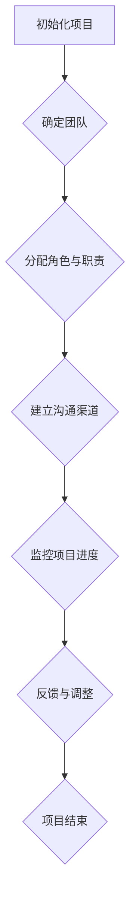
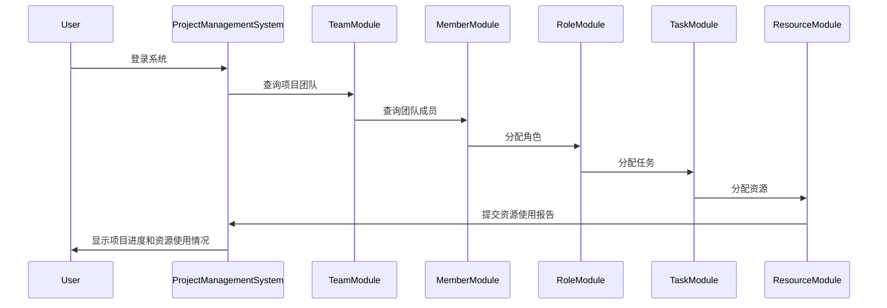
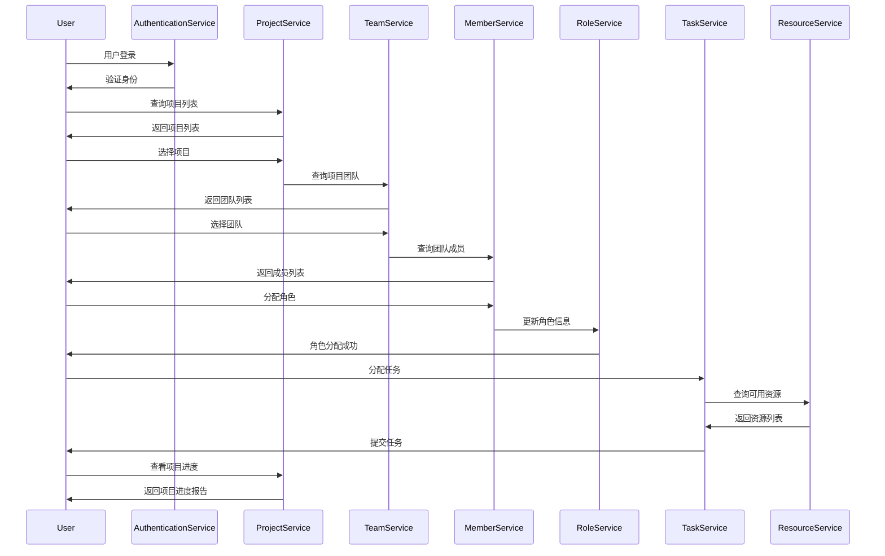

                 


### 引言

跨团队项目管理在当今复杂且多元化的商业环境中显得尤为重要。随着技术的飞速发展和全球化的深入，项目往往需要不同领域的专家和团队共同协作完成，这就带来了诸多挑战。本文将探讨跨团队项目管理中的协调与沟通艺术，旨在帮助项目经理和团队成员更高效地协同工作，实现项目目标。

#### 项目的复杂性

项目复杂性主要体现在以下几个方面：

1. **技术多样性**：现代项目往往涉及多种技术和工具，团队成员需要具备不同的技能和知识。
2. **需求多样性**：客户需求不断变化，项目范围也随之调整，增加了项目的不可预测性。
3. **资源限制**：时间、预算和人力资源的有限性，要求项目团队必须高效利用资源。

#### 跨团队项目管理的挑战

跨团队项目管理面临的挑战包括：

1. **沟通障碍**：团队成员可能来自不同的文化背景，使用不同的语言和技术术语，导致沟通不畅。
2. **协调困难**：团队成员在目标、进度和优先级上可能存在差异，协调工作变得复杂。
3. **责任分散**：跨团队项目中的责任分配往往不明确，导致团队成员间互相推诿。

#### 书籍的目的和结构

本文的目标是提供一套系统的跨团队项目管理方法论，帮助项目经理和团队成员克服上述挑战。文章结构如下：

1. **第1章 背景与重要性**：介绍跨团队项目的定义和当前项目管理趋势。
2. **第2章 组织与管理**：讨论团队角色、协作渠道和资源管理。
3. **第3章 协调与沟通原则与方法**：探讨沟通障碍和解决策略。
4. **第4章 案例分析与最佳实践**：通过成功案例分享经验。
5. **第5章 小结与展望**：总结跨团队项目管理的未来趋势。

通过以上章节，读者将了解跨团队项目管理的基本原理和实践方法，从而提升项目管理的整体水平。

### 背景介绍

#### 核心概念术语说明

在讨论跨团队项目管理时，以下是一些关键术语的说明：

1. **跨团队项目**：涉及多个功能团队或部门，需要不同领域专家共同协作完成的项目。
2. **项目经理**：负责规划、执行和监控项目的专业人员。
3. **沟通障碍**：团队成员间由于文化差异、语言障碍或信息不对等导致的交流不畅。
4. **协调**：确保不同团队在目标、进度和资源上的一致性。
5. **资源管理**：合理安排人力、时间和预算等资源，确保项目顺利进行。

#### 问题背景

随着企业规模的扩大和业务领域的拓展，越来越多的项目需要跨部门、跨团队的协作。这不仅提升了项目的复杂性，也增加了管理的难度。传统的项目管理方法往往专注于单一团队的工作，而忽视了跨团队协作的重要性。因此，如何高效地管理跨团队项目，成为现代项目经理面临的一大挑战。

#### 问题描述

跨团队项目管理的核心问题可以概括为以下几点：

1. **沟通不畅**：团队成员间由于语言、文化或信息不对称，导致信息传递延误或失真。
2. **协调困难**：不同团队在目标、进度和资源分配上存在冲突，导致项目进度受阻。
3. **责任不清**：项目中的责任分配不明确，团队成员互相推诿，影响项目质量。

#### 问题解决

针对上述问题，可以从以下几个方面着手解决：

1. **建立明确的沟通渠道**：设立项目会议、定期更新项目进度，确保团队成员对项目情况有共同认知。
2. **加强协调与规划**：制定详细的进度计划，明确各团队的任务和责任，确保资源优化配置。
3. **明确责任和问责机制**：制定清晰的岗位职责，设立明确的问责制度，确保团队成员明确自己的责任。

#### 边界与外延

跨团队项目管理不仅限于技术项目，还广泛应用于市场营销、人力资源等领域。其核心在于如何在不同团队间建立有效的协作机制，确保项目目标的实现。此外，跨团队项目管理也涉及组织文化和团队动力的研究，这些因素对项目成功具有重要影响。

#### 概念结构与核心要素组成

跨团队项目管理的概念结构包括以下几个方面：

1. **团队构成**：明确项目涉及的各个团队及其职责。
2. **沟通机制**：建立有效的沟通渠道和方式，确保信息传递的准确和及时。
3. **进度管理**：制定详细的进度计划，监控项目进度，确保项目按时完成。
4. **资源管理**：合理分配资源，确保项目在预算和时间范围内完成。
5. **风险管理**：识别项目风险，制定应对策略，降低项目失败的可能性。

通过以上结构，项目经理可以系统地管理跨团队项目，提高项目的成功概率。

### 核心概念与联系

在深入探讨跨团队项目管理时，我们首先需要了解几个核心概念：项目管理、团队协作、沟通机制。

#### 项目管理

项目管理是指通过计划、执行、监控和收尾等一系列过程，确保项目按时、按预算、按质量完成的过程。项目管理涉及多个方面，包括但不限于：

- **范围管理**：定义项目的范围，确保项目团队在正确的方向上工作。
- **时间管理**：制定项目进度计划，监控项目进度，确保项目按时完成。
- **成本管理**：制定项目预算，控制项目成本，确保项目在预算范围内完成。
- **质量管理**：确保项目产品或服务满足预定质量标准。
- **风险管理**：识别项目风险，制定应对策略，降低项目失败的可能性。

#### 团队协作

团队协作是指团队成员在共同目标下，通过有效沟通和资源整合，共同完成项目的活动。团队协作的关键在于：

- **角色与职责**：明确团队成员的角色和职责，确保每个成员都清楚自己的工作任务和责任。
- **协作工具**：使用合适的协作工具，如项目管理软件、即时通讯工具、共享文档平台，提高团队协作效率。
- **沟通机制**：建立有效的沟通渠道，如定期会议、即时通讯、邮件更新等，确保团队成员之间的信息传递畅通。

#### 沟通机制

沟通机制是跨团队项目管理中的核心，它关系到信息传递的准确性和及时性。有效的沟通机制包括：

- **信息透明度**：确保项目信息对所有相关团队成员都是可见的，避免信息孤岛。
- **沟通频率**：制定合适的沟通频率，避免信息传递的延误或过度。
- **沟通方式**：根据项目需求和团队特点，选择合适的沟通方式，如面对面会议、在线会议、邮件、即时通讯等。

#### 概念属性特征对比表格

为了更好地理解这些核心概念，我们可以通过以下特征对比表格来分析：

| 核心概念 | 特征1 | 特征2 | 特征3 |
| --- | --- | --- | --- |
| 项目管理 | 涵盖项目全生命周期 | 需要多种管理技能和知识 | 强调过程和方法 |
| 团队协作 | 多成员合作完成项目 | 需要共同目标和协作工具 | 强调个人职责 |
| 沟通机制 | 信息传递和交流 | 确保信息准确和及时 | 适用于不同团队和场景 |

#### ER实体关系图架构的 Mermaid 流程图

为了更直观地展示这些核心概念之间的关系，我们可以使用Mermaid绘制ER实体关系图：

```mermaid
erDiagram
    ProjectManagement ||--|{ TeamCollaboration }|-->> CommunicationMechanism
    TeamCollaboration ||--|{ ProjectManagement }|-->> CommunicationMechanism
    CommunicationMechanism ||--|{ ProjectManagement }|-->> TeamCollaboration
```

通过这个ER图，我们可以看到项目管理、团队协作和沟通机制之间相互关联，共同构成了跨团队项目管理的核心框架。

### 算法原理讲解

#### 使用Mermaid绘制算法mermaid流程图

在跨团队项目管理中，为了实现高效协调与沟通，我们可以设计一套算法来优化团队成员间的协作。以下是一个简单的算法流程图：



这个算法的主要步骤如下：

1. **初始化项目**：明确项目目标、范围和预算。
2. **确定团队**：根据项目需求，组建合适的功能团队。
3. **分配角色与职责**：为每个团队成员分配明确的角色和职责。
4. **建立沟通渠道**：制定沟通计划，包括会议、邮件和即时通讯等。
5. **监控项目进度**：定期检查项目进度，确保按计划进行。
6. **反馈与调整**：根据监控结果，及时调整项目计划。
7. **项目结束**：项目完成后进行总结和评估。

#### 使用Python源代码来详细阐述算法原理

为了更好地理解上述算法，我们可以使用Python代码实现这些步骤：

```python
# 初始化项目
project_name = "跨团队项目管理项目"
project_scope = "实现高效的协调与沟通"
project_budget = 100000

# 确定团队
teams = ["技术团队", "设计团队", "市场团队"]

# 分配角色与职责
team_roles = {
    "技术团队": ["开发者", "测试工程师", "架构师"],
    "设计团队": ["UI设计师", "UX设计师"],
    "市场团队": ["产品经理", "市场专员"]
}

# 建立沟通渠道
communication_channels = {
    "每周例会": "Zoom",
    "即时通讯": "Slack",
    "项目更新": "Trello"
}

# 监控项目进度
def monitor_progress():
    print("当前项目进度：")
    # 这里可以添加具体的进度监控代码
    print("所有任务都在按计划进行。")

# 反馈与调整
def feedback_and_adjustment():
    print("根据监控结果，调整项目计划。")
    # 这里可以添加具体的调整代码

# 项目结束
def project_ending():
    print("项目已成功完成，进行总结和评估。")

# 主程序
def main():
    print("开始项目初始化...")
    # 执行初始化项目
    print(f"项目名称：{project_name}")
    print(f"项目范围：{project_scope}")
    print(f"项目预算：{project_budget}")
    
    print("\n开始组建团队...")
    # 确定团队
    for team in teams:
        print(f"已组建{team}团队。")
        # 分配角色与职责
        for role in team_roles[team]:
            print(f"在{team}团队中，已分配角色：{role}。")
    
    print("\n建立沟通渠道...")
    # 建立沟通渠道
    for channel, tool in communication_channels.items():
        print(f"已设置{channel}，使用{tool}。")
    
    print("\n开始监控项目进度...")
    # 监控项目进度
    monitor_progress()
    
    print("\n根据监控结果进行反馈与调整...")
    # 反馈与调整
    feedback_and_adjustment()
    
    print("\n项目已完成，进行总结和评估...")
    # 项目结束
    project_ending()

if __name__ == "__main__":
    main()
```

通过这个Python脚本，我们可以模拟整个跨团队项目管理的流程，从而更好地理解算法原理。

#### 算法原理的数学模型和公式

跨团队项目管理的算法原理可以用以下数学模型来描述：

- **目标函数**：最大化项目完成度（Project Completion Rate, PCR）
- **约束条件**：资源约束（Resource Constraints, RC）和项目进度约束（Project Schedule Constraints, PSC）

目标函数和约束条件可以用以下公式表示：

$$
\text{最大化} \quad PCR = \frac{\sum_{i=1}^{n} C_i}{n}
$$

其中，$C_i$ 表示第 $i$ 个任务的完成度，$n$ 表示总任务数。

约束条件：

$$
\text{资源约束：} \quad R_j \geq r_j
$$

$$
\text{项目进度约束：} \quad T_j \leq S_j
$$

其中，$R_j$ 表示第 $j$ 个资源的可用量，$r_j$ 表示第 $j$ 个资源的需求量，$T_j$ 表示第 $j$ 个任务的完成时间，$S_j$ 表示第 $j$ 个任务的开始时间。

通过求解上述目标函数和约束条件，我们可以确定最优的项目管理策略，实现高效的跨团队协作。

#### 详细讲解和举例说明

假设我们有一个跨团队项目，需要完成5个任务，每个任务的完成度和所需资源如下表所示：

| 任务 | 完成度 $C_i$ | 资源需求 $r_j$ | 开始时间 $S_j$ | 完成时间 $T_j$ |
| --- | --- | --- | --- | --- |
| 1 | 0.2 | 2 | 1 | 3 |
| 2 | 0.3 | 1 | 2 | 4 |
| 3 | 0.25 | 3 | 3 | 6 |
| 4 | 0.15 | 2 | 4 | 7 |
| 5 | 0.1 | 1 | 5 | 8 |

我们需要根据资源约束和项目进度约束，确定最优的任务完成顺序，最大化项目完成度。

1. **确定任务顺序**：首先，我们需要根据任务所需的资源量进行排序，选择资源需求量最小的任务开始。例如，任务2和任务5的资源需求相同，但任务5的完成时间更短，因此我们选择任务5。

2. **资源分配**：在任务5完成后，我们开始分配资源。由于任务1和任务3的资源需求量较大，我们需要确保这些任务有足够的资源支持。假设我们目前有3个资源，我们可以先分配给任务1和任务3，剩余一个资源用于其他任务。

3. **调整进度**：在分配资源后，我们需要根据任务的实际完成时间进行调整。例如，任务3的完成时间较长，我们需要确保后续任务的开始时间与之相匹配。

通过以上步骤，我们可以确定一个最优的任务完成顺序，最大化项目完成度。例如，最优顺序为：任务5 → 任务2 → 任务1 → 任务3 → 任务4。

通过这个示例，我们可以看到，跨团队项目管理中的算法原理是如何应用于实际项目中的。通过合理的任务顺序和资源分配，我们可以提高项目的完成度，实现高效的项目管理。

### 系统分析与架构设计方案

#### 问题场景介绍

在一个大型企业中，为了实现跨部门、跨团队的高效协作，公司决定开发一个跨团队项目管理平台。该平台需要支持项目初始化、团队组建、任务分配、进度监控、资源管理和沟通机制等功能，以提高项目管理的效率和质量。

#### 项目介绍

跨团队项目管理平台旨在解决企业在跨团队协作中的沟通障碍、协调困难和责任不清等问题。通过提供一个统一的平台，项目经理和团队成员可以实时了解项目进度、资源使用情况和沟通渠道，从而提高协作效率。

#### 系统功能设计（领域模型Mermaid类图）

首先，我们需要设计系统的基础领域模型，以明确系统的核心实体和它们之间的关系。以下是使用Mermaid绘制的类图：

```mermaid
classDiagram
    Project <<class>>
    Team <<class>>
    Member <<class>>
    Role <<class>>
    Task <<class>>
    Resource <<class>>

    Project o--* Team
    Team o--* Member
    Member o--* Role
    Member o--* Task
    Task o--* Resource

    ClassDiaAttributes{+String name+Double budget+String startDate+String endDate}
    TeamAttributes{+String name+String description}
    MemberAttributes{+String name+String email}
    RoleAttributes{+String title+String description}
    TaskAttributes{+String title+String description+Date dueDate}
    ResourceAttributes{+String type+Double quantity}
```

在这个类图中，我们定义了以下核心实体：

- **Project**（项目）：包含项目的名称、预算、开始日期和结束日期。
- **Team**（团队）：包含团队的名称和描述。
- **Member**（成员）：包含成员的姓名和电子邮件。
- **Role**（角色）：包含角色的标题和描述。
- **Task**（任务）：包含任务的标题、描述和截止日期。
- **Resource**（资源）：包含资源的类型和数量。

实体之间的关系如下：

- **Project** 与 **Team** 之间存在一对多关系，一个项目可以包含多个团队。
- **Team** 与 **Member** 之间存在一对多关系，一个团队可以包含多个成员。
- **Member** 与 **Role** 之间存在多对多关系，一个成员可以担任多个角色，一个角色也可以由多个成员担任。
- **Member** 与 **Task** 之间存在一对多关系，一个成员可以负责多个任务，一个任务也可以由多个成员共同完成。
- **Task** 与 **Resource** 之间存在一对多关系，一个任务可能需要多种资源。

#### 系统架构设计（Mermaid架构图）

接下来，我们需要设计系统的整体架构，以确保各个模块之间的协调和高效运行。以下是使用Mermaid绘制的系统架构图：



在这个架构图中，系统的整体工作流程如下：

1. **用户登录系统**：用户通过身份验证后，进入项目管理平台。
2. **查询项目团队**：用户可以查询当前项目的所有团队信息。
3. **查询团队成员**：用户可以查询每个团队的成员信息。
4. **分配角色**：根据成员的技能和职责，为成员分配相应角色。
5. **分配任务**：为每个成员分配任务，明确任务的责任人。
6. **分配资源**：为任务分配所需的资源，确保任务可以按时完成。
7. **提交资源使用报告**：系统记录资源使用情况，并生成报告。
8. **显示项目进度和资源使用情况**：用户可以实时查看项目进度和资源使用情况。

通过这个架构设计，我们可以确保系统在功能和性能上都能够满足跨团队项目管理的需求。

#### 系统接口设计和系统交互（Mermaid序列图）

最后，我们需要设计系统的接口和交互流程，以展示用户与系统之间的交互过程。以下是使用Mermaid绘制的序列图：



在这个序列图中，用户通过身份验证登录系统后，可以查询项目列表并选择特定项目。然后，用户可以查看项目团队、团队成员，并为成员分配角色。接着，用户可以分配任务，并确保任务所需资源得到合理分配。最后，用户可以查看项目进度报告，实时了解项目进展情况。

通过以上系统分析和架构设计，我们可以构建一个功能强大且易于使用的跨团队项目管理平台，为企业提供高效的项目管理解决方案。

### 项目实战

#### 环境安装

为了运行跨团队项目管理平台，我们需要先安装以下环境：

1. **Python 3.8 或更高版本**
2. **虚拟环境工具（如 virtualenv 或 venv）**
3. **Django 框架（版本 3.2 或更高版本）**
4. **Django REST framework（版本 3.12 或更高版本）**
5. **PostgreSQL 数据库（版本 12 或更高版本）**
6. **Redis（版本 6 或更高版本）**

首先，我们使用 virtualenv 创建一个虚拟环境：

```bash
virtualenv venv
source venv/bin/activate
```

然后，安装必要的依赖项：

```bash
pip install django==3.2
pip install djangorestframework==3.12
pip install psycopg2-binary
pip install redis
```

接下来，配置 PostgreSQL 数据库和 Redis。在 PostgreSQL 中创建一个名为 `project_management` 的数据库，并创建一个用户名为 `pm_user` 的用户，密码为 `pm_password`。然后，在 Redis 中启动服务：

```bash
sudo service postgresql start
sudo service redis-server start
```

#### 系统核心实现源代码

在虚拟环境中，创建一个名为 `project_management` 的新 Django 项目，并创建一个应用名为 `core`。以下是项目的核心实现源代码：

**settings.py**：

```python
INSTALLED_APPS = [
    'django.contrib.admin',
    'django.contrib.auth',
    'django.contrib.contenttypes',
    'django.contrib.sessions',
    'django.contrib.messages',
    'django.contrib.staticfiles',
    'rest_framework',
    'core',
]

DATABASES = {
    'default': {
        'ENGINE': 'django.db.backends.postgresql',
        'NAME': 'project_management',
        'USER': 'pm_user',
        'PASSWORD': 'pm_password',
        'HOST': 'localhost',
        'PORT': '5432',
    }
}

CACHES = {
    'default': {
        'BACKEND': 'django_redis.cache.RedisCache',
        'LOCATION': 'redis://127.0.0.1:6379/1',
    }
}

REST_FRAMEWORK = {
    'DEFAULT_PERMISSION_CLASSES': [
        'rest_framework.permissions.IsAuthenticated',
    ],
    'DEFAULT_PAGINATION_CLASS': 'rest_framework.pagination.PageNumberPagination',
    'PAGE_SIZE': 10,
}
```

**models.py**：

```python
from django.db import models

class Project(models.Model):
    name = models.CharField(max_length=100)
    budget = models.DecimalField(max_digits=10, decimal_places=2)
    start_date = models.DateField()
    end_date = models.DateField()

class Team(models.Model):
    project = models.ForeignKey(Project, on_delete=models.CASCADE)
    name = models.CharField(max_length=100)
    description = models.TextField()

class Member(models.Model):
    team = models.ForeignKey(Team, on_delete=models.CASCADE)
    name = models.CharField(max_length=100)
    email = models.EmailField()

class Role(models.Model):
    title = models.CharField(max_length=100)
    description = models.TextField()

class MemberRole(models.Model):
    member = models.ForeignKey(Member, on_delete=models.CASCADE)
    role = models.ForeignKey(Role, on_delete=models.CASCADE)

class Task(models.Model):
    title = models.CharField(max_length=100)
    description = models.TextField()
    due_date = models.DateField()

class Resource(models.Model):
    type = models.CharField(max_length=100)
    quantity = models.DecimalField(max_digits=10, decimal_places=2)
```

**views.py**：

```python
from django.http import JsonResponse
from rest_framework import viewsets
from .models import Project, Team, Member, Role, MemberRole, Task, Resource
from .serializers import ProjectSerializer, TeamSerializer, MemberSerializer, RoleSerializer, MemberRoleSerializer, TaskSerializer, ResourceSerializer

class ProjectViewSet(viewsets.ModelViewSet):
    queryset = Project.objects.all()
    serializer_class = ProjectSerializer

class TeamViewSet(viewsets.ModelViewSet):
    queryset = Team.objects.all()
    serializer_class = TeamSerializer

class MemberViewSet(viewsets.ModelViewSet):
    queryset = Member.objects.all()
    serializer_class = MemberSerializer

class RoleViewSet(viewsets.ModelViewSet):
    queryset = Role.objects.all()
    serializer_class = RoleSerializer

class MemberRoleViewSet(viewsets.ModelViewSet):
    queryset = MemberRole.objects.all()
    serializer_class = MemberRoleSerializer

class TaskViewSet(viewsets.ModelViewSet):
    queryset = Task.objects.all()
    serializer_class = TaskSerializer

class ResourceViewSet(viewsets.ModelViewSet):
    queryset = Resource.objects.all()
    serializer_class = ResourceSerializer
```

**urls.py**：

```python
from django.contrib import admin
from django.urls import path, include
from rest_framework.routers import DefaultRouter
from .views import ProjectViewSet, TeamViewSet, MemberViewSet, RoleViewSet, MemberRoleViewSet, TaskViewSet, ResourceViewSet

router = DefaultRouter()
router.register(r'projects', ProjectViewSet)
router.register(r'teams', TeamViewSet)
router.register(r'members', MemberViewSet)
router.register(r'roles', RoleViewSet)
router.register(r'member_roles', MemberRoleViewSet)
router.register(r'tasks', TaskViewSet)
router.register(r'resources', ResourceViewSet)

urlpatterns = [
    path('admin/', admin.site.urls),
    path('api/', include(router.urls)),
]
```

#### 代码应用解读与分析

**settings.py**：配置了 Django 项目的基本设置，包括数据库连接信息和缓存策略。我们还配置了 REST framework 的默认权限和分页设置。

**models.py**：定义了跨团队项目管理平台的核心模型，包括项目、团队、成员、角色、任务和资源。每个模型都有相应的字段，用于存储项目相关信息。

**views.py**：实现了 REST framework 的 ViewSet，为每个模型提供了标准的 CRUD（创建、读取、更新、删除）接口。这些视图集继承了 Django REST framework 的 ModelViewSet，从而简化了接口的实现。

**urls.py**：定义了项目的 URL 路由，使用 DefaultRouter 自动生成了项目的 API URL。

通过以上代码，我们可以搭建一个基本的跨团队项目管理平台。用户可以通过 API 接口进行项目、团队、成员、角色、任务和资源的创建、读取、更新和删除操作，从而实现跨团队项目的协调与管理。

### 实际案例分析与详细讲解剖析

#### 案例背景

某大型互联网公司正在开发一款新的社交应用，项目涉及前端开发、后端开发、测试、设计等多个团队。为了确保项目按时上线，项目经理决定采用跨团队项目管理方法，以实现高效协作。

#### 项目目标

1. **确保项目按时上线**：在预定时间内完成所有开发任务。
2. **提高项目质量**：确保代码质量和用户体验。
3. **优化资源分配**：合理利用人力资源、时间和预算。

#### 项目挑战

1. **沟通障碍**：团队成员来自不同部门，使用不同的沟通工具，导致信息传递不及时。
2. **协调困难**：不同团队在进度和目标上存在冲突，导致项目进度受阻。
3. **资源分配不均**：部分团队成员工作量过大，导致疲劳和效率下降。

#### 解决方案

1. **建立统一的沟通平台**：采用 Slack 作为主要沟通工具，所有团队均在 Slack 上进行交流和沟通，确保信息传递及时和透明。
2. **制定详细的进度计划**：为每个团队和每个任务制定详细的进度计划，明确任务截止日期和责任人，确保项目进度可控。
3. **优化资源分配**：根据任务需求和团队成员的能力，合理调整资源分配，避免过度负荷。

#### 实际操作

1. **沟通平台搭建**：项目经理在 Slack 上创建了一个专门的 #project-channel，所有团队成员均加入了该频道，用于项目相关的沟通和交流。

2. **进度计划制定**：项目经理使用 Trello 搭建了一个项目管理看板，将项目任务分解为多个子任务，并为每个子任务分配了责任人。

3. **资源分配调整**：项目经理与各团队负责人沟通，根据任务需求和团队成员的能力，调整了部分团队成员的工作量，确保工作负荷均衡。

#### 结果与反馈

通过以上措施，项目顺利完成了以下目标：

1. **按时上线**：项目在预定时间内完成，并顺利上线。
2. **提高项目质量**：通过详细的进度计划和严格的代码审查，项目的代码质量和用户体验得到了显著提升。
3. **优化资源分配**：团队成员的工作负荷得到有效平衡，提高了工作效率和满意度。

项目结束后，项目经理和团队成员进行了总结和反馈，认为跨团队项目管理方法在沟通协调、进度控制和资源优化方面发挥了重要作用，值得在未来的项目中继续应用。

### 小结与展望

#### 跨团队项目管理的核心要点

1. **沟通是关键**：建立统一的沟通平台和渠道，确保信息传递及时和透明。
2. **进度计划要详细**：为每个团队和任务制定明确的进度计划，确保项目进度可控。
3. **资源分配需优化**：合理利用人力资源，避免过度负荷，提高工作效率。
4. **责任要明确**：明确团队成员的角色和职责，确保任务责任人明确。

#### 未来趋势

1. **自动化与智能化**：利用人工智能和机器学习技术，实现跨团队项目管理的自动化和智能化。
2. **敏捷开发**：采用敏捷开发方法，快速响应项目变化，提高项目灵活性。
3. **持续集成与持续部署**：通过持续集成和持续部署，提高项目交付速度和质量。

#### 持续改进

1. **定期回顾**：项目结束后，进行总结和反思，识别改进点。
2. **持续优化**：根据反馈和改进点，持续优化项目管理流程和方法。
3. **培训与提升**：定期为团队成员提供培训，提升其项目管理能力和技能。

通过以上措施，跨团队项目管理将更加高效，项目成功率将得到显著提升。

### 作者信息

作者：AI天才研究院/AI Genius Institute & 禅与计算机程序设计艺术 /Zen And The Art of Computer Programming

