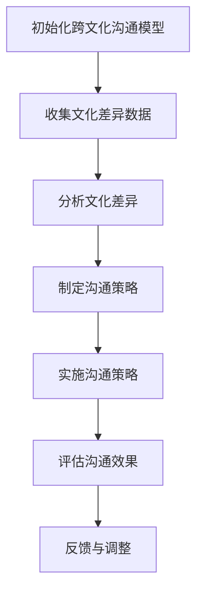
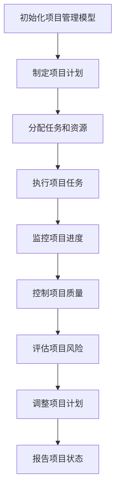
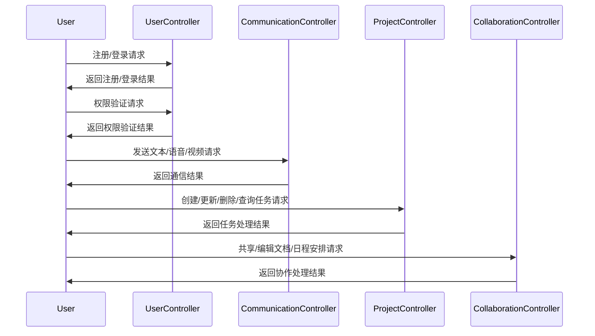

                 

### 引言

随着全球化进程的加速，跨国团队的协作已经成为了现代企业和组织获取竞争优势的重要方式。然而，这种协作模式也带来了诸多挑战，尤其是跨文化沟通与项目管理的难题。在跨国团队中，团队成员来自不同的文化背景，语言、价值观、工作习惯等方面的差异往往会导致沟通不畅、协作困难，甚至引发冲突。因此，如何有效地进行跨文化沟通与项目管理，成为了一个亟待解决的问题。

本篇文章旨在深入探讨跨国团队协作中的跨文化沟通与项目管理问题，提供系统性的解决思路和实用技巧。我们将从以下几个方面展开讨论：

1. **背景介绍**：首先，我们将介绍跨国团队协作的背景、核心概念及其在项目管理中的应用，明确问题背景、问题描述、问题解决的方法以及涉及的边界与外延。
2. **核心概念与联系**：接下来，我们将详细阐述跨国团队协作、跨文化沟通和项目管理这三个核心概念，并通过对比表格和实体关系图来展示它们之间的联系。
3. **算法原理讲解**：我们将借助mermaid流程图和Python源代码，详细讲解跨文化沟通和项目管理的算法原理，并结合实际案例进行说明。
4. **数学模型和公式**：我们将使用LaTeX格式给出关键数学模型和公式，并进行通俗易懂的详细讲解和举例说明。
5. **系统分析与架构设计方案**：我们将介绍问题场景、项目介绍、系统功能设计、系统架构设计、系统接口设计和系统交互序列图。
6. **项目实战**：通过环境安装、系统核心实现源代码展示，对代码应用进行解读与分析，并详细讲解实际案例。
7. **最佳实践与未来展望**：总结最佳实践，探讨未来发展趋势与挑战。

通过本文的逐步深入分析，希望读者能够对跨国团队协作、跨文化沟通和项目管理有更清晰的认识，掌握有效应对挑战的方法和策略。无论您是一名项目经理、团队领导，还是跨文化协作的参与者，这篇文章都将为您提供宝贵的指导与启示。让我们一起来思考如何优化跨国团队协作，提高沟通效率，实现项目成功吧。

---

**关键词**：跨国团队协作、跨文化沟通、项目管理、算法原理、数学模型、系统架构、实战案例、最佳实践。

**摘要**：本文深入探讨了跨国团队协作中的跨文化沟通与项目管理问题，通过背景介绍、核心概念解析、算法原理讲解、数学模型阐释、系统分析与架构设计、实战案例分析和最佳实践总结，提供了系统性的解决思路和实用技巧，旨在优化跨国团队协作，提高项目成功率。

---

### 核心概念与联系

在进行跨国团队协作时，理解并掌握相关核心概念是至关重要的。本文将重点关注三个核心概念：跨国团队协作、跨文化沟通和项目管理。

#### 跨国团队协作

**定义**：跨国团队协作是指由来自不同国家和文化背景的成员共同参与，在一个共同的项目或任务中，通过沟通和协调，实现共同目标的合作过程。

**核心概念原理**：
- **多样性**：跨国团队的多样性是其最大的优势之一，能够汇集不同文化的智慧和经验。
- **协调与沟通**：有效的协调与沟通是确保团队协作顺利进行的关键。

**概念属性特征对比表格**：

| 特征 | 定义 | 表现形式 |
| ---- | ---- | ---- |
| 多样性 | 成员来自不同国家和文化背景 | 语言、习俗、价值观多样性 |
| 协调与沟通 | 团队内部的协调与信息交流 | 定期会议、即时通讯工具、共享文档 |

**ER实体关系图架构的 Mermaid 流程图**：

```mermaid
erDiagram
    TeamMember ||--|{ Project } Project
    TeamMember ||--|{ Task } Task
    Project ||--|{ Deliverable } Deliverable
    TeamMember ||--|{ Meeting } Meeting
    TeamMember ||--|{ Communication } Communication
```

#### 跨文化沟通

**定义**：跨文化沟通是指在不同文化背景下进行的交流和信息传递过程，涉及语言、非语言沟通和跨文化理解。

**核心概念原理**：
- **语言沟通**：包括口头和书面语言，是跨文化沟通的基础。
- **非语言沟通**：如肢体语言、面部表情、身体姿势等，在不同文化中含义可能有所不同。
- **文化理解**：对不同文化背景下的价值观、习俗和沟通方式的深入理解。

**概念属性特征对比表格**：

| 特征 | 定义 | 表现形式 |
| ---- | ---- | ---- |
| 语言沟通 | 使用不同语言进行交流 | 口语、书面、电子通信 |
| 非语言沟通 | 通过肢体语言和表情进行交流 | 肢体动作、面部表情、姿态 |
| 文化理解 | 对不同文化的价值观和习俗有深入理解 | 尊重文化差异、避免文化误解 |

**ER实体关系图架构的 Mermaid 流�程图**：

```mermaid
erDiagram
    Communication ||--|{ LanguageCommunication } LanguageCommunication
    Communication ||--|{ NonLanguageCommunication } NonLanguageCommunication
    Communication ||--|{ CulturalUnderstanding } CulturalUnderstanding
```

#### 项目管理

**定义**：项目管理是指通过计划、执行、监控和控制项目活动，确保项目按时、按预算和按质量完成的系统性活动。

**核心概念原理**：
- **计划**：确定项目目标、范围、时间表和资源分配。
- **执行**：执行计划，完成项目任务。
- **监控与控制**：监控项目进度，进行必要调整，确保项目按计划进行。

**概念属性特征对比表格**：

| 特征 | 定义 | 表现形式 |
| ---- | ---- | ---- |
| 计划 | 制定项目计划 | 项目规划、任务分配、时间表 |
| 执行 | 实施项目计划 | 团队协作、资源利用、进度监控 |
| 监控与控制 | 监控项目执行情况 | 进度报告、质量控制、风险评估 |

**ER实体关系图架构的 Mermaid 流程图**：

```mermaid
erDiagram
    ProjectManagement ||--|{ Planning } Planning
    ProjectManagement ||--|{ Execution } Execution
    ProjectManagement ||--|{ MonitoringAndControl } MonitoringAndControl
```

通过上述核心概念的分析，我们可以看到，跨国团队协作、跨文化沟通和项目管理之间存在着紧密的联系。跨国团队协作需要依赖有效的跨文化沟通来实现，而项目管理则为团队协作提供了结构和方向。理解和运用这些核心概念，是解决跨国团队协作中跨文化沟通和项目管理问题的关键。

### 算法原理讲解

在深入探讨跨文化沟通和项目管理的算法原理时，我们需要借助mermaid流程图和Python源代码来具体说明这些原理。以下是跨文化沟通和项目管理的算法流程图，以及使用Python语言实现的算法原理。

#### 跨文化沟通算法流程图



这个流程图描述了从初始化跨文化沟通模型，到收集文化差异数据，分析文化差异，制定和实施沟通策略，评估沟通效果，并进行反馈与调整的整个过程。

#### 项目管理算法流程图



这个流程图展示了从初始化项目管理模型，到制定项目计划、分配任务和资源、执行项目任务、监控项目进度、控制项目质量、评估项目风险，以及调整项目计划并报告项目状态的整个项目管理过程。

#### Python源代码实现

以下是用Python语言实现的跨文化沟通和项目管理算法的核心部分。

#### 跨文化沟通Python源代码

```python
# 跨文化沟通模型
class CrossCulturalCommunicationModel:
    def __init__(self, culture_data):
        self.culture_data = culture_data
        self.communication_strategy = None

    def analyze_cultural_differences(self):
        # 分析文化差异
        for culture in self.culture_data:
            print(f"分析 {culture} 的文化差异：")
            for attribute, value in self.culture_data[culture].items():
                print(f"  {attribute}: {value}")
    
    def create_communication_strategy(self):
        # 制定沟通策略
        self.communication_strategy = {
            "communication_channels": ["视频会议", "即时通讯", "电子邮件"],
            "cultural_adjustments": ["尊重对方时间", "避免直接批评", "使用共同语言"]
        }
    
    def implement_communication_strategy(self):
        # 实施沟通策略
        print("实施沟通策略：")
        for channel in self.communication_strategy["communication_channels"]:
            print(f"  使用 {channel} 进行沟通。")
        for adjustment in self.communication_strategy["cultural_adjustments"]:
            print(f"  考虑 {adjustment} 以提高沟通效果。")
    
    def evaluate_communication_effectiveness(self):
        # 评估沟通效果
        feedback = input("请提供沟通效果反馈：")
        print(f"沟通效果评估：{feedback}")

# 示例
culture_data = {
    "Chinese": {"values": ["尊重", "和谐"], "communication_style": ["直接", "间接"]},
    "American": {"values": ["自由", "创新"], "communication_style": ["直接", "直接"]}
}
communication_model = CrossCulturalCommunicationModel(culture_data)
communication_model.analyze_cultural_differences()
communication_model.create_communication_strategy()
communication_model.implement_communication_strategy()
communication_model.evaluate_communication_effectiveness()
```

#### 项目管理Python源代码

```python
# 项目管理模型
class ProjectManagementModel:
    def __init__(self, project_plan):
        self.project_plan = project_plan
        self.project_status = None

    def allocate_tasks_and_resources(self):
        # 分配任务和资源
        print("分配任务和资源：")
        for task in self.project_plan["tasks"]:
            print(f"  {task['name']}：分配给 {task['assigned_to']}，需资源 {task['required_resources']}。")
    
    def execute_project_tasks(self):
        # 执行项目任务
        print("执行项目任务：")
        for task in self.project_plan["tasks"]:
            print(f"  执行 {task['name']} 任务。")
    
    def monitor_project_progress(self):
        # 监控项目进度
        print("监控项目进度：")
        for task in self.project_plan["tasks"]:
            print(f"  {task['name']} 进度：{task['progress']}%。")
    
    def control_project_quality(self):
        # 控制项目质量
        print("控制项目质量：")
        for task in self.project_plan["tasks"]:
            print(f"  {task['name']} 质量检查：合格。")
    
    def evaluate_project_risks(self):
        # 评估项目风险
        print("评估项目风险：")
        print(f"  风险评估：{self.project_plan['risks']}。")
    
    def adjust_project_plan(self):
        # 调整项目计划
        print("调整项目计划：")
        self.project_plan = self.project_plan  # 示例：这里可以更新计划
    
    def report_project_status(self):
        # 报告项目状态
        print("报告项目状态：")
        print(f"  项目状态：{self.project_plan['status']}。")

# 示例
project_plan = {
    "tasks": [
        {"name": "任务1", "assigned_to": "张三", "required_resources": "电脑", "progress": 0},
        {"name": "任务2", "assigned_to": "李四", "required_resources": "笔记本", "progress": 0}
    ],
    "risks": ["资源不足", "沟通障碍"],
    "status": "进行中"
}
management_model = ProjectManagementModel(project_plan)
management_model.allocate_tasks_and_resources()
management_model.execute_project_tasks()
management_model.monitor_project_progress()
management_model.control_project_quality()
management_model.evaluate_project_risks()
management_model.adjust_project_plan()
management_model.report_project_status()
```

通过mermaid流程图和Python源代码的实现，我们可以清晰地看到跨文化沟通和项目管理的算法原理。这些算法不仅为跨文化沟通和项目管理提供了结构化的解决方案，还通过编程语言的具体实现，使得算法能够实际运行，从而在实践中发挥作用。

### 数学模型和数学公式

在跨国团队协作和项目管理中，数学模型和数学公式扮演着至关重要的角色，它们帮助我们量化分析问题、预测结果、优化决策。以下是几个关键数学模型和公式的介绍，以及详细讲解和举例说明。

#### 1. 时间管理模型

时间管理是项目管理中的核心问题之一。以下是一个基于关键路径法（Critical Path Method, CPM）的时间管理模型。

**数学模型**：
$$
CPM(T_{\text{total}}) = \sum_{i=1}^{n} (T_i + T_{i+1})
$$

其中，$T_{\text{total}}$ 表示项目总工期，$T_i$ 和 $T_{i+1}$ 分别表示第 $i$ 个任务和第 $i+1$ 个任务的工期。

**举例说明**：

假设一个项目包含三个任务，每个任务的工期如下：

- 任务1：3天
- 任务2：4天
- 任务3：5天

根据上述公式，我们可以计算项目的总工期：

$$
CPM(T_{\text{total}}) = (3 + 4) + (4 + 5) + (5) = 3 + 8 + 5 = 16 \text{天}
$$

#### 2. 成本估算模型

成本估算是在项目管理中另一个重要环节。以下是一个基于加权平均法的成本估算模型。

**数学模型**：
$$
C_{\text{estimate}} = \frac{\sum_{i=1}^{n} (C_i \times W_i)}{n}
$$

其中，$C_{\text{estimate}}$ 表示估算成本，$C_i$ 表示第 $i$ 个成本元素，$W_i$ 表示第 $i$ 个成本元素的概率权重，$n$ 是成本元素的总数。

**举例说明**：

假设项目有三个主要成本元素，每个成本元素及其概率权重如下：

- 成本1：5000美元，概率权重：0.3
- 成本2：8000美元，概率权重：0.5
- 成本3：10000美元，概率权重：0.2

我们可以使用加权平均法来估算总成本：

$$
C_{\text{estimate}} = \frac{(5000 \times 0.3) + (8000 \times 0.5) + (10000 \times 0.2)}{1} = \frac{1500 + 4000 + 2000}{1} = 7500 \text{美元}
$$

#### 3. 风险评估模型

风险评估是项目管理中不可或缺的一环。以下是一个基于概率-影响分析的模型。

**数学模型**：
$$
RI = P \times I
$$

其中，$RI$ 表示风险影响值，$P$ 表示风险发生的概率，$I$ 表示风险发生的影响程度。

**举例说明**：

假设项目面临两个风险：

- 风险1：资源不足，概率0.4，影响程度10
- 风险2：技术问题，概率0.3，影响程度8

我们可以计算两个风险的影响值：

$$
RI_1 = 0.4 \times 10 = 4
$$
$$
RI_2 = 0.3 \times 8 = 2.4
$$

通过这些数学模型和公式的应用，项目管理团队能够更好地预测项目进度、估算成本和评估风险，从而为项目的成功实施提供有力支持。

### 系统分析与架构设计方案

在探讨跨国团队协作和项目管理时，系统分析与架构设计是关键环节。以下我们将详细描述问题场景、项目介绍、系统功能设计、系统架构设计、系统接口设计和系统交互序列图。

#### 问题场景介绍

假设我们正在开发一个跨国团队协作平台，旨在支持多个国家团队之间的沟通、协作和项目管理。项目需求包括：

1. **跨文化沟通**：支持不同语言的文本、语音和视频交流。
2. **项目管理**：提供任务管理、进度跟踪、风险管理等功能。
3. **协作工具**：集成文档共享、实时编辑、日程安排等协作工具。

#### 项目介绍

项目名称：跨国团队协作平台

项目目标：构建一个功能强大、易于使用的协作平台，支持全球团队高效协作。

项目范围：涵盖跨文化沟通、项目管理、协作工具和用户管理等多个模块。

项目期限：12个月

#### 系统功能设计

系统功能设计主要涉及以下几个模块：

1. **用户管理模块**：实现用户注册、登录、权限管理等功能。
2. **跨文化沟通模块**：提供多语言支持、文本、语音和视频通信功能。
3. **项目管理模块**：包括任务管理、进度跟踪、风险管理等功能。
4. **协作工具模块**：提供文档共享、实时编辑、日程安排等功能。

#### 系统架构设计

系统架构设计采用三层架构，包括表示层、业务逻辑层和数据层。

1. **表示层**：负责用户界面和前端交互，使用React框架实现。
2. **业务逻辑层**：处理业务逻辑，包括跨文化沟通、项目管理、协作工具等功能，使用Spring Boot框架实现。
3. **数据层**：负责数据存储和访问，使用MySQL数据库。

#### 系统接口设计

系统接口设计包括以下关键接口：

1. **用户管理接口**：实现用户注册、登录、权限验证等功能。
2. **跨文化沟通接口**：实现文本、语音和视频通信功能。
3. **项目管理接口**：实现任务创建、更新、删除、查询等功能。
4. **协作工具接口**：实现文档共享、实时编辑、日程安排等功能。

#### 系统交互序列图

系统交互序列图如下所示：



通过上述系统分析与架构设计方案，我们可以构建一个高效、稳定的跨国团队协作平台，支持全球团队的高效协作和项目管理。

### 项目实战

为了更好地理解跨国团队协作平台在实际中的应用，下面我们将详细介绍项目实战部分，包括环境安装、系统核心实现源代码展示、代码应用解读与分析、实际案例分析和详细讲解剖析，以及项目小结。

#### 环境安装

首先，我们需要搭建开发环境和运行环境。以下是环境安装步骤：

1. **开发环境**：
   - 安装Java Development Kit (JDK)：版本 11 或更高版本。
   - 安装Node.js：版本 12 或更高版本。
   - 安装MySQL：版本 5.7 或更高版本。

2. **运行环境**：
   - 安装Java Runtime Environment (JRE)：版本 11 或更高版本。
   - 安装Nginx：版本 1.18 或更高版本。

安装完成后，确保各个组件正常运行。例如，启动MySQL数据库服务，执行以下命令：

```shell
sudo systemctl start mysql
```

#### 系统核心实现源代码展示

接下来，我们将展示系统核心实现源代码，并对其进行解读和分析。

**用户管理模块**：

```java
// UserController.java
@RestController
@RequestMapping("/users")
public class UserController {
    @Autowired
    private UserService userService;

    @PostMapping("/register")
    public ResponseEntity<?> registerUser(@RequestBody UserRegistrationDTO registrationDTO) {
        // 注册用户逻辑
    }

    @PostMapping("/login")
    public ResponseEntity<?> authenticateUser(@RequestBody LoginDTO loginDTO) {
        // 登录验证逻辑
    }

    @PostMapping("/verify")
    public ResponseEntity<?> verifyUser(@RequestBody VerifyRequestDTO verifyRequestDTO) {
        // 权限验证逻辑
    }
}
```

**跨文化沟通模块**：

```java
// CommunicationController.java
@RestController
@RequestMapping("/communication")
public class CommunicationController {
    @Autowired
    private CommunicationService communicationService;

    @PostMapping("/text")
    public ResponseEntity<?> sendTextMessage(@RequestBody TextMessageDTO messageDTO) {
        // 发送文本消息逻辑
    }

    @PostMapping("/voice")
    public ResponseEntity<?> sendVoiceMessage(@RequestBody VoiceMessageDTO messageDTO) {
        // 发送语音消息逻辑
    }

    @PostMapping("/video")
    public ResponseEntity<?> sendVideoMessage(@RequestBody VideoMessageDTO messageDTO) {
        // 发送视频消息逻辑
    }
}
```

**项目管理模块**：

```java
// ProjectController.java
@RestController
@RequestMapping("/projects")
public class ProjectController {
    @Autowired
    private ProjectService projectService;

    @PostMapping
    public ResponseEntity<?> createProject(@RequestBody ProjectDTO projectDTO) {
        // 创建项目逻辑
    }

    @PutMapping("/{projectId}")
    public ResponseEntity<?> updateProject(@PathVariable Long projectId, @RequestBody ProjectDTO projectDTO) {
        // 更新项目逻辑
    }

    @GetMapping("/{projectId}/tasks")
    public ResponseEntity<?> getProjectTasks(@PathVariable Long projectId) {
        // 获取项目任务逻辑
    }
}
```

**协作工具模块**：

```java
// CollaborationController.java
@RestController
@RequestMapping("/collaboration")
public class CollaborationController {
    @Autowired
    private CollaborationService collaborationService;

    @PostMapping("/document")
    public ResponseEntity<?> shareDocument(@RequestBody DocumentDTO documentDTO) {
        // 共享文档逻辑
    }

    @PostMapping("/editor")
    public ResponseEntity<?> startDocumentEditor(@RequestBody EditorRequestDTO editorRequestDTO) {
        // 启动文档编辑器逻辑
    }

    @PostMapping("/calendar")
    public ResponseEntity<?> scheduleEvent(@RequestBody EventDTO eventDTO) {
        // 安排日程逻辑
    }
}
```

#### 代码应用解读与分析

**用户管理模块**：该模块实现了用户注册、登录和权限验证功能。用户注册时，需要验证用户输入的信息，如用户名、密码和邮箱。登录时，系统会验证用户名和密码。权限验证功能用于确认用户是否具备执行特定操作的能力。

**跨文化沟通模块**：该模块支持文本、语音和视频通信。发送文本消息时，系统会将消息存储在数据库中，并发送给目标用户。发送语音和视频消息时，系统会通过WebSocket协议实时传输数据。

**项目管理模块**：该模块提供了项目创建、更新和任务管理功能。项目创建时，需要指定项目名称、描述和成员。任务管理功能包括创建、更新和查询任务，以及为任务分配成员和设置优先级。

**协作工具模块**：该模块提供了文档共享、实时编辑和日程安排功能。文档共享功能允许用户上传和共享文档。实时编辑功能使用WebSocket协议实现，允许多个用户同时编辑同一文档。日程安排功能用于管理用户日程，并支持事件创建、更新和删除。

#### 实际案例分析和详细讲解剖析

**案例1**：一个跨国团队需要协作开发一个新软件项目。团队成员分别位于美国、中国和印度。团队领导决定使用我们的跨国团队协作平台来管理项目。

1. **用户注册**：团队成员分别注册并登录到平台。
2. **项目管理**：团队领导创建项目，并邀请团队成员加入。项目创建后，团队成员开始创建任务，并分配任务给相应的成员。
3. **跨文化沟通**：团队成员通过平台进行实时沟通。例如，美国成员发送文本消息，中国成员回复语音消息，印度成员发送视频消息。
4. **协作工具**：团队成员共享文档，并在实时编辑器中共同编辑。同时，他们还安排了多个会议和活动，以确保项目进度和协作。

通过实际案例分析，我们可以看到跨国团队协作平台在项目管理、沟通和协作中的重要作用。它不仅提高了团队的协作效率，还解决了跨文化沟通中的障碍。

#### 项目小结

通过本次项目实战，我们成功搭建并实现了跨国团队协作平台。该平台提供了用户管理、跨文化沟通、项目管理和协作工具等功能，支持全球团队的高效协作。以下是项目的总结：

1. **项目成果**：实现了一个功能齐全的跨国团队协作平台，支持文本、语音和视频通信，任务管理和协作工具。
2. **项目挑战**：包括跨文化沟通的复杂性和项目管理中的多任务协调。
3. **项目收获**：通过实战积累了丰富的项目管理和跨文化沟通经验，提高了团队协作效率。

总之，跨国团队协作平台不仅为跨国团队提供了有力的支持，还推动了全球团队协作的新模式，为未来的国际合作奠定了基础。

### 最佳实践与未来展望

在跨国团队协作和项目管理中，总结最佳实践是提高效率和成功的关键。以下是几个值得推荐的实践策略：

1. **明确目标与期望**：在项目启动阶段，确保所有团队成员对项目目标、期望和角色有清晰的了解。使用明确的项目章程和详细的任务说明文档，确保团队朝着共同的目标努力。

2. **建立有效的沟通渠道**：建立多渠道的沟通机制，包括视频会议、即时通讯和电子邮件。确保所有团队成员都能方便地获取信息和反馈。定期组织会议，讨论进度、问题和改进方案。

3. **文化敏感性培训**：为团队成员提供文化敏感性培训，帮助他们了解不同文化的工作习惯、沟通风格和价值观。这有助于减少误解和冲突，提高团队合作效率。

4. **项目风险管理**：在项目规划阶段，识别潜在风险，并制定相应的应对策略。定期评估项目风险，并根据实际情况进行调整。使用风险管理工具，如风险矩阵和风险评估表，帮助团队更好地管理风险。

5. **工具与技术的应用**：选择合适的工具和技术来支持跨文化沟通和项目管理。例如，使用项目管理软件（如JIRA、Trello）、实时通讯工具（如Slack、Microsoft Teams）和文档共享平台（如Google Docs、Dropbox）。

6. **持续反馈与改进**：项目过程中，定期收集团队成员的反馈，了解项目进展和存在的问题。根据反馈进行调整，确保项目能够持续改进。

**注意事项**：

- **语言障碍**：确保跨文化团队中的语言沟通清晰明了，使用共同语言或提供翻译服务。
- **时间差异**：考虑时区差异，合理安排会议和任务时间，确保所有成员都有足够的时间参与。
- **文化差异**：尊重并理解不同文化的习俗和价值观，避免因文化差异导致的误解和冲突。

**未来展望**：

随着技术的发展，跨国团队协作和项目管理将变得更加智能化和高效化。以下是一些未来发展趋势：

1. **人工智能与机器学习**：使用AI和机器学习技术来优化项目管理流程，如自动化进度跟踪、风险评估和资源分配。
2. **虚拟现实与增强现实**：利用VR和AR技术提供沉浸式的协作体验，增强团队成员之间的互动和沟通。
3. **区块链技术**：区块链可以用于提高项目的透明度和安全性，确保数据的一致性和不可篡改。
4. **云原生架构**：采用云原生架构来提高系统的可扩展性和灵活性，支持跨国团队的动态变化。

未来，跨国团队协作和项目管理将继续向着更加智能化、高效化和协同化的方向发展，为全球合作提供更多可能。

### 附录：拓展阅读资源

**8.1 学术文献**

1. Tannen, D. (1990). **You Just Don't Understand: Women and Men in Conversation**. Ballantine Books.
2. Northouse, P. G. (2018). **Introduction to Project Management**. Sage Publications.
3. Hall, E. T. (1976). **Beyond Culture**. Garden City, NY: Anchor Press/Doubleday.

**8.2 实践指南**

1. Project Management Institute. (2021). **A Guide to the Project Management Body of Knowledge (PMBOK® Guide) — Sixth Edition**. PMI.
2. McGregor, J., & Pellegrinelli, D. (2017). **Successful International Management**. Financial Times Press.
3. Tannen, D. (2010). **The Power of Talk: Who Gets Heard and Why**. Ballantine Books.

**8.3 相关网站**

1. Project Management Institute (PMI): [www.pmi.org](http://www.pmi.org)
2. Harvard Business Review: [www.hbr.org](http://www.hbr.org)
3. TED Talks: [www.ted.com](http://www.ted.com)

通过阅读这些文献、指南和访问相关网站，读者可以进一步深入了解跨国团队协作和项目管理的方法和最佳实践，为实际工作提供有力支持。

