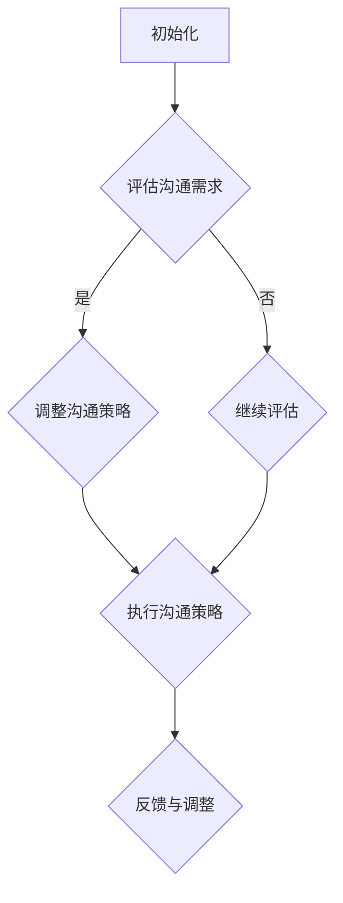
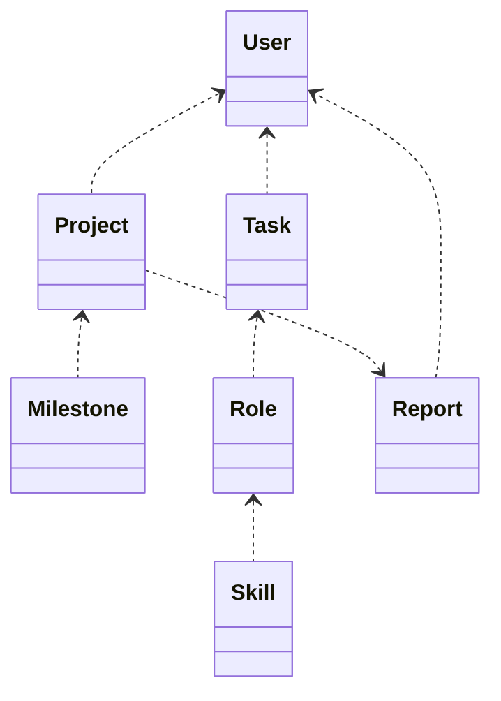
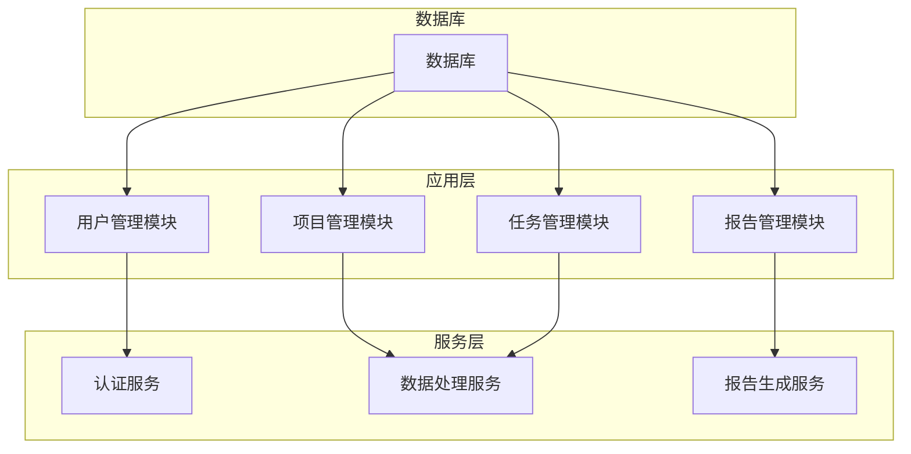

                 


### 《跨国技术团队管理：跨文化沟通与协作技巧》

#### 关键词：跨国技术团队管理、跨文化沟通、协作技巧、团队效率、项目管理

> 摘要：随着全球化的发展，跨国技术团队管理成为企业管理者面临的一大挑战。本文旨在探讨跨国技术团队管理的核心问题，分析跨文化沟通的挑战与机遇，提出有效的沟通与协作技巧，并通过实际案例分享实践经验，旨在为跨国技术团队管理者提供实用的管理策略和方法，提升团队的整体绩效。

---

#### 第一部分：背景介绍

##### 1. 跨国技术团队管理的重要性

##### 1.1 问题背景

在当今全球化的商业环境中，企业越来越多地在全球范围内招募技术人才，形成跨国技术团队。这种趋势不仅带来了技术的创新和进步，同时也带来了新的挑战。跨国技术团队的管理涉及到多个方面的复杂问题，如文化差异、时区差异、沟通障碍等。管理者需要应对这些挑战，以实现团队的高效运作。

##### 1.2 问题描述

跨国技术团队管理的关键问题包括：

- **文化差异**：团队成员来自不同的文化背景，可能会存在价值观、工作方式、沟通风格等方面的差异。
- **沟通障碍**：时区差异和语言障碍会导致沟通效率降低，信息传递不准确。
- **协作困难**：跨国团队在项目规划、任务分配、进度监控等方面可能会遇到协作问题。
- **管理复杂性**：管理者需要具备跨文化的管理能力，以应对多样化的团队需求。

##### 1.3 问题解决

为了解决这些问题，管理者需要采取以下策略：

- **文化敏感性培训**：提高团队成员对跨文化管理的认识和敏感度。
- **建立有效的沟通机制**：利用现代沟通工具，如视频会议、即时通讯等，以克服时区差异。
- **明确目标和责任**：确保团队成员对项目的目标和责任有清晰的理解。
- **灵活的管理方法**：根据团队的特点和需求，采用灵活的管理方法，以促进协作。

##### 1.4 边界与外延

跨国技术团队管理不仅涉及到团队内部的沟通与协作，还涉及到与客户、供应商等外部合作伙伴的交互。因此，管理者需要考虑团队在整个供应链中的作用和影响。

##### 1.5 概念结构与核心要素组成

跨国技术团队管理的核心要素包括：

- **团队构建**：根据项目需求构建多元化的团队，确保团队成员的技能和经验互补。
- **沟通机制**：建立有效的沟通渠道和机制，确保信息畅通。
- **协作工具**：使用合适的协作工具，提高团队协作效率。
- **文化融合**：促进团队成员之间的文化融合，增强团队的凝聚力。

---

##### 2. 跨文化沟通的挑战与机遇

##### 2.1 跨文化沟通的挑战

跨文化沟通的挑战主要体现在以下几个方面：

- **语言障碍**：不同的语言和文化背景会导致沟通障碍，信息传递可能出现误解。
- **价值观差异**：不同的文化背景会导致对工作、生活、价值观等方面的不同理解。
- **工作方式差异**：不同的文化背景会影响工作习惯和工作流程。
- **时区差异**：跨国团队在时区上的差异会影响沟通的及时性和效率。

##### 2.2 跨文化沟通的机遇

尽管跨文化沟通存在挑战，但同时也带来了许多机遇：

- **多元化视角**：多元化的文化背景可以为团队带来不同的视角和思路，促进创新。
- **全球协作**：跨国团队可以更有效地协作，共享资源和知识。
- **国际视野**：团队成员可以通过跨文化沟通，拓宽国际视野，提升自身的竞争力。

##### 2.3 沟通障碍与解决方案

为了克服跨文化沟通的障碍，管理者可以采取以下措施：

- **语言培训**：为团队成员提供语言培训，提高语言沟通能力。
- **文化敏感性**：提高团队成员对跨文化的敏感性和认识，学会尊重和欣赏不同的文化。
- **沟通工具**：使用合适的沟通工具，如翻译工具、视频会议等，提高沟通效率。
- **建立反馈机制**：建立有效的反馈机制，及时解决沟通中的问题。

---

#### 第二部分：核心概念与联系

##### 3. 跨文化沟通理论

##### 3.1 文化概念与属性特征对比表格

| 文化维度 | 属性特征 |
| --- | --- |
| **价值观** | 自由、平等、尊重、责任感 |
| **沟通风格** | 直截了当、含蓄委婉、强调关系 |
| **时间观念** | 精确时间、模糊时间、重视当下 |
| **工作方式** | 个体主义、集体主义、任务导向、关系导向 |

##### 3.2 跨文化沟通模型

| 沟通模型 | 描述 |
| --- | --- |
| **层次沟通模型** | 强调信息的层次结构和传递的顺序 |
| **互动沟通模型** | 强调沟通的互动性和反馈机制 |
| **双环沟通模型** | 强调在沟通过程中同时进行问题解决和关系维护 |

##### 3.3 ER实体关系图架构

```mermaid
erDiagram
    User ||--|{ Project }|>
    Project ||--|{ Task }|> 
    Task ||--|{ Milestone }|>  
    User ||--|{ Role }|> 
    Role ||--|{ Skill }|>  
```

---

##### 4. 协作技巧

##### 4.1 协作概念与属性特征对比表格

| 协作维度 | 属性特征 |
| --- | --- |
| **协作工具** | 效率、易用性、安全性 |
| **协作流程** | 明确、规范、灵活 |
| **协作文化** | 开放、信任、共享 |

##### 4.2 协作流程与策略

| 流程与策略 | 描述 |
| --- | --- |
| **项目规划** | 确定项目目标、范围、时间表 |
| **任务分配** | 根据团队成员的技能和经验分配任务 |
| **进度监控** | 定期检查项目进度，及时调整计划 |
| **反馈机制** | 及时收集和反馈团队意见和建议 |

##### 4.3 ER实体关系图架构

```mermaid
erDiagram
    User ||--|{ SkillSet }|>  
    SkillSet ||--|{ Project }|> 
    Project ||--|{ Milestone }|> 
```

---

#### 第三部分：算法原理讲解

##### 5. 沟通与协作算法

##### 5.1 算法原理讲解

跨国技术团队管理中的沟通与协作算法主要基于以下几个原则：

- **信息对称**：确保信息在团队内部是对称的，每个成员都能获取到相同的信息。
- **反馈机制**：建立有效的反馈机制，确保成员之间的沟通是双向的。
- **灵活调整**：根据实际情况，灵活调整沟通与协作策略。

##### 5.2 算法流程图



##### 5.3 算法数学模型与公式

算法的数学模型可以表示为：

\[ M = f(C, R, T) \]

其中，\( M \) 为沟通策略，\( C \) 为沟通成本，\( R \) 为风险，\( T \) 为团队目标。

##### 5.4 举例说明

假设一个跨国团队需要完成一个软件开发项目，团队成员分别来自不同的国家。根据项目的需求和团队的实际情况，管理者制定了以下沟通策略：

1. **定期会议**：每周举行一次视频会议，确保团队成员能够及时沟通项目进度。
2. **即时通讯**：使用即时通讯工具，如Slack，以便团队成员之间能够随时交流。
3. **文档共享**：使用GitHub等版本控制系统，确保团队成员能够访问最新的文档和代码。

通过这些沟通策略，团队成功完成了项目，并提高了协作效率。

---

#### 第四部分：系统分析与架构设计方案

##### 6. 跨国技术团队管理系统

##### 6.1 问题场景介绍

某跨国科技公司需要管理其全球范围内的技术团队，确保项目进度和质量的控制。该公司面临以下问题：

- **沟通障碍**：由于团队成员分布在不同的国家，沟通效率低下。
- **协作困难**：不同团队之间的协作不够紧密，影响项目进度。
- **管理复杂性**：跨国团队管理涉及多个环节，管理难度大。

##### 6.2 系统功能设计（领域模型Mermaid类图）



##### 6.3 系统架构设计（Mermaid架构图）



##### 6.4 系统接口设计和系统交互（Mermaid序列图）

```mermaid
sequenceDiagram
    participant User
    participant A1[用户管理模块]
    participant S1[认证服务]
    
    User ->> A1: 登录
    A1 ->> S1: 验证用户信息
    S1 ->> A1: 返回验证结果
    A1 ->> User: 登录成功/失败
    
    Note over User,A1
        用户发起登录请求
    end note
```

---

#### 第五部分：项目实战

##### 7. 实际案例分析与讲解

##### 7.1 环境安装与配置

在开始实际项目之前，首先需要搭建一个适合跨国技术团队管理的环境。以下是一个基本的安装和配置步骤：

1. **选择合适的协作工具**：如GitHub、JIRA等。
2. **搭建服务器**：可以使用云服务器或物理服务器。
3. **安装数据库**：如MySQL、PostgreSQL等。
4. **部署应用**：将应用部署到服务器上。

##### 7.2 系统核心实现源代码

以下是一个简单的用户管理模块的源代码示例：

```python
class UserManager:
    def __init__(self, database):
        self.database = database

    def login(self, username, password):
        user = self.database.get_user(username)
        if user and user["password"] == password:
            return "登录成功"
        else:
            return "登录失败"

    def register(self, username, password):
        if self.database.user_exists(username):
            return "用户已存在"
        else:
            self.database.add_user(username, password)
            return "注册成功"

# 测试代码
user_manager = UserManager(database)
print(user_manager.login("user1", "password1"))
print(user_manager.register("user2", "password2"))
```

##### 7.3 代码应用解读与分析

上述代码实现了用户管理模块的基本功能，包括登录和注册。代码中使用了简单的数据库操作，通过调用数据库接口来获取用户信息和存储用户信息。在实际应用中，还需要添加更多的功能，如用户权限管理、用户信息修改等。

##### 7.4 实际案例分析与详细讲解

以下是一个实际的跨国技术团队管理项目案例：

某跨国科技公司需要开发一款移动应用，团队成员分别位于不同的国家。为了确保项目进度和质量的控制，公司采用了以下管理策略：

1. **定期会议**：每周举行一次全球视频会议，讨论项目进展和解决问题。
2. **即时通讯**：使用Slack等即时通讯工具，方便团队成员之间的实时沟通。
3. **版本控制**：使用GitHub进行代码管理，确保代码的一致性和可追溯性。
4. **任务管理**：使用JIRA进行任务管理，明确每个团队成员的任务和责任。

通过这些策略，项目团队成功完成了移动应用的开发，并在全球范围内顺利上线。

##### 7.5 项目小结

通过这个实际案例，我们可以看到跨国技术团队管理的关键在于有效的沟通和协作。通过建立合适的沟通机制和管理工具，团队可以克服文化差异和时区差异，实现高效的项目管理。

---

#### 第六部分：最佳实践、小结与拓展阅读

##### 8. 最佳实践

1. **建立有效的沟通机制**：使用现代沟通工具，如视频会议、即时通讯等，确保团队成员之间的沟通畅通。
2. **文化敏感性培训**：为团队成员提供文化敏感性培训，提高对跨文化的认识和理解。
3. **明确目标和责任**：确保团队成员对项目的目标和责任有清晰的理解，明确每个成员的角色和职责。
4. **灵活的管理方法**：根据团队的特点和需求，采用灵活的管理方法，以适应不同的项目和管理需求。

##### 9. 小结

本文探讨了跨国技术团队管理的核心问题，分析了跨文化沟通的挑战与机遇，并提出了有效的沟通与协作技巧。通过实际案例的分析和讲解，读者可以了解到跨国技术团队管理的具体实践和方法。希望本文能为跨国技术团队管理者提供有益的参考和指导。

##### 10. 拓展阅读

- **推荐书籍**：《跨文化沟通与交流》、《跨国管理》
- **相关论文**：《跨国技术团队协作研究》、《跨文化沟通的挑战与对策》
- **在线资源**：TED演讲、跨文化交流网站、跨国企业管理论坛

---

#### 全书总结

本书旨在为跨国技术团队管理者提供实用的跨文化沟通与协作技巧，帮助他们在全球化背景下更好地管理团队、提升团队效率。通过系统学习，读者可以掌握跨文化沟通的核心理论、协作技巧以及实际应用案例，为跨国技术团队的管理提供有力支持。同时，本书也鼓励读者不断探索、实践，将所学知识转化为实际行动，为跨国技术团队的成功贡献力量。

---

**作者：AI天才研究院/AI Genius Institute & 禅与计算机程序设计艺术 /Zen And The Art of Computer Programming**

