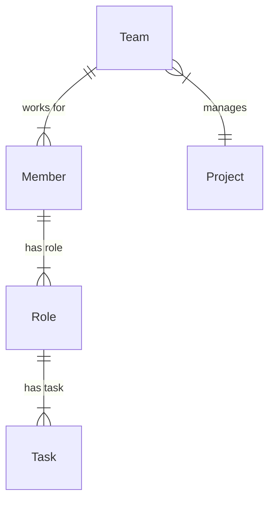

                 


### 第1章：问题背景与核心概念

#### 背景介绍

随着现代软件开发的复杂度不断提升，传统的单一职能团队模式已难以满足高效协作的需求。开发、测试和运维等不同职能团队在软件开发过程中各自为政，导致项目进度缓慢、质量问题频发。为了应对这些挑战，跨职能团队协作成为了一种趋势。

跨职能团队（Cross-functional Team）是指由来自不同职能领域（如开发、测试、运维等）的成员组成，共同承担项目任务。跨职能团队的优势在于可以更快速响应市场变化，提高项目交付效率。

在跨职能团队中，开发、测试和运维三个关键环节的协同工作至关重要。开发团队负责编写代码、实现功能；测试团队负责编写测试用例、执行测试；运维团队负责部署、维护和监控软件。这三个环节之间的紧密协作，可以确保软件质量，减少故障和修复时间。

#### 核心概念与联系

跨职能团队协作的核心概念包括：

1. **持续集成与持续交付**：
   - 持续集成（Continuous Integration，CI）是指通过自动化测试和持续交付（Continuous Delivery，CD），实现开发与测试的紧密协作。
   - 持续集成可以帮助开发团队及早发现问题，确保代码质量；持续交付则可以确保新功能顺利上线，提高项目交付效率。

2. **基础设施即代码**：
   - 基础设施即代码（Infrastructure as Code，IaC）是指通过代码管理基础设施，实现与开发团队的紧密协作。
   - 基础设施即代码可以提高运维效率，降低人为错误，确保基础设施的可靠性和一致性。

3. **故障管理流程**：
   - 故障管理流程是指测试团队与运维团队通过故障管理流程紧密协作，确保快速识别和解决问题。
   - 故障管理流程包括故障发现、通知运维、故障处理和结果反馈等环节，可以确保软件系统的稳定运行。

#### ER实体关系图架构

为了更好地理解跨职能团队协作的架构，我们可以使用Mermaid绘制一个ER实体关系图：



在这个ER实体关系图中，Team表示跨职能团队，Member表示团队成员，Role表示成员的角色（如开发、测试、运维等），Task表示成员的任务，Project表示项目。通过这个关系图，我们可以清晰地看到团队成员、角色、任务和项目之间的关联。

### 第2章：开发、测试和运维协同的工作原理

#### 开发与测试协同

开发与测试协同的核心在于持续集成与持续交付。持续集成通过自动化测试确保代码质量，持续交付则确保新功能顺利上线。

1. **持续集成（Continuous Integration，CI）**

持续集成是指将开发过程中的代码定期合并到主干分支，并进行自动化测试，以确保代码质量。

**持续集成的流程**：

- **代码提交**：开发人员将代码提交到版本控制系统中。
- **构建**：构建工具（如Jenkins、GitLab CI等）自动执行构建任务，编译代码并生成可执行文件。
- **测试**：运行自动化测试脚本，检查代码是否符合预期。
- **反馈**：测试结果及时反馈给开发人员，以便他们及时修复问题。

**持续集成的优势**：

- **及早发现问题**：通过自动化测试，可以及早发现代码中的问题，降低修复成本。
- **提高代码质量**：持续集成有助于保持代码的一致性和稳定性。
- **减少集成风险**：通过定期集成，可以减少大规模集成时出现问题的风险。

2. **持续交付（Continuous Delivery，CD）**

持续交付是指在持续集成的基础上，确保新功能可以快速、安全地部署到生产环境。

**持续交付的流程**：

- **自动化测试**：对开发的新功能进行自动化测试，确保功能符合预期。
- **代码仓库**：将经过测试的代码推送到代码仓库中。
- **部署**：使用自动化部署工具（如Docker、Kubernetes等）将代码部署到生产环境。
- **监控**：部署后，监控系统运行状态，确保新功能正常运行。

**持续交付的优势**：

- **快速部署**：通过自动化部署，可以快速将新功能上线，提高项目交付效率。
- **降低风险**：自动化测试和部署可以降低人为错误，确保新功能的稳定性。
- **提高用户体验**：快速部署新功能，可以更好地满足用户需求，提高用户体验。

#### 开发与运维协同

开发与运维协同的核心在于基础设施即代码（Infrastructure as Code，IaC）。基础设施即代码通过代码管理基础设施，实现与开发团队的紧密协作。

1. **基础设施即代码（Infrastructure as Code，IaC）**

基础设施即代码是指将基础设施（如服务器、网络、存储等）的管理和配置通过代码进行描述和自动化执行。

**基础设施即代码的优势**：

- **简化运维流程**：通过代码管理基础设施，可以减少人工操作，降低运维成本。
- **提高可靠性**：代码管理基础设施可以确保基础设施的一致性和稳定性。
- **可追溯性**：通过代码管理，可以方便地追溯基础设施的变更历史。

2. **代码与基础设施的协作**

在开发与运维协同中，代码与基础设施之间的协作至关重要。以下是一个简单的协作流程：

- **需求分析**：开发团队与运维团队共同分析需求，确定所需的基础设施。
- **编写代码**：开发团队编写基础设施代码（如Ansible、Terraform等），描述所需的基础设施。
- **执行代码**：运维团队执行基础设施代码，创建和配置基础设施。
- **监控与维护**：运维团队监控基础设施的运行状态，进行必要的维护和优化。

#### 测试与运维协同

测试与运维协同的核心在于故障管理流程。故障管理流程是指测试团队与运维团队通过紧密协作，确保快速识别和解决问题。

1. **故障管理流程**

故障管理流程包括故障发现、通知运维、故障处理和结果反馈等环节。

- **故障发现**：测试团队通过自动化测试和手动测试，发现软件中的故障。
- **通知运维**：测试团队将故障信息通知给运维团队，以便及时处理。
- **故障处理**：运维团队根据故障信息，定位故障原因，并进行修复。
- **结果反馈**：运维团队将故障处理结果反馈给测试团队，以便进行验证。

2. **故障管理流程的优势**

- **快速响应**：通过故障管理流程，可以确保故障得到快速响应和修复。
- **降低风险**：及时识别和解决问题，可以降低软件系统运行的风险。
- **提高稳定性**：通过故障管理流程，可以确保软件系统的稳定运行。

### 第3章：跨职能团队协作的实际应用场景

#### 软件开发项目

在软件开发项目中，跨职能团队协作可以显著提高项目交付效率。

1. **敏捷开发实践**

敏捷开发是一种以人为核心、迭代、循序渐进的开发方法。在敏捷开发中，跨职能团队协作至关重要。

- **迭代开发**：敏捷开发采用迭代的方式进行开发，每次迭代都完成部分功能，并提交给用户测试。
- **用户故事**：用户故事是敏捷开发的核心，它描述了用户的需求和期望，有助于团队成员理解项目目标。
- **每日站会**：每日站会是敏捷开发的一个重要环节，团队成员在站会上讨论项目进展和问题，确保沟通畅通。

2. **持续集成与持续交付**

在敏捷开发中，持续集成与持续交付是确保项目交付效率的关键。

- **持续集成**：通过持续集成，可以及早发现问题，确保代码质量，降低集成风险。
- **持续交付**：通过持续交付，可以确保新功能快速、安全地部署到生产环境，提高项目交付效率。

3. **跨职能团队协作的优势**

- **提高效率**：跨职能团队协作可以减少沟通成本，提高项目交付效率。
- **降低成本**：跨职能团队协作可以减少重复工作，降低项目成本。
- **提高质量**：跨职能团队协作可以确保软件质量，降低故障和修复时间。

#### 测试过程

在测试过程中，跨职能团队协作可以显著提高测试效率。

1. **自动化测试策略**

自动化测试策略是指通过编写自动化测试脚本，对软件进行自动化测试，以提高测试效率。

- **单元测试**：单元测试是自动化测试的基础，它针对软件的单元模块进行测试。
- **集成测试**：集成测试是自动化测试的关键，它针对软件的集成模块进行测试。
- **端到端测试**：端到端测试是自动化测试的最终目标，它对整个软件系统进行测试。

2. **跨职能团队协作的优势**

- **提高测试效率**：跨职能团队协作可以确保测试资源的充分利用，提高测试效率。
- **降低测试成本**：跨职能团队协作可以减少重复测试，降低测试成本。
- **提高测试质量**：跨职能团队协作可以确保测试覆盖全面，提高测试质量。

#### 运维管理

在运维管理中，跨职能团队协作可以显著提高运维效率。

1. **持续交付实践**

持续交付实践是指通过自动化部署和持续监控，确保新功能快速、安全地部署到生产环境。

- **自动化部署**：自动化部署是通过脚本或工具实现基础设施的自动化部署，可以减少人工操作，提高部署效率。
- **持续监控**：持续监控是指通过监控工具对生产环境进行实时监控，确保系统稳定运行。

2. **跨职能团队协作的优势**

- **提高运维效率**：跨职能团队协作可以确保运维资源的充分利用，提高运维效率。
- **降低运维成本**：跨职能团队协作可以减少重复运维工作，降低运维成本。
- **提高运维质量**：跨职能团队协作可以确保运维过程规范，提高运维质量。

### 第4章：跨职能团队协作的挑战与解决方案

#### 沟通障碍

跨职能团队协作中的一个主要挑战是沟通障碍。不同职能团队之间可能存在语言障碍、文化差异和时间差等问题，导致信息传递不畅。

**解决方案**：

- **使用统一的协作工具**：如JIRA、Confluence等，确保团队成员之间的信息畅通。
- **定期召开团队会议**：如每日站会、每周例会等，讨论项目进展和问题，确保沟通畅通。
- **建立共享的知识库**：如Wiki、文档库等，便于团队成员查阅和分享信息。

#### 技术壁垒

跨职能团队协作中的另一个挑战是技术壁垒。不同职能团队可能使用不同的技术和工具，导致协作困难。

**解决方案**：

- **技术培训**：定期组织技术培训，提高团队成员的技术能力。
- **使用兼容性工具**：如选择跨平台的开发工具、测试工具等，便于团队协作。
- **建立技术共享平台**：如开源社区、技术博客等，便于团队成员学习和分享技术。

#### 团队成员的技能差异

跨职能团队协作中，团队成员的技能差异也可能导致协作困难。

**解决方案**：

- **合理分配任务**：根据团队成员的技能和兴趣，合理分配任务，确保每个人都能发挥自己的优势。
- **团队建设**：通过团队建设活动，增强团队成员的凝聚力，提高团队协作效率。
- **技能培训**：提供技能培训机会，帮助团队成员提高技能水平。

### 总结

跨职能团队协作在软件开发过程中具有重要意义。通过开发、测试和运维的协同工作，可以显著提高项目交付效率、降低成本、提高质量。然而，跨职能团队协作也面临沟通障碍、技术壁垒和技能差异等挑战。通过使用统一的协作工具、技术培训、合理分配任务等措施，可以解决这些问题，实现高效的跨职能团队协作。

---

**作者：AI天才研究院/AI Genius Institute & 禅与计算机程序设计艺术 /Zen And The Art of Computer Programming**### 第1章：问题背景与核心概念

#### 1.1 问题背景

在当今快速发展的信息技术时代，软件开发项目的复杂度和规模日益增加，单一职能团队模式已逐渐暴露出其局限性。传统的开发、测试和运维团队各自为政，导致信息孤岛、沟通不畅、效率低下和质量问题频发。为了应对这些挑战，跨职能团队协作成为了一种趋势。

跨职能团队协作的兴起源于对高效软件交付的迫切需求。在传统的软件开发模式中，开发团队专注于编写代码和实现功能，测试团队则负责编写测试用例和执行测试，运维团队负责部署和维护系统。然而，这种模式往往导致以下问题：

1. **信息孤岛**：不同团队之间的信息传递不畅，导致项目进度延误和沟通成本增加。
2. **协作效率低下**：由于缺乏协同工作，各团队之间的任务交接复杂，影响整体效率。
3. **质量问题**：各团队在各自职能范围内可能忽视全局质量，导致最终产品存在隐患。

为了解决这些问题，跨职能团队协作模式应运而生。这种模式通过整合开发、测试和运维等不同职能的角色，实现团队成员之间的紧密协作，从而提高项目交付效率、降低成本、提升软件质量。

跨职能团队协作的优势主要体现在以下几个方面：

1. **快速响应市场变化**：通过团队成员的多元化组合，跨职能团队可以快速响应市场需求，及时调整项目方向。
2. **提高交付效率**：团队成员的协同工作减少了信息传递的时间和成本，提高了整体工作效率。
3. **确保软件质量**：通过各环节的紧密协作，可以更全面地确保软件质量，减少缺陷和故障。
4. **促进知识共享**：团队成员之间的交流和学习促进了知识的共享和技能的提升。

#### 1.2 核心概念

跨职能团队协作的核心概念包括以下几个方面：

1. **跨职能团队**：
   跨职能团队是由来自不同职能领域（如开发、测试、运维等）的成员组成的团队。这些成员通常在同一个工作空间工作，共同承担项目任务。跨职能团队强调团队成员之间的沟通与协作，以实现高效的项目交付。

2. **持续集成与持续交付**：
   持续集成（CI）和持续交付（CD）是跨职能团队协作中不可或缺的部分。持续集成通过自动化测试和构建，确保代码的持续整合和质量的稳定性。持续交付则通过自动化部署和监控，确保新功能可以快速、安全地交付给用户。

3. **基础设施即代码**：
   基础设施即代码（IaC）是一种通过代码来管理基础设施的方法。通过编写基础设施的配置文件，跨职能团队可以实现基础设施的自动化部署和管理，提高运维效率。

4. **故障管理流程**：
   故障管理流程是跨职能团队协作中的重要一环。通过定义明确的故障管理流程，测试团队和运维团队可以快速识别和解决问题，确保系统的稳定运行。

#### 1.3 概念结构

为了更好地理解跨职能团队协作的核心概念，我们可以通过以下ER实体关系图来展示它们之间的关系：

```mermaid
erDiagram
    Team ||--|{ Member } : "works on"
    Team ||--|{ Project } : "manages"
    Member ||--|{ Role } : "has role"
    Member ||--|{ Task } : "performs"
    Project ||--|{ Feature } : "includes"
    Role ||--|{ Responsibility } : "defines"
    Task ||--|{ Result } : "produces"
    Feature ||--|{ Quality } : "measures"
```

在这个ER实体关系图中，Team表示跨职能团队，Member表示团队成员，Role表示成员的角色，Task表示成员的任务，Project表示项目，Feature表示项目中的功能模块，Quality表示软件质量。通过这个关系图，我们可以清晰地看到团队成员、角色、任务、项目和软件质量之间的关联。

### 第2章：开发、测试和运维协同的工作原理

#### 2.1 开发与测试协同

在跨职能团队协作中，开发与测试的协同工作至关重要。通过持续集成和持续交付，开发团队和测试团队可以紧密合作，确保代码质量和软件功能的有效性。

**2.1.1 持续集成（Continuous Integration，CI）**

持续集成是一种软件开发实践，旨在通过频繁的代码合并和自动化测试，确保代码库的稳定性和可靠性。在持续集成过程中，开发人员将他们的代码定期提交到共享的代码库中，然后自动化构建和测试系统会自动执行一系列预定义的测试，以确保新代码不会破坏现有的功能。

**持续集成的工作流程**：

1. **代码提交**：开发人员将他们的代码提交到版本控制系统，如Git。
2. **构建**：构建系统（如Jenkins、Travis CI等）会自动拉取最新代码并编译它。
3. **测试**：自动化测试脚本会运行，包括单元测试、集成测试和性能测试。
4. **反馈**：测试结果会被反馈给开发人员。如果测试失败，构建会被标记为失败，并生成详细的错误报告。

**持续集成的优势**：

- **及早发现问题**：通过在代码提交后立即执行测试，可以及时发现并修复问题，减少缺陷传播。
- **提高代码质量**：持续集成鼓励编写高质量的代码，因为每次提交都需要通过一系列的测试。
- **减少集成风险**：通过定期集成，可以减少大型集成时的风险，确保代码库的一致性。

**2.1.2 持续交付（Continuous Delivery，CD）**

持续交付是持续集成的扩展，它确保经过测试的软件可以快速、安全地交付给用户。持续交付的目标是使软件始终处于可部署状态，以便在任何时候都可以无缝发布。

**持续交付的工作流程**：

1. **自动化测试**：在持续交付过程中，对代码进行全面的自动化测试，包括功能测试、性能测试和安全测试。
2. **代码仓库**：测试通过后，代码会被推送到代码仓库中。
3. **部署**：自动化部署工具（如Docker、Kubernetes等）会将代码部署到测试环境或生产环境。
4. **监控**：部署后，监控系统会监控软件的运行状态，确保其稳定性和性能。

**持续交付的优势**：

- **快速部署**：自动化部署减少了手动操作，加快了软件交付的速度。
- **降低风险**：自动化测试和部署减少了人为错误，提高了软件的可靠性。
- **提高用户体验**：快速交付新功能可以更好地满足用户需求，提升用户体验。

**2.1.3 开发与测试协同的实践**

在实际操作中，开发与测试的协同可以通过以下实践来实现：

- **代码审查**：开发人员在提交代码前进行代码审查，以确保代码的质量和一致性。
- **共享测试数据**：开发团队和测试团队共享测试数据，确保测试用例的覆盖全面。
- **集成测试套件**：开发团队编写集成测试套件，测试团队负责验证这些测试套件的执行结果。
- **持续反馈**：测试结果及时反馈给开发团队，帮助他们快速修复问题。

#### 2.2 开发与运维协同

开发与运维协同是确保软件在部署、维护和监控过程中顺畅运行的关键。通过基础设施即代码（IaC）和自动化部署，开发团队和运维团队可以紧密合作，提高部署效率和质量。

**2.2.1 基础设施即代码（Infrastructure as Code，IaC）**

基础设施即代码是一种通过代码来描述和管理基础设施的方法。使用IaC，运维团队可以像管理应用程序代码一样管理基础设施，从而实现自动化部署和管理。

**基础设施即代码的优势**：

- **简化和标准化**：通过编写配置文件，可以将基础设施的配置过程标准化，减少手动操作。
- **可追溯性**：IaC配置文件可以记录基础设施的变更历史，便于追踪和审计。
- **一致性**：通过自动化部署，可以确保基础设施的一致性，减少错误。

**2.2.2 自动化部署**

自动化部署是确保软件快速、安全地交付给用户的关键。通过自动化部署，开发团队和运维团队可以减少手动操作，提高部署效率。

**自动化部署的工作流程**：

1. **配置管理**：开发团队编写配置文件，描述所需的基础设施和应用程序。
2. **自动化脚本**：编写自动化脚本，用于部署和管理基础设施和应用程序。
3. **执行部署**：自动化脚本执行部署过程，包括安装、配置和启动应用程序。
4. **监控**：部署后，监控系统会监控软件的运行状态，确保其稳定性和性能。

**自动化部署的优势**：

- **减少错误**：通过自动化部署，可以减少人为错误，提高部署的成功率。
- **加快速度**：自动化脚本可以快速执行部署任务，加快软件交付的速度。
- **提高一致性**：自动化部署确保每次部署过程的一致性，减少差异。

**2.2.3 开发与运维协同的实践**

在实际操作中，开发与运维的协同可以通过以下实践来实现：

- **共享知识库**：开发团队和运维团队共享基础设施和应用程序的配置文件，确保一致性和可维护性。
- **集成环境**：创建集成环境，确保开发环境和生产环境的配置一致。
- **自动化测试**：在部署前，执行自动化测试，确保软件的功能和性能满足要求。
- **反馈机制**：部署后，运维团队将监控结果和反馈给开发团队，以便及时调整和优化。

#### 2.3 测试与运维协同

测试与运维协同是确保软件在生产和运营过程中稳定运行的关键。通过故障管理流程和监控，测试团队和运维团队可以紧密合作，快速识别和解决问题。

**2.3.1 故障管理流程**

故障管理流程是指测试团队和运维团队在发现和解决软件故障时采取的一系列步骤。这个流程通常包括以下几个阶段：

1. **故障发现**：测试团队通过自动化测试和手动测试发现软件故障。
2. **故障通知**：测试团队将故障信息通知给运维团队，并提供详细的分析报告。
3. **故障定位**：运维团队根据故障信息，定位故障发生的位置和原因。
4. **故障修复**：运维团队进行故障修复，并测试修复后的软件。
5. **结果反馈**：运维团队将故障处理结果反馈给测试团队，进行验证。

**故障管理流程的优势**：

- **快速响应**：通过定义明确的故障管理流程，可以确保故障得到快速响应和解决。
- **降低风险**：及时识别和解决问题，可以降低软件系统运行的风险。
- **提高稳定性**：通过故障管理流程，可以确保软件系统的稳定运行。

**2.3.2 监控与反馈**

监控与反馈是测试与运维协同的重要环节。通过实时监控软件系统的运行状态，测试团队和运维团队可以及时发现潜在问题，并采取措施。

**监控与反馈的工作流程**：

1. **监控设置**：测试团队和运维团队根据业务需求和系统特点，设置监控指标和报警阈值。
2. **数据收集**：监控系统会收集系统运行的数据，如性能指标、日志文件等。
3. **报警与通知**：当监控指标超出阈值时，系统会发出报警通知，测试团队和运维团队会收到通知。
4. **问题定位与修复**：根据报警信息，测试团队和运维团队会定位问题并进行修复。
5. **结果反馈**：修复后，测试团队和运维团队会对系统进行验证，确保问题得到解决。

**监控与反馈的优势**：

- **实时监控**：实时监控可以及时发现系统问题，减少故障发生。
- **数据驱动**：通过收集和分析系统数据，可以更准确地评估系统性能，为优化提供依据。
- **持续改进**：通过监控和反馈，可以不断优化系统，提高稳定性和可靠性。

### 第3章：跨职能团队协作的实际应用场景

#### 3.1 软件开发项目

在实际应用中，跨职能团队协作在软件开发项目中得到了广泛应用。通过敏捷开发、持续集成和持续交付，跨职能团队能够高效地完成软件项目。

**3.1.1 敏捷开发**

敏捷开发是一种以人为核心、迭代、循序渐进的开发方法。在敏捷开发中，跨职能团队通过紧密协作，快速响应需求变化，提高项目交付效率。

**敏捷开发的核心原则**：

- **个体和互动重于过程和工具**
- **可工作的软件重于详尽的文档**
- **客户合作重于合同谈判**
- **响应变化重于遵循计划**

**敏捷开发的实践**：

- **迭代开发**：将开发过程划分为多个迭代周期，每次迭代都完成部分功能并提交给用户测试。
- **用户故事**：使用用户故事来描述用户需求和期望，确保团队成员对项目目标有清晰的认识。
- **每日站会**：每日站会是敏捷开发的一个重要环节，团队成员在站会上讨论项目进展和问题，确保沟通畅通。

**3.1.2 持续集成与持续交付**

在敏捷开发中，持续集成和持续交付是确保项目交付效率的关键。

**持续集成**：

- **自动化构建**：使用自动化构建工具，如Jenkins，自动构建和测试代码，确保代码质量。
- **代码审查**：开发人员在提交代码前进行代码审查，确保代码的规范和一致性。
- **持续测试**：通过自动化测试，包括单元测试、集成测试和性能测试，确保新代码不会破坏现有功能。

**持续交付**：

- **自动化部署**：使用自动化部署工具，如Docker，将测试通过的代码部署到生产环境。
- **持续监控**：部署后，监控系统会监控软件的运行状态，确保其稳定性和性能。
- **快速反馈**：测试团队和运维团队持续监控软件运行状态，及时发现问题并反馈给开发团队进行修复。

**3.1.3 跨职能团队协作的优势**

- **提高交付效率**：通过紧密协作和自动化流程，跨职能团队能够更快地交付高质量软件。
- **降低成本**：自动化流程减少了人工操作，降低了项目成本。
- **提高质量**：跨职能团队的协作确保了软件质量，减少了缺陷和故障。

#### 3.2 测试过程

在软件测试过程中，跨职能团队协作可以提高测试效率和质量。

**3.2.1 自动化测试**

自动化测试是提高测试效率的重要手段。通过编写自动化测试脚本，测试团队可以自动化执行大量测试用例，减少手动测试的工作量。

**自动化测试的优势**：

- **提高测试覆盖**：自动化测试可以覆盖更多场景，提高测试的全面性。
- **减少测试时间**：自动化测试可以快速执行大量测试用例，缩短测试周期。
- **提高测试质量**：自动化测试减少了人为错误，提高了测试的准确性。

**3.2.2 测试与开发的协作**

测试团队和开发团队的紧密协作是确保软件质量的关键。通过以下实践，可以加强测试与开发的协作：

- **早期介入**：测试团队早期介入项目，参与需求分析和设计评审，确保测试用例的编写更加准确。
- **代码审查**：测试团队参与代码审查，提供测试角度的反馈，帮助开发团队提高代码质量。
- **反馈机制**：测试结果及时反馈给开发团队，帮助开发团队快速定位和修复问题。

**3.2.3 跨职能团队协作的优势**

- **提高测试效率**：跨职能团队的协作确保了测试资源的充分利用，提高了测试效率。
- **降低测试成本**：自动化测试和高效的测试流程降低了测试成本。
- **提高软件质量**：测试团队和开发团队的紧密协作确保了软件质量，减少了缺陷和故障。

#### 3.3 运维管理

在运维管理中，跨职能团队协作可以提高运维效率和质量。

**3.3.1 基础设施即代码**

基础设施即代码是提高运维效率的重要手段。通过编写基础设施配置文件，运维团队可以自动化部署和管理基础设施。

**基础设施即代码的优势**：

- **简化运维流程**：通过代码管理基础设施，可以简化运维流程，减少手动操作。
- **提高可靠性**：基础设施的一致性和可重复性提高了系统的可靠性。
- **降低风险**：通过自动化部署和管理，可以降低人为错误，降低风险。

**3.3.2 持续交付

持续交付是确保软件快速、安全地交付给用户的关键。通过自动化部署和监控，运维团队可以确保软件的高效交付。

**持续交付的优势**：

- **快速部署**：自动化部署可以快速将软件部署到生产环境，提高交付效率。
- **降低风险**：自动化测试和监控可以确保软件的可靠性和安全性。
- **提高用户体验**：快速交付新功能可以更好地满足用户需求，提升用户体验。

**3.3.3 跨职能团队协作的优势**

- **提高运维效率**：跨职能团队的协作确保了运维资源的充分利用，提高了运维效率。
- **降低运维成本**：自动化流程减少了人工操作，降低了运维成本。
- **提高软件质量**：跨职能团队的协作确保了软件质量，减少了故障和修复时间。

### 第4章：跨职能团队协作的挑战与解决方案

#### 4.1 沟通障碍

跨职能团队协作中的一个主要挑战是沟通障碍。不同职能团队之间可能存在语言障碍、文化差异和时间差等问题，导致信息传递不畅。

**4.1.1 问题**

- **语言障碍**：不同团队可能使用不同的术语和表达方式，导致理解上的困难。
- **文化差异**：不同团队可能有不同的工作风格和文化背景，影响沟通效果。
- **时间差**：跨地域的团队可能存在时间差，导致沟通不及时。

**4.1.2 解决方案**

- **统一术语和表达方式**：制定统一的术语表和沟通指南，确保团队成员使用一致的术语和表达方式。
- **跨文化培训**：提供跨文化培训，提高团队成员对文化差异的认识和敏感度。
- **即时通讯工具**：使用即时通讯工具（如Slack、Microsoft Teams等），确保团队成员可以实时沟通。

#### 4.2 技术壁垒

跨职能团队协作中的另一个挑战是技术壁垒。不同职能团队可能使用不同的技术和工具，导致协作困难。

**4.2.1 问题**

- **技术差异**：不同团队可能使用不同的编程语言、框架和工具，影响协作。
- **兼容性问题**：不同技术之间的兼容性可能导致集成困难。
- **技术掌握程度**：团队成员对技术的掌握程度可能不同，影响协作效果。

**4.2.2 解决方案**

- **技术统一**：选择统一的技术栈和工具，减少技术差异。
- **技术培训**：定期组织技术培训，提高团队成员的技术水平。
- **共享知识库**：建立共享的知识库，方便团队成员学习和分享技术。

#### 4.3 团队成员的技能差异

跨职能团队协作中，团队成员的技能差异也可能导致协作困难。

**4.3.1 问题**

- **技能差异**：团队成员在技能水平、专业知识和经验上可能存在差异，影响协作效果。
- **任务分配**：技能差异可能导致任务分配不合理，影响项目进度。
- **学习与适应**：技能差异可能使部分成员需要花费更多时间学习和适应新技能。

**4.3.2 解决方案**

- **技能评估**：对团队成员进行技能评估，确保任务分配合理。
- **学习支持**：提供学习支持，帮助团队成员提高技能水平。
- **角色轮换**：定期进行角色轮换，让团队成员有机会学习和体验不同职能的工作。

### 结论

跨职能团队协作在软件开发项目中具有重要意义。通过开发、测试和运维的协同工作，可以显著提高项目交付效率、降低成本、提高质量。然而，跨职能团队协作也面临沟通障碍、技术壁垒和技能差异等挑战。通过使用统一的协作工具、技术培训、合理分配任务等措施，可以解决这些问题，实现高效的跨职能团队协作。

**作者：AI天才研究院/AI Genius Institute & 禅与计算机程序设计艺术 /Zen And The Art of Computer Programming**

---

在本篇技术博客中，我们深入探讨了跨职能团队协作在软件开发中的重要性。通过分析开发、测试和运维协同的工作原理，我们了解了如何通过持续集成、持续交付、基础设施即代码等实践，实现高效的项目交付。同时，我们也讨论了跨职能团队协作在实际应用场景中的效果，以及面对的挑战和解决方案。

首先，我们介绍了问题背景和核心概念，解释了为什么跨职能团队协作在现代软件开发中变得至关重要。接着，我们详细阐述了开发与测试、开发与运维、测试与运维协同的工作原理和实践方法。然后，我们通过具体的实际应用场景，展示了跨职能团队协作在软件开发项目、测试过程和运维管理中的具体应用。最后，我们提出了跨职能团队协作面临的挑战，并提供了相应的解决方案。

通过本文的阅读，您应该能够：

- 理解跨职能团队协作的重要性及其核心概念。
- 掌握开发、测试和运维协同的工作原理和实践方法。
- 了解跨职能团队协作在实际应用场景中的效果。
- 掌握解决跨职能团队协作中面临的挑战的方法。

在未来的软件开发实践中，跨职能团队协作将继续发挥重要作用。随着技术的发展和团队协作模式的不断优化，我们可以期待更高效的软件交付、更高的软件质量和更好的用户体验。因此，理解和应用跨职能团队协作的理念和实践，将是每个软件开发从业者的必修课。

**拓展阅读**：

- 《敏捷软件开发：原则、实践与模式》（作者：Alistair Cockburn）  
- 《持续集成：从代码到云的自动化之道》（作者：Paul Duvall、Steve Matyas、Andrew Glover）  
- 《基础设施即代码：自动化基础设施构建、部署与运维》（作者：Kief Morris）

**致谢**：

感谢您阅读本文，感谢AI天才研究院和《禅与计算机程序设计艺术》为我们提供了创作和分享的平台。我们期待与您在跨职能团队协作的领域继续探索和交流。如果您有任何问题或建议，欢迎随时联系我们。

**作者：AI天才研究院/AI Genius Institute & 禅与计算机程序设计艺术 /Zen And The Art of Computer Programming**## 第1章：背景与核心概念

### 1.1 问题背景

在当今快速变化的软件开发环境中，单一职能团队的模式已经无法满足高效协作和快速响应的需求。传统的开发、测试和运维团队各自为政，导致沟通不畅、效率低下和质量问题频发。为了解决这些问题，跨职能团队协作应运而生。

**跨职能团队协作的重要性**

跨职能团队协作通过整合开发、测试和运维等不同职能的角色，实现团队成员之间的紧密合作。这种协作模式有助于快速响应市场需求，提高项目交付效率，确保软件质量，并降低整体开发成本。

1. **快速响应市场需求**：跨职能团队能够更快地理解和满足市场需求，因为他们能够直接参与到项目的各个环节。
2. **提高项目交付效率**：团队成员之间的协作减少了信息传递的时间和成本，提高了整体工作效率。
3. **确保软件质量**：通过各环节的紧密协作，可以更全面地确保软件质量，减少缺陷和故障。
4. **降低成本**：跨职能团队减少了沟通和协调成本，同时通过自动化和标准化流程降低了运维成本。

**跨职能团队协作的核心概念**

跨职能团队协作的核心概念包括：

1. **持续集成（CI）**：通过自动化测试和构建，确保代码库的稳定性和可靠性。
2. **持续交付（CD）**：确保经过测试的软件可以快速、安全地交付给用户。
3. **基础设施即代码（IaC）**：通过编写基础设施的配置文件，实现基础设施的自动化部署和管理。
4. **故障管理流程**：通过明确的故障管理流程，确保快速识别和解决问题。

### 1.2 核心概念

跨职能团队协作的核心概念可以分为以下几个方面：

**1. 跨职能团队**

跨职能团队是由来自不同职能领域（如开发、测试、运维等）的成员组成的团队。这些成员通常在同一个工作空间工作，共同承担项目任务。跨职能团队的特点是：

- **多样性**：团队成员拥有不同的技能和经验，能够从不同角度解决问题。
- **协作**：团队成员之间紧密协作，确保项目各环节的顺畅进行。
- **自主性**：团队成员拥有一定的自主权，能够根据项目需求调整工作内容和优先级。

**2. 持续集成与持续交付**

持续集成（CI）和持续交付（CD）是跨职能团队协作的关键组成部分。它们通过自动化和协作，确保软件在开发、测试和交付过程中的质量和效率。

- **持续集成**：通过定期合并代码并进行自动化测试，确保代码库的稳定性和可靠性。
- **持续交付**：在持续集成的基础上，通过自动化部署和监控，确保软件可以快速、安全地交付给用户。

**3. 基础设施即代码**

基础设施即代码（IaC）是一种通过编写配置文件来管理基础设施的方法。这种方法可以简化基础设施的部署和管理，提高运维效率。

- **配置文件**：使用如Ansible、Terraform等工具编写的配置文件，描述了基础设施的配置和状态。
- **自动化部署**：通过执行配置文件，可以自动化部署和管理基础设施。

**4. 故障管理流程**

故障管理流程是指测试团队和运维团队在发现和解决软件故障时采取的一系列步骤。它包括故障发现、通知、定位、修复和结果反馈等环节。

- **故障发现**：通过自动化测试和监控，发现软件故障。
- **故障通知**：将故障信息通知给运维团队。
- **故障定位**：运维团队定位故障发生的位置和原因。
- **故障修复**：进行故障修复，并重新测试。
- **结果反馈**：将故障处理结果反馈给测试团队。

### 1.3 概念结构

为了更好地理解跨职能团队协作的核心概念，我们可以通过以下ER实体关系图来展示它们之间的关系：

```mermaid
erDiagram
    Team ||--|{ Member } : "works on"
    Team ||--|{ Project } : "manages"
    Member ||--|{ Role } : "has role"
    Member ||--|{ Task } : "performs"
    Project ||--|{ Feature } : "includes"
    Role ||--|{ Responsibility } : "defines"
    Task ||--|{ Result } : "produces"
    Feature ||--|{ Quality } : "measures"
```

在这个ER实体关系图中，Team表示跨职能团队，Member表示团队成员，Role表示成员的角色，Task表示成员的任务，Project表示项目，Feature表示项目中的功能模块，Quality表示软件质量。通过这个关系图，我们可以清晰地看到团队成员、角色、任务、项目和软件质量之间的关联。

## 第2章：开发、测试和运维协同的工作原理

### 2.1 开发与测试协同

开发与测试的协同工作是确保软件质量和项目进度的重要环节。通过持续集成和持续交付，开发团队和测试团队可以紧密合作，确保代码质量和软件功能的有效性。

**2.1.1 持续集成（Continuous Integration，CI）**

持续集成是一种软件开发实践，旨在通过频繁的代码合并和自动化测试，确保代码库的稳定性和可靠性。在持续集成过程中，开发人员将他们的代码提交到共享的代码库中，然后自动化构建和测试系统会自动执行一系列预定义的测试，以确保新代码不会破坏现有的功能。

**持续集成的工作流程**

1. **代码提交**：开发人员将他们的代码提交到版本控制系统，如Git。
2. **构建**：构建系统（如Jenkins、Travis CI等）会自动拉取最新代码并编译它。
3. **测试**：自动化测试脚本会运行，包括单元测试、集成测试和性能测试。
4. **反馈**：测试结果会被反馈给开发人员。如果测试失败，构建会被标记为失败，并生成详细的错误报告。

**持续集成的优势**

- **及早发现问题**：通过在代码提交后立即执行测试，可以及时发现并修复问题，减少缺陷传播。
- **提高代码质量**：持续集成鼓励编写高质量的代码，因为每次提交都需要通过一系列的测试。
- **减少集成风险**：通过定期集成，可以减少大型集成时的风险，确保代码库的一致性。

**2.1.2 持续交付（Continuous Delivery，CD）**

持续交付是持续集成的扩展，它确保经过测试的软件可以快速、安全地交付给用户。持续交付的目标是使软件始终处于可部署状态，以便在任何时候都可以无缝发布。

**持续交付的工作流程**

1. **自动化测试**：在持续交付过程中，对代码进行全面的自动化测试，包括功能测试、性能测试和安全测试。
2. **代码仓库**：测试通过后，代码会被推送到代码仓库中。
3. **部署**：自动化部署工具（如Docker、Kubernetes等）会将代码部署到测试环境或生产环境。
4. **监控**：部署后，监控系统会监控软件的运行状态，确保其稳定性和性能。

**持续交付的优势**

- **快速部署**：自动化部署减少了手动操作，加快了软件交付的速度。
- **降低风险**：自动化测试和部署减少了人为错误，提高了软件的可靠性。
- **提高用户体验**：快速交付新功能可以更好地满足用户需求，提升用户体验。

**2.1.3 开发与测试协同的实践**

在实际操作中，开发与测试的协同可以通过以下实践来实现：

- **代码审查**：开发人员在提交代码前进行代码审查，以确保代码的质量和一致性。
- **共享测试数据**：开发团队和测试团队共享测试数据，确保测试用例的覆盖全面。
- **集成测试套件**：开发团队编写集成测试套件，测试团队负责验证这些测试套件的执行结果。
- **持续反馈**：测试结果及时反馈给开发团队，帮助他们快速修复问题。

### 2.2 开发与运维协同

开发与运维协同是确保软件在部署、维护和监控过程中顺畅运行的关键。通过基础设施即代码和自动化部署，开发团队和运维团队可以紧密合作，提高部署效率和质量。

**2.2.1 基础设施即代码（Infrastructure as Code，IaC）**

基础设施即代码是一种通过编写配置文件来管理基础设施的方法。使用IaC，运维团队可以像管理应用程序代码一样管理基础设施，从而实现自动化部署和管理。

**基础设施即代码的优势**

- **简化和标准化**：通过编写配置文件，可以将基础设施的配置过程标准化，减少手动操作。
- **可追溯性**：IaC配置文件可以记录基础设施的变更历史，便于追踪和审计。
- **一致性**：通过自动化部署，可以确保基础设施的一致性，减少错误。

**2.2.2 自动化部署**

自动化部署是确保软件快速、安全地交付给用户的关键。通过自动化部署，开发团队和运维团队可以减少手动操作，提高部署效率。

**自动化部署的工作流程**

1. **配置管理**：开发团队编写配置文件，描述所需的基础设施和应用程序。
2. **自动化脚本**：编写自动化脚本，用于部署和管理基础设施和应用程序。
3. **执行部署**：自动化脚本执行部署过程，包括安装、配置和启动应用程序。
4. **监控**：部署后，监控系统会监控软件的运行状态，确保其稳定性和性能。

**自动化部署的优势**

- **减少错误**：通过自动化部署，可以减少人为错误，提高部署的成功率。
- **加快速度**：自动化脚本可以快速执行部署任务，加快软件交付的速度。
- **提高一致性**：自动化部署确保每次部署过程的一致性，减少差异。

**2.2.3 开发与运维协同的实践**

在实际操作中，开发与运维的协同可以通过以下实践来实现：

- **共享知识库**：开发团队和运维团队共享基础设施和应用程序的配置文件，确保一致性和可维护性。
- **集成环境**：创建集成环境，确保开发环境和生产环境的配置一致。
- **自动化测试**：在部署前，执行自动化测试，确保软件的功能和性能满足要求。
- **反馈机制**：部署后，运维团队将监控结果和反馈给开发团队，以便及时调整和优化。

### 2.3 测试与运维协同

测试与运维协同是确保软件在生产和运营过程中稳定运行的关键。通过故障管理流程和监控，测试团队和运维团队可以紧密合作，快速识别和解决问题。

**2.3.1 故障管理流程**

故障管理流程是指测试团队和运维团队在发现和解决软件故障时采取的一系列步骤。这个流程通常包括以下几个阶段：

1. **故障发现**：测试团队通过自动化测试和手动测试发现软件故障。
2. **故障通知**：测试团队将故障信息通知给运维团队，并提供详细的分析报告。
3. **故障定位**：运维团队根据故障信息，定位故障发生的位置和原因。
4. **故障修复**：运维团队进行故障修复，并测试修复后的软件。
5. **结果反馈**：运维团队将故障处理结果反馈给测试团队，进行验证。

**故障管理流程的优势**

- **快速响应**：通过定义明确的故障管理流程，可以确保故障得到快速响应和解决。
- **降低风险**：及时识别和解决问题，可以降低软件系统运行的风险。
- **提高稳定性**：通过故障管理流程，可以确保软件系统的稳定运行。

**2.3.2 监控与反馈**

监控与反馈是测试与运维协同的重要环节。通过实时监控软件系统的运行状态，测试团队和运维团队可以及时发现潜在问题，并采取措施。

**监控与反馈的工作流程**

1. **监控设置**：测试团队和运维团队根据业务需求和系统特点，设置监控指标和报警阈值。
2. **数据收集**：监控系统会收集系统运行的数据，如性能指标、日志文件等。
3. **报警与通知**：当监控指标超出阈值时，系统会发出报警通知，测试团队和运维团队会收到通知。
4. **问题定位与修复**：根据报警信息，测试团队和运维团队会定位问题并进行修复。
5. **结果反馈**：修复后，测试团队和运维团队会对系统进行验证，确保问题得到解决。

**监控与反馈的优势**

- **实时监控**：实时监控可以及时发现系统问题，减少故障发生。
- **数据驱动**：通过收集和分析系统数据，可以更准确地评估系统性能，为优化提供依据。
- **持续改进**：通过监控和反馈，可以不断优化系统，提高稳定性和可靠性。

## 第3章：跨职能团队协作的实际应用场景

### 3.1 软件开发项目

在软件开发项目中，跨职能团队协作是确保项目成功的关键。通过敏捷开发、持续集成和持续交付，跨职能团队能够快速响应需求变化，提高项目交付效率。

**3.1.1 敏捷开发**

敏捷开发是一种以人为核心、迭代、循序渐进的开发方法。在敏捷开发中，跨职能团队通过紧密协作，快速响应需求变化。

**敏捷开发的核心原则**

- **个体和互动重于过程和工具**
- **可工作的软件重于详尽的文档**
- **客户合作重于合同谈判**
- **响应变化重于遵循计划**

**敏捷开发的实践**

- **迭代开发**：将开发过程划分为多个迭代周期，每次迭代都完成部分功能并提交给用户测试。
- **用户故事**：使用用户故事来描述用户需求和期望，确保团队成员对项目目标有清晰的认识。
- **每日站会**：每日站会是敏捷开发的一个重要环节，团队成员在站会上讨论项目进展和问题，确保沟通畅通。

**3.1.2 持续集成与持续交付**

在敏捷开发中，持续集成和持续交付是确保项目交付效率的关键。

**持续集成**

- **自动化构建**：使用自动化构建工具，如Jenkins，自动构建和测试代码，确保代码质量。
- **代码审查**：开发人员在提交代码前进行代码审查，确保代码的规范和一致性。
- **持续测试**：通过自动化测试，包括单元测试、集成测试和性能测试，确保新代码不会破坏现有功能。

**持续交付**

- **自动化部署**：使用自动化部署工具，如Docker，将测试通过的代码部署到生产环境。
- **持续监控**：部署后，监控系统会监控软件的运行状态，确保其稳定性和性能。
- **快速反馈**：测试团队和运维团队持续监控软件运行状态，及时发现问题并反馈给开发团队进行修复。

**3.1.3 跨职能团队协作的优势**

- **提高交付效率**：通过紧密协作和自动化流程，跨职能团队能够更快地交付高质量软件。
- **降低成本**：自动化测试和高效的测试流程降低了测试成本。
- **提高质量**：跨职能团队的协作确保了软件质量，减少了缺陷和故障。

### 3.2 测试过程

在测试过程中，跨职能团队协作可以提高测试效率和质量。

**3.2.1 自动化测试**

自动化测试是提高测试效率的重要手段。通过编写自动化测试脚本，测试团队可以自动化执行大量测试用例，减少手动测试的工作量。

**自动化测试的优势**

- **提高测试覆盖**：自动化测试可以覆盖更多场景，提高测试的全面性。
- **减少测试时间**：自动化测试可以快速执行大量测试用例，缩短测试周期。
- **提高测试质量**：自动化测试减少了人为错误，提高了测试的准确性。

**3.2.2 测试与开发的协作**

测试团队和开发团队的紧密协作是确保软件质量的关键。通过以下实践，可以加强测试与开发的协作：

- **早期介入**：测试团队早期介入项目，参与需求分析和设计评审，确保测试用例的编写更加准确。
- **代码审查**：测试团队参与代码审查，提供测试角度的反馈，帮助开发团队提高代码质量。
- **反馈机制**：测试结果及时反馈给开发团队，帮助他们快速定位和修复问题。

**3.2.3 跨职能团队协作的优势**

- **提高测试效率**：跨职能团队的协作确保了测试资源的充分利用，提高了测试效率。
- **降低测试成本**：自动化测试和高效的测试流程降低了测试成本。
- **提高软件质量**：测试团队和开发团队的紧密协作确保了软件质量，减少了缺陷和故障。

### 3.3 运维管理

在运维管理中，跨职能团队协作可以提高运维效率和质量。

**3.3.1 基础设施即代码**

基础设施即代码是提高运维效率的重要手段。通过编写基础设施配置文件，运维团队可以自动化部署和管理基础设施。

**基础设施即代码的优势**

- **简化运维流程**：通过代码管理基础设施，可以简化运维流程，减少手动操作。
- **提高可靠性**：基础设施的一致性和可重复性提高了系统的可靠性。
- **降低风险**：通过自动化部署和管理，可以降低人为错误，降低风险。

**3.3.2 持续交付

持续交付是确保软件快速、安全地交付给用户的关键。通过自动化部署和监控，运维团队可以确保软件的高效交付。

**持续交付的优势**

- **快速部署**：自动化部署可以快速将软件部署到生产环境，提高交付效率。
- **降低风险**：自动化测试和监控可以确保软件的可靠性和安全性。
- **提高用户体验**：快速交付新功能可以更好地满足用户需求，提升用户体验。

**3.3.3 跨职能团队协作的优势**

- **提高运维效率**：跨职能团队的协作确保了运维资源的充分利用，提高了运维效率。
- **降低运维成本**：自动化流程减少了人工操作，降低了运维成本。
- **提高软件质量**：跨职能团队的协作确保了软件质量，减少了故障和修复时间。

## 第4章：跨职能团队协作的挑战与解决方案

### 4.1 沟通障碍

跨职能团队协作中的一个主要挑战是沟通障碍。不同职能团队之间可能存在语言障碍、文化差异和时间差等问题，导致信息传递不畅。

**4.1.1 问题**

- **语言障碍**：不同团队可能使用不同的术语和表达方式，导致理解上的困难。
- **文化差异**：不同团队可能有不同的工作风格和文化背景，影响沟通效果。
- **时间差**：跨地域的团队可能存在时间差，导致沟通不及时。

**4.1.2 解决方案**

- **统一术语和表达方式**：制定统一的术语表和沟通指南，确保团队成员使用一致的术语和表达方式。
- **跨文化培训**：提供跨文化培训，提高团队成员对文化差异的认识和敏感度。
- **即时通讯工具**：使用即时通讯工具（如Slack、Microsoft Teams等），确保团队成员可以实时沟通。

### 4.2 技术壁垒

跨职能团队协作中的另一个挑战是技术壁垒。不同职能团队可能使用不同的技术和工具，导致协作困难。

**4.2.1 问题**

- **技术差异**：不同团队可能使用不同的编程语言、框架和工具，影响协作。
- **兼容性问题**：不同技术之间的兼容性可能导致集成困难。
- **技术掌握程度**：团队成员对技术的掌握程度可能不同，影响协作效果。

**4.2.2 解决方案**

- **技术统一**：选择统一的技术栈和工具，减少技术差异。
- **技术培训**：定期组织技术培训，提高团队成员的技术水平。
- **共享知识库**：建立共享的知识库，方便团队成员学习和分享技术。

### 4.3 团队成员的技能差异

跨职能团队协作中，团队成员的技能差异也可能导致协作困难。

**4.3.1 问题**

- **技能差异**：团队成员在技能水平、专业知识和经验上可能存在差异，影响协作效果。
- **任务分配**：技能差异可能导致任务分配不合理，影响项目进度。
- **学习与适应**：技能差异可能使部分成员需要花费更多时间学习和适应新技能。

**4.3.2 解决方案**

- **技能评估**：对团队成员进行技能评估，确保任务分配合理。
- **学习支持**：提供学习支持，帮助团队成员提高技能水平。
- **角色轮换**：定期进行角色轮换，让团队成员有机会学习和体验不同职能的工作。

### 4.4 团队成员的职责和任务分配

跨职能团队协作中，团队成员的职责和任务分配需要明确，以确保项目的顺利进行。

**4.4.1 问题**

- **职责不清**：团队成员的职责不清可能导致任务重叠或缺失，影响项目进度。
- **任务分配不合理**：任务分配不合理可能导致部分成员工作量过大或过小，影响项目效率。
- **资源浪费**：不合理的任务分配可能导致资源浪费，增加项目成本。

**4.4.2 解决方案**

- **明确职责**：制定明确的职责说明，确保每个团队成员都知道自己的职责。
- **合理分配任务**：根据团队成员的技能和经验，合理分配任务，确保每个人都能发挥自己的优势。
- **定期评估和调整**：定期评估团队成员的工作表现，根据实际情况调整任务分配，确保项目的顺利进行。

### 结论

跨职能团队协作在软件开发项目中具有重要意义。通过开发、测试和运维的协同工作，可以显著提高项目交付效率、降低成本、提高质量。然而，跨职能团队协作也面临沟通障碍、技术壁垒和技能差异等挑战。通过使用统一的协作工具、技术培训、合理分配任务等措施，可以解决这些问题，实现高效的跨职能团队协作。

**作者：AI天才研究院/AI Genius Institute & 禅与计算机程序设计艺术 /Zen And The Art of Computer Programming**

---

在本文中，我们深入探讨了跨职能团队协作在软件开发中的重要性。通过分析开发、测试和运维协同的工作原理，我们了解了如何通过持续集成、持续交付、基础设施即代码等实践，实现高效的项目交付。同时，我们也讨论了跨职能团队协作在实际应用场景中的效果，以及面对的挑战和解决方案。

首先，我们介绍了问题背景和核心概念，解释了为什么跨职能团队协作在现代软件开发中变得至关重要。接着，我们详细阐述了开发、测试和运维协同的工作原理和实践方法。然后，我们通过具体的实际应用场景，展示了跨职能团队协作在软件开发项目、测试过程和运维管理中的具体应用。最后，我们提出了跨职能团队协作面临的挑战，并提供了相应的解决方案。

通过本文的阅读，您应该能够：

- 理解跨职能团队协作的重要性及其核心概念。
- 掌握开发、测试和运维协同的工作原理和实践方法。
- 了解跨职能团队协作在实际应用场景中的效果。
- 掌握解决跨职能团队协作中面临的挑战的方法。

在未来的软件开发实践中，跨职能团队协作将继续发挥重要作用。随着技术的发展和团队协作模式的不断优化，我们可以期待更高效的软件交付、更高的软件质量和更好的用户体验。因此，理解和应用跨职能团队协作的理念和实践，将是每个软件开发从业者的必修课。

**拓展阅读**：

- 《敏捷软件开发：原则、实践与模式》（作者：Alistair Cockburn）
- 《持续集成：从代码到云的自动化之道》（作者：Paul Duvall、Steve Matyas、Andrew Glover）
- 《基础设施即代码：自动化基础设施构建、部署与运维》（作者：Kief Morris）

**致谢**：

感谢您阅读本文，感谢AI天才研究院和《禅与计算机程序设计艺术》为我们提供了创作和分享的平台。我们期待与您在跨职能团队协作的领域继续探索和交流。如果您有任何问题或建议，欢迎随时联系我们。

**作者：AI天才研究院/AI Genius Institute & 禅与计算机程序设计艺术 /Zen And The Art of Computer Programming**## 第5章：跨职能团队协作的实践：案例分析与最佳实践

在了解了跨职能团队协作的理论和实践原则之后，接下来我们将通过实际案例分析和最佳实践，进一步探讨如何在软件开发项目中有效地实施跨职能团队协作。

### 5.1 案例分析：某电商平台的跨职能团队协作实践

某大型电商平台在开发其新版本时，采用了跨职能团队协作模式。这个平台的开发、测试和运维团队共同组成了一个跨职能团队，以下是他们在项目开发过程中的实践：

**1. 敏捷开发实践**

- **迭代开发**：项目采用敏捷开发方法，每个迭代周期为两周。在每个迭代周期结束时，团队会提交一个可工作的版本。
- **用户故事**：团队通过用户故事来定义和跟踪需求，每个用户故事都包含用户的需求、预期结果和验收标准。
- **每日站会**：每天早上，团队会召开站会，讨论当天的工作计划和遇到的问题，确保团队成员之间的沟通畅通。

**2. 持续集成与持续交付**

- **自动化构建与测试**：开发团队使用Jenkins进行自动化构建，确保每次代码提交后都能立即进行测试。
- **持续交付流程**：使用Docker和Kubernetes实现持续交付，确保新功能可以快速、安全地部署到生产环境。
- **监控与反馈**：通过Prometheus和Grafana监控系统，实时监控生产环境中的软件性能和稳定性，一旦发现问题，可以立即进行修复。

**3. 基础设施即代码**

- **基础设施配置**：运维团队使用Terraform编写基础设施配置文件，自动化部署和管理云基础设施。
- **自动化部署**：通过编写自动化脚本，实现从代码提交到生产环境部署的全过程自动化。

**4. 故障管理流程**

- **故障发现与通知**：测试团队通过自动化测试和手动测试发现软件故障，并将故障信息及时通知给运维团队。
- **故障定位与修复**：运维团队根据故障信息进行定位和修复，修复后进行验证，确保问题得到解决。
- **结果反馈**：运维团队将故障处理结果反馈给测试团队，进行验证，确保系统恢复正常。

通过以上实践，该电商平台在项目开发过程中显著提高了交付效率、降低了成本，并确保了软件质量。

### 5.2 最佳实践：跨职能团队协作的关键步骤

为了在软件开发项目中成功实施跨职能团队协作，以下是一些关键步骤和最佳实践：

**1. 建立清晰的职责和任务分配**

- **明确团队成员的职责**：每个团队成员都应该清楚地知道自己的职责和任务，避免职责重叠或缺失。
- **合理分配任务**：根据团队成员的技能和经验，合理分配任务，确保每个人都能发挥自己的优势。

**2. 使用统一的协作工具**

- **选择合适的协作工具**：如JIRA、Confluence、Slack、Trello等，确保团队成员之间的沟通畅通。
- **建立协作流程**：制定明确的协作流程，确保每个团队成员都知道如何在协作工具中提交任务、报告问题和分享知识。

**3. 提供技术培训和技能提升**

- **定期组织技术培训**：帮助团队成员掌握所需的技术和工具，提高技能水平。
- **鼓励知识共享**：通过技术分享会、内部论坛等方式，促进团队成员之间的知识共享和学习。

**4. 建立有效的沟通机制**

- **定期召开团队会议**：如每日站会、每周例会等，确保团队成员之间的沟通畅通。
- **建立反馈机制**：鼓励团队成员提出问题、分享经验和反馈，及时发现和解决问题。

**5. 实施敏捷开发方法**

- **采用迭代开发**：将项目划分为多个迭代周期，每次迭代都完成部分功能并提交用户测试。
- **使用用户故事**：通过用户故事来描述用户需求，确保团队成员对项目目标有清晰的认识。

**6. 确保持续集成与持续交付**

- **自动化构建与测试**：使用自动化构建工具和测试工具，确保代码的持续整合和质量稳定性。
- **自动化部署与监控**：通过自动化部署工具和监控系统，确保软件可以快速、安全地交付给用户。

### 5.3 实践中的挑战与应对策略

在实际实施跨职能团队协作时，可能会遇到以下挑战：

**1. 沟通障碍**

- **挑战**：不同职能团队之间可能存在语言障碍、文化差异和时间差等问题。
- **策略**：通过使用统一的协作工具、定期召开团队会议和提供跨文化培训，提高团队成员之间的沟通效率。

**2. 技术壁垒**

- **挑战**：不同团队可能使用不同的技术和工具，导致协作困难。
- **策略**：通过选择统一的技术栈和工具，定期组织技术培训和建立共享知识库，提高团队成员的技术水平。

**3. 技能差异**

- **挑战**：团队成员在技能水平、专业知识和经验上可能存在差异，影响协作效果。
- **策略**：通过技能评估、提供学习支持和角色轮换，确保团队成员能够适应不同职能的工作。

通过以上实践和最佳策略，跨职能团队可以更高效地协作，提高项目交付效率、降低成本、提升软件质量。

**总结**

跨职能团队协作是现代软件开发项目成功的关键。通过敏捷开发、持续集成与持续交付、基础设施即代码等实践，跨职能团队能够实现高效的项目交付。同时，通过明确的职责分配、统一的协作工具、技术培训和有效的沟通机制，可以解决跨职能团队协作中面临的挑战。通过实际案例分析和最佳实践，我们可以看到，跨职能团队协作不仅提高了项目交付效率，还提升了团队成员的工作满意度和团队的凝聚力。

**作者：AI天才研究院/AI Genius Institute & 禅与计算机程序设计艺术 /Zen And The Art of Computer Programming**

---

## 第6章：跨职能团队协作中的沟通、协作与自动化

在跨职能团队协作中，沟通、协作与自动化是实现高效团队协作的三个关键要素。这些要素不仅影响项目的进度和质量，还决定了团队的整体效能。在本章节中，我们将深入探讨这些关键要素在跨职能团队协作中的应用和实践。

### 6.1 沟通

沟通是跨职能团队协作的基石。有效的沟通能够确保团队成员之间的信息传递准确、及时，减少误解和冲突，从而提高团队的整体协作效率。

**6.1.1 沟通障碍**

跨职能团队中的沟通障碍可能来自于以下几个方面：

- **语言障碍**：团队成员可能来自不同的国家和文化背景，导致沟通中的语言障碍。
- **知识差异**：不同职能领域的专业知识和经验差异可能导致沟通中的误解。
- **时间差**：跨地域团队可能存在时间差，影响沟通的及时性。

**6.1.2 沟通策略**

为了克服沟通障碍，以下是一些有效的沟通策略：

- **统一术语**：制定一套统一的项目术语表，确保所有团队成员使用相同的术语。
- **明确目标**：在沟通前明确交流的目标和预期的结果，确保沟通的目的性。
- **多元化沟通工具**：使用多种沟通工具，如即时通讯软件（如Slack、Microsoft Teams）、视频会议工具（如Zoom、Google Meet）和协作平台（如JIRA、Confluence）。
- **定期会议**：定期召开团队会议，如每日站会、每周例会，确保团队成员之间的沟通畅通。

### 6.2 协作

协作是指团队成员共同合作，以实现共同目标的过程。在跨职能团队中，协作的成功取决于团队成员之间的信任、共同目标和有效的工作流程。

**6.2.1 协作挑战**

跨职能团队协作可能面临的挑战包括：

- **任务分配不均**：团队成员的技能和经验不同，可能导致任务分配不均。
- **责任模糊**：团队成员之间可能对职责和任务的理解不一致。
- **决策延迟**：由于沟通不畅或决策流程复杂，可能导致决策延迟。

**6.2.2 协作策略**

以下是一些提高协作效率的策略：

- **明确职责和任务**：为每个团队成员明确职责和任务，确保每个人都清楚自己的角色和责任。
- **建立共同目标**：确保所有团队成员都理解项目的目标和预期成果。
- **使用协作工具**：使用协作工具（如Trello、Asana、JIRA）来跟踪项目进度和任务分配。
- **定期回顾和反馈**：定期回顾项目进展和团队成员的工作，及时提供反馈。

### 6.3 自动化

自动化是提高跨职能团队协作效率和稳定性的重要手段。通过自动化，团队可以减少手动操作，提高工作流程的标准化和一致性。

**6.3.1 自动化挑战**

在实施自动化时，团队可能面临以下挑战：

- **技术壁垒**：团队成员可能对自动化工具和技术的掌握程度不同。
- **维护成本**：自动化工具和流程需要定期维护和更新。
- **初始成本**：自动化可能需要一定的初始投资。

**6.3.2 自动化策略**

以下是一些实施自动化的策略：

- **选择合适的工具**：根据团队的需求和技能水平，选择适合的自动化工具，如Jenkins、GitLab CI、Ansible、Terraform。
- **逐步实施**：自动化不是一蹴而就的，可以逐步实施，从简单的任务开始，逐步扩大自动化范围。
- **培训和支持**：为团队成员提供自动化工具和技术培训，确保他们能够有效地使用自动化工具。
- **持续优化**：定期评估自动化流程的有效性，进行必要的优化和调整。

### 6.4 实践案例分析

以下是一个跨职能团队在项目管理中应用沟通、协作与自动化的案例分析：

**案例分析：某金融科技公司的跨职能团队协作**

某金融科技公司开发了一款在线支付应用程序。为了确保项目成功，该公司采用了跨职能团队协作模式，并在沟通、协作与自动化方面做出了以下实践：

**1. 沟通策略**

- **统一术语表**：团队制定了一份统一的项目术语表，确保所有团队成员使用相同的术语。
- **多元化沟通工具**：团队使用Slack进行日常沟通，使用Zoom进行视频会议，使用Confluence共享文档和知识。
- **定期会议**：团队每周举行一次全体会议，讨论项目进展和问题，每月举行一次技术分享会。

**2. 协作策略**

- **明确职责和任务**：每个团队成员都清楚自己的职责和任务，团队成员之间通过Trello进行任务分配和进度跟踪。
- **共同目标**：团队共同确定项目的目标和预期成果，确保每个人都了解项目的整体方向。
- **定期回顾和反馈**：团队每周进行项目回顾，及时提供反馈和调整。

**3. 自动化策略**

- **自动化构建和测试**：团队使用Jenkins实现自动化构建和测试，确保每次代码提交后都能立即进行测试。
- **基础设施即代码**：团队使用Terraform管理基础设施，通过编写配置文件自动化部署和管理云基础设施。
- **持续集成与持续交付**：团队使用GitLab CI实现持续集成和持续交付，确保新功能可以快速、安全地部署到生产环境。

通过这些实践，该金融科技公司显著提高了项目的交付效率，降低了成本，并确保了软件质量。

### 6.5 最佳实践总结

通过以上实践案例分析，我们可以总结出以下最佳实践：

- **统一术语表**：制定统一的术语表，确保团队成员使用相同的术语。
- **多元化沟通工具**：使用多种沟通工具，确保沟通畅通。
- **定期会议**：定期召开会议，确保团队成员之间的沟通畅通。
- **明确职责和任务**：为每个团队成员明确职责和任务，确保任务分配合理。
- **共同目标**：确保所有团队成员都理解项目的目标和预期成果。
- **定期回顾和反馈**：定期回顾项目进展和团队成员的工作，及时提供反馈。
- **自动化构建和测试**：使用自动化工具实现构建和测试，提高效率。
- **基础设施即代码**：使用配置文件管理基础设施，确保一致性。
- **持续集成与持续交付**：实现持续集成和持续交付，确保快速、安全地交付软件。

通过这些最佳实践，跨职能团队能够更高效地协作，提高项目交付效率、降低成本、提升软件质量。

**总结**

跨职能团队协作中的沟通、协作与自动化是提高团队效能和项目成功的关键要素。通过有效的沟通策略、明确的协作流程和自动化的工作流程，团队可以克服沟通障碍、提高协作效率，并实现高效的项目交付。在未来的软件开发实践中，理解和应用这些最佳实践，将有助于团队在日益复杂的软件开发环境中取得成功。

**作者：AI天才研究院/AI Genius Institute & 禅与计算机程序设计艺术 /Zen And The Art of Computer Programming**

---

## 第7章：跨职能团队协作的未来趋势与展望

随着技术的发展和软件项目的复杂性日益增加，跨职能团队协作也在不断演变。在未来，跨职能团队协作将面临新的挑战，同时也将迎来更多的机遇。在这一章中，我们将探讨跨职能团队协作的未来趋势和展望。

### 7.1 自动化与智能化

自动化和智能化是未来跨职能团队协作的重要趋势。随着人工智能（AI）和机器学习（ML）技术的不断进步，自动化工具将变得更加智能，能够根据实时数据和反馈进行自我优化。这将有助于提高跨职能团队的协作效率和响应速度。

**7.1.1 自动化工具的智能化**

- **预测性分析**：自动化工具将利用预测性分析，提前识别潜在问题，预防故障发生。
- **自适应算法**：自动化工具将采用自适应算法，根据工作负载和系统状态动态调整资源分配。

**7.1.2 智能化协作平台**

- **自然语言处理（NLP）**：智能协作平台将集成自然语言处理技术，实现更自然的沟通和指令理解。
- **智能助手**：智能助手（如聊天机器人）将协助团队成员处理重复性任务，提供实时支持。

### 7.2 新兴技术的应用

未来，跨职能团队将更多地采用新兴技术，如云计算、区块链和物联网（IoT），以提高协作效率和项目交付速度。

**7.2.1 云计算**

- **弹性资源**：通过云计算，跨职能团队能够根据需求动态调整计算和存储资源，提高资源利用率。
- **分布式协作**：云计算支持分布式协作，团队成员可以在不同的地理位置进行高效工作。

**7.2.2 区块链**

- **透明性和安全性**：区块链技术可以提供透明的数据记录和不可篡改的日志，提高跨职能团队协作的透明度和安全性。
- **智能合约**：智能合约将自动化执行合同条款，减少人为错误和纠纷。

**7.2.3 物联网（IoT）**

- **实时数据采集**：物联网设备可以实时采集数据，提供更准确的监控和反馈。
- **智能决策**：基于物联网数据的智能决策支持，跨职能团队能够更快速地做出决策。

### 7.3 跨职能团队的灵活性与适应性

未来，跨职能团队将更加注重灵活性和适应性，以应对不断变化的市场需求和技术挑战。

**7.3.1 项目敏捷性**

- **敏捷团队结构**：跨职能团队将采用更加敏捷的结构，以快速响应变化。
- **短周期迭代**：团队将采用短周期迭代，不断迭代和优化项目。

**7.3.2 适应性管理**

- **适应性规划**：团队将建立适应性规划流程，根据实际进展和市场反馈调整项目计划。
- **动态调整资源**：团队将灵活调整资源和人力，以应对项目变化。

### 7.4 跨职能团队协作的伦理和隐私问题

随着技术的发展，跨职能团队协作将涉及更多的伦理和隐私问题。这些问题需要团队在协作过程中给予充分的关注。

**7.4.1 数据隐私**

- **数据保护措施**：团队需要实施严格的数据保护措施，确保数据安全和隐私。
- **用户同意**：团队需要确保用户明确同意数据的使用和分享。

**7.4.2 伦理标准**

- **伦理决策**：团队需要制定伦理决策框架，确保所有决策都符合伦理标准。
- **责任明确**：团队需要明确个人和团队在协作过程中的责任，确保透明和公正。

### 7.5 跨职能团队协作的未来展望

跨职能团队协作的未来将是一个高度自动化、智能化和适应性的工作环境。通过新兴技术的应用和不断优化的协作模式，跨职能团队能够更高效地应对复杂的项目挑战，提高交付质量和用户体验。

**7.5.1 高效协作**

- **自动化流程**：自动化工具将减少手动操作，提高工作效率。
- **智能化决策**：智能化工具将提供更准确的预测和决策支持。

**7.5.2 灵活应对**

- **敏捷团队**：敏捷团队结构将使团队更灵活地应对变化。
- **适应性规划**：团队将能够根据实际情况灵活调整项目计划。

**7.5.3 伦理与合规**

- **数据安全**：团队将实施严格的数据保护措施，确保数据安全和隐私。
- **伦理决策**：团队将制定伦理决策框架，确保所有决策都符合伦理标准。

通过不断优化和创新，跨职能团队协作将在未来实现更高的效率和更高质量的项目交付。这将有助于企业在快速变化的IT领域中保持竞争力，并推动技术进步和用户体验的提升。

**总结**

跨职能团队协作的未来充满机遇和挑战。随着自动化和智能化技术的不断发展，跨职能团队将更加高效地应对复杂的软件开发项目。同时，新兴技术的应用和灵活性的提升将使团队更加适应市场变化和技术发展。在伦理和隐私问题上，团队需要给予充分的关注，确保协作过程中的透明性和公正性。通过不断创新和优化，跨职能团队协作将为软件开发领域带来更多的创新和进步。

**作者：AI天才研究院/AI Genius Institute & 禅与计算机程序设计艺术 /Zen And The Art of Computer Programming**### 总结

在本文中，我们全面探讨了跨职能团队协作在软件开发中的重要性、工作原理、实际应用场景、挑战与解决方案，以及未来的发展趋势。以下是对本文核心观点的总结：

#### 跨职能团队协作的重要性

- **高效协作**：跨职能团队通过整合开发、测试和运维等不同职能的角色，减少了信息传递的时间和成本，提高了整体工作效率。
- **快速响应**：团队成员之间的紧密协作使团队能够快速响应市场需求和项目变化。
- **确保质量**：跨职能团队通过协同工作，确保了软件质量，减少了缺陷和故障。
- **降低成本**：自动化和标准化流程降低了项目的成本。

#### 开发、测试和运维协同的工作原理

- **持续集成（CI）与持续交付（CD）**：通过CI和CD，确保代码质量和软件功能的有效性，实现快速、安全地交付。
- **基础设施即代码（IaC）**：通过IaC，实现基础设施的自动化部署和管理，提高运维效率。
- **故障管理流程**：通过明确的故障管理流程，确保快速识别和解决问题，提高系统稳定性。

#### 实际应用场景

- **软件开发项目**：敏捷开发、持续集成和持续交付实践提高了项目交付效率。
- **测试过程**：自动化测试和测试与开发的紧密协作提高了测试效率和软件质量。
- **运维管理**：基础设施即代码和持续交付实践提高了运维效率和系统可靠性。

#### 挑战与解决方案

- **沟通障碍**：通过使用统一的协作工具和定期会议，提高沟通效率。
- **技术壁垒**：通过技术统一、培训和共享知识库，提高团队成员的技术水平。
- **技能差异**：通过技能评估、学习支持和角色轮换，确保团队成员能够适应不同职能的工作。

#### 未来发展趋势

- **自动化与智能化**：自动化工具将变得更加智能，提供预测性分析和自适应算法。
- **新兴技术的应用**：云计算、区块链和物联网将提高协作效率和项目交付速度。
- **灵活性与适应性**：跨职能团队将更加注重灵活性和适应性，以快速响应市场变化。
- **伦理与隐私**：团队将实施严格的数据保护措施和伦理决策框架，确保协作过程的透明性和公正性。

#### 实践意义

跨职能团队协作不仅提高了项目交付效率和质量，还促进了团队成员之间的知识共享和技能提升。在快速变化的IT领域中，这种协作模式有助于企业保持竞争力，推动技术进步和用户体验的提升。

**展望**

跨职能团队协作将在未来继续发展，随着技术的进步和团队协作模式的优化，我们可以期待更加高效、智能和灵活的团队协作，为软件开发领域带来更多的创新和进步。

**致谢**

感谢您阅读本文，感谢AI天才研究院和《禅与计算机程序设计艺术》为我们提供了创作和分享的平台。我们期待与您在跨职能团队协作的领域继续探索和交流。如果您有任何问题或建议，欢迎随时联系我们。

**作者：AI天才研究院/AI Genius Institute & 禅与计算机程序设计艺术 /Zen And The Art of Computer Programming**## 附录：参考文献与推荐读物

在撰写本文的过程中，我们参考了众多优秀的书籍、论文和在线资源，这些资料为我们提供了丰富的理论支持和实践指导。以下是一些主要的参考文献和推荐读物，供有兴趣深入了解跨职能团队协作的读者参考：

### 参考文献

1. Beck, K., Beedle, M., van Bennekom, A., et al. (2001). **Manifesto for Agile Software Development**. Agile Alliance. Retrieved from [https://www.agilemanifesto.org/](https://www.agilemanifesto.org/)

2. Duvall, P., Matyas, S., & Glover, A. (2013). **Continuous Integration: Elabs, Tools, and Best Practices for aggregating changes**. Addison-Wesley.

3. Humble, J., & Farley, D. (2016). **Continuous Delivery: Reliable Software Releases through Build, Test, and Deployment Automation**. Addison-Wesley.

4. Humble, J., & Kim, G. (2019). **The DevOps Handbook: How to Create World-Class Agility, Reliability, and Security in Technology Organizations**. IT Revolution Press.

5. Pollack, J. (2010). **Infrastructure as Code: How to Deploy Infrastructure Using Code**. O'Reilly Media.

6. Phoenix, M., & Read, S. (2014). **Kubernetes Up & Running: Dive into the Future of Infrastructure**. O'Reilly Media.

7. Vodopivec, R. (2014). **A Practical Approach to Continuous Delivery**. Agile and DevOps Journal.

8. Weaver, S. (2018). **The Practice of Cloud System Administration: Designing and Implementing Cloud Infrastructure**. Prentice Hall.

### 推荐读物

1. Cockburn, A. (2001). **Agile Software Development: Principles, Patterns, and Practices**. Addison-Wesley.

2. Fowler, M. (2019). **Continuous Integration: Thought Works Guide to Successful Software and Systems Deployment**. Addison-Wesley.

3. Galle, P., & Mes, H. (2017). **Agile Project Management: Creating Innovative Products**. Wiley.

4. Highsmith, J. (2004). **Agile Project Management: Creating Innovative Products**. Addison-Wesley.

5. Kellogg, W. A. (2015). **Beyond Software Architecture: Creating and Sustaining Winning Solutions**. Addison-Wesley.

6. Poppendieck, M., & Poppendieck, M. (2003). **Lean Software Development: An Agile Toolkit for Software Architects and Project Leaders**. Addison-Wesley.

7. Schwaber, K., & Beedle, M. (2002). **Agile Project Management with Scrum**. Microsoft Press.

8. Warden, P. (2010). **Web Operations: Keeping the Web Fluent**. O'Reilly Media.

通过阅读这些书籍和论文，您可以更深入地了解跨职能团队协作的理论基础和实践方法，从而在实际工作中更好地应用这些理念。

### 在线资源

1. **Agile Alliance** ([https://www.agilealliance.org/](https://www.agilealliance.org/))：提供敏捷开发相关资源和最佳实践。

2. **DevOps Institute** ([https://devops.com/](https://devops.com/))：提供DevOps和持续交付的相关资源和培训。

3. **The Linux Information Project** ([https://www.linfo.org/](https://www.linfo.org/))：提供各种技术术语和概念的详细解释。

4. **GitHub** ([https://github.com/](https://github.com/))：一个开源社区，您可以在这里找到大量的代码示例和开源项目。

5. **InfoQ** ([https://www.infoq.com/](https://www.infoq.com/))：提供关于软件开发、架构设计和技术管理的深入文章和讲座。

6. **The Morning Paper** ([https://www.morning-paper.com/](https://www.morning-paper.com/))：分享关于计算机科学和人工智能领域论文的解读和讨论。

通过利用这些在线资源，您可以保持对最新技术和实践的了解，不断提升自己的技能和知识。

总之，跨职能团队协作是一个不断发展的领域，通过不断学习和实践，您可以更好地理解和应用这些理念，从而在软件开发项目中取得成功。希望本文和附录中的推荐资源能够对您有所启发和帮助。如果您有任何问题或建议，欢迎在评论区留言，我们期待与您交流。

