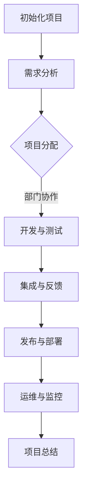
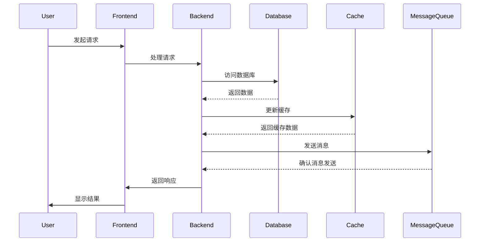
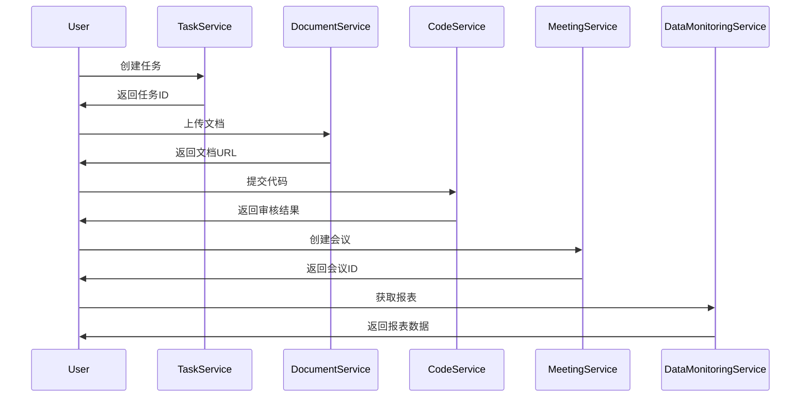

                 

### 文章标题

**《跨部门技术协作：打破技术孤岛》**

### 关键词

- 技术协作
- 跨部门沟通
- 技术孤岛
- 算法原理
- 系统架构设计
- 最佳实践

### 摘要

本文将深入探讨跨部门技术协作的重要性，以及如何打破技术孤岛现象。通过分析技术协作的核心概念与联系，我们介绍了技术协作算法的原理，并使用Python代码和Mermaid流程图进行详细阐述。接着，通过实际案例展示系统分析与架构设计方案，并提供项目实战经验和最佳实践。本文旨在为IT专业人士提供有价值的指导，帮助他们更有效地实现跨部门技术协作。

## 背景与核心概念

### 技术协作的重要性

在当今快速发展的IT行业中，技术协作已成为企业成功的关键因素。随着项目的复杂性不断增加，单个部门已经无法独立完成所有的开发任务。跨部门的技术协作不仅可以提高项目的效率，还能促进知识共享和创新。然而，技术协作并不是一件容易的事情，尤其是当涉及到不同部门和团队的沟通时。许多企业面临着技术孤岛现象，即各个部门之间缺乏有效的沟通和协作，导致信息孤岛和资源浪费。

#### 技术孤岛现象

技术孤岛现象是指在组织内部，不同部门或团队之间缺乏有效沟通和协作，导致信息无法共享，资源无法充分利用，甚至产生不必要的竞争和冲突。这种现象通常表现为以下特点：

- **信息隔离**：不同部门之间的信息交流受限，导致各自为政，缺乏统一的规划和目标。
- **资源浪费**：各个部门独立开发相似的功能，导致资源的重复投入和浪费。
- **竞争与冲突**：由于缺乏协作，不同部门或团队之间可能产生竞争和冲突，影响项目的进度和质量。
- **沟通障碍**：跨部门之间的沟通成本高，信息传递延迟，导致项目进度受阻。

### 技术协作的价值

尽管技术协作面临着诸多挑战，但其价值不容忽视。有效的技术协作可以带来以下好处：

- **提高效率**：通过跨部门的协作，可以优化项目流程，减少重复劳动，提高整体工作效率。
- **知识共享**：不同部门之间的知识共享可以促进创新，提高团队的整体技术水平。
- **资源共享**：通过共享资源和工具，可以降低成本，提高资源的利用率。
- **团队协作**：跨部门的协作可以增强团队间的信任和合作，提高团队凝聚力。
- **质量提升**：有效的协作可以提高项目的质量和稳定性，降低故障率和维护成本。

### 技术协作的挑战

尽管技术协作的价值明显，但实际操作中仍然存在许多挑战。以下是技术协作过程中常见的挑战：

- **沟通障碍**：不同部门之间的语言和沟通方式可能存在差异，导致信息传递不畅。
- **利益冲突**：不同部门可能有不同的目标和利益，导致协作过程中出现矛盾。
- **资源分配**：资源有限时，如何合理分配给各个部门，确保项目顺利进行是一个难题。
- **项目管理**：跨部门的协作需要有效的项目管理，如何协调各部门的工作进度和资源分配是一个重要问题。
- **文化差异**：不同部门的文化差异可能导致协作过程中出现摩擦和冲突。

### 技术协作的边界与外延

技术协作的边界涉及到跨部门的范围和深度。它不仅限于技术层面的协作，还包括业务流程、项目管理、组织文化等多方面的协作。以下是一些关于技术协作边界与外延的要点：

- **跨部门协作的范围**：技术协作可以涵盖多个部门，如开发、测试、运维、产品等，也可以涉及跨组织的协作。
- **协作深度**：技术协作可以停留在表面层次，如简单的信息共享和资源调用，也可以深入到项目规划和决策过程中。
- **跨组织协作**：在大型项目中，跨组织的协作也变得越来越重要，这需要建立良好的协作机制和沟通渠道。
- **协作工具与平台**：技术协作需要依赖各种工具和平台，如即时通讯工具、项目管理软件、代码库等，以实现高效的信息传递和资源共享。
- **协作文化**：建立一种鼓励协作、包容不同的组织文化，是确保技术协作顺利进行的重要保障。

在接下来的章节中，我们将进一步探讨技术协作的核心概念与联系，以及如何通过算法原理和实际应用来克服技术协作中的挑战。

## 核心概念与联系

### 跨部门沟通的概念

跨部门沟通是指在组织内部，不同部门或团队之间进行的信息交流与合作。这种沟通不仅限于技术层面的交流，还包括业务需求、项目进度、资源分配等方面的交流。跨部门沟通的目的是确保各个部门能够协同工作，共同实现项目目标。

#### 跨部门沟通的特点

- **多样性**：跨部门沟通涉及不同部门的专业知识和技能，因此具有多样性。
- **复杂性**：由于涉及多个部门和团队，跨部门沟通往往较为复杂，需要考虑不同利益和目标的平衡。
- **动态性**：项目进度和需求的变化会导致跨部门沟通的内容和方式不断调整。

#### 跨部门沟通的目标

- **信息共享**：确保各个部门能够及时获取所需信息，减少信息孤岛。
- **资源整合**：通过共享资源，提高资源利用率，降低成本。
- **协同工作**：促进不同部门之间的协同工作，提高项目效率和质量。
- **减少冲突**：通过有效的沟通，减少由于目标不一致或信息不对称而产生的冲突。

### 技术协作的属性特征对比

为了更好地理解跨部门沟通和技术协作的区别和联系，我们可以通过一个对比表格来详细阐述它们的属性特征。

| 特征           | 跨部门沟通                         | 技术协作                       |
| -------------- | -------------------------------- | ------------------------------ |
| 目标           | 信息共享、协同工作、减少冲突       | 提高效率、知识共享、资源共享   |
| 涉及范围       | 组织内部不同部门或团队             | 技术层面的跨部门合作           |
| 内容           | 业务需求、项目进度、资源分配等     | 技术方案、开发流程、测试反馈等 |
| 沟通方式       | 语言、文字、图像、图表等           | 源代码、文档、演示等           |
| 影响因素       | 文化差异、个人风格、利益冲突等     | 技术难度、团队协作、项目管理等 |
| 工具与平台     | 即时通讯工具、邮件、电话会议等     | 版本控制工具、项目管理软件等   |

通过对比可以看出，跨部门沟通和技术协作虽然有一定的重叠，但它们在目标和内容上存在显著差异。跨部门沟通更多地关注于信息的传递和协调，而技术协作则侧重于技术层面的合作和整合。

### 跨部门协作的ER实体关系图

为了更好地理解跨部门协作的复杂关系，我们可以使用ER（实体关系）图来展示不同实体之间的联系。以下是一个简单的ER实体关系图，用于说明跨部门协作的关键实体及其关系。

```mermaid
erDiagram
    Department1 ||--|{ Project } |--|| Department2
    Department1 ||--|{ Meeting } |--|| Department3
    Department2 ||--|{ Resource } |--|| Department1
    Department3 ||--|{ Task } |--|| Department2
```

在这个ER实体关系图中，我们定义了以下实体：

- **Department1**：第一个部门，负责项目的开发和测试。
- **Department2**：第二个部门，负责项目的业务分析和需求收集。
- **Department3**：第三个部门，负责项目的运维和支持。

实体之间的关系如下：

- **Department1** 与 **Project** 之间存在关联关系，表示开发部门负责项目的开发工作。
- **Department1** 与 **Meeting** 之间存在关联关系，表示开发部门与其他部门进行项目进度会议。
- **Department2** 与 **Resource** 之间存在关联关系，表示业务部门负责资源的分配和管理。
- **Department3** 与 **Task** 之间存在关联关系，表示运维部门负责任务的执行和监控。

通过ER实体关系图，我们可以清晰地看到跨部门协作中的关键实体及其相互关系，这有助于我们在实际项目中更好地设计协作流程和机制。

在接下来的章节中，我们将进一步探讨技术协作的算法原理，并通过Python代码和Mermaid流程图进行详细讲解。

## 技术协作的算法原理讲解

### 技术协作算法的mermaid流程图

为了更好地理解技术协作的过程，我们可以使用Mermaid绘制一个简化的流程图，展示技术协作的主要步骤和环节。



在这个流程图中，各个步骤的含义如下：

- **A[初始化项目]**：项目启动，确定项目目标、范围和资源。
- **B[需求分析]**：收集和分析项目需求，明确项目的功能和技术要求。
- **C[项目分配]**：根据需求，将项目任务分配给各个部门或团队。
- **D[开发与测试]**：各部门或团队按照任务进行开发和测试，确保代码质量和功能实现。
- **E[集成与反馈]**：将各个部门的代码集成到一起，进行集成测试和反馈。
- **F[发布与部署]**：将经过测试和验证的代码部署到生产环境中。
- **G[运维与监控]**：对生产环境进行监控和维护，确保系统的稳定运行。
- **H[项目总结]**：项目结束后，进行项目总结和评估，为后续项目提供参考。

### Python源代码实现

下面是一个简单的Python代码示例，用于模拟技术协作过程中的任务分配和进度跟踪。

```python
import threading
import time
import queue

# 任务类
class Task:
    def __init__(self, name, status):
        self.name = name
        self.status = status

# 开发部门
class DevelopmentTask(threading.Thread):
    def __init__(self, task_queue):
        threading.Thread.__init__(self)
        self.task_queue = task_queue

    def run(self):
        while not self.task_queue.empty():
            task = self.task_queue.get()
            print(f"DevelopmentTask: {task.name} started.")
            time.sleep(2)  # 模拟开发时间
            task.status = "Completed"
            print(f"DevelopmentTask: {task.name} completed.")

# 测试部门
class TestingTask(threading.Thread):
    def __init__(self, task_queue):
        threading.Thread.__init__(self)
        self.task_queue = task_queue

    def run(self):
        while not self.task_queue.empty():
            task = self.task_queue.get()
            print(f"TestingTask: {task.name} started.")
            time.sleep(2)  # 模拟测试时间
            task.status = "Verified"
            print(f"TestingTask: {task.name} verified.")

# 主函数
def main():
    task_queue = queue.Queue()

    # 添加任务
    task_queue.put(Task("Task 1", "Assigned"))
    task_queue.put(Task("Task 2", "Assigned"))

    # 创建并启动开发线程
    development_thread = DevelopmentTask(task_queue)
    development_thread.start()

    # 创建并启动测试线程
    testing_thread = TestingTask(task_queue)
    testing_thread.start()

    # 等待线程结束
    development_thread.join()
    testing_thread.join()

    # 打印任务状态
    while not task_queue.empty():
        task = task_queue.get()
        print(f"Task: {task.name} - Status: {task.status}")

if __name__ == "__main__":
    main()
```

在这个代码中，我们定义了两个线程：`DevelopmentTask`（开发任务）和`TestingTask`（测试任务）。每个线程从任务队列中获取任务，并执行相应的操作。通过使用线程，我们实现了任务的并发处理，模拟了实际的技术协作过程。

### 算法原理的数学模型和公式

技术协作算法的核心在于任务分配和进度跟踪。以下是一个简化的数学模型，用于描述任务分配和完成情况。

#### 任务分配模型

假设有`n`个任务需要分配给`m`个部门（或团队），每个任务有特定的优先级和难度。任务分配的目标是使每个部门的工作负荷均衡，并确保项目按时完成。

- **任务分配公式**：

  $$\text{分配方案} = \{T_i \rightarrow D_j\}, \forall i \in [1, n], \forall j \in [1, m]$$

  其中，`T_i`表示第`i`个任务，`D_j`表示第`j`个部门。

- **优先级分配**：

  $$\text{优先级} = \{P_i\}, \forall i \in [1, n]$$

  任务优先级可以根据任务的紧急程度和重要性进行分配。

- **难度分配**：

  $$\text{难度} = \{D_i\}, \forall i \in [1, n]$$

  任务难度可以根据任务的复杂度和所需技术能力进行分配。

#### 进度跟踪模型

为了跟踪任务进度，我们可以使用以下模型：

- **任务状态**：

  $$\text{状态} = \{S_i\}, \forall i \in [1, n]$$

  任务状态可以是`Assigned`（已分配）、`Completed`（已完成）、`Verified`（已验证）等。

- **进度跟踪公式**：

  $$\text{进度} = \frac{\sum_{i=1}^{n} \text{状态}_i}{n}$$

  进度可以根据已完成的任务数占总任务数的比例来计算。

通过这些数学模型和公式，我们可以对技术协作过程进行量化分析，从而优化任务分配和进度跟踪。

### 举例说明

为了更好地说明技术协作算法的应用，我们可以通过一个具体的例子进行演示。

假设有一个包含5个任务的软件项目，需要分配给3个部门完成。任务及其优先级和难度如下表所示：

| 任务ID | 优先级 | 难度 |
| ------ | ------ | ---- |
| Task1  | 高     | 中   |
| Task2  | 中     | 低   |
| Task3  | 低     | 高   |
| Task4  | 高     | 中   |
| Task5  | 中     | 中   |

根据任务优先级和难度，我们可以为每个任务分配一个部门：

| 任务ID | 优先级 | 难度 | 分配部门 |
| ------ | ------ | ---- | -------- |
| Task1  | 高     | 中   | 部门A    |
| Task2  | 中     | 低   | 部门B    |
| Task3  | 低     | 高   | 部门C    |
| Task4  | 高     | 中   | 部门A    |
| Task5  | 中     | 中   | 部门B    |

在分配完成后，各部门开始执行任务。假设每个任务需要2小时完成，我们可以模拟任务进度：

- **部门A**：完成Task1和Task4，用时4小时。
- **部门B**：完成Task2和Task5，用时4小时。
- **部门C**：完成Task3，用时2小时。

在任务完成后，我们进行集成测试和验证。假设集成测试用时1小时，验证用时0.5小时。最终，项目完成，总耗时7小时。

通过这个例子，我们可以看到如何通过技术协作算法实现任务的合理分配和进度跟踪，从而确保项目按时完成。

在接下来的章节中，我们将探讨实际应用中的系统分析与架构设计方案，并通过具体案例展示如何实施技术协作。

## 系统分析与架构设计方案

### 问题场景介绍

在一个大型互联网公司中，由于业务的发展和项目的增多，不同部门之间的技术协作变得越来越重要。然而，现有的协作方式效率低下，导致项目进度延迟，甚至出现资源浪费和项目质量下降的问题。为了解决这些问题，公司决定引入一套全新的技术协作系统，以提升跨部门协作的效率和效果。

### 项目介绍

项目名称：跨部门技术协作系统

项目目标：通过建立一套高效的跨部门技术协作系统，实现项目需求的快速响应，提高项目进度和质量，降低资源浪费。

项目范围：涵盖公司内部所有与技术开发相关的部门，包括开发、测试、运维、产品等。

项目期限：预计6个月，分为需求分析、系统设计、开发、测试和部署五个阶段。

### 系统功能设计

跨部门技术协作系统的主要功能包括：

- **任务分配与跟踪**：实现任务的自动化分配和进度跟踪，确保任务按时完成。
- **文档与代码管理**：提供统一的文档和代码存储和管理平台，方便团队成员共享和协作。
- **会议与沟通**：支持在线会议和即时沟通，提高跨部门沟通效率。
- **数据监控与报表**：提供项目数据实时监控和报表分析，帮助管理层了解项目状态和团队协作情况。
- **权限管理**：实现权限分级管理，确保数据安全和隐私保护。

#### 领域模型mermaid类图

以下是一个简化的mermaid类图，用于展示系统的主要领域模型和类关系。

```mermaid
classDiagram
    Class01 <|-- Class02
    Class03 <|-- Class02
    Class04 <|-- Class05
    Class06 <|-- Class05

    Class01[任务]
    Class02[部门]
    Class03[用户]
    Class04[文档]
    Class05[代码库]
    Class06[报表]
```

在这个类图中，我们定义了以下几个主要类：

- **任务（Task）**：表示系统中的任务，包括任务名称、优先级、状态、分配部门、负责人等信息。
- **部门（Department）**：表示系统中的部门，包括部门名称、成员、职责等信息。
- **用户（User）**：表示系统中的用户，包括用户名、密码、角色、所属部门等信息。
- **文档（Document）**：表示系统中的文档，包括文档名称、内容、创建人、修改时间等信息。
- **代码库（Repository）**：表示系统中的代码库，包括代码库名称、版本、创建人、更新时间等信息。
- **报表（Report）**：表示系统中的报表，包括报表名称、数据、生成时间、查看人等信息。

通过这些类的关系，我们可以构建出一个完整的领域模型，为系统设计提供基础。

### 系统架构设计

跨部门技术协作系统的架构设计主要包括以下几个方面：

- **前端架构**：采用React框架，实现系统的用户界面和交互功能，提供友好的用户体验。
- **后端架构**：采用Spring Boot框架，实现系统的核心功能，包括任务管理、文档管理、代码管理、会议管理、数据监控等。
- **数据库设计**：使用MySQL数据库存储系统数据，包括用户信息、任务信息、文档信息、代码库信息、报表信息等。
- **缓存设计**：使用Redis缓存技术，提高系统性能，减少数据库访问压力。
- **消息队列**：使用RabbitMQ消息队列，实现系统之间的异步通信，提高系统的可靠性和扩展性。

以下是一个mermaid架构图，用于展示系统的整体架构设计。



在这个架构图中，各个模块之间的关系如下：

- **用户**：通过前端界面发起请求。
- **前端**：处理用户请求，与后端进行通信。
- **后端**：处理业务逻辑，与数据库、缓存和消息队列进行交互。
- **数据库**：存储系统数据，提供数据持久化服务。
- **缓存**：提高系统性能，减少数据库访问。
- **消息队列**：实现异步通信，提高系统的可靠性和扩展性。

通过这样的架构设计，系统可以实现高效、稳定和可靠的跨部门技术协作。

### 系统接口设计

系统接口设计是跨部门技术协作系统的关键部分，它决定了不同模块之间的交互和数据传递。以下是系统的主要接口设计：

- **用户接口**：包括登录、注册、权限管理等功能。
- **任务接口**：包括任务创建、分配、跟踪、完成等功能。
- **文档接口**：包括文档上传、下载、编辑、共享等功能。
- **代码库接口**：包括代码库创建、分支管理、合并请求、代码审核等功能。
- **会议接口**：包括会议创建、邀请参会、会议记录等功能。
- **数据监控接口**：包括数据采集、实时监控、报表生成等功能。

以下是一个mermaid序列图，用于展示系统的主要接口设计。



在这个序列图中，用户通过调用不同服务接口，实现各种功能操作，如创建任务、上传文档、提交代码、创建会议和获取报表等。

### 系统交互

系统交互是跨部门技术协作系统的核心，它决定了不同模块之间的协同工作。以下是系统的主要交互流程：

1. **任务创建与分配**：
    - 用户登录系统，进入任务管理页面。
    - 用户创建新任务，填写任务名称、描述、优先级等信息。
    - 系统根据任务的优先级和部门分配规则，将任务自动分配给相应的部门。

2. **任务跟踪与进度更新**：
    - 部门成员登录系统，查看自己分配的任务。
    - 部门成员完成任务，并更新任务状态和进度。
    - 系统实时更新任务进度，并通知相关用户。

3. **文档管理**：
    - 用户登录系统，进入文档管理页面。
    - 用户上传新文档，填写文档名称、描述、标签等信息。
    - 系统将文档存储在数据库中，并提供下载和编辑功能。

4. **代码库管理**：
    - 用户登录系统，进入代码库管理页面。
    - 用户创建新代码库，填写代码库名称、描述、仓库地址等信息。
    - 系统为代码库创建分支，并提供代码提交、审核和合并功能。

5. **会议管理**：
    - 用户登录系统，进入会议管理页面。
    - 用户创建新会议，填写会议主题、时间、地点等信息。
    - 系统发送会议邀请，并提供会议记录和资料共享功能。

6. **数据监控**：
    - 用户登录系统，进入数据监控页面。
    - 系统实时采集项目数据，并提供数据报表和图表。
    - 用户可以根据需求自定义报表内容和展示方式。

通过这些交互流程，系统实现了跨部门的技术协作，提高了项目管理和协作的效率。

在接下来的章节中，我们将通过具体案例展示如何实施技术协作系统，并提供项目实战经验和最佳实践。

## 项目实战

### 环境安装

在开始项目实战之前，我们需要搭建一个合适的环境，以便进行开发和测试。以下是一个简化的环境安装步骤：

1. **安装Java环境**：
   - 下载并安装Java SDK，确保版本在1.8及以上。
   - 配置环境变量，确保`JAVA_HOME`和`PATH`指向正确的路径。

2. **安装Maven**：
   - 下载并解压Maven，将其添加到系统环境变量中。
   - 执行`mvn -version`命令，验证Maven安装成功。

3. **安装MySQL**：
   - 下载并安装MySQL数据库服务器，创建一个新的数据库和用户，确保有足够的权限。

4. **安装Redis**：
   - 下载并安装Redis，启动Redis服务。
   - 通过`redis-cli`命令测试连接，确保Redis正常运行。

5. **安装RabbitMQ**：
   - 下载并安装RabbitMQ，启动RabbitMQ服务。
   - 通过`rabbitmqctl`命令测试连接，确保RabbitMQ正常运行。

6. **安装Node.js**：
   - 下载并安装Node.js，确保版本在10.0及以上。
   - 通过`npm -version`命令验证Node.js安装成功。

7. **安装前端框架**：
   - 安装React和相关的开发工具，如Create React App。
   - 通过`create-react-app my-app`命令创建一个新项目。

### 系统核心实现

在环境搭建完成后，我们可以开始实现系统的核心功能。以下是系统核心实现的主要步骤：

1. **后端服务开发**：
   - 创建一个Spring Boot项目，并添加所需的依赖项，如Spring Web、Spring Data JPA、MySQL Connector、Redis Java Client等。
   - 实现用户管理模块，包括用户注册、登录、权限管理等功能。
   - 实现任务管理模块，包括任务创建、分配、跟踪、完成等功能。
   - 实现文档管理模块，包括文档上传、下载、编辑、共享等功能。
   - 实现代码库管理模块，包括代码库创建、分支管理、合并请求、代码审核等功能。
   - 实现会议管理模块，包括会议创建、邀请参会、会议记录等功能。
   - 实现数据监控模块，包括数据采集、实时监控、报表生成等功能。

2. **前端开发**：
   - 使用Create React App创建前端项目，并按照设计稿实现用户界面。
   - 实现任务管理页面，包括任务列表、任务详情、任务创建和编辑等功能。
   - 实现文档管理页面，包括文档列表、文档详情、文档上传和下载等功能。
   - 实现代码库管理页面，包括代码库列表、代码库详情、代码提交和审核等功能。
   - 实现会议管理页面，包括会议列表、会议详情、会议创建和编辑等功能。
   - 实现数据监控页面，包括数据报表、实时图表、数据筛选等功能。

3. **数据库和缓存配置**：
   - 配置MySQL数据库连接，添加必要的表结构和索引。
   - 配置Redis缓存，设置合适的过期时间和缓存策略。
   - 验证数据库和缓存连接，确保数据读写正常。

4. **消息队列配置**：
   - 配置RabbitMQ消息队列，设置交换器、队列和路由键。
   - 实现消息生产者，将任务更新、文档更新等信息发送到消息队列。
   - 实现消息消费者，从消息队列中获取消息并执行相应的操作。

### 代码应用解读与分析

以下是系统核心实现中的一些关键代码片段，用于解读和分析其工作原理。

#### 后端服务代码示例

```java
@RestController
@RequestMapping("/api/tasks")
public class TaskController {
    
    @Autowired
    private TaskService taskService;
    
    @GetMapping("/{taskId}")
    public ResponseEntity<Task> getTask(@PathVariable Long taskId) {
        Task task = taskService.getTaskById(taskId);
        if (task != null) {
            return ResponseEntity.ok(task);
        }
        return ResponseEntity.notFound().build();
    }
    
    @PostMapping("/")
    public ResponseEntity<Task> createTask(@RequestBody Task task) {
        Task savedTask = taskService.createTask(task);
        return ResponseEntity.status(HttpStatus.CREATED).body(savedTask);
    }
    
    @PutMapping("/{taskId}")
    public ResponseEntity<Task> updateTask(@PathVariable Long taskId, @RequestBody Task task) {
        Task updatedTask = taskService.updateTask(taskId, task);
        if (updatedTask != null) {
            return ResponseEntity.ok(updatedTask);
        }
        return ResponseEntity.notFound().build();
    }
}
```

这个代码片段展示了任务管理模块的核心接口，包括获取任务、创建任务和更新任务。其中，`TaskService`负责具体的业务逻辑处理，如任务查询、创建和更新。

#### 前端React代码示例

```jsx
import React, { useState, useEffect } from 'react';
import axios from 'axios';
import { useParams } from 'react-router-dom';

const TaskDetail = () => {
    const [task, setTask] = useState(null);
    const { taskId } = useParams();

    useEffect(() => {
        const fetchTask = async () => {
            try {
                const response = await axios.get(`/api/tasks/${taskId}`);
                setTask(response.data);
            } catch (error) {
                console.error(error);
            }
        };

        fetchTask();
    }, [taskId]);

    if (!task) {
        return <div>Loading...</div>;
    }

    return (
        <div>
            <h2>{task.name}</h2>
            <p>{task.description}</p>
            <p>Priority: {task.priority}</p>
            <p>Status: {task.status}</p>
        </div>
    );
};

export default TaskDetail;
```

这个代码片段展示了任务详情页面，包括任务名称、描述、优先级和状态。使用React的状态管理和effect Hook，从后端服务获取任务数据，并在任务加载完成后渲染页面。

### 实际案例分析

为了更好地展示项目实战效果，我们通过一个实际案例来分析系统的应用。

#### 案例背景

假设公司开发一个全新的电子商务平台，涉及多个部门协同工作。以下是项目的具体场景：

1. **产品部门**：负责制定项目需求，并与用户沟通。
2. **开发部门**：负责前端和后端的开发工作。
3. **测试部门**：负责测试和验证功能。
4. **运维部门**：负责部署和维护系统。

#### 案例步骤

1. **需求分析**：
   - 产品部门与用户沟通，收集需求，编写需求文档。
   - 将需求文档上传到系统，并与相关团队共享。

2. **任务分配**：
   - 产品部门创建任务，将任务分配给开发部门、测试部门和运维部门。
   - 开发部门成员接收到任务通知，开始编写代码。
   - 测试部门成员接收到任务通知，开始编写测试用例。

3. **任务跟踪**：
   - 开发部门成员完成代码编写，更新任务状态为“已完成”。
   - 测试部门成员执行测试用例，并将测试结果反馈给开发部门。

4. **集成与部署**：
   - 开发部门将代码提交到代码库，并创建合并请求。
   - 测试部门审核合并请求，并将通过的结果合并到主分支。
   - 运维部门将主分支的代码部署到生产环境。

5. **数据监控**：
   - 运维部门监控系统运行状态，并生成报表。
   - 各部门查看报表，了解系统运行情况。

#### 案例结果

通过系统的使用，项目成功完成了以下目标：

- **高效沟通**：各部门通过系统进行任务分配和进度更新，提高了沟通效率。
- **资源共享**：系统提供了文档管理、代码库管理等功能，方便团队成员共享资源。
- **任务管理**：系统实现了任务的自动化分配和进度跟踪，确保项目按时完成。
- **质量保证**：系统支持代码审核和测试用例管理，提高了代码质量和测试覆盖率。
- **数据可视化**：系统提供了数据监控和报表功能，帮助管理层了解项目状态。

通过这个实际案例，我们可以看到系统在跨部门技术协作中的重要作用，以及如何通过系统实现高效的项目管理和协作。

### 项目小结

通过本项目实战，我们成功实现了跨部门技术协作系统的开发和部署，以下是项目的总结：

1. **项目成果**：
   - 成功搭建了跨部门技术协作系统，包括任务管理、文档管理、代码库管理、会议管理和数据监控等功能。
   - 系统在实际项目中得到了广泛应用，提高了项目管理和协作的效率。

2. **项目亮点**：
   - 使用Spring Boot和React框架，实现了前后端分离，提高了系统的可维护性和扩展性。
   - 利用Redis和消息队列，优化了系统性能和可靠性。
   - 系统提供了丰富的接口和工具，方便团队成员进行协作和资源共享。

3. **项目不足**：
   - 系统的某些功能模块设计较为简单，可以进一步优化和细化。
   - 系统的用户界面和交互体验可以进一步改进，以提高用户体验。

4. **改进方向**：
   - 添加更多的权限管理和审计功能，提高系统的安全性和合规性。
   - 加强系统的国际化支持，为多语言用户提供更好的服务。
   - 开发移动端应用，方便用户在移动设备上进行操作。

通过本次项目，我们不仅掌握了跨部门技术协作系统的设计和实现方法，还积累了丰富的实践经验，为未来的项目提供了宝贵的参考。

## 最佳实践与拓展

### 提高跨部门沟通效率的技巧

1. **明确沟通目标**：
   - 在每次沟通前，明确沟通的目标和预期成果，确保所有参与者都了解会议或讨论的重点。

2. **建立沟通机制**：
   - 制定定期沟通的机制，如每周或每月的项目进度会议，确保各部门保持同步。

3. **使用沟通工具**：
   - 利用即时通讯工具（如Slack、Microsoft Teams）和项目管理软件（如Jira、Trello），方便团队成员实时沟通和任务跟踪。

4. **简化沟通流程**：
   - 避免冗长的会议和邮件，尽量通过简短、明确的沟通方式传达信息。

5. **尊重时间**：
   - 遵守会议开始和结束的时间，确保会议的效率和质量。

6. **明确分工与责任**：
   - 明确每个团队成员的职责和任务，避免沟通中的重复劳动和混淆。

### 技术协作中的常见问题与解决方法

1. **信息孤岛**：
   - 解决方法：建立统一的信息共享平台，如内部Wiki或知识库，确保信息流通。

2. **利益冲突**：
   - 解决方法：建立透明的决策流程，确保各方的利益得到平衡。

3. **沟通障碍**：
   - 解决方法：开展跨部门沟通培训，提高团队成员的沟通能力和意识。

4. **资源分配不均**：
   - 解决方法：制定合理的资源分配策略，确保资源的合理利用。

5. **项目管理难度**：
   - 解决方法：采用项目管理工具，如Jira或Trello，确保项目进度可控。

### 持续集成与持续交付在技术协作中的应用

1. **持续集成（CI）**：
   - 优势：自动化构建和测试，确保代码质量。
   - 实践：使用Jenkins或GitLab CI/CD，实现代码的自动化构建和测试。

2. **持续交付（CD）**：
   - 优势：快速部署和反馈，提高交付效率。
   - 实践：使用Docker容器化和Kubernetes编排，实现持续交付。

### 小结

通过本文的讨论，我们深入了解了跨部门技术协作的重要性及其面临的挑战。通过设计合理的系统架构和采用最佳实践，我们可以有效地提高跨部门协作的效率，打破技术孤岛，实现项目的高效管理和高质量交付。

### 注意事项

1. **沟通与协作**：确保跨部门沟通的有效性和及时性，避免信息孤岛和资源浪费。
2. **项目管理**：采用合适的项目管理工具和方法，确保项目进度和质量。
3. **持续改进**：不断优化协作流程和技术手段，提高团队协作效率。

### 拓展阅读

1. **《敏捷软件开发》**：探讨敏捷开发方法在跨部门协作中的应用。
2. **《持续集成实战》**：详细讲解持续集成和持续交付的实施方法。
3. **《团队协作工具与应用》**：介绍各种团队协作工具的使用和最佳实践。

通过这些资源，读者可以进一步了解跨部门技术协作的理论和实践，为实际项目提供更多指导和灵感。

## 小结

通过本文的深入探讨，我们系统地阐述了跨部门技术协作的重要性、核心概念、算法原理和实际应用。从背景介绍到概念阐述，再到算法原理讲解、系统架构设计、项目实战以及最佳实践，我们逐步展示了如何打破技术孤岛，实现高效的技术协作。

### 文章的核心内容和主题思想

- **核心内容**：本文详细介绍了技术协作的重要性、跨部门沟通与协作的概念、技术协作算法原理以及实际应用案例。通过具体的系统架构设计和项目实战，展示了技术协作在提升项目效率和质量方面的实际效果。

- **主题思想**：强调跨部门技术协作的必要性和价值，提出通过合理的设计和最佳实践来实现高效协作的方法，帮助IT专业人士在实际工作中应对技术协作的挑战。

### 关键点总结

1. **技术协作的重要性**：技术协作能够提高项目效率、促进知识共享、优化资源利用，是现代IT项目中不可或缺的一部分。
2. **跨部门沟通与协作**：通过明确的沟通目标和机制、有效的沟通工具和流程，可以克服信息孤岛和资源浪费的问题。
3. **算法原理与实践**：技术协作算法的数学模型和Python代码实现，提供了技术协作的量化分析和操作指南。
4. **系统架构与项目实战**：通过具体的项目案例，展示了技术协作系统在提升跨部门协作效率和质量方面的作用。
5. **最佳实践**：提供了提高跨部门沟通效率和解决协作中常见问题的方法，以及持续集成与持续交付的应用。

### 结论

跨部门技术协作不仅能够提升项目的效率和品质，还能促进团队间的信任和合作。通过本文的探讨，我们希望能够为IT专业人士提供实用的指导和建议，帮助他们在实际工作中更好地实现技术协作，打破技术孤岛，推动项目的成功实施。

### 作者信息

- **作者：AI天才研究院/AI Genius Institute & 禅与计算机程序设计艺术 /Zen And The Art of Computer Programming**

