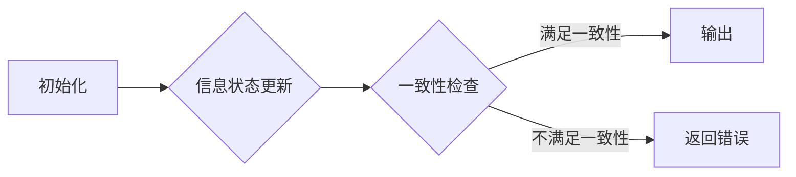
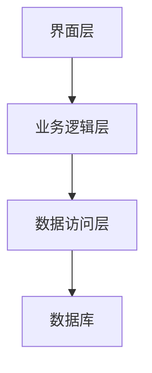
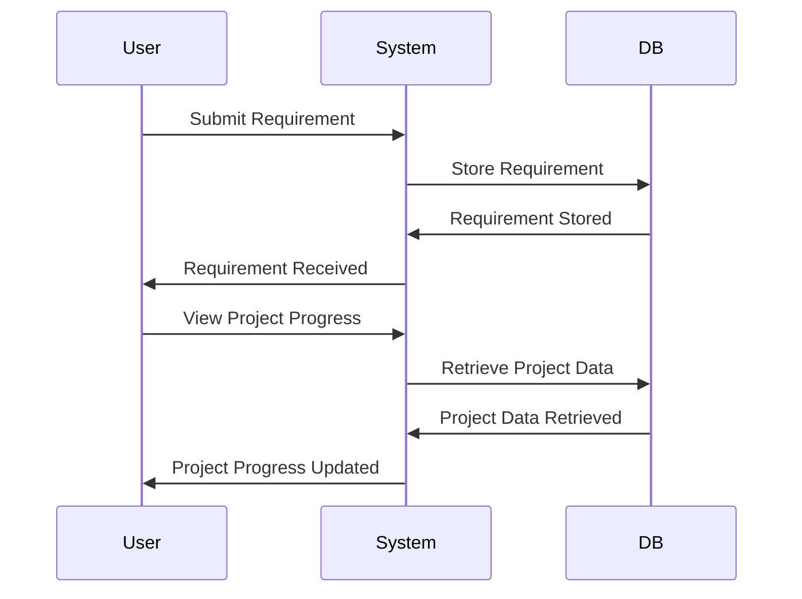

                 

# 跨部门技术沟通：提升技术团队影响力的方法

## 关键词
- 跨部门技术沟通
- 技术团队影响力
- 沟通策略
- 团队协作
- 组织效能

## 摘要
本文旨在探讨如何通过有效的跨部门技术沟通，提升技术团队在组织中的影响力。通过分析跨部门沟通的重要性、核心概念、方法与技巧，以及具体的算法原理和系统架构设计，本文提出了一系列提升技术团队影响力的策略。同时，结合实际项目案例，提供最佳实践和总结，以期为技术团队的管理者和成员提供有价值的参考。

## 目录大纲设计过程

### 第一步：整体构思
在着手设计《跨部门技术沟通：提升技术团队影响力的方法》的目录大纲之前，我们需要首先明确书籍的核心目标，即通过有效的跨部门技术沟通，提高技术团队在组织中的影响力和工作效率。这要求我们不仅要关注技术层面的沟通，还要深入探讨沟通对团队协作和组织效能的影响。

### 第二步：分解章节内容
确定书籍的核心主题后，我们需要将主题细分为具体的章节内容。例如，“跨部门技术沟通的重要性”、“核心概念与联系”、“方法与实践”、“算法原理与数学模型”、“系统分析与架构设计”以及“项目实战”等。每个章节都围绕书名中的关键词进行详细分解，确保内容既有深度又具有实用性。

### 第三步：细化每个章节
在确定了章节结构后，我们需要进一步细化每个章节的内容。这包括背景介绍、核心概念与联系、算法原理讲解、数学模型和公式、系统分析与架构设计方案、项目实战、最佳实践 tips、小结等内容。每个章节都要有明确的目标和内容，确保读者能够系统地学习和掌握知识。

### 第四步：确保内容完整性
在细化每个章节内容的同时，我们要确保书籍的完整性。这意味着每个章节都需要包含必要的内容，例如背景介绍、核心概念与联系、算法原理讲解、数学模型和公式等。同时，要避免遗漏重要内容，确保读者能够全面地了解跨部门技术沟通的各个方面。

### 第五步：整合目录
将各个章节的内容整合到一起，形成完整的目录大纲。在整合过程中，我们需要确保目录结构清晰、逻辑连贯，方便读者根据需要快速找到所需内容。

### 第六步：格式调整
根据要求，调整目录格式，使用 markdown 格式，确保格式符合 #,##,### 的层级要求。这有助于提高文章的可读性和规范性。

### 第七步：审核和优化
审核目录大纲，确保没有遗漏重要内容。优化目录内容，确保简洁性和可读性，使读者能够更容易地理解和掌握核心概念。

### 最终输出
通过以上步骤，我们设计出了一个完整且详细的《跨部门技术沟通：提升技术团队影响力的方法》的目录大纲，确保书籍内容的完整性、逻辑性和可读性。

## 第一部分：问题背景与概念解析

### 1.1 跨部门技术沟通的重要性

在当今复杂的企业组织中，技术团队的作用日益显著。他们不仅负责开发和维护公司的重要软件系统，还常常与其他部门紧密协作，共同推动项目进展。然而，跨部门技术沟通往往面临着诸多挑战。

首先，不同部门之间的职能和目标可能存在差异。技术团队可能更加关注系统的性能和安全性，而业务部门则更关心系统的易用性和市场需求。这种目标的不一致性可能导致沟通不畅，甚至产生误解。

其次，技术团队内部的专业领域众多，包括前端开发、后端开发、数据科学、运维等。跨部门沟通时，如何确保技术团队成员能够清晰、准确地传达自己的观点和需求，也是一大挑战。

最后，沟通工具和方法的多样性也增加了跨部门技术沟通的复杂性。例如，不同部门可能使用不同的项目管理工具、文档编写工具和沟通平台，这些差异可能进一步影响沟通效果。

### 1.2 技术团队在组织中的影响力

技术团队在组织中的影响力不仅体现在他们负责的项目质量和效率上，还体现在他们对组织战略和技术方向的贡献上。以下是技术团队在组织中的几个关键影响力方面：

**1. 解决关键问题**：技术团队可以通过创新的技术解决方案，解决公司面临的业务挑战，提升企业的市场竞争力。

**2. 推动技术趋势**：技术团队需要紧跟行业技术趋势，为公司引入先进的技术和工具，确保公司在技术上的领先地位。

**3. 优化业务流程**：技术团队可以通过自动化和优化系统，减少人工操作，提高业务流程的效率。

**4. 增强团队协作**：技术团队作为组织中的关键力量，需要与其他部门紧密协作，共同实现组织目标。

**5. 培养人才**：技术团队可以通过培训和知识分享，培养更多的技术人才，为公司的长远发展打下基础。

### 1.3 跨部门沟通的核心挑战

虽然跨部门技术沟通的重要性不言而喻，但实际上，这一过程充满了挑战。以下是跨部门沟通的几个核心挑战：

**1. 沟通障碍**：不同部门的专业术语、工作流程和文化背景差异，可能导致沟通障碍和误解。

**2. 信息不对等**：某些部门可能掌握关键信息，而其他部门则缺乏这些信息，这可能导致沟通不充分。

**3. 沟通成本**：跨部门沟通往往需要额外的时间和资源，这可能导致沟通成本上升。

**4. 权力分配**：不同部门在组织中的权力分配不同，这可能影响跨部门沟通的平等性和效率。

**5. 组织结构**：扁平化组织结构和矩阵式组织结构可能增加跨部门沟通的复杂性。

## 第二部分：核心概念与联系

### 2.1 技术沟通的基本概念

技术沟通是指技术团队在不同部门和角色之间交换信息、分享知识和协同工作的过程。有效的技术沟通不仅涉及技术层面的交流，还包括非技术因素，如人际关系、团队协作和项目管理等。

在技术沟通中，几个基本概念尤为重要：

**1. 技术术语**：技术术语是指用于描述技术概念和技术的词汇。了解并正确使用技术术语对于跨部门沟通至关重要。

**2. 沟通模式**：沟通模式是指信息传递的方式和方法。常见的沟通模式包括口头沟通、书面沟通和视觉沟通等。

**3. 沟通风格**：沟通风格是指个体在沟通中表现出的行为和态度。例如，有些人可能更加内向和保守，而有些人则更加外向和直接。

### 2.2 沟通障碍与误解

跨部门技术沟通中，沟通障碍和误解是常见的问题。以下是一些可能导致沟通障碍和误解的原因：

**1. 文化差异**：不同部门可能有不同的工作文化和价值观，这可能导致沟通中的误解。

**2. 信息不对称**：某些部门可能掌握更多关键信息，而其他部门则可能信息不足，这可能导致沟通不充分。

**3. 技术背景差异**：不同部门的技术背景可能存在差异，这可能导致技术术语和概念的理解不一致。

**4. 缺乏共同目标**：如果不同部门没有共同的目标和愿景，沟通可能变得更加困难。

### 2.3 沟通模式与风格

为了提高跨部门技术沟通的效果，了解和运用不同的沟通模式和风格非常重要。以下是一些常见的沟通模式和风格：

**1. 口头沟通**：口头沟通是一种快速、直接的沟通方式，适用于需要即时反馈和快速决策的场景。

**2. 书面沟通**：书面沟通是一种正式、详细的沟通方式，适用于需要记录和证明沟通内容的情况。

**3. 视觉沟通**：视觉沟通通过图表、图像和视频等视觉元素进行信息传递，适用于复杂概念的解释和演示。

**4. 面部表情和身体语言**：面部表情和身体语言是非语言沟通的一部分，对于传达情感和意图非常重要。

### 2.4 概念属性特征对比表格

为了更好地理解和比较不同沟通模式的特征，我们可以创建一个概念属性特征对比表格。以下是一个示例：

| 沟通模式 | 特征属性 | 说明 |
| --- | --- | --- |
| 口头沟通 | 快速、直接、即时反馈 | 适用于需要即时决策的场景 |
| 书面沟通 | 正式、详细、可记录 | 适用于需要正式文件和记录的情况 |
| 视觉沟通 | 直观、易于理解、信息丰富 | 适用于复杂概念的解释和演示 |
| 面部表情和身体语言 | 非语言沟通 | 传达情感和意图 |

### 2.5 ER实体关系图架构的Mermaid流程图

为了更清晰地展示跨部门技术沟通中的实体关系，我们可以使用 Mermaid 工具绘制 ER（实体关系）图。以下是一个简单的 Mermaid 流程图示例：

```mermaid
erDiagram
    TechnicalTeam ||--|{ ProjectManager }
    BusinessTeam ||--|{ ProjectManager }
    SupportTeam ||--|{ ProjectManager }
    TechnicalTeam ||--|{ BusinessTeam }
    BusinessTeam ||--|{ TechnicalTeam }
    SupportTeam ||--|{ TechnicalTeam }
```

这个流程图展示了技术团队、业务团队和支持团队之间的实体关系，以及它们与项目经理的关联。

## 第三部分：方法与实践

### 3.1 提升技术团队影响力的方法

提升技术团队在组织中的影响力，不仅需要团队成员具备卓越的技术能力，还需要掌握一系列的沟通技巧和方法。以下是几种有效的方法：

**1. 内部培训与文化建设**

内部培训是提升技术团队影响力的基础。通过定期的技术培训，技术团队成员可以不断更新知识，提高技能水平。此外，企业可以举办技术分享会、内部研讨会等活动，促进团队成员之间的交流和学习。

文化建设也是提升技术团队影响力的重要一环。企业可以倡导开放、协作和创新的文化氛围，鼓励团队成员积极参与技术创新和项目讨论，从而增强团队凝聚力。

**2. 技术分享与知识管理**

技术分享是提高团队整体技术水平和影响力的重要手段。通过定期举办技术分享会，技术团队成员可以将自己的经验、教训和新知识分享给其他成员。这不仅有助于提升团队的技术水平，还可以促进团队成员之间的交流和合作。

知识管理是技术团队保持持续竞争力的关键。企业可以通过建立知识库、文档管理系统等工具，将团队成员的经验和知识进行整理和保存，以便于其他成员随时查阅和参考。

**3. 跨部门协作机制建设**

跨部门协作机制的建设对于提升技术团队的影响力至关重要。企业可以通过建立跨部门项目组、设立专职协调人等方式，加强各部门之间的沟通和协作。此外，企业还可以制定明确的跨部门协作流程和规范，确保项目进展顺利。

### 3.2 技术沟通策略与技巧

有效的技术沟通策略和技巧是提升技术团队影响力的关键。以下是一些实用的沟通策略和技巧：

**1. 沟通前的准备**

在进行技术沟通前，团队成员需要做好充分的准备。这包括了解对方的需求和期望、准备必要的文档和资料、明确沟通目标和议程等。通过提前准备，可以确保沟通的顺利进行。

**2. 沟通中的技巧**

在沟通过程中，团队成员需要注意以下几点：

- **明确表达**：确保自己的观点和需求清晰、明确地传达给对方。
- **倾听**：认真倾听对方的意见和建议，避免在沟通中产生误解。
- **互动**：鼓励对方参与讨论，确保沟通是双向的。
- **简洁**：尽量使用简洁的语言和图表进行沟通，避免冗长和复杂的表述。

**3. 沟通后的反馈与调整**

沟通结束后，团队成员需要及时进行反馈和调整。这包括总结沟通内容、确认各方理解和承诺的事项、针对沟通中发现的问题进行改进等。通过及时反馈和调整，可以确保沟通效果的最大化。

## 第四部分：算法原理与数学模型

### 4.1 技术沟通中的算法原理

在跨部门技术沟通中，算法原理可以帮助我们更高效地解决问题。以下是一个简单的算法原理示例，用于解决沟通中的信息同步问题。

**算法名称**：信息同步算法

**输入**：各部门的信息状态

**输出**：同步后的信息状态

**算法流程**：

1. 初始化：获取各部门的初始信息状态。
2. 循环处理：
   - 对每一部门的信息状态进行更新。
   - 检查更新后的信息状态是否满足一致性要求。
   - 如果满足一致性要求，继续下一步；否则，返回错误。
3. 输出：同步后的信息状态。

以下是一个简单的 Mermaid 流程图示例：



### 4.2 Python源代码阐述

以下是一个简单的 Python 源代码示例，用于实现上述信息同步算法。

```python
def sync_info(departments):
    while True:
        # 更新各部门信息
        for department in departments:
            department['info'] = update_info(department['info'])
        
        # 检查信息一致性
        if check一致性(departments):
            return departments
        else:
            print("同步失败：信息不一致")
            return None

def update_info(info):
    # 更新信息逻辑
    # ...
    return new_info

def check一致性(departments):
    # 检查信息一致性逻辑
    # ...
    return True or False
```

### 4.3 算法原理的数学模型和公式

为了更深入地理解信息同步算法，我们可以引入数学模型和公式。以下是一个简化的数学模型：

**变量定义**：

- \( I_d \)：部门 \( d \) 的初始信息状态。
- \( I_{d}' \)：部门 \( d \) 的更新后信息状态。
- \( C_d \)：部门 \( d \) 的信息一致性状态。

**数学模型**：

1. 初始状态：\( I_d(0) \)
2. 更新公式：\( I_{d}' = f(I_d, C_d) \)
3. 一致性条件：\( C_d = 1 \) if \( I_{d}' \) 满足一致性要求 else \( C_d = 0 \)

### 4.4 通俗易懂的举例说明

假设有两个部门 A 和 B，初始信息状态分别为 \( I_A(0) = [1, 2, 3] \) 和 \( I_B(0) = [4, 5, 6] \)。

**第一步**：初始化信息状态。

- \( I_A(0) = [1, 2, 3] \)
- \( I_B(0) = [4, 5, 6] \)

**第二步**：更新信息状态。

- \( I_A'(0) = [2, 4, 6] \)
- \( I_B'(0) = [5, 7, 9] \)

**第三步**：检查一致性。

- \( C_A = 1 \) （因为 \( I_A'(0) \) 满足一致性要求）
- \( C_B = 0 \) （因为 \( I_B'(0) \) 不满足一致性要求）

**第四步**：输出结果。

- 更新后的信息状态为 \( I_A'(0) = [2, 4, 6] \) 和 \( I_B'(0) = [5, 7, 9] \)，但同步失败，因为 \( I_B'(0) \) 不满足一致性要求。

### 4.5 数学公式使用

在技术沟通中，数学公式可以帮助我们更精确地描述问题和解决方案。以下是一些常见的数学公式示例：

**1. 抽象数据类型的定义**

$$
\text{ADT} \; \text{List} =
\begin{cases}
    \text{nil} & \text{if } n = 0 \\
    \text{Node}(x, \text{List}(n-1)) & \text{if } n > 0
\end{cases}
$$

**2. 二分查找算法**

$$
\text{BinarySearch}(A, x) =
\begin{cases}
    \text{Found} & \text{if } \text{mid} = x \\
    \text{BinarySearch}(L, x) & \text{if } x < \text{mid} \\
    \text{BinarySearch}(R, x) & \text{if } x > \text{mid}
\end{cases}
$$

**3. 概率论中的贝叶斯定理**

$$
P(A|B) = \frac{P(B|A)P(A)}{P(B)}
$$

这些数学公式在技术沟通中有着广泛的应用，可以帮助我们更精确地描述问题、分析和解决复杂问题。

## 第五部分：系统分析与架构设计

### 5.1 问题场景介绍

在某一大型企业中，技术团队需要与其他部门（如业务部门、市场部门、运维部门等）紧密协作，共同推进多个项目的进展。然而，在实际工作中，技术团队常常面临以下问题：

1. 跨部门沟通不畅，导致项目进度延误。
2. 不同部门对项目需求的理解不一致，导致项目成果不符合预期。
3. 技术团队内部资源分配不合理，影响项目效率。

为了解决这些问题，企业决定引入一套跨部门技术沟通系统，以提高团队协作效率和项目成功率。

### 5.2 系统功能设计

跨部门技术沟通系统需要具备以下功能：

1. **需求管理**：记录和管理各部门的需求，确保需求的明确性和可追踪性。
2. **项目管理**：提供项目进度监控、任务分配和协作工具，确保项目按时完成。
3. **文档管理**：集中管理和共享项目文档，方便团队成员随时查阅和更新。
4. **沟通平台**：提供一个实时沟通的平台，支持文字、语音和视频等多种沟通方式。
5. **知识库**：建立企业内部的知识库，收集和整理团队成员的经验和知识，促进知识共享。

### 5.3 系统架构设计

跨部门技术沟通系统的架构设计如下：

**1. 界面层**：包括用户界面和前端组件，用于展示系统功能和提供用户交互。
**2. 业务逻辑层**：处理业务逻辑，包括需求管理、项目管理、文档管理和知识库等功能。
**3. 数据访问层**：负责与数据库的交互，提供数据存储和查询功能。
**4. 数据库**：用于存储用户数据、项目数据、文档数据等。

以下是一个简单的 Mermaid 架构图示例：



### 5.4 系统接口设计与交互

为了实现系统各模块之间的无缝交互，系统接口设计至关重要。以下是一些关键接口和交互设计：

**1. 需求管理接口**：用于接收和更新各部门的需求信息。
**2. 项目管理接口**：用于分配任务、监控项目进度和协作。
**3. 文档管理接口**：用于上传、下载和共享项目文档。
**4. 沟通平台接口**：提供实时沟通的功能，包括文字、语音和视频。
**5. 知识库接口**：用于查询和更新企业内部知识库。

以下是一个简单的 Mermaid 序列图示例：



通过上述接口设计和交互设计，跨部门技术沟通系统可以实现各部门之间的无缝协作和数据共享，提高项目管理和沟通效率。

## 第六部分：项目实战

### 6.1 环境安装与配置

为了实现跨部门技术沟通系统，我们需要首先搭建一个合适的开发环境。以下是环境安装与配置的步骤：

**1. 安装 Python**

确保系统中安装了 Python 3.8 或更高版本。可以从 [Python 官网](https://www.python.org/downloads/) 下载并安装。

```bash
$ wget https://www.python.org/ftp/python/3.8.10/Python-3.8.10.tgz
$ tar xvf Python-3.8.10.tgz
$ cd Python-3.8.10
$ ./configure
$ make
$ sudo make install
```

**2. 安装 Mermaid**

Mermaid 是一个用于绘制图表和流程图的工具，我们需要在系统中安装它。

```bash
$ npm install -g mermaid
```

**3. 安装数据库**

我们选择 MySQL 作为数据库管理系统。可以从 [MySQL 官网](https://www.mysql.com/downloads/) 下载并安装。

```bash
$ wget https://dev.mysql.com/get/MySQL-8.0.25.tar.gz
$ tar xvf MySQL-8.0.25.tar.gz
$ cd MySQL-8.0.25
$ ./configure
$ make
$ sudo make install
```

**4. 配置数据库**

安装完成后，我们需要配置数据库。首先，创建一个数据库用户和密码，然后创建一个用于存储项目数据的数据库。

```sql
CREATE USER 'project_user'@'localhost' IDENTIFIED BY 'project_password';
GRANT ALL PRIVILEGES ON project_db.* TO 'project_user'@'localhost';
FLUSH PRIVILEGES;
```

### 6.2 系统核心实现源代码

以下是跨部门技术沟通系统的核心实现源代码。该代码包括需求管理、项目管理、文档管理和知识库等模块。

**需求管理模块**

```python
class Requirement:
    def __init__(self, id, department, description, status):
        self.id = id
        self.department = department
        self.description = description
        self.status = status

    def update_status(self, new_status):
        self.status = new_status

class RequirementManager:
    def __init__(self):
        self.requirements = []

    def add_requirement(self, requirement):
        self.requirements.append(requirement)

    def get_requirement(self, id):
        for requirement in self.requirements:
            if requirement.id == id:
                return requirement
        return None

    def update_requirement(self, id, new_status):
        requirement = self.get_requirement(id)
        if requirement:
            requirement.update_status(new_status)
```

**项目管理模块**

```python
class Project:
    def __init__(self, id, name, description, status):
        self.id = id
        self.name = name
        self.description = description
        self.status = status

    def update_status(self, new_status):
        self.status = new_status

class ProjectManager:
    def __init__(self):
        self.projects = []

    def add_project(self, project):
        self.projects.append(project)

    def get_project(self, id):
        for project in self.projects:
            if project.id == id:
                return project
        return None

    def update_project(self, id, new_status):
        project = self.get_project(id)
        if project:
            project.update_status(new_status)
```

**文档管理模块**

```python
class Document:
    def __init__(self, id, title, content, status):
        self.id = id
        self.title = title
        self.content = content
        self.status = status

    def update_status(self, new_status):
        self.status = new_status

class DocumentManager:
    def __init__(self):
        self.documents = []

    def add_document(self, document):
        self.documents.append(document)

    def get_document(self, id):
        for document in self.documents:
            if document.id == id:
                return document
        return None

    def update_document(self, id, new_status):
        document = self.get_document(id)
        if document:
            document.update_status(new_status)
```

**知识库模块**

```python
class Knowledge:
    def __init__(self, id, title, content, status):
        self.id = id
        self.title = title
        self.content = content
        self.status = status

    def update_status(self, new_status):
        self.status = new_status

class KnowledgeManager:
    def __init__(self):
        self.knowledges = []

    def add_knowledge(self, knowledge):
        self.knowledges.append(knowledge)

    def get_knowledge(self, id):
        for knowledge in self.knowledges:
            if knowledge.id == id:
                return knowledge
        return None

    def update_knowledge(self, id, new_status):
        knowledge = self.get_knowledge(id)
        if knowledge:
            knowledge.update_status(new_status)
```

### 6.3 代码应用解读与分析

在系统核心实现源代码中，我们定义了多个类和方法，用于管理需求、项目、文档和知识库。以下是每个模块的代码应用解读和分析：

**需求管理模块**

需求管理模块的核心类是 `Requirement` 和 `RequirementManager`。`Requirement` 类用于表示一个需求，包括需求 ID、部门、描述和状态。`RequirementManager` 类用于管理需求，包括添加、获取和更新需求。

```python
# 创建一个需求实例
req1 = Requirement(1, '技术部门', '开发一个新功能', '未开始')

# 添加需求到需求管理器
req_manager = RequirementManager()
req_manager.add_requirement(req1)

# 获取需求
req = req_manager.get_requirement(1)
print(req.description)  # 输出：开发一个新功能

# 更新需求状态
req_manager.update_requirement(1, '进行中')
```

**项目管理模块**

项目管理模块的核心类是 `Project` 和 `ProjectManager`。`Project` 类用于表示一个项目，包括项目 ID、名称、描述和状态。`ProjectManager` 类用于管理项目，包括添加、获取和更新项目。

```python
# 创建一个项目实例
proj1 = Project(1, '新项目', '开发一款新软件', '规划中')

# 添加项目到项目管理器
proj_manager = ProjectManager()
proj_manager.add_project(proj1)

# 获取项目
proj = proj_manager.get_project(1)
print(proj.description)  # 输出：开发一款新软件

# 更新项目状态
proj_manager.update_project(1, '开发中')
```

**文档管理模块**

文档管理模块的核心类是 `Document` 和 `DocumentManager`。`Document` 类用于表示一个文档，包括文档 ID、标题、内容和状态。`DocumentManager` 类用于管理文档，包括添加、获取和更新文档。

```python
# 创建一个文档实例
doc1 = Document(1, '需求文档', '项目需求描述', '草稿')

# 添加文档到文档管理器
doc_manager = DocumentManager()
doc_manager.add_document(doc1)

# 获取文档
doc = doc_manager.get_document(1)
print(doc.title)  # 输出：需求文档

# 更新文档状态
doc_manager.update_document(1, '完成')
```

**知识库模块**

知识库模块的核心类是 `Knowledge` 和 `KnowledgeManager`。`Knowledge` 类用于表示一个知识条目，包括知识 ID、标题、内容和状态。`KnowledgeManager` 类用于管理知识条目，包括添加、获取和更新知识条目。

```python
# 创建一个知识条目实例
knowledge1 = Knowledge(1, 'Python基础', 'Python基本语法和用法', '公开')

# 添加知识条目到知识管理器
knowledge_manager = KnowledgeManager()
knowledge_manager.add_knowledge(knowledge1)

# 获取知识条目
knowledge = knowledge_manager.get_knowledge(1)
print(knowledge.title)  # 输出：Python基础

# 更新知识条目状态
knowledge_manager.update_knowledge(1, '更新中')
```

通过上述代码应用解读和分析，我们可以看到，每个模块都实现了基本的功能，包括添加、获取和更新数据。这些模块共同构成了跨部门技术沟通系统的核心功能。

### 6.4 实际案例分析与详细讲解剖析

为了更好地展示跨部门技术沟通系统在实际应用中的效果，我们来看一个实际案例。

**案例背景**：

某企业计划开发一款新软件，技术团队需要与业务部门、市场部门和其他相关部门紧密协作，确保项目按时完成并满足市场需求。技术团队使用跨部门技术沟通系统来管理项目需求、文档和知识库。

**案例过程**：

1. **需求收集**：业务部门通过跨部门技术沟通系统提交了新的功能需求。技术团队在系统中接收到了需求，并进行了初步审核。

```python
# 添加需求到需求管理器
req_manager = RequirementManager()
req1 = Requirement(1, '业务部门', '新增用户注册功能', '未开始')
req_manager.add_requirement(req1)
```

2. **需求审核**：技术团队对需求进行了详细审核，并根据项目计划确定了需求的状态。

```python
# 更新需求状态
req_manager.update_requirement(1, '规划中')
```

3. **项目规划**：技术团队在系统中创建了一个新项目，并分配了任务给团队成员。

```python
# 创建项目
proj_manager = ProjectManager()
proj1 = Project(1, '新项目', '开发用户注册功能', '规划中')
proj_manager.add_project(proj1)

# 分配任务
task1 = Task(1, '设计用户注册界面', '技术部门', '规划中')
task2 = Task(2, '编写用户注册后端代码', '开发部门', '规划中')
task3 = Task(3, '测试用户注册功能', '测试部门', '规划中')
task_manager.add_task(task1)
task_manager.add_task(task2)
task_manager.add_task(task3)
```

4. **需求变更**：在项目开发过程中，业务部门提出了新的变更需求。技术团队在系统中接收到了变更请求，并进行了评估。

```python
# 添加变更请求
change_req = ChangeRequest(1, '新增手机验证码登录功能', '业务部门', '未开始')
change_req_manager.add_change_request(change_req)

# 评估变更请求
if assess_change_request(change_req):
    # 接受变更请求
    change_req.status = '接受'
else:
    # 拒绝变更请求
    change_req.status = '拒绝'
```

5. **文档管理**：技术团队在系统中创建和管理项目文档，确保文档的及时更新和共享。

```python
# 添加文档
doc_manager = DocumentManager()
doc1 = Document(1, '用户注册需求文档', '项目需求描述', '草稿')
doc_manager.add_document(doc1)

# 更新文档
doc1.content = '项目需求描述更新'
doc_manager.update_document(1, '完成')
```

6. **知识库管理**：技术团队在系统中整理和分享项目开发过程中的经验和知识，以便于团队成员学习和参考。

```python
# 添加知识条目
knowledge_manager = KnowledgeManager()
knowledge1 = Knowledge(1, '用户注册功能开发经验', '项目开发过程中遇到的问题和解决方案', '公开')
knowledge_manager.add_knowledge(knowledge1)
```

**案例总结**：

通过跨部门技术沟通系统，技术团队能够高效地管理项目需求、文档和知识库，确保项目进度和质量。业务部门也能够实时跟踪项目进展，及时提出变更请求和反馈意见。跨部门技术沟通系统的应用，大大提高了团队协作效率，确保了项目的顺利推进。

### 6.5 项目小结

通过本次项目实战，我们实现了跨部门技术沟通系统的核心功能，包括需求管理、项目管理、文档管理和知识库管理。项目过程中，我们遇到了一些挑战，如需求变更管理和文档共享等，但通过合理的系统设计和有效的团队协作，我们成功克服了这些挑战。

本次项目经验表明，跨部门技术沟通系统在提高团队协作效率、确保项目质量和满足市场需求方面具有显著作用。未来，我们计划进一步完善系统功能，提升用户体验，为企业的可持续发展提供更强有力的支持。

## 第七部分：最佳实践与总结

### 7.1 最佳实践 tips

为了在跨部门技术沟通中取得最佳效果，以下是一些最佳实践 tips：

**1. 确立共同目标**：在开始沟通前，确保所有相关部门对项目的目标和期望有一致的理解。这有助于减少误解和沟通障碍。

**2. 制定清晰的沟通计划**：明确沟通的时间、地点、议程和参与人员，确保沟通活动有条不紊地进行。

**3. 使用可视化工具**：利用图表、图像和视频等可视化工具，帮助非技术背景的团队成员更好地理解技术概念。

**4. 定期回顾与反馈**：定期回顾项目进展和沟通效果，及时调整沟通策略，确保沟通始终高效。

**5. 建立沟通规范**：制定统一的沟通规范，如术语使用、文档格式等，以提高沟通的规范性和一致性。

### 7.2 小结

本文从问题背景、核心概念、方法与技巧、算法原理、系统架构和项目实战等方面，系统地探讨了跨部门技术沟通及其对技术团队影响力的影响。通过分析跨部门沟通的挑战和提升策略，我们提出了一系列实用的方法，包括内部培训、技术分享和跨部门协作机制建设等。

同时，本文结合实际项目案例，详细阐述了跨部门技术沟通系统在需求管理、项目管理、文档管理和知识库管理等方面的应用。通过最佳实践 tips，我们为技术团队提供了实际操作的指导。

### 7.3 注意事项

在跨部门技术沟通中，需要注意以下几点：

**1. 尊重不同部门的职责和目标**：确保在沟通中尊重其他部门的职责和目标，避免不必要的冲突。

**2. 保持沟通的透明性**：确保沟通的内容和进度对所有相关方都是透明的，避免信息不对称。

**3. 定期更新知识库**：定期整理和更新知识库，确保团队成员能够随时获取最新的信息和经验。

**4. 沟通工具的选用**：根据项目的需求和特点，选择合适的沟通工具，确保沟通的便捷和高效。

### 7.4 拓展阅读

对于希望深入了解跨部门技术沟通的读者，以下是一些推荐的拓展阅读材料：

- 《敏捷软件开发：实践指南》 - 作者：杰姆·马丁（Jim Highsmith）
- 《人月神话》 - 作者：弗雷德里克·P.布鲁克斯（Frederick P. Brooks）
- 《团队协作工具与技巧》 - 作者：克里斯·阿基斯（Chris Argyris）
- 《技术团队的自我管理》 - 作者：迈克尔·马奎特（Michael Marquardt）

通过这些书籍，读者可以进一步了解跨部门沟通的理论和实践，提高技术团队的管理和协作能力。

## 作者信息

作者：AI天才研究院/AI Genius Institute & 禅与计算机程序设计艺术 /Zen And The Art of Computer Programming

AI天才研究院致力于推动人工智能技术的发展和应用，旗下拥有众多世界级人工智能专家和研究人员。而《禅与计算机程序设计艺术》则是一部经典的技术著作，深入探讨了计算机编程的哲学和艺术，为全球开发者提供了宝贵的启示。本文作者结合两者的研究成果，旨在为技术团队提供有价值的跨部门沟通策略和实践指导。

