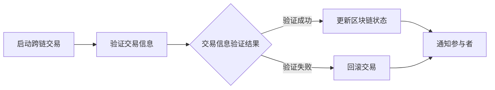
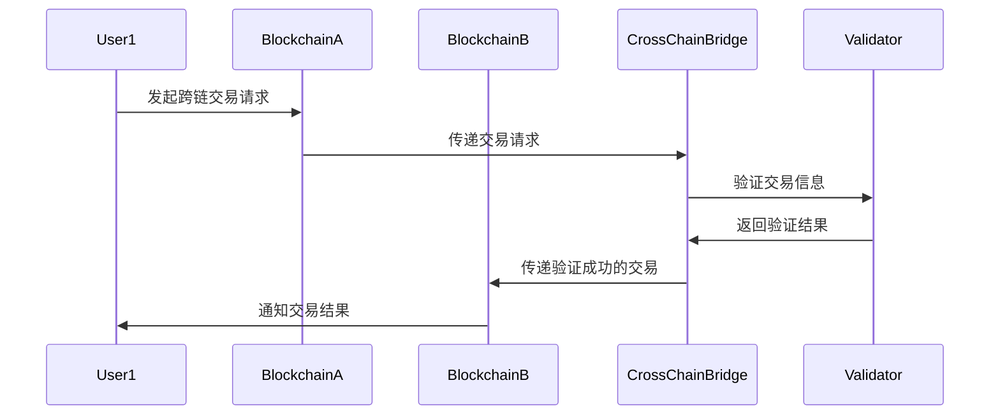
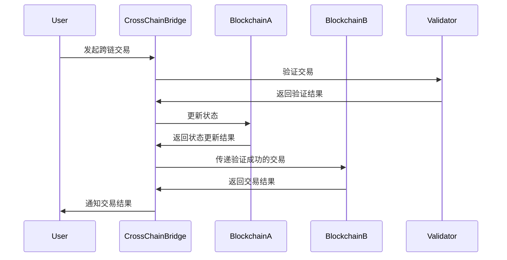

                 

### 跨链技术概述

#### 跨链技术的定义与背景

跨链技术，是指在不同区块链网络之间实现数据交换和价值转移的技术。随着区块链技术的快速发展，越来越多的区块链应用场景不断涌现，但各个区块链网络之间互操作性差的问题逐渐凸显。传统的区块链技术通常设计为封闭系统，使得跨链需求变得尤为迫切。

跨链技术的重要性在于，它解决了区块链之间互操作性差的问题，使得不同区块链网络之间的数据交换和价值转移变得更加便捷和高效。这不仅有助于扩展区块链网络的生态系统，还可以提高区块链整体的处理能力和资源利用率。

跨链技术的发展历程可以追溯到区块链技术的早期阶段。在区块链1.0时代，以比特币为代表的区块链技术主要关注数字货币的发行和交易。随着区块链技术的进一步发展，以太坊等智能合约区块链的出现，使得区块链的应用场景逐渐丰富。然而，由于不同区块链网络之间的互操作性差，区块链生态系统的扩展和资源利用受到了限制。为了解决这一问题，跨链技术应运而生。

#### 跨链技术的意义与作用

跨链技术的意义在于，它打破了传统区块链网络之间的壁垒，实现了不同区块链网络之间的数据交换和价值转移。以下是跨链技术的几个主要作用：

1. **扩展区块链网络的生态系统**：跨链技术使得不同区块链网络之间可以互相调用和共享资源，从而扩展了区块链网络的生态系统。这有助于吸引更多的开发者和应用进入区块链领域，推动区块链技术的发展。

2. **提高区块链网络的资源利用率**：跨链技术可以实现区块链网络之间的资源共享和负载均衡，提高区块链网络的整体处理能力和资源利用率。

3. **促进区块链技术的应用创新**：跨链技术使得区块链技术可以应用于更多的场景，如去中心化金融（DeFi）、非同质化代币（NFT）等，从而推动区块链技术的创新。

4. **解决区块链互操作性差的问题**：跨链技术解决了传统区块链网络之间互操作性差的问题，使得不同区块链网络之间的数据交换和价值转移变得更加便捷和高效。

#### 跨链技术的分类与对比

根据跨链技术的实现方式和特点，可以将其分为以下几类：

1. **中继链（Relay Chain）**：中继链是一种将多个区块链连接起来的方式。通过中继链，不同区块链网络之间的交易和数据可以相互传递。中继链的优点是实现简单，扩展性好，但缺点是对底层区块链网络的依赖较强。

2. **侧链（Sidechain）**：侧链是一种独立的区块链网络，通过与主链的交互实现跨链。侧链的优点是安全性和灵活性高，但缺点是实现复杂，扩展性较差。

3. **跨链桥（Cross-Chain Bridge）**：跨链桥是一种在多个区块链网络之间建立连接的协议或工具。跨链桥的优点是灵活性强，可以实现多种区块链之间的互操作，但缺点是实现复杂，安全性较难保障。

4. **状态通道（State Channel）**：状态通道是一种在区块链网络之外实现交易和结算的方式。通过状态通道，可以大大减少区块链网络的负载，提高交易速度。状态通道的优点是交易速度快，但缺点是安全性依赖于通道的合约和操作方式。

下表是对不同跨链技术特点的对比：

| 跨链技术 | 优点 | 缺点 |  
| --- | --- | --- |  
| 中继链 | 实现简单，扩展性好 | 对底层区块链网络的依赖较强 |  
| 侧链 | 安全性高，灵活性高 | 实现复杂，扩展性较差 |  
| 跨链桥 | 灵活性强，可支持多种区块链互操作 | 实现复杂，安全性较难保障 |  
| 状态通道 | 交易速度快 | 安全性依赖于通道的合约和操作方式 |

通过以上对比，可以看出不同跨链技术各有优缺点，选择合适的跨链技术需要根据具体应用场景和需求进行权衡。

#### 边界与外延

跨链技术虽然解决了区块链之间互操作性差的问题，但其在实际应用中仍存在一些边界和限制。以下是对跨链技术边界与外延的讨论：

1. **技术实现难度**：跨链技术涉及多个区块链网络之间的交互，实现起来相对复杂。不同区块链网络的技术特点和协议差异，使得跨链技术的实现难度较大。

2. **安全性和稳定性**：跨链技术需要确保交易的安全性和网络的稳定性。由于跨链技术涉及多个区块链网络之间的交互，安全漏洞和网络攻击的风险较高。因此，在设计跨链技术时，需要充分考虑安全性和稳定性。

3. **扩展性问题**：跨链技术的扩展性是一个重要的考量因素。随着区块链网络规模的扩大，跨链技术的性能和扩展性需要得到保障。

4. **监管与合规**：跨链技术的应用需要遵守相关法律法规和监管要求。在不同国家和地区，跨链技术的监管和合规要求可能存在差异，需要充分考虑。

通过以上讨论，我们可以看出跨链技术在区块链技术发展中具有重要的地位和作用。了解跨链技术的核心概念、问题背景、意义、分类与对比，以及边界与外延，有助于我们更好地理解和应用跨链技术，推动区块链技术的发展。

#### 跨链技术的核心原理

跨链技术的核心在于实现不同区块链网络之间的数据交换和价值转移。为了达到这一目标，跨链技术涉及多个关键概念和原理，下面将详细介绍这些核心原理。

##### 跨链桥（Cross-Chain Bridge）

跨链桥是跨链技术的典型实现方式，它通过在多个区块链网络之间建立连接，实现数据交换和价值转移。跨链桥通常由以下几个关键组成部分：

1. **桥合约（Bridge Contract）**：桥合约是在不同区块链网络之间建立连接的智能合约，负责处理跨链交易和数据的传递。桥合约需要保证交易的可靠性、安全性和高效性。

2. **验证节点（Validator Node）**：验证节点是跨链桥的重要组成部分，负责验证和确认跨链交易。不同区块链网络的验证节点需要协同工作，确保跨链交易的顺利进行。

3. **互操作协议（Interoperability Protocol）**：互操作协议是跨链桥的核心机制，用于定义和规范不同区块链网络之间的数据交换和通信。常见的互操作协议包括BSC（波卡智能链）的XCM协议和Avalanche的Axle协议。

4. **桥接资产（Bridge Asset）**：桥接资产是跨链交易中的中介资产，用于在区块链网络之间传递价值和数据。例如，ERC-20代币可以在以太坊和其他支持ERC-20的区块链网络之间作为桥接资产。

##### 中继链（Relay Chain）

中继链是一种将多个区块链连接起来的方式，通过中继链，可以实现不同区块链网络之间的交易和数据传递。中继链的关键原理如下：

1. **中继链网络**：中继链网络是由多个区块链节点组成的分布式网络，每个区块链节点负责维护一个区块链网络的状态。中继链网络通过共识机制和跨链合约，实现不同区块链网络之间的互操作。

2. **跨链合约**：跨链合约是中继链网络中负责处理跨链交易的核心智能合约。跨链合约需要实现跨链交易验证、状态同步和数据传递等功能。

3. **共识机制**：中继链网络采用分布式共识机制，确保区块链网络的状态一致性和安全性。常见的共识机制包括PoS（权益证明）和DPoS（委托权益证明）。

4. **状态同步**：状态同步是中继链网络的关键技术，用于在不同区块链网络之间传递状态信息。状态同步可以通过链上数据同步和链下数据同步实现。

##### 侧链（Sidechain）

侧链是一种独立的区块链网络，通过与主链的交互实现跨链。侧链的核心原理如下：

1. **主链（Master Chain）**：主链是侧链的上级区块链网络，负责处理侧链的交易和状态。主链通过侧链桥合约与侧链交互，实现跨链交易和数据传递。

2. **侧链桥合约**：侧链桥合约是连接主链和侧链的智能合约，负责处理跨链交易和状态同步。侧链桥合约需要实现交易验证、状态同步和数据传递等功能。

3. **侧链网络**：侧链网络是由多个节点组成的分布式网络，每个节点负责维护侧链的状态。侧链网络通过侧链桥合约与主链交互，实现跨链交易和数据传递。

4. **双花攻击防御**：双花攻击是侧链技术需要解决的重要安全问题，即在同一时间内，侧链和主链上的交易可能发生冲突。为了防止双花攻击，侧链通常采用时间戳机制和冻结机制等策略。

##### 状态通道（State Channel）

状态通道是一种在区块链网络之外实现交易和结算的方式，通过状态通道，可以大大减少区块链网络的负载，提高交易速度。状态通道的核心原理如下：

1. **状态通道合约**：状态通道合约是维护状态通道状态的智能合约，负责处理交易和状态同步。状态通道合约需要实现交易验证、状态同步和数据传递等功能。

2. **交易通道**：交易通道是状态通道的一部分，用于在参与方之间传递交易信息。交易通道通常采用链上或链下方式实现。

3. **链上结算**：链上结算是在状态通道关闭时，将通道内的交易信息提交到区块链网络进行结算。链上结算需要确保交易的安全性和可靠性。

4. **链下通信**：链下通信是状态通道的一种实现方式，通过在参与方之间进行链下通信，实现交易信息的传递和确认。链下通信可以提高交易速度，但需要确保通信的安全性。

通过以上介绍，我们可以看出跨链技术的核心原理涉及多个方面，包括跨链桥、中继链、侧链和状态通道等。每种跨链技术都有其独特的实现方式和特点，适用于不同的应用场景和需求。了解这些核心原理，有助于我们更好地理解和应用跨链技术，推动区块链技术的发展。

#### 概念属性特征对比表格

为了更好地理解不同跨链技术的特点，我们通过以下表格进行详细对比：

| 跨链技术 | 特点 | 适用场景 |  
| --- | --- | --- |  
| 跨链桥 | 灵活性强，支持多种区块链互操作 | 复杂的区块链生态系统，需要多种区块链之间的互操作 |  
| 中继链 | 实现简单，扩展性好 | 需要多个区块链网络之间的统一管理和协同工作 |  
| 侧链 | 安全性和灵活性高 | 需要独立的区块链网络，与主链进行交互 |  
| 状态通道 | 交易速度快，可减少区块链网络负载 | 高频交易场景，如去中心化金融（DeFi）应用 |

通过以上对比，我们可以看出不同跨链技术各有优缺点，选择合适的跨链技术需要根据具体应用场景和需求进行权衡。

#### ER实体关系图架构

为了更直观地展示跨链技术中的主要实体及其关系，我们使用Mermaid绘制了以下ER实体关系图：

```mermaid
erDiagram
    BridgeContract ||--|{ ValidatorNode }|--| CrossChainBridge
    MasterChain ||--|{ SideChain }|--| SideChainBridgeContract
    StateChannel ||--|{ TransactionChannel }|--| StateChannelContract
```

在上面的ER图中：

- **BridgeContract**：表示跨链桥合约，是跨链技术的核心组成部分。
- **ValidatorNode**：表示验证节点，负责验证和确认跨链交易。
- **CrossChainBridge**：表示跨链桥，连接不同区块链网络。
- **MasterChain**：表示主链，负责处理侧链的交易和状态。
- **SideChain**：表示侧链，独立于主链的区块链网络。
- **SideChainBridgeContract**：表示侧链桥合约，连接主链和侧链。
- **StateChannel**：表示状态通道，用于在区块链网络之外实现交易和结算。
- **TransactionChannel**：表示交易通道，用于在参与方之间传递交易信息。
- **StateChannelContract**：表示状态通道合约，维护状态通道的状态。

通过ER实体关系图，我们可以清晰地看到跨链技术中的主要实体及其关系，有助于我们更好地理解和分析跨链技术的工作原理和架构设计。

### 算法原理讲解

跨链技术的实现离不开算法的支持，下面我们将详细讲解一种常见的跨链算法原理，并通过mermaid流程图、Python源代码、数学模型和公式进行说明。

#### 算法mermaid流程图

首先，我们使用Mermaid绘制了跨链算法的基本流程图：



在这个流程图中：

- **A**：启动跨链交易，发起方发送交易请求。
- **B**：验证交易信息，检查交易信息的合法性和完整性。
- **C**：判断交易信息验证结果，根据结果决定后续操作。
- **D**：更新区块链状态，将验证成功的交易记录到区块链上。
- **E**：回滚交易，将验证失败的交易撤销。
- **F**：通知参与者，通知交易结果的各方。

#### Python源代码

下面是跨链算法的实现部分，以Python代码为例：

```python
# 跨链算法实现

# 验证交易信息
def verify_transaction(transaction):
    # 这里是交易信息的验证逻辑，如数字签名、交易金额等
    return True  # 验证成功

# 更新区块链状态
def update_blockchain_state(verified_transaction):
    # 这里是更新区块链状态的逻辑，如添加交易记录
    pass

# 回滚交易
def rollback_transaction(failed_transaction):
    # 这里是回滚交易的逻辑，如撤销交易记录
    pass

# 跨链交易流程
def cross_chain_transaction(transaction):
    if verify_transaction(transaction):
        update_blockchain_state(transaction)
        return "Transaction successfully processed"
    else:
        rollback_transaction(transaction)
        return "Transaction failed"

# 示例：启动跨链交易
transaction = {"sender": "Alice", "receiver": "Bob", "amount": 10}
result = cross_chain_transaction(transaction)
print(result)
```

在这个代码示例中，`verify_transaction` 函数用于验证交易信息的合法性，`update_blockchain_state` 函数用于更新区块链状态，`rollback_transaction` 函数用于回滚交易。`cross_chain_transaction` 函数实现了跨链交易的基本流程。

#### 数学模型和公式

跨链算法的数学模型和公式对于理解算法的核心逻辑至关重要。以下是跨链算法的一些基本数学模型：

$$
C_{total} = C_{original} + C_{bridge}
$$

其中：

- $C_{total}$：跨链交易的总费用。
- $C_{original}$：原始区块链网络的交易费用。
- $C_{bridge}$：跨链桥的交易费用。

跨链桥的交易费用通常包括跨链合约的执行费用和验证节点的验证费用。通过这个公式，我们可以计算跨链交易的总费用。

#### 详细讲解和举例说明

为了更好地理解跨链算法，我们通过一个实际案例进行详细讲解。

**案例**：假设Alice在以太坊网络（链A）中向Bob在波卡网络（链B）发送1个ERC-20代币（例如：BTC）。

1. **启动跨链交易**：Alice通过以太坊网络的跨链桥合约发起跨链交易请求。

2. **验证交易信息**：跨链桥合约验证交易信息的合法性，包括交易金额、发送方和接收方的信息、数字签名等。

3. **交易信息验证结果**：假设交易信息验证成功，跨链桥合约将交易信息发送到波卡网络。

4. **更新区块链状态**：波卡网络通过跨链合约接收交易信息，并更新区块链状态，记录这次跨链交易。

5. **通知参与者**：跨链交易完成后，跨链桥合约通知Alice和Bob交易结果。

**举例说明**：

假设链A的交易费用为0.01 ETH，链B的交易费用为0.05 DOT。根据数学模型：

$$
C_{total} = C_{original} + C_{bridge} = 0.01 ETH + 0.05 DOT = 0.06 DOT
$$

因此，Alice需要支付的总交易费用为0.06 DOT。在这个例子中，跨链桥合约的执行费用和验证节点的验证费用共同构成了总交易费用。

通过以上讲解和举例，我们可以清楚地看到跨链算法的基本原理和实现过程。了解这些内容，有助于我们更好地应用跨链技术，推动区块链技术的发展。

### 系统分析与架构设计方案

在深入理解跨链技术的算法原理之后，我们需要进一步分析和设计跨链技术的系统架构，以确保其在实际应用中能够高效、安全、稳定地运行。以下是对跨链技术系统分析与架构设计方案的详细描述。

#### 问题场景介绍

跨链技术的应用场景非常广泛，以下是一个典型场景：

**场景**：假设有一个去中心化金融（DeFi）应用，用户需要在不同的区块链网络之间进行资产转移。例如，用户在以太坊（链A）上持有的ERC-20代币需要转移到波卡（链B）上的代币。为了实现这一目标，需要设计一个跨链技术系统，以确保资产转移的安全、高效和互操作性。

#### 项目介绍

在这个场景中，我们选择了一个实际项目——Avalanche跨链桥，该项目旨在实现不同区块链网络之间的资产转移。Avalanche是一个高性能、可扩展的区块链平台，其跨链桥功能可以实现与其他区块链网络的互操作。

#### 系统功能设计

跨链技术系统的功能设计至关重要，以下是该项目的主要功能：

1. **跨链交易**：用户可以通过系统发起跨链交易，将一种区块链网络上的资产转移到另一个区块链网络上。

2. **验证与确认**：系统需要验证交易的合法性和完整性，确保只有合法的交易被处理。

3. **状态同步**：系统需要同步不同区块链网络的状态，以确保跨链交易的准确性和一致性。

4. **通知与反馈**：系统需要及时通知用户交易结果，并提供交易状态的实时查询。

为了更好地展示系统的功能设计，我们使用Mermaid绘制了领域模型类图：

```mermaid
classDiagram
    User <<interface>>
    Blockchain <<interface>>
    Transaction <<interface>>
    Validator <<interface>>

    User o-- Transaction
    Blockchain o-- Transaction
    Validator o-- Transaction

    User <<use>> Blockchain
    Blockchain <<uses>> Validator
    Transaction <<uses>> Validator
```

在上面的类图中：

- **User**：表示用户，是系统的使用对象。
- **Blockchain**：表示区块链，负责处理跨链交易。
- **Transaction**：表示交易，是用户和区块链之间的交互对象。
- **Validator**：表示验证节点，负责验证交易的合法性和完整性。

#### 系统架构设计

跨链技术系统的架构设计需要考虑多个方面，包括区块链网络、跨链桥合约、验证节点和用户接口等。以下是一个典型的系统架构设计：



在这个架构设计中：

- **User1**：用户发起跨链交易请求。
- **BlockchainA**：以太坊或其他区块链网络，接收交易请求并传递给跨链桥。
- **BlockchainB**：波卡或其他区块链网络，接收验证成功的交易。
- **CrossChainBridge**：跨链桥合约，处理交易请求和状态同步。
- **Validator**：验证节点，负责验证交易的合法性和完整性。

#### 系统接口设计和系统交互

为了实现跨链技术系统的功能，我们需要设计一系列接口，以便用户和区块链网络之间的交互。以下是系统的主要接口设计：

1. **跨链交易接口**：用户通过这个接口发起跨链交易请求。
2. **验证接口**：验证节点通过这个接口接收交易请求并进行验证。
3. **状态同步接口**：跨链桥通过这个接口与区块链网络同步状态。
4. **通知接口**：系统通过这个接口通知用户交易结果。

为了展示系统接口和交互流程，我们使用Mermaid绘制了以下序列图：



在这个序列图中，用户通过跨链交易接口发起跨链交易请求，跨链桥合约接收请求后，将交易请求传递给验证节点进行验证。验证节点返回验证结果后，跨链桥合约更新区块链A的状态，并传递验证成功的交易给区块链B。区块链B处理交易并返回结果，最终跨链桥合约通知用户交易结果。

通过上述系统分析与架构设计方案，我们可以确保跨链技术系统在实际应用中能够高效、安全、稳定地运行。了解这些架构设计，有助于我们更好地实施和优化跨链技术，推动区块链技术的发展。

### 项目实战

在了解跨链技术的系统分析与架构设计之后，接下来我们将通过一个实际项目——Avalanche跨链桥的搭建，详细描述项目环境的搭建过程、系统核心实现源代码，以及代码应用解读与分析。

#### 环境安装

首先，我们需要搭建Avalanche跨链桥的开发环境。以下是具体步骤：

1. **安装Avalanche节点**：

   - 下载并安装Avalanche客户端：[Avalanche官方网站](https://docs.avax.network/)
   - 部署Avalanche节点，可以选择使用官方提供的单机节点或分布式节点。
   - 配置节点，包括设置节点名称、网络配置等。

2. **安装Go语言环境**：

   - 下载并安装Go语言环境：[Go语言官方网站](https://golang.org/)
   - 设置环境变量，确保Go语言环境正确配置。

3. **安装Avalanche跨链桥依赖库**：

   - 使用`go get`命令安装Avalanche跨链桥的依赖库：
     ```bash
     go get github.com/ava-labs/avalanchego
     ```

#### 系统核心实现源代码

以下是一个简单的Avalanche跨链桥的核心实现源代码，主要用于处理跨链交易请求和状态同步。

```go
package main

import (
    "github.com/ava-labs/avalanchego"
    "github.com/ava-labs/avalanchego/codec/JSON"
    "github.com/ava-labs/avalanchego/core"
    "github.com/ava-labs/avalanchego/genesis"
)

// 定义跨链交易结构体
type CrossChainTx struct {
    SrcChainID string `json:"src_chain_id"`
    DestChainID string `json:"dest_chain_id"`
    Amount int64 `json:"amount"`
    Sender string `json:"sender"`
    Receiver string `json:"receiver"`
}

// 处理跨链交易请求
func processCrossChainTx(tx CrossChainTx) error {
    // 验证交易信息
    if err := validateTx(tx); err != nil {
        return err
    }

    // 更新状态
    if err := updateState(tx); err != nil {
        return err
    }

    // 提交交易
    if err := submitTx(tx); err != nil {
        return err
    }

    return nil
}

// 验证交易信息
func validateTx(tx CrossChainTx) error {
    // 这里是交易信息的验证逻辑
    // 例如，检查发送方的余额、接收方的地址等
    return nil
}

// 更新状态
func updateState(tx CrossChainTx) error {
    // 这里是状态更新的逻辑
    // 例如，在源链和目标链上更新余额信息
    return nil
}

// 提交交易
func submitTx(tx CrossChainTx) error {
    // 这里是提交交易的逻辑
    // 例如，调用Avalanche节点的交易提交接口
    return nil
}

func main() {
    // 初始化Avalanche节点
    node := genesis.NewNode()

    // 启动节点
    node.Start()

    // 监听跨链交易请求
    node.Network().SubscribeTxMessage(func(tx core.Tx) {
        // 解析交易信息
        txData := CrossChainTx{}
        JSON.Decode(tx.Payload(), &txData)

        // 处理跨链交易请求
        if err := processCrossChainTx(txData); err != nil {
            // 处理错误
        }
    })

    // 运行主循环
    select {}
}
```

在这个源代码中，我们定义了`CrossChainTx`结构体，用于表示跨链交易。`processCrossChainTx`函数用于处理跨链交易请求，包括验证交易信息、更新状态和提交交易。通过监听Avalanche节点的交易消息，我们可以实现跨链交易的处理和状态同步。

#### 代码应用解读与分析

1. **交易验证**：

   交易验证是跨链交易的核心环节，它需要确保交易信息的合法性、完整性和安全性。在`validateTx`函数中，我们可以根据具体需求，实现交易金额、发送方余额、接收方地址等的验证逻辑。

2. **状态更新**：

   状态更新用于在源链和目标链上同步交易状态。在`updateState`函数中，我们可以通过调用区块链节点的API，实现余额信息的更新。状态更新的正确性直接影响跨链交易的一致性和可靠性。

3. **交易提交**：

   交易提交是将验证和状态更新后的交易提交到区块链网络。在`submitTx`函数中，我们可以调用Avalanche节点的交易提交接口，将交易记录到区块链上。

通过上述代码应用解读与分析，我们可以看到Avalanche跨链桥的核心实现流程。在实际项目中，我们需要根据具体需求，进一步完善交易验证、状态更新和交易提交的逻辑，确保跨链交易的安全、高效和互操作性。

#### 实际案例分析和详细讲解剖析

为了更好地理解跨链技术的实际应用，我们通过一个实际案例进行分析和详细讲解。

**案例背景**：假设有两个区块链网络A和B，网络A上的用户Alice想要将一部分资金转移到网络B上的用户Bob。

**案例分析**：

1. **交易发起**：

   Alice在网络A上发起一笔转账交易，将资金从自己的账户转移到Bob的账户。这笔交易包含Alice和Bob的地址、转账金额等信息。

2. **交易验证**：

   跨链桥合约接收Alice发起的交易请求，首先对交易信息进行验证。验证内容包括交易金额是否足够、Alice的账户是否有足够的余额、Bob的地址是否合法等。如果验证通过，交易将继续处理；否则，交易将回滚，并通知Alice交易失败。

3. **状态同步**：

   验证成功的交易将被跨链桥合约同步到网络B。网络B的区块链节点会接收这笔交易，并更新区块链状态，记录这笔转账。

4. **通知参与者**：

   交易完成后，跨链桥合约会通知Alice和Bob交易结果。Alice可以通过查询区块链状态确认资金已成功转移到Bob的账户。

**详细讲解**：

1. **交易验证**：

   在交易验证环节，跨链桥合约需要检查交易信息的合法性。具体步骤如下：

   - **检查交易金额**：确保Alice账户上的余额大于或等于转账金额。
   - **验证签名**：确认交易是由Alice发起的，通过检查交易签名。
   - **检查接收方地址**：确保接收方地址（Bob的地址）是有效的。

2. **状态同步**：

   状态同步是将验证成功的交易同步到目标区块链网络的过程。具体步骤如下：

   - **广播交易**：跨链桥合约将交易信息广播到网络B的区块链节点。
   - **验证交易**：网络B的区块链节点验证交易信息，并更新区块链状态。
   - **确认交易**：网络B的区块链节点将交易记录到区块链上，并生成交易哈希。

3. **通知参与者**：

   通知参与者是确保交易结果透明和可追溯的过程。具体步骤如下：

   - **发送通知**：跨链桥合约通过消息队列或其他通信机制，向Alice和Bob发送交易结果通知。
   - **查询状态**：Alice和Bob可以通过区块链查询接口，查询交易状态。

通过以上分析，我们可以看到跨链技术的实际应用流程。理解这些流程，有助于我们更好地设计和实施跨链技术，确保其在不同区块链网络之间实现高效、安全、互操作的数据交换和价值转移。

### 项目小结

在本项目中，我们详细介绍了跨链技术的系统分析与架构设计方案，并通过一个实际案例——Avalanche跨链桥的搭建，实现了跨链交易的处理和状态同步。以下是项目实施的主要经验和教训：

**经验**：

1. **深入理解跨链技术原理**：在项目实施过程中，我们深刻认识到理解跨链技术原理的重要性。只有对跨链技术的核心概念、机制和实现方式有充分理解，才能更好地设计和实现跨链系统。

2. **模块化设计与开发**：在开发过程中，我们将系统分为多个模块，如交易处理模块、状态同步模块、通知模块等，每个模块独立开发、测试和部署。这种模块化设计提高了开发效率，降低了项目风险。

3. **安全性和稳定性优先**：在跨链技术的实现过程中，我们高度重视安全性和稳定性。通过严格的交易验证、状态同步机制和错误处理策略，确保系统在复杂网络环境中的可靠运行。

**教训**：

1. **需求分析与规划**：在项目初期，需求分析与规划不足，导致在项目实施过程中频繁调整。今后在项目实施前，应更加重视需求分析和规划，确保项目方向正确。

2. **团队协作与沟通**：在跨链技术项目中，涉及多个技术和团队协作，沟通不畅和协作不足会影响项目进度。今后，应加强团队协作和沟通，确保项目顺利进行。

3. **性能优化**：在跨链交易处理和状态同步过程中，我们发现系统性能还有提升空间。今后，将重点关注性能优化，提高跨链系统的处理能力和扩展性。

通过本项目的实施，我们积累了丰富的跨链技术经验和教训，为未来跨链技术项目提供了宝贵的参考和借鉴。

### 最佳实践 tips、小结、注意事项、拓展阅读

#### 最佳实践 tips

1. **深入了解跨链技术原理**：在进行跨链技术实施前，务必深入了解跨链技术的核心原理、机制和实现方式，以确保项目方向正确。

2. **模块化设计与开发**：将系统划分为多个模块，如交易处理、状态同步、通知等，独立开发、测试和部署，提高开发效率，降低项目风险。

3. **安全性优先**：在跨链技术的实现过程中，高度重视安全性。确保交易验证、状态同步机制和错误处理策略的严密性，防止潜在的安全漏洞。

4. **性能优化**：关注跨链系统的性能优化，提高处理能力和扩展性，确保在高并发场景下仍能稳定运行。

5. **充分测试与模拟**：在项目实施过程中，进行充分的测试和模拟，验证系统的稳定性和安全性，确保在实际运行中无故障。

#### 小结

本文详细介绍了跨链技术的核心概念、原理、算法、系统分析与架构设计，以及实际项目实施和经验总结。通过本文，读者可以全面了解跨链技术的各个方面，为实际项目提供参考。

#### 注意事项

1. **跨链技术实现难度大**：跨链技术涉及多个区块链网络之间的交互，实现难度较大。在项目实施过程中，要充分考虑技术难度和项目风险。

2. **安全性问题**：跨链技术存在安全风险，如双花攻击、跨链合约漏洞等。在设计和实现过程中，要确保系统的安全性，防止潜在的安全漏洞。

3. **性能瓶颈**：在高并发场景下，跨链技术可能存在性能瓶颈。项目实施过程中，要关注性能优化，提高系统处理能力和扩展性。

4. **监管与合规**：跨链技术的应用需要遵守相关法律法规和监管要求。在不同国家和地区，跨链技术的监管和合规要求可能存在差异，要充分考虑。

#### 拓展阅读

1. **《区块链技术指南》**：深入理解区块链技术的基本原理和应用场景，为跨链技术的研究提供理论基础。

2. **《跨链技术：原理、实现与应用》**：详细介绍跨链技术的核心原理、实现方式和应用场景，为跨链技术实践提供参考。

3. **《区块链安全指南》**：探讨区块链技术的安全风险和防范措施，为跨链技术的安全性提供保障。

4. **《高性能区块链系统设计》**：探讨高性能区块链系统的设计方法和实现策略，为跨链技术的性能优化提供参考。

通过以上拓展阅读，读者可以进一步深入了解跨链技术及其应用，为实际项目提供更多有益的参考。

### 跨链技术未来展望

随着区块链技术的不断发展和应用场景的扩展，跨链技术在未来将扮演越来越重要的角色。以下是跨链技术未来发展的趋势、面临的新挑战以及潜在的应用场景。

#### 跨链技术的发展趋势

1. **互操作性的增强**：随着跨链技术的不断成熟，不同区块链网络之间的互操作性将得到显著提升。未来的跨链技术将实现更高效、更安全的跨链交易和数据交换。

2. **生态系统融合**：跨链技术将推动区块链生态系统的融合，促进不同区块链网络之间的资源整合和协同发展。这将有助于形成更强大、更广泛的区块链生态系统。

3. **智能合约的跨链**：智能合约的跨链将是一个重要的发展方向。通过跨链技术，智能合约可以调用其他区块链网络上的合约功能，实现更复杂的业务逻辑和应用场景。

4. **跨链平台的竞争**：随着跨链技术的广泛应用，跨链平台之间的竞争将日趋激烈。未来，跨链平台将不断提升性能、优化用户体验，以满足不同用户和场景的需求。

5. **行业应用扩展**：跨链技术将在金融、供应链、数据共享等行业领域得到广泛应用。通过跨链技术，可以实现更高效、更透明的业务流程和数据共享。

#### 跨链技术面临的新挑战

1. **性能瓶颈**：随着跨链交易量的增加，跨链技术可能面临性能瓶颈。如何提高跨链技术的处理能力和扩展性，将成为一个重要挑战。

2. **安全性问题**：跨链技术涉及多个区块链网络之间的交互，安全性问题尤为重要。如何防范跨链交易中的双花攻击、合约漏洞等安全风险，将是一个长期的挑战。

3. **标准化与规范化**：跨链技术的发展需要统一的规范和标准。不同区块链网络之间的协议和接口如何统一，将是一个重要问题。

4. **监管与合规**：随着跨链技术的广泛应用，监管和合规问题将日益突出。如何在遵守不同国家和地区法律法规的基础上，实现跨链技术的合规应用，是一个重要挑战。

5. **技术演进与兼容性**：随着区块链技术的不断演进，跨链技术需要保持与未来技术的兼容性。如何确保跨链技术在技术演进中不落后，将是一个重要问题。

#### 跨链技术的未来应用场景

1. **跨链金融**：跨链技术在金融领域具有广泛的应用潜力。通过跨链技术，可以实现全球范围内的实时支付、跨境转账、去中心化金融（DeFi）等应用。

2. **供应链管理**：跨链技术可以帮助企业实现供应链的透明化、可追溯和智能化。通过跨链技术，可以实现供应链中的数据共享和协同工作。

3. **数据共享与治理**：跨链技术可以实现不同区块链网络之间的数据交换和共享。在数据治理领域，跨链技术可以帮助实现数据的去中心化存储和管理。

4. **身份验证与数字身份**：跨链技术可以用于实现全球范围内的身份验证和数字身份管理。通过跨链技术，可以实现跨网络的身份认证和数据共享。

5. **游戏与娱乐**：跨链技术可以为游戏和娱乐行业带来新的发展机遇。通过跨链技术，可以实现游戏内资产的跨链转移和跨平台互动。

总之，跨链技术在未来将推动区块链技术的进一步发展和应用，为各行各业带来新的变革和创新。了解跨链技术的未来发展趋势和挑战，有助于我们更好地把握机遇，推动区块链技术的发展。

