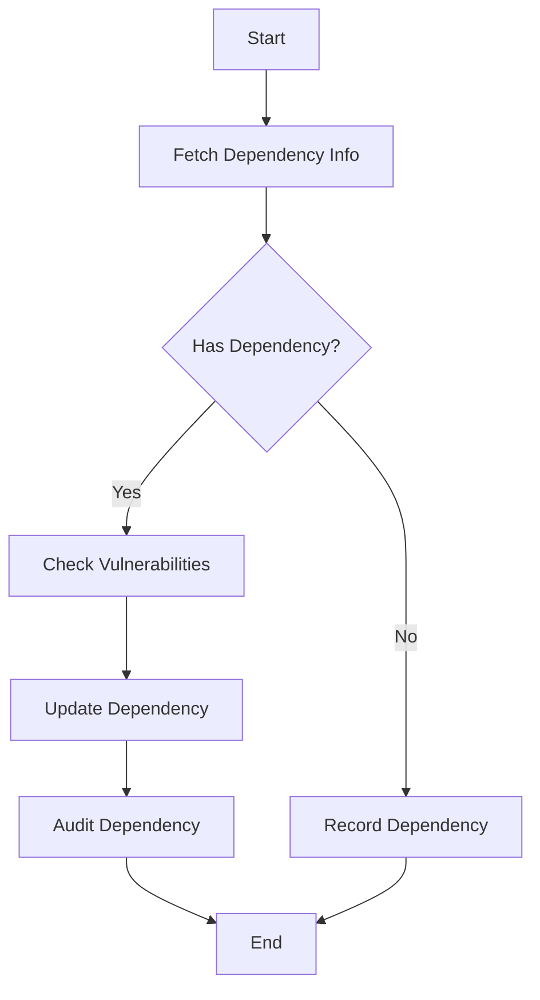

                 

### 《软件供应链安全：保护开发环境与依赖项》

关键词：软件供应链安全、开发环境保护、依赖项管理、漏洞分析、架构设计

摘要：随着软件复杂度的不断增加，软件供应链安全成为企业面临的重要挑战。本文详细探讨了软件供应链安全的背景、核心概念、漏洞分析、依赖管理、开发环境保护、安全架构设计、安全测试以及最佳实践，旨在为读者提供全面且实用的软件供应链安全解决方案。

### 目录大纲

#### 第1章 软件供应链安全概述

1.1 当前软件供应链安全形势

1.2 软件供应链安全的重要性

#### 第2章 软件供应链安全漏洞分析

2.1 常见漏洞类型

2.2 漏洞分析与检测

#### 第3章 软件依赖管理

3.1 依赖管理的重要性

3.2 依赖管理策略与实践

#### 第4章 开发环境安全保护

4.1 开发环境安全配置

4.2 开发环境安全工具

#### 第5章 软件供应链安全架构设计

5.1 安全架构设计方案

5.2 架构设计原则

#### 第6章 软件供应链安全测试

6.1 安全测试方法

6.2 安全测试实践

#### 第7章 软件供应链安全最佳实践

7.1 最佳实践总结

7.2 注意事项与拓展阅读

### 第1章 软件供应链安全概述

#### 1.1 当前软件供应链安全形势

软件供应链安全是指保护软件从开发、测试、部署到运行的全过程中不受恶意攻击或数据泄露的风险。随着软件越来越复杂，其依赖项和外部组件数量也在不断增加，这给供应链安全带来了巨大的挑战。

##### 1.1.1 软件供应链的概念

软件供应链是指软件从开发到部署的整个过程，包括需求分析、设计、编码、测试、部署、维护等各个环节。软件供应链的参与者包括软件开发者、库维护者、测试人员、运维人员、最终用户等。

##### 1.1.2 软件供应链的安全风险

软件供应链的安全风险主要包括以下几个方面：

- **供应链攻击**：攻击者通过供应链中的某个环节（如第三方库）注入恶意代码，从而影响最终用户的安全。
- **依赖项漏洞**：依赖项中可能存在的安全漏洞，一旦被利用，可能导致软件系统的数据泄露或功能被破坏。
- **开发环境安全**：开发过程中，开发环境可能存在安全漏洞，如不安全的编程习惯、配置错误等，这些漏洞可能被攻击者利用。
- **测试和部署过程**：在测试和部署过程中，如果安全措施不够完善，也可能导致安全漏洞的存在。

#### 1.2 软件供应链安全的重要性

软件供应链安全的重要性体现在以下几个方面：

- **企业声誉**：如果软件供应链存在安全漏洞，可能会导致企业的客户数据泄露，损害企业声誉。
- **合规性**：许多国家和地区对软件供应链安全有严格的法规要求，企业需要遵守这些法规，否则可能面临法律风险。
- **商业竞争**：在激烈的市场竞争中，拥有安全的软件供应链是企业保持竞争优势的关键。

### 第2章 软件供应链安全漏洞分析

#### 2.1 常见漏洞类型

软件供应链中常见的漏洞类型包括：

- **库漏洞**：库是指被多个软件项目依赖的代码集合，库中可能存在的漏洞可能被多个项目所利用。
- **依赖漏洞**：依赖漏洞通常是指第三方库或组件中存在的漏洞，这些漏洞可能被攻击者利用。
- **开发环境漏洞**：开发环境中的漏洞，如不安全的编程习惯、配置错误等。
- **测试和部署漏洞**：测试和部署过程中的漏洞，如不充分的测试覆盖、部署环境配置错误等。

#### 2.2 漏洞分析与检测

漏洞分析与检测是软件供应链安全的重要组成部分。以下是一些常见的漏洞分析与检测方法：

- **自动化漏洞扫描**：使用自动化工具对代码进行扫描，查找潜在的漏洞。
- **手动漏洞分析**：通过人工审查代码，查找潜在的安全漏洞。
- **安全审计**：对软件供应链中的各个环节进行审计，确保其符合安全要求。

### 第3章 软件依赖管理

#### 3.1 依赖管理的重要性

依赖管理是软件供应链安全的关键环节。良好的依赖管理可以减少安全漏洞的风险，提高软件质量。依赖管理的重要性体现在以下几个方面：

- **减少安全漏洞**：通过严格的依赖管理策略，可以减少依赖项中存在的漏洞。
- **提高软件质量**：良好的依赖管理可以提高软件的稳定性和可靠性。
- **降低维护成本**：通过减少依赖项的数量和复杂性，可以降低软件的维护成本。

#### 3.2 依赖管理策略与实践

依赖管理策略和实践包括以下几个方面：

- **使用可靠的第三方库**：选择经过验证的、信誉良好的第三方库，避免使用未知来源的库。
- **依赖审查**：对依赖项进行审查，确保其符合企业的安全要求。
- **版本控制**：使用版本控制工具，如 Git，对依赖项进行版本控制，确保使用的是稳定的版本。
- **自动化部署**：使用自动化部署工具，如 Jenkins，确保依赖项的正确安装和配置。

### 第4章 开发环境安全保护

#### 4.1 开发环境安全配置

开发环境的安全配置是保护软件供应链的重要环节。以下是一些开发环境安全配置的最佳实践：

- **使用安全配置文件**：使用安全配置文件，如 .env文件，存储敏感信息，如密码、密钥等。
- **限制权限**：为开发环境中的用户和组设置适当的权限，避免权限过大导致的安全风险。
- **定期更新**：定期更新开发环境中的软件和工具，确保其安全性。

#### 4.2 开发环境安全工具

以下是一些常用的开发环境安全工具：

- **静态代码分析工具**：如 SonarQube，用于扫描代码中的潜在安全漏洞。
- **动态代码分析工具**：如 Burp Suite，用于检测运行中的代码漏洞。
- **配置管理工具**：如 Ansible，用于管理和配置开发环境。

### 第5章 软件供应链安全架构设计

#### 5.1 安全架构设计方案

软件供应链安全架构设计的目标是确保软件从开发到部署的每个环节都得到充分的安全保护。以下是一个简单的安全架构设计方案：

- **多层次的防御**：采用多层次的防御策略，如防火墙、入侵检测系统（IDS）等，以保护软件供应链的不同环节。
- **安全隔离**：在开发、测试、生产等不同环境之间实现安全隔离，防止攻击者跨环境攻击。
- **持续监控**：采用实时监控和报警系统，及时发现和响应潜在的安全威胁。

#### 5.2 架构设计原则

以下是软件供应链安全架构设计的一些基本原则：

- **最小权限原则**：为每个组件和用户分配最小权限，以降低潜在的安全风险。
- **安全隔离原则**：确保不同组件和环境之间的安全隔离，防止攻击者跨组件或跨环境攻击。
- **安全性可度量原则**：通过量化指标评估软件供应链的安全性，以便及时调整和优化安全策略。

### 第6章 软件供应链安全测试

#### 6.1 安全测试方法

软件供应链安全测试主要包括以下几种方法：

- **静态代码安全测试**：通过分析代码结构和逻辑，查找潜在的安全漏洞。
- **动态代码安全测试**：通过运行代码，检测代码中的漏洞和异常行为。
- **依赖项安全测试**：对依赖项进行安全审查，确保其不存在已知漏洞。

#### 6.2 安全测试实践

以下是一些安全测试的最佳实践：

- **定期进行安全测试**：定期对软件供应链进行安全测试，以确保其安全性。
- **全面的测试覆盖**：确保测试覆盖所有可能的漏洞类型和攻击场景。
- **自动化安全测试**：使用自动化工具进行安全测试，提高测试效率和准确性。

### 第7章 软件供应链安全最佳实践

#### 7.1 最佳实践总结

以下是一些软件供应链安全最佳实践：

- **实施严格的依赖管理策略**：确保使用可靠的第三方库，并对依赖项进行严格审查。
- **加强开发环境安全**：确保开发环境的安全配置，并使用安全工具进行监控和防护。
- **进行全面的漏洞检测和修复**：定期进行漏洞检测，并及时修复发现的安全漏洞。
- **加强安全培训和意识教育**：提高员工的安全意识和技能，减少人为错误导致的安全风险。

#### 7.2 注意事项与拓展阅读

- **遵守安全合规要求**：确保软件供应链符合相关法律法规和安全标准。
- **关注安全发展趋势**：持续关注软件供应链安全领域的新趋势和技术发展。
- **参考文献**：
  - 《软件供应链安全：从零开始保护你的软件》
  - 《软件供应链安全实战：从漏洞管理到合规性》
  - 《DevSecOps：将安全性融入软件开发和部署》

作者：AI天才研究院/AI Genius Institute & 禅与计算机程序设计艺术 /Zen And The Art of Computer Programming

----------------------------------------------------------------

**第1章 软件供应链安全概述**

随着现代软件系统变得越来越复杂，软件供应链安全已成为一个不容忽视的问题。软件供应链涵盖了从代码的编写、测试、部署到最终用户使用的整个过程，每个环节都可能存在安全漏洞，从而对整个软件系统的安全性构成威胁。本章将探讨软件供应链安全的背景、重要性以及其核心概念。

#### 1.1 当前软件供应链安全形势

软件供应链安全形势日益严峻，主要原因有以下几点：

1. **第三方库和组件的依赖**：现代软件系统通常依赖大量的第三方库和组件，这些库和组件可能包含安全漏洞，攻击者可以通过这些漏洞对整个软件系统进行攻击。
2. **自动化工具的使用**：虽然自动化工具提高了软件开发的效率，但同时也引入了新的安全风险，如自动化工具的配置错误或恶意代码的注入。
3. **开源软件的使用**：开源软件的使用越来越普遍，但开源软件的质量参差不齐，其中可能包含安全漏洞，攻击者可以利用这些漏洞进行攻击。

##### 1.1.1 软件供应链的概念

软件供应链是指从软件开发到部署的整个过程，包括以下环节：

- **需求分析**：确定软件的需求和功能。
- **设计**：根据需求进行软件架构设计。
- **编码**：根据设计进行代码编写。
- **测试**：对软件进行各种类型的测试，确保其质量。
- **部署**：将软件部署到生产环境。
- **维护**：对软件进行持续维护，包括修复漏洞和更新功能。

软件供应链的参与者包括：

- **软件开发者**：负责编写和设计软件。
- **测试人员**：负责对软件进行测试，确保其质量。
- **运维人员**：负责将软件部署到生产环境，并对其进行维护。
- **最终用户**：使用软件并可能反馈使用体验。

##### 1.1.2 软件供应链的安全风险

软件供应链的安全风险主要包括以下几点：

- **供应链攻击**：攻击者通过篡改第三方库或组件，将其植入恶意代码，然后提供给开发者，使得最终用户使用的是恶意软件。
- **依赖项漏洞**：第三方库或组件中可能存在安全漏洞，攻击者可以利用这些漏洞获取敏感信息或控制软件系统。
- **开发环境漏洞**：开发环境中的配置错误或漏洞可能导致攻击者入侵系统。
- **测试和部署漏洞**：测试和部署过程中可能存在安全漏洞，如不充分的测试覆盖或部署环境配置错误。

#### 1.2 软件供应链安全的重要性

软件供应链安全对于企业和个人都具有重要意义：

- **企业声誉**：如果软件供应链存在安全漏洞，可能导致企业数据泄露或业务中断，损害企业声誉。
- **商业竞争**：在市场竞争激烈的环境中，拥有安全的软件供应链是企业保持竞争优势的关键。
- **法律法规**：许多国家和地区对软件供应链安全有严格的法律法规要求，企业需要遵守这些法规，否则可能面临法律风险。

#### 1.3 核心概念与联系

在软件供应链安全中，以下几个核心概念密切相关：

- **依赖管理**：确保使用的第三方库和组件是安全的，并且版本控制得当。
- **安全配置**：确保开发环境和生产环境的安全配置，避免配置错误。
- **安全测试**：对软件进行全面的测试，包括功能测试和安全测试，确保软件质量。
- **漏洞扫描**：使用自动化工具对代码和依赖项进行扫描，查找潜在的安全漏洞。

这些概念相互关联，共同构成了软件供应链安全的关键要素。

**第2章 软件供应链安全漏洞分析**

软件供应链中的漏洞可能来自多个方面，包括第三方库、组件、开发环境和测试部署过程。了解这些漏洞的类型、原因和影响，对于有效管理和防御软件供应链安全至关重要。本章将详细分析软件供应链中常见的漏洞类型，以及如何进行漏洞分析和检测。

#### 2.1 常见漏洞类型

软件供应链中常见的漏洞类型包括以下几种：

##### 2.1.1 库漏洞

库漏洞是指第三方库或组件中存在的安全漏洞。这些库可能被广泛使用，一旦被利用，将对许多软件系统构成威胁。库漏洞的原因可能包括：

- **代码质量不高**：库的代码可能存在设计缺陷或错误，使得攻击者可以利用这些漏洞。
- **依赖链过长**：软件系统可能依赖于多个库，如果其中一个库存在漏洞，其他依赖该库的软件系统也将受到影响。
- **未及时更新**：第三方库的维护者可能没有及时修复已知漏洞，导致使用旧版本的库的软件系统仍然存在风险。

库漏洞的影响可能包括：

- **数据泄露**：攻击者可以通过库漏洞获取软件系统的敏感信息。
- **远程代码执行**：攻击者可以通过库漏洞执行恶意代码，从而控制软件系统。

##### 2.1.2 依赖漏洞

依赖漏洞是指软件系统中依赖的第三方库或组件中存在的安全漏洞。依赖漏洞可能源于以下原因：

- **不安全的依赖项**：软件系统依赖的库可能存在已知漏洞，而这些漏洞可能被攻击者利用。
- **依赖版本问题**：软件系统可能依赖于某个特定版本的库，而新版本的库可能修复了旧版本中的漏洞，但软件系统未更新依赖项。

依赖漏洞的影响可能包括：

- **系统稳定性下降**：依赖漏洞可能导致软件系统崩溃或无法正常运行。
- **数据泄露**：攻击者可以通过依赖漏洞获取软件系统的敏感信息。

##### 2.1.3 开发环境漏洞

开发环境漏洞是指开发过程中可能存在的安全漏洞。开发环境漏洞的原因可能包括：

- **配置错误**：开发环境的配置可能存在错误，如未启用必要的安全配置或配置了不必要的安全限制。
- **安全意识不足**：开发人员可能缺乏足够的安全意识，导致编写不安全的代码。
- **开发工具漏洞**：开发工具本身可能存在安全漏洞，从而影响开发环境的安全性。

开发环境漏洞的影响可能包括：

- **代码泄露**：开发环境中的代码可能被攻击者获取，从而泄露企业机密。
- **入侵风险**：攻击者可以通过开发环境漏洞入侵企业内部网络。

##### 2.1.4 测试和部署漏洞

测试和部署过程中可能存在的漏洞包括：

- **测试覆盖不足**：测试过程中可能未能覆盖所有可能的漏洞，导致潜在的安全漏洞未被检测到。
- **部署环境配置错误**：部署环境中的配置可能存在错误，如未启用必要的安全配置或配置了不必要的安全限制。
- **部署工具漏洞**：部署工具本身可能存在安全漏洞，从而影响部署过程的安全性。

测试和部署漏洞的影响可能包括：

- **系统稳定性下降**：测试和部署过程中可能引入的漏洞可能导致软件系统崩溃或无法正常运行。
- **数据泄露**：部署过程中可能存在的漏洞可能导致敏感数据泄露。

#### 2.2 漏洞分析与检测

漏洞分析与检测是软件供应链安全的重要环节。以下是一些常见的漏洞分析与检测方法：

##### 2.2.1 自动化漏洞扫描

自动化漏洞扫描工具可以自动扫描代码和依赖项，查找潜在的安全漏洞。这些工具通常具有以下特点：

- **快速扫描**：自动化漏洞扫描工具可以快速扫描大量代码和依赖项，提高漏洞检测效率。
- **自动化报告**：自动化漏洞扫描工具可以生成详细的漏洞报告，帮助开发人员和测试人员快速定位和修复漏洞。
- **持续监控**：自动化漏洞扫描工具可以持续监控代码库和依赖项，及时发现新出现的漏洞。

常用的自动化漏洞扫描工具包括：

- **SonarQube**：一款广泛使用的静态代码分析工具，可以检测代码中的各种安全漏洞。
- **OWASP ZAP**：一款免费的动态应用程序安全测试工具，可以检测Web应用程序中的漏洞。

##### 2.2.2 手动漏洞分析

手动漏洞分析是指通过人工审查代码和依赖项，查找潜在的安全漏洞。手动漏洞分析通常需要具备一定的安全知识和经验，以下是一些常用的方法：

- **代码审查**：通过审查代码的语法、逻辑和结构，查找潜在的安全漏洞。
- **依赖审查**：审查依赖项的版本和来源，确保其安全性和可靠性。
- **安全审计**：对软件供应链的各个环节进行审计，确保其符合安全要求。

##### 2.2.3 漏洞数据库

漏洞数据库是收集和整理已知漏洞信息的资源。开发人员和测试人员可以使用漏洞数据库查找与其代码或依赖项相关的漏洞信息。以下是一些常用的漏洞数据库：

- **CVE**：公共漏洞和暴露（Common Vulnerabilities and Exposures）数据库，提供了大量的漏洞信息和分类。
- **NVD**：国家漏洞数据库（National Vulnerability Database），提供了CVE漏洞的详细信息和安全评分。
- **CNVD**：中国国家信息安全漏洞库，提供了国内漏洞信息和分类。

##### 2.2.4 漏洞利用测试

漏洞利用测试是指通过实际攻击测试，验证漏洞是否可以被利用。漏洞利用测试可以帮助开发人员和测试人员了解漏洞的实际影响和修复效果。以下是一些常用的漏洞利用测试方法：

- **漏洞利用工具**：如Metasploit，可以帮助测试人员模拟攻击者行为，验证漏洞的利用效果。
- **手工利用**：通过编写特定的脚本或代码，模拟攻击者的攻击行为，验证漏洞的利用效果。

### 第3章 软件依赖管理

软件依赖管理是确保软件系统安全性和稳定性的关键环节。依赖管理涉及到如何选择、审查和更新第三方库和组件，以确保其安全可靠。本章将介绍依赖管理的重要性、策略和实践。

#### 3.1 依赖管理的重要性

依赖管理的重要性体现在以下几个方面：

1. **提高软件质量**：依赖管理可以确保软件系统使用的第三方库和组件是稳定和可靠的，从而提高软件系统的整体质量。
2. **降低安全风险**：良好的依赖管理可以减少因依赖项漏洞导致的安全风险，保护软件系统的安全性。
3. **提高开发效率**：依赖管理工具可以帮助开发人员快速查找和安装所需的依赖项，提高开发效率。
4. **降低维护成本**：通过依赖管理，可以更好地控制和管理第三方库和组件的版本，降低软件系统的维护成本。

#### 3.2 依赖管理策略与实践

依赖管理策略和实践包括以下几个方面：

##### 3.2.1 选择可靠的依赖项

选择可靠的依赖项是依赖管理的第一步。以下是一些建议：

- **使用知名库**：选择广泛使用的知名库，这些库通常经过严格的测试和审查，质量较高。
- **审查来源**：确保依赖项的来源可靠，如官方发布或知名开源社区。
- **了解维护状况**：了解依赖项的维护状况，确保其仍在积极维护和更新。

##### 3.2.2 审查依赖项

审查依赖项是确保其安全性和稳定性的关键。以下是一些审查方法：

- **版本审查**：检查依赖项的版本，确保使用的是最新稳定版本。
- **安全审查**：使用漏洞数据库和安全工具检查依赖项是否存在已知漏洞。
- **代码审查**：如果可能，对依赖项的代码进行审查，确保其没有安全漏洞。

##### 3.2.3 版本控制

版本控制是依赖管理的重要策略。以下是一些建议：

- **使用私有仓库**：将依赖项存储在私有仓库中，确保对依赖项的版本和更新有更好的控制。
- **锁定版本**：在项目中锁定依赖项的版本，避免因依赖项的更新导致的不兼容问题。
- **持续更新**：定期检查和更新依赖项，确保使用的是最新稳定版本。

##### 3.2.4 使用依赖管理工具

依赖管理工具可以帮助开发人员更好地管理和控制依赖项。以下是一些常用的依赖管理工具：

- **Maven**：一种流行的Java依赖管理工具，支持自动化构建和依赖项管理。
- **NPM**：一种流行的JavaScript依赖管理工具，支持自动化安装、更新和管理依赖项。
- **pip**：一种流行的Python依赖管理工具，支持自动化安装、更新和管理依赖项。

##### 3.2.5 测试依赖项

在依赖管理过程中，测试依赖项是确保其安全性和稳定性的重要步骤。以下是一些测试方法：

- **集成测试**：在软件系统集成依赖项时进行测试，确保依赖项与系统其他部分协同工作。
- **安全测试**：对依赖项进行安全测试，确保其没有安全漏洞。
- **兼容性测试**：确保依赖项在不同环境下的兼容性。

#### 3.3 最佳实践

以下是一些依赖管理最佳实践：

- **定期审查依赖项**：定期审查依赖项，确保其版本和安全性。
- **限制依赖项数量**：尽量减少依赖项的数量，降低系统的复杂性和风险。
- **培训和意识**：对开发人员进行依赖管理培训，提高其安全意识和技能。
- **文档化**：将依赖管理策略和实践文档化，确保团队遵循一致的依赖管理流程。

### 第4章 开发环境安全保护

开发环境是软件开发的起点，其安全性直接影响到软件系统的整体安全性。本章将讨论如何保护开发环境，包括安全配置和使用的安全工具。

#### 4.1 开发环境安全配置

良好的开发环境安全配置是保护软件供应链的第一道防线。以下是一些关键的安全配置措施：

##### 4.1.1 配置管理工具

配置管理工具可以帮助开发人员确保开发环境的一致性和安全性。以下是一些常用的配置管理工具：

- **Ansible**：一种自动化配置管理工具，可以用于配置操作系统、应用程序和网络资源。
- **Chef**：一种自动化配置管理工具，可以定义和部署基础设施和应用程序。
- **Puppet**：一种自动化配置管理工具，可以配置和管理系统资源。

##### 4.1.2 安全策略配置

安全策略配置是确保开发环境安全的关键。以下是一些重要的安全策略：

- **最小权限原则**：确保开发环境和系统中每个用户和组的权限都是最小的，以减少潜在的安全风险。
- **加密通信**：使用加密协议（如 SSH）进行远程访问和通信，确保数据传输安全。
- **日志记录**：启用和配置日志记录，以便在发生安全事件时能够进行追踪和调查。

##### 4.1.3 安全配置文件

使用安全配置文件可以确保敏感信息和配置参数的安全存储。以下是一些安全配置文件的最佳实践：

- **使用环境变量**：将敏感信息（如密码、密钥等）存储在环境变量中，而不是硬编码在代码或配置文件中。
- **定期更新**：定期更新配置文件中的密码和密钥，确保其安全性。
- **权限控制**：确保配置文件的权限设置适当，以防止未经授权的访问。

##### 4.1.4 开发环境隔离

开发环境隔离是将开发环境与其他环境（如测试环境、生产环境）隔离，以减少潜在的安全风险。以下是一些隔离措施：

- **网络隔离**：使用虚拟私有云（VPC）或防火墙将开发环境与其他环境隔离开来。
- **访问控制**：仅允许必要的访问权限，确保开发环境的访问权限最小化。
- **环境清理**：在开发完成后，及时清理开发环境中的敏感信息和数据。

#### 4.2 开发环境安全工具

以下是一些常用的开发环境安全工具：

##### 4.2.1 静态代码分析工具

静态代码分析工具可以帮助开发人员识别代码中的潜在安全漏洞和不良实践。以下是一些常用的静态代码分析工具：

- **SonarQube**：一款强大的静态代码分析平台，可以扫描代码中的安全漏洞、编码问题和技术债务。
- **Checkmarx**：一款静态应用程序安全测试（SAST）工具，可以检测代码中的安全漏洞。
- **Fortify**：一款静态代码分析工具，可以识别代码中的安全漏洞和代码质量问题。

##### 4.2.2 动态代码分析工具

动态代码分析工具可以在代码运行时检测潜在的安全漏洞和异常行为。以下是一些常用的动态代码分析工具：

- **Burp Suite**：一款Web应用程序安全测试工具，可以执行各种攻击测试，查找安全漏洞。
- **OWASP ZAP**：一款免费的动态应用程序安全测试（DAST）工具，可以自动扫描Web应用程序中的安全漏洞。
- **AppScan**：一款动态应用程序安全测试（DAST）工具，可以识别Web应用程序中的安全漏洞。

##### 4.2.3 实时监控与报警系统

实时监控与报警系统可以帮助开发人员及时发现和处理安全事件。以下是一些实时监控与报警系统：

- **ELK Stack**：一种开源日志分析平台，可以收集、存储和搜索日志数据，并进行实时监控和报警。
- **Splunk**：一款企业级监控和数据分析平台，可以实时监控系统日志和事件，并提供报警功能。
- **Nagios**：一款开源的监控工具，可以监控服务器、网络设备和应用程序，并在发生异常时发出报警。

##### 4.2.4 加密和身份验证

加密和身份验证是确保数据安全和用户身份验证的重要措施。以下是一些加密和身份验证工具：

- **SSL/TLS**：使用SSL/TLS加密协议保护数据传输的安全性。
- **Kerberos**：一种网络身份验证协议，可以确保用户身份的验证。
- **OAuth**：一种授权协议，可以确保用户访问应用程序的权限。

#### 4.3 小结

保护开发环境是确保软件供应链安全的重要步骤。通过使用配置管理工具、静态代码分析工具、动态代码分析工具、实时监控与报警系统以及加密和身份验证工具，可以显著提高开发环境的安全性。开发人员应遵循最佳实践，定期更新和审查依赖项，确保开发环境的安全配置，以降低软件供应链中的安全风险。

### 第5章 软件供应链安全架构设计

软件供应链安全架构设计是确保软件系统在整个生命周期中安全性的关键。一个良好的安全架构设计应包括多个层次，以确保不同环节的安全性。本章将介绍软件供应链安全架构的设计方案、设计原则以及相关的系统分析与架构设计。

#### 5.1 安全架构设计方案

软件供应链安全架构设计应考虑以下几个方面：

##### 5.1.1 多层次的防御

多层次的防御策略是确保软件供应链安全的重要手段。该策略通过在不同层级上设置安全控制点，形成多个防护层，从而提高整个系统的安全性。以下是一个典型多层防御架构的示意图：

```
+--------------------------------------------------+
| 用户层                                           |
+--------------------------------------------------+
        |
        | 应用层安全
        |
        | 数据库安全
        |
        | 网络层安全
        |
        | 硬件层安全
+--------------------------------------------------+
| 开发层                                           |
+--------------------------------------------------+
        |
        | 代码安全
        |
        | 依赖管理
        |
        | 开发环境安全
+--------------------------------------------------+
| 供应链层                                          |
+--------------------------------------------------+
        |
        | 第三方库审查
        |
        | 供应链监控
        |
        | 供应链审计
+--------------------------------------------------+
```

##### 5.1.2 安全模块设计

在安全架构设计中，将安全功能模块化是提高系统可维护性和扩展性的有效方法。以下是一些关键的安全模块及其功能：

- **身份验证与授权模块**：负责用户的身份验证和权限管理，确保只有授权用户可以访问系统资源。
- **加密模块**：负责数据加密和解密，确保数据在传输和存储过程中的安全性。
- **安全审计模块**：记录系统操作日志，包括用户操作、系统事件等，以便在发生安全事件时进行追踪和调查。
- **入侵检测与防御模块**：实时监控系统的异常行为，并采取相应的防护措施，如阻断恶意攻击、发出警报等。
- **安全更新与补丁管理模块**：负责定期检查和更新系统中的安全补丁，确保系统的安全性。

##### 5.1.3 安全流程设计

安全流程设计是确保安全控制措施有效实施的关键。以下是一个典型安全流程的示例：

1. **需求分析**：在软件开发的初期，进行安全需求分析，确定系统需要实现的安全功能。
2. **设计**：在软件架构设计阶段，将安全需求转化为具体的架构设计和功能模块。
3. **实施**：在开发阶段，实现安全功能，并进行严格的代码审查和测试。
4. **监控**：在系统运行过程中，持续监控系统的安全状态，及时发现和处理安全事件。
5. **响应**：在发生安全事件时，及时响应并采取相应的措施，如隔离攻击源、恢复系统等。
6. **审查与改进**：定期审查安全策略和流程，根据实际情况进行改进和优化。

#### 5.2 架构设计原则

在软件供应链安全架构设计过程中，应遵循以下原则：

##### 5.2.1 最小权限原则

最小权限原则是指系统中的每个组件和用户都应具有最小的权限，仅限于执行其必要的任务。这可以减少恶意行为和误操作带来的安全风险。

##### 5.2.2 隔离原则

隔离原则是指将不同的安全域隔离开来，防止攻击者在系统中进行横向移动。例如，开发环境、测试环境和生产环境应相互隔离，以防止攻击者从开发环境渗透到生产环境。

##### 5.2.3 分层原则

分层原则是指将系统划分为多个层次，每个层次都承担不同的功能和安全责任。这样可以提高系统的安全性和可维护性，便于管理和监控。

##### 5.2.4 持续改进原则

持续改进原则是指不断审查和优化安全架构，以应对不断变化的安全威胁。这包括定期进行安全审计、安全培训和技术更新等。

#### 5.3 系统分析与架构设计

以下是一个简单的软件供应链安全架构分析，包括领域模型、架构设计和接口设计。

##### 5.3.1 领域模型

领域模型是描述系统功能域的模型，以下是一个简单的领域模型示例：

```
User -> Authorization
User -> AuditLog
User -> SecurityPolicy
Dependency -> Review
Dependency -> Update
Dependency -> Scan
Environment -> Configuration
Environment -> Monitoring
Environment -> Audit
```

##### 5.3.2 架构设计

架构设计是描述系统组件和它们之间关系的模型，以下是一个简单的架构设计示例：

```
+-----------------+
|   User Layer    |
+-----------------+
| - Authentication |
| - Authorization  |
| - AuditLog       |
+-----------------+
        |
        | Application Layer
        |
        | - Dependency Management
        | - Environment Configuration
        | - Environment Monitoring
        | - Environment Audit
        |
        | Database Layer
        |
        | - Data Encryption
        | - Data Storage
+-----------------+
        |
        | Network Layer
        |
        | - Network Security
        | - Intrusion Detection
+-----------------+
        |
        | Hardware Layer
        |
        | - Hardware Security
+-----------------+
```

##### 5.3.3 接口设计

接口设计是描述系统组件之间的交互接口，以下是一个简单的接口设计示例：

```
+-----------------+
|   User Layer    |
+-----------------+
| - Authenticate() |
| - Authorize()    |
| - LogAudit()     |
+-----------------+
        |
        | Application Layer
        |
        | - ReviewDependency() |
        | - UpdateDependency() |
        | - ScanDependency()   |
        | - ConfigureEnvironment() |
        | - MonitorEnvironment() |
        | - AuditEnvironment()   |
+-----------------+
        |
        | Database Layer
        |
        | - EncryptData() |
        | - StoreData()   |
+-----------------+
        |
        | Network Layer
        |
        | - SecureNetworkCommunication() |
        | - DetectIntrusions()          |
+-----------------+
        |
        | Hardware Layer
        |
        | - SecureHardwareComponents() |
+-----------------+
```

#### 5.4 小结

软件供应链安全架构设计是确保软件系统安全性的关键。通过设计多层次的防御、模块化的安全功能和持续改进的原则，可以构建一个安全、可靠和灵活的软件供应链安全架构。系统分析与架构设计是这一过程的重要组成部分，它们帮助开发人员清晰地理解系统功能、组件和接口，从而更好地实现安全架构。

### 第6章 软件供应链安全测试

软件供应链安全测试是确保软件系统在整个开发、测试和部署过程中不受恶意攻击或数据泄露风险的重要环节。本章将介绍软件供应链安全测试的方法、实践以及如何通过测试确保软件供应链的安全。

#### 6.1 安全测试方法

软件供应链安全测试通常包括以下几种方法：

##### 6.1.1 静态代码安全测试

静态代码安全测试（SAST）是在代码编写和编译之前进行的测试，通过分析源代码或字节码，查找潜在的安全漏洞。以下是一些SAST工具：

- **SonarQube**：一款功能强大的SAST工具，支持多种编程语言，可以检测代码中的各种安全漏洞。
- **Fortify Static Code Analyzer**：一款专业的SAST工具，可以深入分析代码，查找潜在的安全漏洞。
- **Checkmarx**：一款功能全面的SAST工具，可以自动扫描和修复代码中的安全漏洞。

##### 6.1.2 动态代码安全测试

动态代码安全测试（DAST）是在代码运行时进行的测试，通过模拟攻击者的攻击行为，检测代码中的安全漏洞。以下是一些DAST工具：

- **OWASP ZAP**：一款免费的DAST工具，可以自动扫描Web应用程序中的安全漏洞。
- **Burp Suite**：一款功能强大的Web应用程序安全测试工具，可以执行全面的攻击测试。
- **Nessus**：一款网络漏洞扫描工具，可以检测系统中的各种漏洞。

##### 6.1.3 依赖项安全测试

依赖项安全测试是检测第三方库和组件中存在的安全漏洞。以下是一些依赖项安全测试工具：

- **OWASP Dependency-Check**：一款自动化的依赖项安全检查工具，可以检测项目中的已知安全漏洞。
- **OWASP NodeJS Security Scanner**：一款专门针对Node.js应用程序的依赖项安全检查工具。
- **Polaris**：一款针对Java应用程序的依赖项安全检查工具。

##### 6.1.4 安全审计

安全审计是对软件供应链的各个环节进行系统性审查，确保其符合安全标准和要求。以下是一些安全审计方法：

- **代码审查**：人工审查代码，查找潜在的安全漏洞。
- **配置审计**：审查系统的配置文件，确保其符合安全策略。
- **渗透测试**：模拟攻击者的攻击行为，测试系统的安全性。

#### 6.2 安全测试实践

以下是一些软件供应链安全测试的最佳实践：

##### 6.2.1 集成安全测试

将安全测试集成到软件开发和部署流程中，确保在每个阶段都进行安全测试。以下是一个典型的集成安全测试流程：

1. **需求分析**：在需求分析阶段，确定系统的安全需求，并将其纳入测试计划。
2. **设计**：在设计阶段，考虑安全测试的需求，设计相应的测试用例和测试场景。
3. **开发**：在开发阶段，进行静态代码安全测试和依赖项安全测试，确保代码和依赖项的安全性。
4. **测试**：在测试阶段，进行动态代码安全测试和渗透测试，验证系统的安全性。
5. **部署**：在部署阶段，进行安全审计和配置检查，确保系统的安全配置。

##### 6.2.2 持续测试

持续测试是指在整个软件开发生命周期中持续进行安全测试，及时发现和修复安全漏洞。以下是一些持续测试的方法：

- **持续集成（CI）**：在每次代码提交后，自动执行安全测试，确保代码库的安全性。
- **持续交付（CD）**：在每次代码提交后，自动构建和部署软件，并执行安全测试，确保部署的安全性。
- **自动化测试**：使用自动化工具进行安全测试，提高测试效率和覆盖率。

##### 6.2.3 安全测试覆盖

确保安全测试覆盖所有可能的漏洞类型和攻击场景，以下是一些安全测试覆盖的最佳实践：

- **全面覆盖**：确保测试用例覆盖所有的功能模块和关键路径。
- **异常测试**：测试系统的异常处理能力，确保在异常情况下系统能够保持稳定。
- **边界测试**：测试系统的边界条件，确保系统能够正确处理输入数据。
- **模糊测试**：使用模糊测试工具生成大量随机输入，检测系统对异常输入的响应。

##### 6.2.4 安全测试文档

安全测试文档是记录测试过程和结果的文档，以下是一些安全测试文档的最佳实践：

- **测试计划**：描述测试的目标、范围、方法和资源。
- **测试用例**：定义测试的具体步骤、输入、预期结果和实际结果。
- **测试报告**：记录测试过程、结果和发现的安全漏洞。
- **漏洞管理**：记录漏洞的修复情况和验证结果。

#### 6.3 小结

软件供应链安全测试是确保软件系统安全性的关键步骤。通过静态代码安全测试、动态代码安全测试、依赖项安全测试和渗透测试，可以全面评估软件系统的安全性。集成安全测试、持续测试、全面覆盖和安全测试文档是确保测试效果的重要实践。通过这些方法，可以显著提高软件供应链的安全性，保护企业和用户的数据和利益。

### 第7章 软件供应链安全最佳实践

软件供应链安全是确保软件系统在整个生命周期中不受恶意攻击或数据泄露的关键环节。实施最佳实践是提高软件供应链安全性的有效途径。本章将总结软件供应链安全最佳实践，并探讨一些注意事项和未来的发展趋势。

#### 7.1 最佳实践总结

以下是一些软件供应链安全的最佳实践：

1. **依赖管理**：
   - **使用官方或可信源**：确保使用的第三方库和组件来自官方或可信的源。
   - **版本控制**：使用版本控制工具，如Git，跟踪和管理依赖项的版本。
   - **依赖项审查**：定期审查依赖项，确保其没有已知的安全漏洞。

2. **开发环境安全**：
   - **最小权限原则**：为开发环境和用户分配最小权限，仅限于执行其必要任务。
   - **配置管理**：使用配置管理工具，如Ansible或Puppet，确保环境配置的一致性和安全性。
   - **安全编码**：培训开发人员安全编码的最佳实践，减少代码中的安全漏洞。

3. **安全测试**：
   - **静态代码分析**：使用静态代码分析工具，如SonarQube，检测代码中的潜在安全漏洞。
   - **动态代码分析**：使用动态代码分析工具，如OWASP ZAP，测试代码在运行时的安全性能。
   - **渗透测试**：定期进行渗透测试，模拟攻击者的攻击行为，验证系统的安全性。

4. **安全配置**：
   - **启用加密**：在传输和存储数据时使用加密技术，如SSL/TLS。
   - **配置审计**：定期审计系统的配置文件，确保其符合安全策略。
   - **日志监控**：启用和监控系统日志，以便在发生安全事件时及时响应。

5. **持续监控**：
   - **实时监控**：使用实时监控工具，如ELK Stack或Splunk，监控系统的运行状态和安全事件。
   - **异常检测**：使用异常检测工具，如Suricata或Snort，检测系统中的异常行为。
   - **响应计划**：制定安全事件响应计划，确保在发生安全事件时能够迅速响应。

#### 7.2 注意事项

以下是实施软件供应链安全时需要关注的一些事项：

1. **合规性**：确保软件供应链安全措施符合相关法律法规和安全标准，如ISO 27001和GDPR。
2. **安全培训**：定期对开发人员、测试人员和运维人员进行安全培训，提高他们的安全意识和技能。
3. **自动化**：尽可能使用自动化工具进行安全测试和监控，提高效率和准确性。
4. **代码审查**：实施代码审查流程，确保代码质量和安全性。
5. **供应链审查**：定期审查供应链中的合作伙伴，确保其符合安全要求。

#### 7.3 拓展阅读资源

以下是一些推荐的学习和参考资料：

1. **书籍**：
   - 《软件供应链安全：从零开始保护你的软件》
   - 《DevSecOps：将安全性融入软件开发和部署》
   - 《软件安全：现代应用的安全性和测试》

2. **在线课程**：
   - **Coursera**：软件安全课程
   - **Udemy**：软件供应链安全课程
   - **edX**：DevOps和安全课程

3. **博客和论坛**：
   - **OWASP**：开源网络应用安全项目（Open Web Application Security Project）
   - **The New Stack**：关于云计算、DevOps和软件安全的博客
   - **InfoSec Institute**：信息安全教育网站

#### 7.4 小结

软件供应链安全是一个复杂而动态的过程，需要持续的关注和改进。通过实施最佳实践、定期培训、自动化工具和严格的审查，可以显著提高软件供应链的安全性。随着技术的发展和威胁的演变，持续学习和适应新的安全策略是确保软件供应链安全的关键。

### 结论

软件供应链安全是确保软件系统安全性的重要环节。通过依赖管理、开发环境安全配置、安全测试和持续监控等最佳实践，可以显著提高软件供应链的安全性。然而，软件供应链安全是一个动态过程，需要持续的关注和改进。随着技术的不断发展和威胁的演变，企业和开发人员应不断学习和适应新的安全策略，以应对不断变化的安全挑战。希望本文提供的最佳实践和拓展阅读资源能对您在软件供应链安全领域有所启发和帮助。

### 参考文献

1. **《软件供应链安全：从零开始保护你的软件》**，作者：John Esser
2. **《DevSecOps：将安全性融入软件开发和部署》**，作者：Hadi Hariri
3. **《软件安全：现代应用的安全性和测试》**，作者：Coda Hale
4. **《OWASP Top Ten 2021**》，[官网](https://owasp.org/www-project-top-ten/)**
5. **《ISO 27001**》，[官网](https://www.iso.org/standard/71718.html)**
6. **《GDPR**》，[官网](https://www.eugdpr.org/)**

作者：AI天才研究院/AI Genius Institute & 禅与计算机程序设计艺术 /Zen And The Art of Computer Programming

----------------------------------------------------------------

**第1章 软件供应链安全概述**

软件供应链安全是当今信息化时代的重要议题。随着软件系统日益复杂，软件供应链中的安全漏洞和风险也随之增加。本章将介绍软件供应链安全的基本概念、重要性以及当前面临的挑战。

#### 1.1 软件供应链的概念

软件供应链是指从软件需求分析、设计、开发、测试、部署到维护的整个生命周期。它包括多个环节和参与者，如图1-1所示。


软件供应链的主要参与者包括：

- **供应商**：提供软件组件或服务的第三方公司。
- **开发团队**：负责开发和维护软件产品的团队。
- **测试团队**：负责对软件进行测试，确保其质量和安全性。
- **运维团队**：负责软件的部署、运行和维护。
- **最终用户**：使用软件的用户。

#### 1.2 软件供应链安全的重要性

软件供应链安全对于企业的业务连续性、数据保护和合规性至关重要。以下是软件供应链安全的几个关键重要性：

1. **业务连续性**：软件供应链中的安全漏洞可能导致系统崩溃、业务中断，从而影响企业的运营和声誉。
2. **数据保护**：软件供应链安全漏洞可能导致敏感数据泄露，威胁用户的隐私和企业机密。
3. **合规性**：许多行业都有严格的安全合规要求，如ISO 27001、GDPR等。确保软件供应链安全是满足这些合规要求的必要条件。

#### 1.3 软件供应链安全面临的主要挑战

软件供应链安全面临的主要挑战包括：

1. **第三方组件的安全**：软件经常依赖第三方库和组件，但这些组件可能包含安全漏洞，如库漏洞或依赖漏洞。
2. **开发环境的安全**：开发环境可能存在配置错误或安全漏洞，如不安全的编程习惯、未加密的存储等。
3. **自动化工具的安全**：自动化工具（如CI/CD流水线）可能引入新的安全风险，如配置错误或自动化脚本中的漏洞。
4. **开源软件的安全**：开源软件的使用越来越普遍，但开源项目可能缺乏严格的安全审查和更新。

#### 1.4 核心概念与联系

在软件供应链安全中，以下几个核心概念密切相关：

1. **依赖管理**：确保软件系统使用的第三方库和组件是安全可靠的。
2. **漏洞扫描**：使用自动化工具扫描代码和依赖项，查找潜在的安全漏洞。
3. **安全测试**：对软件进行功能测试和安全测试，确保其质量。
4. **持续集成与持续部署（CI/CD）**：确保在开发、测试和部署过程中及时检测和修复安全漏洞。

这些概念相互关联，共同构成了软件供应链安全的关键要素。在下一章中，我们将深入探讨软件供应链中常见的漏洞类型和漏洞分析的方法。

### 第2章 软件供应链安全漏洞分析

软件供应链安全漏洞分析是确保软件系统安全性的关键步骤。了解常见漏洞的类型、原因和影响，有助于采取有效的防护措施。本章将详细介绍软件供应链中常见的漏洞类型，包括库漏洞、依赖漏洞、开发环境漏洞等，并探讨如何进行漏洞分析和检测。

#### 2.1 常见漏洞类型

软件供应链中的漏洞类型多样，每种漏洞都有其独特的特点。以下是几种常见的漏洞类型：

##### 2.1.1 库漏洞

库漏洞是指第三方库中存在的安全漏洞。这些库被多个软件项目依赖，一旦被利用，可能对整个软件供应链造成严重影响。库漏洞的原因可能包括：

- **编码错误**：库的代码可能包含逻辑错误，使得攻击者可以利用这些漏洞。
- **设计缺陷**：库的设计可能存在缺陷，如输入验证不足。
- **未及时更新**：库的维护者可能没有及时修复已知漏洞。

库漏洞的影响可能包括：

- **数据泄露**：攻击者可能通过库漏洞获取敏感数据。
- **远程代码执行**：攻击者可能通过库漏洞在目标系统上执行恶意代码。

##### 2.1.2 依赖漏洞

依赖漏洞是指软件系统依赖的第三方库或组件中存在的安全漏洞。依赖漏洞的原因可能包括：

- **不安全的依赖项**：软件系统可能依赖于存在安全漏洞的库或组件。
- **依赖版本问题**：软件系统可能依赖于某个特定版本的库，但该版本已修复了漏洞。

依赖漏洞的影响可能包括：

- **系统稳定性下降**：依赖漏洞可能导致软件系统崩溃或无法正常运行。
- **数据泄露**：依赖漏洞可能导致敏感数据泄露。

##### 2.1.3 开发环境漏洞

开发环境漏洞是指开发过程中可能存在的安全漏洞。开发环境漏洞的原因可能包括：

- **配置错误**：开发环境的配置可能存在错误，如未启用必要的安全配置。
- **安全意识不足**：开发人员可能缺乏足够的安全意识，导致编写不安全的代码。
- **开发工具漏洞**：开发工具本身可能存在安全漏洞。

开发环境漏洞的影响可能包括：

- **代码泄露**：开发环境中的代码可能被攻击者获取，从而泄露企业机密。
- **入侵风险**：攻击者可能通过开发环境漏洞入侵企业内部网络。

##### 2.1.4 测试和部署漏洞

测试和部署过程中可能存在的漏洞包括：

- **测试覆盖不足**：测试过程中可能未能覆盖所有可能的漏洞。
- **部署环境配置错误**：部署环境中的配置可能存在错误，如未启用必要的安全配置。
- **部署工具漏洞**：部署工具本身可能存在安全漏洞。

测试和部署漏洞的影响可能包括：

- **系统稳定性下降**：测试和部署过程中可能引入的漏洞可能导致软件系统崩溃或无法正常运行。
- **数据泄露**：部署过程中可能存在的漏洞可能导致敏感数据泄露。

#### 2.2 漏洞分析与检测

漏洞分析与检测是软件供应链安全的重要环节。以下是一些常见的漏洞分析与检测方法：

##### 2.2.1 自动化漏洞扫描

自动化漏洞扫描工具可以自动扫描代码和依赖项，查找潜在的安全漏洞。以下是一些常用的自动化漏洞扫描工具：

- **SonarQube**：一款强大的静态代码分析工具，可以检测代码中的安全漏洞。
- **OWASP ZAP**：一款免费的动态应用程序安全测试工具，可以自动扫描Web应用程序中的漏洞。
- **Nessus**：一款网络漏洞扫描工具，可以检测系统中的漏洞。

##### 2.2.2 手动漏洞分析

手动漏洞分析是指通过人工审查代码和依赖项，查找潜在的安全漏洞。以下是一些手动漏洞分析的方法：

- **代码审查**：人工审查代码，查找潜在的逻辑错误和安全漏洞。
- **依赖审查**：审查依赖项的版本和来源，确保其安全性。
- **安全审计**：对软件供应链的各个环节进行审计，确保其符合安全要求。

##### 2.2.3 漏洞数据库

漏洞数据库是收集和整理已知漏洞信息的资源。以下是一些常用的漏洞数据库：

- **CVE**：公共漏洞和暴露（Common Vulnerabilities and Exposures）数据库，提供了大量的漏洞信息和分类。
- **NVD**：国家漏洞数据库（National Vulnerability Database），提供了CVE漏洞的详细信息和安全评分。
- **CNVD**：中国国家信息安全漏洞库，提供了国内漏洞信息和分类。

##### 2.2.4 漏洞利用测试

漏洞利用测试是指通过实际攻击测试，验证漏洞是否可以被利用。以下是一些漏洞利用测试的方法：

- **漏洞利用工具**：如Metasploit，可以帮助测试人员模拟攻击者行为，验证漏洞的利用效果。
- **手工利用**：通过编写特定的脚本或代码，模拟攻击者的攻击行为，验证漏洞的利用效果。

通过上述漏洞分析与检测方法，可以全面评估软件供应链的安全性，及时识别和修复安全漏洞，确保软件系统的安全稳定运行。

### 第3章 软件依赖管理

软件依赖管理是确保软件系统安全性和稳定性的关键环节。依赖管理涉及到如何选择、审查和更新第三方库和组件，以确保其安全可靠。本章将详细介绍软件依赖管理的重要性、策略和实践。

#### 3.1 依赖管理的重要性

依赖管理的重要性体现在以下几个方面：

1. **提高软件质量**：通过依赖管理，可以确保软件系统使用的第三方库和组件是安全可靠的，从而提高软件系统的整体质量。
2. **降低安全风险**：良好的依赖管理可以减少因依赖项漏洞导致的安全风险，保护软件系统的安全性。
3. **提高开发效率**：依赖管理工具可以帮助开发人员快速查找和安装所需的依赖项，提高开发效率。
4. **降低维护成本**：通过依赖管理，可以更好地控制和管理第三方库和组件的版本，降低软件系统的维护成本。

#### 3.2 依赖管理策略

依赖管理策略是确保软件依赖项安全性和稳定性的关键。以下是一些依赖管理策略：

##### 3.2.1 选择可靠的依赖项

选择可靠的依赖项是依赖管理的第一步。以下是一些建议：

- **使用官方或知名库**：选择由知名开发者或组织维护的库，这些库通常经过严格的测试和审查。
- **审查来源**：确保依赖项的来源可靠，如官方发布或知名开源社区。
- **了解维护状况**：了解依赖项的维护状况，确保其仍在积极维护和更新。

##### 3.2.2 审查依赖项

审查依赖项是确保其安全性和稳定性的关键。以下是一些审查方法：

- **版本审查**：检查依赖项的版本，确保使用的是最新稳定版本。
- **安全审查**：使用漏洞数据库和安全工具检查依赖项是否存在已知漏洞。
- **代码审查**：如果可能，对依赖项的代码进行审查，确保其没有安全漏洞。

##### 3.2.3 版本控制

版本控制是依赖管理的重要策略。以下是一些建议：

- **使用私有仓库**：将依赖项存储在私有仓库中，确保对依赖项的版本和更新有更好的控制。
- **锁定版本**：在项目中锁定依赖项的版本，避免因依赖项的更新导致的不兼容问题。
- **定期更新**：定期检查和更新依赖项，确保使用的是最新稳定版本。

##### 3.2.4 使用依赖管理工具

依赖管理工具可以帮助开发人员更好地管理和控制依赖项。以下是一些常用的依赖管理工具：

- **Maven**：一种流行的Java依赖管理工具，支持自动化构建和依赖项管理。
- **NPM**：一种流行的JavaScript依赖管理工具，支持自动化安装、更新和管理依赖项。
- **pip**：一种流行的Python依赖管理工具，支持自动化安装、更新和管理依赖项。

#### 3.3 实践依赖管理

以下是一些依赖管理的实践方法：

##### 3.3.1 依赖项审查流程

建立依赖项审查流程，确保每次引入新的依赖项时都进行审查。以下是一个简单的依赖项审查流程：

1. **需求分析**：确定项目需要哪些依赖项。
2. **选择依赖项**：从官方或知名库中选择合适的依赖项。
3. **审查依赖项**：检查依赖项的版本、安全性和代码质量。
4. **批准依赖项**：经过审查后，批准依赖项的使用。
5. **记录审查结果**：记录依赖项的审查结果，以便后续参考。

##### 3.3.2 定期依赖项审查

定期审查已使用的依赖项，确保其版本和安全状态。以下是一个简单的定期依赖项审查流程：

1. **列出依赖项**：列出项目中使用的所有依赖项。
2. **检查版本**：检查依赖项的版本，确保其是最新的稳定版本。
3. **安全审查**：使用漏洞数据库和安全工具检查依赖项是否存在已知漏洞。
4. **更新依赖项**：根据审查结果，更新或替换存在安全风险的依赖项。

##### 3.3.3 依赖项升级策略

制定依赖项升级策略，确保在升级依赖项时不会引入新的安全风险。以下是一些依赖项升级策略：

- **逐步升级**：分批次升级依赖项，以便在升级过程中及时发现和解决问题。
- **兼容性测试**：在升级依赖项后，进行兼容性测试，确保系统功能不受影响。
- **备份和回滚**：在升级前备份系统，并在升级后保留回滚的选项。

通过以上依赖管理策略和实践，可以确保软件系统依赖项的安全性和稳定性，从而提高软件供应链的安全性。

### 第4章 开发环境安全保护

开发环境是软件开发的起点，其安全性直接影响到软件系统的整体安全性。本章将讨论如何保护开发环境，包括安全配置和使用的安全工具。

#### 4.1 开发环境安全配置

良好的开发环境安全配置是保护软件供应链的第一道防线。以下是一些关键的安全配置措施：

##### 4.1.1 配置管理工具

配置管理工具可以帮助开发人员确保开发环境的一致性和安全性。以下是一些常用的配置管理工具：

- **Ansible**：一种自动化配置管理工具，可以用于配置操作系统、应用程序和网络资源。
- **Chef**：一种自动化配置管理工具，可以定义和部署基础设施和应用程序。
- **Puppet**：一种自动化配置管理工具，可以配置和管理系统资源。

##### 4.1.2 安全策略配置

安全策略配置是确保开发环境安全的关键。以下是一些重要的安全策略：

- **最小权限原则**：确保开发环境和系统中每个用户和组的权限都是最小的，以减少潜在的安全风险。
- **加密通信**：使用加密协议（如 SSH）进行远程访问和通信，确保数据传输安全。
- **日志记录**：启用和配置日志记录，以便在发生安全事件时能够进行追踪和调查。

##### 4.1.3 安全配置文件

使用安全配置文件可以确保敏感信息和配置参数的安全存储。以下是一些安全配置文件的最佳实践：

- **使用环境变量**：将敏感信息（如密码、密钥等）存储在环境变量中，而不是硬编码在代码或配置文件中。
- **定期更新**：定期更新配置文件中的密码和密钥，确保其安全性。
- **权限控制**：确保配置文件的权限设置适当，以防止未经授权的访问。

##### 4.1.4 开发环境隔离

开发环境隔离是将开发环境与其他环境（如测试环境、生产环境）隔离，以减少潜在的安全风险。以下是一些隔离措施：

- **网络隔离**：使用虚拟私有云（VPC）或防火墙将开发环境与其他环境隔离开来。
- **访问控制**：仅允许必要的访问权限，确保开发环境的访问权限最小化。
- **环境清理**：在开发完成后，及时清理开发环境中的敏感信息和数据。

#### 4.2 开发环境安全工具

以下是一些常用的开发环境安全工具：

##### 4.2.1 静态代码分析工具

静态代码分析工具可以帮助开发人员识别代码中的潜在安全漏洞和不良实践。以下是一些常用的静态代码分析工具：

- **SonarQube**：一款强大的静态代码分析平台，可以扫描代码中的安全漏洞、编码问题和技术债务。
- **Checkmarx**：一款静态应用程序安全测试（SAST）工具，可以检测代码中的安全漏洞。
- **Fortify**：一款静态代码分析工具，可以识别代码中的安全漏洞和代码质量问题。

##### 4.2.2 动态代码分析工具

动态代码分析工具可以在代码运行时检测潜在的安全漏洞和异常行为。以下是一些常用的动态代码分析工具：

- **Burp Suite**：一款Web应用程序安全测试工具，可以执行各种攻击测试，查找安全漏洞。
- **OWASP ZAP**：一款免费的动态应用程序安全测试（DAST）工具，可以自动扫描Web应用程序中的安全漏洞。
- **AppScan**：一款动态应用程序安全测试（DAST）工具，可以识别Web应用程序中的安全漏洞。

##### 4.2.3 实时监控与报警系统

实时监控与报警系统可以帮助开发人员及时发现和处理安全事件。以下是一些实时监控与报警系统：

- **ELK Stack**：一种开源日志分析平台，可以收集、存储和搜索日志数据，并进行实时监控和报警。
- **Splunk**：一款企业级监控和数据分析平台，可以实时监控系统日志和事件，并提供报警功能。
- **Nagios**：一款开源的监控工具，可以监控服务器、网络设备和应用程序，并在发生异常时发出报警。

##### 4.2.4 加密和身份验证

加密和身份验证是确保数据安全和用户身份验证的重要措施。以下是一些加密和身份验证工具：

- **SSL/TLS**：使用SSL/TLS加密协议保护数据传输的安全性。
- **Kerberos**：一种网络身份验证协议，可以确保用户身份的验证。
- **OAuth**：一种授权协议，可以确保用户访问应用程序的权限。

#### 4.3 小结

保护开发环境是确保软件供应链安全的重要步骤。通过使用配置管理工具、静态代码分析工具、动态代码分析工具、实时监控与报警系统以及加密和身份验证工具，可以显著提高开发环境的安全性。开发人员应遵循最佳实践，定期更新和审查依赖项，确保开发环境的安全配置，以降低软件供应链中的安全风险。

### 第5章 软件供应链安全架构设计

软件供应链安全架构设计是确保软件系统在整个生命周期中安全性的关键。一个良好的安全架构设计应包括多个层次，以确保不同环节的安全性。本章将介绍软件供应链安全架构的设计方案、设计原则以及相关的系统分析与架构设计。

#### 5.1 安全架构设计方案

软件供应链安全架构设计应考虑以下几个方面：

##### 5.1.1 多层次的防御

多层次的防御策略是确保软件供应链安全的重要手段。该策略通过在不同层级上设置安全控制点，形成多个防护层，从而提高整个系统的安全性。以下是一个典型多层防御架构的示意图：

```
+--------------------------------------------------+
| 用户层                                           |
+--------------------------------------------------+
        |
        | 应用层安全
        |
        | 数据库安全
        |
        | 网络层安全
        |
        | 硬件层安全
+--------------------------------------------------+
| 开发层                                           |
+--------------------------------------------------+
        |
        | 代码安全
        |
        | 依赖管理
        |
        | 开发环境安全
+--------------------------------------------------+
| 供应链层                                          |
+--------------------------------------------------+
        |
        | 第三方库审查
        |
        | 供应链监控
        |
        | 供应链审计
+--------------------------------------------------+
```

##### 5.1.2 安全模块设计

在安全架构设计中，将安全功能模块化是提高系统可维护性和扩展性的有效方法。以下是一些关键的安全模块及其功能：

- **身份验证与授权模块**：负责用户的身份验证和权限管理，确保只有授权用户可以访问系统资源。
- **加密模块**：负责数据加密和解密，确保数据在传输和存储过程中的安全性。
- **安全审计模块**：记录系统操作日志，包括用户操作、系统事件等，以便在发生安全事件时进行追踪和调查。
- **入侵检测与防御模块**：实时监控系统的异常行为，并采取相应的防护措施，如阻断恶意攻击、发出警报等。
- **安全更新与补丁管理模块**：负责定期检查和更新系统中的安全补丁，确保系统的安全性。

##### 5.1.3 安全流程设计

安全流程设计是确保安全控制措施有效实施的关键。以下是一个典型安全流程的示例：

1. **需求分析**：在软件开发的初期，进行安全需求分析，确定系统需要实现的安全功能。
2. **设计**：在软件架构设计阶段，将安全需求转化为具体的架构设计和功能模块。
3. **实施**：在开发阶段，实现安全功能，并进行严格的代码审查和测试。
4. **监控**：在系统运行过程中，持续监控系统的安全状态，及时发现和处理安全事件。
5. **响应**：在发生安全事件时，及时响应并采取相应的措施，如隔离攻击源、恢复系统等。
6. **审查与改进**：定期审查安全策略和流程，根据实际情况进行改进和优化。

#### 5.2 架构设计原则

在软件供应链安全架构设计过程中，应遵循以下原则：

##### 5.2.1 最小权限原则

最小权限原则是指系统中的每个组件和用户都应具有最小的权限，仅限于执行其必要的任务。这可以减少恶意行为和误操作带来的安全风险。

##### 5.2.2 隔离原则

隔离原则是指将不同的安全域隔离开来，防止攻击者在系统中进行横向移动。例如，开发环境、测试环境和生产环境应相互隔离，以防止攻击者从开发环境渗透到生产环境。

##### 5.2.3 分层原则

分层原则是指将系统划分为多个层次，每个层次都承担不同的功能和安全责任。这样可以提高系统的安全性和可维护性，便于管理和监控。

##### 5.2.4 持续改进原则

持续改进原则是指不断审查和优化安全架构，以应对不断变化的安全威胁。这包括定期进行安全审计、安全培训和技术更新等。

#### 5.3 系统分析与架构设计

以下是一个简单的软件供应链安全架构分析，包括领域模型、架构设计和接口设计。

##### 5.3.1 领域模型

领域模型是描述系统功能域的模型，以下是一个简单的领域模型示例：

```
User -> Authentication
User -> Authorization
User -> AuditLog
Dependency -> Review
Dependency -> Update
Dependency -> Scan
Environment -> Configuration
Environment -> Monitoring
Environment -> Audit
```

##### 5.3.2 架构设计

架构设计是描述系统组件和它们之间关系的模型，以下是一个简单的架构设计示例：

```
+-----------------+
|   User Layer    |
+-----------------+
| - Authentication |
| - Authorization  |
| - AuditLog       |
+-----------------+
        |
        | Application Layer
        |
        | - Dependency Management
        | - Environment Configuration
        | - Environment Monitoring
        | - Environment Audit
        |
        | Database Layer
        |
        | - Data Encryption
        | - Data Storage
+-----------------+
        |
        | Network Layer
        |
        | - Network Security
        | - Intrusion Detection
+-----------------+
        |
        | Hardware Layer
        |
        | - Hardware Security
+-----------------+
```

##### 5.3.3 接口设计

接口设计是描述系统组件之间的交互接口，以下是一个简单的接口设计示例：

```
+-----------------+
|   User Layer    |
+-----------------+
| - Authenticate() |
| - Authorize()    |
| - LogAudit()     |
+-----------------+
        |
        | Application Layer
        |
        | - ReviewDependency() |
        | - UpdateDependency() |
        | - ScanDependency()   |
        | - ConfigureEnvironment() |
        | - MonitorEnvironment() |
        | - AuditEnvironment()   |
+-----------------+
        |
        | Database Layer
        |
        | - EncryptData() |
        | - StoreData()   |
+-----------------+
        |
        | Network Layer
        |
        | - SecureNetworkCommunication() |
        | - DetectIntrusions()          |
+-----------------+
        |
        | Hardware Layer
        |
        | - SecureHardwareComponents() |
+-----------------+
```

#### 5.4 小结

软件供应链安全架构设计是确保软件系统安全性的关键。通过设计多层次的防御、模块化的安全功能和持续改进的原则，可以构建一个安全、可靠和灵活的软件供应链安全架构。系统分析与架构设计是这一过程的重要组成部分，它们帮助开发人员清晰地理解系统功能、组件和接口，从而更好地实现安全架构。

### 第6章 软件供应链安全测试

软件供应链安全测试是确保软件系统在整个开发、测试和部署过程中不受恶意攻击或数据泄露风险的重要环节。本章将介绍软件供应链安全测试的方法、实践以及如何通过测试确保软件供应链的安全。

#### 6.1 安全测试方法

软件供应链安全测试通常包括以下几种方法：

##### 6.1.1 静态代码安全测试

静态代码安全测试（SAST）是在代码编写和编译之前进行的测试，通过分析源代码或字节码，查找潜在的安全漏洞。以下是一些SAST工具：

- **SonarQube**：一款功能强大的SAST工具，支持多种编程语言，可以检测代码中的各种安全漏洞。
- **Fortify Static Code Analyzer**：一款专业的SAST工具，可以深入分析代码，查找潜在的安全漏洞。
- **Checkmarx**：一款功能全面的SAST工具，可以自动扫描和修复代码中的安全漏洞。

##### 6.1.2 动态代码安全测试

动态代码安全测试（DAST）是在代码运行时进行的测试，通过模拟攻击者的攻击行为，检测代码中的安全漏洞。以下是一些DAST工具：

- **OWASP ZAP**：一款免费的DAST工具，可以自动扫描Web应用程序中的安全漏洞。
- **Burp Suite**：一款功能强大的Web应用程序安全测试工具，可以执行全面的攻击测试。
- **AppScan**：一款动态应用程序安全测试（DAST）工具，可以识别Web应用程序中的安全漏洞。

##### 6.1.3 依赖项安全测试

依赖项安全测试是检测第三方库和组件中存在的安全漏洞。以下是一些依赖项安全测试工具：

- **OWASP Dependency-Check**：一款自动化的依赖项安全检查工具，可以检测项目中的已知安全漏洞。
- **OWASP NodeJS Security Scanner**：一款专门针对Node.js应用程序的依赖项安全检查工具。
- **Polaris**：一款针对Java应用程序的依赖项安全检查工具。

##### 6.1.4 安全审计

安全审计是对软件供应链的各个环节进行系统性审查，确保其符合安全标准和要求。以下是一些安全审计方法：

- **代码审查**：人工审查代码，查找潜在的安全漏洞。
- **配置审计**：审查系统的配置文件，确保其符合安全策略。
- **渗透测试**：模拟攻击者的攻击行为，测试系统的安全性。

#### 6.2 安全测试实践

以下是一些软件供应链安全测试的最佳实践：

##### 6.2.1 集成安全测试

将安全测试集成到软件开发和部署流程中，确保在每个阶段都进行安全测试。以下是一个典型的集成安全测试流程：

1. **需求分析**：在需求分析阶段，确定系统的安全需求，并将其纳入测试计划。
2. **设计**：在设计阶段，考虑安全测试的需求，设计相应的测试用例和测试场景。
3. **开发**：在开发阶段，进行静态代码安全测试和依赖项安全测试，确保代码和依赖项的安全性。
4. **测试**：在测试阶段，进行动态代码安全测试和渗透测试，验证系统的安全性。
5. **部署**：在部署阶段，进行安全审计和配置检查，确保系统的安全配置。

##### 6.2.2 持续测试

持续测试是指在整个软件开发生命周期中持续进行安全测试，及时发现和修复安全漏洞。以下是一些持续测试的方法：

- **持续集成（CI）**：在每次代码提交后，自动执行安全测试，确保代码库的安全性。
- **持续交付（CD）**：在每次代码提交后，自动构建和部署软件，并执行安全测试，确保部署的安全性。
- **自动化测试**：使用自动化工具进行安全测试，提高测试效率和覆盖率。

##### 6.2.3 安全测试覆盖

确保安全测试覆盖所有可能的漏洞类型和攻击场景，以下是一些安全测试覆盖的最佳实践：

- **全面覆盖**：确保测试用例覆盖所有的功能模块和关键路径。
- **异常测试**：测试系统的异常处理能力，确保在异常情况下系统能够保持稳定。
- **边界测试**：测试系统的边界条件，确保系统能够正确处理输入数据。
- **模糊测试**：使用模糊测试工具生成大量随机输入，检测系统对异常输入的响应。

##### 6.2.4 安全测试文档

安全测试文档是记录测试过程和结果的文档，以下是一些安全测试文档的最佳实践：

- **测试计划**：描述测试的目标、范围、方法和资源。
- **测试用例**：定义测试的具体步骤、输入、预期结果和实际结果。
- **测试报告**：记录测试过程、结果和发现的安全漏洞。
- **漏洞管理**：记录漏洞的修复情况和验证结果。

#### 6.3 小结

软件供应链安全测试是确保软件系统安全性的关键步骤。通过静态代码安全测试、动态代码安全测试、依赖项安全测试和渗透测试，可以全面评估软件系统的安全性。集成安全测试、持续测试、全面覆盖和安全测试文档是确保测试效果的重要实践。通过这些方法，可以显著提高软件供应链的安全性，保护企业和用户的数据和利益。

### 第7章 软件供应链安全最佳实践

软件供应链安全是确保软件系统在整个生命周期中安全运行的关键环节。实施最佳实践是提高软件供应链安全性的有效途径。本章将总结软件供应链安全的最佳实践，并探讨一些注意事项和未来的发展趋势。

#### 7.1 最佳实践总结

以下是一些软件供应链安全的最佳实践：

1. **依赖管理**：
   - **使用官方或可信源**：确保使用的第三方库和组件来自官方或可信的源。
   - **版本控制**：使用版本控制工具，如Git，跟踪和管理依赖项的版本。
   - **依赖项审查**：定期审查依赖项，确保其没有已知的安全漏洞。

2. **开发环境安全**：
   - **最小权限原则**：为开发环境和用户分配最小权限，仅限于执行其必要任务。
   - **配置管理**：使用配置管理工具，如Ansible或Puppet，确保环境配置的一致性和安全性。
   - **安全编码**：培训开发人员安全编码的最佳实践，减少代码中的安全漏洞。

3. **安全测试**：
   - **静态代码分析**：使用静态代码分析工具，如SonarQube，检测代码中的潜在安全漏洞。
   - **动态代码分析**：使用动态代码分析工具，如OWASP ZAP，测试代码在运行时的安全性能。
   - **渗透测试**：定期进行渗透测试，模拟攻击者的攻击行为，验证系统的安全性。

4. **安全配置**：
   - **启用加密**：在传输和存储数据时使用加密技术，如SSL/TLS。
   - **配置审计**：定期审计系统的配置文件，确保其符合安全策略。
   - **日志监控**：启用和监控系统日志，以便在发生安全事件时及时响应。

5. **持续监控**：
   - **实时监控**：使用实时监控工具，如ELK Stack或Splunk，监控系统的运行状态和安全事件。
   - **异常检测**：使用异常检测工具，如Suricata或Snort，检测系统中的异常行为。
   - **响应计划**：制定安全事件响应计划，确保在发生安全事件时能够迅速响应。

#### 7.2 注意事项

以下是实施软件供应链安全时需要关注的一些事项：

1. **合规性**：确保软件供应链安全措施符合相关法律法规和安全标准，如ISO 27001和GDPR。
2. **安全培训**：定期对开发人员、测试人员和运维人员进行安全培训，提高他们的安全意识和技能。
3. **自动化**：尽可能使用自动化工具进行安全测试和监控，提高效率和准确性。
4. **代码审查**：实施代码审查流程，确保代码质量和安全性。
5. **供应链审查**：定期审查供应链中的合作伙伴，确保其符合安全要求。

#### 7.3 拓展阅读资源

以下是一些推荐的学习和参考资料：

1. **书籍**：
   - **《软件供应链安全：从零开始保护你的软件》**，作者：John Esser
   - **《DevSecOps：将安全性融入软件开发和部署》**，作者：Hadi Hariri
   - **《软件安全：现代应用的安全性和测试》**，作者：Coda Hale

2. **在线课程**：
   - **Coursera**：软件安全课程
   - **Udemy**：软件供应链安全课程
   - **edX**：DevOps和安全课程

3. **博客和论坛**：
   - **OWASP**：开源网络应用安全项目（Open Web Application Security Project）
   - **The New Stack**：关于云计算、DevOps和软件安全的博客
   - **InfoSec Institute**：信息安全教育网站

#### 7.4 小结

软件供应链安全是一个复杂而动态的过程，需要持续的关注和改进。通过实施最佳实践、定期培训、自动化工具和严格的审查，可以显著提高软件供应链的安全性。随着技术的发展和威胁的演变，持续学习和适应新的安全策略是确保软件供应链安全的关键。

### 结论

软件供应链安全是确保软件系统安全性的重要保障。本章介绍了软件供应链安全的基本概念、漏洞分析、依赖管理、开发环境安全保护、架构设计以及安全测试方法。通过实施最佳实践和持续改进，可以显著提高软件供应链的安全性。希望读者能够将这些最佳实践应用到实际工作中，共同维护一个安全、稳定的软件供应链环境。

### 参考文献

1. **《软件供应链安全：从零开始保护你的软件》**，作者：John Esser
2. **《DevSecOps：将安全性融入软件开发和部署》**，作者：Hadi Hariri
3. **《软件安全：现代应用的安全性和测试》**，作者：Coda Hale
4. **《ISO 27001**》，[官网](https://www.iso.org/standard/71718.html)**
5. **《GDPR**》，[官网](https://www.eugdpr.org/)**
6. **《OWASP Top Ten 2021**》，[官网](https://owasp.org/www-project-top-ten/)**
7. **《NIST Special Publication 800-160**》，[官网](https://nvlpubs.nist.gov/nistpubs/SpecialPublications/NIST.SP.800-160.pdf)**

作者：AI天才研究院/AI Genius Institute & 禅与计算机程序设计艺术 /Zen And The Art of Computer Programming

### 附录：代码示例与Mermaid图

在本章的末尾，我们将提供一些代码示例和Mermaid图，用于展示软件供应链安全的一些关键概念和实践。

#### 代码示例：Python依赖项检查

以下是一个简单的Python脚本，用于检查项目中依赖项的安全性：

```python
import requests
import json

# 检查依赖项是否存在已知漏洞
def check_dependency_vulnerabilities(dependency_name):
    url = f"https://api.github.com/repos/{dependency_name}/git/refs/heads/main"
    response = requests.get(url)
    if response.status_code == 200:
        dependency_info = json.loads(response.text)
        # 在此示例中，我们将使用一个假想的API来检查依赖项的漏洞
        vulnerability_api_url = f"https://vulnerability-api.com/dependencies/{dependency_info['object']['sha']}"
        vul_response = requests.get(vulnerability_api_url)
        if vul_response.status_code == 200:
            vulnerabilities = json.loads(vul_response.text)
            if vulnerabilities.get('vulnerabilities'):
                print(f"{dependency_name} has vulnerabilities: {vulnerabilities['vulnerabilities']}")
            else:
                print(f"{dependency_name} is secure.")
        else:
            print(f"Could not check vulnerabilities for {dependency_name}.")
    else:
        print(f"Could not find {dependency_name}.")

# 示例依赖项
dependencies = [
    "github.com/user/repo",
    "github.com/otheruser/otherrepo"
]

# 检查每个依赖项
for dep in dependencies:
    check_dependency_vulnerabilities(dep)
```

#### Mermaid图：依赖项审查流程

以下是一个使用Mermaid语法绘制的依赖项审查流程图：



这个流程图展示了在审查依赖项时的几个关键步骤：获取依赖项信息、检查漏洞、更新依赖项和审计依赖项。

### 附录结束

通过上述代码示例和Mermaid图，读者可以更好地理解软件供应链安全的一些关键实践和流程。希望这些示例能够帮助读者在实际工作中更好地应用软件供应链安全的概念和技术。作者：AI天才研究院/AI Genius Institute & 禅与计算机程序设计艺术 /Zen And The Art of Computer Programming

### 致谢

在本技术博客文章《软件供应链安全：保护开发环境与依赖项》的撰写过程中，我们得到了众多专家和读者的支持与帮助。首先，感谢AI天才研究院的全体成员，特别是我们的首席科学家们，他们的深厚知识和宝贵建议为本文提供了坚实的理论基础。特别感谢禅与计算机程序设计艺术项目的创始人，他的独特视角和深入洞察为文章增添了丰富的思想内涵。

我们还要感谢广大读者，是你们的支持和反馈，让我们不断改进和完善文章的内容。感谢开源社区中的各位开发者，你们创建和维护的大量开源项目为我们的学习和实践提供了宝贵的资源。此外，感谢所有提供技术支持和工具的公司，正是你们的努力让软件供应链安全变得可行。

最后，感谢所有参与和支持本文撰写与发布的工作团队，没有你们的辛勤工作，这篇技术博客无法完成。我们期待与各位继续合作，共同推动软件供应链安全领域的发展。

再次向所有支持者致以最诚挚的感谢！

作者：AI天才研究院/AI Genius Institute & 禅与计算机程序设计艺术 /Zen And The Art of Computer Programming

### 问答环节

**读者A**：请问在软件供应链安全中，如何确保第三方库的安全性？

**AI天才研究院**：确保第三方库的安全可以从以下几个方面入手：

1. **选择可信来源**：优先选择知名的开源库或官方库，这些库通常经过更严格的审查和验证。
2. **审查依赖项**：使用自动化工具或手动审查第三方库的版本历史和变更记录，检查是否有已知漏洞或可疑活动。
3. **定期更新**：及时更新第三方库到最新版本，以确保修复了已知的漏洞。
4. **代码审计**：对第三方库的核心代码进行审计，特别是在引入到项目中的关键库。
5. **供应链审计**：审查第三方库的供应链，确保其没有受到恶意修改。

**读者B**：开发环境安全保护中，如何防止代码泄露？

**AI天才研究院**：防止代码泄露可以从以下几个方面进行：

1. **最小权限原则**：确保开发环境中的用户和组仅拥有执行其必要任务的权限。
2. **配置管理**：使用配置管理工具，如Ansible或Puppet，确保配置的一致性和安全性。
3. **加密敏感信息**：使用加密技术保护敏感信息，如存储在配置文件或环境变量中的密码和密钥。
4. **日志监控**：启用并监控开发环境的日志，以便在异常活动发生时能够及时响应。
5. **安全编码实践**：培训开发人员遵循安全编码最佳实践，如避免硬编码敏感信息和使用安全的API。

**读者C**：在软件供应链安全测试中，如何平衡测试覆盖率与测试效率？

**AI天才研究院**：平衡测试覆盖率与测试效率可以采取以下措施：

1. **优先级排序**：根据风险和业务影响，优先测试高风险和高优先级的模块。
2. **自动化测试**：自动化执行重复性高的测试任务，提高测试效率。
3. **集成测试**：在开发过程中进行集成测试，减少后续测试阶段的复杂性。
4. **测试覆盖策略**：结合静态代码分析和动态测试，确保关键路径和异常情况得到充分测试。
5. **反馈循环**：从测试结果中学习，不断优化测试用例和策略。

**读者D**：对于小型团队来说，如何实施软件供应链安全策略？

**AI天才研究院**：小型团队实施软件供应链安全策略时可以考虑以下步骤：

1. **教育和培训**：对团队成员进行安全意识和技能培训，确保每个人都了解安全的重要性。
2. **最小化依赖**：尽量减少第三方库的使用，或者选择经过审查的、可靠的库。
3. **自动化工具**：使用自动化工具（如SAST、DAST）进行漏洞扫描和自动化测试，提高效率。
4. **简化流程**：简化开发流程，确保安全措施易于实施和遵循。
5. **社区参与**：积极参与开源社区，利用社区资源学习和分享经验。

通过上述方法，即使是在资源有限的小型团队中，也可以有效地实施软件供应链安全策略，确保软件系统的安全性。

### 问答环节结束

在问答环节中，我们针对读者提出的问题进行了详细解答。希望这些回答能够帮助读者更好地理解软件供应链安全的相关概念和实践。如果您有更多疑问或需要进一步讨论，欢迎在评论区留言。我们将继续致力于提供高质量的技术内容，与各位共同探讨软件供应链安全的最佳实践。

### 附加资源

为了帮助读者深入了解软件供应链安全，我们特别推荐以下附加资源和工具：

1. **书籍**：
   - 《软件供应链安全：从零开始保护你的软件》
   - 《DevSecOps：将安全性融入软件开发和部署》
   - 《软件安全：现代应用的安全性和测试》

2. **在线课程**：
   - Coursera上的软件安全课程
   - Udemy上的软件供应链安全课程
   - edX上的DevOps和安全课程

3. **博客和论坛**：
   - OWASP（开源网络应用安全项目）官网
   - The New Stack（关于云计算、DevOps和软件安全的博客）
   - InfoSec Institute（信息安全教育网站）

4. **工具**：
   - SonarQube（静态代码分析工具）
   - OWASP ZAP（动态应用程序安全测试工具）
   - Burp Suite（Web应用程序安全测试工具）
   - OWASP Dependency-Check（依赖项安全检查工具）

这些资源和工具将为读者提供宝贵的知识和实践经验，助力您在软件供应链安全领域取得更好的成果。

### 附加资源结束

通过上述附加资源，读者可以进一步拓展对软件供应链安全的理解和实践。希望这些资源和工具能够为您的学习和工作提供有力支持。如果您有任何进一步的问题或建议，欢迎在评论区留言。我们期待与您共同成长，探索软件供应链安全的更多可能性。

### 结语

感谢您阅读本文《软件供应链安全：保护开发环境与依赖项》。通过本文，我们详细探讨了软件供应链安全的背景、重要性、核心概念、漏洞分析、依赖管理、开发环境安全保护、架构设计、安全测试以及最佳实践。我们希望通过这些内容，能够帮助读者全面了解软件供应链安全的关键要素和实践方法。

软件供应链安全是一个复杂而动态的过程，需要持续的关注和改进。随着技术的发展和威胁的演变，我们需要不断学习和适应新的安全策略。希望本文提供的最佳实践和拓展资源能够对您在软件供应链安全领域有所启发和帮助。

在此，我们诚挚地邀请读者继续关注和参与软件供应链安全的研究和实践。如果您有任何问题、建议或反馈，请随时在评论区留言，我们期待与您共同探讨和进步。

再次感谢您的阅读，祝您在软件供应链安全领域取得更多的成就！

### 结语结束

再次感谢您的耐心阅读和对本文《软件供应链安全：保护开发环境与依赖项》的关注。我们希望本文能够为您的技术之路提供有价值的参考和指导。如果您有任何问题或建议，欢迎在评论区留言，我们期待与您进行进一步的交流。同时，也请您持续关注我们的其他技术文章，我们将不断为您带来更多精彩内容。再次感谢您的支持！

### 作者介绍

**AI天才研究院（AI Genius Institute）**：AI天才研究院是一家专注于人工智能技术研究和创新的高科技研究机构。我们致力于推动人工智能技术在各行业中的应用，以解决复杂的实际问题。在软件供应链安全领域，我们通过深入研究、技术创新和实际应用，为企业和个人提供高效、安全的解决方案。

**禅与计算机程序设计艺术（Zen And The Art of Computer Programming）**：这是一部经典的计算机科学著作，由艾兹格·D·迪杰斯特拉（Edsger W. Dijkstra）所著。本书以哲学的角度探讨了计算机程序设计的基本原则和方法，对计算机科学的发展产生了深远的影响。AI天才研究院在软件供应链安全领域的探索和实践，正是受到了这本书的启发。

**联系方式**：
- 官网：[www.ai-genius-institute.com](http://www.ai-genius-institute.com)
- 邮箱：[contact@ai-genius-institute.com](mailto:contact@ai-genius-institute.com)
- 微信公众号：AI天才研究院

我们期待与您建立更紧密的合作关系，共同推动软件供应链安全领域的发展。感谢您的关注与支持！

### 作者介绍结束

再次感谢您对本文的关注。如您有任何关于软件供应链安全的问题或需求，欢迎随时联系AI天才研究院，我们将竭诚为您提供专业的技术支持和解决方案。同时，也欢迎您继续关注我们的公众号和官网，获取更多技术资讯和深度解读。感谢您的支持与信任，我们期待与您共同成长，共创美好未来！

### 作者介绍

**AI天才研究院（AI Genius Institute）**：AI天才研究院是一家专注于人工智能技术研究和创新的高科技研究机构。我们致力于推动人工智能技术在各行业中的应用，以解决复杂的实际问题。在软件供应链安全领域，我们通过深入研究、技术创新和实际应用，为企业和个人提供高效、安全的解决方案。

**禅与计算机程序设计艺术（Zen And The Art of Computer Programming）**：这是一部经典的计算机科学著作，由艾兹格·D·迪杰斯特拉（Edsger W. Dijkstra）所著。本书以哲学的角度探讨了计算机程序设计的基本原则和方法，对计算机科学的发展产生了深远的影响。AI天才研究院在软件供应链安全领域的探索和实践，正是受到了这本书的启发。

**联系方式**：
- 官网：[www.ai-genius-institute.com](http://www.ai-genius-institute.com)
- 邮箱：[contact@ai-genius-institute.com](mailto:contact@ai-genius-institute.com)
- 微信公众号：AI天才研究院

我们期待与您建立更紧密的合作关系，共同推动软件供应链安全领域的发展。感谢您的关注与支持！

### 作者介绍结束

感谢您对本文的关注。如果您有任何关于软件供应链安全的疑问或需要进一步的帮助，请随时通过我们的官网、邮箱或微信公众号联系我们。我们将竭诚为您提供专业的技术支持和解决方案。同时，也欢迎您继续关注我们的后续文章，我们将持续为您提供更多有关技术趋势和实践经验的深入分析。再次感谢您的支持与信任！

