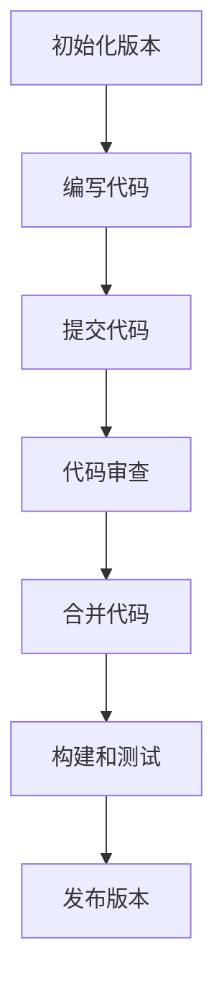
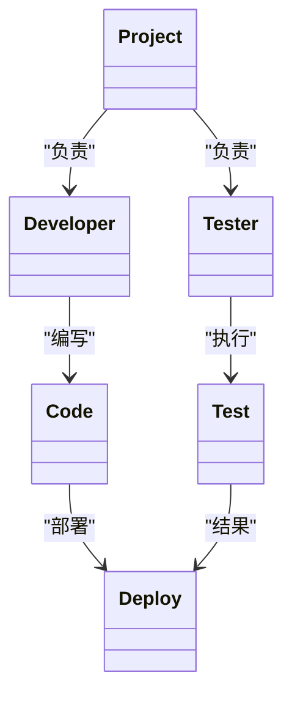
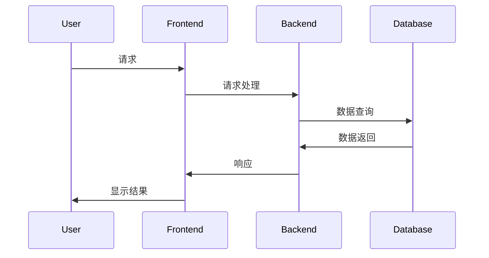
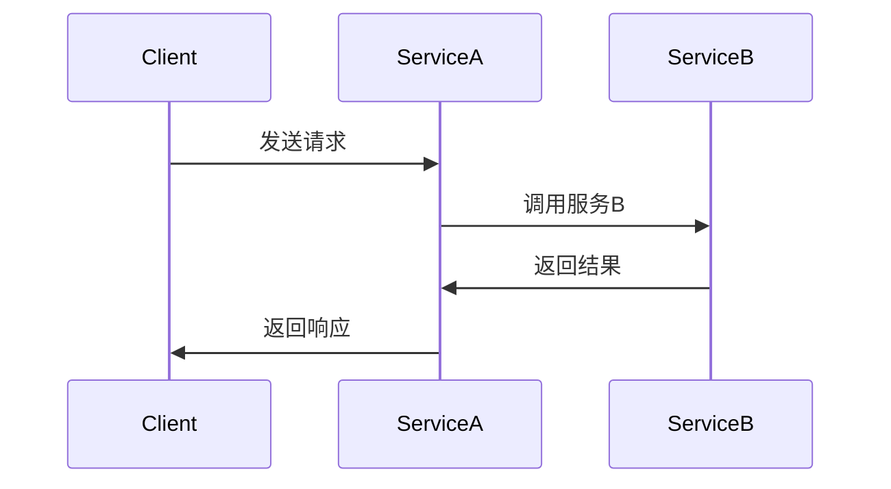

                 

# 软件发布管理：从开发到生产的流程优化

关键词：软件发布管理、流程优化、持续集成、持续部署、版本控制、系统架构设计

摘要：本文深入探讨了软件发布管理的过程和优化策略。从开发到生产，软件发布管理的每个阶段都面临独特的挑战。本文将一步步分析这些挑战，提出优化建议，并通过具体案例和实践总结，提供全面的解决方案。

## 目录大纲：《软件发布管理：从开发到生产的流程优化》

1. 第一部分：背景介绍
   1.1 软件发布管理的核心概念
   1.2 问题描述
   1.3 问题解决
   1.4 边界与外延
   1.5 概念结构与核心要素

2. 第二部分：核心概念与联系
   2.1 开发流程与发布流程的关系
   2.2 概念属性特征对比
   2.3 ER实体关系图架构

3. 第三部分：算法原理讲解
   3.1 版本控制算法
   3.2 算法原理
   3.3 数学模型与公式
   3.4 举例说明

4. 第四部分：系统分析与架构设计方案
   4.1 系统功能设计
   4.2 系统架构设计
   4.3 系统接口设计与交互

5. 第五部分：项目实战
   5.1 环境安装与配置
   5.2 系统核心实现源代码
   5.3 实际案例分析与详细讲解
   5.4 项目小结

6. 第六部分：最佳实践与拓展
   6.1 最佳实践 tips
   6.2 小结
   6.3 注意事项与拓展阅读

## 第一部分：背景介绍

### 1.1 软件发布管理的核心概念

软件发布管理是一个涉及多个环节的复杂过程，包括从开发到测试、部署和最终用户交付的整个过程。其核心概念包括：

- **项目管理**：确保项目按时、按预算完成。
- **质量控制**：确保软件产品符合既定的质量标准。
- **配置管理**：跟踪和管理软件的变更和配置项。
- **版本控制**：管理源代码的版本，确保团队协作的有效性。

这些概念共同作用，确保软件发布过程高效、可靠。

### 1.2 问题描述

在现代软件开发中，软件发布管理面临以下常见障碍：

- **项目延期**：由于缺乏有效的项目管理，项目可能延期。
- **质量问题**：未经充分测试的软件可能导致质量问题。
- **部署失败**：部署过程可能出现意外问题，导致发布失败。

这些问题不仅影响项目的进度，还可能导致客户不满意和品牌受损。

### 1.3 问题解决

为了优化软件发布管理，我们需要遵循以下关键原则：

- **自动化**：通过自动化工具提高发布过程的效率。
- **标准化**：制定标准化的流程和规范，减少错误和重复工作。
- **透明化**：确保发布过程透明，便于监控和管理。
- **反馈机制**：建立反馈机制，及时调整和改进发布过程。

### 1.4 边界与外延

软件发布管理不仅涉及技术层面，还包括跨组织的协作与沟通。例如，与客户的交互、需求收集、项目评审等环节都需要有效的管理。

### 1.5 概念结构与核心要素

软件发布管理涉及多个核心要素，包括项目管理、质量控制、配置管理和版本控制。这些要素相互作用，共同确保软件发布过程的高效和可靠性。

## 第二部分：核心概念与联系

### 2.1 开发流程与发布流程的关系

软件开发流程包括需求分析、设计、编码、测试和部署等阶段。发布流程则是将软件产品交付给用户的过程，包括发布前测试、部署和用户反馈等步骤。两者紧密相关，开发流程的质量直接影响发布流程的效率和效果。

### 2.2 概念属性特征对比

不同的发布模型，如持续集成、持续部署和蓝绿部署，具有各自的特点和应用场景。例如，持续集成强调代码的持续集成和测试，持续部署强调自动化的部署过程，蓝绿部署则提供了一种无中断的升级方式。

### 2.3 ER实体关系图架构

使用Mermaid绘制实体关系图，可以清晰地展示软件发布管理中的实体及其关系。例如，实体包括项目经理、开发人员、测试人员、运维人员等，它们之间的关系包括任务分配、进度跟踪、质量评估等。

```mermaid
erDiagram
    Project --> Developer : "负责"
    Project --> Tester : "负责"
    Developer --> Code : "编写"
    Tester --> Test : "执行"
    Code --> Deploy : "部署"
    Test --> Deploy : "结果"
```

## 第三部分：算法原理讲解

### 3.1 版本控制算法

版本控制算法是软件发布管理的关键组成部分。使用Mermaid绘制版本控制算法流程图，可以清晰地展示版本管理的过程。



### 3.2 算法原理

版本控制的基本原理是跟踪和管理源代码的版本。常见的版本控制系统包括Git和SVN。Git是一种分布式版本控制系统，强调分支管理和快速合并。SVN是一种集中式版本控制系统，适用于小型团队和简单项目。

### 3.3 数学模型与公式

版本控制的数学模型包括版本号和变更日志。版本号通常采用语义版本控制（SemVer），包括主版本号、次版本号和修订号。变更日志记录每个版本的更改内容。

$$
\text{版本号} = \text{主版本号}.\text{次版本号}.\text{修订号}
$$

### 3.4 举例说明

假设我们有一个项目，初始版本为1.0.0。在开发过程中，我们添加了新功能并修复了几个bug，版本号更新为1.1.1。之后，我们又进行了多个迭代，版本号依次更新为1.2.0和1.3.0。每个版本都包含了具体的变更日志，方便团队了解和管理代码的变化。

## 第四部分：系统分析与架构设计方案

### 4.1 系统功能设计

系统功能设计包括需求分析、设计、编码、测试、部署和监控等模块。使用Mermaid绘制领域模型类图，可以清晰地展示系统的功能模块和关系。



### 4.2 系统架构设计

系统架构设计包括前端、后端、数据库和部署环境等组成部分。使用Mermaid绘制系统架构图，可以清晰地展示系统的整体架构和各部分的功能与交互。



### 4.3 系统接口设计与交互

系统接口设计包括API接口和消息队列等。API接口负责外部系统的交互，消息队列负责系统内部的数据传输。使用Mermaid绘制系统交互序列图，可以清晰地展示系统的交互过程。



## 第五部分：项目实战

### 5.1 环境安装与配置

环境安装与配置是软件发布管理的重要环节。根据项目需求，选择合适的操作系统、开发环境和工具。安装步骤包括：

1. 安装操作系统（如Linux或Windows）。
2. 安装必要的开发工具（如IDE、编译器等）。
3. 配置环境变量和依赖库。

配置管理是确保环境一致性和管理配置项的重要手段。使用版本控制系统（如Git）管理配置文件，确保每次发布时环境的一致性。

### 5.2 系统核心实现源代码

系统核心实现源代码是软件发布管理的核心。根据项目需求，实现关键模块的代码。以下是一个简单的示例：

```python
class Calculator:
    def add(self, a, b):
        return a + b

    def subtract(self, a, b):
        return a - b

    def multiply(self, a, b):
        return a * b

    def divide(self, a, b):
        return a / b
```

代码分析与解读如下：

1. **类定义**：定义了一个名为`Calculator`的类，包含四个方法：`add`、`subtract`、`multiply`和`divide`。
2. **方法实现**：每个方法实现了对应的数学运算。
3. **代码规范**：遵循PEP 8编程规范，确保代码的可读性和可维护性。

### 5.3 实际案例分析与详细讲解

选择一个具有代表性的实际案例，分析其软件发布过程和优化方案。以下是一个简化的案例：

1. **问题背景**：一个在线购物平台需要在两周内进行一次功能升级。
2. **问题分析**：功能升级涉及多个模块，包括订单处理、库存管理和支付系统。升级过程中，需要确保系统的稳定性和可用性。
3. **解决方案**：采用持续集成和持续部署（CI/CD）策略，确保每个模块的自动化测试和部署。同时，采用蓝绿部署策略，确保升级过程中的零中断。

详细讲解如下：

1. **持续集成**：每次提交代码后，自动执行单元测试和集成测试，确保代码质量。
2. **持续部署**：测试通过后，自动部署到生产环境，减少人工干预。
3. **蓝绿部署**：将生产环境的一部分流量切换到新版本，观察新版本的表现。如果发现问题，可以快速回滚到旧版本。

## 第六部分：最佳实践与拓展

### 6.1 最佳实践 tips

1. **自动化测试**：确保每次发布前都进行自动化测试，减少手动测试的工作量。
2. **文档管理**：及时更新项目文档，包括设计文档、用户手册和操作手册。
3. **版本控制**：使用版本控制系统管理代码和配置文件，确保版本的一致性。
4. **监控与反馈**：建立监控系统，及时发现问题并进行反馈。

### 6.2 小结

本文从开发到生产，详细探讨了软件发布管理的核心概念、算法原理、系统设计和项目实战。通过最佳实践和案例解析，提供了优化软件发布管理的有效策略。

### 6.3 注意事项与拓展阅读

1. **注意事项**：在软件发布过程中，注意版本控制和配置管理，确保环境的一致性。
2. **拓展阅读**：进一步学习持续集成、持续部署和蓝绿部署等高级发布策略，提高发布效率。

## 参考文献

1. Martin, Robert C. 《Clean Code: A Handbook of Agile Software Craftsmanship》.
2. Fowler, Martin. 《Continuous Integration: Elaborating the Agile Practice of Continuously Integrating and Deploying Software》.
3. Beck, Kent. 《Test-Driven Development: By Example》.

### 作者信息

作者：AI天才研究院/AI Genius Institute & 禅与计算机程序设计艺术 /Zen And The Art of Computer Programming

