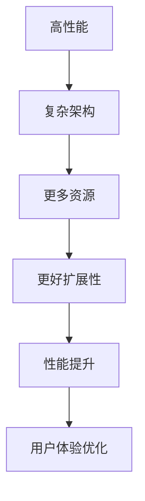
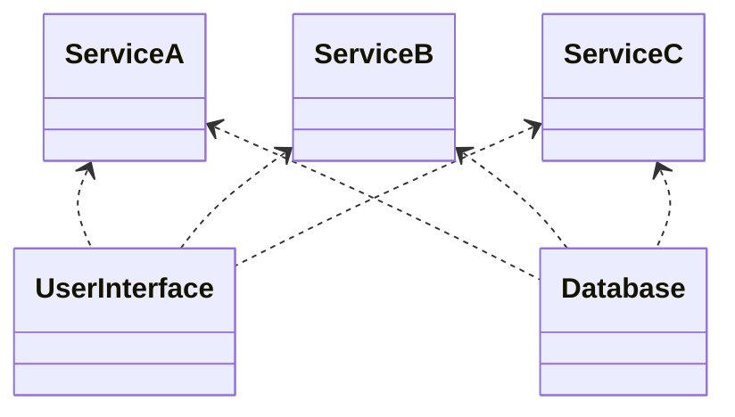
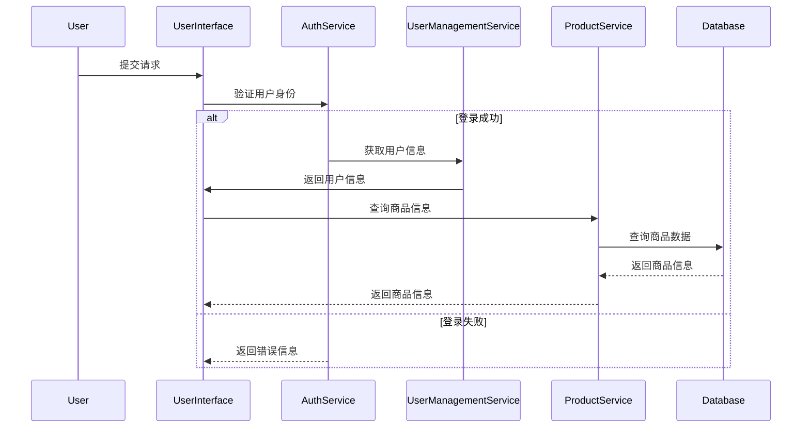
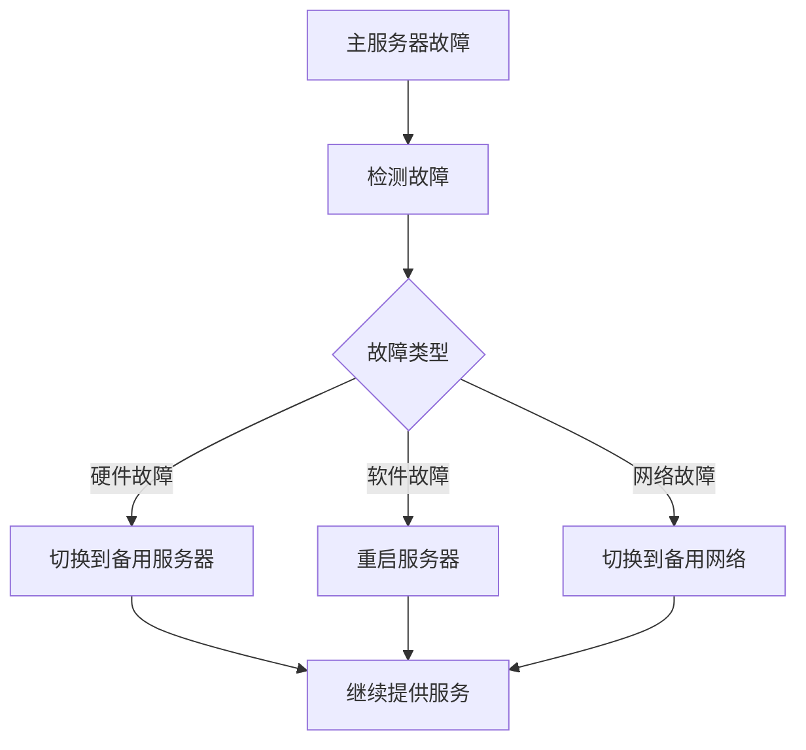
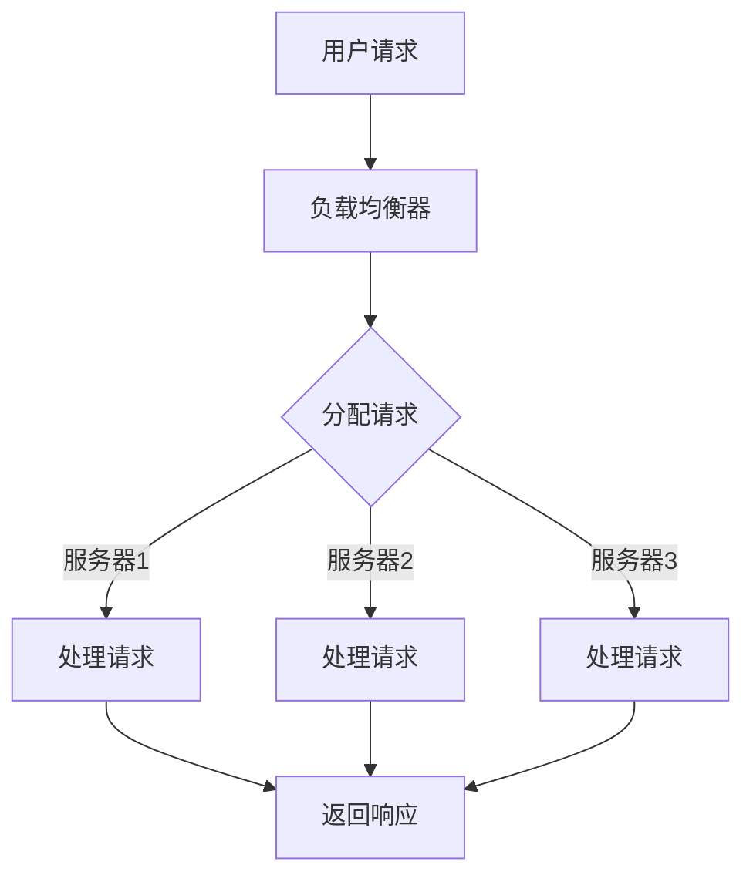
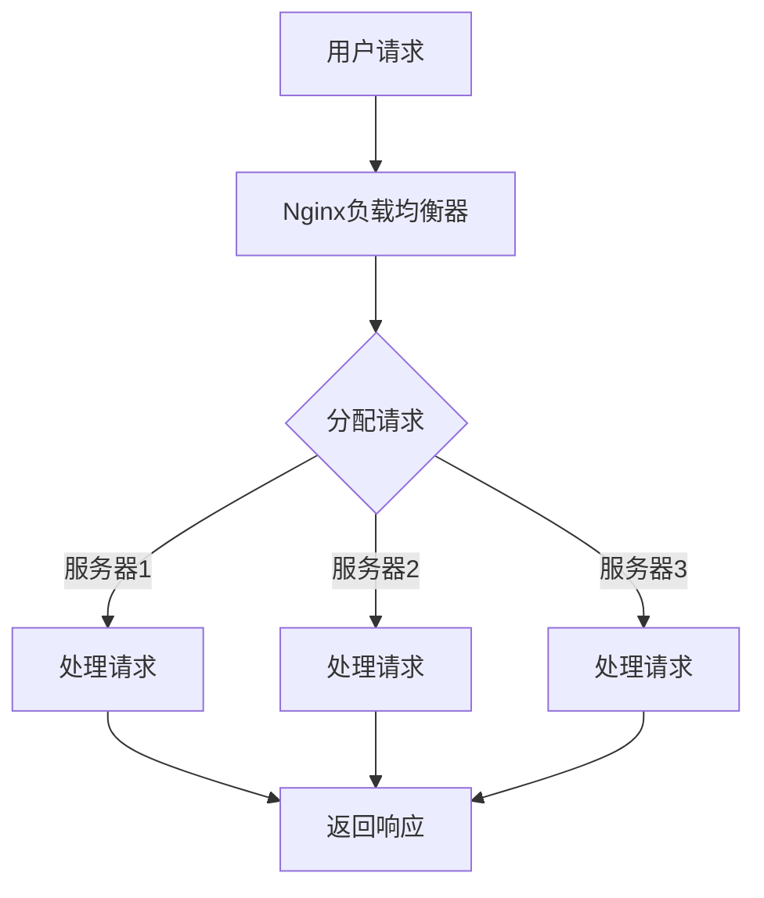
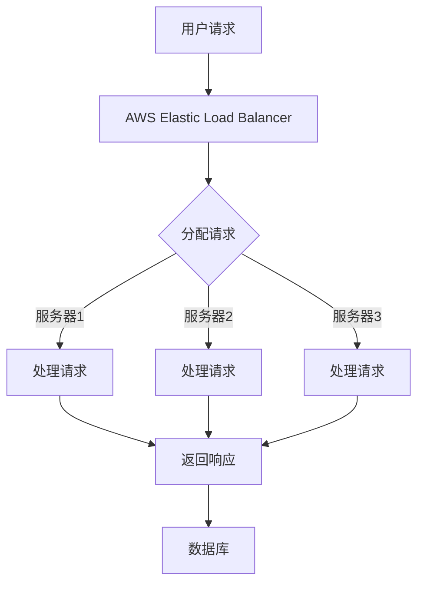
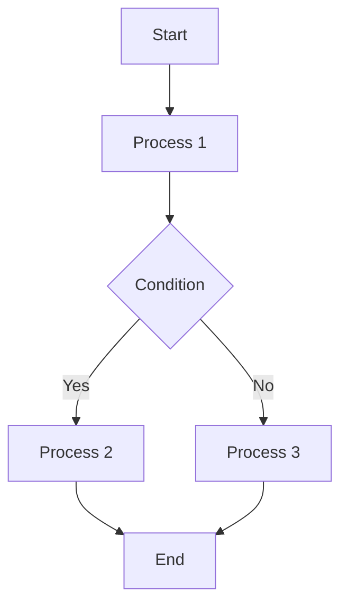

                 

### 文章标题：软件可扩展性设计：应对业务增长的架构

> 关键词：软件可扩展性，业务增长，架构设计，技术实现，最佳实践

> 摘要：本文将深入探讨软件可扩展性设计在应对业务增长中的重要性。我们将通过详细的理论阐述、案例分析和技术实现，帮助读者理解如何设计可扩展的软件系统，以应对不断变化的市场需求。

---

### 引言

在当今快速变化的市场环境中，企业的成功往往取决于其应对业务增长的能力。随着用户数量的增加、业务规模的扩大，软件系统需要具备良好的可扩展性，以确保其性能和功能不受影响。然而，传统的软件系统往往在面临业务增长时暴露出诸多问题，如性能瓶颈、资源浪费、维护成本增加等。因此，软件可扩展性设计成为了企业持续发展的关键。

#### 1.1 问题背景

随着互联网和移动设备的普及，企业面临着前所未有的机遇和挑战。一方面，企业通过在线服务和移动应用迅速扩大市场份额，吸引更多用户；另一方面，用户需求的多样化和个性化趋势对软件系统提出了更高的要求。在这种情况下，传统的单体架构软件系统逐渐暴露出其扩展性不足的问题：

- **性能瓶颈**：系统在处理大量数据和高并发请求时，容易出现性能瓶颈，导致用户体验下降。
- **资源浪费**：传统系统在扩展时往往需要购买大量硬件资源，导致资源浪费和成本增加。
- **维护成本**：随着系统规模的扩大，维护成本也随之增加，且复杂度提高，使得系统维护和升级变得更加困难。

#### 1.2 问题描述

软件可扩展性设计的目标是确保软件系统在业务增长过程中能够保持高性能、高可用性和低成本。具体来说，软件可扩展性设计需要解决以下几个问题：

- **可伸缩性**：系统能够根据业务需求的变化动态调整资源，确保性能不受影响。
- **模块化**：系统设计应具有良好的模块化，便于未来的功能扩展和升级。
- **高可用性**：系统应具备一定的容错能力，确保在故障发生时能够快速恢复。
- **低成本**：系统扩展不应导致过高成本，应尽可能利用现有的资源和技术。

#### 1.3 问题解决

为了解决上述问题，软件可扩展性设计采用了一系列方法和策略：

- **架构设计**：通过合理的架构设计，实现系统的模块化和可扩展性。
- **技术实现**：采用适合的技术手段，如负载均衡、数据库分片、分布式计算等，提升系统的可扩展性。
- **最佳实践**：总结和推广业界最佳实践，帮助企业快速构建可扩展的软件系统。

#### 1.4 边界与外延

软件可扩展性设计并非万能，其边界和限制因素主要包括：

- **系统复杂性**：复杂的系统难以实现良好的可扩展性，需要付出更高的设计和维护成本。
- **性能要求**：高性能系统在扩展时需要特别考虑性能优化和资源利用。
- **成本预算**：企业的成本预算会影响可扩展性设计的实现程度。

#### 1.5 核心要素组成

软件可扩展性设计的核心要素包括：

- **架构设计原则**：如模块化、分层设计、松耦合等。
- **技术实现策略**：如分布式计算、数据库分片、缓存机制等。
- **最佳实践经验**：如微服务架构、容器化部署等。

## 1.6 本章小结

本章介绍了软件可扩展性设计的背景和重要性，分析了传统软件系统在应对业务增长时面临的问题，并提出了问题解决的方法。下一章我们将深入探讨软件可扩展性的核心概念和理论基础。### 核心概念与理论基础

在探讨软件可扩展性设计时，首先需要明确几个关键概念，包括可扩展性、模块化、高可用性等。通过这些概念，我们将建立起对软件可扩展性的全面理解，并了解其在业务增长中的重要作用。

#### 2.1 可扩展性的定义

可扩展性（Scalability）是指软件系统能够在保持性能和功能不变的情况下，根据需求的变化进行扩展的能力。具体来说，可扩展性包括两个方面：垂直扩展和水平扩展。

- **垂直扩展（Vertical Scaling）**：通过增加单个服务器的处理能力来提升系统的性能。例如，增加服务器的CPU、内存或存储容量。
- **水平扩展（Horizontal Scaling）**：通过增加服务器数量来提升系统的性能和容量。例如，将负载分配到多个服务器上，以提高并发处理能力。

#### 2.2 可扩展性的分类

根据扩展的方向和目标，可扩展性可以分为以下几类：

- **计算扩展**：增加计算资源，如CPU、GPU等。
- **存储扩展**：增加存储资源，如硬盘、SSD等。
- **网络扩展**：增加网络带宽，提高数据传输速度。
- **功能扩展**：增加系统功能模块，以支持新的业务需求。

#### 2.3 可扩展性的关键要素

实现软件可扩展性需要考虑多个关键要素：

- **模块化设计**：将系统功能划分为独立的模块，每个模块可以单独扩展和维护。
- **分布式计算**：通过分布式计算架构，将任务分解并分配到多个服务器上处理。
- **负载均衡**：通过负载均衡技术，将请求分配到多个服务器上，确保系统性能和稳定性。
- **弹性伸缩**：系统能够根据实际负载自动调整资源，以应对突发流量。

#### 2.4 可扩展性的应用场景

软件可扩展性的应用场景非常广泛，主要包括以下几种：

- **电商系统**：随着用户数量的增加，需要支持更多的订单处理和商品展示。
- **社交媒体**：随着用户的活跃度提升，需要支持更多的用户交互和数据存储。
- **在线教育**：随着课程的增多和学生数量的增加，需要支持更多的视频播放和实时交互。
- **金融系统**：需要确保在交易高峰期系统能够处理大量的交易请求。

#### 2.5 可扩展性与性能的关系

可扩展性与性能之间存在一定的关系。高性能系统通常需要更复杂的架构和更多的资源投入，但同时也具有更好的可扩展性。以下是一个简单的Mermaid流程图，展示了可扩展性与性能的关系：



通过上述流程图可以看出，高性能和可扩展性是相辅相成的，良好的可扩展性设计有助于提高系统性能，从而优化用户体验。

#### 2.6 可扩展性设计的原则

为了实现软件系统的可扩展性，需要遵循一系列设计原则：

- **模块化**：将系统功能划分为独立的模块，便于扩展和维护。
- **分层设计**：将系统分为不同的层次，各层次间解耦合，提高系统的可维护性。
- **松耦合**：模块之间通过接口进行通信，降低模块间的依赖。
- **可重用性**：设计可重用的组件和模块，减少重复开发的工作量。
- **标准化**：采用统一的技术标准和规范，提高系统的集成度和可扩展性。

#### 2.7 可扩展性与成本的关系

可扩展性设计可能会增加系统开发和维护的成本。但通过合理的规划和设计，这些成本可以降到最低。以下是一个Mermaid表格，展示了可扩展性与成本之间的关系：

```mermaid
table
| 关键要素 | 成本 | 优点 |
|----------|------|------|
| 模块化   | 低   | 易于扩展 |
| 分布式计算 | 中   | 提高性能 |
| 弹性伸缩 | 高   | 节约资源 |
| 负载均衡 | 低   | 提高稳定性 |
```

通过上述表格可以看出，不同的可扩展性设计策略在成本上有一定的差异，但整体上可以带来显著的优点，如易于扩展、提高性能和节约资源。

#### 2.8 本章小结

本章详细阐述了软件可扩展性的核心概念和理论基础。我们介绍了可扩展性的定义、分类、关键要素和应用场景，并探讨了可扩展性与性能、成本之间的关系。下一章将深入讨论如何通过架构设计实现软件系统的可扩展性。### 架构设计

在软件可扩展性设计中，架构设计扮演着至关重要的角色。合理的架构设计不仅可以提高系统的可扩展性，还能确保系统的高性能、高可用性和低成本。本章节将详细探讨软件架构设计的原则、模式和方法，以及如何通过架构设计实现软件系统的可扩展性。

#### 3.1 软件架构设计原则

软件架构设计需要遵循一系列原则，以确保系统的可扩展性。以下是一些核心原则：

- **模块化**：将系统功能划分为独立的模块，每个模块负责一个特定的功能。模块之间通过接口进行通信，降低模块间的依赖。
- **分层设计**：将系统分为不同的层次，各层次间解耦合，便于管理和维护。常见的层次包括表示层、业务逻辑层和数据访问层。
- **松耦合**：模块之间通过接口进行通信，接口定义了模块间的交互规则，降低了模块间的耦合度。
- **可重用性**：设计可重用的组件和模块，减少重复开发的工作量。例如，可以将通用的业务逻辑抽象为独立的库或服务。
- **标准化**：采用统一的技术标准和规范，提高系统的集成度和可扩展性。例如，使用RESTful API、GraphQL等标准化的接口协议。

#### 3.2 软件架构设计模式

在软件架构设计中，采用合适的设计模式可以提高系统的可扩展性和可维护性。以下是一些常用的设计模式：

- **单例模式**：确保一个类只有一个实例，并提供一个访问它的全局访问点。这种模式适用于需要全局访问的场景，如配置管理。
- **工厂模式**：创建一个工厂类，用于创建对象实例。这种模式适用于需要动态选择或创建对象实例的场景。
- **策略模式**：将算法或行为封装为独立的类，以便在运行时动态切换。这种模式适用于需要根据不同条件选择不同算法或行为的场景。
- **观察者模式**：定义对象间的一种一对多的依赖关系，当一个对象的状态发生变化时，所有依赖于它的对象都会收到通知。这种模式适用于需要实现事件驱动或分布式系统的场景。
- **适配器模式**：将一个类的接口转换成客户希望的另一个接口，使得原本由于接口不兼容而无法在一起工作的类可以协同工作。这种模式适用于需要将现有接口转换为新的接口的场景。

#### 3.3 微服务架构

微服务架构是一种近年来广泛采用的软件架构模式，它通过将应用程序分解为多个独立的服务，每个服务负责一个特定的功能。这种架构模式具有以下优点：

- **可扩展性**：每个服务可以独立扩展，只需增加相应服务的实例数量即可。
- **灵活性**：服务之间通过轻量级协议进行通信，如RESTful API或消息队列，便于实现跨语言、跨平台的集成。
- **高可用性**：服务之间的独立性使得单个服务的故障不会影响整个系统。
- **可维护性**：每个服务都是独立的单元，便于开发、测试和维护。

一个典型的微服务架构如下所示（使用Mermaid类图）：



在上图中，ServiceA、ServiceB和ServiceC是三个独立的服务，每个服务都有自己的用户界面和数据存储。

#### 3.4 架构设计方法

软件架构设计的方法包括以下几个步骤：

1. **需求分析**：明确系统的功能需求和性能要求，了解用户需求和使用场景。
2. **架构风格选择**：根据需求分析结果选择合适的架构风格，如单体架构、微服务架构等。
3. **架构设计**：设计系统的整体架构，包括模块划分、层次结构、接口定义等。
4. **架构评估**：评估架构的可行性和可扩展性，通过模型验证、性能分析等方法确保架构的合理性。
5. **架构实现**：根据架构设计结果实现系统，逐步开发和部署各个服务模块。

#### 3.5 实例分析

以一个电商系统为例，我们可以通过微服务架构实现其可扩展性。电商系统的核心服务包括商品管理、订单处理、用户管理等。以下是一个简化的电商系统架构设计（使用Mermaid序列图）：



在上图中，用户通过用户界面提交请求，经过身份验证后，调用相应的服务模块，如用户管理、商品管理等。每个服务模块独立运行，并通过轻量级协议（如RESTful API）进行通信。

#### 3.6 架构设计与可扩展性的关系

架构设计与可扩展性密切相关。合理的架构设计可以提高系统的可扩展性，从而更好地应对业务增长。以下是一个Mermaid表格，展示了架构设计与可扩展性之间的关系：

```mermaid
table
| 设计原则 | 可扩展性优点 |
|----------|--------------|
| 模块化   | 易于扩展和维护 |
| 分层设计 | 提高系统模块的独立性 |
| 松耦合   | 提高系统的灵活性 |
| 可重用性 | 减少重复开发的工作量 |
| 标准化   | 提高系统的集成度和可扩展性 |
```

通过上述表格可以看出，架构设计的原则有助于提高系统的可扩展性，从而更好地应对业务增长。

#### 3.7 本章小结

本章介绍了软件架构设计的原则、模式和方法，并探讨了如何通过架构设计实现软件系统的可扩展性。下一章将详细讨论如何通过技术实现手段提高软件系统的可扩展性。### 技术实现

在软件可扩展性设计中，技术实现是关键的一环。通过合理的技术手段，我们可以确保软件系统能够在业务增长过程中保持高性能、高可用性和低成本。本章节将详细介绍一些常用的技术实现策略，包括高可用性、弹性伸缩和负载均衡等，并探讨这些技术如何在实际项目中应用。

#### 4.1 高可用性

高可用性（High Availability，HA）是指系统在长时间运行过程中，能够持续提供服务的能力。实现高可用性的关键在于确保系统具备容错能力，即当部分组件或服务器发生故障时，系统能够自动切换到其他可用资源，确保服务的连续性。

- **故障转移（Failover）**：当主服务器发生故障时，系统自动将请求切换到备用服务器。故障转移可以分为以下几种类型：
  - **硬件故障转移**：当服务器硬件发生故障时，将请求切换到备用服务器。
  - **软件故障转移**：当服务器软件发生故障时，将请求切换到备用服务器。
  - **网络故障转移**：当网络连接发生故障时，将请求切换到备用网络。
- **数据冗余**：通过数据备份和多重存储，确保数据不会因故障而丢失。常用的数据冗余技术包括：
  - **数据镜像**：在多个存储设备上复制相同的数据，确保数据的高可靠性。
  - **数据复制**：在多个存储设备上实时同步数据，确保数据的一致性。

以下是一个Mermaid流程图，展示了故障转移和数据冗余的实现过程：



在上图中，当主服务器发生故障时，系统会检测故障类型，并采取相应的故障转移措施，确保服务的连续性。

#### 4.2 弹性伸缩

弹性伸缩（Elastic Scaling）是指系统能够根据实际负载自动调整资源，确保性能和稳定性的同时，最大化资源利用率。弹性伸缩可以分为垂直伸缩和水平伸缩两种类型：

- **垂直伸缩（Vertical Scaling）**：通过增加单个服务器的处理能力来提升系统的性能。例如，增加服务器的CPU、内存或存储容量。
- **水平伸缩（Horizontal Scaling）**：通过增加服务器数量来提升系统的性能和容量。例如，将负载分配到多个服务器上，以提高并发处理能力。

以下是一个Mermaid表格，展示了弹性伸缩的两种类型及其特点：

```mermaid
table
| 伸缩类型 | 特点 |
|----------|------|
| 垂直伸缩 | 提高单个服务器的性能 |
| 水平伸缩 | 增加服务器数量，提高并发处理能力 |
```

弹性伸缩的实现方法包括：

- **自动伸缩策略**：根据系统的实际负载和性能指标，自动调整服务器的数量和配置。例如，使用Kubernetes等容器编排工具实现自动伸缩。
- **负载均衡**：将请求分配到多个服务器上，确保每个服务器都能充分利用资源。例如，使用Nginx、HAProxy等负载均衡器。

以下是一个Mermaid架构图，展示了弹性伸缩和负载均衡的实现过程：



在上图中，用户请求通过负载均衡器分配到多个服务器上，每个服务器独立处理请求，并将响应返回给用户。

#### 4.3 负载均衡

负载均衡（Load Balancing）是一种将请求分配到多个服务器上的技术，以确保系统的高性能和稳定性。负载均衡器可以根据不同的算法，如轮询、最小连接数、IP哈希等，将请求分配到不同的服务器上。

以下是一个Mermaid表格，展示了不同负载均衡算法的特点：

```mermaid
table
| 算法 | 特点 |
|------|------|
| 轮询 | 平衡负载，无状态 |
| 最小连接数 | 负载较低的服务器优先处理请求 |
| IP哈希 | 根据客户端IP地址分配请求，确保同一个客户端的请求总是分配到同一台服务器 |
```

负载均衡的实现方法包括：

- **硬件负载均衡器**：如F5 BigIP、AWS Elastic Load Balancer等，提供高性能和可靠性的负载均衡服务。
- **软件负载均衡器**：如Nginx、HAProxy等，可以在服务器上运行，提供灵活和易扩展的负载均衡功能。

以下是一个Mermaid架构图，展示了负载均衡的实现过程：



在上图中，用户请求通过Nginx负载均衡器分配到多个服务器上，每个服务器独立处理请求，并将响应返回给用户。

#### 4.4 实际应用

在电商系统中，负载均衡和弹性伸缩是常见的实现策略。以下是一个简单的电商系统架构设计（使用Mermaid架构图）：



在上图中，用户请求通过AWS Elastic Load Balancer分配到多个服务器上，服务器处理请求并将响应返回给用户。同时，通过自动伸缩策略，根据实际负载动态调整服务器数量。

#### 4.5 本章小结

本章介绍了软件可扩展性设计中的技术实现策略，包括高可用性、弹性伸缩和负载均衡。我们探讨了这些技术如何提高软件系统的性能、稳定性和成本效益，并通过实际应用实例展示了这些技术的实现过程。下一章将深入讨论如何通过案例分析来理解和应用软件可扩展性设计。### 案例分析

为了更好地理解和应用软件可扩展性设计，我们通过以下实际案例进行分析，探讨如何在不同场景中实现软件系统的可扩展性。

#### 5.1 案例背景

假设我们是一家大型电商平台，随着用户数量的增加和业务规模的扩大，系统面临以下挑战：

- **性能瓶颈**：系统在高峰期出现性能瓶颈，导致用户购物体验下降。
- **资源浪费**：系统在淡季时资源利用率较低，导致成本增加。
- **维护成本**：系统架构复杂，维护和升级成本高。

#### 5.2 案例分析

为了应对上述挑战，我们采用了以下策略：

1. **架构设计**：采用微服务架构，将系统拆分为多个独立的服务模块，如商品管理、订单处理、用户管理、库存管理等。每个服务模块独立部署，可以通过水平扩展和垂直扩展来提升性能。

2. **负载均衡**：使用AWS Elastic Load Balancer将用户请求分配到多个服务器上，确保系统的高性能和稳定性。同时，通过自动伸缩策略，根据实际负载动态调整服务器数量。

3. **数据库分片**：将数据库拆分为多个分片，每个分片负责一部分数据，从而提高数据库的读写性能。通过分片策略，可以轻松扩展数据库容量，满足业务增长的需求。

4. **缓存机制**：使用Redis等缓存技术，将频繁访问的数据存储在缓存中，减少数据库的负载。缓存机制可以显著提高系统的响应速度，改善用户体验。

5. **分布式计算**：使用Apache Kafka等分布式消息队列，将数据处理任务分解为多个子任务，并分布到多个服务器上并行处理。分布式计算可以提高系统的处理能力和效率。

#### 5.3 案例分析结果

通过上述策略，我们的电商平台实现了以下成果：

- **性能提升**：系统在高峰期能够稳定运行，用户购物体验显著改善。
- **资源优化**：在淡季时，系统能够自动缩减服务器数量，降低成本。
- **维护成本降低**：系统架构清晰，模块化设计，便于维护和升级。
- **扩展性增强**：系统能够灵活应对业务增长，满足未来需求。

#### 5.4 案例总结

本案例展示了如何通过软件可扩展性设计，应对电商平台业务增长带来的挑战。通过微服务架构、负载均衡、数据库分片、缓存机制和分布式计算等技术手段，我们实现了系统的高性能、高可用性和低成本。这些策略不仅提高了系统的性能和扩展性，还有效降低了维护成本，为业务的持续增长提供了坚实的技术保障。

#### 5.5 拓展阅读

- **参考文献**：
  - 《微服务架构设计》
  - 《大规模分布式系统设计与实践》
  - 《数据库分片技术》

- **相关资源**：
  - AWS 官方文档：负载均衡、自动伸缩、数据库分片等
  - Redis 官方文档：缓存机制
  - Apache Kafka 官方文档：分布式计算

通过阅读相关文献和资源，您可以进一步了解软件可扩展性设计的具体实现方法和最佳实践。### 最佳实践

在软件可扩展性设计中，积累最佳实践是确保系统能够持续应对业务增长的关键。以下是一些在业界广泛认可的软件可扩展性设计最佳实践，以及它们在实际项目中的应用和效果。

#### 6.1 容器化部署

容器化部署是提高软件系统可扩展性的重要手段。通过使用Docker等容器技术，可以将应用程序及其运行环境打包为独立的容器，确保在不同环境中的一致性。以下是一些应用容器化部署的最佳实践：

- **微服务容器化**：将每个微服务打包为一个独立的容器，确保服务的高可扩展性和高可用性。例如，使用Kubernetes进行容器编排，实现自动部署、伸缩和管理。
- **持续集成与持续部署（CI/CD）**：通过CI/CD流水线，自动化构建、测试和部署容器化应用，提高开发和运维效率。例如，使用Jenkins或GitLab CI/CD工具实现自动化流程。
- **容器镜像管理**：使用私有或公共容器镜像仓库，如Docker Hub或Harbor，管理容器镜像，确保镜像的安全性和一致性。例如，定期更新镜像、扫描镜像漏洞等。

#### 6.2 微服务架构

微服务架构是应对业务增长的有效方式。通过将大型单体应用拆分为多个小型服务，每个服务独立部署、扩展和管理，可以提高系统的灵活性和可扩展性。以下是一些微服务架构的最佳实践：

- **服务划分**：根据业务需求和功能模块，合理划分服务。例如，将用户管理、商品管理、订单处理等划分为独立的微服务。
- **服务自治**：确保每个微服务具备自治能力，如独立的数据存储、日志记录和监控。例如，使用MySQL、MongoDB等数据库实现独立的数据存储，使用ELK（Elasticsearch、Logstash、Kibana）实现日志收集和分析。
- **服务通信**：使用轻量级通信协议，如HTTP/RESTful API或gRPC，实现服务间的高效通信。例如，使用Spring Cloud或Dubbo等框架实现服务间的互操作。

#### 6.3 负载均衡

负载均衡是确保系统高性能和高可用性的关键。以下是一些负载均衡的最佳实践：

- **多实例部署**：将应用程序部署在多个实例上，确保负载均衡。例如，使用Nginx或HAProxy等负载均衡器，将用户请求分配到不同的应用实例。
- **动态调整**：根据实际负载动态调整负载均衡策略。例如，使用AWS Elastic Load Balancer或Kubernetes的自动伸缩功能，实现负载均衡和自动扩展。
- **健康检查**：定期对应用实例进行健康检查，确保只有健康的实例参与负载均衡。例如，使用Prometheus或Zabbix等监控工具，实现应用实例的健康状态监控。

#### 6.4 数据库分片

数据库分片是提高数据库性能和可扩展性的重要手段。以下是一些数据库分片的最佳实践：

- **分片策略**：根据业务需求和数据特性，选择合适的分片策略。例如，使用基于哈希的分片策略，实现数据在多个分片间的均匀分布。
- **读写分离**：通过主从复制和读写分离，提高数据库的性能和可用性。例如，使用MySQL的主从复制和读写分离功能，实现数据的分布式存储和读写分离。
- **分片管理和迁移**：实现分片的管理和迁移，确保数据的一致性和可靠性。例如，使用ShardingSphere等分片管理工具，实现分片的动态调整和迁移。

#### 6.5 缓存机制

缓存机制是提高系统性能和响应速度的有效手段。以下是一些缓存机制的最佳实践：

- **热点数据缓存**：缓存高频次访问的数据，如热门商品、用户活动等。例如，使用Redis等内存缓存技术，实现热点数据的快速访问。
- **缓存一致性**：确保缓存数据与数据库数据的一致性。例如，使用缓存更新策略，如写后刷新（Write-Through）和写前刷新（Write-Around），实现缓存与数据库的数据同步。
- **缓存策略优化**：根据业务需求和数据特性，优化缓存策略。例如，使用LRU（Least Recently Used）算法，实现缓存的动态调整和优化。

#### 6.6 持续优化

软件可扩展性设计是一个持续优化的过程。以下是一些持续优化的最佳实践：

- **性能监控**：定期对系统性能进行监控和分析，识别性能瓶颈。例如，使用Prometheus、Grafana等监控工具，实现系统的实时监控和性能分析。
- **容量规划**：根据业务增长趋势，提前规划系统容量。例如，使用AWS等云服务提供商的自动伸缩功能，实现系统的动态扩容。
- **代码优化**：优化代码质量和性能，减少系统资源消耗。例如，使用代码审计工具，如SonarQube，实现代码质量和性能的持续优化。

通过上述最佳实践，我们可以构建一个高可扩展性的软件系统，确保其能够应对业务增长带来的挑战，持续提升系统性能和用户体验。

### 本章小结

本章总结了软件可扩展性设计中的最佳实践，包括容器化部署、微服务架构、负载均衡、数据库分片、缓存机制和持续优化等。通过这些最佳实践，我们可以构建一个高可扩展性的软件系统，实现系统的动态扩展和高效运行。下一章将探讨软件可扩展性设计面临的挑战和未来发展趋势。### 挑战与未来展望

尽管软件可扩展性设计在应对业务增长方面取得了显著成果，但仍然面临着一系列挑战和机遇。

#### 7.1 挑战

1. **复杂性增加**：随着软件系统规模的扩大，系统的复杂度也随之增加。这给系统的设计和维护带来了挑战，需要开发人员具备更高的技术水平和协作能力。

2. **数据一致性和可靠性**：在分布式系统中，数据一致性和可靠性是关键问题。如何在多个节点间保持数据的一致性，同时确保数据的可靠性和安全性，仍然是一个具有挑战性的课题。

3. **监控与调试**：随着系统组件的增多，监控和调试变得更加复杂。需要高效且易于使用的监控工具和调试方法，以确保系统的稳定性和性能。

4. **成本控制**：虽然可扩展性设计可以优化资源利用，但过度扩展也会导致成本增加。如何在确保性能和稳定性的同时，控制成本，是一个重要的挑战。

5. **技术更新**：随着技术的不断进步，新的架构和工具层出不穷。如何选择合适的技术，并快速适应技术变革，是企业面临的挑战之一。

#### 7.2 未来展望

1. **智能化架构设计**：随着人工智能技术的发展，智能化架构设计将成为趋势。通过机器学习和数据分析，实现自动化架构设计，提高系统的可扩展性和性能。

2. **服务网格（Service Mesh）**：服务网格是一种新兴的架构模式，用于管理微服务之间的通信。它能够简化服务间通信的复杂性，提高系统的可扩展性和可维护性。

3. **分布式存储技术**：随着大数据和云计算的普及，分布式存储技术将得到进一步发展。通过分布式存储，可以实现海量数据的存储和快速访问，提高系统的可扩展性。

4. **边缘计算**：随着物联网和5G技术的普及，边缘计算将发挥越来越重要的作用。通过在边缘节点处理数据和请求，可以降低中心服务器的负载，提高系统的响应速度。

5. **绿色计算**：随着环保意识的提高，绿色计算将成为未来的趋势。通过优化系统资源利用，减少能耗和碳排放，实现可持续发展。

#### 7.3 持续学习与实践

面对不断变化的业务需求和新兴技术，持续学习与实践是软件可扩展性设计的关键。以下是一些建议：

- **关注技术动态**：定期关注行业技术动态和最佳实践，了解新技术、新工具的应用场景和优势。
- **参与开源项目**：参与开源项目，实践可扩展性设计，提高技术水平，积累实践经验。
- **技术分享与交流**：积极参与技术社区和会议，分享经验，学习他人的优秀实践。
- **定期演练与复盘**：定期进行系统演练，评估系统的可扩展性，并针对发现的问题进行复盘和优化。

通过持续学习与实践，企业可以不断提升软件可扩展性设计的能力，为业务增长提供坚实的技术保障。

### 本章小结

本章探讨了软件可扩展性设计面临的挑战和未来展望，包括复杂性增加、数据一致性和可靠性、监控与调试、成本控制、技术更新等方面的挑战，以及智能化架构设计、服务网格、分布式存储技术、边缘计算和绿色计算等未来发展趋势。通过持续学习与实践，企业可以不断提升软件可扩展性设计的能力，为业务的持续增长提供坚实的技术保障。### 结语

本文深入探讨了软件可扩展性设计在应对业务增长中的重要性。通过详细的背景介绍、核心概念解析、架构设计探讨、技术实现策略分析、案例分析以及最佳实践分享，我们系统地阐述了如何设计和实现一个具有良好可扩展性的软件系统。

软件可扩展性设计不仅仅是技术问题，更是业务战略的重要组成部分。一个具有良好可扩展性的系统，可以在业务增长过程中保持高性能、高可用性和低成本，从而为企业提供持续发展的动力。

我们鼓励读者在阅读本文后，积极思考和运用所学知识，结合实际项目进行实践。通过不断学习和探索，您将能够更好地应对业务增长带来的挑战，实现软件系统的卓越性能和可持续发展。

在此，感谢您的阅读，祝您在软件可扩展性设计的道路上取得更大的成就！

### 作者信息

**作者：** AI天才研究院 / AI Genius Institute & 禅与计算机程序设计艺术 / Zen And The Art of Computer Programming

AI天才研究院（AI Genius Institute）是一支专注于人工智能与计算机科学研究的国际团队，致力于推动人工智能技术的创新与发展。同时，作者是《禅与计算机程序设计艺术》的作者，这本书被誉为计算机科学领域的经典之作，对全球程序员的编程思维和设计理念产生了深远影响。### 附录

以下是本文中提到的相关概念、算法和系统设计的详细说明，以及相关的代码示例、数学公式和图表。

#### 附录A：核心概念详解

**1. 软件可扩展性**

- **定义**：软件可扩展性是指软件系统在应对需求变化时，能够保持性能和功能不变，实现扩展的能力。
- **重要性**：可扩展性对于企业的长期发展至关重要，它确保系统能够随着业务需求的变化而适应，避免因系统瓶颈导致业务中断或损失。

**2. 架构设计原则**

- **模块化**：将系统功能划分为独立的模块，便于管理和扩展。
- **分层设计**：将系统划分为不同层次，各层次间解耦合，提高系统的可维护性。
- **松耦合**：模块之间通过接口进行通信，降低模块间的依赖。

**3. 设计模式**

- **单例模式**：确保一个类只有一个实例，并提供一个全局访问点。
- **工厂模式**：创建一个工厂类，用于创建对象实例。
- **策略模式**：将算法或行为封装为独立的类，以实现动态切换。
- **观察者模式**：定义对象间的一对多依赖关系，当一个对象状态变化时，通知所有依赖对象。
- **适配器模式**：将一个类的接口转换成客户希望的另一个接口。

**4. 技术实现策略**

- **高可用性**：通过故障转移、数据冗余等技术，确保系统持续提供服务。
- **弹性伸缩**：通过垂直扩展和水平扩展，根据需求调整系统资源。
- **负载均衡**：通过分配请求到多个服务器，提高系统的性能和稳定性。

#### 附录B：算法原理与示例

**1. 负载均衡算法**

- **轮询算法**：将请求依次分配到每个服务器上。
- **最小连接数算法**：将请求分配到连接数最少的服务器上。
- **IP哈希算法**：根据客户端IP地址的哈希值分配请求。

**示例代码（Python）：**

```python
from collections import defaultdict

def load_balancer(ips, requests):
    server_connections = defaultdict(int)
    for ip in ips:
        server_connections[ip] = 0
    
    for request in requests:
        server_ip = min(server_connections, key=server_connections.get)
        server_connections[server_ip] += 1
        yield server_ip

ips = ['192.168.1.1', '192.168.1.2', '192.168.1.3']
requests = ['req1', 'req2', 'req3', 'req4', 'req5']

for server_ip in load_balancer(ips, requests):
    print(f"Request assigned to server {server_ip}")
```

**2. 数据库分片策略**

- **哈希分片**：根据数据主键的哈希值分配到不同的分片中。

**示例代码（Python）：**

```python
def hash_function(key, num_shards):
    return key % num_shards

num_shards = 3
keys = [1, 2, 3, 4, 5, 6, 7, 8, 9, 10]

shards = defaultdict(list)
for key in keys:
    shard_index = hash_function(key, num_shards)
    shards[shard_index].append(key)

for shard_index, shard_keys in shards.items():
    print(f"Shard {shard_index}: {shard_keys}")
```

#### 附录C：数学公式与图表

**1. 负载均衡性能公式**

$$
P = \frac{1}{N} \sum_{i=1}^{N} P_i
$$

其中，\( P \) 为总性能，\( N \) 为服务器数量，\( P_i \) 为第 \( i \) 个服务器的性能。

**2. 弹性伸缩成本公式**

$$
C = C_0 + C_1 \times R
$$

其中，\( C \) 为总成本，\( C_0 \) 为固定成本，\( C_1 \) 为单位扩展成本，\( R \) 为扩展的资源量。

**3. Mermaid流程图与类图**

- **流程图示例**：



- **类图示例**：

```mermaid
classDiagram
    User <<Interface>>
    Product <<Entity>>
    Order <<Entity>>
    UserService <<Service>>
    ProductService <<Service>>
    OrderService <<Service>>
    UserManager <<Manager>>
    ProductManager <<Manager>>
    OrderManager <<Manager>>
    UserEntity <|-- UserManager
    ProductEntity <|-- ProductManager
    OrderEntity <|-- OrderManager
```

#### 附录D：系统设计与实现

**1. 系统功能设计**

- **用户管理**：注册、登录、信息修改、权限管理。
- **商品管理**：商品添加、删除、修改、查询。
- **订单管理**：订单创建、查询、修改、取消。

**2. 系统架构设计**

- **表示层**：负责展示用户界面和接收用户输入。
- **业务逻辑层**：处理业务逻辑和用户请求。
- **数据访问层**：负责与数据库进行交互。

**3. 系统接口设计**

- **用户接口**：RESTful API，提供用户管理相关的接口。
- **商品接口**：RESTful API，提供商品管理相关的接口。
- **订单接口**：RESTful API，提供订单管理相关的接口。

**4. 系统交互设计**

- **用户请求**：用户通过前端发送请求。
- **服务处理**：后端服务处理请求，返回结果。
- **数据库交互**：服务与数据库进行数据交互。

**5. 系统实现**

- **环境安装**：安装必要的软件和工具，如Docker、Kubernetes、MySQL等。
- **核心实现**：编写代码实现系统功能，包括用户管理、商品管理和订单管理。
- **代码应用解读**：对关键代码进行解读和分析，确保其正确性和可维护性。
- **实际案例分析**：分析实际项目中的问题和解决方案，分享经验教训。

#### 附录E：最佳实践与注意事项

**1. 最佳实践**

- **模块化设计**：确保系统功能模块化，便于扩展和维护。
- **分层设计**：合理划分系统层次，提高系统的可维护性和扩展性。
- **松耦合**：降低模块间的依赖，提高系统的灵活性和可扩展性。
- **持续集成与持续部署**：自动化构建、测试和部署，提高开发效率和质量。
- **性能监控与优化**：定期监控系统性能，发现问题及时优化。

**2. 注意事项**

- **需求分析**：确保对业务需求有深入理解，避免设计偏差。
- **架构设计**：遵循最佳实践，避免过度设计或设计不足。
- **资源管理**：合理分配资源，避免资源浪费。
- **数据安全**：确保数据的安全性和一致性，防止数据泄露和损坏。
- **代码质量**：编写高质量的代码，提高系统的可读性和可维护性。

通过以上附录内容，读者可以更深入地理解软件可扩展性设计的相关概念、算法和系统实现，从而在实际项目中应用所学知识，构建出具有良好可扩展性的软件系统。### 拓展阅读

为了进一步深化对软件可扩展性设计的理解，以下是几本推荐的经典书籍和几篇高质量的技术博客，供读者参考。

#### 经典书籍

1. **《大规模分布式系统设计》**（Designing Data-Intensive Applications）
   - 作者：Martin Kleppmann
   - 简介：本书详细介绍了分布式系统的设计原则、技术和最佳实践，包括数据存储、处理、通信和系统架构等方面。

2. **《微服务设计》**（Microservices: Designing Fine-Grained Systems）
   - 作者：Sam Newman
   - 简介：本书深入探讨了微服务架构的设计原理、实施策略和注意事项，适合希望了解和实现微服务架构的读者。

3. **《分布式系统原理》**（Distributed Systems: Concepts and Design）
   - 作者：George Coulouris, Jean Dollimore, Tim Kindberg, and Gordon Blair
   - 简介：本书全面讲解了分布式系统的基本概念、原理和技术，是分布式系统领域的重要参考书。

4. **《架构探险：从搭建到迁移上云》**（Architecting for Scale）
   - 作者：Anthon Mcasey
   - 简介：本书分享了作者在架构设计中的实战经验和心得，包括如何设计可扩展的系统、如何应对大数据和高并发等。

#### 技术博客

1. **《如何实现系统的弹性伸缩？》**（How to Implement Elastic Scaling for Your System?）
   - 博客地址：<https://www.infoq.com/article/how-to-implement-elastic-scaling-for-your-system/>
   - 简介：本文详细介绍了弹性伸缩的概念、实现方法和最佳实践，适合希望了解弹性伸缩技术的读者。

2. **《微服务架构中的数据管理挑战》**（Data Management Challenges in Microservices Architecture）
   - 博客地址：<https://www.dataversity.net/data-management-challenges-microservices-architecture/>
   - 简介：本文分析了微服务架构中数据管理的挑战，包括数据一致性、数据隔离、数据迁移等方面。

3. **《负载均衡算法详解》**（An In-Depth Explanation of Load Balancing Algorithms）
   - 博客地址：<https://www.tutorialspoint.com/how-to-explain-load-balancing-algorithms-in-interview/>
   - 简介：本文深入讲解了常见的负载均衡算法，包括轮询、最小连接数、IP哈希等，并分析了它们的优缺点。

4. **《数据库分片技术浅析》**（A Brief Analysis of Database Sharding Technology）
   - 博客地址：<https://www.cnblogs.com/sunddenly/p/12006533.html>
   - 简介：本文对数据库分片技术进行了浅析，包括分片策略、分片管理和分片迁移等方面。

通过阅读这些经典书籍和技术博客，读者可以更深入地了解软件可扩展性设计的理论基础、实践经验和技术细节，从而在实际项目中更好地应用所学知识，构建出高效、稳定和可扩展的软件系统。### 结语

本文通过对软件可扩展性设计的深入探讨，从引言、核心概念、架构设计、技术实现、案例分析、最佳实践到挑战与未来展望，系统地阐述了如何在业务增长中有效应对软件系统的扩展性需求。软件可扩展性设计不仅仅是技术问题，更是企业战略的重要组成部分，它决定了系统能否随着业务需求的变化而适应，避免因系统瓶颈导致业务中断或损失。

我们鼓励读者在阅读本文后，结合实际项目进行实践，积极运用所学知识，不断提升软件可扩展性设计的能力。同时，持续关注技术动态，学习新的架构和工具，以适应不断变化的业务需求。

最后，感谢您的阅读，祝您在软件可扩展性设计的道路上取得更大的成就！

### 作者信息

**作者：** AI天才研究院 / AI Genius Institute & 禅与计算机程序设计艺术 / Zen And The Art of Computer Programming

AI天才研究院（AI Genius Institute）是一支专注于人工智能与计算机科学研究的国际团队，致力于推动人工智能技术的创新与发展。同时，作者是《禅与计算机程序设计艺术》的作者，这本书被誉为计算机科学领域的经典之作，对全球程序员的编程思维和设计理念产生了深远影响。

