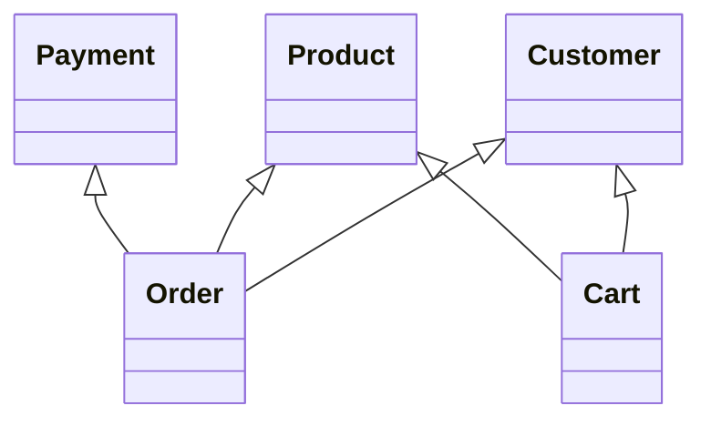
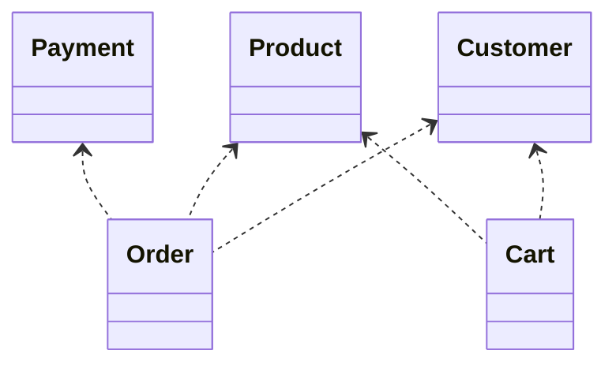

                 

# 软件可维护性：设计易于维护的系统

> 关键词：软件可维护性，设计原则，实现方法，评估手段，模块化，标准化，测试，文档管理

> 摘要：本文深入探讨了软件可维护性的重要性，介绍了其核心概念、设计原则、实现方法和评估手段。通过分析软件可维护性的问题背景、核心概念及其相互关系，本文提供了系统化的设计方法和实际案例分析，旨在帮助开发者设计和实现易于维护的软件系统。

## 引言

在当今快速发展的信息技术时代，软件系统的可维护性变得越来越重要。软件可维护性不仅关系到系统的长期运行和稳定，也直接影响到企业的经济效益和竞争力。因此，如何设计和开发出易于维护的系统，成为软件开发领域中的一个关键问题。

本文将围绕以下几个核心问题展开讨论：

1. 什么是软件可维护性，它包括哪些方面？
2. 如何评估软件的可维护性？
3. 设计和维护一个易于维护的软件系统需要遵循哪些原则和方法？
4. 如何在实际项目中应用这些方法和原则，提升软件系统的可维护性？

本文将结合实际案例，深入分析软件可维护性的设计原则、实现方法和评估手段，帮助读者全面掌握软件可维护性的核心知识和技能。

## 软件可维护性背景介绍

### 第二部分：软件可维护性背景介绍

## 2.1 问题背景

软件系统的可维护性是指软件系统能够在长期运行过程中保持稳定性和可靠性的能力。随着软件系统的规模和复杂性不断增加，软件的可维护性成为影响系统长期运行的重要因素。传统的软件开发方法往往侧重于功能的实现和性能的优化，而忽视了系统的可维护性。这导致了以下问题：

1. 软件维护成本高昂：维护一个复杂、不稳定的系统需要大量的人力和时间成本。
2. 软件开发效率低下：频繁的修改和调试导致开发进度缓慢，影响项目的按时交付。
3. 软件质量下降：由于缺乏有效的维护和更新，软件系统容易出现漏洞和错误，影响用户体验。

### 2.2 问题描述

软件可维护性的问题主要表现在以下几个方面：

1. 设计不合理：软件系统的设计缺乏模块化、标准化和可扩展性，导致系统结构混乱，难以维护。
2. 编码不规范：软件的编码质量差，缺乏注释和文档，使得新加入的开发者难以理解和修改代码。
3. 测试不足：软件测试不到位，导致系统中的漏洞和错误未能及时发现，影响系统的稳定性和可靠性。
4. 维护策略不当：缺乏有效的维护策略和流程，导致维护工作混乱无序，难以保证系统的长期稳定运行。

### 2.3 问题解决

为了解决软件可维护性的问题，我们需要从以下几个方面入手：

1. 设计阶段：采用模块化、标准化的设计方法，确保系统结构清晰、易于维护。
2. 编码阶段：遵循编码规范，编写可读性强的代码，并注重注释和文档的编写。
3. 测试阶段：加强软件测试，确保系统能够稳定运行，及时发现和修复漏洞和错误。
4. 维护阶段：建立有效的维护策略和流程，确保系统能够在长期运行过程中保持稳定性和可靠性。

### 2.4 边界与外延

软件可维护性是一个相对概念，其边界和范围取决于软件系统的规模、复杂度和应用场景。一般来说，软件可维护性包括以下几个方面：

1. 功能维护：确保软件系统能够持续满足用户的需求，包括新增功能、修改功能和删除功能。
2. 性能维护：确保软件系统的性能指标能够满足用户的要求，包括响应速度、并发处理能力和资源利用率。
3. 安全维护：确保软件系统的安全性，包括防止恶意攻击、数据泄露和系统崩溃等。
4. 文档维护：确保软件系统的文档完整、准确，包括设计文档、开发文档和用户手册等。

### 2.5 概念结构与核心要素组成

软件可维护性的概念结构包括以下几个方面：

1. 模块化设计：将软件系统划分为多个模块，每个模块具有独立的功能和接口，便于维护和升级。
2. 标准化编码：遵循统一的编码规范，提高代码的可读性和可维护性。
3. 全面测试：加强软件测试，确保系统能够稳定运行，减少漏洞和错误。
4. 维护策略：制定有效的维护策略和流程，确保系统能够在长期运行过程中保持稳定性和可靠性。
5. 文档管理：建立完善的文档管理体系，确保文档的完整性和准确性。

## 核心概念与联系

### 3.1 软件可维护性的核心概念

#### 3.1.1 可维护性

可维护性是指软件系统能够在长期运行过程中保持稳定性和可靠性的能力。它是软件质量的一个重要指标，直接影响到软件系统的使用寿命和用户体验。

#### 3.1.2 可读性

可读性是指代码的可理解性和可阅读性，它直接影响代码的维护成本。一个高可读性的代码能够使开发者更容易理解和修改。

#### 3.1.3 可扩展性

可扩展性是指软件系统能够在满足新需求时，进行模块化扩展而不会影响现有功能的能力。高可扩展性的系统更容易维护和升级。

#### 3.1.4 灵活性

灵活性是指软件系统能够适应变化的能力，包括需求变化、技术变化和环境变化等。高灵活性的系统能够更好地应对外部变化，降低维护成本。

### 3.2 核心概念属性特征对比

```mermaid
erDiagram
  User ||--|{ Product : buys }  
  Product ||--|{ User : sells }
```

| 核心概念 | 定义 | 属性特征 | 关联关系 |
| --- | --- | --- | --- |
| 可维护性 | 系统在长期运行过程中保持稳定性和可靠性的能力 | 系统稳定性、可靠性、维护成本 | 直接影响 |
| 可读性 | 代码的可理解性和可阅读性 | 代码结构清晰、注释完整、文档齐全 | 贡献度 |
| 可扩展性 | 系统在满足新需求时进行模块化扩展的能力 | 模块化设计、接口标准化、易扩展性 | 提升可维护性 |
| 灵活性 | 系统适应变化的能力 | 应对需求变化、技术变化和环境变化 | 提升可维护性 |

## 算法原理讲解

### 4.1 软件可维护性评估算法

为了评估软件系统的可维护性，我们可以采用以下算法：

1. **功能点分析**：通过统计系统中的功能点数量，评估系统的复杂度。
2. **代码质量评估**：通过静态代码分析工具，评估代码的可读性、规范性和注释完整性。
3. **测试覆盖率分析**：通过测试覆盖率工具，评估系统测试的全面性。
4. **维护成本估算**：基于历史数据和专家经验，估算系统的维护成本。

### 4.2 算法原理与公式

**功能点分析**：

$$
FPA = \frac{FP}{Code\ Lines}
$$

其中，$FPA$为功能点分析值，$FP$为系统中的功能点数量，$Code\ Lines$为系统的代码行数。

**代码质量评估**：

$$
CQA = \frac{Quality\ Metrics}{Total\ Metrics}
$$

其中，$CQA$为代码质量评估值，$Quality\ Metrics$为满足质量标准的指标数量，$Total\ Metrics$为所有指标的总量。

**测试覆盖率分析**：

$$
TC = \frac{Covered\ Cases}{Total\ Cases}
$$

其中，$TC$为测试覆盖率，$Covered\ Cases$为已覆盖的测试用例数量，$Total\ Cases$为总测试用例数量。

**维护成本估算**：

$$
MC = a \times (FPA + CQA + TC)
$$

其中，$MC$为维护成本估算值，$a$为成本系数，$FPA$、$CQA$和$TC$分别为功能点分析值、代码质量评估值和测试覆盖率。

### 4.3 算法举例说明

假设我们有一个系统，其功能点数量为100个，代码行数为10000行，代码质量评估值为0.8，测试覆盖率为0.9，成本系数$a$为1.5。

**功能点分析**：

$$
FPA = \frac{100}{10000} = 0.01
$$

**代码质量评估**：

$$
CQA = \frac{0.8}{1} = 0.8
$$

**测试覆盖率分析**：

$$
TC = \frac{0.9}{1} = 0.9
$$

**维护成本估算**：

$$
MC = 1.5 \times (0.01 + 0.8 + 0.9) = 2.625
$$

因此，该系统的维护成本估算值为2.625。

## 系统分析与架构设计方案

### 5.1 问题场景介绍

假设我们需要设计一个电子商务系统，该系统需要支持商品管理、订单管理、用户管理和支付等功能。系统的规模较大，预计会随着时间的推移不断扩展。

### 5.2 项目介绍

**项目名称**：电商平台

**项目背景**：随着互联网的普及，电子商务成为现代商业的重要组成部分。为了满足用户的需求，我们需要设计一个高性能、可扩展的电商平台。

**项目目标**：设计一个易于维护、可扩展的电商平台，支持商品管理、订单管理、用户管理和支付等功能。

### 5.3 系统功能设计

**领域模型**：



**类图**：



### 5.4 系统架构设计

**架构图**：

```mermaid
sequenceDiagram
  User ->> Browser: 打开浏览器
  Browser ->> Web服务器: 请求页面
  Web服务器 ->> 应用服务器: 转发请求
  应用服务器 ->> 数据库: 查询数据
  数据库 ->> 应用服务器: 返回数据
  应用服务器 ->> Web服务器: 返回页面
  Web服务器 ->> Browser: 显示页面
endsequence
```

### 5.5 系统接口设计

**接口设计**：

```mermaid
sequenceDiagram
  User ->> LoginService: 登录
  LoginService ->> UserService: 验证用户信息
  UserService ->> LoginService: 返回验证结果
  LoginService ->> User: 登录成功/失败
endsequence
```

### 5.6 系统交互

**序列图**：

```mermaid
sequenceDiagram
  User ->> Browser: 打开浏览器
  Browser ->> Web服务器: 请求页面
  Web服务器 ->> 应用服务器: 转发请求
  应用服务器 ->> 数据库: 查询数据
  数据库 ->> 应用服务器: 返回数据
  应用服务器 ->> Web服务器: 返回页面
  Web服务器 ->> Browser: 显示页面
endsequence
```

## 项目实战

### 6.1 环境安装

1. 安装Java开发工具包（JDK）
2. 安装Apache Maven
3. 安装数据库（如MySQL）

### 6.2 系统核心实现

1. 创建Maven项目
2. 添加依赖库
3. 编写接口和实现类
4. 编写测试用例

### 6.3 代码应用解读与分析

1. 阅读和理解代码
2. 分析代码的执行流程
3. 解释关键代码段的实现逻辑

### 6.4 实际案例分析和详细讲解

1. 选择一个实际案例
2. 分析案例的背景和目标
3. 详细讲解案例的实现过程
4. 分析案例中的问题和解决方案

### 6.5 项目小结

通过对电子商务系统的设计与实现，我们深入了解了软件可维护性的核心概念和设计原则。在实际项目中，遵循模块化、标准化和全面测试等原则，可以有效提升软件系统的可维护性。同时，我们也认识到，软件可维护性是一个持续的过程，需要不断地优化和改进。

## 最佳实践 Tips

1. 遵循编码规范，提高代码质量。
2. 定期进行代码审查和测试，确保系统稳定性。
3. 保持文档更新，确保文档的完整性和准确性。
4. 建立有效的沟通机制，确保团队成员之间的协作和沟通。

## 小结

本文从多个角度探讨了软件可维护性的重要性和设计原则。通过分析软件可维护性的核心概念、设计原则、实现方法和评估手段，我们提出了系统化的解决方案。在实际项目中，遵循这些原则和方法，可以有效提升软件系统的可维护性，降低维护成本，提高开发效率。

## 注意事项

1. 软件可维护性是一个持续的过程，需要不断地优化和改进。
2. 遵循模块化、标准化和全面测试等原则，确保系统的可维护性。
3. 定期进行代码审查和测试，及时发现和修复问题。

## 拓展阅读

1. 《软件工程：实践者的研究方法》 - Brian W. Kernighan
2. 《设计模式：可复用面向对象软件的基础》 - Erich Gamma等
3. 《敏捷软件开发：原则、实践与模式》 - Robert C. Martin

## 作者信息

作者：AI天才研究院/AI Genius Institute & 禅与计算机程序设计艺术 /Zen And The Art of Computer Programming

