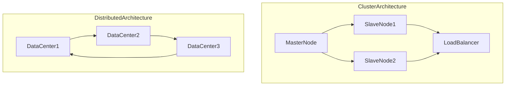
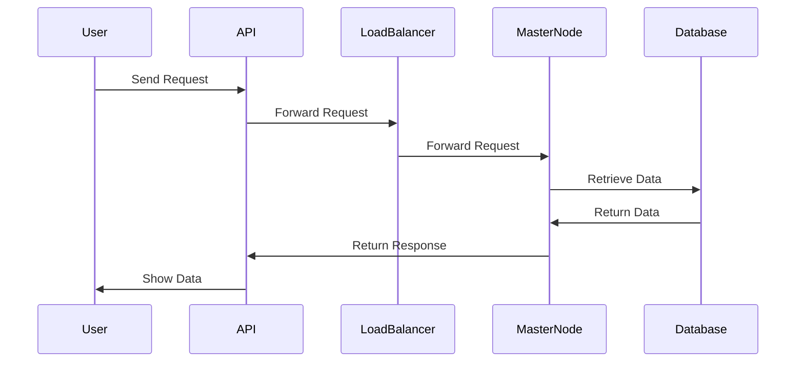
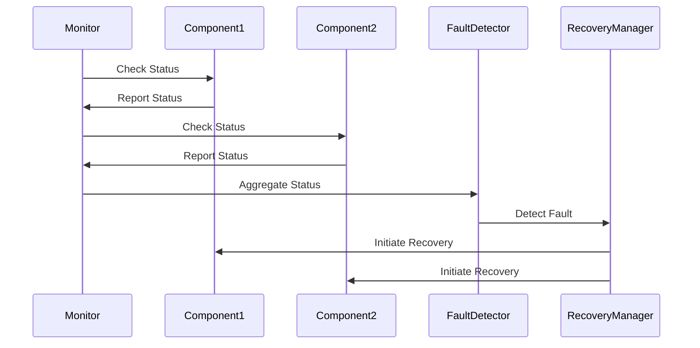

                 

# 软件可靠性工程：构建高可用系统

## 关键词
- 软件可靠性工程
- 高可用性系统
- 可靠性模型
- 设计原则
- 测试与验证
- 最佳实践

## 摘要
本文将深入探讨软件可靠性工程的核心概念和构建高可用性系统的关键技术。通过系统化的分析和详细的案例分析，本文旨在为读者提供实用的指导，帮助他们在软件开发过程中有效提高系统的可靠性。本文分为四个主要部分：引言与背景、软件可靠性工程基础、高可用性系统建设、以及软件可靠性工程最佳实践。每个部分都将详细阐述相关主题，并提供实际案例以供参考。

## 引言与背景

### 核心概念术语说明

在讨论软件可靠性工程之前，我们需要明确一些核心概念。软件可靠性指的是在特定条件下和规定的时间内，软件系统成功执行其预定功能的概率。它不仅仅是一个技术问题，也是一个经济问题，因为可靠性直接影响到系统的维护成本、用户满意度以及企业的声誉。

### 问题背景

随着信息技术的快速发展，软件系统在现代社会中的作用日益重要。无论是商业应用、医疗系统、交通控制，还是金融服务，软件系统的可靠运行都至关重要。然而，随着系统复杂性增加，软件可靠性问题也日益突出。系统故障可能导致经济损失、数据丢失、甚至生命安全威胁。

### 问题描述

软件可靠性问题表现为多种形式，如错误、故障、崩溃、性能下降等。这些问题可能导致系统无法按照预期工作，从而影响用户体验和业务运营。具体而言，软件可靠性问题可能包括：

1. **功能错误**：系统未能按照设计预期执行特定功能。
2. **性能问题**：系统运行缓慢或响应时间过长。
3. **稳定性问题**：系统频繁崩溃或异常退出。
4. **安全性问题**：系统存在安全漏洞，易受攻击。

### 问题解决

解决软件可靠性问题需要系统化的方法。软件可靠性工程提供了一系列技术和管理手段，以减少故障发生率，提高系统的可用性和可靠性。这些手段包括：

1. **设计原则**：在系统设计阶段就考虑可靠性，采用模块化、冗余设计等原则。
2. **测试与验证**：通过严格的测试流程，发现并修复潜在的问题。
3. **持续改进**：定期进行系统评估和优化，以持续提高可靠性。
4. **最佳实践**：遵循行业最佳实践，如使用可靠的技术框架和工具。

### 边界与外延

软件可靠性工程不仅关注系统本身的可靠性，还包括外部组件和环境的可靠性。例如，操作系统、网络设备和数据库等都可能影响到软件系统的可靠性。因此，在构建高可用性系统时，需要综合考虑整个系统环境的可靠性。

### 概念结构与核心要素组成

软件可靠性工程的概念结构主要包括以下几个方面：

1. **可靠性模型**：用于描述和预测系统可靠性的数学模型。
2. **设计原则**：指导系统设计和开发的基本原则。
3. **测试与验证**：确保系统满足可靠性要求的测试方法。
4. **维护与优化**：持续改进系统的可靠性。
5. **管理方法**：用于规划和控制可靠性工程活动的管理方法。

这些核心要素相互作用，共同构成了软件可靠性工程的基础。

## 核心概念与联系

### 核心概念原理

软件可靠性工程的核心概念包括：

1. **可靠性度量**：用于衡量软件系统可靠性的指标，如平均无故障时间（MTTF）和平均故障修复时间（MTTR）。
2. **故障模型**：描述软件故障发生机制的模型，如泊松过程和Weibull分布。
3. **可靠性设计**：在系统设计阶段考虑可靠性，采用冗余、容错和故障检测等设计策略。
4. **可靠性测试**：通过模拟和实际测试来验证系统的可靠性。

### 概念属性特征对比表格

| 概念         | 定义                                                         | 属性特征                                                         |
| ------------ | ------------------------------------------------------------ | ------------------------------------------------------------ |
| **可靠性度量** | 衡量软件系统可靠性的指标                                     | - **MTTF**：平均无故障时间<br>- **MTTR**：平均故障修复时间<br>- **故障率**：单位时间内故障发生的次数 |
| **故障模型** | 描述软件故障发生机制的模型                                   | - **泊松过程**：故障发生是随机的，且独立<br>- **Weibull分布**：故障率随时间变化，早期故障较多，后期故障较少 |
| **可靠性设计** | 在系统设计阶段考虑可靠性，采用冗余、容错和故障检测等设计策略 | - **冗余设计**：通过冗余组件提高系统的可靠性<br>- **容错设计**：系统在故障发生时仍能正常运行<br>- **故障检测**：实时检测系统中的故障，并采取措施 |
| **可靠性测试** | 通过模拟和实际测试来验证系统的可靠性                         | - **单元测试**：测试单个模块的可靠性<br>- **集成测试**：测试模块之间的交互<br>- **性能测试**：评估系统的性能和可靠性 |

### ER实体关系图架构

下面是软件可靠性工程的ER实体关系图，用于描述核心概念之间的关系：

```mermaid
erDiagram
    Class1 ||--|{ Class2 }| Class3 : Related
    Class1 ||--|{ Class4 }| Class5 : AnotherRelation
    Class2 ||--|{ Class6 }| Class7 : YetAnotherRelation
```

该图展示了四个主要类（Class1, Class2, Class3, Class4）及其相互关系。例如，Class1 与 Class2 有一个相关关系，而与 Class3 和 Class4 有另一个关系。这些关系对于理解软件可靠性工程的核心概念至关重要。

## 软件可靠性工程基础

### 软件可靠性概述

软件可靠性工程的目标是确保软件系统能够在规定的时间内和特定条件下，成功执行其预定功能。它涉及多个方面的研究和实践，包括可靠性度量、故障模型、可靠性设计和可靠性测试。下面我们将详细探讨这些关键概念。

### 可靠性定义

可靠性是指系统在特定条件下和规定的时间内，成功执行其预定功能的概率。它通常用以下参数来衡量：

- **平均无故障时间（MTTF）**：系统在平均情况下两次故障之间的时间间隔。
- **平均故障修复时间（MTTR）**：系统从故障发生到修复的平均时间。

高可靠性系统的目标是尽量减少MTTR，同时保持较低的故障率。

### 可靠性度量

可靠性度量是评估软件系统可靠性的量化方法。常见的可靠性度量指标包括：

- **故障率**：单位时间内故障发生的次数。
- **失效率**：单位时间内发生故障的组件数量。
- **生存率**：系统在规定时间内成功运行的概率。

这些度量指标有助于评估系统的可靠性水平，并为后续的改进提供数据支持。

### 软件可靠性目标

软件可靠性目标通常包括以下方面：

1. **高可用性**：系统在规定时间内无故障运行的概率。
2. **快速恢复**：系统在故障发生后能够快速恢复的能力。
3. **安全可靠**：系统在运行过程中能够保护数据和用户隐私。
4. **可维护性**：系统在维护和升级过程中易于管理和操作。

这些目标对于构建高可用性系统至关重要，需要通过可靠性设计、测试和维护等手段来实现。

### 软件可靠性模型

软件可靠性模型用于描述和预测软件系统的可靠性。以下是一些常见的可靠性模型：

1. **泊松模型**：假设故障发生是随机的，且独立。
2. **Weibull模型**：故障率随时间变化，早期故障较多，后期故障较少。
3. **Markov模型**：用于描述系统在不同状态之间的转移概率。

这些模型有助于我们理解和预测软件系统的可靠性行为。

### 可靠性模型参数估计

可靠性模型的参数估计是软件可靠性工程的一个重要环节。常用的参数估计方法包括：

1. **最大似然估计**：通过最大化的方法估计参数值。
2. **最小二乘法**：通过最小化误差平方和来估计参数值。

这些方法能够帮助我们准确估计可靠性模型的参数，从而提高可靠性预测的准确性。

### 模型应用实例

在实际应用中，可靠性模型可以用于：

1. **可靠性评估**：评估现有软件系统的可靠性水平。
2. **故障预测**：预测系统未来的故障发生时间。
3. **设计优化**：根据可靠性目标，优化系统设计和实现。

这些应用有助于提高软件系统的可靠性和可用性。

### 软件可靠性设计与实现

软件可靠性设计是指在系统设计和开发过程中，充分考虑可靠性要求，采用冗余、容错和故障检测等技术手段。以下是一些设计原则：

1. **模块化设计**：将系统划分为多个独立的模块，降低故障传播的风险。
2. **冗余设计**：通过冗余组件提高系统的可靠性。
3. **容错设计**：使系统能够在故障发生时继续正常运行。
4. **故障检测与恢复**：实时检测故障，并采取措施恢复系统。

实现软件可靠性设计的关键在于：

1. **可靠性需求分析**：明确可靠性目标，并将其纳入系统需求。
2. **设计评审**：通过评审确保设计满足可靠性要求。
3. **可靠性测试**：验证设计的可靠性，发现并修复潜在问题。

### 设计评审

设计评审是确保软件可靠性设计有效性的关键环节。以下是一些评审原则：

1. **评审团队**：组建专业的评审团队，包括开发人员、测试人员、管理人员等。
2. **评审流程**：制定明确的评审流程，包括需求评审、设计评审和代码评审。
3. **评审标准**：制定可靠性评审标准，确保设计满足可靠性要求。

通过设计评审，可以发现并修复潜在的设计问题，从而提高软件系统的可靠性。

## 高可用性系统建设

### 高可用性系统概述

高可用性系统（High Availability System）是指能够在高故障率和负载波动条件下，仍然能够持续提供服务的能力。高可用性系统通过冗余设计、故障检测、故障恢复等手段，最大限度地减少系统停机时间和服务中断。

### 高可用性定义

高可用性通常用系统停机时间（Downtime）来衡量。高可用性系统要求停机时间尽可能短，甚至接近零。常见的度量指标包括：

- **系统可用性**：系统在规定时间内正常运行的百分比。
- **故障恢复时间**：系统从故障发生到恢复正常运行的时间。

高可用性系统的目标是在任何情况下都能保证系统的稳定运行，从而提高用户体验和业务连续性。

### 高可用性目标

高可用性系统的目标包括：

1. **高可靠性**：系统在长时间内无故障运行。
2. **快速恢复**：系统在故障发生后能够快速恢复。
3. **灵活性**：系统能够应对不同负载和环境变化。
4. **安全性**：系统能够保护数据和用户隐私。

这些目标对于构建高可用性系统至关重要。

### 高可用性挑战

构建高可用性系统面临以下挑战：

1. **成本**：冗余设计和高级故障恢复机制可能增加成本。
2. **复杂性**：高可用性系统通常更加复杂，需要更多的管理和维护。
3. **故障检测**：如何快速准确地检测故障是一个技术难题。
4. **数据一致性**：在分布式系统中，如何保持数据一致性是一个重要问题。

应对这些挑战需要综合考虑技术、管理和组织等方面的因素。

### 高可用性架构设计

高可用性架构设计是构建高可用性系统的关键。以下是一些核心原则：

1. **冗余设计**：通过冗余组件提高系统的可靠性。
2. **故障检测**：实时检测系统中的故障。
3. **故障恢复**：在故障发生时，系统能够自动恢复。
4. **负载均衡**：平衡系统负载，避免单点过载。

高可用性架构设计的方法包括：

1. **主从架构**：主节点负责处理请求，从节点作为备份。
2. **集群架构**：多个节点共同工作，负载均衡。
3. **分布式架构**：系统分布在多个物理或虚拟节点上，提高可靠性。

### 高可用性架构设计原则

高可用性架构设计应遵循以下原则：

1. **模块化**：将系统划分为独立的模块，降低故障传播风险。
2. **冗余**：通过冗余组件提高系统的可靠性。
3. **分布式**：系统分布在多个节点上，提高可用性。
4. **可伸缩性**：系统能够应对不同负载和环境变化。

### 高可用性架构设计方法

高可用性架构设计的方法包括：

1. **故障树分析（FTA）**：分析系统故障原因，设计冗余和故障恢复机制。
2. **容错设计**：设计能够容忍和恢复故障的系
### 高可用性系统实现

实现高可用性系统是确保系统稳定性和可靠性的关键步骤。这一部分将详细探讨高可用性系统的实现过程，包括系统功能设计、系统架构设计、系统接口设计和系统交互设计。

#### 系统功能设计

系统功能设计是构建高可用性系统的第一步，它定义了系统应提供的各种功能和服务。以下是一个典型的系统功能设计示例：

1. **用户认证与授权**：确保用户可以安全登录并访问系统资源。
2. **数据存储与管理**：提供数据的存储、检索、备份和恢复功能。
3. **负载均衡**：分发网络流量，确保系统资源得到合理利用。
4. **故障检测与恢复**：监控系统状态，自动检测故障并触发恢复流程。
5. **日志记录与分析**：记录系统运行日志，供分析和故障排查使用。

为了清晰展示系统功能，可以使用Mermaid类图来表示：

```mermaid
classDiagram
    UserAuth <<interface>>
    DataManagement <<interface>>
    LoadBalancer <<interface>>
    FaultDetection <<interface>>
    LogAnalysis <<interface>>

    UserAuth --|> User: Authenticates and authorizes access
    DataManagement --|> Database: Manages data storage and retrieval
    LoadBalancer --|> Servers: Distributes network traffic
    FaultDetection --|> Components: Monitors and recovers from faults
    LogAnalysis --|> Logs: Analyzes system logs for troubleshooting
```

#### 系统架构设计

系统架构设计是确保高可用性的关键，它定义了系统组件的交互方式和数据流。以下是一个典型的系统架构设计示例：

1. **主从架构**：主节点负责处理业务请求，从节点作为备份，主从节点之间通过心跳信号保持同步。
2. **集群架构**：多个节点共同工作，通过负载均衡器分发请求，提高系统吞吐量和可靠性。
3. **分布式架构**：系统分布在多个数据中心，通过数据同步机制保持数据一致性。

为了清晰展示系统架构，可以使用Mermaid架构图来表示：



#### 系统接口设计

系统接口设计定义了系统与外部系统或组件的交互方式。以下是一个典型的系统接口设计示例：

1. **API接口**：提供RESTful API，供第三方系统或应用程序调用。
2. **消息队列**：使用消息队列进行异步通信，提高系统的解耦性和可靠性。
3. **数据接口**：提供数据访问接口，供其他系统或应用程序读取和写入数据。

为了清晰展示系统接口设计，可以使用Mermaid序列图来表示：



#### 系统交互设计

系统交互设计定义了系统内部组件之间的交互方式和数据流。以下是一个典型的系统交互设计示例：

1. **组件间通信**：系统内部组件通过消息队列进行通信，实现异步处理。
2. **故障检测**：系统定时检查各组件状态，触发恢复流程。
3. **数据同步**：系统在分布式架构下，通过数据同步机制保持数据一致性。

为了清晰展示系统交互设计，可以使用Mermaid序列图来表示：



通过上述系统功能设计、系统架构设计、系统接口设计和系统交互设计，可以实现一个高可用性系统，从而确保系统的稳定性和可靠性。

### 高可用性系统测试与验证

高可用性系统的测试与验证是确保系统满足可靠性要求的关键步骤。通过严格的测试和验证流程，可以发现并修复潜在的问题，从而提高系统的可靠性和稳定性。

#### 测试方法

测试方法主要包括以下几种：

1. **功能测试**：验证系统功能是否按照预期工作。
2. **性能测试**：评估系统的性能，如响应时间、吞吐量等。
3. **可靠性测试**：通过长时间运行和极端条件测试，评估系统的可靠性。
4. **安全测试**：检测系统的安全漏洞和潜在威胁。

#### 验证策略

验证策略包括以下步骤：

1. **制定验证计划**：明确验证目标、测试方法和资源需求。
2. **执行测试用例**：按照验证计划执行功能测试、性能测试、可靠性测试和安全测试。
3. **分析测试结果**：对测试结果进行分析，识别问题和缺陷。
4. **修复和重新测试**：修复发现的问题，并进行重新测试，确保问题得到解决。

#### 测试案例分析

下面以一个实际案例为例，说明如何进行高可用性系统的测试与验证。

#### 案例背景

某公司开发了一套在线交易系统，要求系统在高峰时段能够稳定运行，并确保交易数据的一致性和安全性。公司希望对该系统进行全面测试和验证，以确保其高可用性。

#### 测试计划

1. **功能测试**：测试系统各个功能模块是否正常工作，包括用户注册、登录、交易等。
2. **性能测试**：模拟高负载场景，评估系统的响应时间和吞吐量。
3. **可靠性测试**：通过长时间运行和极端条件测试，评估系统的稳定性和可靠性。
4. **安全测试**：检测系统是否存在安全漏洞和潜在威胁。

#### 测试过程

1. **功能测试**：编写功能测试用例，包括正常操作和异常操作。例如，测试用户注册功能，输入合法和非法的注册信息，验证系统能否正确处理。
2. **性能测试**：使用工具模拟高负载场景，记录系统的响应时间和吞吐量。例如，模拟1000个并发用户同时访问系统，测试系统的处理能力。
3. **可靠性测试**：在极端条件下测试系统，如高温、高湿度等。通过长时间运行系统，观察系统是否稳定，是否有故障发生。
4. **安全测试**：使用工具检测系统是否存在安全漏洞，如SQL注入、XSS攻击等。

#### 测试结果

1. **功能测试**：所有功能测试用例均通过，系统功能正常。
2. **性能测试**：在高负载场景下，系统的响应时间和吞吐量均达到预期。
3. **可靠性测试**：系统在极端条件下运行稳定，未出现故障。
4. **安全测试**：未发现重大安全漏洞。

#### 问题与解决方案

根据测试结果，发现以下问题：

1. **性能瓶颈**：在高负载场景下，系统的响应时间较长。通过分析，发现数据库查询速度较慢，导致性能瓶颈。
   - **解决方案**：优化数据库查询语句，添加索引，提高查询速度。

2. **数据一致性问题**：在分布式系统中，发现数据存在不一致的情况。
   - **解决方案**：引入分布式事务管理机制，确保数据一致性。

通过上述测试和验证，系统的高可用性得到了有效保障。在接下来的版本中，公司将根据测试结果对系统进行优化和改进，进一步提高系统的可靠性。

### 软件可靠性工程实践

#### 实践原则

软件可靠性工程实践应遵循以下原则：

1. **需求导向**：以用户需求为导向，确保系统功能满足用户期望。
2. **过程控制**：建立规范的开发流程，确保每个环节都符合可靠性要求。
3. **持续改进**：不断优化系统设计、测试和运维过程，提高系统的可靠性。
4. **团队合作**：团队协作，共同承担可靠性责任，提高问题解决效率。

#### 实践步骤

1. **需求分析**：明确系统需求，包括功能需求、性能需求和可靠性需求。
2. **设计评审**：对系统设计进行评审，确保设计满足可靠性要求。
3. **编码与测试**：编写代码并进行功能测试、性能测试和可靠性测试。
4. **部署与运维**：将系统部署到生产环境，并进行持续监控和运维。
5. **反馈与改进**：收集用户反馈，持续优化系统设计和性能。

#### 实践案例分析

#### 案例背景

某互联网公司开发了一套在线购物系统，要求系统具备高可靠性，以满足大量用户的访问需求。公司希望通过软件可靠性工程实践，确保系统稳定可靠。

#### 实践过程

1. **需求分析**：明确系统需求，包括用户注册、商品展示、购物车管理、订单处理等功能，并确定可靠性目标。

2. **设计评审**：对系统设计进行评审，确保设计符合可靠性要求。评审内容包括：

   - **模块化设计**：将系统划分为多个独立模块，降低故障传播风险。
   - **冗余设计**：关键组件采用冗余设计，提高系统可靠性。
   - **故障检测与恢复**：实现故障检测与自动恢复机制，确保系统在故障发生后能够快速恢复。

3. **编码与测试**：编写代码，并进行功能测试、性能测试和可靠性测试。测试内容包括：

   - **功能测试**：测试系统各功能模块是否正常工作，包括用户注册、商品展示、购物车管理等。
   - **性能测试**：模拟高负载场景，测试系统的响应时间和吞吐量，确保系统能够在高并发情况下稳定运行。
   - **可靠性测试**：通过长时间运行和极端条件测试，评估系统的可靠性和稳定性。

4. **部署与运维**：将系统部署到生产环境，并建立监控和运维机制。监控内容包括：

   - **系统状态监控**：实时监控系统运行状态，如CPU、内存、磁盘等资源使用情况。
   - **日志分析**：分析系统运行日志，及时发现和处理问题。

5. **反馈与改进**：收集用户反馈，持续优化系统设计和性能。反馈内容包括：

   - **用户满意度调查**：通过用户满意度调查，了解用户对系统的使用体验。
   - **系统性能监控**：分析系统性能数据，识别潜在性能瓶颈，进行优化。

#### 实践成果

通过软件可靠性工程实践，系统在可靠性方面取得了显著成果：

1. **高稳定性**：系统在高并发情况下运行稳定，未出现重大故障。
2. **高性能**：系统响应时间短，吞吐量高，用户满意度高。
3. **快速恢复**：系统在故障发生后能够快速恢复，确保业务连续性。

### 小结

通过本案例，我们可以看到软件可靠性工程实践在提高系统可靠性方面的有效性。实践原则和步骤为开发团队提供了明确的指导，确保系统在可靠性方面达到预期目标。持续改进和用户反馈是提高系统可靠性的关键，有助于不断提升系统的稳定性和性能。

### 注意事项

在实施软件可靠性工程时，需要注意以下几点：

1. **需求明确**：确保需求分析准确，避免后期出现功能缺失或性能问题。
2. **设计评审**：设计评审是确保可靠性要求得到满足的关键环节，务必认真执行。
3. **测试充分**：测试应覆盖系统各个功能模块，确保每个环节都经过严格测试。
4. **持续监控**：系统部署后，持续监控和运维至关重要，及时发现和处理问题。
5. **团队协作**：团队协作是实施软件可靠性工程的关键，确保每个成员都明确责任和目标。

### 拓展阅读

1. **《软件可靠性工程：理论与实践》**：该书详细介绍了软件可靠性工程的基本概念、方法和实践，适合初学者和专业人士阅读。
2. **《高可用性系统设计》**：该书涵盖了高可用性系统的设计原则、方法和案例，对于构建高可靠性系统具有很高的参考价值。
3. **《软件工程：实践者的研究》**：该书从实践者的角度出发，介绍了软件工程中的各种方法和技巧，包括可靠性工程的相关内容。

通过阅读这些书籍，读者可以进一步深入了解软件可靠性工程的理论和实践，提高系统可靠性构建能力。

## 作者信息

**作者：AI天才研究院/AI Genius Institute & 禅与计算机程序设计艺术 /Zen And The Art of Computer Programming**

### 结束语

软件可靠性工程是构建高可用性系统的基础，它涵盖了从设计到实现的各个阶段。通过本文的深入探讨，我们了解了软件可靠性工程的核心概念、基础模型、高可用性系统建设以及最佳实践。希望本文能够为读者提供有价值的指导和启示，帮助他们在软件开发过程中有效提高系统的可靠性。

**AI天才研究院/AI Genius Institute** 致力于推动人工智能和计算机科学领域的研究与进步，**禅与计算机程序设计艺术 /Zen And The Art of Computer Programming** 则通过哲学和禅学的思考，提升编程的艺术性和创造力。我们期待与广大读者共同探讨和分享更多关于软件可靠性工程的高质量和创新内容。感谢您的阅读！

## 附录

为了更好地理解和应用本文中提到的技术概念，以下提供了一些参考资料：

1. **《软件可靠性工程：理论与实践》**：详细介绍了软件可靠性工程的基本概念、方法和实践。
2. **《高可用性系统设计》**：涵盖了高可用性系统的设计原则、方法和案例。
3. **《软件工程：实践者的研究》**：从实践者的角度出发，介绍了软件工程中的各种方法和技巧。

此外，以下在线资源也提供了丰富的学习资料：

1. **GitHub**：许多开源项目和技术文档，有助于了解实际应用中的可靠性工程实践。
2. **Stack Overflow**：编程问答社区，可以解决可靠性工程中的具体问题。
3. **IEEE Xplore**：电子工程和计算机科学领域的学术文章和会议记录。

通过这些资源，读者可以进一步深化对软件可靠性工程的理解和应用。希望这些资料能为您的学习和实践提供帮助。再次感谢您的阅读！

