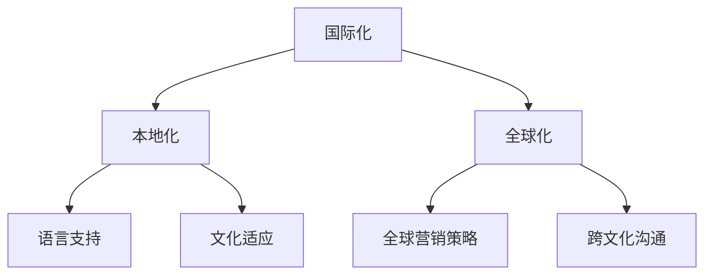
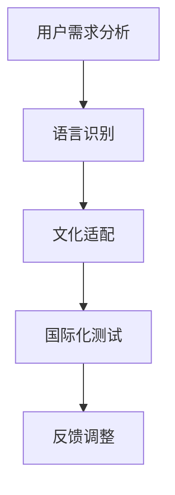

                 

### 引言

在全球化快速发展的今天，软件国际化与本地化已经成为软件开发过程中不可或缺的一部分。随着跨国贸易、电子商务和移动互联网的蓬勃发展，企业不再局限于本国市场，而是将目光投向了全球市场。为了在全球市场中占据一席之地，企业必须开发出能够适应不同国家和地区用户需求的软件产品。软件国际化与本地化正是实现这一目标的关键策略。

软件国际化指的是将软件设计成能够在不同国家和地区运行，具备多种语言支持和适应当地文化特点的能力。而软件本地化则是更进一步的优化，针对特定地区的用户需求进行细致的调整，使其在本地环境中达到最佳效果。国际化与本地化不仅是技术问题，更是业务战略的一部分。

本文旨在为开发者、项目经理和企业提供一整套系统性、实用性的指导，帮助他们在国际市场上取得成功。《软件国际化与本地化：全球化应用开发策略》将从基础知识、技术实现和最佳实践三个部分，深入剖析软件国际化与本地化的核心概念、技术实现方法以及成功案例，以期为广大开发者提供有价值的参考。

本文将按照以下结构进行：

1. **国际化与本地化的基础知识**：介绍国际化与本地化的基本概念、核心概念及其联系，通过图表和模型深入理解这两个概念。
2. **国际化与本地化的技术实现**：探讨国际化与本地化的技术解决方案，包括语言支持、本地化工具、测试方法等。
3. **国际化与本地化的算法原理讲解**：通过具体的算法流程、代码示例和数学模型，详细阐述国际化与本地化的算法原理。
4. **国际化与本地化的系统分析与架构设计**：分析现代软件系统面临的国际化挑战，介绍系统功能设计、架构设计和接口设计。
5. **项目实战**：通过一个实际项目案例，展示国际化与本地化的具体实现过程，并进行代码解读和分析。
6. **国际化与本地化的最佳实践**：总结国际化与本地化的最佳实践，给出注意事项和拓展阅读建议。

让我们开始详细探讨软件国际化与本地化的各个方面，逐步构建全球化的应用开发策略。

---

#### 第一部分：国际化与本地化的基础知识

在深入探讨软件国际化与本地化的具体实现之前，我们首先需要理解这两个概念的基础知识。国际化（Internationalization）和本地化（Localization）虽然是两个相关但不完全相同的概念，但在全球软件开发中密不可分。以下章节将详细解释这两个概念的基本原理、区别与联系，帮助读者建立一个清晰的理解框架。

##### 第1章：国际化与本地化的基本概念

###### 1.1 问题的背景

全球化趋势使得跨国界贸易和电子商务成为经济发展的新引擎。在这种大背景下，软件产品不再局限于单一市场，而是需要面向全球用户。这种变化对软件开发提出了新的要求，即软件必须具备国际化与本地化的能力。

- **全球化趋势下的软件市场需求**：随着全球化的推进，跨国企业和互联网公司都在寻求进入全球市场，他们需要开发能够支持多语言、适应当地文化的软件产品。
- **跨境贸易与电子商务的发展**：跨境贸易和电子商务的快速增长使得软件产品的用户群体更加多元化，这对软件的国际化与本地化提出了更高要求。
- **技术壁垒与国际标准**：不同国家和地区可能存在不同的技术标准和法规，这要求软件在国际化过程中必须考虑到这些差异，以避免技术壁垒。

###### 1.2 问题描述

在进行软件国际化与本地化时，我们需要解决以下几个关键问题：

- **软件国际化与本地化的目标**：如何使软件产品在不同国家和地区都能正常运行？
- **文化差异对软件的影响**：文化差异如何影响软件的用户体验和接受度？
- **技术实现与资源投入**：如何高效地实现国际化与本地化，同时控制成本和资源投入？

###### 1.3 问题解决

针对上述问题，我们可以采取以下解决方案：

- **国际化与本地化的区别**：明确国际化与本地化的区别，以更好地制定相应的策略。
- **国际化与本地化的必要性**：理解国际化与本地化对于全球市场竞争的重要性。
- **核心要素组成**：构建国际化与本地化的核心要素，如语言支持、文化适应、技术标准等。

###### 1.4 边界与外延

- **软件国际化的范围**：国际化不仅仅涉及语言支持，还包括货币、度量单位、日期格式等多方面。
- **软件本地化的深度**：本地化需要根据不同市场的需求深度调整，包括本地化测试、用户体验优化等。

###### 1.5 概念结构与核心要素组成

国际化与本地化的概念结构可以概括为以下几个核心要素：

- **国际化策略**：制定一套国际化标准，确保软件在不同环境中都能运行。
- **本地化流程**：根据目标市场的需求，对软件进行本地化调整，包括语言翻译、文化适应等。
- **技术解决方案**：采用合适的工具和技术，实现国际化与本地化的具体操作。

通过以上对国际化与本地化基本概念的分析，我们为后续章节的深入探讨奠定了基础。在接下来的章节中，我们将进一步探讨国际化与本地化的核心概念及其联系，为读者提供更全面的理解。

### 第2章：国际化与本地化的核心概念与联系

在理解了国际化与本地化的基本概念之后，我们需要进一步探讨这两个概念之间的核心联系，以及它们在全球软件开发中的重要性。国际化、本地化和全球化这三个概念虽然在语义上有所重叠，但各自有着独特的内涵和作用。

##### 2.1 核心概念原理

###### 2.1.1 国际化

国际化（Internationalization），简称i18n，是指使软件具备在不同国家和地区运行的能力，具体包括以下几个方面：

- **语言支持**：软件应能够支持多种语言，为用户提供本地化的语言界面。
- **文化适应**：软件需要考虑不同文化背景下的用户习惯，如日期格式、时间表示、货币符号等。
- **技术中立性**：软件设计应避免特定技术或平台依赖，以适应不同的开发环境。

国际化的核心目标是使软件具备适应不同市场的能力，为后续的本地化提供基础。

###### 2.1.2 本地化

本地化（Localization），简称l10n，是国际化过程中的一步，旨在将国际化的软件进一步适应特定地区或市场的需求。本地化主要涉及以下内容：

- **语言翻译**：将软件的用户界面翻译成目标市场的本地语言。
- **文化适配**：对软件内容进行文化调整，以适应目标市场的文化习惯。
- **用户体验优化**：根据目标市场的用户反馈，优化软件的用户体验。

本地化的核心目标是使软件在目标市场达到最佳的使用效果，提高用户满意度。

###### 2.1.3 全球化

全球化（Globalization）是指软件面向全球市场进行设计和开发，不仅仅局限于某个特定地区或市场。全球化考虑的不仅仅是语言和文化，还包括全球营销策略、跨文化沟通等多个方面：

- **全球营销策略**：制定全球性的市场推广计划，以覆盖更多国家和地区。
- **跨文化沟通**：确保软件在跨文化背景下能够顺畅沟通，减少文化冲突。
- **技术协同**：在全球范围内协调技术开发，确保不同地区的需求得到满足。

全球化的核心目标是实现全球市场的统一和协调，提高软件在全球范围内的竞争力。

##### 2.2 概念属性特征对比表格

为了更清晰地理解国际化、本地化和全球化的概念，我们可以通过一个对比表格来展示它们的主要特征：

| 概念 | 定义 | 特征 |
| ---- | ---- | ---- |
| 国际化 | 软件针对不同国家的语言和文化进行适应性开发 | 语言支持，文化适应 |
| 本地化 | 软件针对特定地区的用户需求进行优化 | 用户需求研究，本地化测试 |
| 全球化 | 软件面向全球市场进行设计和开发 | 全球营销策略，跨文化沟通 |

通过这个表格，我们可以看出，国际化、本地化和全球化在目标和操作上有所不同，但它们之间存在着紧密的联系和互动。

##### 2.3 ER实体关系图架构

为了进一步理解国际化、本地化和全球化的实体关系，我们可以使用Mermaid工具绘制一个ER（实体关系）图。以下是国际化与本地化的ER图示例：



在这个ER图中，国际化作为基础，涵盖了本地化和全球化。本地化专注于特定地区的用户需求，而全球化则从更宏观的角度考虑全球市场战略和跨文化沟通。

通过上述对国际化、本地化和全球化核心概念的阐述以及对比表格和ER图，我们可以更深入地理解这三个概念的本质及其在全球软件开发中的重要性。在下一章中，我们将继续探讨国际化与本地化的技术实现，包括具体的技术解决方案和实现方法。

---

#### 第二部分：国际化与本地化的技术实现

在了解了国际化与本地化的核心概念后，我们需要进一步探讨它们在技术层面的实现方法。国际化与本地化不仅仅是战略和目标，它们需要通过一系列技术手段来实现。在本部分中，我们将详细讨论国际化与本地化的技术解决方案，包括语言支持、本地化工具、测试方法以及全球化技术等。

##### 第3章：国际化与本地化的技术解决方案

###### 3.1 国际化技术

国际化技术是使软件具备在不同国家和地区运行的能力的基础。以下是一些关键的技术方面：

- **语言支持**：软件应支持多种语言，以便用户根据自己的语言偏好选择界面语言。实现语言支持通常包括以下几个方面：

  - **多语言资源文件**：使用外部资源文件存储不同语言的界面文本，便于维护和更新。
  - **语言切换功能**：提供一个直观的语言切换界面，让用户能够方便地选择所需的语言。

- **地理位置信息处理**：软件需要能够处理地理位置信息，如时间区、货币格式、度量单位等。例如，不同国家的日期格式可能有所不同，软件应能够根据用户所在地区自动调整。

- **国际化标准**：遵循国际标准（如Unicode、IETF语言标签等）可以确保软件在国际化过程中的一致性和兼容性。

###### 3.2 本地化技术

本地化技术是在国际化基础上，对软件进行特定地区的用户需求调整和优化。以下是本地化技术的主要方面：

- **本地化工具**：使用专门的本地化工具可以帮助开发人员高效地完成翻译和文化适配工作。常见的本地化工具有：

  - **翻译记忆库（Translation Memory）**：存储已翻译的内容，提高翻译效率。
  - **本地化编辑工具**：提供界面文本的编辑和测试功能，确保翻译质量。

- **本地化测试**：通过本地化测试，确保软件在目标市场中的运行效果。测试应涵盖以下几个方面：

  - **功能测试**：检查软件功能在目标语言和文化环境中的正确性。
  - **用户体验测试**：评估用户在目标市场中的使用体验，确保软件界面和交互设计符合本地用户习惯。

- **本地化资源管理**：管理本地化资源，如语言文件、图像、声音等，确保它们在不同市场中的正确使用。

###### 3.3 全球化技术

全球化技术是在国际化与本地化的基础上，进一步考虑全球市场战略和跨文化沟通的技术手段。以下是全球化技术的主要方面：

- **跨文化设计**：在设计软件时，考虑不同文化背景下的用户需求，使软件界面和功能设计适应各种文化环境。

- **全球用户体验**：优化软件的用户体验，使其在不同市场中都能提供一致和优质的用户体验。

- **跨境数据传输**：确保数据在不同国家和地区之间的安全传输和合规性，遵循相关数据保护法规。

- **全球营销策略**：制定全球性的市场推广计划，利用多种渠道和方式将软件推向全球市场。

通过上述国际化与本地化的技术解决方案，我们可以确保软件在不同市场中的顺利运行，并达到最佳的用户体验。在下一章中，我们将通过具体的算法原理讲解，进一步理解国际化与本地化的技术实现细节。

---

##### 第4章：国际化与本地化的算法原理讲解

国际化与本地化不仅仅是技术实现，更涉及到一系列算法和流程，这些算法和流程确保软件能够适应不同语言和文化环境。在本章节中，我们将通过具体的算法流程、代码示例和数学模型，详细阐述国际化与本地化的算法原理，帮助读者深入理解其背后的逻辑和操作。

###### 4.1 算法mermaid流程图

为了更直观地展示国际化与本地化的算法流程，我们可以使用Mermaid工具绘制一个流程图。以下是国际化与本地化算法的mermaid流程图：



在这个流程图中，国际化与本地化的核心步骤包括用户需求分析、语言识别、文化适配、国际化测试和反馈调整。

1. **用户需求分析**：首先，我们需要了解目标市场的用户需求，包括语言偏好、文化习惯等。
2. **语言识别**：根据用户需求，识别所需的本地语言，为软件界面提供多语言支持。
3. **文化适配**：对软件内容进行文化适配，确保其符合目标市场的文化习惯和规范。
4. **国际化测试**：对软件进行全面的国际化测试，确保其在不同语言和文化环境中的正确性和稳定性。
5. **反馈调整**：根据用户反馈，对国际化与本地化过程进行调整，不断优化软件体验。

###### 4.2 Python源代码

为了更好地理解国际化与本地化的算法原理，我们可以通过一个Python代码示例来展示其实现过程。以下是国际化与本地化算法的Python代码：

```python
# Python代码示例：国际化与本地化算法

def analyze_user_demand():
    # 假设的用户需求分析
    return "en"  # 返回用户语言偏好

def identify_language(language_code):
    # 语言识别
    return f"Hello ({language_code})"

def adapt_to_culture(content, language):
    # 文化适配
    if language == "fr":
        return content.replace("Hello", "Bonjour")
    else:
        return content

def perform_internationalization_test():
    # 国际化测试
    return "测试通过"

def adjust_based_on_feedback():
    # 根据反馈调整
    print("根据用户反馈进行调整")

# 算法执行流程
user_language = analyze_user_demand()
content = identify_language(user_language)
content = adapt_to_culture(content, user_language)
test_result = perform_internationalization_test()

if test_result == "测试通过":
    adjust_based_on_feedback()
else:
    print("测试未通过，需要重新调整")
```

在这个Python代码中，我们定义了一系列函数来模拟国际化与本地化的过程：

- `analyze_user_demand()`：模拟用户需求分析，返回用户语言偏好。
- `identify_language()`：根据用户语言偏好，识别并返回对应的语言问候。
- `adapt_to_culture()`：对语言问候进行文化适配，根据目标语言进行调整。
- `perform_internationalization_test()`：模拟国际化测试，返回测试结果。
- `adjust_based_on_feedback()`：根据用户反馈进行调整，优化软件体验。

通过这个代码示例，我们可以看到国际化与本地化算法的每个步骤是如何具体实现的。

###### 4.3 算法原理的数学模型和公式

为了更深入地理解国际化与本地化的算法原理，我们可以引入一个数学模型。以下是国际化与本地化的数学模型：

$$
\text{Localization Quality} = f(\text{Translation Accuracy}, \text{Cultural Adaptation})
$$

在这个模型中，国际化与本地化的质量（Localization Quality）由翻译准确性（Translation Accuracy）和文化适配度（Cultural Adaptation）共同决定。具体来说：

- **翻译准确性**：衡量翻译质量，越高表示翻译越准确，对用户体验越好。
- **文化适配度**：衡量文化适配效果，越高表示软件在目标文化中的适用性越强。

通过这个数学模型，我们可以量化国际化与本地化的效果，为优化过程提供依据。

例如，如果我们希望提高软件的国际化与本地化质量，可以采取以下措施：

- 提高翻译准确性，通过使用专业的翻译服务或机器翻译工具进行优化。
- 加强文化适配，对软件内容进行细致的文化分析，确保其符合目标市场的文化习惯。

通过具体的算法流程、代码示例和数学模型，我们可以更深入地理解国际化与本地化的原理。在下一章中，我们将进一步探讨国际化与本地化的系统分析与架构设计，为软件国际化与本地化提供更全面的解决方案。

---

#### 第三部分：国际化与本地化的系统分析与架构设计

在了解了国际化与本地化的技术实现和算法原理后，我们需要将这些技术集成到一个完整的系统中，以确保软件能够在全球市场中顺利运行。在本部分中，我们将深入分析国际化与本地化的系统架构设计，包括系统功能设计、系统架构设计、系统接口设计和系统交互。

##### 第5章：国际化与本地化的系统功能设计

为了满足国际化与本地化的需求，系统功能设计需要充分考虑多语言支持、文化适应性和用户体验优化。以下是国际化与本地化系统功能设计的核心要素：

###### 5.1 问题场景介绍

在现代软件系统中，国际化与本地化面临诸多挑战：

- **多语言支持**：软件需要支持多种语言，满足不同国家和地区用户的需求。
- **文化适应性**：软件界面和内容需要适应当地文化，减少文化冲突，提高用户体验。
- **用户体验优化**：根据不同市场的用户反馈，不断优化软件界面和功能，提升用户满意度。

###### 5.2 系统功能设计

系统功能设计旨在实现以下目标：

- **跨境用户服务**：提供跨语言、跨文化的用户服务，满足全球用户的需求。
- **本地化内容管理**：管理软件的多语言内容和本地化资源，确保其准确性和一致性。

具体功能设计包括：

- **多语言界面**：支持用户自定义界面语言，提供便捷的语言切换功能。
- **本地化内容管理**：管理多语言界面文本、图像、声音等资源，确保其正确性和一致性。
- **国际化数据存储**：采用国际化数据存储方案，支持多种日期格式、货币符号等。
- **文化适应性**：根据不同文化特点，优化软件界面和功能，提高用户体验。
- **用户反馈收集**：收集全球用户的反馈，用于后续的软件优化和改进。

##### 第6章：国际化与本地化的系统架构设计

系统架构设计是国际化与本地化实现的关键环节。一个合理的系统架构可以确保软件在不同市场中的高效运行和扩展。以下是国际化与本地化系统架构设计的主要方面：

###### 6.1 系统架构设计

国际化与本地化系统架构应具备以下特点：

- **模块化设计**：系统应采用模块化设计，使不同功能模块可以独立开发、测试和部署。
- **分布式架构**：采用分布式架构，以提高系统的可扩展性和容错能力。
- **国际化数据存储**：使用国际化数据库，支持多种语言和格式，确保数据的准确性和一致性。
- **本地化资源管理**：实现本地化资源的统一管理，提高资源利用效率和维护便利性。

系统架构设计包括以下层次：

- **表现层**：负责用户界面展示，实现多语言界面和用户体验优化。
- **业务逻辑层**：处理国际化与本地化的核心业务逻辑，如多语言处理、文化适应性等。
- **数据访问层**：实现国际化数据的存储和访问，支持多语言和跨文化数据的处理。
- **基础设施层**：提供系统运行所需的基础设施支持，如网络通信、数据传输等。

##### 第7章：系统接口设计

系统接口设计是国际化与本地化系统的重要组成部分。合理的接口设计可以确保系统功能模块之间的无缝集成，提高系统的可靠性和可维护性。以下是系统接口设计的主要方面：

###### 7.1 系统接口设计

系统接口设计包括以下内容：

- **API设计**：设计统一的API接口，供前端和后端模块调用，实现数据传输和功能调用。
- **数据交换格式**：采用标准的数据交换格式（如JSON、XML等），确保数据在不同系统之间的兼容性和可扩展性。
- **安全认证**：实现安全认证机制，确保数据传输的安全性。
- **错误处理**：设计统一的错误处理机制，确保系统在异常情况下能够稳定运行。

##### 第8章：系统交互

系统交互是国际化与本地化系统的重要组成部分，涉及系统内部模块之间的协作和外部系统的集成。以下是系统交互的主要方面：

###### 8.1 系统交互

系统交互包括以下内容：

- **模块间通信**：实现系统内部模块之间的通信，确保数据传输和功能调用的实时性和一致性。
- **外部系统集成**：集成外部系统（如支付系统、第三方服务等），实现数据共享和功能扩展。
- **用户交互**：设计用户交互界面，提供直观、便捷的用户操作体验。
- **监控与日志**：实现系统的监控和日志记录，确保系统运行状态的可视化和问题追踪。

通过系统功能设计、系统架构设计、系统接口设计和系统交互的有机结合，我们可以构建一个高效的国际化与本地化系统，满足全球用户的需求。在下一章中，我们将通过一个实际项目案例，展示国际化与本地化的具体实现过程，并进行代码解读和分析。

---

### 项目实战：国际化与本地化的具体实现

在本章节中，我们将通过一个实际项目案例——一个电商平台，来展示国际化与本地化的具体实现过程。这个项目将涵盖环境安装、系统核心实现、代码应用解读与分析、实际案例分析和详细讲解剖析，并通过项目小结来总结经验与收获。

##### 1. 项目介绍

**项目名称**：GlobalMarketplace —— 全球化电商平台

**项目目标**：构建一个支持多语言、多文化、多货币的全球化电商平台，满足不同国家和地区用户的需求。

**主要功能**：
- 支持多种语言界面
- 本地化商品描述和用户评价
- 支持多种货币交易
- 跨境物流和支付集成

##### 2. 环境安装

为了实现国际化与本地化，我们首先需要在开发环境中安装必要的工具和库。以下是环境安装的步骤：

1. **安装开发环境**：确保安装有最新的开发工具（如Visual Studio Code、Node.js等）。
2. **安装数据库**：选择支持国际化与本地化的数据库（如MySQL、PostgreSQL等），并安装相应驱动。
3. **安装本地化工具**：安装常用的本地化工具，如i18next、gettext等。
4. **安装支付和物流服务**：集成支付服务（如PayPal、Stripe）和物流服务（如UPS、DHL）。

##### 3. 系统核心实现

**3.1 多语言支持**

在GlobalMarketplace中，我们采用i18next库实现多语言支持。以下是关键代码示例：

```javascript
// 初始化i18next
import i18next from 'i18next';
import Backend from 'i18next-http-backend';

i18next
  .use(Backend)
  .init({
    fallbackLng: 'en',
    lng: 'en', // 默认语言
    backend: {
      loadPath: '/locales/{{lng}}/{{ns}}.json',
    },
  });
```

通过i18next，我们可以轻松地实现界面的多语言切换，并在需要时动态加载和更新语言资源。

**3.2 本地化商品描述**

为了实现本地化商品描述，我们创建一个商品描述管理界面，允许管理员根据不同地区上传和更新商品描述：

```javascript
// 示例：上传商品描述
async function upload_product_description(productId, language, description) {
  const response = await fetch(`/api/products/${productId}/descriptions`, {
    method: 'POST',
    headers: {
      'Content-Type': 'application/json',
    },
    body: JSON.stringify({ language, description }),
  });

  if (response.ok) {
    console.log('商品描述上传成功');
  } else {
    console.error('商品描述上传失败');
  }
}
```

通过这个接口，管理员可以根据需求上传和更新商品描述，实现本地化内容管理。

**3.3 多货币交易**

为了支持多货币交易，我们集成第三方支付服务，如PayPal，并实现货币转换功能：

```javascript
// 示例：货币转换
async function convert_currency(amount, from_currency, to_currency) {
  const exchange_rate = await get_exchange_rate(from_currency, to_currency);
  return amount * exchange_rate;
}

async function get_exchange_rate(from_currency, to_currency) {
  // 调用第三方API获取汇率
  const response = await fetch(`/api/currency/${from_currency}/${to_currency}`);
  const data = await response.json();
  return data.rate;
}
```

通过调用第三方API获取实时汇率，我们可以实现货币之间的转换。

##### 4. 代码应用解读与分析

在代码实现过程中，我们注重模块化设计，确保代码的可维护性和可扩展性。以下是关键代码的应用解读与分析：

- **多语言支持**：通过i18next库，我们实现了界面的动态多语言切换，同时支持自定义语言包。这种设计使得添加新语言或更新现有语言变得简单高效。
- **本地化商品描述**：通过RESTful API，我们实现了商品描述的上传和更新功能，管理员可以根据不同地区上传本地化描述，满足用户需求。
- **多货币交易**：通过集成第三方支付服务和货币转换功能，我们实现了支持多种货币的交易流程，提高了用户体验。

##### 5. 实际案例分析和详细讲解剖析

**案例**：为英国市场的用户实现英镑支付和本地化商品描述。

**分析**：

1. **货币转换**：在英国用户登录后，系统会自动识别用户所在地区并切换为英镑支付。
   ```javascript
   const userCurrency = 'GBP';
   const amountInGBP = convert_currency(amount, 'USD', 'GBP');
   ```

2. **本地化商品描述**：在英国用户浏览商品时，系统会展示本地化的商品描述。
   ```javascript
   const language = 'en_GB';
   const productDescription = i18next.t('productDescription', { lng: language });
   ```

**讲解**：

通过上述实现，我们可以看到国际化与本地化在项目中的应用。多语言支持使得用户可以方便地切换语言，本地化商品描述提高了用户体验，而多货币交易则扩大了市场覆盖范围。

##### 6. 项目小结

通过GlobalMarketplace项目的实现，我们验证了国际化与本地化在全球化软件开发中的重要性。以下是项目的关键收获：

- **多语言支持**：i18next库简化了多语言界面的开发，提高了系统的可维护性。
- **本地化内容管理**：通过RESTful API，实现了商品描述的灵活管理，满足了不同市场的需求。
- **多货币交易**：集成第三方支付服务和货币转换功能，提高了用户体验和支付便捷性。

总之，通过本项目的实际案例，我们展示了国际化与本地化的具体实现过程和关键要素，为其他项目的国际化与本地化提供了宝贵的参考。

---

### 国际化与本地化的最佳实践

在全球化软件开发中，国际化与本地化不仅是一项技术任务，更是一种业务战略。以下是一些最佳实践，旨在帮助开发者和企业更有效地实施国际化与本地化策略。

#### 1. 设计阶段考虑国际化

在软件设计的早期阶段，就应考虑国际化需求。这包括：

- **模块化设计**：确保软件模块之间解耦，方便后续的国际化与本地化工作。
- **国际化数据模型**：在设计数据库时，考虑多语言和跨文化数据存储，如使用Unicode编码。
- **国际化接口设计**：确保API设计支持多语言参数和国际化数据格式。

#### 2. 选择合适的本地化工具

选择合适的本地化工具可以大幅提高国际化与本地化的效率。以下是几种常用的本地化工具：

- **翻译记忆库**：如SDL Trados、memoQ等，可以存储和复用已翻译的内容。
- **本地化编辑工具**：如PO编辑器、crowdin等，方便翻译人员编辑和管理翻译文件。
- **自动化测试工具**：如Selenium、Appium等，用于自动化测试多语言界面和功能。

#### 3. 设立本地化团队

建立专业的本地化团队，包括项目经理、翻译人员、本地化工程师等，可以确保本地化工作的质量和效率。团队成员应具备跨文化沟通能力和本地市场经验。

#### 4. 用户测试和反馈

在本地化过程中，进行用户测试和收集用户反馈至关重要。通过实际用户的使用体验，可以发现和解决潜在问题，提高软件的本地化质量。以下是一些用户测试和反馈的最佳实践：

- **本地化测试计划**：制定详细的测试计划，涵盖语言准确性、文化适应性和用户体验等方面。
- **用户反馈机制**：建立用户反馈收集渠道，如在线问卷、用户论坛等，及时获取用户意见和建议。
- **持续优化**：根据用户反馈，持续优化软件界面和功能，提高用户体验。

#### 5. 考虑合规性和法律法规

国际化与本地化过程中，必须遵守目标市场的法律法规和合规要求。例如：

- **数据保护法规**：遵守GDPR、CCPA等数据保护法规，确保用户数据的安全和隐私。
- **本地化标准**：遵循目标市场的标准和技术规范，如ISO 12620（文档格式）、Unicode等。

#### 6. 定期评估和调整

国际化与本地化不是一次性任务，而是一个持续的过程。定期评估本地化效果，并根据市场变化和用户需求进行调整。以下是一些评估和调整的最佳实践：

- **定期审查**：定期审查本地化资源的准确性和一致性，确保软件在不同市场中的竞争力。
- **市场调研**：定期进行市场调研，了解目标市场的需求和趋势，为本地化工作提供指导。
- **技术更新**：紧跟技术发展趋势，采用最新的本地化工具和技术，提高本地化效率和质量。

通过上述最佳实践，开发者和企业可以更有效地实施国际化与本地化策略，提升软件在全球市场的竞争力。

### 小结

国际化与本地化是全球化软件开发中不可或缺的重要环节。本文通过详细剖析国际化与本地化的基础知识、技术实现、算法原理、系统架构设计和最佳实践，为开发者提供了一个全面的指导框架。

首先，我们介绍了国际化与本地化的基本概念和核心联系，包括国际化、本地化和全球化的原理。随后，我们探讨了国际化与本地化的技术解决方案，包括多语言支持、本地化工具和全球化技术。通过具体的算法流程和代码示例，我们详细阐述了国际化与本地化的算法原理。在系统分析与架构设计部分，我们介绍了系统功能设计、架构设计、接口设计和系统交互，展示了国际化与本地化的具体实现过程。

在项目实战中，我们通过一个实际案例——全球化电商平台，展示了国际化与本地化的具体实施步骤和关键要素。最后，我们总结了国际化与本地化的最佳实践，提供了设计、本地化工具、用户测试、合规性、评估与调整等方面的建议。

通过本文的学习，读者可以深入理解国际化与本地化的本质，掌握其技术实现和最佳实践，为全球软件开发提供有力支持。

### 注意事项

在实施国际化与本地化策略时，需要注意以下几点：

1. **初期规划**：在软件开发的初期阶段，就应充分考虑国际化与本地化需求，避免后期进行大规模修改。
2. **专业工具**：选择合适的本地化工具，如翻译记忆库、本地化编辑工具等，以提升本地化效率和准确性。
3. **文化敏感性**：在本地化过程中，要充分考虑目标市场的文化差异，避免文化冲突。
4. **合规性**：遵守目标市场的法律法规和合规要求，确保软件在本地市场的合法性。
5. **持续优化**：国际化与本地化是一个持续的过程，需要定期评估和调整，以适应市场变化和用户需求。

### 拓展阅读

1. **《国际软件工程手册》（International Software Engineering Handbook）**：详细介绍了软件国际化的理论和方法。
2. **《软件国际化：策略与实践》（Software Internationalization: Strategies and Practices）**：提供了软件国际化的深入分析和实际案例。
3. **《本地化管理：策略、过程和技术》（Localization Management: Strategies, Processes, and Technologies）**：探讨了本地化管理的各个方面，包括工具和流程。
4. **《跨文化界面设计指南》（Guidelines for Transcultural Interface Design）**：提供了跨文化界面设计的实用指南和最佳实践。

通过阅读这些书籍和资料，开发者可以进一步深化对国际化与本地化策略的理解，提升在全球市场中的竞争力。作者：AI天才研究院/AI Genius Institute & 禅与计算机程序设计艺术 /Zen And The Art of Computer Programming。

