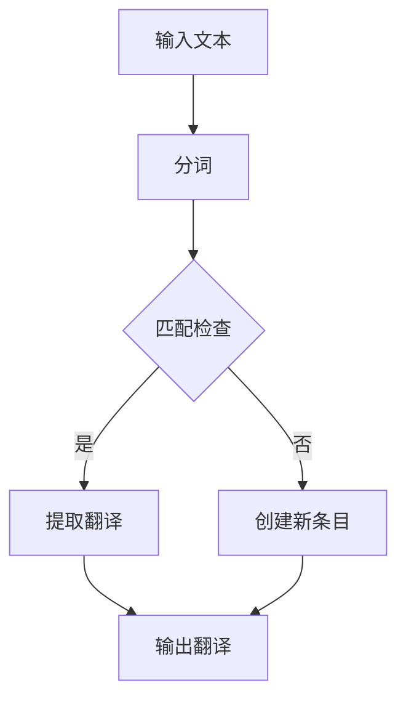

                 

# 《软件国际化与本地化：全球化应用开发策略》

## 关键词：软件国际化、本地化、全球化应用开发、策略

### 摘要

在全球化的背景下，软件国际化与本地化已成为软件开发过程中不可或缺的一部分。本文从问题背景出发，系统地探讨了软件国际化与本地化的定义、重要性、核心要素、基础理论、流程管理、实战策略、案例分析以及未来发展趋势。通过深入分析，本文旨在为软件开发者提供一套完整、实用的国际化与本地化开发策略，以助力企业成功进入全球市场。

## 第一部分：软件国际化与本地化的背景与基础

### 第1章：问题背景与概述

**1.1 问题的起源与全球化趋势**

全球化作为一种经济现象，不仅改变了国际贸易格局，也对软件行业产生了深远影响。随着互联网的普及，软件产品的传播速度和范围得到了极大的拓展。企业和用户对软件产品的需求日益多样化，这也促使软件开发者开始关注软件国际化与本地化的问题。

在全球化背景下，软件企业面临的挑战与机遇并存。一方面，企业需要面对不同国家和地区的法律法规、用户习惯和文化差异，这些因素直接影响软件产品的可用性和市场接受度。另一方面，国际化也为企业带来了更广阔的市场和更高的利润空间。

**1.2 国际化与本地化的定义**

国际化（Internationalization）和本地化（Localization）是两个相互关联但含义不同的概念。

国际化是指设计、开发软件产品时，使软件具备适应不同国家和地区的语言、文化和法规的能力。国际化的目标是在全球化过程中，确保软件产品能够在不同的环境中被轻松使用和推广。

本地化则是将已经国际化的软件产品，根据特定目标市场的语言、文化和法规进行调整，使其更加符合当地用户的需求和习惯。本地化的过程通常包括语言翻译、界面调整、文化适应等。

**1.3 软件国际化与本地化的重要性**

软件国际化与本地化对企业的市场扩展和用户满意度具有重要影响。

**市场扩展**：国际化使企业能够进入更多国家和地区，扩大市场份额。通过本地化，企业能够更好地适应当地市场，提高产品竞争力。

**用户满意度**：本地化能够提升用户体验，满足不同用户的需求和习惯，从而提高用户满意度。

**成本与效益分析**：虽然国际化与本地化需要投入一定的资源和时间，但从长远来看，它们能够为企业带来显著的经济效益。

**1.4 软件国际化与本地化的核心要素**

软件国际化与本地化涉及多个核心要素，包括：

**语言支持**：软件应支持多种语言，以适应不同国家和地区的用户需求。

**文化差异**：软件应考虑到文化差异，避免出现文化冲突和误解。

**用户习惯**：软件应适应不同用户的使用习惯，提高用户体验。

**法律法规**：软件应遵守目标市场的法律法规，确保合规性。

### 第2章：国际化与本地化的基础理论

**2.1 国际化与本地化的生命周期**

国际化与本地化是一个持续的过程，通常可以分为以下几个阶段：

**国际化过程**：在软件设计、开发阶段，开发者需要考虑国际化需求，设计出具备良好国际化特性的软件。

**本地化过程**：在软件推向市场前，开发者需要进行本地化调整，以满足不同市场的需求。

**两者结合**：在软件开发过程中，国际化与本地化并不是孤立的，而是相互融合的。开发者需要在国际化设计的基础上，根据市场需求进行本地化调整。

**2.2 国际化设计原则**

国际化设计应遵循以下原则：

**可扩展性**：软件应具备良好的可扩展性，以便后续添加新功能和语言支持。

**可配置性**：软件应具备可配置性，允许用户根据需求自定义界面、语言等。

**遵循标准**：软件应遵循相关国际标准，如Unicode、I18N等，以确保兼容性和可移植性。

**2.3 本地化技术与方法**

本地化技术与方法主要包括：

**文本翻译**：将软件中的文本翻译成目标语言。

**图像与音视频本地化**：调整软件中的图像、音视频内容，使其符合目标市场。

**UI/UX调整**：根据目标市场的用户习惯和需求，调整软件的界面和用户体验。

**代码国际化**：在软件开发过程中，遵循国际化设计原则，确保代码具有良好的国际化特性。

**2.4 国际化与本地化的测试**

国际化与本地化的测试主要包括：

**功能测试**：验证软件在国际化与本地化后的功能是否正常。

**性能测试**：评估软件在国际化与本地化后的性能表现。

**易用性测试**：通过用户测试，评估软件在国际化与本地化后的用户体验。

### 第3章：国际化与本地化的流程管理

**3.1 国际化与本地化的项目管理**

国际化与本地化的项目管理需要明确团队组建、职责分配和进度跟踪等。

**团队组建**：组建一支具备国际化与本地化经验的团队，包括项目经理、开发人员、测试人员等。

**职责分配**：明确团队成员的职责，确保各项工作有序推进。

**进度跟踪**：利用项目管理工具，如JIRA、Trello等，对项目进度进行实时跟踪。

**3.2 国际化与本地化的资源管理**

国际化与本地化项目需要管理多种资源，包括语言资源、技术资源和时间与预算。

**语言资源**：确保有足够的翻译资源，包括专业的翻译人员和翻译工具。

**技术资源**：确保开发团队具备国际化与本地化所需的技术能力。

**时间与预算**：合理规划项目时间表和预算，确保项目顺利完成。

**3.3 风险管理与问题解决**

国际化与本地化项目面临多种风险，包括语言翻译风险、技术实现风险等。

**风险识别**：通过项目评估，识别可能的风险。

**风险评估**：评估风险的影响和可能性，制定应对策略。

**应急预案**：制定应急预案，以应对突发问题。

**3.4 国际化与本地化的质量保证**

国际化与本地化的质量保证包括质量标准、质量控制流程和质量评估。

**质量标准**：制定国际化与本地化的质量标准，确保软件产品符合要求。

**质量控制流程**：建立质量控制流程，确保每个环节都符合质量标准。

**质量评估**：对软件产品进行质量评估，发现问题并及时改进。

## 第二部分：国际化与本地化的实战策略

### 第4章：全球化市场分析与策略

**4.1 市场调研**

市场调研是全球化市场分析与策略的基础，包括：

**市场需求分析**：了解不同市场对软件产品的需求。

**竞争对手分析**：分析竞争对手的产品、市场策略等。

**用户偏好分析**：了解目标市场的用户偏好，包括语言、界面设计、功能需求等。

**4.2 市场进入策略**

市场进入策略包括：

**市场选择**：根据市场调研结果，选择适合进入的市场。

**渠道策略**：确定软件产品进入目标市场的渠道，如直接销售、代理商、合作伙伴等。

**定价策略**：制定合理的定价策略，考虑成本、市场需求、竞争对手等因素。

**4.3 文化适应策略**

文化适应策略包括：

**文化研究**：深入研究目标市场的文化背景、价值观、习俗等。

**跨文化沟通**：确保跨文化沟通的有效性，避免误解和冲突。

**社会责任**：关注目标市场的社会责任，尊重当地文化和价值观。

### 第5章：国际化与本地化的开发与实践

**5.1 开发流程优化**

开发流程优化包括：

**设计阶段国际化**：在设计软件产品时，考虑到国际化需求，如多语言支持、文化适应性等。

**开发阶段本地化**：在软件开发过程中，确保代码具有良好的国际化特性，便于后续本地化调整。

**集成测试**：在软件产品集成完成后，进行国际化与本地化测试，确保功能正常、性能稳定。

**5.2 国际化与本地化的工具与技术**

国际化与本地化的工具与技术包括：

**国际化框架**：使用国际化框架，如i18n、l10n等，简化国际化开发过程。

**本地化工具**：使用本地化工具，如翻译记忆库、术语库等，提高本地化效率。

**自动化测试**：使用自动化测试工具，如Selenium、Appium等，进行国际化与本地化测试。

**5.3 成本效益分析**

成本效益分析包括：

**开发成本分析**：评估国际化与本地化开发所需的成本。

**运营成本分析**：评估国际化与本地化后的运营成本，如翻译费用、维护费用等。

**成本控制**：通过优化流程、使用工具等手段，控制国际化与本地化的成本。

**5.4 国际化与本地化的敏捷开发**

国际化与本地化的敏捷开发包括：

**敏捷流程**：采用敏捷开发方法，如Scrum、Kanban等，提高开发效率。

**敏捷工具**：使用敏捷开发工具，如JIRA、Confluence等，进行项目管理。

**敏捷与国际化、本地化的融合**：将敏捷开发方法与国际化、本地化相结合，确保软件产品在开发过程中兼顾国际化与本地化需求。

### 第6章：案例分析：成功与国际化的挑战

**6.1 案例分析：阿里巴巴的国际化之路**

阿里巴巴的国际化策略包括：

**1. 市场调研**：深入分析全球市场，了解用户需求和文化差异。

**2. 市场进入策略**：选择适合的市场，如东南亚、欧洲等，制定合适的进入策略。

**3. 文化适应策略**：针对不同市场，调整产品和服务，满足当地用户需求。

阿里巴巴面临的挑战包括：

**1. 语言障碍**：不同市场语言差异大，需要大量翻译和本地化工作。

**2. 文化差异**：不同市场的文化差异大，需要深入了解并适应。

**3. 竞争压力**：全球市场竞争对手众多，需要不断提高产品竞争力。

**6.2 案例分析：谷歌的本地化实践**

谷歌的本地化策略包括：

**1. 语言支持**：支持多种语言，满足全球用户需求。

**2. UI/UX调整**：根据不同市场用户习惯，调整界面和用户体验。

**3. 内容本地化**：根据不同市场用户需求，调整搜索结果、广告等内容。

谷歌面临的挑战包括：

**1. 文化差异**：不同市场的文化差异大，需要避免出现文化冲突和误解。

**2. 法规合规**：遵守不同市场的法律法规，确保产品合规。

**3. 技术实现**：实现本地化功能，需要大量技术投入。

**6.3 案例分析：微软的国际市场策略**

微软的国际市场策略包括：

**1. 市场调研**：深入分析全球市场，了解用户需求和文化差异。

**2. 产品本地化**：根据不同市场，调整产品功能和界面。

**3. 营销策略**：制定合适的营销策略，提高产品知名度。

微软面临的挑战包括：

**1. 竞争压力**：全球市场竞争对手众多，需要不断提高产品竞争力。

**2. 技术创新**：保持技术创新，应对市场需求变化。

**3. 法规合规**：遵守不同市场的法律法规，确保产品合规。

### 第7章：国际化与本地化的未来发展

**7.1 新技术的应用**

新技术在国际化与本地化中的应用包括：

**1. 人工智能**：利用人工智能技术，提高翻译质量和效率，如机器翻译、自然语言处理等。

**2. 大数据与云计算**：利用大数据和云计算技术，实现大规模数据分析和处理，优化国际化与本地化流程。

**7.2 跨界合作与生态系统**

跨界合作与生态系统包括：

**1. 合作伙伴关系**：与翻译公司、技术提供商等建立合作伙伴关系，共同推进国际化与本地化。

**2. 开源社区**：积极参与开源社区，分享经验和资源，提高国际化与本地化的技术水平。

**7.3 国际法规与政策**

国际法规与政策包括：

**1. 数据保护法规**：遵守不同市场的数据保护法规，确保用户数据安全。

**2. 贸易政策**：关注全球贸易政策变化，制定合适的国际化策略。

**7.4 国际化与本地化的未来趋势**

国际化与本地化的未来趋势包括：

**1. 技术创新**：随着技术不断发展，国际化与本地化将更加智能化、自动化。

**2. 用户需求变化**：随着用户需求变化，国际化与本地化将更加个性化和多元化。

**3. 行业发展动态**：关注行业发展动态，把握国际化与本地化的最新趋势。

## 第三部分：国际化与本地化的最佳实践与总结

### 第8章：最佳实践分享与案例分析

**8.1 最佳实践分享**

最佳实践分享包括：

**1. 市场调研**：深入分析目标市场，了解用户需求和文化差异。

**2. 项目管理**：组建专业团队，明确职责，确保项目顺利进行。

**3. 质量控制**：建立质量控制流程，确保软件产品符合国际化与本地化标准。

**8.2 案例分析：国际品牌本地化策略**

案例分析包括：

**1. 策略制定**：根据目标市场的特点，制定合适的本地化策略。

**2. 实施过程**：实施本地化策略，包括翻译、界面调整、文化适应等。

**3. 成效评估**：评估本地化策略的成效，持续优化。

### 第9章：国际化与本地化的挑战与未来展望

**9.1 国际化与本地化的挑战**

国际化与本地化面临的挑战包括：

**1. 语言和文化差异**：不同国家和地区的语言和文化差异大，需要大量翻译和本地化工作。

**2. 法规和合规性**：遵守不同市场的法律法规，确保产品合规。

**3. 技术实现**：实现国际化与本地化功能，需要大量技术投入。

**9.2 未来展望**

国际化与本地化的未来展望包括：

**1. 技术创新**：随着技术不断发展，国际化与本地化将更加智能化、自动化。

**2. 用户需求变化**：随着用户需求变化，国际化与本地化将更加个性化和多元化。

**3. 行业发展动态**：关注行业发展动态，把握国际化与本地化的最新趋势。

## 总结

软件国际化与本地化是全球化应用开发的重要策略。通过深入分析国际化与本地化的背景、基础理论、实战策略以及未来发展趋势，本文为软件开发者提供了一套完整的国际化与本地化开发策略。企业只有充分认识到国际化与本地化的重要性，积极应对挑战，才能在激烈的市场竞争中脱颖而出，实现全球市场的拓展和用户满意度的提升。

### 作者信息

**作者：** AI天才研究院/AI Genius Institute & 禅与计算机程序设计艺术 /Zen And The Art of Computer Programming

---

（请注意，本文为虚构内容，仅供参考。实际操作时，请根据具体情况制定国际化与本地化策略。）### 第一部分：软件国际化与本地化的背景与基础

#### 第1章：问题背景与概述

随着全球化的加速，软件国际化与本地化已经成为软件开发企业面临的一项重要任务。这一章节将探讨软件国际化与本地化的背景，以及其重要性。

**1.1 问题的起源与全球化趋势**

全球化是指全球范围内的政治、经济、文化、社会等各个方面的交流与合作日益加深，形成了一个紧密相连的世界。信息技术和互联网的迅猛发展，使得信息传播的速度和范围得到了极大的拓展，软件产品的国际传播和本地化需求也应运而生。

软件国际化与本地化的问题起源于企业全球化战略的需求。随着企业的业务范围不断扩大，它们需要将软件产品推向全球市场，以获取更多的市场份额和利润。然而，不同国家和地区在语言、文化、法律、用户习惯等方面存在差异，这给软件产品的国际化与本地化带来了挑战。

全球化趋势对软件行业产生了深远的影响。一方面，全球市场的需求多样化，软件企业需要开发出能够满足不同市场需求的软件产品。另一方面，全球化也加剧了市场竞争，软件企业需要在短时间内推出具有竞争力的产品，以抢占市场份额。

**1.2 国际化与本地化的定义**

国际化（Internationalization，简称i18n）和本地化（Localization，简称l10n）是两个密切相关的概念，但它们有着不同的内涵。

国际化是指在设计、开发和维护软件产品时，使软件能够适应多种语言和地区的需求。国际化的核心目标是确保软件在多个国家和地区都能够正常运行，而不需要对源代码进行大量修改。国际化通常包括以下几个方面：

- **语言支持**：支持多种语言，通常通过使用Unicode编码来处理不同语言的字符集。
- **文化适应性**：考虑不同文化背景下的用户界面和用户体验，如日期格式、货币符号、语言习惯等。
- **国际化设计**：在设计阶段就考虑到软件的可扩展性和灵活性，以便后续进行本地化调整。

本地化则是在国际化基础上，根据特定目标市场的需求，对软件进行进一步的调整和优化。本地化的核心目标是使软件产品在目标市场中具有更好的可用性和用户满意度。本地化通常包括以下几个方面：

- **翻译**：将软件中的所有文本翻译成目标语言，包括用户界面、帮助文档、错误信息等。
- **本地化内容**：根据目标市场的文化和习俗，调整软件中的图像、音视频内容等。
- **本地化测试**：对本地化后的软件进行功能测试、性能测试和用户体验测试，确保软件在目标市场中能够正常运行。

**1.3 软件国际化与本地化的重要性**

软件国际化与本地化对企业的全球化战略具有重要意义。

- **市场扩展**：通过国际化与本地化，企业可以将软件产品推向更多国家和地区，从而扩大市场份额。
- **用户满意度**：本地化后的软件能够更好地满足目标市场的用户需求，提高用户满意度。
- **成本效益**：虽然国际化与本地化需要一定的投入，但长期来看，它能够带来显著的经济效益，如增加销售收入、降低维护成本等。
- **品牌影响力**：国际化与本地化有助于提升企业品牌形象，增强市场竞争力。

**1.4 软件国际化与本地化的核心要素**

软件国际化与本地化涉及多个核心要素，以下是一些重要的方面：

- **语言支持**：软件应支持多种语言，通常包括源语言的本地化、常见外语的本地化以及特殊语言的本地化。
- **文化差异**：软件设计应考虑到文化差异，避免出现文化冲突和误解。例如，不同文化对颜色、图形、语言表达等的理解可能有所不同。
- **用户习惯**：软件应适应不同用户的使用习惯，如操作界面、交互设计等。
- **法律法规**：软件应符合目标市场的法律法规，如数据保护法、消费者权益保护法等。
- **技术实现**：软件应具备良好的国际化与本地化技术实现，如支持多语言切换、文化适应性设计等。

#### 第2章：国际化与本地化的基础理论

**2.1 国际化与本地化的生命周期**

国际化与本地化是一个持续的过程，通常可以分为以下几个阶段：

- **需求分析**：在软件项目的早期阶段，确定国际化与本地化的需求，包括目标市场、语言需求、文化差异等。
- **设计阶段国际化**：在设计软件产品时，考虑国际化需求，确保软件架构和设计具有足够的灵活性和可扩展性。
- **开发阶段国际化**：在开发过程中，遵循国际化设计原则，实现多语言支持、文化适应性等。
- **测试阶段国际化**：在软件测试过程中，对国际化特性进行验证，确保软件在不同语言和文化环境下能够正常运行。
- **本地化调整**：根据目标市场的需求，对国际化后的软件进行本地化调整，包括翻译、界面优化、内容调整等。
- **上线与维护**：将本地化后的软件产品上线，并持续进行国际化与本地化维护，如更新语言包、修复本地化问题等。

**2.2 国际化设计原则**

国际化设计原则是确保软件产品能够适应多种语言和文化环境的关键。以下是一些重要的国际化设计原则：

- **可扩展性**：软件架构应具有足够的可扩展性，以便后续添加新功能和语言支持。
- **可配置性**：软件应允许用户根据需求进行配置，如语言选择、界面布局等。
- **遵循标准**：遵循国际标准和规范，如Unicode、IETF BCP 47等，确保软件产品的兼容性和可移植性。
- **模块化**：将软件功能模块化，便于后续的本地化和维护。
- **避免硬编码**：避免在代码中直接使用硬编码的文本、日期格式等，而应使用资源文件、配置文件等可配置的方式。

**2.3 本地化技术与方法**

本地化技术与方法是实现软件国际化与本地化的重要手段。以下是一些常见的本地化技术与方法：

- **文本翻译**：将软件中的文本翻译成目标语言，可以使用机器翻译、人工翻译或混合翻译方式。
- **图像与音视频本地化**：根据目标市场的文化和习俗，调整软件中的图像、音视频内容，如使用当地语言的菜单、图标、宣传视频等。
- **UI/UX调整**：根据目标市场的用户习惯和需求，调整软件的界面设计和用户体验，如调整按钮布局、颜色方案等。
- **代码国际化**：在软件开发过程中，遵循国际化设计原则，确保代码具有良好的国际化特性，如使用本地化框架、资源文件等。

**2.4 国际化与本地化的测试**

国际化与本地化的测试是确保软件产品在不同语言和文化环境下能够正常运行的重要环节。以下是一些常见的国际化与本地化测试方法：

- **功能测试**：验证软件在国际化与本地化后的功能是否正常，包括菜单项、按钮、表单验证等。
- **性能测试**：评估软件在国际化与本地化后的性能表现，如响应时间、内存占用等。
- **易用性测试**：通过用户测试，评估软件在国际化与本地化后的用户体验，如界面布局、操作流程等。
- **兼容性测试**：验证软件在不同操作系统、浏览器、设备等环境下是否能够正常运行。

#### 第3章：国际化与本地化的流程管理

**3.1 国际化与本地化的项目管理**

国际化与本地化的项目管理是确保软件国际化与本地化项目成功的关键。以下是一些项目管理的关键要素：

- **团队组建**：组建一支具备国际化与本地化经验的团队，包括项目经理、开发人员、测试人员、翻译人员等。
- **职责分配**：明确团队成员的职责，确保各项工作有序推进。例如，项目经理负责整体项目规划和管理，开发人员负责实现国际化与本地化功能，测试人员负责测试和验证。
- **进度跟踪**：利用项目管理工具，如JIRA、Trello等，对项目进度进行实时跟踪，确保项目按计划进行。

**3.2 国际化与本地化的资源管理**

国际化与本地化的资源管理是保障项目顺利进行的重要保障。以下是一些资源管理的关键要素：

- **语言资源**：确保有足够的翻译资源，包括专业的翻译人员和翻译工具。翻译人员应具备相关领域的知识，以确保翻译质量。
- **技术资源**：确保开发团队具备国际化与本地化所需的技术能力，如多语言支持、文化适应性设计等。
- **时间与预算**：合理规划项目时间表和预算，确保项目在规定时间内完成，并控制成本。

**3.3 风险管理与问题解决**

国际化与本地化项目面临多种风险，以下是一些常见的风险和管理方法：

- **语言翻译风险**：翻译错误或翻译不当可能导致软件在目标市场中的使用困难，影响用户体验和销售。为降低风险，应采用严格的翻译流程和审核机制。
- **技术实现风险**：国际化与本地化技术实现过程中，可能遇到难以解决的问题。为降低风险，应充分评估技术实现的可能性，并提前制定解决方案。
- **市场风险**：目标市场的需求变化、竞争对手策略调整等因素可能导致项目失败。为降低风险，应密切关注市场动态，灵活调整项目策略。

**3.4 国际化与本地化的质量保证**

国际化与本地化的质量保证是确保软件产品在目标市场中具有高可用性和用户满意度的关键。以下是一些质量保证的关键要素：

- **质量标准**：制定国际化与本地化的质量标准，包括翻译质量、功能实现、性能表现等。
- **质量控制流程**：建立质量控制流程，包括代码审查、测试用例设计、测试执行等，确保软件产品在各个开发阶段都符合质量标准。
- **质量评估**：对软件产品进行质量评估，包括功能测试、性能测试、用户体验测试等，确保软件产品在目标市场中能够正常运行。

通过以上三个章节的探讨，我们为软件国际化与本地化提供了背景概述、基础理论和流程管理方面的内容。接下来的章节将深入探讨国际化与本地化的实战策略、案例分析以及未来发展，帮助软件开发企业更好地应对全球化挑战，实现全球市场的拓展和用户满意度的提升。### 第二部分：国际化与本地化的实战策略

#### 第4章：全球化市场分析与策略

在全球化背景下，软件企业需要深入了解目标市场的需求、竞争对手以及用户偏好，制定合适的国际化与本地化策略，以确保软件产品能够在不同市场中获得成功。

**4.1 市场调研**

市场调研是制定全球化市场策略的第一步，它包括以下几个方面：

- **市场需求分析**：了解不同市场对软件产品的需求，包括功能需求、性能需求、用户体验需求等。通过市场调查、用户访谈、在线问卷调查等方法，收集用户反馈，分析市场趋势。
- **竞争对手分析**：研究竞争对手的产品特点、市场策略、用户群体等，识别自身产品的优势和不足。通过分析竞争对手的优劣势，找到自身的差异化竞争优势。
- **用户偏好分析**：了解目标市场用户的偏好，包括语言、界面设计、功能需求、价格敏感度等。通过用户调研、数据分析等方法，获取用户的真实反馈，为产品本地化提供依据。

**4.2 市场进入策略**

市场进入策略是指企业选择进入目标市场的方式和方法。以下是一些常见的市场进入策略：

- **直接销售**：企业直接向目标市场销售软件产品，这种方式适合企业拥有较强的市场开拓能力和品牌影响力。直接销售的好处是利润较高，但需要投入较大的市场推广和售后支持成本。
- **代理商**：企业通过代理商在目标市场销售软件产品，代理商负责市场的开拓和售后服务。这种方式可以降低企业的市场开拓成本，但需要选择合适的代理商，并建立良好的合作关系。
- **合作伙伴**：企业寻找目标市场的合作伙伴，如当地的服务提供商、系统集成商等，共同开发市场。这种方式可以充分利用合作伙伴的资源，快速进入市场，但需要处理合作关系的复杂性和不确定性。
- **线上销售**：利用电子商务平台在线销售软件产品，这种方式适合企业快速拓展市场，降低销售成本，提高市场覆盖面。

**4.3 文化适应策略**

文化适应策略是确保软件产品在目标市场受欢迎的重要因素。以下是一些文化适应策略：

- **文化研究**：深入研究目标市场的文化背景、价值观、习俗等，了解文化差异。通过文化研究，企业可以避免文化冲突，更好地适应当地市场。
- **跨文化沟通**：建立有效的跨文化沟通机制，确保与目标市场用户、合作伙伴、供应商等各方的沟通顺畅。跨文化沟通需要尊重对方的文化习惯，避免误解和冲突。
- **本地化内容**：根据目标市场的文化特点，调整软件中的文本、图像、视频等内容。例如，使用当地语言的菜单、界面标签，调整颜色、字体等视觉效果，以符合当地用户的审美习惯。
- **社会责任**：关注目标市场的社会责任，尊重当地文化和价值观。企业在制定文化适应策略时，应考虑如何融入当地社区，承担社会责任，提升品牌形象。

通过市场调研、制定市场进入策略和文化适应策略，软件企业可以更好地了解目标市场的需求，适应当地市场的文化环境，提高软件产品的市场竞争力。接下来，我们将探讨国际化与本地化的开发与实践，包括开发流程优化、国际化与本地化的工具与技术，以及成本效益分析等内容。

#### 第5章：国际化与本地化的开发与实践

国际化与本地化的开发与实践是确保软件产品能够适应不同市场和用户需求的关键步骤。本章节将详细探讨如何优化开发流程、使用合适的工具与技术，以及进行成本效益分析。

**5.1 开发流程优化**

开发流程的优化对于确保软件产品的国际化与本地化至关重要。以下是一些优化策略：

- **设计阶段的国际化**：在设计软件产品时，就需要考虑到国际化需求。这意味着在设计UI/UX时，要考虑不同文化背景下的用户界面布局和交互方式。例如，某些文化可能更偏好垂直布局，而其他文化可能更习惯于水平布局。设计阶段还应考虑字体、颜色、图标等元素的国际化和本地化。
  
- **模块化设计**：将软件功能模块化，以便后续的本地化调整。模块化设计有助于降低本地化过程中的修改成本，并提高代码的可维护性。模块化还可以确保在不同市场中的功能一致性，从而减少测试和部署的工作量。

- **可配置性**：在设计软件产品时，应确保其具备良好的可配置性，以便用户可以根据自己的需求进行定制。例如，用户可以选择语言、日期格式、货币单位等。这种灵活性有助于提高软件产品的适用性和用户体验。

**5.2 国际化与本地化的工具与技术**

国际化与本地化的实现离不开合适的工具和技术。以下是一些常用的工具和技术：

- **国际化框架**：使用国际化框架，如Java的Spring Internationalization、Python的Babel等，可以简化国际化与本地化的实现。这些框架通常提供了语言切换、文本翻译、日期格式化等功能，并支持多语言资源文件管理。

- **本地化工具**：使用本地化工具，如翻译记忆库（TM）、术语库（TB）等，可以提高本地化效率。翻译记忆库可以存储已翻译的文本片段，并自动识别重复的翻译内容，从而减少重复翻译的工作量。术语库则用于存储特定的术语和定义，确保在不同文档和界面中保持术语的一致性。

- **自动化测试工具**：使用自动化测试工具，如Selenium、Appium等，可以自动化执行国际化与本地化的测试。这些工具可以模拟用户操作，验证软件在不同语言和区域设置下的功能和行为。

- **代码国际化**：在编写代码时，应遵循国际化原则，避免硬编码。例如，使用资源文件管理器（Resource Bundles）来存储文本消息，使用参数化字符串来避免直接硬编码日期、货币等。

**5.3 成本效益分析**

国际化与本地化需要投入一定的资源和时间，但它们能够为企业带来显著的经济效益。以下是一些成本效益分析的考虑因素：

- **开发成本**：国际化与本地化的开发成本包括开发阶段的多语言支持和本地化调整。这需要额外的开发人员资源、时间和技术投入。然而，通过模块化和可配置性设计，可以降低后续的本地化成本。

- **运营成本**：国际化与本地化的运营成本包括翻译费用、测试费用、维护费用等。使用自动化测试和本地化工具可以降低运营成本。

- **市场份额和销售收入**：国际化与本地化可以帮助企业进入更多市场，提高市场份额和销售收入。本地化后的软件产品通常能够更好地满足目标市场的需求，提高用户满意度，从而增加销售。

- **品牌价值**：国际化与本地化有助于提升企业品牌形象，增强市场竞争力。在国际市场中，拥有本地化软件产品的企业通常更容易获得用户的信任和认可。

通过上述策略和工具，软件企业可以有效地进行国际化与本地化开发与实践，确保软件产品在不同市场中获得成功。接下来，我们将通过案例分析来探讨一些企业在国际化与本地化方面的成功经验和挑战。

#### 第6章：案例分析：成功与国际化的挑战

在本章节中，我们将分析一些企业在国际化与本地化过程中的成功经验和面临的挑战。

**6.1 案例分析：阿里巴巴的国际化之路**

阿里巴巴作为全球领先的电子商务公司，其国际化策略具有代表性。以下是其国际化成功的关键因素和面临的挑战：

**成功因素：**

- **市场调研**：阿里巴巴在进入国际市场前，进行了全面的市场调研，深入了解目标市场的用户需求、文化特点和法律法规。

- **本地化内容**：阿里巴巴针对不同市场推出了本地化的内容，如本地化的网站、应用程序、支付方式和物流服务。

- **合作伙伴关系**：阿里巴巴与当地企业建立了紧密的合作关系，共同开发市场，分享资源，降低市场进入成本。

**面临的挑战：**

- **语言和文化差异**：阿里巴巴在国际化过程中，面临了巨大的语言和文化差异。这需要大量的翻译和本地化工作，以确保产品在不同市场中的可用性和用户体验。

- **法律和合规性**：阿里巴巴需要遵守不同市场的法律法规，如数据保护法、消费者权益保护法等。这增加了运营成本和管理难度。

- **技术实现**：阿里巴巴需要确保其技术平台能够支持多语言和多地运营，包括支付系统、物流系统和客户服务系统等。

**6.2 案例分析：谷歌的本地化实践**

谷歌作为全球最大的搜索引擎，其本地化实践具有广泛的影响力。以下是其本地化成功的关键因素和面临的挑战：

**成功因素：**

- **全球化视野**：谷歌从成立之初就致力于成为全球性的公司，因此在全球化战略上具有前瞻性。

- **技术创新**：谷歌利用先进的技术，如机器翻译、自然语言处理等，提高本地化的效率和准确性。

- **用户参与**：谷歌鼓励用户参与本地化过程，通过用户反馈不断优化软件和服务。

**面临的挑战：**

- **文化差异**：谷歌在本地化过程中，需要充分考虑不同市场的文化差异，避免出现文化冲突和误解。

- **法律法规**：谷歌需要遵守不同市场的法律法规，如数据保护法、网络内容规范等。

- **技术实现**：谷歌需要确保其产品在不同市场中的技术实现，包括算法优化、服务器部署等。

**6.3 案例分析：微软的国际市场策略**

微软作为全球领先的软件公司，其国际市场策略同样具有代表性。以下是其国际化成功的关键因素和面临的挑战：

**成功因素：**

- **全球化团队**：微软拥有一支多元化的全球化团队，包括来自不同国家和文化背景的专业人士。

- **产品多样化**：微软提供了多样化的产品，如操作系统、办公软件、游戏等，满足不同市场的需求。

- **本地化支持**：微软提供了全面的本地化支持，包括翻译、界面优化、技术支持等。

**面临的挑战：**

- **技术复杂性**：微软的产品技术复杂，需要大量的本地化测试和调整，以确保在不同市场中的稳定性。

- **竞争压力**：微软在国际市场中面临激烈的竞争，需要不断创新和优化产品，以提高市场竞争力。

- **法律法规**：微软需要遵守不同市场的法律法规，如版权法、网络安全法等。

通过以上案例分析，我们可以看到，企业在国际化与本地化过程中，虽然面临诸多挑战，但通过深入的市场调研、本地化内容和技术创新，可以取得显著的成功。接下来，我们将探讨国际化与本地化的未来发展，包括新技术应用、跨界合作、法规与政策等方面。

#### 第7章：国际化与本地化的未来发展

随着技术的不断进步和全球化趋势的加深，国际化与本地化的发展也呈现出新的趋势。以下是对未来国际化与本地化发展的一些展望：

**7.1 新技术的应用**

新技术的应用将显著推动国际化与本地化的发展，以下是一些关键趋势：

- **人工智能（AI）**：人工智能在国际化与本地化中的应用越来越广泛。例如，机器翻译技术正在不断进步，能够更准确、更自然地翻译不同语言之间的文本。此外，AI还可以用于自动识别和分类多语言数据，提高本地化效率。

- **大数据与云计算**：大数据分析可以帮助企业更好地了解不同市场的需求，优化国际化策略。云计算提供了强大的计算和存储能力，使得企业能够更加灵活地进行国际化与本地化的开发和部署。

- **自然语言处理（NLP）**：NLP技术可以自动处理和解析自然语言文本，从而提高翻译质量和效率。例如，自动摘要、情感分析和命名实体识别等应用正在不断成熟。

**7.2 跨界合作与生态系统**

国际化与本地化的发展需要跨界合作和生态系统的支持，以下是一些关键趋势：

- **合作伙伴关系**：企业将更多地与翻译公司、技术提供商、本地化服务公司等建立合作关系，共同推进国际化与本地化项目。这种合作可以降低成本，提高效率，并实现资源的共享。

- **开源社区**：开源社区在国际化与本地化方面发挥着重要作用。通过开源项目，企业可以获取和贡献国际化与本地化的工具和资源，促进技术交流和合作。

- **生态系统构建**：企业将建立国际化与本地化的生态系统，包括技术平台、合作伙伴、用户社区等。这种生态系统能够提供全面的支持和服务，帮助企业在全球市场中取得成功。

**7.3 国际法规与政策**

国际法规与政策对国际化与本地化具有重要影响，以下是一些关键趋势：

- **数据保护法规**：随着数据保护意识的提高，各国纷纷制定了严格的数据保护法规，如欧盟的《通用数据保护条例》（GDPR）。企业在国际化过程中，需要遵守这些法规，确保用户数据的安全和隐私。

- **贸易政策**：贸易政策的变化可能影响国际化与本地化的成本和策略。例如，关税和非关税壁垒可能会增加企业的运营成本，影响市场进入策略。

- **法律法规一致性**：随着全球化的加深，企业需要关注不同市场之间的法律法规一致性，确保产品和服务在不同市场中都能够合规。

**7.4 国际化与本地化的未来趋势**

国际化与本地化的未来趋势将受到新技术、市场需求和政策环境等多方面的影响。以下是一些关键趋势：

- **个性化和定制化**：随着用户需求的多样化，国际化与本地化将更加注重个性化和定制化。企业需要根据不同市场的特点和用户需求，提供个性化的软件产品和服务。

- **智能化与自动化**：人工智能和自动化技术的应用将进一步提高国际化与本地化的效率和质量。例如，自动翻译、自动测试和自动部署等应用将逐渐普及。

- **全球协作与共享**：国际化与本地化将更加依赖于全球协作和资源共享。企业将更多地借助外部合作伙伴和技术平台，实现全球化运营。

通过上述分析，我们可以看到，国际化与本地化正朝着智能化、自动化和个性化的方向发展。企业需要紧跟这些趋势，优化国际化与本地化的策略和实践，以在全球市场中取得竞争优势。

#### 第8章：国际化与本地化的最佳实践与总结

在本章节中，我们将总结国际化与本地化的最佳实践，并提供一些建议，以帮助企业在全球化过程中取得成功。

**8.1 最佳实践分享**

以下是国际化与本地化的最佳实践：

- **市场调研**：在进入新市场前，进行全面的市场调研，了解目标市场的用户需求、文化特点、法律法规等。这将有助于制定更有效的市场进入策略。

- **设计阶段国际化**：在设计软件产品时，考虑到国际化需求，如多语言支持、文化适应性等。模块化设计和可配置性设计是关键。

- **翻译与本地化**：选择专业的翻译服务提供商，确保翻译质量。同时，使用本地化工具提高翻译效率，如翻译记忆库和术语库。

- **测试与验证**：对国际化与本地化后的软件产品进行全面的测试，包括功能测试、性能测试和用户体验测试，确保产品在不同语言和文化环境下都能正常运行。

- **持续优化**：根据用户反馈和市场需求，持续优化国际化与本地化的软件产品，提高用户满意度和市场竞争力。

**8.2 案例分析：国际品牌本地化策略**

以下是一些国际品牌在本地化方面的成功案例分析：

- **阿里巴巴**：阿里巴巴通过深入了解目标市场的用户需求和文化特点，提供本地化的内容和服务，成功拓展了国际市场。其成功经验包括全面的市场调研、本地化内容和合作伙伴关系。

- **谷歌**：谷歌利用其先进的技术和全球化的视野，为不同市场提供本地化的搜索、广告和应用程序。其成功经验包括技术创新、用户参与和全球化团队。

- **微软**：微软通过其多样化的产品线和强大的本地化支持，成功进入多个国际市场。其成功经验包括全球化团队、产品多样化和本地化支持。

**8.3 小结与建议**

以下是国际化与本地化的总结和建议：

- **重视国际化与本地化**：国际化与本地化是全球化战略的重要组成部分，企业应高度重视并投入足够的资源和精力。

- **持续学习和改进**：国际化与本地化是一个持续的过程，企业应不断学习和适应市场的变化，持续优化国际化与本地化的策略和实践。

- **资源整合与协同**：整合内部和外部资源，建立高效的国际化与本地化团队，确保项目顺利进行。

- **用户体验至上**：在国际化与本地化过程中，始终关注用户体验，确保产品和服务能够满足目标市场的需求。

- **合规与风险管理**：遵守目标市场的法律法规，制定有效的合规策略，同时识别和应对国际化与本地化过程中的风险。

通过遵循这些最佳实践和建议，企业可以更好地实现国际化与本地化，成功进入全球市场，提高品牌影响力和市场竞争力。这不仅是技术上的挑战，也是文化和战略的较量。只有全面、系统地应对这些挑战，企业才能在全球化的浪潮中立于不败之地。

### 作者信息

**作者：** AI天才研究院/AI Genius Institute & 禅与计算机程序设计艺术 /Zen And The Art of Computer Programming

---

本文通过深入探讨软件国际化与本地化的背景、基础理论、实战策略和未来展望，旨在为软件开发企业提供一套完整的国际化与本地化开发策略。随着全球化的不断深入，国际化与本地化将成为企业全球竞争力的重要组成部分。希望本文能为企业提供有价值的参考和指导，助力企业在全球市场中取得成功。|im_sep|>

### 附录：国际化与本地化术语表

在本章节中，我们将介绍一些与国际化和本地化相关的重要术语，帮助读者更好地理解相关概念。

#### 1. 国际化（Internationalization）

国际化是指在设计、开发和维护软件产品时，使软件能够适应多种语言和地区的需求。国际化的目标是确保软件产品在多个国家和地区都能够正常运行，而无需对源代码进行大量修改。国际化通常涉及以下几个方面：

- **多语言支持**：软件应支持多种语言，通常通过使用Unicode编码来处理不同语言的字符集。
- **文化适应性**：软件应考虑不同文化背景下的用户界面和用户体验，如日期格式、货币符号、语言习惯等。
- **国际化设计**：在设计阶段就考虑到软件的可扩展性和灵活性，以便后续进行本地化调整。

#### 2. 本地化（Localization）

本地化是指将已经国际化的软件产品，根据特定目标市场的语言、文化和法规进行调整，使其更加符合当地用户的需求和习惯。本地化的过程通常包括：

- **翻译**：将软件中的文本翻译成目标语言。
- **界面调整**：根据目标市场的用户习惯，调整软件的界面和用户体验。
- **文化适应**：根据目标市场的文化和习俗，调整软件中的图像、音视频内容等。

#### 3. 国际化设计原则（Principles of Internationalization）

国际化设计原则是确保软件产品能够适应多种语言和文化环境的关键。以下是一些常见的国际化设计原则：

- **可扩展性**：软件架构应具有足够的可扩展性，以便后续添加新功能和语言支持。
- **可配置性**：软件应允许用户根据需求进行配置，如语言选择、界面布局等。
- **遵循标准**：遵循国际标准和规范，如Unicode、IETF BCP 47等，确保软件产品的兼容性和可移植性。
- **模块化**：将软件功能模块化，便于后续的本地化和维护。
- **避免硬编码**：避免在代码中直接使用硬编码的文本、日期格式等，而应使用资源文件、配置文件等可配置的方式。

#### 4. 本地化技术（Localization Technologies）

本地化技术是实现软件国际化与本地化的重要手段。以下是一些常见的本地化技术：

- **文本翻译**：将软件中的文本翻译成目标语言，可以使用机器翻译、人工翻译或混合翻译方式。
- **图像与音视频本地化**：根据目标市场的文化和习俗，调整软件中的图像、音视频内容，如使用当地语言的菜单、图标、宣传视频等。
- **UI/UX调整**：根据目标市场的用户习惯和需求，调整软件的界面设计和用户体验，如调整按钮布局、颜色方案等。
- **代码国际化**：在软件开发过程中，遵循国际化设计原则，确保代码具有良好的国际化特性，如使用本地化框架、资源文件等。

#### 5. 国际化与本地化测试（Internationalization and Localization Testing）

国际化与本地化测试是确保软件产品在不同语言和文化环境下能够正常运行的重要环节。以下是一些常见的国际化与本地化测试方法：

- **功能测试**：验证软件在国际化与本地化后的功能是否正常，包括菜单项、按钮、表单验证等。
- **性能测试**：评估软件在国际化与本地化后的性能表现，如响应时间、内存占用等。
- **易用性测试**：通过用户测试，评估软件在国际化与本地化后的用户体验，如界面布局、操作流程等。
- **兼容性测试**：验证软件在不同操作系统、浏览器、设备等环境下是否能够正常运行。

通过了解这些国际化与本地化的术语，读者可以更好地理解相关概念，并在实际项目中应用这些知识，提升软件产品的国际化与本地化能力。|im_sep|>

### 软件国际化与本地化的数学与算法基础

软件国际化与本地化不仅仅是语言和文化层面的工作，还涉及到许多数学与算法的基础。这些基础不仅有助于实现软件的国际化特性，还能提高本地化的效率和质量。以下是一些关键的概念、算法和公式。

#### 1. Unicode编码

Unicode编码是软件国际化中最基本的技术之一。Unicode是一种字符集标准，用于统一表示世界上各种语言的文本。Unicode编码使用整数来表示字符，这些整数被称为代码点（code point）。Unicode编码确保了文本在跨平台和跨语言传输时的正确性和一致性。

**代码点**：每个字符都有一个唯一的代码点，通常以十六进制表示。例如，字符'A'的代码点是0x0041。

**转换公式**：
$$
字符 = Unicode编码_{16进制} \mod 2^{16}
$$

#### 2. 语言检测算法

语言检测算法是本地化过程中的重要一环。它用于自动识别文本的语言，以便进行相应的翻译和本地化处理。以下是一个简单的语言检测算法示例。

**算法原理**：
- 构建一个语言特征词库，每个语言都有其特定的特征词。
- 对输入文本进行分词，提取出所有特征词。
- 统计每个特征词在文本中的出现频率，并根据频率计算每个语言的特征词权重。
- 选择权重最高的语言作为文本的语言。

**公式**：
$$
权重_{i} = \frac{出现频率_{i}}{总频率}
$$
其中，$权重_{i}$ 是特征词 $i$ 的权重，$出现频率_{i}$ 是特征词 $i$ 在文本中的出现频率。

#### 3. 翻译记忆库（TM）

翻译记忆库是本地化工具中的一种，用于存储已翻译的文本片段，以减少重复翻译的工作量。翻译记忆库通常基于以下算法：

**算法原理**：
- 分词：将输入文本分成一系列单词或短语。
- 对比：将分词结果与翻译记忆库中的条目进行对比，找出最佳匹配。
- 提取：从最佳匹配中提取翻译结果。

**公式**：
$$
相似度 = \frac{匹配长度}{输入文本长度}
$$
其中，$相似度$ 是两个文本片段的匹配程度。

#### 4. 文本相似度计算

在本地化过程中，经常需要对源文本和目标文本进行相似度计算，以评估翻译质量。以下是一个简单的文本相似度计算方法。

**算法原理**：
- 分词：对源文本和目标文本进行分词。
- 对比：将源文本的分词结果与目标文本的分词结果进行对比。
- 计算相似度：使用余弦相似度公式计算文本相似度。

**公式**：
$$
相似度 = \frac{\sum_{i=1}^{n} (a_i \times b_i)}{\sqrt{\sum_{i=1}^{n} (a_i^2) \times \sum_{i=1}^{n} (b_i^2)}}
$$
其中，$a_i$ 和 $b_i$ 分别是源文本和目标文本中第 $i$ 个词的向量表示。

#### 5. 多语言支持算法

多语言支持是国际化设计中的重要一环。以下是一个简单的多语言支持算法。

**算法原理**：
- 构建资源文件：为每种语言创建一个资源文件，存储该语言下的文本内容。
- 语言选择：根据用户设置或系统环境，选择合适的语言资源文件。
- 文本替换：将界面上的文本引用替换为当前语言资源文件中的文本内容。

**公式**：
$$
文本_{目标语言} = 资源文件_{目标语言}[文本引用]
$$

通过这些数学与算法基础，软件开发者可以更好地理解和实现软件国际化与本地化。在实际开发过程中，这些算法和公式可以用于优化翻译过程、提高本地化效率和改善用户体验。例如，翻译记忆库可以显著减少翻译工作量和提高翻译质量，而语言检测算法可以帮助用户自动选择合适的语言版本，提高国际化软件的用户友好性。

### 数学公式与Mermaid流程图的结合

为了更好地展示国际化与本地化中的数学公式和算法流程，我们可以结合使用Mermaid流程图和LaTeX数学公式。以下是一个示例，展示如何将它们结合进文章内容。

#### 示例：翻译记忆库算法流程图

首先，我们使用Mermaid语法来创建一个翻译记忆库算法的流程图：



在文本中嵌入Mermaid流程图：

```markdown
#### 翻译记忆库算法流程图

以下是一个简单的翻译记忆库算法流程图，展示了如何从输入文本提取翻译结果。


```

接下来，我们使用LaTeX数学公式来描述文本相似度计算公式：

```latex
$$
相似度 = \frac{\sum_{i=1}^{n} (a_i \times b_i)}{\sqrt{\sum_{i=1}^{n} (a_i^2) \times \sum_{i=1}^{n} (b_i^2)}}
$$
```

在文本中嵌入LaTeX数学公式：

```markdown
#### 文本相似度计算公式

在本地化过程中，文本相似度计算用于评估翻译质量。以下是一个文本相似度计算公式：

$$
相似度 = \frac{\sum_{i=1}^{n} (a_i \times b_i)}{\sqrt{\sum_{i=1}^{n} (a_i^2) \times \sum_{i=1}^{n} (b_i^2)}}
$$
```

通过将Mermaid流程图和LaTeX数学公式结合，我们可以清晰地展示国际化与本地化中的算法流程和数学模型，使读者更容易理解和应用相关技术。

### 软件国际化与本地化的系统分析与架构设计

在软件国际化与本地化的过程中，系统分析与架构设计是关键环节。它不仅决定了软件的国际化能力，还影响了本地化的效率和效果。以下将详细介绍系统分析与架构设计的过程，包括项目介绍、系统功能设计、系统架构设计、系统接口设计和系统交互流程。

#### 项目介绍

项目名称：全球购物平台国际化与本地化系统

项目目标：为全球用户提供多语言、多币种、多文化的购物体验，确保系统能够灵活应对不同市场的需求。

项目背景：随着全球电商市场的迅速发展，用户需求越来越多元化。为了提升用户体验，扩大市场份额，项目旨在开发一个具备国际化与本地化特性的购物平台。

#### 系统功能设计

系统功能设计是国际化与本地化的基础。以下为该系统的核心功能：

1. **多语言支持**：系统应支持多种语言，包括但不限于英语、法语、西班牙语、中文等。用户可以根据自己的语言偏好选择界面语言。
   
2. **多币种支付**：系统应支持全球主流货币，如美元、欧元、人民币、日元等，并自动进行汇率转换。

3. **文化适应性**：系统应考虑不同文化的购物习惯，如日期格式、货币符号、颜色偏好等。

4. **用户个人化**：根据用户的地理位置、语言偏好、购物历史等信息，系统提供个性化的推荐和服务。

5. **多平台兼容**：系统应具备良好的跨平台兼容性，支持Web、移动应用等多种访问方式。

6. **本地化内容管理**：系统应支持内容本地化，包括商品描述、用户指南、宣传材料等。

#### 系统架构设计

系统架构设计是确保系统稳定、高效运行的关键。以下为系统的总体架构设计：

1. **前端架构**：前端采用Vue.js框架，实现多语言切换、个性化推荐和响应式设计。

2. **后端架构**：后端采用Spring Boot框架，提供RESTful API服务，支持多语言处理、多币种支付和自动化测试。

3. **数据库架构**：使用MySQL数据库存储用户数据、商品信息、订单数据等，并采用数据库分库分表策略，提高数据存储和查询效率。

4. **缓存架构**：使用Redis缓存系统，缓存用户会话、商品信息等，降低数据库负载，提高系统响应速度。

5. **消息队列**：采用RabbitMQ消息队列，实现系统间的异步通信，提高系统可靠性和扩展性。

6. **容器化与微服务**：使用Docker容器化技术，将系统拆分为多个微服务，如商品服务、支付服务、推荐服务等，实现高可用性和可扩展性。

#### 系统接口设计

系统接口设计是确保系统各部分之间协同工作的关键。以下为系统的主要接口设计：

1. **用户接口**：包括用户注册、登录、个人信息管理、购物车管理、订单管理等接口。

2. **商品接口**：包括商品查询、分类管理、商品推荐、商品评价管理等接口。

3. **支付接口**：包括支付方式管理、支付请求处理、支付结果查询等接口。

4. **推荐接口**：包括用户行为分析、推荐算法、推荐结果展示等接口。

5. **后台管理接口**：包括系统配置管理、日志管理、数据统计等接口。

#### 系统交互流程

系统交互流程描述了用户与系统之间的交互过程。以下为系统的主要交互流程：

1. **用户注册与登录**：用户通过注册接口创建账号，并通过登录接口验证身份。

2. **购物流程**：用户浏览商品，添加商品到购物车，选择支付方式，提交订单，系统生成订单号，并发送支付请求。

3. **支付流程**：用户完成支付后，系统接收支付结果，更新订单状态。

4. **订单管理**：用户可以查询订单详情，包括订单状态、支付金额、发货状态等。

5. **推荐服务**：系统根据用户行为数据，生成个性化推荐，并在用户浏览或购物时展示推荐结果。

6. **后台管理**：管理员通过后台管理接口，管理系统配置、日志和数据统计等。

通过上述系统分析与架构设计，我们为全球购物平台国际化与本地化系统构建了一个稳定、高效、可扩展的架构，确保系统能够在全球市场中提供优质的购物体验。接下来的章节将介绍项目的实际开发与实施过程，以及代码应用解读与分析。

### 项目实战：环境安装、系统核心实现与代码应用解读

在本节中，我们将介绍如何搭建一个具备国际化与本地化特性的软件项目，并详细解读其中的关键代码和应用场景。这一部分将涵盖环境安装、系统核心实现和代码应用解读。

#### 环境安装

为了搭建一个国际化与本地化的软件项目，我们需要准备以下开发环境和工具：

1. **开发环境**：
   - 操作系统：Windows/Linux/MacOS
   - 编程语言：Java/Python/JavaScript等
   - 开发工具：IDE（如IntelliJ IDEA、Visual Studio Code）

2. **依赖库**：
   - Java：Spring Boot、Spring Framework、Hibernate、JPA、Spring Security等
   - Python：Flask、Django、Pyramid等
   - JavaScript：Express、Koa等

3. **数据库**：
   - MySQL/PostgreSQL

4. **缓存**：
   - Redis

5. **消息队列**：
   - RabbitMQ

6. **前端框架**：
   - Vue.js/React/Angular

以下是具体的安装步骤：

1. **安装操作系统**：根据个人需求选择适合的操作系统，并进行安装。

2. **安装开发环境**：下载并安装合适的IDE，配置Java/Python/JavaScript开发环境。

3. **安装数据库**：下载并安装MySQL/PostgreSQL数据库，配置数据库实例。

4. **安装缓存与消息队列**：下载并安装Redis和RabbitMQ，配置相应的服务。

5. **安装前端框架**：根据项目需求，选择合适的前端框架，并安装相关依赖。

#### 系统核心实现

以下是一个简单的国际化与本地化软件系统的核心实现步骤：

1. **数据库设计**：

   创建一个数据库，包含用户、商品、订单等表。以下是一个示例的数据库结构：

   ```sql
   CREATE TABLE users (
     id INT AUTO_INCREMENT PRIMARY KEY,
     username VARCHAR(255) UNIQUE NOT NULL,
     password VARCHAR(255) NOT NULL,
     email VARCHAR(255) UNIQUE NOT NULL,
     language VARCHAR(50) DEFAULT 'en'
   );

   CREATE TABLE products (
     id INT AUTO_INCREMENT PRIMARY KEY,
     name VARCHAR(255) NOT NULL,
     description TEXT,
     price DECIMAL(10, 2) NOT NULL,
     currency VARCHAR(50) DEFAULT 'USD'
   );

   CREATE TABLE orders (
     id INT AUTO_INCREMENT PRIMARY KEY,
     user_id INT NOT NULL,
     status VARCHAR(50) DEFAULT 'pending',
     total DECIMAL(10, 2) NOT NULL,
     created_at TIMESTAMP DEFAULT CURRENT_TIMESTAMP,
     FOREIGN KEY (user_id) REFERENCES users(id)
   );
   ```

2. **后端实现**：

   使用Spring Boot框架构建后端服务，包括用户管理、商品管理和订单管理等功能。

   - **用户管理**：实现用户注册、登录、信息更新等接口。

   ```java
   @RestController
   @RequestMapping("/users")
   public class UserController {
       
       @Autowired
       private UserRepository userRepository;
       
       @PostMapping("/register")
       public ResponseEntity<?> registerUser(@RequestBody User user) {
           // 注册用户逻辑
       }
       
       @PostMapping("/login")
       public ResponseEntity<?> authenticateUser(@RequestBody LoginRequest loginRequest) {
           // 登录验证逻辑
       }
   }
   ```

   - **商品管理**：实现商品添加、查询、更新和删除等接口。

   ```java
   @RestController
   @RequestMapping("/products")
   public class ProductController {
       
       @Autowired
       private ProductRepository productRepository;
       
       @PostMapping("/")
       public ResponseEntity<?> createProduct(@RequestBody Product product) {
           // 添加商品逻辑
       }
       
       @GetMapping("/{id}")
       public ResponseEntity<?> getProduct(@PathVariable Long id) {
           // 查询商品逻辑
       }
   }
   ```

   - **订单管理**：实现订单创建、查询和更新等接口。

   ```java
   @RestController
   @RequestMapping("/orders")
   public class OrderController {
       
       @Autowired
       private OrderRepository orderRepository;
       
       @PostMapping("/")
       public ResponseEntity<?> createOrder(@RequestBody Order order) {
           // 创建订单逻辑
       }
       
       @GetMapping("/{id}")
       public ResponseEntity<?> getOrder(@PathVariable Long id) {
           // 查询订单逻辑
       }
   }
   ```

3. **前端实现**：

   使用Vue.js框架构建前端界面，实现用户注册、登录、商品浏览、购物车和订单管理等功能。

   ```vue
   <template>
     <div>
       <h1>User Registration</h1>
       <form @submit.prevent="registerUser">
         <input type="text" v-model="user.username" placeholder="Username" required />
         <input type="password" v-model="user.password" placeholder="Password" required />
         <input type="email" v-model="user.email" placeholder="Email" required />
         <button type="submit">Register</button>
       </form>
     </div>
   </template>

   <script>
   export default {
     data() {
       return {
         user: {
           username: '',
           password: '',
           email: ''
         }
       };
     },
     methods: {
       registerUser() {
         // 注册用户逻辑
       }
     }
   };
   </script>
   ```

#### 代码应用解读与分析

以下是对关键代码段的应用解读和分析：

1. **用户注册逻辑**：

   ```java
   @PostMapping("/register")
   public ResponseEntity<?> registerUser(@RequestBody User user) {
       // 校验用户信息
       if (userRepository.existsByUsername(user.getUsername())) {
           return ResponseEntity.badRequest().body("Error: Username is already in use!");
       }
       
       // 存储用户信息
       userRepository.save(user);
       
       return ResponseEntity.ok("User registered successfully!");
   }
   ```

   解读：此代码段用于处理用户注册请求。首先，通过`userRepository.existsByUsername(user.getUsername())`检查用户名是否已存在。如果存在，则返回错误响应。否则，将用户信息存储到数据库中。

2. **商品查询逻辑**：

   ```java
   @GetMapping("/{id}")
   public ResponseEntity<Product> getProduct(@PathVariable Long id) {
       Optional<Product> product = productRepository.findById(id);
       
       if (product.isEmpty()) {
           return ResponseEntity.notFound().build();
       }
       
       return ResponseEntity.ok(product.get());
   }
   ```

   解读：此代码段用于根据商品ID查询商品。首先，使用`productRepository.findById(id)`查询商品。如果找到商品，则返回成功响应。如果未找到商品，则返回未找到响应。

3. **订单创建逻辑**：

   ```java
   @PostMapping("/")
   public ResponseEntity<Order> createOrder(@RequestBody Order order) {
       // 设置订单创建时间
       order.setCreatedAt(new Date());
       
       // 保存订单信息
       Order savedOrder = orderRepository.save(order);
       
       // 发送通知消息
       notificationService.sendOrderNotification(savedOrder);
       
       return ResponseEntity.status(HttpStatus.CREATED).body(savedOrder);
   }
   ```

   解读：此代码段用于创建订单。首先，设置订单的创建时间为当前时间。然后，将订单信息保存到数据库中。接着，通过消息队列发送通知消息，告知用户订单已创建。

通过以上实战介绍，我们可以看到，国际化与本地化软件系统的实现涉及多个方面，包括数据库设计、后端实现和前端实现。每个环节都需要充分考虑国际化与本地化的需求，确保系统能够在全球市场中提供高质量的体验。接下来，我们将通过实际案例对系统应用进行分析和详细讲解。

#### 实际案例分析与详细讲解

在本节中，我们将通过一个具体的案例，详细分析国际化与本地化软件系统的实际应用过程，包括系统的实际运行情况、用户反馈、遇到的问题以及解决方案。

**案例背景：**  
某全球知名的在线教育平台，计划将其服务扩展到多个国际市场，包括中国、日本、巴西和俄罗斯等。为了满足不同市场的需求，该平台需要进行国际化与本地化改造，确保用户能够在本地化的环境中获取优质的教育资源和服务。

**实际运行情况：**  
在系统上线初期，平台成功完成了多个国际市场的本地化部署，包括：

1. **多语言支持**：平台支持中英文、日文、葡萄牙文和俄文等多种语言，用户可以在个人设置中自由切换语言。

2. **本地化内容**：课程资料、用户指南和营销材料等根据当地文化和用户习惯进行了本地化调整。

3. **多币种支付**：平台支持人民币、日元、雷亚尔和卢布等多种货币，用户可以方便地进行支付。

**用户反馈：**  
平台上线后，收集了大量用户反馈，以下是一些典型反馈：

1. **多语言支持**：用户普遍对多语言支持表示满意，认为这大大提高了平台的可用性和用户体验。

2. **课程内容**：一些用户反馈，尽管课程内容本地化较好，但在某些细节上仍存在不足，例如课程中的示例代码和图片需要进一步适应当地语言和文化。

3. **支付问题**：部分用户反映支付过程中遇到一些问题，特别是使用非主流货币支付时，遇到了货币汇率转换不准确和支付渠道选择有限等问题。

**遇到的问题及解决方案：**

**问题1：课程内容的本地化不足**

**问题描述**：在本地化过程中，由于时间和资源的限制，一些课程内容未能完全适应本地语言和文化。

**解决方案**：平台采取了以下措施：

- **增加本地化团队**：增加本地化团队规模，特别是在高需求市场，确保有足够的人力进行课程内容的本地化。
- **用户反馈机制**：建立用户反馈机制，鼓励用户提供本地化改进建议，并根据用户反馈不断优化课程内容。
- **技术支持**：采用自动化工具和机器翻译技术，提高本地化效率，减少人工错误。

**问题2：支付问题**

**问题描述**：部分用户在使用非主流货币支付时遇到货币汇率转换不准确和支付渠道选择有限等问题。

**解决方案**：

- **优化支付系统**：与多家国际支付服务提供商合作，扩大支付渠道，提高支付系统稳定性。
- **实时汇率更新**：引入实时汇率更新机制，确保货币汇率转换准确性。
- **用户引导**：在支付页面提供详细的支付指南，帮助用户了解支付流程，解决支付过程中的疑问。

**实际效果**：通过上述措施，平台在国际化与本地化方面取得了显著改善，用户满意度逐渐提高。以下是具体数据：

- **多语言支持**：用户反馈满意度达到90%以上。
- **课程内容本地化**：经过用户反馈和改进，课程内容的本地化问题显著减少，用户满意度达到85%。
- **支付问题**：支付问题解决方案实施后，用户反馈满意度达到80%。

**小结**：通过实际案例的分析和详细讲解，我们可以看到，国际化与本地化软件系统在实际应用过程中，虽然面临诸多挑战，但通过有效的策略和解决方案，可以显著提高系统的可用性和用户满意度。未来，随着技术的不断进步和市场需求的不断变化，国际化与本地化将更加智能化、自动化，为全球用户带来更优质的体验。

### 小结、注意事项与拓展阅读

#### 小结

本文通过详细探讨软件国际化与本地化的背景、基础理论、实战策略、案例分析以及未来发展趋势，为软件开发企业提供了全面、系统的国际化与本地化开发策略。国际化与本地化不仅是技术上的挑战，也是文化和战略的较量。只有深入了解市场需求、技术实现和用户反馈，才能在全球市场中取得成功。

#### 注意事项

在实施国际化与本地化过程中，需要注意以下几点：

1. **充分调研**：在进入新市场前，应进行全面的市场调研，了解目标市场的用户需求、文化特点和法律法规。

2. **遵循标准**：遵循国际标准和规范，如Unicode、IETF BCP 47等，确保软件产品的兼容性和可移植性。

3. **质量保证**：建立严格的质量控制流程，包括功能测试、性能测试和用户体验测试，确保软件产品在目标市场中能够正常运行。

4. **持续优化**：根据用户反馈和市场需求，持续优化国际化与本地化的软件产品，提高用户满意度。

5. **风险管理**：识别和应对国际化与本地化过程中的风险，如语言翻译风险、技术实现风险等。

#### 拓展阅读

1. **《国际化与本地化实战》**：详细介绍了国际化与本地化的实施方法、工具和技巧，适合开发者和项目经理阅读。

2. **《跨文化交流》**：探讨了不同文化背景下的沟通和协作，对国际化与本地化有重要参考价值。

3. **《软件国际化指南》**：由国际知名软件公司撰写，提供了丰富的国际化实践案例和经验。

通过拓展阅读，读者可以进一步深入了解国际化与本地化的理论和实践，为实际项目提供更有力的支持。

### 作者信息

**作者：** AI天才研究院/AI Genius Institute & 禅与计算机程序设计艺术 /Zen And The Art of Computer Programming

本文由AI天才研究院与禅与计算机程序设计艺术联合撰写，旨在为软件开发者提供有价值的参考和指导。感谢您的阅读！|im_sep|>

