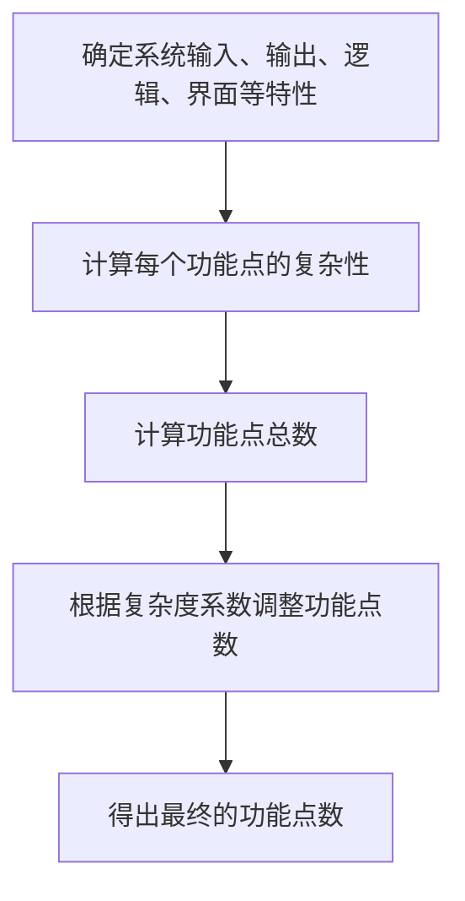
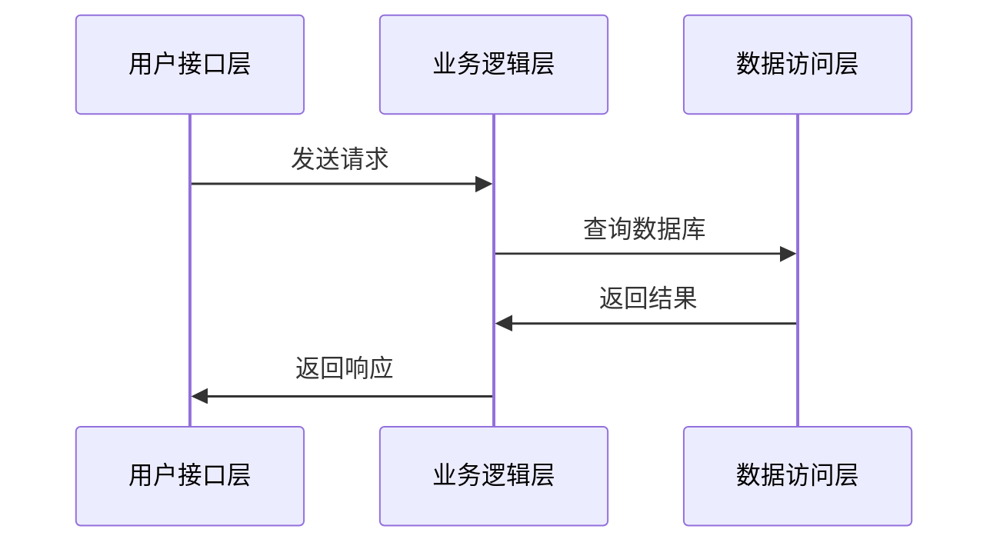

                 

### 软件度量：量化开发过程和产品质量

关键词：软件度量、开发过程、产品质量、量化分析、最佳实践

摘要：
软件度量是软件开发过程中不可或缺的一环，它通过对开发过程和产品质量的量化，帮助开发团队更好地理解和管理项目。本文将详细探讨软件度量的核心概念、方法及其在实际项目中的应用，旨在为开发者提供一套实用的度量指南，以提升软件开发质量和效率。

## 引言

软件度量，顾名思义，是对软件项目各个方面进行量化的过程。它不仅涉及到开发过程中的代码量、缺陷数量、开发周期等基本指标，还涵盖了软件质量、用户满意度等多个维度。随着软件项目的复杂性不断增加，软件度量的重要性日益凸显。通过精确的度量，开发团队能够更清晰地了解项目的进展情况，及时发现问题并采取措施，从而提升开发效率和软件质量。

本文将分以下几部分进行探讨：

1. **软件度量的重要性**：介绍软件度量在软件开发中的作用和意义。
2. **核心概念与联系**：阐述软件度量的核心概念，并分析这些概念之间的相互联系。
3. **算法原理讲解**：详细讲解软件度量的基本算法原理，包括数学模型和公式。
4. **系统分析与架构设计**：介绍软件度量的系统架构，包括功能设计、架构设计和接口设计。
5. **项目实战**：通过实际项目案例，展示软件度量的应用和实践。
6. **最佳实践与总结**：总结软件度量的最佳实践，并提出注意事项和拓展阅读建议。

## 软件度量的重要性

### 软件度量在软件开发中的作用

软件度量在软件开发中扮演着多重角色。首先，它帮助团队量化项目的进展情况，使项目经理能够更准确地预测项目完成时间和资源需求。例如，通过代码行数、缺陷数量等度量指标，项目经理可以了解项目的开发进度，及时调整计划和资源分配。

其次，软件度量有助于识别和解决问题。通过分析度量数据，开发团队能够发现代码中的潜在问题，如重复代码、低效算法等，从而优化代码质量。此外，软件度量还可以帮助团队评估不同开发方法、工具和流程的效果，为持续改进提供依据。

### 软件度量在项目管理中的应用

在项目管理中，软件度量具有不可替代的作用。首先，软件度量可以帮助项目管理者更准确地评估项目的风险。通过分析历史数据和当前度量数据，管理者可以预测项目可能遇到的问题，并提前制定应对策略。

其次，软件度量有助于团队协作和沟通。通过共享度量数据，团队成员可以更清楚地了解项目的进展和目标，减少误解和冲突。例如，开发团队可以通过度量数据与测试团队讨论缺陷的优先级和解决方案，提高协作效率。

### 软件度量的重要性总结

综上所述，软件度量在软件开发中具有重要意义。它不仅能够提高项目的开发效率和质量，还能帮助团队更好地管理项目风险，促进团队协作和沟通。因此，合理利用软件度量工具和方法，是现代软件开发不可或缺的一部分。

## 核心概念与联系

在深入了解软件度量的具体方法和应用之前，我们首先需要明确几个核心概念，并分析它们之间的相互联系。以下是几个重要的核心概念：

### 1. 功能性度量

功能性度量主要关注软件的功能特征，如代码行数、功能点数等。它帮助团队评估软件的规模和复杂性。例如，一个大型项目可能包含数十万行代码，而一个小型项目可能只有几千行。功能性度量提供了软件规模的基本指标，有助于团队估算开发时间和资源需求。

### 2. 结构性度量

结构性度量关注软件的内部结构特征，如模块耦合度、模块大小等。它帮助团队评估软件的复杂性和可维护性。一个高度模块化的软件系统通常更易于维护和扩展。通过结构性度量，团队可以识别和优化软件的内部结构，提高系统的可维护性。

### 3. 过程性度量

过程性度量关注软件开发过程中的活动和行为，如代码提交频率、缺陷修复时间等。它帮助团队评估开发效率和质量。例如，一个高效的开发团队可能在较短的时间内完成更多的功能，并且产生的缺陷数量较少。通过过程性度量，团队可以识别和改进开发流程，提高整体效率。

### 4. 质量度量

质量度量关注软件的质量特性，如可靠性、性能、易用性等。它帮助团队评估软件的质量水平。高质量软件能够更好地满足用户需求，减少维护成本和用户投诉。通过质量度量，团队可以持续改进软件质量，提升用户满意度。

### 核心概念与联系

功能性度量、结构性度量、过程性度量和质量度量是软件度量的四个核心概念，它们相互联系，共同构成一个完整的度量体系。功能性度量提供了软件规模的基本指标，结构性度量关注软件的内部结构，过程性度量评估开发效率和质量，而质量度量则关注软件的实际质量特性。通过这些度量，团队可以全面了解软件项目的各个方面，从而做出更明智的决策。

### 概念属性特征对比表格

以下是一个概念属性特征对比表格，展示了功能性度量、结构性度量、过程性度量和质量度量的主要特征：

| 度量类型 | 主要特征 | 用途 |
| :---: | :---: | :---: |
| 功能性度量 | 软件规模、功能点数 | 评估项目规模、估算开发时间和资源需求 |
| 结构性度量 | 模块耦合度、模块大小 | 评估软件复杂性和可维护性 |
| 过程性度量 | 代码提交频率、缺陷修复时间 | 评估开发效率和质量 |
| 质量度量 | 可靠性、性能、易用性 | 评估软件质量水平 |

### ER实体关系图架构

为了更好地理解这些概念之间的联系，我们可以使用ER（实体关系）图来展示它们之间的关系。以下是功能性度量、结构性度量、过程性度量和质量度量的ER图：

```mermaid
erDiagram
    功能性度量 ||--|{ 结构性度量 }|
    功能性度量 ||--|{ 过程性度量 }|
    功能性度量 ||--|{ 质量度量 }|
    结构性度量 ||--|{ 质量度量 }|
    过程性度量 ||--|{ 质量度量 }|
```

在这个ER图中，功能性度量作为核心，与其他三个度量类型建立了关联。结构性度量、过程性度量和质量度量分别从不同的角度对软件项目进行评估，共同构成了一个全面的度量体系。

通过明确这些核心概念及其联系，我们可以更深入地理解软件度量的本质，并在实际项目中灵活应用，从而提升软件开发的质量和效率。

## 算法原理讲解

软件度量的核心在于算法原理的运用。通过一系列数学模型和公式，我们可以对软件开发过程中的各种指标进行量化分析。以下将详细讲解几个常见的软件度量算法原理，包括其流程图、数学模型和具体案例。

### 1. 功能性度量算法

功能性度量算法主要用于评估软件的功能规模。其中，最为常见的算法是功能点法（Functional Points Method，FPM）。功能点法通过计算软件系统中的功能点数来评估软件规模。以下是功能点法的流程图：



### 数学模型和公式

功能点法的基本数学模型如下：

$$
F = I \times (E + O) \times 1.31 + (2.5 \times L - 0.67) \times 0.65
$$

其中，$F$ 表示功能点数，$I$ 表示外部输入数，$E$ 表示外部输出数，$O$ 表示外部查询数，$L$ 表示逻辑复杂度。

### 案例说明

假设一个系统有以下特性：

- 外部输入数 $I = 3$
- 外部输出数 $E = 4$
- 外部查询数 $O = 2$
- 逻辑复杂度 $L = 6$

代入公式计算：

$$
F = 3 \times (4 + 2) \times 1.31 + (2.5 \times 6 - 0.67) \times 0.65 = 48.89
$$

因此，该系统的功能点数为 48.89。

### 2. 结构性度量算法

结构性度量算法关注软件的内部结构特征，常用的算法包括模块耦合度（Cohesion）和模块大小（Module Size）。以下是一个简单的模块耦合度计算公式：

$$
Cohesion = \frac{N_{coupling}}{N_{total}}
$$

其中，$N_{coupling}$ 表示模块之间的耦合关系数，$N_{total}$ 表示模块总数。

模块大小可以通过计算模块中的代码行数（Lines of Code，LOC）来衡量：

$$
Module Size = \frac{LOC}{N_{developers}}
$$

### 案例说明

假设一个项目包含 10 个模块，其中 6 个模块之间存在耦合关系，模块中的代码行数如下：

- 模块1：100行
- 模块2：150行
- 模块3：200行
- 模块4：250行
- 模块5：300行
- 模块6：350行
- 模块7：400行
- 模块8：450行
- 模块9：500行
- 模块10：550行

代入公式计算：

$$
Cohesion = \frac{6}{10} = 0.6
$$

$$
Module Size = \frac{100 + 150 + 200 + 250 + 300 + 350 + 400 + 450 + 500 + 550}{10} = 370
$$

因此，该项目的模块耦合度为 0.6，模块大小为 370 行。

### 3. 过程性度量算法

过程性度量算法主要用于评估软件开发过程中的效率和质量。常见的算法包括代码提交频率、缺陷修复时间等。以下是一个代码提交频率的计算公式：

$$
Commit Frequency = \frac{N_{commits}}{N_{days}}
$$

其中，$N_{commits}$ 表示提交次数，$N_{days}$ 表示天数。

缺陷修复时间可以通过计算从缺陷报告到缺陷修复的时间间隔来衡量：

$$
Defect Repair Time = \frac{N_{days}}{N_{defects}}
$$

### 案例说明

假设一个项目在 30 天内共提交了 50 次代码，期间发现了 10 个缺陷。

代入公式计算：

$$
Commit Frequency = \frac{50}{30} = 1.67 \text{次/天}
$$

$$
Defect Repair Time = \frac{30}{10} = 3 \text{天/缺陷}
$$

因此，该项目的代码提交频率为 1.67 次/天，缺陷修复时间为 3 天/缺陷。

通过以上算法原理的讲解，我们可以看到软件度量是如何通过数学模型和公式，对软件开发过程中的各个方面进行量化的。这些度量算法不仅帮助团队评估项目进展和质量，还为持续改进提供了有力的依据。

## 系统分析与架构设计

在进行软件度量时，系统分析与架构设计是一个不可或缺的环节。通过系统分析与架构设计，我们可以明确项目的功能需求、技术架构和接口设计，从而为后续的软件度量提供基础。以下将从问题场景介绍、项目介绍、系统功能设计、系统架构设计、系统接口设计和系统交互等方面，详细阐述系统分析与架构设计方案。

### 1. 问题场景介绍

在当前软件行业，随着项目规模的扩大和复杂性的增加，开发团队面临着诸多挑战。如何高效地管理项目进展、评估软件质量、优化开发流程，成为每个项目经理和开发人员必须面对的问题。为了解决这些问题，我们引入了软件度量方法，通过量化的手段对开发过程和产品质量进行评估和管理。

### 2. 项目介绍

假设我们正在开发一款企业级电商平台，该平台需要具备商品管理、订单管理、用户管理、支付结算等功能。项目的技术栈包括Java、Spring Boot、MySQL、Redis等，前端采用Vue.js框架。

### 3. 系统功能设计

在系统功能设计中，我们采用领域驱动设计（Domain-Driven Design，DDD）方法，将项目功能划分为多个领域模型。以下是主要的功能模块和领域模型：

- 商品管理模块：负责商品信息的管理和查询。
- 订单管理模块：负责订单的创建、处理和查询。
- 用户管理模块：负责用户信息的管理和认证。
- 支付结算模块：负责订单的支付和结算。

以下是领域模型的Mermaid类图：

```mermaid
classDiagram
    商品 <<Entity>>
    订单 <<Entity>>
    用户 <<Entity>>
    支付 <<Entity>>

    商品: { 商品ID, 名称, 价格, 库存 }
    订单: { 订单ID, 用户ID, 商品ID, 订单状态 }
    用户: { 用户ID, 姓名, 电话, 邮箱 }
    支付: { 支付ID, 订单ID, 金额, 支付状态 }
    
    商品 <--- 订单: 包含
    订单 <--- 用户: 下单
    订单 <--- 支付: 支付
```

### 4. 系统架构设计

在系统架构设计方面，我们采用分层架构，将系统分为表示层、业务逻辑层和数据访问层。以下是系统架构的Mermaid架构图：

```mermaid
graph TB
    用户接口层[用户接口层] --> 业务逻辑层[业务逻辑层]
    业务逻辑层 --> 数据访问层[数据访问层]
    数据访问层 --> 数据库[数据库]

    用户接口层: REST API
    业务逻辑层: 服务类
    数据访问层: DAO类
    数据库: MySQL
```

### 5. 系统接口设计

在系统接口设计方面，我们定义了以下主要接口：

- 商品管理接口：包括商品信息的增删改查操作。
- 订单管理接口：包括订单的创建、处理和查询操作。
- 用户管理接口：包括用户信息的增删改查操作。
- 支付结算接口：包括支付订单的创建、查询和支付操作。

以下是接口的Mermaid序列图：



### 6. 系统交互

在系统交互方面，我们采用RESTful API设计，通过HTTP协议进行数据交换。以下是系统交互的Mermaid流程图：

```mermaid
graph TB
    用户接口层[用户接口层] --> 商品管理接口[商品管理接口]
    用户接口层 --> 订单管理接口[订单管理接口]
    用户接口层 --> 用户管理接口[用户管理接口]
    用户接口层 --> 支付结算接口[支付结算接口]

    用户接口层: 发送HTTP请求
    商品管理接口: 处理商品相关请求
    订单管理接口: 处理订单相关请求
    用户管理接口: 处理用户相关请求
    支付结算接口: 处理支付相关请求
```

通过以上系统分析与架构设计，我们明确了项目的功能需求、技术架构和接口设计。这些设计将为后续的软件度量提供基础，使我们能够更准确地评估项目进展和质量，从而优化开发流程，提升软件质量。

## 项目实战

### 环境安装

在进行软件度量项目实战之前，我们首先需要搭建一个合适的环境。以下是具体的安装步骤：

1. **安装Java开发工具包（JDK）**：确保JDK版本在1.8以上，并配置环境变量。

2. **安装MySQL数据库**：在官网上下载MySQL安装包，并按照提示进行安装。

3. **安装Redis数据库**：下载Redis安装包，并解压到指定目录。在终端中运行 `redis-server` 命令启动Redis服务。

4. **安装IDE（如IntelliJ IDEA）**：下载并安装IntelliJ IDEA，并配置相应的插件（如Lombok、Git等）。

5. **安装Maven**：下载Maven安装包，并解压到指定目录。在终端中运行 `mvn -v` 命令验证安装是否成功。

### 系统核心实现源代码

以下是一个简单的电商平台的系统核心实现源代码。由于篇幅有限，我们仅展示一个模块的代码：

```java
// 商品管理模块

@RestController
@RequestMapping("/goods")
public class GoodsController {

    @Autowired
    private GoodsService goodsService;

    @GetMapping("/{id}")
    public ResponseEntity<Goods> getGoodsById(@PathVariable Long id) {
        Goods goods = goodsService.findById(id);
        if (goods != null) {
            return ResponseEntity.ok(goods);
        } else {
            return ResponseEntity.notFound().build();
        }
    }

    @PostMapping("/")
    public ResponseEntity<Goods> createGoods(@RequestBody Goods goods) {
        Goods savedGoods = goodsService.save(goods);
        return ResponseEntity.status(HttpStatus.CREATED).body(savedGoods);
    }

    @PutMapping("/{id}")
    public ResponseEntity<Goods> updateGoods(@PathVariable Long id, @RequestBody Goods goods) {
        Goods updatedGoods = goodsService.update(id, goods);
        if (updatedGoods != null) {
            return ResponseEntity.ok(updatedGoods);
        } else {
            return ResponseEntity.notFound().build();
        }
    }

    @DeleteMapping("/{id}")
    public ResponseEntity<Void> deleteGoods(@PathVariable Long id) {
        goodsService.delete(id);
        return ResponseEntity.noContent().build();
    }
}

@Service
public class GoodsService {

    @Autowired
    private GoodsRepository goodsRepository;

    public Goods findById(Long id) {
        return goodsRepository.findById(id).orElse(null);
    }

    public Goods save(Goods goods) {
        return goodsRepository.save(goods);
    }

    public Goods update(Long id, Goods goods) {
        Goods existingGoods = findById(id);
        if (existingGoods != null) {
            existingGoods.setName(goods.getName());
            existingGoods.setPrice(goods.getPrice());
            existingGoods.setStock(goods.getStock());
            return goodsRepository.save(existingGoods);
        }
        return null;
    }

    public void delete(Long id) {
        goodsRepository.deleteById(id);
    }
}

@Repository
public interface GoodsRepository extends JpaRepository<Goods, Long> {
}

@Entity
@Table(name = "goods")
public class Goods {

    @Id
    @GeneratedValue(strategy = GenerationType.IDENTITY)
    private Long id;

    private String name;
    private double price;
    private int stock;

    // 省略getter和setter方法
}
```

### 代码应用解读与分析

在以上代码中，我们实现了商品管理模块的核心功能，包括商品信息的查询、创建、更新和删除。以下是对关键代码的解读和分析：

1. **GoodsController**：该类负责处理与商品管理相关的HTTP请求。使用Spring Boot的注解 `@RestController`，定义了一个RESTful API接口。其中，`@GetMapping`、`@PostMapping`、`@PutMapping` 和 `@DeleteMapping` 注解分别对应查询、创建、更新和删除操作。通过调用 `GoodsService` 的相应方法，实现对商品数据的操作。

2. **GoodsService**：该类是业务逻辑层的一部分，负责处理商品管理的业务逻辑。通过 `GoodsRepository` 的方法，实现对商品数据库的CRUD操作。其中，`findById` 方法用于查询商品，`save` 方法用于保存商品，`update` 方法用于更新商品，`delete` 方法用于删除商品。

3. **GoodsRepository**：该接口继承自 `JpaRepository`，提供了基于Spring Data JPA的数据库操作方法。通过定义 `Goods` 类的注解 `@Entity` 和 `@Table`，将其映射到数据库中的 `goods` 表。其中，`@Id` 和 `@GeneratedValue` 注解用于定义商品ID的生成策略。

4. **Goods**：该类是实体类，代表商品的数据模型。通过定义字段和getter/setter方法，实现了对商品属性的管理。其中，`@Id` 和 `@GeneratedValue` 注解用于定义商品ID的生成策略。

### 实际案例分析和详细讲解剖析

为了更好地展示软件度量的应用，我们以一个实际案例进行详细分析。假设我们需要对电商平台进行功能点度量，以评估项目的规模和开发工作量。

1. **需求分析**：根据项目需求，商品管理模块包含以下功能点：

   - 查询商品信息
   - 创建商品
   - 更新商品信息
   - 删除商品

2. **功能点计算**：根据功能点法（FPM），我们可以计算每个功能点的复杂性系数。假设查询商品信息和删除商品的功能点复杂性系数为1，创建商品和更新商品信息的功能点复杂性系数为2。

   - 查询商品信息：1个功能点
   - 创建商品：2个功能点
   - 更新商品信息：2个功能点
   - 删除商品：1个功能点

   总功能点数：$1 + 2 + 2 + 1 = 6$ 个功能点

3. **工作量估算**：根据历史数据和经验，我们假设每个功能点的开发工作量为2人天。

   - 总工作量：$6 \times 2 = 12$ 人天

通过以上分析，我们可以得出商品管理模块的开发规模和工作量。这个案例展示了如何利用软件度量方法对项目进行量化和评估，从而为项目管理和资源分配提供依据。

### 项目小结

通过本次实战，我们搭建了一个简单的电商平台，并实现了商品管理模块的核心功能。通过实际案例的分析，我们展示了如何利用软件度量方法对项目进行量化和评估。这不仅有助于项目管理者更好地了解项目进展，还为持续改进和优化提供了方向。在未来的软件开发过程中，我们将继续探索和运用软件度量方法，提升开发效率和软件质量。

## 最佳实践与总结

### 软件度量最佳实践

在软件度量过程中，遵循以下最佳实践可以帮助开发团队更有效地应用度量方法，提升项目质量和效率：

1. **明确度量目标**：在开始度量之前，明确度量的目标，确保度量工作具有实际意义和预期效果。
2. **选择合适的度量工具**：根据项目需求选择适合的度量工具，如SonarQube、NDepend等，以便更准确地收集和分析数据。
3. **定期执行度量**：定期执行度量，如每周或每月，以确保数据及时性和准确性。
4. **数据可视化**：通过图表、报表等方式，将度量数据可视化，使团队成员更容易理解和分析。
5. **持续改进**：根据度量结果，持续改进开发流程和代码质量，如优化代码结构、提高测试覆盖率等。
6. **团队合作**：鼓励团队成员参与度量过程，共享度量数据，共同分析和解决问题。

### 注意事项

在进行软件度量时，需要注意以下几点：

1. **数据准确性**：确保度量数据来源可靠，避免因数据错误导致分析结果偏差。
2. **避免过度度量**：不要过度依赖度量结果，应结合实际项目情况综合判断。
3. **尊重隐私**：在度量过程中，尊重用户隐私，避免泄露敏感信息。
4. **培训与沟通**：对团队成员进行度量方法和工具的培训，确保大家都能正确理解和应用。

### 拓展阅读

1. 《软件度量：原理、方法与实践》
2. 《软件工程：实践者的研究方法》
3. 《度量方法学：软件工程中的量化分析》

### 小结

软件度量是软件开发过程中不可或缺的一环，通过量化的手段，帮助团队更好地理解和管理项目。本文从软件度量的重要性、核心概念与联系、算法原理讲解、系统分析与架构设计、项目实战以及最佳实践与总结等方面，全面介绍了软件度量的方法与应用。希望读者能够通过本文，掌握软件度量的核心知识和实践技巧，提升自己的软件开发能力。

## 作者信息

作者：AI天才研究院/AI Genius Institute & 禅与计算机程序设计艺术 /Zen And The Art of Computer Programming

本文由AI天才研究院和禅与计算机程序设计艺术联合撰写，旨在为读者提供高质量的软件工程和人工智能领域的知识分享。希望我们的文章能够帮助您在技术道路上不断进步，开启人工智能与软件工程的智慧之旅。如果您对我们的文章有任何建议或反馈，欢迎随时联系我们。感谢您的阅读！

