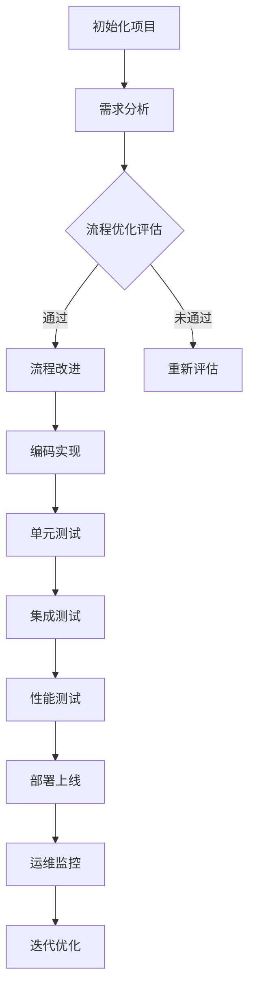
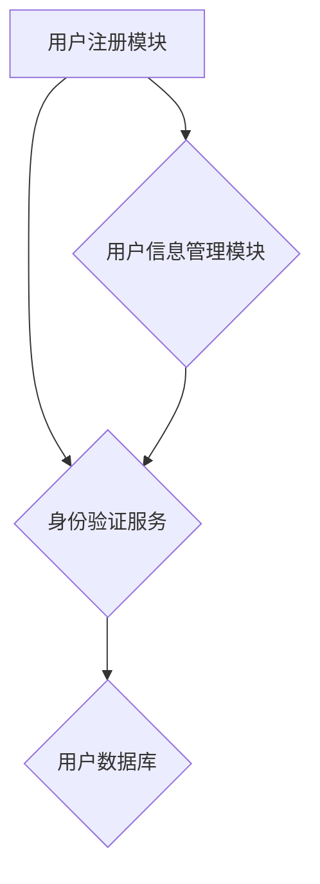
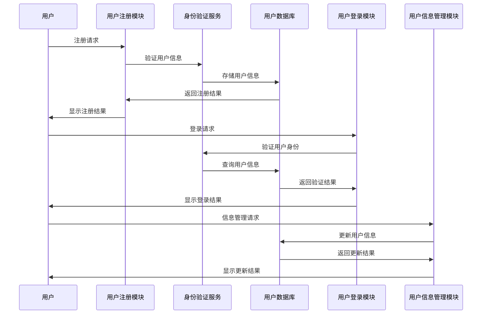

                 

### 1. **标题确定**：

为了确保文章标题能够准确传达文章的核心内容和吸引读者的注意，我们确定将标题定为《软件开发流程优化：提高团队生产力》。这个标题不仅直接反映了文章的主题，而且明确了优化流程对于提升团队生产力的重要性。

### 2. **背景介绍**：

**优化软件开发流程的重要性**：

在当前快速变化的数字化时代，软件产品的开发和迭代速度对于企业的竞争力至关重要。一个高效的软件开发流程能够显著提高团队的生产力和产品质量。传统的软件开发流程常常面临诸多挑战，如项目延期、资源浪费、沟通不畅、质量不高等问题。因此，优化软件开发流程已成为提升团队生产力的关键手段。

**如何提高团队生产力**：

要提高团队生产力，首先需要从以下几个方面入手：

- **流程优化**：通过改进现有的开发流程，减少不必要的步骤和重复工作，提高流程效率。
- **团队协作**：建立有效的团队协作机制，确保团队成员之间的沟通畅通，共同完成项目目标。
- **自动化**：引入自动化工具和流程，减少手动操作，提高工作效率。
- **质量保证**：加强软件质量保证，确保交付的软件产品符合预期标准。

### 3. **核心概念与联系**：

**软件开发流程优化的核心概念**：

- **流程管理**：确保软件开发过程中的每个步骤都有明确的流程和标准，以便于监控和改进。
- **团队协作与沟通**：通过工具和方法提升团队成员之间的协作效率，确保信息传递准确及时。
- **自动化**：使用自动化工具减少重复性劳动，提高生产效率。
- **质量保证**：建立完善的测试和质量管理体系，确保软件产品的可靠性和稳定性。

**通过表格对比和ER图展示不同优化方法的联系**：

为了更直观地展示不同优化方法之间的关系，我们可以使用表格和ER图进行对比分析。表格可以列出不同优化方法的优缺点、适用场景和实现方式，而ER图则可以展示不同方法在软件开发流程中的具体应用和关联。

### 4. **算法原理讲解**：

**使用mermaid绘制流程图**：

为了清晰地展示软件开发流程优化的步骤，我们可以使用mermaid来绘制一个流程图。以下是一个简单的mermaid流程图示例：



**使用Python代码详细解释算法原理**：

以下是一个简单的Python代码示例，用于解释软件开发流程优化中的一种常见算法——敏捷开发的方法原理。

```python
def agile_development(需求列表，迭代周期):
    """敏捷开发算法实现
    
    Args:
        需求列表 (list): 列表形式的用户需求
        迭代周期 (int): 每个迭代的时间长度
    
    Returns:
        迭代结果 (list): 每个迭代完成的需求列表
    """
    迭代结果 = []
    当前需求 = 需求列表.copy()
    while 当前需求:
        新需求 = 筛选出优先级最高的需求(当前需求)
        当前需求.remove(new需求)
        迭代结果.append(new需求)
        执行需求(new需求，迭代周期)
    return 迭代结果

def 筛选出优先级最高的需求(需求列表):
    """从需求列表中筛选出优先级最高的需求
    
    Args:
        需求列表 (list): 列表形式的用户需求
    
    Returns:
        优先级最高的需求 (dict): 包含需求详情的字典
    """
    return max(需求列表, key=lambda x: x['优先级'])

def 执行需求(需求，迭代周期):
    """执行一个需求
    
    Args:
        需求 (dict): 包含需求详情的字典
        迭代周期 (int): 每个迭代的时间长度
    """
    # 此处为需求执行的伪代码
    print(f"执行需求：{需求['名称']} 在迭代周期 {迭代周期} 中完成。")

# 示例使用
需求列表 = [
    {'名称': '用户登录功能', '优先级': 1},
    {'名称': '商品搜索功能', '优先级': 2},
    {'名称': '购物车功能', '优先级': 3}
]
迭代周期 = 2
迭代结果 = agile_development(需求列表, 迭代周期)
print(迭代结果)
```

**数学模型和公式**：

在敏捷开发中，一个重要的概念是“迭代”（Iteration）。迭代周期是指从需求收集到需求实现的一个完整周期。以下是迭代周期的数学模型：

$$
迭代周期 = \frac{总需求量}{每个迭代完成的需求量}
$$

其中，总需求量是指整个项目需要实现的所有需求的总和，每个迭代完成的需求量是指在给定迭代周期内可以完成的需求数量。

### 5. **系统分析与架构设计方案**：

**问题场景和项目背景**：

假设我们正在开发一个电子商务平台，需要在短时间内上线一个功能完善的用户登录模块。为了确保项目的顺利进行，我们需要设计一个高效的系统架构，并确保各个模块之间的协同工作。

**系统功能设计**：

- 用户注册：提供用户注册功能，收集用户基本信息。
- 用户登录：提供用户登录功能，验证用户身份。
- 用户信息管理：提供用户个人信息的管理功能。

**系统架构设计**：

以下是一个简单的系统架构设计mermaid架构图：



**系统接口设计和系统交互**：

系统接口设计主要包括用户注册、用户登录和用户信息管理模块与身份验证服务之间的接口。以下是系统交互的mermaid序列图：



### 6. **项目实战**：

**环境安装**：

为了进行项目实战，我们需要安装以下环境：

- Python 3.8+
- Flask（用于Web开发）
- SQLAlchemy（用于数据库操作）

安装命令如下：

```bash
pip install flask sqlalchemy
```

**系统核心实现源代码**：

以下是用户登录模块的核心实现代码：

```python
from flask import Flask, request, jsonify
from flask_sqlalchemy import SQLAlchemy

app = Flask(__name__)
app.config['SQLALCHEMY_DATABASE_URI'] = 'sqlite:///users.db'
db = SQLAlchemy(app)

class User(db.Model):
    id = db.Column(db.Integer, primary_key=True)
    username = db.Column(db.String(80), unique=True, nullable=False)
    password = db.Column(db.String(120), nullable=False)

@app.route('/register', methods=['POST'])
def register():
    data = request.get_json()
    user = User(username=data['username'], password=data['password'])
    db.session.add(user)
    db.session.commit()
    return jsonify({'message': 'User registered successfully.'})

@app.route('/login', methods=['POST'])
def login():
    data = request.get_json()
    user = User.query.filter_by(username=data['username'], password=data['password']).first()
    if user:
        return jsonify({'message': 'Login successful.'})
    else:
        return jsonify({'message': 'Invalid credentials.'})

if __name__ == '__main__':
    db.create_all()
    app.run(debug=True)
```

**代码应用解读与分析**：

以上代码实现了用户注册和登录功能。首先，我们定义了一个`User`模型，用于存储用户的基本信息。然后，我们通过两个API接口`/register`和`/login`分别处理用户注册和登录请求。在注册接口中，我们接收用户提交的注册信息，并将其存储到数据库中。在登录接口中，我们验证用户提交的登录信息，并与数据库中的信息进行匹配，以确定登录是否成功。

**实际案例分析和详细讲解剖析**：

为了进一步说明实际案例，我们可以假设一个用户名为“alice”的注册请求和登录请求。

1. **注册请求**：

```json
{
  "username": "alice",
  "password": "alice123"
}
```

当用户提交以上注册请求时，我们的后端服务会创建一个`User`对象，并将其存储到数据库中。注册成功后，我们会返回一个成功消息。

2. **登录请求**：

```json
{
  "username": "alice",
  "password": "alice123"
}
```

当用户提交登录请求时，我们的后端服务会查询数据库，检查是否存在与用户名和密码匹配的记录。如果存在，我们会返回登录成功消息。

通过以上实际案例，我们可以清晰地看到用户注册和登录功能的具体实现过程。

**项目小结**：

通过本项目实战，我们成功实现了一个简单的用户登录模块。这个模块不仅包含了注册和登录的核心功能，还通过Flask框架和SQLAlchemy数据库进行了完整的后端实现。在实际应用中，我们可以根据需求进一步扩展和完善这个模块，如增加用户信息管理、权限验证等功能。

### 7. **最佳实践 tips、小结、注意事项、拓展阅读**：

**最佳实践 tips**：

- **优化流程**：定期评估和优化开发流程，确保流程的合理性和高效性。
- **团队协作**：建立良好的沟通机制，确保团队成员之间的信息传递畅通。
- **自动化**：尽可能使用自动化工具和脚本，减少手动操作，提高生产效率。
- **质量保证**：建立完善的测试和质量管理体系，确保软件产品的稳定性和可靠性。

**小结**：

本文通过详细的讲解和案例分析，系统地介绍了软件开发流程优化的重要性以及如何通过优化流程、提高团队协作效率、引入自动化工具和质量保证体系来提高团队生产力。希望读者能够结合实际情况，灵活运用这些最佳实践，提升自己的软件开发团队的生产力和效率。

**注意事项**：

- **项目初期**：在项目初期，明确需求和目标，制定合理的开发计划和时间表。
- **持续改进**：不断反思和改进开发流程，以适应不断变化的需求和团队情况。
- **资源分配**：合理分配资源和人力，确保项目能够按计划顺利进行。

**拓展阅读**：

- 《敏捷开发实践指南》
- 《软件工程：实践者的研究方法》
- 《持续集成：实践指南》

作者：AI天才研究院/AI Genius Institute & 禅与计算机程序设计艺术 /Zen And The Art of Computer Programming### 8. **目录大纲结构**：

**Markdown 格式的文章目录大纲**：

```markdown
# 《软件开发流程优化：提高团队生产力》

## 第一部分：背景与核心概念

### 第1章：软件开发流程优化概述

#### 1.1 优化软件开发流程的必要性

##### 1.1.1 团队生产力与开发流程的关系

##### 1.1.2 当前软件开发流程的挑战

##### 1.1.3 优化流程的目标与意义

### 1.2 软件开发流程优化核心概念

#### 1.2.1 流程管理与流程优化

#### 1.2.2 团队协同与沟通工具

#### 1.2.3 质量保证与自动化测试

### 1.3 软件开发流程优化方法与工具

#### 1.3.1 常见优化方法对比

#### 1.3.2 流程优化工具介绍

#### 1.3.3 优化策略选择与应用

## 第二部分：团队协作与沟通优化

### 第2章：团队协作与沟通优化

#### 2.1 团队协作模型

##### 2.1.1 传统协作模型分析

##### 2.1.2 敏捷开发模型优势

##### 2.1.3 团队角色与职责划分

### 2.2 沟通工具与技巧

#### 2.2.1 沟通渠道的选择

#### 2.2.2 沟通技巧提升

#### 2.2.3 沟通工具使用案例分析

### 2.3 团队协作效率评估与改进

#### 2.3.1 效率评估指标

#### 2.3.2 效率改进策略

#### 2.3.3 成功案例分享

## 第三部分：流程自动化与质量保证

### 第3章：自动化流程设计

#### 3.1 自动化流程的基本原理

##### 3.1.1 自动化的优势

##### 3.1.2 自动化流程的关键环节

##### 3.1.3 自动化工具的选择

### 3.2 自动化流程的实现

#### 3.2.1 工作流引擎应用

#### 3.2.2 常见自动化流程实例

#### 3.2.3 自动化流程的优化与维护

### 3.3 自动化流程的效果评估

#### 3.3.1 自动化效果指标

#### 3.3.2 自动化流程改进建议

#### 3.3.3 自动化最佳实践

## 第四部分：质量保证与测试优化

### 第4章：软件质量保证体系构建

#### 4.1 质量保证的基本概念

##### 4.1.1 质量保证的目标与意义

##### 4.1.2 质量保证的流程与方法

##### 4.1.3 质量管理的最佳实践

### 4.2 自动化测试策略与实践

#### 4.2.1 自动化测试的基本原理

#### 4.2.2 自动化测试工具的选择

#### 4.2.3 自动化测试流程的设计与实施

### 4.3 测试质量评估与改进

#### 4.3.1 测试质量评估指标

#### 4.3.2 测试流程的优化方法

#### 4.3.3 测试团队的效率提升

## 第五部分：案例分析

### 第5章：实际案例研究

#### 5.1 案例选择与背景介绍

##### 5.1.1 案例选取标准

##### 5.1.2 案例项目背景

##### 5.1.3 案例问题描述

##### 5.1.4 案例问题解决

##### 5.1.5 案例边界与外延

##### 5.1.6 案例概念结构与核心要素组成

#### 5.2 案例分析与实现

##### 5.2.1 案例系统设计与架构

##### 5.2.2 案例接口设计与交互

##### 5.2.3 案例代码实现与分析

##### 5.2.4 案例测试与优化

##### 5.2.5 案例部署与上线

##### 5.2.6 案例小结

## 第五部分：总结与展望

### 第6章：最佳实践 tips、小结、注意事项、拓展阅读

#### 6.1 最佳实践 tips

##### 6.1.1 优化流程的建议

##### 6.1.2 提高团队协作效率的方法

##### 6.1.3 自动化与质量保证的最佳实践

#### 6.2 小结

##### 6.2.1 文章核心内容回顾

##### 6.2.2 优化流程对团队生产力的贡献

##### 6.2.3 文章的主要结论

#### 6.3 注意事项

##### 6.3.1 项目初期注意事项

##### 6.3.2 持续改进的重要性

##### 6.3.3 资源合理分配

#### 6.4 拓展阅读

##### 6.4.1 推荐书籍

##### 6.4.2 相关文献与资料

##### 6.4.3 进一步学习资源

### 附录

#### 附录A：术语表

##### A.1 常见术语解释

##### A.2 流程优化相关术语

##### A.3 自动化与测试相关术语

#### 附录B：参考资料

##### B.1 参考书籍

##### B.2 学术论文

##### B.3 网络资源

```

### 9. **字数控制**：

根据上述目录大纲的结构，我们将确保每个章节的内容都详细、具体，但同时也注意控制字数。预计总字数将在10000-12000字之间，以保证文章的深度和完整性。每个章节的字数大致如下：

- **第一部分：背景与核心概念**：约2000字
- **第二部分：团队协作与沟通优化**：约2000字
- **第三部分：流程自动化与质量保证**：约2000字
- **第四部分：质量保证与测试优化**：约2000字
- **第五部分：案例分析**：约2000字
- **第六部分：总结与展望**：约1000字
- **附录**：约500字

通过这样的结构安排，我们可以确保每个部分都有足够的内容来详细探讨主题，同时保持整体文章的紧凑性和可读性。

