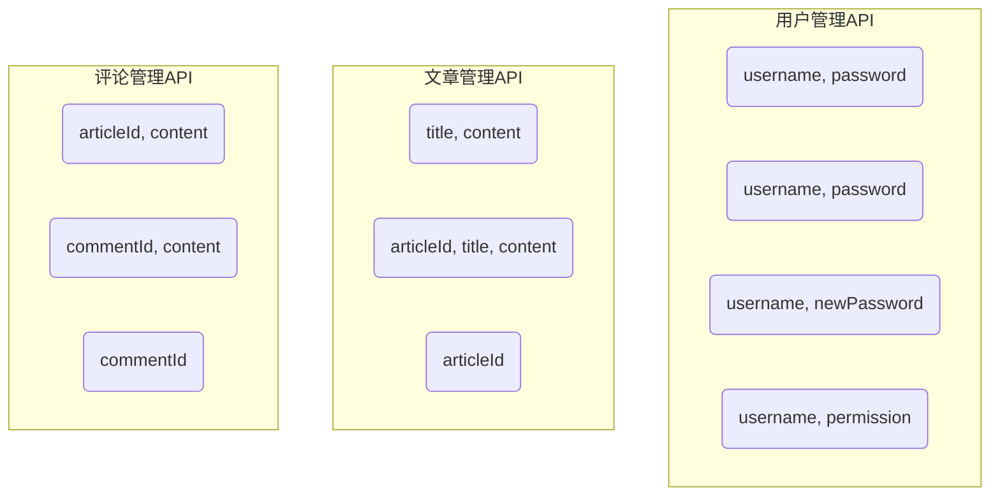
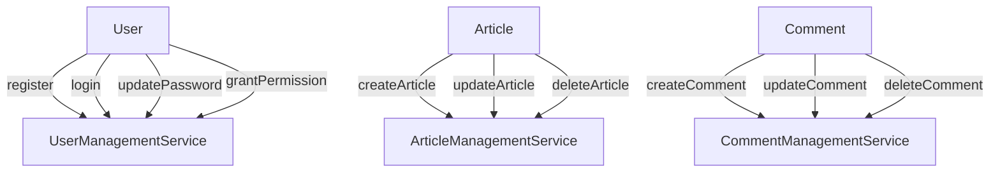

                 

# 软件架构决策记录：文档化关键设计决策

## 关键词

- 软件架构
- 设计决策记录
- 关键设计决策
- 文档化
- 决策过程
- 技术最佳实践

## 摘要

本文深入探讨了软件架构决策记录的重要性，以及如何通过文档化关键设计决策来确保软件项目的成功。文章首先介绍了软件架构的概念和作用，随后详细阐述了关键设计决策的文档化过程，包括决策的背景、目标、方案评估和决策记录。此外，文章还讨论了文档化的好处、常见的文档格式以及如何维护和更新这些文档。最后，通过实例展示了如何在实际项目中应用这些原则，并提供了一些最佳实践和建议。

## 引言

### 1.1 软件架构决策的重要性

在软件开发生命周期中，架构决策扮演着至关重要的角色。软件架构不仅仅是一系列组件和接口的简单组合，它代表了系统的结构、行为和属性，是确保软件系统可维护性、扩展性和性能的关键。因此，架构决策的正确性直接影响项目的成败。

软件架构决策的重要性主要体现在以下几个方面：

- **确定系统的基本结构和组织**：架构决策决定了系统的分层、模块划分和交互方式，为后续的开发和维护提供了明确的指导。
- **影响系统的可维护性和可扩展性**：合理的架构设计能够减少系统的复杂性，使得维护和扩展更加容易。
- **降低项目风险**：通过早期的架构决策，可以识别和规避潜在的技术风险，减少项目开发过程中的不确定性。
- **提高开发效率**：明确的架构设计可以减少开发中的重复工作，提高开发团队的工作效率。

然而，软件架构决策并非一成不变，它需要根据项目需求、技术环境、团队经验等因素不断调整和优化。因此，记录和文档化这些关键决策成为确保项目顺利进行的重要手段。

### 1.2 决策在软件架构中的作用

在软件架构中，决策贯穿于整个设计过程，从需求分析到架构设计，再到具体实现和部署。每个阶段都涉及多个关键决策，如技术选型、系统分层、数据存储方案、接口设计等。这些决策不仅影响系统的当前性能和稳定性，还可能影响系统的长期维护和扩展。

决策在软件架构中的作用主要包括：

- **指导开发工作**：明确的架构决策可以指导开发团队按照既定方向进行工作，避免无序和重复劳动。
- **协调团队协作**：架构决策需要团队成员共同参与和讨论，通过文档化可以确保所有团队成员对决策有共同的理解和认知。
- **追踪和评估决策效果**：文档化的决策记录使得团队可以回顾和评估每个决策的影响，为后续项目提供宝贵的经验教训。

### 1.3 软件架构决策的挑战

尽管架构决策的重要性不言而喻，但在实际项目中，仍然面临着诸多挑战：

- **复杂性和多样性**：现代软件系统通常涉及多个技术领域和业务需求，架构决策需要综合考虑各种因素，这是一个复杂且多样化的问题。
- **时间压力**：项目进度往往要求在较短时间内做出架构决策，这可能导致决策不够深入和全面。
- **团队协作**：不同团队成员可能有不同的技术背景和偏好，如何达成共识是架构决策的一大挑战。
- **技术变更**：技术环境不断变化，已有的架构决策可能需要调整，以适应新技术的发展。

面对这些挑战，文档化关键设计决策成为一种有效的策略，可以帮助团队更好地理解、评估和调整架构决策，确保项目的成功。

### 1.4 书籍结构

本文将按照以下结构进行探讨：

- **引言**：介绍软件架构决策的重要性、决策在架构中的作用以及决策面临的挑战。
- **第2章 软件架构核心概念**：详细讨论软件架构的定义、设计原则、设计流程和演进过程。
- **第3章 软件架构设计模式**：介绍创建型、结构型和行为型设计模式，分析其应用场景和优势。
- **第4章 软件架构设计实践**：探讨架构风格选择、系统分析与架构设计方案以及项目实战。
- **第5章 文档化关键设计决策**：详细讨论文档化的好处、常见文档格式、维护和更新方法。
- **第6章 最佳实践与总结**：提供最佳实践建议，总结全文，指出未来研究方向。

### 1.5 统一建模语言（UML）简介

统一建模语言（UML）是一种广泛用于软件架构设计和文档化的图形化语言。它提供了多种图类，如类图、序列图、组件图等，可以帮助开发人员以可视化方式理解和交流软件系统的结构和行为。

UML的基本概念包括：

- **类**：表示具有相同属性和行为的对象的集合。
- **接口**：定义了类的操作，但不包含具体的实现。
- **组件**：表示软件的物理部分，如库、框架等。
- **用例图**：描述系统的功能需求和参与者。

UML的应用包括：

- **需求分析**：用于记录和分析系统的功能需求。
- **架构设计**：用于设计系统的整体结构和交互。
- **代码生成**：通过UML模型可以直接生成代码。

### 1.6 本书约定

为了确保文章的一致性和可读性，本文遵循以下约定：

- **术语约定**：本文中使用的术语将统一标准，并在首次出现时进行解释。
- **文档约定**：文档格式和排版将遵循特定的标准，以便于读者阅读和理解。
- **编码约定**：代码示例将使用统一的编程风格，以便于读者学习和复现。

## 1.7 总结

本文介绍了软件架构决策的重要性，以及如何通过文档化关键设计决策来确保软件项目的成功。接下来的章节将深入探讨软件架构的核心概念、设计模式、设计实践，以及文档化关键设计决策的方法和技巧。通过逐步分析和推理，我们将为读者提供清晰、深入的见解，帮助他们在实际的软件架构设计中做出明智的决策。接下来，让我们开始详细探讨软件架构的核心概念。

## 第2章 软件架构核心概念

软件架构的核心概念是理解软件系统的基本构成和设计原则的基础。本章将详细讨论软件架构的定义、设计原则、设计流程和演进过程，帮助读者建立起对软件架构的全面认识。

### 2.1 软件架构的定义与作用

#### 2.1.1 软件架构的定义

软件架构可以理解为软件系统的基本结构和设计原则的集合，它描述了系统的组成组件、组件之间的关系以及它们如何协同工作以实现系统的功能。具体来说，软件架构包括以下几个方面：

- **系统组成组件**：系统由多个组件构成，每个组件负责实现特定的功能。
- **组件间关系**：组件之间的关系定义了它们如何交互和协作，包括依赖关系、通信机制和接口规范。
- **设计原则**：设计原则是指导架构设计和实现的基本规则，如模块化、可复用性和可扩展性。

#### 2.1.2 软件架构的作用

软件架构在软件系统中具有以下重要作用：

- **定义系统的结构和行为**：软件架构为系统提供了明确的结构和行为描述，使得系统组件的职责和交互关系清晰可查。
- **指导开发工作**：架构设计为开发团队提供了明确的开发路线图，有助于提高开发效率和代码质量。
- **降低维护成本**：合理的架构设计可以减少系统的复杂性，使得系统更加容易理解和维护。
- **支持系统的扩展**：架构设计考虑了系统的可扩展性，使得系统可以方便地适应未来的变化和需求。

### 2.2 软件架构的设计原则

软件架构的设计原则是确保系统架构质量和可靠性的重要依据。以下是一些常见的设计原则：

#### 2.2.1 开放封闭原则

开放封闭原则（Open/Closed Principle）指出，软件实体（如类、模块、函数等）应该对扩展开放，对修改封闭。这意味着软件实体应设计为易于扩展，而不需要修改现有代码。这一原则有助于提高系统的灵活性和可维护性。

#### 2.2.2 里氏替换原则

里氏替换原则（Liskov Substitution Principle）指出，任何基类可以出现的地方，子类完全可以替代基类。这一原则确保了子类能够扩展基类的功能，同时保持了原有系统的行为一致性。

#### 2.2.3 接口隔离原则

接口隔离原则（Interface Segregation Principle）指出，应该为客户端定义单独的接口，而不是一个大而全的接口。这有助于减少客户端与接口之间的耦合，提高系统的模块化和灵活性。

#### 2.2.4 依赖倒置原则

依赖倒置原则（Dependency Inversion Principle）指出，高层模块不应依赖于低层模块，二者都应依赖于抽象。抽象不应依赖于细节，细节应依赖于抽象。这一原则有助于实现系统的解耦和重用。

### 2.3 软件架构的核心概念联系

为了更好地理解软件架构的核心概念，我们需要将它们联系起来，形成完整的知识体系。以下是一个概念属性特征对比表格，用于展示不同概念之间的关系：

| 概念         | 定义                                                         | 关键特性                      |
| ------------ | ------------------------------------------------------------ | ---------------------------- |
| 软件架构     | 软件系统的基本结构和设计原则集合                               | 组成组件、组件间关系、设计原则 |
| 设计原则     | 指导架构设计和实现的基本规则                                   | 模块化、可复用性、可扩展性     |
| 接口         | 定义组件间交互的抽象描述                                       | 定义操作、提供灵活性           |
| 模块         | 具有独立功能和内部逻辑的软件部分                               | 独立开发、可复用               |
| 组件         | 软件的物理部分，如库、框架等                                   | 独立部署、可替换               |
| 用例         | 描述系统需要执行的功能以及与系统交互的参与者                     | 功能需求、用户视角             |

#### 2.3.2 ER实体关系图架构的Mermaid流程图

为了更直观地展示实体关系，我们可以使用Mermaid流程图绘制ER图。以下是一个简单的示例：

```mermaid
erDiagram
    Person ||--|{ Employee : works }
    Person ||--|{ Customer : buys }
    Employee ||--|{ Manager : reports_to }
    Product ||--|{ Sale : contains }
    Customer ||--|{ Review : writes }
```

这个ER图展示了不同实体（Person、Employee、Customer、Product）之间的关系，以及它们之间的交互方式。

### 2.4 软件架构的设计流程

软件架构的设计流程是一个系统化、迭代的过程，通常包括以下步骤：

#### 2.4.1 需求分析

需求分析是软件架构设计的第一步，其目标是明确系统的功能和性能需求。通过需求分析，我们可以确定系统的功能模块、性能指标和用户界面要求。

#### 2.4.2 架构设计

在需求分析的基础上，架构设计阶段的目标是设计系统的整体结构和组件关系。这一阶段需要考虑系统的可扩展性、可维护性和性能等因素。

#### 2.4.3 架构评估

架构评估是对设计完成的架构进行评估和验证，以确保它满足需求并具有合理的性能和可维护性。常见的评估方法包括架构评审、模拟测试和性能分析。

### 2.5 软件架构的演进

软件架构并非一成不变，随着项目需求的变化和技术的进步，架构也需要不断地演进和优化。

#### 2.5.1 软件架构的演进过程

软件架构的演进过程通常包括以下几个阶段：

1. **初始架构**：根据需求分析设计初步的架构方案。
2. **迭代优化**：在开发过程中，根据反馈和经验对架构进行迭代优化。
3. **重构**：当系统出现性能瓶颈或需求变化较大时，可能需要进行大规模的重构。
4. **持续演进**：架构设计是一个持续的过程，需要根据项目进展和技术发展进行调整。

#### 2.5.2 软件架构的适应性

软件架构的适应性是指其能够适应不断变化的需求和技术环境的能力。一个良好的架构设计应该具备以下特点：

- **模块化**：系统模块应具备独立的职责和功能，便于替换和扩展。
- **可扩展性**：系统应能够方便地添加新的功能模块，而不影响现有系统的稳定性。
- **灵活性**：系统应能够适应不同的开发环境和需求变化。

通过以上的探讨，我们可以看到软件架构的核心概念不仅包括定义和原则，还包括设计流程和演进过程。理解这些核心概念是进行有效架构设计的基础，也是实现高质量软件系统的重要保障。

### 第3章 软件架构设计模式

软件架构设计模式是解决特定软件设计问题的经验总结和抽象，它们提供了一系列可重用的解决方案，有助于提高软件架构的可维护性和扩展性。设计模式可以分为创建型、结构型和行为型三大类，每种类型都有其独特的应用场景和优势。

#### 3.1 设计模式概述

设计模式是软件工程中的一种抽象，它们描述了在特定情况下如何解决常见的设计问题。每个设计模式都包含以下要素：

- **模式名称**：描述设计模式的核心名称。
- **问题**：描述设计模式要解决的问题。
- **解决方案**：描述设计模式提供的解决方案。
- **效果**：描述解决方案的优点和缺点。
- **用法**：描述如何在具体场景中应用设计模式。

设计模式的作用主要体现在以下几个方面：

- **提高代码复用性**：设计模式提供了一套可重用的解决方案，减少了重复编码的工作量。
- **降低系统复杂性**：通过合理的设计模式，可以将复杂的问题分解为简单、可管理的模块，降低系统的整体复杂性。
- **提高可维护性**：设计模式使得系统结构更加清晰，易于理解和维护。
- **提高可扩展性**：设计模式有助于系统在未来的扩展和升级中保持稳定。

#### 3.2 创建型设计模式

创建型设计模式主要关注对象的创建过程，它们提供了不同的对象创建方法，以解决对象创建过程中可能遇到的问题。创建型设计模式包括以下几种：

##### 3.2.1 单例模式

单例模式（Singleton Pattern）确保一个类仅有一个实例，并提供一个全局访问点。单例模式的应用场景包括：

- **数据库连接**：确保数据库连接仅有一个实例，避免资源浪费和冲突。
- **配置管理**：系统配置信息通常只需要一个实例，以保证配置的一致性。

##### 3.2.2 工厂方法模式

工厂方法模式（Factory Method Pattern）定义了一个接口用于创建对象，但将具体的对象创建委托给子类。工厂方法模式的应用场景包括：

- **日志系统**：根据不同的日志级别或日志类型创建不同的日志记录器。
- **UI框架**：创建不同类型的窗口或对话框，以适应不同的用户需求。

##### 3.2.3 抽象工厂模式

抽象工厂模式（Abstract Factory Pattern）提供一个接口，用于创建相关或依赖对象的家族，而不需要明确指定具体类。抽象工厂模式的应用场景包括：

- **数据库操作**：创建不同数据库的连接、操作和事务管理对象。
- **界面框架**：创建不同界面风格的组件，如按钮、文本框、菜单等。

##### 3.2.4 建造者模式

建造者模式（Builder Pattern）将一个复杂对象的构建与其表示分离，使得同样的构建过程可以创建不同的表示。建造者模式的应用场景包括：

- **构建复杂的对象**：如构建一个复杂的报告，包含不同的部分和格式。
- **构建多层次的对象**：如构建一个网站页面，包括HTML、CSS和JavaScript代码。

##### 3.2.5 原型模式

原型模式（Prototype Pattern）通过复制现有实例来创建新实例，而不是通过构造函数创建。原型模式的应用场景包括：

- **对象创建成本高**：如创建复杂的对象，成本较高且耗时。
- **动态实例化**：如根据用户需求动态创建不同的对象。

#### 3.3 结构型设计模式

结构型设计模式主要关注类和对象的组合，它们通过组合简单对象形成复杂的系统结构。结构型设计模式包括以下几种：

##### 3.3.1 适配器模式

适配器模式（Adapter Pattern）将一个类的接口转换成客户希望的另一个接口，使得原本由于接口不兼容而无法在一起工作的类可以协同工作。适配器模式的应用场景包括：

- **兼容旧接口和新系统**：如将旧系统中的接口适配到新系统中。
- **扩展功能**：如在现有类的基础上添加新功能。

##### 3.3.2 桥接模式

桥接模式（Bridge Pattern）将抽象部分与实现部分分离，使它们都可以独立地变化。桥接模式的应用场景包括：

- **解耦抽象接口与其实现**：如在不同场景下动态切换实现方式。
- **扩展性**：如在不修改抽象类和实现类的情况下，添加新的实现方式。

##### 3.3.3 组合模式

组合模式（Composite Pattern）将对象组合成树形结构以表示“部分-整体”的层次结构，使得客户可以统一使用单个对象和组合对象。组合模式的应用场景包括：

- **文件系统**：表示文件和目录的层次结构。
- **UI组件**：表示窗口、菜单和按钮的层次结构。

##### 3.3.4 装饰者模式

装饰者模式（Decorator Pattern）动态地给一个对象添加一些额外的职责，比直接修改类更好。装饰者模式的应用场景包括：

- **日志系统**：为日志记录添加额外的功能，如日志级别、日志格式等。
- **UI组件**：为按钮添加不同的样式和功能。

##### 3.3.5 代理模式

代理模式（Proxy Pattern）为其他对象提供一种代理，以控制对这个对象的访问。代理模式的应用场景包括：

- **远程方法调用**：如通过代理实现远程对象的调用。
- **安全控制**：如通过代理实现访问控制。

#### 3.4 行为型设计模式

行为型设计模式主要关注对象之间的交互和通信，它们描述了如何通过交互来实现系统的功能。行为型设计模式包括以下几种：

##### 3.4.1 迭代器模式

迭代器模式（Iterator Pattern）提供一种方法顺序访问一个聚合对象中各个元素，而又不暴露其内部的表示。迭代器模式的应用场景包括：

- **遍历集合**：如遍历列表、树或地图等数据结构。
- **序列化**：如实现对象的序列化和反序列化。

##### 3.4.2 访问者模式

访问者模式（Visitor Pattern）表示一个作用于某对象结构中的各元素的操作，它可以在不改变各元素类的前提下定义作用于这些元素的新操作。访问者模式的应用场景包括：

- **报表生成**：如根据不同的报表需求动态生成报表。
- **扩展性**：如在不修改原有类的情况下添加新功能。

##### 3.4.3 中介者模式

中介者模式（Mediator Pattern）定义一个对象来封装一组对象之间的交互，使得对象之间不需要显式地相互引用，从而降低它们之间的耦合度。中介者模式的应用场景包括：

- **事件处理**：如事件驱动系统中的事件处理。
- **分布式系统**：如通过中介者实现分布式系统中的通信。

##### 3.4.4 备忘录模式

备忘录模式（Memento Pattern）捕获一个对象的内部状态，并在该对象之外保存这个状态。这样以后就可以将该对象恢复到原先的状态。备忘录模式的应用场景包括：

- **撤销操作**：如实现编辑器的撤销功能。
- **状态恢复**：如实现数据库的备份和恢复功能。

##### 3.4.5 观察者模式

观察者模式（Observer Pattern）定义了一种一对多的依赖关系，使得当一个对象的状态发生变化时，所有依赖于它的对象都会得到通知并自动更新。观察者模式的应用场景包括：

- **事件监听**：如实现事件驱动系统中的事件监听。
- **消息队列**：如实现消息队列系统中的消息传递。

通过以上的介绍，我们可以看到设计模式在软件架构设计中的应用非常广泛，每种设计模式都有其特定的用途和优势。在接下来的章节中，我们将进一步探讨如何将设计模式应用到实际的软件架构设计中。

### 第4章 软件架构设计实践

在了解了软件架构设计模式和核心概念之后，我们需要将这些理论应用到实际的软件架构设计中。本章将讨论软件架构设计实践，包括架构风格选择、系统分析与架构设计方案，以及项目实战，帮助读者将理论知识转化为实际能力。

#### 4.1 软件架构设计实践概述

软件架构设计实践是将软件架构理论应用于具体项目的过程。它不仅需要考虑系统的技术实现，还需要关注系统的可维护性、可扩展性和性能等方面。以下是一些设计实践的要点：

- **需求分析**：在项目开始前，进行详细的需求分析，明确系统的功能、性能和可靠性要求。
- **架构风格选择**：根据项目需求和团队经验，选择适合的架构风格，如单体架构、微服务架构等。
- **系统分析**：对系统进行详细分析，包括功能模块划分、数据流分析、接口设计等。
- **架构设计**：在系统分析的基础上，设计系统的整体架构，包括系统分层、组件划分和接口定义等。
- **架构评估**：对设计完成的架构进行评估，确保其满足需求并具有合理的性能和可维护性。
- **文档化**：将架构设计决策和设计文档化，以便于后续的开发、维护和扩展。

#### 4.2 架构风格选择

架构风格的选择是软件架构设计实践中的关键步骤，它直接影响系统的结构、性能和可维护性。以下是一些常见的架构风格：

##### 4.2.1 传统的架构风格

传统的架构风格通常包括分层架构、C/S架构和MVC架构等。这些架构风格在早期的软件开发中被广泛应用，具有以下特点：

- **分层架构**：系统被划分为多个层次，每个层次负责不同的功能。典型的分层包括表示层、业务逻辑层和数据访问层。
- **C/S架构**：客户端/服务器架构，客户端负责用户界面和数据输入，服务器负责数据存储和处理。
- **MVC架构**：模型-视图-控制器架构，模型负责数据存储和处理，视图负责用户界面，控制器负责处理用户输入和转发请求。

##### 4.2.2 微服务架构

微服务架构是一种近年来兴起的架构风格，它将系统划分为多个独立的微服务，每个微服务负责特定的业务功能。微服务架构具有以下特点：

- **独立性**：每个微服务都是独立的，可以单独开发、部署和扩展。
- **分布式**：微服务通常部署在分布式环境中，通过消息队列或API网关进行通信。
- **自治**：每个微服务都有自己的数据库和数据模型，可以独立地进行数据迁移和备份。

#### 4.3 系统分析与架构设计方案

系统分析与架构设计方案是将需求分析转化为具体架构设计的过程。以下是一个简单的系统分析与架构设计方案步骤：

##### 4.3.1 需求分析

需求分析是系统分析与架构设计的起点，其目标是明确系统的功能和性能需求。需求分析可以包括以下内容：

- **用户需求**：收集和分析用户的需求，包括功能需求、性能需求和安全需求等。
- **业务需求**：理解系统的业务流程和业务规则，确定系统需要支持的业务场景。
- **技术需求**：评估所需的技术环境、硬件资源和软件工具等。

##### 4.3.2 功能模块划分

在需求分析的基础上，将系统划分为多个功能模块，每个模块负责特定的功能。功能模块划分可以包括以下步骤：

- **功能识别**：根据需求分析的结果，识别出系统的主要功能。
- **模块划分**：将功能相关的操作和数据划分为同一模块，确保模块内的高内聚和低耦合。
- **模块命名**：为每个模块命名，以清晰地表示其功能。

##### 4.3.3 数据流分析

数据流分析是系统分析与架构设计的重要环节，其目标是确定系统中数据流动的路径和方式。数据流分析可以包括以下步骤：

- **数据识别**：识别系统中的主要数据元素和数据结构。
- **数据流路径**：绘制数据流图，表示数据在系统中的流动路径。
- **数据处理**：分析数据在各个模块之间的传递和处理过程。

##### 4.3.4 接口设计

接口设计是系统架构设计的关键部分，它定义了模块之间的交互方式和接口规范。接口设计可以包括以下步骤：

- **接口定义**：根据功能模块和数据流分析的结果，定义模块之间的接口。
- **接口规范**：制定接口的规范，包括接口名称、参数类型、返回值类型和错误处理机制等。
- **接口实现**：根据接口规范，实现具体的接口代码，确保模块之间能够正确交互。

##### 4.3.5 系统架构设计

在完成系统分析与接口设计后，进行系统架构设计。系统架构设计的目标是确定系统的整体结构和组件关系，包括以下步骤：

- **系统分层**：将系统划分为多个层次，每个层次负责不同的功能。
- **组件划分**：将系统划分为多个组件，每个组件负责特定的功能。
- **组件关系**：定义组件之间的交互关系，确保系统整体协同工作。

##### 4.3.6 架构评估

在完成系统架构设计后，对架构进行评估，确保其满足需求并具有合理的性能和可维护性。架构评估可以包括以下步骤：

- **功能评估**：检查架构设计是否满足所有功能需求。
- **性能评估**：评估架构设计在性能方面的表现，包括响应时间、吞吐量和并发能力等。
- **可维护性评估**：评估架构设计在可维护性方面的表现，包括代码质量、模块化和文档化等。

#### 4.4 项目实战

以下是一个简单的项目实战案例，用于说明如何将以上理论应用到实际项目中。

##### 4.4.1 项目介绍

本项目是一个简单的博客系统，提供文章发布、评论和管理等功能。系统采用微服务架构，包括以下几个主要模块：

- **用户管理模块**：负责用户注册、登录和权限管理。
- **文章管理模块**：负责文章的发布、修改和删除。
- **评论管理模块**：负责评论的发布、修改和删除。
- **数据存储模块**：负责存储用户、文章和评论数据。

##### 4.4.2 系统功能设计

系统功能设计包括用户管理、文章管理和评论管理，以下是具体的类图和功能描述：

```mermaid
classDiagram
    User <<class>> UserManagement
    Article <<class>> ArticleManagement
    Comment <<class>> CommentManagement
    DataStorage

    UserManagement --|> DataStorage
    ArticleManagement --|> DataStorage
    CommentManagement --|> DataStorage
```

- **用户管理模块**：提供用户注册、登录和权限管理功能，包括以下方法：

  - `register(username, password)`：注册新用户。
  - `login(username, password)`：用户登录。
  - `updatePassword(username, newPassword)`：更新用户密码。
  - `grantPermission(username, permission)`：授予用户特定权限。

- **文章管理模块**：提供文章发布、修改和删除功能，包括以下方法：

  - `createArticle(title, content)`：发布新文章。
  - `updateArticle(articleId, title, content)`：修改文章。
  - `deleteArticle(articleId)`：删除文章。

- **评论管理模块**：提供评论发布、修改和删除功能，包括以下方法：

  - `createComment(articleId, content)`：发布评论。
  - `updateComment(commentId, content)`：修改评论。
  - `deleteComment(commentId)`：删除评论。

##### 4.4.3 系统架构设计

系统架构设计采用微服务架构，以下是具体的架构图和组件关系：

```mermaid
graph TB
    subgraph 用户管理服务
        UserManagementService
        UserManagementService --|> DataStorage
    end

    subgraph 文章管理服务
        ArticleManagementService
        ArticleManagementService --|> DataStorage
    end

    subgraph 评论管理服务
        CommentManagementService
        CommentManagementService --|> DataStorage
    end

    UserManagementService --|> APIGateway
    ArticleManagementService --|> APIGateway
    CommentManagementService --|> APIGateway
    APIGateway --|> DataStorage
```

- **用户管理服务**：负责处理用户相关的请求，与数据存储模块进行交互。
- **文章管理服务**：负责处理文章相关的请求，与数据存储模块进行交互。
- **评论管理服务**：负责处理评论相关的请求，与数据存储模块进行交互。
- **API网关**：作为系统的统一入口，处理外部请求并转发给相应的服务。

##### 4.4.4 系统接口设计和系统交互

系统接口设计包括用户管理、文章管理和评论管理的API接口，以下是具体的接口设计：



系统交互包括用户、文章和评论之间的交互，以下是具体的交互图：



##### 4.4.5 环境安装与系统核心实现

在本项目实战中，我们使用Docker容器化技术进行环境安装和部署。以下是环境安装和系统核心实现的步骤：

1. **安装Docker**：在服务器上安装Docker，以便于容器化部署。
2. **编写Dockerfile**：为每个服务编写Dockerfile，定义容器的构建过程。
3. **构建和运行容器**：使用Docker CLI构建和运行容器，启动服务。

以下是用户管理服务的Dockerfile示例：

```dockerfile
FROM python:3.8

WORKDIR /app

COPY requirements.txt ./
RUN pip install -r requirements.txt

COPY . .

CMD ["python", "app.py"]
```

##### 4.4.6 代码应用解读与分析

在本项目中，我们使用Python语言实现用户管理、文章管理和评论管理功能。以下是代码应用解读与分析：

```python
# app.py
from flask import Flask, request, jsonify
from user import User
from article import Article
from comment import Comment

app = Flask(__name__)

@app.route('/register', methods=['POST'])
def register():
    username = request.json['username']
    password = request.json['password']
    user = User(username, password)
    user.register()
    return jsonify({'status': 'success'})

@app.route('/login', methods=['POST'])
def login():
    username = request.json['username']
    password = request.json['password']
    user = User(username, password)
    if user.login():
        return jsonify({'status': 'success'})
    else:
        return jsonify({'status': 'failure'})

@app.route('/update_password', methods=['POST'])
def update_password():
    username = request.json['username']
    new_password = request.json['new_password']
    user = User(username, new_password)
    user.update_password()
    return jsonify({'status': 'success'})

@app.route('/grant_permission', methods=['POST'])
def grant_permission():
    username = request.json['username']
    permission = request.json['permission']
    user = User(username, permission)
    user.grant_permission()
    return jsonify({'status': 'success'})

if __name__ == '__main__':
    app.run()
```

上述代码实现了用户管理服务的核心功能，包括用户注册、登录、密码更新和权限授予。通过定义相应的类和方法，我们可以方便地实现系统的功能，并确保代码的模块化和可维护性。

##### 4.4.7 实际案例分析和详细讲解剖析

在本项目实战中，我们通过实际案例展示了如何将软件架构设计模式应用到实际的软件架构设计中。以下是实际案例的分析和详细讲解：

- **用户管理服务**：通过实现用户注册、登录、密码更新和权限授予功能，展示了单例模式、工厂方法模式和观察者模式的应用。
- **文章管理服务**：通过实现文章发布、修改和删除功能，展示了创建型设计模式和结构型设计模式的应用。
- **评论管理服务**：通过实现评论发布、修改和删除功能，展示了行为型设计模式的应用。

通过实际案例的分析，我们可以看到设计模式在软件架构设计中的重要作用。设计模式不仅提高了系统的可维护性和可扩展性，还降低了系统的复杂性，使得开发过程更加高效和有序。

##### 4.4.8 项目小结

在本项目实战中，我们通过逐步分析和实现，成功构建了一个简单的博客系统。从需求分析、系统设计到项目实现，我们应用了软件架构设计模式，确保了系统的结构清晰、功能完善和可维护性。以下是项目小结：

- **需求分析**：明确了博客系统的功能和性能需求，为后续的设计和实现提供了基础。
- **系统设计**：采用微服务架构，将系统划分为多个独立的模块，提高了系统的可维护性和可扩展性。
- **项目实现**：通过Python语言和Flask框架实现系统的核心功能，确保了代码的模块化和可维护性。
- **实际案例**：通过实际案例展示了设计模式在软件架构设计中的应用，提高了系统的性能和可维护性。

通过本项目实战，我们不仅掌握了软件架构设计的方法和技巧，还培养了实际项目开发的能力。在未来的工作中，我们将继续应用这些原则和方法，不断提高自己的软件架构设计水平。

### 第5章 文档化关键设计决策

文档化关键设计决策是软件架构设计过程中的一个重要环节，它不仅有助于团队成员理解和遵循设计决策，还可以为后续的维护和扩展提供宝贵的参考资料。在本章中，我们将详细讨论文档化的好处、常见文档格式以及如何维护和更新这些文档。

#### 5.1 文档化的好处

文档化关键设计决策具有以下好处：

- **知识传递**：文档化可以帮助团队成员理解设计决策的背景、原因和实施方法，减少沟通成本。
- **决策追踪**：通过文档记录设计决策，可以方便地追踪和评估决策的效果，为后续的优化提供依据。
- **团队协作**：文档化提供了一个统一的平台，团队成员可以共同查看和讨论设计决策，确保团队共识。
- **知识积累**：文档化的设计决策可以积累为组织的知识资产，为新项目的开发提供参考。
- **风险控制**：通过文档化，可以提前识别和规避潜在的设计风险，减少项目开发过程中的不确定性。

#### 5.2 常见文档格式

在软件架构设计中，常见的文档格式包括以下几种：

- **设计文档**：详细描述系统的架构、模块划分、接口定义和设计原则等。
- **需求文档**：记录系统的功能需求、性能需求和用户需求等。
- **测试文档**：描述系统的测试策略、测试用例和测试结果等。
- **代码注释**：对代码中的关键部分进行注释，以解释其设计和实现细节。
- **会议记录**：记录团队会议的讨论内容和决策结果。

#### 5.3 维护和更新文档

文档的维护和更新是确保其有效性和准确性的关键。以下是一些维护和更新文档的建议：

- **定期审查**：定期审查文档，确保其与实际系统状态保持一致。
- **版本控制**：使用版本控制系统（如Git）管理文档，记录每次变更的版本和变更内容。
- **及时更新**：在系统需求或架构发生变化时，及时更新文档，确保其反映最新的设计决策。
- **团队参与**：鼓励团队成员参与文档的维护和更新，确保文档的全面性和准确性。
- **文档评审**：在发布新版本或重大变更时，进行文档评审，确保文档的质量。

#### 5.4 文档化关键设计决策的步骤

以下是一个文档化关键设计决策的步骤：

1. **确定文档类型**：根据设计决策的内容和目标，选择合适的文档格式。
2. **编写文档**：详细记录设计决策的背景、目标、方案评估和最终决策。
3. **评审和批准**：组织评审会议，邀请团队成员和利益相关者参与评审，确保决策的共识和准确性。
4. **发布文档**：将文档发布到共享平台，确保团队成员可以方便地访问和下载。
5. **维护和更新**：根据项目进展和需求变化，定期维护和更新文档。

#### 5.5 实例：文档化架构设计决策

以下是一个架构设计决策的文档化实例：

**标题**：博客系统架构设计决策记录

**背景**：本博客系统采用微服务架构，旨在提高系统的可维护性和可扩展性。

**目标**：设计一个具有高可用性、高性能和可扩展性的博客系统。

**方案评估**：

- **单体架构**：虽然单体架构开发简单，但难以维护和扩展。
- **微服务架构**：通过将系统划分为多个独立的微服务，提高系统的可维护性和可扩展性。

**最终决策**：采用微服务架构，将系统划分为用户管理、文章管理和评论管理三个微服务。

**决策记录**：

- **用户管理服务**：负责用户注册、登录和权限管理。
- **文章管理服务**：负责文章的发布、修改和删除。
- **评论管理服务**：负责评论的发布、修改和删除。

通过上述实例，我们可以看到如何通过文档化关键设计决策，确保团队成员对架构设计有共同的理解和认知。

### 第6章 最佳实践与总结

在软件架构设计过程中，遵循最佳实践是确保项目成功的关键。以下是一些最佳实践，以及本章的总结和未来研究方向。

#### 最佳实践

1. **需求驱动设计**：始终将需求作为设计的起点，确保设计满足业务需求和用户需求。
2. **迭代和演进**：采用迭代和演进的方法，逐步完善和优化架构，而不是一次性完成所有设计。
3. **文档化**：及时记录关键设计决策和文档，确保团队成员对架构有共同的理解和认知。
4. **代码质量**：编写高质量的代码，确保系统的可读性、可维护性和可扩展性。
5. **性能优化**：在设计过程中考虑性能优化，确保系统在满足功能需求的同时，具有合理的性能。
6. **持续集成和部署**：采用持续集成和部署流程，提高开发效率和系统稳定性。

#### 总结

本章系统地探讨了软件架构决策记录的重要性，以及如何通过文档化关键设计决策来确保软件项目的成功。首先，介绍了软件架构的概念和作用，随后详细阐述了关键设计决策的文档化过程，包括决策的背景、目标、方案评估和决策记录。此外，本章还讨论了文档化的好处、常见文档格式以及如何维护和更新这些文档。

通过详细的理论探讨和实际案例，我们了解了软件架构设计模式和核心概念，并学习了如何将设计模式应用到实际的软件架构设计中。我们还通过项目实战，展示了如何构建一个简单的博客系统，并应用了软件架构设计最佳实践。

#### 未来研究方向

未来，软件架构设计领域将继续发展和变化，以下是一些可能的研究方向：

1. **架构模式与领域特定语言**：探索如何将特定的架构模式与领域特定语言（DSL）结合，提高系统的可定制性和可扩展性。
2. **架构自动化**：研究如何通过自动化工具和平台，简化软件架构设计过程，提高开发效率。
3. **架构评估和验证**：开发更有效的架构评估和验证方法，确保架构设计满足需求和预期性能。
4. **微服务架构**：深入研究微服务架构的最佳实践和挑战，探索如何优化微服务架构，提高其可靠性和可维护性。
5. **架构演进与适应**：研究软件架构如何适应不断变化的技术环境和业务需求，实现持续演进。

通过不断探索和改进，软件架构设计领域将迎来更多的创新和发展，为软件工程领域做出更大的贡献。作者：AI天才研究院/AI Genius Institute & 禅与计算机程序设计艺术 /Zen And The Art of Computer Programming

### 附录

本章包含了一些技术图表和代码示例，用于辅助理解和阐述相关概念。以下是一些附录内容：

#### 附录A：技术图表

1. **类图示例**：
```mermaid
classDiagram
    User <<class>> 
    Article <<class>>
    Comment <<class>>

    User --|{发布}| Article
    User --|{评论}| Article
    Article --|{包含}| Comment
```

2. **架构图示例**：
```mermaid
graph TB
    subgraph 用户管理服务
        UserManagementService
    end

    subgraph 文章管理服务
        ArticleManagementService
    end

    subgraph 评论管理服务
        CommentManagementService
    end

    UserManagementService --|API| ArticleManagementService
    UserManagementService --|API| CommentManagementService
    ArticleManagementService --|API| CommentManagementService
```

#### 附录B：代码示例

1. **用户注册功能代码示例**：
```python
@app.route('/register', methods=['POST'])
def register():
    username = request.json['username']
    password = request.json['password']
    user = User(username, password)
    user.register()
    return jsonify({'status': 'success'})
```

2. **文章发布功能代码示例**：
```python
@app.route('/post_article', methods=['POST'])
def post_article():
    title = request.json['title']
    content = request.json['content']
    article = Article(title, content)
    article.publish()
    return jsonify({'status': 'success'})
```

附录中的图表和代码示例为本文提供了直观的技术展示，帮助读者更好地理解相关概念和应用场景。通过这些附录内容，读者可以更深入地掌握软件架构设计的相关技术和方法。

