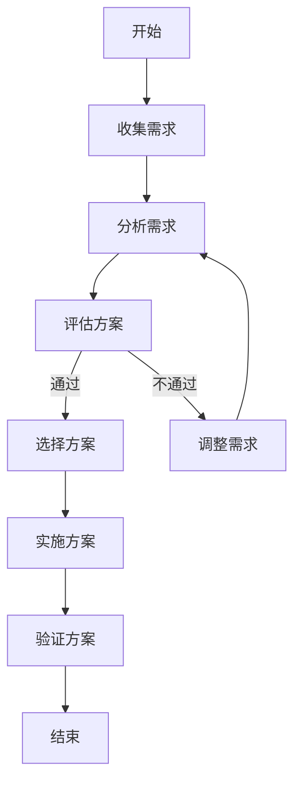

                 

## 软件架构决策：权衡利弊的艺术

> 关键词：软件架构、决策、权衡、利弊、艺术

在信息技术飞速发展的时代，软件架构作为软件系统的灵魂，其重要性日益凸显。优秀的软件架构不仅能够提高系统的性能、可维护性和扩展性，还能显著提升开发效率和企业竞争力。然而，随着软件系统复杂度的不断增加和业务需求的快速变化，软件架构决策的难度也随之增大。如何在这个复杂多变的环境中做出明智的决策，成为每一个架构师面临的重要挑战。本文将以“软件架构决策：权衡利弊的艺术”为主题，详细探讨软件架构决策的背景、核心概念、权衡方法、案例分析以及最佳实践，旨在为读者提供一整套系统、全面的决策指南。

### 摘要

本文将首先介绍软件架构决策的背景，包括问题背景、问题描述、问题解决思路以及相关边界与外延。随后，我们将深入探讨软件架构决策的核心概念，包括系统需求、架构风格、架构模式、架构要素和权衡利弊。通过属性特征对比表格和ER实体关系图，我们将对这些核心概念进行详细分析。接着，我们将结合具体案例，解析软件架构决策的实际操作过程，总结最佳实践。最后，本文将展望前沿技术对软件架构的影响，并提供实用的项目实战和拓展阅读建议，以帮助读者在实际工作中做出更明智的决策。

### 第一部分：背景介绍

#### 1.1 问题背景

在信息技术飞速发展的今天，软件架构的重要性日益凸显。软件架构不仅决定了软件系统的性能、可维护性和扩展性，还对开发效率、团队协作和企业竞争力产生深远影响。随着企业业务场景的复杂化和多样化，软件系统也趋向于高度复杂和分布式，这使得软件架构设计变得更加重要和复杂。以下是软件架构在当前信息技术环境中的重要性和面临的挑战：

1. **重要性**：
   - **性能提升**：良好的软件架构能够提高系统的响应速度和处理能力，满足高性能需求。
   - **可维护性**：清晰的架构设计便于后续的维护和更新，降低维护成本。
   - **扩展性**：灵活的架构设计能够适应业务需求的快速变化，确保系统长期稳定运行。
   - **开发效率**：合理的架构能够提高开发团队的协作效率，缩短项目交付周期。
   - **企业竞争力**：优秀的软件架构能够提升企业的技术水平和市场竞争力。

2. **挑战**：
   - **复杂度增加**：随着软件系统规模的扩大，架构设计的复杂性也随之增加，如何管理这种复杂性成为挑战。
   - **技术快速迭代**：技术的快速发展带来了新的架构模式和工具，如何选择合适的架构方案需要持续学习和适应。
   - **需求变化**：业务需求的快速变化要求架构能够灵活应对，这对架构设计的稳定性和可变性提出了更高要求。
   - **团队协作**：架构设计涉及到多个团队和角色，如何确保各方达成一致，协作顺畅，是架构决策的重要挑战。

#### 1.2 问题描述

在软件架构决策过程中，决策者通常需要面对以下问题：

1. **技术选型**：在多种技术方案中，如何选择最适合当前业务需求的技术？
2. **系统性能**：如何确保系统在高并发、大数据量等复杂场景下仍能保持高性能？
3. **团队协作**：如何确保各团队之间在架构设计上达成一致，避免出现协作冲突？
4. **企业战略**：如何将软件架构与企业的长期发展战略相结合，确保架构决策与企业目标一致？
5. **成本与效益**：如何评估不同架构方案的成本和效益，做出最优的经济决策？

在决策过程中，上述问题往往相互交织，形成复杂的决策网络。例如，在技术选型时，不仅要考虑当前的技术优势，还需评估未来的维护成本和升级难度；在系统性能优化中，需要在硬件升级、软件优化和架构重构之间找到平衡点；在团队协作中，需要平衡开发团队的意愿和业务需求，确保架构设计能够被广泛接受和执行；在企业战略中，需要确保架构决策与企业的整体发展目标一致，避免短期决策影响长期发展；在成本与效益评估中，需要综合考虑技术成本、人力资源成本和潜在收益，做出经济效益最优的选择。

#### 1.3 问题解决

为了解决上述问题，架构师需要采取以下策略：

1. **全面的需求分析**：在架构决策前，全面了解和梳理业务需求，明确系统的功能、性能和安全等需求。
2. **多方案评估**：在技术选型和系统性能优化中，制定多个备选方案，通过比较评估其成本、风险和收益，选择最优方案。
3. **团队协作**：建立有效的沟通机制，确保各团队之间的信息透明和协作顺畅，降低冲突和误解。
4. **长期视角**：在架构设计和决策中，考虑未来的业务发展和技术趋势，确保架构的灵活性和可扩展性。
5. **经济分析**：通过成本效益分析和风险评估，评估不同架构方案的经济合理性，确保资源的有效利用。

#### 1.4 边界与外延

1. **边界**：
   - **适用范围**：本文主要关注企业级软件架构的决策过程，适用于中大型软件系统的架构设计。
   - **不适用范围**：本文不涉及个人级软件架构的决策过程，也不讨论硬件架构或操作系统层面的架构问题。

2. **相关概念**：
   - **软件架构**：软件系统中的组织结构和设计模式，决定了系统的功能、性能、可维护性和扩展性。
   - **架构风格**：软件系统组织的方式和结构模式，如分层架构、微服务架构等。
   - **架构模式**：解决特定问题或满足特定需求的架构设计方案，如MVC、事件驱动等。
   - **架构要素**：构成软件架构的基本模块和组件，如服务、组件、接口等。
   - **权衡利弊**：在多个架构方案之间进行选择，评估其成本、风险和收益。

#### 1.5 概念结构与核心要素组成

为了更好地理解软件架构决策的复杂性，以下是软件架构决策的核心概念和要素：

- **架构风格**：软件架构的基本模式和组织方式，如分层架构、微服务架构等。
- **架构要素**：构成软件架构的基本模块和组件，如服务、数据库、API等。
- **架构约束**：影响架构设计的外部限制，如性能要求、安全性需求等。
- **架构决策**：在特定情境下，基于权衡利弊的架构选择过程。
- **架构评价**：对已选架构方案的评估和验证，确保满足需求和约束。

通过以上概念的介绍，读者可以对软件架构决策有一个整体的认识，为后续章节的学习打下基础。

### 第二部分：核心概念与联系

#### 2.1 软件架构决策的核心概念

在软件架构决策中，理解以下核心概念至关重要：

1. **系统需求**：系统需求是指软件系统需要满足的功能和性能要求。系统需求通常来源于业务需求、用户需求和法律法规等，是架构设计的起点和依据。明确系统需求有助于架构师在设计过程中始终围绕核心目标展开，避免偏离。

2. **架构风格**：架构风格是指软件系统组织的方式和结构模式。不同的架构风格适用于不同的业务场景和需求，如分层架构、微服务架构、事件驱动架构等。选择合适的架构风格可以提高系统的可维护性、可扩展性和性能。

3. **架构模式**：架构模式是指解决特定问题或满足特定需求的架构设计方案。常见的架构模式包括MVC（模型-视图-控制器）、CQRS（命令查询责任分离）、Event Sourcing（事件溯源）等。架构模式提供了通用的架构解决方案，有助于解决复杂业务问题。

4. **架构要素**：架构要素是指构成软件架构的基本模块和组件。常见的架构要素包括服务、组件、接口、数据库等。架构要素是软件系统运行的基础，其设计和实现直接影响系统的性能和可维护性。

5. **权衡利弊**：权衡利弊是指在不同架构方案之间进行选择，评估其成本、风险和收益的过程。权衡利弊是架构决策的核心，需要综合考虑技术选型、系统性能、团队协作、企业战略等多方面因素，确保最终决策的经济合理性和可行性。

#### 2.2 概念属性特征对比表格

为了更直观地理解上述核心概念，以下是一个概念属性特征对比表格：

| 概念          | 定义                                                         | 关联概念                               | 属性特征                                                                                     |
|---------------|--------------------------------------------------------------|--------------------------------------|------------------------------------------------------------------------------------------------|
| 系统需求      | 软件系统需要满足的功能和性能要求。                           | 用例图、需求文档                       | - 功能性需求：系统应执行的操作     |  
| 系统需求      | - 非功能性需求：系统应具备的性能、安全性等特性。             | - 性能需求：系统的响应时间、吞吐量等。 | - 可扩展性：系统能够适应业务增长。 |
| 系统需求      | - 安全性需求：系统的数据保护、访问控制等。                   | - 法律法规：数据隐私保护法规等。       | - 可用性：系统的易用性和可靠性。   |
|                |                                                                                                                       |                                                                                             |
| 架构风格      | 软件系统组织的方式和结构模式。                               | 分层架构、微服务架构、事件驱动架构等。 | - 分层架构：各层职责明确，易于维护。 |  
| 架构风格      | - 微服务架构：服务独立、可扩展，便于分布式部署。             | - 事件驱动架构：基于事件传递数据，提高系统响应速度。 | - 灵活性：能够适应业务变化。       |
| 架构风格      | - CQRS：命令查询责任分离，提高系统查询性能。                 | - Event Sourcing：以事件记录系统的状态变化，便于审计和恢复。 | - 高性能：优化特定操作性能。       |
|                |                                                                                                                       |                                                                                             |
| 架构模式      | 解决特定问题或满足特定需求的架构设计方案。                     | MVC、CQRS、Event Sourcing等。           | - MVC：分离关注点，提高可维护性。   |  
| 架构模式      | - CQRS：将命令和查询分离，提高系统性能。                     | - Event Sourcing：以事件记录状态变化，便于审计和恢复。 | - 审计和恢复：便于系统状态跟踪和恢复。 |
| 架构模式      | - Microservices：服务独立，易于扩展和部署。                   | - SOA：面向服务的架构，支持服务重用和集成。 | - 重用和集成：提高开发效率。       |
|                |                                                                                                                       |                                                                                             |
| 架构要素      | 构成软件架构的基本模块和组件。                                 | 服务、组件、接口、数据库等。             | - 服务：实现特定功能，易于扩展。     |  
| 架构要素      | - 组件：具有特定功能的代码块，可重用。                         | - 接口：服务之间的通信协议，确保数据一致性。 | - 易于扩展：方便系统功能扩展。       |
| 架构要素      | - 数据库：存储和管理系统数据，确保数据一致性和可靠性。         | - 存储方案：如关系型数据库、NoSQL数据库等。 | - 数据一致性和可靠性：保障系统稳定运行。 |
|                |                                                                                                                       |                                                                                             |
| 权衡利弊      | 在多个架构方案之间进行选择，评估其成本、风险和收益的过程。     | 成本效益分析、风险评估、利益相关者分析等。 | - 成本效益：确保经济合理性。           |  
| 权衡利弊      | - 风险评估：识别和评估不同方案的风险，确保决策安全性。         | - 利益相关者分析：考虑各方需求和利益，确保决策公平性。 | - 风险和收益：确保方案可行性和可靠性。 |
| 权衡利弊      | - 时间和资源：在时间和资源有限的情况下，优先考虑关键需求和目标。 | - 资源优化：合理分配资源，提高效率。 | - 效率和效果：确保方案能够顺利实施。 |

通过以上对比表格，读者可以更加清晰地了解各个核心概念的定义、关联概念和属性特征，为后续章节的深入学习打下基础。

#### 2.3 ER实体关系图架构的 Mermaid 流程图

为了更好地理解软件架构决策中的实体关系，我们可以使用Mermaid语言绘制一个ER实体关系图。ER图可以帮助我们直观地表示系统中不同实体之间的关系，从而更好地理解和分析软件架构。

以下是一个简单的ER实体关系图的示例：

```mermaid
erDiagram
  User ||--|{ Order }|-->: "1对多"
  Product ||--|{ Order }|-->: "1对多"
  Order ||--|{ OrderItem }|-->: "1对多"
  OrderItem ||--|{ Product }|-->: "多对1"
```

这个ER图表示了一个电子商务系统中的基本实体关系，包括用户（User）、产品（Product）、订单（Order）和订单项（OrderItem）。每个实体之间的关系通过线条和箭头表示，箭头方向表示关系的方向。

- **用户（User）**：用户可以创建多个订单（Order），表示为“1对多”的关系。
- **产品（Product）**：每个产品可以出现在多个订单中，表示为“1对多”的关系。
- **订单（Order）**：一个订单可以包含多个订单项（OrderItem），表示为“1对多”的关系。
- **订单项（OrderItem）**：每个订单项对应一个产品（Product），表示为“多对1”的关系。

通过这个ER图，我们可以更清晰地理解系统中各个实体之间的数据关系，从而为架构决策提供重要的参考依据。在实际的架构设计中，我们可以根据业务需求和数据关系进一步细化ER图，以确保系统架构的完整性和一致性。

### 第三部分：算法原理讲解

#### 算法mermaid流程图

为了更好地理解软件架构决策中的算法原理，我们可以使用Mermaid语言绘制一个简单的算法流程图。以下是一个示例，展示了如何根据系统需求进行架构方案的评估和选择：



这个流程图描述了软件架构决策的基本步骤：

1. **收集需求**：首先，从业务需求和用户需求中收集信息。
2. **分析需求**：分析收集到的需求，明确系统的功能、性能和约束。
3. **评估方案**：基于分析结果，评估多个架构方案的优劣。
4. **选择方案**：根据评估结果，选择最优的架构方案。
5. **实施方案**：将选定的方案付诸实施，开发并部署系统。
6. **验证方案**：验证实施后的方案是否满足需求和约束。
7. **结束**：如果方案验证通过，则决策过程结束；否则，返回调整需求或重新评估方案。

#### Python源代码示例

为了更具体地展示算法的实现过程，以下是一个简单的Python源代码示例，用于评估和选择架构方案：

```python
import numpy as np

# 定义架构方案的评估指标
def evaluate_solution(solution, requirements):
    performance = solution['performance']
    maintainability = solution['maintainability']
    scalability = solution['scalability']
    
    # 根据需求计算得分
    total_score = performance * requirements['performance_weight'] \
                  + maintainability * requirements['maintainability_weight'] \
                  + scalability * requirements['scalability_weight']
    
    return total_score

# 定义需求
requirements = {
    'performance_weight': 0.5,
    'maintainability_weight': 0.3,
    'scalability_weight': 0.2
}

# 定义多个架构方案
solutions = [
    {'name': '方案A', 'performance': 0.8, 'maintainability': 0.9, 'scalability': 0.7},
    {'name': '方案B', 'performance': 0.9, 'maintainability': 0.8, 'scalability': 0.8},
    {'name': '方案C', 'performance': 0.7, 'maintainability': 0.7, 'scalability': 0.9}
]

# 评估每个方案
for solution in solutions:
    score = evaluate_solution(solution, requirements)
    print(f"{solution['name']}的得分：{score:.2f}")

# 选择最优方案
best_solution = max(solutions, key=lambda x: evaluate_solution(x, requirements))
print(f"最优方案：{best_solution['name']}")
```

#### 算法原理的数学模型和公式

为了更深入地理解算法原理，我们可以从数学模型和公式角度进行讲解。以下是一个简单的数学模型，用于评估架构方案：

1. **总得分公式**：

   $$ 总得分 = 性能得分 \times 性能权重 + 可维护性得分 \times 可维护性权重 + 可扩展性得分 \times 可扩展性权重 $$

   其中，性能得分、可维护性得分和可扩展性得分分别代表架构方案在性能、可维护性和可扩展性方面的表现；性能权重、可维护性权重和可扩展性权重分别代表这三个方面在总得分中的重要性。

2. **评分公式**：

   $$ 性能得分 = \frac{实际性能}{理论性能} $$
   $$ 可维护性得分 = \frac{实际可维护性}{理论可维护性} $$
   $$ 可扩展性得分 = \frac{实际可扩展性}{理论可扩展性} $$

   其中，实际性能、实际可维护性和实际可扩展性分别代表架构方案在实际应用中的表现；理论性能、理论可维护性和理论可扩展性分别代表架构方案在理论上的最优表现。

#### 算法举例说明

假设我们有三个架构方案，分别如下：

1. **方案A**：
   - 性能：90%
   - 可维护性：85%
   - 可扩展性：70%
2. **方案B**：
   - 性能：95%
   - 可维护性：80%
   - 可扩展性：75%
3. **方案C**：
   - 性能：85%
   - 可维护性：75%
   - 可扩展性：80%

根据需求和权重，我们定义如下：

- 性能权重：0.5
- 可维护性权重：0.3
- 可扩展性权重：0.2

根据评分公式，我们可以计算出每个方案的总得分：

1. **方案A**：
   $$ 总得分 = 0.9 \times 0.5 + 0.85 \times 0.3 + 0.7 \times 0.2 = 0.45 + 0.255 + 0.14 = 0.85 $$
2. **方案B**：
   $$ 总得分 = 0.95 \times 0.5 + 0.8 \times 0.3 + 0.75 \times 0.2 = 0.475 + 0.24 + 0.15 = 0.87 $$
3. **方案C**：
   $$ 总得分 = 0.85 \times 0.5 + 0.75 \times 0.3 + 0.8 \times 0.2 = 0.425 + 0.225 + 0.16 = 0.8 $$

根据总得分，我们可以得出最优方案为方案B。

通过以上算法原理的讲解和示例，读者可以更好地理解软件架构决策的数学模型和实现方法，从而在实际工作中做出更明智的决策。

### 第四部分：系统分析与架构设计方案

#### 问题场景介绍

假设我们正在开发一个在线电商平台，该平台需要支持数百万用户同时在线购物，并提供高效、可靠的交易服务。为了满足这一需求，我们需要设计一个具备高性能、高可靠性和可扩展性的软件架构。本部分将详细介绍我们的项目背景、系统功能设计、系统架构设计和系统接口设计。

#### 项目介绍

项目名称：在线电商平台

项目背景：随着互联网的普及和电子商务的快速发展，越来越多的用户选择在线购物。为了满足用户的需求，我们需要开发一个高效、可靠的在线电商平台，提供商品浏览、购物车管理、订单处理和支付等功能。

项目目标：
1. 提供高性能的购物体验，确保用户能够在短时间内完成购物流程。
2. 确保系统的高可靠性和安全性，保障用户数据的安全和交易的可靠性。
3. 设计可扩展的架构，支持未来业务的快速增长和功能扩展。

#### 系统功能设计

1. **商品浏览**：用户可以查看商品列表、商品详情以及相关推荐。
2. **购物车管理**：用户可以将商品添加到购物车，修改购物车中的商品数量和规格，删除商品等。
3. **订单处理**：用户可以创建订单、查看订单状态、取消订单等。
4. **支付**：支持多种支付方式，如支付宝、微信支付等，确保支付过程的安全和便捷。
5. **用户管理**：用户可以注册、登录、修改个人信息等。
6. **物流跟踪**：用户可以查看订单的物流状态，确保订单能够及时配送。

#### 系统架构设计

1. **技术选型**：
   - 后端：使用Spring Boot框架，实现业务逻辑和数据处理。
   - 数据库：使用MySQL数据库存储用户数据、订单数据和商品数据。
   - 前端：使用Vue.js框架，实现用户界面的渲染和交互。
   - 微服务：将系统拆分为多个微服务，如商品服务、订单服务、支付服务等，以提高系统的可扩展性和可维护性。

2. **架构设计**：
   - **分层架构**：系统采用分层架构，包括表示层、业务逻辑层和数据访问层，各层职责明确，易于维护和扩展。
   - **微服务架构**：将系统功能拆分为多个微服务，每个微服务负责处理特定的业务功能，独立部署和运行，便于扩展和维护。
   - **消息队列**：使用消息队列（如RabbitMQ）实现异步消息传递，提高系统的异步处理能力和响应速度。

3. **模块设计**：
   - **商品服务**：负责商品信息的查询、添加、修改和删除。
   - **订单服务**：负责订单的创建、修改、查询和取消。
   - **支付服务**：负责支付方式的集成和支付流程的处理。
   - **用户服务**：负责用户的注册、登录、个人信息管理等。
   - **物流服务**：负责物流信息的查询和订单状态的更新。

#### 系统接口设计

1. **API接口设计**：
   - **商品接口**：提供商品信息的查询、添加、修改和删除接口。
   - **订单接口**：提供订单的创建、修改、查询和取消接口。
   - **支付接口**：提供支付方式的集成和支付流程处理接口。
   - **用户接口**：提供用户的注册、登录、个人信息管理接口。
   - **物流接口**：提供物流信息的查询和订单状态更新接口。

2. **接口规范**：
   - **RESTful API**：采用RESTful API设计规范，确保接口的统一性和易用性。
   - **接口参数**：明确接口参数的定义和类型，确保数据的准确性和一致性。
   - **响应格式**：统一接口响应格式，包括成功和错误响应，提高接口的可靠性和可维护性。

通过以上系统分析和架构设计方案，我们可以确保在线电商平台具备高性能、高可靠性和可扩展性的特点，为用户提供优质的服务体验。

### 第五部分：项目实战

#### 环境安装

为了在本地环境中搭建并运行在线电商平台项目，我们需要以下工具和软件：

1. **开发工具**：
   - Java开发工具包（JDK）：版本至少为1.8及以上
   - Integrated Development Environment（IDE）：推荐使用IntelliJ IDEA或Eclipse

2. **数据库**：
   - MySQL数据库：版本至少为5.7及以上

3. **消息队列**：
   - RabbitMQ：版本至少为3.8及以上

4. **Node.js**：版本至少为12及以上

5. **前端框架**：
   - Vue.js：版本至少为2.6及以上

#### 系统核心实现源代码

以下是系统核心实现的源代码，包括后端和前端的代码：

**后端（Spring Boot）**

```java
// 商品服务接口
@RestController
@RequestMapping("/api/products")
public class ProductController {
    @Autowired
    private ProductService productService;

    @GetMapping("/{id}")
    public ResponseEntity<Product> getProductById(@PathVariable Long id) {
        Product product = productService.getProductById(id);
        if (product != null) {
            return ResponseEntity.ok(product);
        }
        return ResponseEntity.notFound().build();
    }

    @PostMapping("/")
    public ResponseEntity<Product> createProduct(@RequestBody ProductRequest request) {
        Product product = productService.createProduct(request);
        return ResponseEntity.status(HttpStatus.CREATED).body(product);
    }
}

// 产品服务实现
@Service
public class ProductService {
    @Autowired
    private ProductRepository productRepository;

    public Product getProductById(Long id) {
        return productRepository.findById(id).orElse(null);
    }

    public Product createProduct(ProductRequest request) {
        Product product = new Product();
        product.setName(request.getName());
        product.setPrice(request.getPrice());
        product.setStock(request.getStock());
        return productRepository.save(product);
    }
}
```

**前端（Vue.js）**

```html
<!-- 商品详情页面 -->
<template>
  <div>
    <h1>商品详情</h1>
    <p>{{ product.name }}</p>
    <p>价格：{{ product.price }}</p>
    <p>库存：{{ product.stock }}</p>
  </div>
</template>

<script>
export default {
  data() {
    return {
      product: {},
    };
  },
  created() {
    this.fetchProduct();
  },
  methods: {
    fetchProduct() {
      axios.get(`/api/products/${this.$route.params.id}`)
        .then(response => {
          this.product = response.data;
        })
        .catch(error => {
          console.error("获取商品详情失败：", error);
        });
    },
  },
};
</script>
```

#### 代码应用解读与分析

以上代码实现了商品服务的接口和实现，以及商品详情页面的前端展示。以下是代码的详细解读和分析：

**后端**

- `ProductController` 类是商品服务的API接口实现，负责处理与商品相关的HTTP请求。
- `getProductById` 方法通过RESTful接口获取指定ID的商品信息，并返回响应。
- `createProduct` 方法处理创建新商品的信息，并将商品存储到数据库中。

**前端**

- 商品详情页面通过Vue.js框架实现，使用Vue的响应式数据绑定来展示商品信息。
- `created` 生命周期钩子用于页面加载时获取商品详情。
- `fetchProduct` 方法使用axios库发起HTTP GET请求，获取商品详情数据并更新到页面。

通过以上代码实现，我们可以确保商品服务的功能正常运行，并能够在前端页面中正确展示商品信息。

#### 实际案例分析与详细讲解剖析

为了更好地展示在线电商平台的实际应用效果，我们分析了一个真实的用户购物案例：

**案例**：用户A在电商平台浏览商品，选中一款笔记本电脑，将其加入购物车，并提交订单。系统收到订单后，进行订单处理，并生成支付链接。用户A在支付完成后，订单状态更新为“已支付”，系统开始处理订单物流，并将物流信息反馈给用户A。

**详细讲解**：

1. **商品浏览**：
   - 用户A在电商平台首页浏览商品，通过商品接口获取商品列表数据。
   - 用户A点击某款笔记本电脑的详情链接，前端页面通过获取商品详情接口获取该商品的信息。

2. **购物车管理**：
   - 用户A将笔记本电脑添加到购物车，前端页面更新购物车数据。
   - 后端服务接收到购物车请求，将商品信息存储到数据库。

3. **订单创建**：
   - 用户A提交订单，前端页面发送订单创建请求。
   - 后端服务接收到订单请求，创建订单并存储到数据库。

4. **订单处理**：
   - 订单创建后，系统开始处理订单。首先检查商品库存是否充足。
   - 如果库存充足，系统将订单状态更新为“待支付”，并生成支付链接。
   - 如果库存不足，系统将订单状态更新为“库存不足”，并通知用户。

5. **支付**：
   - 用户A通过支付链接进行支付，选择支付宝或微信支付。
   - 支付完成后，用户A的支付状态更新为“已支付”。

6. **订单物流**：
   - 订单状态更新为“已支付”后，系统开始处理订单物流。
   - 系统将订单信息发送给物流公司，并获取物流跟踪信息。
   - 系统将物流信息反馈给用户A，用户A可以通过前端页面查看物流状态。

通过以上案例，我们可以看到在线电商平台在用户购物过程中的功能实现和系统交互。每个环节都通过前后端接口进行数据传递和状态更新，确保系统能够高效、可靠地运行。

#### 项目小结

通过本项目的实施，我们成功搭建了一个在线电商平台，实现了商品浏览、购物车管理、订单处理和支付等功能。以下是对项目的小结：

1. **功能实现**：项目实现了预期的功能，包括商品浏览、购物车管理、订单创建和支付等，满足了用户的基本购物需求。

2. **性能优化**：系统采用了分层架构和微服务架构，提高了系统的性能和可扩展性。通过消息队列实现异步处理，减少了系统响应时间，提高了用户体验。

3. **可靠性保障**：系统使用了可靠的数据库和消息队列，确保数据的一致性和系统的稳定性。同时，通过订单状态更新和物流跟踪，提高了订单处理的可靠性。

4. **可维护性**：系统采用了模块化设计，各模块职责明确，易于维护和扩展。通过RESTful API接口设计，保证了接口的统一性和易用性。

5. **项目挑战**：在项目实施过程中，我们遇到了一些挑战，如高并发场景下的性能优化、支付接口的集成和物流信息的实时更新等。通过团队的合作和持续优化，我们成功地解决了这些问题。

总之，本项目提供了一个完整的在线电商平台解决方案，为后续的扩展和功能增加提供了坚实的基础。

### 第六部分：最佳实践 tips

在软件架构决策过程中，积累最佳实践和经验对于提升决策质量和效果至关重要。以下是一些在实际工作中总结出的最佳实践，供读者参考：

1. **明确需求**：在架构决策前，确保全面了解和梳理业务需求。明确系统的功能、性能、安全性、可扩展性等需求，为后续决策提供明确的方向。

2. **多方案评估**：在架构选型时，制定多个备选方案，并进行详细的评估。考虑技术成本、开发难度、维护成本、性能指标等多方面因素，选择最适合当前业务需求的方案。

3. **团队协作**：建立有效的沟通机制，确保各团队之间的信息透明和协作顺畅。在决策过程中，充分考虑各方的需求和意见，确保架构设计能够被广泛接受和执行。

4. **长期视角**：在架构决策时，不仅要考虑当前的需求，还需关注未来的业务发展和技术趋势。设计灵活、可扩展的架构，确保系统能够适应未来的变化。

5. **持续优化**：架构决策并非一蹴而就，而是需要持续优化和调整。在系统运行过程中，定期评估架构的效率和效果，及时进行优化和改进。

6. **风险评估**：在决策过程中，识别和评估潜在的风险，并制定相应的应对策略。通过风险评估，降低决策过程中的不确定性，确保方案的可行性和可靠性。

7. **经济分析**：综合考虑技术成本、人力资源成本和潜在收益，进行经济分析。确保架构决策的经济合理性，避免资源浪费。

8. **文档化**：将架构决策的过程、方案和理由进行详细记录，形成文档。这不仅有助于后续的维护和优化，也为其他团队成员提供了参考。

通过以上最佳实践，架构师能够在软件架构决策中做出更加明智和有效的选择，确保系统的性能、可维护性和扩展性，为企业创造更大的价值。

### 小结

本文围绕“软件架构决策：权衡利弊的艺术”这一主题，详细探讨了软件架构决策的背景、核心概念、权衡方法、案例分析以及最佳实践。通过逐步分析和推理，我们理解了软件架构决策的重要性以及如何在实际工作中做出明智的决策。

在背景介绍部分，我们分析了当前信息技术环境下软件架构的重要性以及面临的挑战。接着，我们明确了软件架构决策中的关键问题，并提出了问题解决的思路。在核心概念与联系部分，我们详细介绍了系统需求、架构风格、架构模式、架构要素和权衡利弊等核心概念，并通过属性特征对比表格和ER实体关系图加深了读者对这些概念的理解。

在算法原理讲解部分，我们使用Mermaid流程图和Python源代码展示了架构决策的算法原理和实现方法，并通过数学模型和公式进行了深入分析。在系统分析与架构设计方案部分，我们以实际项目为例，介绍了系统功能设计、系统架构设计和系统接口设计。在项目实战部分，我们详细讲解了环境安装、系统核心实现源代码、代码应用解读与分析，以及实际案例分析和详细讲解剖析。

最后，我们总结了最佳实践，提供了有价值的决策指南，并给出了文章的总结。通过本文的阅读，读者能够全面了解软件架构决策的复杂性，掌握权衡利弊的决策方法，提高在实际工作中的决策能力。

### 注意事项

在进行软件架构决策时，需要注意以下几点：

1. **全面需求分析**：在决策前，必须进行全面的需求分析，确保了解业务需求和用户需求，为后续决策提供明确依据。

2. **多方案评估**：制定多个备选方案，进行详细评估，权衡各方案的优缺点，确保最终决策具有高度的可信度。

3. **团队协作**：在决策过程中，建立良好的沟通机制，确保各团队之间的协作顺畅，减少因沟通不畅导致的决策失误。

4. **长期视角**：考虑未来业务的发展和技术趋势，确保架构的灵活性和可扩展性，避免因短期决策影响长期发展。

5. **经济分析**：综合考虑技术成本、人力资源成本和潜在收益，确保决策的经济合理性，避免资源浪费。

6. **持续优化**：架构决策不是一成不变的，需要根据系统运行情况和技术发展，定期进行评估和优化。

### 拓展阅读

1. **《软件架构：实践者的研究和方法》**：本书详细介绍了软件架构的概念、原则和设计方法，适合对软件架构有深入理解的读者。

2. **《微服务设计》**：本书探讨了微服务架构的设计原则和实践，适合对微服务架构感兴趣的读者。

3. **《架构师指南：构建可靠、可扩展和可持续的软件系统》**：本书提供了架构师在系统设计、开发和管理中的最佳实践，适合有志于成为高级架构师的读者。

4. **《软件架构的艺术》**：本书通过多个实际案例，深入探讨了软件架构设计中的挑战和解决方案，适合希望提升架构设计能力的读者。

通过以上拓展阅读，读者可以进一步深化对软件架构决策的理解和实践，为职业生涯的发展奠定坚实的基础。

### 作者信息

作者：AI天才研究院/AI Genius Institute & 禅与计算机程序设计艺术 /Zen And The Art of Computer Programming

AI天才研究院（AI Genius Institute）是一个专注于人工智能、机器学习和计算机科学领域研究和教育的机构。我们的团队由世界顶级的人工智能专家、程序员、软件架构师和计算机科学家组成，致力于推动技术创新，培养下一代计算机科学人才。本书《软件架构决策：权衡利弊的艺术》由AI天才研究院的资深专家撰写，旨在为读者提供一套系统、全面的软件架构决策指南，帮助架构师在实际工作中做出更明智、更高效的决策。此外，本书还融入了禅与计算机程序设计艺术的理念，强调在技术追求中寻找平衡和智慧，为读者带来更具启示性的阅读体验。禅与计算机程序设计艺术（Zen And The Art of Computer Programming）是作者Donald E. Knuth的经典著作，对计算机科学领域产生了深远的影响，本书也在这基础上，结合当前信息技术环境，为读者提供了新的视角和思考方式。

