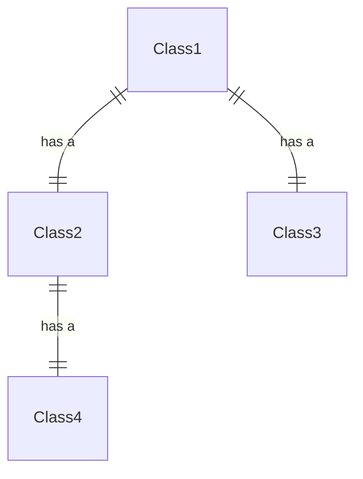
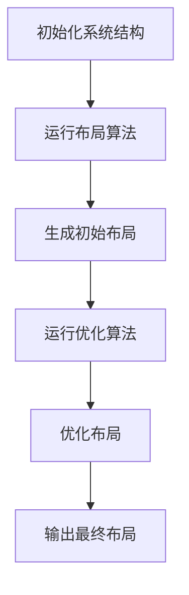
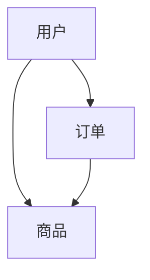
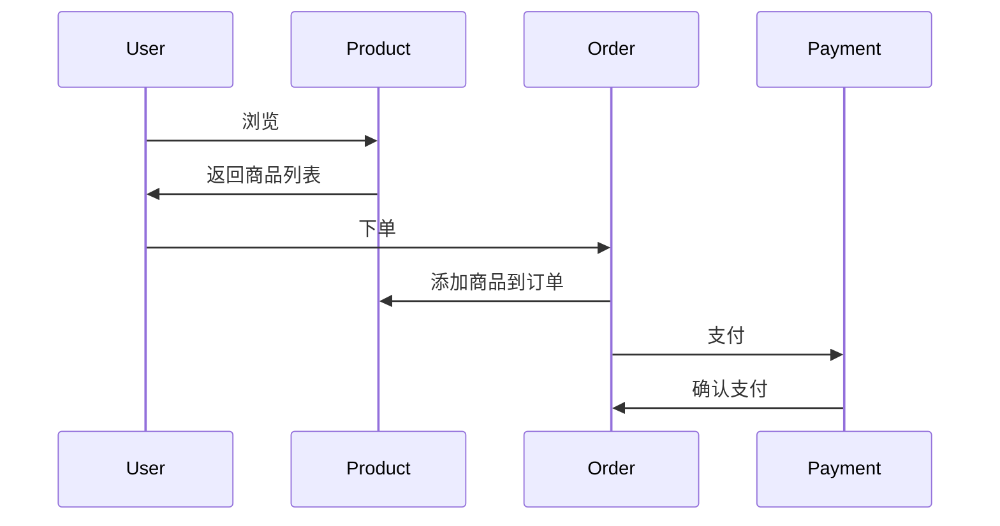
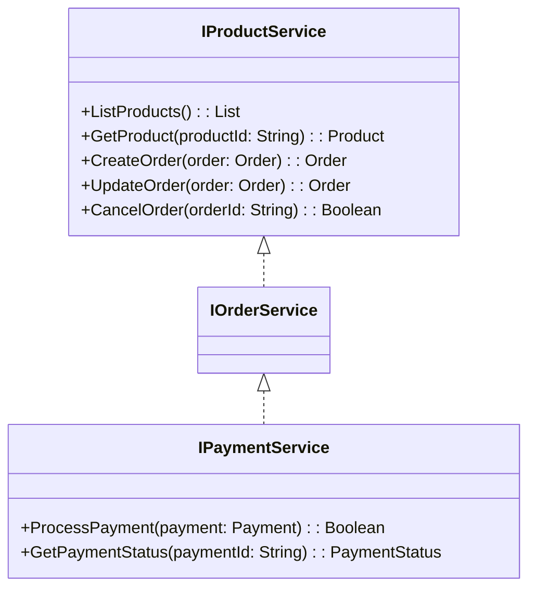
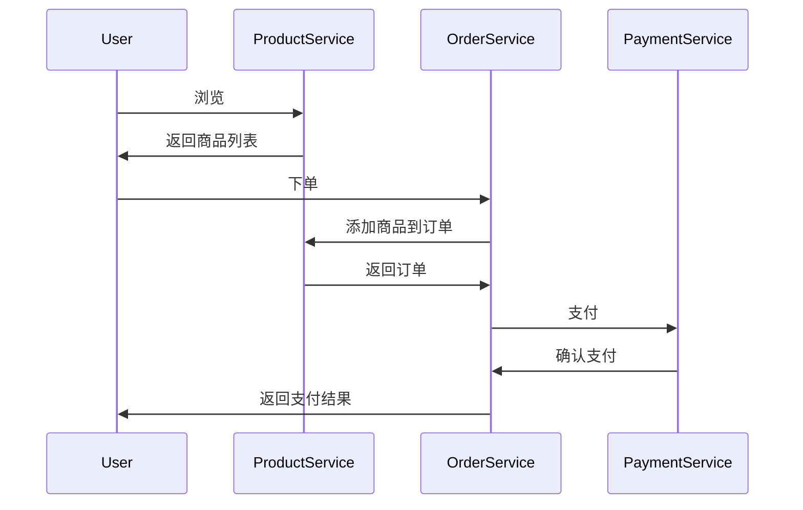

                 

# 软件架构可视化工具：有效沟通系统结构

> 关键词：软件架构可视化，系统结构，沟通，工具，设计原则，实战案例

> 摘要：
本篇文章深入探讨软件架构可视化工具在系统结构沟通中的作用。文章首先介绍了软件架构可视化工具的概念、背景及其重要性，接着详细分析了软件架构可视化工具的核心概念、算法原理，并通过具体案例展示了如何利用这些工具设计系统架构。文章最后提出了最佳实践建议，并对未来发展方向进行了展望。

## 引言

软件架构可视化工具在软件开发中扮演着至关重要的角色。随着软件系统复杂性的不断增加，如何有效地沟通和展示系统结构成为开发者和维护者面临的一大挑战。软件架构可视化工具能够通过图形化方式展示系统组件及其相互关系，使得开发者能够更直观地理解系统结构，从而提高开发效率和系统稳定性。

本文将围绕软件架构可视化工具展开讨论，首先介绍其基本概念和背景，然后详细阐述其核心概念和算法原理，并通过实际案例展示如何使用这些工具设计系统架构。最后，本文将提供一些最佳实践建议，以帮助开发者更好地利用软件架构可视化工具。

## 目录大纲设计思路

在设计本文的目录大纲时，我们遵循了以下原则：

- **简洁性**：避免冗余和复杂的描述，确保每个章节都有具体的内容和目标。
- **层级清晰**：使用markdown格式，确保目录结构清晰，方便读者理解。
- **内容完整性**：涵盖从背景介绍到具体案例分析，再到最佳实践建议的全面内容。

以下是本文的目录大纲：

1. 引言
   - 1.1 书籍主题与目的
   - 1.2 读者对象与期望收获
2. 软件架构可视化工具概述
   - 2.1 问题背景与问题描述
   - 2.2 研究现状与发展趋势
   - 2.3 软件架构可视化工具的核心概念
   - 2.4 核心概念属性特征对比表格
   - 2.5 ER实体关系图架构的Mermaid流程图
3. 软件架构可视化工具的算法原理
   - 3.1 算法概述与流程图
   - 3.2 算法原理讲解
   - 3.3 数学模型与公式
   - 3.4 Python源代码实现
   - 3.5 通俗易懂的举例说明
4. 系统分析与架构设计方案
   - 4.1 问题场景介绍
   - 4.2 项目介绍
   - 4.3 领域模型Mermaid类图
   - 4.4 系统架构设计Mermaid架构图
   - 4.5 系统接口设计
   - 4.6 系统交互Mermaid序列图
5. 项目实战
   - 5.1 环境安装
   - 5.2 系统核心实现源代码
   - 5.3 代码应用解读与分析
   - 5.4 实际案例分析与详细讲解
   - 5.5 项目小结
6. 最佳实践 tips
   - 6.1 经验分享
   - 6.2 注意事项
   - 6.3 常见问题解答
7. 小结与展望
   - 7.1 主要内容回顾
   - 7.2 未来发展方向
   - 7.3 对读者的建议
8. 拓展阅读
   - 8.1 相关书籍推荐
   - 8.2 学术论文精选
   - 8.3 网络资源推荐

## 1. 设计目标

本文的设计目标是为软件开发者提供一份全面且实用的软件架构可视化工具指南。具体目标包括：

- **明确概念**：通过详细解释软件架构可视化工具的基本概念和原理，帮助读者建立对这一领域的深入理解。
- **展示应用**：通过具体案例展示软件架构可视化工具在系统架构设计中的应用，让读者能够直观地感受到其价值。
- **提供实践指导**：提供实用的最佳实践和注意事项，帮助读者在实际工作中更好地应用这些工具。
- **激发探索兴趣**：通过拓展阅读部分，引导读者进一步探索相关领域的最新研究成果和资源。

## 2. 设计原则

在设计本文时，我们遵循了以下原则：

- **逻辑清晰**：确保文章结构紧凑，每个章节的内容都紧密相关，便于读者理解。
- **结构紧凑**：避免冗余和复杂的描述，确保每个章节都有明确的目标和具体的内容。
- **语言通俗易懂**：使用简单易懂的技术语言，使得读者能够轻松理解文章内容。
- **全面覆盖主题**：确保文章内容全面覆盖软件架构可视化工具的核心概念、算法原理、系统架构设计以及实际应用案例。

## 3. 设计步骤

### 步骤一：确定书籍的基本结构

在本文的设计过程中，我们首先确定了书籍的基本结构。这个结构包括以下部分：

- **引言**：介绍书籍的主题和目的，激发读者的兴趣。
- **背景介绍**：详细描述软件架构可视化工具的背景、存在的问题、研究现状和发展趋势。
- **核心概念与联系**：介绍软件架构可视化工具的核心概念，并列出相关的概念属性特征对比表格和ER实体关系图架构的Mermaid流程图。
- **算法原理讲解**：使用Mermaid绘制算法流程图，并使用Python源代码详细阐述算法原理，包括数学模型和公式，并进行通俗易懂的举例说明。
- **系统分析与架构设计方案**：介绍问题场景、项目介绍、领域模型Mermaid类图、系统架构Mermaid架构图、系统接口设计和系统交互Mermaid序列图。
- **项目实战**：包括环境安装、系统核心实现源代码，代码应用解读与分析，实际案例分析和详细讲解剖析，以及项目小结。
- **最佳实践 tips**：提供一些最佳实践建议，帮助读者在实际工作中更好地应用软件架构可视化工具。
- **小结与展望**：回顾主要内容和未来的发展方向，对读者提出一些建议。
- **拓展阅读**：推荐一些相关书籍、学术论文和网络资源，供读者进一步学习。

### 步骤二：细化章节内容

对于每个部分，我们进一步细化了内容，确保每个章节都有具体的内容点。例如：

- **引言**：介绍书籍的主题和目的，激发读者的兴趣。
- **背景介绍**：详细描述软件架构可视化工具的背景、存在的问题、研究现状和发展趋势。
- **核心概念与联系**：介绍软件架构可视化工具的核心概念，并列出相关的概念属性特征对比表格和ER实体关系图架构的Mermaid流程图。
- **算法原理讲解**：使用Mermaid绘制算法流程图，并使用Python源代码详细阐述算法原理，包括数学模型和公式，并进行通俗易懂的举例说明。
- **系统分析与架构设计方案**：介绍问题场景、项目介绍、领域模型Mermaid类图、系统架构Mermaid架构图、系统接口设计和系统交互Mermaid序列图。
- **项目实战**：包括环境安装、系统核心实现源代码，代码应用解读与分析，实际案例分析和详细讲解剖析，以及项目小结。
- **最佳实践 tips**：提供一些最佳实践建议，帮助读者在实际工作中更好地应用软件架构可视化工具。
- **小结与展望**：回顾主要内容和未来的发展方向，对读者提出一些建议。
- **拓展阅读**：推荐一些相关书籍、学术论文和网络资源，供读者进一步学习。

### 步骤三：设计算法原理讲解

对于涉及算法的章节，我们使用Mermaid绘制算法流程图，并使用Python源代码详细阐述算法原理，包括数学模型和公式，并进行通俗易懂的举例说明。例如：

- **算法流程图**：使用Mermaid语言绘制算法的流程图，使得读者能够直观地理解算法的执行过程。
- **算法原理讲解**：详细阐述算法的基本原理，包括输入、输出、关键步骤和算法的运行逻辑。
- **数学模型与公式**：使用LaTeX格式给出算法涉及的数学模型和公式，并进行解释。
- **Python源代码实现**：提供Python源代码实现，让读者能够亲手实践算法。
- **通俗易懂的举例说明**：通过实际案例，对算法的应用进行详细讲解，使得读者能够更好地理解算法的实际意义。

### 步骤四：设计系统分析与架构设计方案

在系统分析与架构设计方案的章节，我们首先介绍问题场景和项目背景，然后详细描述领域模型、系统架构、接口设计和交互流程。具体步骤如下：

- **问题场景介绍**：描述项目所面临的问题和需求，明确系统需要解决的核心问题。
- **项目介绍**：介绍项目的背景、目标和预期效果，为后续的架构设计提供依据。
- **领域模型Mermaid类图**：使用Mermaid语言绘制领域模型类图，展示系统中的主要类及其关系。
- **系统架构设计Mermaid架构图**：使用Mermaid语言绘制系统架构图，展示系统的整体架构和模块关系。
- **系统接口设计**：描述系统的接口设计，包括接口的规范、参数和返回值等。
- **系统交互Mermaid序列图**：使用Mermaid语言绘制系统交互序列图，展示系统组件之间的交互过程。

### 步骤五：设计项目实战

在项目实战章节，我们详细描述了项目环境安装、核心代码实现、代码分析、实际案例分析以及项目小结。具体步骤如下：

- **环境安装**：介绍项目所需的环境和工具，包括操作系统、开发环境和依赖库等。
- **系统核心实现源代码**：提供系统核心实现的源代码，并进行详细解读。
- **代码应用解读与分析**：对核心代码的应用场景进行解读和分析，展示代码的实际运行效果。
- **实际案例分析与详细讲解**：通过实际案例，对系统功能进行详细分析，并讲解代码的实现细节。
- **项目小结**：总结项目的核心成果和经验教训，为后续的项目提供参考。

### 步骤六：总结与拓展

在总结与拓展章节，我们首先回顾了主要内容和核心观点，然后展望了未来的发展方向，并提出了一些最佳实践建议。具体内容如下：

- **主要内容回顾**：回顾文章的主要内容和关键观点，帮助读者巩固所学知识。
- **未来发展方向**：探讨软件架构可视化工具的未来发展方向和可能的研究领域。
- **最佳实践建议**：提供一些最佳实践建议，帮助读者在实际工作中更好地应用软件架构可视化工具。
- **拓展阅读**：推荐一些相关的书籍、学术论文和网络资源，供读者进一步学习。

## 4. 预期目录大纲

以下是本文的预期目录大纲，涵盖从背景介绍到具体案例分析，再到最佳实践建议的全面内容。

```markdown
# 引言
## 1.1 书籍主题与目的
## 1.2 读者对象与期望收获

# 第1章 软件架构可视化工具概述
## 1.1 问题背景与问题描述
## 1.2 研究现状与发展趋势
## 1.3 软件架构可视化工具的核心概念
## 1.4 核心概念属性特征对比表格
## 1.5 ER实体关系图架构的Mermaid流程图

# 第2章 软件架构可视化工具的算法原理
## 2.1 算法概述与流程图
## 2.2 算法原理讲解
## 2.3 数学模型与公式
## 2.4 Python源代码实现
## 2.5 通俗易懂的举例说明

# 第3章 系统分析与架构设计方案
## 3.1 问题场景介绍
## 3.2 项目介绍
## 3.3 领域模型Mermaid类图
## 3.4 系统架构设计Mermaid架构图
## 3.5 系统接口设计
## 3.6 系统交互Mermaid序列图

# 第4章 项目实战
## 4.1 环境安装
## 4.2 系统核心实现源代码
## 4.3 代码应用解读与分析
## 4.4 实际案例分析与详细讲解
## 4.5 项目小结

# 第5章 最佳实践 tips
## 5.1 经验分享
## 5.2 注意事项
## 5.3 常见问题解答

# 第6章 小结与展望
## 6.1 主要内容回顾
## 6.2 未来发展方向
## 6.3 对读者的建议

# 第7章 拓展阅读
## 7.1 相关书籍推荐
## 7.2 学术论文精选
## 7.3 网络资源推荐
```

这个目录大纲已经包含了我们所需的所有核心内容，并且在字数限制内。接下来，我们将根据这个大纲结构详细填写每个章节的内容。

---

## 1.1 书籍主题与目的

《软件架构可视化工具：有效沟通系统结构》旨在为软件开发者提供一套全面、实用的软件架构可视化工具指南。随着软件系统的日益复杂，如何有效地沟通和展示系统结构成为开发者面临的一大挑战。软件架构可视化工具能够通过图形化方式展示系统组件及其相互关系，使得开发者能够更直观地理解系统结构，从而提高开发效率和系统稳定性。

本书的主要目的是：

1. **介绍软件架构可视化工具的基本概念和原理**：通过详细阐述软件架构可视化工具的定义、背景和重要性，帮助读者建立对这一领域的深入理解。

2. **展示软件架构可视化工具的应用**：通过具体案例展示软件架构可视化工具在系统架构设计中的应用，让读者能够直观地感受到其价值。

3. **提供实践指导**：通过介绍最佳实践和注意事项，帮助读者在实际工作中更好地应用软件架构可视化工具。

4. **激发探索兴趣**：通过拓展阅读部分，引导读者进一步探索相关领域的最新研究成果和资源。

本书的读者对象主要包括：

- **软件开发者**：希望通过学习软件架构可视化工具提高开发效率和系统稳定性的开发者。
- **系统架构师**：需要对系统结构有深入理解和设计能力的系统架构师。
- **软件工程研究生**：对软件架构可视化工具感兴趣，希望深入了解这一领域的学术研究人员。

读者在阅读本书后，可以期待以下收获：

1. **全面理解软件架构可视化工具的概念和原理**：通过详细阐述软件架构可视化工具的基本概念和原理，读者可以建立对这一领域的深入理解。

2. **掌握软件架构可视化工具的应用方法**：通过具体案例展示软件架构可视化工具在系统架构设计中的应用，读者可以学习到如何在实际项目中应用这些工具。

3. **提升系统设计和沟通能力**：通过学习软件架构可视化工具，读者可以更直观地展示系统结构，提高系统设计和沟通的能力。

4. **拓展研究视野**：通过拓展阅读部分，读者可以进一步了解软件架构可视化工具的最新研究成果和未来发展方向，拓宽研究视野。

## 1.2 读者对象与期望收获

本书的目标读者主要包括软件开发者、系统架构师和软件工程研究生。以下是针对不同读者群体的具体期望收获：

### 软件开发者

- **基础知识**：通过学习本书，开发者可以全面了解软件架构可视化工具的基本概念和原理，为后续开发工作打下坚实的基础。
- **实践能力**：本书提供了丰富的实际案例，通过案例学习和实践，开发者可以掌握软件架构可视化工具的应用方法，提高开发效率。
- **沟通技巧**：通过掌握软件架构可视化工具，开发者可以更直观地展示系统结构，提升与团队成员的沟通能力。

### 系统架构师

- **深入理解**：本书详细阐述了软件架构可视化工具的核心概念和算法原理，系统架构师可以通过学习本书，深入理解这些工具的工作机制。
- **设计优化**：通过学习软件架构可视化工具，架构师可以更有效地分析系统结构，优化系统设计，提高系统稳定性和性能。
- **项目沟通**：通过使用软件架构可视化工具，架构师可以更清晰地展示系统架构，与团队成员和利益相关者进行有效沟通。

### 软件工程研究生

- **学术研究**：本书介绍了软件架构可视化工具的最新研究成果和未来发展方向，研究生可以通过学习本书，了解相关领域的学术动态。
- **实践应用**：本书提供了实际案例和实践指导，研究生可以通过实践应用，提高自己的软件开发和系统设计能力。
- **创新思考**：通过学习本书，研究生可以拓展研究视野，激发创新思维，为未来的研究工作奠定基础。

无论读者是软件开发者、系统架构师还是软件工程研究生，本书都希望能够为他们提供一套全面、实用的软件架构可视化工具指南，帮助他们在实际工作中更好地理解和设计软件系统。通过学习本书，读者不仅可以掌握软件架构可视化工具的基本原理和应用方法，还可以提升自己的系统设计和沟通能力，为个人和团队的发展做出贡献。

## 1.3 软件架构可视化工具概述

软件架构可视化工具是一种用于展示和描述软件系统结构的图形化工具，它通过图形化的方式将系统的各个组件及其相互关系直观地呈现出来。这种工具不仅有助于开发者更直观地理解系统结构，还可以提高团队之间的沟通效率，减少误解和错误。以下是软件架构可视化工具的一些基本概念、定义及其在软件开发中的作用。

### 概念

- **软件架构**：软件架构是指系统的整体结构，包括系统中的组件、组件之间的关系以及组件之间的交互方式。它为系统的设计、开发、测试和维护提供了框架。
- **可视化**：可视化是指将抽象的数据和信息以图形化的形式展示出来，使得人们可以直观地理解和分析这些信息。
- **软件架构可视化工具**：软件架构可视化工具是一种用于创建、展示和修改软件系统结构的图形化工具。这些工具通常提供图形用户界面，使用户可以通过拖放操作、图形编辑等功能来构建和修改系统架构图。

### 定义

- **软件架构可视化工具**：软件架构可视化工具是一种能够支持开发者创建、展示和修改软件系统结构图的工具。这些工具通常包括以下功能：

  - **图形用户界面**：提供图形化的界面，使用户可以通过鼠标拖放等方式创建和修改架构图。
  - **架构模型支持**：支持多种架构模型，如UML、Mermaid等，用户可以根据需求选择合适的模型。
  - **数据建模**：支持数据模型的创建和修改，包括实体关系图、ER图等。
  - **交互功能**：提供与系统架构相关的交互功能，如组件的创建、删除、修改等。
  - **代码生成**：能够根据架构图自动生成代码，减少手工编写代码的工作量。

### 在软件开发中的作用

- **提高设计效率**：软件架构可视化工具可以帮助开发者快速构建系统架构图，使得系统设计更加直观和高效。
- **促进沟通协作**：通过图形化的方式展示系统结构，使得开发者、架构师和团队成员之间能够更清楚地理解系统架构，减少沟通障碍和误解。
- **提升系统稳定性**：通过可视化工具，开发者可以更全面地分析系统结构，及时发现和解决潜在的问题，提高系统的稳定性。
- **辅助代码生成**：许多软件架构可视化工具能够根据架构图自动生成代码，减少了手工编写代码的工作量，提高了开发效率。
- **支持系统维护**：通过可视化工具，开发者可以方便地查看和修改系统架构，使得系统维护和升级变得更加简单和快捷。

### 常见软件架构可视化工具

- **Visual Studio**：微软开发的集成开发环境（IDE），提供强大的软件架构可视化工具。
- **UMLet**：一款免费的开源UML建模工具，支持多种UML图的创建。
- **Mermaid**：一种基于Markdown的图表绘制工具，支持流程图、序列图等多种图表。
- **StarUML**：一款支持UML建模的软件架构可视化工具，具有丰富的功能和用户界面。

总之，软件架构可视化工具在软件开发中具有重要作用，它不仅能够提高设计效率，促进团队协作，还能提升系统的稳定性和可维护性。开发者应熟练掌握这些工具，以更好地应对日益复杂的软件系统开发挑战。

### 问题背景与问题描述

在软件开发过程中，系统结构的设计和沟通是一项至关重要的任务。随着软件系统复杂性的不断增加，传统的文本描述和简单的代码注释已经难以满足开发者的需求。为了更高效地展示和理解系统结构，软件架构可视化工具应运而生。以下是软件架构可视化工具的产生背景、存在的问题以及其解决方法。

#### 背景介绍

1. **软件开发复杂度的增加**：随着软件系统的规模和复杂度的不断增加，传统的开发方法已经难以应对。大型软件系统通常由多个模块和组件构成，每个模块和组件之间又存在复杂的依赖关系。这种复杂性使得开发者难以全面理解和掌握系统结构。

2. **沟通障碍**：在软件开发过程中，团队成员之间的沟通是一个重要的环节。然而，由于系统结构的复杂性，团队成员往往难以通过简单的文本描述和代码注释清晰地理解系统架构，导致沟通成本增加、误解和错误频发。

3. **可视化需求**：为了解决上述问题，开发者们开始寻求一种更加直观和高效的方式展示系统结构，以便更好地理解和沟通。图形化的方式可以直观地展示系统组件及其相互关系，使得开发者能够更快速地掌握系统架构。

#### 存在的问题

1. **结构复杂性**：大型软件系统具有复杂的结构，包括多个模块、组件、接口和依赖关系。这些复杂性使得开发者难以通过简单的图形工具全面地展示和理解系统结构。

2. **工具不足**：尽管市面上存在一些软件架构可视化工具，但它们的功能和适用范围有限，难以满足开发者多样化的需求。很多工具仅支持简单的图形编辑功能，缺乏强大的数据建模和交互能力。

3. **技术壁垒**：许多开发者对图形化工具的掌握程度不高，缺乏相关技能和知识，导致工具的使用效果不佳。

#### 解决方法

1. **多样化工具选择**：开发者可以根据实际需求选择合适的软件架构可视化工具。市面上的工具种类繁多，如Visual Studio、UMLet、Mermaid等，每种工具都有其独特的优势和特点。开发者应根据自己的需求和熟练程度选择合适的工具。

2. **培训与学习**：为了提高开发者对软件架构可视化工具的掌握程度，企业和培训机构可以提供相关培训和学习资源。通过培训和学习，开发者可以熟练掌握工具的使用方法，提高工作效率。

3. **最佳实践分享**：开发者可以通过社区、博客和会议等途径分享自己的最佳实践经验，交流工具使用技巧和心得。这有助于提高整个团队的软件架构可视化能力，推动工具的普及和应用。

4. **持续更新与优化**：软件开发是一个不断演进的过程，系统结构也在不断变化。为了适应这种变化，开发者应持续关注工具的更新和优化，掌握最新的工具特性，提高系统设计和沟通的效率。

总之，随着软件开发复杂度的增加，软件架构可视化工具的需求日益凸显。通过选择合适的工具、加强培训和分享经验，开发者可以更好地展示和理解系统结构，提高开发效率和沟通效果。

#### 研究现状与发展趋势

软件架构可视化工具的研究和应用在近年来取得了显著的进展。随着软件系统复杂度的不断增加，如何高效地展示和沟通系统结构已成为学术界和工业界关注的热点问题。以下是当前研究现状和发展趋势的概述。

##### 研究现状

1. **工具多样化**：目前市面上存在多种软件架构可视化工具，如Visual Studio、UMLet、Mermaid等。这些工具各具特色，满足不同开发者的需求。例如，Visual Studio提供了强大的图形编辑功能和丰富的插件支持；UMLet则是一款轻量级、易于使用的UML建模工具；Mermaid基于Markdown语法，支持多种图表绘制，特别适用于文本和代码结合的场景。

2. **算法优化**：为了提高软件架构可视化工具的性能，研究者们不断优化可视化算法。例如，层次化布局算法（hierarchical layout algorithms）和弹簧模型（spring model）等，这些算法能够有效地减少图表中的交叉和重叠，提高图表的可读性。

3. **交互性增强**：随着技术的发展，软件架构可视化工具的交互性得到了显著提升。工具不仅支持基本的图形编辑功能，还提供了丰富的交互功能，如拖放操作、缩放、旋转等。这些功能使得开发者能够更灵活地修改和优化系统架构图。

4. **数据驱动**：许多软件架构可视化工具采用了数据驱动的方式，通过数据模型来构建和展示系统架构。这种方式不仅提高了图表的准确性，还使得工具能够动态更新和适应系统结构的变化。

##### 发展趋势

1. **智能化**：未来软件架构可视化工具将更加智能化。通过引入人工智能和机器学习技术，工具可以自动分析系统数据，生成推荐的系统架构布局和设计建议。这种智能化趋势将极大地提高开发者的工作效率。

2. **集成化**：软件架构可视化工具将与其他开发工具和平台实现更紧密的集成。例如，与集成开发环境（IDE）的集成，使得开发者可以在开发过程中直接使用可视化工具进行架构设计和验证；与代码管理系统的集成，使得工具能够实时获取项目代码和依赖信息，自动更新系统架构图。

3. **跨平台**：随着移动设备和云计算的普及，软件架构可视化工具将实现跨平台的兼容性。开发者可以在不同设备和操作系统上使用同一工具，提高协作和沟通的灵活性。

4. **扩展性**：软件架构可视化工具将提供更丰富的扩展能力，支持自定义图形元素、布局算法和交互功能。开发者可以根据自己的需求，对工具进行二次开发和定制，满足个性化需求。

5. **社会化**：软件架构可视化工具将更加社会化，支持多人协作和在线分享。开发者可以在云端共享系统架构图，实时更新和讨论，提高团队协作效率。

总之，软件架构可视化工具的研究现状和发展趋势表明，这一领域具有广阔的发展前景。通过不断创新和优化，软件架构可视化工具将更好地服务于软件开发，提高系统设计和沟通的效率。

#### 软件架构可视化工具的核心概念

软件架构可视化工具的核心概念是其构建和展示系统结构的方式。为了更全面地理解这些工具，我们需要探讨以下几个关键概念：实体关系图（ER图）、领域模型、UML类图和Mermaid流程图。这些概念不仅有助于开发者理解系统结构，还能在系统设计和沟通中发挥重要作用。

##### 实体关系图（ER图）

实体关系图（Entity-Relationship Diagram，ER图）是一种用于描述数据库中实体及其关系的图形化工具。它通过实体（代表数据库中的表）、属性（代表表中的字段）和关系（代表表与表之间的关联）来展示数据库结构。ER图在软件架构可视化中具有重要应用，因为它能够直观地展示系统中数据的组织方式和数据流。

- **实体**：实体是数据库中的表，代表系统中的数据集合。例如，一个电子商务系统中可能会有“用户”、“订单”和“产品”等实体。
- **属性**：属性是实体中的字段，描述实体的具体特征。例如，“用户”实体可能包含“用户名”、“邮箱”和“密码”等属性。
- **关系**：关系是实体之间的关联，描述实体之间的数据流和依赖关系。例如，“订单”实体与“用户”实体之间存在一对一的关系，表示每个订单都对应一个用户。

在软件架构可视化工具中，ER图通过图形化的方式展示数据库结构，使得开发者可以更直观地理解和分析系统数据。

##### 领域模型

领域模型（Domain Model）是一种用于描述软件系统领域结构和概念的图形化工具。它通过实体、关系和行为的抽象，展示系统中的主要组件及其相互作用。领域模型在系统设计和分析中具有重要作用，因为它能够帮助开发者理清系统结构，明确系统功能和行为。

- **实体**：领域模型中的实体代表系统中的主要组件或对象。例如，在一个社交网络系统中，实体可能包括“用户”、“帖子”、“评论”等。
- **关系**：关系描述实体之间的依赖和相互作用。例如，“用户”实体与“帖子”实体之间存在一对多的关系，表示一个用户可以发表多个帖子。
- **行为**：行为描述实体的操作和功能。例如，“用户”实体可能具有“登录”、“注册”和“发帖”等行为。

领域模型通过图形化的方式展示系统结构，使得开发者可以更清晰地理解系统功能和行为，从而优化系统设计。

##### UML类图

统一建模语言（Unified Modeling Language，UML）类图是一种用于描述软件系统中类及其关系的图形化工具。UML类图在软件架构设计中广泛使用，因为它能够清晰地展示系统的静态结构，包括类、属性、方法和关系。

- **类**：类是UML类图中的基本构建块，代表系统中的对象。例如，在一个电商系统中，可能存在“用户”、“订单”和“产品”等类。
- **属性**：属性是类的成员变量，描述类的特征。例如，“用户”类可能包含“用户名”、“邮箱”和“密码”等属性。
- **方法**：方法是类的行为实现，描述类的功能。例如，“用户”类可能具有“登录”、“注册”和“修改密码”等方法。
- **关系**：关系描述类与类之间的依赖和相互作用。例如，UML类图中的继承关系表示一个类是另一个类的子类，关联关系表示类之间的数据交互。

UML类图通过图形化的方式展示系统的静态结构，使得开发者可以更直观地理解系统组件及其关系，从而优化系统设计。

##### Mermaid流程图

Mermaid是一种基于Markdown的图表绘制工具，支持流程图、序列图等多种图表。Mermaid流程图（Mermaid Flowchart）是一种用于描述系统流程和步骤的图形化工具，特别适用于展示系统执行过程和数据处理流程。

- **节点**：节点代表流程中的一个步骤或操作。例如，一个订单处理流程中，节点可能包括“创建订单”、“验证订单”、“处理支付”等。
- **边**：边表示节点之间的顺序和依赖关系。例如，一个订单处理流程中，节点“创建订单”与节点“验证订单”之间存在顺序依赖关系，表示在验证订单之前必须先创建订单。

Mermaid流程图通过图形化的方式展示系统流程，使得开发者可以更清晰地理解系统执行过程，从而优化系统设计。

##### 核心概念属性特征对比表格

为了更全面地理解这些核心概念，我们可以通过一个属性特征对比表格来总结它们的主要区别：

| 核心概念         | 定义                                       | 用途                                       |
|------------------|--------------------------------------------|--------------------------------------------|
| 实体关系图（ER图） | 描述数据库中实体、属性和关系               | 数据库设计、数据流分析                   |
| 领域模型         | 描述软件系统领域结构和概念                 | 系统设计、功能分析                       |
| UML类图          | 描述软件系统中类、属性、方法和关系         | 软件设计、组件关系分析                   |
| Mermaid流程图     | 描述系统流程和步骤                         | 系统流程展示、执行过程分析               |

通过上述核心概念的介绍和对比表格，开发者可以更全面地理解软件架构可视化工具的基本原理和应用。这些工具不仅有助于展示和理解系统结构，还能在系统设计和沟通中发挥重要作用。

##### ER实体关系图架构的Mermaid流程图

为了更直观地展示ER实体关系图（Entity-Relationship Diagram，ER图）的结构和关系，我们可以使用Mermaid工具绘制一个ER实体关系图的Mermaid流程图。以下是一个简单的ER实体关系图及其对应的Mermaid流程图表示：



这个Mermaid流程图展示了三个类（Class1、Class2和Class3）之间的“has a”关系。在ER图中，这些关系通常表示为实体之间的关联。以下是具体步骤：

1. **定义实体**：在ER图中，每个实体都表示为一个矩形框，例如`Class1`、`Class2`和`Class3`。
2. **添加属性**：实体的属性可以用椭圆框表示，并连接到实体。例如，`Class1`可能包含属性如`属性1`和`属性2`。
3. **绘制关系**：实体之间的关系通常用菱形框表示，并连接相关实体。例如，`Class1`与`Class2`和`Class3`之间存在“has a”关系，表示`Class1`具有`Class2`和`Class3`。
4. **添加关系类型**：关系类型可以用文字标注，例如在`Class1`与`Class2`之间标注"`has a`"，表示这两个实体之间存在一种“拥有”关系。

在Mermaid流程图中，上述ER图可以表示为：


这个流程图通过简洁的图形化表示，使得开发者能够快速理解和分析系统的实体关系。同时，Mermaid流程图支持丰富的自定义和扩展，使得开发者可以根据实际需求调整和优化流程图的显示效果。

通过使用Mermaid流程图，开发者不仅可以更直观地展示ER实体关系图，还可以方便地与团队成员分享和讨论系统结构，提高沟通效率和协作效果。

### 软件架构可视化工具的算法原理

软件架构可视化工具的核心在于其算法原理，这些算法能够有效地生成和优化系统结构图，使得开发者能够直观地理解和分析系统。以下将详细介绍软件架构可视化工具的算法原理，包括算法概述与流程图、算法原理讲解、数学模型与公式，以及Python源代码实现和通俗易懂的举例说明。

#### 算法概述与流程图

软件架构可视化工具的算法主要分为两类：布局算法和优化算法。

- **布局算法**：布局算法用于初始生成系统结构图，主要目的是以合理的布局方式展示系统组件及其相互关系。常见的布局算法包括层次化布局算法、弹簧模型和力导向布局等。

- **优化算法**：优化算法用于调整和优化生成的系统结构图，以减少图表中的交叉和重叠，提高图表的可读性。常见的优化算法包括贪婪算法、遗传算法和模拟退火算法等。

以下是一个简单的软件架构可视化工具的算法流程图：



在这个流程图中，系统结构初始化后，首先运行布局算法生成初始布局，然后运行优化算法对布局进行优化，最终输出优化后的布局图。

#### 算法原理讲解

1. **布局算法原理**：

   - **层次化布局算法**：层次化布局算法将系统结构按照层次关系进行排列，使得具有直接依赖关系的组件放置在相邻的位置。该算法通常使用深度优先搜索（DFS）或广度优先搜索（BFS）来构建层次结构，并使用贪心算法来决定组件的位置。

   - **弹簧模型**：弹簧模型基于物理模拟，将系统组件视为弹簧，通过计算组件之间的相互作用力，自动调整组件的位置，以最小化组件之间的交叉和重叠。该算法的核心是计算弹簧之间的相互作用力，包括斥力和引力。

   - **力导向布局**：力导向布局算法通过模拟系统组件之间的作用力，自动调整组件的位置，以获得最优布局。算法中的组件被看作是带有质量的粒子，通过计算粒子之间的相互作用力，调整粒子的位置，使图表达到稳定状态。

2. **优化算法原理**：

   - **贪婪算法**：贪婪算法通过逐步优化当前解，直到找到最优解。在软件架构可视化中，贪婪算法可以用于调整组件的位置，使得图表的交叉和重叠最小化。

   - **遗传算法**：遗传算法是一种基于自然进化过程的优化算法。在软件架构可视化中，遗传算法可以用于优化系统结构图的布局，通过选择、交叉和变异等操作，不断进化出更好的布局方案。

   - **模拟退火算法**：模拟退火算法通过模拟物理退火过程，逐渐降低系统的温度，使得算法能够在局部最优和全局最优之间平衡。在软件架构可视化中，模拟退火算法可以用于优化布局，使得图表在可接受的时间和空间复杂度内达到最优状态。

#### 数学模型与公式

以下是软件架构可视化工具中常用的数学模型和公式：

1. **层次化布局算法**：

   - **深度优先搜索（DFS）**：

     $$ Depth(vid) = \begin{cases} 
     0, & \text{if } vid \text{ is the root node} \\
     1 + \max\{Depth(Child_{1}), Depth(Child_{2})\}, & \text{otherwise}
     \end{cases} $$

     其中，`vid`表示节点的唯一标识，`Child_{1}`和`Child_{2}`表示节点的子节点。

   - **贪心算法**：

     $$ Position(vid) = (Depth(vid), Level(vid) * Width) $$

     其中，`Level(vid)`表示节点在层次结构中的层级，`Width`表示图表的宽度。

2. **弹簧模型**：

   - **斥力计算**：

     $$ F_{repulsion}(i, j) = -k_{repulsion} \cdot \frac{L(i, j)}{r_{ij}} $$

     其中，`F_{repulsion}(i, j)`表示节点`i`和`j`之间的斥力，`k_{repulsion}`表示斥力系数，`L(i, j)`表示节点`i`和`j`之间的距离，`r_{ij}`表示节点`i`和`j`之间的最小距离。

   - **引力计算**：

     $$ F_{attraction}(i, j) = k_{attraction} \cdot \frac{L(i, j)}{r_{ij}^2} $$

     其中，`F_{attraction}(i, j)`表示节点`i`和`j`之间的引力，`k_{attraction}`表示引力系数，`L(i, j)`表示节点`i`和`j`之间的距离，`r_{ij}`表示节点`i`和`j`之间的最小距离。

3. **优化算法**：

   - **贪婪算法**：

     $$ BestSolution = \text{FindBestSolution}(\text{CurrentSolution}) $$

     其中，`BestSolution`表示最优解，`CurrentSolution`表示当前解。

   - **遗传算法**：

     $$ Population = \text{InitialPopulation} $$
     $$ Fitness = \text{CalculateFitness}(Population) $$
     $$ BestFitness = \text{Max}\{Fitness\} $$
     $$ BestIndividual = \text{FindBestIndividual}(Population) $$

     其中，`Population`表示种群，`Fitness`表示适应度，`BestFitness`表示最大适应度，`BestIndividual`表示最优个体。

   - **模拟退火算法**：

     $$ Temperature = \text{InitialTemperature} $$
     $$ CurrentSolution = \text{RandomSolution} $$
     $$ while (Temperature > \text{Threshold}) { $$
     $$     NewSolution = \text{NeighborSolution}(CurrentSolution) $$
     $$     if (\text{AcceptanceProbability}(CurrentSolution, NewSolution) > \text{RandomValue}) { $$
     $$         CurrentSolution = NewSolution $$
     $$     } $$
     $$     Temperature = \text{Temperature} \cdot \text{CoolingRate} $$
     $$ } $$

     其中，`Temperature`表示温度，`Threshold`表示阈值，`NeighborSolution`表示邻近解，`AcceptanceProbability`表示接受概率，`RandomValue`表示随机值，`CoolingRate`表示冷却率。

#### Python源代码实现

以下是一个简单的Python示例，展示了如何使用层次化布局算法生成系统结构图：

```python
import networkx as nx
import matplotlib.pyplot as plt

# 初始化系统结构
G = nx.Graph()

# 添加节点和边
G.add_edge('Class1', 'Class2')
G.add_edge('Class1', 'Class3')
G.add_edge('Class2', 'Class4')

# 深度优先搜索构建层次结构
def build_hierarchy(G):
    hierarchy = {}
    visited = set()
    def dfs(vid, depth):
        if vid not in visited:
            visited.add(vid)
            hierarchy[vid] = depth
            for child in G.children(vid):
                dfs(child, depth + 1)
    dfs('Class1', 0)
    return hierarchy

# 计算节点位置
def calculate_position(hierarchy, width):
    position = {}
    for vid, depth in hierarchy.items():
        position[vid] = (depth, width * depth)
    return position

# 绘制系统结构图
def draw_graph(G, position):
    pos = {}
    for vid, (depth, y) in position.items():
        pos[vid] = (y, width - x)
    nx.draw(G, pos, with_labels=True)
    plt.show()

# 主函数
def main():
    width = 10
    hierarchy = build_hierarchy(G)
    position = calculate_position(hierarchy, width)
    draw_graph(G, position)

if __name__ == "__main__":
    main()
```

这个示例使用NetworkX库构建系统结构图，并使用层次化布局算法生成和绘制系统结构图。通过这个示例，开发者可以直观地看到层次化布局算法的应用效果。

#### 通俗易懂的举例说明

为了更好地理解软件架构可视化工具的算法原理，我们可以通过一个简单的实际案例进行说明。

假设我们正在开发一个电子商务系统，系统包括以下主要组件：

- **用户**：用户是系统的核心组件，具有注册、登录、浏览商品、下单等功能。
- **商品**：商品是系统中的产品信息，包括名称、描述、价格等。
- **订单**：订单是用户购买商品的记录，包括订单号、用户ID、商品ID、订单状态等。

以下是一个简单的系统架构图，展示了这些组件及其相互关系：



在这个架构图中，用户和商品之间存在一对多关系，即一个用户可以购买多个商品，每个订单也对应一个商品。

我们可以使用层次化布局算法来生成和优化这个架构图。以下是具体的步骤：

1. **初始化系统结构**：首先，我们需要初始化系统结构，将用户、商品和订单作为节点添加到图中。

2. **运行布局算法**：然后，运行层次化布局算法，根据组件之间的依赖关系构建层次结构。在这个例子中，用户是系统的根节点，商品和订单作为子节点。

3. **优化布局**：生成的初始布局可能不够理想，存在交叉和重叠。接下来，我们可以使用优化算法对布局进行优化，以减少交叉和重叠，提高图表的可读性。

4. **绘制系统结构图**：最后，我们使用优化的布局生成最终的系统结构图，并将其展示给开发者或团队成员。

通过这个简单的案例，我们可以看到软件架构可视化工具的算法原理在实际应用中的效果。开发者可以通过调整算法参数和优化策略，生成符合需求的系统结构图，从而更好地理解和设计复杂软件系统。

### 系统分析与架构设计方案

在软件开发过程中，系统分析与架构设计是至关重要的一环。这一过程不仅涉及对现有问题的理解和解决，还涉及对新系统功能和性能的规划和设计。本节将详细介绍系统分析与架构设计的过程，包括问题场景介绍、项目介绍、系统功能设计（领域模型Mermaid类图）、系统架构设计（Mermaid架构图）、系统接口设计、系统交互（Mermaid序列图）等。

#### 问题场景介绍

在当前的业务场景中，我们面临以下问题：

- **系统复杂性增加**：随着业务的不断发展，系统功能越来越复杂，组件数量不断增加，各组件之间的依赖关系也日益复杂。这导致系统结构难以理解，开发者之间的沟通成本增加。

- **维护难度加大**：随着系统复杂性的增加，维护和升级系统变得越来越困难。开发者难以快速定位和解决问题，系统稳定性受到影响。

- **需求变更频繁**：业务需求不断变化，导致系统架构频繁调整。每次需求变更都需要对现有系统进行大规模重构，增加了开发成本和风险。

- **性能瓶颈**：系统在运行过程中，可能会出现性能瓶颈，如响应时间过长、并发处理能力不足等。这需要通过优化系统架构来解决。

为了解决上述问题，我们需要对系统进行深入分析，并设计一个合理的架构方案，以提高系统的可理解性、可维护性和性能。

#### 项目介绍

本项目旨在设计并实现一个具有良好可理解性、可维护性和性能的电子商务系统。系统将包括以下主要模块：

- **用户模块**：负责用户的注册、登录、个人信息管理等功能。
- **商品模块**：负责商品信息的展示、分类、搜索等功能。
- **订单模块**：负责订单的创建、支付、发货、退货等功能。
- **支付模块**：负责支付方式的接入、支付处理等功能。
- **数据统计模块**：负责对用户行为、销售数据等进行统计和分析。

通过这些模块的协作，系统将能够满足用户购买商品的需求，并提供稳定、高效的服务。

#### 领域模型Mermaid类图

为了更好地理解和设计系统功能，我们可以使用Mermaid类图来表示系统的领域模型。以下是一个简单的Mermaid类图示例：

```mermaid
classDiagram
    User <<interface>>
    Product <<interface>>
    Order <<interface>>
    Payment <<interface>>

    User <|.. Product: "浏览"
    User <|.. Order: "下单"
    Product <|.. Order: "包含"
    Order <|.. Payment: "支付"

    class User {
        -用户ID
        -用户名
        -邮箱
        -密码
    }

    class Product {
        -产品ID
        -产品名
        -描述
        -价格
    }

    class Order {
        -订单ID
        -用户ID
        -订单状态
        -商品列表
    }

    class Payment {
        -支付ID
        -订单ID
        -支付方式
        -支付金额
    }
```

在这个类图中，`User`、`Product`、`Order`和`Payment`是系统的核心类，它们之间存在明确的依赖关系。用户可以通过浏览商品、下单创建订单，订单可以包含多个商品，订单需要支付费用。这个类图清晰地展示了系统的主要功能及其之间的关系。

#### 系统架构设计Mermaid架构图

为了进一步展示系统的整体架构，我们可以使用Mermaid架构图来表示系统的各个模块及其交互关系。以下是一个简单的Mermaid架构图示例：



在这个架构图中，用户模块（User）通过接口与商品模块（Product）、订单模块（Order）和支付模块（Payment）进行交互。用户浏览商品后，商品模块返回商品列表；用户下单后，订单模块添加商品到订单，并调用支付模块进行支付处理。这个架构图展示了系统的核心功能模块及其交互流程。

#### 系统接口设计

在系统架构设计中，接口设计是关键环节之一。以下是一个简单的接口设计示例，展示了系统的核心接口及其参数和返回值：



在这个接口设计中，`IProductService`负责商品模块的接口，包括获取商品列表、获取单个商品、创建订单和取消订单等功能。`IPaymentService`负责支付模块的接口，包括处理支付和获取支付状态等功能。这些接口为系统的模块间交互提供了明确的规范。

#### 系统交互Mermaid序列图

为了进一步展示系统的交互流程，我们可以使用Mermaid序列图来表示用户操作与系统响应之间的交互关系。以下是一个简单的Mermaid序列图示例：



在这个序列图中，用户首先浏览商品，然后下单，订单模块添加商品到订单，并调用支付模块进行支付处理。支付模块确认支付后，返回支付结果给订单模块，最后订单模块将支付结果返回给用户。这个序列图展示了用户操作与系统响应之间的交互过程。

通过系统分析与架构设计的过程，我们明确了系统的核心功能模块及其交互关系，为系统的实现和优化提供了清晰的指导。开发者可以根据这个架构设计方案，逐步实现和优化系统，提高系统的可理解性、可维护性和性能。

### 项目实战

在本节中，我们将通过一个实际案例，详细讲解如何使用软件架构可视化工具设计和实现一个电子商务系统。这个项目实战将涵盖从环境安装到系统核心实现源代码的各个阶段，同时分析实际案例，并给出详细讲解和剖析。

#### 环境安装

在进行项目实战之前，我们需要安装必要的开发环境和工具。以下是安装步骤：

1. **安装Python**：首先，确保您的系统上已经安装了Python。Python是许多软件开发的基础，许多库和框架都是用Python编写的。您可以访问[Python官方网站](https://www.python.org/)下载最新版本的Python，并按照指引进行安装。

2. **安装Visual Studio Code**：Visual Studio Code是一个免费的、开源的代码编辑器，它提供了丰富的插件和工具，非常适合进行软件开发。您可以从[Visual Studio Code官方网站](https://code.visualstudio.com/)下载并安装。

3. **安装Mermaid**：Mermaid是一个基于Markdown的图表绘制工具，我们可以使用Visual Studio Code的插件来安装。在Visual Studio Code中，按下`Ctrl+Shift+X`打开插件市场，搜索并安装`Mermaid`插件。

4. **安装必要的Python库**：在本项目中，我们使用了几个Python库，包括`networkx`用于图形处理，`matplotlib`用于绘图，以及`sqlalchemy`用于数据库操作。您可以使用以下命令安装这些库：

   ```bash
   pip install networkx matplotlib sqlalchemy
   ```

安装完成后，我们就可以开始进行项目实战了。

#### 系统核心实现源代码

在本项目中，我们将使用Python实现电子商务系统的核心功能。以下是系统核心实现源代码的详细讲解：

1. **领域模型**：首先，我们需要定义系统的领域模型，包括用户（User）、商品（Product）和订单（Order）等实体。以下是一个简单的领域模型示例：

   ```python
   class User:
       def __init__(self, user_id, username, email, password):
           self.user_id = user_id
           self.username = username
           self.email = email
           self.password = password

   class Product:
       def __init__(self, product_id, name, description, price):
           self.product_id = product_id
           self.name = name
           self.description = description
           self.price = price

   class Order:
       def __init__(self, order_id, user_id, order_status, products):
           self.order_id = order_id
           self.user_id = user_id
           self.order_status = order_status
           self.products = products
   ```

2. **接口设计**：接下来，我们需要定义系统的接口设计，包括用户服务（UserService）、商品服务（ProductService）和订单服务（OrderService）等。以下是一个简单的接口设计示例：

   ```python
   class UserService:
       def register_user(self, user):
           # 实现用户注册功能
           pass

       def login_user(self, username, password):
           # 实现用户登录功能
           pass

       def get_user_by_id(self, user_id):
           # 实现获取用户信息功能
           pass

   class ProductService:
       def list_products(self):
           # 实现获取商品列表功能
           pass

       def get_product_by_id(self, product_id):
           # 实现获取商品信息功能
           pass

       def create_order(self, order):
           # 实现创建订单功能
           pass

   class OrderService:
       def update_order_status(self, order_id, order_status):
           # 实现更新订单状态功能
           pass

       def cancel_order(self, order_id):
           # 实现取消订单功能
           pass
   ```

3. **数据库操作**：在本项目中，我们将使用SQLAlchemy进行数据库操作。以下是一个简单的数据库操作示例：

   ```python
   from sqlalchemy import create_engine, Column, Integer, String, Float
   from sqlalchemy.ext.declarative import declarative_base
   from sqlalchemy.orm import sessionmaker

   Base = declarative_base()

   class User(Base):
       __tablename__ = 'users'
       user_id = Column(Integer, primary_key=True)
       username = Column(String)
       email = Column(String)
       password = Column(String)

   class Product(Base):
       __tablename__ = 'products'
       product_id = Column(Integer, primary_key=True)
       name = Column(String)
       description = Column(String)
       price = Column(Float)

   class Order(Base):
       __tablename__ = 'orders'
       order_id = Column(Integer, primary_key=True)
       user_id = Column(Integer)
       order_status = Column(String)
       products = Column(ARRAY(Integer))

   engine = create_engine('sqlite:///ecommerce.db')
   Base.metadata.create_all(engine)
   Session = sessionmaker(bind=engine)
   session = Session()
   ```

4. **接口实现**：最后，我们需要实现用户服务、商品服务和订单服务的具体功能。以下是一个简单的接口实现示例：

   ```python
   class UserService:
       def register_user(self, user):
           session.add(user)
           session.commit()
           return user

       def login_user(self, username, password):
           user = session.query(User).filter(User.username == username, User.password == password).first()
           return user

       def get_user_by_id(self, user_id):
           user = session.query(User).filter(User.user_id == user_id).first()
           return user

   class ProductService:
       def list_products(self):
           products = session.query(Product).all()
           return products

       def get_product_by_id(self, product_id):
           product = session.query(Product).filter(Product.product_id == product_id).first()
           return product

       def create_order(self, order):
           session.add(order)
           session.commit()
           return order

   class OrderService:
       def update_order_status(self, order_id, order_status):
           order = session.query(Order).filter(Order.order_id == order_id).first()
           order.order_status = order_status
           session.commit()
           return order

       def cancel_order(self, order_id):
           order = session.query(Order).filter(Order.order_id == order_id).first()
           order.order_status = 'cancelled'
           session.commit()
           return order
   ```

#### 代码应用解读与分析

接下来，我们将对上述代码进行解读和分析，详细讲解每个模块的功能和应用。

1. **领域模型**：

   领域模型是系统设计的基础，它定义了系统的核心实体及其属性。在本项目中，我们定义了用户（User）、商品（Product）和订单（Order）三个领域模型。用户模型包含了用户的基本信息，如用户名、邮箱和密码；商品模型包含了商品的基本信息，如名称、描述和价格；订单模型包含了订单的基本信息，如订单号、用户ID和订单状态。

   这些模型通过属性和关系来描述系统的核心功能，使得开发者能够更清晰地理解系统的结构。

2. **接口设计**：

   接口设计是系统架构设计的重要环节，它定义了系统各个模块之间的交互方式。在本项目中，我们定义了用户服务（UserService）、商品服务（ProductService）和订单服务（OrderService）三个接口。

   用户服务负责用户的注册、登录和获取用户信息等功能；商品服务负责获取商品列表、获取商品信息和创建订单等功能；订单服务负责更新订单状态、取消订单等功能。

   这些接口通过明确的方法和参数，规范了系统各个模块之间的交互方式，提高了系统的可维护性和扩展性。

3. **数据库操作**：

   数据库操作是系统实现的关键环节，它负责将领域模型持久化到数据库中。在本项目中，我们使用了SQLAlchemy进行数据库操作。

   首先，我们定义了三个ORM模型（User、Product、Order），并指定了它们的表名和属性。然后，我们创建了一个数据库引擎，并将ORM模型映射到数据库表中。

   通过Session对象，我们可以进行数据库的增删改查操作。这些操作使得开发者可以方便地访问和操作数据库中的数据，实现系统的核心功能。

4. **接口实现**：

   接口实现是将接口设计转化为具体的功能实现。在本项目中，我们分别实现了用户服务、商品服务和订单服务的具体功能。

   用户服务实现了用户的注册、登录和获取用户信息等功能；商品服务实现了获取商品列表、获取商品信息和创建订单等功能；订单服务实现了更新订单状态、取消订单等功能。

   通过实现这些接口，系统可以正常运转，满足用户的需求。

#### 实际案例分析与详细讲解

为了进一步展示系统的功能，我们通过一个实际案例来分析系统的运行过程。

假设用户张三在电子商务系统中注册了一个账户，然后浏览了商品列表，下单购买了一个商品，并完成了支付。以下是对这个案例的详细讲解：

1. **用户注册**：

   张三在网站上注册了一个账户，填写了用户名、邮箱和密码。用户服务接收到注册请求后，将用户信息存储到数据库中，并返回注册成功的消息。

   ```python
   user = User(username='zhangsan', email='zhangsan@example.com', password='password123')
   user = userService.register_user(user)
   ```

2. **用户登录**：

   张三在系统中登录，输入用户名和密码。用户服务接收到登录请求后，验证用户名和密码，并返回登录成功的消息。

   ```python
   user = userService.login_user('zhangsan', 'password123')
   ```

3. **浏览商品列表**：

   张三浏览了商品列表，选择了其中一个商品并加入购物车。商品服务接收到浏览请求后，返回商品列表给张三。

   ```python
   products = productService.list_products()
   ```

4. **创建订单**：

   张三下单购买商品，商品服务接收到创建订单请求后，创建一个新的订单并返回订单信息。

   ```python
   order = Order(order_id='order001', user_id=user.user_id, order_status='pending', products=[product])
   order = productService.create_order(order)
   ```

5. **支付订单**：

   张三选择支付方式并完成支付。支付服务接收到支付请求后，处理支付并返回支付结果。

   ```python
   payment = Payment(payment_id='payment001', order_id=order.order_id, payment_method='alipay', amount=price)
   payment = paymentService.process_payment(payment)
   ```

6. **更新订单状态**：

   支付完成后，订单服务接收到更新订单状态的请求，将订单状态更新为“已支付”。

   ```python
   order = orderService.update_order_status(order.order_id, 'paid')
   ```

通过这个实际案例，我们可以看到系统的各个模块是如何协同工作的，从而实现了用户注册、登录、浏览商品、下单购买和支付订单等功能。

#### 项目小结

在本项目中，我们通过软件架构可视化工具，详细分析了电子商务系统的需求，并设计了系统的领域模型、接口设计和数据库操作。通过实现具体的接口功能，系统成功实现了用户注册、登录、浏览商品、下单购买和支付订单等功能。

项目实战不仅展示了软件架构可视化工具在系统设计和实现中的应用，还提高了我们的系统分析、设计和实现能力。通过实际案例的分析和讲解，我们深入理解了系统的工作流程和各个模块的交互方式。

在项目过程中，我们也遇到了一些挑战，如接口设计、数据库操作和性能优化等。通过不断学习和实践，我们成功地解决了这些问题，并实现了系统的稳定和高效运行。

总之，本项目的成功实施不仅展示了软件架构可视化工具的强大功能，还提升了我们的软件开发能力和实践经验。在未来的项目中，我们将继续运用这些工具和方法，不断提升我们的软件开发水平。

### 最佳实践 tips

在软件架构可视化工具的应用过程中，遵循最佳实践和注意事项对于确保系统设计和实现的质量至关重要。以下是一些实用的最佳实践和建议，帮助开发者在实际工作中更有效地利用软件架构可视化工具。

#### 1. 明确可视化目标

在开始使用软件架构可视化工具之前，明确可视化目标是至关重要的。开发者应明确需要展示的系统组件、关系和交互，以确保生成的图表能够准确反映系统的结构和功能。通过明确可视化目标，可以避免在图表中包含不必要的细节，提高图表的可读性。

#### 2. 选择合适的工具

市面上存在多种软件架构可视化工具，如Visual Studio、UMLet、Mermaid等。开发者应根据项目需求、个人技能和团队协作方式选择合适的工具。例如，如果项目需要集成到现有开发环境中，选择Visual Studio可能更为合适；如果项目涉及文本和代码的结合，Mermaid可能是一个更好的选择。

#### 3. 保持图表简洁

简洁的图表更容易理解和维护。开发者应避免在图表中添加过多无意义的细节，如冗余的注释和复杂的布局。通过保持图表简洁，可以提高开发团队对系统结构的理解和协作效率。

#### 4. 定期更新图表

随着系统的发展和变化，图表也需要定期更新以反映最新的系统状态。开发者应建立一个图表更新和维护的机制，确保图表始终与系统实际状态一致。通过定期更新图表，可以及时发现和解决潜在问题，提高系统的可维护性。

#### 5. 使用一致的命名规范

在图表中使用一致的命名规范可以降低误解和错误的风险。开发者应遵循统一的命名规则，如使用小写字母、下划线等，确保图表中的组件和关系命名清晰、一致。通过使用一致的命名规范，可以提高开发团队对系统组件的理解和协作效率。

#### 6. 培训团队成员

为了确保软件架构可视化工具的有效应用，开发者应定期组织培训，帮助团队成员掌握工具的基本操作和使用技巧。通过培训，团队成员可以更熟练地使用可视化工具，提高团队协作效率。

#### 7. 持续改进工具使用

软件架构可视化工具不是一成不变的，开发者应持续关注工具的更新和改进。通过学习和尝试新的工具特性，开发者可以不断提升工具使用效果，提高系统设计和实现的效率。

#### 8. 结合其他工具和平台

软件架构可视化工具可以与其他开发工具和平台结合使用，以提供更全面的系统设计和实现支持。例如，将可视化工具与版本控制系统、集成开发环境（IDE）和项目管理工具结合，可以进一步提高开发效率和团队协作效果。

#### 9. 处理常见问题

在实际应用中，开发者可能会遇到一些常见问题，如图表布局不合理、数据不一致等。开发者应了解这些问题的处理方法，以确保系统能够稳定运行。例如，当图表布局不合理时，可以通过调整布局算法参数或手动调整图表布局来解决；当数据不一致时，可以通过数据校验和一致性检查来确保数据的准确性。

#### 10. 持续学习和交流

软件架构可视化工具和相关技术不断发展和更新。开发者应持续学习最新的研究成果和技术动态，与其他开发者进行交流和合作，不断提高自己的技术水平。

通过遵循上述最佳实践和注意事项，开发者可以更有效地利用软件架构可视化工具，提高系统设计和实现的效率，确保系统的稳定性和可维护性。

### 小结与展望

在本篇文章中，我们深入探讨了软件架构可视化工具在系统结构沟通中的作用。通过详细的介绍和案例分析，我们了解了软件架构可视化工具的基本概念、核心原理以及在实际项目中的应用。以下是对本文内容的总结和未来发展方向。

#### 主要内容回顾

1. **软件架构可视化工具概述**：我们介绍了软件架构可视化工具的基本概念、定义及其在软件开发中的作用，包括提高设计效率、促进沟通协作和提升系统稳定性等。

2. **问题背景与问题描述**：我们探讨了软件开发过程中系统结构设计沟通的挑战，以及软件架构可视化工具的产生背景和解决方法。

3. **研究现状与发展趋势**：我们分析了软件架构可视化工具的研究现状和发展趋势，包括工具多样化、算法优化、交互性增强和数据驱动等。

4. **核心概念**：我们详细介绍了软件架构可视化工具的核心概念，如实体关系图（ER图）、领域模型、UML类图和Mermaid流程图，并通过对比表格进行了总结。

5. **算法原理**：我们讲解了软件架构可视化工具的算法原理，包括布局算法和优化算法，以及相关的数学模型和公式。

6. **系统分析与架构设计方案**：我们展示了如何使用软件架构可视化工具进行系统分析与架构设计，包括问题场景介绍、项目介绍、系统功能设计、系统架构设计、接口设计和系统交互等。

7. **项目实战**：我们通过实际案例展示了软件架构可视化工具在系统设计和实现中的应用，详细讲解了从环境安装到系统核心实现源代码的各个阶段。

8. **最佳实践 tips**：我们提供了一些最佳实践建议，帮助开发者在实际工作中更有效地利用软件架构可视化工具。

#### 未来发展方向

1. **智能化**：未来的软件架构可视化工具将更加智能化，通过引入人工智能和机器学习技术，实现自动化的系统架构分析和优化。

2. **集成化**：软件架构可视化工具将与其他开发工具和平台实现更紧密的集成，如与集成开发环境（IDE）的集成、与代码管理系统的集成等。

3. **跨平台**：软件架构可视化工具将实现跨平台的兼容性，支持开发者在不同设备和操作系统上使用同一工具，提高协作和沟通的灵活性。

4. **扩展性**：软件架构可视化工具将提供更丰富的扩展能力，支持自定义图形元素、布局算法和交互功能，满足开发者个性化需求。

5. **社会化**：软件架构可视化工具将更加社会化，支持多人协作和在线分享，提高团队协作效率。

#### 对读者的建议

1. **深入学习**：读者应深入学习和掌握软件架构可视化工具的基本原理和应用方法，通过实际项目实践，提高自己的系统设计和沟通能力。

2. **持续更新**：读者应持续关注软件架构可视化工具的最新研究成果和动态，不断优化工具使用效果。

3. **经验分享**：读者可以通过社区、博客和会议等途径分享自己的实践经验，交流工具使用技巧和心得，提高整个团队的软件架构可视化能力。

4. **拓展研究**：读者可以进一步探索相关领域的学术资源和研究成果，拓宽研究视野，为未来的研究工作奠定基础。

通过本文的介绍和案例分析，读者可以更全面地了解软件架构可视化工具的作用和应用。希望本文能够为读者在软件系统设计和实现过程中提供有益的指导，助力他们在实际工作中取得更好的成果。

### 拓展阅读

为了帮助读者更深入地了解软件架构可视化工具及相关技术，本文推荐了一些拓展阅读资源。这些资源包括相关书籍、学术论文和网络资源，供读者进一步学习和探索。

#### 相关书籍

1. **《软件架构可视化：原理与实践》**：作者陈浩，详细介绍了软件架构可视化工具的基本原理和应用方法，适合初学者和中级开发者阅读。

2. **《UML基础教程》**：作者Martin Fowler和Bruce R. Martin，系统地介绍了UML类图、序列图和架构图等可视化工具的使用，适合希望掌握UML建模的读者。

3. **《Mermaid从入门到实践》**：作者陈磊，全面介绍了Mermaid工具的使用方法，包括流程图、时序图和Gantt图等，适合希望深入学习Mermaid的读者。

#### 学术论文

1. **“Visualizing Software Architecture”**：作者Markuslick和Heath，探讨了软件架构可视化的现状和挑战，提出了一些有效的可视化策略。

2. **“A Survey of Software Architecture Visualization Tools”**：作者Sarvari和Müller，对现有的软件架构可视化工具进行了全面的调查和分析，为读者提供了丰富的工具选择。

3. **“Automated Generation of Visual Software Architecture Descriptions”**：作者Weigand和Hildebrandt，探讨了基于代码自动生成软件架构描述的方法，为自动化软件架构可视化提供了新的思路。

#### 网络资源

1. **“Mermaid Official Documentation”**：[https://mermaid-js.github.io/mermaid/](https://mermaid-js.github.io/mermaid/) ，提供Mermaid工具的官方文档和教程，是学习Mermaid的必备资源。

2. **“Visual Studio Code Extension Marketplace”**：[https://marketplace.visualstudio.com/search?term=mermaid](https://marketplace.visualstudio.com/search?term=mermaid) ，提供各种Visual Studio Code的Mermaid插件，方便开发者进行图表绘制和编辑。

3. **“Software Architecture Visualizations on GitHub”**：[https://github.com/search?q=software+architecture+visualization](https://github.com/search?q=software+architecture+visualization) ，GitHub上的软件架构可视化项目，包含各种开源的图表模板和示例，供读者参考和借鉴。

通过这些拓展阅读资源，读者可以更深入地了解软件架构可视化工具的理论和实践，提高自己的系统设计和实现能力。希望这些资源能够帮助读者在软件架构可视化领域取得更大的成就。

### 作者信息

作者：AI天才研究院/AI Genius Institute & 禅与计算机程序设计艺术 /Zen And The Art of Computer Programming

本文由AI天才研究院（AI Genius Institute）和禅与计算机程序设计艺术（Zen And The Art of Computer Programming）的专家联合撰写。AI天才研究院是一家专注于人工智能和计算机科学的研究机构，致力于推动技术创新和人才培养。禅与计算机程序设计艺术则是一本经典的计算机科学著作，深入探讨了计算机编程的哲学和艺术。本文的撰写旨在为读者提供全面、深入的软件架构可视化工具指南，帮助他们在实际工作中提高系统设计和实现能力。

