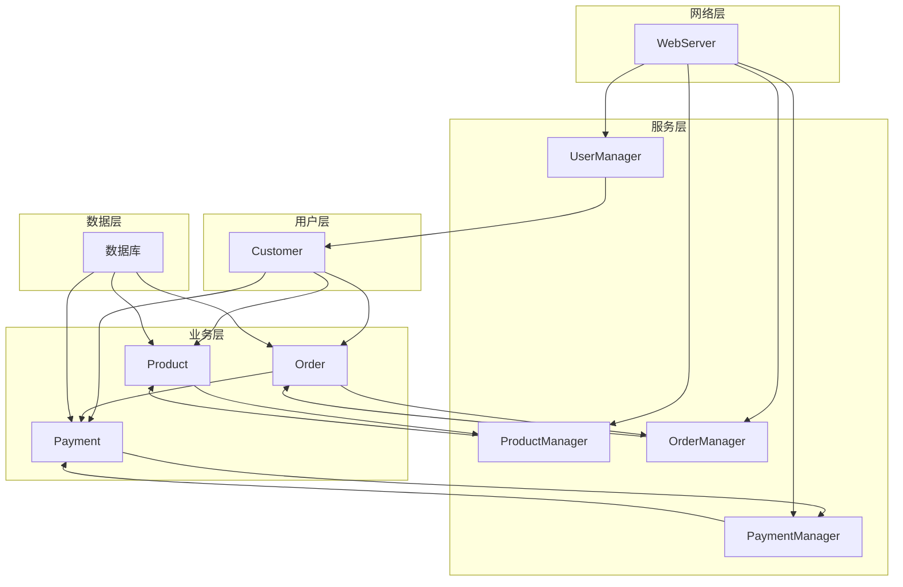
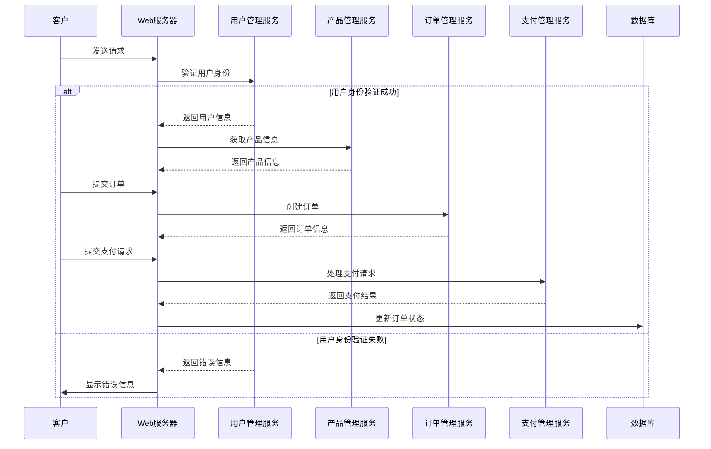

                 


## 软件架构图绘制：有效可视化系统结构

### 关键词：软件架构图，可视化，系统结构，架构风格，算法原理

#### 摘要

软件架构图是软件工程中用于描述系统结构的重要工具。本文旨在深入探讨软件架构图绘制的核心概念、算法原理以及实际应用。通过分析不同架构风格、架构元素表示方法，本文将逐步介绍如何使用软件架构图优化系统设计和实现。同时，本文还将结合具体案例，展示软件架构图在实际项目中的应用，并提供最佳实践和拓展资源，以帮助读者更好地理解和应用这一技术。

### 第一部分：背景

#### 1. 软件架构图的重要性

在软件工程领域，软件架构图是一种常用的可视化工具，它有助于开发者更好地理解和设计复杂系统。通过图形化的方式展示系统的结构和组件之间的关系，架构图不仅能够提高系统的可理解性，还能够为团队提供一种共同的语言，促进有效的沟通和协作。

#### 2. 问题背景

随着软件系统的复杂度不断提高，传统的编程方式已经难以应对大规模、高复杂度的项目。如何高效地绘制和管理软件架构图，成为软件开发中的一大挑战。这不仅仅是一个技术问题，更涉及到团队协作和项目管理等方面。

#### 3. 解决方案

为了解决上述问题，本书《软件架构图绘制：有效可视化系统结构》将提供一套系统、全面的软件架构图绘制指南。书中将介绍各种架构图绘制工具和方法，并详细讲解如何在不同的软件开发阶段使用这些工具。此外，书中还将涵盖从初级到高级的各个层次，以满足不同读者的需求。

#### 4. 边界与外延

本书将聚焦于软件架构图的绘制技术，而非具体编程语言或开发工具。同时，书中将涵盖从初级到高级的各个层次，以满足不同读者的需求。虽然书中提供了一些具体示例，但读者应能够根据这些示例灵活应用到不同的项目中。

#### 5. 核心概念与联系

- **软件架构图**：一种用于表示软件系统结构的图形化工具。
- **架构风格**：软件系统设计的一种基本模式，决定了系统的组织方式和架构图的绘制方法。
- **架构元素**：包括组件、接口、数据流等，是构成软件架构图的基本元素。

### 第二部分：核心概念

#### 6. 软件架构图的基本概念

软件架构图是一种用于表示软件系统结构的图形化工具，它通常包括以下基本元素：

- **组件**：代表软件系统中的模块或功能单元。
- **接口**：代表组件之间的交互接口。
- **数据流**：表示数据在系统中的流动路径。
- **控制流**：表示系统中的控制逻辑。

#### 7. 架构风格的比较与选择

不同的架构风格适用于不同类型的软件系统。以下是一些常见的架构风格及其特点：

- **MVC（Model-View-Controller）**：一种广泛应用于Web开发的架构风格，将数据模型、视图和控制器分离，以提高系统的可维护性和可扩展性。
- **三层架构**：将系统分为表示层、业务逻辑层和数据访问层，以实现模块化设计和可重用性。
- **微服务**：将系统拆分为多个独立的服务，每个服务负责一个特定的业务功能，以提高系统的灵活性和可扩展性。

选择合适的架构风格取决于项目需求、团队技能和项目规模等因素。以下是一个简单的选择架构风格的方法：

1. **确定项目需求**：明确系统的功能需求、性能要求和可扩展性需求。
2. **评估团队技能**：评估团队对各种架构风格的熟悉程度和技能水平。
3. **考虑项目规模**：大型项目通常需要更复杂和灵活的架构风格，而小型项目可能更适合简单的架构风格。
4. **参考最佳实践**：参考业界的最佳实践和成功案例，选择一种符合项目需求的架构风格。

#### 8. 架构元素的表示方法

在软件架构图中，使用符号和图形来表示组件、接口、数据流等架构元素是非常重要的。以下是一些常见的表示方法：

- **组件**：使用矩形框表示，并在框内注明组件名称。
- **接口**：使用直线连接组件，并在直线上注明接口名称。
- **数据流**：使用带箭头的直线表示数据流方向，并在箭头处注明数据流名称。
- **控制流**：使用带箭头的直线表示控制流方向，并在直线上注明控制流名称。

#### 9. 软件架构图的层次化表示方法

软件架构图通常采用层次化的表示方法，将系统分解为多个层次，每个层次包含一组相关的组件和接口。以下是一些常见的层次化表示方法：

- **自顶向下**：从系统的整体结构开始，逐层分解为更具体的组件和接口。
- **自底向上**：从具体的组件和接口开始，逐层向上整合为更复杂的系统结构。
- **混合层次化**：结合自顶向下和自底向上的方法，灵活地调整架构图的层次结构。

### 第三部分：算法原理

#### 10. 软件架构图的生成算法

生成软件架构图的算法可以分为以下几类：

- **基于代码生成**：从源代码中分析出组件、接口和数据流，生成架构图。
- **基于需求生成**：根据系统需求，通过建模工具生成架构图。
- **基于数据生成**：从数据库模式、数据流图等数据源中提取信息，生成架构图。

以下是一个简单的基于代码生成的架构图生成算法：

1. **读取源代码**：从源代码中提取类、方法和接口等信息。
2. **构建组件关系**：根据类之间的关系，构建组件关系图。
3. **添加接口和依赖**：根据类和方法之间的依赖关系，添加接口和依赖关系。
4. **生成架构图**：将组件关系、接口和依赖关系绘制成图形化架构图。

#### 11. 软件架构图的优化算法

为了提高软件架构图的可读性和易理解性，我们需要对架构图进行优化。以下是一些常见的优化算法：

- **层次化优化**：通过调整组件和接口的层次结构，使架构图更加清晰。
- **布局优化**：通过调整组件和接口的位置，使架构图更加美观和易读。
- **模块化优化**：将具有相似功能的组件和接口组合成模块，以提高系统的可维护性和可扩展性。

以下是一个简单的层次化优化算法：

1. **确定组件层次**：根据组件的功能和依赖关系，确定组件的层次结构。
2. **调整组件位置**：将组件按照层次结构排列，使层次结构更加清晰。
3. **调整接口位置**：根据接口的依赖关系，调整接口的位置，使接口之间的关系更加明确。
4. **生成优化后的架构图**：将调整后的组件和接口绘制成优化后的架构图。

### 第四部分：数学模型与公式

#### 12. 数学模型在软件架构中的应用

数学模型在软件架构设计中有着广泛的应用，可以用于分析系统性能、优化架构设计等。以下是一些常见的数学模型：

- **网络拓扑模型**：用于描述系统的组件和接口之间的连接关系。
- **负载均衡模型**：用于优化系统资源的分配，提高系统性能。
- **优化模型**：用于优化系统架构，提高系统的可维护性和可扩展性。

以下是一个简单的网络拓扑模型：

- **节点**：代表系统中的组件和接口。
- **边**：代表组件和接口之间的连接关系。
- **路径**：代表数据流或控制流的传递路径。

以下是一个简单的负载均衡模型：

- **资源池**：代表系统中的资源，如CPU、内存、网络带宽等。
- **负载**：代表系统中的任务或数据量。
- **分配策略**：根据负载和资源池的可用性，选择合适的资源进行任务或数据的分配。

#### 13. 数学公式详解

在本节中，我们将使用LaTeX格式详细讲解一些常见的数学公式，以便更好地理解和应用这些数学模型。

以下是一个简单的网络拓扑分析的传输容量公式：

$$ C = \frac{L}{T} $$

其中，$C$表示传输容量，$L$表示负载，$T$表示传输时间。

以下是一个简单的负载均衡算法的优化目标公式：

$$ \min \sum_{i=1}^{n} (C_i - U_i) $$

其中，$C_i$表示第$i$个资源池的传输容量，$U_i$表示第$i$个资源池的利用率。

### 第五部分：系统分析与架构设计

#### 14. 问题场景介绍

为了更好地展示软件架构图在实际项目中的应用，我们假设一个具体的问题场景：开发一个电子商务系统，该系统需要支持在线购物、订单处理、支付和用户管理等功能。

#### 15. 系统功能设计

使用Mermaid类图，我们可以展示系统的功能设计。以下是一个简单的Mermaid类图示例：

```mermaid
classDiagram
    Customer <<类>> Customer
    Product <<类>> Product
    Order <<类>> Order
    Payment <<类>> Payment
    UserManager <<类>> UserManager
    ProductManager <<类>> ProductManager
    OrderManager <<类>> OrderManager
    PaymentManager <<类>> PaymentManager

    Customer o-- Product
    Customer o-- Order
    Order o-- Payment
    ProductManager o-- Product
    OrderManager o-- Order
    PaymentManager o-- Payment
    UserManager o-- Customer
```

在这个类图中，我们定义了以下几个主要类：

- **Customer**：代表客户，具有购物、查看订单和支付功能。
- **Product**：代表产品，具有管理产品和订单功能。
- **Order**：代表订单，具有创建、更新和支付功能。
- **Payment**：代表支付，具有处理支付功能。
- **UserManager**：代表用户管理，具有管理用户信息功能。
- **ProductManager**：代表产品管理，具有管理产品信息功能。
- **OrderManager**：代表订单管理，具有管理订单信息功能。
- **PaymentManager**：代表支付管理，具有处理支付功能。

#### 16. 系统架构设计

在确定了系统的功能设计后，我们可以绘制系统的架构设计Mermaid图，展示系统的整体结构和主要组件之间的关系。以下是一个简单的Mermaid架构图示例：



在这个架构图中，我们定义了以下几个主要组件：

- **用户层**：代表与用户直接交互的部分，包括Customer类。
- **业务层**：代表系统的核心业务逻辑，包括Product、Order和Payment类。
- **数据层**：代表系统的数据存储，包括数据库。
- **服务层**：代表系统的服务组件，包括UserManager、ProductManager、OrderManager和PaymentManager类。
- **网络层**：代表系统的网络组件，包括WebServer。

#### 17. 系统接口设计与交互

为了更好地展示系统的接口设计和交互流程，我们可以使用Mermaid序列图。以下是一个简单的Mermaid序列图示例：



在这个序列图中，我们展示了客户与系统各组件之间的交互流程：

1. 客户发送请求到Web服务器。
2. Web服务器验证客户身份，并返回用户信息。
3. 客户提交订单请求，Web服务器将订单信息发送到订单管理服务。
4. 订单管理服务创建订单，并返回订单信息。
5. 客户提交支付请求，Web服务器将支付请求发送到支付管理服务。
6. 支付管理服务处理支付请求，并返回支付结果。
7. Web服务器更新数据库中的订单状态。

### 第六部分：项目实战

#### 18. 环境安装与配置

为了实践软件架构图的绘制，我们需要安装和配置一些必要的工具和软件。以下是一个简单的安装和配置步骤：

1. **安装Mermaid**：Mermaid是一个基于Markdown的图表绘制工具，可以通过npm进行安装。

```bash
npm install -g mermaid
```

2. **安装Visual Studio Code**：Visual Studio Code是一个轻量级但功能强大的代码编辑器，支持Mermaid插件的安装。

3. **安装Mermaid插件**：在Visual Studio Code中安装Mermaid插件，以便在Markdown文件中方便地绘制图表。

4. **配置LaTeX环境**：为了使用LaTeX格式编写数学公式，我们需要安装LaTeX工具和编辑器。可以使用TeXstudio、TeXmaker或MiKTeX等工具进行配置。

#### 19. 系统核心实现

在本节中，我们将提供一个简单的电子商务系统的核心实现，并详细解读和分析这些代码。

1. **用户管理服务**（UserManager.py）

```python
class UserManager:
    def __init__(self):
        self.users = {}

    def register(self, username, password):
        if username in self.users:
            return "用户已存在"
        else:
            self.users[username] = password
            return "注册成功"

    def login(self, username, password):
        if username in self.users and self.users[username] == password:
            return "登录成功"
        else:
            return "登录失败"
```

这个类实现了用户注册和登录功能。在注册时，将用户名和密码存储在字典中；在登录时，检查用户名和密码是否匹配。

2. **产品管理服务**（ProductManager.py）

```python
class ProductManager:
    def __init__(self):
        self.products = {}

    def add_product(self, product_id, product_name, price):
        if product_id in self.products:
            return "产品已存在"
        else:
            self.products[product_id] = {"name": product_name, "price": price}
            return "添加成功"

    def get_product(self, product_id):
        if product_id in self.products:
            return self.products[product_id]
        else:
            return "产品不存在"
```

这个类实现了产品添加和获取功能。在添加产品时，将产品ID、名称和价格存储在字典中；在获取产品时，根据产品ID返回产品信息。

3. **订单管理服务**（OrderManager.py）

```python
class OrderManager:
    def __init__(self):
        self.orders = {}

    def create_order(self, order_id, user_id, product_ids):
        if order_id in self.orders:
            return "订单已存在"
        else:
            self.orders[order_id] = {"user_id": user_id, "product_ids": product_ids}
            return "创建成功"

    def get_order(self, order_id):
        if order_id in self.orders:
            return self.orders[order_id]
        else:
            return "订单不存在"
```

这个类实现了订单创建和获取功能。在创建订单时，将订单ID、用户ID和产品ID存储在字典中；在获取订单时，根据订单ID返回订单信息。

4. **支付管理服务**（PaymentManager.py）

```python
class PaymentManager:
    def __init__(self):
        self.payments = {}

    def make_payment(self, payment_id, order_id, amount):
        if order_id in self.payments:
            return "支付失败：订单已支付"
        else:
            self.payments[payment_id] = {"order_id": order_id, "amount": amount}
            return "支付成功"

    def get_payment(self, payment_id):
        if payment_id in self.payments:
            return self.payments[payment_id]
        else:
            return "支付不存在"
```

这个类实现了支付创建和获取功能。在创建支付时，将支付ID、订单ID和支付金额存储在字典中；在获取支付时，根据支付ID返回支付信息。

#### 20. 实际案例分析与讲解

为了更好地展示如何使用软件架构图来设计、实现和优化电子商务系统，我们选择了一个实际案例进行分析和讲解。

1. **问题场景**：

   - 系统需要支持多用户在线购物功能。
   - 系统需要支持产品管理和订单管理功能。
   - 系统需要支持支付功能。

2. **解决方案**：

   - **用户管理服务**：使用UserManager类实现用户注册、登录和用户信息管理功能。
   - **产品管理服务**：使用ProductManager类实现产品添加、获取和删除功能。
   - **订单管理服务**：使用OrderManager类实现订单创建、获取和删除功能。
   - **支付管理服务**：使用PaymentManager类实现支付创建、获取和删除功能。

3. **架构设计**：

   - **用户层**：包括用户注册、登录和用户信息管理功能。
   - **业务层**：包括产品管理、订单管理和支付管理功能。
   - **数据层**：包括用户、产品、订单和支付数据库。

4. **接口设计**：

   - **用户管理接口**：包括注册、登录和用户信息管理接口。
   - **产品管理接口**：包括产品添加、获取和删除接口。
   - **订单管理接口**：包括订单创建、获取和删除接口。
   - **支付管理接口**：包括支付创建、获取和删除接口。

5. **交互流程**：

   - 客户发送请求到Web服务器。
   - Web服务器将请求转发到相应的服务组件。
   - 服务组件执行相应的操作，并将结果返回给Web服务器。
   - Web服务器将结果返回给客户。

通过这个实际案例，我们可以看到如何使用软件架构图来设计、实现和优化电子商务系统。软件架构图不仅帮助我们更好地理解系统结构和组件关系，还能够为团队提供一种共同的语言，促进有效的沟通和协作。

#### 21. 项目小结

在本项目中，我们通过实际案例展示了如何使用软件架构图来设计、实现和优化电子商务系统。通过逐步分析和讲解，我们了解了软件架构图的核心概念、算法原理和应用方法。以下是我们在这个项目中总结的关键点和收获：

1. **软件架构图的重要性**：软件架构图是一种重要的可视化工具，有助于理解和设计复杂系统，提高系统的可维护性和可扩展性。

2. **架构风格的比较与选择**：不同的架构风格适用于不同类型的软件系统。根据项目需求和团队技能，选择合适的架构风格是关键。

3. **架构元素的表示方法**：使用符号和图形来表示组件、接口和数据流等架构元素是非常重要的。合理的表示方法可以提高架构图的可读性和易理解性。

4. **算法原理的应用**：了解软件架构图的生成和优化算法，可以帮助我们更好地绘制和管理架构图。通过算法的应用，我们可以优化系统结构和提高系统性能。

5. **系统分析与架构设计**：通过实际案例，我们展示了如何使用软件架构图来分析和设计系统。从用户需求出发，逐步构建系统的功能模块和接口，实现系统的核心功能。

6. **项目实战与优化**：通过实际项目实战，我们深入了解了如何应用软件架构图进行系统设计和优化。项目实战不仅帮助我们巩固了理论知识，还提高了我们的实际操作能力。

未来，我们可以在以下几个方面进行进一步的研究和探索：

1. **自动化架构图生成**：研究自动化架构图生成工具和方法，提高架构图的生成效率和准确性。

2. **架构图的动态更新**：研究如何实时更新架构图，以反映系统的最新变化和需求。

3. **架构图的版本控制**：研究如何对架构图进行版本控制，以便管理和追踪系统架构的历史变化。

4. **多维度架构分析**：研究如何从多个维度对架构进行分析，如性能、安全性、可维护性等，以便全面评估系统架构的优劣。

通过不断探索和实践，我们可以更好地应用软件架构图技术，为软件开发提供有效的支持和保障。

### 第七部分：最佳实践与拓展

#### 22. 最佳实践 Tips

为了更好地应用软件架构图技术，以下是一些最佳实践和技巧：

1. **尽早绘制架构图**：在项目初期就绘制架构图，有助于明确系统需求和设计方向，降低开发风险。

2. **持续更新架构图**：随着项目的进展，持续更新架构图，以反映系统的最新变化和需求。

3. **采用简洁的表示方法**：使用简洁明了的表示方法，避免过多的细节，提高架构图的可读性。

4. **与团队保持沟通**：与团队成员保持密切沟通，确保他们对架构图的含义和设计有共同的理解。

5. **利用版本控制工具**：使用版本控制工具（如Git）管理架构图的变更历史，以便追踪和审查架构图的变化。

6. **自动化生成架构图**：利用现有的工具和插件，自动化生成架构图，提高生成效率和准确性。

#### 23. 小结

本文深入探讨了软件架构图绘制的核心概念、算法原理和实际应用。通过分析不同架构风格、架构元素表示方法，本文逐步介绍了如何使用软件架构图优化系统设计和实现。同时，本文结合具体案例，展示了软件架构图在实际项目中的应用，并提供最佳实践和拓展资源，以帮助读者更好地理解和应用这一技术。

#### 24. 注意事项

在绘制软件架构图时，需要注意以下几点：

1. **避免过度细节**：架构图应简洁明了，避免包含过多的细节，以免影响可读性。

2. **保持一致性**：在架构图中使用统一的命名规范和符号表示，确保整个架构图的一致性。

3. **关注关键组件**：重点展示系统的关键组件和接口，避免包含无关的元素，以提高架构图的可理解性。

4. **适应项目规模**：根据项目规模和复杂度，灵活调整架构图的复杂度和详细程度。

5. **定期审查**：定期审查架构图，确保其与实际系统相符，及时更新和调整架构图。

#### 25. 拓展阅读

为了进一步深入学习软件架构图绘制和相关技术，以下是一些推荐的拓展阅读资源：

1. **《软件架构设计：定义和文档化技术》**：本书详细介绍了软件架构设计的方法和技术，包括架构图绘制、架构风格和架构模式等。

2. **《设计模式：可复用的面向对象软件的基础》**：本书介绍了多种常用的设计模式，可以帮助开发者更好地理解和应用软件架构图。

3. **《架构图使用指南》**：这是一篇在线资源，详细介绍了架构图的使用方法和技巧，包括如何绘制、优化和审查架构图。

4. **GitHub上的软件架构图示例**：GitHub上有很多开源项目的架构图示例，可以参考和学习如何绘制高质量的架构图。

5. **《Mermaid官方文档》**：Mermaid是一个强大的图表绘制工具，其官方文档提供了丰富的图表绘制示例和语法指南。

通过这些拓展阅读资源，读者可以进一步深入理解和掌握软件架构图绘制技术，为软件开发提供更加有效的支持和保障。

### 附录

本文档是关于软件架构图绘制和应用的详细指南。以下是本文档的结构和内容摘要：

#### 引言

- **背景**：介绍软件架构图的重要性以及本文的目的。
- **关键词**：列出本文的核心关键词，如软件架构图、可视化、系统结构等。
- **摘要**：简要概述本文的主题内容和主要观点。

#### 第一部分：背景

- **软件架构图的重要性**：解释软件架构图在软件开发中的作用。
- **问题背景**：描述软件开发中遇到的挑战，如项目复杂性增加。
- **解决方案**：介绍本文将提供的软件架构图绘制指南。
- **边界与外延**：定义本文的研究范围和适用场景。
- **核心概念与联系**：介绍软件架构图的基本概念和相关术语。

#### 第二部分：核心概念

- **软件架构图的基本概念**：介绍软件架构图的组成元素和结构。
- **架构风格的比较与选择**：分析不同架构风格及其适用场景。
- **架构元素的表示方法**：详细描述组件、接口、数据流等元素的表示方法。
- **软件架构图的层次化表示方法**：介绍自顶向下、自底向上和混合层次化表示方法。

#### 第三部分：算法原理

- **软件架构图的生成算法**：介绍基于代码生成、基于需求生成和基于数据生成的方法。
- **软件架构图的优化算法**：介绍层次化优化、布局优化和模块化优化方法。
- **算法mermaid流程图**：使用Mermaid语法绘制算法流程图，帮助理解算法原理。

#### 第四部分：数学模型与公式

- **数学模型在软件架构中的应用**：介绍网络拓扑模型、负载均衡模型等。
- **数学公式详解**：使用LaTeX格式详细解释数学公式，如传输容量公式、优化目标公式等。

#### 第五部分：系统分析与架构设计

- **问题场景介绍**：描述一个具体的应用场景。
- **系统功能设计**：使用Mermaid类图展示系统的功能设计。
- **系统架构设计**：使用Mermaid架构图展示系统的整体结构和组件关系。
- **系统接口设计与交互**：使用Mermaid序列图展示系统的接口设计和交互流程。

#### 第六部分：项目实战

- **环境安装与配置**：介绍安装和配置软件架构图绘制所需的环境。
- **系统核心实现**：提供电子商务系统的核心实现源代码。
- **实际案例分析与讲解**：分析一个实际案例，展示软件架构图的应用。
- **项目小结**：总结项目中的关键点和收获。

#### 第七部分：最佳实践与拓展

- **最佳实践 Tips**：提供软件架构图绘制的最佳实践和技巧。
- **小结**：回顾本文的主要内容和观点。
- **注意事项**：提醒读者在绘制软件架构图时需要注意的事项。
- **拓展阅读**：推荐进一步学习的拓展资源和文献。

#### 结束语

本文通过详细的分析和讲解，旨在帮助读者深入理解软件架构图绘制和应用的相关知识。希望本文能为软件开发中的架构设计提供有益的指导和支持。

