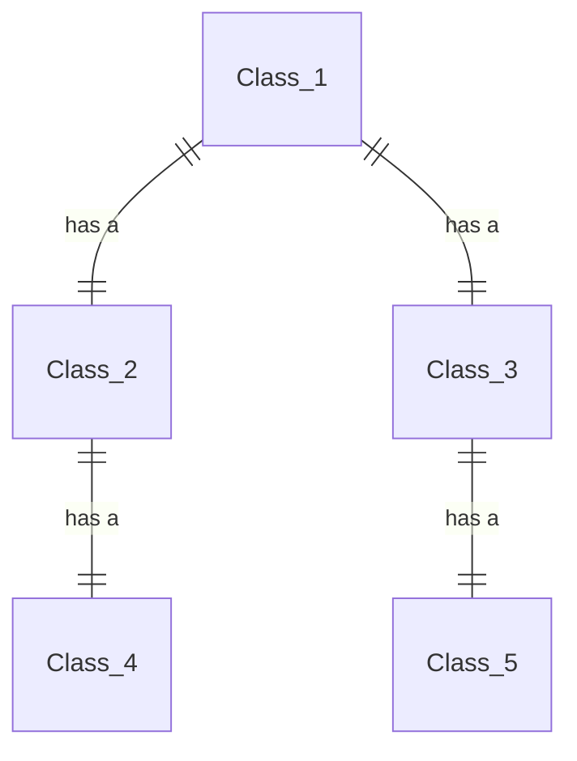
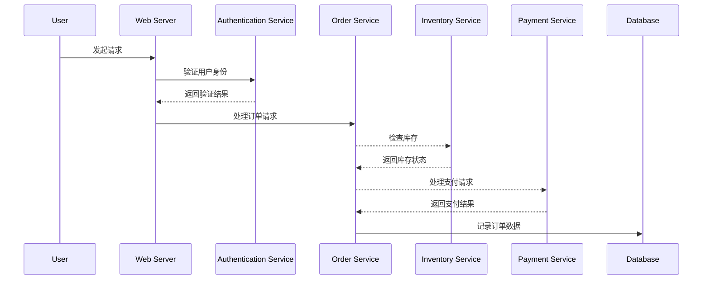
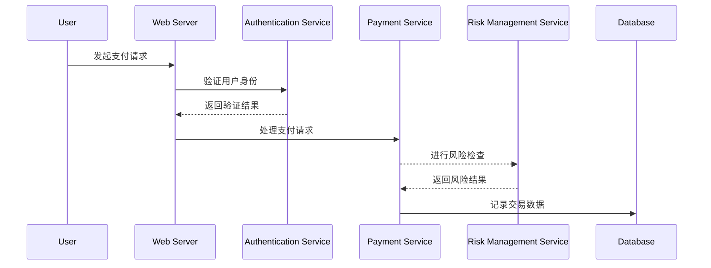
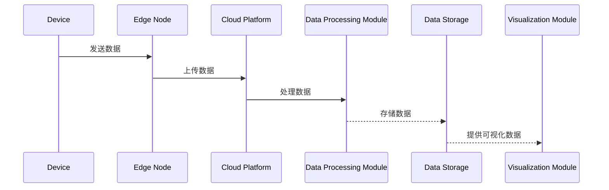

                 

### 《软件架构师的成长之路：从技术专家到决策者》

#### 文章关键词
- 软件架构
- 架构师成长
- 技术专家
- 决策者
- 实战案例

#### 摘要
本文将探讨软件架构师的角色转变及其成长路径，从技术专家到决策者，揭示架构师在软件项目中的关键作用。通过深入剖析核心概念、实战案例分析以及成长路径，本文旨在为软件架构师提供实际可行的成长指南，助力其在职业生涯中不断进阶。

----------------------------------------------------------------

## 目录大纲

### 第一部分：引言
#### 1.1 问题背景
#### 1.2 问题描述
#### 1.3 问题解决
#### 1.4 边界与外延

### 第二部分：软件架构基础
#### 2.1 核心概念
#### 2.2 架构风格
#### 2.3 概念属性特征对比表格
#### 2.4 ER实体关系图架构

### 第三部分：架构师的成长路径
#### 3.1 起步阶段
#### 3.2 进阶阶段
#### 3.3 成熟阶段
#### 3.4 领导力培养

### 第四部分：技术专家到决策者的转变
#### 4.1 技术专家的角色与职责
#### 4.2 决策者的职责与要求
#### 4.3 转变路径
#### 4.4 决策工具与方法

### 第五部分：实战案例分析
#### 5.1 案例一：大型电商平台的架构设计
#### 5.2 案例二：金融科技项目的架构优化
#### 5.3 案例三：物联网系统的架构实现

### 第六部分：总结与展望
#### 6.1 成长之路的总结
#### 6.2 面临的挑战与机遇
#### 6.3 展望未来：架构师的职业发展

### 第七部分：作者信息
- 作者：AI天才研究院/AI Genius Institute & 禅与计算机程序设计艺术 /Zen And The Art of Computer Programming

----------------------------------------------------------------

### 第一部分：引言

#### 1.1 问题背景

在当今快速发展的信息技术时代，软件架构师的角色显得尤为重要。随着软件系统规模的不断扩大和复杂性的不断提升，传统的编码思维已经无法满足日益增长的需求。软件架构师作为软件项目的核心决策者和设计者，他们的职责不仅仅是编写代码，更是要确保软件系统在满足功能需求的同时，具备高可用性、高性能和高可扩展性。

然而，当前软件架构师面临着一系列的挑战。首先，软件架构师需要具备广泛的知识体系，包括编程语言、数据库、网络、操作系统等多个领域。其次，软件架构师需要具备良好的抽象能力和设计能力，能够从宏观角度把握软件系统的整体架构。此外，软件架构师还需要具备优秀的沟通和协作能力，能够在团队中发挥领导作用，协调各方资源，确保项目的顺利进行。

#### 1.2 问题描述

软件架构师的角色和职责在软件开发过程中至关重要，但现实中却存在诸多问题。首先，许多软件架构师在职业生涯的早期阶段，往往只关注技术本身，而忽视了架构设计的重要性和影响力。他们可能只是专注于实现具体的功能需求，而忽略了系统的整体性能和可维护性。这种短视的做法往往会导致软件系统在长期运行中出现问题，影响系统的稳定性和可靠性。

其次，软件架构师在团队中的角色定位不明确。在一些公司中，软件架构师的角色被边缘化，他们无法有效地参与决策过程，也无法对项目的方向和目标产生实质性影响。这导致了软件架构师的工作价值得不到充分体现，也影响了他们在团队中的地位和认可度。

此外，软件架构师在职业成长过程中面临着知识和技能更新的压力。随着新技术的不断涌现，软件架构师需要不断学习新的知识和技能，以保持自己的竞争力。然而，许多软件架构师在忙碌的工作中难以抽出时间进行学习，导致他们的知识和技能逐渐落后，无法跟上行业的发展。

#### 1.3 问题解决

为了解决上述问题，软件架构师需要采取一系列的措施。首先，他们应该树立正确的职业观念，认识到架构设计对软件系统的重要性。软件架构师应该将更多的精力投入到架构设计中，而不是仅仅关注具体的功能实现。他们需要学会从宏观角度审视软件系统，确保系统能够在未来几年内保持稳定运行。

其次，软件架构师需要明确自己的角色和职责，积极参与团队的决策过程。他们应该主动与项目经理、开发人员和其他利益相关者沟通，确保自己的意见和建议得到充分的重视。只有这样，软件架构师才能真正发挥自己的价值，对项目的方向和目标产生实质性影响。

此外，软件架构师需要不断提升自己的知识和技能，保持与行业发展的同步。他们可以通过参加培训、阅读专业书籍和论文、参加技术交流会议等方式，不断学习和掌握新的技术和方法。同时，他们还应该积极参与开源项目，与其他架构师和开发者交流经验，共同推动软件架构的发展。

#### 1.4 边界与外延

软件架构师的职责不仅限于技术方面，还涉及管理、沟通等多个领域。他们需要具备项目管理的技能，能够有效地协调各方资源，确保项目的顺利进行。他们还需要具备良好的沟通能力，能够与团队成员、客户和其他利益相关者进行有效沟通，确保项目的目标得到清晰传达。

此外，软件架构师还需要关注行业趋势和技术发展方向，不断学习和掌握新的技术和方法。他们需要具备前瞻性思维，能够预见未来技术的发展趋势，为软件系统的发展方向提供指导。

在职业发展方面，软件架构师可以通过不断学习和提升自己的能力，逐渐从技术专家转变为决策者。他们可以在团队中发挥更大的作用，参与项目的战略决策，推动团队和公司的技术进步。同时，他们还可以通过撰写专业文章、发表演讲、参与开源项目等方式，提升自己的知名度和影响力，为职业生涯的进一步发展打下坚实的基础。

总之，软件架构师在软件项目中的角色至关重要。他们需要不断学习和提升自己的能力，树立正确的职业观念，明确自己的角色和职责，积极参与团队的决策过程，确保软件系统能够在未来几年内保持稳定运行。同时，他们还需要关注行业趋势和技术发展方向，不断学习和掌握新的技术和方法，为软件系统的发展提供有力支持。

----------------------------------------------------------------

### 第二部分：软件架构基础

#### 2.1 核心概念

软件架构是软件系统的整体结构和设计，它决定了软件系统的功能、性能、可维护性和可扩展性。一个良好的软件架构可以确保软件系统能够稳定运行，并在未来几年内适应不断变化的需求。

软件架构的核心概念包括：

- **模块化**：将系统划分为多个独立的模块，每个模块负责实现特定的功能。模块化可以提高系统的可维护性和可扩展性。
- **耦合与解耦**：耦合是指模块之间的依赖关系，解耦是指通过设计模式和技术手段减少模块间的依赖关系。解耦可以提高系统的灵活性和可维护性。
- **层次结构**：将系统划分为不同的层次，每个层次负责实现不同的功能。层次结构可以提高系统的可扩展性和可维护性。
- **重用性**：通过设计可重用的组件和模块，减少重复工作，提高开发效率。
- **安全性**：确保软件系统能够抵御外部攻击，保护用户数据和隐私。

#### 2.2 架构风格

软件架构风格是指软件系统整体设计的方法和原则。常见的架构风格包括：

- **分层架构**：将系统划分为多个层次，每个层次负责实现不同的功能。例如，表示层、业务逻辑层和数据访问层。
- **微服务架构**：将系统划分为多个独立的服务，每个服务负责实现特定的功能。服务之间通过接口进行通信，可以提高系统的灵活性和可扩展性。
- **事件驱动架构**：通过事件触发系统中的各个组件，实现系统功能的执行。事件驱动架构可以提高系统的响应速度和可维护性。
- **面向对象架构**：基于面向对象的思想，将系统划分为多个对象，每个对象负责实现特定的功能。面向对象架构可以提高系统的可重用性和可维护性。

#### 2.3 概念属性特征对比表格

以下是几种常见架构风格的概念属性特征对比表格：

| 架构风格 | 模块化 | 耦合与解耦 | 层次结构 | 重用性 | 安全性 |
| --- | --- | --- | --- | --- | --- |
| 分层架构 | 高 | 较高 | 高 | 高 | 中 |
| 微服务架构 | 高 | 低 | 高 | 高 | 高 |
| 事件驱动架构 | 中 | 中 | 中 | 中 | 高 |
| 面向对象架构 | 高 | 中 | 中 | 高 | 中 |

#### 2.4 ER实体关系图架构

ER（Entity-Relationship）实体关系图是软件架构设计中常用的一种工具，用于描述系统中实体之间的关系。以下是ER实体关系图的Markdown格式Mermaid流程图示例：

这个ER实体关系图表示了四个类之间的关联关系，其中Class_1拥有Class_2和Class_3，而Class_2和Class_3分别与Class_4和Class_5有关联。

通过核心概念、架构风格和ER实体关系图的讲解，我们可以更好地理解软件架构的基础知识，为后续的架构设计和分析打下坚实的基础。

----------------------------------------------------------------

### 第三部分：架构师的成长路径

成为一名优秀的软件架构师需要经历多个阶段，每个阶段都有其特定的任务和目标。以下是架构师的成长路径，包括起步阶段、进阶阶段、成熟阶段和领导力培养。

#### 3.1 起步阶段

起步阶段是架构师职业生涯的初始阶段，这个阶段的重点是建立基础知识和技能。以下是起步阶段的关键任务：

- **学习编程语言**：掌握至少一种主流编程语言，如Java、Python或C++。编程语言是架构师的基础技能，能够帮助你理解软件系统的实现细节。
- **掌握数据结构和算法**：熟悉常见的数据结构和算法，如栈、队列、树、图、排序算法和搜索算法。这些是解决复杂问题的基本工具。
- **了解软件开发流程**：学习软件开发的基本流程，包括需求分析、设计、编码、测试和部署。了解这些流程有助于你更好地理解软件项目的整体架构。
- **实践项目经验**：参与实际项目，从实践中学习。可以是学校项目、个人项目或实习项目。实践是检验知识的唯一标准。

#### 3.2 进阶阶段

进阶阶段是架构师在职业生涯中逐步深入理解架构设计和设计的阶段。以下是进阶阶段的关键任务：

- **学习架构设计模式**：掌握常见的架构设计模式，如MVC、MVVM、微服务架构等。这些设计模式是构建软件架构的基石。
- **掌握分布式系统原理**：了解分布式系统的基本原理，如一致性、可用性、分区容错性。分布式系统是现代软件架构的重要部分。
- **学习数据库和中间件**：了解不同类型的数据库，如关系型数据库和NoSQL数据库。同时，学习常用的中间件，如消息队列、缓存、负载均衡等。
- **参与开源项目**：参与开源项目，与其他架构师和开发者交流经验。开源项目是提升技术水平和扩展视野的好机会。

#### 3.3 成熟阶段

成熟阶段是架构师在职业生涯中能够独立设计和实施大型软件项目的阶段。以下是成熟阶段的关键任务：

- **独立设计大型系统**：具备设计和实施大型软件系统的能力，能够从宏观角度考虑系统的整体架构。
- **项目管理能力**：提升项目管理能力，能够有效地管理项目进度、资源和风险。
- **技术领导力**：在团队中发挥技术领导作用，指导团队成员解决技术问题，提升团队的整体技术水平。
- **持续学习和创新**：保持对新技术的好奇心和学习热情，不断学习新知识，推动技术进步。

#### 3.4 领导力培养

领导力是架构师在职业生涯中不可或缺的一部分，特别是对于那些希望成为技术决策者的人来说。以下是培养领导力的关键任务：

- **团队管理**：学会管理团队，包括人员配置、任务分配、绩效评估等。
- **沟通与协调**：提升沟通和协调能力，能够有效地与团队成员、项目经理和其他利益相关者沟通。
- **战略思维**：培养战略思维能力，能够从整体角度考虑项目的长期发展方向。
- **决策能力**：提升决策能力，能够在复杂的情况下做出明智的决策。

通过以上成长路径，架构师可以从技术专家逐渐成长为具有战略思维和技术领导力的决策者，为软件项目的成功提供有力支持。

----------------------------------------------------------------

### 第四部分：技术专家到决策者的转变

从技术专家到决策者的转变是一个重要的职业发展里程碑，这一转变不仅要求架构师在技术层面上的深厚积累，还需要在管理和战略层面上有所提升。以下是技术专家到决策者转变的关键步骤和职责要求。

#### 4.1 技术专家的角色与职责

作为技术专家，架构师的主要职责是确保软件系统的技术可行性和性能。以下是技术专家的具体职责：

- **技术选型和方案设计**：根据项目需求选择合适的技术栈和架构方案，设计系统的整体架构。
- **代码审查和优化**：对开发团队的代码进行审查，确保代码质量，并提出优化建议。
- **技术难题攻关**：解决项目中遇到的技术难题，推动项目顺利进行。
- **技术文档编写**：编写详细的系统设计和技术文档，为后续开发提供指导。

#### 4.2 决策者的职责与要求

决策者在项目中的角色更加宏观，需要从整体战略层面进行规划和决策。以下是决策者的具体职责和要求：

- **战略规划**：制定项目的长期战略规划，确保项目符合公司整体发展方向。
- **资源分配**：合理分配项目资源，包括人力、时间和资金，确保项目按计划进行。
- **风险管理**：识别和评估项目风险，制定风险应对策略，降低项目风险。
- **决策制定**：在复杂的情况下做出关键决策，确保项目目标的实现。

为了成功地从技术专家转变为决策者，架构师需要具备以下几方面的能力和要求：

- **领导力**：具备领导团队的能力，能够激励和引导团队成员，提高团队的整体绩效。
- **沟通能力**：提升跨部门沟通和协调能力，确保项目能够得到其他部门和利益相关者的支持。
- **战略思维**：培养战略思维，能够从宏观角度考虑项目的发展方向和长期目标。
- **业务理解**：深入了解公司的业务模式和目标，确保技术决策能够支持业务发展。

#### 4.3 转变路径

从技术专家到决策者的转变需要经过以下几个步骤：

1. **提升管理能力**：参加管理培训，学习项目管理知识，提升管理技能。
2. **积累项目经验**：通过参与多个项目，积累项目管理经验，了解项目管理的各个环节。
3. **建立人脉网络**：与公司内部的其他决策者建立良好的关系，扩大人脉网络，为未来的职业发展打下基础。
4. **主动承担更多责任**：在项目中主动承担更多的责任，展示自己的领导能力和决策能力。
5. **持续学习**：不断学习新的知识和技能，保持对技术的热情和好奇心。

#### 4.4 决策工具与方法

作为决策者，架构师需要掌握一系列的决策工具和方法，以支持项目的决策过程。以下是几个常用的决策工具和方法：

- **SWOT分析**：对项目的优势、劣势、机会和威胁进行评估，帮助决策者制定战略计划。
- **成本效益分析**：评估项目的成本和预期收益，确保项目在经济上是可行的。
- **风险评估**：识别项目中的潜在风险，评估其影响和可能性，制定相应的风险应对措施。
- **决策树**：通过绘制决策树，帮助决策者分析不同决策路径的后果，选择最优的决策方案。

通过掌握这些决策工具和方法，架构师可以更加科学和理性地做出决策，提高项目的成功率和整体效益。

总之，从技术专家到决策者的转变是一个复杂而系统的过程，需要架构师在技术、管理和战略层面不断提升自己。通过积累经验、学习新知识和培养领导力，架构师可以成功地实现这一转变，为公司和项目的发展贡献更大的价值。

----------------------------------------------------------------

### 第五部分：实战案例分析

通过以下三个实战案例，我们将深入探讨软件架构师在实际项目中的应用，包括大型电商平台的架构设计、金融科技项目的架构优化以及物联网系统的架构实现。

#### 5.1 案例一：大型电商平台的架构设计

大型电商平台是一个高度复杂和分布式系统，需要处理海量的用户请求和交易数据。以下是这个项目的架构设计过程：

**项目介绍**：
- **业务需求**：实现用户购物车、订单管理、支付系统、库存管理等功能。
- **性能需求**：支持高并发访问，确保系统稳定运行。
- **扩展性需求**：能够支持业务快速增长和系统功能的扩展。

**系统功能设计**：
- **用户层**：提供用户认证、购物车管理、订单查询等功能。
- **业务逻辑层**：处理用户请求，进行商品推荐、订单处理、支付处理等业务逻辑。
- **数据层**：管理用户数据、商品数据、订单数据和支付数据。

**系统架构设计**：
- **分层架构**：采用分层架构，包括表示层、业务逻辑层和数据访问层。
- **微服务架构**：将系统划分为多个微服务，如用户服务、订单服务、支付服务等，提高系统的灵活性和可扩展性。
- **分布式数据库**：使用分布式数据库，如MySQL集群、MongoDB等，确保数据的高可用性和高性能。

**系统接口设计**：
- **RESTful API**：提供RESTful API，方便前端和后台服务之间的数据交互。
- **消息队列**：使用消息队列，如RabbitMQ，实现异步处理，提高系统的性能和可靠性。

**系统交互**：
- **序列图**：通过序列图展示用户请求从表示层到数据层的处理过程。
- **数据流图**：展示系统内部的数据流动和处理过程。

#### 5.2 案例二：金融科技项目的架构优化

金融科技项目需要处理大量的金融交易数据，并要求极高的安全性和可靠性。以下是该项目架构优化的过程：

**项目介绍**：
- **业务需求**：处理在线支付、转账、贷款申请等功能。
- **性能需求**：支持高并发交易，确保系统的高性能。
- **安全性需求**：确保交易数据的安全和用户隐私的保护。

**系统功能设计**：
- **用户层**：提供用户登录、注册、账户管理等功能。
- **交易层**：处理支付、转账、贷款申请等交易功能。
- **风控层**：进行交易风险监测和用户信用评估。

**系统架构设计**：
- **微服务架构**：将系统划分为多个微服务，如用户服务、交易服务、风控服务等，提高系统的灵活性和可维护性。
- **分布式缓存**：使用分布式缓存，如Redis，减少数据库的读取压力，提高系统性能。
- **区块链技术**：利用区块链技术确保交易数据的不可篡改性和透明性。

**系统接口设计**：
- **RESTful API**：提供RESTful API，方便前端和后台服务之间的数据交互。
- **加密通信**：使用HTTPS加密通信，确保数据在传输过程中的安全性。

**系统交互**：
- **序列图**：展示用户请求从表示层到交易层和风控层的处理过程。
- **数据流图**：展示系统内部的数据流动和处理过程。

#### 5.3 案例三：物联网系统的架构实现

物联网系统涉及多个设备和传感器，需要处理大量的实时数据。以下是该系统的架构实现过程：

**项目介绍**：
- **业务需求**：收集、处理和存储来自传感器的实时数据，提供数据分析和可视化功能。
- **性能需求**：确保系统能够实时处理海量数据。
- **可扩展性需求**：支持添加新的设备和传感器，提高系统的可扩展性。

**系统功能设计**：
- **感知层**：由传感器和设备组成，负责收集环境数据。
- **网络层**：由通信模块组成，负责将数据传输到云端。
- **平台层**：由数据处理和分析模块组成，负责对数据进行处理和分析。
- **应用层**：由可视化模块组成，提供数据分析和可视化功能。

**系统架构设计**：
- **物联网边缘计算**：在感知层和网络层之间引入边缘计算，处理部分数据，减轻云端处理压力。
- **云计算**：使用云计算平台，如AWS或Azure，处理和分析大规模数据。
- **数据存储**：使用分布式数据库和大数据处理框架，如Hadoop或Spark，存储和管理大规模数据。

**系统接口设计**：
- **HTTP/HTTPS接口**：提供HTTP/HTTPS接口，方便设备和传感器与平台层之间的数据传输。
- **MQTT协议**：使用MQTT协议，实现实时数据传输。

**系统交互**：
- **序列图**：展示数据从传感器到云端的数据处理流程。
- **数据流图**：展示系统内部的数据流动和处理过程。

通过以上三个实战案例，我们可以看到软件架构师在不同类型的项目中如何应用架构知识和设计原则，实现系统的稳定、高性能和可扩展性。这些案例不仅展示了架构设计的实际应用，也为架构师的成长提供了宝贵的实践经验。

----------------------------------------------------------------

### 第六部分：总结与展望

通过本文的探讨，我们详细阐述了软件架构师的成长之路，从技术专家到决策者的转变。在这个过程中，架构师不仅需要掌握深厚的专业知识，还需要不断提升管理能力和战略思维。

**总结：**

1. **核心概念理解**：软件架构的核心概念，如模块化、耦合与解耦、层次结构和重用性，是架构师设计系统的基石。
2. **成长路径**：架构师的成长路径包括起步阶段、进阶阶段、成熟阶段和领导力培养，每个阶段都有其特定的任务和目标。
3. **角色转变**：从技术专家到决策者的转变，架构师需要在技术、管理和战略层面上不断提升自己，发挥更大的作用。
4. **实战案例分析**：通过大型电商平台、金融科技项目和物联网系统的案例，展示了架构师在实际项目中的应用和贡献。

**面临的挑战与机遇：**

1. **挑战**：技术快速更新，知识更新压力；项目管理复杂，需要跨部门协调；市场竞争激烈，要求创新和快速响应。
2. **机遇**：随着信息技术的发展，软件架构师的角色越来越重要；数字化转型趋势下，企业对架构师的需求不断增加。

**展望未来：**

1. **技术趋势**：云计算、大数据、人工智能等新兴技术将对软件架构产生深远影响，架构师需要不断学习和适应。
2. **职业发展**：随着经验的积累，架构师可以发展成为技术决策者，甚至公司的高级技术管理层。
3. **持续学习**：保持对新技术的好奇心和学习热情，通过参加培训、参与开源项目和阅读专业书籍，不断提升自己的能力。

总之，软件架构师的成长之路充满挑战和机遇，通过不断学习和实践，架构师可以在职业生涯中实现自我提升，为企业和项目的发展做出更大贡献。

### 第七部分：作者信息

- 作者：AI天才研究院/AI Genius Institute & 禅与计算机程序设计艺术 /Zen And The Art of Computer Programming

----------------------------------------------------------------

## 结语

本文通过详细的案例分析、核心概念讲解和成长路径分析，为软件架构师的职业发展提供了全面的指导。从技术专家到决策者的转变，不仅是知识技能的积累，更是管理能力和战略思维的提升。希望通过本文的探讨，能够帮助更多的架构师在职业生涯中不断进阶，为软件产业的发展贡献自己的力量。

感谢您阅读本文，期待与您在技术领域中的更多交流与探讨。如果您有任何问题或建议，欢迎在评论区留言，我们将持续为您带来更多有价值的内容。再次感谢您的支持！

